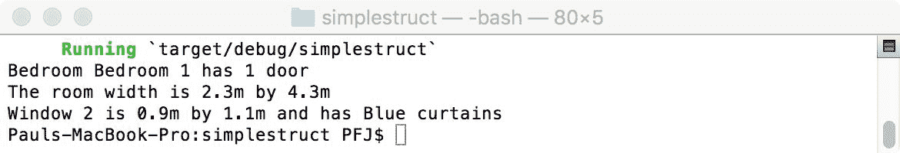
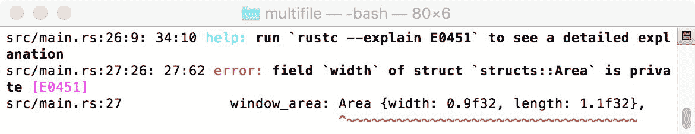
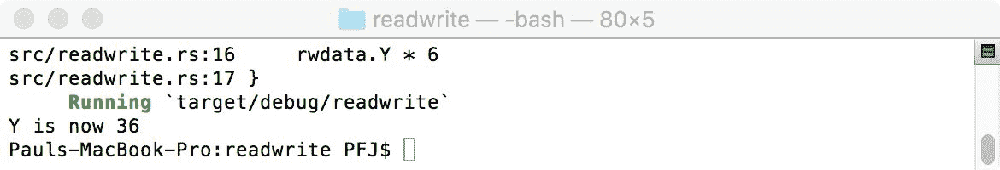
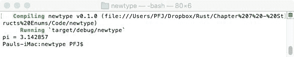

# 匹配和结构

在原始变量和泛型的基础上，我们将在第九章介绍泛型、Impl 和 Traits 中介绍，Rust 能够将不同类型的变量组合在`struct`结构中，这对于在 C 系列语言中开发的人来说可能很熟悉。还有一个相关的概念叫做**枚举**，用于创建具有交替选项的类型。如果还不够，Rust 还可以通过其强大的模式匹配代码将这些结合在一起。

在本章中，我们将涵盖以下主题：

+   学习如何使用和操作`struct`数据类型

+   理解元组和**元组结构体**混合体

+   创建和使用枚举

+   理解和应用模式匹配的基础

# 结构体 101

对于本章，我将要求你想象以下场景。我有一所房子。我的房子有一定数量的房间，每个房间都有一个名字。每个房间有一扇或多扇门和窗户，以及一块地毯（有颜色），房间有宽度和长度。我们将使用结构体和枚举来模拟所有这些。

Rust 中的结构体非常常见；它们在语言的许多方面都有应用，理解和使用它们是有用的。在房子示例中，我们将看到它们有多么有用。

# 变量，无处不在的变量

让我们看看房子，并创建一些变量来描述它以及类型。从房子开始，它可以被认为是最基本的对象。我们只需要模拟它有多少个房间：

```rs
number_of_rooms: i32 
```

让我们接下来考虑房间。

每个房间将有一些属性。假设它是一个两层楼的房子，它是楼上还是楼下？门的数量。窗户的数量。窗户的类型。窗户有窗帘吗？木地板或地毯覆盖？地毯的颜色。房间名称。是否有衣柜/壁橱？房间宽度。房间长度。你可以做得更深入，但这对现在来说已经足够了。

作为变量，它们如下所示：

```rs
is_upstairs: bool 
number_of_doors: i32 
number_of_windows: i32 
window_type: String 
has_curtains: bool // true = yes 
wood_or_carpet: bool // true = carpet 
carpet_color: String 
room_name: String 
has_wardrobe: bool // true = yes 
room_width: f32 
room_height: f32 
```

没有理由你不能将这些定义为离散变量；然而，由于它们是描述房子或房间内特征的属性，为什么不按我们已有的方式将它们分组呢？这就是`struct`类型发挥作用的地方。

# 结构体的结构

`struct` 类型由三个部分组成：关键字 `struct`、`struct` 名称以及它所包含的变量。以下命令作为例子：

```rs
struct MyStruct 
{ 
    foo: i32, 
    bar: f32, 
} 
```

需要注意的是，与常规变量定义不同，变量类型后面直接跟逗号，而不是分号。

对于我们的例子，我们可以定义两个`struct`类型，一个用于房间，一个用于房子，如下所示：

```rs
struct Room 
{  
    is_upstairs: bool, 
    number_of_doors: i32, 
    number_of_windows: i32, 
    window_type: String, 
    has_curtains: bool, 
    wood_or_carpet: bool, 
    carpet_color: String, 
    room_name: String, 
    has_wardrobe: bool, 
    room_width: f32, 
    room_height: f32, 
} 
```

因此，我们的房子如下所示：

```rs
struct House 
{ 
    room:... um... 
} 
```

虽然`struct`是一种特殊的变量类型，但它仍然是一种变量，并且作为类型；一个`struct`。因此，我们可以像对任何其他变量类型一样分配它：

```rs
struct House 
{ 
     room: Room, 
} 
```

如果我们有一个只有一个房间的房子，这没问题！我们可以定义一个房间数组，但这意味着我们将有固定数量的房间。相反，我们将将其定义为向量中使用的类型：

```rs
struct House 
{ 
     rooms: Vec<Room> 
} 
```

我们创建了两种特殊的变量类型，我们可以像声明和访问任何其他变量一样声明和访问它们。如果我们查看房间定义，我们可以进一步分解结构；但为什么我们要这样做呢？

# 小的更好

有一个论点是，你使父结构越小，管理起来就越容易。这是真的，但让我们从不同的角度来看。就目前而言，我们在这个结构中有几个可以被视为独立对象的元素。在这里，一个对象是具有其自身属性的东西。让我们看看窗户。

窗户有一个大小——宽度和高度；它有一个类型——例如，窗扇；它有百叶窗或窗帘，百叶窗/窗帘有颜色。窗户还可能有锁。它可能是一扇单窗或双窗，开启位置可能在顶部或侧面。

没有理由说只能有一个窗户。如果有多个窗户，那么我们需要多次定义我们的窗户。因此，定义我们的窗户并在主结构中将其作为向量引用更有意义。

在那之前，我们说过窗户将有大小（宽度，长度）。每个房间都将有大小，而且房子里的许多其他东西可能也是如此；因此，我们将移除大小，将其作为一个单独的`struct`。

因此，我们为窗户定义了以下`struct`：

```rs
struct Area 
{ 
    width: f32, 
    length: f32, 
} 

struct Window 
{ 
    window_area: Area, 
    window_type: String, 
    has_blinds: bool, 
    curtain_color: String, 
    has_lock: bool, 
    top_open: bool, 
    single_window: bool, 
} 
```

这在父`struct`中将转换为以下内容：

```rs
struct Room 
{  
    is_upstairs: bool, 
    number_of_doors: i32, 
    window: Vec<Window> ,
    wood_or_carpet: bool, 
    carpet_color: String, 
    room_name: String, 
    has_wardrobe: bool, 
    room_area: Area, 
} 
```

我们可以为房间中的任何其他东西继续这样做，包括家具的`struct`变量，以及可能减少地毯的大小——你如何处理它取决于你。现在，我们将保持在这个级别。

# 访问`struct`

为了访问`struct`变量，我们需要创建一个可以访问它的变量：

```rs
let mut room = Room { is_upstairs: true, 
 number_of_doors: 1, wood_or_carpet: true, carpet_color: "Red", 
 room_name: "Bedroom 1", has_wardrobe: true };
```

本节代码位于本书支持代码包的`07/simplestruct`文件夹中。

我们还没有定义该结构中的所有变量，目前这没关系，因为它们仍然需要在代码编译前定义。这个变量是可变的，因为我们想稍后更改其内容。

要访问`struct`的一个成员，我们将使用点符号。在这种情况下，我们可以有如下内容：

```rs
println!("Bedroom {} has {} door", room.room_name, 
 room.number_of_door);
```

# 定义子`struct`

我们有两种类型的`struct`——父`struct`和子`struct`。在这里，`Room`的`struct`是父`struct`，它有两个子`struct`：窗户定义和房间大小。它们非常不同，因为窗户定义是一个`Vec`类型，而另一个只是一个`struct`类型。

对于房间面积，在创建房间类型的实例时，我们可以使用以下内容：

```rs
room_area: Area {width: 2.3f32, length: 4.3f32} 
```

我们正在定义`room_area`，然后我们将定义一个内联变量，它将作为指向面积结构体的指针，最后创建房间的尺寸。这是通过以下代码片段来访问的：

```rs
println!("The room width is {}m by {}m", room.room_area.width, room.room_area.length); 
```

最后，我们必须定义窗口的向量。

这是以与我们定义任何其他向量非常相似的方式完成的，如下所示：

```rs
window: vec![  
        Window { 
            window_area: Area {width: 1.3f32, length: 1.4f32}, 
            window_type: "Main".to_owned(), 
            has_blinds: true, 
            curtain_color: "Blue".to_owned(), 
            has_lock: false, 
            top_open: true, 
            single_window: true, 
        }, 
        Window { 
            window_area: Area {width: 0.9f32, length: 1.1f32}, 
            window_type: "Small".to_owned(), 
            has_blinds: true, 
            curtain_color: "Blue".to_owned(), 
            has_lock: false, 
            top_open: true, 
            single_window: true, 
        } 
```

然后，我们将添加几行`println!`来展示我们有一些数据：

```rs
println!("The room width is {}m by {}m", room.room_area.width, room.room_area.length);  
let ref window_two = room.window[1]; 
println!("Window 2 is {}m by {}m and has {} curtains", window_two.window_area.width, window_two.window_area.length,  window_two.curtain_color); 
```

编译时，代码会产生以下结果：



我们非常快速且简单地创建了一个多级结构。

# 多文件版本

如果你查看`simplestruct`文件中的源代码，你会发现结构体在开始处，下面跟着相应的代码。这并没有什么问题，但过了一段时间，它就会变得繁琐，尤其是如果我们有很多结构和枚举时。

为了解决这个问题，我们可以将结构和代码分散在两个文件中。

然而，在我们构建代码之前，我们必须向`main.rs`文件提供某种指向结构的指针。我们可以通过以下三种方式之一来实现。最简单的是使用`include!`宏：

```rs
include!("structs.rs"); 
```

本节的内容来源位于`Chapter 7/multifile`文件夹中，该文件夹包含在此书提供的配套代码包中。

这只是将文件内容插入到宏调用的位置，因此这不是最优雅的方式，并且完全绕过了 Rust 的模块系统。所以让我们看看更好的方法。

更好的方法是使用以下代码片段来引用模块：

```rs
mod structs; 
use structs::*; 
```

这可能导致大量问题，最大的问题是保护级别，`public`或`private`。按照这种方式编译时，会出现许多错误，例如以下示例所示：



错误将指示，尽管结构体是`public`的，但其中的字段不是，因此无法访问。解决方案是将所有字段设置为`public`。

# 私有与公共字段

默认情况下，结构体中的所有字段对其创建的模块都是`private`的。这有其用途；例如，如果你想保护结构体中的某个值，你可以通过`read`/`write`函数使其仅可通过，如下例所示：

```rs
// readwrite.rs 
pub struct RWData 
{ 
    pub X: i32, 
    Y: i32 
} 

static mut rwdata: RWData = RWData {X: 0, Y: 0}; 

pub fn store_y(val: i32) 
{ 
    unsafe { rwdata.Y = val; }
} 

pub fn new_y() -> i32 
{ 
    unsafe { rwdata.Y * 6 }
} 

// main.rs 
mod readwrite; 
use readwrite::*; 

fn main() { 

        store_y(6); 
        println!("Y is now {}", new_y()); 

} 
```

本节的相关代码位于`07/readwrite`文件夹中，该文件夹包含在此书提供的配套代码包中。

当我们构建并运行这个程序时，我们会得到以下输出：



# 结构体 102

虽然我们已经定义了自己的结构体，但我们也可以访问一种称为单元结构体`struct`的结构。与我们的结构体不同，我们可以看到以下内容：

```rs
struct someStruct; 
let x = someStruct; 
```

它们后面没有任何内容——没有定义字段。这些与我们所定义的不同，那么它们是如何工作的呢？

要理解它们是如何工作的，我们需要了解元组结构体`struct`，为了理解这些，我们需要知道什么是元组。

# 元组

初始化元组有两种方式：

```rs
let tup = (3, "foo"); 
let tup: (i32, &str) = (3, "foo"); 

```

在第一行，我们让局部类型推断工作，只声明元组内的内容。Rust 会找出类型。在第二行，我们显式声明类型。

列表中的元素可以有（或没有）多少，实际上，它们是一个固定大小的有序列表。

与其他变量类型一样，只要它们包含相同类型和参数数量（arity），我们就可以将一个元组赋值给另一个。例如，以下具有相同的类型和 arity，因此可以相互赋值：

```rs
let mut change = (1.1f32, 1); 
let into = (3.14f32, 6); 
change = into; 
```

以下是不允许的，因为类型不匹配，尽管 arity 相同：

```rs
let mut change = (1.1f32, 1); 
let into = (1, 3.14f32); 
```

# 使用元组定义变量

让我们考虑以下内容：

```rs
let test = 1i32; 
```

我们创建了一个名为 `test` 的变量，该变量绑定了一个类型为 `i32` 的值为 `1`（绑定在第五章，*记住，记住*）的变量。我们如何用元组做类似的事情？到目前为止，我们已经做了以下事情：

```rs
let test = (1, 4f32); 
```

我们将 `test` 绑定到一个包含两个值的元组上：`(i32, f32)`。

# 元组索引

要获取 `f32` 值，我们必须使用元组索引。这与索引数组非常相似，但我们替换以下片段：

```rs
let t = someArray[3]; 
```

我们使用以下片段代替：

```rs
let t = test.1 
```

与数组索引一样，元组索引的范围从 `0` 到 `n-1`。

# 使用 let 进行解构

为了避免使用元组索引，Rust 有一种解构元组的方法。这与正常的 `let` 语句非常相似，但我们将一次定义多个变量名称：

```rs
let (one, two, three) = (1, 2, 3); 
```

如果左侧的名称数量与右侧的参数数量相同，Rust 将内部拆分这些名称以一次创建三个绑定。

现在我们有三个绑定，可以像访问任何其他变量一样访问它们：

```rs
let (one, two, three) = (1, 2, 3); 
println!("One = {}", one); // outputs One = 1 
```

# 元组结构体 – 两种的结合

考虑一个有三个字段的 `struct`。它将有一个 `struct` 类型的名称和三个带有其类型的字段：

```rs
struct Test 
{ 
     drink: bool, 
     number: i32, 
     price: f32 
} 
```

让我们考虑这实际上是什么，以及我们是否可以将其重写如下：

```rs
let Test: (bool, i32, f32) = (false, 4, 1.55); 
```

嗯，我们可以，但现在我们会遇到如何访问元组成员的问题。我们还会遇到将一个元组赋值给另一个元组的问题。实际上，你不能定义两个结构体，除了 `struct` 类型名称外，其他一切相同，然后将第二个 `struct` 类型赋值给第一个。

为了解决这个问题，Rust 有元组 `struct` 混合体。它包含 `struct` 类型，然后将字段作为元组分配：

```rs
struct TestOne (f32, i8, &str); 
struct TestTwo (f32, i8, &str); 
```

现在我们有了元组的灵活性，但又有 `struct` 的保护。尽管 arity 相同，结构体内部的类型也相同，但它们是不同的类型。

与常规元组一样，我们可以以相同的方式访问元组 `struct` 的成员：

```rs
let i = TestOne.1; 
```

# 单元素元组结构体

到目前为止，你可能想知道元组 `struct` 与标准 `struct` 相比有什么用途。其中一个用途是当元组 `struct` 只有一个元素时。在这里，我们能够根据元组创建一个变量。它的外观类似于解构的元组：

```rs
struct MyPi(f32);  
fn main()  
{ 
    let my_pi = MyPi(22f32 / 7f32); 
    let MyPi(pi) = my_pi;  
    println!("pi = {}", pi); 
} 
```

本节源代码位于 `07/newtype` 文件夹中，该文件夹包含本书提供的配套代码包。

编译并运行后，它会产生以下输出：



这种形式的赋值称为新类型模式；它允许创建一个与包含值不同的新类型。

# 回到类似单元的 struct

现在我们已经了解了元组和元组 `struct`，我们现在可以看看类似单元的 `struct`。这可以被认为是一个具有空元组的 `struct`，并且与元组 `struct` 一样，它定义了一个新类型。

通常，我们将它与特质一起使用，或者如果你没有数据要存储在其中。

# 枚举

如果你习惯了 C 语言，你将很熟悉枚举，例如：

```rs
enum myEnum {start = 4, next, nextone, lastone=999};  
```

这创建了一个自动填充 `next` 和 `nextone` 为起始值 `+ 1` 和 `+ 2` 的 `enum` 类型。如果第一个命名参数没有提供初始值，它将被赋予 `0` 的值，并且所有后续的值都比上一个值大 1。它们可以通过 `myEnum.nextone` 访问。

Rust 中的 `enum` 类型结构与 `struct` 类型结构非常相似，如下面的代码所示：

```rs
enum MyEnum 
{ 
     TupleType(f32, i8, &str), 
     StructType { varone: i32, vartwo: f64 }, 
     NewTypeTuple(i32), 
     SomeVarName 
} 
```

虽然与 C 语言一样，`enum` 是一个单一类型，但 `enum` 的值可以匹配其任何成员。

# 访问枚举成员

考虑到 Rust `enum` 的内容可能性，你可能认为在枚举中访问一个成员可能不是最简单的任务。幸运的是，它确实如此，因为 `enum` 变量有时被称为 *可作用域* 变量。例如，如果我们想访问成员，我们可以使用以下方法：

```rs
enum MyFirstEnum 
{ 
    TupleType(f32, i8, String), 
    StuctType {varone: i32, vartwo: f64}, 
    NewTypeTuple(i32), 
    SomeVarName 
} 

enum MySecondEnum 
{ 
    TupleType(f32, i8, String), 
    StuctType {varone: i32, vartwo: f64}, 
    NewTypeTuple(i32), 
} 

fn main()  
{ 
    let mut text1 = "".to_owned(); // text1: String 
    let mut text2 = "".to_owned(); // text2: String 
    let mut num1 = 0f32; 

    let value = MyFirstEnum::TupleType(3.14, 1, "Hello".to_owned()); 
    let value2 = MySecondEnum::TupleType(6.28, 0, "World".to_owned()); 

    if let MyFirstEnum::TupleType(f,i,s)  = value 
    { 
        text1 = s; 
        num1 = f; 
    } 

    if let MySecondEnum::TupleType(f,i,s) = value2 
    { 
        text2 = s; 
    } 

    println!("{} {} from the {} man", text1, text2, num1) 
} 
```

本节代码位于 `07/enumscope` 文件夹中，该文件夹包含本书提供的配套代码包。

变量 `value1` 和 `value2` 分别作用域于 `MyFirstEnum` 和 `MySecondEnum`。当编译时，我们将看到以下输出：


# 你应该问的两个问题

这段代码有点让人挠头。我们当然应该能够使用类似以下代码的东西？

```rs
let value = MyFirstEnum::TupleType(3.14, 1, "Hello".to_owned()); 
```

然后使用 `value.2` 在 `println!` 语句中直接获取字符串部分，而不是使用 `if let` 构造？

我们不能这样做的原因是 `enum` 变体不是它们自己的类型，所以一旦我们创建了前面的值，上面的值就会立即丢失。

第二个问题是：`if let` 构造是什么？

在 Rust 中，`if let` 被用作执行某些类型模式匹配的一种方式。

# 模式和匹配

如我们所见，Rust 包含许多非常强大的功能。我们现在将考虑两个经常看到的，然后回过头来检查我们如何使用 `if let` 构造。

# 匹配

让我们看看一个非常不愉快的代码块，然后分析它的含义：

```rs
fn my_test(x: i32) -> String 
{ 
    if x == 1 
    {   
        return "one".to_owned(); 
    } 
    else if x == 2 
    { 
        return "two".to_owned(); 
    } 
    else if x == 3 
    { 
        return "three".to_owned(); 
    } 
    return "not found".to_owned(); 
} 
```

该代码接受一个 `i32` 参数并测试它等于什么。如果条件满足，将返回该数字的一些文本；否则，返回 `"not found"`。

这是一个简单的例子，但想象一下如果你正在测试 10 个不同的条件；`if-else` 构造将变得很丑陋。

如果我们在 C 中，我们可以使用 `switch`/`case`，Rust 也可以做类似的事情，但关键字是 `match`。如果我们使用 `match` 表达式，我们的函数将如下所示：

```rs
fn my_test(x: i32) -> String 
{ 
    let mut t = "".to_owned(); 
    match x 
    { 
        1 => t = "one".to_owned(), 
        2 => t = "two".to_owned(), 
        3 => t = "three".to_owned(), 
        _ => t = "not found".to_owned() 
    } 
    return t; 
} 
```

在这种情况下，当 `x` 与 `match` 表达式内的值匹配时，`t` 被赋值。如果没有匹配（`_ => ...`），则 `t` 被设置为 `未找到`。`match` 中必须有一个 `_` 通配符模式情况。这是由于 Rust 强制执行详尽性检查。换句话说，直到遇到 `_` 通配符之前，Rust 假设必须还有其他值尝试匹配。

# 让我们真正使函数简单

虽然前面的例子相当紧凑，但我们可以通过将 `match` 用作表达式来进一步减少代码的足迹。

如果你习惯了 C# 中的 `?`，你将熟悉以下构造：

```rs
var t = SomeCondition == 3 ? "three" : (SomeCondition == 4 ? 
 "four" : "not three or four");
```

这意味着我们可以将 `t` 赋值为 `three`，如果 `SomeCondition == 3`，否则 `if SomeCondition == 4`，`t = four`。如果这会传递，我们可以将 `t` 设置为 `not three or four`。

这可能会变得混乱。Rust 可以做到同样的事情，但更加干净利落。

在原始代码中，我们有以下内容：

```rs
let mut t = "".to_string(); 
match x 
{ 
```

我们可以将 `match` 用作表达式来设置要返回的值：

```rs
let t = match x 
{ 
    ... 
}; 
return t; 
```

或者，更简单地说，只需返回 match 的结果：

```rs
return match x 
{ 
    ... 
}; 

```

或者更简单地说，当我们记住在 Rust 中，如果一个块没有使用 `;`，它会返回其最后一个表达式的结果：

```rs
fn my_test(x: i32) -> String { 
    match x { 
        1 => "one".to_owned(), 
        2 => "two".to_owned(), 
        3 => "three".to_owned(), 
        _ => "not found".to_owned() 
    } 
}
```

# 使用枚举与 match

我们在本章中已经看到，枚举有时很难处理。幸运的是，我们可以在枚举上使用 `match`：

```rs
enum MyFirstEnum 
{ 
    TupleType(f32, i8, String), 
    StructType {varone: i32, vartwo: f64}, 
    NewTypeTuple(i32), 
    SomeVarName 
} 
fn tuple_type(v: f32, c: i8, st: String) {//code} 
fn struct_type(v1: i32, v2: f64) {//code} 
fn new_type_tuple(n: i32) {//code} 
fn process_varname() {//code}  

fn match_enum_code(e: MyFirstEnum) 
{ 
match e { 
   MyFirstEnum::SomeVarName => process_varname(), 
   MyFirstEnum::TupleType(f,i,s) => tuple_type(f,i,s), 
   MyFirstEnum::StructType(v1,v2) => struct_type(v1,v2), 
   MyFirstEnum::NewTypeTuple(i) => new_type_tuple(i) 
}; 
} 
```

你会注意到在这个例子中，没有包含 `_`。这是因为我们明确地匹配了枚举的所有可能选择，所以不需要一个通配符情况。例如，如果我们遗漏了 `NewTypeTuple`，代码将需要包含一个通配符：

```rs
fn match_enum_code(e:MyFirstEnum) 
{ 
match e { 
   MyFirstEnum::SomeVarName => process_varname(), 
   MyFirstEnum::TupleType(f,i,s) => tuple_type(f,i,s), 
   MyFirstEnum::StructType(v1,v2) => struct_type(v1,v2), 
   _ => return  // breaks out of the match 
}; 
} 
```

# 使用 match 忽略参数

在 `match` 构造中忽略参数是完全可能的。以下是一个 `struct` 的例子：

```rs
struct Test  
{ 
    answer: i32, 
    real_answer: i32, 
    score: i32,
} 
```

我们可以在 `match` 构造中使用这个 `struct`，就像使用任何其他类型一样。然而，我们想要忽略 `real_answer` 之后的任何内容。为此，我们将使用 `..` 操作符。我们的 `match` 将看起来像这样：

```rs
fn match_test(t: Test) 
{ 
    match t 
    { 
        Test {answer: Question::MyAnswer, real_answer: 
         Question::RealAnswer, ..} => {...} 
    } 
} 
```

我们还可以将 `_` 用作参数（我们期望一个值，但我们不在乎它是什么）：

```rs
fn match_test(t:Test) 
{ 
    match t 
    { 
        Test {answer: Question::MyAmswer, real_answer: 
         Question::RealAnswer, score:_} => {...} 
    } 
} 
```

你可以欣赏到 `match` 构造的强大功能，但让我们通过模式来看看它的实际应用。

# 传递模式

假设我们想要在 C 中以相同的方式有一个传递构造：

```rs
switch(foo) 
{ 
    case 1: 
    case 2: printf("1 and 2\n"); 
            break; 
    case 3: printf("3\n"); 
            break; 
} 
```

我们可以在 Rust 中使用 `|` 模式来做这件事，如下所示：

```rs
match foo  
{ 
    1 | 2 => println!("1 and 2"), 
    3 => println!("3"), 
    _ => println!("anything else") 
} 
```

# 范围

类似于使用 `|`，我们可以在一系列值上匹配，如下所示：

```rs
match foo 
{ 
    1 ... 10 => println!("Value between 1 and 10"), 
    _ => println!("Value not between 1 and 10") 
} 
```

我们可以用类似的方式与 `char` 一起使用，如下面的例子所示：

```rs
match char_foo 
{ 
    'A' ... 'M' => println!("A - M"), 
    'N' ... 'Y' => println!("N - Y"), 
    'Z' => println!("Z"), 
    _ => println!("something else") 
} 
```

# 在 match 模式中创建绑定

有时，在`match`构造中创建一个临时变量非常有用，并将模式的结果绑定到它。这可以通过使用`@`来完成，如下所示：

```rs
match test 
{ 
    e @ 1 ... 10 => println!("the value is {}", e), 
    _ => println!("nothing doing") 
} 
```

这尝试将模式`1`到`10`与`test`的值进行匹配。如果匹配成功，值将被绑定到`t`，然后我们可以像处理任何其他变量一样对其进行操作。

我们还可以使用类似于以下示例中的 fall through 构造来绑定到变量：

```rs
match test 
{ 
    t @ 1 ... 5 | t @ 10 ... 15 => println!("our value for t = {}", t), 
    _ => println!("dunno!") 
} 
```

# 让我们在其中加入一个 if 语句

我们可以在`match`模式中包含一个`if`语句，如下所示：

```rs

fn testcode(t: u8) 
{ 
    match t 
    { 
        1 | 2 if t != 1 => println!("t was not one"), 
        1 | 2 if t != 2 => println!("t was not two"), 
        _ => println!("") 
    } 
} 
```

# 使用复合类型与 match 结合

复合类型是一种包含许多不同类型的类型——在这里，`struct`可能是最简单的例子。以下也适用于枚举和元组。

我们可以用`struct`模式匹配，就像我们可以匹配任何其他类型的模式一样，以下是一个示例：

```rs
struct MyStruct 
{ 
    a: i32, 
    b: i32 
} 

fn derp(){ 
    let mystruct=MyStruct{a:1, b:2}; 
    match mystruct { 
        MyStruct{a, b} => println!("matched the structure"), 
        _ => println!("didn't match the structure") 
    } 
} 
```

如匹配部分所述，我们可以使用`..`在`struct`模式匹配中忽略参数，或者简单地使用`_`丢弃它们。

# 然后回到 if let

你现在可能已经意识到，实际上`if let`是一个以稍微不同的方式编写的`match`构造。

`match`构造如下：

```rs
match testmatch 
{ 
    1 => println!("1"), 
    _ => println!("not 1") 
} 
```

`if let`版本如下：

```rs
if let 1 = testmatch { 
    println!("1"); 
} 
 else 
 { 
    println!("not 1"); 
} 
```

# 摘要

在本章中，我们看到了 Rust 如何处理一些相当复杂的数据类型，这些数据类型允许我们创建包含许多不同类型的类型，以及处理这些复合类型通常可以是一个相对无痛的过程。我们还注意到了使用枚举时的陷阱。

我们已经探讨了 Rust 对模式和匹配的结构化和灵活方法，以及简单性为开发者提供的强大功能。

在下一章中，我们将探讨一些需要相当多的实践才能理解，甚至更难正确处理的内容——Rust 的生命周期系统。
