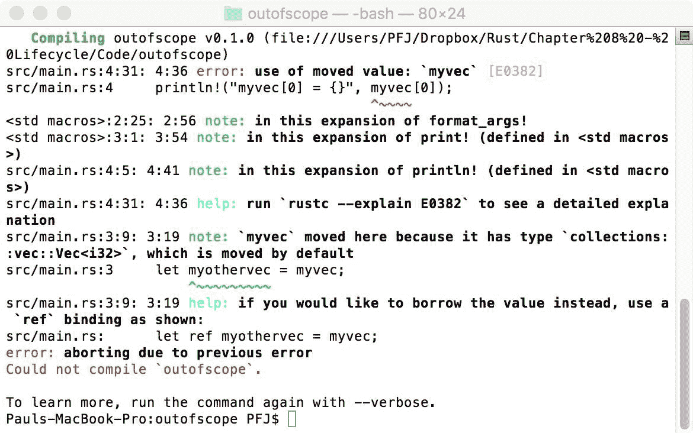
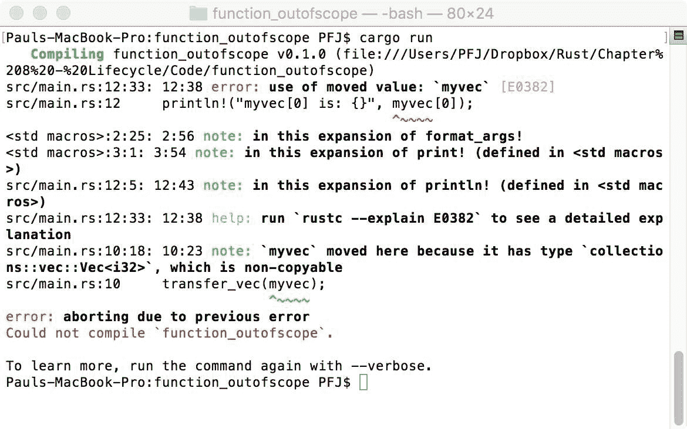
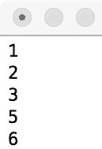
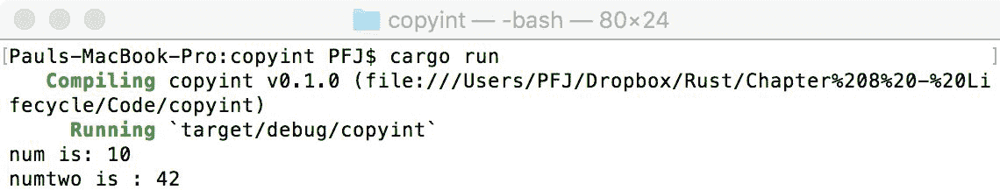
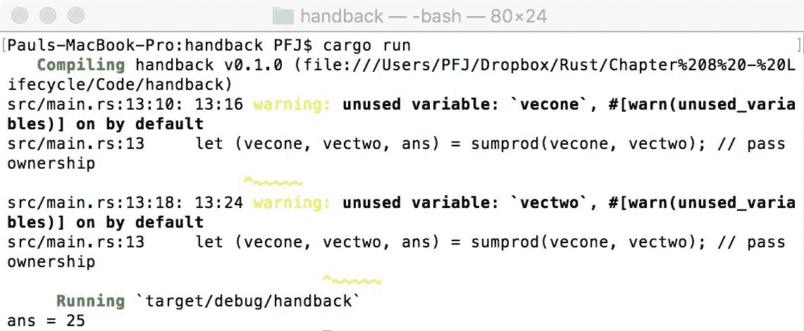
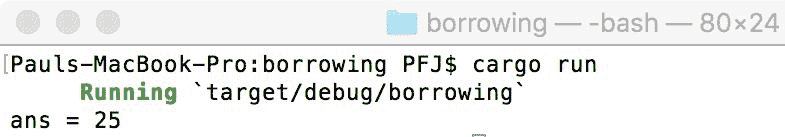
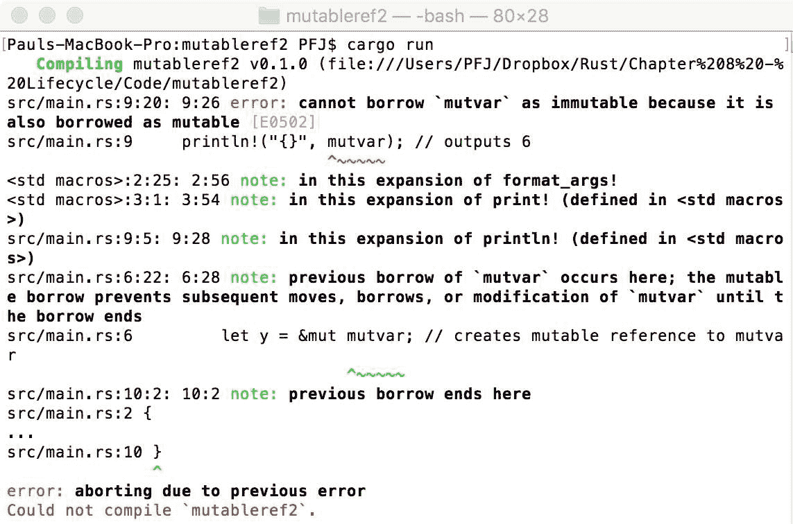
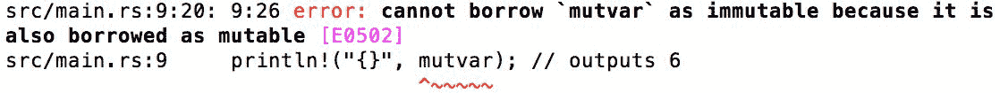
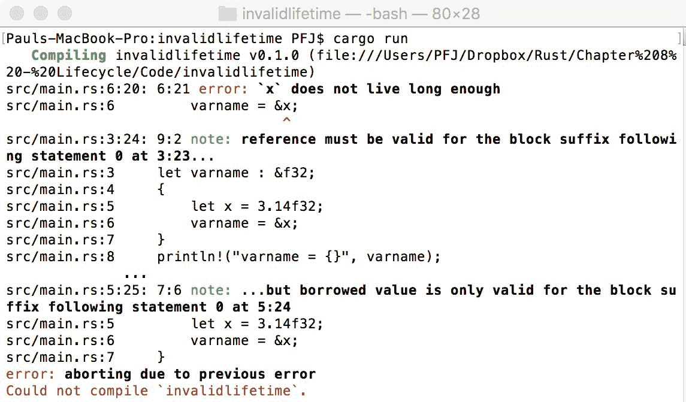
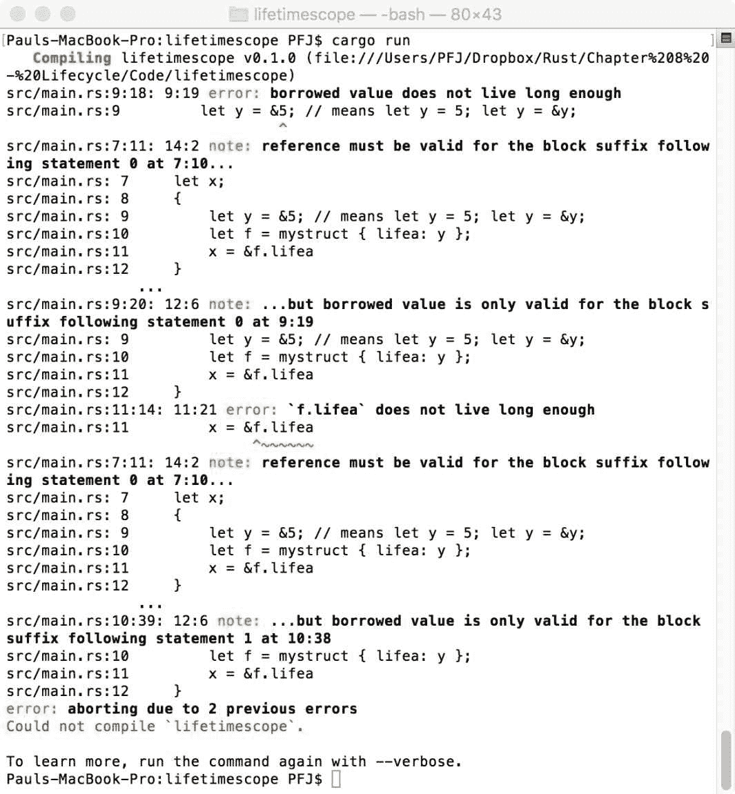

# Rust 应用程序的寿命

如我们所见，Rust 是一种非常稳定的语言。它也可以被描述为一种内存安全的语言，因为在代码编译时，编译器会测试代码以确保不会出错，例如访问数组外部或释放内存两次。

这完全归功于 Rust 遵守三个关键规则——所有权、引用（或借用，更常见的是借用）和应用寿命。

在本章中，我们将讨论并看到这三个关键方面是如何协同工作以确保你的 Rust 应用程序始终表现良好的。它们如下：

+   所有权

+   借用

+   寿命

# 它们是什么？

简而言之，我们可以用这些术语来考虑这三个方面。

# 所有权

当我们想到所有权时，不可避免地会想到占有。我现在正在用我的 MacBook Pro 写这篇文本。它不属于任何财务协议，也没有被盗、借用或租赁，因此它的所有权是我的。

# 借用

如果我出售或丢弃我的电脑，我将把所有权释放给下一方，或者给回收设施。如果我的儿子有一张我想用的 DVD，我会从他那里借来——他没有把所有权释放给我，只是把它借给我一段有限的时间。他会保留记录或引用，表明我有它。

# 寿命

这是指某物持续的时间，不幸的是，几乎没有什么东西能永远持续。一旦应用或所有权结束，从获得所有权到移除所有权的时间，包括借用的东西，都被认为是该物体或过程的寿命。

让我们更详细地考虑这些方面。

# Rust 中的所有权

为了欣赏所有权，我们需要稍微偏离一下编译抽象和一个非常常见的陷阱。

# 抽象

任何 Rust 应用程序优于其他语言应用程序的一个方面是它们真的很快且内存安全。这归功于一个称为**零成本抽象**的理想。抽象是将低级构造提升到更高层次的一种方式，使其更容易、更安全、更可靠。这些在跨平台库中很常见，其中用户界面有一个共同的抽象层，因此开发者只需说`var n = new Label {Text = "Hello"};`来创建一个用于 UI 的标签，而不需要了解底层发生了什么。

通常，抽象会导致某种形式的惩罚，这意味着使用抽象的代码会比相应的低级代码运行得更慢或使用更多的内存。在 Rust 的情况下，这些零成本抽象意味着在计算机资源方面，它们不会造成任何惩罚。这通常在编译期间完成；编译器生成抽象并执行它们。一旦完成，编译器将生成最佳可能的代码。

这确实有一个问题——编译器会反对开发者认为完全没问题的一段代码。这是因为，作为人类，我们的思维方式与语言不同，所以我们认为正确的拥有权并不是 Rust 所认为的。幸运的是，随着时间的推移，你使用 Rust 越多，这个问题就会变得越小。

# 拥有权的起源

让我们先考虑一个非常简单的代码片段，以帮助你理解它是如何工作的。我们之前已经多次看到过类似的情况：

```rs
fn my_function() 
{ 
    let mypi = 3.14f32; 
} 
```

当`my_function`被调用（进入作用域）时，Rust 会在栈上分配内存来存储这个值。当函数结束时（超出作用域），Rust 会自动清理以释放`mypi`使用的任何内存。

向量，或者任何使用堆的其他东西，以类似的方式工作：

```rs
fn my_second_function() 
{ 
    let myvec = vec![1.1f32, 2.2f32, 3.14f32]; 
} 
```

如果你还记得第五章中的“记住，记住”，向量需要在堆和栈上都有内存，可以这么理解：

| 函数名 | 地址 | 变量名 | 值 |
| --- | --- | --- | --- |
| `heap` | `heap_posn - 1` |  | `base_of_vecs` |
|  | `heap_posn - 2` |  | `Vec[1]` |
| `my_second_function` | `0` | `myvec` | `heap_posn - 1` |

这次，当`my_second_function`超出作用域时，不仅栈上的位置被清除，而且由`myvec`指向的堆上的连续位置也会被清除。

我在这里给出了两个变量的例子，这是有原因的——处理方式不同；向量接受一个泛型参数，这些处理方式与标准变量类型不同。

虽然事情并不像这样简单，但要真正理解拥有权下事物是如何运作的，我们确实需要从基本层面来考虑问题。

# 变量绑定

让我们考虑变量的创建：

```rs
let myvar = 10i32; 
```

我们创建了一个名为`myvar`的非可变变量。然后我们说这个变量有一个值为`10`的 32 位整数。换句话说，如果这是在 C 语言中，它将是以下这样：

```rs
const int myvar = 32; 
```

我们在这里实际上创建了一个变量名和值的绑定。我们说`10i32`绑定到`myvar`。绑定在拥有权方面非常重要。Rust 有一条规则，即你只能将某个东西绑定到另一个东西一次。

让我们考虑以下代码片段，因为它展示了在零成本抽象级别时为什么会出现问题：

```rs
let myvec = vec![1i32, 2i32, 3i32]; 
let myothervec = myvec; 
```

通常，作为一个开发者，你会看到`myvec`绑定到一个包含三个元素的`i32`类型的向量，然后你会假设`myothervec`只是第一个向量的一个副本，就像在 C、C++和 C#中一样；这就是它的意思。实现方式可能不同，但含义是相同的。

问题在于，在 Rust 中，这意味着我首先创建了 `myvec`。当我然后说 `myothervec = myvec` 时，我实际上是在告诉编译器，`myvec` 绑定的所有权现在已经转移给了 `myothervec`，因此 `myvec` 已经超出作用域，如果（作为一个开发者）我尝试对 `myvec` 做任何事情，那么编译器将失败构建。

以下截图展示了这一点（可以在 `Chapter 8/outofscope` 中找到）。当你尝试构建它时，你会得到以下结果：



当一个函数接受所有权时，我们将会遇到类似的问题。

以下内容可以在 `08/function_outofscope` 中找到：

```rs
fn transfer_vec(v: Vec<i32>)  
{ 
    println!("v[0] in transfer_vec = {}", v[0]); 
} 

fn main()  
{ 
    let myvec = vec![1i32, 2i32, 3i32];  
    transfer_vec(myvec);  
    println!("myvec[0] is: {}", myvec[0]); 
} 
```

在第一眼看来，我们没有看到所有权的明显转移，通常，当你将一个变量传递给一个函数时，你并不真正将其视为一个转移。在 Rust 中，直接将变量传递给另一个函数与我们的第一个例子相同：所有权从 `myvec` 释放并传递给函数。

为了证明这一点，尝试编译代码，你将得到以下输出：



换句话说，这与之前相同的错误。

# 栈和堆变量

要理解我们为什么会遇到这个问题，我们需要深入理解 Rust 的工作方式，也就是说，在内存级别。

让我们从我们的变量开始：

```rs
let myvar = 32i32; 
```

正如我所说的，在我们的心中，我们将创建一个 `myvar` 变量，类型为 `i32`，并将其绑定到值 `32`。另一方面，Rust 的做法不同。

首先，它确定我们需要在栈上为大小为 `i32` 的值腾出空间。

接下来，它将 `32` 的值复制到栈上分配的空间。

最后，它将绑定绑定到栈分配块的地址与变量名绑定。

换句话说，这与我们在心中所做的是完全相反的。

让我们看看当我们创建另一个绑定时会发生什么，就像这样：

```rs
let myvartwo = myvar; 
```

编译器将绑定移动到 `myvar` 在栈上的数据位置，然后说那个位置（和数据）属于 `myvartwo`。绑定将被转移。那么 `myvar` 会发生什么？Rust 不允许事物 *悬空* 或允许信息绑定到两个不同的对象。一旦绑定被转移，`myvar` 就会被移除。

如果绑定指向堆中的某个东西，也会发生相同的事情。因此，当我们考虑 `let myvec = vec![1i32, 2i32, 3i32];` 时，我们知道这将如何工作。编译器知道它需要在堆上分配足够的空间，以容纳三个 `i32` 类型的元素。这些值被复制到位置，连续内存块的基础地址被绑定到 `myvec`。

现在，让我们转移所有权：

```rs
let vectwo = myvec; 
```

现在，`vectwo` 是堆上向量的唯一可用的绑定，而 `myvec` 被无效化。

# 这为什么很重要？

在 C# 等语言中，一个非常常见的错误是当你有以下代码时：

```rs
var myList = new List<int>{1,2,3,4,5,6}; 
var dupVar = myList; 
dupVar.Remove(4); // 4 
foreach(var n in myList) 
    Console.WriteLine(n); 
```

从这个输出中，我们可能得不到预期的结果，如下所示：



可能会预期，当我们从 `dupVar` 中移除了重复项后，`myList` 变量仍然应该包含它最初设置的所有数字。在这段代码中，发生的情况是 `dupVar` 被称为复制指针——我们有两个变量绑定到栈上的同一个指针。虽然这看起来可能不是什么大问题，但我们有两个变量名能够改变数据。这会让很多人感到困惑，并导致比它值得的更多内存和内容错误。

由于 Rust 只允许每个块有一个指针，我们不能有类似这种情况。一旦所有权被转移，原始的绑定名称就不再可以访问。

# Copy 特性

本节代码可以在 `08/copyint` 和 `08/copyf32` 文件夹中找到。

Rust 确实有一种创建原始数据副本的方法：`Copy` 特性（特性将在第十章创建自己的包中介绍），所有原始类型都实现了 `Copy`。如果我们有类似 `let varone = 1i32;` 或 `let vartwo = varone;` 这样的代码，那么 `i32` 是一个原始类型，`vartwo` 变量将包含 `varone` 的副本。两者都将有自己的栈分配，而不是 `vartwo` 指向 `varone`。所有权不会改变；值被复制并绑定到新变量。

本节代码可以在本书提供的配套代码包中的 `08/copyint` 和 `08/copyf32` 文件夹中找到。

因此，我们可以这样编写代码：

```rs
fn do_something(number: i32) -> i32  
{ 
    number + 32 
} 

fn main()  
{ 
    let num = 10i32;  
    let numtwo = do_something(num);  
    println!("num is: {}", num); 
    println!("numtwo is : {}", numtwo); 
} 
```

当编译上述代码时（`numone` 是一个 `i32` 值，它是一个原始类型，所以在传递给 `do_something` 并返回 `i32` 到 `numtwo` 时会复制自身）将产生以下输出：



`copyf32` 示例展示了相同的 `Copy` 特性在 `f32` 原始类型上的应用。

必须有一种方法可以绕过这个问题。

从某种意义上说，我们已经在本书中的许多例子中看到了答案——我们归还了所有权；然而，正如以下代码块所示，这可能会变得有些混乱：

```rs
fn sumprod(v1: Vec<i32>, v2: Vec<i32>) -> (Vec<i32>, Vec<i32>, i32) 
{ 
    let sum = v1.iter().fold(0i32, |a, &b| a + b); 
    let product = v2.iter().fold(1i32, |a, &b| a * b); 
    return (v1, v2, sum + product); // return ownership 
} 

fn main()  
{ 
    let vecone = vec![2,3,5]; 
    let vectwo = vec![3,5];  
    let (vecone, vectwo, ans) = sumprod(vecone, vectwo); // pass ownership  
    println!("ans = {}", ans); 
} 
```

上一段代码将产生以下输出：



本节代码可以在本书提供的配套代码包中的 `Chapter8/handback` 文件夹中找到。

幸运的是，Rust 提供了一种更整洁的方式来传递所有权。我们不是给予所有权，而是借用所有权。

# Rust 中的借用

在第二章 *变量* 中，我们提到了一个称为引用的东西，它被描述为对某个内存位置的指针的副本。这是 Rust 中借用的一部分含义。

在我们前面的例子中，我们可以利用借用。我们为其编写的代码如下：

```rs
fn sumprod(v1: &Vec<i32>, v2: &Vec<i32>) -> i32 
{ 
    let sum = v1.iter().fold(0i32, |a, &b| a + b); 
    let product = v2.iter().fold(1i32, |a, &b| a * b); 
    return sum + product;  
} 

fn main()  
{ 
    let vecone = vec![2,3,5]; 
    let vectwo = vec![3,5];  
    let ans = sumprod(&vecone, &vectwo);  
    println!("ans = {}", ans); 
} 
```

本节代码可以在本书配套代码包中的 `08/handback` 文件夹中找到。

我们将不再传递所有权，而是将向量的引用传递过去。当编译时，我们将得到以下结果：



# 借用不可变性

如果我们回顾本章的开头，我描述了借用就像是从我儿子那里借 DVD。当我拿到 DVD 时，我不能改变它，因为我的儿子期望得到同样的 DVD。

对于 Rust 来说，引用不能改变，因为它们是不可变值。如果你这么想，这很有意义。让我解释一下。

我创建了一个 `Vec<T>` 数组类型，比如说，有八个值长（值是什么或者它们的类型无关紧要）。当堆和栈之间的绑定建立时，它将具有特定的类型。如果我们允许引用改变向量，我们就会遇到 C#示例中的同样问题，因此不能保证保证，Rust 编译器将失败构建。为了确保保证得到保持，Rust 简单地说你不能改变所借用的值。

# 可变借用

如果我们用借 DVD 的比喻来说，这更像是一个可写的 DVD 而不是预先录制的 DVD。

这里，我们使用了一个可变引用，我们必须小心如何使用它们。

本节代码位于本书提供的配套代码包中的 `08/mutableref1` 和 `08/mutableref2` 文件夹中。

在我们的第一个例子 `(mutableref1)` 中，我们将创建一个变量，引用，做些事情，然后得到一个新的值：

```rs
fn main()  
{ 
    let mut mutvar = 5; 
    { 
        println!("{}", mutvar); // outputs 5 
        let y = &mut mutvar; // creates the mutable ref to mutvar 
        *y += 1; // adds one to the reference and passes it back in to mutvar 
    } 
    println!("{}", mutvar); // outputs 6 
} 
```

这里重要的行是 `*y += 1`; 并且特别地，这里的 `*`，因为它意味着我们正在直接改变引用指向的内存位置上的值。在处理与内存相关的事情时，必须非常小心。

第二个需要注意的重要点是，我们在可变引用中使用了括号。去掉它们，一切都会失败（`mutableref2`）：



重要的行是错误的输出；它表示你不能同时以可变和不可变的方式借用相同的项。这就像说你可以同时借用可以改变和不能改变的东西！简直是胡说八道。这是借用有规则的结果。

# Rust 的借用规则

在借用时必须遵守两条规则，如下所示：

+   你所借用的东西不能比原始的存活时间更长

+   你可以有下面以下几种借用类型，但绝不能同时进行：

    +   一个（或多个）类型为 `&T` 的引用到资源

    +   只有一个可变引用

第一条规则是有意义的：你不能让引用比它来的地方存活时间更长，因为一旦它来的地方出了作用域，它就会被销毁，一旦销毁，你到底借了什么？

第二条需要更多思考为什么它是这样的，以及 Rust 试图实现什么。

在这种情况下，Rust 确保发生了一个称为**竞争条件**的情况（如果你习惯于编写多线程应用程序，你将已经理解这些）。

在这里，Rust 试图防止两个引用同时尝试访问同一内存点。换句话说，Rust 试图防止同步错误。

对于不可变引用，你可以有任意多个，因为引用永远不能被写入。对于可变引用，Rust 通过只允许一个引用有效来防止问题。

考虑到这一点，我们可以使用这些规则来修复`mutableref2`中的代码，以去掉可变引用周围的`{}`花括号吗？

# 解决问题

让我们再次检查这段代码（我已经删除了这里不需要的原始内容）：

```rs
let mut mutvar = 5; 
let y = &mut mutvar;  
*y += 1;  
println!("{}", mutvar); 
```

当我们尝试编译时，编译器会返回以下输出：



我们打破了第二个规则——你只能有一个可变引用或多个不可变引用，永远不能两者都有。

我们该如何解决这个问题？让我们回顾一下原始的`mutableref1`：

```rs
fn main()  
{ 
    let mut mutvar = 5; 
    { 
        println!("{}", mutvar); // outputs 5 
        let y = &mut mutvar; // creates mutable reference to mutvar 
        *y += 1; // adds 1 and passes result back in to mutvar 
    } 
    println!("{}", mutvar); // outputs 6 
} 
```

这行得通，但为什么？

# 考虑作用域

这段代码实际上发生了什么，是我们为代码的借用部分创建了一个新的作用域，在到达最终的`println!`之前，将其传递回`mutvar`。换句话说，作用域发生了变化；因此，当在`println!`中遇到`mutvar`时，没有发生借用，我们只是显示绑定到`mutvar`变量的内容。

如果我们要移除花括号，我们必须确保在通过`println!`输出之前，借用已经完成

# 这一切都是为了你自己的好处

这些编译器规则是为了帮助开发者。它们防止了在其他语言中常见的问题，最大的问题是变量被销毁后写入，或者做一些愚蠢的事情，比如尝试在遍历向量的循环中修改向量：

```rs
fn main()  
{ 
    let mut myvec = vec![5i32, 10i32, 15i32, 20i32, 25i32, 30i32]; 

    for i in &myvec 
    { 
        println!("i = {}", i); 
        myvec.push(35i32);  
    } 
} 
```

本节的内容在本书的支持代码包的`08/invaliditerator`文件夹中，第五章，*内存管理*中有进一步的讨论。

这显然永远不会工作。如果你想想，我们有一个循环，它以`myvec`作为参数，然后在循环中向向量中添加内容，所以循环永远不知道一个保证，因为那个保证不存在：迭代器计数。它不会很好地构建，因为我们打破了第二个借用规则。

# 生命周期

让我们考虑另一段不会工作的代码：

```rs
let varname: &f32; 
{ 
    let x = 3.14f32; 
    varname = &x; 
} 
println!("varname = {}", varname); 
```

当尝试构建这段代码时，编译器会如下抱怨：



你可能还记得，我们在第四章，*条件、递归和循环*中看到了类似的代码片段：

```rs
let y: &f32; 
{ 
    let x_squared = x * x; 
    let x_cube = x_squared * x; 
    y = &(x_cube + x_squared + x); 
}; 
println!("Y = {}", *y); 
```

在第五章，*内存管理*中，我们解释了为什么前面的代码不会工作。

我们正在将 `y` 赋值给一个仅在小型作用域中存在的变量的值，然后尝试访问该值，这导致了未定义的行为。正如我们所见，Rust 编译器会尽一切可能防止这种错误。在这种情况下，编译器会跟踪每一个引用，如果引用的持续时间超过了正在使用的指针，则无法构建。

我们在这里遇到了相同的情况：`varname` 在 `x` 之前声明；因此，它的生命周期比 `x` 更长，这就是导致错误的原因。

前面的代码是一个生命周期的简单演示，但它并不像那样简单。

# 神话般的银行账户

为了演示一个更复杂的问题，让我们考虑一个神话般的银行账户：

+   我被合法地赋予了访问银行账户的权限

+   我决定让我的朋友能够访问它

+   在一段时间之后，我决定我不再想访问这个账户，并移除了我的访问权限

+   然后，我的朋友尝试使用这个账户

当我的朋友来使用这个账户时，他无法这样做，因为我所拥有的，并且传递给他的引用不再存在。他正在尝试 *use after free*（在编程术语中），在这里他被称为 **悬垂引用**。

这听起来有些牵强，但在开发术语中，它发生的频率比你可能给予的信用要高得多。

# 生命周期变量 - '

Rust 中有两种生命周期类型——隐式和显式。我们已经多次看到了隐式函数：

```rs
fn myfunction(pi: &f32) 
{ 
    // do something 
} 
```

函数的生命周期是代码在括号内存在的时间长度，一旦被调用。

我们还有一个显式生命周期，用 `'` 符号在名称之前表示：

```rs
fn expfunction<'a>(pi: &'a f32) 
{ 
    // do something 
} 
```

然而，`'a` 究竟意味着什么？

这意味着，对于 `a` 的生命周期。`expfunction` 后的 `<>` 表示该函数正在接受一个泛型参数（这些将在第九章 *泛型和特质* 中变得清晰），但它意味着一个类型。如果你考虑 `Vec`，它实际上是 `Vec<T>`。当我们创建一个 `f32` 类型的向量时，`T` 变成了 `f32`，因此在编译时它是 `Vec<f32>`。在 `expfunction` 的情况下，`T` 是 `'a`，因此括号内的类型也必须是 `'a`。

如果我们在 `<>` 中有另一个参数，我们会有 `<'a, 'b>(f: &'a f32, g: &'b i32)`，依此类推。

# 其他类型的生命周期

我们通常会看到使用 `struct` 和 `impl` 等方式表达生命周期（`impl` 和 `impl` 生命周期在第十章 *匹配和结构体* 中处理）。你还可以使用多个生命周期。

# 结构体中的生命周期

如第七章 *结构体* 所见，Rust 中的结构体有特殊用途，它们也可以包含多个类型，并且可以根据需要扩展，使用所需的参数数量。以下代码片段作为例子：

```rs
struct MyStruct 
{ 
    a: i32, 
    b: f32, 
    c: bool, 
} 
```

以下代码创建了一个名为`MyStruct`的`struct`，具有三个属性，分别称为`a`、`b`和`c`。当`mystruct`的实例进入作用域时，`struct`内的元素可以轻松访问。如果我们想让`struct`能够接受一个生命周期变量，我们必须明确要求`struct`接受该生命周期变量，并将其分配给一个元素，如下面的代码所示：

```rs
struct<'a> MyStruct 
{ 
    lifetimevar: &'a f32, 
    nvar: i32, 
} 
```

在其中包含生命周期变量，我们可以确保结构体不会超出它传递给`f32`引用的生命周期。

# 多个生命周期

这两种方法都可以在函数内定义多个生命周期：

```rs
fn mylifetime<'a>(life: &'a i32, universe: &'a i32) -> &'a i32 
{ 
     // do something, return an i32 value 
} 
```

我们有两个生命周期参数的参数被`i32`值转换，并返回一个`i32`值。

我们也可以传入多个生命周期，如下所示：

```rs
fn mymultilife<'a, 'b>(foo: &'a f32, bar: &'b i32) 
{ 
    // do something 
} 
```

# 总是考虑作用域

与借用一样，我们必须考虑作用域以确保事情能够正确工作。

例如，以下代码片段将无法工作：

```rs
struct MyStruct<'a> { 
    lifea: &'a i32, 
} 

fn main()  
{ 
    let x;  
    {   
        let y = &5; // means let y = 5; let y = &y; 
        let f = MyStruct { lifea: y };  
        x = &f.lifea  
    }  
    println!("{}", x);  
} 
```

本节代码位于随本书提供的支持代码包中的`08/lifetimescope`文件夹中。

起初可能不明显为什么这不应该工作。从作用域的角度来看，`f`是在`y`之后创建的，因此位于`y`的作用域内，而`y`是在`x`的作用域内创建的。或者不是吗？

当代码构建时，我们将得到以下输出：



错误将是`x = &f.lifea`，因为我们试图将即将超出作用域的某个值赋给一个值。

# `struct`

许多语言的一个有用方面是拥有一个在整个应用程序生命周期中存在的变量。虽然一些纯粹主义者认为拥有一个持续整个应用程序生命周期的变量不是好的实践，但他们无法否认它有其用途。

在 Rust 中，我们也可以使用一个特殊的`struct`类型，一个生命周期`struct`来完成这个操作：

```rs
let version: &'static str = "v1.3, 22nd May 2016";  
```

本地类型推断允许我们在不是全局的情况下省略类型，因此这在函数内部等同于上面的代码：

```rs
let version = "v1.3, 22nd May 2016"; 
```

# 输入和输出生命周期

虽然不常被考虑，但有两种生命周期：输入（进入函数）和输出（离开函数）。

# 仅输入

以下代码片段是一个具有输入生命周期的函数示例：

```rs
fn inponlyfn<'a>(inp: &'a as i32) {...} 
```

# 仅输出

以下代码片段是一个具有输出生命周期的函数示例：

```rs
fn outonlyfn<'a>() -> &'a as i32 {...} 
```

# 输入和输出

以下代码片段是一个具有输入和输出生命周期的函数示例：

```rs
fn inandout<'a>(inp: &'a str) -> &'a str {...} 
```

我们可以从前面的代码片段得出以下结论：

+   函数参数中的每个生命周期都成为一个独立的生命周期参数

+   如果只有一个输入生命周期，则生命周期被分配给返回值中的所有生命周期

我们还需要包含另一个概念：如果有多个输入生命周期，其中一个指向`&self`（可变或不可变），则`self`的生命周期适用于所有输出生命周期。

# 摘要

理解 Rust 如何处理变量的生命周期对于确保在创建 Rust 应用程序时尽可能少犯错误至关重要。我们已经考虑了信息如何在函数间传递，并看到了 Rust 模型如何确保我们不会留下悬垂引用或指向不再属于变量的内存位置的代码。我们还看到了 Rust 如何消除数据竞争条件的能力。

在下一章中，我们将考虑泛型类型，它们对您的 Rust 应用程序的重要性，以及编译器如何处理它们。
