# 介绍泛型、实现和特性

任何现代语言的关键优势之一是能够使用任何类型的类型。这不仅减少了所需的代码量，而且允许在代码创建中具有更大的灵活性。Rust 不仅允许使用泛型类型和函数，还引入了特性；这些可以被视为泛型的逻辑扩展，因为它们告诉编译器类型必须提供的功能。

在本章中，我们将探讨以下主题：

+   Rust 中的泛型

+   实现和特性

+   泛型类型

+   特性对象

# 泛型 101

对于来自 C++ 和 C# 等语言的开发者来说，泛型将不会是陌生的。它通常表示为 `T`。它以与标准类型相同的方式使用。由于 `T` 实际上没有类型，它被称为**多态参数**。

关于泛型类型有一个简单的规则。

类型必须匹配——如果我们定义 `T` 为 `f64` 并尝试将其分配给一个 `String`，编译器将无法构建该代码。

虽然 `T` 也可能是最常用的通用类型字母，但实际上你可以使用任何字母，甚至单词。

例如，以下代码是完全可以接受的：

```rs
enum Result<Y, N> 
{ 
    Ok(Y), 
    Err(N), 
} 
```

`Y` 和 `N` 不需要是相同的类型；因此，`Y` 可以是一个 `String`，而 `N` 是一个 `bool`。

实际上，以下展示了泛型类型的工作方式。`Option` 是标准库的一部分：

```rs
enum Option<T> 
{ 
    Some_Type(T), 
    None 
} 
let varname: Option<f32> = Some_Type(3.1416f32); 
```

泛型还提供了另一个有用的功能：它们允许生成泛型函数。

泛型函数——你可以向其投掷任何东西的函数！一个标准函数可能看起来像这样：

```rs
fn defined_type_fn(x: i32) 
{ 
    // do something with x 
} 
```

本节的示例代码可以在 `09/multiply_generic_return_t` 中找到。

正在被传递的参数是一个 `i32` 类型，并被称为 `x`。如果我们尝试传递一个浮点数、布尔值、字符串或任何其他不是 `i32` 类型的类型，编译器将因为类型不匹配而失败构建。

通用函数看起来非常相似：

```rs
fn generic_type_fn<T>(x: T) 
{ 
    // do something with x 
} 
```

在风格上，这与在 C# 中编写泛型方法非常相似：

```rs
void generic_type_method<T>(T x) 
{ 
    // do something 
} 
```

这可以扩展为接受具有相同类型的多个参数：

```rs
fn generic_type_fn<T>(x: T, y: T) 
{ 
    // do something 
} 
```

或者使用多种类型和参数：

```rs
fn generic_types_fn<T, U, V>(x: T, y: U, z: V) 
{ 
    // do something 
} 
```

最后，我们可以将泛型用作返回类型。回想一下，标准函数返回一个值如下：

```rs
fn multiply(a: i32, b: i32) -> i32 
{ 
    return a * b; 
} 
```

通用返回值将是以下这样：

```rs
fn multiply_generic<T>(a: T, b: T) -> T 
{ 
    return a * b; 
} 
```

这只适用于简单的类型；你不能乘以字符串类型，尽管你可以连接它们——这意味着你将一个字符串添加到另一个字符串上。但问题是，我们目前还不能这样做...

当我们尝试构建这个时，会生成一个错误：

```rs
Binary operation '*' cannot be applied to type 'T'; an implementation of 'std::ops::Mul' might be missing for 'T'
```

让我们看看我们能否将其分解一下，看看为什么我们会得到错误。

# 理解错误

我们知道 `a` 和 `b` 都是 `T` 类型，但 `a` 的“真实”类型是什么？

在这里，`a` 需要是任何实现了 `std::ops::Mul` 的类型——也就是说，`*` 操作符。此外，这个函数的输出也需要明确指定。

当你看到类似 `std::ops::Mul` 的东西时，它只是说我们将使用 `namespace std.ops` 的等效物（如果我们使用 C#）。这只是正在使用的库。

让我们改变类型，告诉编译器 `T` 需要实现 `Mul`，并且我们将产生一个类型为 `T` 的结果：

```rs
fn multiply_generic<T: Mul<Output = T>>(a: T, b: T) -> T 
{
  return a * b; 
}
```

`<T: Mul<Output = T>>` 实际上意味着我们将使用 `Mul`，并且输出将是类型 `T`。

这次，我们可以构建代码，并且代码运行正常，如下面的截图所示：

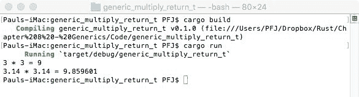

非常方便！顺便说一下，还有另一种声明它的方法：

```rs
fn multiply_generic<T>(a: T, b: T) -> T 
  where T: Mul<Output = T> 
{
  return a * b; 
}
```

哪一种更整洁取决于程序员，因此你可能会看到并使用这两种风格。

问题是：如果我们发送一个字符串会发生什么？幸运的是，在这个形式中，编译器会抛出一个错误，并且不允许代码构建：

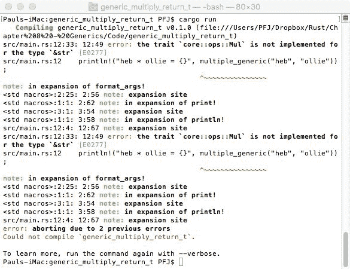

# 一个泛型问题

泛型的一个方面是确定 `T` 是什么，因此我们可以如何处理它。在 C# 中，我们可以使用 `System.Reflection` 并使用 `GetType` 方法来查找类型，或者在使用类型比较时使用 `typeof`。

这部分的源代码可以在 `09/generic_typeof` 中找到。

在 Rust 中，我们使用 `std::any:Any`。这是一个用于模拟动态类型的数据类型：

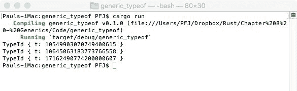

只看这个输出，你可能在想：*这些数字究竟是什么？我期望看到类似 f32* 的东西*。

这部分的关联代码可以在 `09/generic_typeof_print` 中找到。

我们在这里看到的是类型的 *ID* 而不是类型本身。要实际显示变量类型，我们需要做一些稍微不同的事情：

```rs
#![feature(core_intrinsics)] 
fn display_type<T>(_: &T)
{
  let typename = unsafe {std::intrinsics::type_name::<T>()};
  println!("{}", typename);
}

fn main()
{
  display_type(&3.14f32);
  display_type(&1i32);
  display_type(&1.555);
  display_type(&(vec!(1,3,5)));
}
```

在撰写本文时，此代码仅能在夜间分支上构建。很可能在你阅读这本书的时候，它已经进入了稳定分支。

当前面的代码在 Rust Playground 网站上运行时，会得到以下结果：

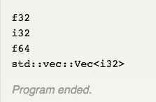

尽管我们已经多次看到大部分代码，但我们还没有在代码中遇到 `unsafe` 和 shebang (`#!`)。

# 不安全指令

我们已经多次看到，Rust 编译器会尽力确保你编写的代码不仅能够编译，而且不会做愚蠢的事情（例如超出数组的界限，使用错误的数据类型，或者使用未先赋予值的变量）。

这被称为 *安全* 代码。这并不是说所有安全代码都是好代码——你仍然可能遇到内存泄漏、整数溢出或线程死锁，这些都是你不想要的，但实际上并没有定义为不安全的。

在 Rust 中，`unsafe` 包围的代码确实意味着——你正在告诉编译器你写的代码将被内置保护忽略。

使用 `unsafe` 应该非常小心。我们稍后会遇到 `unsafe`。

# 整个 #!

对于那些习惯于 Linux Shell 脚本编写的人来说，你肯定见过 `#!`——在 Rust 中，`#` 是一个带有名称在 `[]` 中的声明属性。它们可以写成 `#[attr]` 或 `#![attr]`。

然而，`#[attr]` 和 `#![attr]` 的意义是不同的。`#[attr]` 仅直接应用于其后的内容。`#!` 改变了属性应用的对象。

我们在第二章，*变量和变量类型* 中看到过这个，当时我们讨论了编写测试。我们会有类似这样的内容：

```rs
#[test]
fn do_check()
{
  // perform check 
}
```

这个 `do_check` 函数只有在运行测试时才会执行。

# 特性和实现

Rust 中一个非常强大的特性，当处理泛型时通常可以看到，是能够告诉编译器特定类型将提供某些功能。这是通过一个称为 `trait` 的特殊功能提供的。

然而，要欣赏特性，我们首先必须看看 `impl` 关键字（简称实现）。

# 实现

`impl` 关键字的工作方式与函数非常相似。实现的结构需要被视为更接近静态类（在 C# 中）或函数中的函数：

```rs
impl MyImpl
{
  fn reference_name (&self) ... 
}
```

这将更多适用于非泛型类型。对于泛型，前面的代码变为以下内容：

```rs
impl <T> MyGenericImpl<T>
{
  fn reference_name(&self) ... 
}
```

注意 `<T>` 是必需的，以便告诉编译器 `impl` 是针对泛型的。`reference_name` 是用于访问 `impl` 函数的名称。它可以是你想要的任何名称。

`impl` 的一个例子可以在 `09/impl_example` 中找到。

如果你构建并运行 `impl_example` 代码，你将得到如下结果：

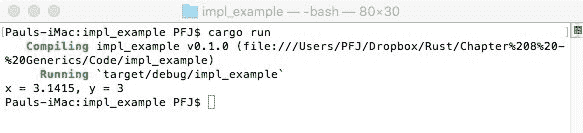

代码创建了两个函数的实现，这两个函数提供了定义的功能。

`impl_example` 是一个非常简单的例子。`impl` 可以根据需要变得非常复杂。

# 实现 lifetime

如第八章，*Rust 应用程序生命周期* 中所述，我们可以使用 lifetime 与 `impl` 一起使用：

```rs
impl<'a> MyFunction<'a>(varname: &'a as i32) {...}
```

`'a` 直接跟在 `impl` 和 `MyFunction` 之后。对于 `impl`，这是表示我们正在使用它，而在 `MyFunction` 之后，这是表示我们在 `MyFunction` 中使用它。

# 然后我们回到特性上...

将特性视为创建实现签名的最简单方式。如果你习惯于 C（或 C++），那么你将在类似这样的代码中看到它：

```rs
// mylib.h 
int myFunction(int a, int b, float c);

// mylib.c
#include "mylib.h"
int myFunction(int a, int b, float c)
{
  // implement the code 
  return some_value; 
}

// myotherfile.c 
#include "mylib.h"
int some_function()
{
  int value = myFunction(1, 2, 3.14f); 
  return value; 
}
```

编译器接受这段代码是正确的，因为 `.h` 文件中的签名在某处声明了一个编译函数，它提供了这个调用的实现。当编译器到达链接一切的时候，根据签名承诺的代码被找到，`myFunction` 执行它应该执行的操作并返回 `int`。

在 C# 中，这将通过 `interface` 提供。

使用 Rust，我们有一些非常相似的东西。

`trait` 提供了签名，`impl` 提供了实现，代码调用 `impl`。

现在这可能看起来有些过度。为什么要在实现通常在同一个源文件中的时候创建一个存根？答案是我们可以使用 Rust 库中的特性。特性告诉编译器某处有代码实现，它将在构建的最后阶段被链接。

我们将在下一章中查看 crates。

# 一个简单的 crate 示例

在这个例子中，我们将创建一个特质，它将包含两个函数的签名：`calc_perimeter` 和 `calc_area`。首先，我们构建一个 `struct`。在这种情况下，我们将有两个 `struct`：

```rs
struct Perimeter 
{
  side_one: i32,
  side_two: i32, 
}

struct Oval 
{
  radius: f32,
  height: f32,
}
```

我们需要为每个创建一个特质。特质的通用格式如下所示：

```rs
trait TraitName 
{ 
  fn function_name(&self) -> return_type; 
}
```

在我们的情况下，我们将有以下内容：

```rs
trait CalcPerimeter
{
  fn calc_perimeter(&self) -> i32; 
}

trait CalcArea 
{
  fn calc_area(&self) -> f32; 
}
```

现在我们需要为这两个特质创建实现。然而，`impl` 的外观将不会完全相同。

在之前，我们有以下内容：

```rs
impl SomeImplement
{ 
  ...
}
```

这次，我们必须给出与它相关的结构体的名称：

```rs
impl SomeImplement for MyStruct 
{
  ...
}
```

如果 `impl` 定义了特质，而特质只是一个占位符，为什么我们还需要说明它对应的结构体？

这是一个合理的问题。

没有特质，`impl` 的操作方式类似于函数。我们通过 `&self` 向 `impl` 提供参数。当我们有一个特质时，`impl` 必须说明 `&self` 指的是什么。

这个代码可以在 `09/non_generic_trait` 中找到。

我们第一个特质的 `impl` 将如下所示：

```rs
impl CalcPerimeter for Perimeter 
{ 
  fn calc_perimeter(&self) -> i32 
  {
    self.side_one * 2 + self.side_two * 2 
  }
}
```

注意，该函数可以访问 `Perimeter struct` 中的 `side_one` 和 `side_two`。

第二个 `impl` 将看起来像这样：

```rs
impl CalcArea for Oval
{ 
  fn calc_area(&self) -> f32 
  { 
    3.1415927f32 * self.radius * self.height 
  }
}
```

最后，对实现的调用。与之前的示例不同，这两个结构体都必须初始化，然后才能给出实现调用：

```rs
fn main() 
{ 
  let peri = Perimeter 
  {
    side_one: 5, side_two: 12 };
    println!("Side 1 = 5, Side 2 = 12, Perimeter = {}", 
              peri.calc_perimeter());
    let area = Oval 
    {
      radius: 5.1f32,
      height: 12.3f32
    };
    println!("Radius = 5.1, Height = 12.3, Area = {}", 
              area.calc_area()); }
```

一旦代码编译完成，预期的答案如下所示：

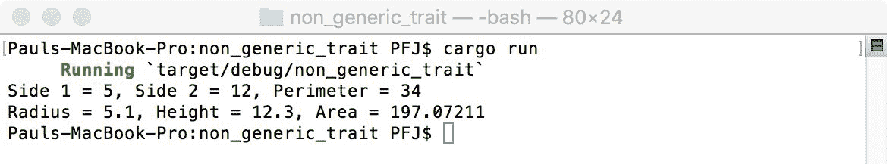

# 特质和泛型

如果我们查看代码，我们有两个结构体实际上执行相同的功能，唯一的区别是参数的类型不相同。我们可以更改结构体的成员名称而不存在问题，以使生活更简单：

```rs
struct Perimeter { side_one: i32, side_two: i32, } 
struct Oval { radius: f32, height: f32, }
```

这将变成以下内容：

```rs
struct Shape<T> { line_one: T, line_two: T, }
```

计算不能改变，因为它们完全不同，但需要更改参数名称。需要更改的另一个方面是函数的名称。让我们创建一个只使用部分代码的代码版本。

由于我们有 `struct` 的泛型版本，我们接下来需要创建一个特质：

```rs
trait Calculate<T> { fn calc(&self) -> T; }
```

我们必须使用 `<T>`，因为特质必须接受一个泛型。

实现的构建可以通过两种方式之一实现。

这个部分的代码可以在 `09/generic_traits_simple` 中找到。

# 为特定类型定义 impl

这是最简单的方法之一来创建代码。我们定义 `Shape` 可以接受的数据类型：

```rs
impl Calculate<i32> for Shape<i32> 
{ 
  fn calc(&self) -> i32
  {
    self.line_one * 2 + self.line_two * 2 
  }
}
```

按照这种方式编写代码可以确保我们不会将任何没有意义的东西传递给实现（例如，不能对它们应用 `+` 或 `*` 的类型）。

# 使用 where

如果你习惯于使用 C# 中的泛型编程，这应该对你来说很熟悉。

Rust 包含 `where` 的实现，因此我们能够定义 `where` 是什么。这意味着，正如我们在本章早期示例中看到的那样，构造 `<T: Mul<Output = T>>` 可以以修改后的方式使用：

```rs
impl<T> Calculate<T> for Shape<T> where T: Mul<Output = T>
```

虽然如此，这确实引发了许多其他问题。其中两个简单的问题是，我们乘以`2`——然而，如果它是`2u8`还是`2i32`，这个值并不明确。我们还尝试将值相加，但与将`T`相乘一样，没有保证你可以通过`T`来相加。

# 使其工作

最后一步是添加一个`main`函数。我们可以使用之前非泛型特质示例中的相同函数，但要去掉椭圆：

```rs
fn main() 
{
  let peri = Shape
  {
    line_one: 5,
    line_two: 12
  };
  println!("line_one = 5, line_two = 12, Perimeter = {}", 
            peri.calc ()); 
}
```

编译后，它给出了以下输出：

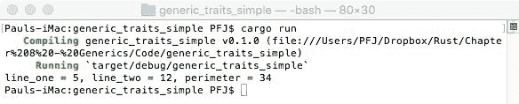

由于我们已经创建了第二个实现，将`main`函数扩展以包括第二个计算应该是微不足道的。

有关这部分代码文件的详细信息，请参阅`09/generic_trait_full`。

我们还需要实现`f32`的计算：

```rs
impl Calculate<f32> for Shape<f32> 
{
  fn calc(&self) -> f32 
  {
    3.1415927f32 * self.line_one * self.line_two
  } 
}
```

当这个文件被编译时，我们会看到以下内容：

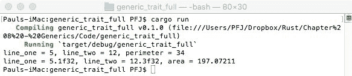

# 你可能已经注意到了

如果我们比较两种不同的代码实现（泛型和非泛型），主要区别在于我们减少了所需的代码量，因为这两个结构体在名称之外都是相同的。我们还简化了代码，以便我们只有一个对`calc`的调用，并允许编译器根据传入的类型来决定我们需要哪个。

# 泛型 - 稍作补充

代码的缩减和简化始终是一件好事（至少大部分情况下是这样）。然而，在使用泛型时，总会有权衡，而且并不总是显而易见的。

让我们考虑以下代码片段：

```rs
fn my_multiply<T: Mul<Output = T>>(a: T, b: T) -> T { return a * b; }
```

这个函数通过乘以两个变量（类型为`T`）返回一个`T`类型的值。

问题是：你可以向该函数发送多种类型——如果编译器不知道`T`的类型，它将如何知道该做什么？唯一安全的方法是为每种可能的类型创建一个`my_multiply`版本。幸运的是，编译器会自动为你完成这个过程，称为单形化。

# 那么到底发生了什么？

为了给所有这些生成的函数赋予独特的名称，与泛型一起工作的编译器使用了一个称为**名称混淆**（或*名称混淆*）的过程。这为每个内部创建的、带有泛型参数的函数创建了一个独特的名称。

在链接过程中，对于应该使用哪个版本，链接器会分析所需的代码`签名`。如果链接器看到一个需要`f32`作为`T`的签名，那么混淆后的名称对象代码将被包含在最终对象列表中。一旦链接器完成分析，未使用的对象（那些不在最终列表中的对象）将被剥离。因此，最终的二进制文件只包含所需的代码，而不是可能的所有类型变体。

尽管不同的编译器对泛型有不同的处理方式，但在编译、名称混淆以及最终剥离的过程中，它们之间是通用的！

# 回到`where`版本

代码的`where`版本比非`where`版本更复杂。

这个版本的源代码可以在`09/generic_trait_where`中找到。

让我们检查一下代码：

```rs
extern crate num; 
use std::ops::{Add, Mul}; 
use num::FromPrimitive;
```

我们之前在泛型乘法示例中见过 `std::ops::Mul`。如果我们需要从 `std::ops`（或者确实任何库）中包含多个项目，它们被放在花括号 `{}` 中。这里，我们包含了 `Add` 和 `Mul`。

到目前为止，我们还没有看到 `extern crate` 指令。现在，只需要知道这将包含一个外部库。Crates 在第九章，*泛型和特性* 中介绍。

最后，我们使用 `num` 库的 `FromPrimitive`。

我们的 `struct` 和 `trait` 和之前一样。不过，实现是不同的：

```rs
impl<T> Calculate<T> for Shape<T> 
  where T: Copy + FromPrimitive + Add<Output = T> + 
  Mul<Output = T> 
{
  fn calc(&self) -> T {
    let two = T::from_u8(2).expect("Unable to create a value of 2");
    self.line_one * two + self.line_two * two
  } 
}
```

这段代码中有两行很重要：`where T:Copy + FromPrimitive + Add<Output = T> + Mul<Output = T>` 和 `let two = T::from_u8(2).expect("Unable to create a value of 2");`。

这里，我们说的是我们想要复制类型，我们将使用 `FromPrimitive` 来将原始类型转换为 `T`，并且 `Add` 和 `Mul` 的输出都将为类型 `T`。Rust 使用 `+` 连接 `where` 使用的参数。

`let two` 行创建了一个变量，它接受一个无符号 8 位值并将其转换为 `T`。如果失败，则会抛出错误。

我们必须使用 `Add<Output = T>` 来确保我们可以将类型相加。

# 尝试编译

如果你使用标准的 `cargo run`，你会遇到一个错误，编译器 `无法找到 extern crate num`。这是由于 cargo 不知道依赖项在哪里。在第一次获取外部引用时，Rust 将更新可用的 crate 列表（注册表），然后下载所需的 crate。为此，需要编辑 `Cargo.toml` 文件并插入以下代码：

```rs
[dependencies] 
num = "*"
```

保存后，执行 `cargo run`，你会看到如下输出：

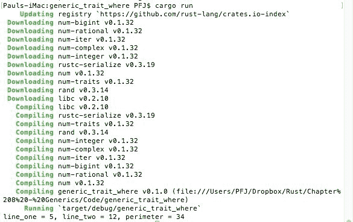

# 特性限制

一个特性也可以被施加一个限制。实际上，限制是一个特性必须遵守的规则，并且被添加到声明类型参数中。

这一部分的源代码在 `09/trait_bound_gen_struct`。

在代码示例中，`impl` 对泛型类型放置了一个 `PartialEq` 限制。我们的 `struct` 内部包含四个参数，所以我们只想在该 `struct` 内进行部分相等性测试。如果没有在声明的类型参数上有 `PartialEq`，编译将失败，因为我们没有测试该 `struct` 内部的所有内容。

当代码编译时，我们得到以下输出：

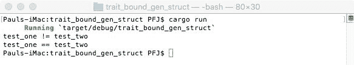

# 我们能否进一步减少代码量？

是的。如果特性包含默认方法，则可以完全省略创建特性实现的必要性：

```rs
trait MyTrait 
{
  fn test_code(&self) -> bool;
  fn self_test_code(&self) -> bool { self.test_code() } }
```

`test_code` 只是一个需要实现的存根。`self_test_code` 函数不需要实现，因为它已经有了默认方法。

# 默认方法可以被覆盖吗？

它可以。

这一部分的代码在 `09/override_default_method`。

让我们从定义一个`trait`开始编写代码。这有一个`is_not_done`的默认方法。尽管如此，我们仍然需要实现`is_done`，我们为`UseFirstTime`结构体这样做：

```rs
struct UseFirstTime; 
impl MyTrait for UseFirstTime 
{
  fn is_done(&self) -> bool 
  {
    println!("UseFirstTime.is_done"); 
    true
  } 
}
```

接下来，我们想要重写`is_not_done`的默认方法。同样，我们创建了一个空的`struct`并编写了`is_done`和`is_not_done`的实现。当我们从第二个`struct`中调用`is_not_done`时，显示的是第二个`struct`中的`println!`，而不是第一个：

```rs
struct OverrideFirstTime;
impl MyTrait for OverrideFirstTime 
{
  fn is_done(&self) -> bool 
  {
    println!("OverrideFirstTime.is_done");
    true
  }
  fn is_not_done(&self) -> bool 
  {
    println!("OverrideFirstTime.is_not_done");
    true
  }
}
```

编译后，我们得到以下输出：

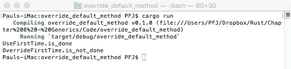

# 特质总结

这是一个很大的主题，但我们还有两个关于特质的方面需要考虑：继承和派生。如果你熟悉任何形式的面向对象编程，这应该很熟悉。

# 继承

这与 C++和 C#中的继承非常相似：

```rs
trait One 
{
  fn one(&self); 
}
trait OneTwo : One 
{
  fn onetwo(&self); 
}
```

这一部分的代码在`09/inheritance`中。

实现`OneTwo`的代码也必须实现`One`（这与当我们重写默认方法时仍然需要定义`is_done`的情况相同），因此：

```rs
struct Three; 
impl One for Three 
{ 
  fn one(&self) 
  {
    println!("one");
  }
}
impl OneTwo for Three 
{
  fn onetwo(&self) 
  {
    println!("onetwo");
  } 
}
```

结果如下：

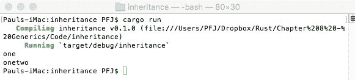

如果我们省略了`impl One`块，我们会得到一个编译错误，抱怨`impl OneTwo`需要`impl One`存在。

# 继承

Rust 提供了一个方便的属性，允许你访问许多常用特质，而无需自己重复实现。它们通过使用`#[derive(Trait_Name)]`来调用。

可用的特性如下：

+   `Clone`: 这创建了一个对象的副本

+   `Copy`: 这创建了一个对象的副本

+   `Debug`: 这提供了调试代码

+   `Default`: 这为类型提供了一个有用的默认值

+   `Eq`: `相等性`，这与`PartialEq`类似，但除了结构体内的所有参数

+   `Hash`: 这是一个可哈希的类型

+   `Ord`: `排序`, 这些是在所有类型上形成全序的类型

+   `PartialEq`: `部分相等性`，这仅在结构体的子集上进行测试

+   `PartialOrd`: `部分排序`, 可以比较以创建排序顺序的值

# 特质对象

通常，当我们调用 Rust 中的函数时，代码中会有一行类似于以下的内容：

```rs
call_some_method(some_value);
```

当我们在代码中有一个附加了`impl`的`struct`时，我们将有如下所示：

```rs
let m = MyStruct {a: 3, b: 4, c: 1, d: 4}; m.call_some_method();
```

这两者都是可以的。

如果你记得，在`generic_trait_full`示例中，我们定义了`Calc`，`T`可以是`f32`或`i32`。我们还讨论了应用程序如何知道在最终二进制文件中包含什么。这被称为**静态调度**（Rust 所偏好的）。

Rust 使用一个称为**调度**的系统，其中有两种类型：静态（Rust 所偏好的）和动态。动态调度依赖于称为**特质对象**的东西。

# 让我们创建一个示例测试设置

测试代码非常简单。我们有一个具有返回`String`的函数的特质。然后我们有几个实现和一个参数限制函数，该函数将显示实现的结果：

```rs
trait StaticObject 
{ 
  fn static_method(&self) -> String; 
}

impl StaticObject for u8 
{
  fn static_method(&self) -> String {format!("u8 : {}, ", *self)} 
} 

impl StaticObject for String 
{ 
  fn static_method(&self) -> String {format!("string : {}", *self)} 
} 

fn display_code<T: StaticObject>(data : T) 
{
  println!("{}", data.static_method()); 
} 

fn main() 
{
  let test_one = 8u8;
  let test_two = "Some text".to_string();
  display_code(test_one);
  display_code(test_two); 
}
```

这一部分的代码可以在`09/trait_object_static`中找到。

编译并执行后，我们得到以下结果：

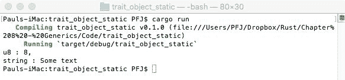

从前面的解释中，我们知道编译器将生成 `T` 可以是的各种类型。

# 让我们看看动态分派

动态分派使用特征对象。特征对象可以存储任何实现了 `trait` 的类型的值。值的实际类型仅在运行时才知道。

该部分的代码可以在 `09/dynamic_dispatch` 中找到。

让我们看看一些代码来解释这是如何工作的。

之前，我们为 `display_code` 有以下内容：

```rs
fn display_code<T: StaticObject>(data: T) 
{
  println!("{}", data.static_method()); 
}
```

我们现在有这个：

```rs
fn display_code(data : &DynamicObject) 
{
  println!("{}", data.dynamic_method()); 
}
```

我们不再有 `T` 参数。

在静态版本中，`display_code` 被调用如下：

```rs
display_code(test_one);
```

对于动态版本，我们使用以下内容：

```rs
display_code(&test_one as &DynamicObject);
```

特征对象是从指针（`&DynamicObject`）中获得的，该指针通过使用强制转换（`&test_one as &DynamicObject`）实现了特征。也可以使用 `display_code(&test_one)`。这被称为强制转换：`&test_one` 被用作一个接受 `&DynamicObject` 参数的函数的参数。

动态分派的唯一问题是它可能较慢，因为每次代码运行时，运行时都会*忘记*指针的类型，并必须为不同类型创建一个新的实现。

# 保持对象安全

我们不能使用所有特征来创建特征对象。以下是一个例子：

```rs
let my_vec = vec![1,3,5,7,9]; 
let dupe = &my_vec as &Clone;
```

这将无法编译，因为 `Clone` 不是对象安全的，因为 `Clone` 包含 `Self: Sized`，而特征不能有。

如果特征不需要 `Self: Sized` 并且所有方法都是对象安全的，则它是一个对象安全特征。为了使方法对象安全，它必须要求 `Self: Sized`。如果方法不需要 `Self: Sized`，如果方法不需要任何参数并且不使用 `Self`，则即使方法不需要 `Self: Sized`，它仍然可以是对象安全的。

# 摘要

特征和泛型是开发的关键特性，Rust 在这些方面功能丰富。我们看到了如何创建实现，如何使用泛型，如何确保类型可以被绑定，以及特征的力量。希望你现在应该能够欣赏到泛型为开发者提供的纯粹的力量，在灵活性方面。泛型还允许通过本质上消除对泛型代表的过度担忧来减少我们（作为开发者）需要编写的代码量。

在下一章中，我们将探讨通过使用外部库（称为 crate）来扩展我们的 Rust 应用程序。
