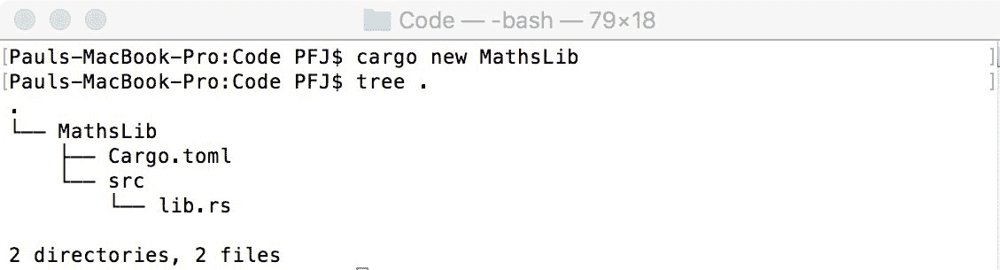
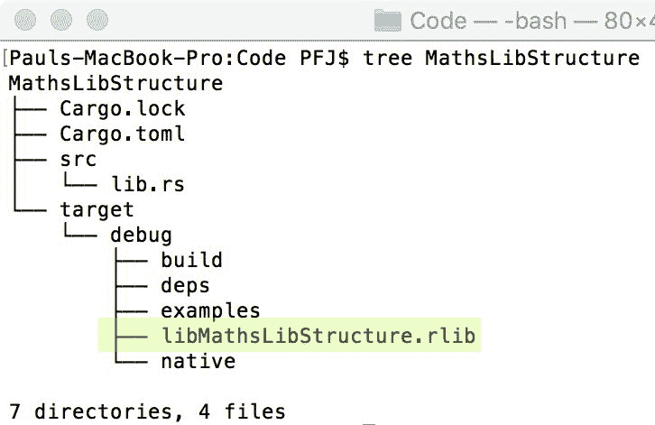
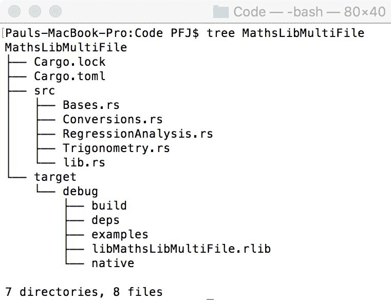
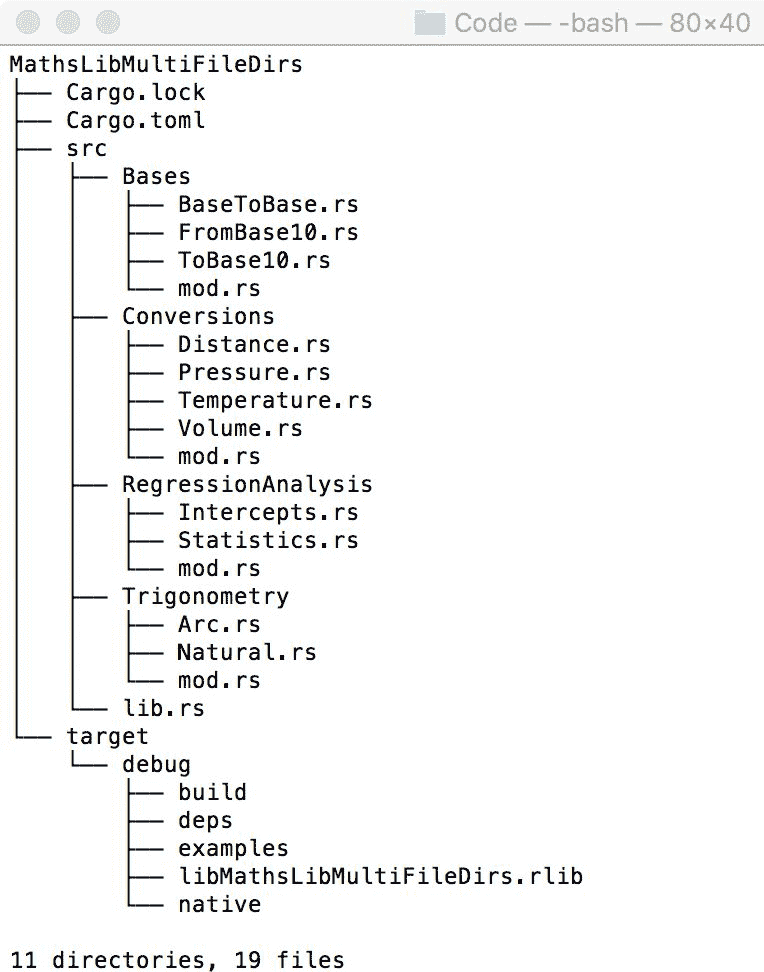
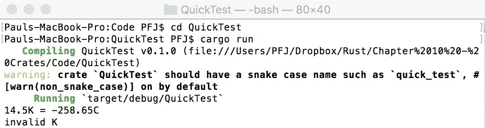
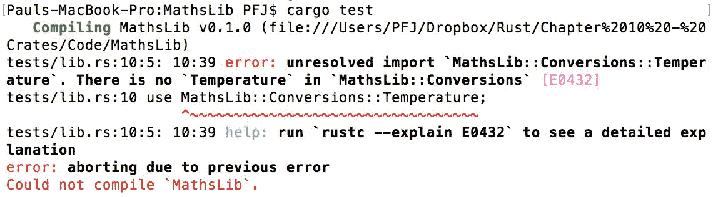
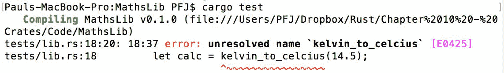
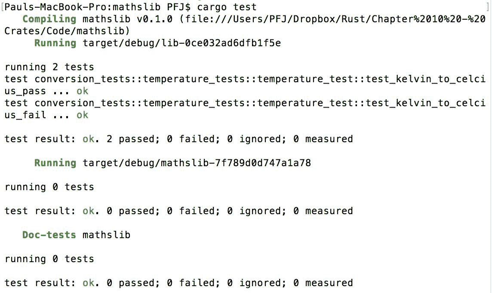
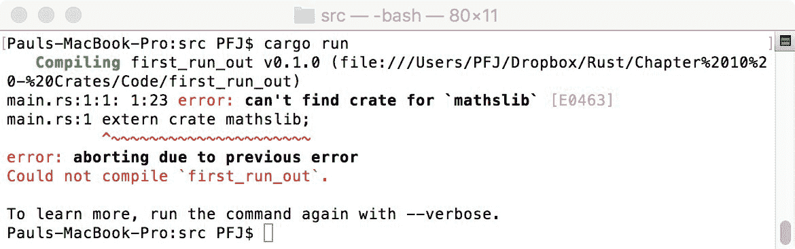
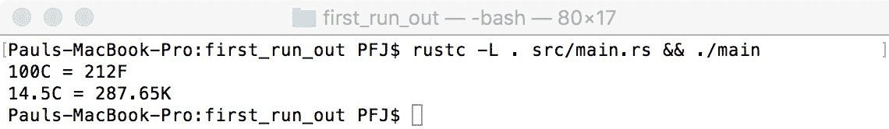

# 第十章：创建您的自己的箱子

大多数语言都允许创建外部库。这些库通常包含通用代码片段，用于通用用途。例如，用于反序列化 JSON 的库相当常见，数学库也是如此。Rust 也不例外。它允许创建库（称为**箱子**）。这些箱子可以保留给自己或以您认为合适的方式分发。箱子的元数据存储在公共服务上，在 [`crates.io/`](https://crates.io/)。 

在本章中，我们将涵盖以下主题：

+   箱子的创建方式

+   目录结构的使用方式

+   箱子由模块组成的方式

+   如何在您的代码中包含您的箱子

+   如何使用模块的范围

# 箱子究竟是什么？

与所有语言一样，Rust 可以使用外部库，我们已知这些库被称为箱子。但它们是什么？

如果我们考虑一个箱子，我们会想到用来存放很多东西的东西。软件开发者喜欢保持他们的代码整洁，如果他们知道自己在做什么，他们往往会保持他们的库相当专业化。箱子内的这些专业化被称为模块。

箱子是一个容器，其中包含一个或多个模块。

# 查看模块

为了展示箱子是如何组合起来的，我们将创建一个。在这种情况下，它将是一个简单的数学箱子。

在我们考虑这一点之前，让我们考虑一下我们所有人都知道的东西：汽车。我们将汽车视为箱子，因为与汽车有关的一切都包含在其中。

首先，让我们考虑汽车的主要部分：发动机、燃料、内饰、车轮和运动，以及电气部分。

还有更多，但现在我们将忽略它们。让我们用一个方块图来表示，以便更清晰地展示它们之间的关系：


当然，我们可以将这些块分开（例如，我们可以将电气部分分为点火、音频、窗户、加热挡风玻璃、灯光和内饰风扇）。

汽车是箱子。每个块是一个模块。每个分割是一个子模块。现在很容易看出箱子是如何可视化的。

# 我可以看到这个类比存在一个问题

我选择汽车是有原因的。如果我们想想，所有的部件并不是真的那么离散；发动机需要燃料，电气部分需要发动机，但发动机也产生电力，等等。从编程的角度来看，这会导致一团糟。

我们如何将它们分开？

答案是，我们为每个模块使用一个范围。例如，这个箱子的顶层是**Car**。然后我们添加**::**，后面跟着模块名称（**Car::Engine**、**Car::Fuel**等等）。如果一个模块需要访问另一个模块，可以使用通常的`use`指令来包含它。

箱子的名称是在使用 cargo 创建库时使用的名称。在这个例子中，创建此箱子的命令行如下：

**cargo new Car**

注意，我们不使用`--bin`标志。

考虑以下示例：

```rs
// in Car::Engine 
use Fuel; 
use Electrics; 
```

如果我们进一步分解模块，我们将以与之前相同的方式扩展作用域以便访问它们：

```rs
// in the main code 
use Car::Interior::Audio; 
use Car::Interior::Windows::HeatedRear; 
```

# 回到我们的数学库

现在我们知道了 crates 和模块是如何结合在一起的，以及它们的作用域如何允许模块在具有相同名称的情况下（例如，`Car::Engine`和`Car::Electics`都可以有一个名为`voltage_to_earth`的函数，每个都执行不同的操作）不会混淆，让我们考虑我们的数学库。

该库将包含四个模块和多个子模块：

+   三角学：

    +   正弦/余弦/正切

    +   反正弦、反余弦和反正切

+   回归分析：

    +   直线上的截距

    +   标准差和 r²值

+   转换：

    +   温度、压力和体积

+   基本函数：

    +   *n*进制到十进制转换

    +   十进制到*n*进制转换

    +   *m*进制到*n*进制加、减、乘、除

# 使用有用的名称

模块内的命名非常重要；它将可见于任何使用它的人，因此应该描述它所做的工作。函数名称也是如此。例如，*f_to_c*是可以的，但库的整个目的就是你可以得到你想要的东西，而无需猜测作者的意图。一个名为*fahrenheit_to_celcius*的函数名称更有意义。

这同样适用于模块。如果我要用*ra*进行回归分析，这个名字可能看起来合理，但它是否清晰？这里的名字可以代表任何东西。创建名为*regression_analysis*的模块可能看起来很费力，但它将帮助其他用户了解可以期待什么。

# 让我们开始创建！

首先，我们需要创建 crate 本身。

要做到这一点，我们不需要写以下内容，而是需要告诉 cargo 我们正在创建一个库：

```rs
cargo new myapp -bin 
```

要做到这一点，我们只需省略`-bin`标志：

```rs
cargo new MathLib 
```

以下截图显示了这一点，随后是模块的树结构。你会注意到`main.rs`已被替换为`lib.rs`：



图 1

# 创建顶级模块

要创建一个模块，我们首先需要告诉编译器代码存储在模块中。在这个例子中，我将使用`Trigonometry`模块：

```rs
mod Trigonometry // top level module 
{ 
    mod Natural  // sub module 
    { 

    } 

    mod Arc      // sub module 
    { 

    } 
} 
```

当我们使用`cargo build`（而不是`cargo run`；库中没有`main`函数）编译并检查树结构时，我们会看到库（高亮显示）：



图 2

这个部分的架构可以在`第十章/数学库结构`中找到。

目前我们无法用它做太多，因为它只包含一些几乎不起作用的占位符。在继续之前，先看看`lib.rs`源文件。除了模块名称外，它已经有 62 行。让我们为`Conversion`模块想一个非常简单的例子，*华氏度转摄氏度*。

做这件事的公式是*(F - 32) * 5/9*。因此，我们的函数将是以下内容：

```rs
pub fn fahrenheit_to_celcius(a: f32) -> f32 
{ 
    (a - 32f32) * 5f32 / 9f32 
} 
```

这只是四行代码。我们还需要从 C 到 F、从 K 到 C、从 C 到 K、从 F 到 K 以及从 K 到 F（K 代表开尔文，表示绝对温度，即 0K = -273.15^oC，也称为绝对零度）的转换。包括这些将使代码行数达到大约 24 行。这是一个简单的模块。回归分析的模块代码行数大约有 100 行。

我们的目标源文件将会非常大。由于我们希望保持模块的可管理性，我们需要将`lib.rs`文件分解一下。

# 多文件模块

为了分解我们当前的`lib.rs`文件，我们需要改变声明模块的方式。

本节的内容源文件位于`Chapter10/MathsLibMultiFile`和`Chapter10/MathsLibMultiFileDirs`。

目前，我们有以下内容：

```rs
mod Trigonometry // top level module 
{ 
    mod Natural  // sub module 
    {  
    } 

    mod Arc      // sub module 
    {  
    } 
} 
```

为了将其分解为单独的文件，我们只需要在`lib.rs`中声明顶级模块：

```rs
mod Trigonometry; 
mod RegressionAnalysis; 
mod Conversions; 
mod Bases; 
```

# 子模块怎么办？

当我们以这种方式声明顶级模块时，Rust 会期望每个模块都有一个目录，或者有四个源文件（`Trigonometry.rs`、`RegressionAnalysis.rs`、`Conversions.rs`和`Bases.rs`）。如果使用目录结构，Rust 会期望每个目录中都有一个名为`mod.rs`的文件。

让我们比较这两个系统的外观，然后我们可以检查每个系统的相对优势。`MathsLibMultiFile`的结构将如下所示：



图 3a

`MathsLibMultiFileDirs`的结构将如下所示：



图 3b

初看之下，它们似乎非常相似；唯一的区别是多文件目录（*图 3b*）将模块分解为单独的文件，而多文件（*图 3a*）每个模块只有一个文件。这是非目录结构的限制；子模块被保存在一个文件中，这对于非常小的模块来说是可以的，但对于较大的模块来说就不太好了。

在目录结构版本中，有一个`mod.rs`文件。这个文件完全是空的，但它的存在是为了让编译器知道我们有了子模块。如果（比如说）`RegressionAnalysis::Statistics`需要进一步分解，那么它将是在`RegressionAnalysis`目录内创建一个新的名为`Statistics`的目录（目录必须与模块同名），并添加一个新的`mod.rs`文件以及新的子模块。

# `mod.rs`文件

此文件应包含对模块本身的接口。模块的名称将指向具有相同名称的文件。

考虑以下示例：

```rs
mod mycode;
```

前一行将指向`mycode.rs`。您需要在该模块目录中的每个文件中包含接口（`mod.rs`除外）。

# 让我们添加一些代码

我们现在已经建立了结构并拥有了基本框架；我们可以开始向库中添加一些代码。在这种情况下，将是`Conversions::Temperature`部分。我们已经看到了华氏到摄氏的温度转换函数，所以让我们添加其他函数：

```rs
// Temperature.rs 
mod Temperature 
{ 
    fn fahrenheit_to_celcius(f: f32) -> f32 
    { 
        (f - 32f32) * 5f32/9f32 
    }  
    fn celcius_to_fahrenheit(f: f32) -> f32 
    { 
        (c * (9f32/5f32)) + 32f32 
    }  
    fn celcius_to_kelvin(c: f32) -> f32 
    { 
        c + 273.15 
    }  
    fn kelvin_to_celcius(k: f32) -> f32 
    { 
        k - 273.15; 
    }  
    fn fahrenheit_to_kelvin(f: f32) -> f32 
    { 
        (f + 459.67) * 5f32 / 9f32 
    }  
    fn kelvin_to_fahrenheit(k: f32) -> f32 
    { 
        (k * (9f32 / 5f32)) - 459.67 
    } 
} 
```

这段代码并没有什么惊人的地方，但我们确实需要停下来思考一下。开尔文温度从 0 到*n*；它永远不会低于零。用户完全可能想要使用`celcius_to_kelvin`并传入-274。这意味着函数的答案在数学上是正确的，但在物理上是不正确的。

这个部分的代码在`Chapter10/MathsLib`。

我们可以返回`-1`，但对于某些函数，这个答案是可以接受的。

我们需要返回的是一个元组，第一个参数是一个布尔值，表示计算是否有效（`true` = 有效）。如果是`true`，答案在第二个参数中；否则，返回原始传入的值。

作为快速测试，以下代码可以运行：

有关源代码，请参阅`Chapter10/QuickTest`。

```rs
fn kelvin_to_celcius(k: f32) -> (bool, f32) 
{ 
    if k < 0f32 
    { 
        return (false, k); 
    } 
    else 
    { 
        return (true, k - 273.15); 
    } 
} 

fn main()  
{ 
    let mut calc = kelvin_to_celcius(14.5); 
    match calc.0 
    { 
        true => println!("14.5K = {}C", calc.1), 
        _ => println!("equation was invalid"), 
    } 

    calc = kelvin_to_celcius(-4f32); 
    match calc.0 
    { 
        true => println!("-4K = {}C", calc.1), 
        _ => println!("invalid K"), 
    } 
} 
```

在这里使用元组的索引形式而不是将其解构为两个变量是很方便的。

编译时，我们得到以下输出：



图 4

这正是预期的结果。这也表明需要在库中添加一组单元测试，以确定输入数据的有效性（或无效性）。

# 小心双重名称作用域

创建一个可能遇到双重名称作用域问题的 crate 是一个相当常见的问题。考虑以下示例：

```rs
mathslib::conversions::temperature::temperature 
```

将前面的行替换为后面的行会导致一个主要问题：

```rs
mathslib::conversions::temperature; 
```

问题出在`mod.rs`和`temperature`文件上。

如果你查看`lib.rs`，它包含必须与目录名称匹配的模块名称，该目录反过来包含`mod.rs`文件。`mod.rs`文件（如我们所见）需要包含模块的公共接口。现在，按照这个逻辑，`temperature.rs`文件中的代码也应该有`pub mod temperature { ... }`。正是这个最后的`pub mod`导致了双重名称作用域。

为了避免这个问题，只需省略`pub mod temperature`行。只要文件名与`mod.rs`中的`pub mod`名称匹配，编译器就会认为该代码属于`mod.rs`中命名的模块。

查看以下代码片段：

```rs
// in mod.rs 
pub mod temperature; 
// all code in temperature.rs "belongs" to mod temperature 
fn celcius_to_kelvin(c: f32) -> (bool, f32) { ... } 
```

# 向库中添加单元测试

我们可以通过两种方式之一创建测试：要么添加一个包含`lib.rs`文件的`tests`目录，要么简单地添加一个包含该模块测试的文件。由于我们已经在使用目录结构，让我们继续使用它来编写单元测试。

如前所述，在第一章中，*介绍和安装 Rust*，为了添加单元测试，我们在代码前添加以下内容：

```rs
#[test] 
```

然后为了构建，我们需要做以下操作：

```rs
cargo test 
```

然而，当我们这样做的时候，我们遇到了一个问题。我们的单元测试文件看起来是这样的：

```rs
extern crate mathslib; 
use mathsLib::conversions::temperature; 

#[cfg(test)] 
mod temperature_tests 
{ 
    #[test] 
    fn test_kelvin_to_celcius_pass() 
    { 
        let calc = kelvin_to_celcius(14.5); 
        assert_eq!(calc.0, true); 
    } 

    #[test] 
    #[should_panic(expected = "assertion failed")] 
    fn test_kelvin_to_celcius_fail() 
    { 
        let calc = kelvin_to_celcius(-4f32); 
        assert_eq!(calc.0,true); 
    } 
} 
```

表面上看，这似乎应该可行，但它返回的结果有些令人困惑：



图 5

这没有意义；我们知道有一个名为`Temperature`的模块，那么为什么我们会收到这条消息？答案是，这完全取决于模块和函数的隐私性。

# 公开某些内容

在第七章中，我们了解到，Rust 默认将所有函数、`structs`等设置为私有。这是可以的，因为它防止了代码的一些细节暴露给公共接口。

然而，这也意味着我们必须明确地将模块以及我们希望用户可以访问的所有函数设置为`pub`（公共）。因此，我们的温度转换函数将如下所示：

```rs
pub mod Temperature 
{ 
    pub fn fahrenheit_to_celcius(f: f32) -> f32 
    { 
        (f - 32f32) * 5f32/9f32 
    } 
```

下次我们运行单元测试时，应该不会出现这个问题，除了以下问题：



图 6

我们确实在`Temperature`模块中有一个名为`kelvin_to_celcius`的`pub`函数。问题是以下这一行：

```rs
use mathslib::conversions::temperature; 
```

这所做的只是导入模块，而不是任何符号（函数）。我们可以通过以下四种方式中的任何一种来修复这个问题：

+   我们可以使用以下方法：

```rs
use mathslib::conversions::temperature::*; 
```

+   我们使用以下方法：

```rs
use mathslib::conversions::temperature::kelvin_to_celcius; 
```

+   我们使用以下方法：

`use mathslib::conversions::temperature;`然后在`kelvin_to_celcius`前加上`temperature::`

+   我们删除了`use mathslib`行，并在`mod temperature_tests`内部添加以下行：

```rs
use super::*; 
```

使用这些中的任何一个都应该允许测试编译和运行。您将看到的输出应该类似于以下内容：



图 7: chap10_unittest

# 让我们快速运行我们的 crate

目前，我们的 crate 还远未完成。然而，其中包含足够的代码来查看它是否真的能运行。

本节代码位于`Chapter10/first_run_out`。

我们最初的代码如下所示：

```rs
extern crate mathslib; 
use mathslib::conversions::temperature::*;  
fn main()  
{ 
    let mut testval = celcius_to_fahrenheit(100f32); 
    println!("100C = {}F", testval.1); // should be 212 
} 
```

当我们构建这个项目时，我们得到以下结果：



图 7

这是有道理的；我们要求代码包含一个它一无所知的库。

# 外部依赖项

通常情况下，如果一个依赖项在应用程序外部，我们会在`Cargo.toml`文件中添加如下内容：

```rs
[dependencies] 
mathslib = "0.1.0" 
```

在这种情况下，我们无法使用 cargo 来构建；相反，我们需要使用`rustc`来编译。cargo 的工作方式是它会为每个项目重新编译依赖项（没有保证每个项目都会为给定的 crate 使用相同的特征集）。

我们可以使用以下命令模拟 cargo 运行：

```rs
rustc -L . src/main.rs && ./main 
```

`-L`选项将`.`（根目录，其中包含`Cargo.toml`文件）中的任何库链接到`.`之后的源代码。`/main`部分实际上告诉命令行解释器在根目录（编译文件的名称）中执行名为`./main`的二进制文件。

执行此操作后，我们可以看到我们的应用程序的全貌：



图 8

我们现在知道，我们的 crate（现状）正在按预期运行。

# 改变作用域

我们可以使用我们的作用域名称执行的一些更有趣的功能之一是更改它们。我们还可以自定义在用法行上包含哪些模块。

# 修改 crate 名称

通常，当我们导入一个 crate 时，我们使用以下内容：

```rs
extern crate crate_name; 
```

然而，为了避免与代码中的某些内容混淆，你可能希望用不同的名称来引用 crate：

```rs
extern crate crate_name as my_crate; 
```

它看起来与铸造非常相似，这是因为它将名称 `my_crate` 铸造为 `crate_name`。

当我们现在提到 crate 时，我们不使用以下内容：

```rs
use crate_name::module; 
```

我们更愿意使用以下内容：

```rs
use my_crate::module; 
```

# 优化你的用法语句

Java 做得正确的一件非常少的事情是它在导入库的方式上的粒度程度；它促使开发者只包含应用程序实际需要的库的部分。这归因于 Java 的历史，但这是应该被鼓励的。Rust 也做了类似的事情。

`use` 语句可以采用多种不同的样式。

# 使用所有内容的做法

这具有以下形式：

```rs
use my_crate::module_name::*; 
```

这通常被称为大锤做法，因为它使得 `module_name` 范围内的所有符号（公共函数、特性和等等）都可用。这种做法没有问题，但最终会导致更大的二进制文件（这可能会减慢最终应用程序的速度，并且运行代码时肯定会需要更多的内存）。

# 你决定的做法

这是使用 `module_name` 范围所需的最小内容：

```rs
use my_crate::module_name; 
```

在这里，你正在告诉编译器 `module_name` 存在，并且只要函数名称存在于符号中，它就可以被使用。然而，为了使用 `module_name`，函数需要以 `module_name` 开头。例如，要使用存在于 `module_name` 中的 `print_me(f32)` 函数，你将会有以下内容：

```rs
let some_text = module_name::print_me(10.1f32);   
```

`module_name::` 必须添加到编译器，以便使用 `module_name` 范围而不是应用程序的当前作用域。

# 使用我的做法

在这里，我们告诉编译器我们只允许当前作用域使用 `module_name` 范围内的特定函数：

```rs
use my_crate::module_name::print_me; 
```

# 使用我但叫其他名字的做法

这与通过另一个名称引用 crate 非常相似：

```rs
use my_crate::module_name as mod_name; 
```

这并不意味着你可能认为的意思。在 crate 示例中，我们说我们将使用 `my_crate`，这是 `crate_name` 的铸造。在这种情况下，我们说的是 `mod_name` 是 `my_crate::module_name` 的铸造。

在上一行之后，让我们使用以下内容：

```rs
use my_crate::module_name; 
let foo = module_name::print_me(10f32); 
```

如果我们这样做，我们现在使用以下内容：

```rs
let foo = mod_name::print_me(10f32); 
```

它看起来一样，但实际上意味着以下内容：

```rs
let foo = my_crate::module_name::print_me(10f32); 
```

# 使用全局匹配的做法

这种方法与使用我的方法类似，但有一个例外，即我们在想要代码可以访问的内容周围使用 `{}`（称为 **glob**）：

```rs
use my_crate::module_name::{print_me, calculate_time}; 
```

这一行意味着代码可以访问 `module_name::print_me` 和 `module_name::calculate_time`，但不能访问 `module_name` 范围内的其他内容。

# 使用全局匹配自我做法

在这里，glob 的第一个参数是`self`。在这个上下文中，`self`指的是根上下文：

```rs
use my_crate::module_name::{self, print as my_print, calculate as my_calc}; 
```

以扩展形式，这相当于以下内容：

```rs
use my_crate::module_name; 
use my_crate::module_name::print as my_print; 
use my_crate::module_name::calculate as my_calc; 
```

# 摘要

在本章中，我们涵盖了大量的内容，并看到，在大多数情况下，货物使得构建 Rust 应用程序变得简单。当在最初创建项目之外测试自己的 crate 时，我们需要使用`rustc`来编译。我们看到了如何创建自己的库，如何添加单元测试，如何有效地利用 use 语句，以及如何用不同的名称调用 crate 和作用域。

在下一章中，我们将探讨如何真正利用 Rust 内置的内存保护系统，以充分利用并发性和并行性。
