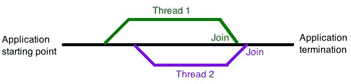

# Rust 的并发

在过去 35 年左右的时间里，计算机已经取得了长足的进步。最初，我们有 6502、6809 和 Z80 处理器。这些被称为**单处理单元**；它们一次只能运行一个程序，软件以线性方式运行（这意味着同时执行两个任务是不可能的）。

处理器不断发展，我们从单个处理单元（单核）过渡到了包含多个处理单元的处理器（多核）。编程语言也进化以支持这种处理器，同时运行多个操作（线程）成为现实。

Rust 作为一种非常现代的语言，也具有多处理的能力。所有你期望从 Rust 中获得的好处（例如内存安全和避免竞态条件）都可用，但还有一些其他的事情你需要注意。

在本章中，我们将：

+   理解 Rust 执行并发过程的方式

+   学习如何使用线程

+   看看不同线程模型之间的区别

# 一点故事

神秘移动设备正走在一条非常黑暗的道路上。无法知道前方是什么。在某个时刻，他们来到了一个道路交叉口，有三条道路从这里分叉。每条道路上都有一个写着*出口*的标志。作为勇敢的类型，弗雷迪让维拉走了一条路，夏吉和史酷比走第二条，达芬妮走第三条。作为勇敢的人，弗雷迪会开车走这条路。他们知道，尽管如此，这些道路最终会回到主路上。

他们同意，第一个到达出口的人会给其他人发消息。他们同步了手表，然后出发，不知道谁会第一个到达出口，甚至不知道是否能够到达出口。

# 那一切都是关于什么的？

大概在两段文字中，我阐述了 Rust 中并发性的三个非常重要的方面：Send（如神秘移动设备向其他人发送的消息所示）、Sync 和线程（每条道路都贡献一个线程，实际上，我们根本无法知道线程何时会重新连接到发送者，这可能会引起无数问题！）。

让我们逐一处理每个方面。

# Send

Send 将类型安全地传输到另一个线程——换句话说，如果类型 `T` 实现了 Send，那么这意味着 `T` 已经被安全地传递到另一个线程。

使用 Send 有一些注意事项：

+   你不会用它来处理非线程安全的进程（例如 FFI）

+   Send 必须为该类型实现

# Sync

Sync 被认为是超级安全的选项。当 `T` 实现了 Sync，就有内存安全的保证。然而，在我们继续之前，我们需要考虑以下问题。

# 何时一个不可变变量不再是不可变的？

到目前为止，我们一直认为变量要么是可变的，要么是不可变的，就是这样。然而，事实并非如此。

考虑以下内容：

```rs
let mut a = 10; 
let b = &mut a; 
```

这实际上意味着什么？首先，我们创建一个对 `a` 的可变绑定，最初包含值 `10`。

接下来，我们创建一个不可变的绑定到 `b`，它包含对 `a` 的可变值的引用。

# 它显然是可变的，定义中有 `mut`

让我们考虑一个不同的例子：

```rs
let vc: Vec<i32> = Vec::new(); 
let dup = vc.clone(); 
```

这个例子并不是表面上看起来那样。当调用克隆特质时，`vc` 必须更新其引用计数。问题是，`vc` 不是可变的，但这段代码可以编译并运行。

要了解这一点，我们必须知道借用系统是如何工作的（有关借用的更多信息，请参阅本实例中的第八章，*Rust 应用程序生命周期*)。借用有两种非常明确的操作模式：

+   对资源的单一（或多个）引用

+   精确一个可变引用

真正地，当我们谈论不可变性时，我们并不是真的在谈论一个变量是否固定，而是在谈论是否安全地拥有该变量的多个引用。在前面的例子中，可变发生在向量结构中，我们从中得到 `&T`。

由于向量结构不是面向用户的，它被称为**外部可变**。

# 内部可变性

相反（内部可变性）可以在本例中找到：

```rs
use std::cell::RefCell; 
fn main() 
{ 
    let x = RefCell::new(42); 
    let y = x.borrow_mut(); 
} 
```

在这里，`RefCell` 在调用 `borrow_mut()` 时提供 `&mut`。它工作得很好，但如果在 `x` 上再次调用 `borrow_mut()`，将会引发恐慌；你只能有一个可变引用。

# 回到 `sync`

为了同步，我们不能有任何使用内部可变性的类型（这还包括一些原始类型）。

当涉及到线程间的共享时，Rust 使用 `Arc<T>`。这是一个包装类型，如果满足以下条件，则实现 `send` 和 `sync`：`T` 必须同时实现 `send` 和 `sync`。`RefCell` 使用内部可变性，所以 `Arc<RefCell<T>>` 不会实现 `sync`，这也意味着不能使用 `send`——因此 `RefCell` 不能在线程间传递。

使用 `send` 和 `sync` 提供了 Rust 依赖以确保代码在使用线程系统时坚如磐石的安全保证。

# Rust 线程入门指南

线程允许多个进程同时执行。以下是一个非常简单的线程程序示例：

```rs
use std::thread;  
fn main()  
{ 
    thread::spawn(||  
    { 
        println!("Hello from a thread in your Rust program"); 
    }); 
} 
```

代码文件可以在 `Chapter11/SimpleThreadExample` 中找到。

当编译时，你可能期望看到 `println!` 输出。然而，你得到的是这个：


图 1

为什么 `println!` 没有显示？

# 思考线程工作方式的一个简单方法。

线程更容易用图形方式思考（至少我认为是这样）。我们从主线程开始：


图 2

主线程从应用程序的开始到结束。

在主线程的任何点上，我们都可以创建一个新的线程（或如果需要，创建多个线程）。


图 3

这两个新线程可以执行应用程序需要的任何操作。但是有一个简单的规则：线程只能持续到应用程序结束。正如*图 3*所示，线程开始并继续它们愉快的旅程；没有任何规定说线程必须重新连接到主线程，也没有任何规则说明线程何时返回（这可能导致一些非常大的线程安全问题，导致恐慌）。

不言而喻，每个线程也可以生成它们自己的线程来执行子进程：


图 4

如果你习惯了 C、C++和 C#中的线程，你将已经知道线程可以在任何时候返回到主线程，并且这个*任何时候*可能会对应用程序的安全运行造成灾难。在 Rust 中则不同。

当 Rust 中的线程从主线程（或任何子线程）生成时，会创建一个句柄。然后 Rust 使用这个令牌在给定点检索线程；因此，竞态条件的问题（其中一个线程在另一个线程之前返回，导致崩溃）基本上被消除了。

# 线程连接

要检索生成的线程，Rust 使用`join()`特性和然后解包结果。



图 5

因此，为了使我们的小型示例应用程序输出，我们需要将生成的线程连接回主线程：

```rs
use std::thread;  
fn main()  
{ 
    let threadhandle = thread::spawn(||  
    { 
        "Hello from a thread in your Rust program" 
    }); 

    println!("{}", threadhandle.join().unwrap()); 
} 
```

修改的代码可以在`Chapter11/joined_thread`中找到。

当我们运行代码时，这次我们看到以下内容：


图 6

嘿，那代码并不相同！这是真的，这是由于 spawn 接受了一个闭包（`||`）。

# 闭包

闭包是许多语言中存在的一种强大的代码片段。本质上，闭包将当前代码范围内使用的代码或变量封装在一个整洁的小包中。

在其最简单的形式中，我们可以有类似以下的内容：

```rs
let add = |x : i32 | x + t; 
```

`| |`内部定义了一个名为`x`的变量，它只在计算的范围内使用，并且其类型为`i32`。

好吧，这可能看起来并不那么有用——毕竟，我们在这里所做的只是将两个数字相加。但是等等——如果`x`只在计算的范围内定义，那么`x`实际上等于多少呢？

这就是闭包发挥作用的地方。通常，当我们创建一个绑定时，我们创建一个绑定到某个确定的东西。在这里，我们正在创建一个绑定，但是将其绑定到闭包的内容。管道`| |`之间的是参数，表达式是管道结束之后的内容。

如果你这么想，你实际上创建的更接近以下内容：

```rs
fn add(x : i32) -> i32 
{ 
     x + x 
} 
```

对于我们的问题“`x`实际上等于多少？”答案是它等于唯一的已知参数`t`。因此，`x + t`与说`t + t`相同。添加变量并没有直接绑定（即，与我们正常情况下绑定的方式相同），而是借用绑定。这意味着我们必须应用之前的相同借用规则。比如说我们有以下内容：

```rs
let m = &mut t; 
```

这将给出以下错误：


图 7

你将在`第十一章/close_mut_error`中找到一个这个错误的例子。

抛回的重要部分是我们试图借用在不可变行中被借用的东西。我们可以通过改变闭包的作用域来修复这个问题，如下所示：

```rs
let mut t = 10i32; 
{ 
    let add = |x : i32 | x + t; 
} 
let m = &mut t; 
```

这将导致错误发生。

考虑到这一点，我们可以开始扩展这个概念。如果管道之间的值是参数，那么我们可以清楚地用闭包做一些有趣的事情

本部分代码可在`第十一章/closures`中找到。

以此代码为例：

```rs
let calc = |x|  
{ 
    let mut result: i32 = x; 
    result *= 4; 
    result += 2; 
    result -= 1; 
    result 
}; 
```

而不是创建一个全新的函数，我们使用闭包并在`{}`的作用域内内联创建函数，只存在`result`和`x`。

没有任何参数的闭包是以下内容的内联等价物：

```rs
fn do_something() -> T { ... } 
```

# 闭包并不像它们最初看起来那样简单

闭包被称为**语法糖**（它们有效地为它们覆盖的基础特性增添了甜味）。这使得 Rust 中的闭包与其他语言中的闭包不同。

在这个前提下，我们也可以将闭包作为参数使用，以及从函数中返回它们。

# 闭包作为函数参数

考虑以下代码：

```rs
fn call_with_three<F>(some_closure: F) -> i32 where F : Fn(i32) -> i32
{
some_closure(3)
}
fn main()
{
let answer = call_with_three(|x| x + 10 );
println!("{}", answer);
}
```

本节代码可在`第十一章/close_fn_args`中找到。

我们调用`call_with_three`并传递闭包作为参数。函数`call_with_three`接受一个类型为`F`的参数。到目前为止，它与任何其他接受泛型值作为参数的函数没有区别。然而，我们将`F`绑定为一个返回类型为`i32`的函数类型，这使我们创建了一个内联函数作为被调用函数的参数！当代码编译时，我们在屏幕上得到预期的值——13：


图 8

# 带有显式生命周期的闭包 - 一个特殊情况

如我们在第八章“Rust 应用程序生命周期”中看到的，存在两种主要的作用域类型：全局和局部。具有局部作用域的变量一旦完成其任务就会超出范围，而全局作用域变量则在应用程序终止时清理。全局作用域变量还赋予生命周期标记，`'`。

闭包也有不同的作用域。通常，如果它们在调用时，它们将只有生命周期，但它们也可以是全局的。

“正常”函数（如之前所示）如下所示：

```rs
fn call_with_three<F>(some_closure: F) -> i32 where F : Fn(i32) -> i32
{
some_closure(3)
}
```

相反，对于生命周期作用域，我们将有以下内容：

```rs
fn call_with_three<'a, F>(some_closure: F) -> i32 where F : Fn(&'a 32) -> i32
```

然而，这不会编译。问题在于作用域。

在我们的第一个例子中，作用域仅限于调用期间。在第二个例子中，它是函数的生命周期（并且这是整个函数的生命周期），这意味着编译器将看到与不可变引用相同生命周期的可变引用。

尽管 Rust 仍然允许我们这样做，但我们需要使用一个叫做**高阶特质界限**的东西（简单来说，这意味着按照重要性的顺序，这会覆盖下面的东西）。这是通过告诉编译器使用闭包运行的最小生命周期来实现的，这反过来应该会满足借用检查器。在这种情况下，我们使用 `for<...>`：

```rs
fn call_with_three<'a, F>(some_closure: F) -> i32 where F :<for 'a> Fn(&'a 32) -> i32
```

# 返回一个闭包

由于 Rust 中的线程使用闭包返回，因此我们考虑返回一个闭包是完全可能的。然而，返回一个闭包并不像你想象的那样简单。

让我们先考虑一个普通函数：

```rs
fn add_five(x : i32) -> i32  
{ 
    return x + 5; 
} 
fn main() 
{ 
    let test = add_five(5); 
    println!("{}", test); 
} 
```

这将输出值 `10`。这并不是什么火箭科学。让我们将其改为闭包：

```rs
fn add_five_closure() ->(Fn(i32)->i32) 
{ 
    let num = 5; 
    |x| x + num 
} 
fn main() 
{ 
    let test = add_five_closure(); 
    let f = test(5); 
    println!("{}", f); 
} 
```

示例代码可以在 `第十一章/return_closure_one` 中找到。

然而，当我们运行这个程序时，我们并没有得到预期的 `10` 答案——相反，我们得到这个：


图 9

那么，出了什么问题？当我们从函数返回时，我们必须告诉编译器我们返回的类型。然而，`Fn` 是一个特质，所以我们必须以某种方式满足这个要求。我们总是可以使其返回一个引用：

```rs
fn add_five_closure() -> &(Fn(i32)->i32) 
```

这将生成另一个编译器错误，因为它需要应用生命周期期望。

我们总是可以让函数返回一个生命周期静态引用：

```rs
fn add_five_closure() -> &'static (Fn(i32) → i32) 
```

然而，这将产生一个不同的错误，可能看起来有些令人困惑：


图 10

为什么类型不匹配？它期望一个 `i32` 类型，但发现了一个闭包。这确实很有道理，但为什么会发生这种情况？

这是因为 Rust 的工作方式。对于一个闭包，它会生成自己的结构体和 `Fn`（以及任何其他所需的内容）的实现，因此，我们处理的不只是一个字面量，而是其他东西。

尝试返回一个特质对象（如 `Box`）也不会工作，因为函数依赖于 `num` 绑定（它是栈分配的）。但是，如果我们从栈移动到堆，我们现在可以返回闭包：

```rs
fn add_five_closure() -> Box<(Fn(i32) ->→ i32)> 
{ 
    let num = 5; 
    Box::new(move |x| x + num) 
} 
fn main() 
{ 
    let test = add_five_closure(); 
    let f = test(5); 
    println!("{}", f); 
} 
```

这个示例的源代码可以在 `第十一章/return_closure_three` 中找到。

现在代码可以编译，并给出以下结果：


图 11

# 移动参数是什么？

`move` 参数强制闭包获取其内部包含的所有内容的所有权。让我们更仔细地看看这一点：

```rs
let myNum = 10; 
let myMove = move |x: i32| x + myNum; 
```

在这里，`myMove` 获取 `myNum` 的所有权。`myNum` 的值实现了 `Copy`，它被分配给绑定。这和任何变量的操作是一样的，所以必须有某种东西来区分 `move` 和其他任何东西。

让我们看看一个稍微不同的例子，看看我们是否能看到实际发生的事情：

```rs
let mut myMutNum = 10; 
{ 
    let mut subNum = |x: i32| num -= x; 
    subNum(3);  
} 
```

我们之前已经见过这个，所以应该不难理解。这将给出答案 `7`。然而，如果我们使用 `move`，答案可能并不像预期的那样：

```rs
fn main()  
{ 
    let mut my_mut_num = 10; 
    { 
        let mut sub_num = move |x: i32| my_mut_num -= x; 
        sub_num(3);  
    } 
    println!("{}", my_mut_num); 
} 
```

这个示例的代码在 `第十一章/move_closure_one` 中。

当编译时，你可能期望得到 `7` 的答案，但结果却是：


图 12

我们如何得到一个值为 `10` 的值？

在非移动版本中，我们借用可变值的值。使用`move`，我们接管一个副本的所有权。从实际的角度来看，我们为闭包创建了一个全新的栈帧。`sub_num()`调用仍在执行，但当它被调用时，返回的值不是预期的值，而是原始值副本的所有权（`10`）。

# 回到线程

现在我们已经看到了闭包是如何工作的以及它们的重要性，我们可以继续讨论线程。

如果我们考虑*图 5*，我们可以使用闭包从子线程中返回一个值：

```rs
use std::thread;  
fn main()  
{ 
    let x = 10; 
    thread::spawn(|| (println!("x is {}", x); )); 
} 
```

这会按原样工作吗？不幸的是，不会。我们正在借用`x`，由于所有权问题，我们无法这样做。然而，我们可以在调用中添加`move`：

```rs
use std::thread;  
fn main()  
{ 
    let x = 10; 
    thread::spawn(move || (println!("x is {}", x); )); 
} 
```

线程将接管`x`的副本的所有权，而不是借用其值。通过接管所有权，Rust 防止了任何形式线程的常见问题：竞态条件。如果你还记得，从本章开始我就说过，传统线程没有保证线程何时返回的保证，这可能会引起各种问题。通常，其他语言使用互斥锁（`mutex`代表互斥排他，这应该能给你一些它们是如何工作的想法）来尝试防止竞态条件。通过接管所有权，Rust 做了很多防止竞态的事情。

# 所有权有其优势

在 Rust 的所有权系统中，我们可以很大程度上消除许多其他语言存在的问题，即共享可变状态。其他语言的开发者通常宁愿咬掉自己的腿也不愿处理共享可变状态；它们固有问题——你怎么能共享一个可变值而不产生线程返回的问题呢？

Rust 没有这个问题，因为共享部分是通过所有权系统排序的。

# 引用计数器

考虑以下代码片段。它不会工作，因为`vec`有多个所有者：

```rs
use std::thread; 
use std::time::Duration;  
fn main()  
{ 
    let mut my_data = vec![5, 8, 13];  
    for i in 0..10  
   { 
        thread::spawn(move || { my_data[0] += i; }); // fails here 
   } 

    thread::sleep(Duration::from_millis(50)); 
} 
```

必须有一种方法可以使这个编译通过，而且确实有。Rust 为我们提供了一个名为`Rc`的引用计数器。引用计数必须与一个类型相关联，因此它通常被引用为`Rc<T>`。这可以用来跟踪每个引用。每次我们在执行中克隆时，引用计数都会增加（并创建一个新的所有者引用），因此编译器总是知道何时有东西被返回。

使用`Rc<T>`的唯一问题是它没有实现`send`。因此，我们使用`Arc<T>`（`A`代表原子——这是 Rust 自己的引用计数，可以在线程间访问）。

然而，`Arc<T>`也有它自己的问题：默认情况下，内容是不可变的。你可以用`Arc<T>`共享数据，但*共享*可变值则是另一回事。可变共享值会导致竞态条件，而这正是我们最不想看到的。

`Arc<T>`有替代方案（即`RefCell<T>`和`Cell<T>`，但这两个都没有实现`sync`，因此不能用于线程）。

# 问题解决——使用 Mutex

Rust 为我们提供了`Mutex<T>`。它与其他语言中的工作方式非常相似，通过锁定线程。我们在代码中实现`mutex`的方式如下：

```rs
use std::sync::{Arc, Mutex}; 
use std::thread; 
use std::time::Duration; 
fn main()  
{ 
    let primes = Arc::new(Mutex::new(vec![1,2,3,5,7,9,13,17,19,23])); 

    for i in 0..10  
    { 
        let primes = primes.clone(); 
        thread::spawn(move ||  
        {  
            let mut data = primes.lock().unwrap(); 
            data[0] += i;  
        }); 
    } 
    thread::sleep(Duration::from_millis(50)); 
} 
```

本例的代码位于`Chapter 11/mutex`。

通过使用`lock`，我们只允许在任何时候只有一个线程访问该数据（它具有互斥性）。其他任何线程都无法访问该值，如果任何其他线程尝试访问该值，它必须等待锁被释放。当数据超出作用域（当`i`增加时），锁将被释放。

# 我们为什么要让线程休眠？

通常，使用`thread::sleep`可以让执行暂停一段时间，作为防止竞态条件的额外保护措施。但这并不总是一个好的计划，因为没有真正的方法可以知道一个线程将花费多长时间，所以这最多只是一个猜测。就像所有的猜测一样，它们可能会非常不准确（在这里使用它是因为我们并没有对数据值做任何事情）。

在实际系统中，为了确保给予正确的时间以确保一切正常工作，通常的方法是使用通道同步线程。

# 线程同步

最好的方式是将通道视为一个对讲机。一端是发射器（发送），另一端是接收器：

```rs
use std::thread; 
use std::sync::mpsc; 

fn main() { 
    // tx = transmission = sender 
    // rx = receiver 
    let (tx, rx) = mpsc::channel(); 

    for i in 0..10  
    { 
        let tx = tx.clone(); 

        thread::spawn(move ||  
        { 
            let answer = (i * 2) * i; 

            tx.send(answer).unwrap(); 
        }); 
    } 

    for _ in 0..10  
    { 
        println!("{}", rx.recv().unwrap()); 
    } 
} 
```

本例的代码位于`Chapter 11/channels`。

当我们运行这个程序时，我们会得到以下结果：


图 13

# 线程 panic

就像 Rust（以及几乎所有其他语言）中的任何事物一样，事情可能会出错，应用程序会抛出 panic。就像任何其他 panic 发生时一样，我们可以使用 panic!来捕获 panic，然后测试结果以查看线程是否确实 panic 了。我们使用如下构造：

```rs
let handle = thread::spawn(move || { panic! ("panic occurred"); }); 
let res = handle.join(); 
```

`join()`将返回`Result<T,E>`，然后可以检查是否有异常。

# 摘要

在本章中，我们已经看到了 Rust 如何处理应用程序内的线程。不要对线程的力量及其固有的问题抱有任何幻想。然而，当正确使用时，线程可以大大提高应用程序的性能。如果你需要进一步的证据，想想网络浏览器；想象一下如果所有操作都在单个线程上执行，一个简单的页面可能需要超过一分钟才能渲染！

我们还探讨了闭包及其背后的力量。将两者结合起来，你可以欣赏到线程和内联函数是多么强大。

我们将在下一章中暂停一下，通过另一个项目任务来检查你的 Rust 技能的进步，该任务将建立在第六章中执行的任务之上，即*创建你自己的 Rust 应用程序*。在那之后，我们将通过查看标准库和使用外部库来结束本书，通过它们与 Rust 应用程序的接口进一步改进你的 Rust 应用程序。
