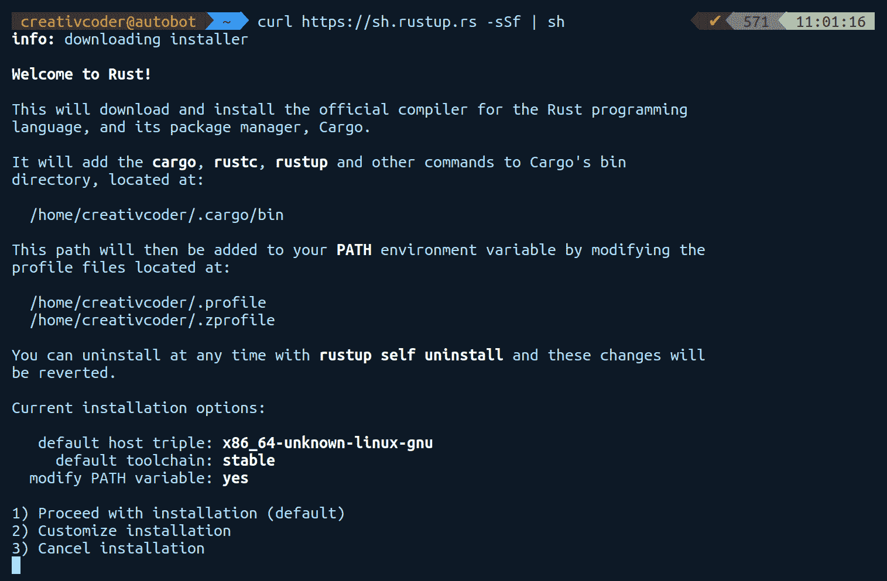
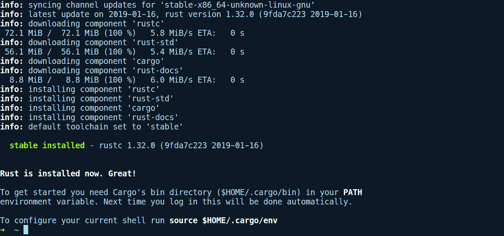
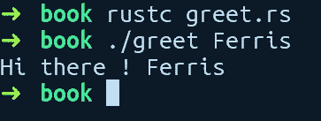
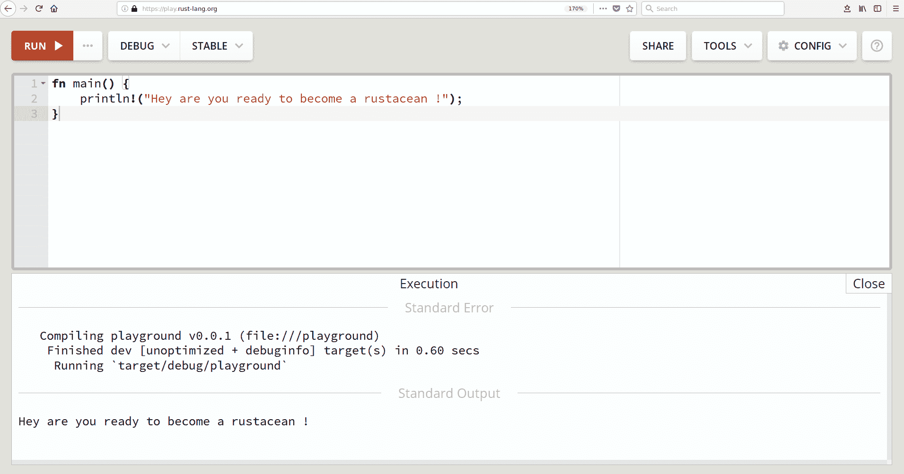
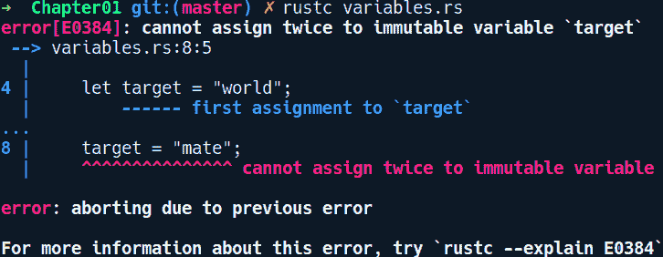
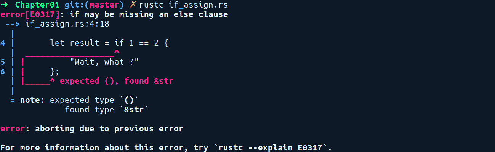
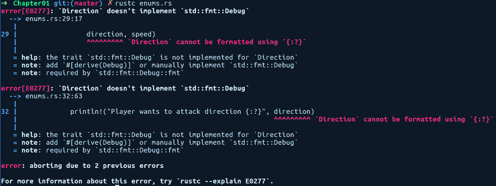
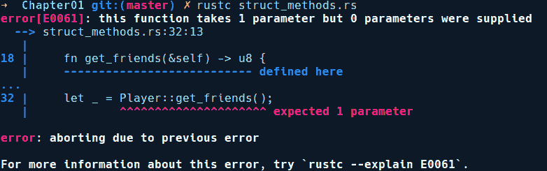

# 第一章：Rust 入门

学习一门新语言就像建造一座房子——基础需要牢固。使用一门能改变你思考代码方式的语言，一开始总是需要更多的努力，并且重要的是要意识到这一点。然而，最终的结果是，你可以通过这些新发现的概念和工具来转变你的思维方式。

本章将带你快速了解 Rust 的设计理念，其语法和类型系统的概述。我们假设你具备主流语言（如 C、C++或 Python）的基本知识，以及围绕面向对象编程的思想。每个部分都将包含示例代码及其解释。将有大量的代码示例和编译器的输出，帮助你熟悉这门语言。我们还将简要介绍这门语言的历史以及它如何持续发展。

熟悉一门新语言需要毅力、耐心和实践。我强烈建议所有读者手动编写代码，而不是复制粘贴这里列出的代码示例。编写和调试 Rust 代码的最好部分是来自编译器的精确且有用的错误信息，Rust 社区通常喜欢称之为错误驱动开发。在这本书的整个过程中，我们将频繁地看到这些错误，以了解编译器是如何看待我们的代码的。

在本章中，我们将涵盖以下主题：

+   Rust 是什么，为什么你应该关心？

+   安装 Rust 编译器和工具链

+   语言及其语法的简要概述

+   最后的练习，我们将把所学的内容综合运用

# Rust 是什么，为什么你应该关心？

"Rust 是来自过去的科技，用来拯救未来免于自身的问题。"

*                                                                                                                                                                                                                                                                                                                                                                                                                                               - 格雷顿·霍华德*

Rust 是一种快速、并发、安全且赋予力量的编程语言，最初由 *Graydon Hoare* 在 2006 年启动并开发。现在它是一个开源语言，主要由来自 Mozilla 的团队开发，同时得到了许多开源人士的合作。第一个稳定版本 1.0 在 2015 年 5 月发布。该项目始于缓解 C++ 在 **gecko** 中使用时出现的内存安全问题。Gecko 是 Mozilla Firefox 浏览器中使用的浏览器引擎。C++ 并非易驯的语言，其并发抽象容易被误用。由于 Gecko 使用 C++，在 2009 年和 2011 年尝试并行化其 **级联样式表**（**CSS**）解析代码以利用现代并行 CPU 时失败了。这是因为并发的 C++ 代码难以维护和推理。在众多开发者共同协作于 gecko 的庞大代码库时，用 C++ 编写并发代码并非易事。为了逐步消除 C++ 的痛苦部分，Rust 诞生了，随之而来的是 Servo，一个从头开始创建浏览器引擎的新研究项目。Servo 项目通过使用最前沿的语言特性为语言团队提供反馈，反过来，这些特性又影响了语言的发展。大约在 2017 年 11 月，Servo 项目的部分内容，尤其是 **stylo** 项目（一个用 Rust 编写的并行 CSS 解析器），开始随最新的 Firefox 版本（Project Quantum）发布，这在如此短的时间内是一项了不起的成就。Servo 的最终目标是逐步用其组件替换 gecko 中的组件。

Rust 吸收了许多语言的灵感，其中最值得注意的是 Cyclone（C 语言的安全方言）在基于区域的内存管理技术方面的理念；C++ 在 RAII 原则方面，以及 Haskell 在类型系统、错误处理类型和类型类方面。

**RAII** 代表 **资源获取即初始化**，这是一种范式，表明资源必须在对象的初始化期间获取，并在它们的析构函数被调用或它们被释放时必须释放。

该语言具有非常小的运行时，不需要垃圾回收，并且默认优先使用栈分配（相对于堆分配的额外开销）来分配任何在程序中声明的值。我们将在 第五章 中解释所有这些内容，*内存管理和安全性*。Rust 编译器 **rustc** 最初是用 Ocaml（一种函数式语言）编写的，并在 2011 年成为自宿主编译器，那时它已经用自己编写了。

自宿主编译器是指通过编译其自己的源代码来构建编译器。这个过程被称为编译器的引导。编译器自己的源代码作为编译器的一个非常好的测试用例。

Rust 语言在 GitHub 上公开开发，地址为 [`github.com/rust-lang/rust`](https://github.com/rust-lang/rust)，并且以较快的速度持续进化。新特性通过社区驱动的**请求评论**（**RFC**）流程添加到语言中，任何人都可以提出新的语言特性。这些特性随后在 RFC 文档中详细描述。然后，对 RFC 进行共识寻求，如果达成一致，则开始该特性的实施阶段。实施后的特性将由社区进行审查，最终在经过用户在夜间版本中的多次测试后，合并到主分支。从社区获取反馈对于语言的进化至关重要。每六周，编译器会发布一个新的稳定版本。除了快速移动的增量更新外，Rust 还具有版本的概念，旨在为语言提供综合更新。这包括工具、文档、其生态系统，以及逐步引入任何破坏性变更。到目前为止，已经有两个版本：*Rust 2015*，该版本侧重于稳定性，以及*Rust 2018*，这是撰写本书时的当前版本，侧重于生产力。

尽管 Rust 是一种通用多范式语言，但它旨在系统编程领域，在这个领域 C 和 C++一直占据主导地位。这意味着你可以用它来编写操作系统、游戏引擎以及许多性能关键型应用。同时，它也足够表达，你可以用它构建高性能的 Web 应用、网络服务、类型安全的数据库**对象关系映射器**（**ORM**）库，并且可以通过编译成 WebAssembly 在 Web 上运行。Rust 在构建用于嵌入式平台的安全关键型、实时应用方面也获得了相当的关注，例如基于 Arm 的 Cortex-M 的微控制器，目前这个领域主要被 C 所主导。Rust 在各种领域中的应用范围——它表现得相当出色——在单一编程语言中是非常罕见的。此外，像 Cloudflare、Dropbox*、Chuckfish*、npm 等知名公司已经在他们的高风险项目中将其用于生产。

Rust 被描述为一种静态和强类型语言。静态属性意味着编译器在编译时对所有变量及其类型都有信息，并在编译时进行大部分检查，只在运行时进行非常少的类型检查。其强类型特性意味着它不允许类型之间的自动转换，例如，一个指向整数的变量不能在代码的后续部分被改变为指向字符串。例如，在弱类型语言如 JavaScript 中，你可以轻松地做类似以下操作：`two = "2"; two = 2 + two;`。JavaScript 在运行时会将 `2` 的类型弱化为字符串，从而将 `22` 作为字符串存储在 `two` 中，这与你的意图完全相反，并且毫无意义。在 Rust 中，相同的代码，即 `let mut two = "2"; two = 2 + two;`，将在编译时被捕获，并抛出以下错误：`cannot add `&str` to `{integer}``。这一特性使得代码重构更加安全，并在编译时而不是在运行时捕获大多数错误。

使用 Rust 编写的程序既具有很高的表达性，又具有高性能，这意味着你可以拥有类似于高阶函数和惰性迭代器等高级函数式语言的大多数特性，同时它编译后的代码效率又像 C/C++ 程序一样高效。支撑其许多设计决策的核心理念是编译时内存安全、无畏并发和零成本抽象。让我们详细阐述这些观点。

**编译时内存安全**：Rust 编译器可以在编译时跟踪程序中拥有资源的变量，并且这一切都不需要垃圾回收器来完成。

资源可以是内存地址、一个持有值的变量、共享内存引用、文件句柄、网络套接字或数据库连接句柄。

这意味着你不会在运行时遇到指针使用后释放、重复释放或悬垂指针等臭名昭著的问题。Rust 中的引用类型（在它们前面有 `&` 的类型）隐式地关联着一个生命周期标签（例如 `'foo'），有时程序员还会显式地对其进行注释。通过生命周期，编译器可以跟踪代码中可以安全使用引用的地方，如果发现非法使用，则在编译时报告错误。为了实现这一点，Rust 通过在引用上使用这些生命周期标签来运行借用/引用检查算法，确保你永远不能访问已经被释放的内存地址。它还确保在某个变量使用指针时，你不能释放该指针。我们将在第五章“内存管理和安全性”中详细介绍这一点。

**零成本抽象**：编程全部关于管理复杂性，而良好的抽象有助于简化这一点。让我们通过 Rust 和 Kotlin（一个针对 **Java 虚拟机**（**JVM**）的语言，它允许我们编写高级代码，易于阅读和推理）中抽象的一个优秀例子来探讨抽象。我们将比较 Kotlin 的流和 Rust 的迭代器在操作数字列表时的表现，并对比 Rust 提供的零成本抽象原则。这里的抽象是能够使用接受其他方法作为参数的方法来根据条件过滤数字，而不使用手动循环。在这里使用 Kotlin 是因为它与 Rust 的视觉相似性。代码相当简单易懂，我们的目标是给出一个高级解释。我们将略过代码的细节，因为整个例子的主要目的是理解零成本属性。

首先，让我们看看 Kotlin 中的代码（以下代码可以在线运行：[`try.kotlinlang.org`](https://try.kotlinlang.org/#/UserProjects/p1dcj8hnumcloa96jsq9t8q8ba/bjptps10adpigeoe1k4bdg1m46)):

```rs
1\. import java.util.stream.Collectors
2\. 
3\. fun main(args: Array<String>) {
5\.     // Create a stream of numbers
6\.     val numbers = listOf(1, 2, 3, 4, 5, 6, 7, 8, 9, 10).stream()
7\.     val evens = numbers.filter { it -> it % 2 == 0 } 
8\.     val evenSquares = evens.map { it -> it * it }  
9\.     val result = evenSquares.collect(Collectors.toList())
10\.    println(result)       // prints [4,16,36,64,100]
11\.    
12\.    println(evens)
13\.    println(evenSquares)
14\. }
```

我们创建一个数字流（第 6 行）并调用一系列方法（`filter` 和 `map`）来转换元素，只收集偶数的平方。这些方法可以接受一个闭包或函数（即第 8 行的 `it -> it * it`）来转换集合中的每个元素。在函数式风格的语言中，当我们对流/迭代器调用这些方法时，对于每个这样的调用，语言都会创建一个中间对象来保持与正在执行的操作相关的任何状态或元数据。因此，`evens` 和 `evenSquares` 将是两个不同的中间对象，它们在 JVM 堆上分配。在堆上分配东西会产生内存开销。这就是我们在 Kotlin 中必须支付的抽象额外成本！

当我们打印 `evens` 和 `evenSquares` 的值时，我们确实得到不同的对象，如下所示：

`java.util.stream.ReferencePipeline$Head@51521cc1`

`java.util.stream.ReferencePipeline$3@1b4fb997`

`@` 符号后面的十六进制值是在 JVM 上对象的哈希码。由于哈希码不同，它们是不同的对象。

在 Rust 中，我们做同样的事情（以下代码可以在线运行：[`gist.github.com/rust-play/e0572da05d999cfb6eb802d003b33ffa`](https://gist.github.com/rust-play/e0572da05d999cfb6eb802d003b33ffa)):

```rs
1\. fn main() {
2\.     let numbers = vec![1, 2, 3, 4, 5, 6, 7, 8, 9, 10].into_iter();
3\.     let evens = numbers.filter(|x| *x % 2 == 0);
4\.     let even_squares = evens.clone().map(|x| x * x);
5\.     let result = even_squares.clone().collect::<Vec<_>>();
6\.     println!("{:?}", result);      // prints [4,16,36,64,100]
7\.     println!("{:?}\n{:?}", evens, even_squares);
8\. }
```

略过细节，在第 2 行我们调用 `vec![]` 来在堆上创建一个数字列表，然后调用 `into_iter()` 来使其成为数字的迭代器/流。`into_iter()` 方法从一个集合（在这里，`Vec <i32>` 是一个有符号 32 位整数的列表）创建一个包装迭代器类型，`IntoIter([1,2,3,4,5,6,7,8,9,10])`。这个迭代器类型引用原始数字列表。然后我们执行过滤和映射转换（第 3 和 4 行），就像我们在 Kotlin 中做的那样。第 7 和 8 行打印 `evens` 和 `even_squares` 的类型，如下（为了简洁起见，省略了一些细节）：

| `evens:`  | ` Filter { iter: IntoIter( <numbers> ) } ` |
| --- | --- |
| `even_squares:` | ` Map { iter: Filter { iter: IntoIter( <numbers> ) }}` |

中间对象`Filter`和`Map`是包装类型（不在堆上分配），它们本身是包装器，持有对第 2 行原始数字列表的引用。在第 4 行和第 5 行调用`filter`和`map`时创建的包装器结构之间没有任何指针间接引用，并且不产生堆分配开销，这与 Kotlin 的情况不同。所有这些都归结为高效的汇编代码，这与手动使用循环编写的版本相当。

**无畏并发**：当我们说 Rust 是并发安全的，我们的意思是该语言具有**应用程序编程接口**（**API**）和抽象，使得编写正确且安全的并发代码变得非常容易。与 C++相比，编写并发代码时出错的可能性相当高。在 C++中对多个线程的数据访问进行同步时，你需要负责每次进入临界区时调用`mutex.lock()`，并在退出该区域时调用`mutex.unlock()`：

```rs
// C++

mutex.lock();                         // Mutex locked, good to go 
 // Do super critical stuff
mutex.unlock();                       // We're done
```

临界区：这是一组需要原子执行的指令/语句。在这里，“原子”意味着没有其他线程可以中断临界区中当前正在执行的线程，并且在临界区代码执行期间，任何线程都不会感知到中间值。

在一个大型代码库中，许多开发者协作编写代码，你可能会忘记在从多个线程访问共享对象之前调用`mutex.lock()`，这可能导致数据竞争。在其他情况下，你可能会忘记解锁`mutex`，导致其他想要访问数据的线程饥饿。

Rust 对此有不同的看法。在这里，你将数据包裹在`Mutex`类型中，以确保从多个线程对数据进行同步可变访问：

```rs
// Rust

use std::sync::Mutex;

fn main() {
    let value = Mutex::new(23);
    *value.lock().unwrap() += 1;   // modify
}                                  // unlocks here automatically
```

在前面的代码中，我们在对 `value` 调用 `lock()` 之后能够修改数据。Rust 使用保护共享数据本身而不是代码的概念。与 C++ 不同，与 `Mutex` 和受保护数据的交互不是独立的。你不能在不调用 `Mutex` 类型的 `lock` 的情况下访问内部数据。那么释放锁呢？好吧，调用 `lock()` 会返回一个名为 `MutexGuard` 的东西，当变量超出作用域时会自动释放锁。这是 Rust 提供的许多安全并发抽象之一。我们将在 第八章 中详细介绍它们，即 *并发*。另一个新颖的想法是标记特性概念，它在编译时验证并确保并发代码中对数据的同步和安全的访问。特性在 第四章 中详细描述，*类型、泛型和特性*。类型使用标记特性 `Send` 和 `Sync` 进行注释，以指示它们是否可以安全地发送到线程或线程之间共享。当程序向线程发送值时，编译器会检查该值是否实现了所需的标记特性，如果未实现，则禁止使用该值。这样，Rust 允许你编写无需担心的并发代码，在编译时编译器会捕获多线程代码中的错误。编写并发代码已经很困难了。使用 C/C++，它变得更加困难且晦涩。CPU 的时钟频率并没有增加；相反，我们增加了更多的核心。因此，并发编程是未来的方向。Rust 使编写并发代码变得轻而易举，并降低了许多人编写安全并发代码的门槛。

Rust 还采用了 C++ 的 RAII 习惯用法进行资源初始化。这种技术基本上将资源的生命周期与对象的生存周期绑定在一起，而堆分配类型的释放则是通过 `drop` 方法来完成的，该方法由 `drop` 特性提供。当变量超出作用域时，它会自动调用。它还用 `Result` 和 `Option` 类型替换了空指针的概念，我们将在 第六章 中详细介绍，即 *错误处理*。这意味着 Rust 不允许代码中出现空/未定义的值，除非通过外部函数接口与其他语言交互，或者在使用不安全代码时。该语言还强调组合优于继承，并具有一个特性系统，该系统由数据类型实现，类似于 **Haskell** 类型类，也称为增强版的 Java 接口。Rust 中的特性是其许多功能的支柱，正如我们将在接下来的章节中看到的。

最后但同样重要的是，Rust 的社区非常活跃和友好，该语言有全面的文档，可以在 [`doc.rust-lang.org`](https://doc.rust-lang.org) 找到。连续三年（2016、2017 和 2018 年），Stack Overflow 的开发者调查将 Rust 评为最受欢迎的编程语言，因此可以说整个编程社区都非常关注它。总的来说，如果你旨在编写高性能软件，同时享受许多现代语言特性和一个出色的社区，那么你应该关注 Rust！

# 安装 Rust 编译器和工具链

Rust 工具链有两个主要组件：编译器 **rustc** 和包管理器 **cargo**，它有助于管理 Rust 项目。工具链有三个发布渠道：

+   **Nightly**：来自主开发分支的每日成功构建。这包含了所有最新的功能，其中许多是不稳定的。

+   **Beta**：每六周发布一次。从一个新的 beta 分支中提取。它只包含标记为稳定的特性。

+   **Stable**：每六周发布一次。之前的 beta 分支成为新的稳定发布。

鼓励开发者使用稳定发布渠道。然而，nightly 版本提供了前沿特性，某些库和程序需要它。你可以使用 rustup 轻松切换到 nightly 工具链。我们稍后将看到如何做到这一点。

# 使用 rustup.rs

Rustup 是一个工具，用于在所有支持的平台上安装 Rust 编译器。为了使不同平台上的开发者更容易下载和使用该语言，Rust 团队开发了 rustup。它是一个用 Rust 编写的命令行工具，提供了一种简单的方式来安装编译器的预构建二进制文件和用于交叉编译的标准库的二进制构建。它还可以安装其他组件，例如 Rust 源代码、文档、**Rust 格式化工具**（**rustfmt**）、**Rust 语言服务器**（**RLS** 用于 IDEs），以及其他开发者工具，并且它在所有平台上运行，包括 Windows。

从他们的官方页面 [`rustup.rs`](https://rustup.rs) 可以看到，安装工具链的推荐方法是运行以下命令：

```rs
curl https://sh.rustup.rs -sSf | sh
```

默认情况下，安装程序会安装 Rust 编译器的稳定版本、其包管理器 Cargo 以及语言的标准化库文档，以便可以离线查看。这些默认安装在 `~/.cargo` 目录下。Rustup 还会更新你的 `PATH` 环境变量，使其指向此目录。

以下是在 Ubuntu 16.04 上运行先前命令的截图：



如果你需要对你的安装进行任何更改，请选择 2。然而，默认设置对我们来说已经足够好了，所以我们将继续选择 1。以下是安装后的输出：



Rustup 还具有其他功能，例如通过运行 `rustup update` 更新工具链到最新版本。它也可以通过 `rustup self update` 更新自身。它还提供了特定目录的工具链配置。默认工具链被全局设置为安装的工具链，在大多数情况下是稳定版工具链。你可以通过调用 `rustup show` 来查看默认的工具链。如果你想为你的某个项目使用最新的夜间版工具链，你可以通过运行 `rustup override set nightly` 告诉 rustup 为特定目录切换到夜间版。如果出于某种原因，有人想使用工具链的旧版本或降级（比如，2016-06-03 的夜间构建），如果运行 `rustup install nightly-2016-06-03`，rustup 也可以下载它，然后通过 `override` 子命令设置相同的版本。有关 rustup 的更多信息，请参阅 [`github.com/rust-lang-nursery/rustup.rs`](https://github.com/rust-lang-nursery/rustup.rs)。

**注意**：本书中的所有代码示例和项目都是基于编译器版本 `rustc 1.32.0 (9fda7c223 2019-01-16)`。

现在，你应该已经拥有了编译和运行 Rust 编写的程序所需的一切。让我们开始 Rust 之旅吧！

# 语言之旅

对于基本语言特性，Rust 并没有偏离你在其他语言中习惯的内容太远。在高级层面，一个 Rust 程序被组织成模块，其中根模块包含一个 `main()` 函数。对于可执行文件，根模块通常是 `main.rs` 文件，而对于库，则是 `lib.rs` 文件。在一个模块内部，你可以定义函数、导入库、定义类型、创建常量、编写测试和宏，甚至创建嵌套模块。我们将逐一了解它们，但让我们从基础开始。这是一个简单的 Rust 程序，用于问候你：

```rs
// greet.rs

1\. use std::env;
2\. 
3\. fn main() {
4\.    let name = env::args().skip(1).next();
5\.    match name {
6\.       Some(n) => println!("Hi there ! {}", n),
7\.       None => panic!("Didn't receive any name ?")
8\.    }
9\. }
```

让我们编译并运行这个程序。将其写入名为 `greet.rs` 的文件中，并使用文件名运行 `rustc`，然后将你的名字作为参数传递。我传递了名字 `Ferris`，这是 Rust 的非官方吉祥物，在我的机器上得到了以下输出：



太棒了！它问候了 `Ferris`。让我们逐行浏览这个程序。

在第 1 行，我们从 `std` crate（库被称为 **crate**）中导入了一个名为 `env` 的模块。`std` 是 Rust 的标准库。在第 3 行，我们有我们常用的 `main` 函数。然后，在第 4 行，我们调用 `env` 模块中的 `args()` 函数，该函数返回一个迭代器（序列），其中包含传递给我们的程序的参数。由于第一个参数包含我们的程序名称，我们想要跳过它，所以我们调用 `skip` 并传入一个数字，这表示我们要跳过多少个元素（`1`）。由于迭代器在 Rust 中是惰性的，不会预先计算任何东西，因此我们必须明确要求它提供下一个元素，所以我们调用 `next()`，它返回一个名为 `Option` 的枚举类型。这可以是 `Some(value)` 值或 `None` 值，因为用户可能会忘记提供参数。

在第 5 行，我们使用 Rust 的强大 `match` 表达式对变量 `name` 进行操作，并检查它是否是 `Some(n)` 或 `None` 值。`match` 与 `if else` 构造类似，但更强大。在第 6 行，当它是 `Some(n)` 时，我们调用 `println!()`，传入我们的内部字符串变量 `n`（当使用 `match` 表达式时，它会自动声明），然后问候我们的用户。`println!` 调用不是一个函数，而是一个 *宏*（它们都以 ! 结尾）。最后，在第 7 行，如果它是枚举的 `None` 变体，我们只是 `panic!()`（另一个宏），这会导致程序终止，并留下一个错误消息。

`println!` 宏，正如我们所见，接受一个字符串，该字符串可以使用 `"{}"` 语法包含用于项的占位符。这些字符串被称为 **格式字符串**，而字符串中的 `"{}"` 被称为 **格式说明符**。对于打印简单类型，如原始类型，我们可以使用 `"{}"` 格式说明符，而对于其他类型，我们使用 `"{:?}"` 格式说明符。不过，这里还有一些细节。当 `println!` 遇到格式说明符，即 `"{}"`，以及相应的替换值时，它会调用该值上的一个方法，该方法返回其字符串表示形式。这个方法是 trait 的一部分。对于 `"{}"` 说明符，它调用 `Display` trait 中的方法，而对于 `"{:?}"`，它调用 `Debug` trait 中的方法。后者主要用于调试，而前者用于显示数据类型的人类可读输出。这与 Java 中的 `toString()` 方法有些相似。在开发过程中，你通常需要打印数据类型以进行调试。当使用 `"{:?}"` 说明符时，如果这些方法在类型上不可用，我们则需要在该类型上添加一个 `#[derive(Debug)]` **属性**来获取这些方法。我们将在后续章节中详细解释属性，但预计你将在未来的代码示例中看到这一点。我们还将回顾第九章中的 `println!` 宏，*使用宏进行元编程*。

手动运行 **rustc** 并非真实程序的正确做法，但对于本章中的这些小程序来说，这样做是可以的。在后续章节中，我们将使用 Rust 的包管理器来构建和运行我们的程序。除了在本地运行编译器之外，还可以使用官方在线编译器 **Rust playground** 来运行代码示例，该编译器可以在 [`play.rust-lang.org`](http://play.rust-lang.org) 找到。以下是我机器上的截图：



Rust playground 还支持导入和使用外部库，以便在尝试示例程序时使用。

在前面的示例中，我们得到了一个基本的 Rust 程序的高级概述，但没有深入所有细节和语法。在下一节中，我们将分别解释语言特性和它们的语法。以下解释旨在为您提供足够的背景知识，以便您能够快速开始编写 Rust 程序，而无需详尽地了解所有用例。为了简洁起见，每个部分还包含对解释这些概念的章节的引用。此外，Rust 文档页面 [`doc.rust-lang.org/std/index.html`](https://doc.rust-lang.org/std/index.html) 将帮助您深入了解，并且具有内置的搜索功能，非常易于阅读。鼓励您积极搜索以下章节中解释的任何结构。这将帮助您更好地理解您正在学习的概念。

本章中的所有代码示例都可以在本书的 GitHub 仓库中找到 ([PacktPublishing/Mastering-RUST-Second-Edition](https://github.com/PacktPublishing/Mastering-RUST-Second-Edition))。对于本章，它们位于 第一章，*Rust 入门* 目录 – 本书其余章节也遵循相同的约定。

一些代码文件被故意设计为无法编译，这样您就可以在编译器的帮助下自己修复它们。

话虽如此，让我们从 Rust 中的基本原始类型开始。

# 原始类型

Rust 有以下内置原始类型：

+   `bool`: 这些是常规布尔值，可以是 `true` 或 `false`。

+   `char`: 字符，例如 `e`。

+   整数类型：这些类型以位宽为特征。Rust 支持宽度高达 128 位的整数：

    | 有符号 | 无符号 |
    | --- | --- |
    | `i8` | `u8` |
    | `i16` | `u16` |
    | `i32` | `u32` |
    | `i64` | `u64` |
    | `i128` | `u128` |

+   `isize`: 指针大小的有符号整数类型。在 32 位 CPU 上相当于 `i32`，在 64 位 CPU 上相当于 `i64`。

+   `usize`: 指针大小的无符号整数类型。在 32 位 CPU 上相当于 `i32`，在 64 位 CPU 上相当于 `i64`。

+   `f32`: 32 位浮点类型。实现了 IEEE 754 浮点表示标准。

+   `f64`: 64 位浮点类型。

+   `[T; N]`：一个固定大小的数组，对于元素类型 `T` 和非负编译时常量大小 N。

+   `[T]`：任何类型 `T` 的连续序列的动态大小视图。

+   `str`：字符串切片，主要用于引用，即 `&str`。

+   `(T, U, ..)`：一个有限序列，其中 T 和 U 可以是不同类型。

+   `fn(i32) -> i32`：一个接受 `i32` 并返回 `i32` 的函数。函数也有类型。

# 声明变量和不可变性

变量允许我们存储一个值，并在代码中稍后轻松地引用它。在 Rust 中，我们使用 `let` 关键字来声明变量。我们已经在上一节的 `greet.rs` 示例中看到了它的身影。在主流的命令式语言，如 C 或 Python 中，初始化变量并不会阻止你将其重新赋值给其他值。Rust 在这里与主流做法不同，它默认使变量不可变，也就是说，你初始化变量后不能将其赋值给其他值。如果你需要变量稍后指向其他东西（同一类型），你需要在它前面加上 `mut` 关键字。Rust 要求你尽可能明确地表达你的意图。考虑以下代码：

```rs
// variables.rs

fn main() {
    let target = "world";
    let mut greeting = "Hello";
    println!("{}, {}", greeting, target);
    greeting = "How are you doing";
    target = "mate";
    println!("{}, {}", greeting, target);
}
```

我们声明了两个变量，`target` 和 `greeting`。`target` 是一个不可变绑定，而 `greeting` 前面有一个 `mut`，使其成为一个可变绑定。如果我们运行这个程序，则会得到以下错误：



如前述错误信息所示，Rust 不允许你再次对 `target` 进行赋值。为了使这个程序编译，我们需要在 `let` 语句中的 `target` 前面添加 `mut`，然后再次编译和运行它。以下是你运行程序时的输出：

```rs
$ rustc variables.rs
$ ./variables
Hello, world
How are you doing, mate
```

`let` 在 Rust 中做的不只是赋值变量。它是一个模式匹配语句。在 第七章 的 *高级概念* 中，我们将更详细地探讨 `let`。接下来，我们将看看函数。

# 函数

函数将一系列指令抽象成命名实体，可以在稍后通过其他代码调用，有助于管理复杂性。我们已经在我们的 `greet.rs` 程序中使用了一个函数，即 `main` 函数。让我们看看我们如何定义另一个函数：

```rs
// functions.rs

fn add(a: u64, b: u64) -> u64 {
    a + b
}

fn main() {
    let a: u64 = 17;
    let b = 3;
    let result = add(a, b);
    println!("Result {}", result);
}
```

在前面的代码中，我们创建了一个名为 `add` 的新函数。使用 `fn` 关键字来创建函数，后面跟着其名称 `add`，括号内的参数 `a` 和 `b`，以及花括号 `{}` 内的函数体。参数的类型位于冒号 `:` 的右侧。函数的返回类型使用 `->` 符号指定，后面跟着类型 `u64`，如果函数没有返回值，则可以省略。函数也有类型。我们的 `add` 函数类型表示为 `fn(u64, u64) -> u64`。它们也可以存储在变量中，并传递给其他函数。

如果你查看`add`函数的主体，我们不需要`return`关键字来返回`a + b`，就像在其他语言中那样。最后一个表达式会自动返回。然而，我们确实有`return`关键字可用于提前返回。函数基本上是返回值的表达式，默认情况下返回值类型为`()`（单元）类型，类似于 C/C++中的`void`返回类型。它们也可以在其他函数内声明。这种用例是当你有一个在函数内部的功能（比如`foo`）难以作为语句序列进行推理时。在这种情况下，可以在局部函数`bar`中提取这些行，然后`bar`在父函数`foo`内部定义。

在`main`函数中，我们使用`let`关键字声明了两个变量`a`和`b`。与`b`一样，我们甚至可以省略指定类型，因为 Rust 在大多数情况下能够通过检查你的代码来推断变量的类型。这也适用于`result`，它是一个`u64`值。这个特性有助于防止类型签名杂乱，并提高代码的可读性，尤其是在你的类型嵌套在具有长名称的其他类型内部时。

Rust 的类型推断基于 Hindley Milner 类型系统。它是一组规则和算法，使编程语言能够进行类型推断。这是一种高效的类型推断方法，以线性时间执行，使得对大型程序进行类型检查变得实用。

我们也可以有修改其参数的函数。考虑以下代码：

```rs
// function_mut.rs

fn increase_by(mut val: u32, how_much: u32) {
    val += how_much;
    println!("You made {} points", val);
}

fn main() {
    let score = 2048;
    increase_by(score, 30);
}
```

我们声明了一个`score`变量，其值为`2048`，并调用了`increase_by`函数，将`score`和值`30`作为第二个参数传递。在`increase_by`函数中，我们指定第一个参数为`mut val`，表示该参数应被视为可变的，这允许从函数内部修改变量。我们的`increase_by`函数修改了`val`绑定并打印了值。以下是运行程序时的输出：

```rs
$ rustc function_mut.rs 
$ ./function_mut 
You made 2078 points
```

接下来，让我们看看闭包。

# 闭包

Rust 也支持闭包。闭包类似于函数，但它们具有更多关于它们声明时的环境或作用域的信息。虽然函数与它们的名字相关联，但闭包是无名的定义，但可以赋值给变量。Rust 类型推断的另一个优点是，在大多数情况下，你可以指定闭包的参数而不需要它们的类型。这里是最简单的闭包示例：`let my_closure = || ();`。我们定义了一个无参数的闭包，它什么也不做。我们可以通过调用`my_closure()`来调用它，就像函数一样。两个垂直条`||`包含闭包的参数（如果有），例如`|a, b|`。当 Rust 无法确定正确的类型时，有时需要指定参数的类型（`|a: u32|`）。像函数一样，闭包也可以存储在变量中，稍后调用或传递给其他函数。然而，闭包的主体可以是一行表达式，也可以是一对花括号，用于多行表达式。一个更复杂的闭包可能如下所示：

```rs
// closures.rs

fn main() {
    let doubler = |x| x * 2;
    let value = 5;
    let twice = doubler(value);
    println!("{} doubled is {}", value, twice);

    let big_closure = |b, c| {
        let z = b + c;
        z * twice
    };

    let some_number = big_closure(1, 2);
    println!("Result from closure: {}", some_number);
}
```

在前面的代码中，我们定义了两个闭包：`doubler`和`big_closure`。`doubler`将给定的值加倍；在这种情况下，它从父作用域或环境（即`main`函数）传递`value`。同样，在`big_closure`中，我们使用其环境中的变量`twice`。这个闭包在花括号内有多行表达式，并且需要以分号结束，以便我们可以将其赋值给`big_closure`变量。稍后，我们调用`big_closure`，传递`1, 2`，并打印`some_number`。

闭包的主要用途是作为高阶函数的参数。高阶函数是一种接受另一个函数或闭包作为其参数的函数。例如，标准库中的`thread::spawn`函数接受一个闭包，在其中你可以编写你想要在另一个线程中运行的代码。另一个闭包提供便利抽象的例子是当你有一个操作集合（如`Vec`）的函数，而你想要根据某些条件过滤项目时。Rust 的`Iterator`特质有一个名为`filter`的方法，它接受一个闭包作为参数。这个闭包由用户定义，它返回`true`或`false`，具体取决于用户想要如何过滤集合中的项目。我们将在第七章高级概念中更深入地了解闭包。

# 字符串

字符串是任何编程语言中最常用的数据类型之一。在 Rust 中，它们通常以两种形式存在：`&str`类型（发音为*stir*）和`String`类型。Rust 字符串保证是有效的 UTF-8 编码字节序列。它们不像 C 字符串那样以空字符终止，并且可以在它们之间包含空字节。以下程序展示了这两种类型的作用：

```rs
// strings.rs

fn main() {
    let question = "How are you ?";            // a &str type
    let person: String = "Bob".to_string();
    let namaste = String::from("नमस्ते");        // unicodes yay!

    println!("{}! {} {}", namaste, question, person);
}
```

在前面的代码中，`person`和`namaste`是`String`类型，而`question`是`&str`类型。你可以用多种方式创建`String`类型。字符串是在堆上分配的，而`&str`类型通常是现有字符串的指针，这些字符串可能位于栈上、堆上或在编译对象的代码段的数据段中。`&`是一个用于创建任何类型的指针的运算符。在初始化前面的代码中的字符串后，我们使用`println!`宏通过格式字符串将它们一起打印出来。这就是字符串的非常基础的知识。字符串将在第七章，“高级概念”中详细讲解。

# 条件语句和决策

条件语句在其他语言中也有类似的结构。它们遵循类似于 C 语言的`if {} else {}`结构：

```rs
// if_else.rs

fn main() {
    let rust_is_awesome = true;
    if rust_is_awesome {
        println!("Indeed");
    } else {
        println!("Well, you should try Rust !");
    }
}
```

在 Rust 中，`if`结构不是一个语句，而是一个表达式。在一般的编程术语中，*语句*不会返回任何值，但*表达式*会。这种区别意味着 Rust 中的`if else`条件语句总是返回一个值。这个值可能是一个空的`()`单元类型，也可能是一个实际值。括号内最后一行剩余的内容将成为`if else`表达式的返回值。重要的是要注意，`if`和`else`分支应该有相同的返回类型。此外，我们不需要在`if`条件表达式周围使用括号，正如你可以在前面的代码中看到的那样。我们甚至可以将`if else`块的值赋给一个变量：

```rs
// if_assign.rs

fn main() {
    let result = if 1 == 2 { 
        "Wait, what ?" 
    } else { 
        "Rust makes sense" 
    };

    println!("You know what ? {}.", result);
}
```

当将`if else`表达式返回的值赋值时，我们需要在它们后面加上分号。例如，`if { ...`是一个表达式，而`let`是一个期望我们在末尾加上分号的语句。在赋值的情况下，如果我们从前面的代码中移除`else {}`块，编译器会抛出一个错误，如下所示：



如果没有`else`块，当`if`条件评估为`false`时，结果将是`()`，`result`变量将有两个可能的值，即`()`和`&str`。Rust 不允许在一个变量中存储多个类型。因此，在这种情况下，我们需要`if {}`和`else {}`块返回相同类型的值。此外，在条件分支中添加分号会改变代码的含义。在以下代码中，在`if`块中的字符串后添加分号，编译器会将其解释为你想要丢弃该值：

```rs
// if_else_no_value.rs

fn main() { 
    let result = if 1 == 2 { 
        "Nothing makes sense"; 
    } else { 
        "Sanity reigns"; 
    };

    println!("Result of computation: {:?}", result); 
}
```

在这种情况下，结果将是一个空的`()`，这就是为什么我们不得不稍微改变`println!`表达式（即`{:?}`）；这种类型不能以常规方式打印出来。现在，对于更复杂的多值决策；Rust 还有一个称为`match`表达式的强大结构，我们将在下一节中探讨。

# 匹配表达式

Rust 的 `match` 表达式非常易于使用。它基本上是 C 语言的 `switch` 语句的强化版，允许你根据变量的值做出决策，并且它具有先进的过滤能力。以下是一个使用匹配表达式的程序：

```rs
// match_expression.rs

fn req_status() -> u32 {
    200
}

fn main() {
    let status = req_status();
    match status {
        200 => println!("Success"),
        404 => println!("Not Found"),
        other => {
            println!("Request failed with code: {}", other);
            // get response from cache
        }
    }
}
```

在前面的代码中，我们有一个返回模拟 HTTP 请求状态码 `200` 的 `req_status` 函数，我们在 `main` 中调用它并将结果赋值给 `status`。然后我们使用 `match` 关键字匹配这个值，后面跟着我们想要检查的变量（`status`），然后是一对大括号。在大括号内，我们写表达式——这些被称为 **匹配分支**。这些分支代表了被匹配变量可能取的值。每个匹配分支是通过写出变量的可能值，然后跟一个 `=>`，再然后是右侧的表达式来编写的。在右侧，你可以有一个单行表达式或一个在大括号 `{}` 内的多行表达式。当写成单行表达式时，它们需要用逗号分隔。此外，每个匹配分支必须返回相同的类型。在这种情况下，每个匹配分支返回 Unit 类型 `()`。

`match` 表达式的一个很好的特性或你可以称之为保证是，我们必须对所有可能的值进行穷举匹配。在我们的例子中，这将是列出所有直到 `i32` 最大值的数字。然而，实际上这是不可能的，所以 Rust 允许我们通过使用一个 `catch all` 变量（这里，它是 `other`）或一个 `_`（下划线）来忽略其余的可能性，如果我们想忽略这个值。当有多个可能的值时，匹配表达式是做出关于值的决策的主要方式，而且它们写起来非常简洁。像 `if else` 表达式一样，当用分号分隔时，匹配表达式的返回值也可以在 `let` 语句中分配给一个变量，并且所有匹配分支返回相同的类型。

# 循环

在 Rust 中，重复操作可以通过三种结构实现，即 `loop`、`while` 和 `for`。在所有这些结构中，我们都有常用的 `continue` 和 `break` 关键字，分别允许你跳过循环或从循环中退出。以下是一个使用 `loop` 的例子，它与 C 语言的 `while(true)` 等效：

```rs
// loops.rs 

fn main() { 
    let mut x = 1024;
    loop { 
        if x < 0 { 
            break; 
        } 
        println!("{} more runs to go", x); 
        x -= 1; 
    } 
}
```

`loop` 表示一个无限循环。在前面的代码中，我们简单地递减 `x` 的值，直到它达到条件 `x < 0`，在那里我们退出循环。在 Rust 中使用 `loop` 的一个额外特性是能够给 `loop` 块加上一个标签。这可以在你有两个或更多嵌套循环，并且想要从任何一个循环中退出，而不仅仅是紧邻 `break` 语句的循环时使用。以下是一个使用循环标签退出 `loop` 的例子：

```rs
// loop_labels.rs

fn silly_sub(a: i32, b: i32) -> i32 {
    let mut result = 0;
    'increment: loop {
        if result == a {
            let mut dec = b;
            'decrement: loop {
                if dec == 0 {
                    // breaks directly out of 'increment loop
                    break 'increment;
                } else {
                    result -= 1;
                    dec -= 1;
                }
            }
        } else {
            result += 1;
        }
    }
    result
}

fn main() {
    let a = 10;
    let b = 4;
    let result = silly_sub(a, b);
    println!("{} minus {} is {}", a, b, result);
}
```

在前面的代码中，我们正在进行一个非常低效的减法操作，只是为了演示在嵌套循环中使用标签的用法。在内层`'decrement`标签中，当`dec`等于`0`时，我们可以传递一个标签给`break`（这里，这是`'increment'`），然后跳出外层的`'increment'`循环。

现在，让我们看看`while`循环。这里没有太多花哨的东西：

```rs
// while.rs 

fn main() { 
    let mut x = 1000; 
    while x > 0 { 
        println!("{} more runs to go", x); 
        x -= 1;     
    }
}
```

Rust 也有一个`for`关键字，与其他语言的 for 循环类似，但在实现上却大不相同。Rust 的`for`实际上是一个更强大的重复构造的语法糖，称为*迭代器*。我们将在第七章，*高级概念*中更详细地讨论它们。简单来说，Rust 中的 for 循环只适用于可以转换为迭代器的类型。其中一种类型是`Range`类型。`Range`类型可以指代一个数字范围，例如`(0..10)`。它们可以用在 for 循环中，如下所示：

```rs
// for_loops.rs

fn main() {
    // does not include 10
    print!("Normal ranges: ");
    for i in 0..10 {
        print!("{},", i);
    }

    println!();       // just a newline
    print!("Inclusive ranges: ");
    // counts till 10
    for i in 0..=10 {
        print!("{},", i);
    }
}
```

除了正常的范围语法，即`0..10`，它不包括`10`之外，Rust 还有一个包含范围语法`0..=10`，它迭代直到`10`，如第二个`for`循环所示。现在，让我们继续讨论用户定义的数据类型。

# 用户定义类型

正如其名所示，用户定义类型是由您定义的类型。这些可以由几个类型组成。它们可能是一个原始类型的包装，或者是由几个用户定义类型组成的组合。它们有三种形式：结构体、枚举和联合体，或者更常见地称为**结构体**、**枚举**和**联合体**。它们允许您轻松地表达您的数据。用户定义类型的命名约定遵循驼峰式风格。结构体和枚举比 C 语言的结构体和枚举更强大，而 Rust 中的联合体与 C 语言非常接近，主要是为了与 C 代码库交互。我们将在本节中介绍结构体和枚举，而联合体将在第七章，*高级概念*中介绍。

# 结构体

在 Rust 中，我们可以声明三种结构体形式。其中最简单的是**单元结构体**，它使用`struct`关键字编写，后面跟着其名称和结尾的分号。以下代码示例定义了一个单元结构体：

```rs
// unit_struct.rs

struct Dummy;

fn main() {
    let value = Dummy;
}
```

在前面的代码中，我们定义了一个名为`Dummy`的单元结构体。在`main`函数中，我们可以仅使用其名称来初始化此类型。`value`现在包含了一个`Dummy`类型的实例，并且是一个零大小值。单元结构体在运行时不会占用任何大小，因为它们没有与之关联的数据。单元结构体的用途非常有限。它们可以用来模拟没有数据或状态关联的实体。另一个用途是使用它们来表示错误类型，其中结构体本身足以理解错误，而不需要对其描述。另一个用途是在状态机实现中表示状态。接下来，让我们看看结构体的第二种形式。

结构体的第二种形式是**元组结构体**，它关联着数据。在这里，各个字段没有命名，而是通过在定义中的位置来引用。假设你正在编写一个用于图形应用程序的颜色转换/计算库，并想在代码中表示*RGB*颜色值。我们可以这样表示我们的`Color`类型和相关项：

```rs
// tuple_struct.rs 

struct Color(u8, u8, u8);

fn main() {
    let white = Color(255, 255, 255);

    // You can pull them out by index
    let red = white.0;
    let green = white.1;
    let blue = white.2;

    println!("Red value: {}", red);
    println!("Green value: {}", green);
    println!("Blue value: {}\n", blue);

    let orange = Color(255, 165, 0);

    // You can also destructure the fields directly
    let Color(r, g, b) = orange;
    println!("R: {}, G: {}, B: {} (orange)", r, g, b);

    // Can also ignore fields while destructuring
    let Color(r, _, b) = orange;
}
```

在前面的代码中，`Color(u8, u8, u8)`是一个元组结构体，它被创建并存储在`white`中。然后我们使用`white.0`语法访问`white`中的单个颜色组件。可以通过`variable.<index>`语法访问元组结构体内的字段，其中`index`指的是字段在结构体中的位置，从`0`开始。另一种访问结构体单个字段的方法是使用`let`语句解构结构体。在第二部分，我们创建了一个颜色`orange`。随后，我们编写了`let`语句，左侧是`Color(r, g, b)`，右侧是我们的`orange`。这导致`orange`中的三个字段被存储在`r`、`g`和`b`变量中。`r`、`g`和`b`的类型也会自动为我们推断。

当需要建模具有不到四个或五个属性的数据时，元组结构体是一个理想的选择。超过这个数量会阻碍可读性和推理。对于具有超过三个字段的情况，建议使用类似 C 的结构体，这是第三种形式，也是最常用的形式。考虑以下代码：

```rs
// structs.rs

struct Player {
    name: String,
    iq: u8,
    friends: u8,
    score: u16
}

fn bump_player_score(mut player: Player, score: u16) {
    player.score += 120;
    println!("Updated player stats:");
    println!("Name: {}", player.name);
    println!("IQ: {}", player.iq);
    println!("Friends: {}", player.friends);
    println!("Score: {}", player.score);
}

fn main() {
    let name = "Alice".to_string();
    let player = Player { name,
                          iq: 171,
                          friends: 134,
                          score: 1129 };

   bump_player_score(player, 120);
}
```

在前面的代码中，结构体是以与元组结构体相同的方式创建的，即通过写出`struct`关键字后跟结构体的名称。然而，它们以大括号开始，并且它们的字段声明是有名的。在大括号内，我们可以将字段写成`field: type`逗号分隔的对。创建结构体实例也很简单；我们写出`Player`，然后跟上一对大括号，其中包含逗号分隔的字段初始化。当我们从与字段名称相同的变量初始化字段时，我们可以使用**字段初始化简写**功能，正如前面代码中的`name`字段那样。然后我们可以通过使用`struct.field_name`语法轻松访问创建的实例的字段。在前面的代码中，我们还有一个名为`bump_player_score`的函数，它接受结构体`Player`作为参数。默认情况下，函数参数是不可变的，所以当我们想要修改玩家的分数时，我们需要在我们的函数中将参数更改为`mut player`，这允许我们修改其任何字段。在结构体上有`mut`意味着所有字段都具有可变性。

使用结构体而不是元组结构体的优点在于我们可以以任何顺序初始化字段。它还允许我们为字段提供有意义的名称。作为旁注，结构体的大小仅仅是其各个字段成员的总和，以及如果需要的话，任何数据对齐填充。它们与它们没有任何额外的元数据大小开销相关联。接下来，让我们看看枚举，也称为枚举。

# 枚举

当你需要对一个可以有多种类型的对象进行建模时，枚举是最佳选择。它们通过使用`enum`关键字，后跟枚举名称，然后是一对花括号来创建。在花括号内，我们可以写出该类型的所有可能性，这些被称为**变体**。这些变体可以带或不带包含在其中的数据定义，包含的数据可以是任何原始类型、结构体、元组结构体，甚至是枚举。然而，在递归情况下，当你有一个枚举`Foo`和一个包含`Foo`的变体时，这个变体需要位于一个指针类型（如`Box`、`Rc`等）之后，以避免有递归无限类型定义。因为枚举也可以在栈上创建，所以它们需要有一个预定的尺寸，无限类型定义使得在编译时无法确定大小。现在，让我们看看如何创建一个枚举：

```rs
// enums.rs

enum Direction { 
    N, 
    E, 
    S, 
    W
}

enum PlayerAction {
    Move {
        direction: Direction,
        speed: u8
    },
    Wait, 
    Attack(Direction)   
}

fn main() {
    let simulated_player_action = PlayerAction::Move {
        direction: Direction::N,
        speed: 2,
    };
    match simulated_player_action {
        PlayerAction::Wait => println!("Player wants to wait"),
        PlayerAction::Move { direction, speed } => {
          println!("Player wants to move in direction {:?} with speed {}",
                direction, speed)
        }
        PlayerAction::Attack(direction) => {
            println!("Player wants to attack direction {:?}", direction)
        }
    };
}
```

上述代码定义了两种枚举类型：`Direction`和`PlayerAction`。然后我们通过选择任何变体，例如`Direction::N`或`PlayerAction::Wait`，使用双冒号`::`在它们之间创建它们的实例。请注意，我们不能有一个未初始化的枚举，它必须是其中一个变体。给定一个枚举值，要查看枚举实例具有哪个变体，我们使用模式匹配通过使用*match*表达式。当我们对枚举进行匹配时，我们可以通过将变量放在字段如`PlayerAction::Attack(direction)`中的`direction`等字段的位置来直接解构变体的内容，这反过来意味着我们可以在我们的匹配分支中使用它们。

正如你在我们之前的`Direction`枚举中看到的那样，我们有一个`#[derive(Debug)]`注解。这是一个属性，它允许`Direction`实例使用`println!()`中的`{:?}`格式字符串进行打印。这是通过从名为`Debug`的特质生成方法来完成的。编译器会告诉我们是否缺少`Debug`特质，并给出有关如何修复的建议，因此我们需要在那里使用这个属性：



从函数式程序员的视角来看，结构和枚举也被称为**代数数据类型（ADTs**），因为它们可以表示的可能值的范围可以用代数规则来表示。例如，枚举被称为**求和类型**，因为它可以持有的值范围基本上是其变体值范围的求和，而结构被称为**积类型**，因为其可能的值范围是其各个字段值范围的笛卡尔积。在一般讨论它们时，我们有时会称它们为 ADTs。

# 类型上的函数和方法

没有行为的类型可能有限制，通常我们希望在类型上有函数或方法，这样我们就可以返回它们的新实例而不是手动构建它们，或者这样我们就有能力操作用户定义类型的字段。我们可以通过**impl** **块**来实现这一点，这可以理解为为类型提供实现。我们可以为所有用户定义类型或任何包装类型提供实现。首先，让我们看看如何为结构编写实现。

# 结构上的 Impl 块

我们可以通过两种功能向先前定义的`Player`结构添加行为：一个类似于构造函数的函数，它接受一个名称并设置`Person`中剩余字段的默认值，以及`Person`的 getter 和 setter 方法来设置朋友数量：

```rs
// struct_methods.rs

struct Player {
    name: String,
    iq: u8,
    friends: u8
}

impl Player {
    fn with_name(name: &str) -> Player {
        Player {
            name: name.to_string(),
            iq: 100,
            friends: 100
        }
    }

    fn get_friends(&self) -> u8 {
        self.friends
    }

    fn set_friends(&mut self, count: u8) {
        self.friends = count;
    }
}

fn main() {
    let mut player = Player::with_name("Dave");
    player.set_friends(23);
    println!("{}'s friends count: {}", player.name, player.get_friends());
    // another way to call instance methods.
    let _ = Player::get_friends(&player);
}
```

我们使用`impl`关键字，后跟我们要实现方法的类型，然后是花括号。在花括号内，我们可以编写两种方法：

+   **关联方法**：没有`self`类型作为其第一个参数的方法。`with_name`方法被称为关联方法，因为它没有`self`作为第一个参数。它类似于面向对象语言中的静态方法。这些方法在类型本身上可用，并且不需要类型的实例来调用它们。关联方法通过在方法名前加上结构名和双冒号来调用，如下所示：

```rs
      Player::with_name("Dave");
```

+   **实例方法**：以`self`值作为其第一个参数的函数。这里的`self`符号与 Python 中的`self`类似，指向实现该方法的实例（在这里，这是`Player`）。因此，`get_friends()`方法只能在已经创建的结构实例上调用：

```rs
      let player = Player::with_name("Dave");
      player.get_friends();
```

如果我们使用关联方法语法调用`get_friends`，即`Player::get_friends()`，编译器会给出以下错误：



这里的错误具有误导性，但它表明实例方法基本上是与`self`作为第一个参数关联的方法，并且`instance.foo()`是一种语法糖。这意味着我们也可以这样调用它：`Player::get_friends(&player);`。在这个调用中，我们向方法传递了一个`Player`实例，即`&self`是`&player`。

在类型上，我们可以实现三种实例方法的变体：

+   `self` 作为第一个参数。在这种情况下，调用此方法不会允许你在之后使用该类型。

+   `&self` 作为第一个参数。此方法仅提供对类型实例的读取访问。

+   `&mut self` 作为第一个参数。此方法提供了对类型实例的可变访问。

我们的 `set_friends` 方法是一个 `&mut self` 方法，它允许我们修改 `player` 的字段。我们需要在 `self` 前面使用 `&` 操作符，这意味着 `self` 在方法执行期间被借用，这正是我们想要的。如果没有使用连字符，调用者会将所有权移动到方法中，这意味着值在 `get_friends` 返回后会进行去分配，我们就无法再使用 `Player` 实例了。如果你对术语移动和借用还不理解，不要担心，我们将在第五章，*内存管理和安全性*中解释所有这些内容。 

现在，让我们来看一下枚举的实现。

# 枚举的 Impl 块

我们也可以为枚举提供实现。例如，考虑一个用 Rust 编写的支付库，它公开了一个名为 `pay` 的单一 API：

```rs
// enum_methods.rs

enum PaymentMode {
    Debit,
    Credit,
    Paypal
}

// Bunch of dummy payment handlers

fn pay_by_credit(amt: u64) {
    println!("Processing credit payment of {}", amt);
}
fn pay_by_debit(amt: u64) {
    println!("Processing debit payment of {}", amt);
}
fn paypal_redirect(amt: u64) {
    println!("Redirecting to paypal for amount: {}", amt);
}

impl PaymentMode {
    fn pay(&self, amount: u64) {
        match self {
            PaymentMode::Debit => pay_by_debit(amount),
            PaymentMode::Credit => pay_by_credit(amount),
            PaymentMode::Paypal => paypal_redirect(amount)
        }
    }
}

fn get_saved_payment_mode() -> PaymentMode {
    PaymentMode::Debit
}

fn main() {
    let payment_mode = get_saved_payment_mode();
    payment_mode.pay(512);
}
```

前面的代码中有一个名为 `get_saved_payment_mode()` 的方法，它返回一个用户的保存支付方式。这可以是*信用卡*、*借记卡*或*Paypal*。这最好用枚举（enum）来建模，其中不同的支付方式可以作为其变体添加。然后库为我们提供了一个单一的 `pay()` 方法，我们可以方便地提供要支付的金额。此方法确定枚举的哪个变体，并相应地调度到正确的支付服务提供商，而无需库消费者担心检查使用哪种支付方式。

枚举也广泛用于建模状态机，当与匹配语句结合使用时，它们使得状态转换代码非常简洁易写。它们还用于建模自定义错误类型。当枚举变体没有与之关联的数据时，它们可以像 C 枚举一样使用，其中变体隐式地具有从 `0` 开始的整数值，但也可以手动标记为整型（`isize`）值。这在与外部 C 库交互时很有用。

# 模块、导入和使用语句

语言通常提供一种方法将大型代码库拆分成多个文件以管理复杂性。Java 遵循每个`.java`文件一个公共类的约定，而 C++则提供了头文件和包含语句。Rust 也不例外，它为我们提供了**模块**。模块是命名空间或组织 Rust 程序代码的一种方式。为了在组织代码时提供灵活性，有多种创建模块的方法。模块是一个复杂的概念，为了本节的简洁性，我们将只突出使用它们的重要方面。模块的详细内容在第二章，*使用 Cargo 管理项目*中有所介绍。以下是关于 Rust 中模块的关键要点：

+   每个 Rust 程序都需要有一个根模块。在可执行文件中，通常是`main.rs`文件，而对于库来说，则是`lib.rs`。

+   模块可以在其他模块内部声明，也可以组织成文件和目录。

+   为了让编译器了解我们的模块，我们需要使用`mod`关键字来声明它，就像在根模块中使用`mod my_module;`一样。

+   要使用模块内的任何项目，我们需要使用`use`关键字，以及模块的名称。这被称为将项目引入作用域。

+   在模块内部定义的项目默认是私有的，你需要使用`pub`关键字来将它们暴露给消费者。

这就是模块的简要介绍。模块的一些高级特性也在第七章，*高级概念*中有所涉及。接下来，让我们看看标准库中可用的常用集合类型。

# 集合

通常情况下，你的程序需要处理多个数据实例。为此，我们有了集合类型。根据你的需求和数据在内存中的位置，Rust 提供了许多内置类型来存储数据集合。首先，我们有*数组*和*元组*。然后，在标准库中，我们有动态集合类型，我们将介绍最常用的几种，即*向量*（项目列表）和*映射*（键/值项）。然后，我们还有集合类型的引用，称为*切片*，它基本上是某个其他变量拥有的连续数据片段的视图。让我们先从数组开始。

# 数组

数组有一个固定长度，可以存储相同类型的项目。它们用`[T, N]`表示，其中`T`是任何类型，`N`是数组中的元素数量。数组的大小不能是变量，而必须是字面量`usize`值：

```rs
// arrays.rs

fn main() { 
    let numbers: [u8; 10] = [1, 2, 3, 4, 5, 7, 8, 9, 10, 11]; 
    let floats = [0.1f64, 0.2, 0.3]; 

    println!("Number: {}", numbers[5]);
    println!("Float: {}", floats[2]);
}
```

在前面的代码中，我们声明了一个数组`numbers`，它包含`10`个元素，我们在左侧指定了类型。在第二个数组`floats`中，我们将类型指定为第一个数组项的后缀，即`0.1f64`。这是指定类型的另一种方式。接下来，让我们看看元组。

# 元组

元组与数组的不同之处在于，数组中的元素必须具有相同的类型，而元组中的项可以是不同类型的混合。它们是异构集合，用于存储不同类型的数据很有用。当从函数返回多个值时也可以使用。考虑以下使用元组的代码：

```rs
// tuples.rs

fn main() { 
    let num_and_str: (u8, &str) = (40, "Have a good day!");
    println!("{:?}", num_and_str);
    let (num, string) = num_and_str;
    println!("From tuple: Number: {}, String: {}", num, string);
}
```

在前面的代码中，`num_and_str` 是一个包含两个元素的元组，`(u8, &str)`。我们还可以从已声明的元组中提取值到单独的变量中。在打印元组后，我们在下一行将其解构为 `num` 和 `string` 变量，它们的类型会自动推断。这相当方便。

# 向量

向量类似于数组，但它们的长度或内容不需要预先知道，并且可以根据需要增长。它们在堆上分配。可以通过调用 `Vec::new` 构造函数或使用 `vec![]` 宏来创建：

```rs
// vec.rs

fn main() {
    let mut numbers_vec: Vec<u8> = Vec::new(); 
    numbers_vec.push(1); 
    numbers_vec.push(2); 

    let mut vec_with_macro = vec![1]; 
    vec_with_macro.push(2);
    let _ = vec_with_macro.pop();    // value ignored with `_`

    let message = if numbers_vec == vec_with_macro {
        "They are equal"
    } else {
        "Nah! They look different to me"
    };

    println!("{} {:?} {:?}", message, numbers_vec, vec_with_macro); 
}
```

在前面的代码中，我们以不同的方式创建了两个向量，`numbers_vec` 和 `vec_with_macro`。我们可以使用 `push()` 方法向向量中添加元素，并使用 `pop()` 方法移除元素。如果你访问它们的文档页面，还可以探索更多方法：[`doc.rust-lang.org/std/vec/struct.Vec.html`](https://doc.rust-lang.org/std/vec/struct.Vec.html)。向量也可以使用 `for` 循环语法进行迭代，因为它们也实现了 `Iterator` 特性。

# 哈希映射

Rust 还为我们提供了映射，可以用来存储键值数据。它们来自 `std::collections` 模块，并命名为 `HashMap`。它们通过 `HashMap::new` 构造函数创建：

```rs
// hashmaps.rs

use std::collections::HashMap; 

fn main() { 
    let mut fruits = HashMap::new(); 
    fruits.insert("apple", 3);
    fruits.insert("mango", 6);
    fruits.insert("orange", 2);
    fruits.insert("avocado", 7);
    for (k, v) in &fruits {
        println!("I got {} {}", v, k);
    }

    fruits.remove("orange");
    let old_avocado = fruits["avocado"];
    fruits.insert("avocado", old_avocado + 5);
    println!("\nI now have {} avocados", fruits["avocado"]);
}
```

在前面的代码中，我们创建了一个名为 `fruits` 的新 `HashMap`。然后我们使用 `insert` 方法将一些水果及其数量插入到我们的 `fruits` 映射中。随后，我们使用 `for` 循环遍历键值对，其中我们通过 `&fruits` 获取水果映射的引用，因为我们只想读取键和值。默认情况下，值将被 `for` 循环消耗。在这种情况下，`for` 循环返回一个包含两个字段的元组（`（k，v）`）。还有单独的 `keys()` 和 `values()` 方法可用于分别遍历键和值。`HashMap` 类型中用于哈希键的哈希算法基于 *Robin hood* 开放寻址方案，但可以根据用例和性能替换为自定义哈希器。这就说完了。

接下来，让我们看看切片。

# 切片

切片是一种通用的方式来获取集合类型的一个视图。大多数用例是为了获取对集合类型中某个范围的只读访问。切片基本上是一个指针或引用，它指向由某个其他变量拥有的现有集合类型中的连续范围。在底层，切片是现有数据中的胖指针，这些数据位于栈或堆的某个位置。通过胖指针，意味着它们还包含它们指向的元素数量信息，以及数据指针。

切片用 `&[T]` 表示，其中 `T` 是任何类型。在用法上，它们与数组非常相似：

```rs
// slices.rs

fn main() {
    let mut numbers: [u8; 4] = [1, 2, 3, 4];
    {
        let all: &[u8] = &numbers[..];
        println!("All of them: {:?}", all);
    }

    {
        let first_two: &mut [u8] = &mut numbers[0..2];
        first_two[0] = 100;
        first_two[1] = 99;
    }

    println!("Look ma! I can modify through slices: {:?}", numbers);
}
```

在前面的代码中，我们有一个 `numbers` 数组，它是一个栈分配的值。然后我们使用 `&numbers[..]` 语法从数组 `numbers` 中取一个切片，并将其存储在 `all` 中，其类型为 `&[u8]`。末尾的 `[..]` 表示我们想要获取整个集合的切片。这里我们需要 `&`，因为我们不能有裸值的切片——只能位于指针之后。这是因为切片是**无大小类型**。我们将在第七章，*高级概念*中详细讲解它们。我们也可以提供范围（`[0..2]`）来从任何中间位置或全部获取切片。切片也可以被可变地获取。`first_two` 是一个可变切片，通过它可以修改原始的 `numbers` 数组。

对于敏锐的观察者来说，你可以看到在取切片时，我们使用了额外的成对花括号。它们的存在是为了隔离代码，这些代码获取切片的可变引用而不是不可变引用。没有它们，代码将无法编译。这些概念将在第五章，*内存管理和安全性*中更加清晰。

**注意**：`&str` 类型也属于切片类型（一个 `[u8]`）。与其他字节切片的区别在于，它们保证是 UTF-8 编码。切片也可以从 Vec 或 String 中获取。

接下来，让我们看看迭代器。

# 迭代器

迭代器是一种提供对集合类型元素进行高效操作的构造。尽管它不是一个新概念，但在许多命令式语言中，迭代器被实现为从列表或映射等集合类型构造的*对象*。例如，Python 的 `iter(some_list)` 或 C++ 的 `vector.begin()` 是从现有集合构造迭代器的方法。迭代器最初存在的主要动机是它们提供了一种比使用手动 `for` 循环更高层次的抽象，手动 `for` 循环很容易出现“少一个”的错误。另一个优点是迭代器不会在内存中读取整个集合，并且是惰性的。惰性意味着迭代器仅在需要时才会评估或访问集合中的元素。迭代器还可以与多个转换操作链式使用，例如根据条件过滤元素，并且只有在需要时才会评估这些转换。当需要访问这些元素时，迭代器提供了一个 `next()` 方法，该方法尝试从集合中读取下一个元素。这发生在迭代器评估计算链时。

在 Rust 中，任何实现了 `Iterator` 特性的类型都是迭代器。这种类型可以用于 `for` 循环中遍历其元素。它们为大多数标准库集合类型（如 `Vector`、`HashMap`、`BTreeMap` 等）实现了迭代器，也可以为它们自己的类型实现迭代器。

**注意**：只有当类型具有集合，如语义时，才需要实现 `Iterator` 特性。例如，为 `()` 单位类型实现迭代器特性是没有意义的。

在 Rust 中，迭代器是任何实现了 `Iterator` 特性的类型。这种类型可以用于 `for` 循环中遍历其元素。它们为大多数标准库集合类型（如 `Vector`、`HashMap`、`BTreeMap` 等）实现了迭代器，也可以为它们自己的类型实现迭代器。在 Rust 中，`for` 循环被转换为对正在迭代的对象的 `next` 调用的正常 `match` 表达式。此外，我们可以通过在它们上调用 `iter()` 或 `into_iter()` 来将大多数集合类型转换为迭代器。关于迭代器的信息就这么多——现在，我们可以着手解决以下练习。我们将深入研究迭代器，并在第七章 *高级概念* 中实现一个迭代器。

# 练习 – 修复单词计数器

带着基础知识，现在是时候将我们的知识付诸实践了！在这里，我们有一个程序，它计算文本文件中单词的实例，该文件作为参数传递给它。它几乎完成了，但有几个编译器捕获的错误和一些微妙的错误。以下是我们的不完整程序：

```rs
// word_counter.rs

use std::env;
use std::fs::File;
use std::io::prelude::BufRead;
use std::io::BufReader;

#[derive(Debug)]
struct WordCounter(HashMap<String, u64>);

impl WordCounter {
    fn new() -> WordCounter {
        WordCounter(HashMap::new());
    }

    fn increment(word: &str) {
        let key = word.to_string();
        let count = self.0.entry(key).or_insert(0);
        *count += 1;
    }

    fn display(self) {
        for (key, value) in self.0.iter() {
            println!("{}: {}", key, value);
        }
    }
}

fn main() {
    let arguments: Vec<String> = env::args().collect();
    let filename = arguments[1];
    println!("Processing file: {}", filename);

    let file = File::open(filenam).expect("Could not open file");
    let reader = BufReader::new(file);

    let mut word_counter = WordCounter::new();

    for line in reader.lines() {
        let line = line.expect("Could not read line");
        let words = line.split(" ");
        for word in words {
            if word == "" {
                continue
            } else {
                word_counter.increment(word);
            }
        }
    }

    word_counter.display();
}

```

尝试将程序输入到一个文件中；尝试在编译器的帮助下编译并修复所有错误。一次修复一个错误，并通过重新编译代码从编译器那里获取反馈。这个练习的目的，除了涵盖本章的主题外，还在于让你更加熟悉编译器给出的错误信息，这是了解编译器及其如何分析你的代码的重要心理锻炼。你可能会惊讶地看到编译器在帮助你从代码中移除错误方面是多么的聪明。

一旦你完成代码的修复，这里有一些练习供你尝试，以便你能够进一步锻炼你的能力：

+   向`WordCounter`的`display`方法添加一个`filter`参数，以便根据计数过滤输出。换句话说，只有当值大于过滤值时才显示键/值对。

+   由于 HashMap 存储其值是随机的，所以每次运行程序时输出也是随机的。尝试对输出进行排序。HashMap 的`values`方法可能很有用。

+   看一下`display`方法的`self`参数。如果你在`self`之前移除`&`运算符会发生什么？

# 概述

本章我们涵盖了如此多的主题。我们了解了一些关于 Rust 的历史和语言背后的动机。我们对它的设计原则和语言的基本特性进行了简要的介绍。我们还瞥见了 Rust 如何通过其类型系统提供丰富的抽象。我们学习了如何安装语言工具链，以及如何使用`rustc`构建和运行简单的示例程序。

在下一章中，我们将探讨使用 Rust 的专用包管理器构建 Rust 应用程序和库的标准方法，并设置我们的 Rust 开发环境，包括代码编辑器，这将为本书中所有后续练习和项目提供基础。
