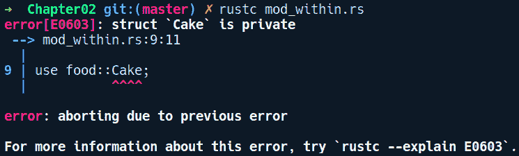
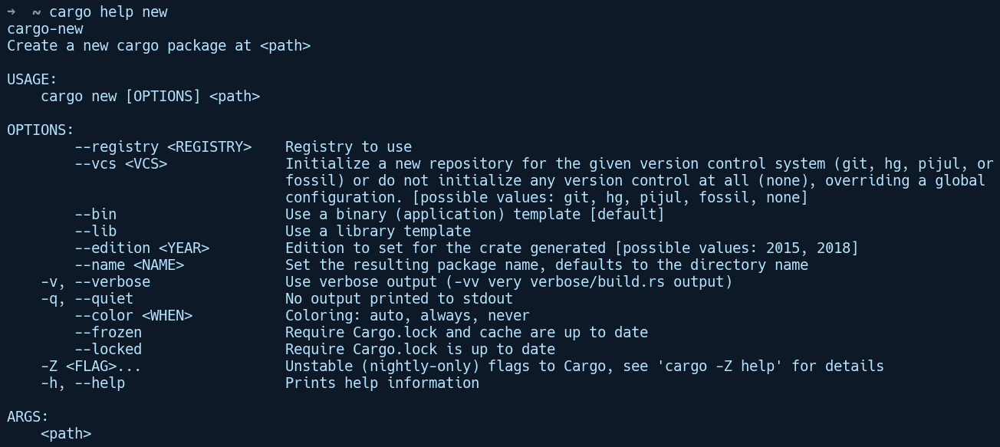

# 第二章：使用 Cargo 管理项目

现在我们已经熟悉了语言以及如何编写基本程序，我们将提升到在 Rust 中编写实用项目的水平。对于可以包含在单个文件中的简单程序，手动编译和构建它们并不是什么大问题。然而，在现实世界中，程序被分割成多个文件以管理复杂性，并且依赖于其他库。手动编译所有源文件并将它们链接在一起变得非常复杂。对于大型项目，手动方式不是可扩展的解决方案，因为可能有数百个文件及其依赖项。幸运的是，有工具可以自动化构建大型软件项目——包管理器。本章将探讨 Rust 如何使用其专门的包管理器管理大型项目，以及它为开发者提供了哪些功能来增强他们的开发体验。我们将涵盖以下主题：

+   包管理器

+   模块

+   Cargo 包管理器和 crates（库）作为编译单元

+   创建和构建项目

+   运行测试

+   货物子命令和第三方二进制文件的安装

+   Visual Studio 代码中的编辑器集成和设置

作为最后的练习，我们将创建 imgtool，这是一个简单的命令行工具，可以使用库从命令行旋转图像，并使用 Cargo 构建和运行我们的程序。我们有很多内容要介绍，所以让我们深入探讨吧！

# 包管理器

“高效开发的关键是犯有趣的错误。”

——*汤姆·洛夫*

真实世界的软件代码库通常组织成多个文件，并且会有许多依赖项，这就需要一个专门的工具来管理它们。包管理器是一类命令行工具，有助于管理具有多个依赖项的大型项目。如果你来自 Node.js 背景，你一定熟悉 npm/yarn，如果你来自 Go 语言，那么熟悉 go 工具。它们执行了分析项目、下载依赖项的正确版本、检查版本冲突、编译和链接源文件等所有繁重的工作。

低级语言（如 C/C++）的问题在于它们默认不提供专门的包管理器。C/C++社区长期以来一直在使用 GNU make 工具，这是一个语言无关的构建系统，具有晦涩的语法，这让许多开发者望而却步。make 的问题在于它不知道你的 C/C++源文件中包含了哪些头文件，因此必须手动提供这些信息。它没有内置的下载外部依赖项的支持，也不知道你正在运行的平台。幸运的是，这种情况并不适用于 Rust，因为它提供了一个专门的包管理器，它对正在管理的项目有更多的上下文信息。以下是对 Cargo 的介绍，Rust 的包管理器，它使得构建和维护 Rust 项目变得容易。但首先，我们需要更深入地了解 Rust 的模块系统。

# 模块

在我们探索更多关于 Cargo 之前，我们需要熟悉 Rust 如何组织我们的代码。我们在上一章中简要地看到了模块。在这里，我们将详细讲解它们。每个 Rust 程序都以根模块开始。如果你正在创建一个库，你的根模块是 lib.rs 文件。如果你正在创建一个可执行文件，根模块是任何包含 main 函数的文件，通常是 main.rs。当你的代码变得很大时，Rust 允许你将其拆分为模块。为了在组织项目时提供灵活性，有多种创建模块的方法。

# 嵌套模块

创建模块的最简单方法是使用现有模块中的 mod {} 块。考虑以下代码：

```rs
// mod_within.rs

mod food {
    struct Cake;
    struct Smoothie;
    struct Pizza;
}

fn main() {
    let eatable = Cake;
}
```

我们创建了一个名为 food 的内部模块。要在现有模块中创建模块，我们使用 mod 关键字，后跟模块名称 food，然后是一对大括号。在大括号内，我们可以声明任何类型的项，甚至嵌套模块。在我们的 food 模块中，我们声明了三个结构体：Cake、Smoothie 和 Pizza。然后在 main 中，我们使用路径语法 food::Cake 从 food 模块创建一个 Cake 实例。让我们编译这个程序：


奇怪！编译器看不到任何 Cake 类型被定义。让我们按照编译器说的去做，添加 use food::Cake:

```rs
// mod_within.rs

mod food {
    struct Cake;
    struct Smoothie;
    struct Pizza;
}

use food::Cake;

fn main() {
    let eatable = Cake;
}
```

我们添加了 use food::Cake;。要使用模块中的任何项目，我们必须添加一个 use 声明。让我们再试一次：



我们又得到了一个错误，说 Cake 是私有的。这让我们想到了模块的一个重要方面，即提供隐私。模块内的项目默认是私有的。要使用模块中的任何项目，我们需要将项目引入作用域。这是一个两步的过程。首先，我们需要通过在项目声明前加上 pub 关键字来使项目本身公开。其次，要使用该项目，我们需要添加一个 use 语句，就像我们之前使用 use food::Cake 一样。

use 关键字之后是模块中的项目路径。模块中任何项目的路径都使用路径语法指定，它使用两个双冒号(::)分隔项目名称。路径语法通常以模块名称开始，用于导入项目，尽管它也用于导入某些类型的单个字段，例如枚举。

让我们的 Cake 公开：

```rs
// mod_within.rs

mod food {
    pub struct Cake;
    struct Smoothie;
    struct Pizza;
}

use food::Cake;

fn main() {
    let eatable = Cake;
}
```

我们在 Cake 结构体前添加了 pub 并通过 use food::Cake 在根模块中使用它。有了这些更改，我们的代码可以编译。现在可能还不清楚为什么需要创建如此嵌套的模块，但当我们编写第三章测试、文档和基准测试中的测试时，我们会看到它们是如何被使用的。

# 文件作为模块

模块也可以作为文件创建。例如，对于名为 foo 的目录中的 main.rs 文件，我们可以在与 foo 同一目录中创建一个名为 bar 的模块作为文件 foo/bar.rs。然后在 main.rs 中，我们需要告诉编译器这个模块，即通过 mod foo; 声明模块。当使用基于文件的模块时，这是一个额外的步骤。为了演示如何使用文件作为模块，我们创建了一个名为 modules_demo 的目录，其结构如下：

```rs
+ modules_demo
└── foo.rs
└── main.rs
```

我们的 foo.rs 包含一个结构体 Bar，以及它的 impl 块：

```rs
// modules_demo/foo.rs

pub struct Bar;

impl Bar {
    pub fn init() {
        println!("Bar type initialized");
    }
}
```

我们想在 main.rs 中使用这个模块。我们的 main.rs 包含以下代码：

```rs
// modules_demo/main.rs

mod foo;

use crate::foo::Bar;

fn main() {
    let _bar = Bar::init();
}
```

我们使用 mod foo; 声明我们的模块，foo。然后，我们通过编写 use crate::foo::Bar. 来使用模块中的 Bar 结构体。注意在 use crate::foo::Bar; 中的 crate 前缀。根据你使用的不同前缀，有三种方式来使用模块中的项目：

绝对导入：

+   crate: 一个绝对导入前缀，指向当前 crate 的根。在前面代码中，这将是指根模块，即 main.rs 文件。crate 关键字之后的所有内容都是从根模块解析的。

相对导入：

+   self: 一个相对导入前缀，指向当前模块中的项目。当任何代码想要引用其包含的模块时，会使用它，例如，使用 self::foo::Bar;。这通常用于从子模块重新导出项目以便在父模块中使用。

+   super: 一个相对导入前缀，可以用来使用和导入父模块中的项目。例如，测试模块这样的子模块会使用它来从父模块导入项目。例如，如果模块 bar 想要访问其父模块 foo 中的项目 Foo，它会在模块 bar 中将其导入为 use super::foo::Foo;。

创建模块的第三种方式是将它们组织成目录。

# 目录作为模块

我们也可以创建一个表示模块的目录。这种方法允许我们在文件和目录层次结构中拥有模块内的子模块。假设我们有一个名为 my_program 的目录，它有一个名为 foo 的模块作为文件 foo.rs。它包含一个名为 Bar 的类型以及 foo 的功能。随着时间的推移，Bar API 的数量不断增加，我们希望将它们作为子模块分离。我们可以使用基于目录的模块来模拟这个用例。

为了演示如何将模块作为目录创建，我们在名为 my_program 的目录中创建了一个程序。它有一个在 main.rs 中的入口点和一个名为 foo 的目录。这个目录现在包含一个名为 bar.rs 的子模块。

以下是我 _program 目录的结构：

```rs
+ my_program
└── foo/
    └── bar.rs
└── foo.rs
└── main.rs
```

为了让 Rust 了解 bar，我们还需要在目录 foo/ 旁边创建一个名为 foo.rs 的同级文件。foo.rs 文件将包含在目录 foo/ 中创建的任何子模块的 mod 声明（这里为 bar.rs）。

我们的 bar.rs 包含以下内容：

```rs
// my_program/foo/bar.rs

pub struct Bar;

impl Bar {
    pub fn hello() {
        println!("Hello from Bar !");
    }
}
```

我们有一个单元结构体 Bar，它有一个关联的方法 hello。我们想在 main.rs 中使用这个 API。

注意：在较旧的 Rust 2015 版本中，子模块不需要在 foo 目录旁边有一个 foo.rs 的同级文件，而是可以在 foo 中使用 mod.rs 文件来告知编译器该目录是一个模块。这两种方法在 Rust 2018 版本中都得到了支持。

接下来，我们的 foo.rs 包含以下代码：

```rs
// my_program/foo.rs

mod bar;
pub use self::bar::Bar;

pub fn do_foo() {
    println!("Hi from foo!");
}
```

我们添加了对模块 bar 的声明。随后，我们从模块 bar 中重新导出了项目 Bar。这要求 Bar 被定义为 pub。pub use 部分是我们从子模块重新导出项目以便在父模块中可用的方式。在这里，我们使用了 self 关键字来引用模块本身。重新导出主要是编写 use 语句时的便利步骤，有助于在导入隐藏在嵌套子模块中的项目时减少混乱。

self 是相对导入的关键字。虽然鼓励使用 crate 进行绝对导入，但在父模块中从子模块重新导出项目时，使用 self 会更加简洁。

最后 main.rs 使用了这两个模块：

```rs
// my_program/main.rs

mod foo;

use foo::Bar;

fn main() {
    foo::do_foo();
    Bar::hello();
}
```

我们的 main.rs 声明了 foo 然后导入了结构体 Bar。然后我们调用了 foo 的方法 do_foo，也调用了 Bar 上的 hello。

模块远不止表面看起来那么简单，因此我们在 第七章 中介绍了关于它们的详细信息，高级概念。在探索了模块之后，让我们继续了解 Cargo。

# Cargo 和 crates

当项目变得庞大时，通常的做法是将代码重构为更小、更易于管理的单元，如模块或库。你还需要工具来渲染项目的文档，包括如何构建以及它依赖哪些库。此外，为了支持开发者可以与社区分享库的语言生态系统，如今通常需要一个在线注册表。

Cargo 是一个工具，它赋予你做所有这些事情的能力，[`crates.io`](https://crates.io) 是托管库的集中地点。用 Rust 编写的库称为 crate，crates.io 为开发者提供托管服务。通常，crate 可以来自三个来源：本地目录、在线 Git 仓库如 GitHub，或托管 crate 注册表如 crates.io。Cargo 支持来自所有这些来源的 crate。

让我们看看 Cargo 的实际应用。如果你已经按照前一章所述运行了 rustup，那么你将已经安装了 cargo 和 rustc。要查看我们可用的命令，我们可以不带任何参数运行 cargo：


它显示了一个我们可以使用的常见命令列表，以及一些标志。让我们使用 new 子命令来创建一个新的 Cargo 项目。

# 创建新的 Cargo 项目

cargo new <name> 命令创建一个以目录形式存在的新项目名称。我们可以通过在 cargo 和子命令之间添加 help 标志来获取任何子命令的更多上下文。我们可以通过运行 cargo help new 来查看 new 子命令的文档，如下面的截图所示：



默认情况下，cargo new 创建一个二进制项目；创建库项目时必须使用 --lib 参数。让我们通过输入 cargo new imgtool 并查看它创建的目录结构来试一试：


Cargo 创建了一些启动文件，Cargo.toml 和 src/main.rs，其中 main 函数打印出 Hello World！对于二进制 crate（可执行文件），Cargo 创建一个 src/main.rs 文件，而对于库 crate，它则在 src/ 目录下创建 src/lib.rs。

Cargo 还为新项目初始化了 Git 仓库，并使用了一些常规默认设置，例如通过 .gitignore 文件防止目标目录被提交，以及对于二进制 crate 提交 Cargo.lock 文件，而对于库 crate 则忽略它。默认的版本控制系统（VCS）是 Git，可以通过传递 --vcs 标志给 Cargo 来更改（对于 mercurial 使用 --vcs hg）。截至目前，Cargo 支持 Git、hg（mercurial）、pijul（用 Rust 编写的版本控制系统）和 fossil。如果我们想修改这种默认行为，可以通过传递 --vcs none 来指示 Cargo 在创建我们的项目时不要配置任何 vcs。

让我们来看看我们创建的 imgtool 项目的 Cargo.toml 文件。此文件定义了项目的元数据和依赖项。它也被称为项目的清单文件：

```rs
[package]
name = "imgtool"
version = "0.1.0"
authors = ["creativcoders@gmail.com"]
edition = "2018"

[dependencies]  
```

这是新项目所需的最低限度的 Cargo.toml 清单文件。它使用 TOML 配置语言，代表 Tom's Obvious Minimal Language。它是一种由 Tom Preston-Werner 创建的文件格式。它让人联想到标准的 .INI 文件，但向其中添加了几个数据类型，这使得它成为配置文件的理想现代格式，并且比 YAML 或 JSON 更简单。我们现在将保持此文件最小化，并在以后添加内容。

# 货物和依赖项

对于依赖于其他库的项目，包管理器必须找到项目中的所有直接依赖项以及任何间接依赖项，然后编译并将它们链接到项目中。包管理器不仅仅是促进依赖项解析的工具；它们还应确保项目的可预测和可重复构建。在我们介绍如何构建和运行我们的项目之前，让我们讨论 Cargo 如何管理依赖项并确保可重复构建。

使用 Cargo 管理的 Rust 项目通过两个文件来完成所有魔法：Cargo.toml（之前已介绍）是开发者写入依赖项及其所需版本（如 1.3.*）的 SemVer 语法文件的文件，以及一个名为 Cargo.lock 的锁文件，该文件在构建项目时由 Cargo 生成，其中包含所有直接依赖项和任何间接依赖项的绝对版本（如 1.3.15）。此锁文件确保二进制包的重复构建。Cargo 通过引用此锁文件来最小化对项目进行任何进一步更改时所需的工作。因此，建议二进制包将其 .lock 文件包含在他们的存储库中，而库包可以是无状态的，不需要包含它。

可以使用 cargo update 命令更新依赖项。这将更新所有依赖项。如果要更新单个依赖项，我们可以使用 cargo update -p <crate-name>。如果您更新单个包的版本，Cargo 会确保只更新与该包在 Cargo.lock 文件中相关的部分，并保留其他版本不变。

Cargo 遵循语义版本控制系统（SemVer），其中您的库版本以 major.minor.patch 格式指定。这些可以描述如下：

+   主版本：只有当项目进行新的破坏性更改（包括错误修复）时才会增加。

+   小版本：只有在新功能以向后兼容的方式添加时才会增加。

+   补丁版本：只有以向后兼容的方式修复错误且没有添加新功能时才会增加。

例如，您可能想在项目中包含序列化库 serde。在撰写本书时，serde 的最新版本是 1.0.85，您可能只关心主版本号。因此，您将 serde = "1" 作为依赖项（在 SemVer 格式中表示为 1.x.x）写入 Cargo.toml，Cargo 将为您解决它，并在锁文件中将它固定为 1.0.85。下次您使用 cargo update 命令更新 Cargo.lock 时，此版本可能会升级到 1.x.x 匹配中的最新版本。如果您不太关心，只想获取包的最新发布版本，您可以使用 * 作为版本，但这不是推荐的做法，因为它会影响构建的可重复性，您可能会拉入具有破坏性更改的主版本。以 * 作为依赖项版本发布包也是禁止的。

在此基础上，让我们看看 cargo build 命令，该命令用于编译、链接和构建我们的项目。此命令对您的项目执行以下操作：

+   如果您还没有 Cargo.lock 文件，则为您运行 cargo update，并将 Cargo.toml 中的确切版本放入锁文件中

+   下载所有在 Cargo.lock 中已解析的依赖项

+   构建所有这些依赖项

+   构建你的项目并将其与依赖项链接

默认情况下，`cargo build` 在 `target/debug/` 目录下创建项目的调试版本。可以通过传递 `--release` 标志来创建在 `target/release/` 目录下的优化版本，用于生产代码。调试版本提供更快的构建时间，缩短了反馈循环，而生产构建则稍微慢一些，因为编译器会对源代码执行更多的优化遍历。在开发过程中，你需要有更短的修复-编译-检查的反馈时间。为此，可以使用 `cargo check` 命令，这将导致更短的编译时间。它基本上跳过了编译器的代码生成部分，并且只运行源代码的前端阶段，即在编译器中的解析和语义分析。另一个命令是 `cargo run`，它具有双重功能。它首先运行 `cargo build`，然后在 `target/debug/` 目录下运行你的程序。对于构建/运行发布版本，可以使用 `cargo run --release .`。在 `imgtool/` 目录下运行 `Cargo run` 后，我们得到以下输出：


# 使用 Cargo 运行测试

Cargo 还支持运行测试和基准测试。深入测试和基准测试在第三章，测试、文档和基准测试中有详细说明。在本节中，我们将简要介绍如何使用 Cargo 运行测试。我们将为库 crate 编写测试。为了完成本节，让我们通过运行以下命令创建一个 crate：`cargo new myexponent --lib`：


库 crate 与二进制 crate 类似。区别在于，我们不是使用 `src/main.rs` 和作为入口点的 `main` 函数，而是使用 `src/lib.rs` 和一个简单的测试函数 `it_works`，该函数带有 `#[test]` 注解。我们可以立即使用 `cargo test` 运行 `it_works` 测试函数并查看它是否通过：


现在，让我们尝试使用 Cargo 进行一些**测试驱动开发**（**TDD**）。我们将通过添加一个 `pow` 函数来扩展这个库，用户可以使用这个函数来计算给定数字的指数。我们将为这个函数编写一个测试，该测试最初失败，然后填充实现直到它通过。以下是新的 `src/lib.rs`，其中包含没有实现的 `pow` 函数：

```rs
// myexponent/src/lib.rs

fn pow(base: i64, exponent: usize) > i64 { 
    unimplemented!();
} 

#[cfg(test)] 
mod tests { 
    use super::pow; 
    #[test] 
    fn minus_two_raised_three_is_minus_eight() { 
        assert_eq!(pow(-2, 3), -8); 
    }
}
```

目前不必担心细节。我们已经创建了一个单独的 pow 函数，它接受一个 i64 类型的基数和一个正指数 usize，并返回一个被提升到指数的数字。在 mod tests {中，我们有一个名为 minus_two_raised_three_is_minus_eight 的测试函数，它执行单个断言。assert_eq!宏检查传递给它的两个值的相等性。如果左边的参数等于右边的参数，则断言通过；否则，它会抛出一个错误，编译器会报告失败的测试。如果我们运行 cargo test，由于那里有一个 unimplemented!()宏调用，单元测试显然会因 pow 调用而失败：


简而言之，unimplemented!()只是一个方便的宏，用于标记未完成的代码或你打算稍后实现的代码，但希望编译器仍然编译它而不报类型错误。内部，它会调用 panic!并传递消息“尚未实现”。它可以用于实现特质多个方法的情况。例如，你开始实现一个方法，但还没有计划其他方法的实现。在编译时，如果你只是放置了一个带有空体的函数，你会得到其他未实现方法的编译错误。对于这些方法，我们可以在它们内部放置一个 unimplemented!()宏调用，只是为了让类型检查器满意并为我们编译，并在运行时转移错误。我们将在第九章“使用宏进行元编程”中查看更多这样的方便宏。

现在，让我们通过实现一个快速且简单的 pow 函数版本来解决这个问题，并再次尝试：

```rs
// myexponent/src/lib.rs

pub fn pow(base: i64, exponent: usize) -> i64 {
    let mut res = 1;
    if exponent == 0 {
        return 1;
    }
    for _ in 0..exponent {
        res *= base as i64;
    }
    res
}
```

运行 Cargo test 会得到以下输出：


这次，测试通过了。嗯，这就是基础。我们将在第三章“测试、文档和基准测试”中进行更多测试。

# 使用 Cargo 运行示例

为了使用户能够快速开始使用你的 crate，将如何使用你的 crate 的代码示例传达给用户是一个好习惯。Cargo 标准化了这个做法，这意味着你可以在项目根目录下添加一个 examples/目录，其中可以包含一个或多个.rs 文件，包含一个 main 函数，展示你的 crate 的示例用法。

你可以使用 cargo run --examples <file_name>来运行 examples/目录下的代码，其中文件名没有.rs 扩展名。为了演示这一点，我们为 myexponent crate 添加了一个 example/目录，包含一个名为 basic.rs 的文件：

```rs
// myexponent/examples/basic.rs

use myexponent::pow;

fn main() {
    println!("8 raised to 2 is {}", pow(8, 2));
}
```

在 examples/目录下，我们从 myexponent crate 中导入了 pow 函数。以下是在运行 cargo run --example basic 后的输出：


# Cargo 工作空间

随着时间的推移，你的项目已经变得相当大。现在，你正在考虑是否可以将代码的公共部分作为单独的 crate 分开，以帮助管理复杂性。嗯，Cargo 工作区允许你做到这一点。工作区的概念是它们允许你在目录中本地拥有 crate，这些 crate 可以共享相同的 Cargo.lock 文件和公共目标或输出目录。为了演示这一点，我们将创建一个新的项目，该项目包含 Cargo 工作区。工作区只是一个包含 Cargo.toml 文件的目录。它没有任何[package]部分，但在其中有一个[workspace]部分。让我们创建一个新的目录名为 workspace_demo，并添加如下所示的 Cargo.toml 文件：

```rs
mkdir workspace_demo
cd workspace_demo && touch Cargo.toml
```

然后我们将工作区部分添加到我们的 Cargo.toml 文件中：

```rs
# worspace_demo/Cargo.toml

[workspace]
members = ["my_crate", "app"]
```

在[工作区]中，members 键是工作区目录内 crate 的列表。现在，在 workspace_demo 目录中，我们将创建两个 crate：my_crate，一个库 crate 和 app，一个使用 my_crate 的二进制 crate。

为了保持简单，my_crate 有一个公共 API，它只是打印一条问候消息：

```rs
// workspace_demo/my_crate/lib.rs

pub fn greet() {
    println!("Hi from my_crate");
}
```

现在，从我们的 app crate 中，我们有 main 函数，它调用 my_crate 的 greet 函数：

```rs
// workspace_demo/app/main.rs

fn main() {
    my_crate::greet();
}
```

然而，我们需要让 Cargo 知道我们的 my_crate 依赖项。由于 my_crate 是一个本地 crate，我们需要在 app 的 Cargo.toml 文件中将它指定为路径依赖项，如下所示：

```rs
# workspace_demo/app/Cargo.toml

[package]
name = "app"
version = "0.1.0"
authors = ["creativcoder"]
edition = "2018"

[dependencies]
my_crate = { path = "../my_crate" }
```

现在，当我们运行 cargo build 时，二进制文件将在 workspace_demo 目录的目标目录中生成。相应地，我们可以在 workspace_demo 目录中添加多个本地 crate。现在，如果我们想从 crates.io 添加第三方依赖项，我们需要在所有需要它的 crate 中添加它。然而，在 cargo build 期间，Cargo 确保在 Cargo.lock 文件中只有一个版本的该依赖项。这确保第三方依赖项不会被重建和重复。

# 扩展 Cargo 和工具

Cargo 也可以扩展以集成外部工具以增强开发体验。它被设计成尽可能可扩展。开发者可以创建命令行工具，Cargo 可以通过简单的 cargo binary-name 语法调用它们。在本节中，我们将查看一些这些工具。

# 子命令和 Cargo 安装

Cargo 的自定义命令属于子命令类别。这些工具通常是来自 crates.io、GitHub 或本地项目目录的二进制文件，可以通过使用 cargo install <binary crate name>或仅在本地 Cargo 项目中使用 cargo install 来安装。cargo-watch 工具就是一个这样的例子。

# cargo-watch

Cargo-watch 通过在后台自动构建你的项目来帮助你缩短修复、编译、运行周期。默认情况下，这仅运行 Rust 的类型检查器（cargo check 命令），并且不经过代码生成阶段（这需要时间）并缩短编译时间。也可以使用-x 标志提供自定义命令来代替 cargo check。

我们可以通过运行 cargo install cargo-watch 来安装 cargo-watch，然后在任何 Cargo 项目中，我们可以通过调用 cargo watch 来运行它。现在，每当我们对项目进行更改时，cargo-watch 都会在后台运行 cargo check，并为我们重新编译项目。在下面的代码中，我们犯了一个拼写错误并进行了纠正，cargo-watch 为我们重新编译了项目：


如果您熟悉 Node.js 生态系统中的 watchman 或 nodemon 软件包，这将是一个非常相似的经历。

# cargo-edit

cargo-edit 子命令用于自动将依赖项添加到您的 Cargo.toml 文件中。它可以添加所有类型的依赖项，包括开发依赖项和构建依赖项，还允许您添加任何依赖项的特定版本。您可以通过运行 cargo install cargo-edit 来安装它。此子命令提供了四个命令：cargo add、cargo rm、cargo edit 和 cargo upgrade。

# cargo-deb

这是另一个有用的社区开发子命令，可以创建 Debian 软件包 (.deb)，以便在 Debian Linux 上轻松分发 Rust 可执行文件。我们可以通过运行 cargo install cargo-deb 来安装它。我们将在本章末尾使用此工具将我们的 imgtool 命令行可执行文件打包成 .deb 软件包。

# cargo-outdated

此命令显示您 Cargo 项目中的过时 crate 依赖项。您可以通过运行 cargo install cargo-outdated 来安装它。一旦安装，您可以在项目目录中运行 cargo outdated 来查看过时的 crate（如果有）。

现在，这些子命令与 Cargo 无缝协作的方式是，开发者使用命名约定创建这些二进制 crate，例如 cargo-[cmd]，当您安装那个二进制 crate 时，Cargo 会将安装的二进制文件暴露给您的 $PATH 变量，然后可以通过 cargo <cmd> 来调用。这是一个简单而有效的方法，Cargo 已经采用这种方法来通过社区开发的子命令扩展自身。还有许多其他类似的 Cargo 扩展。您可以在 [`github.com/rust-lang/cargo/wiki/Third-party-cargo-subcommands`](https://github.com/rust-lang/cargo/wiki/Third-party-cargo-subcommands) 找到所有社区精选的子命令列表。

cargo install 也用于安装任何在 Rust 中开发的二进制 crate 或可执行文件/应用程序。它们默认安装在 /home/<用户>/.cargo/bin/ 目录中。我们将使用它来安装我们的 imgtool 应用程序——我们将在本章末尾构建它——使其在系统范围内可用。

# 使用 clippy 检查代码

代码风格检查是一种有助于维护库的质量并使其遵循标准编码习惯和规范的实践。在 Rust 生态系统中的事实上的代码风格检查工具是 clippy。Clippy 为我们提供了一组 lint（截至本书编写时约为 291 个），以确保 Rust 代码的高质量。在本节中，我们将安装 clippy 并在我们的 libawesome 库上尝试它，向其中添加一些虚拟代码，并查看 clippy 提出的建议。在项目中使用 clippy 有多种方式，但我们将使用 cargo clippy 子命令方式，因为它很简单。Clippy 可以对代码进行分析，因为它是一个编译器插件，并且可以访问大量编译器的内部 API。

要使用 clippy，我们需要通过运行 rustup component add clippy 来安装它。如果您还没有安装，rustup 会为您安装。现在，为了展示 clippy 如何指出我们代码中的不良风格，我们在 myexponent crate 的 pow 函数中的 if 条件内放置了一些虚拟语句，如下所示：

```rs
// myexponent/src/lib.rs

fn pow(base: i64, exponent: usize) -> i64 {
    /////////////////// Dummy code for clippy demo
    let x = true;
    if x == true {

    }
    ///////////////////
    let mut res = 1;
    ...
}
```

添加了这些行后，通过在 myexponent 目录中运行 cargo clippy，我们得到了以下输出：


太好了！Clippy 找到了一种常见的代码风格，它是多余的，即检查布尔值是 true 或 false。或者，我们也可以直接将前面的 if 条件写成 if x {}。Clippy 还会进行许多其他检查，其中一些甚至可以指出您代码中的潜在错误，例如 [`rust-lang-nursery.github.io/rust-clippy/master/index.html#absurd_extreme_comparisons`](https://rust-lang-nursery.github.io/rust-clippy/master/index.html#absurd_extreme_comparisons)。要查看所有可用的 lint 和配置 clippy 的各种方式，请访问 [`github.com/rust-lang/rust-clippy`](https://github.com/rust-lang/rust-clippy)。

# 探索清单文件 - Cargo.toml

Cargo 严重依赖于项目的清单文件，即 Cargo.toml 文件，以获取有关项目的各种信息。让我们更详细地看看这个文件的结构和它可以包含的项目。如您之前所见，cargo new 创建了一个几乎为空的清单文件，只包含必要的字段，以便项目可以构建。每个清单文件都分为几个部分，指定了项目的不同属性。我们将查看在中等大小的 Cargo 项目清单文件中通常可以找到的部分。以下是一个来自更大应用程序的假想 Cargo.toml 文件：

```rs
# cargo_manifest_example/Cargo.toml
# We can write comments with `#` within a manifest file

[package]
name = "cargo-metadata-example"
version = "1.2.3"
description = "An example of Cargo metadata"
documentation = "https://docs.rs/dummy_crate"
license = "MIT"
readme = "README.md"
keywords = ["example", "cargo", "mastering"]
authors = ["Jack Daniels <jack@danie.ls>", "Iddie Ezzard <iddie@ezzy>"]
build = "build.rs"
edition = "2018"

[package.metadata.settings]
default-data-path = "/var/lib/example"

[features]
default=["mysql"]

[build-dependencies]
syntex = "⁰.58"

[dependencies]
serde = "1.0"
serde_json = "1.0"
time = { git = "https://github.com/rust-lang/time", branch = "master" }
mysql = { version = "1.2", optional = true }
sqlite = { version = "2.5", optional = true }
```

让我们回顾一下尚未解释的部分，从 [package] 部分开始：

+   描述：它包含有关项目的较长的自由格式文本字段。

+   许可证：它包含软件许可证标识符，如 [`spdx.org/licenses/`](http://spdx.org/licenses/) 中列出的。

+   读取文件：它允许您链接到项目存储库中的文件。这应该显示为项目介绍的入口点。

+   documentation: 如果是库 crate，它包含 crate 的文档链接。

+   keywords: 它是一个单词列表，有助于通过搜索引擎或通过 crates.io 网站发现您的项目。

+   authors: 列出了项目的关键作者。

+   build: 它定义了一段 Rust 代码（通常是 build.rs），在程序的其他部分编译之前编译并运行。这通常用于生成代码或构建 crate 所依赖的本地库。

+   edition: 此键指定在编译项目时要使用哪个版本。在我们的例子中，我们使用的是 2018 版本。之前的版本是 2015，如果没有 edition 键存在，则假定它是默认版本。注意：使用 2018 版本创建的项目是向后兼容的，这意味着它们也可以将 2015 的 crate 作为依赖项。

接下来是 [package.metadata.settings]。通常，Cargo 会对其不认识的键和部分进行抱怨，但包含元数据的部分是一个例外。它们被 Cargo 忽略，因此可以用于您项目所需的任何可配置的键/值对。

[features]、[dependencies] 和 [build-dependencies] 部分相互关联。依赖项可以通过版本号声明，如 SemVer 指南中所述：

```rs
serde = "1.0" 
```

这意味着 serde 是一个强制依赖项，我们想要最新版本，1.0.*。实际版本将在 Cargo.lock 中固定。

使用 caret 符号可以扩展 Cargo 允许查找的版本范围：

```rs
syntex = "⁰.58" 
```

这里，我们表示我们想要最新的主要版本，0.*.*，它必须至少是 0.58.*。

Cargo 还允许您直接将依赖项指定到 Git 仓库，前提是仓库是一个由 Cargo 创建的项目，并且遵循 Cargo 预期的目录结构。我们可以这样指定来自 GitHub 的依赖项：

```rs
time = { git = "https://github.com/rust-lang/time", branch = "master" } 
```

这也适用于其他在线 Git 仓库，如 GitLab。同样，实际的版本（或 Git 的情况下的更改集修订版）将由 cargo update 命令在 Cargo.lock 中固定。

清单还有两个可选依赖项，mysql 和 sqlite：

```rs
mysql = { version = "1.2", optional = true } 
sqlite = { version = "2.5", optional = true } 
```

这意味着程序可以在不依赖任何一方的情况下构建。[features] 部分包含默认功能的列表：

```rs
 default = ["mysql"] 
```

这意味着如果您在构建程序时没有手动覆盖功能集，则只会拉入 mysql，而不是 sqlite。功能的一个示例用法是当您的库有某些优化调整时。然而，在嵌入式平台上这将是昂贵的，因此库作者可以将它们作为功能发布，这样它们只会在有能力的系统上可用。另一个例子是当您构建一个命令行应用程序，并提供一个作为额外功能的 GUI 前端时。

这就是如何使用 Cargo.toml 清单文件描述 Cargo 项目的快速简要概述。关于如何使用 Cargo 配置项目还有很多可以探索的。更多信息请查看[`doc.rust-lang.org/cargo/reference/manifest.html`](https://doc.rust-lang.org/cargo/reference/manifest.html)。

# 设置 Rust 开发环境

Rust 对大多数代码编辑器都有良好的支持，无论是 vim、Emacs、intellij IDE、Sublime、Atom 还是 Visual Studio Code。Cargo 也受到这些编辑器的良好支持，生态系统中有几个工具可以增强体验，如下所示：

+   rustfmt：它根据 Rust 风格指南中提到的约定格式化代码。

+   clippy：它会警告你常见的错误和潜在的代码问题。Clippy 依赖于标记为不稳定的编译器插件，因此它仅适用于 nightly Rust。使用 rustup，你可以轻松切换到 nightly。

+   racer：它可以查询 Rust 标准库，并提供代码补全和工具提示。

在上述编辑器中，Intellij IDE 和 Visual Studio Code（vscode）提供了最成熟的 IDE 体验。在本章中，我们将介绍如何设置 vscode 的开发环境，因为它更易于访问且更轻量级。对于 vscode，Rust 社区有一个名为 rls-vscode 的扩展，我们将在本节中安装它。此扩展由 Rust 语言服务器（RLS）组成，它内部使用了我们之前列出的许多工具。我们将使用 Visual Studio Code 1.23.1（d0182c341）和 Ubuntu 16.04 来设置它。

安装 vscode 超出了本书的范围。你可以在操作系统的软件仓库中查找，并访问[`code.visualstudio.com`](https://code.visualstudio.com)获取更多信息。

让我们实际打开本章开头创建的 imgtool 应用程序在 vscode 中：

```rs
cd imgtool
code .            # opens the current directory in vscode
```

一旦我们打开我们的项目，vscode 会自动识别我们的项目为 Rust 项目，并给我们推荐下载 vscode 扩展。它看起来可能像这样：


如果你没有收到推荐，你总是可以在左上角的搜索栏中输入 Rust。然后我们可以点击安装，并在扩展页面按“重新加载”，这将重启 vscode 并使其在我们的项目中可用：


下次你打开项目中 main.rs 文件并开始输入时，扩展程序会启动并提示你安装任何与 Rust 相关的缺失工具链，你可以点击安装。然后它开始下载该工具链：


几分钟后，状态将发生变化，如下所示：


现在，我们可以开始了。

注意：由于 RLS 还处于预览阶段，您在首次安装时可能会遇到 RLS 卡住的情况。通过重新启动 vscode 并在删除它之后重新安装 RLS，应该可以工作。如果不行，请随意在其 GitHub 页面 [rls-vscode](https://github.com/rust-lang-nursery/rls-vscode) 上提出问题。

在我们的 imgtool 项目打开的情况下，让我们看看当尝试导入一个模块时 RLS 的响应：


如您所见，它为 Rust 标准库中 fs 模块中可用的项目执行自动完成。最后，让我们看看 RLS 是如何为我们处理代码格式的。让我们将所有代码放在同一行上以演示这一点：


让我们保存文件。然后我们可以使用 Ctrl + Shift + I 或 Ctrl + Shift + P 并选择 Format Document。这将立即格式化文档，并在您点击保存时对您的代码运行 cargo check：


关于其他代码编辑器的更多信息，Rust 有一个名为 [`areweideyet.com`](https://areweideyet.com/) 的页面，列出了所有编辑器的状态，包括类别，显示了它们对该语言的支持程度。请务必查看它们！

现在，让我们继续实现我们的 imgtool 应用程序。

# 使用 Cargo 构建项目 – imgtool

现在，我们相当了解如何使用 Cargo 管理项目。为了深入理解这些概念，我们将构建一个使用第三方 crate 的命令行应用程序。这个练习的全部目的是熟悉使用第三方 crate 构建项目的常规工作流程，因此我们将跳过我们编写代码的许多细节。尽管如此，我们鼓励您查看代码中使用的 API 的文档。

我们将使用一个名为 image 的 crate，它来自 crates.io。这个 crate 提供了各种图像处理 API。我们的命令行应用程序将很简单；它将接受一个图像文件的路径作为参数，每次运行时都将其旋转 90 度，并将其写回同一文件。

我们将进入之前创建的 imgtool 目录。首先，我们需要告诉 Cargo 我们想要使用 image crate。我们可以使用 cargo add image@0.19.0 命令从命令行添加版本为 0.19.0 的 image crate。以下是我们的更新后的 Cargo.toml 文件：

```rs
[package]
name = "imgtool"
version = "0.1.0"
authors = ["creativcoder"]
edition = "2018"

[dependencies]
image = "0.19.0"
```

然后，我们将调用 cargo build。这将从 crates.io 拉取 image crate 及其依赖项，最后编译我们的项目。一旦完成，我们就可以在 main.rs 文件中使用它了。对于我们的应用程序，我们将提供一个图像路径作为参数。在我们的 main.rs 文件中，我们想要读取此图像的路径：

```rs
// imgtool/src/main.rs

use std::env;
use std::path::Path;

fn main() {
    let image_path = env::args().skip(1).next().unwrap();
    let path = Path::new(&image_path);
}
```

首先，我们通过从 env 模块中调用 args() 函数来读取传递给 imgtool 的参数。这返回一个字符串，作为图像文件的路径。然后我们获取图像路径并从中创建一个 Path 实例。接下来是来自 image crate 的旋转功能。请注意，如果你正在运行 Rust 2015 版本，你需要一个额外的 extern crate image; 声明在 main.rs 的顶部，以便你能够访问 image crate 的 API。在 Rust 2018 版本中，这不再需要：

```rs
// imgtool/src/main.rs

use std::env;
use std::path::Path;

fn main() {
    let image_path = env::args().skip(1).next().unwrap();
    let path = Path::new(&image_path);
    let img = image::open(path).unwrap();
    let rotated = img.rotate90();
    rotated.save(path).unwrap();
}
```

从 image crate 中，我们使用 open 函数打开我们的图片并将其存储在 img 中。然后我们在 img 上调用 rotate90。这返回一个旋转后的图像缓冲区，我们通过调用 save 并传递路径将其保存回原始图像路径。前述代码中的大多数函数调用都返回一个名为 Result 的包装值，因此我们在 Result 值上调用 unwrap() 来告诉编译器我们不在乎函数调用是否失败，假设它已经成功，我们只想从 Result 类型中获取包装的值。我们将在第六章“错误处理”中学习关于 Result 类型以及适当的错误处理方法。对于演示，在项目的 asset 文件夹下，你可以找到一个名为 Ferris 的螃蟹的图片（assets/ferris.png）。在运行代码之前，我们将看到以下图片：


现在是时候使用这张图片作为参数来运行我们的应用程序了。现在，你有两种方式可以运行 imgtool 二进制文件并传递图片作为参数：

+   通过先运行 cargo build，然后手动调用二进制文件作为 ./target/debug/imgtool assets/ferris.png 来执行。

+   通过直接运行 cargo run -- assets/ferris.png。双横线标志着 Cargo 自身参数的结束。之后的所有内容都将传递给我们的可执行文件（这里，这是 imgtool）。

运行 cargo run -- assets/ferris.png 后，我们可以看到 Ferris 翻了个跟头：


太好了！我们的应用程序运行正常。我们现在可以通过在 imgtool 目录中运行 cargo install 来安装我们的工具，然后从终端的任何位置使用它。此外，如果你使用的是 Ubuntu，我们可以使用 cargo deb 子命令来创建一个 deb 包，以便你可以将其分发给其他用户。运行 cargo deb 命令会产生一个 .deb 文件，如下面的截图所示：


现在，是你探索与前面代码相关内容的时候了：

+   使用 Rust 标准库文档[`doc.rust-lang.org/std/`](https://doc.rust-lang.org/std/)来了解 Rust 中的 unwrap() 函数及其可用类型。

+   在标准库文档中查找 Path 类型，看看你是否可以修改程序以不覆盖文件，而是创建一个新文件，其新文件后缀为 _rotated。

+   使用图像 crate（[`docs.rs/image`](https://docs.rs/image)）的文档页面中的搜索栏，尝试查找具有不同角度的其他旋转方法，并修改代码以使用它们。

# 摘要

在本章中，我们了解了标准的 Rust 构建工具 Cargo。我们简要地了解了如何使用 Cargo 初始化、构建和运行测试。我们还探索了 Cargo 之外的工具，这些工具可以使开发体验更加流畅和高效，例如 RLS 和 clippy。我们看到了如何通过安装 RLS 扩展来将这些工具与 Visual Studio Code 编辑器集成。最后，我们创建了一个小型的 CLI 工具，通过使用 Cargo 中的第三方 crate 来操作图像。

在下一章中，我们将讨论测试、文档化和基准测试我们的代码。
