# 第三章：测试、文档和基准

在本章中，我们将继续学习 Cargo，了解如何编写测试，如何编写代码文档，以及如何使用基准测试来衡量代码的性能。然后，我们将运用这些技能来构建一个简单的 crate，模拟逻辑门，为您提供编写单元测试、集成测试以及文档测试的端到端体验。

在本章中，我们将涵盖以下主题：

+   测试的动机

+   组织测试和测试原语

+   单元测试和集成测试

+   文档测试

+   基准测试

+   使用 Travis CI 进行持续集成

# 测试的动机

“那些不可能的事情只是需要更长的时间。” **

软件系统就像带有小齿轮和齿轮的机器。如果任何一个单独的齿轮出现故障，整个机器很可能以不可靠的方式运行。在软件中，这些单独的齿轮是函数、模块或您使用的任何库。对软件系统个别组件的功能测试是维护高质量代码的有效和实用方法。它不能证明不存在错误，但它有助于在将代码部署到生产环境中建立信心，并在项目需要长期维护时保持代码库的稳定性。此外，没有单元测试，软件的大规模重构是难以进行的。在软件中智能和平衡地使用单元测试的好处是深远的。在实现阶段，编写良好的单元测试成为软件组件的非正式规范。在维护阶段，现有的单元测试作为防止代码库回归的 harness，鼓励立即修复。在像 Rust 这样的编译语言中，这甚至更好，因为由于编译器的有用错误诊断，涉及回归的单元测试（如果有）将更加有指导性。

单元测试的另一个良好副作用是它们鼓励程序员编写模块化代码，这些代码主要依赖于输入参数，即无状态函数。这使程序员远离编写依赖于全局可变状态的代码。编写依赖于全局可变状态的测试是困难的。此外，仅仅思考为一段代码编写测试的行为就帮助程序员找出实现中的愚蠢错误。它们还作为非常好的文档，帮助任何试图理解代码库不同部分如何相互交互的新手。

我们可以得出的结论是，测试对于任何软件项目都是不可或缺的。现在，让我们来看看如何在 Rust 中编写测试，首先从学习组织测试开始！

# 组织测试

在开发软件时，我们通常编写两种基本的测试：单元测试和集成测试。它们服务于不同的目的，并且与被测试的代码库的交互方式也不同。单元测试总是旨在轻量级，测试单个组件，以便开发者可以经常运行它们，从而提供更短的反馈循环，而集成测试则是重量级的，旨在模拟现实世界场景，基于其环境和规范进行断言。Rust 的内置测试框架为我们提供了编写和组织这些测试的合理默认值：

+   **单元测试**: 单元测试通常在包含要测试的代码的同一模块中编写。当这些测试的数量增加时，它们会被组织成一个实体，作为一个嵌套模块。通常，在当前模块中创建一个子模块，按照惯例命名为`tests`，并在其上添加`#[cfg(test)]`属性，然后将所有与测试相关的函数放入其中。这个属性简单地告诉编译器在运行`cargo test`时包含测试模块中的代码。稍后我们将详细介绍属性。

+   **集成测试**: 集成测试在 crate 根部的`tests/`目录中单独编写。它们被编写成好像测试是正在测试的 crate 的消费者。`tests/`目录中的任何`.rs`文件都可以添加一个`use`声明来引入需要测试的任何公共 API。

要编写上述任何一种测试，我们需要熟悉一些测试原语。

# 测试原语

Rust 的内置测试框架基于一些原语，主要由属性和宏组成。在我们编写任何实际的测试之前，了解如何有效地使用它们是非常重要的。

# 属性

属性是 Rust 代码中项目的一个注释。项目是 crate 中的顶级语言结构，如函数、模块、结构体、枚举和常量声明，以及其他仅在 crate 根定义的东西。属性通常是编译器内置的，但也可以通过编译器插件由用户创建。它们指示编译器为它们下面的项目或模块注入额外的代码或意义。我们将在第七章，*高级概念*中详细介绍这些内容。为了保持话题的连贯性，我们在这里将讨论两种属性形式：

+   `#[<name>]`: 这适用于每个项目，通常出现在它们的定义上方。例如，Rust 中的测试函数使用`#[test]`属性进行标注。这表示该函数被视为测试框架的一部分。

+   `#![<name>]`: 这适用于整个 crate。注意那里有一个额外的`!`。它通常位于 crate 根部的顶部。

如果我们正在创建一个库 crate，crate 根通常是`lib.rs`，而当我们创建一个二进制 crate 时，crate 根将是`main.rs`文件。

除了`#[cfg(test)]`这样的属性形式之外，还有其他形式的属性，这些属性在模块内编写测试时使用。这个属性被添加到测试模块的顶部，以提示编译器有条件地编译模块，但仅在测试模式下编译代码时才这样做。属性不仅限于在测试代码中使用；在 Rust 中它们被广泛使用。我们将在接下来的章节中看到更多关于它们的例子。

# 断言宏

在测试中，当给定一个测试用例时，我们试图断言我们的软件组件在给定输入范围内的预期行为。通常，语言提供称为断言函数的函数来执行这些断言。Rust 为我们提供了断言函数，作为宏实现，帮助我们实现相同的功能。让我们看看一些常用的例子：

```rs
      assert!(true);
      assert!(a == b, "{} was not equal to {}", a, b);
```

+   `assert!`：这是最简单的断言宏，它接受一个布尔值进行断言。如果值为`false`，则测试会崩溃，显示失败发生的行。它还可以接受一个格式字符串，后跟相应数量的变量，用于提供自定义错误消息：

```rs
      let a = 23;
      let b = 87;
      assert_eq!(a, b, "{} and {} are not equal", a, b);
```

+   `assert_eq!`：它接受两个值，如果它们不相等则失败。它还可以接受一个格式字符串，用于自定义错误消息。

+   `assert_ne!`：这与`assert_eq!`类似，因为它接受两个值，但只有在值不相等时才进行断言。

+   `debug_assert!`：这与`assert!`类似。调试断言宏也可以用于除测试代码之外的代码。这主要用于代码中，以断言在运行时应该保持的任何合同或不变量。这些断言仅在调试构建中有效，并在以调试模式运行时帮助捕获断言违规。当代码以优化模式编译时，这些宏调用将被完全忽略并优化为无操作。还有类似的变体，如`debug_assert_eq!`和`debug_assert_ne!`，它们的工作方式与`assert!`类宏相同。

要比较这些断言宏内的值，Rust 依赖于特质。例如，`assert!(a == b)`中的`==`实际上变成了一个方法调用，`a.eq(&b)`，它返回一个`bool`值。`eq`方法来自`PartialEq`特质。Rust 中的大多数内置类型都实现了`PartialEq`和`Eq`特质，以便它们可以被比较。这些特质的细节以及`PartialEq`和`Eq`之间的区别在第四章，“类型、泛型和特质”中进行了讨论。

对于用户定义的类型，我们需要实现这些特质。幸运的是，Rust 为我们提供了一个方便的宏，称为 **derive**，它接受一个或多个要实现的特质名称。它可以通过在用户定义类型上放置 `#[derive(Eq, PartialEq)]` 注解来使用。注意括号内的特质名称。Derive 是一个过程宏，它简单地为出现在其上的类型生成 `impl` 块的代码，并实现特质的方 法或任何关联函数。我们将在第九章 宏编程中讨论这些宏。

除了这些，让我们开始编写一些测试！

# 单元测试

通常，单元测试是一个实例化应用程序的小部分并独立于代码库的其他部分验证其行为的函数**。**在 Rust 中，单元测试通常在模块内编写。理想情况下，它们应该只旨在覆盖模块的功能和接口。

# 第一个单元测试

以下是我们非常第一个单元测试：

```rs
// first_unit_test.rs

#[test] 
fn basic_test() { 
    assert!(true);
}
```

单元测试是以函数的形式编写的，并带有 `#[test]` 属性。前面的 `basic_test` 函数中没有什么复杂的内容。我们有一个基本的 `assert!` 调用，传递 `true`。为了更好的组织，你也可以创建一个名为 **tests** 的子模块（按照惯例），并将所有相关的测试代码放在其中。

# 运行测试

我们运行这个测试的方式是通过以测试模式编译我们的代码。编译器会忽略测试注解函数的编译，除非被指示以测试模式构建。这可以通过在编译测试代码时传递 `--test` 标志给 `rustc` 来实现。之后，可以通过简单地执行编译后的二进制文件来运行测试。对于前面的测试，我们将通过运行以下命令以测试模式编译它：

```rs
rustc --test first_unit_test.rs
```

使用 `--test` 标志，`rustc` 会放置一个带有一些测试框架代码的 `main` 函数，并将所有定义的测试函数作为线程并行调用。默认情况下，所有测试都是并行运行的，除非通过环境变量 `RUST_TEST_THREADS=1` 指示。这意味着如果我们想以单线程模式运行前面的测试，我们可以通过 `RUST_TEST_THREADS=1 ./first_unit_test` 来执行。

现在，Cargo 已经支持运行测试，所有这些通常都是通过调用 `cargo test` 命令来内部完成的。这个命令会为我们编译并运行带有测试注解的函数。在接下来的示例中，我们将主要使用 Cargo 来运行我们的测试。

# 隔离测试代码

当我们的测试变得复杂时，可能会有一些额外的辅助方法，我们可能会创建，这些方法仅在测试代码的上下文中使用。在这种情况下，将测试相关代码与实际代码隔离是有益的。我们可以通过将所有测试相关代码封装在一个模块中，并在其上放置 `#[cfg(test)]` 注解来实现这一点。

`#[cfg(...)]` 属性中的 `cfg` 通常用于条件编译，并不仅限于测试代码。它可以包括或排除不同架构或配置标志的代码。在这里，配置标志是 `test`。你可能还记得，上一章中的测试已经使用了这种形式。这有一个优点，即你的测试代码只有在运行 `cargo test` 时才会被编译并包含在编译的二进制文件中，否则会被忽略。

假设你想为测试程序生成测试数据，但没有理由在发布构建中包含那段代码。让我们通过运行 `cargo new unit_test --lib` 来创建一个项目来演示这一点。在 `lib.rs` 中，我们定义了一些测试和函数：

```rs
// unit_test/src/lib.rs

// function we want to test
fn sum(a: i8, b: i8) -> i8 {
    a + b
}

#[cfg(test)]
mod tests {
    fn sum_inputs_outputs() -> Vec<((i8, i8), i8)> {
        vec![((1, 1), 2), ((0, 0), 0), ((2, -2), 0)]
    }

    #[test]
    fn test_sums() {
        for (input, output) in sum_inputs_outputs() {
            assert_eq!(crate::sum(input.0, input.1), output);
        }
    }
}
```

我们可以通过运行 `cargo test` 来运行这些测试。让我们回顾一下前面的代码。我们在 `sum_inputs_outputs` 函数中生成已知输入和输出对，该函数被 `test_sums` 函数使用。`#[test]` 属性使 `test_sums` 函数不包含在我们的发布编译中。然而，`sum_inputs_outputs` 没有标记为 `#[test]`，如果它在 `tests` 模块外部声明，它将被包含在编译中。通过使用 `#[cfg(test)]` 与 `mod tests {}` 子模块，并将所有测试代码及其相关函数封装在这个模块中，我们得到了保持代码和生成的二进制文件清洁的好处，不包含测试代码。

我们还将 `sum` 函数定义为私有，没有使用 `pub` 可见性修饰符，这意味着模块内的单元测试也允许你测试私有函数和方法。非常方便！

# 失败测试

在某些测试用例中，你可能希望你的 API 方法根据某些输入失败，并且希望测试框架断言这种失败。Rust 提供了一个名为 `#[should_panic]` 的属性来实现这一点。以下是一个引发 panic 并使用此属性的测试用例：

```rs
// panic_test.rs

#[test]
#[should_panic]
fn this_panics() {
    assert_eq!(1, 2);
}
```

`#[should_panic]` 属性可以与 `#[test]` 属性一起使用，表示运行 `this_panics` 函数应该导致不可恢复的失败，这在 Rust 中被称为 **panic**。

# 忽略测试

编写测试的另一个有用属性是 `#[ignore]`。如果你的测试代码非常复杂，使用 `#[ignore]` 注解可以让测试运行器在运行 `cargo test` 时忽略这些测试函数。然后你可以选择单独运行这些测试，通过向测试运行器或 `cargo test` 命令提供 `--ignored` 参数来实现。以下是一个包含愚蠢循环的代码示例，当使用 `cargo test` 运行时，默认会被忽略：

```rs
// silly_loop.rs

pub fn silly_loop() {
    for _ in 1..1_000_000_000 {};
}

#[cfg(test)]
mod tests {
    #[test]
    #[ignore]
    pub fn test_silly_loop() {
        ::silly_loop();
    }
}
```

注意 `test_silly_loop` 测试函数上的 `#[ignore]` 属性。以下是忽略测试的输出：

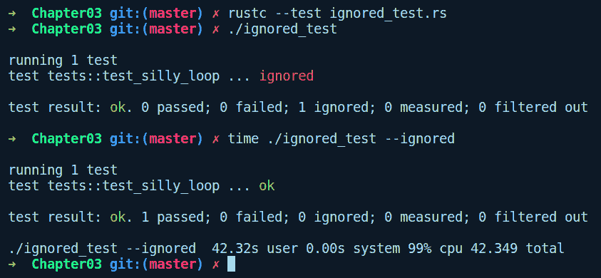**注意**：也可以通过向 Cargo 提供测试函数名来运行单个测试，例如，`cargo test some_test_func`。

# 集成测试

虽然单元测试可以测试你的 crate 的私有接口和单个模块，但集成测试更像是一种黑盒测试，旨在从消费者的角度测试 crate 公共接口的端到端使用。在编写代码方面，编写集成测试和单元测试之间没有太大的区别。唯一的区别在于目录结构，并且需要将项目公开，这已经由 crate 的设计者公开了。

# 第一次集成测试

如我们之前所述，Rust 期望所有集成测试都位于`tests/`目录中。`tests/`目录中的文件被编译为似乎它们是单独的二进制 crate，同时使用我们正在测试的库。对于以下示例，我们将通过运行`cargo new integration_test --lib`创建一个新的 crate，与之前的单元测试具有相同的函数`sum`，但现在我们添加了一个`tests/`目录，其中定义了一个如下所示的集成测试函数：

```rs
// integration_test/tests/sum.rs

use integration_test::sum;

#[test]
fn sum_test() { 
    assert_eq!(sum(6, 8), 14); 
} 
```

我们首先将函数`sum`引入作用域。其次，我们有一个名为`sum_test`的函数，它调用`sum`并断言返回值。当我们尝试运行`cargo test`时，我们遇到了以下错误：

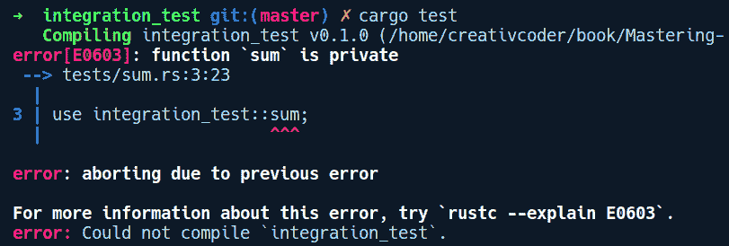

这个错误看起来是合理的。我们希望我们的 crate 的用户使用`sum`函数，但在我们的 crate 中，我们默认将其定义为私有函数。因此，在`sum`函数前添加`pub`修饰符并运行`cargo test`后，我们的测试再次变为绿色：

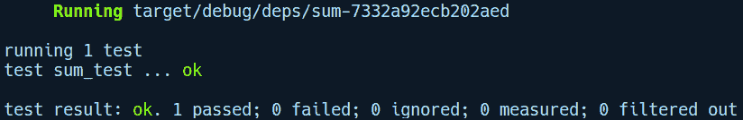

这里是我们`integration_test`示例 crate 的目录树视图：

```rs
. 
├── Cargo.lock 
├── Cargo.toml 
├── src 
│   └── lib.rs 
└── tests 
    └── sum.rs 
```

作为集成测试的一个例子，这非常简单，但它的要点是，当我们编写集成测试时，我们使用正在测试的 crate，就像任何其他库的用户使用它一样。

# 共享通用代码

正如集成测试通常所做的那样，我们需要在运行测试之前放置一些设置和清理相关的代码。通常，我们希望这些代码在`tests/`目录下的所有文件中共享。为了共享代码，我们可以通过创建一个共享通用代码的目录，或者使用一个名为`foo.rs`的模块，并在我们的集成测试文件中通过放置一个`mod`声明来声明我们依赖于它。因此，在我们的前一个`tests/`目录中，我们添加了一个名为`common.rs`的模块，其中包含两个名为`setup`和`teardown`的函数：

```rs
// integration_test/tests/common.rs

pub fn setup() {
    println!("Setting up fixtures");
}

pub fn teardown() {
    println!("Tearing down");
}
```

在我们的两个函数中，我们可以包含任何类型的固定相关代码。考虑一下，如果你有一个依赖于文本文件存在的集成测试。在我们的`setup`函数中，我们可以创建文本文件，而在我们的`teardown`函数中，我们可以通过删除文件来清理资源。

要在我们的`tests/sum.rs`集成测试代码中使用这些函数，我们按照如下方式添加`mod`声明：

```rs
// integration_test/tests/sum.rs

use integration_test::sum;

mod common;

use common::{setup, teardown};

#[test]
fn sum_test() { 
    assert_eq!(sum(6, 8), 14); 
}

#[test]
fn test_with_fixture() {
    setup();
    assert_eq!(sum(7, 14), 21);
    teardown();
}
```

我们添加了另一个函数，`test_with_fixture`，它包括对`setup`和`teardown`的调用。我们可以通过`cargo test test_with_fixture`运行这个测试。正如你可能从输出中注意到的，我们在`setup`或`teardown`函数内部看不到任何`println!`调用。这是因为默认情况下，测试框架会隐藏或捕获测试函数内的打印语句，以使测试结果更整洁，并且只显示测试框架的输出。如果我们想在测试中查看打印语句，我们可以通过`cargo test test_with_fixture -- --nocapture`运行测试，这将给出以下输出：

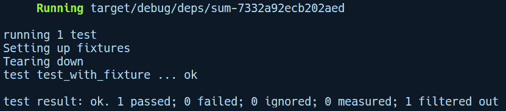

我们现在可以看到我们的打印语句了。我们需要在`cargo test test_with_fixture -- --nocapture`中使用`--`，因为我们实际上想将`--nocapture`标志传递给我们的测试运行器。`--`标记了`cargo`本身的参数结束，并且任何随后的参数都传递给由 cargo 调用的二进制文件，即我们的带有测试框架的编译二进制文件。

集成测试就到这里。在本章结束时，我们将创建一个项目，在那里我们可以看到单元测试和集成测试协同工作。接下来，我们将学习如何编写 Rust 代码的文档，这是软件开发中一个被忽视但相当重要的部分。

# 文档

文档是任何开源软件面向程序员社区广泛采用的一个非常关键的部分。虽然你的代码，应该是可读的，告诉你它是如何工作的，但文档应该告诉你设计决策的原因和如何以及公共 API 的示例用法。一个良好的文档，带有全面的`README.md`页面，可以大大提高你项目的可发现性。

Rust 社区非常重视文档，并在各个级别提供了工具，使编写代码文档变得容易。它还使文档对用户来说易于展示和消费。对于编写文档，它支持 Markdown 方言。Markdown 是一种非常流行的标记语言，并且现在是编写文档的标准。Rust 有一个专门的工具叫做**rustdoc**，它可以解析 Markdown 文档注释，将它们转换为 HTML，并生成美丽且可搜索的文档页面。

# 编写文档

要编写文档，我们有特殊的符号来标记文档注释的开始（以下称为 doc 注释）。文档的编写方式与编写注释类似，但与普通注释相比，它们被处理得不同，并且由 rustdoc 解析。doc 注释分为两个级别，并使用不同的符号来标记 doc 注释的开始：

+   **项目级别**：这些注释是针对模块内的项目，如结构体、枚举声明、函数、特质常量等。它们应该出现在项目上方。对于单行注释，它们以`///`开头，而多行注释以`/**`开头，以`*/`结尾。

+   **模块级别**：这些是在根级别出现的注释，即`main.rs`、`lib.rs`或任何其他模块，并使用`//!`来标记行注释的开始——或者使用`/*!`来标记多行注释——在结束前使用`*/`。它们适合提供对 crate 的一般概述和示例用法。

在文档注释中，你可以使用常规的 Markdown 语法来编写文档。它还支持在反引号（```rs`let a = 23;````）内编写有效的 Rust 代码，这将成为文档测试的一部分。

之前用于编写注释的符号实际上是`#[doc="your doc comment"]`属性的语法糖。这些被称为**文档属性**。当 rustdoc 解析`///`或`/**`行时，它会将它们转换为这些文档属性。或者，你也可以使用这些文档属性来编写文档。

# 生成和查看文档

要生成文档，我们可以在项目目录中使用`cargo doc`命令。它会在`target/doc/`目录下生成包含许多 HTML 文件和预定义样式的文档。默认情况下，它还会为 crate 的依赖项生成文档。我们可以通过运行`cargo doc --no-deps`来告诉 Cargo 忽略为依赖项生成文档。

要查看文档，可以在`target/doc`目录内导航以启动一个 HTTP 服务器。Python 的简单 HTTP 服务器在这里很有用。然而，还有更好的方法！将`--open`选项传递给`cargo doc`将直接在默认浏览器中打开文档页面。

`cargo doc`可以与`cargo watch`结合使用，以在编写文档并获得对项目上任何文档更改的实时反馈时获得无缝体验。

# 托管文档

在你的文档生成后，你需要将其托管在某个地方供公众查看和使用。这里有三种可能性：

+   **docs.rs**：托管在`crates.io`上的 crate 会自动生成并托管在[`docs.rs`](https://docs.rs)上的文档页面。

+   **GitHub pages**：如果你的 crate 在 GitHub 上，你可以将其文档托管在`gh-pages`分支上。

+   **外部网站**：你可以管理自己的 Web 服务器来托管文档。Rust 的标准库文档就是这样一个很好的例子：[`doc.rust-lang.org/std/`](https://doc.rust-lang.org/std/)。

作为附加说明，如果你的项目文档超过两到三页，并且需要详细的介绍，那么有一个更好的选项来生成类似书籍的文档。这是通过使用`mdbook`项目来实现的。有关更多信息，请查看他们的 GitHub 页面[`github.com/rust-lang-nursery/mdBook`](https://github.com/rust-lang-nursery/mdBook)。

# 文档属性

我们提到，我们编写的文档注释会被转换成文档属性形式。除了这些，还有其他文档属性可以调整生成的文档页面，这些属性可以在 crate 级别或项目级别应用。它们被写成`#[doc(key = value)]`的形式。以下是一些最有用的文档属性：

**crate 级属性**:

+   `#![doc(html_logo_url = "image url")]`: 允许您在文档页面的左上角添加一个标志。

+   `#![doc(html_root_url = "https://docs.rs/slotmap/0.2.1")]`: 允许您设置文档页面的 URL。

+   `#![doc(html_playground_url = "https://play.rust-lang.org/")]`: 允许您在文档中的代码示例附近放置一个运行按钮，以便您可以直接在在线 Rust playground 中运行它。

**项目级属性**:

+   `#[doc(hidden)]`: 假设您已经为公开函数`foo`编写了文档，作为自己的笔记。然而，您不希望您的消费者查看这些文档。您可以使用此属性告诉 rustdoc 忽略为`foo`生成文档。

+   `#[doc(include)]`: 这可以用来包含来自其他文件的文档。如果文档真的很长，这有助于您将文档与代码分离。

对于更多此类属性，请访问[`doc.rust-lang.org/beta/rustdoc/the-doc-attribute.html`](https://doc.rust-lang.org/beta/rustdoc/the-doc-attribute.html)。

# 文档测试

在为 crate 的公开 API 编写任何文档时包含代码示例通常是一个好习惯。尽管如此，维护这些示例也存在一个注意事项。您的代码可能会更改，您可能会忘记更新示例。文档测试（doctests）就是为了提醒您更新示例代码。Rust 允许您在文档注释中嵌入反引号内的代码。然后 Cargo 可以运行嵌入在文档中的示例代码，并将其视为单元测试套件的一部分。这意味着文档示例会在您运行单元测试时运行，迫使您更新它们。这非常神奇！

文档测试也是通过 Cargo 执行的。我们创建了一个名为`doctest_demo`的项目来展示文档测试。在`lib.rs`中，我们有以下代码：

```rs
// doctest_demo/src/lib.rs

//! This crate provides functionality for adding things
//!
//! # Examples
//! ```

//! use doctest_demo::sum;

//!

//! let work_a = 4;

//! let work_b = 34;

//! let total_work = sum(work_a, work_b);

//! ```rs

/// Sum two arguments
///
/// # Examples
///
/// ```

/// assert_eq!(doctest_demo::sum(1, 1), 2);

/// ```rs
pub fn sum(a: i8, b: i8) -> i8 {
    a + b
}
```

如您所见，模块级和函数级文档测试之间的区别不大。它们的使用方式几乎相同。只是模块级文档测试显示了 crate 的整体使用情况，覆盖了多个 API 界面，而函数级文档测试仅覆盖它们出现的特定函数。

当您运行`cargo test`时，文档测试会与其他所有测试一起运行。以下是我们运行`doctest_demo` crate 中的`cargo test`时的输出：

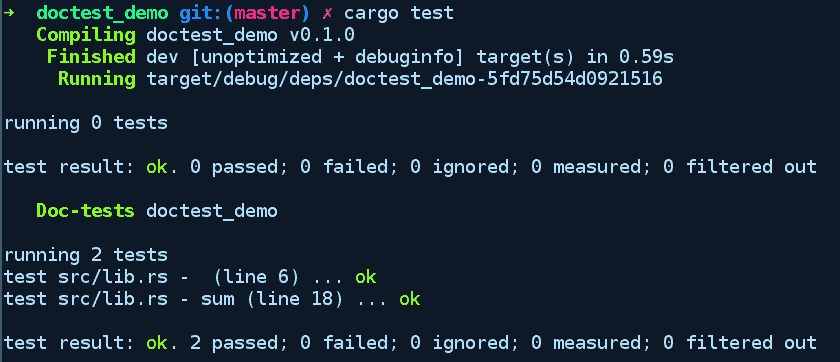

# 基准测试

当业务需求发生变化，并且你的程序需要更高效地执行时，首先要采取的步骤是找出程序中缓慢的区域。你如何判断瓶颈在哪里？你可以通过在各个预期的范围或输入量级上测量程序的单个部分来了解。这被称为基准测试你的代码。基准测试通常在开发的最后阶段进行（但不必如此），以提供关于代码中性能陷阱的见解。

对于一个程序，有多种方式进行基准测试。最简单的方法是使用 Unix 工具 time 来测量你更改后的程序执行时间。但这并不提供精确的微级洞察。Rust 为我们提供了一个内置的微基准测试框架。通过微基准测试，我们指的是它可以用来独立基准测试代码的各个部分，并且不受外部因素的影响。然而，这也意味着我们不应该仅仅依赖于微基准测试，因为现实世界的结果可能会被扭曲。因此，微基准测试通常随后会进行代码的剖析和宏基准测试。尽管如此，微基准测试通常是提高你代码性能的起点，因为各个部分对程序的总体运行时间贡献很大。

在本节中，我们将讨论 Rust 提供的用于执行微基准测试的内置工具。Rust 从开发初期就降低了编写基准测试代码的门槛，而不是作为最后的手段。运行基准测试的方式与运行测试类似，但使用的是`cargo bench`命令。

# 内置的微基准测试工具

Rust 的内置基准测试框架通过运行多次迭代来衡量代码的性能，并报告操作的平均时间。这由以下两点促成：

+   函数上的`#[bench]`注解。这表示该函数是一个基准测试。

+   内部编译器 crate `libtest`，其中包含一个`Bencher`类型，基准测试函数使用它来运行多次相同的基准测试代码。此类型位于编译器内部的`test` crate 下。

现在，我们将编写并运行一个简单的基准测试。让我们通过运行`cargo new --lib bench_example`来创建一个新的 Cargo 项目。对于这个项目，不需要对`Cargo.toml`进行任何更改。`src/lib.rs`的内容如下：

```rs
// bench_example/src/lib.rs

#![feature(test)]
extern crate test;

use test::Bencher;

pub fn do_nothing_slowly() {
    print!(".");
    for _ in 1..10_000_000 {};
}

pub fn do_nothing_fast() {
}

#[bench]
fn bench_nothing_slowly(b: &mut Bencher) {
    b.iter(|| do_nothing_slowly());
}

#[bench]
fn bench_nothing_fast(b: &mut Bencher) {
    b.iter(|| do_nothing_fast());
}
```

注意，我们必须使用`external crate`声明和`#[feature(test)]`属性来指定内部 crate `test`。`extern`声明对于编译器内部的 crate 是必需的。在编译器的未来版本中，这可能不再需要，你将能够像正常 crate 一样`use`它们。

如果我们通过运行`cargo bench`来运行基准测试，我们将看到以下内容：

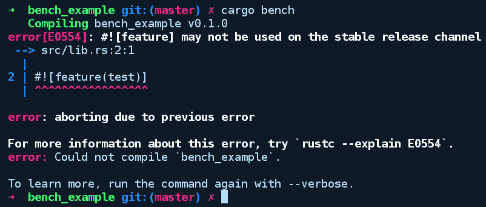

不幸的是，基准测试是一个不稳定的功能，所以我们将不得不使用夜间编译器来执行这些测试。幸运的是，使用 `rustup` 在 Rust 编译器的不同发布渠道之间切换很容易。首先，我们将通过运行 `rustup update nightly` 来确保夜间编译器已安装。然后，在我们的 `bench_example` 目录中，我们将通过运行 `rustup override set nightly` 来覆盖此目录的默认工具链。现在，运行 `cargo bench` 将给出以下输出：

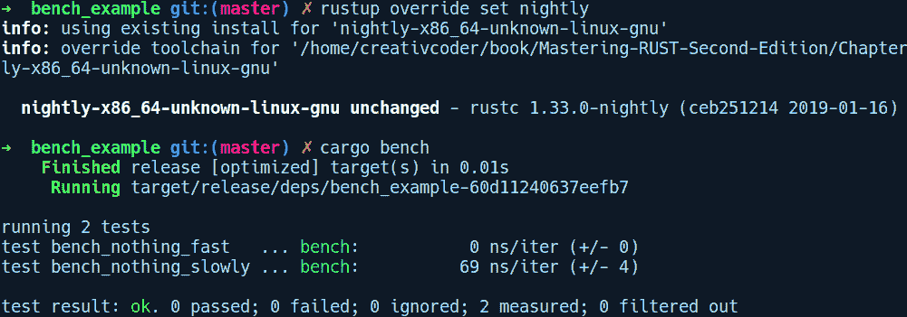

这些是每次迭代的纳秒数，括号内的数字显示了每次运行之间的变化。我们的较慢实现运行速度相当慢且变化很大（如大的 `+/-` 变化所示）。

在我们标记为 `#[bench]` 的函数内部，`iter` 的参数是一个无参数的闭包。如果闭包有参数，它们将位于 `||` 内。这本质上意味着 `iter` 被传递了一个可以被基准测试重复运行的函数。我们在函数中打印一个点，这样 Rust 就不会优化掉空循环。如果没有 `println!()`，那么编译器就会将循环优化为一个无操作，我们会得到错误的结果。有方法可以绕过这个问题，这是通过使用 `test` 模块中的 `black_box` 函数来实现的。然而，即使使用了那个函数，也不能保证优化器不会优化你的代码。现在，我们也有其他第三方解决方案来在稳定版 Rust 上运行基准测试。

# 在稳定版 Rust 上的基准测试

Rust 提供的内置基准测试框架是不稳定的，但幸运的是，有一些社区开发的基准测试 crate 可以在稳定版 Rust 上工作。我们将在这里探索的一个流行的 crate 是 `criterion-rs`。这个 crate 设计得易于使用，同时提供有关基准测试代码的详细信息。它还维护了上次运行的状

为了演示如何使用这个 crate，我们将创建一个新的 crate，名为 `cargo new criterion_demo --lib`。我们将 criterion crate 添加到 `Cargo.toml` 中的 `dev-dependencies` 部分作为依赖项：

```rs
[dev-dependencies]
criterion = "0.1"

[[bench]]
name = "fibonacci"
harness = false
```

我们还添加了一个新的部分，称为 `[[bench]]`，它指示 cargo 我们有一个名为 `fibonacci` 的新基准测试，并且它不使用内置的基准测试工具（`harness = false`），因为我们正在使用 criterion crate 的测试工具。

现在，在 `src/lib.rs` 中，我们有一个计算第 n 个 `fibonacci` 数（初始值为 `n[0] = 0` 和 `n[1] = 1`）的函数的快速和慢速版本：

```rs
// criterion_demo/src/lib.rs

pub fn slow_fibonacci(nth: usize) -> u64 {
    if nth <= 1 {
        return nth as u64;   
    } else {
        return slow_fibonacci(nth - 1) + slow_fibonacci(nth - 2);
    }
}

pub fn fast_fibonacci(nth: usize) -> u64 {
    let mut a = 0;
    let mut b = 1;
    let mut c = 0;
    for _ in 1..nth {
        c = a + b;
        a = b;
        b = c;
    }
    c
}
```

`fast_fibonacci` 是获取第 n 个斐波那契数的自底向上的迭代解决方案，而 `slow_fibonacci` 版本则是较慢的递归版本。现在，`criterion-rs` 要求我们将基准测试放在一个 `benches/` 目录中，我们在 crate 根目录下创建了它。在 `benches/` 目录中，我们还创建了一个名为 `fibonacci.rs` 的文件，它与 `Cargo.toml` 中的 `[[bench]]` 下的名称相匹配。其内容如下：

```rs
// criterion_demo/benches/fibonacci.rs

#[macro_use]
extern crate criterion;
extern crate criterion_demo;

use criterion_demo::{fast_fibonacci, slow_fibonacci};
use criterion::Criterion;

fn fibonacci_benchmark(c: &mut Criterion) {
    c.bench_function("fibonacci 8", |b| b.iter(|| slow_fibonacci(8)));
}

criterion_group!(fib_bench, fibonacci_benchmark);
criterion_main!(fib_bench);
```

这里有很多事情在进行中！在上面的代码中，我们首先声明了所需的 crate 并导入了我们需要基准测试的 `fibonacci` 函数（`fast_fibonacci` 和 `slow_fibonacci`）。此外，在 `extern crate criterion` 上有一个 `#[macro_use]` 属性，这意味着要使用来自 crate 的任何宏，我们需要使用此属性来选择它，因为它们默认没有暴露。这类似于一个 `use` 语句，它用于暴露模块项。

现在，criterion 有一个概念叫做基准测试组，它可以包含相关的基准测试代码。相应地，我们创建了一个名为 `fibonacci_benchmark` 的函数，然后将其传递给 `criterion_group!` 宏。这给这个基准测试组分配了一个名为 `fib_bench` 的名称。`fibonacci_benchmark` 函数接收一个对 `criterion` 对象的可变引用，该对象持有我们的基准测试运行的状态。这暴露了一个名为 `bench_function` 的方法，我们使用它将我们的基准测试代码传递到一个具有给定名称的闭包中（上面是 `fibonacci 8`）。然后，我们需要创建主要的基准测试 harness，它使用 `criterion_main!` 生成带有 `main` 函数的代码来运行所有这些，在传递我们的基准测试组 `fib_bench` 之前。现在，是时候运行 `cargo bench` 并在闭包中包含第一个 `slow_fibonacci` 函数了。我们得到以下输出：

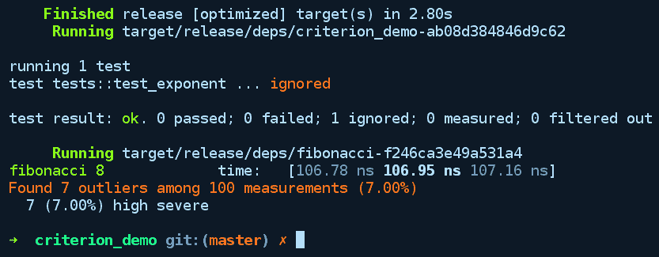

我们可以看到，我们的 `fibonacci` 函数的递归版本平均运行时间约为 106.95 纳秒。现在，在同一个基准测试闭包中，如果我们用 `fast_fibonacci` 替换 `slow_fibonacci` 并再次运行 `cargo bench`，我们将得到以下输出：

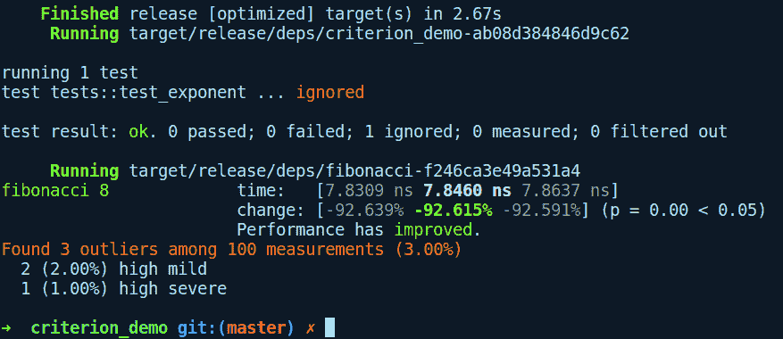

太棒了！`fast_fibonacci` 版本平均运行时间仅为 7.8460 纳秒。这是显而易见的，但真正令人兴奋的是详细的基准测试报告，它还显示了一个人性化的消息：性能已提升。criterion 能够显示这个回归报告的原因是它维护了基准测试运行的先前状态，并使用它们的历史记录来报告性能的变化。

# 编写和测试一个 crate – 逻辑门模拟器

带着所有这些知识，让我们开始我们的逻辑门模拟 crate。通过运行`cargo new logic_gates --lib`来创建一个新的项目。从实现为函数的原始门开始，例如`and`、`xor`等，我们将为这些门编写单元测试。随后，我们将通过实现使用我们的原始门的半加器来编写集成测试。在这个过程中，我们还将为我们的 crate 编写文档。

首先，我们将从一些单元测试开始。以下是初始的 crate 代码的完整内容：

```rs
//! This is a logic gates simulation crate built to demonstrate writing unit tests and integration tests

// logic_gates/src/lib.rs

pub fn and(a: u8, b: u8) -> u8 {
    unimplemented!()
}

pub fn xor(a: u8, b: u8) -> u8 {
    unimplemented!()
}

#[cfg(test)]
mod tests {
    use crate::{xor, and};
    #[test]
    fn test_and() {
        assert_eq!(1, and(1, 1));
        assert_eq!(0, and(0, 1));
        assert_eq!(0, and(1, 0));
        assert_eq!(0, and(0, 0));
    }

    #[test]
    fn test_xor() {
        assert_eq!(1, xor(1, 0));
        assert_eq!(0, xor(0, 0));
        assert_eq!(0, xor(1, 1));
        assert_eq!(1, xor(0, 1));
    }
}
```

我们从两个逻辑门`and`和`xor`开始，这些门已经作为函数实现。我们还有针对它们的测试用例，当运行时因为它们尚未实现而失败。注意，为了表示比特`0`和`1`，我们使用`u8`，因为 Rust 没有原生的类型来表示比特。现在，让我们填写它们的实现，以及一些文档：

```rs
/// Implements a boolean `and` gate taking as input two bits and returns a bit as output
pub fn and(a: u8, b: u8) -> u8 {
    match (a, b) {
        (1, 1) => 1,
        _ => 0
    }
}

/// Implements a boolean `xor` gate taking as input two bits and returning a bit as output
pub fn xor(a: u8, b: u8) -> u8 {
    match (a, b) {
        (1, 0) | (0, 1) => 1,
        _ => 0
    }
}
```

在前面的代码中，我们只是使用 match 表达式表达了`and`和`xor`门的真值表。我们可以看到 match 表达式在表达我们的逻辑时是多么简洁。现在，我们可以通过运行`cargo test`来运行测试：

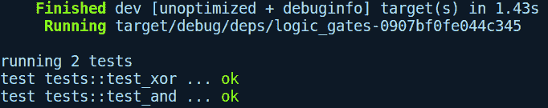

全部绿色！我们现在可以使用这些门实现半加器来编写集成测试。半加器完美地适合作为集成测试示例，因为它在组件被一起使用时测试了我们的 crate 的各个部分。在`tests/`目录下，我们将创建一个名为`half_adder.rs`的文件，其中包含以下代码：

```rs
// logic_gates/tests/half_adder.rs

use logic_gates::{and, xor};

pub type Sum = u8;
pub type Carry = u8;

pub fn half_adder_input_output() -> Vec<((u8, u8), (Sum, Carry))> { 
    vec![
        ((0, 0), (0, 0)), 
        ((0, 1), (1, 0)), 
        ((1, 0), (1, 0)), 
        ((1, 1), (0, 1)), 
    ] 
}

/// This function implements a half adder using primitive gates
fn half_adder(a: u8, b: u8) -> (Sum, Carry) {
    (xor(a, b), and(a, b))
}

#[test]
fn one_bit_adder() {
    for (inn, out) in half_adder_input_output() {
        let (a, b) = inn;
        println("Testing: {}, {} -> {}", a, b, out);
        assert_eq!(half_adder(a, b), out);
    }
}

```

在前面的代码中，我们导入了我们的原始门函数`xor`和`and`。随后，我们有类似`pub type Sum = u8`的东西，这被称为类型别名。它们在以下情况下很有帮助：当你有一个每次都难以书写的类型，或者当你有具有复杂签名的类型时。它为我们原始类型提供了一个新名称，纯粹是为了可读性和消除歧义；它对 Rust 分析这些类型的方式没有影响。然后我们在`half_adder_input_output`函数中使用`Sum`和`Carry`，该函数实现了半加器的真值表。这是一个方便的辅助函数，用于测试随后的`half_adder`函数。这个函数接受两个单比特输入，并从它们中计算出`Sum`和`Carry`，然后作为`(Sum, Carry)`元组返回。进一步，我们有我们的`one_bit_adder`集成测试函数，其中我们遍历半加器输入输出对，并对`half_adder`的输出进行断言。通过运行`cargo test`，我们得到以下输出：

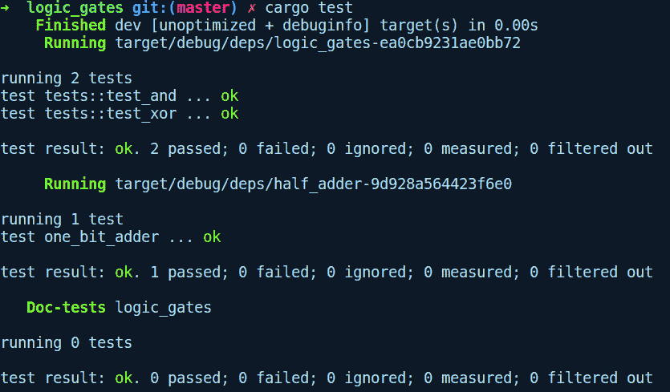

太棒了！让我们也通过运行 `cargo doc --open` 为我们的 crate 生成文档。`--open` 标志会在浏览器中为我们打开页面。为了自定义我们的文档，我们还将向 crate 文档页面添加一个图标。为此，我们需要在 `lib.rs` 的顶部添加以下属性：

```rs
#![doc(html_logo_url = "https://d30y9cdsu7xlg0.cloudfront.net/png/411962-200.png")]
```

生成后，文档页面看起来是这样的：

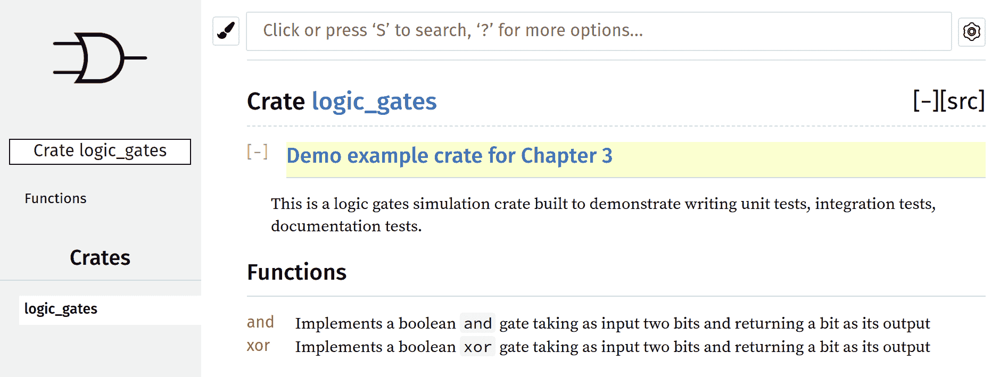

这太棒了！我们在测试之旅上已经走了很长的路。接下来，让我们看看自动化测试套件的方面。

# 与 Travis CI 进行持续集成

在大型软件系统中，对于代码的每一次更改，我们通常都希望自动运行我们的单元测试和集成测试。此外，在协作项目中，手动方式显然不切实际。幸运的是，持续集成是一种旨在自动化软件开发这些方面的实践。Travis CI 是一个公共持续集成服务，允许您根据事件钩子在云中自动运行您项目的测试。事件钩子的一个例子是在推送新提交时。

Travis 通常用于自动化运行构建和测试以及报告失败的构建，但也可以用于创建发布版本，甚至部署到预发布或生产环境。在本节中，我们将关注 Travis 的一个方面，即为我们项目执行自动测试。GitHub 已经集成了 Travis，可以为我们项目的每个新提交运行测试。为了实现这一点，我们需要以下内容：

+   我们在 GitHub 上的项目

+   通过使用 GitHub 登录创建的 Travis 账户

+   您的项目已在 Travis 中启用构建

+   在您的仓库根目录下的 `.travis.yml` 文件，告诉 Travis 要运行什么

第一步是前往 [`travis-ci.org/`](https://travis-ci.org/) 并使用您的 GitHub 凭据登录。从那里，我们可以在 Travis 中添加我们的 GitHub 仓库。Travis 对 Rust 项目有良好的原生支持，并持续更新其 Rust 编译器。它为 Rust 项目提供了一个基本的 `.travis.yml` 文件，如下所示：

```rs
language: rust 
rust: 
  - stable 
  - beta 
  - nightly 
matrix: 
  allow_failures: 
  - rust: nightly 
```

Rust 项目还建议针对 beta 和 nightly 频道进行测试，但您可以选择通过删除相应的行来仅针对单个版本进行目标。此推荐设置在所有三个版本上运行测试，但允许快速移动的 nightly 编译器失败。

在您的仓库中拥有这个 `.travis.yml` 文件，GitHub 将在您每次推送代码并运行测试时通知 Travis CI。我们还可以将构建状态徽章附加到仓库的 `README.md` 文件中，当测试通过时显示绿色徽章，当测试失败时显示红色徽章。

让我们将 Travis 与我们的 `logic_gates` crate 集成。为此，我们必须在 crate 根目录下添加一个 `.travis.yml` 文件。以下是为 `.travis.yml` 文件的内容：

```rs
language: rust
rust:
  - stable
  - beta
  - nightly
matrix:
  allow_failures:
    - rust: nightly
  fast_finish: true
cache: cargo

script:
  - cargo build --verbose
  - cargo test --verbose
```

将此推送到 GitHub 后，我们接下来需要在他们的页面上启用 Travis 以用于我们的项目，如下所示：

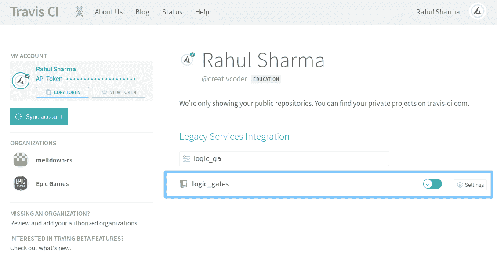

之前的截图来自我的 TravisCI 账户。现在，我们将通过向我们的`logic_gates`仓库添加一个简单的`README.md`文件来提交一个 commit，以触发 Travis 构建运行器。在此过程中，我们还将向`README.md`文件添加一个构建徽章，以便向消费者展示我们仓库的状态。为此，我们将点击右侧的构建通过徽章：


这将打开一个包含徽章链接的弹出菜单：

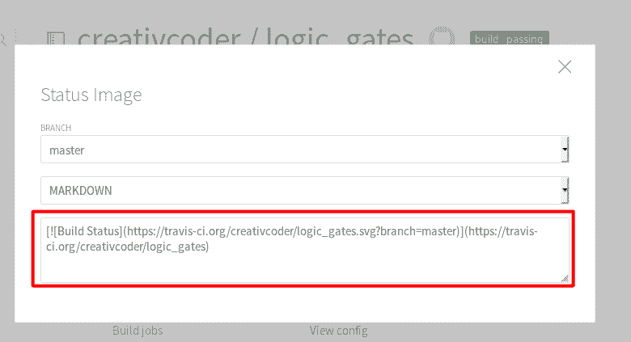

我们将复制此链接并将其添加到`README.md`文件的顶部，如下所示：

```rs
[](https://travis-ci.org/creativcoder/logic_gates)
```

您需要将`$USERNAME`和`$REPO_NAME`替换为您自己的详细信息。

在此更改并提交`README.md`文件之后，我们将开始看到 Travis 构建开始并成功：

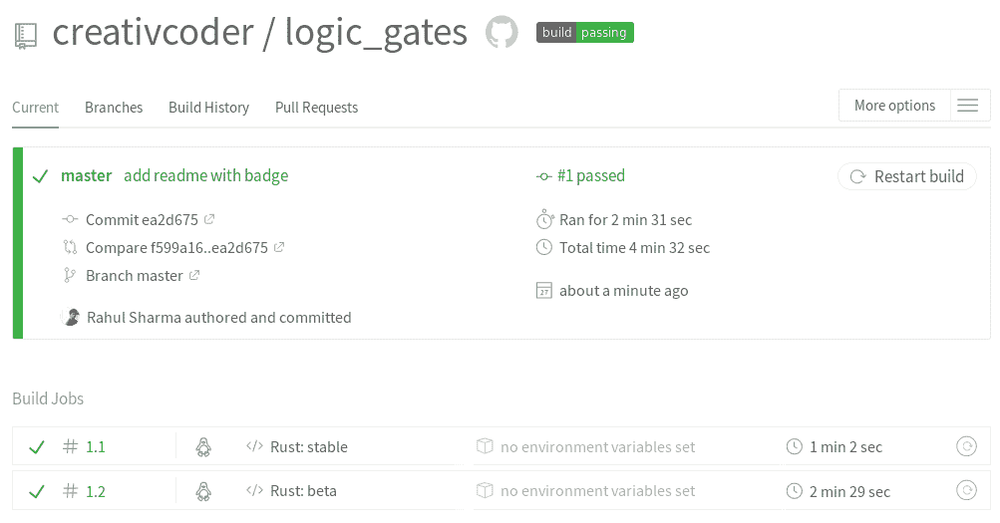

太棒了！如果您更有雄心，您还可以尝试在 GitHub 仓库的`gh-pages`分支上托管`logic_gates` crate 的文档。您可以通过使用可在[`github.com/roblabla/cargo-travis`](https://github.com/roblabla/cargo-travis)找到的`cargo-travis`项目来实现这一点。

对于一个更通用的 CI 设置，它涵盖了主要平台，您可以使用信任项目提供的模板，该模板可在[`github.com/japaric/trust`](https://github.com/japaric/trust)找到。

最后，为了在*crates.io*上发布您的 crate，您可以按照 Cargo 参考文档中给出的说明操作：[`doc.rust-lang.org/cargo/reference/publishing.html`](https://doc.rust-lang.org/cargo/reference/publishing.html)。

# 摘要

在本章中，我们熟悉了使用`rustc`和`cargo`工具编写单元测试、集成测试、文档测试和基准测试。然后，我们实现了一个逻辑门模拟 crate，并体验了整个 crate 开发工作流程。之后，我们学习了如何将 Travis CI 集成到我们的 GitHub 项目中。

在下一章中，我们将探讨 Rust 的类型系统以及如何在编译时使用它来在我们的程序中表达正确的语义。
