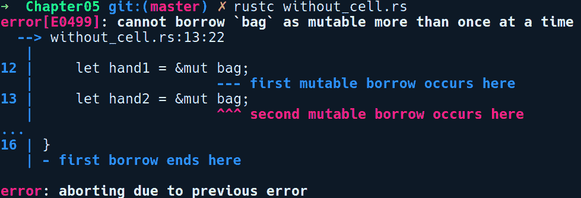

# 第五章：内存管理和安全

对于任何使用底层编程语言的人来说，理解内存管理是一个基本概念。底层语言没有内置的垃圾回收器等自动内存回收解决方案，管理程序使用的内存是程序员的职责。了解程序中内存的使用位置和方式，使程序员能够构建高效且安全的软件系统。许多底层软件中的错误都是由于不正确地处理内存造成的。有时，这是程序员的错误。其他时候，这是所使用的编程语言的副作用，例如 C 和 C++，它们因软件中的许多内存漏洞报告而臭名昭著。Rust 为内存管理提供了一个更好的编译时解决方案。除非你明确打算这样做，否则它很难编写会泄漏内存的软件！使用 Rust 进行了一定程度开发的程序员最终会意识到，它不鼓励不良编程实践，并指导程序员编写使用内存安全且高效的软件。

在本章中，我们将深入了解 Rust 如何驯服程序中资源使用的内存的细节。我们将简要介绍进程、内存分配、内存管理和我们所说的内存安全。然后，我们将了解 Rust 提供的内存安全模型，并理解使其能够在编译时跟踪内存使用量的概念。我们将看到如何使用特性来控制类型在内存中的位置以及它们何时被释放。我们还将深入研究各种智能指针类型，它们为管理程序中的资源提供了抽象。

本章涵盖的主题如下：

+   程序和内存

+   内存分配和安全

+   内存管理

+   栈和堆

+   安全三合一——所有权、借用和生命周期

+   智能指针类型

# 程序和内存

"如果你愿意限制你方法的灵活性，你几乎总能做得更好。"

– *约翰·卡马克*

为了理解内存及其管理，我们需要对操作系统如何运行程序以及允许它为需求使用内存的机制有一个大致的了解。

每个程序都需要内存来运行，无论是你喜欢的命令行工具还是复杂的流处理服务，它们的内存需求差异很大。在主要的操作系统实现中，正在执行的程序被实现为一个进程。进程是程序的运行实例。当我们 Linux 中的 shell 中执行`./my_program`或在 Windows 上双击`my_program.exe`时，操作系统将`my_program`作为进程加载到内存中并开始执行，与其他进程一起，给它分配 CPU 和内存的一部分。它为进程分配其自己的虚拟地址空间，这个地址空间与其他进程的虚拟地址空间不同，并且具有自己的内存视图。

在进程的生命周期中，它使用了大量的系统资源。首先，它需要内存来存储自己的指令，然后它需要空间来存储在指令执行期间运行时请求的资源，然后它需要一个方法来跟踪函数调用、任何局部变量以及返回到上一个调用函数的地址。其中一些内存需求可以在编译时提前决定，例如在变量中存储原始类型，而其他一些只能在运行时满足，例如创建动态数据类型如`Vec<String>`。由于内存需求的各个层级，以及出于安全考虑，进程对内存的视图被划分为称为内存布局的区域。

这里，我们有一个进程内存布局的大致表示：


这个布局根据它们存储的数据类型和提供的功能被划分为不同的区域。我们关注的几个主要部分如下：

+   **文本段**：这部分包含要执行的实际代码，在编译的二进制文件中。文本段是一个只读段，任何用户代码都禁止修改它。这样做可能会导致程序崩溃。

+   **数据段**：这部分进一步划分为子段，即初始化数据段和未初始化数据段，这在历史上被称为**块起始符号（BSS）**，它包含程序中声明的所有全局和静态值。未初始化的值在加载到内存时被初始化为零。

+   **栈段**：这个段用于存储任何局部变量和函数的返回地址。所有大小已知且程序创建的任何临时/中间变量都隐式地存储在栈上。

+   **堆段**：这个段用于存储任何在运行时大小未知且可以变化的动态分配的数据。当我们希望值在函数声明之外持续存在时，这是理想的分配位置。

# 程序如何使用内存？

因此，我们知道一个进程有一个专门用于其执行的内存块。但是，它是如何访问这个内存来执行其任务的呢？出于安全和故障隔离的目的，进程不允许直接访问物理内存。相反，它使用虚拟内存，该内存由操作系统通过一个称为 **页** 的内存数据结构映射到实际的物理内存，这些 **页** 被维护在 **页表** 中。进程必须从操作系统请求内存以供其使用，它得到的是一个虚拟地址，该地址在内部映射到 RAM 中的物理地址。出于性能考虑，内存是以块的形式请求和处理的。当进程访问虚拟内存时，内存管理单元执行从虚拟到物理内存的实际转换。

进程从操作系统获取内存的整个过程被称为 **内存分配**。进程通过使用 *系统调用* 从操作系统请求一块内存，操作系统标记该内存块为该进程使用。当进程完成对内存的使用后，它必须将内存标记为空闲，以便其他进程可以使用。这被称为内存的 **释放**。主要的操作系统实现通过系统调用（如 Linux 中的 `brk` 和 `sbrk`）提供抽象，这些是直接与操作系统内核通信的函数，可以分配进程请求的内存。但这些内核级函数非常低级，因此它们被系统库（如 **glibc** 库）进一步抽象，该库是 Linux 中的 C 语言标准库，包括 POSIX API 的实现，它简化了从 C 语言进行低级操作系统交互。

POSIX 是 Portable Operating System Interface 的缩写，这是一个由理查德·斯托尔曼提出的术语。它是一组随着标准化 Unix-like 操作系统应提供哪些功能、它们应向 C 等语言暴露哪些低级 API、它们应包含哪些命令行工具以及许多其他方面的需求而出现的标准。

Glibc 还提供了一组内存分配器 API，暴露了如 `malloc`、`calloc` 和 `realloc` 等用于分配内存的函数，以及 `free` 函数用于释放内存。尽管我们有一个相当高级的内存分配/释放 API，但在使用低级编程语言时，我们仍然需要自己管理内存。

# 内存管理及其种类

您电脑中的 RAM 是一种有限的资源，并且被所有正在运行的应用程序共享。当程序完成执行其指令后，它应该释放任何使用的内存，以便操作系统可以回收并分配给其他进程。当我们谈论内存管理时，我们关注的突出方面之一是已使用内存的回收以及它是如何发生的。不同语言在释放已使用内存时所需的管理级别不同。直到 1990 年代中期，大多数编程语言都依赖于手动内存管理，这要求程序员在代码中调用内存分配器 API，如`malloc`和`free`来分别分配和释放内存。大约在 1959 年，*约翰·麦卡锡*，*Lisp*的创造者，发明了**垃圾回收器**（**GC**），这是一种自动内存管理形式，而 Lisp 是第一个使用这种技术的语言。GC 作为一个守护线程作为运行程序的一部分运行，并分析程序中不再被任何变量引用的内存，并在程序执行的一定时间点自动释放它。

然而，低级语言没有内置 GC，因为它引入了非确定性以及由于 GC 线程在后台运行而产生的运行时开销，这有时会暂停程序的执行。这种暂停有时会达到毫秒级的延迟。这可能会违反系统软件的严格时间和空间限制。低级语言将程序员置于手动管理内存的控制之下。然而，像 C++和 Rust 这样的语言通过类型系统抽象，如智能指针，从程序员那里分担了一些负担，我们将在本章后面讨论。

考虑到语言之间的差异，我们可以将这些语言使用的内存管理策略分为三个类别：

+   **手动**：*C*具有这种形式的内存管理，其中程序员完全负责在代码使用内存后调用`free`。C++通过智能指针在一定程度上自动化了这一点，其中`free`调用被放置在类的析构函数方法定义中。Rust 也有智能指针，我们将在本章后面讨论。

+   **自动**：具有这种形式内存管理的语言包括一个额外的运行时线程，即垃圾回收器，它作为守护线程与程序并行运行。大多数基于虚拟机的动态语言，如 Python、Java、C#和 Ruby，都依赖于自动内存管理。自动内存管理是这些语言编写代码容易的一个原因。

+   **半自动**：像 Swift 这样的语言属于这一类别。它们作为运行时的一部分没有内置专门的 GC，但提供了一种引用计数类型，可以在细粒度级别自动管理内存。Rust 也提供了引用计数类型`Rc<T>`和`Arc<T>`。我们将在本章后面解释*智能指针*时详细介绍它们。

# 内存分配方法

在运行时，一个进程中的内存分配要么发生在*栈*上，要么发生在*堆*上。它们是程序执行期间用于存储值的存储位置。在本节中，我们将探讨这两种分配方法。

栈用于存储生命周期短暂的值，其大小在编译时已知，是函数调用及其相关上下文的理想存储位置，一旦函数返回，这些上下文就需要消失。堆用于任何需要在函数调用之外持续存在的对象。如第一章“入门指南”中所述，Rust 默认偏好栈分配。你创建并绑定到变量的任何值或类型的实例默认存储在栈上。在堆上存储是显式的，并且通过使用智能指针类型来完成，这些类型将在本章后面进行解释。

# 栈

每当我们调用一个函数或方法时，栈被用来为在函数内部创建的值分配空间。你函数中的所有`let`绑定都存储在栈上，要么作为值本身，要么作为指向堆上内存位置的指针。这些值构成了活动函数的**栈帧**。栈帧是栈中存储函数调用上下文的逻辑内存块。这个上下文可能包括函数参数、局部变量、返回地址以及需要在函数返回后恢复的任何已保存寄存器的值。随着越来越多的函数被调用，它们对应的栈帧被推入栈中。一旦函数返回，与该函数对应的栈帧就会消失，以及在该帧中声明的所有值。

这些值按照它们声明的相反顺序被移除，遵循**后进先出**（**LIFO**）的顺序。

在栈上进行分配很快，因为在这里分配和释放内存只需要一个 CPU 指令：增加/减少栈帧指针。栈帧指针（`esp`）是一个 CPU 寄存器，它始终指向栈顶。随着函数的调用或返回，栈帧指针会不断更新。当函数返回时，通过将栈帧指针恢复到进入函数之前的位置，其栈帧被丢弃。使用栈是一种临时内存分配策略，但由于其简单性，它在释放已用内存方面是可靠的。然而，栈的同一属性使其不适合需要超出当前栈帧的持久值的场景。

下面是一段代码，大致展示了在程序中函数调用期间栈是如何更新的：

```rs
// stack_basics.rs

fn double_of(b: i32) -> i32 {
    let x = 2 * b;
    x
}

fn main() {
    let a = 12;
    let result = double_of(a);
}
```

我们将使用一个空数组`[]`来表示这个程序的栈状态。让我们通过对这个程序进行一次模拟运行来探索栈的内容。我们还将使用`[]`来表示父栈中的栈帧。当程序运行时，以下步骤将按顺序发生：

1.  当`main`函数被调用时，它创建了一个栈帧，其中包含`a`和`result`（初始化为零）。此时栈的内容为`[[a=12, result=0]]`。

1.  接下来，调用`double_of`函数，并在栈上推入一个新的栈帧以保存其局部值。此时栈的内容为`[[a=12, result=0], [b=12, temp_double=2*x, x=0]]`。`temp_double`是一个由编译器创建的临时变量，用于存储`2 * x`的结果，然后将其分配给在`double_of`函数中声明的变量`x`。然后这个`x`被返回给调用者，即我们的`main`函数。

1.  一旦`double_of`函数返回，它的栈帧将从栈中弹出，此时栈的内容变为`[[a=12, result=24]]`。

1.  随后，`main`函数结束，其栈帧被弹出，栈变为空：`[]`。

然而，这里还有更多细节。我们只是提供了一个关于函数调用及其与栈内存交互的非常高级的概述。现在，如果我们只有局部值，它们只在函数调用期间有效，这将非常有限。虽然栈简单且强大，但要实用，程序还需要更持久的变量，而这正是堆的作用。

# 堆栈

堆用于更复杂和动态的内存分配需求。程序可能在某个时刻在堆上分配内存，也可能在另一个时刻释放它，这些点之间不需要有严格的界限，就像栈内存那样。在栈分配的情况下，你将得到值的确定性的分配和释放。此外，堆中的值可能在其分配的函数之外存活，并且可能稍后被其他函数释放。在这种情况下，代码未能调用`free`，因此它可能根本不会被释放，这是最坏的情况。

不同的语言以不同的方式使用堆内存。在动态语言如 Python*中，一切都是对象，并且默认情况下它们在堆上分配。在 C 中，我们使用手动`malloc`调用在堆上分配内存，而在 C++中，我们使用`new`关键字进行分配。为了释放内存，我们需要在 C 中调用`free`，在 C++中调用`delete`。为了避免手动`delete`调用，程序员通常使用`unique_ptr`或`shared_ptr`等智能指针类型。这些智能指针类型有析构函数，当它们在内部超出作用域时会被调用，并执行`delete`。这种管理内存的范式称为 RAII 原则，并由 C++普及。

RAII 代表资源获取即初始化；一种建议资源必须在对象的初始化期间获取，并在它们被释放或调用析构函数时释放的范式。

Rust 也有类似于 C++管理堆内存的抽象。在这里，在堆上分配内存的唯一方式是通过智能指针类型。Rust 中的智能指针类型实现了`Drop`特质，它指定了值使用的内存应该如何被释放，并且在语义上与 C++中的析构函数类似。除非有人编写了自己的自定义智能指针类型，否则您永远不需要在它们的类型上实现`Drop`。关于`Drop`特质的更多内容将在单独的部分中介绍。

为了在堆上分配内存，语言依赖于专门的内存分配器，这些分配器隐藏了所有底层细节，如在对齐内存上分配内存、维护空闲内存块以减少系统调用开销、以及在分配内存和其他优化时减少碎片化。对于编译程序，编译器 rustc 本身使用 jemalloc 分配器，而由 Rust 构建的库和二进制文件使用系统分配器。在 Linux 上，将是 glibc 内存分配器 API。jemalloc 是一个用于多线程环境的有效分配器库，它大大减少了 Rust 程序的构建时间。虽然编译器使用了 jemalloc，但它不会被用 Rust 构建的应用程序使用，因为它会增加二进制文件的大小。因此，编译的二进制文件和库默认总是使用系统分配器。

Rust 还有一个可插拔的分配器设计，可以使用系统分配器或任何实现了`std::alloc`模块中的`GlobalAlloc`特质的用户实现分配器。这通常通过`#[global_allocator]`属性实现，可以将它放在任何类型上以声明它为一个分配器。

**注意**：如果您有一个用例希望在自己的程序中使用 jemalloc crate，您可以使用[`crates.io/crates/jemallocator`](https://crates.io/crates/jemallocator) crate。

在 Rust 中，大多数大小事先未知的动态类型都在堆上分配。这排除了原始类型。例如，创建`String`内部会在堆上分配：

```rs
let s = String::new("foo");
```

`String::new`在堆上分配一个`Vec<u8>`并返回对其的引用。这个引用绑定到变量`s`上，该变量在栈上分配。堆中的字符串在`s`的作用域内存在。当`s`超出作用域时，`Vec<u8>`从堆上解除分配，并且其`drop`方法作为`Drop`实现的一部分被调用。对于需要将原始类型分配到堆上的罕见情况，你可以使用`Box<T>`类型，它是一种泛型智能指针类型。

在下一节中，让我们看看使用像 C 这样的没有自动内存管理舒适性的语言时的陷阱。

# 内存管理陷阱

在具有 GC（垃圾回收）的语言中，处理内存的问题从程序员那里抽象出来。你在代码中声明和使用变量，它们如何被解除分配是实现的细节，你不必担心。另一方面，像 C/C++这样的低级系统编程语言并没有从程序员那里隐藏这些细节，并且提供了几乎没有任何安全性。在这里，程序员被赋予了通过手动释放调用解除内存的责任。现在，如果我们看看与内存管理相关的软件中的大多数**通用漏洞和暴露**（**CVEs**），它表明我们人类在这方面并不擅长！程序员可以通过错误地分配和解除分配值来创建难以调试的错误，甚至可能忘记解除分配已使用的内存，或者非法地取消引用指针。在 C 中，没有任何东西阻止你从一个整数创建一个指针并在某个地方取消引用它，结果只是程序稍后崩溃。此外，由于编译器的检查最少，很容易在 C 中创建漏洞。

最令人担忧的情况是释放堆分配的数据。堆内存需要谨慎使用。如果未释放，堆中的值在程序的生命周期内可能会永远存在，并最终可能导致内核中的“内存不足”（**OOM**）杀手终止程序。在运行时，代码中的错误或开发者的错误也可能导致程序忘记释放内存，或者访问超出其内存布局范围的内存部分，或者在受保护代码段中取消引用内存地址。当这种情况发生时，进程会从内核接收到陷阱指令，这就是你看到的“段错误”错误消息，随后进程被终止。因此，我们必须确保进程及其与内存的交互需要是安全的！要么我们作为程序员需要对我们自己的`malloc`和`free`调用保持批判性的警觉，要么使用内存安全的语言来为我们处理这些细节。

# 内存安全

但我们所说的程序内存安全是什么意思呢？内存安全是这样一个概念：您的程序永远不会触及它不应该触及的内存位置，并且您的程序中声明的变量不能指向无效的内存，并且在所有代码路径中保持有效。换句话说，安全性基本上归结为在您的程序中指针始终具有有效的引用，并且指针操作不会导致未定义行为。未定义行为是程序进入了一种编译器没有考虑到的情况，因为编译器规范没有明确说明这种情况会发生什么。

C 中未定义行为的一个例子是访问越界和未初始化的数组元素：

```rs
// uninitialized_reads.c

#include <stdio.h>
int main() { 
    int values[5]; 
    for (int i = 0; i < 5; i++) 
        printf("%d ", values[i]); 
}
```

在前述代码中，我们有一个包含 5 个元素的数组，并循环打印数组中的值。使用 `gcc -o main uninitialized_reads.c && ./main` 运行此程序会得到以下输出：

```rs
4195840 0 4195488 0 609963056
```

在您的机器上，这可能会打印任何值，甚至可能打印一个指令的地址，这可以被利用。这是一个未定义行为，其中可能发生任何事情。您的程序可能会立即崩溃，这是最好的情况，因为您当时就能知道它。它也可能继续工作，破坏程序可能后来会给出错误输出的任何内部状态。

C++ 中内存安全违规的另一个例子是迭代器失效问题：

```rs
// iterator_invalidation.cpp

#include <iostream>
#include <vector>

int main() {   
    std::vector <int> v{1, 5, 10, 15, 20}; 
    for (auto it=v.begin();it!=v.end();it++) 
        if ((*it) == 5) 
            v.push_back(-1); 

    for (auto it=v.begin();it!=v.end();it++) 
        std::cout << (*it) << " "; 

    return 0;     
}
```

在这段 C++ 代码中，我们创建了一个整数向量 `v`，并尝试在 `for` 循环中使用一个名为 `it` 的迭代器进行迭代。前述代码的问题在于，我们有一个指向 `v` 的 `it` 迭代器指针，同时我们在迭代并推入 `v`。

现在，由于向量的实现方式，当它们的容量达到其容量时，它们会在内存中重新分配到其他位置。当这种情况发生时，这将使 `it` 指针指向某个垃圾值，这被称为迭代器失效问题，因为指针现在指向了无效的内存。

C 中内存不安全的另一个例子是缓冲区溢出。以下是一个简单的代码片段来展示这个概念：

```rs
// buffer_overflow.c

int main() { 
     char buf[3]; 
     buf[0] = 'a'; 
     buf[1] = 'b'; 
     buf[2] = 'c'; 
     buf[3] = 'd'; 
}
```

这段代码可以正常编译，甚至在没有错误的情况下运行，但最后的赋值操作超出了分配的缓冲区，可能覆盖了地址中的其他数据或指令。此外，专门定制的恶意输入值，适应于架构和环境，可能导致任意代码执行。这类错误在实际代码中以不那么明显的方式发生，导致了影响全球企业的漏洞。在最近的 gcc 编译器版本中，这被检测为堆栈破坏攻击，gcc 通过发送 `SIGABRT`（中止）信号来停止程序。

内存安全漏洞会导致内存泄漏、以段错误形式出现的硬崩溃，或者在最坏的情况下，安全漏洞。为了在 C 语言中创建正确且安全的程序，程序员必须谨慎地放置`free`调用，以确保在完成内存使用后正确释放内存。现代 C++通过提供智能指针类型来防止与手动内存管理相关的一些问题，但这并不能完全消除这些问题。基于虚拟机的语言（Java 的 JVM 是最突出的例子）使用垃圾回收来消除整个类别的内存安全问题。虽然 Rust 没有内置的 GC，但它依赖于语言内建的 RAII（Resource Acquisition Is Initialization）机制，根据变量的作用域自动释放使用过的内存，这使得它比 C 或 C++更安全。它为我们提供了多种细粒度的抽象，我们可以根据需要选择，并且只为我们使用的部分付费。要了解 Rust 中这一切是如何工作的，让我们探索帮助 Rust 在编译时为程序员提供内存管理的原则。

# 内存安全的三角

我们接下来要探讨的概念是 Rust 内存安全的核心原则及其零成本抽象原则。它们使 Rust 能够在编译时检测程序中的内存安全违规，在资源作用域结束时自动释放资源，以及更多。我们把这些概念称为所有权、借用和生命周期。所有权有点像核心原则，而借用和生命周期是语言类型系统的扩展，在不同的代码上下文中强制执行和有时放宽所有权原则，以确保编译时内存管理。让我们详细阐述这些想法。

# 所有权

程序中资源真正所有者的概念在不同的语言中有所不同。在这里，我们集体指代任何在堆或栈上持有值的变量，或者持有打开的文件描述符、数据库连接套接字、网络套接字等类似事物的变量。从它们存在到程序完成使用，它们都占用一些内存。作为资源所有者的重要责任之一是，要明智地释放它们使用的内存，因为不能在适当的位置和时间执行清理操作可能会导致内存泄漏。

当在 Python 等动态语言中编程时，对于`list`对象可以有多个所有者或别名，你可以使用指向该对象的许多变量之一向列表中添加或删除项目。变量不需要关心释放对象使用的内存，因为 GC 会处理这个问题，一旦所有对对象的引用都消失了，它就会释放内存。

对于像 C/C++这样的编译型语言，在智能指针出现之前，库对 API 的调用者或被调用者负责在代码完成后释放资源持有不同的观点。这些观点存在是因为在这些语言中，编译器不强制执行所有权。在 C++中，仍然有可能因为不使用智能指针而出错。在 C++中，有多个变量指向堆上的值是完全正常的（尽管我们建议不要这样做），这被称为*别名*。程序员会遇到各种不良影响，因为拥有多个指向资源的指针或别名的灵活性，其中一个就是 C++中的迭代器失效问题，我们之前已经解释过。具体来说，当给定作用域中至少有一个可变别名指向资源，而其他别名是不可变时，就会产生问题。

相反，Rust 试图在程序中引入关于值所有权的适当语义。Rust 的所有权规则声明以下原则：

+   当你使用`let`语句创建一个值或资源并将其分配给一个变量时，该变量成为资源的所有者

+   当值从一个变量重新分配到另一个变量时，值的所有权转移到另一个变量，而旧的变量将无法进一步使用

+   值和变量在其作用域结束时会被释放

要点在于 Rust 中的值只有一个所有者，即创建它们的变量。这个原则很简单，但其影响却让来自其他语言的程序员感到惊讶。考虑以下代码，它以最基本的形式展示了所有权原则：

```rs
// ownership_basics.rs

#[derive(Debug)]
struct Foo(u32);

fn main() {
    let foo = Foo(2048);
    let bar = foo;
    println!("Foo is {:?}", foo);
    println!("Bar is {:?}", bar);
}
```

我们创建了两个变量，`foo`和`bar`，它们指向一个`Foo`实例。对于熟悉主流命令式语言且允许值有多个所有者的程序员来说，我们预期这个程序可以顺利编译。但在 Rust 中，我们在编译时遇到了以下错误：


在这里，我们创建了一个 `Foo` 实例并将其分配给 `foo` 变量。根据所有权规则，`foo` 现在是 `Foo` 实例的所有者。在下一行，我们将 `foo` 分配给 `bar`。在 `main` 中的第二行执行时，`bar` 成为 `Foo` 实例的新所有者，而旧的 `foo` 现在是一个废弃的变量，在移动之后任何地方都不能使用。这可以从第三行的 `println!` 调用中看出。Rust 默认情况下，每次我们将变量分配给其他变量或从变量中读取时，都会移动变量指向的值。所有权规则防止你拥有多个修改值的访问点，这可能导致在允许对值有多个可变别名的单线程上下文中出现使用后释放的情况。一个经典的例子是 C++ 中的迭代器失效问题。现在，为了分析值何时超出作用域，所有权规则也考虑了变量的作用域。让我们接下来了解作用域。

# 作用域简要介绍

在我们进一步探讨所有权之前，我们需要简要了解作用域，如果你了解 C 语言，这可能会让你感到熟悉，但我们将在这里以 Rust 的上下文回顾它，因为所有权与作用域协同工作。所以，作用域不过是一个变量和值存在的环境。你声明的每个变量都与一个作用域相关联。作用域在代码中由花括号 `{}` 表示。每当使用 *块表达式* 时，就会创建一个作用域，即任何以花括号 `{}` 开始和结束的表达式。此外，作用域可以嵌套在彼此内部，并且可以访问父作用域中的项目，但不能反过来。

这里有一些代码示例，展示了多个作用域和值：

```rs
// scopes.rs

fn main() { 
    let level_0_str = String::from("foo"); 
    {  
        let level_1_number = 9; 
        { 
            let mut level_2_vector = vec![1, 2, 3];
            level_2_vector.push(level_1_number);    // can access
        } // level_2_vector goes out of scope here 

        level_2_vector.push(4);    // no longer exists
    } // level_1_number goes out of scope here
} // level_0_str goes out of scope here
```

为了帮助解释这一点，我们将假设我们的作用域是编号的，从 `0` 开始。基于这个假设，我们创建了具有 `level_x` 前缀的变量名。让我们逐行运行前面的代码。由于函数可以创建新的作用域，`main` 函数引入了一个根作用域级别 0，其中定义了 `level_0_str`。在级别 0 作用域内部，我们创建了一个新的作用域，即级别 1，它包含一个裸块 `{}`，其中包含变量 `level_1_number`。在级别 1 内部，我们创建另一个块表达式，这成为级别 2 作用域。在级别 2 中，我们声明另一个变量 `level_2_vector`，我们将 `level_1_number` 推送到它，这来自父作用域，即级别 1。最后，当代码到达 `}` 的末尾时，所有值都被销毁，相应的作用域也随之结束。一旦作用域结束，我们就不能使用其中定义的任何值。

在推理所有权规则时，作用域是一个需要记住的重要属性。它们也被用来推理借用和生命周期，正如我们稍后将会看到的。当一个作用域结束时，任何拥有值的变量都会运行代码来释放该值，并且它本身在作用域外使用时也变得无效。特别是对于堆分配的值，在作用域结束的 `}` 之前放置一个 `drop` 方法。这类似于在 C 中调用 `free` 函数，但在这里它是隐式的，可以节省程序员忘记释放值的麻烦。`drop` 方法来自 `Drop` 特性，它在 Rust 中为大多数堆分配类型实现，使得自动释放资源变得轻而易举。

学习了作用域的概念后，让我们来看一个与之前在 `ownership_basics.rs` 中看到的例子类似的例子，但这次，我们将使用一个原始值：

```rs
// ownership_primitives.rs

fn main() {
    let foo = 4623;
    let bar = foo;
    println!("{:?} {:?}", foo, bar); 
}
```

尝试编译并运行这个程序。你可能会有惊喜，因为这个程序编译和运行得很好。这是怎么回事？在程序中，`4623` 的所有权并没有从 `foo` 移动到 `bar`，而是 `bar` 获得了 `4623` 的一个单独的副本。这看起来像是 Rust 中对原始类型进行了特殊处理，它们被复制而不是移动。这意味着在 Rust 中，根据我们使用的类型，所有权的语义是不同的，这引出了移动和复制语义的概念。

# 移动和复制语义

在 Rust 中，变量绑定默认具有移动语义。但这是什么意思呢？为了理解这一点，我们需要思考变量在程序中的使用方式。我们创建值或资源并将它们分配给变量，以便在程序中稍后轻松引用它们。这些变量是指向值所在内存位置的指针。现在，对变量的操作，如读取、赋值、加法、将它们传递给函数等，可以具有不同的语义或意义，这涉及到变量所指向的值是如何访问的。在静态类型语言中，这些语义被广泛分类为移动语义和复制语义。让我们定义两者。

**移动语义**：当一个值通过变量访问或重新赋值给变量时被移动到接收项，则该值表现出移动语义。由于 Rust 的 **affine 类型系统**，Rust 默认具有移动语义。affine 类型系统的一个突出特点是值或资源只能使用一次，Rust 通过所有权规则展示了这一特性。

**复制语义**：当一个值通过变量赋值或访问时默认进行位复制（例如，在通过变量赋值或访问时），则该值表现出复制语义。这意味着该值可以被使用任意次数，并且每个值都是全新的。

这些语义对 C++ 社区的成员来说很熟悉。C++ 默认具有复制语义。移动语义是在 C++11 版本中后来添加的。

Rust 中的移动语义有时可能会有限制。幸运的是，通过实现`Copy`特性，可以改变类型的行为以遵循复制语义。这默认适用于原始类型和其他栈上数据类型，这就是为什么之前使用原始类型的代码能够正常工作。考虑以下尝试显式使类型`Copy`的代码片段：

```rs
// making_copy_types.rs

#[derive(Copy, Debug)]
struct Dummy;

fn main() {
    let a = Dummy;
    let b = a;
    println!("{}", a);
    println!("{}", b);
}
```

在编译这个程序时，我们得到以下错误：


真是很有趣！看起来`Copy`依赖于`Clone`特性。这是因为`Copy`在标准库中的定义如下：

```rs
pub trait Copy: Clone { }
```

`Clone`是`Copy`的超特性，任何实现了`Copy`的类型也必须实现`Clone`。我们可以通过在派生注解中添加`Clone`特性来使这个例子编译通过：

```rs
// making_copy_types_fixed.rs

#[derive(Copy, Clone, Debug)]
struct Dummy;

fn main() {
    let a = Dummy;
    let b = a;
    println!("{}", a);
    println!("{}", b);
}
```

程序现在运行正常了。但是，关于`Clone`和`Copy`之间的区别还不是非常清楚。让我们接下来区分一下它们。

# 通过特性复制类型

`Copy`和`Clone`特性传达了当它们在代码中使用时类型如何被复制的概念。

# Copy

`Copy`特性通常用于可以在栈上完全表示的类型。也就是说，它们没有任何部分是存在于堆上的。如果是这样的话，`Copy`操作将会很重，因为它还需要遍历堆来复制值。这直接影响了`=`赋值操作符的工作方式。如果一个类型实现了`Copy`，从一个变量到另一个变量的赋值就会隐式地复制数据。

`Copy`是一个自动特性，它自动应用于大多数栈数据类型，如原始类型和不可变引用，即`&T`。`Copy`复制类型的方式与 C 语言中的`memcpy`函数非常相似，后者用于按位复制值。对于用户定义的类型，`Copy`默认不实现，因为 Rust 希望明确复制，并且开发者必须选择实现该特性。`Copy`在任何人想要在他们的类型上实现`Copy`时也依赖于`Clone`特性。

没有实现`Copy`的类型有`Vec<T>`、`String`和可变引用。为了复制这些值，我们使用更明确的`Clone`特性。

# Clone

`Clone`特性用于显式复制，并附带一个`clone`方法，类型可以通过实现该方法来获得自身的副本。`Clone`特性的定义如下：

```rs
pub trait Clone {
    fn clone(&self) -> Self;
}
```

它有一个名为`clone`的方法，该方法接受接收者的不可变引用，即`&self`，并返回相同类型的新值。用户定义的类型或任何需要提供自我复制能力的包装类型都应该通过实现`clone`方法来实现`Clone`特性。

但与`Copy`类型不同，其中赋值隐式复制值，要复制一个`Clone`值，我们必须显式调用`clone`方法。`clone`方法是一种更通用的复制机制，而`Copy`是它的一个特例，它始终是位复制。像`String`和`Vec`这样的重复制项，只实现了`Clone`特质。智能指针类型也实现了`Clone`特质，其中它们只是复制指针和额外的元数据，如引用计数，同时指向相同的堆数据。

这是我们能够决定如何复制类型的一个例子，`Clone`特质给了我们这种灵活性。

下面是一个演示使用`Clone`来复制类型的程序：

```rs
// explicit_copy.rs

#[derive(Clone, Debug)]
struct Dummy {
    items: u32
}

fn main() {
    let a = Dummy { items: 54 };
    let b = a.clone();
    println!("a: {:?}, b: {:?}", a, b);
}
```

我们在`derive`属性中添加了一个`Clone`。有了这个，我们就可以在`a`上调用`clone`来获取它的新副本。

现在，你可能想知道何时应该实现这两种类型之一。以下是一些指导原则。

在何时实现`Copy`类型：

小值可以仅以下列方式表示在堆栈上：

+   如果类型只依赖于其他实现了`Copy`的类型；则对该类型隐式实现了`Copy`特质。

+   `Copy`特质隐式影响了赋值运算符`=`的工作方式。由于它如何影响赋值运算符，因此决定是否使用`Copy`特质来创建自己的外部可见类型需要一些考虑。如果在开发的早期阶段你的类型是`Copy`，之后你移除了它，这将影响所有该类型值被赋值的地方。你可能会以这种方式轻易地破坏一个 API。

在何时实现`Clone`类型：

+   `Clone`特质仅声明了一个`clone`方法，需要显式调用。

+   如果你的类型还包含作为其表示一部分的堆上的值，那么选择实现`Clone`，这会明确告诉用户还将克隆堆数据。

+   如果你正在实现一个如引用计数这样的智能指针类型，你应该在你的类型上实现`Clone`，以仅复制堆栈上的指针。

现在我们已经了解了`Copy`和`Clone`的基础知识，让我们继续看看所有权如何影响代码的各个地方。

# 行动中的所有权

除了`let`绑定示例之外，你还会在其他地方找到所有权的应用，识别这些地方以及编译器给出的错误是非常重要的。

**函数：** 如果你向函数传递参数，相同的所有权规则同样适用：

```rs
// ownership_functions.rs

fn take_the_n(n: u8) { }

fn take_the_s(s: String) { }

fn main() { 
    let n = 5; 
    let s = String::from("string"); 

    take_the_n(n); 
    take_the_s(s); 

    println!("n is {}", n); 
    println!("s is {}", s); 
} 
```

编译失败的方式类似：


`String`没有实现`Copy`特质，因此值的所有权在`take_the_s`函数内部移动。当该函数返回时，值的范围结束，并在`s`上调用`drop`，从而释放`s`使用的堆内存。因此，在函数调用之后，`s`不能再使用。然而，由于`String`实现了`Clone`，我们可以在函数调用位置添加一个`.clone()`调用，使我们的代码工作：

```rs
take_the_s(s.clone());
```

我们的`take_the_n`在`u8`（一个原始类型）实现`Copy`时工作正常。

这意味着，在将移动类型传递给函数后，我们不能再使用该值。如果我们想使用该值，我们必须克隆类型并将副本发送到函数。现在，如果我们只需要读取变量`s`的访问权限，另一种我们可以使此代码工作的方式是将字符串`s`返回到`main`。这看起来像这样：

```rs
// ownership_functions_back.rs

fn take_the_n(n: u8) { }

fn take_the_s(s: String) -> String {
    println!("inside function {}", s);
    s
}

fn main() { 
    let n = 5; 
    let s = String::from("string"); 

    take_the_n(n); 
    let s = take_the_s(s); 

    println!("n is {}", n); 
    println!("s is {}", s); 
} 
```

我们给`take_the_s`函数添加了一个返回类型，并将传递的字符串`s`返回给调用者。在`main`中，我们接收它到`s`。有了这个，`main`中的最后一行代码就可以工作了。

**匹配表达式**：在匹配表达式内部，默认情况下也会移动移动类型，如下述代码所示：

```rs
// ownership_match.rs

#[derive(Debug)]
enum Food {
    Cake,
    Pizza,
    Salad
}

#[derive(Debug)]
struct Bag {
    food: Food
}

fn main() {
    let bag = Bag { food: Food::Cake };
    match bag.food {
        Food::Cake => println!("I got cake"),
        a => println!("I got {:?}", a)
    }

    println!("{:?}", bag);
}
```

在前面的代码中，我们创建了一个`Bag`实例并将其赋值给`bag`。接下来，我们匹配其`food`字段并打印一些文本。稍后，我们使用`println!`打印`bag`。在编译时，我们得到以下错误：


如您所清晰阅读的，错误信息表明`bag`已经被`match`表达式中的`a`变量移动和消耗。这使`bag`变量无法再用于其他用途。当我们学习到借用概念时，我们将看到如何使此代码工作。

**方法**：在`impl`块内部，任何以`self`作为第一个参数的方法都获取被调用方法上的值的所有权。这意味着在您对值调用方法后，您不能再使用该值。这在下述代码中显示：

```rs
// ownership_methods.rs

struct Item(u32);

impl Item {
    fn new() -> Self {
        Item(1024)
    }

    fn take_item(self) {
        // does nothing
    } 
}

fn main() {
    let it = Item::new();
    it.take_item();
    println!("{}", it.0);
}
```

编译时，我们得到以下错误：


`take_item`是一个实例方法，它以`self`作为第一个参数。在其调用之后，`it`被移动到方法内部，并在函数作用域结束时被释放。我们不能再使用`it`。当我们学习到借用概念时，我们将使此代码工作。

**闭包中的所有权**：闭包中也会发生类似的事情。考虑以下代码片段：

```rs
// ownership_closures.rs

#[derive(Debug)]
struct Foo;

fn main() {
    let a = Foo;

    let closure = || {
        let b = a;    
    };

    println!("{:?}", a);
}
```

如您所猜测的，`Foo`的所有权在闭包内部默认通过赋值移动到`b`，我们不能再访问`a`。编译前面的代码时，我们得到以下输出：


要获取`a`的一个副本，我们可以在闭包内部调用`a.clone()`并将其赋值给`b`，或者像这样在闭包前放置一个移动关键字：

```rs
    let closure = move || {
        let b = a;    
    };
```

这将使我们的程序编译成功。

**注意**：闭包根据变量在闭包中的使用方式以不同的方式获取值。

通过这些观察，我们可以看出所有权规则可能相当限制性，因为它只允许我们使用一种类型一次。如果一个函数只需要对值进行读取访问，那么我们或者需要从函数中再次返回该值，或者在其传递给函数之前克隆它。如果该类型没有实现 `Clone`，那么后者可能不可行。克隆类型可能看起来像是一个绕过所有权原则的简单方法，但它违背了零成本承诺的整个目的，因为 `Clone` 总是复制类型，这可能会调用内存分配器 API，这是一个涉及系统调用的昂贵操作。

在移动语义和所有权规则生效的情况下，很快就会难以在 Rust 中编写程序。幸运的是，我们有借用和引用类型的概念，这些概念放松了规则强加的限制，但仍然在编译时保持所有权保证。

# 借用

借用的概念是为了绕过所有权规则的限制。在借用下，你不会获取值的所有权，但只需借用数据直到你需要为止。这是通过借用值来实现的，即获取一个值的引用。要借用一个值，我们在变量前放置 `&` 操作符，即 *地址* 操作符。我们可以在 Rust 中以两种方式借用值。

**不可变借用**：当我们在一个类型前使用 `&` 操作符时，我们创建了一个对该类型的不可变引用。我们可以使用借用重写所有权部分中的先前示例：

```rs
// borrowing_basics.rs

#[derive(Debug)]
struct Foo(u32);

fn main() {
    let foo = Foo;
    let bar = &foo;
    println!("Foo is {:?}", foo);
    println!("Bar is {:?}", bar);
}
```

这次，程序可以编译，因为 `main` 中的第二行已经改为这样：

```rs
    let bar = &foo;
```

注意变量 `foo` 前面的 `&` 符号。我们正在借用 `foo` 并将借用赋给 `bar`。`bar` 的类型是 `&Foo`，这是一个引用类型。作为一个不可变引用，我们不能从 `bar` 中修改 `Foo` 内部的值。

**可变借用**：可以使用 `&mut` 操作符获取值的可变借用。有了可变借用，你可以修改值。考虑以下代码：

```rs
// mutable_borrow.rs

fn main() {
    let a = String::from("Owned string");
    let a_ref = &mut a;
    a_ref.push('!');
}
```

这里，我们有一个声明为 `a` 的 `String` 实例。我们还使用 `&mut a` 创建了对它的可变引用 `b`。这不会将 `a` 移动到 `b`，而只是以可变方式借用它。然后我们向字符串中推入一个 `'!'` 字符。让我们编译这个程序：


我们有一个错误。编译器说我们无法以可变方式借用 `a`。这是因为可变借用要求拥有变量的本身也用 `mut` 关键字声明。这应该是显而易见的，因为我们不能修改一个位于不可变绑定后面的东西。因此，我们将 `a` 的声明改为如下：

```rs
let mut a = String::from("Owned string");
```

这使得程序可以编译。在这里，`a` 是一个指向堆分配值的栈变量，而 `a_ref` 是对 `a` 所拥有的值的可变引用。`a_ref` 可以修改 `String` 值，但它不能丢弃该值，因为它不是所有者。如果 `a` 在获取引用的行之前被丢弃，则借用将无效。

现在，我们在先前的程序末尾添加一个 `println!` 来打印修改后的 `a`：

```rs
// exclusive_borrow.rs

fn main() {
    let mut a = String::from("Owned string");
    let a_ref = &mut a;
    a_ref.push('!');
    println!("{}", a);
}
```

编译此代码会给我们以下错误：


Rust 禁止这样做，因此借用值作为可变借用，因为 `a_ref` 已经在作用域中存在。这突出了借用的重要规则之一。一旦一个值被可变借用，我们就不可以对其有其他任何借用。甚至不能是不可变借用。在探讨了借用之后，让我们强调 Rust 中确切的借用规则。

# 借用规则

与所有权规则类似，我们也有借用规则，这些规则通过引用来维护单一所有权语义。这些规则如下：

+   一个引用不能比它所引用的内容活得久。这是显而易见的，因为如果它活得久，它就会引用垃圾值。

+   如果有一个对值的可变引用，那么在该作用域内不允许有其他引用，无论是可变引用还是不可变引用，指向相同的值。可变引用是独占借用。

+   如果没有对某个事物的可变引用，那么在该作用域内允许有任意数量的对该相同值的不可变引用。

Rust 中的借用规则是由编译器中的一个组件——借用检查器——分析的。Rust 社区幽默地称处理借用错误为与借用检查器作斗争。

现在我们已经熟悉了这些规则，让我们看看如果我们违反这些规则与借用检查器作斗争会发生什么。

# 借用动作

当我们违反借用检查器时，Rust 的关于借用规则的错误诊断非常有助于我们。在接下来的几个例子中，我们将看到它们在各种上下文中的应用。

**函数中的借用**：正如你之前看到的，在函数调用时移动所有权，如果你只是读取值，这并没有太多意义，而且非常有限。你在调用函数后无法使用该变量。我们不是通过值传递参数，而是可以通过引用传递。我们可以将所有权部分中展示的先前代码示例修改为通过借用传递，如下所示：

```rs
// borrowing_functions.rs

fn take_the_n(n: &mut u8) {
    *n += 2;
}

fn take_the_s(s: &mut String) {
    s.push_str("ing");
}

fn main() {
    let mut n = 5;
    let mut s = String::from("Borrow");

    take_the_n(&mut n);
    take_the_s(&mut s);

    println!("n changed to {}", n);
    println!("s changed to {}", s);
}
```

在前面的代码中，`take_the_s` 和 `take_the_n` 现在获取可变引用。因此，我们需要在我们的代码中修改三件事。首先，变量绑定必须变为可变的：

```rs
let mut s = String::from("Borrow"); 
```

第二，我们的函数变为以下形式：

```rs
fn take_the_s(n: &mut String) { 
    s.push_str("ing"); 
} 
```

第三，调用站点也需要更改为以下形式：

```rs
    take_the_s(&mut s); 
```

再次，我们可以看到 Rust 中的所有内容都是显式的。由于多个线程的介入，可变性在 Rust 代码中非常明显，这是显而易见的。

**match 中的借用**：在 match 表达式中，默认情况下值会被移动，除非它是 `Copy` 类型。以下代码，在先前关于所有权的章节中展示，通过在 match 表达式的 arms 中借用编译：

```rs
// borrowing_match.rs

#[derive(Debug)]
enum Food {
    Cake,
    Pizza,
    Salad
}

#[derive(Debug)]
struct Bag {
    food: Food
}

fn main() {
    let bag = Bag { food: Food::Cake };
    match bag.food {
        Food::Cake => println!("I got cake"),
        ref a => println!("I got {:?}", a)
    }

    println!("{:?}", bag);
}
```

我们对前面的代码做了一些轻微的修改，这可能与你在所有权部分看到的代码相似。对于第二个匹配分支，我们在 `a` 前加了 `ref` 前缀。`ref` 关键字是一个关键字，它可以通过引用它们而不是按值捕获它们来匹配项。通过这个修改，我们的代码可以编译。

**从函数返回引用**：在下面的代码示例中，有一个尝试从函数内部声明的值返回引用的函数：

```rs
// return_func_ref.rs

fn get_a_borrowed_value() -> &u8 { 
    let x = 1; 
    &x 
}

fn main() {
    let value = get_a_borrowed_value(); 
}
```

这段代码未能通过借用检查器，我们遇到了以下错误：


错误信息表明我们缺少生命周期指定符。这并不能很好地解释我们代码中的问题。这就是我们需要熟悉生命周期概念的地方，我们将在下一节中介绍。在此之前，让我们详细说明基于借用规则我们可以有哪些类型的函数。

# 基于借用的方法类型

借用规则还规定了如何定义类型上的固有方法和来自特质的实例方法。以下是如何接收实例的说明，从最不限制到最限制：

+   `&self` 方法：这些方法只能对其成员进行不可变访问

+   `&mut self` 方法：这些方法以可变方式借用 self 实例

+   `self` 方法：这些方法在调用时拥有实例的所有权，并且其类型不可用于后续调用

在用户定义类型的情况下，相同的借用规则也适用于其字段成员。

**注意**：除非你故意编写一个应该在结束时移动或丢弃 `self` 的方法，否则始终优先选择不可变借用方法，即，将 `&self` 作为第一个参数。

# 生命周期

Rust 编译时内存安全谜题的第三部分是关于生命周期以及用于在代码中指定生命周期的相关语法标注的概念。在本节中，我们将通过简化基本概念来解释生命周期。

当我们通过初始化值来声明一个变量时，该变量具有一个生命周期，超出这个生命周期后，使用它就不再有效。在一般编程术语中，变量的生命周期是指代码中变量指向有效内存的区域。如果你曾经用 C 语言编程，你应该非常清楚变量生命周期的案例：每次使用 `malloc` 分配变量时，它都应该有一个所有者，并且该所有者应该可靠地决定何时结束该变量的生命周期以及何时释放内存。但最糟糕的是，C 编译器并不强制执行这一点；相反，这是程序员的职责。

对于在栈上分配的数据，我们可以通过查看代码轻松地推理出变量是否存活。然而，对于堆分配的值，这并不清楚。Rust 中的生命周期是一个具体的构造，而不是像 C 那样是一个概念性的想法。它们执行与程序员手动执行相同的分析，即通过检查值的范围及其引用的任何变量。

当谈论 Rust 中的生命周期时，你只需要在拥有引用时处理它们。Rust 中的所有引用都附带隐式生命周期信息。生命周期定义了引用相对于值的原始所有者的存活时间以及引用作用域的范围。大多数情况下，它是隐式的，编译器通过查看代码来确定变量的生命周期。但在某些情况下，编译器无法做到，然后它需要我们的帮助，或者更确切地说，它要求你指定你的意图。

到目前为止，我们已经在之前的代码示例中轻松地处理了引用和借用，但让我们看看当我们尝试编译以下代码时会发生什么：

```rs
// lifetime_basics.rs

struct SomeRef<T> {
    part: &T
}

fn main() {
    let a = SomeRef { part: &43 };
}
```

这段代码非常简单。我们有一个 `SomeRef` 结构体，它存储了对泛型类型 `T` 的引用。在 `main` 中，我们创建了这个结构体的一个实例，用对 `i32` 的引用初始化 `part` 字段，即 `&43`。

编译时会给出以下错误：


在这种情况下，编译器要求我们输入一个称为生命周期参数的东西。生命周期参数与泛型类型参数非常相似。当一个泛型类型 `T` 表示任何类型时，生命周期参数表示引用有效的区域或范围。它只是为了让编译器在代码被借用检查器分析时，用实际的区域信息填充。

生命周期纯粹是一个编译时构造，它帮助编译器确定引用在作用域内可以使用的范围，并确保它遵循借用规则。它可以跟踪诸如引用的来源以及它们是否比借用值存活时间更长等问题。Rust 中的生命周期确保引用不会比它指向的值存活时间更长。生命周期不是开发者会使用的东西，而是编译器使用并推理引用有效性的东西。

# 生命周期参数

对于编译器无法通过检查代码来确定值的生命周期的案例，我们需要通过在代码中使用一些注解来告诉 Rust。为了与标识符区分开来，生命周期注解通过在字母前加上一个奇特的符号 `'` 来表示。因此，为了使我们的上一个示例与参数编译，我们在 `StructRef` 上添加了生命周期注解，如下所示：

```rs
// using_lifetimes.rs

struct SomeRef<'a, T> {
    part: &'a T
}

fn main() {
    let _a = SomeRef { part: &43 };
}
```

生命周期由一个`'`符号后跟任何有效的标识符序列表示。但按照惯例，Rust 代码中使用的生命周期参数通常是`'a`、`'b`和`'c`。如果你在一个类型上有多个生命周期，你可以使用更长的描述性生命周期名称，如`'ctx`、`'reader`、`'writer`等。它们与泛型类型参数以相同的位置和方式声明。

我们看到了生命周期作为后续解决有效引用的泛型参数的例子，但有一个具有具体值的生命周期。以下代码展示了这一点：

```rs
// static_lifetime.rs

fn main() {
    let _a: &'static str = "I live forever";
}
```

`static`生命周期意味着这些引用在整个程序运行期间都是有效的。所有 Rust 中的字面量字符串都具有`'static`生命周期，并且它们被放置在编译后的目标代码的数据段中。

# 生命周期省略和规则

每当在函数或类型定义中出现引用时，都会涉及生命周期。大多数时候，你不需要在代码中使用显式的生命周期标注，因为编译器很聪明，可以在编译时根据大量信息为你推断它们。

换句话说，这两个函数签名是相同的：

```rs
fn func_one(x: &u8) → &u8 { .. }

fn func_two<'a>(x: &'a u8) → &'a u8 { .. }
```

在通常情况下，编译器已经省略了`func_one`的生命周期参数，我们不需要将其写成`func_two`。

但编译器只能在受限的位置省略生命周期，并且存在省略的规则。在我们讨论这些规则之前，我们需要讨论输入和输出生命周期。这些只在涉及接受引用的函数时讨论。

**输入生命周期**：函数参数上的引用生命周期标注被称为输入生命周期。

**输出生命周期**：函数返回值上的引用生命周期标注被称为输出生命周期。

需要注意的是，任何输出生命周期都源于输入生命周期。我们不能有一个独立且与输入生命周期不同的输出生命周期。它只能是一个小于或等于输出生命周期的生命周期。

以下是在省略生命周期时遵循的规则：

+   如果输入生命周期只包含单个引用，则假定输出生命周期与输入生命周期相同

+   对于涉及`self`和`&mut self`的方法，输入生命周期被推断为`&self`参数

但有时在模糊的情况下，编译器不会尝试假设任何事情。考虑以下代码：

```rs
// explicit_lifetimes.rs

fn foo(a: &str, b: &str) -> &str {
    b
}

fn main() {
    let a = "Hello";
    let b = "World";
    let c = foo(a, b);
}
```

在前面的代码中，`RefItem`存储了对任何类型`T`的引用。在这种情况下，返回值的生命周期并不明显，因为涉及两个输入引用。但有时，编译器无法确定引用的生命周期，这时它需要我们的帮助，并要求我们指定生命周期参数。考虑以下无法编译的代码：


前面的程序无法编译，因为 Rust 无法推断出返回值的生命周期，它需要我们的帮助。

现在，在许多地方，当 Rust 无法为我们推断出生命周期时，我们必须指定它们：

+   函数签名

+   结构体和结构体字段

+   impl 块

# 用户定义类型中的生命周期

如果一个结构定义的字段是任何类型的引用，我们需要明确指定这些引用将存活多长时间。语法与函数签名类似：我们首先在结构体行上声明生命周期名称，然后在字段中使用它们。

这是最简单的语法形式：

```rs
//  lifetime_struct.rs

struct Number<'a> { 
    num: &'a u8 
}

fn main() {
    let _n = Number {num: &545}; 
}
```

`Number`的定义与`num`的引用的生命周期相同。

# impl 块中的生命周期

当我们为具有引用的结构体创建`impl`块时，我们需要再次重复生命周期声明和定义。例如，如果我们为之前定义的结构体`Foo`创建了一个实现，语法将看起来像这样：

```rs
// lifetime_impls.rs

#[derive(Debug)]
struct Number<'a> { 
    num: &'a u8 
}

impl<'a> Number<'a> { 
    fn get_num(&self) -> &'a u8 { 
        self.num 
    }  
    fn set_num(&mut self, new_number: &'a u8) { 
        self.num = new_number 
    }
}

fn main() {
    let a = 10;
    let mut num = Number { num: &a };
    num.set_num(&23);
    println!("{:?}", num.get_num());
}
```

在大多数这些情况下，这是从类型本身推断出来的，然后我们可以省略带有`<'_>`语法的签名。

# 多个生命周期

就像泛型类型参数一样，如果我们有多个具有不同生命周期的引用，我们可以指定多个生命周期。然而，当你必须在代码中处理多个生命周期时，这可能会变得很复杂。大多数时候，我们可以在我们的结构体或任何函数中只使用一个生命周期。但有些情况下，我们需要超过一个生命周期注解。例如，假设我们正在构建一个解码库，它可以根据模式和一个给定的编码字节流解析二进制文件。我们有一个`Decoder`对象，它引用了一个`Schema`对象和一个`Reader`类型。我们的解码器定义可能看起来像这样：

```rs
// multiple_lifetimes.rs

struct Decoder<'a, 'b, S, R> {
    schema: &'a S,
    reader: &'b R
}

fn main() {}
```

在前面的定义中，我们完全可能从网络获取`Reader`，而`Schema`是本地的，因此它们在代码中的生命周期可能不同。当我们为这个`Decoder`提供实现时，我们可以通过生命周期子类型化来指定与它的关系，我们将在下一节中解释。

# 生命周期子类型

我们可以指定生命周期之间的关系，这指定了两个引用是否可以在同一位置使用。继续我们的`Decoder`结构体示例，我们可以在`impl`块中指定生命周期的相互关系，如下所示：

```rs
// lifetime_subtyping.rs

struct Decoder<'a, 'b, S, R> {
    schema: &'a S,
    reader: &'b R
}

impl<'a, 'b, S, R> Decoder<'a, 'b, S, R>
where 'a: 'b {

}

fn main() {
    let a: Vec<u8> = vec![];
    let b: Vec<u8> = vec![];
    let decoder = Decoder {schema: &a, reader: &b};
}
```

我们在 impl 块中使用 where 子句指定了关系：'a: 'b。这可以读作生命周期`'a`比`'b`长，换句话说`'b`不应该比`'a`活得久。

# 在泛型类型上指定生命周期界限

除了使用特质来约束泛型函数可以接受的数据类型之外，我们还可以使用生命周期注解来约束泛型类型参数。例如，考虑我们有一个日志库，其中`Logger`对象定义如下：

```rs
// lifetime_bounds.rs

enum Level {
    Error
}

struct Logger<'a>(&'a str, Level);

fn configure_logger<T>(_t: T) where T: Send + 'static {
    // configure the logger here
}

fn main() {
    let name = "Global";
    let log1 = Logger(name, Level::Error);
    configure_logger(log1);
}
```

在前面的代码中，我们有一个名为`Logger`的结构体，它包含其名称和一个`Level`枚举。我们还有一个名为`configure_logger`的泛型函数，它接受一个受`Send + 'static`约束的类型`T`。在`main`函数中，我们创建了一个具有`'static`生命周期的字符串`"Global"`的 logger，并调用`configure_logger`函数，将类型传递给它。

除了`Send`绑定，它表示这个线程可以被发送到其他线程之外，我们还规定类型必须具有`'static`的生命周期。假设我们要使用一个 Logger，它引用了一个生命周期较短的字符串，如下所示：

```rs
// lifetime_bounds_short.rs

enum Level {
    Error
}

struct Logger<'a>(&'a str, Level);

fn configure_logger<T>(_t: T) where T: Send + 'static {
    // configure the logger here
}

fn main() {
    let other = String::from("Local");
    let log2 = Logger(&other, Level::Error);
    configure_logger(&log2);
}
```

这将导致以下错误：


错误信息明确指出，借用的值必须对`'static`生命周期有效，但我们传递了一个名为`'a`的字符串，它从`main`函数中继承，其生命周期比`'static`短。

在掌握了生命周期概念之后，让我们重新审视 Rust 中的指针类型。

# Rust 中的指针类型

如果我们不包括指针的讨论，我们的内存管理故事将是不完整的，因为指针是任何底层语言中操作内存的主要方式。指针仅仅是指向进程地址空间中内存位置的变量。在 Rust 中，我们处理三种类型的指针。

# 引用 – 安全指针

这些指针在借用部分已经熟悉了。引用类似于 C 中的指针，但它们会进行正确性检查。它们永远不会是空指针，并且始终指向由任何变量拥有的某些数据。它们指向的数据可以在栈上、堆上或二进制的数据段中。它们使用`&`或`&mut`操作符创建。这些操作符在类型`T`前缀时，创建了一个引用类型，对于不可变引用表示为`&T`，对于可变引用表示为`&mut T`。让我们再次回顾这些内容：

+   `&T`：这是一个指向类型`T`的不可变引用。`&T`指针是一个`Copy`类型，这意味着你可以有多个对值`T`的不可变引用。如果你将它赋给另一个变量，你得到一个指向相同数据的指针的副本。将引用赋给另一个引用，如`&&T`，也是可以的。

+   `&mut T`：这是一个指向类型`T`的不可变指针。由于借用规则，在任何作用域内，你不能有两个对值`T`的可变引用。这意味着`&mut T`类型不实现`Copy`特质。它们也不能被发送到线程。

# 原始指针

这些指针有一个奇特的类型签名，即以`*`为前缀，这同时也是解引用操作符。它们主要用于不安全代码。需要使用不安全块来解引用它们。Rust 中有两种原始指针：

+   `*const T`：这是一个指向类型`T`的不可变原始指针。它们也是`Copy`类型。它们类似于`&T`，只是`*const T`也可以是空指针。

+   `*mut T`：这是一个指向值`T`的可变原始指针，它是非`Copy`的。

作为附加说明，一个引用可以被转换为原始指针，如下面的代码所示：

```rs
let a = &56;
let a_raw_ptr = a as *const u32;
// or
let b = &mut 5634.3;
let b_mut_ptr = b as *mut T;
```

然而，我们不能将`&T`转换为`*mut T`，因为这会违反只允许一个可变借用规则的借用规则。

对于可变引用，我们可以将它们转换为`*mut T`，甚至`*const T`，这被称为指针弱化，因为我们从更强大的指针`&mut T`转换到更弱的`*const T`指针。对于不可变引用，我们只能将它们转换为`*const T`。

然而，解引用原始指针是一个不安全操作。当我们到达第十章第十章，*不安全 Rust 和外部函数接口*时，我们将看到原始指针的用途。

# 智能指针

管理原始指针是非常不安全的，开发者在使用它们时需要非常小心。无知的用法可能导致内存泄漏、悬垂引用和大型代码库中的双重释放等问题。为了减轻这些问题，我们可以使用智能指针，这是由 C++普及的。

Rust 也有许多种类的智能指针。它们被称为智能，因为它们还与额外的元数据和代码相关联，这些代码在它们创建或销毁时执行。当智能指针超出作用域时能够自动释放底层资源是使用智能指针的主要原因之一。

智能指针的大部分智能都来自于两个特质，称为`Drop`特质和`Deref`特质。在我们探索 Rust 中可用的智能指针类型之前，让我们详细了解这些特质。

# Drop

这是我们在多次提到的一个特质，它自动释放当值超出作用域时使用的资源。`Drop`特质类似于在其他语言中你可能会称之为`对象析构器`的方法。它包含一个单一的方法，`drop`，当对象超出作用域时会被调用。该方法接受一个`&mut self`作为参数。使用`drop`释放值是按照**后进先出**的顺序进行的。也就是说，最后构建的会被最先销毁。以下代码说明了这一点：

```rs
// drop.rs

struct Character {
    name: String,
}

impl Drop for Character {
    fn drop(&mut self) {
        println!("{} went away", self.name)
    }
}

fn main() {
    let steve = Character {
        name: "Steve".into(),
    };
    let john = Character {
        name: "John".into(),
    };
}
```

输出如下：


如果需要，将清理代码放在你自己的结构体中的`drop`方法是一个理想的地方。对于清理不那么明显确定性的类型，例如使用引用计数值或垃圾收集器时，它特别方便。当我们实例化任何实现`Drop`的值（任何堆分配的类型）时，Rust 编译器在编译后在每个作用域结束时插入`drop`方法调用。因此，我们不需要手动调用这些实例的`drop`。这种基于作用域的自动回收是受到 C++的 RAII 原则的启发。

# Deref 和 DerefMut

为了提供与普通指针类似的行为，即能够解引用指向的基本类型的调用方法，智能指针类型通常实现 `Deref` 特性，这允许我们使用 `*` 解引用运算符与这些类型一起使用。虽然 `Deref` 给你只读访问，但还有一个 `DerefMut`，它可以给你对基本类型的可变引用。`Deref` 有以下类型签名：

```rs
pub trait Deref {
    type Target: ?Sized;
    fn deref(&self) -> &Self::Target;
}
```

它定义了一个名为 `Deref` 的单个方法，该方法通过引用接收 `self` 并返回对基本类型的不可变引用。这与 Rust 的解引用强制转换特性相结合，减少了你需要编写的代码量。解引用强制转换是指类型自动从一种引用类型转换为另一种引用类型。我们将在 第七章，*高级概念* 中探讨它们。

# 智能指针类型

标准库中的一些智能指针类型如下：

+   `Box<T>`: 这提供了堆分配的最简单形式。`Box` 类型拥有其内部的价值，因此可以用于在结构体内部持有值或从函数中返回它们。

+   `Rc<T>`: 这用于引用计数。每当有人获取一个新的引用时，它会增加计数器，当有人释放引用时，它会减少计数器。当计数器达到零时，值将被丢弃。

+   `Arc<T>`: 这用于原子引用计数。这与前面的类型类似，但具有原子性以保证多线程安全。

+   `Cell<T>`: 这为我们提供了实现 `Copy` 特性的类型的内部可变性。换句话说，我们获得了获取对某物多个可变引用的可能性。

+   `RefCell<T>`: 这为我们提供了类型的内部可变性，而不需要 `Copy` 特性。它使用运行时锁定以确保安全性。

# Box<T>

标准库中的泛型类型 `Box` 给我们提供了在堆上分配值的简单方法。它简单地声明为标准库中的元组结构体，并包装它接收到的任何类型并将其放在堆上。如果你熟悉来自其他语言（如 Java 中的 *Integer* 类的包装整数）的装箱和拆箱概念，这提供了类似的抽象。`Box` 类型的所有权语义取决于包装的类型。如果底层类型是 `Copy`，则 `Box` 实例变为可复制，否则默认移动。

要使用 `Box` 创建类型 `T` 的堆分配值，我们只需调用相关的 `new` 方法，传入值。创建包装类型 `T` 的 `Box` 值会返回 `Box` 实例，这是一个指向堆上 `T` 的栈指针，它是在堆上分配的。以下示例展示了如何使用 `Box`：

```rs
// box_basics.rs

fn box_ref<T>(b: T) -> Box<T> {
    let a = b;
    Box::new(a)
}

struct Foo;

fn main() {
    let boxed_one = Box::new(Foo);
    let unboxed_one = *boxed_one;
    box_ref(unboxed_one);
}
```

在我们的主函数中，我们通过调用 `Box::new(Foo)` 在 `boxed_one` 中创建了一个堆分配的值。

`Box` 类型可以在以下情况下使用：

+   它可以用来创建递归类型定义。例如，这里有一个表示单链表节点的 Node 类型：

```rs
// recursive_type.rs

struct Node {
    data: u32,
    next: Option<Node>
}

fn main() {
    let a = Node { data: 33, next: None };
}
```

在编译时，我们遇到了这个错误：


我们不能有这种 Node 类型的定义，因为`next`有一个指向自身的类型。如果允许这种定义，编译器将无法结束对 Node 定义的分析，因为它会不断评估直到耗尽内存。这可以通过以下代码片段更好地说明：

```rs
struct Node {
    data: u32,
    next: Some(Node {
              data: u32,
              next: Node {
                        data: u32,
                        next: ...
                    }
          })
}
```

对 Node 定义的评估将持续进行，直到编译器耗尽内存。此外，由于每块数据在编译时都需要有一个静态已知的大小，这在 Rust 中是一个不可表示的类型。我们需要将`next`字段变成一个具有固定大小的类型。我们可以通过将`next`放在指针后面来实现这一点，因为指针始终是固定大小的。如果你看到错误信息，编译器会使用 Box 类型。我们新的`Node`定义将如下改变：

```rs
struct Node {
    data: u32,
    next: Option<Box<Node>>
}
```

当定义需要隐藏在`Sized`间接引用背后的递归类型时，也会使用`Box`类型。因此，一个由包含指向自身引用的变体组成的枚举可以使用`Box`类型在以下情况下将变体隐藏起来：

+   当你需要将类型存储为特质对象时

+   当你需要将函数存储在集合中时

# 引用计数智能指针

所有权规则允许在给定作用域中同时只有一个所有者。然而，有些情况下你需要将类型与多个变量共享。例如，在一个 GUI 库中，每个子小部件都需要对其父容器小部件的引用，以便进行诸如根据用户的调整大小事件来布局子小部件等操作。虽然生命周期允许你通过将父节点存储为`&'a Parent`（例如）从子节点引用父节点，但它通常受值的生命周期`'a`的限制。一旦作用域结束，你的引用就无效了。在这种情况下，我们需要更灵活的方法，这就需要使用引用计数类型。这些智能指针类型提供了程序中值的共享所有权。

引用计数类型允许在细粒度上进行垃圾回收。在这种方法中，智能指针类型允许你拥有多个对包装值的引用。内部，智能指针通过引用计数器（以下简称 refcount）来跟踪它已经分配了多少个引用并且这些引用是否仍然活跃，引用计数器只是一个整数值。当引用包装智能指针值的变量超出作用域时，refcount 值会递减。一旦所有对对象的引用都消失了并且 refcount 达到`0`，值就会被释放。这就是引用计数指针通常是如何工作的。

Rust 为我们提供了两种引用计数指针类型：

+   `Rc<T>`：这主要用于单线程环境

+   `Arc<T>`旨在在多线程环境中使用

让我们在这里探索单线程变体。我们将在第八章并发中访问其多线程对应物。

# Rc<T>

当我们与`Rc`类型交互时，其内部会发生以下变化：

+   当你通过调用`Clone()`为新`Rc`获取一个新的共享引用时，`Rc`会递增其内部引用计数。Rc 内部使用 Cell 类型来处理引用计数

+   当引用超出作用域时，它会递减

+   当所有共享引用超出作用域时，引用计数变为零。此时，`Rc`的最后一个 drop 调用执行其释放操作

使用引用计数容器使我们能够在实现中拥有更多的灵活性：我们可以分发我们值的副本，就像它是新副本一样，而无需精确跟踪引用何时超出作用域。这并不意味着我们可以可变地别名内部值。

`Rc<T>`主要通过两种方法使用：

+   静态方法`Rc::new`创建一个新的引用计数容器。

+   `clone`方法递增强引用计数并分发一个新的`Rc<T>`。

`Rc`内部保持两种引用：强引用（`Rc<T>`）和弱引用（`Weak<T>`）。两者都记录已分发每种类型引用的数量，但只有当强引用计数达到零时，值才会被释放。这样做的原因是，数据结构的实现可能需要多次指向同一事物。例如，树结构的实现可能既有对子节点的引用也有对父节点的引用，但为每个引用递增计数是不正确的，会导致引用周期。以下图示说明了引用周期的情况：


在前面的图中，我们有两个变量`var1`和`var2`，它们引用两个资源`Obj1`和`Obj2`。除此之外，`Obj1`还有一个对`Obj2`的引用，而`Obj2`也有一个对`Obj1`的引用。当`var1`和`var2`超出作用域时，`Obj1`和`Obj2`的引用计数都是`2`，它们的引用计数达到`1`时不会释放，因为它们仍然相互引用。

可以使用弱引用来打破引用周期。例如，一个链表可能以这种方式实现，即它通过引用计数来维护对下一个项目和前一个项目的链接。更好的方法是使用强引用对一个方向和弱引用对另一个方向。

让我们看看这可能如何工作。以下是最小实现可能最不实用但最好学习的结构，单链表的一个示例：

```rs
// linked_list.rs

use std::rc::Rc; 

#[derive(Debug)] 
struct LinkedList<T> { 
    head: Option<Rc<Node<T>>> 
} 

#[derive(Debug)] 
struct Node<T> { 
    next: Option<Rc<Node<T>>>, 
    data: T 
} 

impl<T> LinkedList<T> { 
    fn new() -> Self { 
        LinkedList { head: None } 
    } 

    fn append(&self, data: T) -> Self { 
        LinkedList { 
            head: Some(Rc::new(Node { 
                data: data, 
                next: self.head.clone() 
            })) 
        } 
    } 
} 

fn main() { 
    let list_of_nums = LinkedList::new().append(1).append(2); 
    println!("nums: {:?}", list_of_nums); 

    let list_of_strs = LinkedList::new().append("foo").append("bar"); 
    println!("strs: {:?}", list_of_strs); 
}
```

链表由两个结构体组成：`LinkedList` 提供了对列表第一个元素的引用和列表的公共 API，而 `Node` 包含实际的元素。注意我们是如何在每次添加时使用 `Rc` 并克隆下一个数据指针的。让我们来看看在添加情况中发生了什么：

1.  `LinkedList::new()` 给我们一个新的列表。头部是 `None`。

1.  我们向列表中添加 `1`。现在头部是包含数据 `1` 的节点，而 `next` 是前一个头部：`None`。

1.  我们向列表中添加 `2`。现在头部是包含数据 `2` 的节点，而 `next` 是前一个头部，即包含数据 `1` 的节点。

`println!` 的调试输出确认了这一点：

```rs
nums: LinkedList { head: Some(Node { next: Some(Node { next: None, data: 1 }), data: 2 }) }
strs: LinkedList { head: Some(Node { next: Some(Node { next: None, data: "foo" }), data: "bar" }) }
```

这是一种相当函数式的结构形式；每次添加都是通过在头部添加数据来完成的，这意味着我们不需要玩弄引用，实际的列表引用可以保持不可变。如果我们想要保持这种简单的结构，但仍然有一个双向链表，那么这会有所改变，因为那时我们实际上必须改变现有的结构。

你可以使用 `downgrade` 方法将 `Rc<T>` 类型降级为 `Weak<T>` 类型，同样，使用 `upgrade` 方法可以将 `Weak<T>` 类型转换为 `Rc<T>`。降级方法总是有效的。相比之下，当对一个弱引用调用 `upgrade` 时，实际的值可能已经被丢弃，在这种情况下，你会得到一个 `None`。

因此，让我们向前一个节点添加一个弱指针：

```rs
// rc_weak.rs

use std::rc::Rc; 
use std::rc::Weak; 

#[derive(Debug)] 
struct LinkedList<T> { 
    head: Option<Rc<LinkedListNode<T>>> 
} 

#[derive(Debug)] 
struct LinkedListNode<T> { 
    next: Option<Rc<LinkedListNode<T>>>, 
    prev: Option<Weak<LinkedListNode<T>>>, 
    data: T 
} 

impl<T> LinkedList<T> { 
    fn new() -> Self { 
        LinkedList { head: None } 
    } 

    fn append(&mut self, data: T) -> Self { 
        let new_node = Rc::new(LinkedListNode { 
            data: data, 
            next: self.head.clone(), 
            prev: None 
        }); 

        match self.head.clone() { 
            Some(node) => { 
                node.prev = Some(Rc::downgrade(&new_node)); 
            }, 
            None => { 
            } 
        } 

        LinkedList { 
            head: Some(new_node) 
        } 
    } 
} 

fn main() { 
    let list_of_nums = LinkedList::new().append(1).append(2).append(3); 
    println!("nums: {:?}", list_of_nums); 
}
```

`append` 方法增加了一些；我们现在需要在返回新创建的头部之前更新当前头部的上一个节点。这几乎足够了，但还不够。编译器不允许我们执行无效的操作：


我们可以让 `append` 方法接受 `self` 的可变引用，但这意味着我们只能在所有节点的绑定都是可变的时才能向列表中添加元素，这迫使整个结构都必须是可变的。我们真正想要的是一种方法，只让整个结构中的一小部分可变，幸运的是，我们可以通过单个 `RefCell` 来实现这一点。

1.  为 `RefCell` 添加 `use`：

```rs
        use std::cell::RefCell; 
```

1.  将 `LinkedListNode` 的前一个字段包裹在 `RefCell` 中：

```rs
        // rc_3.rs
        #[derive(Debug)] 
        struct LinkedListNode<T> { 
            next: Option<Rc<LinkedListNode<T>>>, 
            prev: RefCell<Option<Weak<LinkedListNode<T>>>>, 
            data: T 
        }
```

1.  我们将 `append` 方法更改为创建一个新的 `RefCell` 并通过 `RefCell` 的可变借用更新前一个引用：

```rs
    // rc_3.rs

    fn append(&mut self, data: T) -> Self { 
        let new_node = Rc::new(LinkedListNode { 
            data: data, 
            next: self.head.Clone(), 
            prev: RefCell::new(None) 
        }); 

        match self.head.Clone() { 
            Some(node) => { 
                let mut prev = node.prev.borrow_mut(); 
                *prev = Some(Rc::downgrade(&new_node)); 
            }, 
            None => { 
            } 
        } 

        LinkedList { 
            head: Some(new_node) 
        } 
    } 
} 
```

在使用 `RefCell` 借用的时候，仔细思考我们是否以安全的方式使用它是良好的实践，因为那里的错误可能会导致运行时恐慌。然而，在这个实现中，我们可以很容易地看到我们只有一个单一的借用，并且关闭块会立即丢弃它。

除了共享所有权之外，我们还可以通过 Rust 的内部可变性概念在运行时获得共享可变性，这些概念由特殊的包装智能指针类型建模。

# 内部可变性

正如我们之前看到的，Rust 通过允许在任何给定作用域内只有一个可变引用来在编译时保护我们免受指针别名问题的影响。然而，有些情况下这变得过于严格，使得我们知道是安全的代码因为严格的借用检查而无法通过编译器。对于这些情况，一种解决方案是将借用检查从编译时移至运行时，这是通过*内部可变性*实现的。在我们讨论启用内部可变性的类型之前，我们需要了解内部可变性和继承可变性的概念：

+   **继承的可变性**：这是当你对某个结构体取`&mut`引用时默认获得的可变性。这也意味着你可以修改该结构体的任何字段。

+   **内部可变性**：在这种可变性中，即使你有对某些类型的`&SomeStruct`引用，如果你有`Cell<T>`或`RefCell<T>`类型的字段，你也可以修改其字段。

内部可变性允许稍微弯曲借用规则，但也把负担放在程序员身上，以确保在运行时没有两个可变借用。这些类型将多个可变引用的检测从编译时移至运行时，如果存在对值的两个可变引用，则会引发 panic。内部可变性通常用于当你想向用户提供不可变 API，尽管 API 内部有可变部分时。

# `Cell<T>`

考虑这个程序，其中我们有一个要求使用两个对该`bag`的可变引用来修改`bag`的需求：

```rs
// without_cell.rs

use std::cell::Cell; 

#[derive(Debug)]
struct Bag { 
    item: Box<u32>
} 

fn main() { 
    let mut bag = Cell::new(Bag { item: Box::new(1) }); 
    let hand1 = &mut bag;
    let hand2 = &mut bag;
    *hand1 = Cell::new(Bag {item: Box::new(2)});
    *hand2 = Cell::new(Bag {item: Box::new(2)});
}
```

但，当然，由于借用检查规则，这无法编译：



我们可以通过将`bag`值封装在`Cell`中来使这可行。我们的代码更新如下：

```rs
// cell.rs

use std::cell::Cell; 

#[derive(Debug)]
struct Bag { 
    item: Box<u32>
} 

fn main() { 
    let bag = Cell::new(Bag { item: Box::new(1) }); 
    let hand1 = &bag;
    let hand2 = &bag;
    hand1.set(Bag { item: Box::new(2)}); 
    hand2.set(Bag { item: Box::new(3)});
}
```

这会按预期工作，唯一的额外成本是你必须写得多一些。然而，额外的运行时成本为零，对可变事物的引用仍然不可变。

`Cell<T>`类型是一个智能指针类型，它使值即使在不可变引用之后也能具有可变性。它以非常小的开销提供这种功能，并且 API 很小：

+   `Cell::new`方法允许你通过传递任何类型`T`来创建`Cell`类型的新实例。

+   `get`：`get`方法允许你复制单元格中的值。此方法仅在包装类型`T`为`Copy`时可用。

+   `set`：允许你修改内部值，即使在不可变引用之后。

# `RefCell<T>`

如果你需要为非`Copy`类型添加类似`Cell`的功能，可以使用`RefCell`类型。它使用与借用相似的模式进行读写，但将检查移至运行时，这很方便但并非零成本。`RefCell`提供对值的引用，而不是像`Cell`类型那样按值返回。以下是一个示例程序：

```rs
// refcell_basics.rs

use std::cell::RefCell; 

#[derive(Debug)]
struct Bag { 
    item: Box<u32>
} 

fn main() { 
    let bag = RefCell::new(Bag { item: Box::new(1) }); 
    let hand1 = &bag;
    let hand2 = &bag;
    *hand1.borrow_mut() = Bag { item: Box::new(2)}; 
    *hand2.borrow_mut() = Bag { item: Box::new(3)};
    let borrowed = hand1.borrow();
    println!("{:?}", borrowed);
}
```

如您所见，尽管 `bag`、`hand1` 和 `hand2` 被声明为不可变变量，我们仍然可以从它们那里借用 `bag` 的可变引用。为了修改包中的项目，我们在 `hand1` 和 `hand2` 上调用了 `borrow_mut`。稍后，我们以不可变的方式借用它并打印其内容。

`RefCell` 类型为我们提供了以下两个借用方法：

+   `borrow` 方法获取一个新的不可变引用

+   `borrow_mut` 方法获取一个新的可变引用

现在，如果我们尝试在同一个作用域中调用这两个方法：通过将前面代码的最后一行改为以下内容：

```rs
println!("{:?} {:?}", hand1.borrow(), hand1.borrow_mut());
```

运行程序后，我们可以看到以下内容：

```rs
thread 'main' panicked at 'already borrowed: BorrowMutError', src/libcore/result.rs:1009:5
note: Run with `RUST_BACKTRACE=1` for a backtrace.
```

运行时崩溃！这是因为相同的拥有唯一可变访问权的规则。但是，对于 `RefCell` 来说，这是在运行时检查的。对于这种情况，必须显式使用裸块来分离借用，或者使用 drop 方法来丢弃引用。

**注意**：Cell 和 RefCell 类型不是线程安全的。这仅仅意味着 Rust 不会允许你在多个线程中共享这些类型。

# 内部可变性的用途

在上一节中，关于使用 `Cell` 和 `RefCell` 的示例被简化了，你很可能在真实代码中不需要以那种形式使用它们。让我们看看这些类型会给我们带来的一些实际好处。

正如我们之前提到的，绑定的可变性不是细粒度的；一个值要么是不可变的，要么是可变的，如果它是结构体或枚举，这包括它的所有字段。`Cell` 和 `RefCell` 可以将不可变的东西转换成可变的东西，这样我们就可以将不可变结构体的部分定义为可变的。

以下代码段通过添加两个整数和一个 `sum` 方法来增强结构体，以缓存 `sum` 的答案，如果存在则返回缓存的值：

```rs
// cell_cache.rs

use std::cell::Cell; 

struct Point { 
    x: u8, 
    y: u8, 
    cached_sum: Cell<Option<u8>> 
} 

impl Point { 
    fn sum(&self) -> u8 { 
        match self.cached_sum.get() { 
            Some(sum) => { 
                println!("Got from cache: {}", sum); 
                sum 
            }, 
            None => { 
                let new_sum = self.x + self.y; 
                self.cached_sum.set(Some(new_sum)); 
                println!("Set cache: {}", new_sum); 
                new_sum 
            } 
        } 
    } 
} 

fn main() { 
    let p = Point { x: 8, y: 9, cached_sum: Cell::new(None) }; 
    println!("Summed result: {}", p.sum()); 
    println!("Summed result: {}", p.sum()); 
}

```

以下是这个程序的输出：


# 摘要

Rust 采用低级系统编程方法进行内存管理，承诺 C 类型的性能，有时甚至更好。它通过使用所有权、生命周期和借用语义，无需垃圾回收器来实现这一点。我们在本节中涵盖了大量内容，这对于新 Rustacean 可能是最难掌握的主题。这就是熟悉 Rust 的人喜欢称自己为 Rustacean 的原因，而你正接近成为其中的一员！在编译时掌握这种所有权思维方式的转变需要一点时间，但学习这些概念的投资将转化为具有小内存足迹的可靠软件。

我们下一章将关注 Rust 中如何处理可能出错的情况。那里见！
