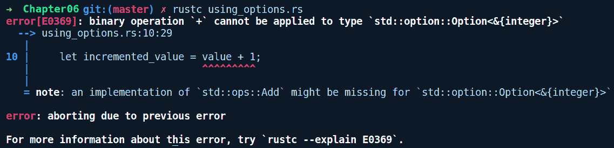
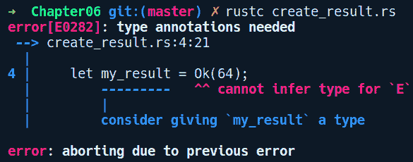
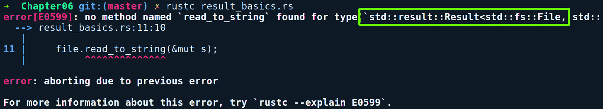
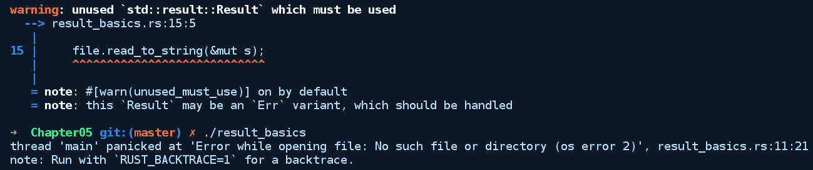
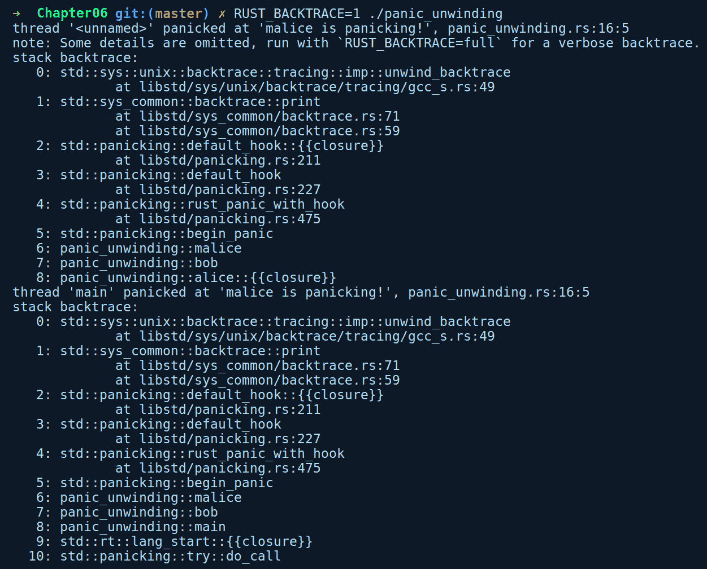
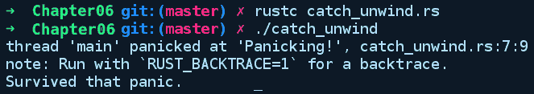
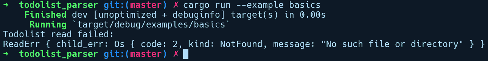

# 错误处理

在本章中，我们将探讨 Rust 中如何处理可能性和意外情况，了解将错误作为类型的错误处理，并查看如何设计与错误类型良好组合的接口。我们的目标是涵盖前两种错误场景，因为它们在我们控制之下，并且语言通常提供处理这些错误的机制。如果发生致命错误，我们的程序将被操作系统内核终止，因此我们对此没有太多控制权。

在本章中，我们将涵盖以下主题：

+   错误处理序言

+   使用`Option`和`Result`类型从错误中恢复

+   `Option`和`Result`的组合方法

+   错误传播

+   非恢复性错误

+   自定义错误和`Error`特质

# 错误处理序言

"从那时起，当计算机出现问题时，我们就说它里面有虫子（bugs）。"

- *Grace Hopper*

编写在预期条件下表现良好的程序是一个好的开始。当程序遇到意外情况时，它才会真正具有挑战性。适当的错误处理是软件开发中一个重要但常常被忽视的实践。一般来说，大多数错误处理都分为三类：

+   可恢复性错误，由于用户和环境与程序交互而预期会发生，例如，找不到文件错误或数字解析错误。

+   非恢复性错误，违反了程序的合约或不变性，例如，索引越界或除以零。

+   立即终止程序的致命错误。这种情况包括内存耗尽和栈溢出。

在现实世界中编程往往意味着处理错误。例如，包括网络应用程序中的恶意输入、网络客户端的连接失败、文件系统损坏以及数值应用程序中的整数溢出错误。如果没有错误处理，程序在遇到意外情况时会崩溃或被操作系统终止。大多数情况下，这不是我们希望程序在意外情况下表现出的行为。例如，考虑一个实时流处理服务，由于解析发送畸形消息的客户端的消息失败，在某个时间点无法从客户端接收消息。如果我们没有处理这种错误的方法，我们的服务每次遇到解析错误时都会终止。从可用性的角度来看，这并不好，这绝对不是网络应用程序的特征。服务处理这种情况的理想方式是捕获错误，采取行动，将错误日志传递给日志聚合服务以供后续分析，并继续从其他客户端接收消息。这就是可恢复的错误处理方式出现的时候，这通常是建模错误处理的实际方法。在这种情况下，语言的错误处理结构使程序员能够拦截错误并采取行动，从而避免程序被终止。

在处理错误时，两种相当流行的范式是返回码和异常。C 语言采用了返回码模型。这是一种非常简单的错误处理形式，其中函数使用整数作为返回值来表示操作是否成功或失败。许多 C 函数在发生错误时返回`-1`或`NULL`。对于系统调用的错误，C 语言在失败时设置全局`errno`变量。但是，作为一个全局变量，没有任何东西可以阻止你在程序的任何地方修改`errno`变量。然后程序员需要检查这个错误值并处理它。通常，这会变得非常晦涩难懂，容易出错，并且不是一个非常灵活的解决方案。编译器也不会警告我们忘记检查返回值，除非你使用静态分析工具。

处理错误的另一种方法是使用异常。高级编程语言，如 Java 和 C#，都使用这种错误处理形式。在这种范式下，可能失败的代码应该被包裹在一个`try {}`块中，并且`try{}`块内的任何失败都必须在`catch {}`块中捕获（理想情况下，`catch`块紧随`try`块之后）。但是，异常也有其缺点。抛出异常代价高昂，因为程序必须回滚堆栈，找到适当的异常处理器，并运行相关的代码。为了避免这种开销，程序员通常会采用防御性代码风格，检查可能抛出异常的代码，然后继续前进。此外，许多语言中异常的实现存在缺陷，因为它允许无知的程序员使用基类异常（如 Java 中的`throwable`）的捕获所有块来吞没异常，如果他们只是记录并忽略异常，这可能导致程序状态的不一致性。在这些语言中，程序员无法通过查看代码来判断一个方法是否可能抛出异常，除非他们使用带有已检查异常的方法。这使得程序员编写安全代码变得困难。因此，程序员通常需要依赖方法的文档（如果有的话）来确定它们是否可能抛出异常。

相反，Rust 拥抱基于类型的错误处理，这在函数式语言如 OCaml 和 Haskell 中可以看到，同时它也类似于 C 的错误代码返回模型。但在 RUST 中，返回值是正确的错误类型，并且可以由用户定义。该语言类型系统强制在编译时处理错误状态。如果你了解 Haskell，它与其`Maybe`和`Either`类型非常相似；Rust 只是给它们起了不同的名字，即对于可恢复错误，有`Option`和`Result`；对于不可恢复错误，有一个称为**panic**的机制，它是一种严格的错误处理策略，建议在程序中存在错误或违反不变性时将其作为最后的手段使用。

为什么 Rust 选择了这种错误处理形式？正如我们之前所说，异常及其相关的堆栈回滚具有开销。这与 Rust 的核心哲学——零运行时成本相悖。其次，异常风格的错误处理，如通常实现的那样，允许通过捕获所有异常处理器来忽略这些错误。这可能导致程序状态的不一致性，这与 Rust 的安全性原则相违背。

除去前言，让我们深入探讨一些可恢复的错误处理策略！

# 可恢复的错误

正如我们之前所说的，Rust 中的错误处理大部分是通过两种泛型类型 `Option` 和 `Result` 来完成的。它们作为包装类型，意味着建议那些可能失败的 API 通过将这些值放入这些类型中来返回实际值。这些类型是通过枚举和泛型的组合构建的。作为枚举，它们能够存储成功状态和错误状态，而泛型允许它们在编译时进行特殊化，以便在任一状态下存储任何值。这些类型还附带了许多方便的方法（通常称为 **组合子**）*，允许你轻松地消费、组合或转换内部值。关于 `Option` 和 `Result` 类型的一件事是，它们是标准库中的普通类型，这意味着它们不是编译器内置的，编译器会以不同的方式处理它们。任何人都可以利用枚举和泛型的力量创建类似的错误抽象。让我们通过首先查看最简单的一个来开始探索它们，那就是 `Option`。

# Option

在具有空值概念的语言中，程序员会采用一种防御性代码风格来对任何可能为空的值执行操作。以 Kotlin/Java 为例，它看起来像这样：

```rs
// kotlin pseudocode

val container = collection.get("some_id")

if (container != null) {
    container.process_item();
} else {
    // no luck
}
```

首先，我们检查 `container` 是否不是 `null`，然后调用其上的 `process_item`。如果我们忘记进行空安全检查，当我们尝试调用 `container.process_item()` 时，将会遇到臭名昭著的 `NullPointerException` - 你只有在运行时抛出异常时才会知道这一点。另一个缺点是，仅通过查看代码，我们无法立即推断出 `container` 是否为 `null`。为了防止这种情况，代码库需要撒上这些空检查，这在很大程度上阻碍了其可读性。

Rust 没有空值的概念，这被著名地引用为 *Tony Hoare* 的十亿美元错误，他在 1965 年的 ALGOL W 语言中引入了 `null` 引用。在 Rust 中，可能失败并希望表示缺失值的 API 应返回 `Option`。这种错误类型适用于任何我们的 API，除了成功值外，还想要表示值的缺失。简单来说，它与可空值非常相似，但在这里，`null` 检查是显式的，并且由类型系统在编译时强制执行。

`Option` 具有以下类型签名：

```rs
pub enum Option<T> {
    /// No value
    None,
    /// Some value `T`
    Some(T),
}
```

这是一个具有两种变体的枚举，并且对 `T` 是泛型的。我们通过使用 `let wrapped_i32 = Some(2);` 或 `let empty: Option<i32> = None;` 来创建一个 `Option` 值。

成功的操作可以使用`Some(T)`变量存储任何值`T`，或者使用`None`变量表示在失败状态下值是`null`。尽管我们不太可能显式地创建`None`值，但当我们需要创建一个`None`值时，我们需要在左侧指定类型，因为 Rust 无法从右侧推断类型。我们也可以使用`turbofish`操作符在右侧初始化它，例如`None::<i32>;`，但指定左侧的类型被认为是 Rust 的惯用代码。

如您可能已经注意到的，我们没有通过完整的语法创建`Option`值，即不是`Option::Some(2)`，而是直接作为`Some(2)`。这是因为它的两个变体都被自动从`std`包（Rust 的标准库包）作为预导入模块的一部分重新导出（[`doc.rust-lang.org/std/prelude/`](https://doc.rust-lang.org/std/prelude/))。预导入模块包含从标准库中重新导出的大多数常用类型、函数和任何模块。这些重新导出是`std`包提供的一个便利。没有它们，我们每次需要使用这些常用类型时都必须编写完整的语法。因此，这允许我们直接通过变体实例化`Option`值。这也适用于`Result`类型。

因此，创建它们很容易，但当你与`Option`值交互时，它们看起来是什么样子呢？从标准库中，我们有`HashMap`类型的`get`方法，它返回一个`Option`：

```rs
// using_options.rs

use std::collections::HashMap;

fn main() {
    let mut map = HashMap::new();
    map.insert("one", 1);
    map.insert("two", 2);

    let value = map.get("one");
    let incremented_value = value + 1;
}
```

在这里，我们创建了一个新的`HashMap` `map`，其键为`&str`类型，值为`i32`类型，并且稍后我们检索了`"one"`键对应的值并将其赋值给`value`。编译后，我们得到了以下错误信息：



我们为什么不能给我们的`value`加上`1`呢？作为一个熟悉命令式语言的开发者，我们期望`map.get()`在键存在时返回一个`i32`类型的值，否则返回`null`。但在这里，`value`是一个`Option<&i32>`。`get()`方法返回一个`Option<&T>`，而不是内部值（一个`&i32`），因为也有可能我们找不到我们想要的键，所以`get`在这种情况下可以返回`None`。然而，它给出的是一个误导性的错误信息，因为 Rust 不知道如何将一个`i32`加到一个`Option<&i32>`上，因为这两个类型之间不存在`Add`特质的实现。然而，对于两个`i32`或者两个`&i32`，这种实现确实存在。

因此，要给我们的`value`加上`1`，我们需要从`Option`中提取`i32`。在这里，我们可以看到 Rust 的显式错误处理行为开始发挥作用。我们只能在检查`map.get()`是`Some`变体还是`None`变体之后与内部的`i32`值交互。

为了检查变体，我们有两种方法；其中一种是模式匹配或`if let`：

```rs
// using_options_match.rs

use std::collections::HashMap;

fn main() {
    let mut map = HashMap::new();
    map.insert("one", 1);
    map.insert("two", 2);

    let incremented_value = match map.get("one") {
        Some(val) => val + 1,
        None => 0
    };

    println!("{}", incremented_value);
}
```

使用这种方法，我们匹配 `map.get()` 的返回值，并根据变体采取行动。在 `None` 的情况下，我们简单地给 `incremented_value` 赋值为 `0`。另一种我们可以这样做的方式是使用 `if let`：

```rs
let incremented_value = if let Some(v) = map.get("one") {
    v + 1
} else {
    0
};
```

这种方法适用于我们只对值的某个变体感兴趣，并希望对其他变体执行常见操作的情况。在这种情况下，`if let` 表达式会更加简洁。

**解包：** 另一种不那么安全的方法是在 `Option` 上使用解包方法，即 `unwrap()` 和 `expect()` 方法。调用这些方法如果 `Option` 是 `Some`，则会提取内部值；但如果它是 `None`，则会引发恐慌。这些方法只有在我们确实确定 `Option` 值确实是 `Some` 值时才推荐使用：

```rs
// using_options_unwrap.rs

use std::collections::HashMap;

fn main() {
    let mut map = HashMap::new();
    map.insert("one", 1);
    map.insert("two", 2);
    let incremented_value = map.get("three").unwrap() + 1;
    println!("{}", incremented_value);
}
```

执行前面的代码会导致恐慌，显示以下消息，因为我们没有为 `three` 键提供任何值，所以解包了一个 `None` 值：

```rs
thread 'main' panicked at 'called `Option::unwrap()` on a `None` value', libcore/option.rs:345:21
note: Run with `RUST_BACKTRACE=1` for a backtrace.
```

在这两种方法中，`expect()` 更受欢迎，因为它允许你传递一个字符串作为消息在恐慌时打印，并显示源文件中恐慌发生的确切行号，而 `unwrap()` 不允许你将调试消息作为参数传递，并显示 `Option` 的 `unwrap()` 方法在标准库源文件中定义的行号，这并不太有帮助。这些方法也存在于 `Result` 类型上。

接下来，让我们看看 `Result` 类型。

# 结果

`Result` 与 `Option` 类似，但增加了存储任意错误值并带有更多错误上下文的优势，而不是仅仅存储 `None`。当我们需要让用户知道操作失败的原因时，这种类型是合适的。以下是 `Result` 的类型签名：

```rs
enum Result<T, E> {
   Ok(T), 
   Err(E), 
} 
```

它有两个变体，两者都是泛型的。`Ok(T)` 是我们在成功状态下使用的变体，可以放入任何值 `T`；而 `Err(E)` 是我们在错误状态下使用的变体，可以放入任何错误值 `E`。我们可以这样创建它们：

```rs
// create_result.rs

fn main() {
    let my_result = Ok(64);
    let my_err = Err("oh no!");
}
```

然而，这不会编译，并且我们收到以下错误消息：



由于 `Result` 有两个泛型变体，而我们只为 `my_result` 的 `Ok` 变体提供了具体的类型；它不知道 `E` 的具体类型。对于 `my_err` 值也是类似的。我们需要为两者都指定具体的类型，如下所示：

```rs
// create_result_fixed.rs

fn main() {
    let _my_result: Result<_, ()> = Ok(64);
    // or
    let _my_result = Ok::<_, ()>(64);

    // similarly we create Err variants

    let _my_err = Err::<(), f32>(345.3);
    let _other_err: Result<bool, String> = Err("Wait, what ?".to_string());
}
```

在创建 `rgw Ok` 变体值的第一个例子中，我们使用 `()` 来指定 `Err` 变体的类型 `E`。在代码片段的第二部分，我们以类似的方式创建了 `Err` 变体的值，这次指定了 `Ok` 变体的具体类型。在明显的情况下，我们可以使用下划线让 Rust 为我们推断类型。

接下来，我们将看到如何与 `Result` 值进行交互。标准库中的许多文件操作 API 返回 `Result` 类型，因为可能存在不同的失败原因，如文件未找到、目录不存在和权限错误。这些可以放入 `Err` 变体中，让用户知道确切的原因。对于演示，我们将尝试打开一个文件，将其内容读入一个 `String`，并打印内容，如下面的代码片段所示：

```rs
// result_basics.rs

use std::fs::File;
use std::io::Read;
use std::path::Path;

fn main() {
    let path = Path::new("data.txt");
    let file = File::open(&path);
    let mut s = String::new();
    file.read_to_string(&mut s);
    println!("Message: {}", s);
}
```

这就是编译器做出的响应：



我们通过从 `File` 调用 `open` 并提供我们的路径到 `data.txt`（一个不存在的文件）来创建一个新的文件。当我们对 `file` 调用 `read_to_string` 并尝试将其读入 `s` 时，我们得到前面的错误。检查错误信息，看起来 `file` 的类型是 `Result<File, Error>`。根据其文档，`open` 方法定义如下：

```rs
fn open<P: AsRef<Path>>(path: P) -> Result<File> 
```

对于敏锐的观察者来说，可能存在一个混淆的来源，因为它看起来 `Result` 缺少错误变体的泛型 `E` 类型，但它只是被类型别名隐藏了。如果我们查看 `std::io` 模块中的 `type` 别名定义，它定义如下：

```rs
type Result<T> = Result<T, std::io::Error>; 
```

因此，它被与一个常见的错误类型 `std::io::Error.` 进行了类型别名。这是因为标准库中的许多 API 都使用这个作为错误类型。这是类型别名的一个好处，我们可以从我们的类型签名中提取出公共部分。把那个技巧放在一边，为了能够在我们的 `file` 上调用 `read_to_string` 方法，我们需要提取内部的 `File` 实例，即对变体进行模式匹配。通过这样做，前面的代码会发生变化，如下所示：

```rs
// result_basics_fixed.rs

use std::fs::File;
use std::io::Read;
use std::path::Path;

fn main() {
    let path = Path::new("data.txt");
    let mut file = match File::open(&path) {
        Ok(file) => file,
        Err(err) => panic!("Error while opening file: {}", err),
    };

    let mut s = String::new();
    file.read_to_string(&mut s);
    println!("Message: {}", s);
}
```

在这里，我们做了两个更改。首先，我们使 `file` 变量可变。为什么？因为 `read_to_string` 函数的签名如下：

```rs
fn read_to_string(&mut self, buf: &mut String) -> Result<usize>
```

第一个参数是 `&mut self`，这意味着我们调用此方法的实例需要是可变的，因为读取文件会改变文件句柄的内部指针。其次，我们处理了两种变体，在 `Ok` 情况下，如果一切顺利，我们返回实际的 `File` 对象，但在得到 `Err` 值时崩溃并显示错误信息。

通过这个更改，让我们编译并运行这个程序：



这会导致恐慌，因为我们目录中没有名为 `data.txt` 的文件。尝试创建一个具有相同名称的文件，并在其中放入任意文本，然后再次运行此程序以查看它成功。不过，首先，让我们处理那个警告。警告总是代码质量差的标志，我们理想情况下希望没有警告。警告存在是因为 `File::read_to_string`（来自 `Read` 特质的函数）返回一个 `Result<usize>` 类型的值。Rust 会在函数调用的返回值被忽略时警告你。在这里，`Result<usize>` 中的 `usize` 值告诉我们有多少字节被读入字符串。

我们有两种处理这个警告的方法：

+   对于 `read_to_string` 方法返回的 `Result` 值，像以前一样处理 `Ok` 和 `Err` 两种情况。

+   将返回值赋给一个特殊变量 `_`（**下划线**），这样编译器就知道我们想要忽略这个值。

对于我们不在乎值的情况，我们可以使用第二种方法，因此 `read_to_string` 行的更改如下：

```rs
let _ = file.read_to_string(&mut s);
```

经过这次修改，代码编译时没有警告。然而，你应该处理返回值，并尽量不使用通配符下划线变量。

# Option/Result 上的组合子

由于 `Option` 和 `Result` 是包装类型，唯一安全地与其内部值交互的方式是通过模式匹配或 `if let`。这种使用匹配然后对内部值进行操作的范式是一个非常常见的操作，因此每次都必须编写它们变得非常繁琐。幸运的是，这些包装类型自带了许多辅助方法，也称为组合子，允许你轻松地操作内部值。

这些是泛型方法，根据使用情况有很多种。一些方法作用于成功值，例如 `Ok(T)`/`Some(T)`，而另一些方法作用于失败值，例如 `Err(E)`/`None`。一些方法会展开并提取内部值，而另一些方法则只修改内部值，保留包装类型的结构。

**注意**：在本节中，当我们谈论成功值时，通常指的是 `Ok(T)`/`Some(T)` 变体，当我们谈论失败值时，通常指的是 `Err(T)`/`None` 变体。

# 常见组合子

让我们看看 `Option` 和 `Result` 类型都可用的一些有用的组合子：

`map`：此方法允许你将成功值 `T` 转换为另一个值 `U`。以下是对 `Option` 类型的 `map` 方法的类型签名：

```rs
pub fn map<U, F>(self, f: F) -> Option<U>
where F: FnOnce(T) -> U {
    match self {
        Some(x) => Some(f(x)),
        None => None,
    }
}
```

以下是对 `Result` 类型的签名：

```rs
pub fn map<U, F>(self, f: F) -> Option<U>
where F: FnOnce(T) -> U {
    match self {
        Ok(t) => Ok(f(t)),
        Err(e) => Err(e)
    }
}
```

这种方法的类型签名可以读作如下：`map` 是一个在 `U` 和 `F` 上的泛型方法，并且按值接收 `self`。然后它接收一个参数 `f`，其类型为 `F`，并返回一个 `Option<U>`，其中 `F` 被限制在 `FnOnce` 特性中，该特性有一个输入参数 `T` 和一个返回类型 `U`。哇！这真是一大堆话。

让我们使这个概念更容易理解。关于`map`方法，有两部分需要理解。首先，它接受一个名为`self`的参数，这意味着调用此方法时，所调用的值会被消耗。其次，它接受一个类型为`F`的参数，这是一个提供给`map`的闭包，它告诉`map`如何将`T`转换为`U`。闭包被泛型表示为`F`，而`where`子句说明`F`是`FnOnce(T) -> U`。这是一种仅适用于闭包的特殊类型特质，因此具有类似于`(T) -> U`签名的函数。`FnOnce`前缀仅仅意味着这个闭包会拥有输入参数`T`的所有权，这意味着我们只能用`T`作为参数调用这个闭包一次，因为`T`在调用时会被消耗。我们将在第七章，*高级概念*中更深入地探讨闭包。如果值是一个失败值，`map`方法不会做任何事情。

# 使用组合子

使用`map`方法很简单：

```rs
// using_map.rs

fn get_nth(items: &Vec<usize>, nth: usize) -> Option<usize> {
    if nth < items.len() {
        Some(items[nth])
    } else {
        None
    }
}

fn double(val: usize) -> usize {
    val * val
}

fn main() {
    let items = vec![7, 6, 4, 3, 5, 3, 10, 3, 2, 4];
    println!("{}", items.len());
    let doubled = get_nth(&items, 4).map(double);
    println!("{:?}", doubled);
}
```

在前面的代码中，我们有一个名为`get_nth`的方法，它从`Vec<usize>`中给出第`nth`个元素，如果找不到则返回`None`。然后我们有一个用例，我们想要将值加倍。我们可以使用`map`方法对`get_nth`的返回值进行操作，传入我们之前定义的`double`函数。或者，我们也可以提供一个内联编写的闭包，如下所示：

```rs
let doubled = get_nth(&items, 10).map(|v| v * v);
```

这是一种非常简洁的链式操作方法！这比使用`match`或`if let`更简洁。

前面对`map`方法的解释在很大程度上适用于我们将要查看的下一组方法，因此我们将跳过解释它们的类型签名，因为逐个解释它们对我们来说会太嘈杂。相反，我们只需简要解释这些方法提供的功能。我们鼓励您通过参考它们的文档来阅读并熟悉它们的类型签名：

+   `map_err`：此方法仅作用于`Result`类型，并允许将失败值从`E`转换为其他类型`H`，但仅当值是`Err`值时。`map_err`未定义在`Option`类型上，因为对`None`做任何事情都是没有意义的。

+   `and_then`：在失败值的情况下，这个方法会原样返回值，但在成功值的情况下，它会接受一个闭包作为第二个参数，该闭包作用于包装的值并返回包装的类型。当你需要依次对内部值进行转换时，这很有用。

+   `unwrap_or`：此方法提取内部成功值，如果它是一个失败值，则返回一个默认值。您将其作为第二个参数提供。

+   `unwrap_or_else`：此方法与前面的方法作用相同，但在失败值的情况下，通过接受一个闭包作为第二个参数来计算不同的值。

+   `as_ref`: 此方法将内部值转换为引用并返回包装值，即 `Option<&T>` 或 `Result<&T, &E>`。

+   `or/ or_else`: 这些方法如果是一个成功值，则按原样返回值，或者返回一个作为第二个参数提供的替代 `Ok`/`Some` 值。`or_else` 接受一个闭包，在其中您需要返回一个成功值。

+   `as_mut`: 此方法将内部值转换为可变引用并返回包装值，即 `Option<&mut T>` 或 `Result<&mut T, &mut E>`。

还有许多是 `Option` 和 `Result` 类型特有的。

# 转换 Option 和 Result 之间

我们还有可以将一种包装类型转换为另一种类型的方法，这取决于您如何使用您的 API 组合这些值。在以下情况下，它们变得非常有用，即当我们与第三方 crate 交互时，我们有一个作为 `Option` 的值，但我们使用的 crate 的方法接受一个作为类型的 `Result`，如下所示：

+   `ok_or`: 此方法通过接受一个错误值作为第二个参数，将 `Option` 值转换为 `Result` 值。与此类似的一个变体是 `ok_or_else` 方法，应该优先选择此方法，因为它通过接受一个闭包来懒计算值。

+   `ok`: 此方法将一个 `Result` 转换为一个 `Option`，消耗 `self`，并丢弃 `Err` 值。

# 提前返回和 ? 操作符

这是我们与 `Result` 类型交互时相当常见的一种模式。该模式如下：当我们有一个成功值时，我们立即想要提取它，但当我们有一个错误值时，我们想要提前返回并传播错误给调用者。为了说明这种模式，我们将使用以下代码片段，它使用通常的 match 表达式来对 `Result` 类型进行操作：

```rs
// result_common_pattern.rs

use std::string::FromUtf8Error;

fn str_upper_match(str: Vec<u8>) -> Result<String, FromUtf8Error> { 
    let ret = match String::from_utf8(str) { 
        Ok(str) => str.to_uppercase(), 
        Err(err) => return Err(err) 
    }; 

    println!("Conversion succeeded: {}", ret); 
    Ok(ret) 
}

fn main() {
    let invalid_str = str_upper_match(vec![197, 198]);
    println!("{:?}", invalid_str);
}
```

`?` 操作符抽象了这种模式，使得能够以更简洁的方式编写 `bytes_to_str` 方法：

```rs
// using_question_operator.rs

use std::string::FromUtf8Error;

fn str_upper_concise(str: Vec<u8>) -> Result<String, FromUtf8Error> { 
    let ret = String::from_utf8(str).map(|s| s.to_uppercase())?;
    println!("Conversion succeeded: {}", ret);
    Ok(ret) 
}

fn main() {
    let valid_str = str_upper_concise(vec![121, 97, 89]);
    println!("{:?}", valid_str);
}
```

如果您有一系列返回 `Result`/`Option` 的方法调用，其中每个操作符的失败应意味着整个操作失败，则此操作符会变得更加优雅。例如，我们可以将创建文件并将其写入的操作整个写为如下：

```rs
let _ = File::create("foo.txt")?.write_all(b"Hello world!")?;
```

它几乎可以替代 `try!` 宏，它执行与 `?` 在编译器中实现之前相同的事情。现在，`?` 是它的替代品，但有一些计划使其更通用，并可用于其他情况。

**技巧提示**：`main` 函数还允许您返回 `Result` 类型。具体来说，它允许您返回实现 `Termination` 特性的类型。这意味着我们也可以将 `main` 写为如下：

```rs
// main_result.rs

fn main() -> Result<(), &'static str> {
    let s = vec!["apple", "mango", "banana"];
    let fourth = s.get(4).ok_or("I got only 3 fruits")?;
    Ok(())
}
```

接下来，让我们继续处理不可恢复的错误。

# 不可恢复的错误

当处于执行阶段的代码遇到错误或其变体被违反时，如果被忽略，它有可能以意想不到的方式破坏程序状态。由于它们不一致的程序状态，这些情况被认为是不可恢复的，因为这可能导致后续出现错误的输出或意外行为。这意味着从这些情况中恢复的最佳方法是采用 fail-stop 方法，以避免间接损害其他部分或系统。对于这类情况，Rust 为我们提供了一个称为**panic**的机制，它会在被调用的线程上终止线程，而不会影响任何其他线程。如果主线程是面临恐慌的那个，则程序会以非零退出代码`101`终止。如果是子线程，恐慌不会传播到父线程，而是在线程边界处停止。一个线程中的 panic 不会影响其他线程，并且是隔离的，除非它们在某个共享数据上的互斥锁上造成破坏；它是由相同的`panic!`机制实现的宏。

当调用`panic!`时，引发恐慌的线程开始从它被调用的地方开始回溯函数调用栈，一直到线程的入口点。它还会为在此过程中调用的所有函数生成堆栈跟踪或回溯，就像异常一样。但在这个情况下，它不需要寻找任何异常处理器，因为在 Rust 中它们不存在。回溯是在清理或释放资源的同时向上移动函数调用链的过程。这些资源可以是栈分配的或堆分配的。栈分配的资源一旦函数结束就会自动释放。对于指向堆分配资源的变量，Rust 会调用它们的`drop`方法，从而释放资源占用的内存。这种清理是必要的，以避免内存泄漏。除了显式调用`panic`的代码外，`Result`/`Option`错误类型也会在失败的值上调用`panic`，即`Err`/`None`。`panic`也是用于单元测试中失败断言的选择，并且鼓励使用`#[should_panic]`属性通过 panic 来失败测试。

对于在主线程上发生恐慌的单线程代码，回溯并不提供太多好处，因为操作系统在进程终止后会回收所有内存。幸运的是，有选项可以关闭`panic`中的回溯，这在嵌入式系统等平台上可能是必需的，在这些平台上，我们有一个主线程执行所有工作，而回溯是一个昂贵的操作，并且用处不大。

为了找出导致恐慌的调用序列，我们可以通过运行任何引发恐慌的程序并从我们的命令行 shell 设置`RUST_BACKTRACE=1`环境变量来查看线程的回溯。以下是一个例子，其中我们有两个线程，它们都发生了恐慌：

```rs
// panic_unwinding.rs

use std::thread;

fn alice() -> thread::JoinHandle<()> {
    thread::spawn(move || {
        bob();
    })
}

fn bob() {
    malice();
}

fn malice() {
    panic!("malice is panicking!");
}

fn main() {
    let child = alice();
    let _ = child.join();

    bob();
    println!("This is unreachable code");
}
```

`alice`使用`thread::spawn`创建一个新的线程，并在闭包中调用`bob`。`bob`调用`malice`，然后引发 panic。`main`也调用`bob`，它也会引发 panic。

下面是运行此程序后的输出：



我们通过调用`join()`来连接线程，并期望子线程一切顺利，这显然不是事实。我们得到了两个回溯，一个是子线程中发生的 panic，另一个是从主线程调用`bob`时的回溯。

如果你需要更细粒度地控制线程中 panic 的展开处理，可以使用`std::panic::catch_unwind`函数。尽管推荐通过`Option`/`Result`机制来处理错误，但你可以在工作线程中处理致命错误；你可以通过恢复任何违反的不变量，让工作线程死亡，然后重新启动它们。然而，`catch_unwind`并不能阻止 panic——它只允许你自定义与 panic 相关的展开行为。在 Rust 程序中，不建议使用`catch_unwind`作为一般的错误处理方法。

`catch_unwind`函数接受一个闭包并处理其中发生的任何 panic。以下是它的类型签名：

```rs
fn catch_unwind<F: FnOnce() -> R + UnwindSafe, R>(f: F) -> Result<R> 
```

如你所见，`catch_unwind`的返回值有一个额外的约束，`UnwindSafe`。这意味着闭包中的变量必须是异常安全的，大多数类型都是，但值得注意的是可变引用（`&mut T`）。一个值是异常安全的，如果抛出异常的代码不能导致该值处于不一致的状态。这意味着闭包内的代码不能自身调用`panic!()`。

下面是一个使用`catch_unwind`的简单示例：

```rs
// catch_unwind.rs

use std::panic; 

fn main() { 
    panic::catch_unwind(|| { 
        panic!("Panicking!"); 
    }).ok();

    println!("Survived that panic."); 
}
```

下面是运行前面程序后的输出：



如你所见，`catch_unwind`并不能阻止 panic 的发生；它只是停止与 panic 线程相关的展开。再次提醒，`catch_unwind`不是 Rust 中错误管理的推荐方法。它不能保证捕获所有 panic，例如终止程序的 panic。在 Rust 代码与其他语言（如 C）通信的情况下，需要捕获 panic 展开，因为向 C 代码展开是未定义行为。在这些情况下，程序员必须处理展开并按照 C 的期望返回一个错误代码。然后程序可以通过使用同一`panic`模块中的`resume_unwind`函数来继续展开。

对于极少数情况下，默认的 panic 展开行为可能变得过于昂贵，例如在编写微控制器程序时，有一个编译器标志可以配置为将所有 panic 转换为 abort。为此，你的项目的`Cargo.toml`需要在`profile.release`部分下有如下属性：

```rs
[profile.release]
panic = "abort"
```

# 用户友好的 panic

正如我们在前面的代码中所看到的，panic 消息和回溯可能非常晦涩难懂，但并不一定如此。如果你是一个命令行工具的作者，`human_panic` 是社区中的一个 crate，它用人类可读的消息替换了冗长、晦涩的 panic 消息。它还将回溯写入文件，以便用户将其报告给工具作者。有关 `human_panic` 的更多信息可以在项目仓库页面上找到：[`github.com/rust-clique/human-panic`](https://github.com/rust-clique/human-panic)。

# 自定义错误和 Error 特性

一个具有多种功能的非平凡项目通常会被分散到多个模块中。有组织地提供针对特定模块的错误消息和信息对用户来说更有信息量。Rust 允许我们创建自定义错误类型，这可以帮助我们从应用程序中获得更细粒度的错误报告。如果没有针对我们项目的特定自定义错误，我们可能不得不使用标准库中的现有错误类型，这些类型可能与我们 API 的操作不相关，并且当我们的模块中的操作出错时，不会向用户提供精确的信息。

在具有异常的语言中，例如 Java，创建自定义异常的方式是通过从基类 `Exception` 继承并重写其方法和成员变量。虽然 Rust 没有类型级别的继承，但它有特性继承，并提供给我们 `Error` 特性，任何类型都可以实现，使得该类型成为自定义错误类型。现在，当使用 `Box<dyn Error>` 作为返回 `Result` 的函数的返回类型时，可以将这种类型与现有的标准库错误类型组合。以下是 `Error` 特性的类型签名：

```rs
pub trait Error: Debug + Display {
    fn description(&self) -> &str { ... }
    fn cause(&self) -> Option<&dyn Error> { ... }
}
```

要创建我们自己的错误类型，该类型必须实现 `Error` 特性。如果我们查看特性的定义，它还要求我们为我们的类型实现 `Debug` 和 `Display` 特性。`description` 方法返回一个字符串切片引用，这是一个描述错误内容的可读形式。`cause` 方法返回一个可选的 `Error` 特性对象引用，表示错误的一个可能低级原因。自定义错误类型的 `cause` 方法允许你从源头获取错误链的信息，使得精确记录错误成为可能。例如，让我们以一个 HTTP 查询作为可失败操作的例子。我们假设的库有一个 `get` 方法可以执行 `GET` 请求。查询可能会因为很多不同的原因而失败：

+   DNS 查询可能会因为网络故障或地址不正确而失败

+   实际的数据包传输可能会失败

+   数据可能被正确接收，但接收到的 HTTP 标头可能有错误，等等

如果是第一种情况，我们可能会想象有三个错误级别，通过 `cause` 字段链接在一起：

+   UDP 连接因网络故障而失败（`cause = None`）

+   DNS 查询因 UDP 连接失败而失败（`cause = UDPError`）

+   `GET` 查询因 DNS 查询失败而失败（`cause = DNSError`）

当开发者想要知道失败的根源时，`cause` 方法非常有用。

现在，为了演示如何在项目中集成自定义错误类型，我们使用 cargo 创建了一个名为 `todolist_parser` 的 crate，该 crate 提供了一个 API，用于从文本文件中解析待办事项列表。待办事项的解析可能会以不同的方式失败，例如文件未找到、待办事项为空，或者因为它包含非文本字符。我们将使用自定义错误类型来模拟这些情况。在 `src/error.rs` 中，我们定义了以下错误类型：

```rs
// todolist_parser/src/error.rs

use std::error::Error;
use std::fmt;
use std::fmt::Display;

#[derive(Debug)]
pub enum ParseErr {
    Malformed,
    Empty
}

#[derive(Debug)]
pub struct ReadErr {
    pub child_err: Box<dyn Error>
}

// Required by error trait
impl Display for ReadErr {
    fn fmt(&self, f: &mut fmt::Formatter) -> fmt::Result {
        write!(f, "Failed reading todo file")
    }
}

// Required by error trait
impl Display for ParseErr {
    fn fmt(&self, f: &mut fmt::Formatter) -> fmt::Result {
        write!(f, "Todo list parsing failed")
    }
}

impl Error for ReadErr {
    fn description(&self) -> &str {
        "Todolist read failed: "
    }

    fn cause(&self) -> Option<&dyn Error> {
        Some(&*self.child_err)
    }
}

impl Error for ParseErr {
    fn description(&self) -> &str {
        "Todolist parse failed: "
    }

    fn cause(&self) -> Option<&Error> {
        None
    }
}
```

到目前为止，我们正在模拟两种非常基本的错误：

+   将待办事项列表建模为 `ReadErr` 并读取失败

+   将待办事项建模为 `ParseErr` 并解析失败，`ParseErr` 有两个变体，它可能因文件为空或文件包含非文本/二进制符号而失败，这意味着它是 `Malformed`

在此之后，我们实现了 `Error` 特性和所需的超特性 `Display` 和 `Debug`。`lib.rs` 包含所需的解析方法，以及 `TodoList` 结构体的声明，如下所示：

```rs
// todolist_parser/src/lib.rs

//! This crate provides an API to parse list of todos

use std::fs::read_to_string;
use std::path::Path;

mod error;
use error::ParseErr;
use error::ReadErr;

use std::error::Error;

/// This struct contains a list of todos parsed as a Vec<String>
#[derive(Debug)]
pub struct TodoList {
    tasks: Vec<String>,
}

impl TodoList {
    pub fn get_todos<P>(path: P) -> Result<TodoList, Box<dyn Error>>
    where
    P: AsRef<Path>, {
        let read_todos: Result<String, Box<dyn Error>> = read_todos(path);
        let parsed_todos = parse_todos(&read_todos?)?;
        Ok(parsed_todos)
    }
}

pub fn read_todos<P>(path: P) -> Result<String, Box<dyn Error>>
where
    P: AsRef<Path>,
{
    let raw_todos = read_to_string(path)
        .map_err(|e| ReadErr {
            child_err: Box::new(e),
        })?;
    Ok(raw_todos)
}

pub fn parse_todos(todo_str: &str) -> Result<TodoList, Box<dyn Error>> {
    let mut tasks: Vec<String> = vec![];
    for i in todo_str.lines() {
        tasks.push(i.to_string());
    }
    if tasks.is_empty() {
        Err(ParseErr::Empty.into())
    } else {
        Ok(TodoList { tasks })
    }
}
```

我们有两个顶级函数，`read_todos` 和 `parse_todos`，它们通过 `TodoList` 的 `get_todos` 方法被调用。

在 `examples/basics.rs` 下，我们有 `TodoList` 的一个示例用法，如下所示：

```rs
// todolist_parser/examples/basics.rs

extern crate todolist_parser;

use todolist_parser::TodoList;

fn main() {
    let todos = TodoList::get_todos("examples/todos");
    match todos {
        Ok(list) => println!("{:?}", list),
        Err(e) => {
            println!("{}", e.description());
            println!("{:?}", e)
        }
    }
}
```

如果我们通过 `cargo run --example basics` 命令运行 `basics.rs` 示例，我们得到以下输出：



如果你查看被打印的错误值，它将实际的错误原因包装在 `ReadErr` 值中。

Rust 提供了相当不错的内置功能来定义自定义错误类型。如果你正在编写自己的 crate，你应该定义自己的错误类型，以便更容易进行调试。然而，为所有类型实现 `Error` 特性通常会变得冗余且耗时。幸运的是，我们有一个来自 Rust 社区的 crate，名为 **failure** ([`github.com/rust-lang-nursery/failure`](https://github.com/rust-lang-nursery/failure))，它可以自动化自定义错误类型的创建，以及通过使用过程宏自动派生的必要特性的实现。如果你更有雄心，我们鼓励你重构这个库以使用 `failure` crate。

# 摘要

在本章中，我们了解到，Rust 中的错误处理是显式的：可能失败的运算通过 `Result` 或 `Option` 泛型类型返回两个部分的结果。你必须以某种方式处理错误，要么通过使用 `match` 语句解包 `Result`/`Option` 值，要么使用组合方法。应避免在错误类型上解包。相反，使用组合器或 `match` 表达式采取适当的行动，或者通过使用 `?` 操作符将错误传播给调用者。当编程错误如此致命以至于恢复成为不可能时，进行恐慌是可以接受的。恐慌大多是不可恢复的，这意味着它们会崩溃你的线程。它们的默认行为是回溯，这可能很昂贵，如果程序不想有这种开销，可以将其关闭。建议在传达错误时尽可能详细，并鼓励作者在他们的 crate 中使用自定义错误类型。

在下一章中，我们将介绍语言的一些高级特性，并探索类型系统的更多内部机制。
