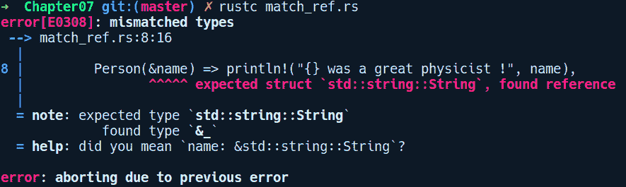
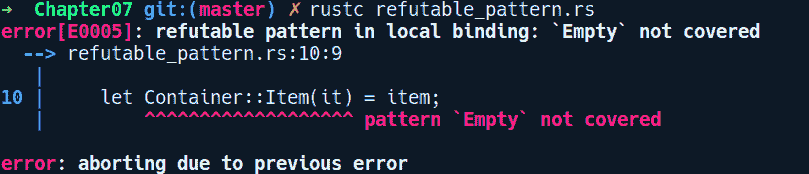
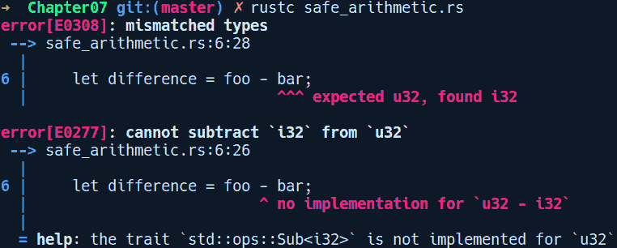
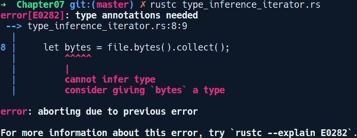
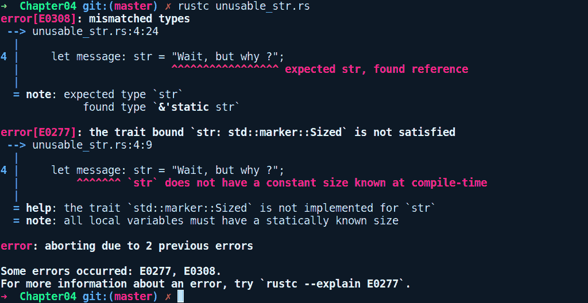
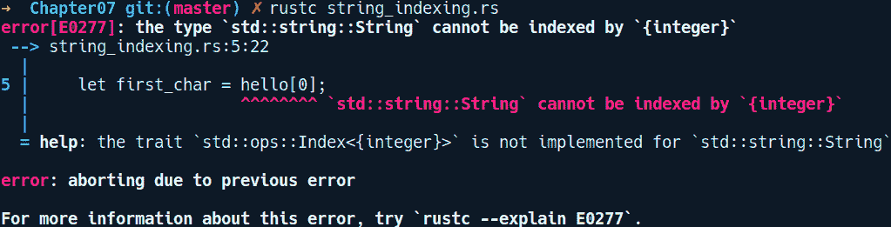
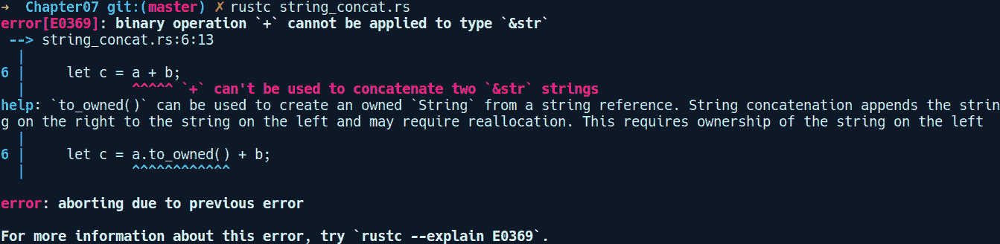
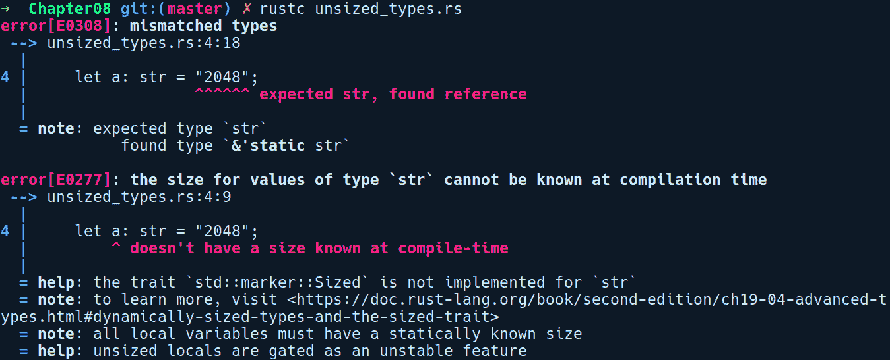
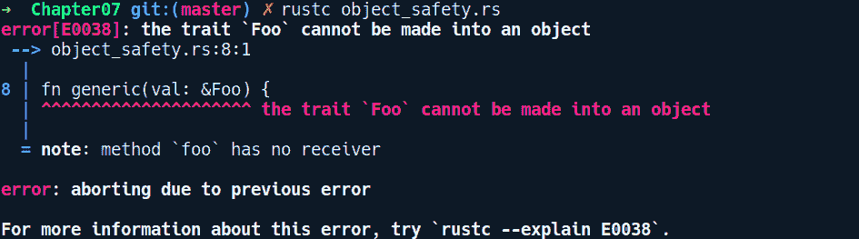
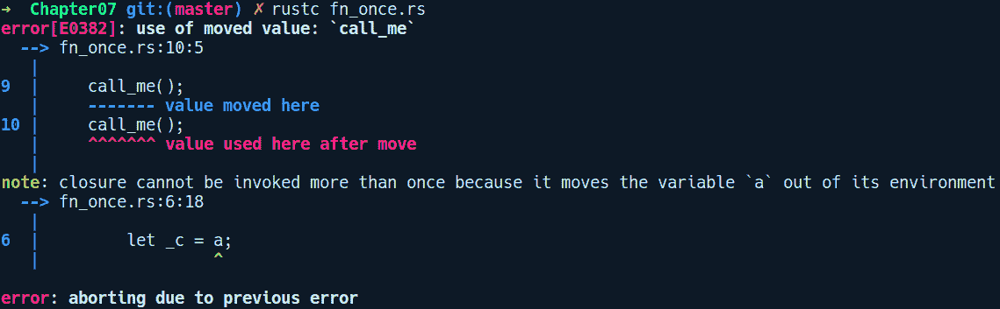

# 第七章：高级概念

在前几章中我们学到的许多概念确实值得密切关注，这样我们才能欣赏 Rust 的设计。学习这些高级主题也将帮助你在需要理解复杂代码库时更进一步。这些概念在你想要创建提供惯用 Rust API 的库时也非常有用。

本章我们将涵盖以下主题：

+   类型系统小贴士

+   字符串

+   迭代器

+   闭包

+   模块

# 类型系统小贴士

"算法必须被看到才能被相信"

– *唐纳德·克努特*

在我们进入本章更密集的主题之前，我们将首先讨论静态类型编程语言中的一些类型系统小贴士，重点关注 Rust。其中一些主题你可能已经从 第一章 *Rust 入门* 中熟悉，但我们将在这里深入探讨细节。

# 块和表达式

尽管 Rust 是语句和表达式的混合体，但它主要是一种面向表达式的语言。这意味着大多数结构都是返回值的表达式。它也是一种使用类似 C 的花括号 `{}` 来在程序中为变量引入新作用域的语言。在我们更深入地讨论这些概念之前，让我们先把这些概念弄清楚。

**块表达式**（以下简称块）是任何以 `{` 开始并以 `}` 结束的项。在 Rust 中，它们包括 `if else` 表达式、match 表达式、`while` 循环、循环、裸 `{}` 块、函数、方法和闭包，并且它们都返回一个值，即表达式的最后一行。如果你在最后一行表达式后放置一个分号，块表达式默认返回单位类型 `()` 的值。

与块相关的一个概念是**作用域**。每当创建一个新的块时，都会引入一个作用域。当我们创建一个新的块并在其中创建任何变量绑定时，这些绑定被限制在该作用域内，并且对它们的引用仅在作用域范围内有效。这就像为变量提供了一个新的生活环境，与其他变量隔离开来。在 Rust 中，函数、`impl` 块、裸块、if else 表达式、match 表达式、函数和闭包等项引入了新的作用域。在块/作用域内，我们可以声明结构体、枚举、模块、特性和它们的实现，甚至块。每个 Rust 程序都以一个根作用域开始，这是由 `main` 函数引入的作用域。在其中，可以创建许多嵌套的作用域。`main` 作用域成为所有内部声明的父作用域。考虑以下片段：

```rs
// scopes.rs

fn main() {
    let mut b = 4;
    {
        let mut a = 34 + b;
        a += 1;
    }

    b = a;   
}
```

我们使用裸块`{}`引入一个新的内部作用域，并创建了一个变量`a`。在作用域结束时，我们试图将`b`赋值给来自内部作用域的`a`的值。Rust 会在编译时抛出一个错误，说“在这个作用域中找不到值`a`”。`main`的父作用域对`a`一无所知，因为它来自内部作用域。这种作用域的特性有时也用于控制我们希望引用保持有效的时长，正如我们在第五章，“内存管理和安全性”中看到的。

但是内部作用域可以访问其父作用域中的值。正因为如此，我们可以在内部作用域中编写`34 + b`。

现在我们来谈谈表达式。我们可以从它们返回值的属性以及它们在所有分支中都必须具有相同类型的属性中受益。这导致代码非常简洁。例如，考虑以下片段：

```rs
// block_expr.rs

fn main() {
    // using bare blocks to do multiple things at once
    let precompute = {
        let a = (-34i64).abs();
        let b = 345i64.pow(3);
        let c = 3;
        a + b + c
    };

    // match expressions
    let result_msg = match precompute {
        42 => "done",
        a if a % 2 == 0 => "continue",
        _ => panic!("Oh no !")
    };

    println!("{}", result_msg);
}
```

我们可以使用裸块将几行代码组合在一起，并在末尾隐式返回`a + b + c`表达式的值到`precompute`，如前所述。匹配表达式也可以直接从其匹配分支中赋值和返回值。

**注意**：与 C 语言中的`switch`语句类似，Rust 中的匹配分支不会受到 C 代码中导致大量错误的`case fall through`副作用的影响。

C 语言的`switch`情况要求在`switch`块中的每个`case`语句在执行该`case`中的代码后退出时都必须有一个`break`。如果没有`break`，那么随后的任何`case`语句也会被执行，这被称为 fall-through 行为。另一方面，匹配表达式保证只评估一个匹配分支。

`If else`表达式提供了相同的简洁性：

```rs
// if_expr.rs

fn compute(i: i32) -> i32 {
    2 * i
}

fn main() {
    let result_msg = "done";

    // if expression assignments
    let result = if result_msg == "done" {
        let some_work = compute(8);
        let stuff = compute(4);
        compute(2) + stuff // last expression gets assigned to result
    } else {
        compute(1)
    };

    println!("{}", result);
}
```

在基于语句的语言如 Python*中，你会为前面的片段编写如下内容：

```rs
result = None
if (state == "continue"):
    let stuff = work()
    result = compute_next_result() + stuff
else:
    result = compute_last_result()
```

在 Python 代码中，我们必须先声明`result`，然后在 if else 分支中进行单独的赋值。在这里，Rust 更简洁，赋值是 if else 表达式的结果。此外，在 Python 中，你可能会忘记在任一分支中为变量赋值，变量可能被未初始化。如果你从`if`块返回并赋值，而`else`块中遗漏或返回了不同的类型，Rust 将在编译时报告。

作为附加说明，Rust 还支持声明未初始化的变量：

```rs
fn main() {
    let mut a: i32;
    println!("{:?}", a);    // error
    a = 23;
    println!("{:?}", a);    // fine now
}
```

但它们在使用之前必须被初始化。如果尝试从后来读取未初始化的变量，Rust 将禁止这样做，并在编译时报告变量必须被初始化：

```rs
   Compiling playground v0.0.1 (file:///playground)
error[E0381]: use of possibly uninitialized variable: `a`
 --> src/main.rs:7:22
  |
7 |     println!("{:?}", a);
  |                      ^ use of possibly uninitialized `a`
```

# 令牌语句

在第一章《Rust 入门》中，我们简要介绍了`let`，它用于创建新的变量绑定——但实际上`let`不仅仅是这样。实际上，`let`是一个模式匹配语句。模式匹配是一种在函数式语言（如 Haskell）中主要看到的构造，它允许我们根据值的内部结构来操作和做出决策，或者可以用来从代数数据类型中提取值。我们之前已经

```rs
let a = 23;
let mut b = 403;
```

我们的第一行是`let`的最简单形式，它声明了一个不可变的变量绑定，`a`。在第二行，我们在`let`关键字后面有`mut`用于`b`。`mut`是`let`模式的一部分，在这个例子中将`b`可变地绑定到`i32`类型。`mut`使得`b`可以再次绑定到其他`i32`类型。另一个在`let`中较少见的关键字是`ref`关键字。现在，我们通常使用`&`运算符来创建任何值的引用/指针。创建任何值的引用的另一种方式是使用`let`与`ref`关键字。为了说明`ref`和`mut`，我们有一个代码片段：

```rs
// let_ref_mut.rs

#[derive(Debug)]
struct Items(u32);

fn main() {
    let items = Items(2);
    let items_ptr = &items;
    let ref items_ref = items;

    assert_eq!(items_ptr as *const Items, items_ref as *const Items);

    let mut a = Items(20);
    // using scope to limit the mutation of `a` within this block by b
    {
        // can take a mutable reference like this too
        let ref mut b = a; // same as: let b = &mut a;
        b.0 += 25;
    }

    println!("{:?}", items);

    println!("{:?}", a);   // without the above scope
                           // this does not compile. Try removing the scope
}
```

在这里，`items_ref`是通过常用的`&`运算符创建的引用。下一行也使用`ref`创建了指向相同`items`值的`items_ref`引用。我们可以通过随后的`assert_eq!`调用确认，这两个指针变量指向相同的`items`值。将`*const Items`转换为原始指针类型用于比较两个指针是否指向相同的内存位置，其中`*const Items`是`Items`的原始指针类型。此外，通过将`ref`和`mut`结合，如代码的第二行末尾所示，我们可以得到对任何所有权的可变引用，而不仅仅是使用`&mut`运算符的常规方式。但是，我们必须使用内部作用域来从`b`修改`a`。

使用模式匹配的语言不仅限于在`=`的左侧有标识符，还可以有引用类型结构的模式。所以，`let`为我们提供的另一个便利是能够从代数数据类型的字段中提取值，例如结构体或枚举作为新变量。这里，我们有一个代码片段来演示这一点：

```rs
// destructure_struct.rs

enum Food {
    Pizza,
    Salad
}

enum PaymentMode {
    Bitcoin,
    Credit
}

struct Order {
    count: u8,
    item: Food,
    payment: PaymentMode
}

fn main() {
    let food_order = Order { count: 2,
                             item: Food::Salad,
                             payment: PaymentMode::Credit };

    // let can pattern match inner fields into new variables
    let Order { count, item, .. } = food_order;
}
```

在这里，我们创建了一个 `Order` 的实例，它绑定到 `food_order`。假设我们通过某个方法调用得到了 `food_order`，并且我们想要访问 `count` 和 `item` 的值。我们可以直接使用 `let` 提取单个字段，`count` 和 `item`，它们成为新的变量，持有 `Order` 实例中相应的字段值。这从技术上讲称为 **`let` 的解构语法**。变量的解构方式取决于右侧的值是一个不可变引用、可变引用、所有者值，或者我们如何使用 `ref` 或 `mut` 模式在左侧引用它。在前面的代码中，它被值捕获，因为 `food_order` 拥有 `Order` 实例，并且我们在左侧没有使用任何 `ref` 或 `mut` 关键字匹配成员。如果我们想要通过不可变引用解构成员，我们可以在 `food_order` 前面放置一个 `&` 符号，或者使用 `ref` 或 `mut` 代替：

```rs
let Order { count, item, .. } = &food_order;
// or
let Order { ref count, ref item, .. } = food_order;
```

第一种风格通常更受欢迎，因为它更简洁。如果我们想要有一个可变引用，我们必须在将 `food_order` 本身设置为可变之后放置 `&mut`：

```rs
let mut food_order = Foo { count: 2,
                           item: Food::Salad,
                           payment: PaymentMode::Credit };
let Order { count, item, .. } = &mut food_order;
```

我们可以通过使用 `..` 来忽略我们不关心的字段，如代码所示。此外，`let` 解构的一个轻微限制是我们不能自由选择单个字段的可变性。所有变量都必须具有相同的可变性——要么全部不可变，要么全部可变。请注意，`ref` 通常不用于声明变量绑定，它主要在匹配表达式中使用，在这些表达式中我们想要通过引用匹配值，因为 `&` 操作符在匹配分支中不起作用，如这里所示：

```rs
// match_ref.rs

struct Person(String);

fn main() {
    let a = Person("Richard Feynman".to_string());
    match a {
        Person(&name) => println!("{} was a great physicist !", name),
         _ => panic!("Oh no !")
    }

    let b = a;
}
```

如果我们想要通过不可变引用使用 `Person` 结构体的内部值，我们的直觉可能会说在匹配分支中使用类似 `Person(&name)` 的方式来通过引用进行匹配。但在编译时我们得到了这个错误：



这导致了一个误导性的错误，因为 `&name` 是从 `name` 中创建了一个引用（`&` 是一个操作符），编译器认为我们想要匹配 `Person(&String)`，但实际上 `a` 的值是 `Person(String)`。因此，在这种情况下，必须使用 `ref` 来将其解构为引用。为了使其编译通过，我们相应地将左侧的代码更改为 `Person(ref name)`。

解构语法也适用于枚举类型：

```rs
// destructure_enum.rs

enum Container {
    Item(u64),
    Empty
}

fn main() {
    let maybe_item = Container::Item(0u64);
    let has_item = if let Container::Item(0) = maybe_item {
        true
    } else {
        false
    };
}
```

在这里，我们有 `maybe_item` 作为 `Container` 枚举。通过结合 `if let` 和模式匹配，我们可以使用 `if let <解构模式> = 表达式 {}` 语法有条件地将值赋给 `has_item` 变量。

解构语法也可以用在函数参数中。例如，在自定义类型的情况下，如一个结构体在作为函数参数使用时：

```rs
// destructure_func_param.rs

struct Container {
    items_count: u32
}

fn increment_item(Container {mut items_count}: &mut Container) {
    items_count += 1;
}

fn calculate_cost(Container {items_count}: &Container) -> u32 {
    let rate = 67;
    rate * items_count
}

fn main() {
    let mut container = Container {
        items_count: 10
    };

    increment_item(&mut container);
    let total_cost = calculate_cost(&container);
    println!("Total cost: {}", total_cost);
}
```

在这里，`calculate_cost`函数有一个参数，它被解构为一个结构体，字段绑定到`items_count`变量。如果我们想要可变地解构，我们可以在成员字段之前添加`mut`关键字，就像`increment_item`函数那样。

**可反驳模式**：可反驳模式是`let`模式，其中左右两侧在模式匹配中不兼容，在这些情况下，必须使用穷尽匹配表达式。到目前为止，我们看到的`let`模式的所有形式都是不可反驳模式。不可反驳意味着它们能够作为有效的模式正确匹配`'='`右侧的值。

但有时，由于无效的模式，使用`let`进行模式匹配可能会失败，例如，当匹配具有两个变体（`Item(u64)`和`Empty`）的枚举`Container`时：

```rs
// refutable_pattern.rs

enum Container {
    Item(u64),
    Empty
}

fn main() {
    let mut item = Container::Item(56);
    let Container::Item(it) = item;
}
```

理想情况下，我们期望`it`在从`item`解构后存储`56`作为值。如果我们尝试编译这个，我们会得到以下：



这个匹配失败的原因是因为`Container`有两个变体，`Item(u64)`和`Empty`。即使我们知道`item`包含`Item`变体，`let`模式也不能依赖这个事实，因为如果`item`是可变的，一些代码可以在之后将其分配为`Empty`变体，这将使解构成为未定义的操作。我们必须涵盖所有可能的情况。直接针对单个变体的解构违反了穷尽模式匹配的语义，因此我们的匹配失败。

# 循环作为表达式

在 Rust 中，循环也是一个表达式，当我们从中跳出时默认返回`()`。这个含义是`loop`也可以用来通过`break`给变量赋值。例如，它可以用于类似以下的情况：

```rs
// loop_expr.rs

fn main() {
    let mut i = 0;
    let counter = loop {
        i += 1;
        if i == 10 {
            break i;
        }
    };
    println!("{}", counter);
}
```

在`break`关键字之后，我们包括我们想要返回的值，并且当循环结束时（如果有的话），这个值会被分配给`counter`变量。这在循环结束后在循环内部赋值任何变量的值并需要在之后使用它的情况下非常有用。

# 数字类型的类型清晰度和符号区分

虽然主流语言区分了诸如整数、双精度浮点数和字节等数值原语，但许多新的语言，如 Golang，已经开始在有符号和无符号数值类型之间添加区分。Rust 也遵循同样的步伐，通过区分有符号和无符号数值类型，将它们作为完全不同的类型提供。从类型检查的角度来看，这为我们程序增加了另一层安全性。这允许我们编写精确指定其要求的代码。例如，考虑一个数据库连接池结构体：

```rs
struct ConnectionPool {
    pool_count: usize
}
```

对于提供包含有符号和无符号值的通用整数类型的语言，你会指定 `pool_count` 的类型为整数，它也可以存储负值。`pool_count` 为负值没有意义。使用 Rust，我们可以通过使用无符号类型（如 `u32` 或 `usize`）在代码中清楚地指定这一点。

关于原始类型，还有一个需要注意的方面是，Rust 在算术操作中混合有符号和无符号类型时不会执行自动转换。你必须明确这一点并手动转换值。C/C++ 中一个未预期的自动转换的例子如下：

```rs
#include <iostream>
int main(int argc, const char * argv[]) {
    uint foo = 5;
    int bar = 6;
    auto difference = foo - bar;
    std::cout << difference;
    return 0;
}
```

上述代码打印 `4294967295`。在这里，从 `foo` 和 `bar` 减去时，差异不会是 `-1`；相反，C++ 会自行其是，而不需要程序员的同意。`int`（有符号整数）自动转换为 `uint`（无符号整数），并包装到 `uint` 的最大值 `4294967295`。这段代码在这里继续运行而不会抱怨下溢。

在 Rust 中翻译相同的程序，我们得到以下结果：

```rs
// safe_arithmetic.rs

fn main() {
    let foo: u32 = 5;
    let bar: i32 = 6;
    let difference = foo - bar;
  println!("{}", difference);
}
```

以下将是输出结果：



Rust 不会编译这段代码，会显示错误信息。你必须根据你的意图显式地转换其中一个值。此外，如果我们对两个无符号或有符号类型执行溢出/下溢操作，Rust 将在 `debug` 模式下 `panic!()` 并终止你的程序。在发布模式下构建时，它执行包装算术。

通过包装算术，我们是指将 `1` 加到 `255`（一个 `u8`）将得到 `0`。

在调试模式下引发恐慌是正确的行为，因为如果允许这样的任意值传播到代码的其他部分，它们可能会污染你的业务逻辑，并在程序中引入更难以追踪的 bug。因此，在这些情况下，当用户意外执行溢出/下溢操作并且这在调试模式下被捕获时，使用失败停止的方法更好。当程序员想要在算术操作中允许包装语义时，他们可以选择忽略恐慌并继续在发布模式下编译。这是语言为你提供的安全性的另一个方面。

# 类型推断

类型推断在静态类型语言中很有用，因为它使得代码更容易编写、维护和重构。Rust 的类型系统可以在你不指定它们的情况下确定字段、方法、局部变量和大多数泛型类型参数的类型。在底层，编译器的一个组件，即类型检查器，使用 *Hindley Milner* 类型推断算法来决定局部变量的类型。它是一组基于表达式使用情况建立类型的规则。因此，它可以基于环境和类型的使用方式推断类型。以下是一个这样的例子：

```rs
let mut v = vec![];
v.push(2);    // can figure type of `v` now to be of Vec<i32>
```

只有在初始化向量的第一行中，Rust 的类型检查器不确定`v`的类型应该是什么。只有当它到达下一行，`v.push(2)`时，它才知道`v`的类型是`Vec<i32>`。现在`v`的类型被固定为`Vec<i32>`。

如果我们添加另一行，`v.push(2.4f32);`，那么编译器将因为类型不匹配而报错，因为它已经从上一行推断出它应该是`Vec<i32>`类型。但有时，类型检查器无法在复杂情况下推断出变量的类型。但是，通过程序员的帮助，类型检查器能够推断类型。例如，对于下一个片段，我们读取一个名为`foo.txt`的文件，其中包含一些文本，并以字节的形式读取它：

```rs
// type_inference_iterator.rs

use std::fs::File;
use std::io::Read;

fn main() {
    let file = File::open("foo.txt").unwrap();
    let bytes = file.bytes().collect();
}
```

编译这个代码会给我们这个错误：



迭代器上的`collect`方法基本上是一个`aggregator`方法。我们将在本章后面讨论迭代器。它收集到的结果类型可以是任何集合类型。它可以是`LinkedList`、`VecDeque`或`Vec`。Rust 不知道程序员意图是什么，由于这种歧义，它需要我们的帮助。我们在`main`的第二行做了以下更改：

```rs
 let bytes: Vec<Result<u8, _>> = file.bytes().collect();
```

调用`bytes()`返回`Result<u8, std::io::Error>`。在添加一些类型提示以说明要收集到什么（在这里，`Vec`）之后，程序可以正常编译。注意`Result`错误变体上的`_`。对于 Rust 来说，这足以提示我们需要一个`u8`的`Result`的`Vec`。其余的，它能够自己推断出来——`Result`中的错误类型需要是`std::io::Error`类型。它能够推断出来，因为没有这种歧义。它从`bytes()`方法签名中获取信息。非常聪明！

# 类型别名

类型别名不是 Rust 独有的特性。C 语言有`typedef`关键字，而 Kotlin 有`typealias`关键字用于相同的目的。它们的存在是为了使你的代码更易于阅读，并移除在静态类型语言中经常积累的类型签名冗余，例如，如果你有一个来自你的 crate 的 API，返回一个`Result`类型，包装一个复杂对象，如下所示：

```rs
// type_alias.rs

pub struct ParsedPayload<T> {
    inner: T
}

pub struct ParseError<E> {
    inner: E
}

pub fn parse_payload<T, E>(stream: &[u8]) -> Result<ParsedPayload<T>, ParseError<E>> {
    unimplemented!();
}

fn main() {
    // todo
}
```

如你所见，对于某些方法，例如`parse_payload`，类型签名变得太大，无法在一行中显示。而且，每次使用时都必须输入`Result<ParsedPayload<T>, ParseError<E>>`，这变得很繁琐。如果我们能通过一个更简单的名字来引用这个类型会怎样？这正是类型别名的作用。它们使我们能够给具有复杂类型签名的类型赋予另一个（更简单）的名字。

因此，我们可以给`parse_payload`的返回类型起一个别名，如下所示：

```rs
// added a type alias
type ParserResult<T, E> = Result<ParsedPayload<T>, ParseError<E>>;

// and modify parse_payload function as:
pub fn parse_payload<T, E>(stream: &[u8]) -> ParserResult<T, E> {
    unimplemented!();
}
```

如果我们以后想更改实际的内部类型，这将使代码更易于管理。我们也可以为任何简单类型创建类型别名：

```rs
type MyString = String;
```

因此，现在我们可以在任何使用`String.`的地方使用`MyString`。但这并不意味着`MyString`是不同类型的。在编译期间，这只是一个替换/展开到原始类型的操作。当为泛型类型创建类型别名时，类型别名也需要一个泛型类型参数（`T`）。因此，将`Vec<Result<Option<T>>>`别名为以下内容：

```rs
type SomethingComplex<T> = Vec<Result<Option<T>>>;
```

假设你的类型中有一个生命周期，就像`SuperComplexParser<'a>`一样：

```rs
struct SuperComplexParser<'s> {
    stream: &'a [u8]
}

type Parser<'s> = SuperComplexParser<'s>;
```

在为它们创建类型别名时，我们还需要指定生命周期，就像`Parser`类型别名的情况一样。

在这些类型系统的小优点之外，让我们再次谈谈字符串！

# 字符串

在第一章《Rust 入门》中，我们提到字符串有两种类型。在本节中，我们将更清晰地介绍字符串、它们的特性以及它们与其他语言中字符串的区别。

虽然其他语言在字符串类型上有相当直接的故事，但 Rust 中的`String`类型是处理起来既复杂又困难的一种类型。正如我们所知，Rust 区分值是在堆上还是在栈上分配的。因此，Rust 中有两种字符串：拥有字符串（`String`）和借用字符串（`&str`）。让我们来探讨这两种。

# 拥有字符串 – String

`String`类型来自标准库，是一个堆分配的 UTF-8 编码的字节序列。在底层，它们只是`Vec<u8>`，但具有仅适用于字符串的额外方法。它们是拥有类型，这意味着持有`String`值的变量是其所有者。你通常会发现在多种方式下可以创建`String`类型，如下面的代码所示：

```rs
// strings.rs

fn main() {
    let a: String = "Hello".to_string();    
    let b = String::from("Hello");
    let c = "World".to_owned();
    let d = c.clone();
}
```

在前面的代码中，我们以四种不同的方式创建了四个字符串。它们都创建了相同的字符串类型，并且具有相同的性能特征。第一个变量`a`通过调用`to_string`方法创建字符串，该方法来自`ToString`特质，并带有字符串字面量`"Hello"`。像`"Hello"`这样的字符串字面量本身也有`&str`类型。我们将在介绍字符串的借用版本时解释它们。然后，我们通过调用`String`上的关联方法`from`创建了另一个字符串`b`。第三个字符串`c`是通过调用`ToOwned`特质中的特质方法`to_owned`创建的，该特质为`&str`类型（字面字符串）实现。第四个字符串`d`是通过克隆现有的字符串`c`创建的。创建字符串的第四种方式是一个昂贵的操作，我们应该避免它，因为它涉及到通过迭代底层的字节进行复制。

由于 `String` 是在堆上分配的，它可以被修改并在运行时增长。这意味着在操作字符串时，它们有一个相关的开销，因为它们可能会在添加字节时被重新分配。堆分配是一个相对昂贵的操作，但幸运的是，`Vec` 的分配方式（容量加倍）意味着这种成本被分摊到使用中。

字符串在标准库中也有许多方便的方法。以下是一些重要的方法：

+   `String::new()` 分配一个空的 `String` 类型。

+   `String::from(s: &str)` 分配一个新的 `String` 类型，并从字符串切片中填充它。

+   `String::with_capacity(capacity: usize)` 分配一个具有预分配大小的空 `String` 类型。当你事先知道字符串的大小的时候，这是高效的。

+   `String::from_utf8(vec: Vec<u8>)` 尝试从 `bytestring` 分配一个新的 `String` 类型。参数的内容必须是 UTF-8，否则将失败。它返回 `Result` 包装类型。

+   字符串实例上的 `len()` 方法会给你 `String` 类型的长度，考虑到 Unicode。例如，包含单词 `yö` 的 `String` 类型长度为两个，尽管它在内存中占用三个字节。

+   `push(ch: char)` 和 `push_str(string: &str)` 方法向字符串中添加一个字符或一个字符串切片。

这当然不是一个详尽的列表。所有操作的完整列表可以在 [`doc.rust-lang.org/std/string/struct.String.html`](https://doc.rust-lang.org/std/string/struct.String.html) 找到。

下面是一个使用所有上述方法的示例：

```rs
// string_apis.rs

fn main() { 
    let mut empty_string = String::new(); 
    let empty_string_with_capacity = String::with_capacity(50); 
    let string_from_bytestring: String = String::from_utf8(vec![82, 85, 83,
    84]).expect("Creating String from bytestring failed"); 

    println!("Length of the empty string is {}", empty_string.len()); 
    println!("Length of the empty string with capacity is {}",
    empty_string_with_capacity.len()); 
    println!("Length of the string from a bytestring is {}",
    string_from_bytestring.len()); 

    println!("Bytestring says {}", string_from_bytestring); 

    empty_string.push('1'); 
    println!("1) Empty string now contains {}", empty_string); 
    empty_string.push_str("2345"); 
    println!("2) Empty string now contains {}", empty_string); 
    println!("Length of the previously empty string is now {}",
    empty_string.len()); 
} 
```

在探索了 `String` 之后，让我们看看字符串的借用版本，即字符串切片或 `&str` 类型。

# 借用的字符串 – &str

我们还可以有字符串作为引用，称为字符串切片。这些用 `&str` 表示（发音为 *stir*），它是 `str` 类型的引用。与 `String` 类型相比，`str` 是编译器已知的一个内置类型，不是标准库中的东西。字符串切片默认创建为 `&str`——指向一个 UTF-8 编码的字节序列的指针。我们不能创建和使用裸 `str` 类型的值，因为它代表一个连续的 UTF-8 编码字节的序列，大小有限但未知。它们在技术上被称为无尺寸类型。我们将在本章后面解释无尺寸类型。

`str` 只能作为引用类型创建。假设我们尝试通过提供左侧的类型签名强制创建一个 `str` 类型：

```rs
// str_type.rs

fn main() {
    let message: str = "Wait, but why ?";
}
```

我们会遇到一个令人困惑的错误：



它说：所有局部变量都必须有一个静态已知的大小。这基本上意味着我们使用`let`语句定义的每个局部变量都需要有一个大小，因为它们是在栈上分配的，而栈的大小是固定的。正如我们所知，所有变量声明要么作为值本身，要么作为指向堆分配类型的指针放在栈上。所有栈分配的值都需要有一个适当的大小已知，因此`str`无法初始化。

`str`基本上意味着一个固定大小的字符串序列，它与它所在的位置无关。它可以是堆分配字符串的引用，或者它可以是位于进程数据段上的`&'static str`字符串，它在整个程序运行期间都存在，这就是`'static`生命周期所表示的。

然而，我们可以创建一个`str`的借用版本，例如`&str`，这是我们在编写字符串字面量时默认创建的。因此，字符串切片仅在指针——`&str`——的背后被创建和使用。作为一个引用，它们也根据它们所拥有的变量的作用域有不同的生命周期。其中之一是`'static`生命周期，这是字符串字面量的生命周期。

字符串字面量是你在双引号内声明的任何字符序列。例如，我们这样创建它们：

```rs
// borrowed_strings.rs

fn get_str_literal() -> &'static str {
    "from function"
}

fn main() {
    let my_str = "This is borrowed";
    let from_func = get_str_literal();
    println!("{} {}", my_str, from_func);
}
```

在前面的代码中，我们有一个`get_str_literal`函数，它返回一个字符串字面量。我们还在`main`函数中创建了一个字符串字面量`my_str`。`my_str`和`get_str_literal`返回的字符串具有类型`&'static str`。`'static`生命周期注解表示字符串在整个程序运行期间都存在。`&`前缀表示它是指向字符串字面量的指针，而`str`是无大小类型。你遇到的任何其他`&str`类型都是堆上任何拥有`String`类型的**借用字符串切片**。一旦创建，`&str`类型就不能被修改，因为它们默认是不可变的。

我们还可以获取字符串的可变切片，类型变为`&mut str`，尽管除了标准库中的几个方法之外，很少以这种形式使用它们。`&str`类型是在传递字符串时推荐的类型，无论是传递给函数还是传递给其他变量。

# 字符串的切片和切块

Rust 中的所有字符串默认都保证是 UTF-8，并且 Rust 中字符串类型的索引方式与其他语言中的使用方式不同。让我们尝试访问字符串的各个字符：

```rs
// strings_indexing.rs

fn main() {
    let hello = String::from("Hello");
    let first_char = hello[0];
}
```

在编译这个程序时，我们得到以下错误：



这不是一条很有帮助的信息。但它指的是一个名为`Index`的特质。`Index`特质是在可以通过索引操作符`[]`使用`usize`类型作为索引值的集合类型上实现的。字符串是有效的 UTF-8 编码的字节序列，一个字节并不等同于一个字符。在 UTF-8 中，一个字符也可能由多个字节表示。因此，索引在字符串上不适用。

相反，我们可以有字符串切片。这可以按照以下方式完成：

```rs
// string_range_slice.rs

fn main() {
    let my_str = String::from("Strings are cool");
    let first_three = &my_str[0..3];
    println!("{:?}", first_three);
}
```

但是，就像所有索引操作一样，如果起始索引或结束索引不在有效的`char`边界上，这会导致程序崩溃。

另一种迭代字符串中所有字符的方法是使用`chars()`方法，它将字符串转换为一个字符迭代器。让我们将我们的代码更改为使用`chars`：

```rs
// strings_chars.rs

fn main() {
    let hello = String::from("Hello");
    for c in hello.chars() {
        println!("{}", c);
    }
}
```

`chars`方法返回字符串在适当的 Unicode 边界处的字符。我们也可以调用其他迭代器方法来跳过或获取字符的范围。

# 在函数中使用字符串

将字符串切片传递给函数是一种既自然又高效的编程方式。以下是一个例子：

```rs
// string_slices_func.rs

fn say_hello(to_whom: &str) { 
    println!("Hey {}!", to_whom) 
} 

fn main() { 
    let string_slice: &'static str = "you"; 
    let string: String = string_slice.into(); 
    say_hello(string_slice); 
    say_hello(&string); 
} 
```

对于敏锐的观察者来说，`say_hello`方法也可以与`&String`类型一起工作。内部，`&String`会自动转换为`&str`，这是由于为`&String`到`&str`实现的类型转换特质`Deref`。这是因为`String`为`str`类型实现了`Deref`。

这里，你可以看到为什么我之前强调了这一点。字符串切片不仅可以作为实际字符串切片引用的输入参数，也可以作为`String`引用的输入参数！所以，再次强调：如果你需要将字符串传递给你的函数，请使用字符串切片，`&str`。

# 连接字符串

在处理 Rust 中的字符串时，另一个容易混淆的地方是连接两个字符串。在其他语言中，连接两个字符串有非常直观的语法。你只需这样做`"Foo" + "Bar"`，你就能得到`"FooBar"`。但在 Rust 中并非如此：

```rs
// string_concat.rs

fn main() {
    let a = "Foo";
    let b = "Bar";
    let c = a + b;
}
```

如果我们编译这段代码，我们会得到以下错误：



这里的错误信息非常有帮助。连接操作是一个两步的过程。首先，你需要分配一个字符串，然后遍历这两个字符串，将它们的字节复制到新分配的字符串中。因此，这里涉及到了隐式的堆分配，隐藏在`+`操作符后面。Rust 不鼓励隐式的堆分配。相反，编译器建议我们可以通过显式地将第一个字符串变为拥有字符串来连接两个字符串字面量。因此，我们的代码会像这样改变：

```rs
// string_concat.rs

fn main() {
    let foo = "Foo";
    let bar = "Bar";
    let baz = foo.to_string() + bar;
}
```

因此，我们通过调用`to_string()`方法将`foo`的类型定义为`String`。这次更改后，我们的代码可以编译。

`String`和`&str`之间的主要区别在于`&str`被编译器原生识别，而`String`是标准库中的一个自定义类型。你可以在`Vec<u8>`之上实现自己的类似`String`的抽象。

# 当使用`&str`与`String`时应该注意什么？

对于刚开始接触 Rust 的程序员来说，常常会困惑于该使用哪一个。好吧，最好的做法是在可能的情况下使用接受`&str`类型的 API，因为当字符串已经分配在某处时，你只需通过引用该字符串就可以节省复制和分配的成本。在程序中传递`&str`几乎是不需要成本的：它几乎不产生分配成本，也不进行内存复制。

# 全局值

除了变量和类型声明之外，Rust 还允许我们定义可以在程序中的任何地方访问的全局值。它们的命名约定是每个字母都大写。这些分为两种：常量和静态值。还有常量函数，可以用来初始化这些全局值。让我们首先来探讨常量。

# 常量

全局值的第一种形式是常量。下面是如何定义一个常量的示例：

```rs
// constants.rs

const HEADER: &'static [u8; 4] = b"Obj\0"; 

fn main() {
    println!("{:?}", HEADER);
}
```

我们使用`const`关键字来创建常量。由于常量不是使用`let`关键字声明的，因此在创建它们时指定类型是必须的。现在，我们可以在原本使用字节字面量`Obj\`的地方使用`HEADER`。`b""`是一种方便的语法，用于创建`&'static [u8; n]`类型的字节序列，就像对固定大小字节数组的`'static`引用。常量代表具体的值，并且与它们没有关联的内存位置。它们在使用的任何地方都会内联。

# 静态值

静态值是真正的全局值，因为它们有一个固定的内存位置，并且在整个程序中作为一个单独的实例存在。这些也可以被设置为可变的。然而，由于全局变量是那里最糟糕的 bug 的滋生地，所以有一些安全机制。对静态值的读取和写入都必须在`unsafe {}`块内进行。下面是如何创建和使用静态值的示例：

```rs
// statics.rs

static mut BAZ: u32 = 4; 
static FOO: u8 = 9; 

fn main() {
    unsafe {
        println!("baz is {}", BAZ);
        BAZ = 42;
        println!("baz is now {}", BAZ);
        println!("foo is {}", FOO);
    }
}
```

在代码中，我们已经声明了两个静态值`BAZ`和`FOO`。我们使用`static`关键字来创建它们，并明确指定类型。如果我们想使它们可变，我们在`static`之后添加`mut`关键字。静态值不像常量那样内联。当我们读取或写入静态值时，我们需要使用`unsafe`块。静态值通常与同步原语结合使用，以实现任何类型的线程安全。它们也用于实现全局锁以及与 C 库集成。

通常，如果你不需要依赖于静态值的单例属性和预定义的内存位置，只是想要一个具体的值，你应该优先使用`consts`。它们允许编译器进行更好的优化，并且使用起来更直接。

# 编译时函数 – const fn

我们还可以定义在编译时评估其参数的常量函数。这意味着`const`值声明可以有一个来自`const`函数调用的值。`const`函数是纯函数，必须是可再现的。这意味着它们不能接受任何类型的可变参数。它们也不能包含动态操作，如堆分配。它们可以在非`const`位置调用，在那里它们的行为就像普通函数一样。但是，当它们在`const`上下文中调用时，它们将在编译时进行评估。以下是如何定义`const`函数的示例：

```rs
// const_fns.rs

const fn salt(a: u32) -> u32 {
    0xDEADBEEF ^ a
}

const CHECKSUM: u32 = salt(23);

fn main() {
    println!("{}", CHECKSUM);
}
```

在代码中，我们定义了一个`const`函数，名为`salt`，它接受一个`u32`值作为参数，并与十六进制值`0xDEADBEEF`进行`xor`操作。`const`函数对于可以在编译时执行的操作非常有用。例如，假设你正在编写一个二进制文件解析器，并且需要读取文件的前四个字节作为解析器的初始化和验证步骤。以下代码演示了如何在运行时完成这一操作：

```rs
// const_fn_file.rs

const fn read_header(a: &[u8]) -> (u8, u8, u8, u8) {
    (a[0], a[1], a[2], a[3])
}

const FILE_HEADER: (u8,u8,u8,u8) = read_header(include_bytes!("./const_fn_file.rs"));

fn main() {
    println!("{:?}", FILE_HEADER);
}
```

在代码中，`read_header`函数使用`include_bytes!`宏接收一个文件作为字节数组，该宏也会在编译时读取文件。然后我们从其中提取`4`个字节，并返回一个包含四个元素的元组。如果没有`const`函数，所有这些操作都会在运行时完成。

# 使用`lazy_static!`宏的动态静态值

正如我们所见，全局值只能声明为在初始化时非动态且在编译时在栈上有已知大小的类型。例如，你不能将`HashMap`作为静态值创建，因为它需要堆分配。幸运的是，我们可以使用名为`lazy_static`的第三方 crate 将`HashMap`和其他动态集合类型（如`Vec`）作为全局静态值。这个 crate 公开了`lazy_static!`宏，它可以用来初始化任何可以从程序中的任何地方全局访问的动态类型。以下是如何初始化一个可以从多个线程中修改的`Vec`的示例：

```rs
// lazy_static_demo

use std::sync::Mutex;

lazy_static! {
    static ref ITEMS: Mutex<Vec<u64>> = {
        let mut v = vec![];
        v.push(9);
        v.push(2);
        v.push(1);
        Mutex::new(v)
    }
}
```

在`lazy_static!`宏内部声明的项需要实现`Sync`特质。这意味着如果我们想要一个可变的静态变量，我们必须使用`Mutex`或`RwLock`等多线程类型，而不是`RefCell`。我们将在第八章中解释这些类型，*并发*。我们将在未来的章节中频繁使用这个宏。前往 crate 仓库了解如何使用`lazy_static`的更多信息。

# 迭代器

我们在第一章“Rust 入门”中简要介绍了迭代器。回顾一下，迭代器是任何可以以三种方式遍历集合类型元素的普通类型：通过`self`、`&self`或`&mut self`。虽然它们不是一个新概念，主流语言如 C++和 Python 已经有了它们，但在 Rust 中，由于它们以关联类型特质的形态出现，可能会让人一开始感到惊讶。迭代器在处理集合类型时在惯用的 Rust 代码中非常频繁地被使用。

为了理解它们是如何工作的，让我们看看`std::iter`模块中`Iterator`特质的定义：

```rs
pub trait Iterator {
    type Item;
    fn next(&mut self) -> Option<Self::Item>;
    // other default methods omitted
}
```

`Iterator`特质是一个关联类型特质，它强制为任何实现类型定义两个项目。第一个是关联类型`Item`，它指定了迭代器产生的项。第二个是`next`方法，每次我们需要从正在迭代的类型中读取值时都会调用它。还有一些其他的方法我们没有在这里列出，因为它们有默认实现。要使类型可迭代，我们只需要指定`Item`类型并实现`next`方法，所有其他具有默认实现的方法都将对类型可用。以这种方式，迭代器是一个非常强大的抽象。您可以在[`doc.rust-lang.org/std/iter/trait.Iterator.html`](https://doc.rust-lang.org/std/iter/trait.Iterator.html)看到完整的默认方法集。

`Iterator`特质有一个兄弟特质叫做`IntoIterator`，它由想要转换为迭代器的类型实现。它提供了一个`into_iter`方法，该方法通过`self`接收实现类型，并消耗该类型的元素。

让我们为自定义类型实现`Iterator`特质。如果您的数据类型不是集合，请确定您想要遍历的数据类型中的内容。然后，创建一个包装结构体来持有迭代器的任何状态。通常，我们会发现迭代器是为某些包装类型实现的，这些包装类型通过所有者或不可变或可变引用引用集合类型的元素。将类型转换为迭代器的这些方法也遵循了惯例的命名：

+   `iter()`通过引用获取元素。

+   `iter_mut()`获取元素的可变引用。

+   `into_iter()`获取值的所有权，并在迭代完成后消耗实际类型。原始集合将无法访问。

实现`Iterator`特质的类型可以用在`for`循环中，并且底层，项目的`next`方法会被调用。考虑以下所示的`for`循环： 

```rs
for i in 0..20 {
    // do stuff
}
```

上述代码将被简化如下：

```rs
let a = Range(..);
while let Some(i) = a.next() {
    // do stuff
}
```

它将反复调用`a.next()`直到匹配一个`Some(i)`变体。当它匹配`None`时，迭代停止。

# 实现自定义迭代器

为了更深入地理解迭代器，我们将实现一个生成质数的迭代器，这些质数有一个用户可定制的上限。首先，让我们明确我们需要从我们的迭代器中获得的 API 期望：

```rs
// custom_iterator.rs

use std::usize;

struct Primes {
    limit: usize
}

fn main() {
    let primes = Primes::new(100);
    for i in primes.iter() {
        println!("{}", i);
    }
}
```

因此，我们有一个名为 `Primes` 的类型，我们可以使用 `new` 方法实例化它，提供要生成的质数的上限。我们可以在这个实例上调用 `iter()` 来将其转换为迭代器类型，然后可以在 `for` 循环中使用它。有了这些，让我们添加 `new` 和 `iter` 方法：

```rs
// custom_iterator.rs

impl Primes {
    fn iter(&self) -> PrimesIter {
        PrimesIter {
            index: 2,
            computed: compute_primes(self.limit)
        }
    }

    fn new(limit: usize) -> Primes {
        Primes { limit }
    }
}
```

`iter` 方法通过 `&self` 接收 `Primes` 类型并返回一个包含两个字段的 `PrimesIter` 类型：`index` 字段存储向量中的 `index`，以及一个 `computed` 字段，用于存储预先计算好的质数向量。`compute_primes` 方法定义如下：

```rs
// custom_iterator.rs

fn compute_primes(limit: usize) -> Vec<bool> {
    let mut sieve = vec![true; limit];
    let mut m = 2;
    while m * m < limit {
        if sieve[m] {
            for i in (m * 2..limit).step_by(m) {
                sieve[i] = false;
            }
        }
        m += 1;
    }
    sieve
}
```

此函数实现了埃拉托斯特尼筛法算法，用于高效地生成给定限制内的质数。接下来是 `PrimesIter` 结构体的定义及其 `Iterator` 实现的定义：

```rs
// custom_iterator.rs

struct PrimesIter {
    index: usize,
    computed: Vec<bool>
}

impl Iterator for PrimesIter {
    type Item = usize;
    fn next(&mut self) -> Option<Self::Item> {
        loop {
            self.index += 1;
            if self.index > self.computed.len() - 1 {
                return None;
            } else if self.computed[self.index] {
                return Some(self.index);
            } else {
                continue
            }
        }
    }
}
```

在 `next` 方法中，我们循环并获取 `self.index` 在 `self.computed` `Vec` 中的值如果是 `true`，则下一个质数。如果我们超过了 `computed` Vec 中的元素，则返回 `None` 以表示我们已经完成。以下是包含生成 `100` 个质数的主函数的完整代码：

```rs
// custom_iterator.rs

use std::usize;

struct Primes {
    limit: usize
}

fn compute_primes(limit: usize) -> Vec<bool> {
    let mut sieve = vec![true; limit];
    let mut m = 2;
    while m * m < limit {
        if sieve[m] {
            for i in (m * 2..limit).step_by(m) {
                sieve[i] = false;
            }
        }
        m += 1;
    }
    sieve
}

impl Primes {
    fn iter(&self) -> PrimesIter {
        PrimesIter {
            index: 2,
            computed: compute_primes(self.limit)
        }
    }

    fn new(limit: usize) -> Primes {
        Primes { limit }
    }
}

struct PrimesIter {
    index: usize,
    computed: Vec<bool>
}

impl Iterator for PrimesIter {
    type Item = usize;
    fn next(&mut self) -> Option<Self::Item> {
        loop {
            self.index += 1;
            if self.index > self.computed.len() - 1 {
                return None;
            } else if self.computed[self.index] {
                return Some(self.index);
            } else {
                continue
            }
        }
    }
}

fn main() {
    let primes = Primes::new(100);
    for i in primes.iter() {
        print!("{},", i);
    }
}
```

我们得到了以下输出：

```rs
3,5,7,11,13,17,19,23,29,31,37,41,43,47,53,59,61,67,71,73,79,83,89,97
```

太好了！除了 `Vec` 之外，标准库中还有许多实现了 `Iterator` 特质的类型，例如 `HashMap`、`BTreeMap` 和 `VecDeque`。

# 高级类型

在本节中，我们将查看 Rust 中的一些高级类型。让我们首先从无大小类型开始。

# 无大小类型

无大小类型是在尝试创建 `str` 类型的变量时首次遇到的类型类别。我们知道我们只能在 `&str` 等引用的后面创建和使用字符串引用。让我们看看如果我们尝试创建 `str` 类型会得到什么错误信息：

```rs
// unsized_types.rs

fn main() {
    let a: str = "2048";
}
```

编译时我们遇到了以下错误：



默认情况下，Rust 创建了一个静态引用类型的 `str`，即 `'static str`。错误信息提到，所有局部变量——在栈上生存的值——必须在编译时具有静态已知的大小。这是因为栈内存是有限的，我们不能有无限或动态大小的类型。同样，还有其他无大小类型的实例：

+   `[T]`：这是一个类型 `T` 的切片。它们只能用作 `&[T]` 或 `&mut [T]`。

+   `dyn Trait`：这是一个特质对象。它们只能用作 `&dyn Trait` 或 `&mut dyn Trait` 类型。

+   任何以无大小类型作为其最后一个字段的 `struct` 也被视为无大小类型。

+   有 `str`，我们已经探讨了。`str` 内部只是一个 `[u8]`，但增加了字节是有效的 UTF-8 的保证。

# 函数类型

Rust 中的函数也有一个具体的类型，它们在参数类型和`arity`（即它们接受的参数数量）方面有所不同，例如以下示例：

```rs
// function_types.rs

fn add_two(a: u32, b: u32) -> u32 {
    a + b
}

fn main() {
    let my_func = add_two;
    let res = my_func(3, 4);
    println!("{:?}", res);
}

```

Rust 中的函数是一等公民。这意味着它们可以被存储在变量中，或者传递给其他函数，或者从函数中返回。前面的代码声明了一个名为`add_two`的函数，我们将它存储在`my_func`中，稍后用`3`和`4`调用它。

函数类型不要与`Fn`闭包混淆，因为它们两者的类型签名前缀都是`fn`。

# Never 类型`!`和发散函数

我们使用了一个名为`unimplemented!()`的宏，它有助于让编译器忽略任何未实现的功能，并编译我们的代码。这是因为未实现宏返回一个称为 never 类型的东西，表示为`!`。

# Unions

为了与 C 代码互操作，Rust 还支持`union`类型，它直接映射到 C 联合。联合类型在读取时是不安全的。让我们看看如何创建和与之交互的示例：

```rs
// unions.rs

#[repr(C)]
union Metric {
    rounded: u32,
    precise: f32,
}

fn main() {
    let mut a = Metric { rounded: 323 };
    unsafe {
        println!("{}", a.rounded);
    }
    unsafe {
        println!("{}", a.precise);
    }
    a.precise = 33.3;
    unsafe {
        println!("{}", a.precise);
    }
}
```

我们创建了一个联合类型`Metric`，它有两个字段`rounded`和`precise`，代表某种测量。在`main`函数中，我们在变量`a`中初始化了它的一个实例。

我们只能初始化其中一个变量，否则编译器会显示以下消息：

```rs
error: union expressions should have exactly one field
  --> unions.rs:10:17
   |
10 |     let mut a = Metric { rounded: 323, precise:23.0 };
```

我们还必须使用不安全块来打印联合的字段。编译并运行前面的代码会给我们以下输出：

```rs
323
0.000000000000000000000000000000000000000000453
33.3
```

如您所见，我们为未初始化的字段`precise`得到了一个垃圾值。在撰写本书时，联合类型仅允许`Copy`类型作为其字段。它们与所有字段共享相同的内存空间，就像 C 联合一样。

# Cow

Cow 是一种智能指针类型，提供了两种字符串版本。它代表写时克隆。它有以下类型签名：

```rs
pub enum Cow<'a, B> where B: 'a + ToOwned + 'a + ?Sized,  {
    Borrowed(&'a B),
    Owned(<B as ToOwned>::Owned),
}
```

首先，我们有两种变体：

+   Borrowed 表示某些类型 B 的借用版本。这个 B 必须实现`ToOwned`特质。

+   此外，还有一个所有者变体，它包含类型的所有者版本。

这种类型适用于需要避免不必要的分配的情况。一个现实世界的例子是名为`serde_json`的 JSON 解析器 crate。

# Advanced traits

在本节中，我们将讨论一些在处理复杂代码库时非常重要的高级特质。

# Sized 和?Sized

`Sized`特质是一个标记特质，表示在编译时已知大小的类型。它在 Rust 中的大多数类型上实现，除了未定义大小的类型。所有类型参数在其定义中都有一个隐式的`Sized`特质约束。我们还可以使用在特质前的`?`运算符指定可选特质约束，但截至本书撰写时，`?`运算符与特质仅适用于标记特质。它可能在未来扩展到其他类型。

# Borrow 和 AsRef

这些是特殊的特质，它们携带了从任何类型构造出某种类型的能力。

# ToOwned

这个特性是为了实现可以转换为拥有版本类型的。例如，`&str`类型为`String`实现了这个特性。这意味着`&str`类型有一个名为`to_owned()`的方法，可以将它转换为`String`类型，这是一个拥有类型的。

# From 和 Into

要将一种类型转换为另一种类型，我们拥有`From`和`Into`特性。这两个特性的有趣之处在于，我们只需要实现`From`特性，就可以免费获得`Into`特性的实现，这是因为以下实现方式：

```rs
#[stable(feature = "rust1", since = "1.0.0")]
impl<T, U> Into<U> for T where U: From<T> {
    fn into(self) -> U {
        U::from(self)
    }
}
```

# 特性对象和对象安全性

对象安全性是一组规则和限制，不允许构造特性对象。考虑以下代码：

```rs
// object_safety.rs

trait Foo {
    fn foo();
}

fn generic(val: &Foo) {

}

fn main() {

}
```

编译时我们得到以下错误：



这引出了对象安全性的概念，它是一组禁止从特性创建特性对象的限制。在这个例子中，由于我们的类型没有自我引用，因此不可能从中创建特性对象。在这种情况下，要将任何类型转换为特性对象，类型上的方法需要是一个实例——一个通过引用传递`self`的实例。因此，我们将特性方法声明`foo`更改为以下内容：

```rs
trait Foo {
    fn foo(&self);
}
```

这使得编译器感到满意。

# 通用函数调用语法

有时候，你使用的是一个具有与其实现特性相同方法集的类型。在这些情况下，Rust 为我们提供了统一的函数调用语法，它可以用于调用类型本身或来自特性的方法。考虑以下代码：

```rs
// ufcs.rs

trait Driver {
    fn drive(&self) {
        println!("Driver's driving!");
    }
}

struct MyCar;

impl MyCar {
    fn drive(&self) {
        println!("I'm driving!");
    }
}

impl Driver for MyCar {}

fn main() {
    let car = MyCar;
    car.drive();
}
```

前面的代码有两个同名的方法，`drive`。其中一个是一个固有方法，另一个来自特性`Driver`。如果我们编译并运行这个程序，我们会得到以下输出：

```rs
I'm driving
```

好吧，如果我们想调用`Driver`特性的`drive`方法怎么办？类型上的固有方法比具有相同名称的其他方法具有更高的优先级。要调用特性方法，我们可以使用**通用函数调用语法**（**UFCS**）。

# 特性规则

特性也有特殊的属性和限制，这些属性和限制在你使用它们时非常重要。

在特性的上下文中，类型系统的一个重要属性是**特性一致性**规则。特性一致性的理念是，对于实现了该特性的类型，应该恰好有一个特性的实现。这一点应该是相当明显的，因为如果有两个实现，那么在两者之间选择就会产生歧义。

另一个可能会让许多人感到困惑的特性规则是**孤儿规则**。简单来说，孤儿规则指出我们不能在外部类型上实现外部特性。

用另一种方式来说，要么如果你在实现外部类型上的东西，特性必须由你定义，要么如果你在实现外部特性，你的类型应该由你定义。这排除了在跨 crate 的重叠特性实现中发生冲突的可能性。

# 深入了解闭包

如我们所知，闭包是函数的更高级版本。它们也是一等函数，这意味着它们可以被放入变量中，或者作为函数的参数传递，甚至可以从函数中返回。但使它们与函数区别开来的是，它们还知道它们被声明的环境，并且可以引用其环境中的任何变量。它们从环境中引用变量的方式取决于变量在闭包内部的使用方式。

默认情况下，闭包会以尽可能灵活的方式尝试捕获变量。只有当程序员需要以某种特定方式捕获值时，他们才会强制执行程序员的意图。除非我们看到不同类型的闭包在实际操作中的表现，否则这不会有什么意义。闭包底层是匿名结构体，实现了三个特性，这些特性代表了闭包如何访问其环境。我们接下来将查看这三个特性（从最不限制到最限制）。

# `FnOnce`闭包

只进行读取访问的闭包实现了`Fn`特性。它们访问的任何值都是引用类型（`&T`）。这是闭包默认的借用模式。考虑以下代码：

```rs
// fn_closure.rs

fn main() {
    let a = String::from("Hey!");
    let fn_closure = || {
        println!("Closure says: {}", a);    
    };
    fn_closure();
    println!("Main says: {}", a);
}
```

编译后我们得到以下输出：

```rs
Closure says: Hey!
Main says: Hey!
```

即使在调用闭包之后，`a`变量仍然可访问，因为闭包通过引用使用了`a`。

# `FnMut`闭包

当编译器确定闭包会修改从环境引用的值时，闭包实现了`FnMut`特性。将相同的代码进行适配，我们得到以下内容：

```rs
// fn_mut_closure.rs

fn main() {
    let mut a = String::from("Hey!");
    let fn_mut_closure = || {
        a.push_str("Alice");    
    };
    fn_mut_closure();
    println!("Main says: {}", a);
}
```

之前的闭包将`"Alice"`字符串添加到`a`上。`fn_mut_closure`会修改其环境。

# `FnOnce`闭包

捕获它们从环境中读取的数据的所有权的闭包使用`FnOnce`实现。这个名字意味着这个闭包只能调用一次，因此变量也只可用一次。这是构建和使用闭包最不推荐的方式，因为你不能在之后使用引用的变量：

```rs
// fn_once.rs

fn main() {
    let mut a = Box::new(23);
    let call_me = || {
        let c = a;
    };

    call_me();
    call_me();
}
```

这会失败，并出现以下错误：



但有一些用例中，`FnOnce`闭包是唯一适用的闭包。一个这样的例子是标准库中用于创建新线程的`thread::spawn`方法。

# 结构体、枚举和特性中的常量

结构体、枚举和特质定义也可以提供具有常量字段成员。它们可以在需要在这些成员之间共享常量的情况下使用。以一个场景为例，我们有一个 `Circle` 特质，它旨在由不同的圆形形状类型实现。我们可以在 `Circle` 特质中添加一个 `PI` 常量，它可以被任何具有 `area` 属性并依赖于 `PI` 值来计算面积的类型共享：

```rs
// trait_constants.rs

trait Circular {
    const PI: f64 = 3.14;
    fn area(&self) -> f64;
}

struct Circle {
    rad: f64
}

impl Circular for Circle {
    fn area(&self) -> f64 {
        Circle::PI * self.rad * self.rad
    }
}

fn main() {
    let c_one = Circle { rad: 4.2 };
    let c_two = Circle { rad: 75.2 };
    println!("Area of circle one: {}", c_one.area());
    println!("Area of circle two: {}", c_two.area());
}
```

我们也可以在结构体和枚举中使用常量：

```rs
// enum_struct_consts.rs

enum Item {
    One,
    Two
}

struct Food {
    Cake,
    Chocolate
}

impl Item {
    const DEFAULT_COUNT: u32 = 34;
}

impl Food {
    const FAVORITE_FOOD: &str = "Cake";
}

fn main() {

}
```

接下来，让我们看看模块的一些高级特性。

# 模块、路径和导入

Rust 在如何组织我们的项目方面为我们提供了很多灵活性，正如我们在第二章 使用 Cargo 管理项目中看到的。在这里，我们将探讨模块的一些高级特性以及引入更多代码隐私的不同方法。

# 导入

我们也可以从模块中导入嵌套的项目。这有助于减少导入所占用的空间。考虑以下代码：

```rs
// nested_imports.rs

use std::sync::{Mutex, Arc, mpsc::channel};

fn main() {
    let (tx, rx) = channel();
}
```

# 重新导出

重新导出允许用户有选择性地从模块中公开项目。当我们使用 `Option` 和 `Result` 类型时，我们已经使用了重新导出的便利性。重新导出还有助于减少在创建包含许多子模块的嵌套目录的模块时需要编写的导入路径。

例如，这里我们有一个名为 `bar.rs` 的子模块，来自我们创建的名为 `reexports` 的 cargo 项目：

```rs
// reexports_demo/src/foo/bar.rs

pub struct Bar;
```

`Bar` 是位于 `src/foo/bar.rs` 下的公开结构体模块。如果用户想在他们的代码中使用 `Bar`，他们必须编写如下内容：

```rs
// reexports_demo/src/main.rs

use foo::bar::Bar;

fn main() {

}
```

上面的 `use` 语句相当冗长。当你在项目中有很多嵌套子模块时，这会变得尴尬且重复。相反，我们可以从 `bar` 模块重新导出 `Bar` 到我们的 crate 根目录，如下所示，在我们的 `foo.rs` 中：

```rs
// reexports_demo/src/foo.rs

mod bar;
pub use bar::Bar;
```

要重新导出，我们使用 `pub use` 关键字。现在我们可以轻松地使用 `Bar`，以及使用 `foo::Bar`。

默认情况下，Rust 推荐在根模块中使用 **绝对导入**。绝对导入是从 `crate` 关键字开始的，而 **相对导入** 是使用 `self` 关键字进行的。当将子模块重新导出到父模块时，我们可能会从相对导入中受益，因为使用绝对导入会变得很长且冗余。

# 选择性隐私

Rust 中项目的隐私性从模块级别开始。作为库的作者，为了从模块中向用户公开事物，我们使用 `pub` 关键字。但是，有些项目我们只想向 crate 内部的其他模块公开，而不是向用户公开。在这种情况下，我们可以使用 `pub(crate)` 修饰符来修饰项目，这允许项目仅在本 crate 内部公开。

考虑以下代码：

```rs
// pub_crate.rs

fn main() {

}
```

# 高级匹配模式和守卫

在本节中，我们将探讨一些 match 和 let 模式的先进用法。首先，让我们看看 match。

# 匹配守卫

我们也可以在臂上使用匹配守卫（`if code > 400 || code <= 500`）来匹配值的一个子集。它们以一个`if`表达式开始。

# 高级`let`解构

我们有以下复杂的数据，我们想要与之匹配：

```rs
// complex_destructure.rs

enum Foo {
    One, Two, Three
}

enum Bar(Foo);

struct Dummy {
    inner: Bar
}

struct ComplexStruct {
    obj: Dummy
}

fn get_complex_struct() -> ComplexStruct {
    ComplexStruct {
        obj: Dummy { inner: Bar(Foo::Three) }
    }
}

fn main() {
    let a = get_complex_struct();
}
```

# 类型转换与强制转换

类型转换是一种将类型降级或升级到其他类型的机制。当类型转换隐式发生时，它被称为强制转换。Rust 还允许在各个级别进行类型转换。最明显的候选者是原始数值类型。你可能需要将`u8`类型转换为`u64`，或者截断`i64`到`i32`。为了执行简单的转换，我们使用`as`关键字，如下所示：

```rs
let a = 34u8;
let b = a as u64;
```

不仅限于原始类型——也支持在高级类型中进行类型转换。如果我们想要将类型的引用转换为其实例化该特定特质的特质对象，我们也可以这样做。所以我们可以做如下操作：

```rs
// cast_trait_object.rs

use std::fmt::Display;

fn show_me(item: &Display) {
    println!("{}", item);
}

fn main() {
    let a = "hello".to_string();
    let b = &a;
    show_me(b);
    // let c = b as &Display;
}
```

支持各种指针类型的其他类别的类型转换：

+   将`*mut T`转换为`*const T`。另一种方法在安全 Rust 中是禁止的，并需要一个`unsafe`块

+   将`&T`转换为`*const T`和相反

还有另一种称为`transmutes`的显式且不安全的类型转换版本，因为它不安全，所以在你不知道后果的情况下使用它是非常危险的。当无知地使用时，它会使你陷入类似于在 C 语言中从整数创建指针的情况。

# 类型与内存

在本节中，我们将探讨编程语言中类型的一些方面和低级细节，如果你是编写系统软件且关心性能的人，这些内容是重要的。

# 内存对齐

这是内存管理方面的一些方面，你很少需要关心，除非性能是一个严格的要求。由于内存和处理器之间的数据访问延迟，当处理器从内存访问数据时，它是以块的形式进行的，而不是逐字节。这是为了帮助减少内存访问次数。这个块大小称为 CPU 的内存访问粒度。通常，块大小是一个字（32 位）、两个字、四个字等，它们取决于目标架构。由于这种访问粒度，数据驻留在内存中，对齐到字大小的倍数是期望的。如果不是这种情况，那么 CPU 必须读取数据，然后对数据位进行左移或右移操作，并丢弃不需要的数据来读取特定的值。这浪费了 CPU 周期。在大多数情况下，编译器足够聪明，可以为我们找出数据对齐，但在某些情况下，我们需要告诉它。有两个重要的术语我们需要理解：

+   **字大小**：字大小是指微处理器作为一个单位处理的数据位数。

+   **内存访问粒度**：CPU 从内存总线访问的最小数据块称为内存访问粒度。

所有编程语言中的数据类型都具有大小和对齐。原始类型对齐等于它们的大小。因此，通常所有原始类型都是对齐的，CPU 对这些类型的对齐读取没有问题。但是，当我们创建自定义数据类型时，编译器通常会在我们的结构字段之间插入填充，如果它们没有对齐，以允许 CPU 以对齐的方式访问内存。

在了解数据类型的大小和对齐之后，让我们探索标准库中的`std::mem`模块，它允许我们内省数据类型及其大小。

# 探索`std::mem`模块

关于类型及其在内存中的大小，标准库中的`mem`模块为我们提供了方便的 API 来检查类型的大小和对齐，以及初始化原始内存的功能。其中相当多的函数都是不安全的，并且只有在程序员知道自己在做什么时才能使用。我们将限制我们的探索到这些 API：

+   `size_of`返回通过泛型类型提供的类型的大小

+   `size_of_val`返回作为引用提供的值的大小

由于这些方法是泛型的，因此它们旨在使用涡轮鱼`::<>`运算符调用。我们实际上并没有将这些方法作为一个类型参数传递；我们只是明确地针对一个类型调用它们。如果我们对前面一些泛型类型的零成本声明持怀疑态度，我们可以使用这些函数来检查开销。让我们看看 Rust 中一些类型的大小：

```rs
// mem_introspection.rs

use std::cell::Cell; 
use std::cell::RefCell; 
use std::rc::Rc; 

fn main() { 
    println!("type u8: {}", std::mem::size_of::<u8>()); 
    println!("type f64: {}", std::mem::size_of::<f64>()); 
    println!("value 4u8:  {}", std::mem::size_of_val(&4u8)); 
    println!("value 4:  {}", std::mem::size_of_val(&4)); 
    println!("value 'a': {}", std::mem::size_of_val(&'a')); 

    println!("value \"Hello World\" as a static str slice: {}", std::mem::size_of_val("Hello World")); 
    println!("value \"Hello World\" as a String: {}", std::mem::size_of_val("Hello World").to_string()); 

    println!("Cell(4)): {}", std::mem::size_of_val(&Cell::new(84))); 
    println!("RefCell(4)): {}", std::mem::size_of_val(&RefCell::new(4))); 

    println!("Rc(4): {}", std::mem::size_of_val(&Rc::new(4))); 
    println!("Rc<RefCell(8)>): {}", std::mem::size_of_val(&Rc::new(RefCell::new(4)))); 
}
```

另一个需要注意的重要观察是各种指针的大小。考虑以下代码：

```rs
// pointer_layouts.rs

trait Position {}

struct Coordinates(f64, f64);

impl Position for Coordinates {}

fn main() {
    let val = Coordinates(1.0, 2.0);
    let ref_: &Coordinates = &val;
    let pos_ref: &Position = &val as &Position;
    let ptr:       *const Coordinates = &val as *const Coordinates;
    let pos_ptr: *const Position  = &val as *const Position;

    println!("ref_: {}", std::mem::size_of_val(&ref_));
    println!("ptr: {}", std::mem::size_of_val(&ptr));
    println!("val: {}", std::mem::size_of_val(&val));
    println!("pos_ref: {}", std::mem::size_of_val(&pos_ref));
    println!("pos_ptr: {}", std::mem::size_of_val(&pos_ptr));
}
```

我们以多种方式创建指向`Coordinate`结构的指针，并通过将它们转换为不同类型的指针来打印它们的大小。编译并运行上面的代码，我们得到以下输出：

```rs
ref_: 8
ptr: 8
val: 16
pos_ref: 16
pos_ptr: 16
```

这清楚地表明，特性和特质的引用是胖指针，其大小是正常指针的两倍。

# 使用`serde`进行序列化和反序列化

序列化和反序列化是理解任何需要以紧凑方式传输或存储数据的应用程序的重要概念。**序列化**是将内存中的数据类型转换为一系列字节的进程，而**反序列化**则是其相反过程，意味着它可以读取数据。许多编程语言都提供了将数据结构转换为一系列字节的支撑。关于`serde`的美丽之处在于，它在编译时生成任何受支持的类型的序列化，这主要依赖于过程宏。在大多数情况下，使用`serde`进行序列化和反序列化是一个零成本操作。

在这个演示中，我们将探索`serde`包以序列化和反序列化一个用户定义的类型。让我们通过运行`cargo new serde_demo`并使用以下内容在`Cargo.toml`中创建一个新的项目：

```rs
# serde_demo/Cargo.toml

[dependencies]
serde = "1.0.84"
serde_derive = "1.0.84"
serde_json = "1.0.36"
```

以下是`main.rs`中的内容：

```rs

serde_demo/src/main.rs

use serde_derive::{Serialize, Deserialize};

#[derive(Debug, Serialize, Deserialize)]
struct Foo {
    a: String,
    b: u64
}

impl Foo {
    fn new(a: &str, b: u64) -> Self {
        Self {
            a: a.to_string(),
            b
        }
    }
}

fn main() {
    let foo_json = serde_json::to_string(Foo::new("It's that simple", 101)).unwrap();
    println!("{:?}", foo_json);
    let foo_value: Foo = serde_json::from_str(foo_json).unwrap();
    println!("{:?}", foo_value);
}
```

要将任何原生数据类型序列化为类似 JSON 的格式，我们只需在我们的类型上放置一个 derive 注解，正如我们的结构体 `Foo` 的情况。

`serde` 支持许多作为 crate 实现的序列化器。流行的例子包括 `serde_json`、`bincode` 和 `TOML`。更多支持的格式可以在：[`github.com/TyOverBy/bincode`](https://github.com/TyOverBy/bincode) 找到。这些序列化实现者，例如 `serde_json` crate，提供了 `to_string` 等方法来转换

# 摘要

在本章中，我们详细介绍了 Rust 类型系统的某些高级特性。我们了解了各种特性，这些特性使得编写 Rust 代码更加人性化。我们还看到了高级的模式匹配结构。最后，我们探讨了 serde crate，它在执行数据序列化方面速度极快。下一章将介绍如何使用并发同时做多件事情。
