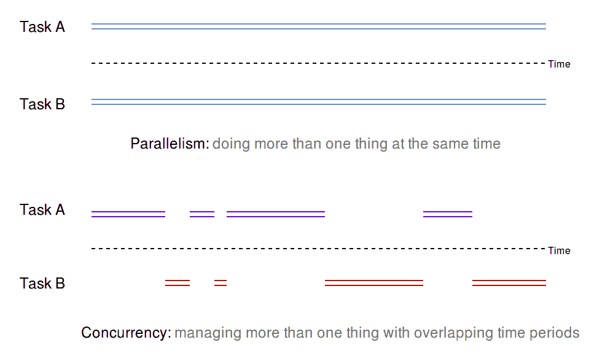
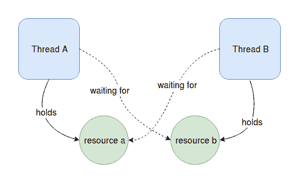
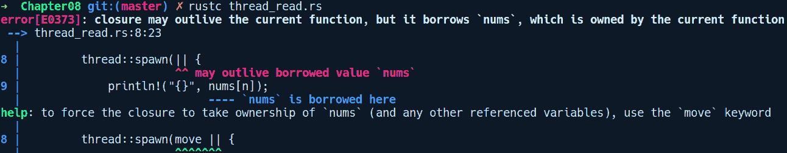
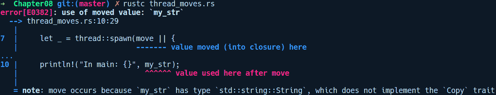
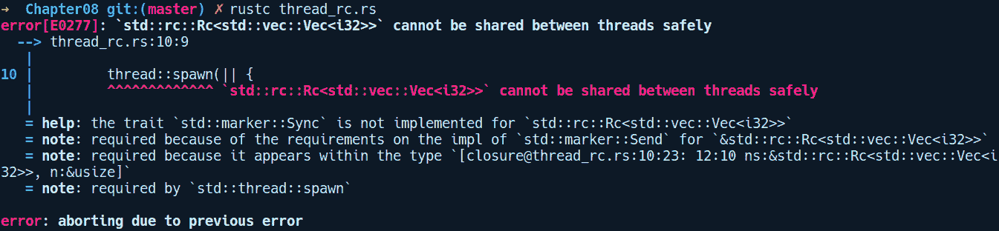
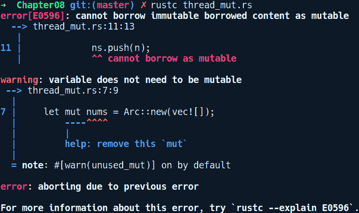

# 并发

当今的软件很少被编写为顺序执行任务。今天，能够编写能够同时做很多事情并且正确执行这些事情的程序更为重要。随着晶体管变得越来越小，由于晶体管中的量子效应，计算机架构师无法通过提高 CPU 时钟频率来扩展 CPU 的性能。这导致更多的关注点转向构建采用多个核心的并发 CPU 架构。随着这种转变，开发者需要编写高度并发的应用程序来维持当摩尔定律生效时所获得的免费性能提升。

但编写并发代码是困难的，那些不提供更好抽象的语言使得情况变得更糟。Rust 试图在这个领域使事情变得更好、更安全。在本章中，我们将探讨使 Rust 能够为开发者提供无畏并发、允许他们以安全的方式轻松表达程序的概念和原语。

本章涵盖的主题如下：

+   程序执行模型

+   并发及其相关陷阱

+   线程作为并发单元

+   Rust 如何提供线程安全性

+   Rust 中的并发原语

+   其他并发库

# 程序执行模型

"一个不断发展的系统，除非进行工作来减少它，否则会增加其复杂性。"

- *梅尔·莱曼*

在 20 世纪 60 年代初，在多任务处理甚至还是一个概念之前，为计算机编写的程序局限于顺序执行模型，它们能够按照时间顺序依次执行指令。这主要是因为当时硬件在处理指令方面的限制。当我们从真空管转向晶体管，再到集成电路时，现代计算机为支持程序中的多个执行点打开了可能性。那些需要等待一个指令执行完毕才能执行下一个指令的顺序编程模型已经过去了。今天，计算机能够同时做很多事情并且正确地完成这些事情的情况更为常见。

现代计算机模型了一个并发执行模型，其中一组指令可以在不同的时间间隔内独立执行。在这个模型中，指令不需要相互等待，几乎同时运行，除非它们需要共享或协调某些数据。如果你观察现代软件，它做很多事情看起来似乎是同时发生的，如下面的例子所示：

+   即使桌面应用程序在后台连接到网络，其用户界面仍然可以正常工作

+   一个游戏同时更新成千上万的实体状态，同时在后台播放音轨并保持一致的帧率

+   一个科学计算密集型程序会将计算分割开来，以便充分利用机器上的所有核心

+   一个 Web 服务器一次处理多个请求以最大化吞吐量

这些是一些非常有说服力的例子，推动了将我们的程序建模为并发进程的需求。但并发究竟意味着什么呢？在下一节中，我们将对其进行定义。

# 并发

程序能够同时管理多件事情并给人一种它们同时发生的错觉，这种能力被称为并发，这样的程序被称为并发程序。并发允许你以某种方式结构化你的程序，使其在可以将问题分解为多个子问题时运行得更快。当谈论并发时，另一个术语并行性经常被提及，了解这两个术语之间的区别很重要，因为这两个术语的使用往往重叠。并行性是指每个任务在非重叠的时间段内同时在不同的 CPU 核心上运行。以下图表说明了并发和并行之间的区别：



用另一种方式来说，并发是关于结构化你的程序以一次管理多件事情，而并行是关于将你的程序放在多个核心上以增加它在一定时间内完成的工作量。根据这个定义，可以得出结论，当并发做得正确时，可以更好地利用 CPU，而并行可能在所有情况下都不一定如此。如果你的程序并行运行但只处理一个专用任务，你并不会获得很多吞吐量。这就是说，当一个并发程序被设计在多个核心上运行时，我们可以获得两者的最佳效果。

通常，操作系统在较低级别已经提供了对并发的支持，开发者主要针对编程语言提供的较高层抽象进行编程。在底层支持之上，有不同并发的途径。

# 并发方法

我们使用并发来卸载程序的一部分以独立运行。有时，这些部分可能相互依赖，并朝着共同的目标前进，或者它们可能是令人尴尬的并行，这是一个用来指代可以分解为独立无状态任务的问题的术语，例如，并行转换图像中的每个像素。因此，使程序并发的途径取决于我们利用并发的层次以及我们试图解决的问题的性质。在下一节中，我们将讨论可用的并发方法。

# 基于内核

随着多任务处理成为常态，现代操作系统需要处理多个进程。因此，你的操作系统内核已经提供了编写并发程序的原始方法，以下是一种形式：

+   **进程**: 在这种方法中，我们可以通过生成它们自己的独立副本来运行程序的不同部分。在 Linux 上，这可以通过使用`fork`系统调用实现。为了与生成的进程通信任何数据，可以使用各种**进程间通信（IPC**）设施，如管道和 FIFOs。基于进程的并发提供了诸如故障隔离等特性，但也存在启动整个新进程的开销。在操作系统耗尽内存并杀死它们之前，可以生成的进程数量是有限的。基于进程的并发在 Python 的 multiprocessing 模块中可以看到。

+   **线程**: 内部运行的进程只是线程，具体称为主线程。一个进程可以启动或生成一个或多个线程。线程是可调度执行的最小单元。每个进程都以主线程开始。除此之外，它还可以使用操作系统提供的 API 生成额外的线程。为了允许程序员使用线程，大多数语言在其标准库中都提供了线程 API。与进程相比，它们更轻量级。线程与父进程共享相同的地址空间。它们不需要在内核的**进程控制块（PCB**）中有一个单独的条目，每次我们生成一个新进程时，该条目都会更新。但是，在进程内部驯服多个线程是一个挑战，因为与进程不同，它们与父进程和其他子线程共享地址空间，并且由于线程的调度由操作系统决定，我们无法依赖线程执行的顺序或它们将读取或写入的内存。当我们从单线程程序过渡到多线程程序时，这些操作突然变得难以推理。

**注意**: 线程和进程的实现因操作系统而异。在 Linux 下，内核将它们视为相同，除了线程在内核中没有自己的进程控制块条目，并且它们与父进程和任何其他子线程共享地址空间。

# 用户级

基于进程和线程的并发受我们能够生成多少个的限制。一个更轻量级且更高效的替代方案是使用用户空间线程，通常被称为绿色线程。它们首次出现在 Java 中，代号为*green*，这个名字一直沿用至今。其他语言如 Go（goroutines）和 Erlang 也有绿色线程。使用绿色线程的主要动机是减少使用基于进程和线程的并发带来的开销。绿色线程生成和使用的开销非常小，比线程占用更少的空间。例如，在 Go 中，goroutine 仅占用 4 KiB 的空间，而线程通常占用 8MB。

用户空间线程作为语言运行时的一部分进行管理和调度。运行时是任何额外的记录或管理代码，它随着你运行的每个程序执行。这可能是你的垃圾收集器或线程调度器。内部上，用户空间线程是在原生操作系统线程之上实现的。Rust 在 1.0 版本之前有绿色线程，但后来在语言稳定发布之前被移除。拥有绿色线程可能会偏离 Rust 的保证及其无运行时成本的原则。

用户空间并发更高效，但在其实施过程中却难以做到正确。然而，基于线程的并发是一种经过验证和测试的方法，自从多进程操作系统出现以来就非常流行，并且是并发的首选方法。大多数主流语言都提供了线程 API，允许用户创建线程并轻松地将代码的一部分卸载以进行独立执行。

在程序中利用并发遵循一个多步骤的过程。首先，我们需要确定问题中可以独立运行的部分。然后，我们需要寻找协调多个子任务的方法，这些子任务被分割以实现共同的目标。在这个过程中，线程可能还需要共享数据，并且需要同步来访问或写入共享数据。尽管并发带来了许多好处，但开发者还需要关注和计划一系列新的挑战和范式。在下一节中，我们将讨论并发的陷阱。

# 陷阱

并发的优势很多，但它也带来了一大堆复杂性和陷阱，我们必须应对。编写并发程序时可能会遇到以下问题：

+   **竞态条件**：由于线程是由操作系统调度的，我们无法决定线程访问共享数据的顺序和方式。在多线程代码中，一个常见的用例是从多个线程更新全局状态。这遵循三个步骤——读取、修改和写入。如果这三个操作不是由线程原子性地执行，我们可能会遇到竞态条件。

如果一组操作以不可分割的方式一起执行，则该组操作是原子的。为了使一组操作成为原子操作，它必须在执行过程中不被抢占。它必须完全执行或不执行。

如果两个线程同时尝试更新同一内存位置上的值，它们可能会覆盖彼此的值，只有其中一个更新会被写入内存，或者值可能根本不会更新。这是一个经典的竞态条件示例。这两个线程都在没有彼此协调的情况下竞争更新值。这导致其他问题，如数据竞争。

+   **数据竞争**：当多个线程试图同时写入内存中某个特定位置的数据时，很难预测将写入哪些值。内存中的最终结果也可能是垃圾值。数据竞争是竞争条件的结果，因为任何线程都必须以原子方式执行读取-修改-更新操作，以确保任何线程都能读取或写入一致的数据。

+   **内存不安全和未定义行为**：竞争条件也可能导致未定义的行为。考虑以下伪代码：

```rs
// Thread A

Node get(List list) {
    if (list.head != NULL) {
        return list.head
    }
}

// Thread B
list.head = NULL
```

我们有两个线程，A 和 B，它们对链表进行操作。`Thread A` 尝试检索链表的头部。为了安全地执行此操作，它首先检查链表的头部不是 `NULL`，然后返回它。`Thread B` 将链表的头部设置为 `NULL` 值。这两个线程几乎同时运行，并且可能被操作系统以不同的顺序调度。例如，在一个执行实例中，`Thread A` 首先运行并断言 `list.head` 不是 `NULL`。紧接着，`Thread A` 被操作系统抢占，`Thread B` 被调度运行。现在，`Thread B` 将 `list.head` 设置为 `NULL`。随后，当 `Thread A` 再次获得运行机会时，它将尝试返回 `list.head`，这是一个 `NULL` 值。这将导致在读取 `list.head` 时发生段错误。在这种情况下，由于这些操作的顺序没有得到维护，发生了内存不安全。

对于之前提到的问题有一个常见的解决方案——同步或序列化对共享数据或代码的访问，或者确保线程原子地运行关键部分。这是通过使用同步原语，如互斥锁、信号量或条件变量来实现的。但即使使用这些原语也可能导致其他问题，如死锁。

**死锁**：除了竞争条件之外，线程面临的另一个问题是，在持有资源锁的同时，资源被耗尽。死锁是一种情况，其中线程 A 持有资源 a 并等待资源 b。另一个线程 B 持有资源 `b` 并等待资源 a。以下图表描述了这种情况：



死锁很难检测，但可以通过正确地获取锁来解决。在前面的例子中，如果线程 A 和线程 B 都试图首先获取锁，我们可以确保锁被正确释放。

在探讨了优势和陷阱之后，让我们来看看 Rust 提供的 API，用于编写并发程序。

# Rust 中的并发

Rust 的并发原语依赖于原生操作系统线程。它通过标准库中的 `std::thread` 模块提供线程 API。在本节中，我们将从如何创建线程以并发执行任务的基本知识开始。在随后的章节中，我们将探讨线程如何相互共享数据。

# 线程基础

正如我们所说，每个程序都以主线程开始。要从程序的任何地方创建一个独立的执行点，主线程可以创建一个新的线程，该线程成为其子线程。子线程可以进一步创建自己的线程。让我们看看一个使用线程的最简单方式的 Rust 并发程序：

```rs
// thread_basics.rs

use std::thread;

fn main() {
    thread::spawn(|| {
        println!("Thread!");
        "Much concurrent, such wow!".to_string()
    });
    print!("Hello ");
}
```

在 `main` 中，我们调用 `thread` 模块中的 `spawn` 函数，该函数接受一个无参数闭包作为参数。在这个闭包中，我们可以编写任何我们想要以单独线程执行并发代码。在我们的闭包中，我们只是打印一些文本并返回 `String`。编译并运行这个程序，我们得到以下输出：

```rs
$ rustc thread_basics.rs
$ ./thread_basics
Hello
```

奇怪！我们只看到了 `"Hello"` 被打印出来。子线程中的 `println!("Thread");` 发生了什么？对 `spawn` 的调用创建了线程并立即返回，线程开始并发执行，而不阻塞其后的指令。子线程处于分离状态。在子线程有机会运行其代码之前，程序到达了 `print!("Hello");` 语句，并在从 `main` 返回时退出程序。因此，子线程中的代码根本不会执行。要允许子线程执行其代码，我们需要在子线程上等待。为此，我们需要首先将 `spawn` 返回的值赋给一个变量：

```rs
let child = thread::spawn(|| {
    print!("Thread!");
    String::from("Much concurrent, such wow!")
});
```

`spawn` 函数返回一个 `JoinHandle` 类型，我们将其存储在 `child` 变量中。这种类型是子线程的句柄，可以用来连接线程——换句话说，等待其终止。如果我们忽略线程的 `JoinHandle` 类型，就没有办法等待线程。继续我们的代码，我们在退出 `main` 之前在子线程上调用 `join` 方法，如下所示：

```rs
let value = child.join().expect("Failed joining child thread");
```

调用 `join` 会阻塞当前线程，并在执行 `join` 调用之后的任何代码行之前等待子线程完成。它返回一个 `Result` 值。由于我们知道这个线程不会崩溃，我们调用 `expect` 来解包 `Result` 类型，从而得到字符串。如果线程正在将自己连接或发生死锁，连接线程可能会失败，在这种情况下，它返回一个包含传递给 `panic!` 调用的值的 `Err` 变体。然而，在这种情况下，返回的值是 `Any` 类型，必须将其向下转换为适当的类型。我们的更新代码如下：

```rs
// thread_basics_join.rs

use std::thread;

fn main() {
    let child = thread::spawn(|| {
        println!("Thread!");
        String::from("Much concurrent, such wow!")
    });

    print!("Hello ");
    let value = child.join().expect("Failed joining child thread");
    println!("{}", value);
}
```

这是程序的输出：

```rs
$ ./thread_basics_join
Hello Thread!
Much concurrent, such wow!
```

太棒了！我们编写了第一个并发的 *hello world* 程序。让我们探索 `thread` 模块中的其他 API。

# 自定义线程

我们还有可以用来通过设置线程属性（如名称或堆栈大小）来配置线程的 API。为此，我们有 `thread` 模块中的 `Builder` 类型。以下是一个创建线程并使用 `Builder` 类型启动它的简单程序：

```rs
// customize_threads.rs

use std::thread::Builder;

fn main() {
    let my_thread = Builder::new().name("Worker Thread".to_string())
                                  .stack_size(1024 * 4);
    let handle = my_thread.spawn(|| {
        panic!("Oops!");
    });
    let child_status = handle.unwrap().join();
    println!("Child status: {}", child_status);
}
```

在前面的代码中，我们使用`Builder::new`方法，然后调用`name`和`stack_size`方法分别为我们的线程添加名称和堆栈大小。然后我们在`my_thread`上调用`spawn`，这会消耗构建器实例并创建线程。这次，在我们的闭包中，我们使用`panic!`并传递一个`"Oops"`消息。以下是程序的输出：

```rs
$ ./customize_threads 
thread 'Worker Thread' panicked at 'Oops!', customize_threads.rs:9:9
note: Run with `RUST_BACKTRACE=1` for a backtrace.
Child status: Err(Any)
```

我们可以看到线程具有我们给它起的相同名称——`"Worker Thread"`。注意返回的`"Child status"`消息是一个`Any`类型。线程中 panic 调用返回的值是`Any`类型，必须向下转换为特定类型。这就是关于创建线程的基础。

但前面代码示例中创建的线程并没有做什么。我们使用并发来解决可以分解为多个子任务的问题。在简单的情况下，这些子任务彼此独立，例如并行地对图像的每个像素应用过滤器。在其他情况下，线程中运行的子任务可能需要协调一些共享数据。

它们也可能在计算中做出贡献，其最终结果取决于线程的个别结果，例如，从多个线程中分块下载文件并将其传递给父管理线程。其他问题可能依赖于共享状态，例如 HTTP 客户端向需要更新数据库的服务器发送`POST`请求。在这里，数据库是所有线程共有的共享状态。这些都是并发的一些最常见用例，并且线程能够相互之间以及与父线程之间共享或传递数据是非常重要的。

让我们提高一下难度，看看我们如何在子线程中访问父线程中的现有数据。

# 从线程中访问数据

一个不与父线程通信或访问父线程数据的线程并没有什么作用。让我们以一个非常常见的模式为例，使用多个线程并发访问列表中的项目以执行一些计算。考虑以下代码：

```rs
// thread_read.rs

use std::thread;

fn main() {
    let nums = vec![0, 1, 2, 3, 4];
    for n in 0..5 {
        thread::spawn(|| {
            println!("{}", nums[n]);
        });
    }
}
```

在前面的代码中，我们在`values`中有`5`个数字，并创建了`5`个线程，其中每个线程都访问`values`中的数据。让我们编译这个程序：



有趣！如果你从借用角度考虑，这个错误是有意义的。`nums`来自主线程。当我们创建一个线程时，它不一定在父线程之前退出，甚至可能比它存活得更久。当父线程返回时，`nums`变量消失了，它指向的`Vec`也被释放了。如果 Rust 允许前面的代码，子线程可以访问`nums`，它可能在`main`返回后具有一些垃圾值，并且它将经历段错误。

如果你查看编译器的帮助信息，它会建议我们在闭包内部移动或捕获`nums`。这样，从`main`中引用的`nums`变量就被移动到`closure`内部，它将不会在`main`线程中可用。

这里是使用`move`关键字将值从父线程移动到其子线程的代码：

```rs
// thread_moves.rs

use std::thread;

fn main() {
    let my_str = String::from("Damn you borrow checker!");
    let _ = thread::spawn(move || {
        println!("In thread: {}", my_str);
    });
    println!("In main: {}", my_str);
}
```

在前面的代码中，我们试图再次访问`my_str`。这会失败，并出现以下错误：



如前述错误信息所示，使用`move`后，你无法再次使用数据，即使我们只是在子线程中读取`my_str`。在这里，我们同样被编译器所拯救。如果子线程释放了数据，而我们从`main`中访问`my_str`，我们将访问一个已释放的值，这是一个使用后释放的问题。

正如你所见，在多线程环境中，所有权和借用规则同样适用。这是其设计中一个新颖的方面，它不需要额外的结构来强制执行正确的并发代码。但是，我们如何实现从线程访问数据的先前的用例呢？因为线程更有可能比它们的父线程存活时间更长，所以我们不能在线程中有引用。相反，Rust 为我们提供了同步原语，允许我们在线程之间安全地共享和通信数据。让我们来探索这些原语。这些类型通常根据需求分层组合，你只需为所使用的部分付费。

# 基于线程的并发模型

我们主要使用线程来执行可以分解为子问题的任务，其中线程可能需要相互通信或共享数据。现在，以线程模型为基础，有不同方式来构建我们的程序和控制对共享数据的访问。并发模型指定了多个线程如何相互作用以及它们如何随时间和空间（在这里是内存）的推移进行进展。

Rust 不偏好任何有偏见的并发模型，并让开发者根据他们试图通过第三方 crate 解决的问题使用自己的模型。因此，存在其他并发模型，包括在`actix`crate 中实现的 actor 模型。还有其他模型，例如由`rayon`crate 实现的 work stealing 并发模型。然后，还有`crossbeam`crate，它允许并发线程从它们的父堆栈帧共享数据，并保证在父堆栈释放之前返回。

Rust 提供了两种流行的内置并发模型：通过同步共享数据和通过消息传递共享数据。

# 共享状态模型

使用共享状态将值传递给线程是最常用的方法，而实现这一点的同步原语存在于大多数主流语言中。同步原语是允许多个线程以线程安全的方式访问或操作一个值的类型或语言构造。Rust 也有许多同步原语，我们可以将它们包装在类型周围以使它们线程安全。

正如我们在上一节中看到的，我们不能从多个线程共享访问任何值。这里我们需要共享所有权。在第五章中，我们在*内存管理和安全性*部分介绍了`Rc`类型，它可以提供值的共享所有权。让我们尝试使用这个类型与我们的从多个线程读取数据的先前示例一起使用：

```rs
// thread_rc.rs

use std::thread;
use std::rc::Rc;

fn main() {
    let nums = Rc::new(vec![0, 1, 2, 3, 4]);
    let mut childs = vec![];
    for n in 0..5 {
        let ns = nums.clone();
        let c = thread::spawn(|| {
            println!("{}", ns[n]);
        });
        childs.push(c);
    }

    for c in childs {
        c.join().unwrap();
    }
}
```

这会导致以下错误：



Rust 在这里也帮了我们。这是因为，正如之前提到的，`Rc`类型不是线程安全的，因为引用计数更新操作不是原子的。我们只能在单线程代码中使用`Rc`。如果我们想在多线程环境中拥有相同类型的共享所有权，我们可以使用`Arc`类型，它就像`Rc`一样，但具有原子引用计数能力。

# 使用 Arc 的共享所有权

之前的代码可以通过以下方式与多线程的`Arc`类型一起工作：

```rs
// thread_arc.rs

use std::thread;
use std::sync::Arc;

fn main() {
    let nums = Arc::new(vec![0, 1, 2, 3, 4]);
    let mut childs = vec![];
    for n in 0..5 {
        let ns = Arc::clone(&nums);
        let c = thread::spawn(move || {
            println!("{}", ns[n]);
        });

        childs.push(c);
    }

    for c in childs {
        c.join().unwrap();
    }
} 
```

在之前的代码中，我们只是将向量的包装器从`Rc`替换为`Arc`类型。另一个变化是，在我们从子线程引用`nums`之前，我们需要使用`Arc::clone()`对其进行克隆，这给我们一个拥有`Arc<Vec<i32>>`值的所有权，它指向相同的`Vec`。有了这个变化，我们的程序可以编译并提供对共享`Vec`的安全访问，以下为输出结果：

```rs
$ rustc thread_arc.rs
$./thread_arc
0
2
1
3
4
```

现在，在多线程代码中，另一个用例是从多个线程中修改共享值。让我们看看如何做到这一点。

# 从线程中修改共享数据

我们将查看一个示例程序，其中五个线程将数据推送到共享的`Vec`。以下程序尝试做同样的事情：

```rs
// thread_mut.rs

use std::thread;
use std::sync::Arc;

fn main() {
    let mut nums = Arc::new(vec![]);
    for n in 0..5 {
        let mut ns = nums.clone();
        thread::spawn(move || {
            nums.push(n);
        });
    }
}
```

我们有相同的`nums`被`Arc`包装。但我们不能修改它，因为编译器给出了以下错误：



这不起作用，因为克隆`Arc`会提供对内部值的不可变引用。要从多个线程中修改数据，我们需要使用提供共享可变性的类型，就像`RefCell`一样。但与`Rc`类似，`RefCell`不能在多个线程中使用。相反，我们需要使用它们的线程安全变体，如`Mutex`或`RwLock`包装类型。让我们接下来探索它们。

# Mutex

当需要安全地访问共享资源时，可以使用互斥锁（mutex）来提供访问。互斥锁（Mutex）是“互斥”的缩写，是一种广泛使用的同步原语，用于确保代码一次只由一个线程执行。一般来说，`mutex` 是一个保护对象，线程通过获取它来保护那些打算由多个线程共享或修改的数据。它通过锁定值来禁止一次从多个线程访问一个值。如果一个线程已经对 `mutex` 类型有了锁，那么其他线程将无法运行相同的代码，直到持有锁的线程完成操作。

标准库中的 `std::sync` 模块包含 `Mutex` 类型，允许以线程安全的方式从线程中修改数据。

以下代码示例展示了如何从单个子线程中使用 `Mutex` 类型：

```rs
// mutex_basics.rs

use std::sync::Mutex;
use std::thread;

fn main() {
    let m = Mutex::new(0);
    let c = thread::spawn(move || {
        {
            *m.lock().unwrap() += 1;
        }
        let updated = *m.lock().unwrap();
        updated
    });
    let updated = c.join().unwrap();
    println!("{:?}", updated);
}
```

运行此代码按预期工作。但是，当多个线程尝试以 `Mutex` 访问值时，这不会工作，因为 `Mutex` 不提供共享可变。要允许从多个线程中修改 `Mutex` 内部的值，我们需要将其组合到 `Arc` 类型中。让我们看看如何做到这一点。

# 使用 Arc 和 Mutex 共享可变

在探索了单线程上下文中 `Mutex` 的基础知识后，我们将重新审视上一节中的示例。以下代码使用 `Arc` 包装的 `Mutex` 从多个线程修改一个值：

```rs
// arc_mutex.rs

use std::sync::{Arc, Mutex};
use std::thread;

fn main() {
    let vec = Arc::new(Mutex::new(vec![]));
    let mut childs = vec![];
    for i in 0..5 {
        let mut v = vec.clone();
        let t = thread::spawn(move || {
            let mut v = v.lock().unwrap(); 
            v.push(i);
        });
        childs.push(t);
    }

    for c in childs {
        c.join().unwrap();
    }

    println!("{:?}", vec);
}
```

在前面的代码中，我们在 `m` 中创建了一个 `Mutex` 值。然后我们启动一个线程。你的机器上的输出可能会有所不同。

在互斥锁上调用 `lock` 将阻塞其他线程调用 `lock`，直到锁释放。因此，我们很重要的一点是要以细粒度的方式组织我们的代码。编译和运行此代码将给出以下输出：

```rs
$ rustc arc_mutex.rs
$ ./arc_mutex Mutex { data: [0,1,2,3,4] }
```

`Mutex` 还有一个类似的替代品，即 `RwLock` 类型，它对锁的类型有更多的了解，并且在读取比写入更频繁时可以提供更好的性能。让我们接下来探索它。

# RwLock

虽然 `Mutex` 对于大多数用例来说都很好，但对于一些多线程场景，读取操作比写入操作更频繁。在这种情况下，我们可以使用 `RwLock` 类型，它也提供了共享可变，但可以在更细粒度的层面上做到这一点。`RwLock` 代表读者-写入者锁。使用 `RwLock`，我们可以同时有多个读者，但在给定的作用域内只有一个写入者。这比 `Mutex` 更好，因为 `Mutex` 对线程想要访问的类型一无所知。使用 RwLock

RwLock 公开了两种方法：

+   `read`：为线程提供读取访问。可以有多个读取调用。

+   `write`：为线程提供对包装类型的写入数据的独占访问。`RwLock` 实例可以有一个写入访问。

下面是一个示例程序，演示了使用 `RwLock` 而不是 `Mutex`：

```rs
// thread_rwlock.rs

use std::sync::RwLock;
use std::thread;

fn main() {
    let m = RwLock::new(5);
    let c = thread::spawn(move || {
        {
            *m.write().unwrap() += 1;
        }
        let updated = *m.read().unwrap();
        updated
    });
    let updated = c.join().unwrap();
    println!("{:?}", updated);
}
```

但在某些系统（如 Linux）上的`RwLock`存在写者饥饿问题。这是一种当读者持续访问共享资源时，写线程从未有机会访问共享资源的情况。

# 通过消息传递进行通信

线程还可以通过一个更高级的抽象，称为消息传递，相互通信。这种线程通信模型消除了用户使用显式锁的需求。

标准库的`std::sync::mpsc`模块提供了一个无锁的多生产者、单订阅者队列，它作为想要相互通信的线程的共享消息队列。`mpsc`模块标准库有两种类型的通道：

+   `channel`：这是一个异步、无限缓冲区通道。

+   `sync_channel`：这是一个同步、有界缓冲区通道。

通道可以用来将数据从一个线程发送到另一个线程。让我们首先看看异步通道。

# 异步通道

这里是一个简单的生产者-消费者系统的例子，其中主线程产生值`0, 1, ..., 9`，而派生的线程打印它们：

```rs
// async_channels.rs

use std::thread;
use std::sync::mpsc::channel;

fn main() {
    let (tx, rx) = channel();
    let join_handle = thread::spawn(move || {
        while let Ok(n) = rx.recv() {
            println!("Received {}", n);
        }
    });

    for i in 0..10 {
        tx.send(i).unwrap();
    }

    join_handle.join().unwrap();
}
```

我们首先调用`channel`方法。这个方法返回两个值，`tx`和`rx`。`tx`是发送端，类型为`Sender<T>`，而`rx`是接收端，类型为`Receiver<T>`。它们的名称只是一个约定，你可以将它们命名为任何东西。通常，你会在代码库中看到这些名称，因为它们简洁易写。

接下来，我们派生一个线程，它将从`rx`端接收值：

```rs
    let join_handle = thread::spawn(move || {
        // Keep receiving in a loop, until tx is dropped!
        while let Ok(n) = rx.recv() { // Note: `recv()` always blocks
            println!("Received {}", n);
        }
    });
```

我们使用`while let`循环。当`tx`被丢弃时，这个循环将接收到`Err`。丢弃发生在`main`返回时。

在前面的代码中，首先，为了创建`mpsc`队列，我们调用`channel`函数，它返回给我们`Sender<T>`和`Receiver<T>`。

`Sender<T>`是一个`Clone`类型，这意味着它可以被传递给多个线程，允许它们将消息发送到共享队列。

**多生产者，单消费者**（**mpsc**）方法提供了多个写者但只有一个读者。这两个功能都返回一对通用类型：发送者和接收者。发送者可以用来将新事物推入通道，而接收者可以用来从通道中获取事物。发送者实现了`Clone`特质，而接收者则没有。

默认的异步通道中，`send`方法永远不会阻塞。这是因为通道缓冲区是无限的，所以总有空间。当然，它并不是真正无限的，只是概念上如此：如果你向通道发送了几十亿字节而没有接收任何东西，你的系统可能会耗尽内存。

# 同步通道

同步通道有一个有界缓冲区，当它满时，`send`方法会阻塞，直到通道中有更多空间。其用法与异步通道非常相似：

```rs
// sync_channels.rs

use std::thread; 
use std::sync::mpsc; 

fn main() { 
    let (tx, rx) = mpsc::sync_channel(1);
    let tx_clone = tx.clone();

    let _ = tx.send(0);

    thread::spawn(move || { 
        let _ = tx.send(1);
    }); 

    thread::spawn(move || {
        let _ = tx_clone.send(2);
    }); 

    println!("Received {} via the channel", rx.recv().unwrap());
    println!("Received {} via the channel", rx.recv().unwrap());
    println!("Received {} via the channel", rx.recv().unwrap());
    println!("Received {:?} via the channel", rx.recv());
}

```

同步通道的大小是 `1`，这意味着通道中不能有超过一个的项目。在这种情况下，任何在第一个发送之后的发送调用都会阻塞。然而，在前面的代码中，我们没有遇到阻塞（至少，是长阻塞），因为两个发送线程在后台工作，主线程可以接收它而不会在 `send` 调用上阻塞。对于这两种通道类型，如果通道为空，`recv` 调用将返回一个 `Err` 值。

# Rust 中的线程安全

在上一节中，我们看到了编译器如何阻止我们共享数据。如果一个子线程以可变方式访问数据，它会被移动，因为 Rust 不允许它在父线程中使用，因为子线程可能会释放它，导致主线程中出现悬垂指针解引用。让我们来探讨线程安全的理念以及 Rust 的类型系统是如何实现这一点的。

# 什么是线程安全？

线程安全是类型或代码片段的一个属性，当由多个线程执行或访问时，不会导致意外行为。它指的是数据在读取时保持一致性，而在多个线程写入时保持安全。

Rust 只能保护你免受数据竞争的影响。它不旨在防止死锁，因为死锁很难检测。相反，它将这项工作委托给第三方 crate，如 `parking_lot` crate。

Rust 有一种新颖的方法来防止数据竞争。大多数线程安全的部分已经嵌入到 `spawn` 方法的类型签名中。让我们看看它的类型签名：

```rs
fn spawn<F, T>(f: F) -> JoinHandle<T>
    where F: FnOnce() -> T,
        F: Send + 'static,
        T: Send + 'static
```

这是一个看起来很吓人的类型签名。让我们通过解释每个部分的意义来让它不那么吓人。

`spawn` 是一个泛型函数，它对 `F` 和 `T` 进行泛型化，并接受一个参数 `f`，返回一个名为 `JoinHandle<T>` 的泛型类型。随后，`where` 子句指定了多个特性约束：

+   `F: FnOnce() -> T`：这意味着 `F` 实现了一个只能调用一次的闭包。换句话说，`f` 是一个闭包，它以值的方式接受所有内容，并将环境中的引用项移动。

+   `F: Send + 'static`：这意味着闭包必须是 `Send`，并且必须具有 `'static` 生命周期，这意味着闭包环境中引用的任何类型也必须是 `Send`，并且必须在整个程序运行期间存在。

+   `T: Send + 'static`：闭包的返回类型 `T` 也必须实现 `Send + 'static` 特性。

如我们所知，`Send` 是一个标记特性。它仅仅用作类型级别的标记，表示该值可以安全地在线程间传递；大多数类型都是 `Send`。没有实现 `Send` 的类型包括指针、引用等。此外，`Send` 是一个自动特性或自动推导的特性，只要适用。复合数据类型，如结构体，如果其所有字段都是 `Send`，则实现 `Send`。

# 线程安全特性

线程安全是这样一个想法，即如果你有想要从多个线程中读取的数据，对该值的任何读取或写入操作都不会导致不一致的结果。更新一个值的问题，即使是像 `a += 1` 这样的简单增加操作，它大致上可以转化为三个步骤——`load` `increment` `store`。可以安全更新的数据意味着应该被封装在线程安全类型，如 `Arc` 和 `Mutex` 中，以确保程序中的数据一致性。

在 Rust 中，你可以通过类型签名在编译时确保可以安全地在线程中使用和引用的类型。这些保证是通过特性实现的，即 `Send` 和 `Sync` 特性。

# Send

`Send` 类型可以安全地发送到多个线程。这暗示了该类型是一个 `move` 类型。不是 `Send` 的类型是指针类型，例如 `&T`，除非 `T` 是 `Sync`。

`Send` 特性在标准库的 `std::marker` 模块中有以下类型签名：

```rs
pub unsafe auto trait Send { }
```

在其定义中有三个重要的事项需要注意：首先，它是一个标记特性，没有主体或项目。其次，它以 `auto` 关键字为前缀，因为它在大多数适当的情况下是隐式实现的。第三，它是一个不安全的特性，因为 Rust 想确保开发者明确选择并确保他们的类型内置了线程安全的同步。

# Sync

`Sync` 特性具有类似的方法签名：

```rs
pub unsafe auto trait Sync { }
```

这个特性表示实现了这个特性的类型可以在线程之间安全共享。如果某物是 `Sync`，那么它的引用，换句话说，`&T` 是 `Send`。这意味着我们可以将它传递给多个线程。

# 使用演员模型进行并发

另一个与消息传递模型相当相似的并发模型是演员模型。演员模型随着电信行业流行的函数式编程语言 Erlang 的流行而变得流行，Erlang 以其健壮性和默认的分布式特性而闻名。

演员模型是一个概念模型，它使用称为演员的实体在类型级别实现并发。它最初由卡尔·爱迪·休伊特在 1973 年提出。它消除了对锁和同步的需求，并为系统中的并发引入提供了一种更干净的方式。演员模型由三件事组成：

+   **演员**：这是演员模型中的一个核心原语。每个演员由其地址组成，我们可以通过这个地址向演员的邮箱发送消息，邮箱只是一个存储已接收消息的队列。队列通常是 **先进先出**（**FIFO**）队列。演员的地址是必要的，这样其他演员才能向它发送消息。监督演员可以创建子演员，这些子演员可以创建其他子演员。

+   **消息**：演员只通过消息进行通信。它们由演员异步处理。`actix-web` 框架提供了一个用于异步包装中同步操作的优雅包装器。

在 Rust 中，我们有实现 actor 模型的`actix`crate。`actix`crate 使用了 tokio 和 futures crate，我们将在第十二章中介绍，即《Rust 网络编程》。该 crate 的核心对象是 Arbiter 类型，它简单地说是一个在下面 spawn 一个事件循环的线程，并提供一个作为`Addr`类型的事件循环句柄。一旦创建，我们可以使用这个句柄向 actor 发送消息。

在`actix`中，创建 actor 遵循一个简单的步骤：创建一个类型，定义一个消息，并为 actor 类型实现消息的处理程序。一旦完成这些，我们就可以创建 actor 并将它们 spawn 到创建的仲裁者之一中。

每个 actor 都在一个仲裁者中运行。

当我们创建 actor 时，它们不会立即执行。只有当我们将这些 actor 放入仲裁者线程中时，它们才开始执行。

为了使代码示例简单，并展示如何在 actix 中设置 actor 并运行它们，我们将创建一个可以相加两个数字的 actor。让我们通过运行`cargo new actor_demo`来创建一个新的项目，并在`Cargo.toml`中包含以下依赖项：

```rs
# actor_demo/Cargo.toml

[dependencies]
actix = "0.7.9"
futures = "0.1.25"
tokio = "0.1.15"
```

我们的`main.rs`包含以下代码：

```rs
// actor_demo/src/main.rs

use actix::prelude::*;
use tokio::timer::Delay;
use std::time::Duration;
use std::time::Instant;
use futures::future::Future;
use futures::future;

struct Add(u32, u32);

impl Message for Add {
    type Result = Result<u32, ()>;
}

struct Adder;

impl Actor for Adder {
    type Context = SyncContext<Self>;
}

impl Handler<Add> for Adder {
    type Result = Result<u32, ()>;

    fn handle(&mut self, msg: Add, _: &mut Self::Context) -> Self::Result {
        let sum = msg.0 + msg.0;
        println!("Computed: {} + {} = {}",msg.0, msg.1, sum);
        Ok(msg.0 + msg.1)
    }
}

fn main() {
    System::run(|| {
        let addr = SyncArbiter::start(3, || Adder);
        for n in 5..10 {
            addr.do_send(Add(n, n+1));
        }

        tokio::spawn(futures::lazy(|| {
            Delay::new(Instant::now() + Duration::from_secs(1)).then(|_| {
                System::current().stop();
                future::ok::<(),()>(())
            })
        }));
    });
}
```

在前面的代码中，我们创建了一个名为`Adder`的 actor。这个 actor 可以发送和接收类型为`Add`的消息。这是一个封装了要相加的两个数字的元组结构体。为了允许`Adder`接收和处理`Add`消息，我们为`Adder`参数化`Add`消息类型实现了`Handler`特质。在`Handler`实现中，我们打印出正在执行的计算，并返回给定数字的和。

在此之后，在`main`中，我们首先通过调用其`run`方法创建一个`System`actor，该方法接受一个闭包。在闭包内部，我们通过调用其`start`方法启动一个带有`3`个线程的`SyncArbiter`。这创建了 3 个准备接收消息的 actor。它返回一个`Addr`类型，这是一个事件循环的句柄，我们可以向`Adder`actor 实例发送消息。然后我们向我们的仲裁者地址`addr`发送 5 条消息。由于 System::run 是一个无限运行的父事件循环，我们在 1 秒的延迟后 spawn 一个 future 来停止 System actor。我们可以忽略这部分代码的细节，因为它只是以异步方式关闭 System actor。

有了这些，让我们运行这个程序：

```rs
$ cargo run
Running `target/debug/actor_demo`
Computed: 5 + 6 = 10
Computed: 6 + 7 = 12
Computed: 7 + 8 = 14
Computed: 8 + 9 = 16
Computed: 9 + 10 = 18
```

与`actix`crate 类似，Rust 生态系统中有其他 crate 实现了适用于不同用例的各种并发模型。

# 其他 crate

除了`actix`之外，我们还有一个名为`rayon`的 crate，它是一个基于工作窃取的数据并行库，使得编写并发代码变得非常简单。

另一个值得提到的 crate 是`crossbeam`，它允许编写可以访问其父堆栈帧数据的并发代码，并保证在父堆栈帧消失之前终止。

`parking_lot` 是另一个提供比标准库中现有的并发原语更快替代方案的 crate。如果你有一个标准库中的 `Mutex` 或 `RwLock` 性能不足的使用场景，那么你可以使用这个 crate 来获得显著的加速。

# 摘要

实际上非常令人惊讶的是，同样的所有权原则，它防止了单线程上下文中的内存安全违规，在与标记特质组合时也适用于多线程上下文。Rust 提供了简单且安全的 ergonomics，以最小的运行时成本将并发集成到你的应用程序中。在本章中，我们学习了如何使用 Rust 标准库提供的 `threads` API，并了解了在并发上下文中复制和移动类型是如何工作的。我们涵盖了通道、原子引用计数类型 `Arc`，以及如何使用 `Arc` 与 `Mutex` 一起，还探讨了并发的 actor 模型。

在下一章中，我们将深入探讨元编程，它完全是关于从代码生成代码的。
