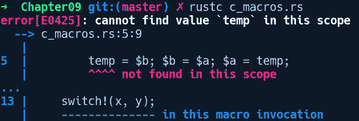
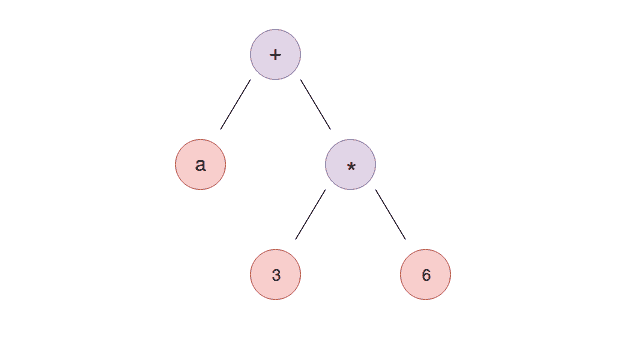
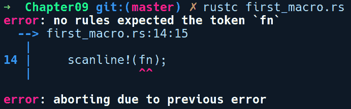
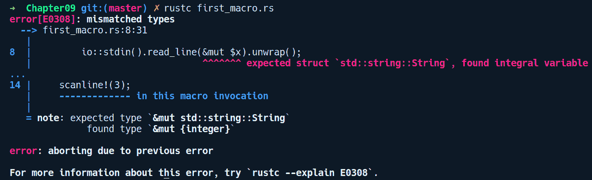
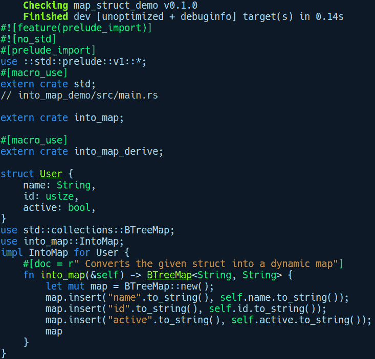

# 使用宏进行元编程

元编程是一个改变你对程序中指令和数据看法的概念。它允许你通过将指令视为其他任何数据片段来生成新的代码。许多语言都支持元编程，例如 Lisp 的宏、C 的 `#define` 结构和 Python 的元类。Rust 也不例外，它提供了许多形式的元编程，我们将在本章中探讨。

在本章中，我们将探讨以下主题：

+   什么是元编程？

+   Rust 中的宏及其形式

+   声明式宏、宏变量和类型

+   重复结构

+   过程式宏

+   宏的使用案例

+   可用的宏库

# 什么是元编程？

"Lisp 不仅仅是一种语言，它是一种建筑材料。"

*– 阿兰·凯*

任何程序，无论使用何种语言，都包含两个实体：数据和操纵数据指令。程序通常的流程主要关注数据的操纵。然而，指令的问题在于，一旦你编写了它们，就像它们已经被刻在石头上一样，因此它们是不可变的。如果我们能够将指令视为数据并使用代码生成新的指令，那就更有助于实现。元编程正是提供了这样的功能！

这是一种编程技术，你可以编写具有生成新代码能力的代码。根据语言的不同，它可以通过两种方式来处理：在运行时或在编译时。运行时元编程在动态语言如 Python、JavaScript 和 Lisp 中可用。对于编译语言，由于这些语言在编译时对程序进行编译，因此无法在运行时生成指令。然而，你可以在编译时生成代码，这正是 C 宏所提供的。Rust 也提供了编译时代码生成能力，这些能力比 C 宏更强大和可靠。

在许多语言中，元编程结构通常由总称**宏**表示，对于某些语言来说，这是一个内置特性。对于其他语言，它们作为单独的编译阶段提供。一般来说，宏接受任意序列的代码作为输入，并输出有效的代码，这些代码可以被语言编译或执行，并与其他代码一起。宏的输入不需要是有效的语法，你可以自由地为宏输入定义自己的自定义语法。此外，调用宏的方式以及定义它们的语法在不同的语言中是不同的。例如，C 宏在预处理阶段工作，它读取以`#define`开始的标签，并在将源文件转发给编译器之前将其展开。在这里，展开意味着通过用提供给宏的输入替换来生成代码。另一方面，Lisp 提供了类似于函数的宏，这些宏是用`defmacro`（一个宏本身）定义的，它接受正在创建的宏的名称和一个或多个参数，并返回新的 Lisp 代码。然而，C 和 Lisp 宏缺少一个被称为卫生性的属性。它们在展开时是非卫生的，这意味着它们可以捕获并干扰宏之外的定义的代码，这可能导致在代码的某些位置调用宏时出现意外的行为和逻辑错误。

为了展示缺乏卫生性的问题，我们将以一个 C 宏为例。这些宏只是简单地复制/粘贴代码并进行简单的变量替换，并且不具备上下文意识。用 C 编写的宏在意义上不是卫生的，因为它们可以引用任何地方定义的变量，只要这些变量在宏调用位置的作用域内。例如，以下是一个在 C 中定义的`SWITCH`宏，它可以交换两个值，但在交换过程中无意中修改了其他值：

```rs
// c_macros.c

#include <stdio.h> 

#define SWITCH(a, b) { temp = b; b = a; a = temp; } 

int main() { 
    int x=1; 
    int y=2; 
    int temp = 3; 

    SWITCH(x, y); 
    printf("x is now %d. y is now %d. temp is now %d\n", x, y, temp); 
}
```

使用`gcc c_macros.c -o macro && ./macro`编译此程序会得到以下输出：

```rs
x is now 2\. y is now 1\. temp is now 2
```

在前面的代码中，除非我们在`SWITCH`宏内部声明自己的`temp`变量，否则`main`中的原始`temp`变量会被`SWITCH`宏的展开所修改。这种非卫生性使得 C 宏不可靠且脆弱，除非采取特殊预防措施，例如在宏内部使用不同的`temp`变量名称，否则很容易造成混乱。

与此相反，Rust 宏是卫生的，并且比仅仅执行简单的字符串替换和展开更具有上下文意识。它们知道在宏内部引用的变量的作用域，并且不会影响已经在外部声明的标识符。考虑以下 Rust 程序，它试图实现我们之前使用的宏：

```rs
// c_macros_rust.rs

macro_rules! switch {
    ($a:expr, $b:expr) => {
        temp = $b; $b = $a; $a = temp;
    };
}

fn main() { 
    let x = 1; 
    let y = 2; 
    let temp = 3;
    switch!(x, y);
}
```

在前面的代码中，我们创建了一个名为`switch!`的宏，并在`main`中使用两个值`x`和`y`调用了它。我们将跳过对宏定义的细节解释，因为我们将在这章的后面详细讨论它们。

然而，令我们惊讶的是，这不能编译，并且会失败，错误信息如下：



从错误信息来看，我们的 `switch!` 宏对在 `main` 中声明的 `temp` 变量一无所知。正如我们所看到的，Rust 宏在处理时不会像 C 宏那样从其环境中捕获变量。即使它能够这样做，我们也会因为 `temp` 在前面的程序中被声明为不可变而避免修改。真 neat！

在我们开始编写更多这样的 Rust 宏之前，了解何时为你的问题使用基于宏的解决方案，何时不使用它是很重要的！

# 何时使用和何时不使用 Rust 宏

使用宏的一个优点是它们不像函数那样急于评估它们的参数，这是除了函数之外使用宏的动机之一。

通过急于评估，我们指的是像 `foo(bar(2))` 这样的函数调用将首先评估 `bar(2)`，然后将它的值传递给 `foo`。相反，这是一个懒评估，这就是你在迭代器中看到的情况。

一个一般的**经验法则**是，当函数无法提供所需的解决方案时，或者你有相当重复的代码时，或者你需要检查你的类型结构并在编译时生成代码时，可以使用宏。从实际用例中举例，Rust 宏在许多情况下都被使用，例如以下情况：

+   通过创建自定义**领域特定语言**（**DSLs**）来增强语言语法

+   编写编译时序列化代码，就像 serde 所做的那样

+   将计算移动到编译时，从而减少运行时开销

+   编写样板测试代码和自动化测试用例

+   提供零成本日志抽象，如 log crate

同时，宏应该谨慎使用，因为它们会使代码难以维护和推理，因为它们在元级别工作，而且并不是很多开发者会感到舒适地使用它们。它们使代码更难阅读，从可维护性的角度来看，可读性应该始终优先。此外，宏的过度使用可能会导致性能惩罚，因为会产生大量的重复代码生成，这会影响 CPU 指令缓存。

# Rust 中的宏及其类型

Rust 宏在程序编译成二进制对象文件之前就完成了它们的代码生成魔法。它们接收输入，称为**令牌树**，并在解析的第二遍结束时，在**抽象语法树**（**AST**）构建过程中进行展开。这些都是编译器领域的术语，需要一些解释，所以让我们来解释一下。为了理解宏是如何工作的，我们需要熟悉编译器如何处理源代码以理解程序。这将帮助我们理解宏如何处理其输入，以及当我们使用它们不正确时它们产生的错误信息。我们只涵盖与我们对宏理解相关的部分。

首先，编译器逐字节读取源代码并将字符分组为有意义的块，这些块被称为**令牌**。这是通过编译器的一个组件完成的，通常被称为**分词器**。因此，`a + 3 * 6`表达式被转换为`"a", "+", "3", "*", "6"`，这是一个令牌序列。其他令牌可以是`fn`关键字、任何标识符、括号`{}` `()`、赋值运算符`=`等等。这些令牌在宏的术语中被称为**令牌树**。还有一些可以分组其他令牌的令牌树，例如`"(", ")", "}", "{"`。现在，在这个阶段，令牌序列本身并不传达任何关于如何处理和解释程序的意义。为此，我们需要一个**解析器**。

解析器将这个扁平的令牌流转换为层次结构，指导编译器如何解释程序。令牌树被传递给解析器，它构建一个内存中的程序表示，称为抽象语法树。例如，我们的令牌序列`a + 3 * 6`，它是一个表达式，当`a`的值为`2`时，可以评估为`20`。

然而，除非我们分离运算符的优先级（即`*`在`+`之前），并以树结构表示它们，否则编译器不知道如何正确评估这个表达式，如下面的图所示：



当我们将表达式表示为代码中的树结构，使得乘法发生在加法之前时，我们可以对这个树进行后序遍历以正确评估表达式。因此，根据这个解释，我们的宏展开在这里是如何定位的？Rust 宏在抽象语法树构建的第二阶段结束时被解析，这是一个名称解析发生的阶段。名称解析是查找表达式定义中变量在作用域中存在性的阶段。在前面的表达式中，将进行对`a`变量的名称解析。现在，如果前述表达式中的`a`变量从宏调用（如`let a = foo!(2 + 0);`）中分配了一个值，那么解析器会在进行名称解析之前展开宏。名称解析阶段会捕捉程序中的错误，例如使用不在作用域中的变量。然而，还有比这更复杂的情况。

这意味着 Rust 宏是上下文感知的，并且根据宏展开的内容，它们只能出现在语言语法定义的支持位置。例如，你无法在项目级别（即在模块内）编写`let`语句。

语法定义了编写程序的有效方式，就像口语中的语法指导构建有意义的句子一样。对于那些好奇的人，Rust 的语法定义在[`doc.rust-lang.org/grammar.html`](https://doc.rust-lang.org/grammar.html)。

我们已经多次看到的一个宏实例是 `println!` 宏。它被实现为一个宏，因为它允许 Rust 在编译时检查其参数是否有效，以及传递给它的字符串插值变量数量是否正确。使用宏打印字符串的另一个优点是，它允许我们尽可能多地传递参数给 `println!`，如果它被实现为一个常规函数，这是不可能的。这是因为 Rust 不支持函数的可变参数。考虑以下示例：

```rs
println("The result of 1 + 1 is {}", 1 + 1); 
println!("The result of 1 + 1 is {}"); 
```

如您所知，第二种形式将在编译时失败，因为它缺少与格式字符串匹配的参数。这是在编译时报告的。因此，它比 C 的 `printf` 函数要安全得多，后者可能导致内存漏洞，如格式字符串攻击。`println!` 宏的另一个特性是我们可以自定义如何在字符串中打印值：

```rs
// print_formatting.rs

use std::collections::HashMap;

fn main() {
    let a = 3669732608;
    println!("{:p}", &a);
    println!("{:x}", a);

    // pretty printing
    let mut map = HashMap::new();
    map.insert("foo", "bar");
    println!("{:#?}", map);
}
```

在前面的代码中，我们可以通过 `"{:p}"` 和 `"{:x}"` 分别打印出存储在 `a` 中的值的内存地址和十六进制表示。这些被称为**格式说明符**。我们还可以使用 `println!` 中的 `"{:#?}"` 格式说明符以更类似于 JSON 的格式打印非原始类型。让我们编译并运行前面的程序：

```rs
error[E0277]: the trait bound `{integer}: std::fmt::Pointer` is not satisfied
 --> print_formatting.rs:7:22
  |
7 |     println!("{:p}", a);
  |                      ^ the trait `std::fmt::Pointer` is not implemented for `{integer}`
```

好的，我们遇到了一个错误。正如你可能已经注意到的，在第一个 `println!` 宏调用中，我们试图使用 `"{:p}"` 说明符打印 `a` 的地址，但提到的变量是一个数字。我们需要将一个引用，如 `&a`，传递给格式说明符。有了这个更改，前面的程序就可以编译了。所有这些格式化和检查字符串插值中适当值的工作都是在编译时完成的，这要归功于宏作为解析阶段的一部分的实现。

# 宏的类型

Rust 中存在不同形式的宏。一些允许你像函数一样调用它们，而另一些则允许你根据编译时条件有条件地包含代码。另一类宏允许你在编译时在方法上实现特质。它们可以大致分为两种形式：

+   **声明式宏**：这是最简单的宏形式。它们使用 `macro_rules!` 创建，而 `macro_rules!` 本身也是一个宏。它们提供了调用函数相同的易用性，但通过末尾的 `!` 可以轻松区分。它们是编写项目中小型宏的首选方法。定义它们的语法与编写匹配表达式的方式非常相似。它们被称为**声明式**，因为您已经拥有一个迷你领域特定语言（DSL），包括已识别的令牌类型和重复构造，您可以使用它们声明性地表达您想要生成的代码。您不需要编写如何生成代码，因为这由 DSL 处理。

+   **过程宏**：过程宏是宏的更高级形式，它提供了对代码操作和生成的完全控制。这些宏不附带任何 DSL 支持，并且是过程性的，这意味着你必须编写代码来指定对于给定的标记树输入，代码应该如何生成或转换。缺点是它们实现起来比较复杂，需要一点对编译器内部结构和程序在编译器内存中表示的理解。虽然`macro_rules!`可以在项目的任何地方定义，但到目前为止，过程宏必须作为具有`Cargo.toml`中特殊属性`proc-macro = true`的独立 crate 创建。

# 使用`macro_rules!`创建你的第一个宏

让我们从声明式宏开始，首先使用`macro_rules!`宏构建一个。Rust 已经有一个`println!`宏，用于将内容打印到标准输出。然而，它没有用于从标准输入读取的等效宏。要从标准输入读取，你必须编写如下内容：

```rs
let mut input = String::new();
io::stdin().read_line(&mut input).unwrap();
```

这些代码行可以通过宏轻松抽象出来。我们将我们的宏命名为`scanline!`。以下是展示我们如何使用此宏的代码：

```rs
// first_macro.rs

fn main() {
    let mut input = String::new();
    scanline!(input);
    println!("{:?}", input);
}
```

我们希望能够创建一个`String`实例，并将其直接传递给`scanline!`，该函数会处理从标准输入读取的所有细节。如果我们通过运行`rustc first_macro.rs`来编译前面的代码，我们会得到以下错误：

```rs
error: cannot find macro `scanline!` in this scope
 --> first_macro.rs:5:5
  |
5 |     scanline!(input);
  |     ^^^^^^^^

error: aborting due to previous error
```

`rustc`找不到`scanline!`宏，因为我们还没有定义它，所以让我们先定义它：

```rs
// first_macro.rs

use std::io::stdin;

// A convenient macro to read input as string into a buffer
macro_rules! scanline {
    ($x:expr) => ({
        stdin().read_line(&mut $x).unwrap();
        $x.trim();
    });
}
```

要创建`scanline!`宏，我们使用`macro_rules!`宏，后跟宏名称`scanline!`，然后是一对花括号。在花括号内，我们有类似于匹配臂的东西。这些被称为**匹配规则**。每个匹配规则由三个部分组成。第一部分是模式匹配器，即`($x:expr)`部分，后面跟着一个`=>`，然后是代码生成块，它可以由`()`、`{}`或甚至`[]`来界定。当有多个规则要匹配时，匹配规则必须以分号结束。

在前面的代码中，左边的符号`($x:expr)`在括号内是规则，其中`$x`是一个标记树变量，需要在冒号`:`后面指定类型，它是一个`expr`标记树类型。它们的语法类似于我们指定函数参数的方式。当我们用任何标记序列作为输入调用`scanline!`宏时，它会被捕获在`$x`中，并在代码生成块的右侧以相同的变量引用。`expr`标记类型意味着这个宏只能接受表达式。我们稍后会介绍`macro_rules!`接受的其它类型的标记。在代码生成块中，我们有要生成的多行代码，所以我们有一个成对的括号，它们用于处理多行表达式。匹配规则以分号结束。如果我们需要生成单行代码，我们也可以省略括号。我们想要的生成代码如下：

```rs
io::stdin().read_line(&mut $x).unwrap();
```

注意，`read_line`接受的东西看起来不像一个标识符的正确可变引用，即它是一个`&mut $x`。`$x`会被替换为我们传递给宏的实际表达式。就是这样；我们刚刚编写了我们的第一个宏！完整的代码如下：

```rs
// first_macro.rs

use std::io;

// A convenient macro to read input as string into a buffer
macro_rules! scanline {
    ($x:expr) => ({
        io::stdin().read_line(&mut $x).unwrap();
    });
}

fn main() {
    let mut input = String::new();
    scanline!(input);
    println!("I read: {:?}", input);
}
```

在`main`函数中，我们首先创建我们的`input`字符串，它将存储用户输入的内容。接下来，我们调用`scanline!`宏，并传递`input`变量。在这个宏内部，它被引用为`$x`，正如我们在前面的定义中看到的。当调用`scanline`时，当编译器看到调用时，它会用以下内容替换它：

```rs
io::stdin().read_line(&mut input).unwrap();
```

这里是运行前面代码并从标准输入输入字符串`Alice`的输出：

```rs
$ Alice
I read: "Alice\n"
```

在代码生成之后，编译器还会检查生成的代码是否有意义。例如，如果我们用不在匹配规则中考虑的其他项调用`scanline!`（比如传递一个`fn`关键字，如`scanline!(fn)`），我们会得到以下错误：



此外，即使我们传递一个表达式（比如，`2`），它在传递给这个宏时是有效的（因为它也是一个`expr`），但在这种上下文中没有意义，Rust 也会捕获并报告如下：



这很棒！现在，我们也可以给我们的宏添加多个匹配规则。所以，让我们添加一个空规则，覆盖我们只想让`scanline!`为我们分配`String`的情况，从`stdin`读取，并返回字符串。要添加一个新规则，我们修改代码如下：

```rs
// first_macro.rs

macro_rules! scanline {
    ($x:expr) => ({
        io::stdin().read_line(&mut $x).unwrap();
    });
    () => ({
        let mut s = String::new();
        stdin().read_line(&mut s).unwrap();
        s
    });
}
```

我们添加了一个空匹配规则``() => {}`。在大括号内，我们生成了一堆代码，首先在`s`中创建一个`String`实例，调用`read_line`，并传递`&mut s`。最后，我们将`s`返回给调用者。现在，我们可以调用我们的`scanline!`而不需要一个预先分配的`String`缓冲区：

```rs
// first_macro.rs

fn main() {
    let mut input = String::new();
    scanline!(input);
    println!("Hi {}",input);
    let a = scanline!();
    println!("Hi {}", a);
}
```

重要的是要注意，我们无法在函数外部调用此宏。例如，模块根部的 `scanline!` 调用将失败，因为在 `mod {}` 声明内编写 `let` 语句是不合法的。

# 标准库中的内置宏

除了 `println!` 之外，标准库中还有其他一些有用的宏，它们是通过使用 `macro_rules!` 宏实现的。了解它们将帮助我们欣赏使用宏的地方和情况，这样既不会牺牲可读性，又是一个更干净的解决方案。

其中一些宏如下：

+   `dbg!`：这个宏允许你打印带有其值的表达式的值。这个宏移动传递给它的任何内容，所以如果你只想提供对其类型的读取访问，你需要传递这个宏的引用。它作为一个在运行时跟踪表达式的实用宏。

+   `compile_error!`：这个宏可以在编译时从代码中报告错误。当你构建自己的宏并想向用户报告任何语法或语义错误时，这是一个很有用的宏。

+   `concat!`：这个宏可以用来连接传递给它的任意数量的字面量，并返回连接后的字面量作为 `&'static str`。

+   `env!`：这个宏在编译时检查环境变量。在许多语言中，从环境变量中访问值主要是运行时完成的。在 Rust 中，通过使用这个宏，你可以在编译时解析环境变量。请注意，当找不到定义的变量时，此方法会引发恐慌，因此这个宏的安全版本是 `option_env!` 宏。

+   `eprint!` 和 `eprintln!`：这与 `println!` 类似，但将消息输出到标准错误流。

+   `include_bytes!`：这个宏可以用作快速读取文件为字节数组的快捷方式，例如`&'static [u8; N]`。传递给它的文件路径是相对于调用此宏的当前文件解析的。

+   `stringify!`：如果你想要获取类型或令牌的文本表示作为字符串，这个宏很有用。当我们编写自己的过程宏时，我们会使用这个宏。

如果你想探索标准库中可用的完整宏集，可以在[`doc.rust-lang.org/std/#macros`](https://doc.rust-lang.org/std/#macros)找到。

# `macro_rules!` 令牌类型

在我们构建更复杂的宏之前，熟悉 `macro_rules!` 可以接受的合法输入非常重要。由于 `macro_rules!` 在语法层面工作，它需要为用户提供对这些语法元素的访问，并区分可以在宏中包含的内容以及我们如何与之交互。

以下是一些重要的令牌树类型，您可以将它们作为输入传递给宏：

+   `block`：这是一个语句序列。我们已经在调试示例中使用了 `block`。它匹配任何由花括号分隔的语句序列，就像我们之前使用的那样：

```rs
{ silly; things; } 
```

这个块包含了 `silly` 和 `things` 两个语句。

+   `expr`**:** 这匹配任何表达式，例如：

    +   `1`

    +   `x + 1`

    +   `if x == 4 { 1 } else { 2 }`

+   `ident`: 这匹配一个标识符。标识符是任何非关键字（如 `if` 或 `let`）的 Unicode 字符串。作为例外，Rust 中单独的下划线字符不是标识符。以下是一些标识符的示例：

    +   `x`

    +   `long_identifier`

    +   `SomeSortOfAStructType`

+   `item`: 这匹配一个项目。模块级别的对象被识别为项目**。** 这包括函数、使用声明、类型定义等。以下是一些示例：

    +   `use std::io;`

    +   `fn main() { println!("hello") }`

    +   `const X: usize = 8;`

当然，这些不必是一行代码。`main` 函数可以是一个单独的项目，即使它跨越了多行。

+   `meta`**:** 一个 `meta` 项。属性内部的参数称为元项，由 `meta` 捕获。属性本身看起来如下：

    +   `#![foo]`

    +   `#[baz]`

    +   `#[foo(bar)]`

    +   `#[foo(bar="baz")]`

    +   元项是括号内的东西。因此，对于前面的每个属性，相应的元项如下：

        +   `foo`

        +   `baz`

        +   `foo(baz)`

        +   `foo(bar="baz")`

+   `pat`**:** 这是一个模式。匹配表达式在每行的左侧都有模式，由 `pat` 捕获。以下是一些示例：

    +   `1`

    +   `"x"`

    +   `t`

    +   `*t`

    +   `Some(t)`

    +   `1 | 2 | 3`

    +   `1 ... 3`

    +   `_`

+   `path`**:** 它匹配一个有资格的名称**。** 路径是有资格的名称，即带有命名空间附加的名称。它们与标识符非常相似，除了它们允许在名称中使用双冒号，因为它们表示路径。以下是一些示例：

    +   `foo`

    +   `foo::bar`

    +   `Foo`

    +   `Foo::Bar::baz`

这在需要捕获某些类型的路径以便稍后在代码生成中使用时很有用，例如在用路径别名复杂类型时。

+   `stmt`**:** 这是一个语句。语句类似于表达式，但 `stmt` 可以接受更多模式。以下是一些示例：

    +   `let x = 1`

    +   `1`

    +   `foo`

    +   `1+2`

与第一个示例相比，`let x = 1` 不会被 `expr` 接受。

+   `tt`**:** 这是一个令牌树，它是一系列其他令牌。`tt` 关键字捕获单个令牌树。令牌树要么是一个单独的令牌（如 `1`、`+` 或 `"foo bar"`），要么是任何花括号 `()`, `[]`, 或 `{}` 包围的几个令牌。以下是一些示例：

    +   `foo`

    +   `{ bar; if x == 2 { 3 } else { 4 }; baz }`

    +   `{ bar; fi x == 2 ( 3 ] ulse ) 4 {; baz }`

如您所见，令牌树内部的元素不必具有语义意义；它们只需是令牌的序列。具体来说，不匹配的是两个或更多未括在花括号内的令牌（如 `1 + 2`）。这是 `macro_rules!` 可以捕获的最一般代码或令牌序列。

+   `ty`: 这是一个 Rust 类型。`ty` 关键字捕获看起来像类型的对象。以下是一些示例：

    +   `u32`

    +   `u33`

    +   `String`

在宏展开阶段，不会进行任何语义检查以确定类型实际上是一个类型，所以 `"u33"` 和 `"u32"` 都会被接受。然而，一旦代码生成并进入语义分析阶段，类型就会被检查，并给出错误信息“`error: expected type, found `u33``”。这用于当你生成创建函数或实现类型上特质的方法的代码时。

+   `vis`：这代表一个可见性修饰符。它捕获可见性修饰符 `pub`、`pub(crate)` 等。当你生成模块级别的代码并需要在传递给宏的代码片段中捕获隐私修饰符时，这很有用。

+   `lifetime`：标识一个生命周期，如 `'a`、`'ctx`、`'foo` 等。

+   `literal`：可以是任何标记，例如字符串字面量如 `"foo"` 或标识符如 `bar`。

# 宏中的重复

除了标记树类型之外，我们还需要一种方法来重复生成代码的某些部分。标准库中的一个实际例子是 `vec![]` 宏，它依赖于重复来产生变长参数的错觉，并允许你以以下任何一种方式创建 Vec：

```rs
vec![1, 2, 3];
vec![9, 8, 7, 6, 5, 4];
```

让我们看看 `vec!` 是如何做到这一点的。以下是标准库中 vec 的 `macro_rules!` 定义：

```rs
macro_rules! vec {
    ($elem:expr; $n:expr) => (
        $crate::vec::from_elem($elem, $n)
    );
    ($($x:expr),*) => (
        <[_]>::into_vec(box [$($x),*])
    );
    ($($x:expr,)*) => (vec![$($x),*])
}
```

通过忽略 `=>` 右侧的细节，并关注左侧最后两个匹配规则，我们可以在这条规则中看到一些新的内容：

```rs
($($x:expr),*)
($($x:expr,)*)
```

这些是重复规则。重复模式规则如下：

+   **pattern**：`$($var:type)*`。注意 `$()*`。为了便于引用，我们将它们称为**重复器**。此外，让我们将内部的 `($x:expr)` 表示为 `X`。重复器有三种形式：

    +   `*`，表示重复需要发生零次或多次

    +   `+`，表示重复至少需要发生一次或更多次

    +   `?`，表示标记最多重复一次

重复器也可以包括额外的字面字符，这些字符可以是重复的一部分。在 `vec!` 的情况下，有逗号字符，我们需要支持它以在宏调用中区分 `Vec` 中的每个元素。

在第一个匹配规则中，逗号字符位于 `X` 之后。这允许使用如 `vec![1, 2, 3,]` 这样的表达式。

第二个匹配规则中，逗号位于元素之后的 `X` 内。这是一个典型的情况，可以匹配如 `1, 2, 3` 这样的序列。我们在这里需要两个规则，因为第一个规则无法处理没有尾随逗号的情况，而这通常是常见的情况。此外，`vec!` 中的模式使用 `*`，这意味着 `vec![]` 也是宏的一个允许的调用。如果使用 `+`，则不会。

现在，让我们看看捕获的重复规则如何在代码生成块中的右侧传递。在第二个匹配规则中，`vec!` 宏只是使用相同的语法将它们转发到一个 `Box` 类型：

```rs
($($x:expr),*) => (<[_]>::into_vec(box [$($x),*])); 
```

我们可以在左侧的标记树变量声明和右侧的使用之间看到的唯一区别是，右侧不包括标记变量的类型（`expr`）。第三个匹配规则只是依赖于第二个规则的代码生成块，并调用`vec![$($x),*]`，从而改变逗号的位置并再次调用它。这意味着我们也可以在宏内部调用宏，这是一个非常强大的功能。所有这些都可以达到相当元级别的程度，你应该尽可能追求更简单、可维护的宏。

现在，让我们看看如何构建一个使用重复的宏。

# 一个更复杂的宏——编写 HashMap 初始化的领域特定语言（DSL）

带着重复和标记树类型的知识，让我们使用`macro_rules!`中的重复来构建一些实用的东西。在本节中，我们将构建一个 crate，它公开一个宏，允许你创建如下所示的`HashMap`：

```rs
let my_map = map! {
    1 => 2,
    2 => 3
};
```

与手动调用`HashMap::new()`后跟一个或多个`insert`调用相比，这更加简洁和易读。让我们通过运行`cargo new macro_map --lib`并使用`macro_rules!`的初始块来创建一个新的`cargo`项目：

```rs
// macro_map/lib.rs

#[macro_export]
macro_rules! map {
    // todo
}
```

由于我们希望用户使用我们的宏，我们需要在这个宏定义上添加`#[macro_export]`属性。默认情况下，宏在模块中是私有的，这与其他项目类似。我们将我们的宏命名为`map!`，因为我们正在构建自己的语法来初始化`HashMap`，我们将采用`k => v`语法，其中`k`是 HashMap 中的键，`v`是值。以下是我们在`map! {}`中的实现：

```rs
macro_rules! map {
    ( $( $k:expr => $v:expr ),* ) => {
        {
            let mut map = ::std::collections::HashMap::new();
            $(
                map.insert($k, $v);
            )*
            map
        }
    };
}
```

让我们来理解这里的匹配规则。首先，我们将检查内部部分，它是`( $k:expr => $v:expr )`。让我们将这个规则部分称为`Y`。所以，`Y`捕获我们的键`k`和值`v`字面量，它们之间用`=>`连接，并以`expr`表示。围绕`Y`的部分是`($(Y),*)`，表示`Y`可以重复零次或多次，由逗号分隔。在大括号内的匹配规则右侧，我们首先创建一个`HashMap`实例。然后，我们编写重复器`$()*`，其中包含我们的`map.insert($k, $v)`代码片段，它将重复与我们的宏输入相同的次数。

让我们快速为它编写一个测试：

```rs
// macro_map/lib.rs

#[cfg(test)]
mod tests {
    #[test]
    fn test_map_macro() {
        let a = map! {
            "1" => 1,
            "2" => 2
        };

        assert_eq!(a["1"], 1);
        assert_eq!(a["2"], 2);
    }
}
```

通过运行`cargo test`，我们得到以下输出：

```rs
running 1 test
test tests::test_map_macro ... ok
```

太好了！我们的测试通过了，现在我们可以使用我们闪亮的新`map!`宏方便地初始化`HashMap`了！

# 宏用例——编写测试

在编写单元测试用例时，宏的使用相当频繁。假设你正在编写一个 HTTP 客户端库，并且想要测试你的客户端在多种 HTTP 动词（如 `GET` 或 `POST`）以及各种不同的 URL 上的表现。通常，你会为每种请求类型和 URL 创建函数。然而，有一种更好的方法来做这件事。使用宏，你可以通过构建一个用于执行测试的小型 DSL（领域特定语言）来减少测试时间，这个 DSL 便于阅读，并且在编译时也可以进行类型检查。为了演示这一点，让我们通过运行 `cargo new http_tester --lib` 创建一个新的 crate，其中包含我们的宏定义。这个宏实现了一种小型语言，用于描述简单的 HTTP `GET`/`POST` 测试到 URL。以下是这种语言的一个示例：

```rs
http://duckduckgo.com GET => 200
http://httpbin.org/post POST => 200, "key" => "value"
```

第一行向 `duckduckgo.com` 发送 `GET` 请求，并期望返回代码为 `200`（状态正常）。第二行向 `httpbin.org` 发送 `POST` 请求，并带有 `"key"="value"` 的表单参数，使用自定义语法。它也期望返回代码为 `200`。这非常简单，但对于演示目的来说是足够的。

我们假设我们的库已经实现，并将使用一个名为 `reqwest` 的 HTTP 请求库。我们将在 `Cargo.toml` 文件中添加对 `reqwest` 的依赖：

```rs
# http_tester/Cargo.toml

[dependencies]
reqwest = "0.9.5"
```

这里是 `lib.rs`:

```rs
// http_tester/src/lib.rs

#[macro_export]
macro_rules! http_test { 
    ($url:tt GET => $code:expr) => { 
        let request = reqwest::get($url).unwrap(); 
        println!("Testing GET {} => {}", $url, $code);
        assert_eq!(request.status().as_u16(), $code); 
    }; 
    ($url:tt POST => $code:expr, $($k:expr => $v:expr),*) => {
        let params = [$(($k, $v),)*];
        let client = reqwest::Client::new();
        let res = client.post($url)
            .form(&params)
            .send().unwrap();
        println!("Testing POST {} => {}", $url, $code); 
        assert_eq!(res.status().as_u16(), $code);
    };
}

#[cfg(test)]
mod tests {
    #[test]
    fn test_http_verbs() {
        http_test!("http://duckduckgo.com" GET => 200);
        http_test!("http://httpbin.org/post" POST => 200, "hello" => "world", "foo" => "bar");
    }
}
```

在宏定义中，我们只是匹配规则，这是 `GET` 和 `POST` 被视为字面标记的地方。在分支中，我们创建我们的请求客户端，并断言由宏接收到的输入返回的状态码。POST 测试用例还有一个用于提供查询参数的自定义语法，如 `key => value`，这些参数被收集到 `params` 变量中。然后，这些参数被传递到 `reqwest::post` 构建方法的 `form` 方法中。当我们到达第十三章 构建 Web 应用程序时，我们将更深入地探讨请求库。

让我们运行 `cargo test` 看看输出结果：

```rs
running 1 test
test tests::test_http_verbs ... ok
```

抽时间思考一下在这里使用宏的好处。这也可以作为一个带有 `#[test]` 注解的函数调用的实现，但即使在这个基本形式中，宏也有几个好处。一个好处是 HTTP 动词在编译时进行检查，我们的测试现在更加声明式。如果我们尝试使用未考虑到的测试用例（比如 HTTP `DELETE`）调用宏，我们会得到以下错误：

```rs
error: no rules expected the token `DELETE`
```

除了用于枚举测试用例之外，宏还可以用于根据某些外部环境状态（如数据库表、日期和时间等）生成 Rust 代码。它们可以用来装饰结构体，在编译时为它们生成任意代码，或者创建新的 linter 插件以进行额外的静态分析，这些分析是 Rust 编译器本身不支持的。一个很好的例子是 clippy lint 工具，我们之前已经使用过。宏还可以用来生成调用本地 C 库的代码。我们将在第十章中看到它是如何发生的，*不安全 Rust 和外部函数接口*。

# 练习

如果你已经觉得宏很有用，这里有一些练习供你尝试，以便你可以进一步探索宏：

1.  编写一个宏，它接受以下语言：

```rs
        language = HELLO recipient;
        recipient = <String>;
```

例如，以下字符串将在这个语言中是可接受的：

```rs
        HELLO world!
        HELLO Rustaceans!
```

让宏生成一个针对收件人的问候语。

1.  编写一个宏，它接受任意数量的元素，并以字面字符串的形式输出一个无序列表，例如，`html_list!([1, 2]) => <ul><li>1/<li><li>2</li></ul>`.

# 过程宏

当你的代码生成逻辑变得复杂时，声明性宏可能会变得难以阅读和维护，因为你需要用自己定义的 DSL 来操作标记。与使用 `macro_rules!` 相比，有更好、更灵活的方法。对于复杂问题，你可以利用过程宏，因为它们更适合编写非平凡的东西。它们适用于需要完全控制代码生成的场景。

这些宏作为函数实现。这些函数接收宏输入作为 `TokenStream` 类型，并在编译时经过任何转换后返回生成的代码作为 `TokenStream`。为了将一个函数标记为过程宏，我们需要用 `#[proc_macro]` 属性来注释它。在撰写本书时，过程宏有三种形式，它们根据如何调用进行分类：

+   **函数式进程宏:** 这些使用函数上的 `#[proc_macro]` 属性。`lazy_static` 库中的 `lazy_static` 宏使用函数式宏。

+   **类似属性的进程宏:** 这些使用函数上的 `#[proc_macro_attribute]` 属性。`wasm-bindgen` 库中的 `#[wasm-bindgen]` 属性使用这种形式的宏。

+   **推导过程宏:** 这些使用 `#[proc_macro_derive]`。在大多数 Rust 库中，如 `serde`，这些宏是最频繁实现的宏。由于引入它们的 RFC 名称，它们也被称为 **推导宏** 或 **宏 1.1**。

在撰写这本书的时候，过程宏 API 在使用 `TokenStream` 上非常有限，所以我们需要使用第三方 crate，如 `syn` 和 `quote`，将输入解析为 Rust 代码数据结构，然后根据你的需要进行分析，以生成代码。此外，过程宏需要作为一个单独的 crate 创建，并带有特殊的 crate 属性 `proc-macro = true`，这在 `Cargo.toml` 中指定。要使用宏，我们可以像其他 crate 一样在 `Cargo.toml` 的依赖项中指定它，并通过 `use` 语句导入宏。

在所有三种形式中，derive 宏是过程宏最广泛使用的形式。我们将在下一节深入探讨它们。

# Derive 宏

我们已经看到，我们可以在任何结构体、枚举或联合类型上写 `#[derive(Copy, Debug)]` 来为它实现 `Copy` 和 `Debug` 特性，但这种自动推导功能仅限于编译器中的一些内置特性。使用 derive 宏或宏 1.1，你可以在任何结构体、枚举或联合类型上推导出你自己的自定义特性，从而减少了你需要手动编写的样板代码量。这看起来可能像是一个利基用例，但它是最常用的过程宏形式，高性能的 crate，如 `serde` 和 `diesel` 都使用它。derive 宏仅适用于如结构体、枚举或联合这样的数据类型。为在类型上实现特性创建自定义 derive 宏需要以下步骤：

1.  首先，你需要你的类型以及你想要在类型上实现的特性。这些可以来自任何 crate，无论是本地定义的还是第三方定义的，只要其中之一必须由你定义，因为孤儿规则。

1.  接下来，我们需要创建一个新的 crate，并在 `Cargo.toml` 中将 `proc-macro` 属性设置为 `true`。这标志着这个 crate 是一个过程宏 crate。这样做是因为过程宏需要生活在它们自己的 crate 中，按照当前实现。这种作为 crate 的分离可能在将来会改变。

1.  然后，在这个 crate 中，我们需要创建一个带有 `proc_macro_derive` 属性的函数。我们将 `Foo` 特性名称作为参数传递给 `proc_macro_derive` 属性。这个函数是我们写 `#[derive(Foo)]` 在任何 `struct`、`enum` 或 `union` 上时会被调用的函数。

只有带有 `proc_macro_derive` 属性的函数才能从这个 crate 中导出。

然而，直到我们在实际代码中看到这一切，所有这些才显得有些模糊。因此，让我们构建自己的 derive 宏 crate。我们将要构建的宏能够将任何给定的结构体转换为动态的键值映射，例如 `BTreeMap<String, String>`。选择 `BTreeMap` 是为了在字段上有一个排序的迭代，这与 `HashMap` 不同，尽管你也可以使用哈希表。

我们还将使用两个包，`syn` 和 `quote`，这将允许我们将代码解析为方便的数据结构，我们可以检查和操作它。我们将为这个项目构建三个包。首先，我们将通过运行 `cargo new into_map_demo` 创建一个二进制包，它使用我们的库包和派生宏包。以下是我们 `Cargo.toml` 文件中的依赖项：

```rs
# into_map_demo/Cargo.toml

[dependencies]
into_map = { path = "into_map" }
into_map_derive = { path = "into_map_derive" }
```

之前的 `into_map` 和 `into_map_derive` 包被指定为本地包，作为路径依赖项。然而，我们还没有它们，所以让我们在同一个目录下通过运行以下命令来创建它们：

+   `cargo new into_map`：这个包将包含我们的特性作为单独的库

+   `cargo new into_map_derive`：这是我们派生宏包

现在，让我们检查我们的 `main.rs` 文件，它包含以下初始代码：

```rs
// into_map_demo/src/main.rs

use into_map_derive::IntoMap;

#[derive(IntoMap)]
struct User {
    name: String,
    id: usize,
    active: bool
}

fn main() {
    let my_bar = User { name: "Alice".to_string(), id: 35, active: false };
    let map = my_bar.into_map();
    println!("{:?}", map);
}
```

在前面的代码中，我们使用 `#[derive(IntoMap)]` 注释了 `User` 结构体。`#[derive(IntoMap)]` 将调用来自 `into_map_derive` 包的过程宏。由于我们还没有实现 `IntoMap` 派生宏，所以这不会编译。然而，这显示了作为此包的消费者我们希望如何使用宏。接下来，让我们看看 `into_map` 包的 `lib.rs` 文件中有什么：

```rs
// into_map_demo/into_map/src/lib.rs

use std::collections::BTreeMap;

pub trait IntoMap {
    fn into_map(&self) -> BTreeMap<String, String>;
}
```

我们的 `lib.rs` 文件仅包含一个 `IntoMap` 特性定义，该定义有一个名为 `into_map` 的方法，它接受对 `self` 的引用并返回一个 `BTreeMap<String, String>`。我们希望通过我们的派生宏为我们的 `User` 结构体派生 `IntoMap` 特性。

让我们接下来检查我们的 `into_map_derive` 包。在这个包中，我们在 `Cargo.toml` 中有以下依赖项：

```rs
# into_map_demo/into_map_derive/src/Cargo.toml

[lib]
proc-macro = true

[dependencies]
syn = { version = "0.15.22", features = ["extra-traits"] }
quote = "0.6.10"
into_map = { path="../into_map" }
```

正如我们之前提到的，我们使用 `proc-macro` 属性将 `[lib]` 部分注释为 `true`。我们还使用了 `syn` 和 `quote`，因为它们帮助我们从 `TokenStream` 实例解析 Rust 代码。`syn` 包创建了一个内存中的数据结构，称为 AST，它表示一段 Rust 代码。然后我们可以使用这个结构来检查我们的源代码并程序化地提取信息。`quote` 包是 `syn` 包的补充，因为它允许你在提供的 `quote!` 宏内生成 Rust 代码，并允许你从 `syn` 数据类型中替换值。我们还依赖于 `into_map` 包，我们从其中将 `IntoMap` 特性引入到我们的宏定义的作用域内。

我们希望这个宏生成的代码看起来可能如下所示：

```rs
impl IntoMap for User {
    fn into_map(&self) -> BTreeMap<String, String> {
        let mut map = BTreeMap::new();
        map.insert("name".to_string(), self.name.to_string());
        map.insert("id".to_string(), self.id.to_string());
        map.insert("active".to_string(), self.active.to_string());
        map
    }
}
```

我们希望在 `User` 结构体上实现 `into_map` 方法，但我们希望它是自动为我们生成的。对于具有许多字段的结构体，手动编码这种情况相当繁琐。在这种情况下，派生宏非常有帮助。让我们看看一个实现示例。

在高层次上，`into_map_derive`包中的代码生成分为两个阶段。在第一阶段，我们遍历结构体的字段，收集将项插入`BTreeMap`的代码。生成的`insert`代码标记将看起来像这样：

```rs
map.insert(field_name, field_value);
```

这将被收集到一个向量中。在第二阶段，我们取所有生成的`insert`代码标记，并将它们扩展成另一个标记序列，这是`User`结构体的`impl`块。

让我们从`lib.rs`中的实现开始探索：

```rs
// into_map_demo/into_map_derive/src/lib.rs

extern crate proc_macro;
use proc_macro::TokenStream;
use quote::quote;
use syn::{parse_macro_input, Data, DeriveInput, Fields};

#[proc_macro_derive(IntoMap)]
pub fn into_map_derive(input: TokenStream) -> TokenStream {
    let mut insert_tokens = vec![];
    let parsed_input: DeriveInput = parse_macro_input!(input);
    let struct_name = parsed_input.ident;
    match parsed_input.data {
        Data::Struct(s) => {
            if let Fields::Named(named_fields) = s.fields {
                let a = named_fields.named;
                for i in a {
                    let field = i.ident.unwrap();
                    let insert_token = quote! {
                        map.insert(
                            stringify!(#field).to_string(),
                            self.#field.to_string()
                        );
                    };
                    insert_tokens.push(insert_token);
                }
            }
        }
        other => panic!("IntoMap is not yet implemented for: {:?}", other),
    }
```

哇，这有很多看起来很奇怪的代码！让我们逐行分析。首先，我们的`into_map_derive`函数被`#[proc_macro_derive(IntoMap)]`属性注释。我们可以给这个函数任何名字。这个函数接收一个`TokenStream`作为输入，这将是我们`User`结构体的声明。然后我们创建一个`insert_tokens`列表来存储我们的输入标记，这是实际代码生成的一部分。我们稍后会解释这一点。

我们随后从`syn`包中调用`parse_macro_input!`宏，传入`input`标记流。这使我们从`parsed_input`变量中获取一个`DeriveInput`实例。`parsed_input`代表我们的`User`结构定义作为一个标记数据结构。从那里，我们使用`parsed_input.ident`字段提取结构名称。接下来，我们匹配`parsed_input.data`字段，它返回它是什么类型的项：结构体、枚举或联合。

为了使我们的实现更简单，我们只为结构体实现`IntoMap`特质，所以我们只匹配当`parsed_input.data`是`Data::Struct(s)`时。内部的`s`再次是一个表示构成结构定义的项的结构体。我们感兴趣的是`s`有哪些字段，特别是命名字段，所以我们使用`if let`来特别匹配。在`if`块内部，我们获取我们结构体所有字段的引用，然后遍历它们。对于每个字段，我们使用来自`quote`包的`quote!`宏为我们的`btree`映射生成插入代码：

```rs
map.insert(
    stringify!(#field).to_string(),
    self.#field.to_string()
);
insert_tokens.push(insert_token);
```

注意`#field`符号。在`quote!`宏内部，我们可以有模板变量，这些变量将在生成的代码中用它们的值替换。在这种情况下，`#field`被替换为我们结构体中存在的任何字段。首先，我们使用`stringify!`宏将`#field`转换为字符串字面量，这是来自`syn`包的`Ident`类型。然后我们将这个生成的代码块推入`insert_tokens`向量。

随后，我们进入代码生成的最终阶段：

```rs
    let tokens = quote! {
        use std::collections::BTreeMap;
        use into_map::IntoMap;

        impl IntoMap for #struct_name {
            /// Converts the given struct into a dynamic map
            fn into_map(&self) -> BTreeMap<String, String> {
                let mut map = BTreeMap::new();
                #(#insert_tokens)*
                map
            }
        }
    };

    proc_macro::TokenStream::from(tokens)
}
```

在这里，我们终于生成了我们结构的最终`impl`块。在`quote!`块内，无论我们写什么，都会被原样生成，包括缩进和代码注释。首先，我们导入`BtreeMap`类型和`IntoMap`特质。然后，我们有`IntoMap`实现。在其中，我们创建我们的`map`，并展开我们在代码生成的第一阶段收集到的`insert_tokens`。在这里，外部的`#()*`重复器告诉`quote!`宏重复相同的代码零次或多次。对于如我们的`insert_tokens`这样的可迭代项，这将重复其中的所有项。这会生成将结构体中的字段名和字段值插入到`map`中的代码。最后，我们取存储在`tokens`变量中的整个实现代码，通过调用`TokenStream::from(tokens)`将其作为`TokenStream`返回。就这样！让我们在`main.rs`中尝试这个宏：

```rs
// into_map_demo/src/main.rs

use into_map_derive::IntoMap;

#[derive(IntoMap)]
struct User {
    name: String,
    id: usize,
    active: bool
}

fn main() {
    let my_bar = User { name: "Alice".to_string(), id: 35, active: false };
    let map = my_bar.into_map();
    println!("{:?}", map);
}
```

运行`cargo run`给出以下输出：

```rs
{"active": "false", "id": "35", "name": "Alice"}
```

太好了，它工作了。接下来，让我们看看我们如何调试宏。

# 调试宏

在开发复杂宏时，大多数情况下你需要方法来分析你的代码是如何扩展到宏输入的。你可以在你想看到生成代码的地方使用`println!`或`panic!`，但这是一种非常原始的调试方式。尽管如此，还有更好的方法。Rust 社区为我们提供了一个名为`cargo-expand`的子命令。这个子命令是由 David Tonlay 在[`github.com/dtolnay/cargo-expand`](https://github.com/dtolnay/cargo-expand)开发的，他也是`syn`和`quote`crate 的作者。这个命令内部调用夜间编译器的标志`-Zunstable-options --pretty=expanded`，但子命令的设计是这样的，它不需要你手动切换到夜间工具链，因为它会自动找到并切换。为了演示这个命令，我们将以我们的`IntoMap`派生宏为例，并观察它为我们生成了什么代码。通过切换到目录并运行`cargo expand`，我们得到以下输出：



如您所见，底部的`impl`块是由`IntoMap`派生宏生成的。`cargo-expand`还包括了格式化并带有语法高亮的输出。这个命令对于编写复杂宏的人来说是一个必备的工具。

# 有用的过程宏 crate

由于过程宏可以作为 crate 分发，因此有很多新兴的有用宏 crate 可用，可以在`crates.io`上找到。使用它们可以大大减少你需要编写的用于生成 Rust 代码的样板代码。以下是一些例子：

+   `derive-new`：派生宏为结构体提供了一个默认的全字段构造函数，并且相当可定制。

+   `derive-more`：一个绕过限制的 derive 宏，这个限制是我们对一个已经有很多特质自动实现的类型进行包装，但失去了为它创建自己的类型包装的能力。这个 crate 帮助我们为这些包装类型提供相同的一组特质。

+   `lazy_static`：这个 crate 提供了一个类似函数的过程宏 `lazy_static!`，其中你可以声明需要动态初始化类型的 `static` 值。例如，你可以声明一个配置对象作为 `HashMap`，并且可以在整个代码库中全局访问它。

# 摘要

在本章中，我们介绍了 Rust 的元编程能力，并探讨了多种宏。最常用的宏是 `macro_rules!`，它是一个声明式宏。声明式宏在抽象语法树级别上工作，这意味着它们不支持任意扩展，但要求宏扩展在 AST 中是良好形成的。对于更复杂的使用案例，你可以使用过程宏，这样你就可以完全控制对输入的处理和生成所需的代码。我们还探讨了使用 cargo 子命令 `cargo-expand` 调试宏的方法。

宏确实是一个强大的工具，但并不是应该被过度使用的东西。只有当更常见的抽象机制，如函数、特性和泛型，不足以解决手头的问题时，我们才应该转向宏。此外，宏会使代码对代码库的新手来说更难以阅读，应该避免使用。话虽如此，它们在编写测试用例条件时非常有用，并且被开发者广泛使用。

在下一章中，我们将一瞥 Rust 的另一面，即不推荐但如果你想要 Rust 与不同语言交互时不可避免的不安全部分。
