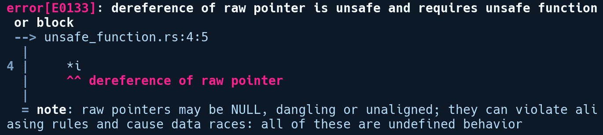
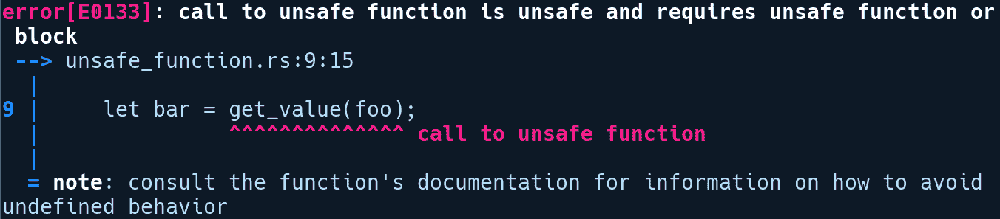
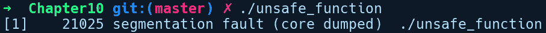
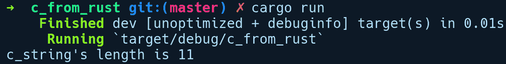
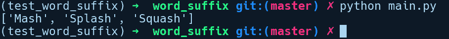
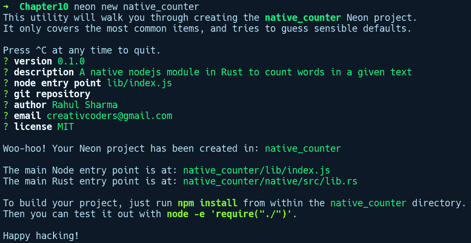

# 不安全的 Rust 和外部函数接口

Rust 是一种具有两种模式的语言：安全模式（默认模式）和不安全模式。在安全模式下，你将获得各种安全特性来保护你免受严重错误的影响，但有时你需要摆脱编译器提供的安全束缚，获得额外的控制级别。一个用例是与其他语言（如 C 语言）交互，这可能会非常不安全。在本章中，你将了解当 Rust 需要与其他语言交互时需要做哪些额外的工作，以及如何使用不安全模式来促进并明确这种交互。

本章将涵盖以下主题：

+   理解安全和不安全模式

+   Rust 中不安全的操作

+   外部函数接口，与 C 语言通信以及反之

+   使用 PyO3 与 Python 交互

+   使用 Neon 与 Node.js 交互

# 什么是真正的安全和不安全？

“你可以这样做，但你最好知道你在做什么。”

- *Rustacean*

当我们谈论编程语言中的安全性时，这是一个跨越不同级别的属性。一种语言可以是内存安全的、类型安全的，或者它可以具有并发安全。内存安全意味着程序不会写入禁止的内存地址，也不会访问无效的内存。类型安全意味着程序不允许你将数字赋值给字符串变量，并且这个检查发生在编译时，而并发安全意味着程序在多个线程执行并修改共享状态时不会导致竞争条件。如果一个语言本身提供了所有这些级别的安全性，那么它就被认为是安全的。更普遍地说，如果一个程序在所有可能的执行和所有可能的输入下都能给出正确的输出，不会导致崩溃，并且不会损坏或破坏其内部或外部状态，那么这个程序被认为是安全的。在 Rust 的安全模式下，这确实是正确的！

一个不安全的程序是指在运行时违反了不变性或触发了未定义行为的程序。这些不安全的效果可能仅限于函数内部，也可能在程序中作为全局状态传播开来。其中一些是由程序员自己造成的，例如逻辑错误，而另一些则可能是由于所使用的编译器实现的副作用，有时甚至来自语言规范本身。**不变性**是在程序执行过程中，所有代码路径上必须始终为真的条件。最简单的例子是，指向堆上对象的指针在代码的某个部分内不应为空。如果这个不变性被打破，依赖于该指针的代码可能会取消引用它并发生崩溃。像 C/C++这样的语言以及基于它们的语言是不安全的，因为编译器规范中将相当多的操作归类为未定义行为。未定义行为是在程序中遇到编译器规范未指定在较低级别发生什么的情况的效果，你可以自由地假设任何事情都可能发生。未定义行为的一个例子是使用未初始化的变量。考虑以下 C 代码：

```rs
// both_true_false.c

int main(void) {
    bool var;
    if (var) {
        fputs("var is true!\n");
    }
    if (!var) {
        fputs("var is false!\n");
    }
    return 0;
}
```

这个程序的输出在不同的 C 编译器实现中可能不同，因为使用未初始化的变量是一个未定义的操作。在某些启用了某些优化的 C 编译器上，你甚至可能会得到以下输出：

```rs
var is true
var is false
```

在生产环境中看到你的代码采取这种不可预测的代码路径是不希望看到的。C 中未定义行为的另一个例子是超出大小为`n`的数组末尾写入。当写入发生到内存中的`n + 1`偏移量时，程序可能会崩溃或修改随机的内存位置。在最佳情况下，程序会立即崩溃，你会了解到这一点。在最坏的情况下，程序可能会继续运行，但可能会后来损坏代码的其他部分并给出错误的结果。C 中的未定义行为最初存在是为了允许编译器优化代码以获得性能，并假设某些边缘情况永远不会发生，因此不添加错误检查代码来处理这些情况，以避免与错误处理相关的开销。如果可以将未定义行为转换为编译时错误那就太好了，但有时在编译时检测这些行为可能会变得资源密集，因此不这样做可以保持编译器实现简单。

现在，当 Rust 需要与这些语言交互时，它对这些语言中函数调用和类型在较低级别如何表示了解得非常有限，并且由于未定义行为可能在意想不到的地方发生，它回避了所有这些陷阱，并提供了一个特殊的`unsafe {}`块来与来自其他语言的元素交互。在`unsafe`模式下，你获得了一些额外的能力来做一些在 C/C++中会被视为未定义行为的事情。然而，权力越大，责任越大。一个在其代码中使用`unsafe`的开发者必须小心在`unsafe`块中执行的操作。在 Rust 的`unsafe`模式下，责任在你身上。Rust 信任程序员保持操作的安全性。幸运的是，这个`unsafe`特性是以非常受控的方式提供的，并且通过阅读代码很容易识别，因为`unsafe`代码总是用`unsafe`关键字或`unsafe {}`块进行注释。这与 C 语言不同，在 C 语言中，大多数事情都可能是不安全的。

现在，重要的是要提到，虽然 Rust 提供了保护你免受程序中主要不安全情况的方法，但也有 Rust 无法救你出来的情况，即使你编写的程序是安全的。这些是存在如下逻辑错误的情况：

+   一个程序使用浮点数来表示货币。然而，浮点数并不精确，会导致舍入误差。这种错误在一定程度上是可以预测的（因为，给定相同的输入，它总是以相同的方式表现出来）并且容易修复。这是一个逻辑和实现错误，Rust 对此类错误不提供保护。

+   控制航天器的程序使用原始数字作为函数中的参数来计算距离度量。然而，一个库可能提供了一个 API，其中距离是以公制系统解释的，而用户可能提供英制系统的数字，从而导致无效的测量。1999 年，在 NASA 的火星气候轨道器航天器中就发生了类似的错误，造成了近 1250 万美元的损失。Rust 虽然不能完全保护你免犯此类错误，但借助枚举和 newtype 模式等类型系统抽象，我们可以将不同的单位彼此隔离，并限制 API 的表面仅限于有效操作，从而使这种错误的可能性大大降低。

+   一个程序在没有适当的锁定机制的情况下从多个线程写入共享数据。错误以不可预测的方式表现出来，找到它可能非常困难，因为它是非确定性的。在这种情况下，Rust 通过其所有权和借用规则完全保护你免受数据竞争的影响，这些规则也适用于并发代码，但它不能为你检测死锁。

+   一个程序通过指针访问一个对象，在某些情况下，这个指针是空指针，导致程序崩溃。在安全模式下，Rust 完全保护您免受空指针的影响。然而，当使用不安全模式时，程序员必须确保来自其他语言的指针操作是安全的。

Rust 的不安全特性在程序员比编译器更了解情况，并且必须在其代码中实现一些复杂部分的情况下也是必需的，在这些情况下，编译时所有权规则变得过于严格，并阻碍了操作。例如，假设有一个需要将字节序列转换为`String`值的情况，并且您知道您的`Vec<u8>`是一个有效的 UTF-8 序列。在这种情况下，您可以直接使用不安全的`String::from_utf_unchecked`方法，而不是通常的安全`String::from_utf8`方法，以绕过在`from_utf8`方法中检查有效 UTF-8 的额外开销，并可以略微提高速度。此外，在进行底层嵌入式系统开发或任何与操作系统内核交互的程序时，您需要切换到不安全模式。然而，并非所有内容都需要不安全模式，并且有几个操作是 Rust 编译器视为不安全的。它们如下：

+   更新可变静态变量

+   解引用原始指针，例如`*const T`和`*mut T`

+   调用不安全函数

+   从联合类型中读取值

+   在`extern`块中调用声明的函数——来自其他语言的项

在上述情况下，一些内存安全保证被放宽，但借用检查器在这些操作中仍然活跃，并且所有的作用域和所有权规则仍然适用。Rust 关于不安全的文档[`doc.rust-lang.org/stable/reference/unsafety.html`](https://doc.rust-lang.org/stable/reference/unsafety.html)区分了被认为是未定义的和不是不安全的。当您执行上述操作时，为了容易区分，Rust 要求您使用`unsafe`关键字。它只允许少数地方被标记为`unsafe`，如下所示：

+   函数和方法

+   不安全块表达式，例如`unsafe {}`

+   特性

+   实现块

# 不安全函数和块

让我们来看看不安全函数和块，从不安全函数开始：

```rs
// unsafe_function.rs

fn get_value(i: *const i32) -> i32 { 
    *i
}

fn main() {
    let foo = &1024 as *const i32;
    let _bar = get_value(foo);
}
```

我们定义了一个`get_value`函数，它接受一个指向`i32`值的指针，它通过解引用简单地返回指向的值。在`main`中，我们将`foo`传递给`get_value`，它是`1024`转换为`*const i32`的`i32`值的引用。如果我们尝试运行这个程序，编译器会显示以下信息：



正如我们之前所说的，我们需要一个`unsafe`函数或块来解引用原始指针。让我们按照第一个建议，在我们的函数前添加`unsafe`：

```rs
unsafe fn get_value(i: *const i32) -> i32 { 
    *i
}
```

现在，让我们再次尝试运行这个程序：



有趣！我们消除了`get_value`函数上的错误，但现在在`main`函数的`call`位置显示了另一个错误。调用不安全函数需要我们在其中包裹一个`unsafe`块。这是因为除了 Rust 的不安全函数之外，不安全函数还可以是声明在`extern`块中的其他语言的函数。这些函数可能或可能不会返回调用者期望的值，或者返回一个完全损坏的值。因此，在调用不安全函数时，我们需要`unsafe`块。我们修改我们的代码，在`unsafe`块中调用`get_value`，如下所示：

```rs
fn main() {
    let foo = &1024 as *const i32;
    let bar = unsafe { get_value(foo) };
}
```

`unsafe`块是表达式，所以我们从`get_value`之后移除分号，并将其移到`unsafe`块之外，这样`get_value`的返回值就被分配给了`bar`。有了这个变化，我们的程序就可以编译了。

不安全函数的行为与普通函数类似，但它在其中允许上述操作，并且将你的函数声明为`unsafe`会使它无法从普通的安全函数中调用。然而，我们也可以将`get_value`写成另一种方式：

```rs
fn get_value(i: *const i32) -> i32 { 
    unsafe { 
        *i 
    }
}
```

这看起来与之前相似，但有一个显著的变化。我们将`unsafe`关键字从函数签名移动到了一个内部的`unsafe`块中。现在，函数执行相同的非安全操作，但将其封装在一个看起来就像普通的安全函数的函数中。现在，这个函数可以在调用者侧不需要不安全块的情况下被调用。这种技术通常用于提供看起来安全的库接口，尽管它们在内部执行不安全操作。显然，如果你这样做，你应该特别小心确保`unsafe`块是正确的。标准库中有相当多的 API 使用这种在`unsafe`块中隐藏操作，同时在表面上提供安全 API 的模式。例如，`String`类型的`insert`方法，它将字符`ch`插入到指定的索引`idx`处，定义如下：

```rs
// https://doc.rust-lang.org/src/alloc/string.rs.html#1277-1285

pub fn insert(&mut self, idx: usize, ch: char) {
    assert!(self.is_char_boundary(idx));
    let mut bits = [0; 4];
    let bits = ch.encode_utf8(&mut bits).as_bytes();
    unsafe {
        self.insert_bytes(idx, bits);
    }
}
```

首先，它会检查传递给它的`idx`是否位于 UTF-8 编码的代码点序列的开始或结束位置。然后，它将传递给它的`ch`编码为一系列字节。最后，它在`unsafe`块中调用一个不安全的方法`insert_bytes`，传递`idx`和`bits`。

标准库中有许多类似的 API，它们的实现方式相似，它们在内部依赖于不安全块，要么是为了获得速度提升，要么是因为它们需要可变访问值的各个部分，因为所有权阻碍了这种情况。

现在，如果我们从之前的代码片段中调用我们的`get_value`函数，并传递一个数字作为参数，然后将其转换为指针，你就可以猜到接下来会发生什么：

```rs
unsafe_function(4 as *const i32); 
```

运行这段代码会得到以下输出：



这是一个明显的段错误信息！从这个观察结果中可以得出的结论是，即使`unsafe`函数在外观上看起来是安全的，如果用户提供了格式不正确的值，它也可能被无意或故意地误用。因此，如果你需要从你的库中公开一个不安全的 API，其中操作的安全性依赖于用户提供的参数，作者应该清楚地记录这一点，以确保他们没有传递无效的值，并且应该用`unsafe`标记函数，而不是在内部使用`unsafe`块。

在`unsafe`块后面的安全包装函数实际上不应该暴露给消费者，而应该主要用于在库中隐藏实现细节，就像许多标准库 API 实现的情况一样。如果你不确定你是否已经成功创建了一个围绕不安全部分的安全包装，你应该将这个函数标记为`unsafe`。

# 不安全特性和实现

除了函数之外，特性也可以被标记为不安全。我们为什么需要不安全特性并不明显。不安全特性最初存在的一个主要动机是标记那些不能发送到或在不同线程之间共享的类型。这是通过不安全的`Send`和`Sync`标记特性实现的。这些类型也是自动特性，这意味着在适当的时候，它们会被实现为标准库中的大多数类型。然而，它们也被明确地排除在某些类型之外，例如`Rc<T>`。`Rc<T>`没有原子引用计数机制，如果它实现了`Sync`并在多个线程中使用，我们可能会得到错误的类型引用计数，这可能导致提前释放和悬挂指针。将`Send`和`Sync`标记为`unsafe`将责任放在了开发者身上，即只有当他们在自定义类型中实现了适当的同步时，才应该实现它。`Send`和`Sync`被标记为`unsafe`是因为为没有明确的语义来描述类型在从多个线程中突变时的行为的类型实现它们是不正确的。

将特性标记为不安全的另一个动机是通过类型族封装可能具有未定义行为的操作。正如我们之前提到的，特性本质上用于指定实现类型必须遵守的契约。现在，假设你的类型包含来自 FFI 边界的实体，即包含 C 字符串引用的字段，并且你有许多这样的类型。在这种情况下，我们可以通过使用不安全特性来抽象这些类型的操作，然后我们可以有一个泛型接口，它接受实现此不安全特性的类型。Rust 标准库中的一个这样的例子是`Searcher`特性，它是`Pattern`特性的关联类型，定义在[`doc.rust-lang.org/std/str/pattern/trait.Pattern.html`](https://doc.rust-lang.org/std/str/pattern/trait.Pattern.html)。`Searcher`特性是一个不安全特性，它抽象了从给定字节序列中搜索项的概念。`Searcher`的一个实现者是`CharSearcher`结构体。将其标记为`unsafe`消除了`Pattern`特性在有效 UTF-8 字节边界上检查有效切片的负担，并且可以在字符串匹配中带来一些性能提升。

在了解了不安全特性的动机之后，让我们看看我们如何定义和使用不安全特性。将特性标记为不安全并不会使你的方法变得不安全。我们可以有不安全特性，它们有安全的方法。反之亦然；我们可以有一个安全的特性，它可以在其中包含不安全的方法，但这并不表示该特性是不安全的。不安全特性与函数的表示方式相同，只需在它们前面加上`unsafe`关键字：

```rs
// unsafe_trait_and_impl.rs

struct MyType;

unsafe trait UnsafeTrait { 
    unsafe fn unsafe_func(&self);
    fn safe_func(&self) {
        println!("Things are fine here!");
    }
}

trait SafeTrait {
    unsafe fn look_before_you_call(&self);
}

unsafe impl UnsafeTrait for MyType {
    unsafe fn unsafe_func(&self) {
        println!("Highly unsafe");
    }
}

impl SafeTrait for MyType {
    unsafe fn look_before_you_call(&self) {
        println!("Something unsafe!");
    }
}

fn main() {
    let my_type = MyType;
    my_type.safe_func();
    unsafe {
        my_type.look_before_you_call();
    }
}
```

在前面的代码中，我们有许多包含不安全特性和方法的变体。首先，我们有两种特性声明：`UnsafeTrait`，这是一个不安全的特性，而`SafeTrait`是安全的。我们还有一个名为`MyType`的单例结构体，它实现了这两个特性。正如你所见，不安全特性需要`unsafe`前缀来实现`MyType`，这样让实现者知道他们必须遵守特性所期望的契约。在`MyType`上的`SafeTrait`的第二种实现中，我们有一个需要在`unsafe`块内调用的不安全方法，正如我们在`main`函数中所见。

在接下来的章节中，我们将探讨一些语言以及 Rust 如何与它们交互。Rust 提供的相关 API 和抽象，用于在语言之间安全地双向通信，通常被称为**外部函数接口**（**FFI**）。作为标准库的一部分，Rust 为我们提供了内置的 FFI 抽象。在这些抽象之上构建的包装库提供了无缝的跨语言交互。

# 从 Rust 调用 C 代码

首先，我们将看看一个从 Rust 调用 C 代码的例子。我们将创建一个新的二进制包，从该包中我们将调用定义在单独的 C 文件中的我们的 C 函数。让我们通过运行 `cargo new c_from_rust` 来创建一个新的项目。在目录内，我们还将添加我们的 C 源文件，即 `mystrlen.c` 文件，其内部代码如下：

```rs
// c_from_rust/mystrlen.c

unsigned int mystrlen(char *str) { 
    unsigned int c; 
    for (c = 0; *str != '\0'; c++, *str++); 
    return c; 
} 
```

它包含一个简单的函数，`mystrlen`，该函数返回传递给它的字符串的长度。我们希望从 Rust 中调用 `mystrlen`。为此，我们需要将这个 C 源文件编译成一个静态库。在下一节中，我们还有一个例子，其中我们将介绍如何动态链接到共享库。我们将在 `Cargo.toml` 文件中将 `cc` 包用作构建依赖项：

```rs
# c_from_rust/Cargo.toml

[build-dependencies]
cc = "1.0"
```

`cc` 包负责编译和链接我们的 C 源文件与我们的二进制文件，并使用正确的链接器标志。为了指定我们的构建命令，我们需要在包根目录下放置一个 `build.rs` 文件，其内容如下：

```rs
// c_from_rust/build.rs

fn main() {
    cc::Build::new().file("mystrlen.c")
                    .static_flag(true)
                    .compile("mystrlen");
}
```

我们创建了一个新的 `Build` 实例，并在给我们的静态对象文件命名之前，将 C 源文件名和静态标志设置为 `true` 传递给 `compile` 方法。Cargo 在编译任何项目文件之前，都会运行任何 `build.rs` 文件的内容。在运行 `build.rs` 中的代码时，`cc` 包会自动在 C 库中追加传统的 `lib` 前缀，因此我们的编译后的静态库生成在 `target/debug/build/c_from_rust-5c739ceca32833c2/out/libmystrlen.a`。

现在，我们还需要让 Rust 知道我们的 `mystrlen` 函数的存在。我们通过使用 `extern` 块来实现，这样我们就可以指定来自其他语言的项。我们的 `main.rs` 文件如下：

```rs
// c_from_rust/src/main.rs

use std::os::raw::{c_char, c_uint};
use std::ffi::CString; 

extern "C" { 
    fn mystrlen(str: *const c_char) -> c_uint; 
}

fn main() { 
    let c_string = CString::new("C From Rust").expect("failed"); 
    let count = unsafe { 
        mystrlen(c_string.as_ptr()) 
    }; 
    println!("c_string's length is {}", count);
}
```

我们从 `std::os::raw` 模块中导入了一些与原始 C 类型兼容的类型，并且它们的名称接近它们的 C 对应类型。对于数值类型，类型前的单个字母表示该类型是否是无符号的。例如，无符号整数定义为 `c_uint`。在我们的 `extern` 声明 `mystrlen` 中，我们以 `*const c_char` 作为输入，这相当于 C 中的 `char *`，并以 `c_uint` 作为输出，这映射到 C 中的 `unsigned int`。我们还从 `std::ffi` 模块中导入了 `CString` 类型，因为我们需要将一个与 C 兼容的字符串传递给 `mystrlen` 函数。`std::ffi` 模块包含了一些常用的实用工具和类型，使得跨语言交互变得容易。

如您可能已注意到，在`extern`块中，我们跟随着一个字符串`"C"`。这个`"C"`指定了我们希望编译器的代码生成器符合 C ABI（`cdecl`），以便函数调用约定与从 C 进行的函数调用完全一致。**应用二进制接口**（***ABI**）基本上是一套规则和约定，它规定了在较低级别如何表示和处理类型和函数。函数调用约定是 ABI 规范的一个方面。它与库消费者对 API 的含义非常相似。在函数的上下文中，API 指定了你可以从库中调用的函数，而 ABI 指定了调用函数的较低级机制。调用约定定义了诸如函数参数是存储在寄存器中还是堆栈上，以及调用者在函数返回时是否清除寄存器/堆栈状态，以及其他细节。我们也可以忽略指定这一点，因为`"C"`（`cdecl`）是 Rust 中`extern`块中声明的项目的默认 ABI。`cdecl`是一种大多数 C 编译器用于函数调用的调用约定。Rust 还支持其他 ABI，如`fastcall`、`cdecl`、`win64`等，并且需要根据目标平台在`extern`块之后指定。

在我们的`main`函数中，我们使用`std::ffi`模块中的一个特殊版本的`CString`字符串，因为 C 中的字符串是空终止的，而 Rust 中的字符串不是。`CString`为我们执行所有检查，以提供一个与 C 兼容的字符串版本，其中字符串中间没有空`0`字节字符，并确保结尾字节是一个`0`字节。`ffi`模块包含两种主要的字符串类型：

+   `std::ffi::CStr`表示一个类似于`&str`的借用 C 字符串。它可以用来引用在 C 中创建的字符串。

+   `std::ffi::CString`表示一个与外国 C 函数兼容的所有权字符串。它通常用于将字符串从 Rust 代码传递到外国 C 函数。

由于我们希望从 Rust 一侧将字符串传递到我们刚刚定义的函数，所以我们在这里使用了`CString`类型。随后，我们在一个不安全块中调用`mystrlen`，将`c_string`作为指针传递。然后我们将字符串长度打印到标准输出。

现在，我们只需要运行`cargo run`。我们得到以下输出：



`cc` 包会自动确定要调用的正确 C 编译器。在我们的例子中，在 Ubuntu 上，它会自动调用 `gcc` 来链接我们的 C 库。现在，这里有一些需要改进的地方。首先，我们必须在一个 `unsafe` 块中调用函数，这很尴尬，因为我们知道这并不是不安全的。我们知道我们的 C 实现是可靠的，至少对于这个小的函数来说是这样。其次，如果 `CString` 创建失败，我们会引发 panic。为了解决这个问题，我们可以创建一个安全的包装器函数。在简单形式下，这意味着创建一个函数，在该函数中调用外部函数，并将其放在 `unsafe` 块内部：

```rs
fn safe_mystrlen(str: &str) -> Option<u32> { 
    let c_string = match CString::new(str) { 
        Ok(c) => c, 
        Err(_) => return None 
    };

    unsafe { 
        Some(mystrlen(c_string.as_ptr())) 
    } 
} 
```

我们的 `safe_mystrlen` 函数现在返回一个 `Option`，如果 `CString` 创建失败，则返回 `None`，然后调用包裹在 `unsafe` 块中的 `mystrlen`，并作为 `Some` 返回。调用 `safe_mystrlen` 的感觉就像调用任何其他 Rust 函数一样。如果可能的话，建议围绕外部函数创建安全的包装器，确保在 `unsafe` 块内部发生的所有异常情况都得到妥善处理，这样库的用户就不会在他们的代码中使用 `unsafe`。

# 从 C 调用 Rust 代码

如我们在上一节所述，当 Rust 库通过 `extern` 块将它们的函数暴露给其他语言时，它们默认暴露 C ABI (`cdecl`)。因此，从 C 调用 Rust 代码变得非常无缝。我们将通过一个从 C 程序调用 Rust 代码的例子来查看。让我们通过运行 `cargo new rust_from_c --lib` 来创建一个 cargo 项目。

在我们的 `Cargo.toml` 文件中，我们有以下项目：

```rs
# rust_from_c/Cargo.toml

[package]
name = "rust_from_c"
version = "0.1.0"
authors = ["Rahul Sharma <creativcoders@gmail.com>"]
edition = "2018"

[lib]
name = "stringutils"
crate-type = ["cdylib"]
```

在 `[lib]` 部分，我们指定了 crate 为 `cdylib`，这表示我们想要生成一个可动态加载的库，这在 Linux 中更常见地被称为共享对象文件（`.so`）。我们为我们的 `stringutils` 库指定了一个显式的名称，这将用于创建共享对象文件。

现在，让我们看看我们在 `lib.rs` 中的实现：

```rs
// rust_from_c/src/lib.rs

use std::ffi::CStr;
use std::os::raw::c_char;

#[repr(C)]
pub enum Order {
    Gt,
    Lt,
    Eq
}

#[no_mangle]
pub extern "C" fn compare_str(a: *const c_char, b: *const c_char) -> Order {
    let a = unsafe { CStr::from_ptr(a).to_bytes() };
    let b = unsafe { CStr::from_ptr(b).to_bytes() };
    if a > b {
        Order::Gt
    } else if a < b {
        Order::Lt
    } else {
        Order::Eq
    }
}
```

我们有一个单独的函数，`compare_str`。我们使用`extern`关键字将其暴露给 C 语言，然后指定编译器为生成适当的代码指定`"C"` ABI。我们还需要添加一个`#[no_mangle]`属性，因为 Rust 默认情况下会为函数名添加随机字符以防止模块和 crate 之间类型和函数名称冲突。这被称为名称混淆。如果没有这个属性，我们就无法通过`compare_str`这个名字来调用我们的函数。我们的函数按照字典顺序比较传递给它的两个 C 字符串，并相应地返回一个枚举，`Order`，它有三个变体：`Gt`（大于）、`Lt`（小于）和`Eq`（等于）。正如你可能已经注意到的，枚举定义有一个`#[repr(C)]`属性。因为这个枚举是要返回到 C 端的，我们希望它以与 C 枚举相同的方式表示。`repr`属性允许我们做到这一点。在 C 端，我们将得到一个`uint_32`类型作为这个函数的返回类型，因为 Rust 和 C 中枚举变体都是以 4 字节表示的。请注意，在撰写这本书的时候，Rust 对于具有关联数据的枚举遵循与 C 枚举相同的数据布局。然而，这可能在将来发生变化。

现在，让我们创建一个名为`main.c`的文件，它使用我们从 Rust 暴露的函数：

```rs
// rust_from_c/main.c

#include <stdint.h>
#include <stdio.h>

int32_t compare_str(const char* value, const char* substr);

int main() {
    printf("%d\n", compare_str("amanda", "brian"));
    return 0;
}
```

我们像任何正常的原型声明一样声明了`compare_str`函数的原型。随后，我们在`main`中调用了`compare_str`，传递了我们的两个字符串值。请注意，如果我们传递的是在堆上分配的字符串，我们还需要从 C 端释放它。在这种情况下，我们传递的是一个 C 字符串字面量，它位于进程的数据段中，所以我们不需要进行任何释放调用。现在，我们将创建一个简单的`Makefile`，它构建我们的`stringutils` crate，并编译和链接我们的`main.c`文件：

```rs
# rust_from_c/Makefile

main:
    cargo build
    gcc main.c -L ./target/debug -lstringutils -o main
```

现在，我们可以运行`make`来构建我们的 crate，然后通过首先设置我们的`LD_LIBRARY_PATH`指向我们的生成的`libstringutils.so`所在的位置来运行`main`。之后，我们可以这样运行`main`：

```rs
$ export LD_LIBRARY_PATH=./target/debug
$ ./main
```

这给我们一个输出`1`，这是 Rust 端的`Order`枚举中`Lt`变体的值。从这个例子中我们可以得到的启示是，当你从 C/C++或其他在 Rust 中有支持 ABI 的语言调用 Rust 函数时，我们不能将 Rust 特定的数据类型传递到 FFI 边界。例如，传递带有关联数据的`Option`或`Result`类型是没有意义的，因为 C 无法解释和从中提取值，因为它没有知道这些数据的方式。在这种情况下，我们需要将原始值作为函数的返回类型传递到 C 端，或者将我们的 Rust 类型转换为 C 可以理解的形式。

现在，让我们考虑之前从 Rust 调用 C 代码的案例。按照手动方式，我们需要为所有在头文件中声明的 API 编写 `extern` 声明。如果能自动完成这项工作那就太好了。接下来，我们将看看如何实现这一点！

# 在 Rust 中使用外部 C/C++ 库

考虑到过去三十年中编写的软件数量，大量的系统软件是用 C/C++ 编写的。你可能会想链接到一个用 C/C++ 编写的现有库，用于 Rust 的项目中，尽管在 Rust 中重写一切（尽管是可取的）对于复杂项目来说并不实际。但与此同时，为这些库编写手动 FFI 绑定也是痛苦且容易出错的。幸运的是，我们有工具可以自动生成 C/C++ 库的绑定。对于这个演示，Rust 端所需的代码比之前从 Rust 调用 C/C++ 代码的例子要简单得多，因为这次我们将使用一个叫做 **bindgen** 的整洁的 crate，它可以从 C/C++ 库中自动生成 FFI 绑定。如果你想要集成一个具有大量 API 的复杂库，bindgen 是推荐的工具。手动编写这些绑定可能会非常容易出错，而 bindgen 通过自动化这个过程来帮助我们。我们将使用这个 crate 为一个简单的 C 库 `levenshtein.c` 生成绑定，该库可以在 [`github.com/wooorm/levenshtein.c`](https://github.com/wooorm/levenshtein.c) 找到，它用于找到两个字符串之间的最小编辑距离。编辑距离被广泛应用于各种应用中，如模糊字符串匹配、自然语言处理和拼写检查器。无论如何，让我们通过运行 `cargo new edit_distance --lib` 来创建我们的 cargo 项目。

在使用 bindgen 之前，我们需要安装一些依赖项，因为 bindgen 需要它们：

```rs
$ apt-get install llvm-3.9-dev libclang-3.9-dev clang-3.9
```

接下来，在我们的 `Cargo.toml` 文件中，我们将添加对 `bindgen` 和 `cc` crate 的 `build` 依赖项：

```rs
# edit_distance/Cargo.toml

[build-dependencies]
bindgen = "0.43.0"
cc = "1.0"
```

`bindgen` crate 将用于从 `levenshtein.h` 头文件生成绑定，而 `cc` crate 将用于将我们的库编译为共享对象，以便我们可以从 Rust 中使用它。我们的库相关文件位于 crate 根目录下的 `lib` 文件夹中。

接下来，我们将创建一个 `build.rs` 文件，该文件将在编译任何源文件之前运行。它将完成两件事：首先，它将编译 `levenshtein.c` 到一个共享对象（`.so`）文件，其次，它将为 `levenshtein.h` 文件中定义的 API 生成绑定：

```rs
// edit_distance/build.rs

use std::path::PathBuf;

fn main() {
    println!("cargo:rustc-rerun-if-changed=.");
    println!("cargo:rustc-link-search=.");
    println!("cargo:rustc-link-lib=levenshtein");

    cc::Build::new()
        .file("lib/levenshtein.c")
        .out_dir(".")
        .compile("levenshtein.so");

    let bindings = bindgen::Builder::default()
        .header("lib/levenshtein.h")
        .generate()
        .expect("Unable to generate bindings");

    let out_path = PathBuf::from("./src/");
    bindings.write_to_file(out_path.join("bindings.rs")).expect("Couldn't write bindings!");
}
```

在前面的代码中，我们告诉 Cargo 我们的库搜索路径是当前目录，我们正在链接的库名为 `levenshtein`。我们还告诉 Cargo，如果当前目录中的任何文件发生变化，则重新运行 `build.rs` 中的代码：

```rs
println!("cargo:rustc-rerun-if-changed=.");
println!("cargo:rustc-link-search=.");
println!("cargo:rustc-link-lib=levenshtein");
```

在此之后，我们通过创建一个新的 `Build` 实例来为我们的库创建一个编译管道，并为 `file` 方法提供适当的 C 源文件。我们还设置了输出目录为 `out_dir`，并将我们的库名称设置为 `compile` 方法：

```rs
cc::Build::new().file("lib/levenshtein.c")
                .out_dir(".")
                .compile("levenshtein");
```

接下来，我们创建一个 bindgen `Builder`实例，传递我们的头文件位置，调用`generate()`，然后在调用`write_to_file`之前将其写入一个`bindings.rs`文件：

```rs
let bindings = bindgen::Builder::default().header("lib/levenshtein.h")
                                          .generate()
                                          .expect("Unable to generate bindings");
```

现在，当我们运行`cargo build`时，一个`bindings.rs`文件将在`src/`下生成。正如我们之前提到的，对于所有暴露 FFI 绑定的库来说，提供一个安全包装是一个好的实践。因此，在`src/lib.rs`下，我们将创建一个名为`levenshtein_safe`的函数，该函数封装了从`bindings.rs`中的不安全函数：

```rs
// edit_distance/src/lib.rs

mod bindings;

use crate::bindings::levenshtein;
use std::ffi::CString;

pub fn levenshtein_safe(a: &str, b: &str) -> u32 {
    let a = CString::new(a).unwrap();
    let b = CString::new(b).unwrap();
    let distance = unsafe { levenshtein(a.as_ptr(), b.as_ptr()) };
    distance
}
```

我们从`bindings.rs`导入不安全函数，将其封装在我们的`levenshtein_safe`函数中，并在一个`unsafe`块中调用我们的`levenshtein`函数，传递与 C 兼容的字符串。现在是测试我们的`levenshtein_safe`函数的时候了。我们将在我们的 crate 根目录下的`examples/`目录中创建一个`basic.rs`文件，其代码如下：

```rs
// edit_distance/examples/basic.rs

use edit_distance::levenshtein_safe;

fn main() {
    let a = "foo";
    let b = "fooo";
    assert_eq!(1, levenshtein_safe(a, b));
}
```

我们可以使用`cargo run --example basic`来运行它，并且应该看到没有断言失败，因为从`levenshtein_safe`调用中得到的值应该是`1`。现在，对于这类 crate，建议在它们后面添加后缀`sys`，这样只包含 FFI 绑定。`crates.io`上的大多数 crate 都遵循这个约定。这简要介绍了如何使用 bindgen 来自动化跨语言交互。如果您想要类似自动化反向 FFI 绑定，例如 Rust 在 C 中，还有一个名为`cbindgen`的等效项目，位于[`github.com/eqrion/cbindgen`](https://github.com/eqrion/cbindgen)，它可以生成 Rust crate 的 C 头文件。例如，`Webrender`使用这个 crate 将其 API 暴露给其他语言。鉴于 C 的遗产，它是编程语言的通用语言，Rust 对其提供了第一级支持。许多其他语言也调用 C。这意味着您的 Rust 代码可以从所有以 C 为目标的其他语言中调用。让我们让其他语言与 Rust 通信。

# 使用 PyO3 创建原生 Python 扩展

在本节中，我们将看到 Python 也可以调用 Rust 代码。Python 社区一直是诸如 numpy、lxml、opencv 等原生模块的重量级用户，其中大部分都有其底层实现是在 C 或 C++中。将 Rust 作为原生 C/C++模块的替代品，对于许多 Python 项目来说，在速度和安全方面都是一个主要优势。对于演示，我们将构建一个在 Rust 中实现的原生 Python 模块。我们将使用`pyo3`，这是一个流行的项目，它为 Python 解释器提供 Rust 绑定，并隐藏所有底层细节，从而提供了一个非常直观的 API。该项目位于 GitHub 上[`github.com/PyO3/pyo3`](https://github.com/PyO3/pyo3)。它支持 Python 2 和 Python 3 版本。`pyo3`是一个快速发展的目标，在撰写本书时仅在 nightly 版本上工作。因此，我们将使用`pyo3`的一个特定版本，即`0.4.1`，以及 Rust 编译器的特定 nightly 版本。

通过运行 `cargo new word_suffix --lib` 来创建一个新的货物项目。这个库包将暴露一个名为 `word_suffix` 的 Python 模块，其中包含一个名为 `find_words` 的单个函数，该函数接受一个以逗号分隔的单词字符串，并返回所有以给定后缀结尾的单词。一旦我们构建了我们的模块，我们就能像导入普通 Python 模块一样导入这个模块。

在我们开始实现之前，我们需要切换到为这个项目特定的 nightly Rust 工具链，即 `rustc 1.30.0-nightly (33b923fd4 2018-08-18)`。我们可以通过在当前目录（`word_suffix/`）中运行 `rustup override set nightly-2018-08-19` 来覆盖工具链，以使用这个特定的 nightly 版本。

为了开始，我们将在我们的 `Cargo.toml` 文件中指定我们的依赖项：

```rs
# word_suffix/Cargo.toml

[package]
name = "word_suffix"
version = "0.1.0"
authors = ["Rahul Sharma <creativcoders@gmail.com>"]

[dependencies]
pyo3 = "0.4"

[lib]
crate-type = ["cdylib"]
```

我们在这里添加了我们的唯一依赖项 `pyo3`。如您所见，在 `[lib]` 部分，我们指定了 `crate-type` 为 `cdylib`，这意味着生成的库类似于 C 共享库（Linux 中的 `.so`），Python 已经知道如何调用它。

现在，让我们在我们的 `lib.rs` 文件中开始实现：

```rs
// word_suffix/src/lib.rs

//! A demo python module in Rust that can extract words
//! from a comma seperated string of words that ends with the given suffix

#[macro_use]
extern crate pyo3;
use pyo3::prelude::*;

/// This module is a python module implemented in Rust.
#[pymodinit]
fn word_suffix(_py: Python, module: &PyModule) -> PyResult<()> {
    module.add_function(wrap_function!(find_words))?;
    Ok(())
}

#[pyfunction]
fn find_words(src: &str, suffix: &str) -> PyResult<Vec<String>> {
    let mut v = vec![];
    let filtered = src.split(",").filter_map(|s| {
        let trimmed = s.trim();
        if trimmed.ends_with(&suffix) {
            Some(trimmed.to_owned())
        } else {
            None
        }
    });

    for s in filtered {
        v.push(s);
    }
    Ok(v)
}
```

首先，我们导入了我们的 `pyo3` 包，以及来自 `prelude` 模块的 Python 相关类型。然后，我们定义了一个 `word_suffix` 函数，并使用 `#[pymodinit]` 属性对其进行注释。这成为我们的 Python 模块，我们可以在任何 `.py` 文件中导入它。此函数接收两个参数。第一个参数是 `Python`，这是一个标记类型，对于 `pyo3` 中的大多数 Python 相关操作都是必需的。这用于指示特定操作会修改 Python 解释器状态。第二个参数是 `PyModule` 实例，它表示一个 Python 模块对象。通过此实例，我们添加我们的 `find_words` 函数，通过调用 `add_function` 并在 `wrap_function` 宏中包装它来添加。`wrap_function` 宏对提供的 Rust 函数进行一些操作，将其转换为 Python 兼容的函数。

接下来是我们的 `find_words` 函数，这是这里的重要部分。我们使用 `#[pyfunction]` 属性将其包装起来，该属性对函数的参数和返回类型进行转换，使其与 Python 函数兼容。我们的 `find_words` 实现很简单。首先，我们创建一个向量 `v` 来保存过滤后的单词列表。然后，我们通过在 `","` 上分割 `src` 字符串，然后进行 `filter` 和 `map` 操作来过滤我们的 `src` 字符串。`split(",")` 调用返回一个迭代器，我们对它调用 `filter_map` 方法。此方法接收一个包含分割单词 `s` 的闭包作为参数。我们首先通过调用 `s.trim()` 从 `s` 中移除任何空白字符，然后检查它是否 `ends_with` 我们提供的后缀字符串。如果是，它将 `trimmed` 转换为拥有 `String` 的 `Some`；否则，它返回 `None`。然后，我们遍历所有过滤后的单词（如果有），将它们推送到我们的 `v` 中，并返回它。

解释到此为止，现在是时候构建我们的 Python 模块了。为此，我们有 `pyo3-pack`：来自同一 `pyo3` 项目的另一个工具，它自动化了制作本机 Python 模块的全过程。此工具还具有将构建的包发布到 **Python 包索引**（**PyPI**）的能力。让我们通过运行 `cargo install pyo3-pack` 来安装 `pyo3-pack`。现在，我们可以生成一个 Python 轮子（`.whl`）包，然后使用 `pyo3-pack develop` 在本地安装该包。但在我们这样做之前，我们需要处于一个 Python 虚拟环境中，因为 `py3-pack develop` 命令要求这样做。

我们可以通过运行以下代码来创建我们的虚拟环境：

```rs
virtualenv -p /usr/bin/python3.5 test_word_suffix 
```

我们在这里使用 Python 3.5。之后，我们需要通过运行以下代码来激活我们的环境：

```rs
source test_word_suffix/bin/activate
```

如果你还没有安装 `pip` 或 `virtualenv`，你可以通过运行以下代码来安装它们：

```rs
sudo apt-get install python3-pip
sudo pip3 install virtualenv
```

现在，我们可以运行 `pyo3-pack develop`，它为 Python 2 和 Python 3 版本创建 *wheel* 文件，并在我们的虚拟环境中本地安装它们。

现在，我们将在 `word_suffix` 目录下创建一个简单的 `main.py` 文件，并导入此模块以查看我们是否可以使用我们的模块：

```rs
# word_suffix/main.py

import word_suffix

print(word_suffix.find_words("Baz,Jazz,Mash,Splash,Squash", "sh"))
```

通过 `python main.py` 运行它，我们得到以下输出：



太好了！这是一个非常简单的例子，尽管如此。对于复杂的情况，你需要了解很多细节。要了解更多关于 `pyo3` 的信息，请访问他们出色的指南 [`pyo3.rs`](https://pyo3.rs)。

# 在 Rust 中为 Node.js 创建本机扩展

有时候，JavaScript 在 Node.js 运行时的性能不足以满足需求，因此开发者会转向其他底层语言来创建本机 Node.js 模块。通常，C 和 C++ 被用作这些本机模块的实现语言。Rust 也可以通过与 C 和 Python 相同的 FFI 抽象来创建本机 Node.js 模块。在本节中，我们将探讨这些 FFI 抽象的高级包装器，即由 Mozilla 的 Dave Herman 创建的 `neon` 项目。

Neon 项目是一套工具和粘合代码，它使 Node.js 开发者的生活变得更轻松，允许他们在 Rust 中编写本机 Node.js 模块，并在他们的 JavaScript 代码中无缝使用它们。该项目位于 [`github.com/neon-bindings/neon`](https://github.com/neon-bindings/neon)。它部分是用 JavaScript 编写的：`neon-cli` 包中有一个名为 `neon` 的命令行工具，一个 JavaScript 端支持库，以及一个 Rust 端支持库。Node.js 本身对加载本机模块有很好的支持，而 neon 就使用了同样的支持。

在下面的演示中，我们将使用 Rust 作为 npm 包构建一个本机 Node.js 模块，并暴露一个可以计算给定单词在文本块中出现的次数的函数。然后我们将导入这个包，并在 `main.js` 文件中测试暴露的函数。这个演示需要安装 Node.js（版本 `v11.0.0`）及其包管理器 `npm`（版本 `6.4.1`）。如果您还没有安装 Node.js 和 `npm`，请访问 [`www.digitalocean.com/community/tutorials/how-to-install-node-js-on-ubuntu-16-04`](https://www.digitalocean.com/community/tutorials/how-to-install-node-js-on-ubuntu-16-0) 来设置它们。安装完成后，您需要使用 `npm` 通过运行以下命令来安装 `neon-cli` 工具：

```rs
npm install --global neon-cli 
```

由于我们希望这个工具可以在全球范围内使用，以便从任何地方创建新项目，我们传递了 `--global` 标志。`neon-cli` 工具用于创建一个包含骨架 neon 支持的 Node.js 项目。一旦安装，我们通过运行 `neon new native_counter` 来创建我们的项目，这将提示输入项目的基本信息，如下面的截图所示：



这里是此命令为我们创建的目录结构：

```rs
 native_counter tree
.
├── lib
│   └── index.js
├── native
│   ├── build.rs
│   ├── Cargo.toml
│   └── src
│       └── lib.rs
├── package.json
└── README.md
```

neon 为我们创建的项目结构是与通常的 `lib` 目录和 `package.json` 相同的 npm 包结构。除了 Node.js 包结构之外，它还在 `native` 目录下为我们创建了一个 cargo 项目，其中包含一些初始代码。让我们看看这个目录的内容，从 `Cargo.toml` 开始：

```rs
# native_counter/native/Cargo.toml

[package]
name = "native_counter"
version = "0.1.0"
authors = ["Rahul Sharma <creativcoders@gmail.com>"]
license = "MIT"
build = "build.rs"
exclude = ["artifacts.json", "index.node"]

[lib]
name = "native_counter"
crate-type = ["dylib"]

[build-dependencies]
neon-build = "0.2.0"

[dependencies]
neon = "0.2.0"
```

需要注意的突出事项是 `[lib]` 部分，它指定了 crate 类型为 `dylib`，这意味着我们需要 Rust 来创建共享库。在根目录级别还有一个自动生成的 `build.rs` 文件，它通过在内部调用 `neon_build::setup()` 来进行一些初始构建环境配置。接下来，我们将从我们的 `lib.rs` 文件中移除现有代码，并添加以下代码：

```rs
// native_counter/native/src/lib.rs

#[macro_use]
extern crate neon;

use neon::prelude::*;

fn count_words(mut cx: FunctionContext) -> JsResult<JsNumber> {
    let text = cx.argument::<JsString>(0)?.value();
    let word = cx.argument::<JsString>(1)?.value();
    Ok(cx.number(text.split(" ").filter(|s| s == &word).count() as f64))
}

register_module!(mut m, { 
    m.export_function("count_words", count_words)?;
    Ok(())
});
```

首先，我们导入 `neon` crate，以及宏和 `prelude` 模块中的所有项。随后，我们定义一个函数 `count_words`，它接受一个 `FunctionContext` 实例。这个实例包含有关被调用的活动函数的信息，例如参数列表、参数长度、`this` 绑定和其他细节。我们期望调用者向我们的 `count_words` 函数传递两个参数。首先，文本，其次，在文本中搜索的单词。这些值通过在 `cx` 实例上调用 `argument` 方法并传入相应的索引来提取。我们还使用 turbofish 运算符请求它提供一个 `JsString` 类型的值。在返回的 `JsString` 实例上，我们调用 `value` 方法来获取 Rust `String` 值。

在我们完成提取参数之后，我们使用空白字符分割我们的文本，并且只过滤出包含给定`word`的块，在迭代器链上调用`count()`来计算匹配出现的数量：

```rs
text.split(" ").filter(|s| s == &word).count()
```

`count()`返回`usize`。然而，由于`cx`上的`number`方法对`Into<f64>`特质的限制，我们需要将`usize`转换为`f64`。一旦我们这样做，我们就用对`cx.number()`的调用将这个表达式包装起来，这会创建一个 JavaScript 兼容的`JsNumber`类型。我们的`count_words`方法返回一个`JsResult<JsNumber>`类型，因为访问参数可能会失败，返回适当的*JavaScript*类型也可能失败。`JsResult`类型中的这个错误变体代表从 JavaScript 端抛出的任何异常。

接下来，我们使用`register_module!`宏将我们的`count_words`函数注册。这个宏获取对`ModuleContext`实例的可变引用，`m`。使用这个实例，我们通过调用`export_function`方法来导出我们的函数，将函数名称作为字符串传递，并将实际函数类型作为第二个参数。

现在，这是我们的更新后的`index.js`文件的内容：

```rs
// native_counter/lib/index.js

var word_counter = require('../native');
module.exports = word_counter.count_words;
```

由于`index.js`是 npm 包的根，我们必须在我们的本地模块中导入它，并且必须使用`module.exports`直接在模块的根处导出函数。现在，我们可以使用以下代码构建我们的模块：

```rs
neon build
```

一旦包构建完成，我们可以在`native_counter`目录中创建一个简单的`main.js`文件来测试它，代码如下：

```rs
// native_counter/main.js

var count_words_func = require('.');
var wc = count_words_func("A test text to test native module", "test");
console.log(wc);
```

我们将通过运行以下代码来运行这个文件：

```rs
node main.js
```

这给我们一个输出`2`。这就结束了我们让 Rust 和其他语言相互交流的精彩旅程。结果证明，Rust 在这方面的交互非常流畅。在其他语言不理解 Rust 的复杂数据类型的情况下，存在一些粗糙的边缘，这是可以预料的，因为每种语言在实现上都有所不同。

# 摘要

Rust 为我们提供了方便的 FFI 抽象，以便与不同的语言进行接口交互，并且对 C 语言有第一级支持，因为它为标记为`extern`的函数暴露了 C ABI（`cdecl`）。因此，它是一个为许多 C/C++库创建绑定的好候选者。这一点的突出例子是使用 C++实现的 SpiderMonkey JavaScript 引擎，它在 Servo 项目中使用。Servo 引擎通过`bindgen` crate 生成的绑定调用 C++。

但是，当我们跨越语言边界进行交互时，一种语言所具有的语言构造和数据表示并不需要与另一种语言相匹配。因此，我们需要在 Rust 代码中添加额外的注释，以及不安全块，以便让编译器了解我们的意图。我们在使用`#[repr(C)]`属性时看到了这一点。**外部函数接口**（**FFI**），就像许多其他 Rust 特性一样，是无成本的，这意味着当链接来自其他语言的代码时，所产生的是最小的运行时成本。我们查看了一下 Python 和 Node.js，它们为这些低级 FFI 抽象提供了很好的包装库。对于没有此类包装库的语言，可以通过使用 Rust 标准库提供的裸 FFI API 来实现与其他语言的接口。

到目前为止的目标是涵盖语言的核心主题，我希望你对大多数核心语言特性已经熟悉。接下来的章节将涵盖各种 Rust 框架和库的案例研究，并将主要面向将 Rust 应用于实际项目。
