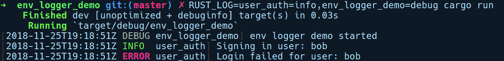
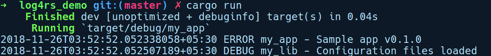
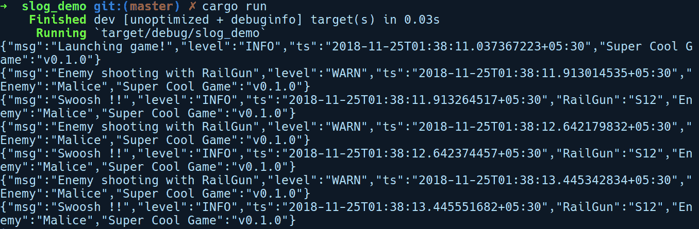

# 日志

日志是软件开发生命周期中一个重要但常被忽视的实践。它通常是在面对潜在无效状态和错误积累的后果时才被作为事后考虑而集成。任何适度规模的项目都应该在开发初期就具备日志支持。

在本章中，我们将了解为什么在应用程序中设置日志很重要，日志框架的需求，如何处理日志，以及 Rust 生态系统中可用的 crate，以使程序员能够利用日志在他们的应用程序中的力量。

在本章中，我们将涵盖以下主题：

+   什么是日志以及为什么我们需要它？

+   日志框架的需求

+   日志框架及其功能

+   探索 Rust 中的日志 crate

# 什么是日志以及为什么我们需要它？

“一般来说，一个程序除非有话要说，否则不应该说任何话。” —— 肯尼根和普劳格

在我们讨论日志的重要性之前，让我们定义这个术语，以便我们有一个更好的背景。日志是在运行时让应用程序将其活动记录到任何输出中的实践，其中单个记录被称为**事件日志**或简单地称为**日志**。这通常与一个时间戳相关联，描述事件发生的时间。事件可以是任何改变程序内部或外部状态的事情。日志可以帮助你在一段时间内了解应用程序的运行时行为，或者在调试错误时获得更多关于应用程序状态的信息。它们还用于生成用于商业目的的分析报告。也就是说，日志为用户提供的有用程度主要取决于应用程序和消费者的需求。

现在，在一个没有任何类型日志集成的应用程序中，我们了解程序在运行时行为的选择有限。我们可以使用外部工具，如 Linux 中的*htop*来监控我们的程序，但这只提供了从外部看程序的角度，并且关于内部信息提供的信息有限。

在程序运行期间从程序内部获取的信息对于调试目的很有用，或者可以用于运行时性能分析。在我们的程序发生致命故障的情况下，我们可以了解程序崩溃时的位置。至少，程序会留下堆栈跟踪，从而提供一些关于程序出错位置的上下文。然而，有一些类别的错误和事件不会立即引起问题，但后来会变成致命错误，尤其是在长时间运行的系统中。在这些情况下，事件日志可以帮助快速缩小程序中的问题范围。这就是为什么在程序中添加日志功能变得极其有帮助。

从日志中受益并需要依赖事件日志的系统包括网络服务、网络服务器、流处理服务以及类似的长时间运行系统。在这些系统中，单个事件日志与随时间推移产生的后续日志相结合，当由日志聚合服务摄取并进行分析时，可以提供有关系统的有用统计数据。

对于像购物网站这样的商业应用程序，你可以利用日志分析来获得业务洞察，从而带来更好的销售。在网络服务器中，你可以找到有用的活动日志来跟踪对服务器进行的任何恶意尝试，例如分布式拒绝服务（DDoS）攻击。开发者可以通过从收集的 API 请求日志中获得请求-响应延迟数据来评估他们的 Web API 端点的性能。

日志还充当重要的调试上下文，并可以在调试会话中进行根本原因分析时最小化所花费的时间，在调试会话中，你有时间限制来修复生产中发生的问题。

有时，日志是唯一的方法，因为并非总是有调试器可用或适用。这通常是在分布式系统和多线程应用程序中。任何在这些系统中进行过相当数量开发的人都非常清楚为什么日志是软件开发流程中如此重要的一个部分。

有三类用户从应用日志实践中获得巨大益处：

+   **系统管理员**：他们需要监控服务器日志以发现任何故障，例如硬盘崩溃或网络故障。

+   **开发者**：在开发过程中，将日志集成到项目中可以大大减少开发时间，并且以后可以用来深入了解用户如何使用他们的应用程序。

+   **网络安全团队**：在远程服务器遭受任何攻击的情况下，安全人员从日志中受益匪浅，因为他们可以通过追踪受攻击服务器记录的事件日志来了解某种攻击是如何进行的。

作为软件开发实践中的功能组件，并在长期内提供巨大价值，将日志集成到系统中需要专门的框架，我们将在下一节中看到原因。

# 对日志框架的需求

我们现在知道日志为什么很重要。然而，接下来的问题是，我们如何在应用程序中集成日志功能？让应用程序记录事件最简单、最直接的方法是在代码中需要的地方添加一些打印语句。这样，我们就可以轻松地将事件日志输出到我们的终端控制台的标准输出，这样我们的工作就完成了，但还有更多值得期待。在许多情况下，我们还想让我们的日志在稍后进行分析时保持持久。因此，如果我们想将打印语句的输出收集到文件中，我们必须寻找额外的途径，例如使用 shell 输出重定向功能将输出管道到文件，这基本上是使用不同的工具来实现将日志从我们的应用程序输出到不同输出的目标。结果证明，这种方法存在局限性。

你无法过滤或关闭不需要为特定模块记录日志的打印语句。为此，你必须注释掉它们或删除它们并重新部署你的服务。另一个限制是，当你的日志命令变得很大时，你必须编写和维护用于收集多个输出的日志的 shell 脚本。所有这些都很快变得难以控制且难以维护。使用打印语句是一种快速而低效的日志记录实践，并且不是一个非常可扩展的解决方案。我们需要的是一个更好、更可定制的应用程序日志架构。可扩展且更干净的方法是拥有一个专门的记录器，它可以消除所有这些限制，这就是为什么存在日志框架的原因。除了基本的日志需求之外，这些框架还提供了诸如达到一定大小限制时的日志文件轮换、设置日志频率、按模块进行细粒度日志配置等附加功能。

# 日志框架及其关键特性

主流语言提供了各种各样的日志框架。其中一些值得提及的包括来自 Java 的*Log4j*，来自 C#的*Serilog*，以及来自 Node.js 的*Bunyan*。自这些框架的普及以来，从它们的使用案例来看，日志框架应该提供给用户哪些功能有相似之处。以下是最理想的属性，日志框架应该具备：

+   **快速**：日志框架必须确保在日志记录时不会执行昂贵的操作，并且应该能够尽可能少地使用 CPU 周期来高效地处理。例如，在 Java 中，如果你的日志语句包含许多需要调用`to_string()`方法的对象，只是为了在日志消息中内联对象，那么这被认为是一种低效的做法。

+   **可配置的输出**：只有将日志消息记录到标准输出是非常有限的。它们仅在 shell 会话中保留，您需要手动将日志粘贴到文件中才能稍后使用。日志框架应该提供支持多个输出的能力，例如文件或甚至网络套接字。

+   **日志级别**：日志框架的显著特征是能够控制记录什么和何时记录，这使得它们与基于打印的常规日志记录区分开来。这通常是通过使用*日志级别*的概念实现的。日志级别是一个可配置的过滤器，通常实现为一个在发送日志输出之前检查的类型。级别通常按以下顺序排列，从最低优先级到最高优先级：

    +   **错误**：此级别适用于记录关键事件以及可能导致应用程序输出无效的事件。

    +   **警告**：此级别适用于已经采取措施的事件，但也希望在事件频繁发生时能够采取后续行动。

    +   **信息**：此级别可用于正常事件，例如打印应用程序版本、用户登录、连接成功消息等。

    +   **调试**：正如其名所示，这用于支持调试。在调试时，它有助于监控变量的值以及它们在不同代码路径中的操作。

    +   **跟踪**：当您想要算法或您编写的任何非平凡函数的逐步执行时，使用此级别。带有参数和返回值的函数调用可以作为跟踪日志放置。

这些名称在不同的框架中可能会有细微差别，但它们所表示的优先级大多相同。在主要的日志框架中，这些级别是在日志记录器初始化时设置的，任何后续的日志调用都会检查设置的级别，并根据该级别过滤日志。例如，调用`Logger.set_level(INFO)`的`Logger`对象将允许记录所有高于`Info`级别的日志，而忽略`Debug`和`Trace`日志。

+   **日志过滤**：应该能够轻松地仅记录代码中需要的地方，并根据事件的严重性/重要性关闭其他日志。

+   **日志轮转**：当将日志记录到文件时，长期记录会填满磁盘空间。日志框架应该提供限制日志文件大小和允许删除旧日志文件的功能。

+   **异步日志记录**：主线程上的日志调用可能会阻塞主代码的执行。尽管高效的日志记录器会尽可能少地执行，但它仍然会在实际代码之间进行阻塞 I/O 调用。因此，最好将大多数日志调用卸载到专门的日志记录器线程。

+   **日志消息属性**：另一个值得提及的是发送到日志 API 的日志消息上的属性。至少，日志框架应该为日志消息提供以下属性：

    +   **时间戳**：事件发生的时间

    +   **日志严重性**：消息的重要性，例如错误、警告、信息、调试等

    +   **事件位置**：事件发生的源代码中的位置

    +   **消息**：描述发生了什么的实际事件消息

根据这些特性，日志框架在日志记录方面的方法有所不同。让我们接下来探讨它们。

# 日志记录方法

在应用程序中集成日志时，我们需要决定要记录哪些信息以及它们应该有多详细。如果日志太多，我们就会失去在噪声中轻松找到相关信息的能力；如果日志消息不够，我们就有可能错过那个重要的事件。我们还需要考虑如何组织日志消息中的信息，以便稍后更容易搜索和分析。这些问题导致日志框架大致分为两类：非结构化日志和结构化日志。

# 非结构化日志

处理日志的通常方法是将事件记录为普通字符串，并将任何必需的值转换为字符串后放入日志消息中。这种日志记录形式称为非结构化日志，因为日志消息中的信息没有任何预定义的结构或顺序。非结构化日志对于大多数用例来说效果很好，但也有其缺点。

收集日志消息后，一个常见的用例是在稍后的时间点搜索特定事件的日志。然而，从日志集合中检索非结构化日志可能会很痛苦。非结构化日志消息的问题在于它们没有任何可预测的格式，对于日志聚合服务来说，使用简单的文本匹配查询来筛选所有原始日志消息会变得非常耗费资源。你需要编写匹配文本块的正则表达式，或者从命令行中 grep 它们以获取特定事件。随着日志数量的增加，这种方法最终会成为从日志文件中获取有用信息的瓶颈。另一种方法是记录具有预定义结构的日志消息，为此我们有了结构化日志。

# 结构化日志

结构化日志是无结构日志的一个可扩展且更好的替代方案。正如其名所示，结构化日志为日志消息定义了结构和格式，并且保证每个日志消息都具有这种格式。这种格式的优点是，对于日志聚合服务来说，构建搜索索引并呈现任何特定事件给用户变得非常容易，无论他们有多少条消息。有许多结构化日志框架，如 C#中的 Serilog，它们提供了对结构化日志的支持。这些框架提供了一个基于插件的日志输出抽象，称为*Sinks*。Sinks 是您将日志发送到何处的方式。一个 Sink 可以是您的终端、文件、数据库或日志聚合服务，如 logstash。

结构化日志框架知道如何将某个对象序列化，并且可以以适当的格式进行序列化。它们还通过提供基于组件的分层日志输出来自动化日志消息的格式化。结构化日志的缺点是，在将它们集成到应用程序中时可能会有些耗时，因为你必须事先决定日志的层次结构和格式。

在选择结构化日志和无结构日志之间，通常需要权衡。日志量大的复杂项目可以从结构化日志中受益，因为它们可以从模块中获得语义化和高效可搜索的日志，而小型到中等规模的项目可以使用无结构日志。最终，应该由应用程序的需求来决定您如何将日志集成到应用程序中。在下一节中，我们将探讨几个无结构日志框架以及 Rust 中的结构化日志框架，您可以使用这些框架使您的应用程序记录事件。

# Rust 中的日志

Rust 有相当多的灵活和广泛的日志解决方案。与其他语言的流行日志框架一样，这里的日志生态系统分为两部分：

+   **日志外观**：这部分由`log` crate 实现，提供了一个与实现无关的日志 API。虽然其他框架将日志 API 实现为某些对象上的函数或方法，但 log crate 为我们提供了基于宏的日志 API，这些 API 按日志级别分类，以将事件记录到配置的日志输出中。

+   **日志实现**：这些是由社区开发的 crate，它们提供了实际的日志实现，包括输出去向和实现方式。有许多这样的 crate，例如`env_logger`、`simple_logger`、`log4rs`和`fern`。我们稍后会访问其中的一些。属于这一类别的 crate 仅适用于二进制 crate，即可执行文件。

这种关注点分离，即日志 API 与日志输出到输出机制之间的底层机制，是为了让开发者不需要更改代码中的日志语句，并且可以轻松地根据需要交换底层日志实现。

# log – Rust 的日志门面

`log` crate 来自 GitHub 上的 *rust-lang nursery* 组织，并由社区在 [`github.com/rust-lang-nursery/log`](https://github.com/rust-lang-nursery/log) 进行管理。它为不同日志级别（如 `error!`、`warn!`、`info!`、`debug!` 和 `trace!`）提供了独立的宏，按照优先级从高到低排序。这些宏是此 crate 的消费者主要交互点。它们内部调用此 crate 中的 `log!` 宏，该宏负责所有账簿工作，例如检查日志级别和格式化日志消息。此 crate 的核心组件是 `log` trait，其他后端 crate 实现此 trait。该 trait 定义了日志记录器所需的操作，并具有其他 API，例如检查是否启用了日志记录或刷新任何缓冲的日志。

`log` crate 还提供了一个名为 `STATIC_MAX_LEVEL` 的最大日志级别常量，可以在编译时配置项目范围。使用此常量，您可以使用 cargo 功能标志静态地设置应用程序的日志级别，这允许在编译时过滤应用程序及其所有依赖项的日志。这些级别过滤器可以在 `Cargo.toml` 中分别针对调试和发布构建设置：`max_level_<LEVEL>`（调试）和 `release_max_level_<LEVEL>`（发布）。在二进制项目中，您可以指定对 `log` crate 的依赖项，并使用编译时日志级别如下：

```rs
[dependencies]
log = "0.4.6", features = ["release_max_level_error", "max_level_debug"] }
```

将此常量设置为所需值是一个好习惯，因为默认情况下，级别设置为 `Off`。它还允许日志宏优化掉任何禁用级别的日志调用。库应仅链接到 `log` crate，而不是任何日志实现 crate，因为二进制 crate 应该控制要记录的内容以及如何记录。仅在使用此 crate 的应用程序中，不会产生任何日志输出，因为您需要使用 `env_logger` 或 `log4rs` 等日志 crate 与之配合使用。

要查看 `log` crate 的实际应用，我们将通过运行 `cargo new user_auth --lib` 并在 `Cargo.toml` 文件中添加 `log` 作为依赖项来构建一个库 crate：

```rs
# user_auth/Cargo.toml

[dependencies]
log = "0.4.6"
```

此 crate 模拟了一个虚拟的用户登录 API。我们的 `lib.rs` 文件有一个 `User` 结构体，该结构体有一个名为 `sign_in` 的方法：

```rs
// user_auth/lib.rs

use log::{info, error};

pub struct User {
    name: String,
    pass: String
}

impl User {
    pub fn new(name: &str, pass: &str) -> Self {
        User {name: name.to_string(), pass: pass.to_string()}
    }

    pub fn sign_in(&self, pass: &str) {
        if pass != self.pass {
            info!("Signing in user: {}", self.name);
        } else {
            error!("Login failed for user: {}", self.name);
        }
    }
}
```

在 `sign_in` 方法中，我们对登录成功或失败进行了几次日志调用。我们将使用这个库 crate 与一个创建 `User` 实例并调用 `sign_in` 方法的二进制 crate 一起使用。由于依赖于 `log` crate 本身不会产生任何日志输出，我们将使用 `env_logger` 作为此示例的日志后端。让我们首先探索 `env_logger`。

# env_logger

`env_logger`是一个简单的记录实现，允许您通过`RUST_LOG`环境变量控制日志输出到`stdout`或`stderr`。这个环境变量的值是逗号分隔的记录器字符串，对应于模块名称和日志级别。为了演示`env_logger`，我们将通过运行`cargo new env_logger_demo`并指定`log`、`env_logger`和我们在上一节中创建的`user_auth`库的依赖项来创建一个新的二进制 crate。以下是我们的`Cargo.toml`文件：

```rs
# env_logger_demo/Cargo.toml

[dependencies]
env_logger = "0.6.0"
user_auth = { path = "../user_auth" }
log = { version = "0.4.6", features = ["release_max_level_error", "max_level_trace"] }
```

这是我们的`main.rs`文件：

```rs
// env_logger_demo/src/main.rs

use log::debug;

use user_auth::User;

fn main() {
    env_logger::init();
    debug!("env logger demo started");
    let user = User::new("bob", "super_sekret");
    user.sign_in("super_secret");
    user.sign_in("super_sekret");
}
```

我们创建我们的`User`实例并调用`sign_in`，传入我们的密码。第一次登录尝试是失败的，这将记录为错误。我们可以通过设置`RUST_LOG`环境变量，然后执行`cargo run`来运行它：

```rs
RUST_LOG=user_auth=info,env_logger_demo=info cargo run
```

我们将`user_auth`crate 的日志设置为`info`及其以上级别，而来自我们的`env_logger_demo`crate 的日志设置为`debug`及其以上级别。

运行此命令会给我们以下输出：



`RUST_LOG`接受`RUST_LOG=path::to_module=log_level[,]`模式，其中`path::to_module`指定了记录器，应该是一个以 crate 名称为基本路径的任何模块。`log_level`是记录 crate 中定义的任何日志级别。结尾的`[,]`表示我们可以有任意多个这样的记录器指定，用逗号分隔。

运行前面程序的另一种方法是，通过在代码本身中设置环境变量，使用标准库中的`env`模块的`set_var`方法：

```rs
std::env::set_var("RUST_LOG", "user_auth=info,env_logger_demo=info cargo run");
env_logger::init();
```

这会产生与之前相同的输出。接下来，让我们看看一个更复杂且高度可配置的记录 crate。

# log4rs

如其名所示，`log4rs`crate 受到了 Java 中流行的`log4j`库的启发。这个 crate 比`env_logger`更强大，允许通过 YAML 文件进行细粒度的记录器配置。

我们将构建两个 crate 来演示通过`log4rs`crate 集成记录。一个将是库 crate，`cargo new my_lib --lib`，另一个将是我们的二进制 crate，`cargo new my_app`，它使用`my_lib`。一个名为`log4rs_demo`的 cargo 工作空间目录包含这两个 crate。

我们的`my_lib`crate 在`lib.rs`文件中有以下内容：

```rs
// log4rs_demo/my_lib/lib.rs

use log::debug;

pub struct Config;

impl Config {
    pub fn load_global_config() {
        debug!("Configuration files loaded");
    }
}
```

它有一个名为`Config`的结构体，有一个名为`load_global_config`的模拟方法，在调试级别记录一条消息。接下来，我们的`my_app`crate 在`main.rs`文件中有以下内容：

```rs
// log4rs_demo/my_app/src/main.rs

use log::error;

use my_lib::Config;

fn main() {
    log4rs::init_file("config/log4rs.yaml", Default::default()).unwrap();
    error!("Sample app v{}", env!("CARGO_PKG_VERSION"));
    Config::load_global_config();
}
```

在前面的代码中，我们通过`init_file`方法初始化我们的`log4rs`记录器，传入`log4rs.yaml`配置文件的路径。接下来，我们记录一个模拟的错误消息，从而打印出应用程序版本。随后，我们调用`load_global_config`，它记录了另一条消息。以下就是`log4rs.yaml`配置文件的内容：

```rs
# log4rs_demo/config/log4rs.yaml

refresh_rate: 5 seconds

root:
  level: error
  appenders:
    - stdout
appenders:
  stdout:
    kind: console
  my_lib_append:
    kind: file
    path: "log/my_lib.log"
    encoder:
      pattern: "{d} - {m}{n}"

loggers:
  my_lib:
    level: debug
    appenders:
      - my_lib_append
```

让我们逐行分析。第一行 `refresh_rate` 指定了 `log4rs` 重新加载配置文件的时间间隔，以便对文件中进行的任何更改进行会计。这意味着我们可以修改 YAML 文件中的任何值，`log4rs` 将会动态地为我们重新配置其日志记录器。然后，我们有 `root` 日志记录器，它是所有日志记录器的父级。我们指定默认级别为 `error`，附加器为 `stdout`，它定义在其下方。

接下来是 `appenders` 部分。附加器是日志的去向。我们指定了两个附加器：`stdout`，它是 `console` 类型，以及 `my_lib_append`，它是一个 `file` 附加器，在 `encoder` 部分包括有关文件路径和要使用的日志模式的详细信息。

接下来是 `日志记录器` 部分，我们可以根据不同的级别定义基于库或模块的日志记录器。我们定义了一个名为 `my_lib` 的日志记录器，它对应于我们的 `my_lib` 库，具有 `debug` 级别和 `my_lib_append` 作为附加器。这意味着来自 `my_lib` 库的所有日志都将发送到 `my_lib.log` 文件，这是由 `my_lib_append` 附加器指定的。

在 `log4rs_demo` 目录下运行 `cargo run`，我们得到以下输出：



这是对 `log4rs` 的简要介绍。如果你想了解更多关于配置这些日志的信息，请访问文档页面 [`docs.rs/log4rs`](https://docs.rs/log4rs)。

# 使用 `slog` 进行结构化日志记录

所述的所有库都非常有用，并且适用于大多数用例，但它们不支持结构化日志。在本节中，我们将看到如何使用 `slog` 库将结构化日志集成到我们的应用程序中，`slog` 是 Rust 生态系统中的少数几个流行的结构化日志库之一。为此演示，我们将通过运行 `cargo new slog_demo` 创建一个新的项目，这模拟了一个射击游戏。

我们需要在 `Cargo.toml` 文件中添加以下依赖项：

```rs
# slog_demo/Cargo.toml

[dependencies]
rand = "0.5.5"
slog = "2.4.1"
slog-async = "2.3.0"
slog-json = "2.2.0"
```

`slog` 框架非常适合中等到大型的项目，在这些项目中，模块之间存在大量的交互，因为它有助于集成详细的日志，以便对事件进行长期监控。它基于提供应用中的分层和可组合的日志配置以及允许进行语义事件日志记录的理念。在 `slog` 下有两个重要的概念，你需要了解它们才能成功使用这个库：*日志记录器* 和 *排水口*。日志记录器对象用于记录事件，而排水口是一个抽象，指定了日志消息的去向以及如何到达那里。这可以是标准输出、一个文件或一个网络套接字。排水口类似于你在 C# 的 *Serilog* 框架中所称的 `Sink`。

我们的演示模拟了基于实体行为的游戏事件。这些实体在游戏中具有父子关系，我们可以通过`slog`框架的结构化日志配置轻松地在它们中附加分层日志功能。当我们查看代码时，我们将了解这一点。在根级别，我们有`Game`实例，对于它，我们可以定义一个根日志记录器，为我们的日志消息提供一个基线上下文，例如游戏名称和版本。因此，我们将创建一个与`Game`实例关联的根日志记录器。接下来，我们有`Player`和`Enemy`类型，它们是`Game`的子实体。这些成为根日志记录器的子日志记录器。然后，我们有敌人和玩家的武器，它们成为玩家的子日志记录器和敌人的日志记录器。正如你所见，设置`slog`比我们之前查看的框架要复杂一些。

除了`slog`作为基本 crate 外，我们还在我们的演示中使用了以下 crate：

+   `slog-async`: 提供了一个异步日志输出，将日志调用与主线程解耦。

+   `slog-json`: 一个将消息输出到任何`Writer`的 JSON 输出。在这个演示中，我们将使用`stdout()`作为`Writer`实例。

让我们看看我们的`main.rs`文件：

```rs
// slog_demo/main.rs

#[macro_use]
extern crate slog;

mod enemy;
mod player;
mod weapon;

use rand::Rng;
use std::thread;
use slog::Drain;
use slog::Logger;
use slog_async::Async;
use std::time::Duration;
use crate::player::Player;
use crate::enemy::Enemy;

pub trait PlayingCharacter {
    fn shoot(&self);
}

struct Game {
    logger: Logger,
    player: Player,
    enemy: Enemy
}

impl Game {
    fn simulate(&mut self) {
        info!(self.logger, "Launching game!");
        let enemy_or_player: Vec<&dyn PlayingCharacter> = vec![&self.enemy, &self.player];
        loop {
            let mut rng = rand::thread_rng();
            let a = rng.gen_range(500, 1000);
            thread::sleep(Duration::from_millis(a));
            let player = enemy_or_player[{
                if a % 2 == 0 {1} else {0}
            }];
            player.shoot();
        }
    }
}
```

在前面的代码中，我们有一系列`use`语句，然后是我们的`PlayingCharacter`特质，它由我们的`Player`和`Enemy`结构体实现。我们的`Game`结构体有一个`simulate`方法，它简单地循环并随机休眠，从而在调用`shoot`方法之前随机选择玩家或敌人。让我们继续查看同一文件：

```rs
// slog_demo/src/main.rs

fn main() {
    let drain = slog_json::Json::new(std::io::stdout()).add_default_keys()
                                                       .build()
                                                       .fuse();
    let async_drain = Async::new(drain).build().fuse();
    let game_info = format!("v{}", env!("CARGO_PKG_VERSION"));
    let root_log_context = o!("Super Cool Game" => game_info);
    let root_logger = Logger::root(async_drain, root_log_context);
    let mut game = Game { logger: root_logger.clone(),
                          player: Player::new(&root_logger, "Bob"),
                          enemy: Enemy::new(&root_logger, "Malice") };
    game.simulate()
}
```

在`main`中，我们首先使用`slog_json::Json`创建我们的`drain`，它可以将消息作为 JSON 对象记录，然后将其传递给另一个`Async`输出，它将所有日志调用卸载到单独的线程。然后，我们通过传递我们的`drain`和用于日志消息的初始上下文使用方便的`o!`宏创建我们的`root_logger`。在这个宏中，我们简单地使用`CARGO_PKG_VERSION`环境变量打印我们游戏的名字和版本。接下来，我们的`Game`结构体接受我们的根日志记录器和`enemy`以及`player`实例。我们将根日志记录器的引用传递给`Player`和`Enemy`实例，它们使用它创建自己的子日志记录器。然后，我们在游戏实例上调用`simulate`。

以下是`player.rs`的内容：

```rs
// slog_demo/src/player.rs

use slog::Logger;

use weapon::PlasmaCannon;
use PlayingCharacter;

pub struct Player {
    name: String,
    logger: Logger,
    weapon: PlasmaCannon
}

impl Player {
    pub fn new(logger: &Logger, name: &str) -> Self {
        let player_log = logger.new(o!("Player" => format!("{}", name)));
        let weapon_log = player_log.new(o!("PlasmaCannon" => "M435"));
        Self {
            name: name.to_string(),
            logger: player_log,
            weapon: PlasmaCannon(weapon_log),
        }
    }
}
```

在这里，我们的`Player`上的`new`方法获取根`logger`，然后使用`o!`宏添加自己的上下文。我们还创建了一个`weapon`的日志记录器，并将玩家日志记录器传递给它，它添加了自己的信息，例如武器的 ID。最后，我们返回配置好的`Player`实例：

```rs
impl PlayingCharacter for Player {
    fn shoot(&self) {
        info!(self.logger, "{} shooting with {}", self.name, self.weapon);
        self.weapon.fire();
    }
}
```

我们还为我们的`Player`实现了`PlayingCharacter`特质。

接下来是`enemy.rs`文件，它与`player.rs`中的所有内容相同：

```rs
// slog_demo/src/enemy.rs

use weapon::RailGun;
use PlayingCharacter;
use slog::Logger;

pub struct Enemy {
    name: String,
    logger: Logger,
    weapon: RailGun
}

impl Enemy {
    pub fn new(logger: &Logger, name: &str) -> Self {
        let enemy_log = logger.new(o!("Enemy" => format!("{}", name)));
        let weapon_log = enemy_log.new(o!("RailGun" => "S12"));
        Self { 
            name: name.to_string(),
            logger: enemy_log,
            weapon: RailGun(weapon_log)
        }
    }
}

impl PlayingCharacter for Enemy {
    fn shoot(&self) {
        warn!(self.logger, "{} shooting with {}", self.name, self.weapon);
        self.weapon.fire();
    }
}
```

然后，我们有`weapon.rs`文件，它包含两个被敌人和玩家实例使用的武器：

```rs
// slog_demo/src/weapon.rs

use slog::Logger;
use std::fmt;

#[derive(Debug)]
pub struct PlasmaCannon(pub Logger);

impl PlasmaCannon {
    pub fn fire(&self) {
        info!(self.0, "Pew Pew !!");
    }
}

#[derive(Debug)]
pub struct RailGun(pub Logger);

impl RailGun {
    pub fn fire(&self) {
        info!(self.0, "Swoosh !!");
    }
}

impl fmt::Display for PlasmaCannon {
    fn fmt(&self, f: &mut fmt::Formatter) -> fmt::Result {
        write!(f, stringify!(PlasmaCannon))
    }
}

impl fmt::Display for RailGun {
    fn fmt(&self, f: &mut fmt::Formatter) -> fmt::Result {
        write!(f, stringify!(RailGun))
    }
}
```

这就是我们的游戏模拟所需的所有内容。现在我们可以通过调用`cargo run`来运行它。以下是我机器上的输出：



如您所见，我们的游戏实体发送日志消息，然后借助`slog`及其 drains 进行格式化并输出为 JSON。与之前使用的 JSON drain 类似，社区为`slog`构建了许多这样的 drains。我们可以有一个将日志消息直接输出到日志聚合服务的 drain，该服务知道如何处理 JSON 数据，并且可以轻松地对它们进行索引，以便高效地检索日志。`slog`的可插拔和可组合特性使其在日志解决方案中脱颖而出。通过这个演示，我们已经到达了 Rust 中日志记录故事的结尾。然而，还有其他更多有趣的日志框架供您探索，您可以在[`www.arewewebyet.org/topics/logging/`](http://www.arewewebyet.org/topics/logging/)找到它们。

# 摘要

在本章中，我们学习了在软件开发中日志记录的重要性以及接近它的方法，包括在选择日志框架时应该寻找哪些特性。我们还了解了非结构化和结构化日志，它们的优缺点，并探讨了 Rust 生态系统中的可用 crate，以将日志集成到我们的应用程序中。

下一章将介绍网络编程，我们将探讨 Rust 提供的内置功能和 crate，以创建能够相互通信的高效应用程序。
