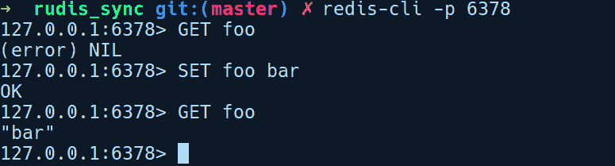
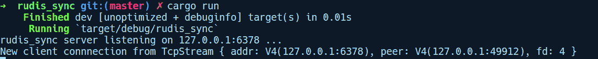
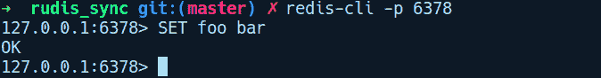
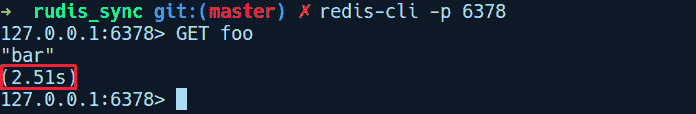
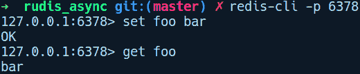

# Rust 网络编程

在本章中，我们将探讨 Rust 在网络编程方面能提供什么。我们将从通过构建一个简单的 Redis 克隆来探索标准库中的现有网络原语开始。这将帮助我们熟悉默认的同步网络 I/O 模型及其局限性。接下来，我们将解释在处理大规模网络 I/O 时异步性为何是一种更好的方法。在这个过程中，我们将了解 Rust 生态系统提供的抽象，用于构建异步网络应用程序，并使用第三方 crate 重构我们的 Redis 服务器，使其异步化。

本章将涵盖以下主题：

+   网络编程序曲

+   同步网络 I/O

+   构建简单的 Redis 服务器

+   异步网络 I/O

+   `futures`和`tokio`crate 的介绍

# 网络编程序曲

"一个程序就像一首诗：你不写下来就无法创作一首诗。"

– *E. W. Dijkstra*

通过构建一种机器可以在互联网上相互通信的媒介是一项复杂的任务。互联网上有不同种类的设备进行通信，运行着不同的操作系统和不同版本的应用程序，它们需要一套共同认可的规则来相互交换信息。这些通信规则被称为网络协议，设备之间发送给对方的信息被称为网络数据包。

为了分离各种方面的关注点，如可靠性、可发现性和封装性，这些协议被划分为层，高层协议堆叠在底层之上。每个网络数据包都由所有这些层的信息组成。如今，现代操作系统已经预装了网络协议栈的实现。在这个实现中，每一层都为其上层提供支持。

在最低层，我们有物理层和数据链路层协议，用于指定如何在互联网上的节点之间通过电线传输数据包，以及它们如何在计算机的网络卡中进出。这一层的协议是以太网和令牌环协议。在其之上，我们有 IP 层，它使用称为 IP 地址的唯一 ID 概念来识别互联网上的节点。在 IP 层之上，我们有传输层，这是一个在互联网上的两个进程之间提供点对点交付的协议。TCP 和 UDP 等协议存在于这一层。在传输层之上，我们有 HTTP 和 FTP 等应用层协议，它们都用于构建丰富的应用程序。这允许实现更高层次的通信，例如在移动设备上运行的聊天应用程序。整个协议栈协同工作，以促进互联网上运行的计算机应用程序之间的这些复杂交互。

随着设备通过互联网相互连接并共享信息，分布式应用程序架构开始普及。出现了两种模型：去中心化模型，通常被称为对等网络模型，以及中心化模型，通常被称为客户端-服务器模型。后者在两种模型中更为常见。在本章中，我们将重点关注构建网络应用程序的客户端-服务器模型，特别是在传输层。

在主要操作系统中，网络堆栈的传输层通过名为**套接字**的一系列 API 向开发者暴露。它包括一组接口，用于在两个进程之间建立通信链路。套接字允许你在两个进程之间，无论是本地还是远程，来回传递数据，而不需要开发者了解底层网络协议。

Socket API 的根源在于**伯克利软件发行版（BSD**），这是第一个在 1983 年提供带有套接字 API 的网络堆栈实现的操作系统。它现在仍然是主要操作系统网络堆栈的参考实现。在类 Unix 系统中，套接字遵循“一切皆文件”的哲学，并暴露出文件描述符 API。这意味着可以从套接字读取和写入数据，就像文件一样。

套接字是文件描述符（一个整数），指向由内核管理的进程的描述符表。描述符表包含文件描述符到**文件条目**结构的映射，该结构包含发送到套接字的数据的实际缓冲区。

Socket API 主要在 TCP/IP 层工作。在这一层，我们创建的套接字根据不同的级别进行分类：

+   **协议**：根据协议的不同，我们可以拥有 TCP 套接字或 UDP 套接字。TCP 是一种有状态的流式协议，它能够以可靠的方式传递消息，而 UDP 则是一种无状态且不可靠的协议。

+   **通信类型**：根据我们是否与同一台机器上的进程或远程机器上的进程进行通信，我们可以使用互联网套接字或 Unix 域套接字。互联网套接字用于在远程机器上的进程之间交换消息。它由一个 IP 地址和一个端口号的元组表示。两个想要远程通信的进程必须使用 IP 套接字。Unix 域套接字用于在同一台机器上运行的进程之间的通信。在这里，它使用一个文件系统路径而不是 IP 地址-端口号对。例如，数据库使用 Unix 域套接字来公开连接端点。

+   **I/O 模型**：根据我们如何将数据读入或写入套接字，我们可以创建两种类型的套接字：阻塞套接字和非阻塞套接字。

现在我们对套接字有了更多的了解，让我们更深入地探讨一下客户端-服务器模型。在这个网络模型中，设置两台机器相互通信的常规流程遵循以下过程：服务器创建一个套接字并将其绑定到一个 IP 地址-端口号对，然后指定一个协议，可以是 TCP 或 UDP。然后，它开始监听来自客户端的连接。另一方面，客户端创建一个连接套接字并连接到指定的 IP 地址和端口。在 Unix 中，进程可以使用`socket`系统调用创建套接字。这个调用会返回一个文件描述符，程序可以使用它来对客户端或服务器执行读写调用。

Rust 在标准库中为我们提供了`net`模块。这个模块包含了上述传输层上的网络原语。对于通过 TCP 进行通信，我们有`TcpStream`和`TcpListener`类型。对于通过 UDP 进行通信，我们有`UdpSocket`类型。`net`模块还提供了表示 IP 地址的正确数据类型，并支持 v4 和 v6 版本。

构建可靠的网络应用程序需要考虑多个因素。如果你对在消息交换过程中丢失少量数据包没有异议，可以选择 UDP 套接字，但如果你不能容忍数据包丢失或希望消息按顺序交付，则必须使用 TCP 套接字。UDP 协议速度快，出现较晚，是为了满足需要最小延迟交付数据包且可以处理少量数据包丢失的需求。例如，视频聊天应用程序使用 UDP，但如果视频流中丢失几个帧，你并不会特别受到影响。UDP 用于那些可以容忍无交付保证的情况。在本章中，我们将重点关注 TCP 套接字，因为它是大多数需要可靠性的网络应用程序最常用的协议。

另一个需要考虑的因素是，你的应用程序在服务客户端方面有多好、有多高效。从技术角度来看，这相当于选择套接字的 I/O 模型。

I/O 是输入/输出的缩写，在这个上下文中，它是一个总称，简单地表示将字节读取和写入套接字。

在阻塞和非阻塞套接字之间进行选择会改变其架构，我们编写代码的方式，以及它如何扩展到客户端。阻塞套接字为你提供了一个**同步 I/O**模型，而非阻塞套接字则允许你进行**异步 I/O**。在实现 Socket API 的平台（如 Unix）上，套接字默认以阻塞模式创建。这意味着在主要的网络堆栈中，默认的 I/O 模型遵循同步模型。接下来，让我们探讨这两种模型。

# 同步网络 I/O

正如我们之前所说的，默认情况下，套接字是以阻塞模式创建的。在阻塞模式下，服务器是同步的，这意味着套接字上的每次读写调用都会阻塞并等待完成。如果另一个客户端尝试连接到服务器，它需要等待服务器完成对前一个客户端的服务。也就是说，直到 TCP 读写缓冲区填满，您的应用程序会在相应的 I/O 操作上阻塞，任何新的客户端连接都必须等待缓冲区再次为空并填满。

TCP 协议在内核级别实现了自己的读写缓冲区，除了应用程序维护自己的任何缓冲区之外。

Rust 的标准库网络原语为套接字提供了相同的同步 API。为了看到这个模型在行动中的样子，我们将实现一个比回声服务器更复杂的东西。我们将构建 Redis 的一个简化版本。Redis 是一个数据结构服务器，通常用作内存数据存储。Redis 客户端和服务器使用 RESP 协议，这是一个简单的基于行的协议。虽然该协议对 TCP 或 UDP 是中立的，但 Redis 实现主要使用 TCP 协议。TCP 是一个有状态的基于流的协议，服务器和客户端无法识别从套接字中读取多少字节来构建一个协议消息。为了解决这个问题，大多数协议遵循使用长度字节，然后是相同长度的有效载荷字节的模式。

RESP 协议中的消息类似于 TCP 中大多数基于行的协议，初始字节是一个标记字节，后面跟着有效载荷的长度，然后是有效载荷本身。消息以一个终止标记字节结束。RESP 协议支持各种类型的消息，从简单的字符串、整数、数组到大量字符串等等。在 RESP 协议中，消息以`\r\n`字节序列结束。例如，服务器从客户端发送的成功消息编码并发送为`+OK\r\n`（不带引号）。`+`表示成功回复，然后是字符串。命令以`\r\n`结束。为了指示查询是否失败，Redis 服务器以`-Nil\r\n`回复。

`get`和`set`等命令作为大量字符串的数组发送。例如，一个`get foo`命令将如下发送：

```rs
*2\r\n$3\r\nget\r\n$3\r\nfoo\r\n
```

在前面的消息中，`*2`表示我们有一个包含`2`个命令的数组，并由`\r\n`分隔。随后，`$3`表示我们有一个长度为`3`的字符串，即`GET`命令后跟一个表示字符串`foo`的`$3`。命令以`\r\n`结束。这就是 RESP 协议的基础。我们不必担心解析 RESP 消息的低级细节，因为我们将会使用一个名为`resp`的 crate 的分支来解析来自客户端的字节流，并将其转换为有效的 RESP 消息。

# 构建一个同步的 Redis 服务器

为了使这个例子简短且易于理解，我们的 Redis 克隆将实现 RESP 协议的一个非常小的子集，并且只能处理 `SET` 和 `GET` 调用。我们将使用官方的 `redis-cli`，它是官方 *Redis* 软件包的一部分，来对我们的服务器进行查询。要使用 `redis-cli`，我们可以在 Ubuntu 上运行 `apt-get install redis-server` 来安装 Redis。

通过运行 `cargo new rudis_sync` 并在我们的 `Cargo.toml` 文件中添加以下依赖项来创建一个新的项目：

```rs
rudis_sync/Cargo.toml

[dependencies]
lazy_static = "1.2.0"
resp = { git = "https://github.com/creativcoder/resp" }
```

我们将我们的项目命名为 `rudis_sync`。我们依赖于两个 crate：

+   `lazy_static`：我们将使用这个 crate 来存储我们的内存数据库。

+   `resp`：这是一个位于我的 GitHub 仓库上的 forked crate。我们将使用它来解析来自客户端的字节流。

为了使实现更容易理解，`rudis_sync` 具有非常少的错误处理集成。当你完成代码的实验后，我们鼓励你实现更好的错误处理策略。

让我们从 `main.rs` 文件的内容开始：

```rs
// rudis_sync/src/main.rs

use lazy_static::lazy_static;
use resp::Decoder;
use std::collections::HashMap;
use std::env;
use std::io::{BufReader, Write};
use std::net::Shutdown;
use std::net::{TcpListener, TcpStream};
use std::sync::Mutex;
use std::thread;

mod commands;
use crate::commands::process_client_request;

type STORE = Mutex<HashMap<String, String>>;

lazy_static! {
    static ref RUDIS_DB: STORE = Mutex::new(HashMap::new());
}

fn main() {
    let addr = env::args()
        .skip(1)
        .next()
        .unwrap_or("127.0.0.1:6378".to_owned());

    let listener = TcpListener::bind(&addr).unwrap();
    println!("rudis_sync listening on {} ...", addr);

    for stream in listener.incoming() {
        let stream = stream.unwrap();
        println!("New connection from: {:?}", stream);
        handle_client(stream);
    }
}
```

我们有一系列导入，随后是一个在 `lazy_static!` 块中声明的内存 `RUDIS_DB` hashmap。我们正在使用这个作为内存数据库来存储客户端发送的键值对。在我们的 `main` 函数中，我们从用户提供的参数创建一个监听地址 `addr` 或使用 `127.0.0.1:6378` 作为默认值。然后我们通过调用关联的 `bind` 方法并传递 `addr` 来创建一个 `TcpListener` 实例。稍后，我们在 `listener` 上调用 `incoming` 方法，它返回一个新客户端连接的迭代器。对于每个客户端连接 `stream`，它属于 `TcpStream` 类型（客户端套接字），我们调用 `handle_client` 函数，并传入 `stream`。

在同一文件中，`handle_client` 函数负责解析从客户端发送的查询，这些查询将是 `GET` 或 `SET` 查询之一：

```rs
// rudis_sync/src/main.rs

fn handle_client(stream: TcpStream) {
    let mut stream = BufReader::new(stream);
    let decoder = Decoder::new(&mut stream).decode();
    match decoder {
        Ok(v) => {
            let reply = process_client_request(v);
            stream.get_mut().write_all(&reply).unwrap();
        }
        Err(e) => {
            println!("Invalid command: {:?}", e);
            let _ = stream.get_mut().shutdown(Shutdown::Both);
        }
    };
}
```

`handle_client` 函数接收 `stream` 变量中的客户端 `TcpStream` 套接字。我们将我们的客户端 `stream` 包装在一个 `BufReader` 中，然后将其作为可变引用传递给 `resp` crate 中的 `Decoder::new` 方法。`Decoder` 从 `stream` 中读取字节以创建一个 RESP `Value` 类型。然后我们有一个匹配块来检查我们的解码是否成功。如果失败，我们打印一条错误消息，并通过调用 `shutdown()` 并请求使用 `Shutdown::Both` 值关闭客户端套接字连接的读取部分和写入部分来关闭套接字。`shutdown` 方法需要一个可变引用，所以我们在此之前调用 `get_mut()`。在实际实现中，显然需要优雅地处理这个错误。

如果解码成功，我们调用 `process_client_request`，它返回要发送回客户端的 `reply`。我们通过在客户端 `stream` 上调用 `write_all` 将此 `reply` 写入客户端。`process_client_request` 函数在 `commands.rs` 中定义如下：

```rs
// rudis_sync/src/commands.rs

use crate::RUDIS_DB;
use resp::Value;

pub fn process_client_request(decoded_msg: Value) -> Vec<u8> {
    let reply = if let Value::Array(v) = decoded_msg {
        match &v[0] {
            Value::Bulk(ref s) if s == "GET" || s == "get" => handle_get(v),
            Value::Bulk(ref s) if s == "SET" || s == "set" => handle_set(v),
            other => unimplemented!("{:?} is not supported as of now", other),
        }
    } else {
        Err(Value::Error("Invalid Command".to_string()))
    };

    match reply {
        Ok(r) | Err(r) => r.encode(),
    }
}

```

此函数接收解码后的`Value`并在解析的查询上匹配它。在我们的实现中，我们期望客户端发送一个大量字符串的数组，所以我们匹配`Value::Array`的`Value`变体，使用`if let`并将数组存储在`v`中。如果在`if`分支中匹配为一个`Array`值，我们取该数组并匹配`v`中的第一个条目，这将是我们命令的类型，即`GET`或`SET`。这同样是一个`Value::Bulk`变体，它将命令作为字符串包装。

我们将内部字符串的引用记为`s`，并且只有当字符串的值为`GET`或`SET`时才进行匹配。在`GET`的情况下，我们调用`handle_get`函数，传递`v`数组，而在`SET`的情况下，我们调用`handle_set`函数。在`else`分支中，我们简单地向客户端发送一个带有描述`invalid Command`的`Value::Error`回复。

两个分支返回的值分配给`reply`变量。然后它被匹配为内部类型`r`，并通过调用其上的`encode`方法将其转换为`Vec<u8>`，然后从函数返回。

我们的`handle_set`和`handle_get`函数定义在同一文件中，如下所示：

```rs
// rudis_sync/src/commands.rs

use crate::RUDIS_DB;
use resp::Value;

pub fn handle_get(v: Vec<Value>) -> Result<Value, Value> {
    let v = v.iter().skip(1).collect::<Vec<_>>();
    if v.is_empty() {
        return Err(Value::Error("Expected 1 argument for GET command".to_string()))
    }
    let db_ref = RUDIS_DB.lock().unwrap();
    let reply = if let Value::Bulk(ref s) = &v[0] {
        db_ref.get(s).map(|e| Value::Bulk(e.to_string())).unwrap_or(Value::Null)
    } else {
        Value::Null
    };
    Ok(reply)
}

pub fn handle_set(v: Vec<Value>) -> Result<Value, Value> {
    let v = v.iter().skip(1).collect::<Vec<_>>();
    if v.is_empty() || v.len() < 2 {
        return Err(Value::Error("Expected 2 arguments for SET command".to_string()))
    }
    match (&v[0], &v[1]) {
        (Value::Bulk(k), Value::Bulk(v)) => {
            let _ = RUDIS_DB
                .lock()
                .unwrap()
                .insert(k.to_string(), v.to_string());
        }
        _ => unimplemented!("SET not implemented for {:?}", v),
    }

    Ok(Value::String("OK".to_string()))
}
```

在`handle_get()`函数中，我们首先检查`GET`命令的查询中是否没有键存在，并返回错误信息。接下来，我们在`v[0]`上匹配，它是`GET`命令的键，并检查它是否存在于我们的数据库中。如果存在，我们使用 map 组合器将其包装在`Value::Bulk`中，否则我们返回一个`Value::Null`回复：

```rs
db_ref.get(s).map(|e| Value::Bulk(e.to_string())).unwrap_or(Value::Null)
```

然后我们将其存储在`reply`变量中，并以`Result`类型返回它，即`Ok(reply)`。

在`handle_set`中发生类似的事情，如果我们没有足够的参数传递给`SET`命令，我们就退出。接下来，我们使用`&v[0]`和`&v[1]`匹配我们的键和值，并将其插入到`RUDIS_DB`中。作为对`SET`查询的确认，我们回复`Ok`。

在我们的`process_client_request`函数中，一旦我们创建了回复字节，我们就匹配`Result`类型，并通过调用`encode()`将其转换为`Vec<u8>`，然后写入客户端。随着这个过程的结束，现在是时候用官方的`redis-cli`工具测试我们的客户端了。我们将通过调用`redis-cli -p 6378`来运行它：



在前面的会话中，我们进行了一些`GET`和`SET`查询，并期望从`rudis_sync`得到回复。此外，这是我们的新连接的`rudis_server`的输出日志：



但我们服务器的问题是我们必须等待初始客户端完成服务。为了演示这一点，我们将在处理新客户端连接的`for`循环中引入一点延迟：

```rs
    for stream in listener.incoming() {
        let stream = stream.unwrap();
        println!("New connection from: {:?}", stream);
        handle_client(stream);
        thread::sleep(Duration::from_millis(3000));
    }
```

`sleep`调用模拟了请求处理中的延迟。为了看到延迟，我们将几乎同时启动两个客户端，其中一个客户端发出`SET`请求，另一个客户端对同一键发出`GET`请求。以下是执行`SET`请求的第一个客户端：



这是我们的第二个客户端，它在相同的键`foo`上执行`GET`请求：



正如您所看到的，第二个客户端不得不等待近三秒钟才能收到第二个`GET`响应。

由于其本质，当需要同时处理超过 100,000（比如说）个客户端时，同步模式就会成为瓶颈，每个客户端的处理时间各不相同。为了解决这个问题，通常需要为每个客户端连接创建一个线程。每当建立新的客户端连接时，我们就会创建一个新线程，并将`handle_client`调用从主线程卸载，这样主线程就可以接受其他客户端连接。我们可以在`main`函数中通过一行代码实现这一点，如下所示：

```rs
    for stream in listener.incoming() {
        let stream = stream.unwrap();
        println!("New connection from: {:?}", stream); thread::spawn(|| handle_client(stream));
    }
```

这消除了我们服务器的阻塞特性，但引入了每次接收到新的客户端连接时都要创建新线程的开销。首先，有创建线程的开销，其次，线程之间的上下文切换时间又增加了额外的开销。

正如我们所见，我们的`rudis_sync`服务器按预期工作。但很快它将因为机器能处理的线程数量而成为瓶颈。这种处理连接的线程模型在互联网开始获得更广泛的受众，越来越多的客户端连接到互联网成为常态之前工作得很好。然而，如今情况不同了，我们需要能够同时处理数百万请求的高效服务器。实际上，我们可以在更基础的层面上解决处理更多客户端的问题，即通过使用非阻塞套接字。让我们接下来探讨它们。

# 异步网络 I/O

正如我们在`rudis_sync`服务器实现中看到的，在给定时间段内处理多个客户端时，同步 I/O 模型可能成为主要瓶颈。必须使用线程来处理更多客户端。然而，有一种更好的方法来扩展我们的服务器。我们不必处理套接字的阻塞特性，我们可以使套接字非阻塞。使用非阻塞套接字，任何读取、写入或连接操作，在套接字上都会立即返回，无论操作是否成功完成，也就是说，如果读取和写入缓冲区部分填满，它们不会阻塞调用代码。这就是异步 I/O 模型，因为没有客户端需要等待其请求完成，而是稍后会被通知请求的完成或失败。

与线程相比，异步模型非常高效，但它给我们的代码增加了更多复杂性。在这个模型中，由于对套接字的初始读取或写入调用不太可能成功，我们需要在稍后时间再次尝试感兴趣的运算。在套接字上重试运算的过程称为轮询。我们需要不时轮询套接字，以查看我们的读取/写入/连接操作是否可以完成，并维护我们迄今为止已读取或写入的字节数的状态。在大量传入套接字连接的情况下，使用非阻塞套接字意味着必须处理轮询和维护状态。这很快就会变成一个复杂的状态机。此外，轮询是一个非常低效的操作。即使我们没有套接字上的任何事件。尽管如此，还有更好的方法。

在基于 Unix 的平台，套接字的轮询机制是通过`poll`和`select`系统调用完成的，这些调用在所有 Unix 平台上都可用。Linux 除了它们之外，还有一个更好的`epoll`API。我们不必自己轮询套接字，这是一个低效的操作，这些 API 可以告诉我们套接字何时准备好读取或写入。与 poll 和 select 在每个请求的套接字上运行一个 for 循环不同，`epoll`以`O(1)`的复杂度通知任何感兴趣的方有新的套接字事件。

异步 I/O 模型允许你处理比同步模型多得多的套接字数量，因为我们是在小块操作中进行的，并且快速切换到服务其他客户端。另一个效率是，我们不需要创建线程，因为所有操作都在单个线程中完成。

要使用非阻塞套接字编写异步网络应用程序，Rust 生态系统中有几个高质量的 crate。

# Rust 中的异步抽象

异步网络 I/O 具有优势，但以原始形式编程它们是困难的。幸运的是，Rust 通过第三方 crate 为我们提供了方便的抽象，用于处理异步 I/O。它减轻了开发者处理非阻塞套接字和底层套接字轮询机制时的大部分复杂状态机处理。可用的底层抽象 crate 中有两个是`futures`和`mio`crate。让我们简要了解一下它们。

# Mio

当与非阻塞套接字一起工作时，我们需要一种方法来检查套接字是否已准备好所需的操作。当我们有成千上万个或更多的套接字要管理时，情况会更糟。我们可以使用非常低效的方法，通过运行循环、检查套接字状态，并在准备好后执行操作。但还有更好的方法来做这件事。在 Unix 中，我们有了 `poll` 系统调用，你可以向它提供你想要监控事件的一组文件描述符。然后它被 `select` 系统调用所取代，这稍微改进了事情。然而，`select` 和 `poll` 都不可扩展，因为它们在底层基本上是循环，随着更多套接字被添加到其监控列表中，迭代时间呈线性增长。

在 Linux 下，随后出现了 `epoll`，这是当前最有效率的文件描述符多路复用 API。它被大多数想要进行异步 I/O 的网络和 I/O 应用程序所使用。其他平台也有类似的抽象，例如 macOS 和 BSD 中的 **kqueue**。在 Windows 上，我们有 **IO Completion Ports (IOCP)**。

正是这些低级抽象，`mio` 才进行了抽象，为所有这些 I/O 多路复用 API 提供了一个跨平台的、高度高效的接口。Mio 是一个非常底层的库，但它提供了一种方便的方式来设置用于套接字事件的反应器。它提供了与标准库相同的网络原语，例如 `TcpStream` 类型，但这些默认是非阻塞的。

# Futures

在 `mio` 的套接字轮询状态机中玩弄并不方便。为了提供一个可以由应用程序开发者使用的更高级别的 API，我们有了 `futures` 包。`futures` 包提供了一个名为 `Future` 的特质，这是包的核心组件。`future` 代表了一种计算，它目前不可用，但可能以后会可用。让我们看看 `Future` 特质的类型签名，以了解更多信息：

```rs
pub trait Future {
    type Item;
    type Error;
    fn poll(&mut self) -> Poll<Self::Item, Self::Error>;
}
```

`Future` 是一个关联的类型特质，它定义了两种类型：一个表示 `Future` 将要解析到的值的 `Item` 类型，以及一个指定未来将失败时错误类型的 `Error` 类型。它们与标准库中的 `Result` 类型非常相似，但它们不是立即获取结果，而是不立即计算。

单独的 `Future` 值不能用来构建异步应用程序。你需要某种类型的反应器和事件循环来推进未来的完成。按照设计，它们成功返回值或失败返回错误的方式只有通过轮询。这个操作由称为 `poll` 的单个要求方法表示。`poll` 方法指定了如何推进未来。一个未来可以由几个东西组成，一个接一个地链在一起。要推进一个未来，我们需要一个反应器和事件循环实现，这由 `tokio` 包提供。

# Tokio

结合上述两种抽象，以及工作窃取调度器、事件循环和计时器实现，我们得到了`tokio` crate，它为驱动这些未来完成提供了运行时。使用`tokio`框架，你可以启动许多未来，并使它们并发运行。

`tokio` crate 的诞生是为了提供一个通用的解决方案，用于构建健壮且高性能的异步网络应用程序，这些应用程序对协议不敏感，但提供了适用于所有网络应用程序中常见模式的抽象。从技术上来说，`tokio` crate 是一个运行时，由线程池、事件循环和基于 mio 的 I/O 事件反应器组成。当我们提到运行时时，意味着使用 tokio 开发的每个 Web 应用程序都将运行上述组件作为应用程序的一部分。

在 tokio 框架中，未来在任务内部运行。任务类似于用户空间线程或绿色线程。执行者负责调度任务以执行。

当一个未来没有要解析的数据，或者在一个`TcpStream`客户端读取的情况下等待数据到达套接字时，它返回一个`NotReady`状态。但是，在这样做的同时，它还需要向反应器注册兴趣，以便在服务器上收到任何新数据的通知。

当创建一个未来时，不会执行任何工作。为了使未来定义的工作发生，必须将未来提交给执行者。在 tokio 中，任务是以用户级线程的形式执行未来的。在其`poll`方法的实现中，任务必须安排自己以便稍后进行轮询，以防无法取得进展。为此，它必须将其任务处理器传递给反应器线程。在 Linux 的情况下，反应器是 mio 这个 crate。

# 构建异步 Redis 服务器

现在我们已经熟悉了 Rust 生态系统提供的异步 I/O 解决方案，是时候回顾我们的 Redis 服务器实现了。我们将使用`tokio`和`futures` crate 将我们的`rudis_sync`服务器移植到异步版本。与任何异步代码一样，一开始使用`futures`和`tokio`可能会感到困惑，并且可能需要时间来适应其 API。然而，我们将尽力使这里的内容易于理解。让我们通过运行`cargo new rudis_async`并使用以下依赖项在`Cargo.toml`中创建我们的项目开始：

```rs
# rudis_async/Cargo.toml

[dependencies]
tokio = "0.1.13"
futures = "0.1.25"
lazy_static = "1.2.0"
resp = { git = "https://github.com/creativcoder/resp" }
tokio-codec = "0.1.1"
bytes = "0.4.11"
```

我们在这里使用了一堆 crate：

+   `futures`：为处理异步代码提供了一个更清晰的抽象。

+   `tokio`：封装 mio 并提供异步代码的运行时。

+   `lazy_static`：允许我们创建一个可以修改的动态全局变量。

+   `resp`：一个可以解析 Redis 协议消息的 crate。

+   `tokio-codec`：这允许你将网络中的字节流转换为给定的类型，该类型根据指定的编解码器被解析为确定的消息。在 tokio 生态系统中，编解码器将字节流转换为解析后的消息，称为**帧**。

+   `bytes`：这是与 tokio codec 一起使用，以高效地将字节流转换为给定的 *Frame*

我们在 `main.rs` 中的初始代码遵循类似的结构：

```rs
// rudis_async/src/main.rs

mod codec;
use crate::codec::RespCodec;

use lazy_static::lazy_static;
use std::collections::HashMap;
use std::net::SocketAddr;
use std::sync::Mutex;
use tokio::net::TcpListener;
use tokio::net::TcpStream;
use tokio::prelude::*;
use tokio_codec::Decoder;
use std::env;

mod commands;
use crate::commands::process_client_request;

lazy_static! {
    static ref RUDIS_DB: Mutex<HashMap<String, String>> = Mutex::new(HashMap::new());
}
```

我们有一系列导入和 `lazy_static!` 块中的相同 `RUDIS_DB`。然后我们有我们的 `main` 函数：

```rs
// rudis_async/main.rs

fn main() -> Result<(), Box<std::error::Error>> {
    let addr = env::args()
        .skip(1)
        .next()
        .unwrap_or("127.0.0.1:6378".to_owned());
    let addr = addr.parse::<SocketAddr>()?;

    let listener = TcpListener::bind(&addr)?;
    println!("rudis_async listening on: {}", addr);

    let server_future = listener
        .incoming()
        .map_err(|e| println!("failed to accept socket; error = {:?}", e))
        .for_each(handle_client);

    tokio::run(server_future);
    Ok(())
}
```

我们解析传递给参数的字符串或使用默认地址 `127.0.0.1:6378`。然后我们使用 `addr` 创建一个新的 `TcpListener` 实例。这返回给我们一个存储在 `listener` 中的 future。然后我们通过调用 `incoming` 在这个 future 上调用 `for_each`，它接受一个闭包并在其上调用 `handle_client`。这个 future 被存储为 `server_future`。最后，我们通过传递 `server_future` 调用 `tokio::run`，这创建了一个主要的 tokio 任务并安排了 future 的执行。

在同一文件中，我们的 `handle_client` 函数定义如下：

```rs
// rudis_async/src/main.rs

fn handle_client(client: TcpStream) -> Result<(), ()> {
    let (tx, rx) = RespCodec.framed(client).split();
    let reply = rx.and_then(process_client_request);
    let task = tx.send_all(reply).then(|res| {
        if let Err(e) = res {
            eprintln!("failed to process connection; error = {:?}", e);
        }
        Ok(())
    });

    tokio::spawn(task);
    Ok(())
}
```

在 `handle_client` 函数中，我们首先将我们的 `TcpStream` 分割成一个写入器（`tx`）和一个读取器（`rx`）部分，首先将流转换为带有 `RespCodec` 的 framed future，通过调用 `RudisFrame` 上的 framed 接收客户端连接并将其转换为 framed future。随后，我们调用它上的 `split` 方法，该方法将帧转换为 `Stream` 和 `Sink` future。这仅仅给我们提供了 `tx` 和 `rx` 来从客户端套接字进行读写。然而，当我们读取它时，我们得到解码后的消息。当我们向 `tx` 写入任何内容时，我们写入编码的字节序列。

在 `rx` 上，我们调用 `and_then` 并传递 `process_client_request` 函数，该函数将 future 解析为解码后的帧。然后我们获取写入器部分 `tx`，并使用 `reply` 调用 `send_all`。然后我们通过调用 `tokio::spawn` 来启动 future 任务。

在我们的 `codec.rs` 文件中，我们定义了 `RudisFrame`，它实现了来自 `tokio-codec` crate 的 `Encoder` 和 `Decoder` traits：

```rs
// rudis_async/src/codec.rs

use std::io;
use bytes::BytesMut;
use tokio_codec::{Decoder, Encoder};
use resp::{Value, Decoder as RespDecoder};
use std::io::BufReader;
use std::str;

pub struct RespCodec;

impl Encoder for RespCodec {
    type Item = Vec<u8>;
    type Error = io::Error;

    fn encode(&mut self, msg: Vec<u8>, buf: &mut BytesMut) -> io::Result<()> {
        buf.reserve(msg.len());
        buf.extend(msg);
        Ok(())
    }
}

impl Decoder for RespCodec {
    type Item = Value;
    type Error = io::Error;

    fn decode(&mut self, buf: &mut BytesMut) -> io::Result<Option<Value>> {
        let s = if let Some(n) = buf.iter().rposition(|b| *b == b'\n') {
            let client_query = buf.split_to(n + 1);

            match str::from_utf8(&client_query.as_ref()) {
                Ok(s) => s.to_string(),
                Err(_) => return Err(io::Error::new(io::ErrorKind::Other, "invalid string")),
            }
        } else {
            return Ok(None);
        };

        if let Ok(v) = RespDecoder::new(&mut BufReader::new(s.as_bytes())).decode() {
            Ok(Some(v))
        } else {
            Ok(None)
        }
    }
}
```

`Decoder` 实现指定了如何将传入的字节解析为 `resp::Value` 类型，而 `Encoder` trait 指定了如何将 `resp::Value` 编码为发送到客户端的字节流。

我们的 `commands.rs` 文件实现与之前相同，所以我们将跳过那部分。话虽如此，让我们通过运行 `cargo run` 来尝试我们的新服务器：


使用官方的 redis-cli 客户端，我们可以通过运行以下命令连接到我们的服务器：

```rs
$ redis-cli -p 6378
```

下面是一个运行 `redis-cli` 对 `rudis_async` 服务器进行会话的示例：



# 摘要

Rust 非常适合提供高性能、质量和安全性，适用于网络应用程序。虽然内置原语非常适合同步应用程序模型，但对于异步 I/O，Rust 提供了丰富的库和良好的文档 API，这有助于你构建高性能应用程序。

在下一章中，我们将提升网络协议栈，并学习如何使用 Rust 构建 Web 应用程序。
