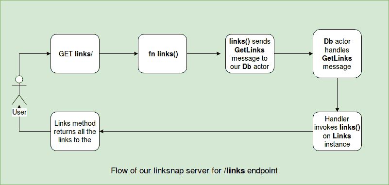

# 使用 Rust 构建 Web 应用程序

在本章中，我们将探讨使用 Rust 构建网络应用。我们将了解使用静态类型系统构建网络应用时的好处，以及编译语言的速度。我们还将探索 Rust 的强类型 HTTP 库，并通过练习构建一个 URL 缩短器。在此之后，我们将研究一个非常流行的框架 Actix-web，并使用它构建一个书签 API 服务器。

本章将涵盖以下主题：

+   Rust 中的网络应用

+   使用 Hyper Crate 构建 URL 缩短器

+   网络框架的需求

+   理解 Actix-web 框架

+   使用 Actix-web 构建 HTTP Rest API

# Rust 中的网络应用

*"程序最重要的属性是它是否实现了用户的意图。"*

– *C. A. R. 霍尔*

低级语言通常难以同时让开发者使用它编写网络应用并提供动态语言那样的高级人机工程学。然而，使用 Rust 则恰恰相反。用 Rust 开发网络应用与动态语言如 Ruby 或 Python 的体验相似，这得益于其高级抽象。

尽管在动态语言中开发的网络应用可以走得很远，但许多开发者发现，当他们的代码库达到大约 10 万行代码时，他们开始看到动态语言的脆弱本质。随着你做的每一个小改动，你都需要有测试来告诉你应用程序的哪些部分受到影响。随着应用程序的增长，在测试和更新方面，它变成了一个打地鼠的情况。

在像 Rust 这样的静态类型语言中构建网络应用是另一种层次的经验。在这里，你可以在代码编译时进行检查，从而大大减少你需要编写的单元测试数量。你也不需要像动态语言那样运行时（如运行 GC 的解释器）的开销。使用静态类型语言编写的网络应用可以编译为一个单一的静态二进制文件，只需最少的设置即可部署。此外，你从类型系统中获得速度和准确性的保证，并且在代码重构期间，编译器提供了大量帮助。Rust 给你所有这些保证，同时保持了动态语言的高层感觉。

网络应用主要位于应用层协议之上，并使用 HTTP 协议进行通信。HTTP 是一种无状态协议，其中每个消息要么是客户端或服务器发送的请求，要么是响应。HTTP 协议中的消息由头部和有效负载组成。头部提供了 HTTP 消息的上下文信息，例如其来源或有效负载的长度，而有效负载包含实际数据。HTTP 是一种基于文本的协议，我们通常使用库来执行将字符串解析为适当的 HTTP 消息的繁重工作。这些库进一步用于在其之上构建高级抽象，例如 Web 框架。

在 Rust 中，我们使用`hyper`crate 来使用 HTTP，我们将在下一节中对其进行探讨。

# 使用 Hyper 的强类型 HTTP

`hyper`crate 可以解析 HTTP 消息，并具有优雅的设计，专注于强类型 API。它被设计为原始 HTTP 请求的类型安全抽象，与 HTTP 库中的常见主题相反：将一切描述为字符串。例如，Hyper 中的 HTTP 状态码被定义为枚举，例如，类型`StatusCode`。对于几乎所有可以强类型化的内容，例如 HTTP 方法、MIME 类型、HTTP 头部等，都是如此。

Hyper 将客户端和服务器功能分别拆分为独立的模块。客户端允许你使用可配置的请求体、头部和其他低级配置来构建和发送 HTTP 请求。服务器端允许你打开监听套接字并将其请求处理器附加到它。然而，它不包括任何请求路由处理器实现——这留给了 Web 框架。它被设计成作为构建更高层次 Web 框架的基础 crate。它底层使用相同的`tokio`和`futures`异步抽象，因此性能非常出色。

在其核心，Hyper 具有`Service`特质概念：

```rs
pub trait Service {
    type ReqBody: Payload;
    type ResBody: Payload;
    type Error: Into<Box<dyn StdError + Send + Sync>>;
    type Future: Future<Item = Response<Self::ResBody>, Error = Self::Error>;
    fn call(&mut self, req: Request<Self::ReqBody>) -> Self::Future;
}
```

`Service`特质代表一种处理来自任何客户端发送的 HTTP 请求并返回`Response`（一个 future）的类型。该特质的核心 API，类型需要实现的是`call`方法，它接受一个参数化泛型类型`Body`的`Request`，并返回一个解析为参数化关联类型`ResBody`的`Response`的`Future`。我们不需要手动实现这个特质，因为 Hyper 包含一系列可以为你实现`Service`特质的工厂方法。你只需要提供一个函数，该函数接受 HTTP 请求并返回响应。

在下一节中，我们将探讨 hyper 的客户端和服务器 API。让我们从从头开始构建 URL 缩短器来探索服务器 API。

# Hyper 服务器 API——构建 URL 缩短器

在本节中，我们将构建一个 URL 缩短服务器，该服务器公开一个`/shorten`端点。此端点接受一个包含要缩短的 URL 的`POST`请求。让我们通过运行`cargo new hyperurl`并使用以下依赖项在`Cargo.toml`中启动一个新的项目：

```rs
# hyperurl/Cargo.toml

[dependencies]
hyper = "0.12.17"
serde_json = "1.0.33"
futures = "0.1.25"
lazy_static = "1.2.0"
rust-crypto = "0.2.36"
log = "0.4"
pretty_env_logger = "0.3"
```

我们将命名我们的 URL 缩短服务器为**hyperurl**。URL 缩短服务是一种提供为任何给定 URL 创建更短 URL 的功能的服务。当你有一个非常长的 URL 时，与某人分享它变得很麻烦。今天存在许多 URL 缩短服务，例如*bit.ly*。如果你使用过 Twitter，用户在推文中经常使用短 URL，以节省空间。

这是我们的`main.rs`中的初始实现：

```rs
// hyperurl/src/main.rs

use log::{info, error};
use std::env;

use hyper::Server;
use hyper::service::service_fn;

use hyper::rt::{self, Future};

mod shortener;
mod service;
use crate::service::url_service;

fn main() {
    env::set_var("RUST_LOG","hyperurl=info");
    pretty_env_logger::init();

    let addr = "127.0.0.1:3002".parse().unwrap();
    let server = Server::bind(&addr)
        .serve(|| service_fn(url_service))
        .map_err(|e| error!("server error: {}", e));
    info!("URL shortener listening on http://{}", addr);
    rt::run(server);
}
```

在`main`中，我们创建了一个`Server`实例，并将其绑定到我们的回环地址和端口号字符串`"127.0.0.1:3002"`。这返回了一个 builder 实例，我们在其中调用`serve`，然后传递实现`Service`特质的函数`url_service`。函数`url_service`将`Request`映射到`Response`的 future。`service_fn`是一个具有以下签名的工厂函数：

```rs
pub fn service_fn<F, R, S>(f: F) -> ServiceFn<F, R> where
    F: Fn(Request<R>) -> S,
    S: IntoFuture,
```

如您所见，F 需要是一个 Fn 闭包，

我们的`url_service`函数实现了`Service`特质。接下来，让我们看看`service.rs`中的代码：

```rs
// hyperurl/src/service.rs

use std::sync::RwLock;
use std::collections::HashMap;
use std::sync::{Arc};
use std::str;
use hyper::Request;
use hyper::{Body, Response};
use hyper::rt::{Future, Stream};

use lazy_static::lazy_static;

use crate::shortener::shorten_url;

type UrlDb = Arc<RwLock<HashMap<String, String>>>;
type BoxFut = Box<Future<Item = Response<Body>, Error = hyper::Error> + Send>;

lazy_static! {
    static ref SHORT_URLS: UrlDb = Arc::new(RwLock::new(HashMap::new()));
}

pub(crate) fn url_service(req: Request<Body>) -> BoxFut {
    let reply = req.into_body().concat2().map(move |chunk| {
        let c = chunk.iter().cloned().collect::<Vec<u8>>();
        let url_to_shorten = str::from_utf8(&c).unwrap();
        let shortened_url = shorten_url(url_to_shorten);
        SHORT_URLS.write().unwrap().insert(shortened_url, url_to_shorten.to_string());
        let a = &*SHORT_URLS.read().unwrap();
        Response::new(Body::from(format!("{:#?}", a)))
    });

    Box::new(reply)
}
```

此模块公开一个名为`url_service`的单个函数，它实现了`Service`特质。我们的`url_service`方法通过接受一个`Request<Body>`类型的 req 并返回一个位于`Box`之后的 future 来实现`call`方法。

接下来是我们的`shortener`模块：

```rs
// hyperurl/src/shortener.rs

use crypto::digest::Digest;
use crypto::sha2::Sha256;

pub(crate) fn shorten_url(url: &str) -> String {
    let mut sha = Sha256::new();
    sha.input_str(url);
    let mut s = sha.result_str();
    s.truncate(5);
    format!("https://u.rl/{}", s)
}
```

我们的`shorten_url`函数接受一个要缩短的 URL 作为`&str`。然后它计算 URL 的 SHA-256 哈希值并将其截断为长度为五的字符串。这显然不是真正的 URL 缩短器的工作方式，也不是一个可扩展的解决方案。然而，对于我们的演示目的来说，这已经足够了。

让我们试一试：


我们的服务器正在运行。在这个时候，我们可以通过 curl 发送 POST 请求。我们将通过构建一个用于向此服务器发送 URL 以缩短的命令行客户端来实现这一点。

虽然 Hyper 推荐用于复杂的 HTTP 应用程序，但每次创建处理程序服务、注册它并在运行时中运行它都相当繁琐。通常，为了构建需要执行几个`GET`请求的小型工具，如 CLI 应用程序，这会显得有些过度。幸运的是，我们有一个名为`reqwest`的 hyper 的包装器，它具有自己的观点。正如其名所示，它受到了 Python 的 Requests 库的启发。我们将使用它来构建我们的 hyperurl 客户端，该客户端发送 URL 缩短请求。

# hyper 作为客户端 – 构建 URL 缩短客户端

现在我们已经准备好了 URL 缩短服务，让我们探索 hyper 的客户端。尽管我们可以构建一个用于缩短 URL 的 Web UI，但我们将保持简单，并构建一个 **命令行界面 (CLI)** 工具。CLI 可以用来传递任何需要缩短的 URL。作为回应，我们将从我们的 hyperurl 服务器获得缩短后的 URL。

虽然 hyper 推荐用于构建复杂网络应用程序，但每次需要创建处理程序服务、注册它并在运行时实例中运行它时，都需要进行大量设置。当构建较小的工具，如需要执行几个 GET 请求的 CLI 应用程序时，所有这些步骤都显得过于繁琐。幸运的是，我们有一个方便的 hyper 包装 crate，名为 **reqwest**，它抽象了 hyper 的客户端 API。正如其名所示，它受到了 Python 的 Requests 库的启发。

让我们通过在 `Cargo.toml` 文件中添加以下依赖项来运行 `cargo new shorten` 创建一个新的项目：

```rs
# shorten/Cargo.toml

[dependencies]
quicli = "0.4"
structopt = "0.2"
reqwest = "0.9"
serde = "1"
```

为了构建 CLI 工具，我们将使用 `quicli` 框架，这是一个高质量 crate 的集合，有助于构建 CLI 工具。`structopt` crate 与 `quicli` 一起使用，而 `serde` crate 则用于 `structopt` crate 的 derive 宏。为了向我们的 hyperurl 服务器发送 `POST` 请求，我们将使用 `reqwest` crate。

我们的 `main.rs` 文件内部有以下代码：

```rs
// shorten/src/main.rs

use quicli::prelude::*;
use structopt::StructOpt;

const CONN_ADDR: &str = "127.0.0.1:3002";

/// This is a small CLI tool to shorten urls using the hyperurl
/// url shortening service
#[derive(Debug, StructOpt)]
struct Cli {
    /// The url to shorten
    #[structopt(long = "url", short = "u")]
    url: String,
    // Setting logging for this CLI tool
    #[structopt(flatten)]
    verbosity: Verbosity,
}

fn main() -> CliResult {
    let args = Cli::from_args();
    println!("Shortening: {}", args.url);
    let client = reqwest::Client::new();
    let mut res = client
        .post(&format!("http://{}/shorten", CONN_ADDR))
        .body(args.url)
        .send()?;
    let a: String = res.text().unwrap();
    println!("http://{}", a);
    Ok(())
}
```

在我们的 hyperurl 服务器仍然运行的情况下，我们将打开一个新的终端窗口，并使用 `cargo run -- --url https://rust-lang.org` 调用 shorten：


让我们转到浏览器，使用缩短后的 URL，即 `http://127.0.0.1:3002/abf27`：


在探索了 hyper 之后，让我们提高一点层次。在下一节中，我们将探索基于 `actix` 包中 actor 模型实现的快速网络应用程序框架 Actix-web。但是，首先让我们谈谈为什么我们需要网络框架。

# 网络框架

在我们开始探索 `actix-web` 之前，我们需要了解一些动机，即为什么我们最初需要网络框架。正如我们许多人所知，网络是一个复杂且不断发展的空间。在编写网络应用程序时，有许多细节需要处理。你需要设置路由规则和认证策略。除此之外，随着应用程序的发展，还有一些最佳实践和类似的模式，如果你不使用网络框架，你将不得不重复实现。

每次自己构建网络应用程序时，都需要重新发明这些网络应用程序的基础属性，这相当繁琐。一个具体的例子是，当你在应用程序中提供不同的路由时。在一个从头开始构建的网络应用程序中，你必须从请求中解析资源路径，对其进行一些匹配，并对请求采取行动。网络框架通过提供 DSLs 自动化路由和路由处理程序的匹配，允许你以更干净的方式配置路由规则。网络框架还抽象了围绕构建网络应用程序的所有最佳实践、常见模式和惯例，为开发者提供一个先发优势，使他们能够专注于业务逻辑，而不是重新发明已经解决的问题的解决方案。

Rust 社区最近出现了很多正在开发中的网络框架，如 Tower、Tide、Rocket、`actix-web`、Gotham 等。在撰写本书时，功能最丰富且最活跃的框架是 Rocket 和 `actix-web`。虽然 Rocket 非常简洁且是一个完善的框架，但它需要 Rust 编译器的 nightly 版本。不过，随着 Rocket 所依赖的 API 的稳定，这个限制很快就会被移除。目前它的直接竞争对手是 `actix-web`，它运行在稳定的 Rust 上，并且与 Rocket 框架提供的用户体验非常接近。接下来我们将介绍 `actix-web`。

# Actix-web 基础

Actix-web 框架建立在 actix crate 实现的 actor 模型之上，我们已经在第七章“高级概念”中介绍过。Actix-web 自称是一个小巧、快速且实用的 HTTP 网络框架。它主要是一个异步框架，内部依赖于 tokio 和 futures crate，同时也提供了同步 API，并且这两个 API 可以无缝组合。

使用 `actix-web` 编写的任何网络应用程序的入口点是 `App` 结构体。在 `App` 实例上，我们可以配置各种路由处理程序和中间件。我们还可以使用任何需要跨请求/响应维护的状态初始化我们的 `App`。`App` 上提供的路由处理程序实现了 `Handler` 特性，它们只是将请求映射到响应的函数。它们还可以包括请求过滤器，根据谓词禁止对特定路由的访问。

Actix-web 内部会启动多个工作线程，每个线程都有自己的 tokio 运行时。

基本概念介绍完毕，现在让我们直接进入主题，通过 Actix-web 实现一个 REST API 服务器。

# 使用 Actix-web 构建 Bookmarks API

我们将创建一个 REST API 服务器，允许您存储您希望稍后阅读的任何博客或网站的收藏夹和链接。我们将我们的服务器命名为 `linksnap`**。** 让我们通过运行 `cargo new linksnap` 创建一个新的项目。在这个实现中，我们不会为发送到我们的 API 的任何链接使用数据库进行持久化，而将简单地使用内存中的 `HashMap` 来存储我们的条目。这意味着每次我们的服务器重启时，所有存储的收藏夹都将被删除。在 第十四章，*在 Rust 中与数据库交互*，我们将集成数据库与 `linksnap`，这将允许我们持久化收藏夹。

在 `linksnap/` 目录下，`Cargo.toml` 中有以下内容：

```rs
# linksnap/Cargo.toml

[dependencies]
actix = "0.7"
actix-web = "0.7"
futures = "0.1"
env_logger = "0.5"
bytes = "0.4"
serde = "1.0.80"
serde_json = "1.0.33"
serde_derive = "1.0.80"
url = "1.7.2"
log = "0.4.6"
chrono = "0.4.6"
```

我们将在我们的 API 服务器中实现以下端点：

+   `/links` 是一个 `GET` 方法，用于检索服务器上存储的所有链接列表。

+   `/add` 是一个 `POST` 方法，用于存储链接条目并返回一个类型为 `LinkId` 的响应。这可以用来从服务器上删除链接。

+   `/rm` 是一个 `DELETE` 方法，用于删除具有给定 `LinkId` 的链接。

我们将我们的服务器实现分为三个模块：

+   `links`：此模块提供了 `Links` 和 `Link` 类型，分别代表链接集合和单个链接。

+   `route_handlers`：此模块包含我们所有的路由处理器。

+   `state`：此模块包含了一个 actor 的实现以及它可以在我们的 `Db` 结构体上接收的所有消息。

从用户请求到 actor 的示例流程在 `/links` 端点如下：



让我们通过查看 `main.rs` 中的内容来了解实现：

```rs
// linksnap/src/main.rs

mod links;
mod route_handlers;
mod state;

use std::env;
use log::info;
use crate::state::State;
use crate::route_handlers::{index, links, add_link, rm_link};
use actix_web::middleware::Logger;
use actix_web::{http, server, App};

fn init_env() {
    env::set_var("RUST_LOG", "linksnap=info");
    env::set_var("RUST_BACKTRACE", "1");
    env_logger::init();
    info!("Starting http server: 127.0.0.1:8080");
}

fn main() {
    init_env();
    let system = actix::System::new("linksnap");
    let state = State::init();

    let web_app = move || {
        App::with_state(state.clone())
            .middleware(Logger::default())
            .route("/", http::Method::GET, index)
            .route("/links", http::Method::GET, links)
            .route("/add", http::Method::POST, add_link)
            .route("/rm", http::Method::DELETE, rm_link)
    };

    server::new(web_app).bind("127.0.0.1:8080").unwrap().start();
    let _ = system.run();
}
```

在 `main` 中，我们首先调用 `init_env`，这为我们设置从服务器获取日志的环境，打开 `RUST_BACKTRACE` 变量以打印任何错误的详细跟踪，并通过调用 `env_logger::init()` 初始化我们的日志记录器。然后我们创建我们的系统 actor，它是 actor 模型中所有 actor 的父 actor。然后我们通过调用 `State::init()` 创建我们的服务器状态并将其存储在 `state` 中。这将在 `state.rs` 中封装我们的内存数据库 actor 类型 `Db`。我们稍后会详细介绍。

然后，我们通过调用 `App::with_state` 在闭包中创建我们的 `App` 实例，从而传递我们的应用程序 `state` 的克隆。这里的 `clone` 调用很重要，因为我们需要在多个 actix 工作线程之间共享单个共享状态。Actix-web 内部使用新的 App 实例启动多个线程来处理请求，并且每次调用此状态都将有自己的应用程序状态副本。如果我们不共享单个真相来源的引用，那么每个 `App` 都将有自己的 `HashMap` 条目副本，这是我们不想看到的。

然后，我们通过传递一个 `Logger` 来使用 `middleware` 方法将我们的 `App` 链接起来。这样，当客户端击中我们配置的任何一个端点时，都会记录任何请求。然后我们添加了一堆 `route` 方法调用。`route` 方法接受一个作为字符串的 `HTTP` 路径，一个 HTTP 方法，以及一个将 `HttpRequest` 映射到 `HttpResponse` 的 `handler` 函数。我们稍后会探讨 `handler` 函数。

在配置并存储 `web_app` 实例后，我们将其传递给 `server::new()`，然后将其绑定到地址字符串 `"127.0.0.1:8080"`。然后我们调用 `start` 来在一个新的 `Arbiter` 实例中启动应用，这只是一个新的线程。根据 actix，`Arbiter` 是运行 actors 并可以访问事件循环的线程。最后，我们通过调用 `system.run()` 来运行我们的系统 actor。`run` 方法内部启动一个 `tokio` 运行时并启动所有 arbiter 线程。

接下来，让我们看看 `route_handlers.rs` 中的路由处理器。此模块定义了我们服务器实现中可用的所有类型的路由：

```rs
// linksnap/src/route_handlers.rs

use actix_web::{Error, HttpRequest, HttpResponse};

use crate::state::{AddLink, GetLinks, RmLink};
use crate::State;
use actix_web::AsyncResponder;
use actix_web::FromRequest;
use actix_web::HttpMessage;
use actix_web::Query;
use futures::Future;

type ResponseFuture = Box<Future<Item = HttpResponse, Error = Error>>;

macro_rules! server_err {
    ($msg:expr) => {
        Err(actix_web::error::ErrorInternalServerError($msg))
    };
}
```

首先，我们有一堆导入，然后定义了几个辅助类型。`ResponseFuture` 是一个方便的类型别名，用于一个解析为 `HttpResponse` 的装箱 `Future`。然后我们有一个名为 `server_err!` 的辅助宏，它返回一个带有给定描述的 `actix_web::error` 类型。我们使用这个宏作为在客户端请求处理失败时返回错误的方便方式。

接下来，我们拥有处理 `/` 端点 get 请求的最简单路由处理器：

```rs
linksnap/src/route_handlers.rs

pub fn index(_req: HttpRequest<State>) -> HttpResponse {
    HttpResponse::from("Welcome to Linksnap API server")
}
```

`index` 函数接受一个 `HttpRequest` 并简单地返回一个由字符串构造的 `HttpResponse`。`HttpRequest` 类型可以参数化任何类型。默认情况下，它是一个 `()`。对于我们的路由处理器，我们将其参数化为我们的 `State` 类型。这个 `State` 封装了我们的内存数据库，该数据库作为 actor 实现。`State` 是 `Addr<Db>` 的包装器，它是我们的 `Db` actor 的地址。

这是一个对我们内存数据库的引用。我们将使用它来向我们的内存数据库发送消息以插入、删除或获取链接。我们稍后会探讨这些 API。让我们看看同一文件中的其他处理器：

```rs
// linksnap/src/route_handlers.rs

pub fn add_link(req: HttpRequest<State>) -> ResponseFuture {
    req.json()
        .from_err()
        .and_then(move |link: AddLink| {
            let state = req.state().get();
            state.send(link).from_err().and_then(|e| match e {
                Ok(_) => Ok(HttpResponse::Ok().finish()),
                Err(_) => server_err!("Failed to add link"),
            })
        })
        .responder()
}
```

我们的 `add_link` 函数处理添加链接的 `POST` 请求。此处理器期望一个具有以下格式的 JSON 主体：

```rs
{
    title: "Title of the link or bookmark",
    url: "The URL of the link"
}
```

在这个函数中，我们首先通过调用`req.json()`获取请求体作为 JSON。这返回一个 future。然后我们使用`from_err`方法将来自 json 方法的任何错误映射到与 actix 兼容的错误。`json`方法可以从请求的有效负载中提取类型化信息，因此返回一个`JsonBody<T>` future。这个`T`由下一个方法链`and_then`推断为`AddLink`，我们将解析的值发送到我们的`Db`演员。向我们的演员发送消息可能会失败，所以如果发生这种情况，我们再次匹配返回的值。在`Ok`的情况下，我们回复一个空的 HTTP 成功响应，否则我们使用`server_err!`宏传递错误描述来失败。

接下来，我们有一个`"/links"`端点：

```rs
// linksnap/src/route_handlers.rs

pub fn links(req: HttpRequest<State>) -> ResponseFuture {
    let state = &req.state().get();
    state
        .send(GetLinks)
        .from_err()
        .and_then(|res| match res {
            Ok(res) => Ok(HttpResponse::Ok().body(res)),
            Err(_) => server_err!("Failed to retrieve links"),
        })
        .responder()
}
```

`links`处理程序简单地发送一个`GetLinks`消息到`Db`演员，并在使用`body`方法将其发送回客户端之前返回接收到的响应。然后我们有我们的`rm_link`处理程序，其定义如下：

```rs
// linksnap/src/route_handlers.rs

pub fn rm_link(req: HttpRequest<State>) -> ResponseFuture {
    let params: Query<RmLink> = Query::extract(&req).unwrap();
    let state = &req.state().get();
    state
        .send(RmLink { id: params.id })
        .from_err()
        .and_then(|e| match e {
            Ok(e) => Ok(HttpResponse::Ok().body(format!("{}", e))),
            Err(_) => server_err!("Failed to remove link"),
        })
        .responder()
}
```

要删除一个链接，我们需要将链接 ID（一个`i32`）作为查询参数传递。`rm_link`方法使用方便的`Query::extract`方法将查询参数提取到`RmLink`类型中，该方法接受一个`HttpRequest`实例。接下来，我们获取对`Db`演员的引用，并向其发送一个带有 ID 的`RmLink`消息。我们通过使用`HttpRespnse`的`body`方法构造返回的字符串来返回回复。

这里是我们的`State`和`Db`类型在`state.rs`中的定义：

```rs
// linksnap/src/state.rs

use actix::Actor;
use actix::SyncContext;
use actix::Message;
use actix::Handler;
use actix_web::{error, Error};
use std::sync::{Arc, Mutex};
use crate::links::Links;
use actix::Addr;
use serde_derive::{Serialize, Deserialize};
use actix::SyncArbiter;

const DB_THREADS: usize = 3;

#[derive(Clone)]
pub struct Db {
    pub inner: Arc<Mutex<Links>>
}

impl Db {
    pub fn new(s: Arc<Mutex<Links>>) -> Db {
        Db { inner: s }
    }
}

impl Actor for Db {
    type Context = SyncContext<Self>;
}

#[derive(Clone)]
pub struct State {
    pub inner: Addr<Db>
}

impl State {
    pub fn init() -> Self {
        let state = Arc::new(Mutex::new(Links::new()));
        let state = SyncArbiter::start(DB_THREADS, move || Db::new(state.clone()));
        let state = State {
            inner: state
        };
        state
    }

    pub fn get(&self) -> &Addr<Db> {
        &self.inner
    }
}
```

首先，我们将`DB_THREADS`设置为`3`这个值，这是我们任意选择的。我们将通过一个线程池来向内存数据库发送请求。在这种情况下，我们也可以使用一个普通的演员，但由于我们将在第十四章“使用 Rust 与数据库交互”中将其与数据库集成，我们选择了`SyncArbiter`线程。

接下来，我们有一个`Db`结构体定义，它将`Links`类型封装在一个线程安全的包装器`Arc<Mutex<Links>>`中。然后我们在其上实现`Actor`特质，其中我们指定关联类型`Context`为`SyncContext<Self>`。

然后，我们有一个`State`结构体定义，它是一个`Addr<Db>`，即对`Db`演员实例的句柄。我们还在`State`上定义了两个方法 - `init`用于创建一个新的`State`实例，`get`用于返回对`Db`演员句柄的引用。

接下来，我们有一系列将要发送到我们的`Db`演员的消息类型。我们的`Db`是一个演员，将接收三个消息：

**GetLinks**：这是由`/links`路由处理程序发送的，用于检索服务器上存储的所有链接。它定义如下：

```rs
// linksnap/src/state.rs

pub struct GetLinks;

impl Message for GetLinks {
    type Result = Result<String, Error>;
}

impl Handler<GetLinks> for Db {
    type Result = Result<String, Error>;
    fn handle(&mut self, _new_link: GetLinks, _: &mut Self::Context) -> Self::Result {
        Ok(self.inner.lock().unwrap().links())
    }
}
```

首先是 `GetLinks` 消息，它是由 `/links` 路由处理器发送到 `Db` actor 的。为了使这成为一个 actor 消息，我们将为它实现 `Message` 特性。`Message` 特性定义了一个关联类型 `Result`，这是消息处理器的返回类型。接下来，我们为 `Db` actor 实现了参数化于消息 `GetLinks` 的 `Handler` 特性。

```rs
// linksnap/src/state.rs

pub struct GetLinks;

impl Message for GetLinks {
    type Result = Result<String, Error>;
}

impl Handler<GetLinks> for Db {
    type Result = Result<String, Error>;
    fn handle(&mut self, _new_link: GetLinks, _: &mut Self::Context) -> Self::Result {
        Ok(self.inner.lock().unwrap().links())
    }
}
```

我们为它实现了 `Message` 特性，它返回所有链接的字符串作为响应。

**AddLink**：这是由 `/add` 路由处理器在客户端发送的任何新链接时发送的。它定义如下：

```rs
// linksnap/src/state.rs

#[derive(Debug, Serialize, Deserialize)]
pub struct AddLink {
    pub title: String,
    pub url: String
}

impl Message for AddLink {
    type Result = Result<(), Error>;
}

impl Handler<AddLink> for Db {
    type Result = Result<(), Error>;

    fn handle(&mut self, new_link: AddLink, _: &mut Self::Context) -> Self::Result {
        let mut db_ref = self.inner.lock().unwrap();
        db_ref.add_link(new_link);
        Ok(())
    }
}
```

`AddLink` 类型具有双重功能。当实现了 `Serialize` 和 `Deserialize` 特性时，它作为一个可以从 `add_link` 路由的入站 json 响应体中提取的类型。其次，它还实现了 `Message` 特性，我们可以将其发送到我们的 `Db` actor。

**RmLink**：这是由 `/rm` 路由处理器发送的。它定义如下：

```rs
// linksnap/src/state.rs

#[derive(Serialize, Deserialize)]
pub struct RmLink {
    pub id: LinkId,
}

impl Message for RmLink {
    type Result = Result<usize, Error>;
}

impl Handler<RmLink> for Db {
    type Result = Result<usize, Error>;
    fn handle(&mut self, link: RmLink, _: &mut Self::Context) -> Self::Result {
        let db_ref = self.get_conn()?;
        Link::rm_link(link.id, db_ref.deref())
            .map_err(|_| error::ErrorInternalServerError("Failed to remove links"))
    }
}

```

这是当想要删除链接条目时发送的消息。它接收 RmLink 消息并将其转发

我们可以使用以下 curl 命令插入一个链接：

```rs
curl --header "Content-Type: application/json" \
 --request POST \ 
 --data '{"title":"rust blog","url":"https://rust-lang.org"}' \
 127.0.0.1:8080/add
```

要查看插入的链接，我们可以发出：

```rs
curl 127.0.0.1:8080/links
```

要删除一个链接，给定其 Id，我们可以使用 curl 发送一个 DELETE 请求，如下所示：

```rs
curl -X DELETE 127.0.0.1:8080/rm?id=1
```

# 摘要

在本章中，我们探讨了使用 Rust 构建 Web 应用程序的很多内容，以及鉴于我们可用的优质 crate，开始使用是多么容易。作为一个编译型语言，用 Rust 编写的 Web 应用程序通常比用动态语言编写的其他框架小得多。大多数 Web 框架空间由可以占用大量 CPU 但资源效率不高的解释型动态语言主导。然而，人们使用它们，因为使用它们编写 Web 应用程序非常方便。

用 Rust 编写的 Web 应用程序在运行时占用的空间要小得多。Rust 在运行时也占用更少的内存，因为不需要解释器，这与动态语言的情况一样。使用 Rust，你可以同时获得动态语言的感受和 C 语言的性能。这对 Web 来说是一笔大交易。

在下一章中，我们将探讨 Rust 如何与数据库通信，并通过使用名为 **diesel** 的类型安全 **对象关系映射器 (ORM)** 库来为我们的 `read_list` 服务器添加数据持久性。
