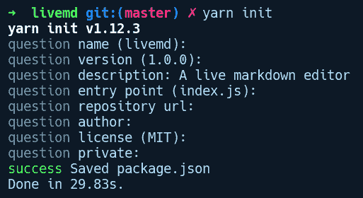
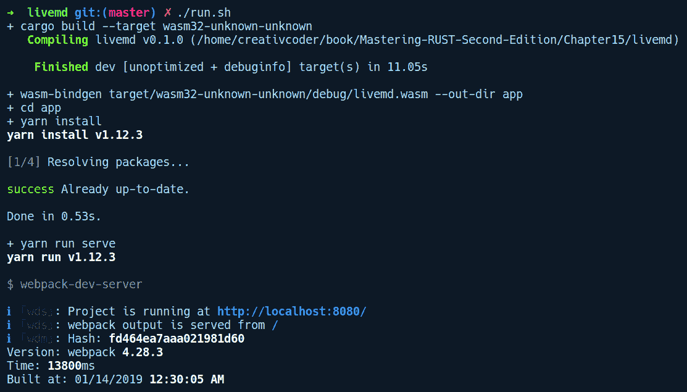
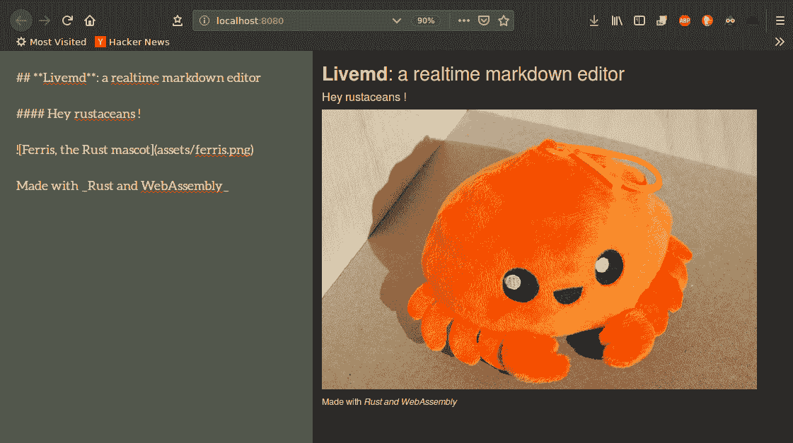

# 使用 WebAssembly 在 Web 上构建 Rust

Rust 超出了其系统编程领域，也可以在 Web 上运行。在本章中，我们将探讨一种实现这一目标的技术，称为 WebAssembly。我们将详细介绍 WebAssembly 究竟是什么，以及如何使用这项技术使 Rust 能够与 JavaScript 一起运行。能够在 Web 浏览器上运行解锁了一个领域，使得 Rust 能够被更广泛的受众使用，即 Web 开发者社区，并使他们能够在应用程序中利用系统语言的功能。在本章的后面部分，我们将探讨提供 WebAssembly 支持的工具和库，并构建一个实时 Markdown 编辑器，该编辑器调用在 Rust 中实现的 API，将 Markdown 文档渲染到 HTML 页面上。

在本章中，我们将涵盖以下主题

+   什么是 WebAssembly？

+   WebAssembly 的目标

+   如何使用 WebAssembly？

+   Rust 和 WebAssembly 的故事以及可用的 crate

+   在 Rust 中构建基于 WebAssembly 的 Web 应用程序

# 什么是 WebAssembly？

“保持好奇心。广泛阅读。尝试新事物。我认为人们所说的许多所谓的智力都归结为好奇心。”                                                                                                           – 阿伦·斯沃茨

WebAssembly 是一套技术和规范，它允许通过编译成名为 **wasm** 的低级编程语言来在 Web 上运行原生代码。从可用性的角度来看，它是一套技术，允许用其他非 Web 编程语言编写的程序在 Web 浏览器上运行。从技术角度来看，WebAssembly 是一个具有二进制、加载时高效的 **指令集架构 (ISA)** 的虚拟机规范。好吧，这是术语过载。让我们稍微简化一下这个定义。正如我们所知，编译器是一个复杂的程序，它将人类可读的编程语言编写的代码转换为由零和一组成的机器代码。然而，这种转换发生在多步过程中。它通过编译的几个阶段来完成，最终编译成特定于机器的汇编语言。随后，特定于机器的汇编器根据目标机器的 ISA 规则将其编码为机器代码。在这里，编译器针对的是真实机器。然而，它不总是必须是真实机器。它也可以是一个虚拟机 (VM)，在真实机器上执行自己的虚拟指令集。虚拟机的一个例子是视频游戏模拟器，如运行在普通计算机上的 Gameboy 模拟器，它模拟 Gameboy 硬件。WebAssembly 虚拟机与此类似！在这里，浏览器引擎实现了 WebAssembly 虚拟机，使我们能够在 JavaScript 旁边运行 wasm 代码。

指令集架构或 ISA 定义了计算机如何执行指令以及它在最低级别支持的操作类型。这个 ISA 不一定要总是为真实的物理机器定义；它也可以为虚拟机定义。Wasm 是 WebAssembly 虚拟机的 ISA。

过去 5 年中，对网络及其各种应用的日益依赖导致了开发者们努力将他们的代码转换为 JavaScript。这是因为 JavaScript 是最受欢迎的，也是网络上的唯一跨平台技术。一个名为`asm.js`的项目，由 Mozilla（JavaScript 的一个更快的子集）发起，是第一个努力使网络更高效、足够快以满足不断增长需求的项目。从`asm.js`及其创立原则和所学经验中，WebAssembly 应运而生。

WebAssembly 是来自各大公司浏览器委员会的共同努力，包括 Mozilla、Google、Apple 和 Microsoft。自 2018 年初以来，它作为各种语言的编译目标而受到极大的欢迎，这些语言从使用 Emscripten 工具链的*C++*，到使用 LLVM/Emscripten 的 Rust，使用 AssemblyScript 的 TypeScript，以及其他许多语言。截至 2019 年，所有主要浏览器都在其网络浏览器引擎中实现了 WebAssembly 虚拟机。

WebAssembly 的名字中有 assembly，因为它是一种类似于汇编指令的低级编程语言。它有一组有限的原始类型，这使得语言易于解析和运行。它支持以下类型：

+   **i32**: 32 位整数

+   **i64**: 64 位整数

+   **f32**: 32 位浮点数

+   **f64**: 64 位浮点数

它不像 JavaScript 那样是你每天都会编写的编程语言，而更像是一个编译目标，供编译器使用。WebAssembly 平台和生态系统目前专注于在网络上运行这项技术，但它并不局限于网络。如果一个平台将 WebAssembly 虚拟机规范实现为一个程序，那么 wasm 程序就能在该虚拟机上运行。

为了在任何平台上支持 WebAssembly，需要用该平台支持的语言实现一个虚拟机。这就像 JVM 的平台无关代码——一次编写，运行更快，安全在任何地方！但它的主要目标，到目前为止，是浏览器。大多数网络浏览器都带有 JavaScript 解析器，可以在其浏览器引擎中解析`.js`文件，以使用户能够进行各种交互。为了允许网络也能解释 wasm 文件，这些引擎在其内部实现了 WebAssembly VM，允许浏览器在 JavaScript 代码旁边解释和运行 wasm 代码。

解析 JavaScript 和解析 WebAssembly 代码之间的一个显著差异是，由于其紧凑的表示，wasm 代码的解析速度要快一个数量级。在动态网站上，大多数初始页面加载时间都花在解析 JavaScript 代码上，而使用 WebAssembly 可以为这些网站提供巨大的性能提升。然而，WebAssembly 的目标并不是取代 JavaScript，而是在性能重要时成为 JavaScript 的助手。

根据[`webassembly.org/`](https://webassembly.org/)上的规范，WebAssembly 的语言有两种格式：人类可读的文本格式，`.wat`，适合在最终部署前查看和调试 WebAssembly 代码，以及称为 **wasm** 的紧凑、低级机器格式。`.wasm` 格式是 WebAssembly VM 解释和执行的一种格式。

一个 WebAssembly 程序从模块开始。在模块内部，你可以定义变量、函数、常量等。Wasm 程序以 s-表达式编写。S-表达式是通过嵌套括号分隔的块序列来表示程序的简洁方式。例如，单个 `(1)` 是一个返回值 `1` 的 s-表达式。WebAssembly 中的每个 s-表达式都返回一个值。让我们看看一个非常简单的 WebAssembly 程序，以可读的 `.wat` 格式：

```rs
(module
 (table 0 anyfunc)
 (memory $0 1)
 (export "memory" (memory $0))
 (export "one" (func $one))
 (func $one (; 0 ;) (result i32)
  (i32.const 1)
 )
)
```

在前面的 `wat` 代码中，我们有一个包含其他嵌套 s-表达式的父 s-表达式块 `(module)`。在 `module` 内部，我们有名为 `table`、`memory` 和 `export` 的部分，以及一个返回 `i32` 的 `func` 定义 `$one`。我们不会深入探讨它们的细节，因为这会让我们偏离主题太远。

关于 wasm 程序的一个重要点是，它们在表示上非常高效，可以在浏览器中比 JavaScript 快得多地发送和解析。话虽如此，WebAssembly 是为了实现一系列目标而设计的，而不是作为一个通用编程语言。

# WebAssembly 的设计目标

WebAssembly 的设计是主要浏览器供应商之间联合协作的结果。他们共同的目标是以下目标来塑造其设计：

+   **像 JavaScript 一样安全和通用**：网络平台是一个不安全的环境，运行不受信任的代码对网络用户的安全是有害的。

+   **以原生代码的速度运行**：由于语言相当紧凑，WebAssembly 可以比 JavaScript 代码加载得更快，并且可以比 JavaScript 快五倍的速度进行解释。

+   **提供一致、可预测的性能**：作为静态类型，并且在运行时进行非常少的分析，WebAssembly 能够在网络上提供一致的性能，而 JavaScript 由于其动态性质而在这方面表现不足。

+   **允许在 Web 和本地之间重用代码**：许多现有的 C/C++、Rust 和其他语言的代码库现在可以在编译成 WebAssembly 后重用并在网络上运行。

# 开始使用 WebAssembly

虽然可以手动编写 WebAssembly 模块，但这样做并不建议，因为代码难以维护且不便于人类使用。它是一种相当低级的语言，因此，使用原始 wasm 代码创建复杂的应用程序可能会具有挑战性且耗时。相反，它通常被编译成或从各种语言生成。让我们看看我们可以使用的可用工具，以探索 WebAssembly 程序的编写和运行细节。

# 在线尝试

在我们讨论 WebAssembly 如何作为不同语言生态系统的编译目标之前，我们可以在网上探索它，而无需在我们的机器上做任何设置。以下是一些可以用来做这件事的工具：

+   **WebAssembly Studio**：Mozilla 的人们创建了一个非常实用的工具，可以快速尝试 WebAssembly，它托管在 [`webassembly.studio`](https://webassembly.studio)。使用这个工具，我们可以快速实验和原型设计 WebAssembly 的想法。

+   **Wasm Fiddle**：这是另一个方便的工具，可以在线尝试 wasm 代码，可以在 [`wasdk.github.io/WasmFiddle/`](https://wasdk.github.io/WasmFiddle/) 找到。

在线还有其他工具和社区资源供您探索，您都可以在 [`github.com/mbasso/awesome-wasm`](https://github.com/mbasso/awesome-wasm) 找到。

# 生成 WebAssembly 的方法

有几个编译器工具链项目可以帮助开发者将任何语言的代码编译为 wasm。编译本地代码对网络有巨大的影响。这意味着大多数主要性能密集型代码现在都可以在网络上运行。例如，可以使用 emscripten LLVM 后端将 C++ 代码编译为 wasm。emscripten 项目接收由 C++ 编译器生成的 LLVM IR，并将其转换为 wasm 格式的 WebAssembly 模块。还有像 AssemblyScript 这样的项目，使用类似 emscripten 的工具 binaryen 将 TypeScript 代码转换为 WebAssembly。Rust 还默认支持通过 LLVM 的本地 WebAssembly 后端生成 WebAssembly 代码。使用 Rust 编译到 wasm 非常简单。首先，我们需要运行以下代码来添加 wasm：

```rs
rustup target add wasm32-unknown-unknown
```

完成这些后，我们可以通过运行以下代码将任何 Rust 程序编译为 wasm：

```rs
 cargo build --target=wasm32-unknown-unknown
```

这是从 Rust crate 创建 wasm 文件所需的最基本内容，但从那里开始有很多手动操作。幸运的是，围绕 wasm 和 Rust 生态系统正在开发一些惊人的项目，允许进行更高级、更直观的 JavaScript 和 Rust 之间的交互，反之亦然。我们将探索这样一个项目，称为 wasm-bindgen，并很快构建一个真实世界的 Web 应用程序。

# Rust 和 WebAssembly

Rust 和 WebAssembly 围绕的生态系统正在以相当快的速度发展，社区在就构建实用应用程序的工具集达成一致之前还需要一段时间。幸运的是，一些工具和库正在出现，为我们描绘了当使用 WebAssembly 在 Rust 中构建 Web 应用程序时，作为开发者我们可以期待什么。

在本节中，我们将探索一个来自社区的库，称为 `wasm-bindgen`*.* 这个库基本上是一个正在进行中的项目，因为 WebAssembly 规范本身也是一个正在进行中的项目，但尽管如此，它仍然功能丰富，可以探索可能实现的内容。

# Wasm-bindgen

`wasm-bindgen` 是由 GitHub 上的 rust-wasm 团队开发的一个库。它允许 Rust 代码调用 JavaScript 代码，反之亦然。基于这个库，已经构建了其他高级库，如 `web-sys` 库和 `js-sys` 库。

JavaScript 本身是由 ECMA 标准定义的，但该标准并未指定其在网页上的工作方式。JavaScript 可以支持许多宿主环境，而网页恰好是其中之一。`web-sys` 库提供了对网页上所有 JavaScript API 的访问，即 DOM API，如 `Window`、`Navigator`、`EventListener` 等。`js-sys` 库提供了 ECMA 标准规范中指定的所有基本 JavaScript 对象，即函数、对象、数字等。

由于 WebAssembly 只支持数值类型，`wasm-bindgen` 库生成垫片，允许你在 JavaScript 中使用原生 Rust 类型。例如，Rust 中的结构体在 JavaScript 端表示为对象，而 `Promise` 对象在 Rust 端可以像 `Future` 一样访问。它通过在函数定义上使用 `#[wasm-bindgen]` 属性宏来实现所有这些。

为了探索 `wasm-bindgen` 以及它与 JavaScript 的交互方式，我们将构建一些实用的东西。我们将构建一个实时 Markdown 编辑器应用程序，允许你编写 Markdown 并查看渲染的 HTML 页面。不过，在我们开始之前，我们需要安装 wasm-bindgen-cli 工具，该工具将为我们生成垫片，使我们能够方便地使用库中暴露的 Rust 函数。我们可以通过运行以下命令来安装它：

```rs
cargo install wasm-bindgen-cli
```

接下来，让我们通过运行 `cargo new livemd` 并在 `Cargo.toml` 中包含以下内容来创建一个新的项目：

```rs
[package]
name = "livemd"
version = "0.1.0"
authors = ["Rahul Sharma <creativcoders@gmail.com>"]
edition = "2018"

[lib]
crate-type = ["cdylib"]

[dependencies]
wasm-bindgen = "0.2.29"
comrak = "0.4.0"
```

我们将我们的库命名为 `livemd`。我们的库是 `cdylib` 类型，并暴露了一个 C 接口，因为 WebAssembly 接受广泛可移植的动态 C 库接口，大多数语言都可以编译成这种接口。接下来，我们还将在我们目录的根目录下创建一个 `run.sh` 脚本，它将允许我们构建和运行我们的项目，并在我们更改任何代码时使用 `cargo-watch` 重新运行它。以下是 `run.sh` 文件的内容：

```rs
#!/bin/sh

set -ex

cargo build --target wasm32-unknown-unknown
wasm-bindgen target/wasm32-unknown-unknown/debug/livemd.wasm --out-dir app
cd app
yarn install
yarn run serve
```

接下来是 `lib.rs` 中 markdown 转换代码的实现，完整如下：

```rs
// livemd/src/lib.rs

use wasm_bindgen::prelude::*;

use comrak::{markdown_to_html, ComrakOptions};

#[wasm_bindgen]
pub fn parse(source: &amp;str) -> String {
    markdown_to_html(source, &amp;ComrakOptions::default())
}
```

我们的 `livemd` 包公开一个名为 `pars` 的单个函数，它接受来自网页上（尚未创建）的 `textarea` 标签的 Markdown 文本，并通过调用 `comrak` 包中的 `markdown_to_html` 函数返回编译后的 HTML 字符串。如您所注意到的，`parse` 方法被注释为 `#[wasm_bindgen]` 属性。此宏生成所有类型的底层转换代码，并且是暴露此函数到 JavaScript 所必需的。使用此属性，我们不必关心我们的解析方法将接受什么类型的字符串。JavaScript 中的字符串与 Rust 中的字符串不同。`#[wasm_bindgen]` 属性处理这种差异以及将字符串从 JavaScript 端转换为低级细节，在我们接受它作为 `&str` 类型之前。在撰写本书时，有一些类型 `wasm-bindgen` 无法转换，例如带有生命周期注释的引用和类型定义。

我们接下来需要为这个包生成 wasm 文件。但在我们这样做之前，让我们设置我们的应用。在相同的目录下，我们将创建一个名为 `app/` 的目录，并通过运行 `yarn init` 来初始化我们的项目：



`yarn init` 创建我们的 `package.json` 文件。除了常规字段外，我们还将指定 `scripts` 和 `dev-dependencies`：

```rs
{
  "name": "livemd",
  "version": "1.0.0",
  "description": "A live markdown editor",
  "main": "index.js",
  "license": "MIT",
  "scripts": {
    "build": "webpack",
    "serve": "webpack-dev-server"
  },
  "devDependencies": {
    "html-webpack-plugin": "³.2.0",
    "webpack": "⁴.28.3",
    "webpack-cli": "³.2.0",
    "webpack-dev-server": "³.1.0"
  }
}
```

我们将使用 webpack 来启动我们的开发 web 服务器。Webpack 是一个模块打包器。模块打包器将多个 JavaScript 源文件打包成一个文件，可能还会对其进行压缩以便在网络上使用。为了配置 webpack 以便我们可以打包我们的 JavaScript 和 wasm 生成的代码，我们将在名为 `webpack.config.js` 的文件中创建一个 webpack 配置文件：

```rs
// livemd/app/webpack.config.js

const path = require('path');
const HtmlWebpackPlugin = require('html-webpack-plugin');

module.exports = {
    entry: './index.js',
    output: {
        path: path.resolve(__dirname, 'dist'),
        filename: 'index.js',
    },
    plugins: [
        new HtmlWebpackPlugin({
            template: "index.html"
        })
    ],
    mode: 'development'
};
```

接下来，在相同的 `app/` 目录下，我们将创建三个文件：

+   `index.html`: 这包含应用的 UI：

```rs
<!--livemd/app/index.html-->

<!DOCTYPE html>
<html>
<head>
    <title>Livemd: Realtime markdown editor</title>
    <link href="https://maxcdn.bootstrapcdn.com/bootstrap/3.3.4/css/bootstrap.min.css" rel="stylesheet">
    <link href="https://fonts.googleapis.com/css?family=Aleo" rel="stylesheet"> 
    <link href="styles.css" rel="stylesheet">
</head>

<body class="container-fluid">
    <section class="row">
        <textarea class="col-md-6 container" id="editor">_Write your text here.._</textarea>
        <div class="col-md-6 container" id="preview"></div>
    </section>
    <script src="img/index.js" async defer></script>
</body>
</html>
```

我们已声明一个具有 ID 为 `editor` 的 `<textarea>` HTML 元素。这将在左侧显示，并且是您可以在此处编写 Markdown 的地方。接下来，我们有一个具有 ID 为 `preview` 的 `<div>` 元素，它将显示实时渲染的 HTML 内容。

+   `style.css`: 为了使我们的应用看起来更美观，此文件为应用中的实时编辑器和预览面板提供基本的样式：

```rs
/* livemd/app/styles.css */

html, body, section, .container {
    height: 100%;
} 

#editor {
    font-family: 'Aleo', serif;
    font-size: 2rem;
    color: white;
    border: none;
    overflow: auto;
    outline: none;
    resize: none;

    -webkit-box-shadow: none;
    -moz-box-shadow: none;
    box-shadow: none;
    box-shadow: 0px 1px 3px 1px rgba(0, 0, 0, .6);
    background-color: rgb(47,79,79);
}

#preview {
    overflow: auto;
    border: 5px;
    border-left: 1px solid grey;
}
```

+   `index.js`: 此文件提供我们 UI 和 `livemd` 包之间的粘合代码：

```rs
// livemd/app/index.js

import('./livemd').then((livemd) => {
    var editor = document.getElementById("editor");
    var preview = document.getElementById("preview");

    var markdownToHtml = function() {
        var markdownText = editor.value;
        html = livemd.parse(markdownText);
        preview.innerHTML = html;
    };

    editor.addEventListener('input', markdownToHtml);
    // Kick off parsing of initial text
    markdownToHtml();
}).catch(console.error);
```

上述代码导入了 `livemd` 模块，该模块返回一个 `Promise` 实例。然后，我们通过调用 `then` 方法来链式调用由这个承诺产生的值，该方法接受一个匿名函数 `(livemd) => {}`。这个函数接收 wasm 模块（我们命名为 `livemd`）。在这个方法内部，我们通过 ID 获取 `editor` 和 `preview` HTML 元素。然后，我们创建一个名为 `markdownToHtml` 的函数，该函数从 `editor` 元素的 `value` 属性中获取文本并将其传递给 livemd wasm 模块的 `parse` 方法。这返回一个作为字符串的渲染 HTML 文本。然后，我们将 `preview` 元素的 `innerHTML` 属性设置为这个文本。接下来，为了提供用户在 `editor` 元素中任何文本更改的实时反馈，我们需要调用这个函数。我们可以使用 `onInput` 事件处理器来实现。我们对编辑器元素调用 `addEventListener` 方法，使用 `"input"` 事件，并将此函数作为处理器传递。最后，我们调用 `markdownToHtml` 来启动文本的解析和渲染。

就这样——我们已经创建了我们第一个使用 Rust 作为底层并运行 WebAssembly 的 Web 应用程序。

**注意**：这不是一个高效的实现，有很多改进可以做出。然而，由于我们在这里学习工具，为了演示目的，这是可以接受的。

现在，我们需要将我们的 crate 编译成 WebAssembly 代码，即一个 `wasm` 文件，并生成一个捆绑的 JavaScript 文件。我们已经设置了一个名为 `run.sh` 的脚本。以下是运行我们的 `run.sh` 脚本时的输出：



`run.sh` 脚本首先通过运行 `cargo build --target wasm32-unknown-unknown` 构建 `livemd` crate。然后，它调用 `wasm-bindgen` 工具，该工具优化我们的 `wasm` 文件并将其输出到 `app/` 目录。接着，我们在应用目录中运行 `yarn install`，然后是 `yarn run serve`，这会使用 `webpack-dev-server` 插件启动我们的开发服务器。

如果你在运行 wasm-bindgen 命令行时遇到错误，尝试通过运行以下命令更新 livemd/Cargo.toml 中的 wasm-bindgen 依赖项：

```rs
cargo update -p wasm-bindgen
```

我们还需要安装 yarn 包管理器来在本地主机上托管网页。这可以通过运行以下命令来完成：

```rs
$ curl -sS https://dl.yarnpkg.com/debian/pubkey.gpg | sudo apt-key add -
$ echo "deb https://dl.yarnpkg.com/debian/ stable main" | sudo tee /etc/apt/sources.list.d/yarn.list
$ sudo apt-get update &amp;&amp; sudo apt-get install yarn
```

从 webpack 的输出来看，我们的开发服务器正在 `http://localhost:8080` 运行。让我们转到我们的网页浏览器并访问这个地址。以下是我在浏览器中的输出：



如您所见，我们在左侧面板中有 markdown 格式的文本，并且它实时地渲染在右侧的 HTML 中。在底层，我们在这个页面的左侧键入的每一比特文本都被转换成了由我们创建的 `livemd` wasm 模块生成的 HTML 文本。

我们还可以将我们的`livemd`包发布为 npm 包。位于[`github.com/rustwasm/wasm-pack`](https://github.com/rustwasm/wasm-pack)的 wasm-pack 项目提供了构建和分发用 Rust 编写并编译成 WebAssembly 的 npm 模块所需的所有编排。

# 其他 WebAssembly 项目

除了`wasm-bindgen`包及其相关项目外，Rust 社区中还有其他新兴的框架和项目值得探索。

# Rust

Wasm-bindgen 并不是唯一旨在创建出色开发体验的项目。Rust 生态系统中的其他一些项目如下：

+   **Stdweb**：这个包旨在提供一个基于 Rust 的高层 API，用于通过 Web 访问 DOM API。

+   **Yew**：这是一个完整的前端 Web 应用程序构建框架，允许你使用 Rust 编写可以访问 Web API 并将它们编译成 wasm 以便在 Web 上运行的 Web 应用程序。它受到了 Elm 和 ReactJS 项目的启发。它还通过 Web Workers 封装了基于 actor 的消息传递并发。Yew 内部使用`stdweb`包来访问 DOM API。

+   **Nebutlet**：这是一个可以执行 WebAssembly 程序而不需要任何系统调用接口的微内核，这在大多数操作系统实现中通常是标准做法。

+   **Wasmi**：这是一个用 Rust 实现的 wasm 虚拟机，但它与浏览器引擎中的 wasm 虚拟机无关。该项目由以太坊初创公司 Parity 发起，更适合在多个平台上运行 WebAssembly 应用程序。该项目托管在[`github.com/paritytech/wasmi`](https://github.com/paritytech/wasmi)。

# 其他语言

其他语言也有针对 WebAssembly 的技术，例如以下内容：

+   **Life**：Life 是一个用 Golang 实现的 WebAssembly 虚拟机，用于安全地运行高性能、去中心化的应用程序。该项目位于[`github.com/perlin-network/life`](https://github.com/perlin-network/life)。

+   **AssemblyScript**：这是一个 TypeScript 到 WebAssembly 的编译器。

+   **Wagon**：Wagon 是一个用 Golang 编写的 WebAssembly 解释器。

# 摘要

WebAssembly 将对 Web 开发者构建应用程序的方式产生巨大影响，使他们能够以最小的努力获得大量的性能提升。它将允许应用开发者多样化，从而使得他们能够用他们的本地语言编写 Web 应用程序，而无需担心学习其他框架。WebAssembly 不是用来取代 JavaScript 的，而是作为一个高性能语言，用于在 Web 上运行复杂的 Web 应用程序。WebAssembly 标准正在不断演变，并有许多令人兴奋的可能性。

在本章中，我们学习了 Rust 如何编译成 wasm 代码以及帮助在网络上部署 Rust 代码的可用工具。如果你想要了解更多关于 WebAssembly 的信息，请访问优秀的文档：[`developer.mozilla.org/en-US/docs/WebAssembly`](https://developer.mozilla.org/en-US/docs/WebAssembly)。

在下一章中，我们将学习一些关于 GUI 开发以及如何使用 Rust 构建桌面应用程序的内容。
