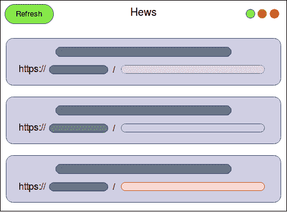
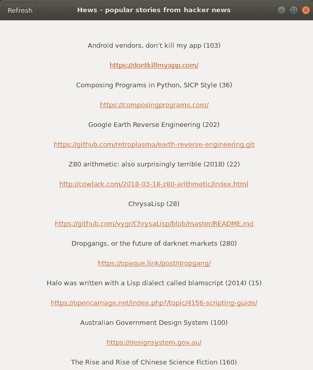

# 第十六章：使用 Rust 构建桌面应用程序

如果你的软件只支持终端或基于命令行的界面，你的目标受众可能仅限于那些知道如何使用命令行的人。为你的软件提供一个**图形用户界面**（**GUI**）可以扩大你的目标受众，并为用户提供一个友好且直观的界面，使他们能够轻松地使用软件。对于构建 GUI，大多数语言都提供了框架，这些框架由几个原生库组成，可以访问平台的图形和 I/O 接口。这使得开发者可以轻松地为他们的应用程序构建 GUI，而无需担心底层细节。

有很多流行的 GUI 框架针对桌面平台，如 Qt、GTK+和 ImGUI，这些框架适用于主流语言。在撰写本书时，Rust 还没有成熟的 GUI 框架生态系统，但幸运的是，我们有方便的 FFI 机制，可以通过它利用 C/C++等语言提供的原生 GUI 框架。在本章中，我们将介绍这样一个 crate，它提供了对 GTK+框架的本地绑定，用于进行 GUI 开发，并构建我们自己的新闻阅读桌面应用程序。

在本章中，我们将涵盖以下主题：

+   GUI 开发简介

+   GTK+框架和`gtk`crate

+   使用 Rust 构建黑客新闻桌面应用程序

+   其他新兴框架

# GUI 开发简介

“在编程中，困难的部分不在于解决问题，而在于决定要解决什么问题。”

– *保罗·格雷厄姆*

基于 GUI 的软件的出现始于 GUI 操作系统。第一个 GUI 操作系统是 1973 年开发的 Xerox Alto 计算机上的 Alto Executive。从那时起，许多操作系统效仿并附带了自己的基于 GUI 的界面。如今，最著名的基于 GUI 的操作系统是 macOS、Windows 以及基于 Linux 的发行版，如 Ubuntu 和 KDE。随着用户通过视觉点按界面与操作系统交互，对基于 GUI 的应用程序的需求增加，许多软件开始附带 GUI，为用户提供了一种与软件交互的视觉方式，类似于他们与操作系统交互的方式。但 GUI 开发的早期阶段有很多手动工作，由于硬件限制，不同的应用程序在其 GUI 中都有专门的实现和性能特征。最终，GUI 框架开始普及，这为开发者提供了一个共同的基线和从底层操作系统的所有底层细节中的抽象层，同时也实现了跨平台。

在我们构建应用程序之前，了解在将 GUI 或前端集成到应用程序中时遵循的一般设计指南对我们来说非常重要。我们将从 Linux 操作系统角度进行讨论，但其他平台上的理念也有相似之处。典型的 GUI 应用程序架构通常分为两个组件：前端和后端。前端是用户与之交互的 GUI 线程或主线程。它由包含在父容器窗口中的交互式视觉单元**小部件**组成。小部件的一个例子是点击执行任务的按钮，或者可以按顺序显示多个项目的列表视图。GUI 线程主要关注向用户展示视觉信息，并且负责传播用户与这些小部件交互时发生的任何事件。

后端是一个独立的线程，包含用于传播状态变化的事件处理程序或事件发射器，主要用于执行计算密集型任务。从 GUI 层处理输入通常被卸载到后台线程，因为如果在主线程上执行计算密集型任务会阻止用户与应用程序的前端交互，这不是一个好的用户体验。此外，为了维护性和关注点的分离，我们通常希望保持前端和后端分离。

在没有专用框架的情况下构建基于 GUI 的应用程序可能是一个非常繁琐的过程，因为没有它们，我们可能需要在应用程序代码中处理很多细节。GUI 框架为开发者抽象了所有这些细节，例如将小部件和窗口绘制到视频内存或 GPU 的帧缓冲区，从输入设备读取事件，重新绘制和刷新窗口等等。话虽如此，让我们看看这样一个框架，即 Gimp 工具包或 GTK+，它是一个构建可扩展 GUI 应用程序的非常成熟和跨平台的解决方案。

# GTK+ 框架

GTK+（以下简称 gtk）是一个用 C 语言编写的跨平台 GUI 框架。由于其跨平台性，使用 gtk 开发的应用程序可以在所有主要平台上运行，例如 Windows、Linux 或 MacOS*.* gtk 项目最初是为了开发 Linux 的图像处理软件 GIMP 而创建的，后来被开源。gtk 也被许多其他软件项目使用，例如许多 Linux 发行版上的 Gnome 桌面环境，它使用 gtk 来构建其实用软件。在架构上，gtk 由几个库组成，这些库协同工作以处理渲染和促进用户与应用程序中的窗口和小部件交互所需的各种细节。以下是一些这些组件的例子：

+   **GLib**: 这是基本的核心库，提供了多种数据结构、用于可移植性的包装器以及运行时功能（如事件循环、线程支持、动态加载和对象系统）的接口。Glib 本身由组件组成，例如 **GObject**，它提供了一个对象模型，以及 **GIO**，它提供了对 I/O 的高级抽象**。

+   **Pango**: Pango 是一个提供文本渲染和国际化的库。

+   **Cairo**: 这是一个 2D 图形库，负责在屏幕上绘制事物，并试图在多个设备之间保持一致性，同时处理硬件加速等细节。

+   **ATK**: ATK 是一个辅助功能工具包库，负责为屏幕阅读器、放大镜和替代输入设备等输入设备提供辅助功能。

gtk 还有一个名为 **Glade** 的界面构建器，它可以生成用于快速应用程序开发的 gtk 源代码框架。

gtk 使用面向对象模型来表示小部件和窗口。它利用 GObject 库来提供这种抽象。要从 Rust 使用 gtk 框架，我们有 gtk-rs 项目，该项目包含许多遵循与 gtk 中存在的库相同命名约定的 crate，并为这些库提供原生 C 绑定。在 gtk-rs 项目包含的所有 crate 中，我们将使用 `gtk` crate 来构建我们的应用程序。

`gtk` 包提供了构建 GUI 的窗口和小部件系统，并试图模拟与原生 C 库相同的 API，尽管 Rust 没有面向对象的类型系统，因此存在一些差异。`gtk` 包中的小部件是智能指针类型。为了在使用 API 时提供灵活性，你可以拥有许多可变引用，类似于 Rust 中的内部可变性提供的引用。`gtk` 中的任何非平凡小部件都继承自某种基本小部件类型。Rust 通过 `IsA<T>` 特性支持小部件的继承。例如，`gtk::Label` 小部件有一个 `impl` 为 `impl IsA<Widget> for Label`。此外，`gtk` 中的大多数小部件都相互共享功能——`gtk` 包通过扩展特性（如 `WidgetExt` 特性）为所有小部件类型实现这一点。大多数小部件，如 `gtk::Button` 和 `gtk::ScrollableWindow`，都实现了 `WidgetExt` 特性。小部件还可以使用 `Cast` 特性将其向下转换为层次结构中的其他小部件。在简要介绍之后，让我们开始编写一个桌面应用程序。

# 使用 gtk-rs 构建 hacker news 应用程序

我们将使用 `gtk` crate 来构建一个简单的 hacker news 应用程序，该程序从 [`news.ycombinator.com/`](https://news.ycombinator.com/) 网站获取前 10 个热门故事。Hacker News 是一个专注于全球数字技术和科技新闻的网站。首先，我们为我们的应用程序创建了一个基本的线框模型：



在顶部，我们有应用标题栏，其中左侧有一个刷新按钮，可以按需更新我们的故事。故事是用户在 Hacker News 网站上发布的新闻条目。标题栏还包含居中的应用标题和右侧的常规窗口控制按钮。下面是我们的主要可滚动窗口，我们的故事将垂直渲染为故事小部件。故事小部件由两个小部件组成：一个用于显示故事的名称和分数的小部件，另一个用于渲染可以点击在用户默认浏览器中打开的故事链接。非常简单！

**注意**：由于我们使用的是绑定到原生 C 库的`gtk`crate，我们需要安装 gtk 框架的开发 C 库。对于 Ubuntu 和 Debian 平台，我们可以通过运行以下命令来安装这些依赖项：

```rs
sudo apt-get install libgtk-3-dev
```

请参考 gtk-rs 文档页面[`gtk-rs.org/docs/requirements.html`](http://gtk-rs.org/docs/requirements.html)，以获取有关在其他平台上设置 gtk 的信息。

为了开始，我们将通过运行`cargo new hews`来创建一个新的 cargo 项目。我们创造性地将我们的应用命名为**Hews**，它是**H**（hacker 的首字母）和**ews**（news 的缩写）的组合。

以下是我们将在`Cargo.toml`文件中需要的依赖项：

```rs
# hews/Cargo.toml

[dependencies]
gtk = { version = "0.3.0", features = ["v3_18"] }
reqwest = "0.9.5"
serde_json = "1.0.33"
serde_derive = "1.0.82"
serde = "1.0.82"
```

在这里，我们使用了一堆 crate：

+   `gtk`：这是用于构建应用的 GUI。我们在这里使用的是 gtk 版本`3.18`的绑定。

+   `reqwest`：这是用于从黑客新闻 API 获取故事的。`reqwest`是`hyper`crate 的高级包装器。我们为了简单起见使用`reqwest`的同步 API。

+   `serde_json`：这是用于无缝地将从网络获取的 JSON 响应转换为强类型的`Story`结构体。

+   `serde`，`serde_derive`：这些提供了用于自动派生内置 Rust 类型序列化代码的特性和实现。通过使用`serde_derive`中的`Serialize`和`Deserialize`特性，我们可以将任何原生 Rust 类型序列化和反序列化到给定的格式。`serde_json`依赖于相同的功能将`serde_json::Value`类型转换为 Rust 类型。

要在我们的应用中显示新闻文章，我们将通过向官方黑客新闻 API 发起 HTTP 请求来获取它们，该 API 的文档位于[`github.com/HackerNews/API`](https://github.com/HackerNews/API)。我们将我们的应用分为两个模块。首先，我们有`app`模块，它包含所有与 UI 相关的功能，用于在屏幕上渲染应用和处理用户对 UI 状态的更新。其次，我们有`hackernews`模块，它提供从网络获取故事的 API。它在一个单独的线程中运行，这样在发生网络请求时不会阻塞 GUI 线程，因为这是一个阻塞的 I/O 操作。从黑客新闻 API 获取的故事是一个包含新闻标题和新闻链接的项目，以及其他属性，如故事的流行程度和评论列表。

为了使这个例子更简单、更容易理解，我们的应用程序没有适当的错误处理，并包含许多 `unwrap()` 调用，这在错误处理方面是一种不良做法。在您完成探索演示后，我们鼓励您在应用程序中集成更好的错误处理策略。话虽如此，让我们一步一步地通过代码。

首先，我们将查看我们的应用程序在 `main.rs` 中的入口点：

```rs
// hews/src/main.rs

mod app;
mod hackernews;
use app::App;

fn main() {
    let (app, rx) = App::new();
    app.launch(rx);
}
```

在我们的 `main` 函数中，我们调用 `App::new()`，它返回一个 `App` 实例，以及 `rx`，它是一个 `mpsc::Receiver`。为了使我们的 GUI 与网络请求解耦，所有状态更新在 hews 中都是通过通道异步处理的。`App` 实例内部调用 `mpsc::channel()`，返回 `tx` 和 `rx`。它将 `tx` 与其存储，并将其传递给网络线程，允许它通知 UI 任何新的故事。在 `new` 方法调用之后，我们在 `app` 上调用 `launch`，传入 `rx`，这在 GUI 线程中用于监听来自网络线程的事件。

接下来，让我们通过 `app.rs` 模块中的 `app` 模块来了解我们的应用程序，它处理将我们的应用程序渲染到屏幕上所需的大部分编排工作。

如果您想了解更多关于以下小部件的解释，请查找 gtk-rs 的优秀文档在 [`gtk-rs.org/docs/gtk/`](https://gtk-rs.org/docs/gtk/)，您可以在那里搜索任何小部件并探索更多关于其属性的信息。

首先，我们有我们的 `App` 结构体，它是所有 GUI 事物的入口点：

```rs
// hews/src/app.rs

pub struct App {
    window: Window,
    header: Header,
    stories: gtk::Box,
    spinner: Spinner,
    tx: Sender<Msg>,
}
```

这个结构体包含了一堆字段：

+   `window`: 这包含基本的 `gtk::Window` 小部件。每个 gtk 应用程序都以一个窗口开始，我们可以向其中添加子小部件以不同的布局来设计我们的 GUI。

+   `header`: 这是一个我们定义的结构体，它包装了一个 `gtk::HeaderBar` 小部件，该小部件充当我们应用程序窗口的标题栏。

+   `stories`: 这是一个存储我们的故事的垂直容器 `gtk::Box` 小部件。

+   `spinner`: 这是一个 `gtk::Spinner` 小部件，为加载故事提供视觉提示。

+   `tx`: 这是一个 mpsc `Sender`，用于从 GUI 发送事件到网络线程。消息的类型是 `Msg`，它是一个枚举：

```rs
pub enum Msg {
            NewStory(Story),
            Loading,
            Loaded,
            Refresh,
        }
```

当从 `hackernews` 模块调用 `fetch_posts` 方法时，我们的应用程序以初始状态 `Loading` 开始。我们稍后会看到这一点。`NewStory` 是在获取新故事时发生的状态。`Loaded` 是在所有故事都加载时发生的状态，当用户想要重新加载故事时，会发送 `Refresh`。

让我们继续到 `App` 结构体上的方法。这是我们的 `new` 方法：

```rs
impl App {
    pub fn new() -> (App, Receiver<Msg>) {
        if gtk::init().is_err() {
            println!("Failed to init hews window");
            process::exit(1);
        }
```

`new` 方法首先使用 `gtk::init()` 启动 gtk 事件循环。如果失败，我们将退出，并在控制台打印一条消息：

```rs
        let (tx, rx) = channel();
        let window = gtk::Window::new(gtk::WindowType::Toplevel);
        let sw = ScrolledWindow::new(None, None);
        let stories = gtk::Box::new(gtk::Orientation::Vertical, 20);
        let spinner = gtk::Spinner::new();
        let header = Header::new(stories.clone(), tx.clone());
```

然后，我们为网络线程和 GUI 线程之间的通信创建 `tx` 和 `rx` 通道端点。接下来，我们创建我们的 `window`，它是一个 `TopLevel` 窗口。现在，如果窗口被调整大小，多个故事可能不会适合我们的应用程序窗口，因此我们需要一个可滚动的窗口。为此，我们将创建一个 `ScrolledWindow` 实例作为 `sw`。然而，gtk 的 `ScrolledWindow` 只接受其内部的单个子小部件，而我们需要存储多个故事，这是一个问题。幸运的是，我们可以使用 `gtk::Box` 类型，它是一个通用的容器小部件，用于布局和组织子小部件。在这里，我们创建一个具有 `Orientation::Vertical` 方向的 `gtk::Box` 实例作为 `stories`，这样我们的每个故事都会垂直堆叠渲染。我们还想在故事正在加载时在滚动小部件的顶部显示一个旋转器，因此我们将创建一个 `gtk::Spinner` 小部件并将其添加到 `stories` 中以在顶部渲染它。我们还将创建我们的 `Header` 栏，并将 `stories` 的引用以及 `tx` 传递给它。我们的标题栏包含刷新按钮，并有一个点击处理程序，该处理程序需要 `stories` 容器来清除其内部的项目，这样我们就可以加载新的故事：

```rs
        stories.pack_start(&spinner, false, false, 2);
        sw.add(&stories);
        window.add(&sw);
        window.set_default_size(600, 350);
        window.set_titlebar(&header.header);
```

接下来，我们开始组合我们的小部件。首先，我们将 `spinner` 添加到 `stories` 中。然后，我们将 `stories` 容器小部件添加到我们的滚动小部件 `sw` 中，然后将其添加到我们的父 `window` 中。我们还使用 `set_default_size` 设置窗口大小。然后我们使用 `set_titlebar` 并传递我们的 `header` 来设置其标题栏。随后，我们向我们的窗口附加一个信号处理程序：

```rs
        window.connect_delete_event(move |_, _| {
            main_quit();
            Inhibit(false)
        });
```

如果我们调用 `main_quit()`，这将退出应用程序。`Inhibit(false)` 的返回类型不会阻止信号传播到 `delete_event` 的默认处理程序。所有小部件都有一个默认的信号处理程序。在 gtk crate 中的小部件上的信号处理程序遵循 `connect_<event>` 的命名约定，并接受一个闭包作为它们的第一个参数，该闭包以小部件作为其第一个参数和事件对象。

接下来，让我们看看 `App` 上的 `launch` 方法，它在 `main.rs` 中被调用：

```rs
    pub fn launch(&self, rx: Receiver<Msg>) {
        self.window.show_all();
        let client = Arc::new(reqwest::Client::new());
        self.fetch_posts(client.clone());
        self.run_event_loop(rx, client);
    }
```

首先，我们启用 `window` 小部件及其子小部件。我们通过调用 `show_all` 方法使它们可见，因为 gtk 中的小部件默认是不可见的。接下来，我们创建我们的 HTTP `Client` 并将其包装在 `Arc` 中，因为我们想与我们的网络线程共享它。然后我们调用 `fetch_posts`，传递我们的客户端。随后，我们通过调用 `run_event_loop` 并传递 `rx` 来运行我们的事件循环。`fetch_posts` 方法定义如下：

```rs
    fn fetch_posts(&self, client: Arc<Client>) {
        self.spinner.start();
        self.tx.send(Msg::Loading).unwrap();
        let tx_clone = self.tx.clone();
        top_stories(client, 10, &tx_clone);
    }
```

它通过调用其 `start` 方法启动旋转器动画，并发送 `Loading` 消息作为初始状态。然后它调用 `hackernews` 模块中的 `top_stories` 函数，传递 `10` 作为要获取的故事数量和一个 `Sender` 来通知 GUI 线程有新的故事。

在调用 `fetch_posts` 之后，我们在 `App` 上调用 `run_event_loop` 方法，该方法的定义如下：

```rs
    fn run_event_loop(&self, rx: Receiver<Msg>, client: Arc<Client>) {
        let container = self.stories.clone();
        let spinner = self.spinner.clone();
        let header = self.header.clone();
        let tx_clone = self.tx.clone();

        gtk::timeout_add(100, move || {
            match rx.try_recv() {
                Ok(Msg::NewStory(s)) => App::render_story(s, &container),
                Ok(Msg::Loading) => header.disable_refresh(),
                Ok(Msg::Loaded) => {
                    spinner.stop();
                    header.enable_refresh();
                }
                Ok(Msg::Refresh) => {
                    spinner.start();
                    spinner.show();
                    (&tx_clone).send(Msg::Loading).unwrap();
                    top_stories(client.clone(), 10, &tx_clone);
                }
                Err(_) => {}
            }
            gtk::Continue(true)
        });

        gtk::main();
    }
```

首先，我们获取我们将要使用的一堆对象的引用。随后，我们调用 `gtk::timeout_add`，它每 100 毫秒运行一次给定的闭包。在闭包内部，我们以非阻塞方式对 `rx` 进行轮询，使用 `try_recv()` 获取来自网络或 GUI 线程的事件。当我们收到 `NewStory` 消息时，我们调用 `render_story`。当我们收到 `Loading` 消息时，我们禁用刷新按钮。在 `Loaded` 消息的情况下，我们停止我们的旋转器并启用刷新按钮，以便用户可以再次重新加载故事。最后，在收到 `Refresh` 消息的情况下，我们再次启动旋转器，并将 `Loading` 消息发送到 GUI 线程本身，随后调用 `top_stories` 方法。

我们的 `render_story` 方法定义如下：

```rs
    fn render_story(s: Story, stories: &gtk::Box) {
        let title_with_score = format!("{} ({})", s.title, s.score);
        let label = gtk::Label::new(&*title_with_score);
        let story_url = s.url.unwrap_or("N/A".to_string());
        let link_label = gtk::Label::new(&*story_url);
        let label_markup = format!("<a href=\"{}\">{}</a>", story_url, story_url);
        link_label.set_markup(&label_markup);
        stories.pack_start(&label, false, false, 2);
        stories.pack_start(&link_label, false, false, 2);
        stories.show_all();
    }
```

`render_story` 方法在创建两个标签之前，将 `Story` 实例作为 `s` 和 `stories` 容器小部件作为参数获取：`title_with_score`，它包含故事标题及其评分，以及 `link_label`，它包含故事的链接。对于 `link_label`，我们将添加一个包含 `<a>` 标签的 URL 的自定义标记。最后，我们将这两个标签放入我们的 `stories` 容器中，并在最后调用 `show_all` 以使这些标签在屏幕上可见。

我们之前提到的 `Header` 结构体及其方法，是 `App` 结构体的一部分，具体如下：

```rs
// hews/src/app.rs

#[derive(Clone)]
pub struct Header {
    pub header: HeaderBar,
    pub refresh_btn: Button
}

impl Header {
    pub fn new(story_container: gtk::Box, tx: Sender<Msg>) -> Header {
        let header = HeaderBar::new();
        let refresh_btn = gtk::Button::new_with_label("Refresh");
        refresh_btn.set_sensitive(false);
        header.pack_start(&refresh_btn);
        header.set_title("Hews - popular stories from hacker news");
        header.set_show_close_button(true);

        refresh_btn.connect_clicked(move |_| {
            for i in story_container.get_children().iter().skip(1) {
                story_container.remove(i);
            }
            tx.send(Msg::Refresh).unwrap();
        });

        Header {
            header,
            refresh_btn
        }
    }

    fn disable_refresh(&self) {
        self.refresh_btn.set_label("Loading");
        self.refresh_btn.set_sensitive(false);
    }

    fn enable_refresh(&self) {
        self.refresh_btn.set_label("Refresh");
        self.refresh_btn.set_sensitive(true);
    }
}
```

这个结构体包含以下字段：

+   `header`: 一个 gtk `HeaderBar`，类似于一个适合窗口标题栏的水平 gtk `Box`

+   `refresh_btn`: 一个用于按需重新加载故事的 gtk `Button`

`Header` 还有三个方法：

+   `new`: 这将创建一个新的 `Header` 实例。在 `new` 方法内部，我们创建一个新的 gtk `HeaderBar`，将其关闭按钮设置为显示，并添加一个标题。然后，我们创建一个刷新按钮，并使用 `connect_clicked` 方法将其附加到它上面，该方法接受一个闭包。在这个闭包内部，我们遍历滚动窗口容器的所有子项，这些子项作为 `story_container` 传递给此方法。然而，我们跳过了第一个，因为第一个小部件是一个 `Spinner`，我们希望它在多次重新加载之间保持显示其进度。

+   `disable_refresh`: 这将禁用刷新按钮，将其灵敏度设置为 `false`。

+   `enable_refresh`: 这将启用刷新按钮，将其灵敏度设置为 `true`。

接下来，让我们看看我们的 `hackernews` 模块，它负责从 API 端点获取故事作为 json 并使用 `serde_json` 解析为 `Story` 实例的所有繁重工作。以下是 `hackernews.rs` 的第一部分内容：

```rs
// hews/src/hackernews.rs

use crate::app::Msg;
use serde_json::Value;
use std::sync::mpsc::Sender;
use std::thread;
use serde_derive::Deserialize;

const HN_BASE_URL: &str = "https://hacker-news.firebaseio.com/v0/";

#[derive(Deserialize, Debug)]
pub struct Story {
    pub by: String,
    pub id: u32,
    pub score: u64,
    pub time: u64,
    pub title: String,
    #[serde(rename = "type")]
    pub _type: String,
    pub url: Option<String>,
    pub kids: Option<Value>,
    pub descendents: Option<u64>,
}
```

首先，我们有一个为托管在 Firebase 上的 hackernews API 声明的基 URL 端点 `HN_BASE_URL`。Firebase 是来自 Google 的实时数据库。然后，我们有 `Story` 结构体的声明，并带有 `Deserialize` 和 `Debug` 特性的注解。`Deserialize` 特性来自 `serde_derive` 包，它提供了一个 derive 宏，可以将任何值转换为原生 Rust 类型。我们需要它，因为我们希望能够将来自网络的 json 响应解析为 `Story` 结构体。

`Story` 结构体包含与在 stories 端点返回的 json 响应中找到的相同字段。有关 json 结构的更多信息，请参阅 [`github.com/HackerNews/API#items`](https://github.com/HackerNews/API#items)。此外，在 `Story` 结构体的所有字段中，我们有一个名为 `type` 的字段。然而，`type` 也是 Rust 中用于声明类型别名的关键字，将 `type` 作为结构体的字段是不合法的，因此我们将它命名为 `_type`。但是，这不会解析为我们的 json 响应中的 `type` 字段。为了解决这种冲突，`serde` 为我们提供了一个字段级别的属性，允许我们在使用 `#[serde(rename = "type")]` 属性的字段上，即使在存在此类冲突的情况下也能解析值。`rename` 的值应与传入的 json 响应的字段名称中的值相匹配。接下来，让我们看看这个模块提供的方法集：

```rs
// hews/src/hackernews.rs

fn fetch_stories_parsed(client: &Client) -> Result<Value, reqwest::Error> {
    let stories_url = format!("{}topstories.json", HN_BASE_URL);
    let body = client.get(&stories_url).send()?.text()?;
    let story_ids: Value = serde_json::from_str(&body).unwrap();
    Ok(story_ids)
}

pub fn top_stories(client: Arc<Client>, count: usize, tx: &Sender<Msg>) {
    let tx_clone = tx.clone();
    thread::spawn(move || {
        let story_ids = fetch_stories_parsed(&client).unwrap();
        let filtered: Vec<&Value> = story_ids.as_array()
                                             .unwrap()
                                             .iter()
                                             .take(count)
                                             .collect();

        let loaded = !filtered.is_empty();

        for id in filtered {
            let id = id.as_u64().unwrap();
            let story_url = format!("{}item/{}.json", HN_BASE_URL, id);
            let story = client.get(&story_url)
                              .send()
                              .unwrap()
                              .text()
                              .unwrap();
            let story: Story = serde_json::from_str(&story).unwrap();
            tx_clone.send(Msg::NewStory(story)).unwrap();
        }

        if loaded {
            tx_clone.send(Msg::Loaded).unwrap();
        }
    });
}
```

这个模块公开的唯一函数是 `top_stories`。这个函数接受一个来自 `reqwest` 包的 `Client` 引用，然后是一个 `count` 参数，指定要检索的故事数量，以及一个 `Sender` 实例 `tx`，它可以发送类型为 `Msg` 的消息，`Msg` 是一个枚举。`tx` 用于将有关我们的网络请求状态的消息传达给 GUI 线程。最初，GUI 以 `Msg::Loading` 状态启动，这会禁用刷新按钮。

在这个函数中，我们首先克隆了我们的 `tx` 发送者，然后在一个线程中使用了这个 `tx`。我们创建一个线程是为了在网络请求进行时不会阻塞 UI 线程。在闭包中，我们调用 `fetch_stories_parsed()`。在这个方法中，我们首先使用 `format!` 宏将 `/top_stories.json` 端点与 `HN_BASE_URL` 连接起来。然后，我们向构建的端点发送请求以获取所有故事列表。我们调用 `text()` 方法将响应转换为 json 字符串。返回的 json 响应是一个包含故事 ID 的列表，每个 ID 都可以用来发起另一组请求，从而提供关于故事的详细信息，作为另一个 json 对象。然后我们使用 `serde_json::from_str(&body)` 解析这个响应。这给我们一个 `Value` 枚举值，它是一个解析后的 json 数组，包含故事 ID 列表。

因此，一旦我们将故事 ID 存储在`story_ids`中，我们就通过调用`as_array()`显式地将其转换为数组，然后对其`iter()`并调用`take(count)`来限制我们想要的条目数，最后调用`collect()`，这将返回一个`Vec<Story>`：

```rs
        let story_ids = fetch_stories_parsed(&client).unwrap();
        let filtered: Vec<&Value> = story_ids.as_array()
                                             .unwrap()
                                             .iter()
                                             .take(count)
                                             .collect();
```

接下来，我们检查过滤后的故事 ID 是否为空。如果是，我们将`loaded`变量设置为`false`：

```rs
       let loaded = !filtered.is_empty();
```

`loaded`布尔值用于在加载我们的任何故事时向主 GUI 线程发送通知。接下来，如果`filtered`列表不为空，我们遍历我们的`filtered`故事并构建一个`story_url`：

```rs
        for id in filtered {
            let id = id.as_u64().unwrap();
            let story_url = format!("{}item/{}.json", HN_BASE_URL, id);
            let story = client.get(&story_url)
                              .send()
                              .unwrap()
                              .text()
                              .unwrap();
            let story: Story = serde_json::from_str(&story).unwrap();
            tx_clone.send(Msg::NewStory(story)).unwrap();
        }
```

我们对每个构造的`story_url`从故事`id`发起 GET 请求，获取 JSON 响应，并使用`serde_json::from_str`函数将其解析为`Story`结构体。之后，我们通过`tx_clone`将包装在`Msg::NewStory(story)`中的故事发送到 GUI 线程。

发送所有故事后，我们向 GUI 线程发送一个`Msg::Loaded`消息，这启用了刷新按钮，以便用户可以再次重新加载故事。

好吧！是时候在我们的应用程序上阅读流行的新闻故事了。运行`cargo run`后，我们可以在窗口中看到我们的故事被拉取并渲染：



点击任何故事的链接时，它将在你的默认浏览器中打开。这就是全部。我们已经使用非常少的代码在 Rust 中制作了我们的 GUI 应用程序。现在，是时候探索和实验这个应用程序了。

# 练习

我们的应用程序运行得很好，但我们可以从很多方面来改进它。如果你有雄心壮志，可以查看以下挑战：

+   改进应用程序的错误处理，通过添加重试机制来处理网络缓慢的情况。

+   通过在标题栏上放置一个输入字段小部件来自定义要加载的故事数量，并将该数字解析并传递给网络线程。

+   为每个故事添加一个按钮来查看评论。当用户点击评论按钮时，应用程序应在右侧打开一个可滚动的窗口并逐个填充该故事的评论。

+   小部件可以使用 CSS 进行样式化。尝试使用`gtk::StyleProvider` API 根据帖子的流行度给故事容器添加颜色。

# 其他新兴的 GUI 框架

正如我们已经看到的，`gtk` 包暴露的 API 在编写复杂的 GUI 时可能会有些不舒服。幸运的是，我们有一个名为 `relm` 的包装包。`relm` 包受到了 Elm 语言 `Model-View-Update` 架构的启发，它为构建反应式 GUI 提供了一种简单的方法。除了 relm 之外，Rust 社区还在开发许多其他独立的 GUI 工具包和包。其中之一是新的、有希望的 `Azul`，可以在 [`azul.rs/`](https://azul.rs/) 找到。它是一个支持异步 I/O 的功能 GUI 框架，还具备双向数据绑定等特性，允许你构建反应式小部件，并采用组合原则来构建小部件，而不是我们在构建 hews 时在 gtk 框架中探索的对象模型。作为渲染后端，Azul 使用了 Mozilla 的 Servo 中使用的性能优异的 Webrender 渲染引擎。

其他值得注意的提及包括来自 Piston 开发者组织在 [`github.com/PistonDevelopers/conrod`](https://github.com/PistonDevelopers/conrod) 的 `conrod`，以及 [`github.com/Gekkio/imgui-rs`](https://github.com/Gekkio/imgui-rs) 的 `imgui-rs`，这是一个为流行的即时模式 ImGUI 框架在 C++ 中的绑定库。

# 摘要

这是对使用 Rust 进行 GUI 开发的简要概述。本章让我们窥见了当前开发 GUI 应用程序的经验。在撰写本文时，这种体验并不算很好，但有一些新兴的框架，例如 Azul，旨在将这种体验提升到新的水平。

下一章将介绍如何使用调试器查找和修复程序中的错误。
