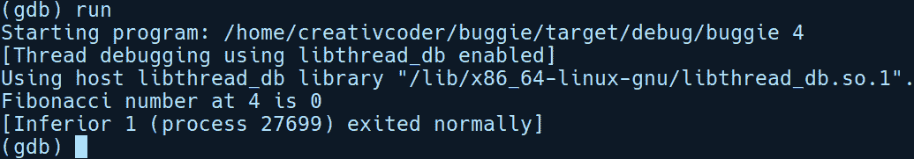
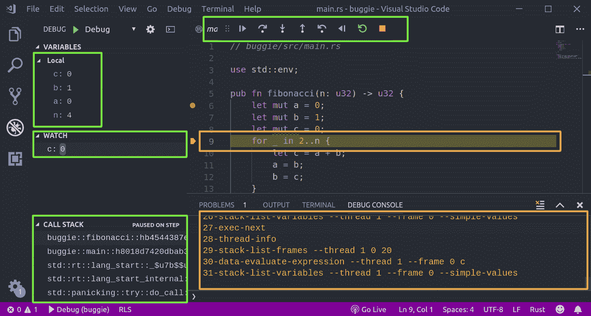

# 第十七章：调试

本章将介绍调试 Rust 程序的各种方法。在二进制层面，Rust 程序与 C 程序非常相似。这意味着我们可以利用行业标准调试器（如 gdb 和 lldb）的强大遗产，这些调试器用于调试 C/C++程序，并使用相同的工具来调试 Rust 代码。在本章中，我们将交互式地通过一些基本的调试工作流程和 gdb 命令。我们还将介绍将 gdb 调试器与**Visual Studio Code**（**vscode**）编辑器集成，以及稍后简要概述另一个名为**rr**的调试器。

在本章中，我们将涵盖以下主题：

+   调试简介

+   GDB 基础和 Rust 程序的调试

+   GDB 与 Visual Studio Code 的集成

+   RR 调试器——快速概述

# 调试简介

“如果调试是去除 bug 的过程，那么编程就必须是放置 bug 的过程。” —— Edsger W. Dijkstra

这里是情况：你的程序不工作，你也不知道为什么。为了修复代码中这个神秘的问题，你已经添加了几个打印语句并启用了跟踪日志，但仍然没有成功。不用担心，你不是一个人！每个程序员都曾经遇到过这种情况，并且花费了无数小时寻找那个导致生产混乱的讨厌的 bug。

软件中的错误和偏差被称为 bug，移除它们的行为称为调试。调试是检查软件中故障原因和结果的一种受控和系统化的方法。对于任何希望深入了解其程序行为和运行方式的开发者来说，这是一项必备的技能。然而，没有合适的工具，调试通常不是一项容易的任务，开发者可能会失去对实际 bug 的追踪，甚至可能在错误的地方寻找 bug。我们用于识别软件中 bug 的方法可以极大地影响解决它们所需的时间，并继续在愉快的路径上前进。根据 bug 的复杂程度，调试通常采用以下一种方法：

+   **打印行调试**：在这种方法中，我们在代码中可能存在 bug 并可能修改应用程序状态的所需位置添加打印语句，并在程序运行时监控输出。这是简单、粗糙且通常有效的，但在某些情况下是不可能的。这项技术不需要额外的工具，每个人都知道如何做。实际上，这是大多数 bug 调试的起点。为了帮助打印行调试，Rust 提供了`Debug`特质，我们之前已经多次使用过，以及`dbg!`、`println!`和`eprintln!`宏系列。

+   **基于读取-评估-打印循环的调试**：像 Python 这样的解释型语言通常自带自己的解释器。解释器为你提供了一个**读取-评估-打印循环（REPL）**界面，你可以将程序加载到交互会话中，并逐步检查变量的状态。这在调试中非常有用，特别是如果你已经正确地将代码模块化，使其可以作为函数独立调用。不幸的是，Rust 没有官方的 REPL，其整体设计也不支持 REPL。然而，miri 项目在这方面做了一些努力，该项目可以在[`github.com/solson/miri`](https://github.com/solson/miri)找到。

+   **调试器**：采用这种方法，我们在生成的二进制程序中添加特殊的调试符号，并使用外部程序来监控其执行。这些外部程序被称为调试器，其中最流行的是 gdb 和 lldb。它们是调试中最强大和高效的方法，允许你在程序运行时检查大量关于程序细节的信息。调试器让你能够暂停正在运行的程序，并检查其在内存中的状态，以找出引入错误的特定代码行。

前两种方法相当明显，所以我们在这里不需要详细说明。这让我们只剩下了第三种方法：调试器。作为工具，调试器非常容易使用，但它们并不容易理解，并且通常在程序员职业生涯的早期并没有得到适当的介绍。在下一节中，我们将通过一步一步的过程来调试用 gdb 编写的 Rust 程序。但在那之前，让我们先了解一下调试器。

# 调试器概述

调试器是可以在程序运行时检查程序内部状态的程序，前提是程序已被编译，包括调试符号。它们依赖于进程内省系统调用，如 Linux 中的**ptrace**。它们允许你在程序运行时暂停程序的执行。为了实现这一点，它们提供了一个名为断点的功能。断点代表运行程序中的暂停点。可以在程序中的任何函数或代码行上设置断点。一旦调试器遇到断点，它就会暂停并等待用户输入进一步的指令。此时，程序没有运行，正处于执行过程中。在这里，你可以检查变量的状态、程序的活动堆栈帧以及其他如程序计数器和汇编指令等事物。调试器还提供了观察点，它们类似于断点，但作用于变量。当变量被读取或写入时，它们会触发并停止执行。

要在程序上使用调试器，我们需要一些先决条件。让我们接下来讨论它们。

# 调试前的准备工作

编译后的程序或对象文件是一系列零和一，没有从编译它的原始源代码映射。为了使程序能够被调试器检查，我们需要以某种方式将编译的二进制指令映射到源文件。这是通过在编译过程中注入额外的记账符号和仪器代码来完成的，调试器可以随后锁定这些符号。这些符号保存在一个符号表中，其中包含有关程序元素的信息，例如变量、函数和类型的名称。它们遵循一个称为 **带有属性记录格式的调试**（**DWARF**）的标准格式，大多数标准调试器都知道如何解析和理解。这些符号使开发者能够检查程序，例如将源代码与运行的二进制文件匹配，保持调用帧、寄存器值和程序内存映射等信息。

要调试我们的程序，我们需要以调试模式编译它。在调试模式下，编译的二进制文件将包含 DWARF 调试格式的调试符号。在这里，二进制文件的大小略有增加，运行速度也较慢，因为它需要在运行时更新调试符号表。当编译 C 程序时，您需要使用 `-g` 标志来告诉编译器包含调试符号进行编译。使用 Cargo 时，项目的调试构建默认在 `target/debug/` 目录下编译，并包含调试符号。

**注意**：当使用除 Cargo 之外的其他包管理器时，也可以向 `rustc` 传递 `-g` 标志。

对发布构建运行调试器也是可能的，但可用的操作选择非常有限。如果您想在发布构建中启用 `DWARF` 调试符号，可以在 `Cargo.toml` 中通过修改 `profile.release` 部分，如下所示：

```rs
[profile.release]
debug = true
```

话虽如此，让我们深入探讨如何设置 gdb。

# 设置 gdb

要开始使用 gdb，我们首先需要安装它。通常，Linux 系统上默认安装了它，但如果未安装，请参考互联网上的指南来设置您的机器。在 Ubuntu 上，只需运行一个安装命令，例如 `apt-get install gdb`。在这里，我们将使用 `7.11.1` 版本的 gdb 进行演示。

虽然 gdb 对 Rust 程序有惊人的支持，但它并没有正确处理一些 Rust 特有的问题，例如获取更整洁的输出。Rust 工具链 rustup 还为 gdb 和 lldb 调试器安装了包装器，分别是 `rust-gdb` 和 `rust-lldb`。这样做是为了解决处理 Rust 代码的一些限制，例如为混淆类型获取更整洁的输出以及一些用户定义类型的格式化打印。让我们来探索如何使用 gdb 调试 Rust 程序。

# 一个示例程序 - buggie

我们需要一个程序来调试以体验 gdb。让我们通过运行`cargo new buggie`来创建一个新的项目。我们的程序将有一个单独的函数`fibonacci`，它接受一个`usize`类型的`n`位置，并给出第*n*个斐波那契数。这个函数假设斐波那契数的初始值是`0`和`1`。以下代码是整个程序的代码：

```rs
1 // buggie/src/main.rs
2 
3 use std::env;
4 
5 pub fn fibonacci(n: u32) -> u32 {
6     let mut a = 0;
7     let mut b = 1;
8     let mut c = 0;
9     for _ in 2..n {
10        let c = a + b;
11        a = b;
12        b = c;
13    }
14    c
15 }
16 
17 fn main() {
18     let arg = env::args().skip(1).next().unwrap();
19     let pos = str::parse::<u32>(&arg).unwrap();
20     let nth_fib = fibonacci(pos);
21     println!("Fibonacci number at {} is {}", pos, nth_fib);
22 }
```

让我们试运行这个程序：


我们用`4`作为参数运行了程序，但我们看到输出是`0`，而应该是`3`。这里有一个错误。虽然我们可以使用`println!`或`dbg!`宏轻松解决这个问题，但这次我们将使用 gdb。

在我们运行 gdb 之前，我们需要规划我们的调试会话。这包括决定在程序中查看哪些部分以及要查找什么。作为一个起点，我们将检查`main`函数的内容，然后进入`fibonacci`函数。我们将设置两个断点，一个在`main`中，另一个在`fibonacci`内部。

# gdb 基础知识

我们将再次运行我们的程序，这次使用 gdb 通过`rust-gdb`包装器运行`rust-gdb --args target/debug/buggie 4`。`--args`标志用于将参数传递给程序。这里我们传递了数字`4`。以下是 gdb 的输出：


在加载我们的程序后，gdb 将我们带到`(gdb)`提示符。在这个时候，程序还没有运行——它只是被加载了。让我们快速查看 gdb 功能的范围。尝试使用`help`命令（显示命令的高级部分）和`help all`命令（显示所有可用命令的帮助信息）：


好吧，所以看起来 gdb 可以做很多事情：这里有`32`页的命令。接下来，让我们在 gdb 提示符上调用`run`来运行程序并查看结果：



这就是我们的程序在 gdb 上下文中的运行方式。正如你所见，中间部分，我们得到了第四个斐波那契数的相同错误输出`0`。我们现在将调试这个问题。通过按*Ctrl* + *L*来清除屏幕。我们也可以通过调用`q`来退出 gdb，然后通过运行`rust-gdb --args target/debug/buggie 4`来重新开始。

在我们的调试会话的起点，为了查看我们是否向斐波那契函数传递了正确的数字，我们将在`main`的开始处添加一个断点，即我们程序中的第`18`行。为了在该行添加断点，我们将运行以下代码：

```rs
(gdb) break 18
```

这给我们以下输出：

```rs
Breakpoint 1 at 0x9147: file src/main.rs, line 18.
```

现在 gdb 已经在我们请求的同一行设置了断点，即`18`。让我们通过调用`run`来运行我们的程序：

```rs
(gdb) run
```

这给我们以下输出：

```rs
(gdb) run
Starting program: /home/creativcoder/buggie/target/debug/buggie 4
[Thread debugging using libthread_db enabled]
Using host libthread_db library "/lib/x86_64-linux-gnu/libthread_db.so.1".

Breakpoint 1, buggie::main::h8018d7420dbab31b () at src/main.rs:18
18        let arg = env::args().skip(1).next().unwrap();
(gdb)
```

现在我们的程序在断点处暂停，等待其下一条指令。

你会看到 Rust 的符号前面带有它们的模块名，后面跟着一些随机 ID，例如，`buggie::main::h8018d7420dbab31`。现在，为了查看我们在程序中的位置，我们可以运行`list`命令来查看源代码，或者我们可以通过运行以下代码来使用更直观的 TUI 模式：

```rs
(gdb) tui enable
```

这将打开 gdb，并有一些不错的反馈，同时我们的命令提示符仍然在底部：


如你所见，TUI 指示我们在第 18 行有一个断点，符号为`B+>`。我们可以通过 TUI 面板中的代码列表来滚动查看我们的整个源代码。

**注意**：如果 TUI 屏幕渲染不正确，你可以输入`refresh`并重新绘制面板和代码列表。

现在，我们将逐行通过我们的程序。为此，我们有两个可用的命令：`next`和`step`。第一个是逐行运行程序，而`step`允许你跳入函数并逐行执行其中的指令。我们想使用`next`，这将带我们到下一行 19，而不是进入 Rust 标准库 API 调用的细节。运行以下代码：

```rs
(gdb) next
```

在达到斐波那契函数之前，我们还需要做两次这样的操作。我们可以通过在键盘上按*Enter*键来运行最后一个命令。在这种情况下，按*Enter*键两次将运行下一行代码。现在，我们就在斐波那契调用的前面：


在我们进入斐波那契函数之前，让我们检查`pos`变量，确保它不是一些垃圾或`0`。我们可以使用`print`命令来做这件事：

```rs
(gdb) print pos
$1 = 4
(gdb) 
```

好的，我们的`pos`是正确的。现在，我们处于第 20 行，正好在我们调用`fibonacci`之前。现在，使用`step`命令进入`fibonacci`函数：

```rs
(gdb) step
```

我们现在在第 6 行：


接下来，让我们逐行执行代码。当我们正在斐波那契函数中逐行执行代码时，我们可以使用`info locals`和`info args`命令来检查变量：

```rs
(gdb) info locals
iter = Range<u32> = {start = 3, end = 4}
c = 0
b = 1
a = 1
(gdb) info args
n = 4
(gdb) 
```

前面的输出显示了第三次迭代的`iter`变量。下一行显示了函数中使用的所有其他变量。我们可以看到，在每次迭代中，`c`变量都被重新赋值为`0`。这是因为我们有`let c = a + b;`，它遮蔽了在循环外部声明的`c`变量。Rust 允许你使用相同的名称重新声明一个变量。我们在这里找到了我们的错误。

我们将通过删除`c`的重新声明来移除我们的错误。斐波那契函数变为以下形式：

```rs
pub fn fibonacci(n: u32) -> u32 {
    let mut a = 0;
    let mut b = 1;
    let mut c = 0;
    for _ in 2..n {
        c = a + b;
        a = b;
        b = c;
    }
    c
}
```

因此，让我们再次运行这个程序。这次，我们将不带 gdb 调试器运行它：


现在我们得到了正确的输出，即第四个斐波那契数的`2`。这些都是使用 gdb 调试 Rust 代码的基本知识。

与 gdb 类似，lldb 是另一个与 Rust 兼容的调试器。

接下来，让我们看看如何将 gdb 与代码编辑器集成。

# Visual Studio Code 的调试器集成

使用命令行中的调试器是调试程序的一种常见方式。这也是一项重要的技能，因为您可能会遇到更高级的编码平台不可用的情况。例如，您可能需要调试一个已经在生产中运行的程序。使用 `gdb` 和 `lldb` 都可以附加到正在运行的进程，但您可能无法从您的编辑器中附加到正在运行的程序。

然而，在典型的开发环境设置中，您会使用代码编辑器或 IDE，如果您可以直接从编辑器调试程序而不离开编辑器，这将非常方便。这样，您将获得一个与调试器正确集成的编辑器提供的更流畅的调试体验和更快的反馈循环。在本节中，我们将探讨如何将 gdb 集成到 **vscode** 中。

要在 vscode 中设置 gdb，我们需要安装 **Native Debug** 扩展。在打开我们的 vscode 编辑器后，我们将按 *Ctrl* + *Shift* + *P* 并输入 `install extension`。或者，您可以选择左下角的扩展图标，如图所示，并输入 `native debug`。通过这样做，我们将获得 Native Debug 扩展的页面：


我们将点击安装并等待安装完成。一旦扩展被安装，我们将点击重新加载以重新启动 Visual Studio Code。这将启用任何新安装的扩展。接下来，我们将在 vscode 中打开我们的 `buggie` 目录，点击顶部的 **调试** 菜单，并选择 **开始调试**，如图所示：


从这里开始，我们将被要求选择一个环境，如下所示：


`NativeDebug` 扩展支持 gdb 和 lldb。我们将从这个菜单中选择 gdb。这将打开一个新的 `launch.json` 配置文件，用于配置本项目的调试会话。它位于同一项目根目录下的 `.vscode/` 目录中。如果它没有打开，我们可以手动创建一个包含 `launch.json` 的 `.vscode/` 目录。我们将用以下配置填充这个 `launch.json`：

```rs
// buggie/.vscode/launch.json

{
    "version": "0.2.0",
    "configurations": [
        {
            "name": "Buggie demo",
            "type": "gdb",
            "request": "launch",
            "target": "target/debug/buggie",
            "cwd": "${workspaceRoot}",
            "arguments": "4",
            "gdbpath": "rust-gdb",
            "printCalls": true
        }
    ]
}
```

`launch.json` 文件为 gdb 和 vscode 设置了重要的详细信息，例如要调用的目标和使用参数。在其他大多数情况下，其他字段将自动为您填充。我们项目的特定配置如下：

+   我们给我们的配置添加了一个名称，即 `"Buggie demo"`。

+   我们添加了一个指向 `rust-gdb` 的 `gdbpath` 变量。这将通过 `rust-gdb` 包装器启动 `gdb`，该包装器知道如何在 Rust 中格式化打印复杂的数据类型。

+   我们将 `target` 字段指向我们的调试二进制文件，即 `target/debug/buggie`。

我们将保存此文件。接下来，让我们在编辑器中为我们的程序添加一个断点。我们可以通过在 vscode 中的文本区域左侧单击来实现，如下面的截图所示：


在前面的截图中，如果您将鼠标悬停在左侧，您将看到一个淡红色的标记出现。我们可以点击此标记的左侧来设置断点，然后它将显示为红色的小点。一旦我们完成设置，我们将按 *F5* 键在 vscode 中启动 gdb。一旦 gdb 运行并遇到我们的断点，我们的代码编辑器将看起来像这样：



在顶部中心，我们可以看到常用的控件，例如单步执行、进入或暂停/停止代码中的调试。在左侧面板中，我们可以获取有关当前堆栈帧中变量的信息。在左下角，我们有关于我们的调用堆栈的信息。在左侧中间，我们可以监视任何变量。在上面的代码中，我添加了对我们的 `c` 变量的监视。

程序现在暂停在第 9 行。我们还可以将鼠标悬停在代码中的变量上以查看它们的值，如下面的截图所示：


这非常有帮助。这些都是使用 vscode 与 gdb 配合使用的基础知识。接下来，让我们简要概述另一个在调试多线程代码时非常有用的调试器：RR 调试器。

# RR 调试器 – 快速概述

除了 gdb 和 lldb，rr 是另一个在调试多线程代码时非常有用的强大调试器，由于它的非确定性，调试起来比较困难。通常，在调试多线程代码时，某个代码段会触发一个错误，但在程序后续执行中无法重现。

由于多线程代码引起的错误也被称为海森堡错误。

RR 调试器可以为非确定性的多线程代码执行可重现的调试会话。它是通过记录调试会话来实现的，您可以回放并逐步跟踪以缩小问题范围。它是通过首先将程序的跟踪保存到磁盘上，并包含所有重现程序执行所需的信息来做到这一点的。

RR 的一个限制是，目前它只支持 Linux 和 Intel CPU。要在 Ubuntu 16.04 上设置 RR 调试器，我们将从 [`github.com/mozilla/rr/releases`](https://github.com/mozilla/rr/releases) 拉取最新的 `.deb` 软件包。在撰写本文时，rr 版本为 `5.2.0`。下载完 `deb` 软件包后，我们可以通过运行以下代码来安装 rr：

```rs
sudo dpkg -i https://github.com/mozilla/rr/releases/download/5.2.0/rr-5.2.0-Linux-x86_64.deb
```

**注意**：安装 perf 工具是先决条件。你可以按照以下步骤安装它们：

```rs
sudo apt-get install linux-tools-4.15.0-43-generic
```

根据您的内核版本，将`linux-tools-(version)`替换为适用版本。您可以在 Linux 上使用`uname -a`命令获取内核版本。另一个先决条件是将`sysctl`标志在`perf_event_paranoid`中从`3`更改为`-1`。建议您通过运行以下代码临时设置此标志：

```rs
sudo sysctl -w kernel.perf_event_paranoid=-1
```

完成这些后，让我们快速通过运行`cargo new rr_demo`来创建一个新的项目，并使用 rr 进行调试会话。我们将探索如何使用 rr 调试器对示例程序进行调试，该程序演示了非确定性。我们将依赖`rand`包，我们可以通过运行`cargo add rand`将其添加到`Cargo.toml`文件中。在我们的`main.rs`文件中有以下代码：

```rs
// rr_demo/src/main.rs

use rand::prelude::*;

use std::thread;
use std::time::Duration;

fn main() {
    for i in 0..10 {
        thread::spawn(move || {
            let mut rng = rand::thread_rng();
            let y: f64 = rng.gen();
            let a: u64 = rand::thread_rng().gen_range(0, 100); 
            thread::sleep(Duration::from_millis(a));
            print!("{} ", i);
        });
    }
    thread::sleep(Duration::from_millis(1000));
    println!("Hello, world!");
}
```

这是一个最小化、非确定性的程序，它启动`10`个线程并将它们打印到标准输出。为了突出 rr 的可重复性方面，我们将启动线程并随机休眠。

首先，我们需要使用 rr 记录程序的执行。这是通过运行以下代码完成的：

```rs
rr record target/debug/rr_demo
```

这给我们以下输出：


在我的机器上，程序执行跟踪被记录并存储在以下位置：

```rs
rr: Saving execution to trace directory `/home/creativcoder/.local/share/rr/rr_demo-15'
```

记录的文件，`rr_demo-15`，在您的机器上可能被命名为不同的名称。现在我们可以通过运行以下代码来重新播放记录的程序：

```rs
rr replay -d rust-gdb /home/creativcoder/.local/share/rr/rr_demo-15
```

以下是在 rr 下运行 gdb 的会话：


如您所见，每次运行程序时都会打印出相同的数字序列，因为程序是从上一次运行中记录的会话中运行的。这有助于调试多线程程序，其中线程运行顺序混乱，并且您下次运行程序时可能无法重现错误。

# 摘要

在本章中，我们通过使用 GNU 的`gdb`和现有的调试器来手动调试 Rust 代码。我们还配置了 gdb 与 vscode，为我们提供了一个方便的基于点击的 UI 来调试我们的代码。最后，我们了解到了 rr 调试器如何使多线程代码的调试变得确定性。

通过这种方式，我们结束了使用 Rust 的编程之旅。
