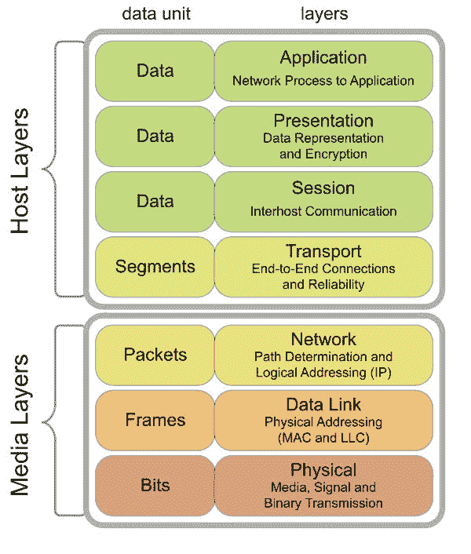

# 客户端/服务器网络简介

本书是关于如何在 Rust 中编写网络应用程序的入门指南。这个标题引出了两个问题：为什么有人会关心网络？为什么有人想要用 Rust 编写网络应用程序？我们试图在本章中回答第一个问题。在随后的章节中，我们将介绍 Rust 和使用 Rust 进行网络编程。首先，在本章中，我们将从一点历史开始，试图了解网络架构在过去一百年是如何演变的。在随后的部分，我们将看到现代网络是如何分层和寻址的。之后，我们将描述网络中常用的服务模型。我们将以 Linux 提供的网络相关编程接口的总结结束。请注意，本书故意忽略了其他操作系统的网络编程，为了简化，只关注 Linux。虽然 Rust 编译器是平台无关的，但在其他平台上可能会有一些与 Linux 不同的情况。我们将随着进展指出这些差异。

在本章中，我们将涵盖以下主题：

+   网络的历史：为什么网络被使用以及互联网是如何演变的

+   网络分层：分层和封装是如何工作的

+   寻址：如何在互联网上唯一标识网络和单个主机

+   IP 路由是如何工作的

+   域名系统（DNS）是如何工作的

+   数据传输的服务模型

+   Linux 中的网络编程接口

# 网络简史

现代互联网彻底改变了我们相互沟通的方式。然而，它的起源可以追溯到维多利亚时代。互联网最早的先驱之一是电报网络，这些网络早在 1850 年就开始运营。当时，通过海上发送一条从欧洲到北美洲的消息需要 10 天时间。电报网络将这个时间缩短到了 17 小时。到 19 世纪末，电报已经成为一种完全成功的通信技术，在两次世界大战中被广泛使用。在那个时期，人们开始建造计算机来帮助破解敌军密码。与我们的现代移动电话和笔记本电脑不同，这些计算机器通常很大，需要专门的环境才能平稳运行。因此，有必要将这些机器放在特殊的位置，而操作员则坐在终端上。终端需要能够在短距离内与计算机通信。一系列局域网技术实现了这一点，其中最突出的是*以太网*。随着时间的推移，这些网络逐渐发展，到 20 世纪 60 年代，一些网络开始相互连接，形成一个更大的网络网络。**高级研究计划署网络**（**ARPANET**）于 1969 年建立，成为第一个类似于现代互联网的互联网。到 1973 年左右，世界各地都有许多这样的互联网，每个都使用自己的协议和方法进行通信。最终，这些协议被标准化，以便网络能够无缝地相互通信。所有这些网络后来都被合并，形成了今天的互联网。

由于网络在全球范围内独立发展，它们通常根据地理位置组织。**局域网**（**LAN**）是在小范围内（如一栋楼或一个小社区）的计算机集合。**广域网**（**WAN**）是连接多个社区的网；全球互联网位于这个层次结构的顶端。下一张图展示了 1977 年的 ARPANET 地图。这张地图上的每个节点都是一台计算机（按照今天的说法，是一台服务器）。其中大部分位于像斯坦福大学这样的大型大学或像劳伦斯伯克利国家实验室这样的国家实验室（来源：[`commons.wikimedia.org/wiki/File:Arpanet_logical_map,_march_1977.png`](https://commons.wikimedia.org/wiki/File:Arpanet_logical_map,_march_1977.png))）。

在网络中，**请求评论**（**RFC**）是一份描述拟议系统应如何工作的文档。这些是标准化协议或系统的第一步。术语“互联网”首次出现在 RFC 675 中，该文档提出了 TCP 的标准。


# 网络分层

计算机科学通常关注将问题细分为更小、希望独立的组件，这些组件可以独立解决。一旦这样做，所需要的只是一套规则，说明这些组件应该如何通信，以便对更大的问题有一个解决方案。这组规则，连同预先同意的数据格式，被称为**协议**。网络由多个层次组成，每个层次都有一个固定的目的。因此，这些层次中的每一个都运行一个或多个协议，形成一个协议栈。在网络的早期，不同的人以不同的方式实现了他们的网络。当互联网被构想出来时，需要使这些网络无缝地通信。由于它们的构建方式不同，这最终变得很困难。

明确需要就标准协议和接口达成一致，以使互联网工作。第一次尝试标准化网络协议是在 1977 年，这导致了 OSI 模型。此模型具有以下层次：

+   **物理层**：它定义了从其电气和物理特性方面如何在物理介质中传输数据。这可以是通过电线、光纤或无线介质。

+   **数据链路层**：它定义了通过物理介质连接的两个节点之间如何传输数据。此层处理多个试图同时访问线的实体之间的优先级问题。此层的重要功能还包括在传输的位中包含一些冗余，以最小化传输过程中的错误。这被称为编码。

+   **网络层**：它定义了由多个数据单元组成的数据包如何在网络之间传输。因此，此层需要定义如何唯一地识别主机和网络。

+   **传输层**：它定义了将可变长度的消息可靠地传输到主机（在同一网络或不同网络中）的机制。此层定义了一组数据包流，接收者可以监听这些数据包。

+   **会话层**：它定义了在主机上运行的应用程序应该如何通信。此层需要区分同一主机上运行的应用程序并将数据包发送给它们。

+   **表示层**：它定义了数据表示的通用格式，以便不同的应用程序可以无缝地互连。在某些情况下，此层还负责安全。

+   **应用层**：它定义了以用户为中心的应用程序应该如何发送和接收数据。一个例子是网络浏览器（一个以用户为中心的应用程序）使用 HTTP（一个应用层协议）与网络服务器通信。

下图展示了该模型的视觉表示（来源：[`commons.wikimedia.org/wiki/File:Osi-model-jb.svg`](https://commons.wikimedia.org/wiki/File:Osi-model-jb.svg)）。这也显示了两种垂直分类，运行网络栈的主机和物理媒体（包括电线和网络设备）。每一层都有自己的数据单元，即它所处理信息的表示，并且由于每一层封装了其下的一层，数据单元也进行了封装。若干比特组成一个帧，若干帧组成一个数据包，依此类推，直至顶层：



OSI 模型及其层

当 OSI 致力于标准化这一模型时，**国防高级研究计划局**（**DARPA**）提出了一个完整的、更为简单的 TCP/IP 模型的实现（也称为**IP**（**互联网协议**）套件）。从最接近物理媒体到最远的顺序，该模型具有以下层：

+   **硬件接口层**：这是 OSI 模型第一层和第二层的组合。这一层负责管理媒体访问控制、处理比特的传输和接收、重传以及编码（一些关于网络技术的文本将硬件接口层和链路层区分开来。这导致了一个五层模型而不是四层模型。但在实践中这几乎无关紧要。）

+   **IP 层**：这一层对应 OSI 模型的第三层。因此，这一层负责两大主要任务：为主机和网络分配地址，以便它们能够被唯一识别并赋予源地址和目标地址，以及在给定一系列约束条件（路由）的情况下计算路径。

+   **传输层**：这一层对应 OSI 模型的第四层。这一层将原始数据包转换为带有某些保证的数据包流：按顺序交付（对于 TCP）和随机顺序交付（对于 UDP）。

+   **应用层**：这一层结合了 OSI 模型的五到七层，负责识别进程、数据格式化以及与所有用户级应用程序的接口。

注意，当我们从一层移动到另一层时，特定层处理的内容的定义会发生变化。硬件接口层处理主机传输的比特和字节，IP 层处理数据包（主机以特定格式发送的一组字节），传输层将来自主机上某个进程的数据包聚集到另一个主机上的另一个进程，以形成一个段（对于 TCP）或数据报（对于 UDP），应用层则从底层流中构建特定应用的表现形式。对于这些每一层，它们处理的数据表示称为该层的**协议数据单元**（**PDU**）。由于这种分层，当一个在主机上运行的过程想要向另一个主机发送数据时，数据必须被分割成单独的块。当块从一个层移动到另一个层时，每个层都会给块添加一个头部（有时是尾部），形成该层的 PDU。这个过程被称为**封装**。因此，每一层都为其上层提供一组服务，这些服务以协议的形式指定。

现代互联网表现出一种地理层次结构。想象一下，许多家庭由许多**互联网服务提供商**（**ISP**）提供服务。这些家庭中的每一个都位于一个局域网（通过以太网，或者更常见的是，通过 Wi-Fi）。ISP 将许多这样的局域网连接起来形成一个广域网。每个 ISP 连接一个或多个广域网，以形成他们自己的网络。这些跨越城市、由单一商业实体控制的大型网络被称为**管理系统**（**AS**）。在多个 ISP 之间的路由通常比常规 IP 路由更复杂，因为他们必须考虑诸如贸易协议等问题。这由专门的协议如**边界网关协议**（**BGP**）来处理。

如前所述，最早的、最成功的网络技术之一是以太网。1974 年首次推出，由于其低成本和相对易于维护，它迅速成为局域网和广域网的主导技术。以太网是一种共享媒体协议，其中所有主机必须使用相同的物理介质来发送和接收帧。帧被发送到所有主机，这些主机将检查目标 MAC 地址（这些地址将在下一节中描述）是否与其自己的地址匹配。如果匹配，则接受该帧，否则丢弃。由于物理介质在任何给定时刻只能携带一个信号，因此存在帧在传输过程中发生碰撞的概率。如果发生碰撞，发送者可以通过在传输其帧的同时感知来自其他主机的传输来检测到碰撞。然后，它终止传输并发送一个干扰信号，让其他主机知道发生了碰撞。然后，它等待指数退避的时间量，并重试传输。在固定次数的尝试之后，如果传输没有成功，它将放弃。

这个方案被称为**载波侦听多路访问与碰撞检测**（**CSMA/CD**）。以太网的一个问题是它的相对较短的范围。根据所使用的物理布线技术，以太网段的最大长度在 100 米到 500 米之间变化。因此，必须连接多个段来形成一个更大的网络。最常见的方法是在相邻的两个以太网段之间使用第二层交换机。这些交换机的每个端口形成不同的碰撞域，从而降低了整体碰撞的概率。这些交换机还可以监控流量，以了解哪些 MAC 地址连接到哪个端口，这样最终它们只会在该端口发送针对该 MAC 地址的帧（称为学习交换机）。在现代家庭中，与以太网相比，Wi-Fi 通常是占主导地位的局域网技术。

# 网络寻址

我们已经看到，为了可靠地递送数据包，识别主机和网络是唯一重要的。根据规模，有三种主要的方法来实现这一点；我们将在本节中讨论这些方法中的每一个。IP 路由的端到端过程将在下一节中讨论。一个值得注意的有趣事实是，对于这些寻址模式中的每一个，都保留了一个或多个地址用于特殊用途。通常，这些地址通过在已知模式中已知位是开还是关来标记：

+   **以太网地址**：这也被称为**媒体访问控制**（**MAC**）地址。它是一个 48 位的唯一标识符，分配给网络设备（通常存储在卡上），用于在子网中识别它。通常，这些地址由网卡制造商编程，但所有现代操作系统都允许用户修改它。以太网地址的标准写法是六组两位十六进制数字（01-23-45-67-89-ab-cd-ef）。另一种常见的方法是使用冒号分隔数字（01:23:45:67:89:ab:cd:ef）。一些特殊的比特序列被保留用于特殊地址：发送者可以请求以太网帧被该段的所有主机接收，通过将第一个八位字节的最不重要位设置为 1 来实现；这被称为多播。如果该位设置为 0，则帧应仅发送给一个接收者。今天，这些在以太网和 Wi-Fi 中得到了广泛的应用。

+   **IP 地址**：这是分配给 IP 网络中每个设备的地址。最初的 IP 地址标准（IPv4）在 1980 年定义了 32 位的地址。然而，到了 1995 年，很明显，互联网上可用的地址总数不足以覆盖所有设备。这导致了 IPv6 的发展，它将地址空间扩展到 128 位。处理一组 IP 地址的标准方式是使用 CIDR 表示法，例如，192.168.100.1/26（IPv4）。斜杠后的十进制数字表示网络掩码中前导 1 的数量。因此，在这个特定的情况下，从 192.168.100.0 到 192.168.100.63 的网络中有*2^(32-26) = 64*个地址。**互联网名称与数字地址分配机构**（**IANA**）将公开可路由的 IP 地址块分配给组织。许多 IPv4 和 v6 地址被预留用于各种目的，如私有网络中的寻址等。在家庭网络（将始终使用特殊的私有范围地址）中，这些地址由 Wi-Fi 路由器通过**动态主机配置协议**（**DHCP**）分配。

+   **自治系统编号**：这是一个 32 位的数字，用于唯一标识自治系统。像 IP 地址一样，这些由**互联网名称与数字地址分配机构**（**IANA**）分配和维护。

除了这些，主机之间的通信通常使用端口号来区分进程。当操作系统为进程分配一个特定的端口时，它会更新其进程标识符和端口号之间的映射数据库。因此，当它在该端口上接收传入的数据包时，它知道要将这些数据包发送给哪个进程。如果到那时进程已经退出，操作系统将丢弃这些数据包，在 TCP 的情况下，将启动连接的关闭。在随后的章节中，我们将看到 TCP 在实际中是如何工作的。

操作系统为 0 到 1024 之间的端口范围预留了常见服务。其他应用程序可以请求 1024 以上的任何端口。

# IP 路由工作原理

要理解 IP 路由是如何工作的，我们必须首先从 IPv4 地址的结构开始。如上一节所述，这些地址长度为 32 位。它们以每组 4 字节的点分十进制表示法书写（例如，192.168.122.5）。网络前缀中一定数量的位被用来标识数据包应该被发送到的网络，其余的位标识特定的主机。因此，同一网络中的所有主机必须具有相同的网络前缀。传统上，前缀用 CIDR 表示法描述，起始地址和地址的网络部分中的位数由一个斜杠分隔（192.168.122.0/30）。这个数字可以用来找出网络中可用于主机的地址数量（在这种情况下，*2^(32-30) = 4*）。给定一个 IP 地址和一个前缀，可以通过与网络部分全 1 的掩码进行位与操作来提取网络地址。计算主机地址正好相反；我们需要与网络掩码的逻辑否定（主机掩码）进行与操作，该掩码在网络部分全 0，在主机部分全 1。给定一个地址和一个前缀，如 192.168.122.5/27，我们将按以下图示进行计算。因此，对于给定的 CIDR，网络地址是 192.168.122.0，主机地址是 0.0.0.5：


CIDR 到网络和主机地址的转换

如前所述，每个 IP 网络都将有一个保留的广播地址，该地址可以被主机用来向该网络中的所有主机发送消息。这可以通过与主机掩码进行 OR 操作来计算。在我们的例子中，结果是 192.168.122.31。请注意，网络地址不能是一个有效的主机地址。

IP 地址大致分为两大类；一些地址块可以在公共互联网中路由，这些被称为公共 IP 地址。还有一些其他地址块只能用于不直接与互联网接口的私有网络，这些被称为私有地址。如果互联网上的一个路由器收到一个目的地为私有 IP 地址的数据包，它将不得不丢弃该数据包。除了这两类之外，IP 地址还可以根据各种参数进行分类：一些地址仅保留用于文档（192.0.2.0/24），一些地址仅保留用于两个主机之间的点对点通信（169.254.0.0/16），等等。Rust 标准库提供了方便的方法来根据 IP 地址的类型进行分类。

所有路由器都维护一个路由表，该表将前缀映射到路由器的输出接口（虽然路由器管理员可能会决定存储单个地址而不是前缀，但这将很快导致繁忙路由器上的路由表变得很大）。表中的条目基本上表示“如果数据包需要到达这个网络，它应该通过这个接口发送”。接收数据包的下一位主机可能是另一个路由器或目标主机。路由器是如何确定这个表的？多个路由器在那些计算这些表的路由器之间运行路由协议。一些常见的例子是 OSPF、RIP 和 BGP。给定这些原语，实际的路由机制相当简单，如图中所示。

IP 的一个有趣方面是使用**生存时间**（**TTL**）字段，这也被称为跳数限制。主机以固定的 TTL 值（通常是 64）发送数据包。每个数据包经过的路由器都会减少 TTL。当它达到 0 时，数据包将被丢弃。这种机制确保数据包不会在路由器之间陷入无限循环：


通用路由算法

**互联网控制消息协议**（**ICMP**）用于在网络设备之间交换操作信息。在前面的示例中，一个或多个路由器可能会决定发送回 ICMP 错误，如果它们被配置为这样做的话。

注意，在尝试将前缀与路由表中的路由匹配时，可能会有多个路由匹配。如果发生这种情况，路由器必须选择最具体的匹配项，并使用该匹配项进行转发。由于最具体的路由将具有最多的前导 1 位，因此具有最大的前缀，这被称为最长前缀匹配。假设我们的路由器具有以下路由表，如图所示。**eth1**、**eth2**和**eth3**是我们路由器上的三个网络接口，每个接口在不同的网络中具有不同的 IP 地址：


最长前缀匹配示例

在这一点上，如果我们的设备收到一个目标地址设置为 192.168.1.33 的数据包，所有三个前缀都有这个地址，但最后一个是最长的。因此，数据包将通过**eth3**发送出去。

我们之前关于 IPv4 地址所描述的许多内容对于 IPv6 来说并没有改变，当然，IPv6 具有更大的 128 位地址空间。在这种情况下，网络掩码和主机掩码的长度取决于地址类型。

可能有人会想知道，路由器是如何构建路由表的？一如既往，有协议来帮助完成这项工作。路由协议主要有两种类型：内部网关协议，用于在自治系统内部进行路由，以及外部网关协议，用于在自治系统之间进行路由；后者的一个例子是 BGP。内部网关协议又可以分为两种类型，这取决于它们如何看待整个网络。在链路状态路由中，每个参与协议的路由器维护整个网络拓扑的视图。在距离向量路由中，每个路由器只知道其单跳邻居。前者的一个例子是 **路由信息协议**（**RIP**），后者的一个例子是 **开放最短路径优先**（**OSPF**）。关于这些的详细信息超出了本书的范围。然而，我们可以注意到，所有路由协议的共同主题是它们通过在路由器之间交换信息来工作。因此，它们有自己的数据包格式来封装这些信息。

# DNS 的工作原理

注意，没有人能够记住互联网上每个和每个服务的 IP 地址。幸运的是，有一个协议可以解决这个问题！**域名服务器**（**DNS**）通过在分布式数据库中维护一个人类可读的分层名称到服务 IP 地址的映射来解决此问题。因此，当用户在浏览器中输入 [`www.google.com`](http://www.google.com) 并按下 *Enter* 键时，第一步是使用 DNS 查找名称 *www.google.com* 的 IP 地址。下图显示了此类查询所需的步骤。在这次讨论中，我们将 **本地 DNS 解析器**、**本地 DNS 服务器** 和 **本地 DNS 域名服务器** 互换使用：


DNS 的工作原理

需要解析名称的应用程序将使用类似 `getaddrinfo` 的系统调用。这本质上是在请求操作系统去解析该名称。这一步在图中没有显示。接下来的步骤如下：

1.  通常情况下，网络中的每一台计算机都会在文件 `/etc/resolv.conf` 中配置一个本地 DNS 服务器。在大多数情况下，这指向 ISP 的 DNS 服务器。这也可能指向家庭 Wi-Fi 路由器的 DNS 服务器。在这种情况下，DNS 将透明地代理请求到 ISP 的 DNS 服务器。然后操作系统将查询该服务器，询问给定名称 **www.google.com** 的 IP 地址。

1.  本地 DNS 服务器将反过来向预先填充的根域名服务器列表提出相同的问题。这些服务器由 ICANN 维护，它们的地址是众所周知的。它们维护顶级域名服务器的地址。这意味着它们知道 `.com` 域名服务器的地址。

1.  在这一步中，根域名服务器将回复 `.com` 域名的顶级域名服务器地址。这些服务器维护它们自己域中域名服务器的地址列表。

1.  本地 DNS 服务器随后联系这些服务器之一并询问相同的问题。

1.  TLD 名称服务器回复`google.com`域中服务器的地址。`google.com`域的管理员为该域维护了一组名称服务器。这些名称服务器对该域中的所有记录拥有完全的权威性，并且每个记录都被标记为*权威性*，以表明这一点。

1.  本地 DNS 服务器随后向这些服务器之一提出相同的问题。

1.  (希望)该服务器知道*www.google.com*的地址。如果它知道，它准备一个响应，将其标记为权威性，并将其发送回本地 DNS 服务器。答案还可以与一个生存时间相关联，这样本地 DNS 服务器就可以将其缓存以供将来使用，并在给定时间过后将其删除。如果它不知道，名称解析将失败，并将发送回一个称为 NXDOMAIN 的特殊响应。

1.  本地 DNS 服务器随后将相同的响应发送回操作系统，操作系统再将它传递给应用程序。本地服务器将此响应标记为非权威性，表示它从别处获得了这个答案。

有趣的是，DNS 就像向朋友询问某人的地址，朋友说*我不知道，但我认识一个认识一个认识一个可能知道的人。我可以帮你找到！*然后他们四处询问并带回来一个回复。

DNS 数据包通常非常小，因为它们包含一个小的疑问和答案以及一些控制信息，并且由于 DNS 不需要从传输层获得非常高的可靠性，这使得它成为使用 UDP（在下节中描述）的理想候选者。然而，大多数实现都包括一个选项，如果传输不可靠，则回退到 TCP。

DNS 支持多种记录类型，用于各种事物。*A*记录将名称映射到 IPv4 地址，*AAAA*记录将名称映射到 IPv6 地址，等等。反向查找可以使用*PTR*记录支持。

# 常见的服务模型

为了两个主机通过网络进行通信，它们需要互相发送消息。有两种交换消息的模型，每种模型都有其最佳使用场景。在本节中，我们将探讨这些。请注意，服务模型是协议的特性，并且它们设定了消费者对这些协议的期望。

# 面向连接的服务

当每个参与方在发送实际数据之前协商一个虚拟连接时，协议提供给其消费者的服务是面向连接的。在设置过程中，必须就连接的一些参数达成一致。这与较老的固定电话系统类似，其中两个主机之间会建立一个专用连接。在现代网络中，一个例子是 TCP。TCP 的 PDU 是一个段，它由一个头部和一个数据部分组成。头部有几个字段，用于在协议状态机的状态之间进行转换。下图显示了 TCP 头部在实际中的样子。这张图中的每一行都是 32 位（因此，每一行是两个八位字节），其中一些被分割成多个段：


TCP 头部格式

我们将查看其中一些用于在主机之间操作连接的：

+   控制位（标志位）是一组用于各种目的的 9 位。这里感兴趣的标志位有 SYN、ACK、FIN 和 RST。SYN 触发序列号的同步。ACK 标志表示接收方应关注相应的确认号。FIN 标志开始断开连接的过程。RST 标志在出现错误时重置连接。

+   序列号是一个 32 位字段，用于在接收方重新排序消息。当 SYN 标志被设置（这应该只适用于连接中的第一个数据包），序列号是初始序列号；否则，它是到目前为止累积的序列号。

+   确认号是一个 32 位字段，用于启用消息的可靠交付。如果 ACK 标志被设置，这个值是发送方期望的下一个序列号。

在两个运行 TCP 协议的主机开始交换数据之前，它们必须进行三次握手来建立连接。这个过程是这样的：想要发起通信的客户端向服务器发送一个 SYN 数据包。序列号被设置为随机值，SYN 标志被设置为 1。服务器响应一个同时设置了 SYN 和 ACK 标志的数据包。这个数据包的确认号设置为比从客户端接收到的值多 1，序列号被设置为随机数。最后，客户端响应一个设置了 ACK 标志的数据包，序列号设置为上一步接收到的确认号，确认号设置为上一步序列号加 1。成功完成这个过程后，客户端和服务器就同意了序列号和确认号。这种模型的优势在于它有一个可靠的连接，发送方和接收方都知道可以期待什么。发送方可以根据接收方的速度或网络拥堵程度调整发送数据的速率。这里的缺点是连接建立的成本较高。假设向另一个大陆的主机发送一个数据包需要 100 毫秒，我们至少需要交换 3 个数据包才能开始发送数据。这相当于 300 毫秒的延迟。虽然这可能看起来不多，但记住，在任何给定时刻，用于访问 Facebook 的笔记本电脑可能已经打开了成千上万的连接到世界各地的服务器。面向连接的服务模型对于大量用例来说工作得很好，但也有一些情况，其中开销要么很大，要么是不必要的。一个例子是视频流。在这种情况下，丢失几个数据包不会造成大问题，因为没有人会注意到视频中的少量错位像素。这些应用程序更喜欢无连接模型，如下所述。

# 无连接服务

第二种情况是无连接服务。当多个消息之间没有关系时，就会使用这种服务。在发送任何数据之前，这些协议不需要进行任何连接协商步骤。一个例子是 UDP，它不提供传输消息的顺序或可靠性保证（然而，它确实有一个校验和字段来保证数据报的正确性）。应该注意的是，运行在 UDP 之上的协议总是可以自由实现可靠性，如果需要的话。有趣的是，IP 路由也是一个无连接服务。UDP 头部格式如下所示：


UDP 头部格式

很容易看出这里的头部比 TCP 头部小得多。它还缺少 TCP 用来管理连接并根据网络拥堵等因素调整连接的许多字段。由于 UDP 没有这些字段，它不能提供这些保证。

# Linux 中的网络编程接口

在本节中，我们将了解 Linux（以及 Unix 家族中的许多其他成员）如何实现常见的网络模式，以及用户在编写网络应用程序时如何与这些模式交互。本节的所有讨论都将严格基于具有标准 C 库（glibc）的类似 Linux 的操作系统。**可移植操作系统接口**（**POSIX**）标准包括所有这些，使它们可移植到任何符合 POSIX 的操作系统。这里的所有函数和数据结构都遵循 C（和 C++）编码约定，但正如我们稍后将看到的，其中一些也通过 libc 绑定在 Rust 中可用。

操作系统提供的最重要的网络原语是*套接字*。那么，什么是套接字？套接字是一个被美化的文件描述符，是一个在类 Unix 操作系统中分配给每个文件的唯一 ID。这源于 Unix 哲学，即一切都应该是一个文件；将两个主机之间的网络连接视为一个文件，使得操作系统可以将其作为文件描述符暴露出来。然后程序员可以自由使用传统的 I/O 相关系统调用来从这个文件写入和接收数据。

现在，显然，套接字需要比常规文件描述符持有更多的数据。例如，它需要跟踪远程 IP 和端口（以及本地 IP 和端口）。因此，套接字是两个主机之间连接的逻辑抽象，包括在那些主机之间传输数据所需的所有信息。

存在两种主要的套接字类别：UNIX 套接字用于与同一主机上的进程通信，以及互联网套接字用于通过 IP 网络进行通信。

标准库还提供了一些系统调用用于与套接字交互。其中一些是针对套接字的特定调用，而另一些是通用的 I/O 系统调用，支持写入文件描述符。由于套接字基本上是一个文件描述符，因此可以使用这些调用与套接字交互。其中一些将在下一张图中描述。请注意，并非所有应用程序都需要使用所有这些系统调用。例如，一旦创建套接字，服务器将需要调用 listen 来开始监听传入的连接，它不需要为该连接调用 connect：


常见网络系统调用

任何类 Unix 操作系统都会在 man 手册页中对这些系统调用提供详细的文档。例如，套接字系统调用的文档可以通过命令`man socket`访问。`man`命令的第二个参数是 man 手册页的章节。

让我们更详细地查看这些系统调用的签名。除非另有说明，否则所有这些在成功时返回 0，在失败时返回-1，并相应地设置 errno 的值。

```rs
int socket(int domain, int type, int protocol);
```

`socket`系统调用的第一个参数告诉它将使用哪种类型的通信`socket`。常见的类型有 AF_INET 用于 IPv4，AF_INET6 用于 IPv6，AF_UNIX 用于 IPC 等。第二个参数告诉它应该创建哪种类型的套接字，常见的值包括 SOCK_STREAM 用于 TCP 套接字，SOCK_DGRAM 用于 UDP 套接字，SOCK_RAW 用于提供数据包级别的直接网络硬件访问的原始套接字等。最后一个参数表示要使用的第 3 层协议；在我们的情况下，这仅限于 IP。支持的所有协议的完整列表可在文件`/etc/protocols`中找到。

在成功的情况下，此操作返回一个新文件描述符，内核将其分配给创建的套接字。

```rs
int bind(int sockfd, const struct sockaddr *addr, socklen_t addrlen);
```

`bind`的第一个参数是文件描述符，通常是套接字系统调用返回的。第二个参数是要分配给给定套接字的地址，作为结构指针传递。第三个参数是给定地址的长度。

```rs
int listen(int sockfd, int backlog);
```

`listen`是一个函数，它接受套接字的文件描述符。请注意，当应用程序在套接字上监听传入的连接时，它可能无法像数据包到达那样快地从中读取。为了处理这种情况，内核为每个套接字维护一个数据包队列。这里的第二个参数是给定套接字队列的最大长度。如果在此之后有更多客户端尝试连接，连接将被关闭，并显示连接被拒绝的错误。

```rs
int accept(int sockfd, struct sockaddr *addr, socklen_t *addrlen);
```

此调用用于在 TCP 套接字上接受连接。它从给定套接字的队列中获取一个连接，创建一个新的套接字，并将新套接字的文件描述符返回给调用者。第二个参数是一个指向套接字地址`struct`的指针，其中填充了新套接字的信息。第三个参数是其长度。

```rs
int connect(int sockfd, const struct sockaddr *addr, socklen_t addrlen);
```

此函数将第一个参数指定的套接字连接到第二个参数指定的地址（第三个参数是地址`struct`的长度）。

```rs
ssize_t send(int sockfd, const void *buf, size_t len, int flags);
```

这用于通过套接字发送数据。第一个参数告诉它使用哪个套接字。第二个参数是要发送的数据的指针，第三个参数是其长度。最后一个参数是多个选项的按位或，这些选项决定了在此连接中如何交付数据包。

此系统调用在成功时返回发送的字节数。

```rs
ssize_t recv(int sockfd, void *buf, size_t len, int flags);
```

这是发送的对应函数。通常，第一个参数告诉它从哪个套接字读取。第二个参数是它应该写入读取数据的分配空间的指针，第三个参数是其长度。这里的`flags`与发送的情况具有相同的意义。

此函数在成功时返回接收的字节数：

```rs
int shutdown(int sockfd, int how);
```

此函数关闭一个套接字。第一个参数告诉它要关闭哪个套接字。第二个参数指定在关闭套接字之前是否允许任何进一步的传输或接收。

```rs
int close(int fd);
```

此系统调用用于销毁文件描述符。因此，在给定其文件描述符编号的情况下，这也可以用来关闭和清理套接字。虽然 `shutdown` 允许套接字接收挂起数据而不接受新连接，但 `close` 将丢弃所有现有连接并清理资源。

除了上面提到的之外，主机还需要使用 DNS 解析远程主机的 IP 地址。`getaddrinfo` 系统调用执行此操作。还有一些其他系统调用为编写应用程序提供了各种有用的信息：`gethostname` 返回当前计算机的主机名，`setsockopt` 在套接字上设置各种控制选项，等等。

注意，上面描述的许多系统调用都是阻塞的，这意味着它们会在等待给定操作完成时阻塞调用线程。例如，*read* 系统调用会在提供的缓冲区不足以填充足够数据时在套接字上阻塞。通常，这并不是所希望的，尤其是在现代的多线程环境中，因为阻塞调用将无法充分利用可用的计算能力，因为线程将循环执行无用的操作。

Unix 提供了一些其他系统调用，它们使用标准 C 库实现异步、非阻塞应用程序。有两种标准方法来做这件事：

+   使用 *select* 系统调用：此系统调用监视给定套接字列表，并通知调用者是否有任何套接字有可读数据。然后，调用者可以使用一些特殊宏检索这些文件描述符并从中读取。

+   使用 *poll* 系统调用：这里的高级语义与 *select* 类似：它接受一个套接字文件描述符列表和一个超时时间。它异步监视这些套接字在给定超时时间内，如果其中任何一个有数据，则通知调用者。与 *select* 不同，*select* 会检查所有文件描述符上的所有条件（可读性、可写性和错误），而 *poll* 只关心它接收到的文件描述符列表和条件。这使得 *poll* 更易于使用，并且比 *select* 更快。

然而，在实践中，对于可能需要监视大量套接字连接的应用程序，select 和 poll 都非常慢。对于此类应用程序，*epoll* 或基于事件的网络库（如 libevent 或 libev）可能更适合。性能的提升是以可移植性为代价的；这些库并非在所有系统中都可用，因为它们不是标准库的一部分。另一个代价是编写和维护基于外部库的应用程序的复杂性。

在下一节中，我们将逐步讲解通过网络通信的 TCP 服务器和客户端的状态转换。这里为了简化，做了一些理想化的假设：我们假设没有中间错误或任何类型的延迟，服务器和客户端可以以相同的速率处理数据，并且在通信过程中服务器和客户端都不会崩溃。我们还假设客户端发起连接（**主动打开**）并关闭它（**主动关闭**）。我们没有展示状态机的所有可能状态，因为那将过于繁琐：


TCP 服务器和客户端的状态转换

服务器和客户端都从**关闭**状态开始。假设服务器首先启动，它将首先获取一个*套接字*，将地址*绑定*到它上，并开始在其上*监听*。客户端启动并调用**connect**到服务器的地址和端口。当服务器看到连接时，它会在其上调用**accept**。这个调用返回一个新的套接字，服务器可以通过它读取数据。但在实际数据传输发生之前，服务器和客户端必须进行三次握手。客户端通过发送一个**SYN**来启动这个过程，服务器读取该信息，并以一个**SYN + ACK**消息响应，进入**SYN_RCVD**状态。客户端进入**SYN_SENT**状态。

当客户端收到**SYN + ACK**后，它发送一个最终的**ACK**并进入**建立**状态。服务器在收到最终的**ACK**后进入**建立**状态。只有在双方都处于**建立**状态时，实际的连接才建立。在这个时候，服务器和客户端都可以**发送**和**接收**数据。这些操作不会引起状态变化。过了一段时间后，客户端可能想要**关闭**连接。为此，它发送一个**FIN**数据包并进入**FIN_WAIT_1**状态。服务器收到这个数据包，发送一个**ACK**并进入**CLOSE_WAIT**状态。当客户端收到这个数据包后，它进入**FIN_WAIT_2**状态。这标志着连接终止的第一轮结束。然后服务器调用**close**，发送一个**FIN**并进入**LAST_ACK**状态。当客户端收到这个数据包后，它发送一个**ACK**并进入**TIME_WAIT**状态。当服务器收到最终的**ACK**后，它回到**关闭**状态。从这一点开始，所有与此连接相关的服务器资源都将被释放。然而，客户端在移动到**关闭**状态（在那里它释放所有客户端资源）之前会等待一个超时。

我们在这里的假设非常基础且理想化。在现实世界中，通信通常会更为复杂。例如，服务器可能想要推送数据，然后它必须发起连接。数据包在传输过程中可能会损坏，导致任一方请求重传，等等。

**最大段生存时间**（**MSL**）被定义为 TCP 段在网络中存在的最大时间。在大多数现代系统中，它被设置为 60 秒。

# 摘要

本章从在现代世界中编写网络应用程序的动机开始。我们还回顾了网络的发展历程。我们研究了常见的网络技术和理念，并探讨了它们是如何协同工作的；从简单的 IP 路由和 DNS 到 TCP 和 UDP。然后我们研究了 Linux（和 POSIX）通常如何支持同步和异步网络编程。

在下一章中，我们将探讨 Rust 并尝试理解它相对于现有平台的优势。在激发了对网络和 Rust 的兴趣之后，我们将继续使用 Rust 进行网络编程。
