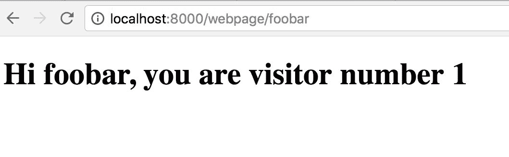

# 在互联网上谈论 HTTP

最重要的应用层协议之一，它极大地改变了我们的生活，必须是 HTTP。它是万维网（WWW）的骨干。在本章中，我们将探讨 Rust 如何使编写快速 HTTP 服务器变得更加容易。我们还将探讨编写客户端通过网络与这些服务器通信。

在本章中，我们将涵盖以下主题：

+   Hyper 的简要介绍，它是编写 HTTP 服务器中最广泛使用的 crate 之一

+   我们将研究 Rocket，一个由于接口更简单而变得非常流行的 crate

+   我们将继续介绍 reqwest，一个 HTTP 客户端库

# 介绍 Hyper

Hyper 可以说是基于 Rust 的 HTTP 框架中最稳定和最知名的。它有两个不同的组件，一个用于编写 HTTP 服务器，另一个用于编写客户端。最近，服务器组件被移动到一个基于 tokio 和 futures 的新异步编程模型。因此，它非常适合高流量工作负载。然而，像生态系统中的许多其他库一样，Hyper 尚未达到版本 1.0，因此应该预期 API 会有破坏性的变化。

我们将从在 Hyper 中编写一个小型 HTTP 服务器开始。像往常一样，我们需要使用 Cargo 设置我们的项目。

```rs
$ cargo new --bin hyper-server
```

现在我们将添加依赖项，包括`hyper`和`futures`。`Cargo.toml`文件将如下所示：

```rs
[package]
name = "hyper-server"
version = "0.1.0"
authors = ["Foo<foo@bar.com>"]

[dependencies]
hyper = "0.11.7"
futures = "0.1.17"
```

我们的主要文件相当简单。在现实世界中，HTTP 服务器通常与后端进行通信，所有这些操作可能需要一段时间才能完成。因此，回复稍微延迟是很常见的。我们将使用一个每次调用时暂停 200 毫秒的函数来模拟这种情况，然后返回一个固定的字符串。

```rs
// ch6/hyper-server/src/main.rs

extern crate hyper;
extern crate futures;

use std::{ thread, time };
use futures::future::FutureResult;
use hyper::{Get, StatusCode};
use hyper::header::ContentLength;
use hyper::server::{Http, Service, Request, Response};

// Simulate CPU intensive work by sleeping for 200 ms
fn heavy_work() -> String {
    let duration = time::Duration::from_millis(200);
    thread::sleep(duration);
    "done".to_string()
}

#[derive(Clone, Copy)]
struct Echo;

impl Service for Echo {
    type Request = Request;
    type Response = Response;
    type Error = hyper::Error;
    type Future = FutureResult<Response, hyper::Error>;

    // This method handles actually processing requests
    // We only handle GET requests on /data and ignore everything else
    // returning a HTTP 404
    fn call(&self, req: Request) -> Self::Future {
        futures::future::ok(match (req.method(), req.path()) {
        (&Get, "/data") => {
        let b = heavy_work().into_bytes();
        Response::new()
        .with_header(ContentLength(b.len() as u64))
        .with_body(b)
}
        _ => Response::new().with_status(StatusCode::NotFound),})
    }
}

fn main() {
    let addr = "0.0.0.0:3000".parse().unwrap();
    let server = Http::new().bind(&addr, || Ok(Echo)).unwrap();
    server.run().unwrap();
}
```

由于 Hyper 严重依赖`tokio`来处理异步请求，Hyper 中的 HTTP 服务器需要实现来自`tokio`的内置特质`Service`。这本质上是一个将`Request`映射到`Response`的函数，通过实现`call`方法。此方法返回一个`Future`，表示给定任务的最终完成。在该实现中，我们匹配传入请求的方法和路径。如果方法是`GET`且路径是`/data`，我们调用`heavy_work`并获取结果。然后，我们通过设置返回字符串的大小作为`Content-Length`头和响应体来组合响应。在我们的`main`函数中，我们通过绑定到一个已知端口来构建我们的服务器。最后，我们调用`run`来启动服务器。

使用`curl`与服务器交互很简单；会话应该如下所示：

```rs
$ curl http://127.0.0.1:3000/data
done$
```

让我们基准测试我们的服务器。为此，我们将安装 ApacheBench ([`httpd.apache.org/docs/trunk/programs/ab.html`](https://httpd.apache.org/docs/trunk/programs/ab.html))。我们将通过向 ApacheBench 传递一些命令行参数，并行运行来自 100 个客户端的 1,000 个总请求。这需要一段时间才能完成，我们在返回每个响应之前等待 200 毫秒。因此，对于 1,000 个请求，我们将至少等待 200 秒。一次运行的结果如下：

```rs
$ ab -n 1000 -c 100 http://127.0.0.1:3000/data
Benchmarking 127.0.0.1 (be patient)
Completed 100 requests
Completed 200 requests
Completed 300 requests
Completed 400 requests
Completed 500 requests
Completed 600 requests
Completed 700 requests
Completed 800 requests
Completed 900 requests
Completed 1000 requests
Finished 1000 requests

Server Software:
Server Hostname: 127.0.0.1
Server Port: 3000

Document Path: /data
Document Length: 4 bytes

Concurrency Level: 100
Time taken for tests: 203.442 seconds
Complete requests: 1000
Failed requests: 0
Total transferred: 79000 bytes
HTML transferred: 4000 bytes
Requests per second: 4.92 [#/sec] (mean)
Time per request: 20344.234 [ms] (mean)
Time per request: 103.442 [ms] (mean, across all concurrent requests)
Transfer rate: 0.38 [Kbytes/sec] received

Connection Times (ms)
min mean[+/-sd] median max
Connect: 0 2 0.7 2 3
Processing: 5309 20123 8061.9 20396 33029
Waiting: 203 12923 5518.0 14220 20417
Total: 5311 20124 8061.9 20397 33029

Percentage of the requests served within a certain time (ms)
  50% 20397
  66% 25808
  75% 26490
  80% 27263
  90% 28373
  95% 28568
  98% 33029
  99% 33029
 100% 33029 (longest request)
```

注意，在整个请求过程中，服务器大约需要 103.4 毫秒来回复。这与我们预期的 100 毫秒相符，额外的耗时花在其他事情上。此外，我们的服务器每秒处理 4.92 个请求，这对于一个合理的服务器来说太低了。这全部是因为我们的服务器是单线程的，只有一个线程为所有客户端服务。这个服务器也忽略了主机上可用的多个 CPU 核心的事实。

让我们继续编写一个服务器，它基本上做同样的事情，区别在于这个服务器大量使用多线程并使用所有 CPU 核心。Cargo 设置应该是这样的：

```rs
$ cargo new --bin hyper-server-faster
```

我们需要添加一些额外的 crate 作为依赖项，我们的`Cargo.toml`应该是这样的：

```rs
[package]
name = "hyper-server-faster"
version = "0.1.0"
authors = ["Foo<foo@bar.com>"]

[dependencies]
hyper = "0.11.7"
futures = "0.1.17"
net2 = "0.2.31"
tokio-core = "0.1.10"
num_cpus = "1.0"
```

我们这里有一些额外的事情。`tokio-core`将被用来运行一个事件循环（就像我们在`mio`中在第三章，*使用 Rust 的 TCP 和 UDP*），`net2`将被用来进行一些高级套接字配置，而`num_cpus`将被用来确定机器上的 CPU 核心数。设置好这些后，我们的主文件相当简单：

```rs
// ch6/hyper-server-faster/src/main.rs

extern crate futures;
extern crate hyper;
extern crate net2;
extern crate tokio_core;
extern crate num_cpus;

use futures::Stream;
use net2::unix::UnixTcpBuilderExt;
use tokio_core::reactor::Core;
use tokio_core::net::TcpListener;
use std::{thread, time};
use std::net::SocketAddr;
use std::sync::Arc;
use futures::future::FutureResult;
use hyper::{Get, StatusCode};
use hyper::header::ContentLength;
use hyper::server::{Http, Service, Request, Response};

// Same method like last example
fn heavy_work() -> String {
    let duration = time::Duration::from_millis(200);
    thread::sleep(duration);
    "done".to_string()
}

#[derive(Clone, Copy)]
struct Echo;

impl Service for Echo {
    type Request = Request;
    type Response = Response;
    type Error = hyper::Error;
    type Future = FutureResult<Response, hyper::Error>;

    fn call(&self, req: Request) -> Self::Future {
        futures::future::ok(match (req.method(), req.path()) {
            (&Get, "/data") => {
                let b = heavy_work().into_bytes();
                Response::new()
                    .with_header(ContentLength(b.len() as u64))
                    .with_body(b)
            }
            _ => Response::new().with_status(StatusCode::NotFound),
        })
    }
}

// One server instance
fn serve(addr: &SocketAddr, protocol: &Http) {
    let mut core = Core::new().unwrap();
    let handle = core.handle();
    let listener = net2::TcpBuilder::new_v4()
        .unwrap()
        .reuse_port(true)
        .unwrap()
        .bind(addr)
        .unwrap()
        .listen(128)
        .unwrap();
    let listener = TcpListener::from_listener(listener, addr,
    &handle).unwrap();
    core.run(listener.incoming().for_each(|(socket, addr)| {
        protocol.bind_connection(&handle, socket, addr, Echo);
        Ok(())
    })).unwrap();
}

// Starts num number of serving threads
fn start_server(num: usize, addr: &str) {
    let addr = addr.parse().unwrap();

    let protocol = Arc::new(Http::new());
    {
        for _ in 0..num - 1 {
            let protocol = Arc::clone(&protocol);
            thread::spawn(move || serve(&addr, &protocol));
        }
    }
    serve(&addr, &protocol);
}

fn main() {
    start_server(num_cpus::get(), "0.0.0.0:3000");
}
```

功能上，这个服务器与上一个完全相同。在架构上，它们非常不同。我们的`Service`实现是相同的。主要变化是我们将启动服务器分成两个函数；`serve`函数创建一个新的事件循环（及其句柄）。我们使用`net2`创建监听器，这样我们就可以使用`TcpBuilder`模式设置一系列选项。具体来说，我们在套接字上设置了`SO_REUSEPORT`，这样在高负载下，操作系统可以公平地将连接分配给所有线程。我们还为监听套接字设置了 128 个回压。然后我们在监听器上循环处理传入的连接，并对每个连接运行我们的服务实现。我们的`start_server`方法接受一个整数，对应于主机上的核心数，以及一个字符串形式的地址。然后我们启动一个循环，在新线程中运行`serve`方法。在这种情况下，我们的`Http`实例将被传递到多个线程。因此，我们需要将其包装在一个**自动引用计数**（**ARC**）指针中，因为这保证了底层类型的线程安全性。最后，我们在`main`函数中调用`start_server`，使用`num_cpus::get`获取机器上的核心数。

以与上次相同的方式基准测试，结果显示如下：

```rs
$ ab -n 1000 -c 100 http://127.0.0.1:3000/data
Benchmarking 127.0.0.1 (be patient)
Completed 100 requests
Completed 200 requests
Completed 300 requests
Completed 400 requests
Completed 500 requests
Completed 600 requests
Completed 700 requests
Completed 800 requests
Completed 900 requests
Completed 1000 requests
Finished 1000 requests

Server Software:
Server Hostname: 127.0.0.1
Server Port: 3000

Document Path: /data
Document Length: 4 bytes

Concurrency Level: 100
Time taken for tests: 102.724 seconds
Complete requests: 1000
Failed requests: 0
Total transferred: 79000 bytes
HTML transferred: 4000 bytes
Requests per second: 9.73 [#/sec] (mean)
Time per request: 10272.445 [ms] (mean)
Time per request: 102.724 [ms] (mean, across all concurrent requests)
Transfer rate: 0.75 [Kbytes/sec] received

Connection Times (ms)
              min mean[+/-sd] median max
Connect: 0 2 1.0 2 6
Processing: 304 10036 1852.8 10508 10826
Waiting: 106 5482 2989.3 5458 10316
Total: 305 10038 1852.7 10510 10828

Percentage of the requests served within a certain time (ms)
  50% 10510
  66% 10569
  75% 10685
  80% 10686
  90% 10756
  95% 10828
  98% 10828
  99% 10828
 100% 10828 (longest request)
```

这个服务器的吞吐量大约是上一个的两倍，主要是因为它更好地使用了线程。请求的处理时间仍然略超过 100 毫秒，正如预期的那样。请注意，实际所需时间将取决于运行此机器的硬件和条件。

# 介绍 Rocket

可能最广为人知的 Rust 网络框架是 Rocket。它最初是一个人的项目，并在过去一年左右的时间里逐渐发展成为一个简单、优雅且快速的框架。Rocket 非常注重简洁性，这是许多 Flask 用户会欣赏的。像 Flask 使用 Python 装饰器来声明路由一样，Rocket 使用自定义属性来达到同样的效果。不幸的是，这意味着 Rocket 必须大量使用仅限夜间构建的功能。因此，截至目前，Rocket 应用程序只能使用夜间 Rust 来构建。然而，随着越来越多的功能得到稳定（转移到稳定 Rust），这种限制最终将消失。

让我们从 Rocket 的一个基本示例开始，首先是设置项目：

```rs
$ cargo new --bin rocket-simple
```

我们的 Cargo 设置需要将 Rocket 组件作为依赖项添加，并且应该看起来像这样：

```rs
[package]
name = "rocket-simple"
version = "0.1.0"
authors = ["Foo <foo@bar.com>"]

[dependencies]
rocket = "0.3.6"
rocket_codegen = "0.3.6"
```

让我们看看主文件。正如我们将看到的，Rocket 需要一些样板设置：

```rs
// ch6/rocket-simple/src/main.rs

#![feature(plugin)]
#![plugin(rocket_codegen)]

extern crate rocket;

#[get("/")]
fn blast_off() -> &'static str {
    "Hello, Rocket!"
}

fn main() {
    rocket::ignite().mount("/", routes![blast_off]).launch();
}
```

被称为 `blast_off` 的函数定义了一个路由，即一个传入请求与输出之间的映射。在这种情况下，对 `/` 路由的 **GET** 请求应返回一个静态字符串。在我们的主函数中，我们初始化 Rocket，添加我们的路由，并调用 `launch`。使用 Cargo 运行它：

```rs
$ cargo run
    Finished dev [unoptimized + debuginfo] target(s) in 0.0 secs
     Running `target/debug/rocket-simple`
Configured for development.
    => address: localhost
    => port: 8000
    => log: normal
    => workers: 16
    => secret key: generated
    => limits: forms = 32KiB
    => tls: disabled
Mounting '/':
    => GET /
Rocket has launched from http://localhost:8000
```

在另一个终端中，如果我们使用 curl 来访问该端点，我们应该看到以下内容：

```rs
$ curl http://localhost:8000
Hello, Rocket!$
```

经验丰富的 Python 用户会发现 Rocket 与名为 Flask 的框架类似。

让我们来看一个更复杂的例子：使用 Rocket 编写 API 服务器。我们的应用程序是一个博客服务器，具有以下端点：

| **端点** | **方法** | **目的** |
| --- | --- | --- |
| `/posts` | `GET` | 获取所有帖子 |
| `/posts/<id>` | `GET` | 获取给定 ID 的帖子 |
| `/posts` | `POST` | 添加新帖子 |
| `/posts/<id>` | `PATCH` | 编辑帖子 |
| `/posts/<id>` | `DELETE` | 删除给定 ID 的帖子 |

对于这个例子，我们将使用 SQLite 版本 3 作为我们的数据库。一个真正的应用程序应该使用更可扩展的数据库，例如 PostgreSQL 或 MySQL。我们将使用 diesel crate 作为我们的 **对象关系映射**（**ORM**）工具，并使用 r2d2 进行数据库连接池。为此，第一步是安装 diesel CLI 以处理数据库模式迁移。这可以通过 Cargo 来安装。

```rs
$ cargo install diesel_cli --no-default-features --features sqlite
```

为了使此功能正常工作，必须在主机系统上安装 SQLite 版本 3。有关更多信息，请访问以下链接：

[`www.sqlite.org/download.html`](https://www.sqlite.org/download.html)

现在，我们可以使用 diesel CLI 来设置我们的数据库。它将读取我们的迁移脚本并创建整个模式。由于 SQLite 是基于文件的数据库，如果不存在，它还将创建一个空的 `db` 文件。

```rs
$ DATABASE_URL=db.sql diesel migration run
```

记住，最后一个命令必须从包含迁移目录的目录中运行，否则它将无法找到迁移。我们将使用 Cargo 来设置项目：

```rs
$ cargo new --bin rocket-blog
```

我们将在这里添加一些依赖项；`Cargo.toml` 应该看起来像以下代码片段：

```rs
[package]
authors = ["Foo <foo@bar.com>"]
name = "rocket-blog"
version = "0.1.0"

[dependencies]
rocket = "0.3.5"
rocket_codegen = "0.3.5"
rocket_contrib = "0.3.5"
diesel = { version = "0.16.0", features = ["sqlite"] }
diesel_codegen = { version = "0.16.0", features = ["sqlite"] }
dotenv = "0.10.1"
serde = "1.0.21"
serde_json = "1.0.6"
serde_derive = "1.0.21"
lazy_static = "0.2.11"
r2d2 = "0.7.4"
r2d2-diesel = "0.16.0"
```

这个应用程序比我们之前的例子要复杂一些。它由多个模块组成，每个模块执行特定的功能。以下是 `src` 目录的看起来：

```rs
$ tree src/
src/
├── db.rs
├── error.rs
├── main.rs
├── models.rs
├── post.rs
└── schema.rs
```

运行此应用程序的第一步是设置与数据库的连接。我们将使用 r2d2 进行数据库连接池；所有与 `db` 设置相关的操作都将放在 `db.rs` 中。这看起来像以下代码片段：

```rs
// ch6/rocket-blog/src/db.rs

use dotenv::dotenv;
use std::env;
use diesel::sqlite::SqliteConnection;
use r2d2;
use r2d2_diesel::ConnectionManager;
use rocket::request::{Outcome, FromRequest};
use rocket::Outcome::{Success, Failure};
use rocket::Request;
use rocket::http::Status;

// Statically initialize our DB pool
lazy_static! {
    pub static ref DB_POOL:
    r2d2::Pool<ConnectionManager<SqliteConnection>> = {
        dotenv().ok();

        let database_url = env::var("DATABASE_URL").
        expect("DATABASE_URL must be set");
        let config = r2d2::Config::builder()
            .pool_size(32)
            .build();
        let manager = ConnectionManager::
        <SqliteConnection>::new(database_url);
        r2d2::Pool::new(config, manager).expect("Failed to create
        pool.")
    };
}

pub struct DB(r2d2::PooledConnection<ConnectionManager<SqliteConnection>>);

// Make sure DB pointers deref nicely 
impl Deref for DB {
    type Target = SqliteConnection;

    fn deref(&self) -> &Self::Target {
        &self.0
    }
}

impl<'a, 'r> FromRequest<'a, 'r> for DB {
    type Error = r2d2::GetTimeout;
    fn from_request(_: &'a Request<'r>) -> Outcome<Self, Self::Error> {
        match DB_POOL.get() {
            Ok(conn) => Success(DB(conn)),
            Err(e) => Failure((Status::InternalServerError, e)),
        }
    }
}
```

我们的 `DB` 结构体有一个数据库连接池的实例，并在调用名为 `conn` 的函数时返回它。`FromRequest` 是来自 Rocket 的一个请求保护特质，它确保特定的请求可以被匹配的处理程序满足。在我们的情况下，我们使用它来确保连接池中有一个新的连接可用，如果没有，则返回 HTTP 500 错误。现在这个特质将用于整个程序生命周期中的所有传入请求。因此，为了正确工作，数据库连接池的引用必须在整个程序生命周期中存在，而不是局部作用域。我们使用 `lazy_static!` crate 来确保常量 `DB_POOL` 只初始化一次，并贯穿整个程序的生命周期。在宏中，我们设置了 `dotenv`，它将被用于稍后解析数据库位置以及大小为 32 个连接的连接池。我们还为我们的数据库包装器实现了 `Deref` 特质，这样 `&*DB` 就可以透明地转换为 `&SqliteConnection`。

下一步是在代码中设置数据库模式。幸运的是，`diesel` 使得这一过程非常简单，因为它可以读取数据库模式并生成相应的 Rust 代码来表示。生成的 Rust 代码被放置在一个与文件名对应的模块中（在这个例子中，模块将被命名为 `schema`）。我们使用 `dotenv` crate 将这些信息传递给 `diesel` 宏。这是在文件 `schema.rs` 中完成的：

```rs
// ch6/rocket-blog/src/schema.rs

infer_schema!("dotenv:DATABASE_URL");
```

注意，一旦新的宏系统可用，这个调用将使用 `dotenv!` 宏。然后我们可以使用生成的模式来构建我们的模型。这是在 `models.rs` 中完成的。这个文件看起来像以下代码片段：

```rs
// ch6/rocket-blog/src/models.rs

use super::schema::posts;
use rocket::{Request, Data};
use rocket::data::{self, FromData};
use rocket::http::Status;
use rocket::Outcome::*;
use serde_json;

// Represents a blog post in the database
#[derive(Queryable)]
#[derive(Serialize,Deserialize)]
pub struct Post {
    pub id: i32,
    pub title: String,
    pub body: String,
    pub pinned: bool,
}

// Represents a blog post as incoming request data
#[derive(Insertable, Deserialize, AsChangeset)]
#[table_name="posts"]
pub struct PostData {
    pub title: String,
    pub body: String,
    pub pinned: bool,
}

// This enables using PostData from incoming request data
impl FromData for PostData {
    type Error = String;

    #[allow(unused_variables)]
    fn from_data(req: &Request, data: Data) -> data::Outcome<Self,
    String> {
        let reader = data.open();
        match serde_json::from_reader(reader).map(|val| val) {
            Ok(value) => Success(value),
            Err(e) => Failure((Status::BadRequest, e.to_string())),
        }
    }
}
```

在这里，我们有两大结构：`Post` 结构代表数据库中的博客文章，而 `PostData` 结构代表在传入的创建请求中看到的博客文章。由于 `PostData` 尚未保存到数据库中，它没有 ID。Diesel 要求所有可以查询的类型都应该实现 `Queryable` 特性，这可以通过 `#[derive(Queryable)]` 自动完成。我们还启用了使用 serde 的序列化和反序列化，因为这将作为 JSON 传递到 API。相比之下，`PostData` 结构不继承 `Queryable`；它继承了一些其他特性。`Insertable` 特性表示这个结构可以用作在表中插入一行数据（指定表名）。因为我们只需要从传入的请求中反序列化这个结构，所以我们只实现了 `Deserialize`。最后，`AsChangeSet` 特性使得这个结构可以用作更新数据库中的记录。

`FromData` 特性来自 Rocket，用于验证传入的数据，确保其正确解析为 JSON。这与一个名为数据守卫的功能相关。当 Rocket 找到适合传入请求的处理程序时，它会调用请求处理程序中指定数据类型的数据守卫对传入数据进行处理。只有当数据守卫成功时，路由才会实际调用。这些守卫是通过 `FromData` 特性实现的。在我们的案例中，实现尝试将输入解析为 JSON（使用 SerDe）。在成功的情况下，我们返回 JSON 以供进一步处理，或者返回 `Status::BadRequest`，这会发送 HTTP 400 错误。

目前所需的唯一数据库相关事物是模型。这将定义一系列方便的方法，可以用来使用 diesel 操作记录。文件 `post.rs` 包含了这些方法，如下代码片段所示：

```rs
// ch6/rocket-blog/src/post.rs

use diesel::result::Error;
use diesel;
use diesel::sqlite::SqliteConnection;
use models::*;
use diesel::prelude::*;
use schema::posts;

// Returns post with given id
pub fn get_post(conn: &SqliteConnection, id: i32) -> Result<Post, Error> {
    posts::table
        .find(id)
        .first::<Post>(conn)
}

// Returns all posts
pub fn get_posts(conn: &SqliteConnection) -> Result<Vec<Post>, Error> {
    posts::table
        .load::<Post>(conn)
}

// Creates a post with the given PostData, assigns a ID
pub fn create_post(conn: &SqliteConnection, post: PostData) -> bool {
    diesel::insert(&post)
        .into(posts::table).execute(conn).is_ok()
}

// Deletes a post with the given ID
pub fn delete_post(conn: &SqliteConnection, id: i32) -> Result<usize, Error> {
    diesel::delete(posts::table.find(id))
        .execute(conn)
}

// Updates a post with the given ID and PostData
pub fn update_post(conn: &SqliteConnection, id: i32, updated_post: PostData) -> bool {
    diesel::update(posts::table
        .find(id))
        .set(&updated_post).execute(conn).is_ok()
}
```

函数名称非常直观。我们大量使用了 diesel API，这些 API 帮助我们与数据库交互，而无需直接编写 SQL。所有这些函数都接受数据库连接的引用。`get_post` 函数接受一个额外的帖子 ID，它使用 `find` 方法在帖子表中查找帖子，然后返回第一个结果作为 `Post` 实例。`get_posts` 函数类似，但它返回帖子表中的所有记录作为 `Post` 实例的向量。`create_post` 函数接受 `PostData` 的引用，并将该记录插入到数据库中。此函数返回一个 `bool` 值，指示成功或失败。`delete_post` 函数接受帖子 ID 并尝试在数据库中删除它。`update_post` 再次接受 `PostData` 的引用和一个帖子 ID。然后它尝试用新的 `PostData` 替换具有给定 ID 的帖子。

让我们继续定义我们 API 的错误。这将位于名为`error.rs`的文件中。正如我们将看到的，错误需要实现多个特性，以便在 Rocket 和 Diesel 中无缝使用。

```rs
// ch6/rocket-blog/src/error.rs

use std::error::Error;
use std::convert::From;
use std::fmt;
use diesel::result::Error as DieselError;
use rocket::http::Status;
use rocket::response::{Response, Responder};
use rocket::Request;

#[derive(Debug)]
pub enum ApiError {
    NotFound,
    InternalServerError,
}

impl fmt::Display for ApiError {
    fn fmt(&self, f: &mut fmt::Formatter) -> fmt::Result {
        match *self {
            ApiError::NotFound => f.write_str("NotFound"),
            ApiError::InternalServerError => f.write_str("InternalServerError"),
        }
    }
}

// Translates a database error to an API error
impl From<DieselError> for ApiError {
    fn from(e: DieselError) -> Self {
        match e {
            DieselError::NotFound => ApiError::NotFound,
            _ => ApiError::InternalServerError,
        }
    }
}

impl Error for ApiError {
    fn description(&self) -> &str {
        match *self {
            ApiError::NotFound => "Record not found",
            ApiError::InternalServerError => "Internal server error",
        }
    }
}

// This enables sending back an API error from a route
impl<'r> Responder<'r> for ApiError {
    fn respond_to(self, _request: &Request) -> Result<Response<'r>, Status> {
        match self {
            ApiError::NotFound => Err(Status::NotFound),
            _ => Err(Status::InternalServerError),
        }
    }
}
```

我们的错误是一个名为`ApiError`的`enum`；为了简单起见，我们只返回一个对象未找到错误和一个通用的内部服务器错误。正如我们在前面的章节中看到的，为了在 Rust 中声明错误，我们需要在那种类型上实现`fmt::Display`和`std::error::Error`。我们还为我们类型实现了`From<DieselError>`，以便在数据库查找失败时能够适当地报告。我们需要实现的最后一个特性是 Rocket 的`Responder`，这使我们能够将其用作请求处理器的返回类型。

在完成所有准备工作后，系统的最后一部分是我们主要的文件，当使用 Cargo 调用时将运行。它应该看起来像以下代码片段：

```rs
// ch6/rocket-blog/src/main.rs

#![feature(plugin)]
#![plugin(rocket_codegen)]
extern crate rocket;
#[macro_use]
extern crate diesel;
#[macro_use]
extern crate diesel_codegen;
extern crate dotenv;
extern crate serde_json;
#[macro_use]
extern crate lazy_static;
extern crate rocket_contrib;
#[macro_use]
extern crate serde_derive;
extern crate r2d2;
extern crate r2d2_diesel;

mod schema;
mod db;
mod post;
mod models;
mod error;

use db::DB;
use post::{get_posts, get_post, create_post, delete_post, update_post};
use models::*;
use rocket_contrib::Json;
use rocket::response::status::{Created, NoContent};
use rocket::Rocket;
use error::ApiError;

#[get("/posts", format = "application/json")]
fn posts_get(db: DB) -> Result<Json<Vec<Post>>, ApiError> {
    let posts = get_posts(&db)?;
    Ok(Json(posts))
}

#[get("/posts/<id>", format = "application/json")]
fn post_get(db: DB, id: i32) -> Result<Json<Post>, ApiError> {
    let post = get_post(&db, id)?;
    Ok(Json(post))
}

#[post("/posts", format = "application/json", data = "<post>")]
fn post_create(db: DB, post: PostData) -> Result<Created<String>, ApiError> {
    let post = create_post(&db, post);
    let url = format!("/post/{}", post);
    Ok(Created(url, Some("Done".to_string())))
}

#[patch("/posts/<id>", format = "application/json", data = "<post>")]
fn post_edit(db: DB, id: i32, post: PostData) -> Result<Json<bool>, ApiError> {
    let post = update_post(&db, id, post);
    Ok(Json(post))
}

#[delete("/posts/<id>")]
fn post_delete(db: DB, id: i32) -> Result<NoContent, ApiError> {
    delete_post(&db, id)?;
    Ok(NoContent)
}

// Helper method to setup a rocket instance
fn rocket() -> Rocket {
    rocket::ignite().mount("/", routes![post_create, posts_get, post_delete, post_edit, post_get])
}

fn main() {
        rocket().launch();
}
```

这里最重要的东西是路由处理器。这些只是具有特殊属性的标准函数，用于确定路径、格式和参数。此外，请注意在处理器中使用`DB`实例作为请求保护。我们有一个名为`rocket`的辅助函数，用于设置一切，而`main`函数只是调用`ignite`方法来启动服务器。当`rocket`看到传入的请求时，这就是生成响应的方式：

1.  它会遍历所有处理器的列表，并找到一个与 HTTP 方法、类型和格式匹配的处理器。如果找到了一个，它会确保处理器的参数可以使用`FormData`从请求中的数据中推导出来。这个过程会一直持续到找到一个有效的处理器或者所有处理器都尝试过。在后一种情况下，会返回一个 404 错误。

1.  处理函数随后会接收到解析到给定数据类型中的数据的副本。在它完成处理之后，它必须使用`Responder`实现将输出转换为有效的返回类型。

1.  最后，`Rocket`将响应发送回客户端。

在设置好一切后，运行服务器非常简单：

```rs
$ DATABASE_URL=db.sql cargo run
jq for formatting the JSON nicely by piping curl's output to jq:
```

```rs
$ curl -X POST -H "Content-Type: application/json" -d '{"title": "Hello Rust!", "body": "Rust is awesome!!", "pinned": true}' http://localhost:8000/posts
Done
$ curl http://localhost:8000/posts | jq
  % Total % Received % Xferd Average Speed Time Time Time Current
                                 Dload Upload Total Spent Left Speed
100 130 100 130 0 0 130 0 0:00:01 --:--:-- 0:00:01 8125
[
  {
    "id": 1,
    "title": "test",
    "body": "test body",
    "pinned": true
  },
  {
    "id": 2,
    "title": "Hello Rust!",
    "body": "Rust is awesome!!",
    "pinned": true
  }
]
```

为了进行比较，以下是负载测试会话的示例：

```rs
$ ab -n 10000 -c 100 http://localhost:8000/posts
Benchmarking localhost (be patient)
Completed 1000 requests
Completed 2000 requests
Completed 3000 requests
Completed 4000 requests
Completed 5000 requests
Completed 6000 requests
Completed 7000 requests
Completed 8000 requests
Completed 9000 requests
Completed 10000 requests
Finished 10000 requests

Server Software: Rocket
Server Hostname: localhost
Server Port: 8000

Document Path: /posts
Document Length: 130 bytes

Concurrency Level: 100
Time taken for tests: 2.110 seconds
Complete requests: 10000
Failed requests: 0
Total transferred: 2740000 bytes
HTML transferred: 1300000 bytes
Requests per second: 4740.00 [#/sec] (mean)
Time per request: 21.097 [ms] (mean)
Time per request: 0.211 [ms] (mean, across all concurrent requests)
Transfer rate: 1268.32 [Kbytes/sec] received

Connection Times (ms)
              min mean[+/-sd] median max
Connect: 0 0 0.4 0 4
Processing: 3 21 20.3 19 229
Waiting: 2 20 19.8 18 228
Total: 7 21 20.3 19 229

Percentage of the requests served within a certain time (ms)
  50% 19
  66% 19
  75% 20
  80% 20
  90% 21
  95% 22
  98% 26
  99% 214
 100% 229 (longest request)
```

现在，为了公平起见，我们之前的服务器那里有一个 100 毫秒的延迟。在这种情况下，每个请求平均需要 21 毫秒。所以，假设每个请求需要 100 毫秒，我们将有五分之一的吞吐量。这将达到大约每秒 950 个请求——比我们之前的服务器快得多！

现在，很明显，一个 HTTP 服务器不能只关注 REST 端点。它还必须能够提供静态和动态内容。为此，Rocket 提供了一系列功能，能够生成 HTML。让我们看看一个例子，这是一个简单的网页，它接受一个作为 URL 参数的名称，并输出该名称。该页面还计算总访问次数，并将其显示出来。这个项目的 Cargo 设置很简单：我们只需运行以下命令：

```rs
$ cargo new --bin rocket-templates
```

这次，我们只需要在`Cargo.toml`文件中包含 Rocket：

```rs
[package]
authors = ["Foo<foo@bar.com>"]
name = "rocket-templates"
version = "0.1.0"

[dependencies]
rocket = "0.3.5"
rocket_codegen = "0.3.5"

[dependencies.rocket_contrib]
version = "*"
default-features = false
features = ["tera_templates"]
```

我们的网页将从一个模板生成。我们将使用一个名为 Tera 的模板引擎，它受到 Jinja2 的启发，并使用 Rust 编写。Rocket 支持一个名为 `rocket_contrib` 的不同 crate 中的模板，我们将通过所需功能将其拉入。我们的模板非常简单，应该看起来像这样：

```rs
// ch6/rocket-templates/templates/webpage.html.tera

<!DOCTYPE html>
<html>
  <head>
    <meta charset="utf-8" />
    <title>Rocket template demo</title>
  </head>
  <body>
    <h1>Hi {{name}}, you are visitor number {{ visitor_number }}</h1>
  </body>
</html>
```

注意，模板必须位于项目根目录下的 `templates` 目录中，否则 `Rocket` 将无法找到它。在这种情况下，模板非常简单。它需要是一个完整的 HTML 页面，因为我们打算在浏览器中显示它。我们使用两个临时变量，`name` 和 `visitor_number`，它们将在执行期间被替换。我们的主文件将如下代码片段所示：

```rs
// ch6/rocket-templates/src/main.rs

#![feature(plugin)]
#![plugin(rocket_codegen)]

extern crate rocket_contrib;
extern crate rocket;

use rocket_contrib::Template;
use rocket::{Rocket, State};
use std::collections::HashMap;
use std::sync::atomic::{AtomicUsize, Ordering};

struct VisitorCounter {
    visitor_number: AtomicUsize,
}

#[get("/webpage/<name>")]
fn webpage(name: String, visitor: State<VisitorCounter>) -> Template {
    let mut context = HashMap::new();
    context.insert("name", name);
    let current = visitor.visitor_number.fetch_add(1, Ordering::SeqCst);
    context.insert("visitor_number", current.to_string());
    Template::render("webpage", &context)
}

fn rocket() -> Rocket {
    rocket::ignite()
        .manage(VisitorCounter { visitor_number: AtomicUsize::new(1) })
        .mount("/", routes![webpage])
        .attach(Template::fairing())
}

fn main() {
    rocket().launch();
}
```

我们这次的设置与上次基本相同；唯一的区别是，我们使用了模板 fairing，它在 Rocket 中类似于中间件。要使用它，我们需要在 rocket 实例上调用 `attach(Template::fairing())`。另一个区别是使用了托管状态，我们用它来自动管理我们的计数器。这是通过在实例上调用 `manage` 并传递托管对象的初始状态来实现的。我们的计数器是一个结构体，它只有一个元素，用于保存当前计数。现在我们的计数器将在多个线程之间共享，所有这些线程都在运行 rocket 实例。为了使计数器线程安全，我们使用了原始的 `AtomicUsize`，它保证了线程安全。在我们的路由中，我们匹配 `GET` 动词，并接受一个作为 URL 参数的名称。为了渲染我们的模板，我们需要构建一个上下文并填充它。每当传入的请求匹配此路由时，我们可以在我们的上下文中插入名称。然后我们调用底层数计器的 `fetch_add`。此方法增加计数器并返回之前的值，我们将它存储在上下文中，键名为 `visitor_number`。完成后，我们可以渲染我们的模板，并将其返回给客户端。注意 `fetch_add` 中使用 `Ordering::SeqCst`，这保证了所有竞争线程对计数器的顺序一致性视图。还要注意，上下文中键的名称必须与模板中使用的临时变量匹配，否则渲染将失败。

运行这个程序很简单；我们只需要使用 `cargo run`。这是我们在命令行界面看到的内容：

```rs
$ cargo run
    Finished dev [unoptimized + debuginfo] target(s) in 0.0 secs
     Running `target/debug/rocket-templates`
Configured for development.
    => address: localhost
    => port: 8000
    => log: normal
    => workers: 16
    => secret key: generated
    => limits: forms = 32KiB
    => tls: disabled
Mounting '/':
    => GET /webpage/<name>
Rocket has launched from http://localhost:8000
```

然后，我们可以使用网络浏览器访问页面，看到以下类似截图的内容：



注意，当 `Rocket` 实例重启时，计数器会重置。在实际应用中，可能会决定将此类指标持久化到数据库中，以便在重启之间不会丢失。这也适用于 `curl`，它只是将原始 HTML 输出到控制台：

```rs
$ curl http://localhost:8000/webpage/foo
<!DOCTYPE html>
<html>
  <head>
    <meta charset="utf-8" />
    <title>Rocket template demo</title>
  </head>
  <body>
    <h1>Hi foo, you are visitor number 2</h1>
  </body>
</html>
```

使用这段代码的最后实验是性能分析。和往常一样，我们将启动 apache bench 并指向端点。这是单次运行的结果：

```rs
$ ab -n 10000 -c 100 http://localhost:8000/webpage/foobar
Benchmarking localhost (be patient)
Completed 1000 requests
Completed 2000 requests
Completed 3000 requests
Completed 4000 requests
Completed 5000 requests
Completed 6000 requests
Completed 7000 requests
Completed 8000 requests
Completed 9000 requests
Completed 10000 requests
Finished 10000 requests

Server Software: Rocket
Server Hostname: localhost
Server Port: 8000

Document Path: /webpage/foobar
Document Length: 191 bytes

Concurrency Level: 100
Time taken for tests: 2.305 seconds
Complete requests: 10000
Failed requests: 0
Total transferred: 3430000 bytes
HTML transferred: 1910000 bytes
Requests per second: 4337.53 [#/sec] (mean)
Time per request: 23.055 [ms] (mean)
Time per request: 0.231 [ms] (mean, across all concurrent requests)
Transfer rate: 1452.90 [Kbytes/sec] received

Connection Times (ms)
              min mean[+/-sd] median max
Connect: 0 0 2.8 0 200
Processing: 3 23 18.6 21 215
Waiting: 3 22 18.0 20 214
Total: 7 23 18.8 21 215

Percentage of the requests served within a certain time (ms)
  50% 21
  66% 21
  75% 22
  80% 22
  90% 24
  95% 25
  98% 28
  99% 202
 100% 215 (longest request)
```

在这种情况下，性能与上次相当，以每秒请求数来衡量。这个稍微慢一些，因为它每次都必须增加计数器并渲染模板。这也反映在平均请求时间上，增加了 2 毫秒。

Rocket 有许多其他功能，从 cookies 到流式数据。它还支持通过读取放置在应用程序根目录中的特殊配置文件来开箱即用 SSL。然而，这些高级功能超出了本书的范围。

# 介绍 reqwest

到目前为止，我们只讨论了编写服务器并使用 `curl` 访问它们。有时，以编程方式访问服务器变得是必需的。在本节中，我们将讨论 `reqwest` crate 并查看如何使用它；这大量借鉴了 Python 中的 requests 库。因此，它非常容易设置和使用，首先从项目设置开始：

```rs
$ cargo new --bin reqwest-example
```

我们演示的下一步是包含我们的依赖项。我们的 Cargo 配置应该看起来像这样：

```rs
[package]
name = "reqwest-example"
version = "0.1.0"
authors = ["Foo<foo@bar.com>"]

[dependencies]
reqwest = "0.8.1"
serde_json = "1.0.6"
serde = "1.0.21"
serde_derive = "1.0.21"
```

在这里，我们将使用 Serde 来将我们的数据序列化和反序列化为 JSON。非常方便的是，我们将使用上一节中编写的 `Rocket` 服务器。我们的主文件将看起来像这样：

```rs
// ch6/reqwest-example/src/main.rs

extern crate serde_json;
#[macro_use]
extern crate serde_derive;
extern crate reqwest;

#[derive(Debug,Serialize, Deserialize)]
struct Post {
    title: String,
    body: String,
    pinned: bool,
}

fn main() {
    let url = "http://localhost:8000/posts";
    let post: Post = Post {title: "Testing this".to_string(), body: "Try to write something".to_string(), pinned: true};
    let client = reqwest::Client::new();

    // Creates a new blog post using the synchronous client
    let res = client.post(url)
            .json(&post)
            .send()
            .unwrap();
    println!("Got back: {}", res.status());

    // Retrieves all blog posts using the synchronous client
    let mut posts = client.get(url).send().unwrap();
    let json: Vec<Post> = posts.json().unwrap();
    for post in json {
        println!("{:?}", post);
    }
}
```

我们从一个表示我们的博客文章的 struct 开始，这与上一节中的完全相同。在我们的 `main` 函数中，我们创建了一个客户端实例，并使用构建器模式将我们的文章作为 JSON 传递给它。最后，我们在它上面调用 `send` 并打印出返回状态。确保将 `url` 改变为目标 `Rocket` 运行的位置。然后，我们在同一端点上发出一个 `GET` 请求。我们将响应反序列化为 `Post` 对象的列表，并在循环中打印这些对象。内部，reqwest 使用 SerDe 将数据序列化和反序列化为 JSON，使 API 非常用户友好。

这里是一个运行前面代码的示例会话。在我们的服务器中，我们已经有了两个现有的条目，在我们的代码中，我们添加了一个。然后，我们得到了所有三个，它们在这里打印出来。请看以下代码片段：

```rs
$ cargo run
   Compiling reqwest-example v0.1.0 (file:///src/ch6/reqwest-example)
    Finished dev [unoptimized + debuginfo] target(s) in 1.94 secs
     Running `target/debug/reqwest-example`
Got back: 201 Created
Post { title: "test", body: "test body", pinned: true }
Post { title: "Hello Rust!", body: "Rust is awesome!!", pinned: true }
Post { title: "Testing this", body: "Try to write something", pinned: true }
```

最近，`reqwest` 添加了对异步编程的支持，使用 tokio。所有这些 API 都位于 `reqwest::unstable` 中，正如其名所示，这些还不是稳定的。让我们看看如何使用异步客户端达到相同的目的。在这种情况下，我们将使用 futures 和 tokio crate，因此我们需要在我们的 cargo manifest 中包含它们，它将看起来像这样：

```rs
[package]
name = "reqwest-async"
version = "0.1.0"
authors = ["Foo <foo@bar.com>"]

[dependencies]
serde_json = "1.0.6"
serde = "1.0.21"
serde_derive = "1.0.21"
futures = "0.1.17"
tokio-core = "0.1.10"

[dependencies.reqwest]
version = "0.8.1"
features = ["unstable"]
```

我们需要激活 reqwest 中的名为 unstable 的功能。我们的主文件将看起来像以下代码片段：

```rs
// ch6/reqwest-async/src/main.rs

extern crate serde_json;
#[macro_use]
extern crate serde_derive;
extern crate reqwest;
extern crate futures;
extern crate tokio_core;

use futures::Future;
use tokio_core::reactor::Core;
use reqwest::unstable::async::{Client, Decoder};
use std::mem;
use std::io::{self, Cursor};
use futures::Stream;

#[derive(Debug, Serialize, Deserialize)]
struct Post {
    title: String,
    body: String,
    pinned: bool,
}

fn main() {
    let mut core = Core::new().expect("Could not create core");
    let url = "http://localhost:8000/posts";
    let post: Post = Post {
        title: "Testing this".to_string(),
        body: "Try to write something".to_string(),
        pinned: true,
    };
    let client = Client::new(&core.handle());

    // Creates a new post using the async client
    let res = client.post(url).json(&post).send().and_then(|res| {
        println!("{}", res.status());
        Ok(())
    });
    core.run(res).unwrap();

    // Gets all current blog posts using the async client
    let posts = client
        .get(url)
        .send()
        .and_then(|mut res| {
            println!("{}", res.status());
            let body = mem::replace(res.body_mut(), Decoder::empty());
            body.concat2().map_err(Into::into)
        })
        .and_then(|body| {
            let mut body = Cursor::new(body);
            let mut writer: Vec<u8> = vec![];
            io::copy(&mut body, &mut writer).unwrap();
            let posts: Vec<Post> = serde_json::from_str(std::str::from_utf8(&writer).unwrap())
                .unwrap();
            for post in posts {
                println!("{:?}", post);
            }
            Ok(())
        });
    core.run(posts).unwrap();
}
```

老实说，这比上一个版本要复杂得多！`Post`结构的某些支架是相同的，我们引入了所有需要的额外库。在我们的`main`函数中，我们创建了一个 tokio 核心，然后基于该核心创建了一个异步客户端。我们像上次一样链式调用`json`和`send`方法。从这里开始，事情开始有所不同；对于异步客户端，`send`调用返回一个 future。一旦该 future 解析完成，`and_then`调用就会基于第一个 future 执行另一个 future。在这里，我们打印出我们得到的状态，并通过返回`Ok(())`来解析 future。最后，我们在核心上运行我们的 future。

从端点获取数据稍微复杂一些，因为我们还需要处理返回的数据。在这里，我们链式调用`get`和`send`。然后我们链式调用另一个 future 来收集响应体。第二个 future 随后被链式调用到另一个 future 上，该 future 消费该 body 并将其复制到名为`writer`的`Vec<u8>`中。然后我们使用`std::str::from_utf8`将向量转换为`str`。然后，我们将`str`传递给`serde_json::from_str`，它尝试将其反序列化为`Post`对象的向量，然后我们可以通过迭代这些对象来打印出来。最后，通过返回`Ok(())`来解析 future 链。运行时，这的行为与上一个例子完全相同。

# 摘要

在本章中，我们介绍了一些帮助我们在 Rust 中使用 Hyper 和 Rocket 处理基于 HTTP 的 REST 端点的 crate。我们还探讨了如何使用请求程序化地访问这些端点，请求主要基于 Hyper。这些 crate 处于不同的开发阶段。正如我们所见，Rocket 只能运行在 nightly 版本上，因为它使用了一些尚未稳定的特性。我们还简要介绍了 tokio，它是 Hyper 和 Rocket 的动力。

现在，作为 Rust 中事实上的异步编程库，tokio 值得所有它能得到的关注。因此，我们将在下一章详细讨论 tokio 堆栈。
