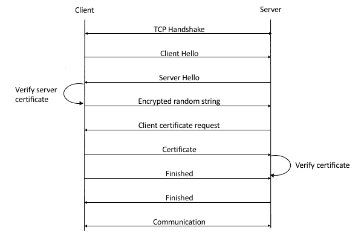
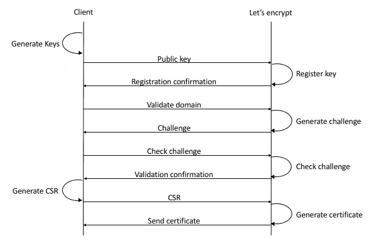
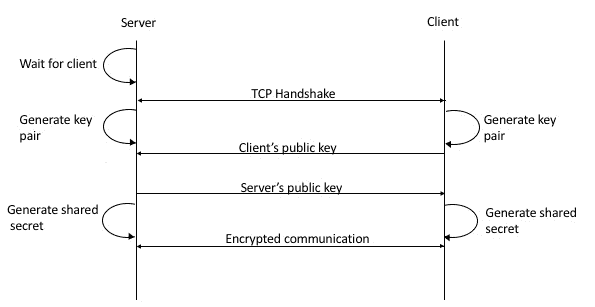

# 第八章：安全

安全性通常在系统设计中被视为事后考虑。这在常见协议中很明显；安全相关的 RFC 在历史上是在主要协议之后提出的。请注意，任何在公共媒介（如互联网）上的通信都容易受到中间人攻击。对手可能会通过仔细检查来自双方的输入数据包来劫持通信。鉴于这一点，一些安全相关问题是合理的：当客户端连接到服务器时，它如何验证服务器是它声称的那个？他们如何决定用于加密的共享密钥？在本章中，我们将看到这些问题通常是如何解决的。

我们将涵盖以下主题：

+   使用证书保护基于 Web 的应用程序

+   使用 Diffie-Hellman 方法进行密钥交换

# 保护网络

在前一章中，我们学习了 HTTP。我们注意到 HTTP 在使我们的生活变得更轻松方面是多么重要。然而，HTTP 容易受到各种攻击，可能导致有效载荷泄露。因此，在 HTTP 通信的各方之间添加某种形式的安全措施是必要的。RFC 2818 提出了 HTTPS（HTTP 安全）作为 HTTP 的一个使用安全流协议的版本。最初，这被称为**安全套接字层**（**SSL**），后来演变为**传输层安全性**（**TLS**）。

基本方案是这样的：

+   **客户端**和**服务器**建立 TCP 连接。

+   **客户端**和**服务器**就整个连接期间使用的加密算法和散列函数达成一致。为此，客户端发送一个加密算法和散列函数列表。**服务器**从该列表中选择一个，并通知**客户端**。

+   **服务器**向**客户端**发送证书。**客户端**将其与本地拥有的证书颁发机构列表进行验证。

+   两者都同意使用会话密钥来加密连接期间的数据。

+   到这一点，一个普通的 HTTP 会话可以开始了。

以下图像展示了这一步骤：



使用 SSL 的客户端-服务器通信

这里最重要的步骤之一是验证服务器的身份。这回答了一个基本问题：当客户端与服务器通信时，它如何知道服务器确实是它想要的服务器？在实践中，这是通过证书实现的。证书是由证书颁发机构签发的文件，这是一个受法律允许为他人作保的可信提供商。客户端有一份受信任的 CA 列表，如果颁发给定证书的 CA 在该列表中，客户端可以信任提供该证书的服务器。在实践中，通常有一系列证书作为信任关系链发行，追溯到根 CA。

近年来，搜索引擎非常重视网站使用 HTTPS，通常会将这些网站排名更高。然而，为网站颁发证书一直是传统上繁琐的过程。网站所有者必须登录到 CA 的网站并提供某种形式的身份证明。颁发证书通常需要几个小时，对小企业主来说成本很高。2015 年，Let's Encrypt 作为一个非营利性 CA 成立，旨在为互联网上的所有网站提供免费、短期有效的证书。他们通过向服务器管理员发出挑战来自动化验证过程。这通常涉及在网站上已知位置放置一个文件或创建一个具有给定内容的 DNS 记录。一旦`letsencrypt`验证了服务器，它就会颁发一个有效期为 90 天的证书。因此，证书需要定期续订。

最近，`letsencrypt`将挑战响应协议标准化为 HTTPS 上的 JSON，并将其命名为 ACME。以下是它是如何工作的：

+   本地客户端生成一个私钥-公钥对，并使用**公钥**联系 letsencrypt 服务器。

+   服务器为给定的密钥创建一个账户并将其注册。

+   根据挑战偏好，**客户端**将展示一个可以满足的挑战列表，并要求服务器验证域名。目前支持两种挑战：基于 HTTP 的挑战，其中在已知位置放置一个文件，服务器将读取它以进行验证；或基于 DNS 的挑战，其中操作员必须在域名上创建一个具有给定内容的`TXT`记录。

+   服务器生成挑战并将其发送回。

+   在这一点上，客户端将轮询服务器以获取确认。

+   当服务器返回 OK 时，客户端可以继续为服务器生成一个**证书签名请求**（**CSR**）并将其发送过去。

+   然后，服务器生成一个证书并将其发送回。

以下图表说明了 ACME 协议中的各个步骤：



ACME 协议操作

# 使用 Rust 的 Let's Encrypt

目前，有一个 crate 允许使用 Rust 访问`letsencrypt`。名为`acme-client`的 CLI 工具可以与 API 交互以获取或撤销证书或运行所有权验证。该二进制文件由名为 acme-client 的 crate 支持，它允许程序与 API 进行交互。让我们看看如何使用它来保护运行在 Rocket 上的 HTTP 服务器。记住，为了使这生效，`letsencrypt`需要能够访问服务器。因此，这需要在互联网上公开访问。

第一步是使用 Cargo 安装 CLI 工具：

```rs
$ cargo install acme-client
```

在我们的例子中，我们将运行我们的 Rocket 博客通过 TLS。虽然 Rocket 默认支持 TLS，但它不是默认启用的。我们需要更改`Cargo.toml`文件以将 TLS 添加为功能标志。它应该看起来像这样：

```rs
[package]
authors = ["Foo <foo@bar.com>"]
name = "rocket-blog"
version = "0.1.0"

[dependencies]
rocket = { version="0.3.5", features = ["tls"] }
rocket_codegen = "0.3.5"
rocket_contrib = "0.3.5"
diesel = { version = "0.16.0", features = ["sqlite"] }
diesel_codegen = { version = "0.16.0", features = ["sqlite"] }
dotenv = "0.10.1"
serde = "1.0.21"
serde_json = "1.0.6"
serde_derive = "1.0.21"
lazy_static = "0.2.11"
r2d2 = "0.7.4"
r2d2-diesel = "0.16.0"
```

我们还将运行 Rocket 在公共接口上。为此，我们将在存储库的根目录中放置一个名为 `Rocket.toml` 的配置文件。这是它的样子；其他所有设置都保留为默认值：

```rs
$ cat Rocket.toml
[global]
address = "0.0.0.0"
```

和之前一样，我们可以使用 Cargo 运行我们的服务器：

```rs
$ DATABASE_URL=./db.sql cargo run
```

Let'sencrypt 还要求所有服务器都必须有一个域名。因此，我们需要在我们的 DNS 提供商中为我们的服务器创建一个记录。在我们的例子中，该 DNS 名称是 `my.domain.io`，我们将在后续步骤中使用它。一旦该记录在所有地方都传播开来，我们就可以继续到下一步：生成证书。以下是我们将如何使用 CLI 来完成这项工作：

```rs
$ acme-client -vvvvv sign --dns -D my.domain.io -P /var/www -o domain.crt
INFO:acme_client: Registering account
DEBUG:acme_client: User successfully registered
INFO:acme_client: Sending identifier authorization request for foo.datasine.com
Please create a TXT record for _acme-challenge.my.domain.io: MFfatN9I3UFQk2WP_f1uRWi4rLnr4qMVaI
Press enter to continue

INFO:acme_client: Triggering dns-01 validation
DEBUG:acme_client: Status is pending, trying again...
INFO:acme_client: Signing certificate
DEBUG:acme_client: Certificate successfully signed
```

由于我们无法提供挑战，因此在这里我们必须使用基于 DNS 的验证。CLI 要求我们创建一个具有给定名称和内容的 `TXT` 记录。一旦我们创建了记录，我们就需要等待一段时间，以便在继续之前它能够传播。在继续之前，使用 `dig` 检查记录是否已更新是个好主意。以下是 `dig` 输出的样子：

```rs
$ dig _acme-challenge.my.domain.io TXT

; <<>> DiG 9.9.7-P3 <<>> _acme-challenge.my.domain.io TXT
;; global options: +cmd
;; Got answer:
;; ->>HEADER<<- opcode: QUERY, status: NOERROR, id: 49153
;; flags: qr rd ra; QUERY: 1, ANSWER: 1, AUTHORITY: 0, ADDITIONAL: 1

;; OPT PSEUDOSECTION:
; EDNS: version: 0, flags:; udp: 8192
;; QUESTION SECTION:
;_acme-challenge.my.domain.io. IN TXT

;; ANSWER SECTION:
_acme-challenge.my.domain.io. 60 IN TXT "MFfatN9I3UFQk2WP_f1uRWi4rLnr4qMVaI"

;; Query time: 213 msec
;; SERVER: 192.168.0.1#53(192.168.0.1)
;; WHEN: Fri Jan 05 18:04:01 GMT 2018
;; MSG SIZE rcvd: 117
```

当 `dig` 的输出表明我们拥有正确的 `TXT` 记录时，我们可以继续安装证书。`letsencrypt` 将查询 `TXT` 记录并运行域名验证。当一切看起来都正常时，我们将获得一个名为 `domain.crt` 的新证书。让我们检查证书以确保一切正常。主题应该匹配我们的域名，而发行者始终应该是 *Let's Encrypt*，如下面的代码片段所示：

```rs
$ openssl x509 -in domain.crt -subject -issuer -noout
subject= /CN=my.domain.io
issuer= /C=US/O=Let's Encrypt/CN=Let's Encrypt Authority X3
```

现在，我们已经准备好在我们的 Rocket 应用程序中使用这个证书了。我们需要将其放置在一个运行中的 Rocket 有权限读取的位置。现在，如果我们重启 Rocket 并使用 `curl` 通过 HTTPS 访问端点，它应该和上次一样工作：

```rs
$ curl -sS -D - https://my.domain.io:8000/posts
HTTP/1.1 200 OK
Content-Type: application/json
Server: Rocket
Content-Length: 992
Date: Fri, 05 Jan 2018 18:37:58 GMT

[{"id":1,"title":"test","body":"test body","pinned":true},{"id":2,"title":"Hello Rust!","body":"Rust is awesome!!","pinned":true},{"id":3,"title":"Testing this","body":"Try to write something","pinned":true},{"id":4,"title":"Testing this","body":"Try to write something","pinned":true},{"id":5,"title":"Testing this","body":"Try to write something","pinned":true},{"id":6,"title":"Testing this","body":"Try to write something","pinned":true},{"id":7,"title":"Testing this","body":"Try to write something","pinned":true},{"id":8,"title":"Testing this","body":"Try to write something","pinned":true},{"id":9,"title":"Testing this","body":"Try to write something","pinned":true},{"id":10,"title":"Testing this","body":"Try to write something","pinned":true},{"id":11,"title":"Testing this","body":"Try to write something","pinned":true},{"id":12,"title":"Testing this","body":"Try to write something","pinned":true},{"id":13,"title":"Testing this","body":"Try to write something","pinned":true}]
```

到编写本文时为止，Let's Encrypt 对每个域名每周有五个证书的限制。对于测试，可能很快就会达到这个限制。如果发生这种情况，客户端将只显示“Acme 服务器错误”。

让我们在这里为我们的服务器编写一个简单的客户端，使用 `rustls`。我们使用 Cargo 设置项目：

```rs
$ cargo new --bin rustls-client
```

然后，我们将 `rustls` 添加到我们的项目中作为依赖项：

```rs
[package]
name = "rustls-client"
version = "0.1.0"
authors = ["Foo <foo@bar.com>"]

[dependencies]
rustls = "0.12.0"
webpki = "0.18.0-alpha"
webpki-roots = "0.14.0"
```

客户端看起来是这样的；请注意，`webpki` 包执行 DNS 解析，然后由 `rustls` 使用：

```rs
// ch8/rustls-client/src/main.rs

use std::sync::Arc;

use std::net::TcpStream;
use std::io::{Read, Write};

extern crate rustls;
extern crate webpki;
extern crate webpki_roots;

fn main() {
    let mut tls = rustls::ClientConfig::new();
    tls.root_store.add_server_trust_anchors
    (&webpki_roots::TLS_SERVER_ROOTS);

    let name = webpki::DNSNameRef::try_from_ascii_str("my.domain.io")
    .expect("Could not resolve name");
    let mut sess = rustls::ClientSession::new(&Arc::new(tls), name);
    let mut conn = TcpStream::connect("my.domain.io:8000").unwrap();
    let mut stream = rustls::Stream::new(&mut sess, &mut conn);
    stream.write(concat!("GET /posts HTTP/1.1\r\n",
                      "Connection: close\r\n",
                      "\r\n")
              .as_bytes())
        .expect("Could not write request");
    let mut plaintext = Vec::new();
    stream.read_to_end(&mut plaintext).expect("Could not read");
    println!("{}", String::from_utf8(plaintext)
    .expect("Could not print output"));
}
```

在这里，我们正在连接到我们的服务器并运行相同的 HTTP 请求。我们导入所有三个必需的包。第一步是初始化一个 TLS 会话并向其中添加根证书。然后，我们将给定的服务器解析为一个 DNS 名称引用，并与之建立 TLS 会话。设置好这些后，我们可以通过使用 `connect` 来设置一个 TCP 会话。最后，`rustls` 的 `Stream` 是 SSL 会话和 TCP 会话的组合。一旦所有这些都正常工作，我们就可以手动编写 HTTP 查询。这里我们在 `/posts` 端点运行一个 `GET`。稍后，我们读取响应并将其打印出来。输出应该和使用其他客户端一样：

```rs
HTTP/1.1 200 OK
Content-Type: application/json
Server: Rocket
Content-Length: 992
Date: Fri, 05 Jan 2018 18:37:58 GMT

[{"id":1,"title":"test","body":"test body","pinned":true},{"id":2,"title":"Hello Rust!","body":"Rust is awesome!!","pinned":true},{"id":3,"title":"Testing this","body":"Try to write something","pinned":true},{"id":4,"title":"Testing this","body":"Try to write something","pinned":true},{"id":5,"title":"Testing this","body":"Try to write something","pinned":true},{"id":6,"title":"Testing this","body":"Try to write something","pinned":true},{"id":7,"title":"Testing this","body":"Try to write something","pinned":true},{"id":8,"title":"Testing this","body":"Try to write something","pinned":true},{"id":9,"title":"Testing this","body":"Try to write something","pinned":true},{"id":10,"title":"Testing this","body":"Try to write something","pinned":true},{"id":11,"title":"Testing this","body":"Try to write something","pinned":true},{"id":12,"title":"Testing this","body":"Try to write something","pinned":true},{"id":13,"title":"Testing this","body":"Try to write something","pinned":true}]
```

# 使用 Rust 的 OpenSSL

OpenSSL 库和 CLI 是一套完整的工具，用于处理 SSL（和 TLS）对象。它是一个开源项目，并被全球各地的公司广泛使用。正如预期的那样，Rust 为在 Rust 项目中作为库使用提供了绑定。在本讨论中，我们将更详细地查看上一节中看到的证书。

这些通常由一个称为 X.509 的标准（在 RFC 5280 中定义）定义，并具有以下字段：

+   **版本号**：几乎总是设置为 2，对应于版本 3（因为第一个版本是 0）。根据标准，此字段可以省略，并应假定版本为 1（值设置为 0）。

+   **序列号**：一个 20 字节标识符，对于签发此证书的 CA 是唯一的。

+   **签名**：一个唯一 ID，用于标识用于签发此证书的算法。这通常是在后续 RFC 中定义的字符串，例如`sha1WithRSAEncryption`。

+   **发行者名称**：标识签发证书的 CA。这必须至少包含一个**区分名称**（**DN**），由多个组件组成，包括**通用名称**（**CN**）、**州**（**ST**）、**国家**（**C**）等。

+   **有效期**：定义证书何时有效。它有两个子字段；`notBefore` 表示何时开始有效，`notAfter` 表示何时过期。

+   **主题名称**：标识此证书所证明的实体。对于根证书，这将与发行者相同。它具有与发行者名称相同的格式，并且至少应包含一个 DN。

+   **主题公钥信息**：关于主题加密公钥的信息。它有两个子字段；第一个是一个加密算法的 ID（如签名字段中所示），第二个是一个包含加密公钥的位流。

+   **发行者唯一标识符**：一个可选字段，可用于唯一标识发行者。

+   **主题唯一标识符**：一个可选字段，可用于标识主题。

+   **扩展**：此字段仅在版本设置为 3 时适用。表示可以用于将附加信息附加到证书的多个可选字段。

+   **证书签名算法**：用于签发此证书的算法；必须与之前签名属性中使用的算法相同。

+   **证书签名值**：一个实际签名的位字符串，用于验证。

在以下示例中，我们将使用 `rust-openssl` 从头开始生成和检查证书。然而，安装这个库可能有点复杂。因为它围绕 `libopenssl` 包装，所以需要链接到本地库。因此，必须安装这个库。该软件包的文档提供了设置此环境的说明。项目设置是常规的：

```rs
$ cargo new --bin openssl-example
```

这里是`Cargo.toml`文件：

```rs
[package]
name = "openssl-example"
version = "0.1.0"
authors = ["Foo <foo@bar.com>"]

[dependencies]
openssl = { git = "https://github.com/sfackler/rust-openssl" }
```

此外，对于这个示例，我们将使用存储库的 master 分支，因为我们需要一些尚未发布的特性。为此，我们需要指定存储库链接，如前所述。以下是主文件：

```rs
// ch8/openssl-example/src/main.rs

extern crate openssl;

use std::env;
use std::fs::File;
use std::io::Write;

use openssl::x509::{X509, X509Name};
use openssl::nid::Nid;
use openssl::pkey::{PKey, Private};
use openssl::rsa::Rsa;
use openssl::error::ErrorStack;
use openssl::asn1::Asn1Time;
use openssl::bn::{BigNum, MsbOption};
use openssl::hash::MessageDigest;

fn create_cert() -> Result<(X509, PKey<Private>), ErrorStack> {
    let mut cert_builder = X509::builder()?;
    cert_builder.set_version(2)?;

    let serial_number = {
        let mut serial = BigNum::new()?;
        serial.rand(160, MsbOption::MAYBE_ZERO, false)?;
        serial.to_asn1_integer()?
    };
    cert_builder.set_serial_number(&serial_number)?;

    let mut name = X509Name::builder()?;
    name.append_entry_by_text("C", "UK")?;
    name.append_entry_by_text("CN", "Our common name")?;
    let cert_name = name.build();
    cert_builder.set_issuer_name(&cert_name)?;

    let not_before = Asn1Time::days_from_now(0)?;
    cert_builder.set_not_before(&not_before)?;

    let not_after = Asn1Time::days_from_now(365)?;
    cert_builder.set_not_after(&not_after)?;

    cert_builder.set_subject_name(&cert_name)?;

    let private_key = PKey::from_rsa(Rsa::generate(3072)?)?;
    cert_builder.set_pubkey(&private_key)?;

    cert_builder.sign(&private_key, MessageDigest::sha512())?;
    let cert = cert_builder.build();

    Ok((cert, private_key))
}

fn main() {
    if let Some(arg) = env::args().nth(1) {
        let (cert, _key) = create_cert().expect("could not create
        cert");
        let cert_data = cert.to_pem().expect("could not convert cert
        to pem");

        let mut cert_file = File::create(arg)
        .expect("could not create cert file");
        cert_file
            .write_all(&cert_data)
            .expect("failed to write cert");

        let subject = cert.subject_name();
        let cn = subject
            .entries_by_nid(Nid::COMMONNAME)
            .next()
            .expect("failed to get subject");
        println!("{}",String::from_utf8(cn.data()
        .as_slice().to_vec()).unwrap()
        );
    } else {
        eprintln!("Expected at least one argument");
        std::process::exit(1);
    }
}
```

在这里，我们接受一个命令行参数作为文件名，以将证书写入。证书创建被委托给一个名为`create_cert`的辅助函数，该函数返回一个包含生成的证书和私钥的元组，或者作为一个`Result`的错误列表。

第一步是初始化一个证书构建器对象，我们将添加到它上面，并最终构建我们的证书。我们使用`set_version`方法将版本设置为 3（数值设置为`2`）。现在我们需要生成一个序列号并设置它。我们通过随机采样 160 位（每个 8 位 20 个八位字节）来生成它。我们使用`set_serial_number`方法来设置序列号。下一步是使用名称构建器生成一个名称。然后使用`append_entry_by_text`方法将国家名称和通用名称添加到我们的名称构建器中。我们使用`set_issuer_name`将`name`对象附加到证书上。我们将到期日期设置为当前日期后的 365 天，并使用`set_not_before`和`set_not_after`来设置这两个日期。使用`set_subject_name`将主题名称设置为相同的名称对象。最后，我们需要生成一个私钥，我们使用`Rsa`模块生成它，并将私钥设置在证书上。现在，证书需要使用 SHA512 进行签名。完成后，我们可以使用`build`方法创建证书。函数结束时，我们将证书和私钥返回给调用者。

在我们的`main`函数中，我们调用`helper`函数。对于我们的示例，我们将忽略密钥，但实际应用确实需要保存它以供稍后验证。我们将`certificate`对象转换为 PEM 编码，并将其写入磁盘上的文件。下一步是程序化地读取主题名称。为此，我们使用`certificate`对象上的`subject_name`方法，并将其作为字符串打印出来。这应该与之前设置的名称相匹配。

这是使用 Cargo 运行此代码的方法。请注意，这将在当前目录中创建一个名为`bar.crt`的证书：

```rs
$ cargo run bar.crt
    Finished dev [unoptimized + debuginfo] target(s) in 0.0 secs
     Running `target/debug/openssl-example bar.crt`
Our common name
$ ls -la bar.crt
-rw-r--r--+ 1 Abhishek staff 1399 19 Feb 22:02 bar.crt
```

# 保护 Tokio 应用程序

在实现基于 Tokio 的协议时，一个常见问题是如何确保其安全性。幸运的是，Tokio 生态系统提供了`tokio-tls`来解决这个问题。让我们看看如何使用这个工具来保护我们之前章节中的超示例。以下是我们的设置：

```rs
$ cargo new --bin tokio-tls-example
```

Cargo 清单应该看起来像这样：

```rs
[package]
name = "tokio-tls-example"
version = "0.1.0"
authors = ["Foo <foo@bar.com>"]

[dependencies]
hyper = "0.11.7"
futures = "0.1.17"
net2 = "0.2.31"
tokio-core = "0.1.10"
num_cpus = "1.0"
native-tls = "*"
tokio-service = "*"
tokio-proto = "*"
tokio-tls = { version = "0.1", features = ["tokio-proto"] }
```

我们需要使用`tokio-proto`功能在`tokio-tls`上启用与`tokio-proto`的集成。下一步是为我们的服务器生成一个自签名证书。`tokio-tls`在底层使用`native-tls`库，而该库在撰写本文时不支持从 X509 证书构建接受者。因此，我们需要使用 PKCS12 证书。前面显示的命令生成一个有效期为 365 天的自签名证书，格式为 PEM。这将要求输入证书的密码短语。在我们的例子中，我们使用了`foobar`。请确保在`tokio-tls-example`目录中运行此命令，以便我们的代码可以读取证书：

```rs
$ openssl req -x509 -newkey rsa:4096 -keyout key.pem -out cert.pem -days 365
```

以下命令将给定的证书转换为 PKCS12 格式。这将在当前目录中生成一个名为`cert.pfx`的文件，我们将在代码中使用它：

```rs
$ openssl pkcs12 -export -out cert.pfx -inkey key.pem -in cert.pem
```

这里是我们的主要文件，为了启用 SSL 进行了一些修改：

```rs
// ch8/tokio-tls-example/src/main.rs

extern crate futures;
extern crate hyper;
extern crate native_tls;
extern crate tokio_proto;
extern crate tokio_service;
extern crate tokio_tls;

use std::io;
use std::{thread, time};
use futures::future::{ok, Future};
use hyper::server::Http;
use hyper::header::ContentLength;
use hyper::{Request, Response, StatusCode};
use native_tls::{Pkcs12, TlsAcceptor};
use tokio_proto::TcpServer;
use tokio_service::Service;
use tokio_tls::proto;

fn heavy_work() -> String {
    let duration = time::Duration::from_millis(100);
    thread::sleep(duration);
    "done".to_string()
}

struct SlowMo;

impl Service for SlowMo {
    type Request = Request;
    type Response = Response;
    type Error = io::Error;
    type Future = Box<Future<Item = Response, Error = io::Error>>;

    fn call(&self, req: Request) -> Self::Future {
        let b = heavy_work().into_bytes();
        println!("Request: {:?}", req);
        Box::new(ok(Response::new()
            .with_status(StatusCode::Ok)
            .with_header(ContentLength(b.len() as u64))
            .with_body(b)))
    }
}

fn main() {
    let raw_cert = include_bytes!("../cert.pfx");
    let cert = Pkcs12::from_der(raw_cert, "foobar").unwrap();
    let acceptor = TlsAcceptor::builder(cert).unwrap().build().unwrap();
    let proto = proto::Server::new(Http::new(), acceptor);
    let addr = "0.0.0.0:9999".parse().unwrap();
    let srv = TcpServer::new(proto, addr);
    println!("Listening on {}", addr);
    srv.serve(|| Ok(SlowMo));
}
```

这里主要的改变是在主函数中，我们使用`include_bytes`宏以原始字节读取证书。然后我们使用`from_der`通过传递证书字节和我们在创建证书时使用的密码短语来构造一个`Pkcs12`对象。下一步是使用给定的`Pkcs12`证书对象创建一个`TlsAcceptor`对象。然后我们需要将`acceptor`对象和`hyper 协议`对象包装到一个`Server`中。这被传递给`TcpServer`构造函数，然后我们启动它。

这是客户端视角下的会话看起来像什么：

```rs
$ curl -k https://localhost:9999
done
```

这里是服务器打印的内容；这源自调用函数中的`println!`宏：

```rs
$ cargo run
   Compiling rustls-example v0.1.0 (file:///src/ch8/rustls-example)
    Finished dev [unoptimized + debuginfo] target(s) in 3.14 secs
     Running `target/debug/rustls-example`
Listening on 0.0.0.0:9999
Request: Request { method: Get, uri: "/", version: Http11, remote_addr: None, headers: {"Host": "localhost:9999", "User-Agent": "curl/7.57.0", "Accept": "*/*"} }
^C
```

有趣的是，`openssl`命令行工具有一个 TCP 客户端，可以用来测试 SSL 连接。以下是使用它来测试我们的服务器的方法：

```rs
$ openssl s_client -connect 127.0.0.1:9999
CONNECTED(00000003)
depth=0 C = UK, ST = Scotland, O = Internet Widgits Pty Ltd
verify error:num=18:self signed certificate
verify return:1
depth=0 C = UK, ST = Scotland, O = Internet Widgits Pty Ltd
verify return:1
---
Certificate chain
 0 s:/C=UK/ST=Scotland/O=Internet Widgits Pty Ltd
   i:/C=UK/ST=Scotland/O=Internet Widgits Pty Ltd
---
Server certificate
-----BEGIN CERTIFICATE-----
...
-----END CERTIFICATE-----
subject=/C=UK/ST=Scotland/O=Internet Widgits Pty Ltd
issuer=/C=UK/ST=Scotland/O=Internet Widgits Pty Ltd
---
No client certificate CA names sent
Peer signing digest: SHA256
Server Temp Key: ECDH, P-256, 256 bits
---
SSL handshake has read 2128 bytes and written 433 bytes
---
New, TLSv1/SSLv3, Cipher is ECDHE-RSA-AES256-GCM-SHA384
Server public key is 4096 bit
Secure Renegotiation IS supported
Compression: NONE
Expansion: NONE
No ALPN negotiated
SSL-Session:
    Protocol : TLSv1.2
    Cipher : ECDHE-RSA-AES256-GCM-SHA384
    Session-ID: 9FAB89D29DB02891EF52C825AC23E3A658FDCE228A1A7E4FD97652AC3A5E24F3
    Session-ID-ctx:
    Master-Key: 940EF0C4FA1A929133C2D273739C8042FAF1BD5057E793ED1D7A0F0187F0236EF9E43D236DF8C17D663D7B77F1B4CEDD
    Key-Arg : None
    PSK identity: None
    PSK identity hint: None
    SRP username: None
    Start Time: 1515350045
    Timeout : 300 (sec)
    Verify return code: 18 (self signed certificate)
---
GET / HTTP/1.1
host: foobar

HTTP/1.1 200 OK
Content-Length: 4
Date: Sun, 07 Jan 2018 18:34:52 GMT

done
```

此工具协商 SSL 会话，并像之前显示的那样输出服务器证书（为了简洁，我们已替换了实际的证书）。注意，它正确地检测到给定的服务器正在使用自签名证书。最后，它启动一个 TCP 会话。由于这是裸 TCP，我们需要手动构建我们的 HTTP 请求。如果我们对`/`使用简单的`GET`请求，我们会收到一个`200 OK`的响应，字符串就完成了。在服务器那一侧，这是它打印的内容：

```rs
$ cargo run
    Finished dev [unoptimized + debuginfo] target(s) in 0.0 secs
     Running `target/debug/tokio-tls-example`
Listening on 0.0.0.0:9999
Request: Request { method: Get, uri: "/", version: Http11, remote_addr: None, headers: {"Host": "foobar"} }
```

注意，这里打印了`Host`头，设置为字符串`foobar`，正如我们在客户端所写的那样。

# 使用 ring 的加密

一个常用的加密库叫做`ring`。这个库支持许多底层加密原语，如随机数生成、密钥交换等。在本节中，我们将以密钥交换为例，看看这个库如何在客户端-服务器应用程序中使用。

通信中一个常见的问题是加密信息，以便第三方无法解密它。在私钥系统中，客户端和服务器都需要就一个用于此目的的密钥达成一致。现在，这个密钥不能在不可信的连接上以明文形式传输。Diffie-Hellman 密钥交换方法定义了一种机制，其中两个通过安全链路交谈的当事人可以协商一个双方共享的密钥，但这个密钥没有通过连接传输。这种方法在许多平台上都有多种实现，包括所讨论的 crate。

以下图表显示了该协议的工作方式：



Diffie-Hellman 密钥交换在实际操作中

初始时，服务器将监听传入的客户端。当客户端连接时，这是事件序列：

1.  TCP 会话首先被建立。

1.  服务器和客户端都会生成私钥和公钥。

1.  客户端然后将它的公钥发送给服务器。

1.  服务器通过发送它生成的公钥进行响应。

1.  在这一点上，双方可以使用他们的私钥和收到的公钥生成共享的秘密密钥。

1.  进一步的通信可以使用共享的秘密密钥进行加密。

我们将为这个示例创建一个空的库项目。然后我们将创建一个示例目录并将稍后显示的两个文件放在那里。项目设置将如下进行：

```rs
$ cargo new key-exchange
```

此外，这是`Cargo.toml`应该看起来像的样子：

```rs
[package]
name = "key-exchange"
version = "0.1.0"
authors = ["Foo <foo@bar.com>"]

[dependencies]
ring = "0.12.1"
untrusted = "0.5.1"
```

让我们先看看客户端。这主要借鉴了我们在第二章中编写的简单 TCP 服务器。这是完全同步和阻塞的：

```rs
// ch8/key-exchange/examples/client.rs

extern crate ring;
extern crate untrusted;

use std::net::TcpStream;
use std::io::{BufRead, BufReader, Write};

use ring::{agreement, rand};
use untrusted::Input;

fn main() {
    let mut stream = TcpStream::connect("127.0.0.1:8888")
    .expect("Could not connect to server");

    let rng = rand::SystemRandom::new();

    // Generate the client's private key
    let client_private_key =
    agreement::EphemeralPrivateKey::generate(&agreement::X25519, &rng)
                            .expect("Failed to generate key");
    let mut client_public_key = [0u8; agreement::PUBLIC_KEY_MAX_LEN];
    let client_public_key = &mut
    client_public_key[..client_private_key.public_key_len()];

    // Generate the client's public key
    client_private_key.compute_public_key
    (client_public_key).expect("Failed to
    generate key");

    // Send client's public key to server
    stream.write(client_public_key)
    .expect("Failed to write to server");

    let mut buffer: Vec<u8> = Vec::new();
    let mut reader = BufReader::new(&stream);

    // Read server's public key
    reader.read_until(b'\n', &mut buffer)
    .expect("Could not read into buffer");
    let peer_public_key = Input::from(&buffer);

    println!("Received: {:?}", peer_public_key);

    // Generate shared secret key
    let res = agreement::agree_ephemeral
    (client_private_key, &agreement::X25519,
    peer_public_key,
    ring::error::Unspecified,
    |key_material| {
        let mut key = Vec::new();
        key.extend_from_slice(key_material);
        Ok(key)
    });

    println!("{:?}", res.unwrap());
}
```

我们当然需要`ring`crate 作为外部依赖。另一个 crate，称为`untrusted`，是用于从不受信任的源数据到`ring`作为输入的辅助工具。然后我们初始化 ring 的随机数生成器；这将用于稍后生成密钥。然后我们使用`generate`方法为客户生成一个私钥。客户端的公钥是基于私钥使用`compute_public_key`生成的。在这个时候，客户端准备好将公钥发送给服务器。它将密钥作为字节流写入之前创建的连接。理想情况下，服务器应该在这个时候发送其公钥，客户端需要从相同的连接中读取。这是通过`read_until`调用完成的，该调用将接收到的数据放入缓冲区。然后，传入的数据通过`untrusted`crate 传递，以便`ring`可以消费它。最后，客户端使用`agree_ephemeral`生成密钥，该函数接受收集到的两个密钥（客户端的私钥和服务器公钥）、一个错误值和一个用于生成的字节流的闭包。在闭包中，我们收集所有数据到一个向量中并返回它。最后一步是打印那个向量。

服务器类似，如下代码片段所示：

```rs
// ch8/key-exchange/src/examples/server.rs

extern crate ring;
extern crate untrusted;

use std::net::{TcpListener, TcpStream};
use std::thread;
use std::io::{Read, Write};

use ring::{agreement, rand};
use untrusted::Input;
use ring::error::Unspecified;

fn handle_client(mut stream: TcpStream) -> Result<(), Unspecified> {
    let rng = rand::SystemRandom::new();

    // Generate server's private key
    let server_private_key =
    agreement::EphemeralPrivateKey::generate
    (&agreement::X25519, &rng)?;
    let mut server_public_key = [0u8; agreement::PUBLIC_KEY_MAX_LEN];
    let server_public_key = &mut
    server_public_key[..server_private_key.public_key_len()];

    // Generate server's public key
    server_private_key.compute_public_key(server_public_key)?;

    let mut peer_public_key_buf = [0u8; 32];

    // Read client's public key
    stream.read(&mut peer_public_key_buf).expect("Failed to read");
    let peer_public_key = Input::from(&peer_public_key_buf);

    println!("Received: {:?}", peer_public_key);

    // Send server's public key
    stream.write(&server_public_key)
    .expect("Failed to send server public key");

    // Generate shared secret key
    let res = agreement::agree_ephemeral(server_private_key,
                                        &agreement::X25519,
                                        peer_public_key,
                                        ring::error::Unspecified,
                                        |key_material| {
        let mut key = Vec::new();
        key.extend_from_slice(key_material);
        Ok(key)
    });

    println!("{:?}", res.unwrap());

    Ok(())
}

fn main() {
    let listener = TcpListener::bind("0.0.0.0:8888").expect("Could not bind");
    for stream in listener.incoming() {
        match stream {
            Err(e) => { eprintln!("failed: {}", e) }
            Ok(stream) => {
                thread::spawn(move || {
                    handle_client(stream)
                    .unwrap_or_else(|error| eprintln!(
                    "{:?}", error));
                });
            }
        }
    }
}
```

就像上次一样，我们为每个客户端处理一个新的线程。`handle_client` 函数的语义与客户端相似；我们首先生成一个私钥和一个公钥。下一步是读取客户端发送的公钥，然后发送服务器的公钥。一旦确定，我们就可以使用 `agree_ephemeral` 生成共享密钥，这个密钥应该与客户端生成的密钥相匹配。

下面是在服务器端的一个示例运行：

```rs
$ cargo run --example server
    Finished dev [unoptimized + debuginfo] target(s) in 0.0 secs
     Running `target/debug/examples/server`
Received: Input { value: Slice { bytes: [60, 110, 82, 192, 131, 173, 255, 92, 134, 0, 185, 186, 87, 178, 51, 71, 136, 201, 15, 179, 204, 137, 125, 32, 87, 94, 227, 209, 47, 243, 75, 73] } }
Generated: [184, 9, 123, 15, 139, 191, 170, 9, 133, 143, 81, 45, 254, 15, 234, 12, 223, 57, 131, 145, 127, 231, 93, 101, 92, 251, 163, 179, 219, 24, 81, 111]
```

并且这里有一个客户端的例子：

```rs
$ cargo run --example client
    Finished dev [unoptimized + debuginfo] target(s) in 0.0 secs
     Running `target/debug/examples/client`
Received: Input { value: Slice { bytes: [83, 44, 93, 28, 132, 238, 70, 152, 163, 73, 185, 146, 142, 5, 172, 255, 219, 52, 51, 151, 99, 134, 35, 98, 154, 192, 210, 137, 141, 167, 60, 67] } }
Generated: [184, 9, 123, 15, 139, 191, 170, 9, 133, 143, 81, 45, 254, 15, 234, 12, 223, 57, 131, 145, 127, 231, 93, 101, 92, 251, 163, 179, 219, 24, 81, 111]
```

注意，生成的密钥对于服务器和客户端都是相同的，这正是我们所期望的。

在撰写本文时，ring crate 在最新的 nightly 版本上无法工作。为了使其工作，请在项目目录中运行以下命令：

`**$ rustup component add rustfmt-preview --toolchain nightly-2017-12-21**`

`**$ rustup override set nightly-2017-12-21**`

# 摘要

在本章中，我们快速浏览了在公共网络上确保通信的安全性。我们从证书的概述开始，了解了它们是如何用于在网络上识别服务器的。我们探讨了在 Rust 中使用 `letsencrypt` 和 `openssl`。然后，我们继续使用相同的技术来确保 Tokio 应用程序的安全性。最后，我们简要地看了一下使用 DH 方法进行密钥交换。

以下部分是附录；在那里，我们将探讨一些在社区中变得越来越流行的额外 crate 和技术。
