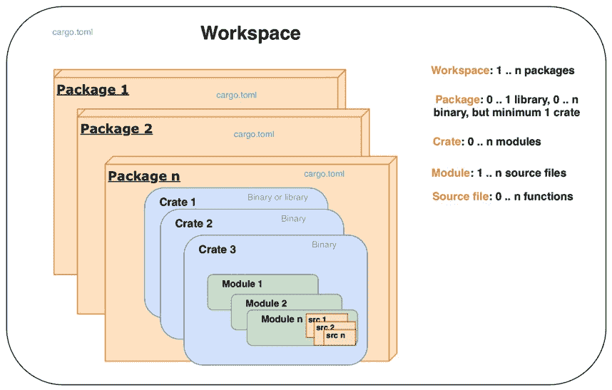

# 第一章：*第一章*：行业工具 – Rust 工具链和项目结构

Rust 作为一种现代的系统编程语言，具有许多固有的特性，使得编写安全、可靠和高效的代码变得更加容易。Rust 还有一个编译器，它使得随着项目规模和复杂性的增长，代码重构体验相对无忧。但任何编程语言本身如果没有支持软件开发生命周期的工具链都是不完整的。毕竟，如果没有工具，软件工程师将何去何从？

本章特别讨论了 Rust 工具链及其生态系统，以及如何在 Rust 项目中组织代码，以编写安全、可测试、高效、有文档和维护性好的代码，同时优化以在目标环境中运行。

本章节的关键学习成果如下：

+   为你的项目选择正确的 Rust 配置

+   Cargo 介绍和项目结构

+   Cargo 构建管理

+   Cargo 依赖项

+   编写测试脚本和进行自动单元和集成测试

+   自动生成技术文档

到本章结束时，你将学会如何选择正确的项目类型和工具链；高效组织项目代码；添加外部和内部库作为依赖项；为开发、测试和生产环境构建项目；自动化测试；并为你的 Rust 代码生成文档。

# 技术要求

Rustup 必须安装在本地的开发环境中。请使用此链接进行安装：[`github.com/rust-lang/rustup`](https://github.com/rust-lang/rustup)。

请参考以下链接获取官方安装说明：[`www.rust-lang.org/tools/install`](https://www.rust-lang.org/tools/install)。

安装后，使用以下命令检查 `rustc` 和 `cargo` 是否已正确安装：

```rs
rustc --version 
cargo --version
```

你必须能够访问你选择的任何代码编辑器。

本章中的一些代码和命令，特别是与共享库和设置路径相关的代码，需要在 Linux 系统环境中运行。建议安装一个本地虚拟机，如 VirtualBox 或等效产品，并安装 Linux 以便处理本章中的代码。安装 VirtualBox 的说明可以在以下链接找到：[`www.virtualbox.org`](https://www.virtualbox.org)。

本章示例的 Git 仓库可以在以下链接找到：[`github.com/PacktPublishing/Practical-System-Programming-for-Rust-Developers/tree/master/Chapter01`](https://github.com/PacktPublishing/Practical-System-Programming-for-Rust-Developers/tree/master/Chapter01)。

# 为你的项目选择正确的 Rust 配置

当你开始学习 Rust 编程时，你首先需要选择一个 Rust 发布渠道和一个 Rust 项目类型。

本节讨论了 Rust 的 *发布渠道* 的细节，并提供了关于如何为你的项目选择它们的指导。

Rust 还允许你构建不同类型的二进制文件——独立可执行文件、静态库和动态库。如果你事先知道你将构建什么，你可以使用为你生成的脚手架代码创建正确的项目类型。

我们将在本节中介绍这些内容。

## 选择 Rust 发布通道

Rust 编程语言是持续开发的，在任何时候都有三个版本在同时开发，每个版本称为**发布通道**。每个通道都有其目的，具有不同的功能和稳定性特征。三个发布通道是*稳定*、*beta*和*夜间*。不稳定语言功能和库在**夜间**和**beta**通道中开发，而**稳定**通道提供稳定性保证。

**Rustup**是安装 Rust 编译器、Rust 标准库、Cargo 包管理器和用于代码格式化、测试、基准测试和文档等活动的其他核心工具的工具。所有这些工具都可用作多种称为*工具链*的版本。*工具链*是*发布通道*和*宿主*的组合，并且可选地还有一个相关的存档日期。

*Rustup*可以从*发布通道*或其他来源（如官方存档和本地构建）安装工具链。*Rustup*还根据宿主平台确定工具链。Rust 官方支持 Linux、Windows 和 macOS。因此，*Rustup*被称为*工具多路复用器*，因为它安装和管理多个工具链，从这个意义上讲，它与*Ruby*中的*rbenv*、*Python*中的*pyenv*或*Node.js*中的*nvm*类似。

Rustup 管理与工具链相关的复杂性，但由于它提供了合理的默认设置，安装过程相对简单。这些设置可以由开发者稍后修改。

注意

Rust 的稳定版本每 6 周发布一次；例如，Rust 1.42.0 于 2020 年 3 月 12 日发布，6 周后的同一天，Rust 1.43 于 2020 年 4 月 23 日发布。

每天都会发布一个新的 Rust 夜间版本。每 6 周，最新的夜间版本的主分支将成为 beta 版本。

大多数 Rust 开发者主要使用*稳定*通道。beta 通道的发布并不活跃，但仅用于测试 Rust 语言发布中的任何回归。

*夜间*通道用于活跃的语言开发，并且每晚发布。*夜间*通道允许 Rust 开发新的和实验性功能，并允许早期采用者在它们稳定之前测试它们。早期访问的代价是，在它们进入稳定发布之前，这些功能可能会有破坏性的变化。Rust 使用功能标志来确定给定夜间版本中启用了哪些功能。想要在夜间版本中使用前沿功能的使用者必须使用适当的*功能标志*对代码进行注释。

这里展示了功能标志的一个例子：

```rs
#![feature(try_trait)]
```

注意，beta 和稳定版本不能使用功能标志。

`rustup`默认配置为使用稳定通道。要使用其他通道，这里有一些命令。对于完整的列表，请参阅官方链接：[`github.com/rust-lang/rustup`](https://github.com/rust-lang/rustup)。

要安装夜间 Rust，请使用以下命令：

```rs
rustup toolchain install nightly
```

要全局激活夜间 Rust，请使用以下命令：

```rs
rustup default nightly
```

要在目录级别激活夜间 Rust，请使用以下命令：

```rs
rustup override set nightly
```

要获取夜间 Rust 中编译器的版本，请使用以下命令：

```rs
rustup run nightly rustc –-version
```

要将`rustup`重置为使用稳定通道，请使用以下命令：

```rs
rustup default stable
```

要显示已安装的工具链以及当前活动的是哪一个，请使用以下命令：

```rs
rustup show
```

要更新已安装的工具链到最新版本，请使用以下命令：

```rs
rustup update
```

注意，一旦设置了`rustup default <channel-name>`，其他相关工具，如 Cargo 和 Rustc，将使用默认通道设置。

对于你的项目，应该使用哪个 Rust 通道？对于任何**面向生产的**项目，建议只使用**稳定**发布通道。对于任何**实验性**项目，可以使用**夜间**或**beta**通道，但需谨慎，因为未来版本中可能会有破坏性更改。

## 选择 Rust 项目类型

Rust 中有两种基本的项目类型：**库**和**二进制文件**（或可执行文件）。

一个 *库* 是一个自包含的代码片段，旨在供其他程序使用。库的目的是通过利用其他开源开发者的辛勤工作来促进代码重用并加快开发周期。库也称为`crates.io`，可以被其他开发者发现和下载，用于他们自己的程序。库 crate 的程序执行从`src/lib.rs`文件开始。

一个 *二进制文件* 是一个独立的可执行文件，它可以下载并链接其他库到一个单独的二进制文件中。二进制项目类型也称为`main()`函数，该函数位于`src/main.rs`文件中。

在初始化项目时确定你想要在 Rust 中构建二进制或库程序是很重要的。我们将在本章后面看到这两种类型项目的示例。现在是时候介绍 Rust 生态系统中的明星工具和瑞士军刀——*Cargo*。

# 介绍 Cargo 和项目结构

Cargo 是 Rust 的官方构建和依赖管理工具。它具有许多其他流行工具的许多功能，如 Ant、Maven、Gradle、npm、CocoaPods、pip 和 yarn，但为编译代码、下载和编译依赖库（在 Rust 中称为**crate**）、链接库、构建开发和发布二进制文件提供了更加无缝和集成的开发者体验。它还执行代码的增量构建，以减少程序演变过程中的编译时间。此外，在创建新的 Rust 项目时，它还创建了一个惯用的项目结构。

简而言之，Cargo 作为一个集成工具链，在创建新项目、构建项目、管理外部依赖、调试、测试、生成文档和发布管理等日常任务中提供了无缝体验。

Cargo 是可以用来为新 Rust 项目设置基本项目脚手架结构的工具。在我们使用 Cargo 创建新的 Rust 项目之前，让我们首先了解在 Rust 项目中组织代码的选项：



图 1.1 – Cargo 项目结构和层次

*图 1.1*展示了如何在 Cargo 生成的 Rust 项目中组织代码。

在 Rust 项目中，代码组织的最小独立单元是`main.rs`源文件。

代码组织的下一个高级别是**模块**。模块内的代码有其自己的唯一命名空间。一个模块可以包含用户定义的数据类型（如结构体、特性和枚举）、常量、类型别名、其他模块导入和函数声明。模块可以嵌套在彼此内部。在较小的项目中，可以在单个源文件中定义多个模块定义，或者一个模块可以包含跨越多个源文件的代码，这在较大的项目中也很常见。这种组织方式也被称为模块系统。

多个模块可以组织到`main.rs`中，对于库 crate 则是`lib.rs`。

一个或多个 crate 可以组合成一个`Cargo.toml`文件，其中包含有关如何构建包的信息，包括下载和链接依赖的 crate。当使用 Cargo 创建新的 Rust 项目时，它创建一个*package*。一个*package*必须至少包含一个 crate – 要么是库 crate，要么是二进制 crate。一个 package 可以包含任意数量的二进制 crate，但它可以包含零个或仅有一个库 crate。

随着 Rust 项目规模的扩大，可能需要将一个包拆分成多个单元并独立管理。一组相关的包可以组织成一个`Cargo.lock`文件（包含工作区中所有包共享的依赖项特定版本的详细信息）和输出目录。

让我们通过几个例子来了解 Rust 中各种项目结构的类型。

# 使用 Cargo 自动化构建管理

当 Rust 代码编译和构建时，生成的二进制文件可以是独立的可执行二进制文件，也可以是其他项目可以使用的库。在本节中，我们将探讨如何使用 Cargo 创建 Rust 的二进制文件和库，以及如何配置`Cargo.toml`中的元数据以提供构建指令。

## 构建基本的二进制 crate

在本节中，我们将构建一个基本的二进制 crate。当构建二进制 crate 时，会产生一个可执行的二进制文件。这是 cargo 工具的默认 crate 类型。现在让我们看看创建二进制 crate 的命令。

1.  第一步是使用`cargo new`命令生成 Rust 源代码包。

1.  在你的工作目录内的终端会话中运行以下命令以创建一个新的包：

    ```rs
    --bin flag is to tell Cargo to generate a package that, when compiled, would produce a binary crate (executable).`first-program` is the name of the package given. You can specify a name of your choice.
    ```

1.  一旦命令执行，你将看到以下目录结构：

    ```rs
    [package]  
    name = "first-program"  
    version = "0.1.0"  
    authors = [<your email>]  
    edition = "2018"
    ```

    并且 `src` 目录中包含一个名为 `main.rs` 的文件：

    ```rs
    fn main() {
        println!("Hello, world!");
    }
    ```

1.  要从这个包生成二进制 crate（或可执行文件），请运行以下命令：

    ```rs
    target in the project root and creates a binary crate (executable) with the same name as the package name (first-program, in our case) in the location target/debug.
    ```

1.  从命令行执行以下操作：

    ```rs
    cargo run
    ```

    你将在控制台看到以下输出：

    ```rs
    Hello, world!  
    [[bin]]
    name = "new-first-program" 
    path = "src/main.rs"
    ```

1.  在命令行中运行以下命令：

    ```rs
    new-first-program in the target/debug folder. You will see Hello, world! printed to your console.
    ```

1.  一个 cargo 包可以包含多个二进制的源代码。让我们学习如何向我们的项目中添加另一个二进制。在 `Cargo.toml` 中，在第一个 `[[bin]]` 目标下方添加一个新的 `[[bin]]` 目标：

    ```rs
    [[bin]]  
    name = "new-first-program"  
    path = "src/main.rs"  
    [[bin]]  
    name = "new-second-program"  
    path = "src/second.rs"
    ```

1.  接下来，创建一个新的文件，`src/second.rs`，并添加以下代码：

    ```rs
    fn main() {
        println!("Hello, for the second time!");
    }
    ```

1.  运行以下命令：

    ```rs
    cargo run --bin new-second-program
    ```

你将看到名为 `new-second-program` 的 `target/debug` 目录中的声明。

恭喜！你已经学会了以下内容：

+   创建你的第一个 Rust 源包并将其编译成一个可执行二进制 crate

+   给二进制取一个新名字，不同于包名

+   向同一个 cargo 包添加第二个二进制

注意，一个 `cargo` 包可以包含一个或多个二进制 crate。

## 配置 Cargo

一个 cargo 包有一个关联的 `Cargo.toml` 文件，也称为 **清单**。

清单至少包含 `[package]` 部分，但可以包含许多其他部分。这里列出了部分部分：

**指定包的输出目标**：Cargo 包可以有五种类型的目标：

+   `[[bin]]`: 二进制目标是构建后可以运行的可执行程序。

+   `[lib]`: 库目标生成一个库，可以被其他库和可执行程序使用。

+   `[[example]]`: 这个目标对于库来说很有用，可以通过示例代码向用户展示外部 API 的使用。位于 `example` 目录中的示例源代码可以使用此目标构建成可执行二进制。

+   `[[test]]`: 位于 `tests` 目录中的文件代表集成测试，并且这些文件中的每一个都可以编译成一个单独的可执行二进制。

+   `[[bench]]`: 定义在库和二进制中的基准函数被编译成单独的可执行程序。

对于这些目标中的每一个，都可以指定配置，包括目标名称、目标源文件以及是否让 cargo 自动运行测试脚本并为目标生成文档。你可能还记得，在前一节中，我们更改了名称并设置了生成的二进制可执行文件的源文件。

**指定包的依赖项**：包中的源文件可能依赖于其他内部或外部库，这些库也被称为 *依赖项*。每个依赖项反过来可能依赖于其他库，依此类推。Cargo 下载本节中指定的依赖项列表，并将它们链接到最终输出目标。依赖项的多种类型包括以下：

+   `[dependencies]`: 包库或二进制依赖

+   `[dev-dependencies]`：用于示例、测试和基准测试的依赖项

+   `[build-dependencies]`：构建脚本（如果有指定）的依赖项

+   `[target]`：这是用于为各种目标架构交叉编译代码的。注意，这不要与包的输出目标混淆，包的输出可以是 lib、bin 等等。

**指定构建配置文件**：在构建 cargo 包时可以指定四种类型的配置文件：

+   `dev`：`cargo build`命令默认使用`dev`配置文件。使用此选项构建的包针对编译时速度进行了优化。

+   `release`：使用`cargo build –-release`命令启用发布配置文件，这适合用于生产发布，并且针对运行时速度进行了优化。

+   `test`：`cargo test`命令使用此配置文件。这用于构建测试可执行文件。

+   `bench`：`cargo bench`命令创建基准测试的可执行文件，它会自动运行所有带有`#[bench]`属性的函数。

`[workspace]`部分可以用来定义工作空间中包含的包列表。

## 构建静态库 crate

我们已经看到了如何创建二进制 crate。现在让我们学习如何创建库 crate：

```rs
 cargo new --lib my-first-lib
```

新建 cargo 项目的默认目录结构如下：

```rs
├── Cargo.toml
├── src
│   └── lib.rs
```

在`src/lib.rs`中添加以下代码：

```rs
pub fn hello_from_lib(message: &str) {
    println!("Printing Hello {} from library",message);
}
```

执行以下操作：

```rs
cargo build 
```

你将看到在`target/debug`下构建的库，它将具有`libmy_first_lib.rlib`的名称。

要调用这个库中的函数，让我们构建一个小的二进制 crate。在`src`下创建一个`bin`目录，并创建一个新文件，`src/bin/mymain.rs`。

添加以下代码：

```rs
use my_first_lib::hello_from_lib;
fn main() {
    println!("Going to call library function");
    hello_from_lib("Rust system programmer");
}
```

`use my_first_lib::hello_from_lib`语句告诉编译器将库函数引入到本程序的范围内。

执行以下操作：

```rs
cargo run  --bin mymain 
```

你将在你的控制台中看到`print`语句。同时，二进制文件`mymain`将被放置在`target/debug`文件夹中，与我们之前编写的库文件一起。二进制 crate 会在同一文件夹中寻找库文件，在这种情况下它找到了。因此，它能够调用库中的函数。

如果你想要将`mymain.rs`文件放置在另一个位置（而不是在`src/bin`内），那么在`Cargo.toml`中添加一个目标，并像以下示例中那样指定二进制文件的名字和路径，然后将`mymain.rs`文件移动到指定位置：

```rs
[[bin]]  
name = "mymain"  
path = "src/mymain.rs"
```

执行`cargo run --bin mymain`，你将在你的控制台中看到`println`输出。

# 自动化依赖项管理

在上一节中，你学习了如何使用 Cargo 设置新项目的基目录结构和脚手架，以及如何构建各种类型的二进制和库 crate。在本节中，我们将探讨 Cargo 的依赖项管理功能。

Rust 附带一个内置的标准库，由语言原语和常用函数组成，但按设计来说很小（与其他语言相比）。大多数现实世界的 Rust 程序都依赖于额外的外部库来提高功能性和开发者生产力。任何此类外部代码都是程序的*依赖项*。Cargo 使得指定和管理依赖项变得容易。

在 Rust 生态系统中，*crates.io*是发现和下载库（称为`crates.io`作为默认包注册表）的中心公共包注册表。

依赖项在`Cargo.toml`的`[dependencies]`部分中指定。让我们看看一个例子。

使用以下命令开始一个新项目：

```rs
cargo new deps-example && cd deps-example
```

在`Cargo.toml`中，进行以下条目以包含外部库：

```rs
[dependencies]  
chrono = "0.4.0"
```

`Chrono`是一个日期时间库。这被称为依赖项，因为我们的`deps-example`crate 依赖于这个外部库来实现其功能。

当你运行`cargo build`时，cargo 会查找`crates.io`上具有此名称和版本的 crate。如果找到，它将下载此 crate 及其所有依赖项，编译它们，并将下载的包的确切版本更新到名为`Cargo.lock`的文件中。`Cargo.lock`文件是一个生成文件，不应进行编辑。

`Cargo.toml`中的每个依赖项都在新的一行中指定，并采用格式`<crate-name> = "<semantic-version-number>"`。**语义版本或 Semver**的格式为 X.Y.Z，其中 X 是主版本号，Y 是次版本号，Z 是补丁版本号。

## 指定依赖项的位置

在`Cargo.toml`中指定依赖项的位置和版本有许多方法，其中一些在此处总结：

+   **Crates.io 注册表**：这是默认选项，我们只需指定包名和版本字符串，就像在本节中之前所做的那样。

+   `crates.io`是默认注册表，Cargo 提供了使用备用注册表选项。注册表名称必须在`.cargo/config`文件中进行配置，并在`Cargo.toml`中创建一个条目，如下例所示：

    ```rs
    [dependencies]     
     cratename = { version = "2.1", registry = "alternate-
         registry-name" }
    ```

+   `Cargo.toml`文件以获取其依赖项。

+   **指定本地路径**：Cargo 支持路径依赖项，这意味着库可以是主 cargo 包内的子 crate。在构建主 cargo 包时，也被指定为依赖项的子 crate 将被构建。但只有路径依赖项的依赖项不能上传到*crates.io*公共注册表。

+   **多个位置**：Cargo 支持指定注册表版本和 Git 或路径位置。对于本地构建，使用 Git 或路径版本，当包发布到*crates.io*时将使用注册表版本。

## 在源代码中使用依赖包

一旦在 `Cargo.toml` 文件中指定了依赖项，无论以何种格式，我们都可以在包代码中使用外部库，如下例所示。将以下代码添加到 `src/main.rs`：

```rs
use chrono::Utc;
fn main() {
    println!("Hello, time now is {:?}", Utc::now());
}
```

`use` 语句告诉编译器将 `chrono` 包的 `Utc` 模块引入到本程序的范围内。然后我们可以从 `Utc` 模块访问 `now()` 函数来打印当前的日期和时间。`use` 语句不是强制的。打印日期时间的另一种方法如下：

```rs
fn main() {
    println!("Hello, time now is {:?}", chrono::Utc::now());
}
```

这将给出相同的结果。但是，如果你需要在代码中多次使用 `chrono` 包中的函数，使用 `use` 语句一次性将 `chrono` 和所需模块引入范围会更方便，这会使输入变得更简单。

还可以使用 `as` 关键字重命名导入的包：

```rs
use chrono as time;
fn main() {
    println!("Hello, time now is {:?}", time::Utc::now());
}
```

有关管理依赖项的更多详细信息，请参阅 Cargo 文档：[`doc.rust-lang.org/cargo/reference/specifying-dependencies.html`](https://doc.rust-lang.org/cargo/reference/specifying-dependencies.html)。

在本节中，我们看到了如何向包中添加依赖项。可以在 `Cargo.toml` 中添加任意数量的依赖项并在程序中使用。Cargo 使依赖项管理过程变得相当愉快。

现在我们来看 Cargo 的另一个有用功能——运行自动化测试。

# 编写和运行自动化测试

Rust 编程语言内置了对编写自动化测试的支持。

Rust 测试基本上是 Rust 函数，用于验证包中编写的其他非测试函数是否按预期工作。它们基本上使用指定数据调用其他函数，并断言返回值符合预期。

Rust 有两种测试类型——单元测试和集成测试。

## 在 Rust 中编写单元测试

使用以下命令创建一个新的 Rust 包：

```rs
cargo new test-example && cd test-example
```

编写一个返回当前运行进程的进程 ID 的新函数。我们将在后面的章节中查看进程处理细节，所以你只需输入以下代码即可，因为这里的重点是编写单元测试：

```rs
use std::process;
fn main() {
    println!("{}", get_process_id());
}
fn get_process_id() -> u32 {
    process::id()
}
```

我们已经编写了一个简单的（愚蠢的）函数，使用标准库进程模块并检索当前运行进程的进程 ID。

使用 `cargo check` 运行代码以确认没有语法错误。

现在我们来编写一个单元测试。请注意，我们事先不知道进程 ID 会是多少，所以我们只能测试是否返回了一个数字：

```rs
#[test]
fn test_if_process_id_is_returned() {
    assert!(get_process_id() > 0);
}
```

运行 `cargo test`。你会看到测试已经成功通过，因为函数返回了一个非零正整数。

注意，我们已经将单元测试写在了与代码相同的源文件中。为了告诉编译器这是一个测试函数，我们使用了 `#[test]` 注解。`assert!` 宏（在标准 Rust 库中可用）用于检查条件是否评估为真。还有两个其他宏可用，`assert_eq!` 和 `assert_ne!`，它们用于测试传递给这些宏的两个参数是否相等或不等。

也可以指定自定义错误消息：

```rs
#[test]
fn test_if_process_id_is_returned() {
    assert_ne!(get_process_id(), 0, "There is error in code");
}
```

要编译但不运行测试，请使用 `cargo test` 命令的 `--no-run` 选项。

前面的例子只有一个简单的 `test` 函数，但随着测试数量的增加，以下问题会出现：

+   我们如何编写测试代码所需的任何辅助函数，并将其与其他包代码区分开来？

+   我们如何防止编译器将测试作为每个构建的一部分进行编译（以节省时间），并且不将测试代码作为正常构建的一部分（节省磁盘/内存空间）？

为了提供更多模块化和解决前面的问题，在 Rust 中将测试函数分组在 `test` 模块中是一种惯例：

```rs
#[cfg(test)]
mod tests {
    use super::get_process_id;
    #[test]
    fn test_if_process_id_is_returned() {
        assert_ne!(get_process_id(), 0, "There is 
            error in code");
    }
}
```

这里是代码所做的更改：

+   我们已经将 `test` 函数移动到 `tests` 模块下。

+   我们添加了 `cfg` 属性，它告诉编译器只有在尝试运行测试时才编译测试代码（即，仅对 `cargo test`，而不是对 `cargo build`）。

+   有一个 `use` 语句，它将 `get_process_id` 函数引入 `tests` 模块的范围内。请注意，`tests` 是一个内部模块，因此我们使用 `super::` 前缀将正在测试的函数引入 `tests` 模块的范围内。

`cargo test` 现在将给出相同的结果。但我们实现的是更大的模块化，我们还允许条件编译测试代码。

## 在 Rust 中编写集成测试

在 *Rust 中编写单元测试* 部分，我们看到了如何定义 `tests` 模块来保存单元测试。这是用来测试细粒度代码片段的，如单个函数调用。单元测试很小，关注面很窄。

对于涉及更大范围代码的更广泛的测试场景，例如工作流程，需要集成测试。编写这两种类型的测试对于完全确保库按预期工作非常重要。

要编写集成测试，Rust 中的惯例是在包根目录下创建一个 `tests` 目录，并在该目录下创建一个或多个文件，每个文件包含一个集成测试。`tests` 目录下的每个文件都被视为一个单独的 crate。

但有一个问题。Rust 中的集成测试不适用于二进制 crate，仅适用于库 crate。因此，让我们创建一个新的库 crate：

```rs
cargo new --lib integ-test-example && cd integ-test-example
```

在 `src/lib.rs` 中，用以下代码替换现有代码。这是我们之前写的相同代码，但这次它在 `lib.rs` 中：

```rs
use std::process;
pub fn get_process_id() -> u32 {
    process::id()
}
```

让我们创建一个 `tests` 文件夹并创建一个文件，`tests/integration_test1.rs`。在这个文件中添加以下代码：

```rs
use integ_test_example;
#[test]
fn test1() {
    assert_ne!(integ_test_example::get_process_id(), 0, "Error 
        in code");
}
```

注意与单元测试相比，以下是对测试代码的以下更改：

+   集成测试位于库外部，因此我们必须将库引入集成测试的作用域。这是模拟外部用户如何从我们的库的公共接口调用函数。这是在单元测试中用`super::`前缀将测试函数引入作用域的替代方案。

+   我们不需要在集成测试中指定`#[cfg(test)]`注解，因为这些测试存储在单独的文件夹中，并且 cargo 只有在运行`cargo test`时才会编译此目录下的文件。

+   我们仍然必须为每个`test`函数指定`#[test]`属性，以告诉编译器这些是测试函数（而不是辅助/实用代码）要执行的。

运行`cargo test`。你会看到这个集成测试已经成功运行。

## 控制测试执行

`cargo test`命令以测试模式编译源代码并运行生成的二进制文件。`cargo test`可以通过指定命令行选项以各种模式运行。以下是关键选项的摘要。

### 通过名称运行测试子集

如果一个包中有大量测试，`cargo test`默认每次都会运行所有测试。要按名称运行特定的测试用例，可以使用以下选项：

```rs
cargo test —- testfunction1, testfunction2
```

为了验证这一点，让我们将`integration_test1.rs`文件中的代码替换为以下内容：

```rs
use integ_test_example;
#[test]
fn files_test1() {
    assert_ne!(integ_test_example::get_process_id(),0,"Error 
        in code");
}
#[test]
fn files_test2() {
    assert_eq!(1+1, 2);
}
#[test]
fn process_test1() {
    assert!(true);
}
```

这个最后的虚拟`test`函数是为了演示如何运行选择性的案例。

运行`cargo test`，你可以看到两个测试都执行了。

运行`cargo test files_test1`，你可以看到`files_test1`被执行。

运行`cargo test files_test2`，你可以看到`files_test2`被执行。

运行`cargo test files`，你会看到`files_test1`和`files_test2`测试被执行，但`process_test1`没有被执行。这是因为 cargo 寻找所有包含术语`'files'`的测试用例并执行它们。

### 忽略一些测试

在某些情况下，你希望每次执行大多数测试，但排除几个。这可以通过在`test`函数上标注`#[ignore]`属性来实现。

在上一个例子中，假设我们想要排除`process_test1`的常规执行，因为它计算密集，执行时间很长。以下代码片段展示了如何操作：

```rs
#[test]
#[ignore]
fn process_test1() {
    assert!(true);
}
```

运行`cargo test`，你会看到`process_test1`被标记为忽略，因此没有执行。

仅在单独的迭代中运行被忽略的测试，请使用以下选项：

```rs
cargo test —- --ignored
```

第一个`--`是`cargo`命令和`test`二进制命令行选项之间的分隔符。在这种情况下，我们正在为测试二进制传递`--ignored`标志，因此需要这种看似令人困惑的语法。

## 顺序或并行运行测试

默认情况下，`cargo test` 在单独的线程中并行运行各种测试。为了支持这种执行模式，测试函数必须以没有测试案例之间共享公共数据的方式编写。然而，如果确实有这样的需求（例如，一个测试案例将一些数据写入某个位置，另一个测试案例读取它），那么我们可以按以下方式按顺序运行测试：

```rs
cargo test -- --test-threads=1
```

这个命令告诉 cargo 只使用一个线程来执行测试，这间接意味着测试必须按顺序执行。

总结来说，Rust 强大的内置类型系统和编译器强制执行的严格所有权规则，加上能够将单元和集成测试案例作为语言和工具的一部分进行脚本化和执行的能力，使得编写健壮、可靠的系统非常吸引人。

# 记录你的项目。

Rust 附带了一个名为`Rustdoc`的工具，它可以生成 Rust 项目的文档。Cargo 与`Rustdoc`集成，因此你可以使用任何工具来生成文档。

要了解为 Rust 项目生成文档的含义，请访问[`docs.rs`](http://docs.rs)。

这是一个为*crates.io*中所有 crate 提供的文档仓库。要查看生成的文档样本，选择一个 crate 并查看文档。例如，你可以访问`docs.rs/serde`来查看 Rust 中流行的序列化/反序列化库的文档。

要为你的 Rust 项目生成类似的文档，重要的是要考虑要记录什么，以及如何记录。

但你可以记录什么？以下是一些有用的 crate 记录方面：

+   对你的 Rust 库所做事情的整体简短描述。

+   库中模块和公共函数的列表。

+   一份其他项目的列表，例如`traits`、`macros`、`structs`、`enums`和`typedefs`，公共用户需要熟悉这些内容才能使用各种功能。

+   对于二进制 crate，安装说明和命令行参数。

+   举例说明用户如何使用 crate。

+   可选地，crate 的设计细节。

现在我们知道了**要记录什么**，我们必须学习**如何记录**。记录你的 crate 有两种方法：

+   在 crate 中编写内联文档注释。

+   分离的 Markdown 文件。

你可以使用任何一种方法，`rustdoc` 工具会将它们转换为浏览器可以查看的 `HTML`、`CSS` 和 `JavaScript` 代码。

## 在 crate 中编写内联文档注释。

Rust 有两种类型的注释：**代码注释**（面向开发者）和**文档注释**（面向库/crate 的用户）。

代码注释使用以下方式编写：

+   使用 `//` 进行单行注释和在 crate 中编写内联文档注释。

+   使用 `/* */` 进行多行注释。

文档注释使用两种风格编写：

第一种风格是使用三个斜杠`///`来注释随后的单个项目。Markdown 标记可以用于注释的样式（例如，粗体或斜体）。*这通常用于项目级文档*。

第二种风格是使用`//!`。这用于为包含这些注释的项目添加文档（与第一种风格相反，第一种风格用于注释随后的项目）。*这通常用于 crate 级文档*。

在这两种情况下，`rustdoc`都会从 crate 的文档注释中提取文档。

在`integ-test-example`项目中的`src/lib.rs`文件中添加以下注释：

```rs
//! This is a library that contains functions related to 
//! dealing with processes,  
//! and makes these tasks more convenient.  
use std::process;
/// This function gets the process ID of the current 
/// executable. It returns a non-zero  number  
pub fn get_process_id() -> u32 {
    process::id()
}
```

运行`cargo doc –open`以查看与文档注释对应的生成的 HTML 文档。

## 在 Markdown 文件中编写文档

在 crate 根目录下创建一个新的文件夹`doc`，并添加一个名为`itest.md`的新文件，包含以下 Markdown 内容：

```rs
# Docs for integ-test-example crate

This is a project to test `rustdoc`.
[Here is a link!](https://www.rust-lang.org)
// Function signature
pub fn get_process_id() -> u32 {}
```

此函数返回当前运行的可执行文件的过程 ID：

```rs
// Example
```rust

use integ_test_example;

fn get_id() -> i32 {

let my_pid = get_process_id();

println!("当前进程的进程 ID 为: {}", my_pid);

}

```rs
```

注意，前面的代码示例仅用于说明。

不幸的是，Cargo 在编写时并不直接支持从独立的 Markdown 文件生成 HTML（在此写作时），因此我们必须使用`rustdoc`如下：

```rs
rustdoc doc/itest.md
```

你将在同一文件夹中找到生成的 HTML 文档`itest.html`。在浏览器中查看它。

## 运行文档测试

如果文档中包含任何代码示例，`rustdoc`可以将代码示例作为测试执行。

让我们为我们的库编写一个代码示例。打开`src/lib.rs`，并将以下代码示例添加到现有代码中：

```rs
//! Integration-test-example crate
//!
//! This is a library that contains functions related to 
//! dealing with processes
//! , and makes these tasks more convenient.
use std::process;
/// This function gets the process id of the current 
/// executable. It returns a non-zero number
/// ```

/// fn get_id() {

/// let x = integ_test_example::get_process_id();

/// println!("{}",x);

/// }

/// ```rs
pub fn get_process_id() -> u32 {
    process::id()
}
```

如果你运行`cargo test --doc`，它将运行此示例代码并提供执行状态。

或者，运行`cargo test`将运行`tests`目录中的所有测试用例（除了标记为忽略的），然后运行文档测试（即作为文档一部分提供的代码示例）。

# 摘要

理解 Cargo 生态系统中的工具链对于作为 Rust 程序员有效非常重要，本章已经提供了将在未来章节中使用的知识基础。

我们了解到 Rust 有三个发布渠道——稳定版、beta 版和 nightly 版。稳定版推荐用于生产使用，nightly 版用于实验性功能，beta 版是一个中间阶段，用于在它们被标记为`稳定版`之前验证 Rust 语言发布中是否存在任何回归。我们还学习了如何使用 rustup 配置项目使用的工具链。

我们看到了在 Rust 项目中组织代码的不同方式。我们还学习了如何构建可执行二进制文件和共享库。我们还探讨了如何使用 Cargo 指定和管理依赖项。

我们介绍了如何使用 Rust 的内置测试框架为 Rust 包编写单元测试和集成测试，如何使用 cargo 调用自动化测试，以及如何控制测试执行。我们学习了如何通过内联文档注释和使用独立的 Markdown 文件来记录包。

在下一章中，我们将通过一个动手项目快速浏览 Rust 编程语言。

# 进一步阅读

+   Cargo 书籍 ([`doc.rust-lang.org/cargo`](https://doc.rust-lang.org/cargo))

+   Rust 书籍 ([`doc.rust-lang.org/book/`](https://doc.rust-lang.org/book/))

+   Rust Forge ([`forge.rust-lang.org/`](https://forge.rust-lang.org/))

+   Rustup 书籍 ([`rust-lang.github.io/rustup/index.html`](https://rust-lang.github.io/rustup/index.html))

+   Rust 风格指南 – Rust 风格指南包含了编写惯用 Rust 代码的约定、指南和最佳实践，可以在以下链接找到：[`github.com/rust-dev-tools/fmt-rfcs/blob/master/guide/guide.md`](https://github.com/rust-dev-tools/fmt-rfcs/blob/master/guide/guide.md)
