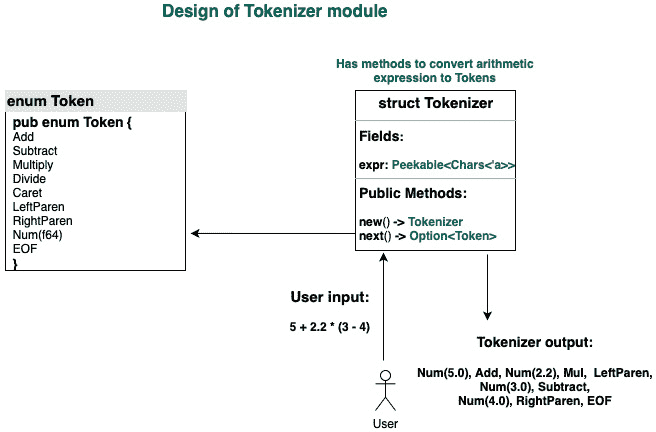

# *第二章*：Rust 编程语言之旅

在上一章中，我们探讨了 Rust 工具生态系统，包括构建和依赖管理、测试和文档。这些是关键且高度开发者友好的工具，为我们开始 Rust 项目提供了坚实的基础。在本章中，我们将构建一个工作示例，它将作为复习之用，并加强关键 Rust 编程概念。

本章的目标是提高对核心 Rust 概念的熟练程度。在深入 Rust 系统编程的细节之前，这是必不可少的。我们将通过设计和开发一个 **命令行界面** (**CLI**) 来实现这一点。

我们将要构建的应用程序是一个 **算术表达式评估器**。由于这个名字有点长，让我们看看一个例子。

假设用户在命令行中输入以下算术表达式：

```rs
1+2*3.2+(4/2-3/2)-2.11+2⁴
```

工具将打印出结果 **21.79**。

对于用户来说，它看起来像是一个计算器，但实现它涉及很多内容。这个示例项目将向您介绍解析器和编译器设计中使用的核心计算机科学概念。这是一个非平凡的工程，它允许我们测试核心 Rust 编程的深度，但又不至于过于复杂，让您感到畏惧。

在继续阅读之前，我建议您克隆代码仓库，导航到 `chapter2` 文件夹，并执行 `cargo run` 命令。在命令行提示符下，输入几个算术表达式，并查看工具返回的结果。您可以使用 *Ctrl* + *C* 退出工具。这将使您更好地理解本章将要构建的内容。

以下是为本章定义的关键学习步骤，它们对应于构建我们项目的各个阶段：

+   分析问题域

+   建模系统行为

+   构建分词器

+   构建解析器

+   构建评估器

+   处理错误

+   构建命令行应用程序

# 技术要求

您应该在本地开发环境中安装 Rustup 和 Cargo。

本章代码的 GitHub 仓库可以在[`github.com/PacktPublishing/Practical-System-Programming-for-Rust-Developers/tree/master/Chapter02`](https://github.com/PacktPublishing/Practical-System-Programming-for-Rust-Developers/tree/master/Chapter02)找到。

# 分析问题域

在本节中，我们将定义项目的范围和我们需要解决的技术挑战。

理解和分析问题域是构建任何系统的第一步。明确阐述我们试图解决的问题和系统的边界非常重要。这些可以以系统需求的形式捕捉。

让我们看看我们将要构建的 CLI 工具的要求。

工具应接受一个算术表达式作为输入，评估它，并以浮点数的形式提供数值输出。例如，表达式 *1+2*3.2+(4/2-3/2)-2.11+2⁴* 应评估为 *21.79*。

范围内的算术运算包括**加法**（**+**）、**减法**（**-**）、**乘法**（*****）、**除法**（**/**）、**幂**（**^**）、**负号前缀**（**-**）以及括号内的表达式**()**。

三角函数和对数函数、绝对值、平方根等数学函数**不在**范围内。

对于这样的表达式，需要解决的挑战如下：

+   用户应该能够在命令行上以**自由文本**的形式输入一个算术表达式。数字、算术运算符和括号（如果有）应该分开，并使用不同的规则集进行处理。

+   操作符优先级规则必须被考虑（例如，乘法优先于加法）。

+   括号内的表达式必须给予**更高的优先级**。

+   用户可能在数字和操作符之间不输入空格，但程序必须能够**解析带有或没有空格的字符输入**。

+   如果数字包含**小数点**，继续读取数字的其余部分，直到遇到运算符或括号。

+   **无效输入**应该被处理，并且程序应该带合适的错误信息终止。以下是一些无效输入的例子：

    **无效输入 1**：由于我们在这个程序中不处理变量，如果输入了一个字符，程序应带合适的错误信息退出（例如，*2 ** *a* 是无效输入）。

    **无效输入 2**：如果只遇到一个括号（没有匹配的闭合括号），程序应带错误信息退出。

    **无效输入 3**：如果算术运算符不被识别，程序应带错误信息退出。

显然还有其他类型的边缘情况可能导致错误。但我们只会关注这些。鼓励读者作为进一步练习实现其他错误条件。

既然我们已经知道了将要构建的范围，让我们来设计系统。

# 建模系统行为

在最后一节中，我们确认了系统需求。现在让我们设计处理算术表达式的逻辑。系统的组件在*图 2.1*中显示：


图 2.1 – 算术表达式评估器的设计

前面图中显示的组件如下协同工作：

1.  用户在命令行输入中输入一个算术表达式并按下**Enter**键。

1.  用户输入将被整体扫描并存储在局部变量中。

1.  从用户那里扫描的算术表达式。数字存储为`Numeric`类型的标记。每个算术运算符都存储为相应类型的标记。例如，`+`符号将表示为类型为`Add`的标记，而数字`1`将存储为类型为`Num`的标记，其值为`1`。这是通过`Lexer`（或`Tokenizer`）模块完成的。

1.  对于表达式`1+2*3`，必须先评估`2`和`3`的乘积，然后才是加法运算符。括号内包含的任何子表达式也必须按更高优先级进行评估。最终的 AST 将反映所有这些处理规则。这是通过`Parser`模块完成的。

1.  从构建的 AST 中，最后一步是按正确顺序评估 AST 中的每个节点，并将它们聚合以得到完整表达式的最终值。这是通过`Evaluator`模块完成的。

1.  表达式的最终计算值将显示在命令行上，作为程序输出给用户。或者，任何处理错误都将显示为错误消息。

这是处理步骤的广泛序列。现在我们将看看如何将这个设计转换为 Rust 代码。

词法分析器、解析器和 AST 之间的区别

*词法分析器*和*解析器*是计算机科学中用于构建*编译器*和*解释器*的概念。*词法分析器*（也称为*标记化器*）将文本（源代码）分割成单词，并为其分配一个*词法*意义，例如*关键字*、*表达式*、*运算符*、*函数调用*等。*词法分析器*生成标记（因此得名*标记化器*）。

*解析器*接受*词法分析器*的输出，并将标记排列成树结构（树是一种数据结构）。这种树结构也称为*AST*。有了*AST*，编译器可以生成机器代码，解释器可以评估指令。本章的*图 2.7*展示了*AST*的示意图。

词法分析和解析阶段是编译过程中的两个不同步骤，但在某些情况下它们是合并的。请注意，诸如*词法分析器*、*解析器*和*AST*等概念的应用范围远不止编译器或解释器，例如用于渲染 HTML 网页或 SVG 图像。

我们已经看到了系统的整体设计。现在让我们了解代码是如何组织的。这里展示了项目结构的可视化表示：


图 2.2 – 项目的代码结构

让我们检查这些路径中的每一个：

+   `src/parsemath`: 包含核心处理逻辑的模块

+   `src/parsemath/ast.rs`: 包含 AST 代码

+   `src/parsemath/parser.rs`: 包含解析器的代码

+   `src/parsemath/tokenizer.rs`: 包含标记化器的代码

+   `src/parsemath/token.rs`: 包含标记和运算符优先级的数据结构

+   `src/main.rs`: 主命令行应用程序

现在让我们按照以下方式设置项目：

1.  使用`cargo new chapter2 && cd chapter2`创建一个新的项目。

1.  在`src`文件夹下创建一个名为`parsemath`的文件夹。

1.  在`src/parsemath`文件夹中创建以下文件：`ast.rs`、`token.rs`、`tokenizer.rs`、`parser.rs`和`mod.rs`。

1.  将以下内容添加到`src/parsemath/mod.rs`中：

    ```rs
    pub mod ast;
    pub mod parser;
    pub mod token;
    pub mod tokenizer;
    ```

注意，本项目使用了 Rust 模块系统进行结构化。所有与解析相关的功能都在`parsemath`文件夹中。该文件夹中的`mod.rs`文件表明这是一个 Rust 模块。`mod.rs`文件导出该文件夹中包含的各个文件中的函数，并将其提供给`main()`函数。然后，我们在`main()`函数中注册`parsemath`模块，以便 Rust 编译器构建模块树。总的来说，Rust 模块结构帮助我们以灵活和可维护的方式组织不同文件中的代码。

本章代码片段的重要注意事项

本章详细介绍了命令行工具的设计，并辅以图表进行说明。所有关键方法的代码片段也提供了相应的解释。然而，在某些地方，一些用于完善代码的元素，例如模块导入、测试脚本和`impl`块的定义，并未在此处包含，但可以直接在 GitHub 仓库中找到。如果您选择跟随代码编写，请记住这一点。否则，您可以结合本章的解释和代码仓库中的完整代码进行学习。

提示：您将在构建词法分析器、解析器和评估器的下一节中看到`?`操作符的使用。请记住，*?*是错误处理的快捷方式，以便自动从给定函数传播错误到其调用函数。这将在稍后的*处理错误*部分进行解释。

我们现在已经准备好了。让我们开始吧。

# 构建词法分析器

**词法分析器**是我们系统设计中读取一个或多个字符从算术表达式并将其转换为*标记*的模块。换句话说，*输入*是一组字符，*输出*是一组标记。如果您想知道，标记的例子包括*加法*、*减法*和*Num(2.0)*。

我们首先需要为两件事创建数据结构：

+   为了存储用户提供的*输入*算术表达式

+   为了表示*输出*标记

在下一节中，我们将深入探讨如何为`tokenizer`模块确定合适的数据结构。

## 词法分析器数据结构

为了存储输入的算术表达式，我们可以选择以下数据类型之一：

+   字符串切片

+   字符串

我们将选择`&str`类型，因为我们不需要拥有值或动态增加表达式的尺寸。这是因为用户将一次性提供算术表达式，在处理过程中表达式不会改变。

这里是`Tokenizer`数据结构的一种可能表示：

src/parsemath/tokenizer.rs

```rs
pub struct Tokenizer {
expr: &str 
}
```

如果我们采取这种方法，我们可能会遇到问题。为了理解这个问题，让我们先了解分词是如何进行的。

对于表达式`*1+21*3.2*`，扫描到的单个字符将出现为八个单独的值，*1, +, 2, 1, *, 3, ., 2*。

从这个迭代器中，我们将提取以下五个标记：

*Num(1.0)*, *Add*, *Num(21.0)*, *Multiply*, *Num(3.2)*

为了完成这个任务，我们不仅需要读取一个字符将其转换为标记，还需要查看下一个字符。例如，给定输入表达式`*1+21*3.2*`，要将数字`21`标记为`Num(21)`，我们需要读取字符`2`，然后是`1`，然后是`*`，以便得出第一个加法操作的第二操作数值为`21`。

为了完成这个任务，我们必须将字符串切片转换为迭代器，这不仅允许我们遍历字符串切片以读取每个字符，还允许我们`peek`查看下一个字符的值。

让我们看看如何实现字符串切片的迭代器。Rust 意外地有一个内置类型用于此。它是标准库中`str`模块的一部分，结构体称为`Chars`。

因此，我们的`Tokenizer`结构体的定义可能如下所示：

src/parsemath/tokenizer.rs

```rs
pub struct Tokenizer {
expr: std::str::Chars
}
```

注意，我们已经将`expr`字段的类型从字符串切片（`&str`）更改为迭代器类型（`Chars`）。`Chars`是字符串切片字符的迭代器。这将允许我们在`expr`上执行迭代，例如`expr.next()`，这将给出表达式中的下一个字符的值。但我们也需要查看输入表达式中下一个字符后面的字符，原因我们之前提到过。

对于这个，Rust 标准库有一个名为`Peekable`的结构体，它有一个`peek()`方法。`peek()`的使用可以通过一个例子来说明。让我们取算术表达式`1+2`：

```rs
let expression = '1+2';
```

因为我们将把这个表达式存储在`Tokenizer`的`expr`字段中，它是一个`peekable iterator`类型，所以我们可以按顺序对其执行`next()`和`peek()`方法，如下所示：

1.  `expression.next()`返回`1`。迭代器现在指向字符`1`。

1.  然后，`expression.peek()`返回`+`但不消耗它，迭代器仍然指向字符`1`。

1.  然后，`expression.next()`返回`+`，迭代器现在指向字符`+`。

1.  然后，`expression.next()`返回`2`，迭代器现在指向字符`2`。

为了实现这样的迭代操作，我们将定义我们的`Tokenizer`结构体如下：

src/parsemath/tokenizer.rs

```rs
use std::iter::Peekable;
use std::str::Chars;
pub struct Tokenizer {
expr: Peekable<Chars> 
}
```

我们还没有完成`Tokenizer`结构体的定义。早期的定义会引发编译器错误，要求添加生命周期参数。*为什么是这样？*你可能想知道。

Rust 中的结构体可以持有引用。但是，当与包含引用的结构体一起工作时，Rust 需要显式指定生命周期。这就是我们在`Tokenizer`结构体上得到编译器错误的原因。为了解决这个问题，让我们添加生命周期注解：

src/parsemath/tokenizer.rs

```rs
pub struct Tokenizer<'a> {
expr: Peekable<Chars<'a>> 
}
```

您可以看到，`Tokenizer`结构体被赋予了生命周期注解`'a`。我们通过在结构体名称后面使用尖括号声明泛型生命周期参数名称`'a`来做到这一点。这告诉 Rust 编译器，任何对`Tokenizer`结构体的引用都不能比它包含的字符引用存在时间更长。

Rust 中的生命周期

在系统语言如 C/C++中，如果与引用相关的值在内存中已被释放，对引用的操作可能会导致不可预测的结果或失败。

在 Rust 中，每个引用都有一个生命周期，这是生命周期有效的范围。Rust 编译器（特别是借用检查器）会验证引用的生命周期不会比引用所指向的底层值的生命周期更长。

编译器是如何知道引用的生命周期的呢？大多数时候，编译器会尝试推断引用的生命周期（称为**省略**）。但是，当这不可能时，编译器期望程序员显式地注解引用的生命周期。编译器期望显式生命周期注解的常见情况包括*函数签名*中两个或多个参数是引用，以及在*结构体*中一个或多个成员是引用类型。

更多详细信息可以在 Rust 文档中找到，请参阅[`doc.rust-lang.org/1.9.0/book/lifetimes.html`](https://doc.rust-lang.org/1.9.0/book/lifetimes.html)。

如解释所述，我们传递包含算术表达式的字符串引用给`Tokenizer`结构体。根据变量作用域的常规规则（大多数编程语言都适用），`expr`变量需要在`Tokenizer`对象存在期间有效。如果在`Tokenizer`对象存在期间，与`expr`引用对应的值被释放，那么就构成了一个悬挂（无效）引用场景。为了防止这种情况，我们通过`<'a>`的生命周期注解告诉编译器，`Tokenizer`对象不能比它持有的`expr`字段中的引用存在时间更长。

下面的截图显示了`Tokenizer`数据结构：


图 2.3 – Tokenizer 结构体

我们已经看到了如何定义包含输入算术表达式引用的`Tokenizer`结构体，接下来我们将看看如何表示从`Tokenizer`生成的输出标记。

为了能够表示可以生成的令牌列表，我们首先需要考虑这些令牌的数据类型。由于令牌可以是 `Num` 类型或运算符类型之一，我们必须选择一个可以容纳多种数据类型的数据结构。数据类型选项有元组、HashMaps、structs 和 enums。如果我们添加一个约束，即令牌中的数据类型可以是许多预定义 *变体*（允许的值）之一，那么我们只剩下一种选择——*枚举*。我们将使用 `enum` 数据结构来定义令牌。

以下截图显示了 `enum` 数据结构中令牌的表示：


图 2.4 – Token enum

以下是关于 `Token enum` 中存储的值的解释：

+   如果遇到 `+` 字符，将生成 `Add` 令牌。

+   如果遇到 `-` 字符，将生成 `Subtract` 令牌。

+   如果遇到 `*` 字符，将生成 `Multiply` 令牌。

+   如果遇到 `/` 字符，将生成 `Divide` 令牌。

+   如果遇到 `^` 字符，将生成 `Caret` 令牌。

+   如果遇到 `(` 字符，将生成 `LeftParen` 令牌。

+   如果遇到 `)` 字符，将生成 `RightParen` 令牌。

+   如果遇到任何数字 `x`，将生成 `Num(x)` 令牌。

+   如果遇到 `EOF`（扫描整个表达式的末尾），将生成 `EOF` 令牌。

现在我们已经定义了数据结构来捕获 `Tokenizer` 模块的 *输入*（算术表达式）和 *输出*（令牌），我们现在可以编写实际处理的代码。

## Tokenizer 数据处理

以下截图显示了 `Tokenizer` 及其数据元素和方法：


图 2.5 – Tokenizer 及其方法

`Tokenizer` 有两个公共方法：

+   `new()`: 使用用户提供的算术表达式创建一个新的分词器

+   `next()`: 读取表达式中的字符并返回下一个令牌

以下截图显示了 `Tokenizer` 模块的全貌：



图 2.6 – Tokenizer 模块设计

`new()` 方法的代码如下：

src/parsemath/tokenizer.rs

```rs
impl<'a> Tokenizer<'a> {
    pub fn new(new_expr: &'a str) -> Self {
        Tokenizer {
            expr: new_expr.chars().peekable(),
        }
    }
}
```

你会注意到我们在 `impl` 行中声明了 `Tokenizer` 的生命周期。我们重复了两次 `'a`。`Impl<'a>` 声明生命周期 `'a`，而 `Tokenizer<'a>` 使用它。

关于生命周期的观察

你已经看到，对于 `Tokenizer`，我们在三个地方声明了其生命周期：

1) `Tokenizer` 结构体的声明

2) 为 `Tokenizer` 结构体声明 `impl` 块

3) `impl` 块内的方法签名

这可能看起来很冗长，但 Rust 期望我们关于生命周期要具体，因为这是我们避免内存安全问题，如 *悬垂指针* 或 *使用后释放* 错误的方法。

`impl`关键字允许我们向`Tokenizer`结构体添加功能。`new()`方法接受一个字符串切片作为参数，该参数包含用户输入的算术表达式的引用。它构建一个新的`Tokenizer`结构体，用提供的算术表达式初始化，并从函数中返回它。

注意，算术表达式不是以字符串切片的形式存储在结构体中，而是以字符串切片的可预览迭代器形式存储。

在此代码中，`new_expr`代表字符串切片，`new_expr.chars()`代表字符串切片的迭代器，而`new_expr.chars().peekable()`创建了一个字符串切片的可预览迭代器。

正规迭代器和可预览迭代器之间的区别在于，在前者中，我们可以使用`next()`方法消耗字符串切片中的下一个字符，而在后者中，我们还可以选择性地预览切片中的下一个字符而不消耗它。您将在我们编写`Tokenizer`的`next()`方法代码时看到这一点。

我们将通过在`Tokenizer`结构体上实现`Iterator`特质来编写`Tokenizer`上的`next()`方法代码。特质使我们能够向结构体（和枚举）添加行为。标准库中的`Iterator`特质（`std::iter::Iterator`）有一个必须按照以下签名实现的方法：

```rs
fn next(&mut self) -> Option<Self::Item>
```

方法签名指定，此方法可以在`Tokenizer`结构体的实例上调用，并返回`Option<Token>`。这意味着它要么返回`Some(Token)`，要么返回`None`。

下面是实现`Tokenizer`结构体上的`Iterator`特质的代码：

src/parsemath/tokenizer.rs

```rs
impl<'a> Iterator for Tokenizer<'a> {
    type Item = Token;

    fn next(&mut self) -> Option<Token> {
        let next_char = self.expr.next();

        match next_char {
            Some('0'..='9') => {
                let mut number = next_char?.to_string();

                while let Some(next_char) = self.expr.peek() {
                    if next_char.is_numeric() || next_char == 
                        &'.' {
                        number.push(self.expr.next()?);
                    } else if next_char == &'(' {
                        return None;
                    } else {
                        break;
                    }
                }

                Some(Token::Num(number.parse::<f64>().                    unwrap()))
            },
            Some('+') => Some(Token::Add),
            Some('-') => Some(Token::Subtract),
            Some('*') => Some(Token::Multiply),
            Some('/') => Some(Token::Divide),
            Some('^') => Some(Token::Caret),
            Some('(') => Some(Token::LeftParen),
            Some(')') => Some(Token::RightParen),
            None => Some(Token::EOF),
            Some(_) => None,
        }
    }
}
```

注意这里有两个迭代器在起作用：

+   `expr`上的`next()`方法（它是`Tokenizer`结构体中的一个字段）返回下一个字符（我们通过将`Peekable<Chars>`类型分配给`expr`字段来实现这一点）。

+   `Tokenizer`结构体上的`next()`方法返回一个标记（我们通过在`Tokenizer`结构体上实现`Iterator`特质来实现这一点）。

让我们逐步了解当在`Tokenizer`上调用`next()`方法时会发生什么：

+   调用程序首先通过调用`new()`方法实例化`Tokenizer`结构体，然后在该结构体上调用`next()`方法。`Tokenizer`结构体上的`next()`方法通过在`expr`字段上调用`next()`来读取存储的算术表达式中的下一个字符，从而返回表达式中的下一个字符。

+   然后使用`match`语句评估返回的字符。模式匹配用于确定从`expr`字段中的字符串切片引用读取的字符后返回哪个标记。

+   如果从字符串切片返回的字符是算术运算符（`*+*, *-*, ***, */*, *^*`）或者是一个括号，则返回相应的`Token`枚举值。在这里，*字符*和`Token`之间存在一对一的对应关系。

+   如果返回的字符是数字，则需要一些额外的处理。原因是，一个数字可能有多个数字。此外，一个数字可能是小数，在这种情况下，它可能是*xxx.xxx*的形式，其中小数点前后数字的数量是完全不可预测的。因此，对于数字，我们应该使用算术表达式的`peekable`迭代器来消费下一个字符，并*窥视*下一个字符以确定是否继续读取数字。

`Tokenizer`的完整代码可以在 GitHub 上代码文件夹中的`tokenizer.rs`文件中找到。

# 构建解析器

**解析器**是我们项目中构建 AST 的模块，AST 是一个节点树，每个节点代表一个标记（一个数字或算术运算符）。AST 是标记节点的递归树结构，即根节点是一个标记，它包含也是标记的子节点。

## 解析器数据结构

`parser`与`Tokenizer`相比是一个更高级的实体。虽然`Tokenizer`将用户输入转换为细粒度的标记（例如，各种算术运算符），但解析器使用`Tokenizer`的输出构建一个整体的 AST，这是一个节点层次结构。从解析器构建的`AST`结构在以下图中展示：


图 2.7 – 我们的 AST

在前面的图中，以下每一项都是节点：

+   *Number(2.0)*

+   *Number(3.0)*

+   *Multiply(Number(2.0),Number(3.0))* 

+   *Number(6.0)*

+   *Add(Multiply(Number(2.0),Number(3.0)),Number(6.0))* 

这些节点中的每一个都作为`Node`枚举的一部分存储在`Box`变量中。

`Parser`结构体的整体设计如下：


图 2.8 – 解析器结构体设计

如前图所示，`Parser`将有两个数据元素：一个`Tokenizer`实例（我们在上一节中构建的），以及当前标记，表示我们已评估到算术表达式的哪个点。

## 解析器方法

`Parser`结构体将有两个公共方法：

+   `new()`：创建解析器的新实例。这个`new()`方法将创建一个传递算术表达式的标记化器实例，并将从`Tokenizer`返回的第一个标记存储在其`current_token`字段中。

+   `parse()`：从标记生成`AST`（节点树），这是解析器的主要输出。

这里是`new()`方法的代码。代码是自我解释的，它创建了一个新的`Tokenizer`实例，用算术表达式初始化它，然后尝试从表达式中检索第一个标记。如果成功，标记将被存储在`current_token`字段中。如果不成功，则返回`ParseError`：

src/parsemath/parser.rs

```rs
// Create a new instance of Parserpub fn new(expr: &'a str) -> Result<Self, ParseError> {
    let mut lexer = Tokenizer::new(expr);
    let cur_token = match lexer.next() {
        Some(token) => token,
        None => return Err(ParseError::InvalidOperator
            ("Invalid character".into())),
    };
    Ok(Parser {
        tokenizer: lexer,
        current_token: cur_token,
    })
}
```

下面是公共 `parse()` 方法的代码。它调用一个私有 `generate_ast()` 方法，该方法递归地执行处理并返回一个 AST（节点树）。如果成功，则返回节点树；如果不成功，则传播接收到的错误：

src/parsemath/parser.rs

```rs
// Take an arithmetic expression as input and return an AST
pub fn parse(&mut self) -> Result<Node, ParseError> {
    let ast = self.generate_ast(OperPrec::DefaultZero);
    match ast {
        Ok(ast) => Ok(ast),
        Err(e) => Err(e),
    }
}
```

以下图像列出了 `Parser` 结构体中的所有私有和公共方法：


图 2.9 – 解析器方法概述

现在我们来看 `get_next_token()` 方法的代码。此方法使用 `Tokenizer` 结构体从算术表达式中检索下一个标记，并更新 `Parser` 结构体的 `current_token` 字段。如果失败，则返回 `ParseError`：

src/parsemath/parser.rs

```rs
fn get_next_token(&mut self) -> Result<(), ParseError> {
    let next_token = match self.tokenizer.next() {
        Some(token) => token,
        None => return Err(ParseError::InvalidOperator
            ("Invalid character".into())),
    };
    self.current_token = next_token;
    Ok(())
}
```

注意在 `Result<(), ParseError>` 中返回的空元组 `()`。这意味着如果没有出错，则不返回任何具体值。

下面是 `check_paren()` 方法的代码。这是一个辅助方法，用于检查表达式中是否存在匹配的括号对。如果没有，则返回错误：

src/parsemath/parser.rs

```rs
fn check_paren(&mut self, expected: Token) -> Result<(), ParseError> {
    if expected == self.current_token {
        self.get_next_token()?;
        Ok(())
    } else {
        Err(ParseError::InvalidOperator(format!(
            "Expected {:?}, got {:?}",
            expected, self.current_token
        )))
    }
}
```

现在我们来看剩下的三个私有方法，它们负责大部分的解析器处理工作。

`parse_number()` 方法接受当前标记，并检查三件事：

+   是否是形式为 *Num(i)* 的数字。

+   是否有符号，如果是负数的话。例如，表达式 *-2.2 + 3.4* 被解析到 AST 中为 *Add(Negative(Number(2.2)), Number(3.4))*。

+   括号对：如果括号内找到一个表达式，它将其视为乘法操作。例如，*1*(2+3)* 被解析为 *Multiply(Number(1.0), Add(Number(2.0), Number(3.0)))*。

如果前述操作中的任何操作出现错误，则返回 `ParseError`。

下面是 `parse_number()` 方法的代码：

src/parsemath/parser.rs

```rs
// Construct AST node for numbers, taking into account 
// negative prefixes while handling parenthesis
fn parse_number(&mut self) -> Result<Node, ParseError> {
    let token = self.current_token.clone();
    match token {
        Token::Subtract => {
            self.get_next_token()?;
            let expr = self.generate_ast(OperPrec::Negative)?;
            Ok(Node::Negative(Box::new(expr)))
        }
        Token::Num(i) => {
            self.get_next_token()?;
            Ok(Node::Number(i))
        }
        Token::LeftParen => {
            self.get_next_token()?;
            let expr = self.generate_ast
                (OperPrec::DefaultZero)?;
            self.check_paren(Token::RightParen)?;
            if self.current_token == Token::LeftParen {
                let right = self.generate_ast
                    (OperPrec::MulDiv)?;
                return Ok(Node::Multiply(Box::new(expr), 
                    Box::new(right)));
            }

            Ok(expr)
        }
        _ => Err(ParseError::UnableToParse("Unable to 
            parse".to_string())),
    }
}
```

`generate_ast()` 方法是该模块的主要工作马，它递归调用。它按照以下顺序进行处理：

1.  它使用 `parse_number()` 方法处理数字标记、负数标记和括号内的表达式。

1.  它在循环中按顺序解析算术表达式中的每个标记，以检查遇到的下一个两个运算符的优先级，并通过以这种方式调用 `convert_token_to_node()` 方法来构建 `AST`，使得具有较高优先级的运算符包含的表达式先于具有较低优先级的运算符包含的表达式执行。例如，表达式 *1+2*3* 被评估为 *Add(Number(1.0), Multiply(Number(2.0), Number(3.0)))*，而表达式 *1*2+3* 被评估为 *Add(Multiply(Number(1.0), Number(2.0)), Number(3.0))*。

现在我们来看 `generate_ast()` 方法的代码：

src/parsemath/parser.rs

```rs
fn generate_ast(&mut self, oper_prec: OperPrec) -> Result<Node, ParseError> {
    let mut left_expr = self.parse_number()?;

    while oper_prec < self.current_token.get_oper_prec() {
        if self.current_token == Token::EOF {
            break;
        }
        let right_expr = self.convert_token_to_node
            (left_expr.clone())?;
        left_expr = right_expr;
    }
    Ok(left_expr)
}
```

我们已经看到了与解析器相关的各种方法。现在让我们看看处理算术运算符时的另一个关键方面——*运算符优先级*。

## 运算符优先级

操作符优先级的 `enum` 如下所示：


图 2.10 – 操作符优先级枚举

操作符优先级 `enum` 有以下值：

+   `DefaultZero`: 默认优先级（最低优先级）

+   `AddSub`: 如果算术操作是加法或减法，则应用的优先级

+   `MulDiv`: 如果算术操作是乘法或除法，则应用的优先级

+   `Power`: 遇到 caret (`^`) 操作符时应用的优先级

+   `Negative`: 在数字前负号 (`-`) 前应用的优先级

优先级顺序从上到下增加，即 `DefaultZero` < `AddSub` < `MulDiv` < `Power` < `Negative`。

定义操作符优先级 `enum` 如下所示：

src/parsemath/token.rs

```rs
#[derive(Debug, PartialEq, PartialOrd)]
/// Defines all the OperPrec levels, from lowest to highest.
pub enum OperPrec {
    DefaultZero,
    AddSub,
    MulDiv,
    Power,
    Negative,
}
```

使用 `get_oper_prec()` 方法来获取给定操作符的操作符优先级。以下代码展示了此方法的作用。在 `Token` 结构体的 `impl` 块中定义此方法：

src/parsemath/token.rs

```rs
impl Token {
    pub fn get_oper_prec(&self) -> OperPrec {
        use self::OperPrec::*;
        use self::Token::*;
        match *self {
            Add | Subtract => AddSub,
            Multiply | Divide => MulDiv,
            Caret => Power,

            _ => DefaultZero,
        }
    }
}
```

现在，让我们看看 `convert_token_to_node()` 的代码。此方法基本上通过检查标记是否为 `Add`、`Subtract`、`Multiply`、`Divide` 或 `Caret` 来构建操作符类型的 `AST` 节点。在出错的情况下，返回 `ParseError`：

src/parsemath/parser.rs

```rs
fn convert_token_to_node(&mut self, left_expr: Node) -> Result<Node, ParseError> {
    match self.current_token {
        Token::Add => {
            self.get_next_token()?;
            //Get right-side expression
            let right_expr = self.generate_ast
                (OperPrec::AddSub)?;
            Ok(Node::Add(Box::new(left_expr), 
                Box::new(right_expr)))
        }
        Token::Subtract => {
            self.get_next_token()?;
            //Get right-side expression
            let right_expr = self.generate_ast
                (OperPrec::AddSub)?;
            Ok(Node::Subtract(Box::new(left_expr), 
                Box::new(right_expr)))
        }
        Token::Multiply => {
            self.get_next_token()?;
            //Get right-side expression
            let right_expr = self.generate_ast
                (OperPrec::MulDiv)?;
            Ok(Node::Multiply(Box::new(left_expr), 
                Box::new(right_expr)))
        }
        Token::Divide => {
            self.get_next_token()?;
            //Get right-side expression
            let right_expr = self.generate_ast
                (OperPrec::MulDiv)?;
            Ok(Node::Divide(Box::new(left_expr), 
                Box::new(right_expr)))
        }
        Token::Caret => {
            self.get_next_token()?;
            //Get right-side expression
            let right_expr = self.generate_ast
                (OperPrec::Power)?;
            Ok(Node::Caret(Box::new(left_expr), 
                Box::new(right_expr)))
        }
        _ => Err(ParseError::InvalidOperator(format!(
            "Please enter valid operator {:?}",
            self.current_token
        ))),
    }
}
```

我们将在本章的 *处理错误* 部分详细讨论错误处理。`Parser` 的完整代码可以在 GitHub 章节文件夹中的 `parser.rs` 文件中找到。

# 构建评估器

一旦在解析器中构建了 `AST`（节点树），从 `AST` 中评估数值就是一个简单的操作。评估函数递归地解析 `AST` 树中的每个节点，并得到最终值。

例如，如果 `AST` 节点是 *Add(Number(1.0),Number(2.0))*，则计算结果为 *3.0*。

如果 `AST` 节点是 *Add(Number(1.0),Multiply(Number(2.0),Number(3.0))*：

+   它将 *Number(1.0)* 的值计算为 *1.0*。

+   然后，它将 *Multiply(Number(2.0), Number(3.0))* 计算为 *6.0*。

+   然后，它将 *1.0* 和 *6.0* 相加，得到最终值 *7.0*。

让我们现在看看 `eval()` 函数的代码：

src/parsemath/ast.rs

```rs
pub fn eval(expr: Node) -> Result<f64, Box<dyn error::Error>> {
    use self::Node::*;
    match expr {
        Number(i) => Ok(i),
        Add(expr1, expr2) => Ok(eval(*expr1)? + 
            eval(*expr2)?),
        Subtract(expr1, expr2) => Ok(eval(*expr1)? – 
            eval(*expr2)?),
        Multiply(expr1, expr2) => Ok(eval(*expr1)? * 
            eval(*expr2)?),
        Divide(expr1, expr2) => Ok(eval(*expr1)? / 
            eval(*expr2)?),
        Negative(expr1) => Ok(-(eval(*expr1)?)),
        Caret(expr1, expr2) => Ok(eval(*expr1)?
            .powf(eval(*expr2)?)),
    }
}
```

特性对象

在 `eval()` 方法中，你会注意到在出错的情况下，该方法返回 `Box<dyn error::Error>`。这是一个特性对象的例子。我们现在将解释这一点。

在 Rust 标准库中，`error:Error` 是一个特性。在这里，我们告诉编译器 `eval()` 方法应该返回实现 `Error` 特性的类型。我们不知道编译时返回的确切类型是什么；我们只知道返回的任何内容都将实现 `Error` 特性。底层错误类型仅在运行时才知道，不是静态确定的。在这里，`dyn error::Error` 是一个特性对象。使用 `dyn` 关键字表示它是一个特性对象。

当我们使用特质对象时，编译器在编译时不知道应该调用哪种类型的哪个方法。这只有在运行时才知道，因此被称为*动态分发*（当编译器在编译时知道应该调用哪个方法时，它被称为*静态分发*）。

注意，我们使用`Box<dyn error::Error>`来封装错误。这是因为我们在运行时不知道错误类型的尺寸，所以封装是一种绕过这个问题的方法（`Box`是一个在编译时具有已知尺寸的引用类型）。Rust 标准库通过让`Box`实现从任何实现了`Error`特质的类型到特质对象`Box<Error>`的转换，帮助我们封装错误。

更多详细信息可以在 Rust 文档中找到，请参阅[`doc.rust-lang.org/book/ch17-02-trait-objects.html`](https://doc.rust-lang.org/book/ch17-02-trait-objects.html)。

# 处理错误

错误处理处理的问题是：*我们如何将程序错误传达给用户？*

在我们的项目中，错误可能由两个主要原因引起——可能是编程错误，或者可能是由于无效输入导致的错误。让我们首先讨论 Rust 的错误处理方法。

在 Rust 中，错误是一等公民，因为错误本身就是一个数据类型，就像`整数`、`字符串`或`向量`一样。因为`error`是一个数据类型，类型检查可以在编译时发生。Rust 标准库为 Rust 标准库中的所有错误实现了`std::error::Error`特质。Rust 不使用异常处理，而是一种独特的计算可以返回`Result`类型的方法：

```rs
enum Result<T, E> {   Ok(T),   Err(E),}
```

`Result<T, E>`是一个包含两个变体的`enum`，其中`Ok(T)`表示*成功*，而`Err(E)`表示返回的*错误*。通过模式匹配来处理函数返回的两种类型的结果。

为了更好地控制错误处理并提供更友好的错误信息给应用程序用户，建议使用实现了`std::error::Error`特质的自定义错误类型。这样，程序中不同模块的所有错误类型都可以转换为这种自定义错误类型，从而实现统一的错误处理。这是在 Rust 中处理错误的一种非常有效的方法。

一种轻量级的错误处理方法是将`Option<T>`用作函数的返回值，其中`T`是任何泛型类型：

```rs
pub enum Option<T> {    None,    Some(T),}
```

`Option`类型是一个包含两个变体的`enum`，`Some(T)`和`None`。如果处理成功，则返回`Some(T)`值，否则从函数返回`None`。

在我们的项目中，我们将使用`Result`和`Option`类型进行错误处理。

我们项目选择的错误处理方法如下：


图 2.11 – 错误处理方法

对于我们项目中的包含核心处理的四个模块，其方法如下：

+   `new()`和`next()`。`new()`方法相当简单，只是创建一个新的`Tokenizer`结构体实例并初始化它。此方法不会返回任何错误。然而，`next()`方法返回一个`Token`，如果算术表达式中存在任何无效字符，我们需要处理这种情况并将信息传达给调用代码。在这里，我们将使用轻量级的错误处理方法，`next()`方法的返回值将使用`Option<Token>`。如果可以从算术表达式中构造一个有效的`Token`，则返回`Some(Token)`。在无效输入的情况下，返回`None`。调用函数可以将`None`解释为错误条件，并处理必要的操作。

+   `eval()`函数，它根据节点树计算数值。如果在处理过程中出现错误，我们将返回一个普通的`std::error::Error`，但由于否则 Rust 编译器将不知道错误值的编译时大小，它将是一个`Boxed`值。此方法的返回类型是`Result<f64, Box<dyn error::Error>>`。如果处理成功，将返回一个数值（`f64`），否则返回一个`Boxed`错误。我们本可以为此模块定义一个自定义错误类型以避免复杂的`Boxed`错误签名，但选择这种方法是为了展示在 Rust 中进行错误处理的各种方式。

+   `get_oper_prec()`，它根据输入的算术运算符返回运算符优先级。由于我们在这个简单的方法中看不到任何错误的可能性，因此方法返回值中不会定义错误类型。

+   `Parser`模块包含大部分处理逻辑。在这里，将定义一个自定义错误类型`ParseError`，其结构如下：


图 2.12 – 自定义错误类型

我们的自定义错误类型有两个变体，`UnableToParse(String)`和`InvalidOperator(String)`。

第一个变体将是一个通用的错误，用于处理处理过程中出现的任何类型的错误，第二个变体将专门用于用户提供了无效的算术运算符的情况；例如，*2=3*。

让我们为解析器定义一个自定义错误类型：

src/parsemath/parser.rs

```rs
#[derive(Debug)]
pub enum ParseError {
    UnableToParse(String),
    InvalidOperator(String),
}
```

为了打印错误，我们还需要实现`Display`特质：

src/parsemath/parser.rs

```rs
impl fmt::Display for ParseError {
    fn fmt(&self, f: &mut fmt::Formatter) -> fmt::Result {
        match &self {
            self::ParseError::UnableToParse(e) => write!(f, 
                "Error in evaluating {}", e),
            self::ParseError::InvalidOperator(e) => write!(f, 
                "Error in evaluating {}", e),
        }
    }
}
```

由于`ParseError`将是处理过程中返回的主要错误类型，并且因为`AST`模块返回一个`Boxed`错误，我们可以编写代码将`AST`模块中的任何`Boxed`错误自动转换为由`Parser`返回的`ParseError`。代码如下：

src/parsemath/parser.rs

```rs
impl std::convert::From<std::boxed::Box<dyn std::error::Error>> for ParseError {
    fn from(_evalerr: std::boxed::Box<dyn std::error::Error>) 
        -> Self {
        return ParseError::UnableToParse("Unable to 
            parse".into());
    }
}
```

这段代码允许我们编写如下代码：

```rs
let num_value = eval(ast)?
```

特别注意`?`运算符。它是以下内容的快捷方式：

+   如果`eval()`处理成功，将返回值存储在`num_value`字段中。

+   如果处理失败，将`eval()`方法返回的`Boxed`错误转换为`ParseError`，并将其进一步传播给调用者。

这部分讨论了算术表达式评估模块。在下一节中，我们将探讨如何从`main()`函数中调用此模块。

# 整合所有内容

在前面的章节中，我们看到了如何设计和编写我们项目各种处理模块的代码。现在，我们将把它们全部整合到一个`main()`函数中，该函数作为命令行应用程序。此`main()`函数将执行以下操作：

1.  显示带有用户输入算术表达式的说明的提示。

1.  从用户那里接受命令行输入的算术表达式。

1.  实例化`Parser`（返回一个`Parser`对象实例）。

1.  解析表达式（返回表达式的 AST 表示）。

1.  评估表达式（计算表达式的数学值）。

1.  在命令行输出中向用户显示结果。

1.  调用`Parser`并评估数学表达式。

`main()`函数的代码如下：

src/main.rs

```rs
fn main() {
    println!("Hello! Welcome to Arithmetic expression 
        evaluator.");
    println!("You can calculate value for expression such as 
        2*3+(4-5)+2³/4\. ");
    println!("Allowed numbers: positive, negative and 
        decimals.");
    println!("Supported operations: Add, Subtract, Multiply, 
        Divide, PowerOf(^). ");
    println!("Enter your arithmetic expression below:");
    loop {
        let mut input = String::new();
        match io::stdin().read_line(&mut input) {
            Ok(_) => {
                match evaluate(input) {
                    Ok(val) => println!("The computed number 
                        is {}\n", val),
                    Err(_) => {
                        println!("Error in evaluating 
                            expression. Please enter valid 
                            expression\n");
                    }
                };
            }

            Err(error) => println!("error: {}", error),
        }
    }
}
```

`main()`函数向用户显示提示，从`stdin`（命令行）读取一行，并调用`evaluate()`函数。如果计算成功，它将显示计算出的 AST 和数值。如果失败，它将打印错误信息。

`evaluate()`函数的代码如下：

src/main.rs

```rs
fn evaluate(expr: String) -> Result<f64, ParseError> {
    let expr = expr.split_whitespace().collect::<String>();
    // remove whitespace chars
    let mut math_parser = Parser::new(&expr)?;
    let ast = math_parser.parse()?;
    println!("The generated AST is {:?}", ast);

    Ok(ast::eval(ast)?)
}
```

`evaluate()`函数使用提供的算术表达式实例化一个新的`Parser`，解析它，然后在`AST`模块上调用`eval()`方法。注意使用`?`运算符自动传播任何处理错误到`main()`函数，在那里它们通过`println!`语句进行处理。

运行以下命令以编译和运行程序：

```rs
cargo run
```

您可以尝试各种正数和负数、小数、算术运算符和可选括号内子表达式的组合。您还可以检查无效输入表达式将产生错误信息。

您可以扩展此项目以添加对平方根、三角函数、对数函数等数学函数的支持。您还可以添加边缘情况。

通过这种方式，我们结束了本书的第一个完整项目。我希望这个项目不仅让您了解了惯用的 Rust 代码是如何编写的，而且还让您了解了在设计程序时如何以 Rust 的方式思考。

完整的`main()`函数代码可以在 GitHub 文件夹中本章的`main.rs`文件中找到。

# 摘要

在本章中，我们从头开始使用 Rust 构建了一个命令行应用程序，没有使用任何第三方库，来计算算术表达式的值。我们涵盖了 Rust 的许多基本概念，包括数据类型、如何使用 Rust 数据结构来建模和设计应用程序领域、如何在模块间分割代码并集成它们、如何在模块内以函数的形式组织代码、如何将模块函数暴露给其他模块、如何进行模式匹配以编写优雅和安全的代码、如何向结构和枚举添加功能、如何实现特性和注解生命周期、如何设计和传播自定义错误类型、如何装箱类型以使数据大小对编译器可预测、如何构建递归节点树并导航它、如何编写递归评估表达式的代码，以及如何为结构指定生命周期参数。

恭喜你如果成功跟随着并得到了一些可工作的代码！如果你遇到了任何困难，你可以参考 GitHub 仓库中的最终代码。

这个示例项目为在接下来的章节中深入系统编程的细节提供了一个坚实的基础。如果你没有完全理解代码的每一个细节，没有必要担心。随着接下来的章节，我们将编写更多的代码，并逐步强化 Rust 惯用代码的概念。

在下一章中，我们将介绍 Rust 标准库，并了解它如何支持丰富的内置模块、类型、特性和函数，以执行系统编程。
