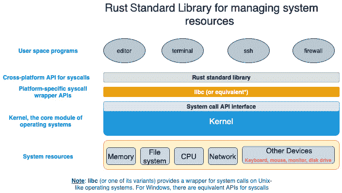
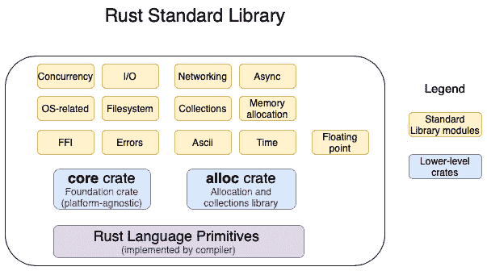
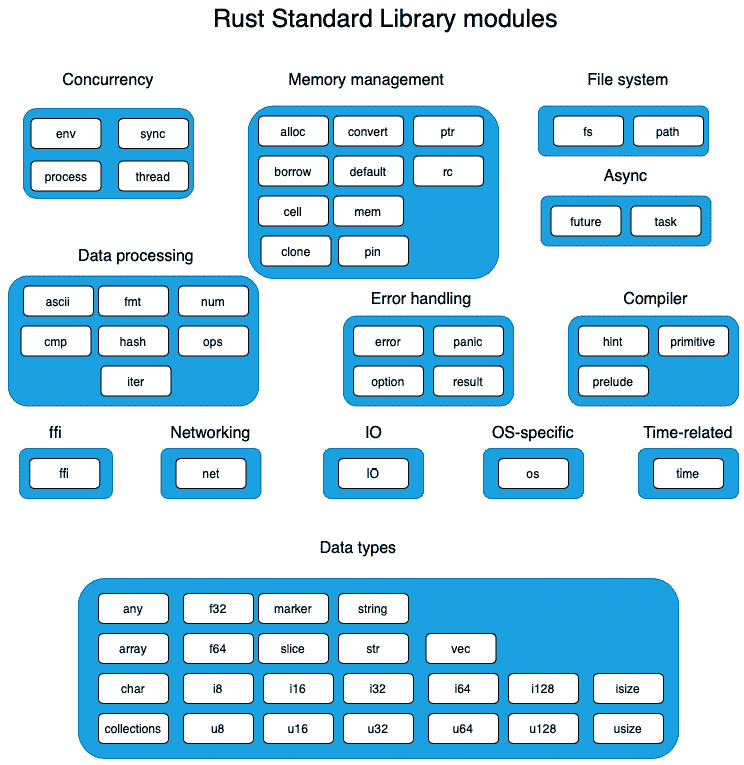
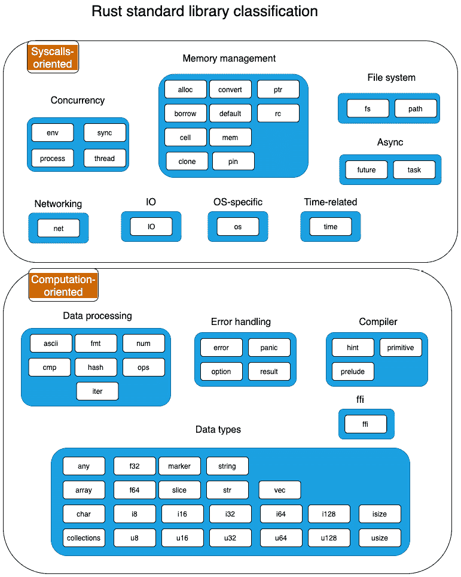
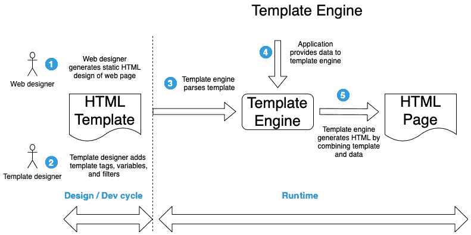
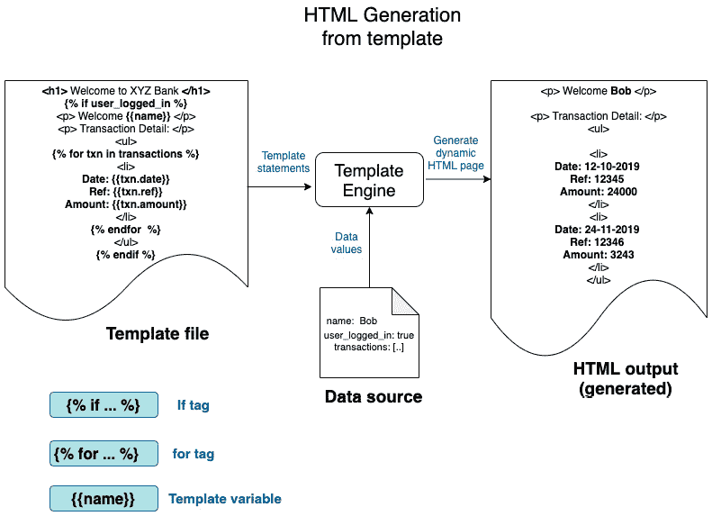
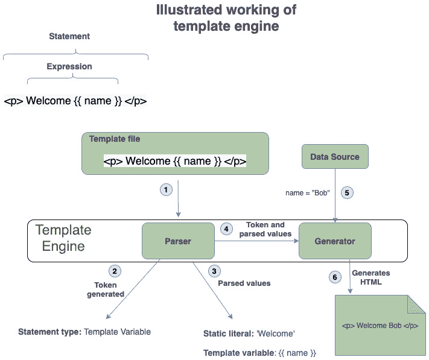
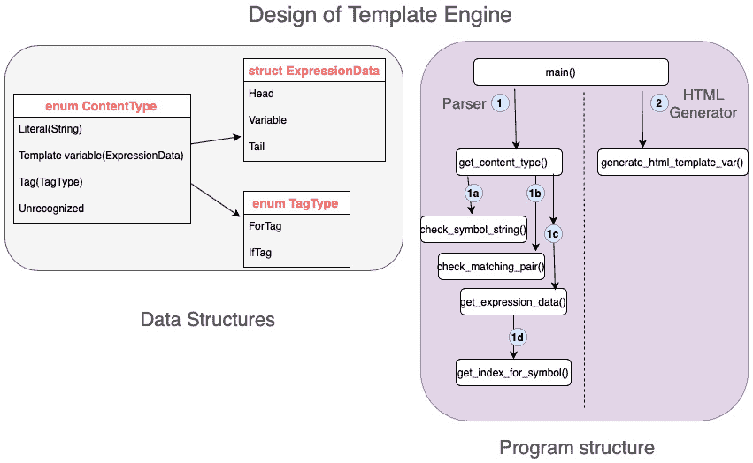
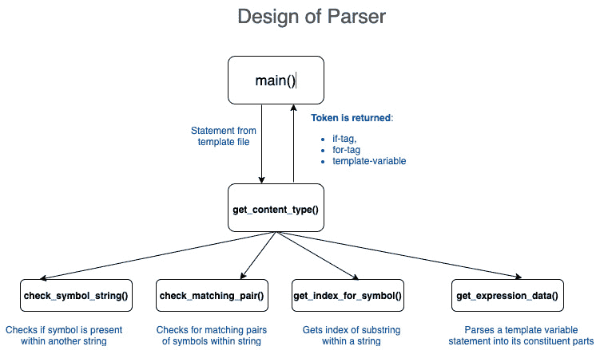

# *第三章*：Rust 标准库简介

在上一章中，我们使用各种 Rust 语言原语和 Rust 标准库中的模块构建了一个命令行工具。然而，为了充分利用 Rust 的力量，了解标准库中为系统编程任务提供的功能范围至关重要，而无需求助于第三方 crate。

在本章中，我们将深入探讨 Rust 标准库的结构。你将了解用于访问系统资源的标准模块的介绍，并学习如何通过编程方式管理它们。通过获得的知识，我们将用 Rust 实现一个模板引擎的小部分。到本章结束时，你将能够自信地导航 Rust 标准库并在你的项目中使用它。

本章的关键学习成果如下：

+   介绍 Rust 标准库

+   使用标准库模块编写模板引擎的一个特性

# 技术要求

Rustup 和 Cargo 必须安装在你的本地开发环境中。本章示例的 GitHub 仓库可以在[`github.com/PacktPublishing/Practical-System-Programming-for-Rust-Developers/tree/master/Chapter03`](https://github.com/PacktPublishing/Practical-System-Programming-for-Rust-Developers/tree/master/Chapter03)找到。

# Rust 标准库和系统编程

在我们深入研究标准库之前，让我们了解它如何适应系统编程的上下文。

在系统编程中，一个基本要求是管理系统资源，如内存、文件、网络 I/O、设备和进程。每个操作系统都有一个内核（或等效物），它是加载到内存中的中央软件模块，将系统硬件与应用程序进程连接起来。你可能想知道，Rust 标准库在这里有什么作用？我们是不是要用 Rust 编写一个内核？不，这不是本书的目的。最流行的操作系统，基本上是 Unix、Linux 和 Windows 变体，它们的内核主要是用 **C** 编写的，混合了一些汇编语言。尽管有几个实验性的努力朝这个方向前进，但 Rust 作为内核开发语言的补充还处于早期阶段。然而，Rust 标准库提供的是 API 接口，以便从 Rust 程序中发出系统调用，以管理和操作各种系统资源。以下图显示了这一上下文：



图 3.1 – Rust 标准库

让我们通过这个图来更好地理解每个组件：

+   `read()`，内核将代表编辑程序执行。这种限制的原因是现代处理器架构（如 x86-64）允许 CPU 在两种不同的特权级别下运行—*内核模式*和*用户模式*。用户模式的特权级别低于内核模式。CPU 只能在内核模式下执行某些操作。这种设计防止用户程序意外执行可能影响系统操作的任务。

+   **系统调用（syscall）接口**：内核还提供了一个系统调用 *应用程序编程接口*，作为进程请求内核执行各种任务的入口点。

+   `libc`（或 `glibc`）。对于 Windows 操作系统，有等效的 API。

+   `libc`（或另一个特定平台的等效库）内部调用系统调用。Rust 标准库是跨平台的，这意味着系统调用的调用细节（或使用的包装库）被从 Rust 开发者那里抽象出来。从 Rust 代码中调用系统调用而不使用标准库的方法（例如，在嵌入式系统开发中）是存在的，但这超出了本书的范围。

+   **用户空间程序**：这些是你将使用标准库作为本书的一部分编写的程序。你在上一章中编写的 *算术表达式评估器* 就是这样一个例子。在本章中，你将学习如何使用标准库编写模板引擎的功能，这也是一个用户空间程序。

    注意

    Rust 标准库中的所有模块和函数并不都调用系统调用（例如，有字符串操作和处理错误的方法）。当我们遍历标准库时，记住这个区别是很重要的。

让我们现在开始我们的旅程，了解并开始使用 Rust 标准库。

# 探索 Rust 标准库

我们之前讨论了 Rust 标准库在启用用户程序调用内核操作中的作用。以下是一些标准库的显著特性，我们将简称为 `std`：

+   `std` 是跨平台的。它提供了隐藏底层平台架构差异的功能。

+   `std` 默认对所有 Rust 包可用。`use` 语句提供了对相应模块及其组成部分（特质、方法、结构体等）的访问。例如，`use std::fs` 语句提供了对提供文件操作操作的模块的访问。

+   `std` 包含对标准 Rust 原始数据类型（如整数和浮点数）的操作。例如，`std::i8::MAX` 是在标准库中实现的一个常量，指定了可以存储在类型为 i8 的变量中的最大值。

+   它实现了核心数据类型，如 *向量*、*字符串* 和 *智能指针*，如 `Box`、`Rc` 和 `Arc`。

+   它提供了数据操作、内存分配、错误处理、网络、I/O、并发、异步 I/O 原语和外部函数接口等功能。

下图展示了 Rust 标准库的高级视图：



图 3.2 – Rust 标准库 – 高级视图

Rust 标准库(`std`)的组织结构大致如下：

+   **Rust 语言原语**，包含基本类型，如有符号和无符号整数、布尔值、浮点数、字符、数组、元组、切片和字符串。原语由编译器实现。Rust 标准库包括原语，并在此基础上构建。

+   (`libc`)或其他外部依赖。你可以指示编译器在不使用 Rust 标准库的情况下进行编译，并使用核心 crate（在 Rust 术语中，这种环境被称为`no_std`，并带有`#![no_std]`属性），这在嵌入式编程中很常见。

+   `Box<T>`）、引用计数指针(`Rc<T>`)、以及原子引用计数指针(`Arc<T>`)。它还包括集合，如`Vec`和`String`（注意，`String`在 Rust 中实现为 UTF-8 序列）。当使用标准库时，不需要直接使用此 crate，因为`alloc`crate 的内容被重新导出，并作为`std`库的一部分提供。唯一例外的情况是在`no_std`环境中开发时，此时可以直接使用此 crate 来访问其功能。

+   (`core`或`alloc`crate)包括围绕并发、I/O、文件系统访问、网络、异步 I/O、错误和特定于操作系统的函数的丰富功能。

在本书中，我们将不会直接与`core`或`alloc`crate 进行工作，而是使用这些 crate 之上的高级抽象的 Rust 标准库模块。

我们现在将分析 Rust 标准库中的关键模块，重点关注系统编程。标准库被组织成模块。例如，允许用户程序在多个线程上运行的并发功能位于`std::thread`模块中，而处理同步 I/O 的 Rust 构造位于`std::io`模块中。理解标准库中功能如何在模块间组织是成为一名高效且富有成效的 Rust 程序员的关键部分。

*图 3.3*展示了标准库模块组织成组的布局：



图 3.3 – Rust 标准库模块

本图中的模块已按其主要关注领域进行分组。

然而，我们如何知道这些模块中哪些与管理系统资源相关呢？鉴于这可能对本书的用途感兴趣，让我们尝试将模块进一步分类到以下两个类别之一：

+   **以系统调用为导向**：这些模块要么直接管理系统硬件资源，要么需要内核执行其他特权操作。

+   **以计算为导向**：这些模块以数据表示、计算和向编译器发出的指令为导向。

*图 3.4* 展示了与 *图 3.3* 相同的模块分组，但被划分为 **以系统调用为导向** 或 **以计算为导向**。请注意，这可能不是一种完美的分类，因为并非所有标记为 **以系统调用为导向** 类别的模块都涉及实际系统调用。但这种分类可以作为在标准库中找到方向的指南：



图 3.4 – Rust 模块分类

让我们来了解每个模块的功能。

## 以计算为导向的模块

本节的标准库模块主要处理与数据处理、数据建模、错误处理和向编译器发出的指令相关的编程结构。一些模块可能具有与以系统调用为导向的类别重叠的功能，但这种分组是基于每个模块的主要关注点。

### 数据类型

本节提到了与 Rust 标准库中的数据类型和结构相关的模块。Rust 中的数据类型大致分为两类。第一组包括整数（有符号、无符号）、浮点数和 char 等原始类型，它们是语言、编译器和标准库的核心部分，标准库为这些类型添加了额外的功能。第二组包括向量、字符串等高级数据结构和特性，这些都是在标准库中实现的。这两个组中的模块在此列出：

+   `any`：当传递给函数的值的类型在编译时未知时可以使用。使用运行时反射来检查类型并执行适当的处理。使用此功能的示例可以是日志函数，其中我们希望根据数据类型自定义记录的内容。

+   `array`：它包含对原始数组类型实现的实用函数，例如比较数组。请注意，Rust 数组是值类型，即它们在栈上分配，并且具有固定长度（不可增长）。

+   `char`：它包含对 `char` 原始类型实现的实用函数，例如检查数字、转换为大写、编码为 UTF-8 等。

+   `collections`：这是 Rust 的标准集合库，其中包含编程中常用的常见集合数据结构的有效实现。该库中的集合包括 `Vectors`、`LinkedLists`、`HashMaps`、`HashSet`、`BTtreeMap`、`BTreeSet` 和 `BinaryHeap`。

+   `f32`, `f64`: 本库提供了针对 `f32` 和 `f64` 原始类型实现的特定常量。常量的例子包括 `MAX` 和 `MIN`，它们提供了 `f32` 和 `f64` 类型可以存储的最大和最小浮点数值。

+   `i8`, `i16`, `i32`, `i64`, `i128`: 各种大小的有符号整数类型。例如，`i8` 表示长度为 8 位（1 字节）的有符号整数，而 `i128` 表示长度为 128 位（16 字节）的有符号整数。

+   `u8`, `u16`, `u32`, `u64`, `u128`: 各种大小的无符号整数类型。例如，`u8` 表示长度为 8 位（1 字节）的无符号整数，而 `u128` 表示长度为 128 位（16 字节）的无符号整数。

+   `isize`, `usize`: Rust 有两种数据类型，`isize` 和 `usize`，分别对应有符号和无符号整数类型。这些类型的独特之处在于它们的大小取决于 CPU 是否使用 32 位或 64 位架构。例如，在 32 位系统上，`isize` 和 `usize` 数据类型的大小为 32 位（4 字节），同样，对于 64 位系统，它们的大小为 64 位（8 字节）。

+   `marker`: 本模块描述了可以附加到类型（以 trait 的形式）上的基本属性。例如包括 `Copy`（其值可以通过简单复制其位来复制的类型）和 `Send`（线程安全的类型）。

+   `slice`: 包含用于在 `slice` 数据类型上执行 `iterate` 和 `split` 等操作的 struct 和方法。

+   `string`: 本模块包含 `String` 类型以及 `to_string` 等方法，允许将值转换为 `String`。请注意，`String` 在 Rust 中不是一个原始数据类型。Rust 中的原始类型在此列出：[`doc.rust-lang.org/std/`](https://doc.rust-lang.org/std/)。

+   `str`: 本模块包含与字符串切片相关的 struct 和方法，例如在 `str` 切片上执行 `iterate` 和 `split`。

+   `vec`: 本模块包含 `Vector` 类型，它是一个具有堆分配内容的可增长数组，以及用于操作向量（如切片和迭代）的相关方法。`vec` 模块是一个所有者引用和智能指针（如 `Box<T>`）。请注意，`vec` 最初是在 `alloc` crate 中定义的，但现在作为 `std::vec` 和 `std::collections` 模块的一部分提供。

### 数据处理

这是一个各种模块的集合，提供了针对不同类型处理的辅助方法，例如处理 ASCII 字符、比较、排序、打印格式化值、算术运算和迭代器：

+   `ascii`: Rust 中的大多数字符串操作作用于 UTF-8 字符串和字符。但在某些情况下，可能需要仅对 ASCII 字符进行操作。本模块提供了对 ASCII 字符串和字符的操作。

+   `cmp`：此模块包含用于排序和比较值的函数以及相关宏。例如，实现此模块中包含的 `Eq` 特性允许使用 `==` 和 `!=` 运算符比较自定义结构体实例。

+   `fmt`：此模块包含用于格式化和打印字符串的实用工具。实现此特性使得可以使用 `format!` 宏打印任何自定义数据类型。

+   `hash`：此模块提供计算数据对象哈希的功能。

+   `iter`：此模块包含 `Iterator` 特性，它是 Rust 习惯性代码的一部分，也是 Rust 的一个流行特性。此特性可以通过自定义数据类型实现，以便迭代其值。

+   `num`：此模块提供用于数值操作的附加数据类型。

+   `ops`：此模块提供一组特性，允许您为自定义数据类型重载运算符。例如，可以为自定义结构体实现 `Add` 特性，并使用 `+` 运算符来添加该类型的两个结构体。

### 错误处理

此组包含具有 Rust 程序错误处理功能的模块。`Error` 特性是表示错误的基础结构。`Result` 处理函数返回值中的错误存在与否，而 `Option` 处理变量中的值的存在与否。后者防止了困扰许多编程语言的可怕 *空值* 错误：`Panic` 提供了一种退出程序的方式，如果无法处理错误：

+   `error`：此模块包含 `Error` 特性，它表示错误值的基本期望。所有错误都实现了 `Error` 特性，并且此模块用于实现自定义或特定于应用程序的错误类型。

+   `option`：此模块包含 `Option` 类型，它提供了将值初始化为 `Some` 值或 `None` 值的能力。`Option` 类型可以被视为处理涉及值缺失的错误的一种非常基本的方式。空值在其他编程语言中以空指针异常或等效形式造成混乱。

+   `panic`：此模块提供处理 panic 的支持，包括捕获 panic 的原因和设置钩子以在 panic 时触发自定义逻辑。

+   `result`：此模块包含 `Result` 类型，它与 `Error` 特性和 `Option` 类型一起构成了 Rust 中错误处理的基础。`Result` 表示为 `Result<T,E>`，用于从函数返回值或错误。当预期错误时，函数返回 `Result` 类型，如果错误可恢复。

### 外部函数接口 (FFI)

FFI 由 `ffi` 模块提供。此模块提供用于在非 Rust 接口边界之间交换数据的实用工具，例如与其他编程语言一起工作或直接与底层操作系统/内核交互。

### 编译器

此组包含与 Rust 编译器相关的模块。

+   `hint`: 此模块包含向编译器提示代码应该如何发出或优化的函数。

+   `prelude`: 预言是 Rust 自动导入到每个 Rust 程序中的项目列表。这是一个便利功能。

+   `primitive`: 此模块重新导出 Rust 原始类型，通常用于宏代码中。

我们已经看到了 Rust 标准库的计算导向模块。现在让我们看看系统调用导向的模块。

## 系统调用导向模块

虽然前面的模块组与内存中的计算相关，但本节处理涉及管理硬件资源或其他通常需要内核干预的特权操作的操作。请注意，这些模块中的所有方法并不都涉及对内核的系统调用，但这有助于在模块级别构建心理模型。

### 内存管理

此分组包含来自标准库的一组模块，用于处理内存管理和智能指针。内存管理包括静态内存分配（在栈上）、动态内存分配（在堆上）、内存释放（当变量超出作用域时，其析构函数会被执行）、复制或复制值、管理原始指针和智能指针（它们是指向堆上数据的指针），以及固定对象的内存位置，以便它们不能被移动（这在特殊情况下是需要的）。模块如下：

+   `alloc`: 此模块包含内存分配和释放的 API，以及注册自定义或第三方内存分配器作为标准库的默认分配器。

+   `borrow`: 在 Rust 中，根据不同的使用场景，通常会对给定的类型使用不同的表示形式。例如，一个值可以存储和管理为 `Box<T>`、`Rc<T>` 或 `Arc<T>`。同样，一个字符串值可以存储为 `String` 或 `str` 类型。Rust 提供了方法，允许通过实现 `Borrow` 特质中的 `borrow` 方法，将一种类型借用为另一种类型。所以基本上，一个类型可以自由地借用为许多不同的类型。此模块包含 `Borrow` 特质，它允许将拥有的值转换为借用值，或将任何类型的借用数据转换为拥有值。例如，`String` 类型的值（它是一个拥有类型）可以借用为 `str`。

+   `cell`: 在 Rust 中，内存安全基于规则：一个值可以有多个不可变引用或单个可变引用。但可能存在需要共享、可变引用的场景。此模块提供了可共享的可变容器，包括 `Cell` 和 `RefCell`。这些类型提供了对共享类型的受控可变性。

+   `clone`: 在 Rust 中，原始类型如整数是可复制的，即它们实现了`Copy`特质。这意味着当将变量的值赋给另一个变量或传递参数给函数时，对象的值会被复制。但并非所有类型都可以复制，因为它们可能需要内存分配（例如，`String`或`Vec`类型，其中内存是在堆上分配，而不是在栈上）。在这种情况下，使用`clone()`方法来复制值。此模块提供了`Clone`特质，允许自定义数据类型的值被复制。

+   `convert`: 此模块包含便于数据类型之间转换的功能。例如，通过实现此模块中包含的`AsRef`特质，你可以编写一个接受类型为`AsRef<str>`的参数的函数，这意味着此函数可以接受任何可以转换为字符串引用的引用（`&str`）。由于`str`和`String`类型都实现了`AsRef`特质，你可以传递`String`引用（`String`）或字符串切片引用（`&str`）给此函数。

+   `default`: 此模块具有`Default`特质，用于为数据类型分配有意义的默认值。

+   `mem`: 此模块包含与内存相关的函数，包括查询内存大小、初始化、交换以及其他内存操作。

+   `pin`: Rust 中的类型默认是可移动的。例如，在`Vec`类型上，`pop()`操作会移动一个值出来，而`push`操作可能会导致内存重新分配。然而，在某些情况下，拥有固定内存位置且不移动的对象是有用的。例如，自引用数据结构，如链表。对于这种情况，Rust 提供了一个将数据固定在内存位置的数据类型。这是通过将类型包裹在固定指针`Pin<P>`中实现的，它将值`P`固定在内存中的位置。

+   `ptr`: 在 Rust 中，使用原始指针并不常见，并且仅在选择性用例中使用。Rust 允许在不可安全代码块中处理原始指针，编译器不负责内存安全，程序员负责内存安全的操作。此模块提供用于处理原始指针的函数。Rust 支持两种类型的原始指针——不可变（例如，`*const i32`）和可变（例如，`*mut i32`）。原始指针在使用上没有限制。它们是 Rust 中唯一可以设置为 null 的指针类型，并且原始指针没有自动解引用。

+   `rc`: 此模块提供单线程引用计数指针，其中 `rc` 代表引用计数。类型 `T` 的对象的引用计数指针可以表示为 `Rc<T>`。`Rc<T>` 提供了值 `T` 的共享所有权，该值在堆上分配。如果此类型的值被克隆，它将返回指向堆中相同内存位置的新的指针（不会在内存中复制值）。此值保留，直到最后一个引用此值的 `Rc` 指针存在，之后该值将被丢弃。

### 并发

此类别将有关同步并发处理的模块分组在一起。可以在 Rust 中通过启动进程、在进程内启动线程以及有方法在线程和进程之间同步和共享数据来设计并发程序。异步并发在 `Async` 组中介绍。

+   `env`: 此模块允许检查和操作进程的环境，包括环境变量、进程的参数和路径。此模块可以属于其自己的类别，因为它在并发之外被广泛使用，但它被归类在此处与 `process` 模块一起，因为此模块旨在与 *进程* 一起工作（例如，获取和设置进程的环境变量或获取启动进程使用的命令行参数）。

+   `process`: 此模块提供了处理进程的功能，包括启动新进程、处理 I/O 和终止进程。

+   `sync`: 在涉及并发的情况下，Rust 程序中执行的指令序列可能会有所不同。在这种情况下，可能存在多个并行执行的执行线程（例如，多核 CPU 中的多个线程），在这种情况下，需要同步原语来协调线程间的操作。此模块包括同步原语，如 `Arc`、`Mutex`、`RwLock` 和 `Condvar`。

+   `thread`: Rust 的线程模型由原生操作系统线程组成。此模块提供了处理线程的功能，例如启动新线程、配置、命名和同步它们。

### 文件系统

这包含处理文件系统操作的两个模块。`fs` 模块处理与操作本地文件系统内容的方法。`path` 模块提供用于程序化导航和操作目录和文件系统路径的方法：

+   `fs`: 此模块包含用于处理和操作文件系统的操作。请注意，此模块中的操作可以在跨平台上使用。此模块中的结构体和方法处理文件、命名、文件类型、目录、文件元数据、权限以及遍历目录中的条目。

+   `path`: 此模块提供了用于处理和操作路径的类型 `PathBuf` 和 `Path`。

### 输入输出

这包含了一个`io`模块，它提供了核心 I/O 功能。`io`模块包含在处理输入和输出时使用的常用函数。这包括对 I/O 类型（如文件或 TCP 流）的读写操作，以及用于提高性能的缓冲读写操作，以及与标准输入和输出一起工作。

### 网络通信

核心网络功能由`net`模块提供。此模块包含 TCP 和 UDP 通信的原语，以及处理端口和套接字的功能。

### 与操作系统相关的

与操作系统相关的函数由`os`模块提供。此模块包含 Linux、Unix 和 Windows 操作系统的平台特定定义和扩展。

### 时间

`time`模块提供了处理系统时间的函数。此模块包含处理系统时间和计算持续时间的结构体，通常用于系统超时。

### 异步

异步 I/O 功能由`future`和`task`模块提供：

+   `future`：这包含了一个`Future`特质，它是构建 Rust 中异步服务的基础。

+   `task`：此模块提供了处理异步任务所需的函数，包括`Context`、`Waker`和`Poll`。

    关于预置模块的说明

    正如我们所见，Rust 在标准库中提供了很多功能。要使用它们，你必须将相应的模块导入到程序中。然而，有一组常用的*特质*、*类型*和*函数*，Rust 会自动导入到每个 Rust 程序中，因此 Rust 程序员不需要手动导入它们。这被称为将`use std::prelude::v1::*`导入到 Rust 程序中。此模块重新导出常用 Rust 构造。

    `prelude`模块导出的项目包括特质、类型和函数，包括`Box`、`Copy`、`Send`、`Sync`、`drop`、`Clone`、`Into`、`From`、`Iterator`、`Option`、`Result`、`String`和`Vec`。重新导出模块的列表可以在[`doc.rust-lang.org/std/prelude/v1/index.html`](https://doc.rust-lang.org/std/prelude/v1/index.html)找到。

这完成了对 Rust 标准库模块的概述。Rust 标准库非常庞大，并且正在快速发展。强烈建议您使用本章中获得的理解，在[`doc.rust-lang.org/std/index.html`](https://doc.rust-lang.org/std/index.html)上查看官方文档，以了解具体的方法、特质、数据结构和示例片段。

现在让我们继续到下一节，我们将通过编写一些代码来应用这些知识。

# 构建模板引擎

在本节中，我们将探讨 HTML 模板引擎的设计，并使用 Rust 标准库实现其中一个功能。让我们首先了解什么是模板引擎。

诸如 Web 和移动应用等应用程序使用存储在关系数据库、NoSQL 数据库和键值存储中的结构化数据。然而，网络上存在大量非结构化数据。一个特定的例子是所有网页都包含的文本数据。网页作为基于文本格式的 HTML 文件生成。

仔细观察后，我们可以看到 HTML 页面有两个部分：*静态文本字面量* 和 *动态部分*。HTML 页面作为一个模板编写，包含静态和动态部分，HTML 生成的上下文来自数据源。在生成网页时，生成器应将静态文本输出而不改变，同时应结合一些处理和提供的上下文来生成动态字符串结果。生成 HTML 页面涉及系统调用（创建、打开、读取和写入文件）和计算密集型的内存字符串操作。

一个 **模板引擎** 是一个可以用来以高效方式生成动态 HTML 页面的系统软件组件。它包含了解析器、标记化器、生成器和模板文件等软件组件的组合。

*图 3.5* 展示了使用模板引擎生成 HTML 所涉及的过程：



图 3.5 – 使用模板生成 HTML

为了更好地理解这一点，让我们以一个显示客户交易记录的网上银行页面为例。这可以通过使用 HTML 模板来实现，其中：

+   静态 HTML 包括银行名称、标志、其他品牌和所有用户都通用的内容。

+   网页的动态部分包含登录用户的实际历史交易列表。交易列表因用户而异。

这种方法的优点在于在 Web 开发生命周期中职责的分离：

+   一个 *前端（Web）设计师* 可以使用 Web 设计工具使用示例数据编写静态 HTML。

+   一个 *模板设计师* 会将静态 HTML 转换为嵌入页面动态部分元数据的 HTML 模板，使用特定的语法。

+   在运行时（当页面请求到达服务器时），*模板引擎* 从指定位置获取模板文件，应用登录用户的交易列表从数据库中，并生成最终的 HTML 页面。

流行的模板引擎示例包括 *Jinja, Mustache, Handlebars, HAML, Apache Velocity, Twig* 和 *Django*。不同的模板引擎在架构和语法上存在差异。

在这本书中，我们将编写一个类似 **Django 模板** 语法的简单模板引擎的结构。*Django* 是 Python 中流行的 Web 框架。像 *Django* 这样的商业模板引擎功能全面且复杂。我们不可能在本章中完全重新创建它们，但我们将构建代码结构和实现一个代表性功能。

HTML 模板引擎的类型

根据模板数据解析的时间，有两种类型的 HTML 模板引擎。

第一种类型的模板引擎在编译时解析 HTML 模板并将其转换为代码。然后，在运行时，动态数据被检索并加载到编译后的模板中。这些模板通常具有更好的运行时性能，因为其中一部分工作是在编译时完成的。

第二种类型的模板引擎在运行时同时解析模板和生成 HTML。我们将在我们的项目中使用这种类型，因为它相对简单易懂且易于实现。

让我们从设计一个 HTML 模板文件开始。

## 模板语法和设计

模板本质上是一个文本文件。以下列出了一些模板文件支持的常见特性：

+   字面量，例如，`<h1> hello world </h1>`

+   被包围在 `{{` 和 `}}` 之间的模板变量，例如，`<p> {{name}} </p>`

+   使用 `if` 标签进行控制逻辑，例如，` `

+   使用 `for` 标签进行循环控制，例如，`<ul>{% for customer in customer_list}<li>{{customer.name}}</li></ul>`

+   内容导入，例如，``

+   过滤器，例如，`{{name | upper}}`

*图 3.6* 展示了一个示例模板和由模板引擎生成的 HTML：



图 3.6 – 模板引擎的概念模型

在 *图 3.6* 中，我们可以看到以下内容：

+   在左侧，显示了一个示例模板文件。模板文件是静态内容和动态内容的混合。静态内容的示例是 `<h1> Welcome to XYZ Bank </h1>`。动态内容的示例是 `<p> Welcome {{name}} </p>`，因为 `name` 的值将在运行时被替换。模板文件中显示了三种类型的动态内容 – 一个 `if` 标签，一个 `for` 标签和一个模板变量。

+   在图中间，我们可以看到模板引擎有两个输入来源 – 模板文件和数据源。模板引擎接收这些输入并生成输出 HTML 文件。

*图 3.7* 使用示例解释了模板引擎的工作原理：



图 3.7 – 模板引擎的示例

从设计角度来看，模板引擎有两个部分：

+   解析器

+   HTML 生成器

让我们先了解使用模板引擎进行 HTML 生成所涉及的步骤。

模板文件包含一系列语句。其中一些是静态字面量，而其他则是使用特殊语法表示的动态内容的占位符。模板引擎从模板文件中读取每个语句。让我们称每个读取的行为一个模板字符串，从现在开始。这个过程从从模板文件中读取的模板字符串开始：

1.  模板字符串被送入解析器。在我们的例子中，模板字符串是 `<p> Welcome {{name}} </p>`。

1.  解析器首先确定模板字符串的类型，这被称为 `if` 标签、`for` 标签和模板变量。在这个例子中，生成了一个模板变量类型的标记（如果模板字符串包含静态字面量，则将其写入 HTML 输出而不做任何更改）。

1.  然后将模板字符串解析为静态字面量，`Welcome`，和一个模板变量 `{{name}}`。

1.  解析器的输出（步骤 2 和 3）传递给 HTML 生成器。

1.  模板引擎通过上下文将数据源的数据传递给生成器。

1.  解析的标记和字符串（步骤 2 和 3）与上下文数据（步骤 5）结合，生成结果字符串，并将其写入输出 HTML 文件。

上述步骤会针对从模板文件中读取的每个语句（模板字符串）重复进行。

我们不能使用在 *第二章*，“Rust 编程语言之旅”中为算术解析创建的解析器，因为在这个例子中，我们需要针对 HTML 模板语言语法特定的东西。我们可以使用通用解析库（例如，`nom`、`pest` 和 `lalrpop` 是 Rust 中几个流行的解析库），但为了这本书，我们将自定义构建一个模板解析器。这样做的原因是每个解析库都有自己的 API 和语法，我们需要熟悉它们。这样做会偏离本书的目标，即从第一原理学习如何用 Rust 编写惯用代码。

首先，让我们创建一个新的库项目，如下所示：

```rs
cargo new –-lib template-engine
```

`src/lib.rs` 文件（由 `cargo` 工具自动创建）将包含模板引擎的所有功能。

创建一个新的文件，`src/main.rs`。`main()` 函数将放置在这个文件中。

现在我们来设计模板引擎的代码结构。*图 3.8* 展示了详细的设计：



图 3.8：模板引擎的设计

让我们结合一些代码片段，来介绍模板引擎的关键数据结构和函数。我们将从数据结构开始。

### 数据结构

`ContentType` 是用于分类从 *模板文件* 中读取的 *模板字符串* 的主要数据结构。它以 `enum` 的形式表示，并包含可能的 `ContentType` 列表如下：

src/lib.rs

```rs
// Each line in input can be of one of following types
#[derive(PartialEq, Debug)]
pub enum ContentType {
    Literal(String),
    TemplateVariable(ExpressionData),
    Tag(TagType),
    Unrecognized,
}
```

请特别注意 `PartialEq` 和 `Debug` 这两个注释。前者用于允许内容类型进行比较，后者用于将内容值打印到控制台。

可推导特质

Rust 编译器可以自动为标准库中定义的一些特质提供默认实现。这些特质被称为*可推导特质*。为了指示编译器提供默认特质实现，使用`#[derive]`属性。请注意，这只能对您定义的自定义结构体和枚举类型执行，不能对您不拥有的其他库中定义的类型执行。

可以自动推导特质实现的类型包括比较特质，如`Eq`、`PartialEq`和`Ord`，以及其他如`Copy`、`Clone`、`Hash`、`Default`和`Debug`。

`TagType`是一个支持数据结构，用于指示模板字符串是否对应于`for-tag`（重复循环）或`if-tag`（显示控制）：

src/lib.rs

```rs
#[derive(PartialEq, Debug)]
pub enum TagType {
    ForTag,
    IfTag,
}
```

我们将创建一个结构体来存储模板字符串分词的结果：

src/lib.rs

```rs
#[derive(PartialEq, Debug)]
pub struct ExpressionData {
    pub head: Option<String>,
    pub variable: String,
    pub tail: Option<String>,
}
```

注意，`head`和`tail`的类型为`Option<String>`，以允许模板变量可能不包含静态字面文本在其前后。

总结来说，模板字符串首先被分词为`ContentType::TemplateVariable(ExpressionData)`类型，然后`ExpressionData`被解析为`head="Hello"`、`variable="name"`和`tail =",welcome"`。

### 关键函数

让我们看看实现模板引擎的关键函数：

+   `程序：main()`：这是程序的起点。它首先调用函数来分词和解析模板字符串，接受上下文数据以输入到模板中，然后调用函数使用解析器的输出和上下文数据生成 HTML。

+   `程序：get_content_type()`：这是解析器的入口点。它解析模板文件（我们称之为模板字符串）的每一行，并将其分类为以下标记类型之一：字面量、模板变量、标记或未识别。标记类型可以是`for`标记或`if`标记。如果标记是模板变量类型，它将解析模板字符串以提取头部、尾部和模板变量。

    这些类型被定义为`ContentType`枚举的一部分。让我们编写一些测试用例，明确我们希望这个函数的输入和输出是什么，然后查看`get_content_type()`的实际代码。让我们在`src/lib.rs`中添加以下代码块来创建一个`tests`模块：

    ```rs
    #[cfg(test)]
    mod tests {
        use super::*;
    }
    ```

将单元测试放在这个`tests`模块中。每个测试都将以注释`#[test]`开始。

**测试用例 1**：检查内容类型是否为字面量：

src/lib.rs

```rs
    #[test]
    fn check_literal_test() {
        let s = "<h1>Hello world</h1>";
        assert_eq!(ContentType::Literal(s.to_string()),     
            get_content_type(s));
    }
```

这个测试用例是为了检查存储在变量`s`中的字面量字符串是否被分词为`ContentType::Literal(s)`。

**测试用例 2**：检查内容类型是否为模板变量类型：

src/lib.rs

```rs
    #[test]
    fn check_template_var_test() {
        let content = ExpressionData {
            head: Some("Hi ".to_string()),
            variable: "name".to_string(),
            tail: Some(" ,welcome".to_string()),
        };
        assert_eq!(
            ContentType::TemplateVariable(content),
            get_content_type("Hi {{name}} ,welcome")
        );
    }
```

对于`Template String`标记类型，这个测试用例检查模板字符串中的表达式是否被解析为`head`、`variable`和`tail`组件，并成功返回为类型`ContentType::TemplateVariable (ExpressionData)`。

`ForTag`:

src/lib.rs

```rs
    #[test]
    fn check_for_tag_test() {
        assert_eq!(
            ContentType::Tag(TagType::ForTag),
            get_content_type(" 
                ,welcome")
        );
    }
```

这个测试用例是为了检查包含`for`标签的语句是否成功被标记为`ContentType::Tag(TagType::ForTag)`。

`IfTag`:

src/lib.rs

```rs
    #[test]
    fn check_if_tag_test() {
        assert_eq!(
            ContentType::Tag(TagType::IfTag),
            get_content_type("")
        );
    }
```

这个测试用例是为了检查包含`if`标签的语句是否成功被标记为`ContentType::Tag(TagType::IfTag)`。

现在我们已经编写了单元测试用例，接下来让我们编写模板引擎的代码。

## 编写模板引擎

编写模板引擎有两个关键部分——解析器和 HTML 生成器。我们将从解析器开始。*图 3.9*显示了解析器的结构：



图 3.9：解析器设计

下面是解析器中各种方法的简要描述：

+   `get_content_type()`: 解析器的入口点。接受一个输入语句，并将其标记化为`if`标签、`for`标签或模板变量之一。

+   `check_symbol_string()`: 这是一个辅助方法，用于检查一个符号是否存在于另一个字符串中。例如，我们可以检查模式`{%`是否存在于模板文件的语句中，并据此确定它是一个标签语句还是模板变量。

+   `check matching pair()`: 这是一个辅助方法，用于验证模板文件中的语句是否在语法上正确。例如，我们可以检查是否存在匹配的成对``。否则，该语句将被标记为`Unrecognized`。

+   `get_index_for_symbol()`: 这个方法返回一个子字符串在另一个字符串中的起始索引。它用于字符串操作。

+   `get_expression_data()`: 这个方法将模板字符串解析为其组成部分，用于类型为`TemplateString`的标记。

### 编写解析器

让我们先看看`get_content_type()`方法。以下是程序逻辑的摘要：

+   `for`标签被``包围，并包含`for`关键字。

+   `if`标签被``包围，并包含`if`关键字。

+   模板变量被`{{`和`}}`包围。

根据这些规则，语句被解析，并返回适当的标记——一个`for`标签、一个`if`标签或一个模板变量。

下面是`get_content_type()`函数的完整代码列表：

src/lib.rs

```rs
pub fn get_content_type(input_line: &str) -> ContentType {
    let is_tag_expression = check_matching_pair
        (&input_line, "");
    let is_for_tag = (check_symbol_string(&input_line, 
        "for")
        && check_symbol_string(&input_line, "in"))
        || check_symbol_string(&input_line, "endfor");
    let is_if_tag =
        check_symbol_string(&input_line, "if") || 
            check_symbol_string(&input_line, "endif");

    let is_template_variable = check_matching_pair
        (&input_line, "{{", "}}");
    let return_val;

    if is_tag_expression && is_for_tag {
        return_val = ContentType::Tag(TagType::ForTag);
    } else if is_tag_expression && is_if_tag {
        return_val = ContentType::Tag(TagType::IfTag);
    } else if is_template_variable {
        let content = get_expression_data(&input_line);
        return_val = ContentType::TemplateVariable
            (content);
    } else if !is_tag_expression && !is_template_variable {
        return_val = ContentType::Literal
            (input_line.to_string());
    } else {
        return_val = ContentType::Unrecognized;
    }
    return_val
}
```

### 支持函数

现在让我们谈谈支持函数。解析器使用这些支持函数执行诸如检查字符串中是否存在子字符串、检查花括号匹配对等操作。它们用于检查模板字符串是否语法正确，以及将模板字符串解析为其组成部分。在编写更多代码之前，让我们看看这些支持函数的测试用例，以了解它们将如何被使用，然后查看代码。请注意，这些函数被设计为可以在多个项目中重用。所有支持函数都放在 `src/lib.rs` 中：

+   `check_symbol_string()`: 检查一个符号字符串，例如 `'{%'`，是否包含在另一个字符串中。以下是这个函数的测试用例：

    ```rs
        #[test]
        fn check_symbol_string_test() {
            assert_eq!(true, check_symbol_string(
                "{{Hello}}", "{{"));
        }
    ```

    这里是该函数的代码：

    ```rs
    pub fn check_symbol_string(input: &str, symbol: &str)  
        -> bool {
        input.contains(symbol)
    }
    ```

    标准库提供了一个简单的方法来检查字符串切片中的子字符串。

+   `check_matching_pair()`: 这个函数检查匹配的符号字符串。以下是这个函数的测试用例：

    ```rs
        #[test]
        fn '{{' and '}}', to this function, and check if both are contained within another string expression, "{{Hello}}".Here is the code for the function:

    ```

    pub fn check_matching_pair(input: &str, symbol1: &str,

    symbol2: &str) -> bool {

    input.contains(symbol1) && input.contains(symbol2)

    }

    ```rs

    In this function, we are checking if the two matching tags are contained within the input string.
    ```

+   `get_expression_data()`: 这个函数解析带有模板变量的表达式，将其解析为 `head`、`variable` 和 `tail` 组件，并返回结果。以下是这个函数的测试用例：

    ```rs
        #[test]
        fn check_get_expression_data_test() {
            let expression_data = ExpressionData {
                head: Some("Hi ".to_string()),
                variable: "name".to_string(),
                tail: Some(" ,welcome".to_string()),
            };

            assert_eq!(expression_data, 
                get_expression_data("Hi {{name}} 
                ,welcome"));
        }
    ```

    这里是该函数的代码：

    ```rs
    pub fn get_expression_data(input_line: &str) -> 
        ExpressionData {
        let (_h, i) = get_index_for_symbol(input_line, 
        '{');
        let head = input_line[0..i].to_string();
        let (_j, k) = get_index_for_symbol(input_line, 
            '}');
        let variable = input_line[i + 1 + 1..k]
            .to_string();
        let tail = input_line[k + 1 + 1..].to_string();

        ExpressionData {
            head: Some(head),
            variable: variable,
            tail: Some(tail),
        }
    }
    ```

+   `get_index_for_symbol`: 这个函数接受两个参数，并返回第二个值在第一个值中找到的索引。这使得将模板字符串分成三部分——`head`、`variable` 和 `tail` 变得容易。以下是这个函数的测试用例：

    ```rs
        #[test]
        fn char_indices() method on the slice available as part of the standard library, and converts the input string into an iterator that is capable of tracking indices. We then iterate over the input string and return the index of the symbol when found:

    ```

    pub fn get_index_for_symbol(input: &str, symbol: char)

    -> (bool, usize) {

    let mut characters = input.char_indices();

    let mut does_exist = false;

    let mut index = 0;

    while let Some((c, d)) = characters.next() {

    if d == symbol {

    does_exist = true;

    index = c;

    break;

    }

    }

    (does_exist, index)

    }

    ```rs

    ```

这完成了 `Parser` 模块的代码。现在让我们看看将所有部分联系在一起的主要函数。

### `main()` 函数

`main()` 函数是模板引擎的入口点。*图 3.10* 展示了 `main()` 函数的设计：


图 3.10：`main()` 函数

`main()` 函数执行协调角色，将所有部分联系在一起。它调用解析器，初始化上下文数据，然后调用生成器：

+   `HashMap` 用于传递模板中提到的模板变量的值。我们将 `name` 和 `city` 的值添加到这个 `HashMap` 中。这个 `HashMap` 与解析后的模板输入一起传递给生成函数：

    ```rs
        let mut context: HashMap<String, String> = 
            HashMap::new();
        context.insert("name".to_string(), 
            "Bob".to_string());
        context.insert("city".to_string(), 
            "Boston".to_string());
    ```

+   为从命令行（标准输入）读取的每一行输入的 `get_context_data()` 函数。

    a) 如果行包含模板变量，它将调用 HTML 生成器 `generate_html_template_var()` 来创建 HTML 输出。

    b) 如果一行包含一个字面字符串，它将简单地回显输入的 HTML 字面字符串。

    c) 如果一行包含 `for` 或 `if` 标签，目前我们只是打印出一个声明该功能尚未实现。我们将在未来的章节中实现它：

    ```rs
        for line in io::stdin().lock().lines() {
            match get_content_type(&line?.clone()) {
                ContentType::TemplateVariable(content) => {
                    let html = generate_html_template_var
                        (content, context.clone());
                    println!("{}", html);
                }
                ContentType::Literal(text) => println!
                    ("{}", text),
                ContentType::Tag(TagType::ForTag) => 
                    println!("For Tag not implemented"),
                ContentType::Tag(TagType::IfTag) => 
                    println!("If Tag not implemented"),
                ContentType::Unrecognized => 
                    println!("Unrecognized input"),
            }
        }
    ```

+   `io::stdin()` 函数创建当前进程的标准输入的新句柄。标准输入使用以下 `for` 循环逐行读取，然后传递给解析器进行处理：

    ```rs
    for line in io::stdin().lock().lines() {..}
    ```

这是 `main()` 函数的完整代码列表：

src/main.rs

```rs
use std::collections::HashMap;
use std::io;
use std::io::BufRead;
use template_engine::*;

fn main() {
    let mut context: HashMap<String, String> = 
        HashMap::new();
    context.insert("name".to_string(), "Bob".to_string());
    context.insert("city".to_string(),     
        "Boston".to_string());

    for line in io::stdin().lock().lines() {
        match get_content_type(&line.unwrap().clone()) {
            ContentType::TemplateVariable(content) => {
                let html = generate_html_template_var
                    (content, context.clone());
                println!("{}", html);
            }
            ContentType::Literal(text) => println!("{}",    
                text),
            ContentType::Tag(TagType::ForTag) => 
                println!("For Tag not implemented"),
            ContentType::Tag(TagType::IfTag) => 
                println!("If Tag not implemented"),
            ContentType::Unrecognized => 
                println!("Unrecognized input"),
        }
    }
}
```

`generate_html_template_var()` 函数的实现如下所示：

src/lib.rs

```rs
use std::collections::HashMap;
pub fn generate_html_template_var(
    content: ExpressionData,
    context: HashMap<String, String>,
) -> String {
    let mut html = String::new();

    if let Some(h) = content.head {
        html.push_str(&h);
    }

    if let Some(val) = context.get(&content.variable) {
        html.push_str(&val);
    }

    if let Some(t) = content.tail {
        html.push_str(&t);
    }

    html
}
```

此函数构建输出 `html` 语句，该语句由 *head*、*文本内容* 和 *tail* 组成。为了构建文本内容，模板变量被替换为上下文数据中的值。构建的 `html` 语句由函数返回。

本章的完整代码可以在 [`github.com/PacktPublishing/Practical-System-Programming-for-Rust-Developers/tree/master/Chapter03`](https://github.com/PacktPublishing/Practical-System-Programming-for-Rust-Developers/tree/master/Chapter03) 找到。

## 执行模板引擎

目前，我们已经有了基本模板引擎的轮廓和基础，它可以处理两种类型的输入——静态字面量和模板变量。

让我们执行程序并运行一些测试：

1.  使用以下命令构建和运行项目：

    ```rs
    >cargo run
    ```

1.  `<h2> 你好，欢迎来到我的页面 </h2>`。您将看到相同的字符串被打印出来，因为没有需要进行转换。

1.  `<p> 我的名字是 {{name}} </p>` 或 `<p> 我住在 {{city}} </p>`。您将看到 `<p> 我的名字是 Bob </p>` 或 `<p> 我住在波士顿 </p>` 被相应地打印出来。这是因为我们在 `main()` 程序中将变量 `name` 初始化为 `Bob`，将 `city` 初始化为 `Boston`。我们鼓励您增强此代码以支持在单个 HTML 语句中添加对两个模板变量的支持。

1.  ``，并且包含字符串 `for` 或 `if`。您将在终端看到以下消息之一被打印出来：`For Tag not implemented` 或 `If Tag not implemented`。

您被鼓励编写 `for` 标签和 `if` 标签的代码作为练习。确保检查符号的正确顺序。例如，无效的格式如 `{% for }%` 或 `%} if {%` 应该被拒绝。

尽管我们无法在此章节中实现模板引擎的更多功能，但我们已经看到了如何在实际用例中使用 Rust 标准库。我们主要使用了 Rust 标准库中的 `io`、`collections`、`iter` 和 `str` 模块来实现本章中的代码。随着我们进入未来的章节，我们将涵盖更多标准库的内容。

# 摘要

在本章中，我们回顾了 Rust 标准库的整体结构，并将标准库的模块按不同类别进行分类，以便更好地理解。您对并发、内存管理、文件系统操作、数据处理、数据类型、错误处理、与编译器相关、FFI、网络、I/O、特定于操作系统和与时间相关的功能等领域的模块进行了简要介绍。

我们探讨了模板引擎是什么，它是如何工作的，并定义了我们项目的范围和需求。我们根据 Rust 数据结构（枚举和结构体）和 Rust 函数设计了模板引擎。我们看到了如何编写解析模板的代码以及为涉及模板变量的语句生成 HTML 的代码。我们提供了输入数据并执行程序，在终端（命令行）中验证了生成的 HTML。

在下一章中，我们将更深入地探讨 Rust 标准库中处理管理进程环境、命令行参数和与时间相关的功能的模块。

# 进一步阅读

+   **Django 模板语言**：[`docs.djangoproject.com/en/3.0/ref/templates/language/`](https://docs.djangoproject.com/en/3.0/ref/templates/language/)

+   **Rust 标准库**：[`doc.rust-lang.org/std/index.html`](https://doc.rust-lang.org/std/index.html)
