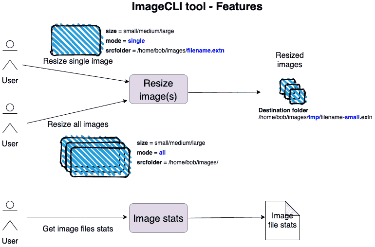

# *第四章*：管理环境、命令行和时间

在上一章中，我们探讨了 Rust 标准库的结构。我们还编写了一个基本模板引擎的部分代码，该引擎可以根据 HTML 模板和数据生成动态的 HTML 页面组件。从现在开始，我们将开始深入研究标准库的特定模块，这些模块按功能区域分组。

在本章中，我们将探讨与处理系统环境、命令行和时间相关函数相关的 Rust 标准库模块。本章的目标是使你能够更熟练地使用 *命令行参数*、*路径操作、环境变量* 和 *时间测量*。

了解这些有什么好处？

与 *命令行参数* 一起工作是一项编写任何接受命令行用户输入的程序所必需的技能。

想象一下，你会如何编写一个工具（例如 **find** 或 **grep**），它能够处理在文件夹和子文件夹中搜索文件和模式。这需要了解 *路径操作*，包括导航路径和读取及操作路径条目。

学习使用 *环境变量* 是将代码与配置分离的必要部分，这对于任何类型的程序来说都是一种良好的实践。

对于处理资源和时间戳的程序来说，学习如何与时间打交道是必要的。学习如何进行 *时间测量* 以记录事件之间的时间间隔，对于评估各种操作所需的时间是必要的。

在本章中，你将学习以下技能：

+   编写能够在 Linux、Unix 和 Windows 平台上发现和操作系统环境和文件系统的 Rust 程序

+   创建可以使用命令行参数接受配置参数和用户输入的程序

+   捕获事件之间的经过时间

这些是在 Rust 系统编程中需要的相关技能。我们将通过开发一个用于图像处理的命令行应用程序来以实际的方式学习这些主题。在这个过程中，我们将看到 Rust 标准库中 `path`、`time`、`env` 和 `fs` 模块的更多细节。

首先，让我们看看我们将要构建的内容。

想象一下，我们有一个批量图像缩放的工具——这个工具会遍历桌面或服务器上的文件系统目录，提取所有图像文件（例如，`.png` 和 `.jpg`），并将它们全部缩放到预定义的大小（例如，小、中或大）。

想象一下，这样的工具对于释放硬盘空间或上传图片到移动或网页应用中展示会有多有用。我们将构建这样的工具。请系好安全带。

我们将按照以下顺序介绍主题：

+   项目范围和设计概述

+   编写图像缩放库的代码

+   开发命令行应用程序

# 技术要求

本章代码的 GitHub 仓库可以在 [`github.com/PacktPublishing/Practical-System-Programming-for-Rust-Developers/tree/master/Chapter04`](https://github.com/PacktPublishing/Practical-System-Programming-for-Rust-Developers/tree/master/Chapter04) 找到。

# 项目范围和设计概述

在本节中，我们将首先定义我们将要构建的内容，并查看技术设计。然后，我们将编写一个用于图像处理的 Rust 库。最后，我们将构建一个命令行应用程序，该应用程序通过命令行接受用户输入，并使用我们构建的图像调整库执行用户指定的命令。

## 我们将构建什么？

在本小节中，我们将描述我们正在构建的工具的功能需求、技术需求和项目结构。

### 功能需求

我们将构建一个执行以下两个操作的命令行工具：

+   **图像调整大小**：将源文件夹中的一个或多个图像调整到指定的大小

+   **图像统计**：提供有关源文件夹中现有图像文件的某些统计信息

让我们给这个工具命名为 **ImageCLI**。*图 4.1* 展示了该工具的两个主要功能：



图 4.1 – ImageCLI 工具的功能

用户将能够使用此工具调整图像大小。用户可以要求调整单个图像或多个图像。支持的 *输入* 图像格式为 JPG 和 PNG。支持的 *输出* 图像格式为 PNG。该工具将接受以下三个命令行参数：

+   `size = small`，输出图像的宽度将为 *200* 像素；对于 `size = medium`，输出文件的宽度将为 *400* 像素；而对于 `size = large`，输出宽度将为 *800* 像素。例如，如果输入图像是一个总大小为 8 MB 的 JPG 文件，通过指定 `size = medium`，它可以被调整到大约 < 500 KB 的大小。

+   `mode = single` 用于调整单个文件，或 `mode = all` 用于调整指定文件夹中的所有图像文件。

+   选择 `mode = single` 或 `mode = all`。对于 `mode = single`，用户指定 `srcfolder` 的值为包含文件名的图像文件的完整路径。对于 `mode = all`，用户指定 `srcfolder` 的值为（包含图像文件的）文件夹的完整路径，不包含任何图像文件名。例如，如果使用 `mode = single` 和 `srcfolder = /user/bob/images/image1.png`，则工具将调整 `/user/bob/images` 文件夹中包含的 `image1.png` 单个图像文件的大小。如果使用 `mode = all` 和 `srcfolder = /user/bob/images`，则工具将调整 `/user/bob/images` 源文件夹中包含的所有图像文件的大小。

对于我们的图像统计功能，用户还可以指定包含图像文件的`srcfolder`，并获取该文件夹中图像文件的数量以及所有这些图像文件的总大小。例如，如果使用`srcfolder=/user/bob/images`，则`image stats`选项将给出类似以下的结果：**该文件夹包含 200 个图像文件，总大小为 2,234 MB**。

### 非功能性需求

以下是该项目的非功能性（技术）需求列表：

+   工具将被打包并作为二进制文件分发，它应在三个平台上运行：Linux、Unix 和 Windows。

+   我们应该能够测量图像缩放所需的时间。

+   用户输入用于指定命令行标志时必须**不区分大小写**，以便于使用。

+   工具必须能够向用户显示有意义的错误消息。

+   图像缩放的核心功能必须与**命令行界面**（**CLI**）分离。这样，我们可以灵活地使用核心功能与桌面图形界面或作为 Web 应用程序的后端的一部分。

+   该项目将组织为一个包含图像处理功能的**库**和一个提供 CLI 以读取和解析用户输入、提供错误消息并向用户显示输出消息的**二进制文件**。该二进制文件将利用库进行核心图像处理。

### 项目结构

让我们创建项目骨架，以便更好地可视化项目结构。使用`cargo`创建一个新的`lib`项目。让我们使用以下命令将 CLI 工具命名为`imagecli`：

```rs
cargo new --lib imagecli && cd imagecli
```

这是项目结构：


图 4.2 – Cargo 项目结构

按照以下结构设置项目：

1.  在`src`文件夹下，创建一个名为`imagix`的子文件夹（用于图像魔法！）来存放库代码。在`imagix`子文件夹下，创建四个文件：`mod.rs`，它是进入`imagix`库的入口点，`resize.rs`用于存放与图像缩放相关的代码，`stats.rs`用于存放图像文件统计的代码，`error.rs`用于包含自定义错误类型和错误处理代码。

1.  在`src`文件夹下，创建一个名为`imagecli.rs`的新文件，其中将包含 CLI 的代码。

在本小节中，我们看到了工具的功能需求以及期望的项目结构。在下一个小节中，我们将探讨工具的设计。

## 技术设计

在本小节中，我们将探讨工具的高级设计，主要关注图像处理功能。我们将在*开发命令行应用程序和测试*部分设计 CLI 的具体细节。

我们的项目包括我们的可重用`imagix`库，其中包含图像缩放和统计的核心功能，以及一个带有 CLI 的二进制可执行文件`imagecli`。这如图*图 4.3*所示：


图 4.3 – 带有可重用库的 CLI 工具

如果库设计得当，它可以在未来用于其他类型的客户端；例如，应用程序可以提供一个图形用户界面（而不是 CLI）作为桌面应用程序，甚至可以使其通过基于浏览器的 HTML 客户端应用程序访问。

在我们开始设计之前，让我们尝试可视化一些我们必须克服和解决的关键技术挑战：

+   `/tmp/` 子文件夹用于存储调整大小的图像？

    我们如何测量图像调整大小所需的时间？

+   **调整多个图像的大小**：

    我们如何遍历用户提供的源文件夹以识别所有图像文件并为每个条目调用图像调整大小函数？

+   **获取图像统计信息**：

    我们如何扫描用户提供的源文件夹，仅计算图像文件的数量，并获取该文件夹中所有图像文件的总大小？

+   `tmp` 子文件夹？

前面的点可以根据设计目的分为三个广泛的关注点类别：

+   图像调整大小逻辑

+   路径操作和目录迭代逻辑

+   测量图像调整大小所需的时间

图像处理本身是一个高度专业化的领域，本书的范围不包括涉及的技术和算法。鉴于图像处理领域的复杂性和范围，我们将使用第三方库来实现所需的算法，并为我们提供一个良好的 API 进行调用。

为了这个目的，我们将使用用 Rust 编写的开源 crate `image-rs/image`。crate 文档可以在以下链接找到：[`docs.rs/image/`](https://docs.rs/image/)

让我们看看如何使用`image` crate 设计`imagix`库。

`image` crate 功能齐全，具有许多图像处理功能。然而，我们将仅使用我们项目所需的一小部分功能。让我们回顾一下我们对图像处理的三个关键要求：能够*打开图像文件并将其加载到内存中*，能够*将图像调整到所需的大小*，以及能够*将调整大小的图像从内存写入磁盘上的文件*。`image-rs/image` crate 中的以下方法解决了我们的需求：

+   `image::open()`: 此函数在指定的路径打开一个图像。它自动从图像的文件扩展名检测图像的格式。图像数据从文件中读取，并转换为存储在内存中的 `DynamicImage` 类型。

+   `DynamicImage::thumbnail()`: 此函数将图像缩放到指定的大小（宽度和高度），并返回一个新的图像，同时保持宽高比。它使用快速整数算法，这是一种正弦变换技术。这是一个**内存操作**。

+   `DynamicImage::write_to()`: 这个函数将图像编码并写入实现了`std::io::write`特质的任何对象，在我们的情况下将是一个输出*文件句柄*。我们将使用这个方法将调整大小的图像写入文件。

这应该足以满足我们在这个项目中的图像处理需求。对于路径操作和时间测量的其他两个问题，我们将使用 Rust 标准库，这将在下一小节中描述。

## 使用 Rust 标准库

在开发图像调整大小工具时，我们将使用外部 crate 和 Rust 标准库。在前一节中，我们看到了我们计划如何使用`image`crate。

在本节中，我们将介绍我们将使用 Rust 标准库构建项目时将使用的功能。我们需要标准库的三个关键领域：

+   为了在目录中搜索、定位图像文件并创建新的子目录，我们需要*路径操作和目录迭代*功能。

+   我们需要从用户那里获取工具配置选项。我们将评估两种方法——通过*环境变量*获取这些信息，以及通过*命令行参数*获取这些信息。我们将选择其中一个选项。

+   我们希望*测量图像调整大小任务所需的时间*。

让我们详细看看这些领域的每个部分。

### 路径操作和目录迭代

对于路径操作，我们将使用 Rust 标准库中的`std::path`模块。对于目录迭代，我们将使用`std::fs`模块。

为什么我们需要操作路径？

调整大小图像的源图像文件存储在*源文件夹*中。调整大小图像文件的目标路径是`tmp`子文件夹（在*源文件夹*内）。在将每个调整大小的图像文件写入磁盘之前，我们必须构建文件存储的路径。例如，如果源文件的路径是`/user/bob/images/image1.jpg`，调整大小图像的目标路径将是`/user/bob/images/tmp/image1.jpg`。我们必须程序化地构建目标路径，然后调用`image`crate 上的方法以在目标路径上存储图像。

Rust 标准库通过两种数据类型支持路径操作功能：`Path`和`PathBuf`，它们都是`std::path`模块的一部分。有关如何使用标准库构建和操作`paths`的更多详细信息，请参阅侧边栏。

Rust 标准库的`std::path`模块

此模块提供了跨平台的路径操作函数。

路径通过遵循目录树来指向文件系统位置。Unix 系统中的一个路径示例是`/home/bob/images/`。Windows 操作系统上的一个路径示例可能是`c:\bob\images\image1.png`。

在`std::path`模块中，有两个常用的主要类型——`Path`和`PathBuf`。

对于解析路径及其组件（读取操作），使用 `Path`。在 Rust 术语中，它是一个 **路径切片**（类似于字符串切片，它是对字符串的引用）。

对于修改现有路径或构建新路径，使用 `PathBuf`。`PathBuf` 是一个 **拥有者**、**可变**的路径。

`Path` 用于路径的读取操作，而 `PathBuf` 用于路径的读取和写入操作。

下面是如何从一个字符串构造新路径的方法：

`let path_name = Path::new("/home/alice/foo.txt");`

在 `path_name` 中，`/home/alice` 代表父目录，`foo` 是文件名，`txt` 是文件扩展名。我们将使用 `Path` 类型上的 `file_stem()` 和 `extension()` 方法。

在 `PathBuf` 类型上的 `pop()` 和 `push()` 方法用于截断和向路径添加组件。

让我们使用以下代码创建一个新的 `PathBuf` 路径：

`let mut path_for_editing = PathBuf::from("/home/bob/file1.png")`

`path_for_editing.pop()` 将此路径截断到其父路径，即 `"/home/bob"`。

现在，`push()` 可以用来向 `PathBuf` 添加新组件。例如，从具有值 `"/home/bob"` 的 `PathBuf` 继续操作，`push("tmp")` 将 `tmp` 添加到 `"/home/bob"` 路径，并返回 `"/home/bob/tmp"`。

在我们的项目中，我们将使用 `pop()` 和 `push()` 方法来操作路径。

接下来，让我们看看如何执行我们项目所需的目录操作。

当用户指定 `mode=all` 时，我们的要求是遍历指定源文件夹中的所有文件，并过滤出图像文件进行处理。对于遍历目录路径，我们将使用 `std::fs` 模块中的 `read_dir()` 函数。

让我们看看如何使用此函数的示例：

```rs
use std::fs;

fn main() {
    let entries = fs::read_dir("/tmp").unwrap();
    for entry in entries {
        if let Ok(entry) = entry {
            println!("{:?}", entry.path());
        }
    }
}
```

以下是对前面代码的解释：

1.  `fs:read_dir()` 函数接收一个源文件夹路径，并返回 `std::fs::ReadDir`，它是一个遍历目录条目的迭代器。

1.  然后，我们使用 `for` 循环提取每个目录条目（它被 `Result` 类型包裹），并打印其值。

这是我们将用来获取目录条目并进行进一步处理的代码。

除了读取目录内容外，我们还需要检查源文件夹下是否存在 `tmp` 子文件夹，如果不存在则创建它。我们将使用 `std::fs` 模块中的 `create_dir()` 方法来创建一个新的子目录。

我们将在后续章节中看到 `std::fs` 模块的更多细节。

### 时间测量

对于测量时间，我们可以使用 `std::time` 模块。

Rust 标准库中的 `std::time` 模块包含几个与时间相关的函数，包括获取 *当前系统时间*、创建表示时间跨度的 *duration* 以及测量两个特定时间点之间的 *时间流逝*。以下提供了使用 `time` 模块的一些示例。

要获取当前系统时间，我们可以编写以下代码：

```rs
use std::time::SystemTime;
fn main() {
    let _now = SystemTime::now();
}
```

下面是如何从给定的时间点获取经过的时间的方法：

```rs
use std::thread::sleep;
use std::time::{Duration, Instant};
fn main() {
    let now = Instant::now();
    sleep(Duration::new(3, 0));
    println!("{:?}", now.elapsed().as_secs());
}
```

`Instant::now()` 用于指示要测量的时间的起点。从这一点到调用 `now.elapsed()` 的点之间的时间间隔代表操作所花费的时间。在这里，我们使用 `std::thread` 模块中的 `sleep()` 函数来模拟延迟。

### 处理环境变量

在本小节中，我们将学习如何使用 Rust 标准库以及第三方辅助包来存储环境变量中的值并在程序中使用它们：

1.  使用以下代码行创建一个新的项目：

    ```rs
    .env file (instead of setting them in the console), so let's add a popular crate for this purpose, called dotenv, in Cargo.toml:

    ```

    [dependencies]

    dotenv = "0.15.0"

    ```rs

    Depending on when you are reading this book, you may have a later version of this tool available, which you may choose to use.
    ```

1.  在 `main.rs` 中添加以下代码：

    ```rs
    use dotenv::dotenv;
    use std::env;
    fn main() {
    dotenv().ok();
    for (key, value) in env::vars() {
        println!("{}:{}", key, value);
    }
    }
    ```

    在前面的代码中，我们导入了 `std::env` 模块和 `dotenv::dotenv` 模块。

    以下语句从 `.env` 文件中加载环境变量：

    ```rs
    dotenv().ok();
    ```

    上一段代码块中的 `for` 循环会循环遍历环境变量并打印到控制台。`env:vars()` 返回一个迭代器，包含当前进程所有环境变量的键值对。

1.  为了测试这一点，让我们在项目根目录中创建一个新的 `.env` 文件，并添加以下条目：

    ```rs
    size=small
    mode=single
    srcfolder=/home/bob/images/image1.jpg 
    ```

1.  将 `srcfolder` 值替换为你的值。使用以下命令运行程序：

    ```rs
    .env file printed out, along with the others associated with the process.
    ```

1.  要访问任何特定环境变量的值，可以使用 `std::env::var()` 函数，它将变量的键作为参数。将以下语句添加到 `main()` 函数中，并查看打印出的 `size` 变量的值：

    ```rs
    println!("Value of size is {}",   
        env::var("size").unwrap());
    ```

我们已经看到了如何使用 *环境变量* 接受图像处理中的用户输入。让我们看看如何使用 *命令行参数* 接受用户输入。

### 处理命令行参数

在本小节中，我们将学习如何使用 Rust 标准库的 `std::env` 模块读取命令行参数：

1.  `std::env` 模块通过 `std::env::args()` 支持命令行参数。创建一个新的 Cargo 项目。将以下行添加到 `src/main.rs` 中的 `main()` 函数：

    ```rs
    use std::env;
    fn main() {
        for argument in env::args() {
            println!("{}", argument);
        }
    }
    ```

1.  使用 `cargo run small all /tmp` 执行代码。

1.  将传递给程序的三个参数打印到控制台。要通过索引访问单个参数，请将以下代码添加到 `main.rs`：

    ```rs
    use std::env;
    fn main() {
        let args: Vec<String> = env::args().collect();
        let size = &args[1];
        let mode = &args[2];
        let source_folder = &args[3];
        println!(
            "Size:{},mode:{},source folder: {}",
            size, mode, source_folder
        );
    }
    ```

1.  使用 `cargo run small all /tmp` 运行程序。

`size`、`mode` 和 `source_folder` 的单个值将按以下方式打印出来：

```rs
Size:small,mode:all,source folder: /tmp
```

在我们看到的两种方法中——即使用 *环境变量* 和 *命令行参数*——后者更适合接受最终用户的输入，而环境变量方法更适合开发者配置工具。

然而，为了提供用户友好的界面，`std::env::args` 提供的裸骨功能是不够的。我们将使用名为 **StructOpt** 的第三方包来改善与 CLI 的用户交互。

这完成了对 Rust 标准库中路径操作、时间测量和读取环境和命令行参数模块的深入研究。

以下是关于 `imagix` 库的设计方法总结：

+   `image-rs/image` 库。

    我们如何创建一个 `/tmp/` 子文件夹来存储缩放后的图像？

    我们将使用 `std::fs::create_dir()` 方法。

+   `std::fs::read_dir()` 方法。

    我们如何操作路径，以便输出文件存储在 `tmp` 子文件夹中？

    我们将使用 `std::path::Path` 和 `std::path::PathBuf` 类型。

+   `std::path::Path` 类型以及 `std::fs::read_dir()` 方法。

+   `std::time::Duration` 和 `std::time::Instant` 模块。

+   `StructOpt` 库。

通过这些，我们得出本节关于 `imagix` 库的项目范围和设计的结论。我们现在可以开始编写下一节中图像处理库的代码了。

# 编写 imagix 库

在本节中，我们将编写图像缩放和图像统计功能的代码。让我们首先看看代码结构。

`imagix` 库的模块结构总结在 *图 4.4* 中：


图 4.4 – imagix 库的模块

`imagix` 库将包括两个模块，分别是 `resize.rs` 和 `stats.rs`。有两个 `enum`，`SizeOption` 和 `Mode`，分别用于表示 *大小选项* 和 *模式* 的变体。用户将指定 `SizeOption` `enum` 的一个变体来指示所需的输出图像大小，以及指定 `Mode` `enum` 的一个变体来指示是否需要缩放一个或多个图像。还有一个 `struct Elapsed` 用于捕获图像缩放操作的耗时。

`resize` 模块有一个 `process_resize_request()` 公共函数，它是 `imagix` 库中图像缩放的主要入口点。

`stats` 模块有一个 `get_stats()` 公共函数。

项目整体代码组织的概述显示在 *图 4.5* 中：


图 4.5 – 代码组织

*图 4.5* 展示了以下内容：

+   在 `Cargo.toml` 文件中需要的配置和依赖项

+   Cargo 项目的代码树结构

+   `imagix` 库的源文件列表以及关键函数列表

+   `imagecli.rs` 文件，它代表了 `imagix` 库的命令行包装，以及我们工具中的代码执行入口点

让我们先在 `imagecli` 项目的根目录中的 `Cargo.toml` 中添加两个外部库：

```rs
[dependencies]
image = "0.23.12"
structopt = "0.3.20"
```

在本节中，我们将遍历以下方法的代码片段：

+   `get_image_files()`，演示路径导航

+   `resize_image()`，它包含使用图像库进行图像缩放的核心逻辑，以及时间测量

+   `get_stats()`，它返回文件夹中图像文件的总数和总大小

+   自定义错误处理方法

代码的其余部分是标准的 Rust 代码（不特定于本章关注的主题），可以在本章的代码仓库中找到。

### 遍历目录条目

在本小节中，让我们审查`get_image_files()`方法的代码。这是检索源文件夹中包含的图片文件列表的方法。

此方法的逻辑描述如下：

1.  我们首先检索源文件夹中的目录条目并将它们收集到一个*向量*中。

1.  然后，我们遍历向量中的条目并筛选出仅包含图片文件。请注意，在这个项目中，我们只关注`PNG`和`JPG`文件，但也可以扩展到其他类型的图片文件。

1.  此方法从该方法返回一个图片文件列表。

代码列表如下所示：

src/imagix/resize.rs

```rs
pub fn get_image_files(src_folder: PathBuf) -> 
    Result<Vec<PathBuf>, ImagixError> {
    let entries = fs::read_dir(src_folder)
        .map_err(|e| ImagixError::UserInputError("Invalid 
            source folder".to_string()))?
        .map(|res| res.map(|e| e.path()))
        .collect::<Result<Vec<_>, io::Error>>()?
        .into_iter()
        .filter(|r| {
            r.extension() == Some("JPG".as_ref())
                || r.extension() == Some("jpg".as_ref())
                || r.extension() == Some("PNG".as_ref())
                || r.extension() == Some("png".as_ref())
        })
        .collect();
    Ok(entries)
}
```

代码使用`read_dir()`方法遍历目录条目并将结果收集到一个`Vector`中。然后，将`Vector`转换为迭代器，并筛选出仅包含图片文件的条目。这为我们提供了用于调整大小的图片文件集。在下一小节中，我们将审查执行实际图片调整大小的代码。

### 调整图片大小

在本小节中，我们将审查`resize_image()`方法的代码。此方法执行图片的调整大小。

此方法的逻辑如下：

1.  此方法接受一个包含完整源文件夹路径的源图片文件名，将其调整大小为`.png`文件，并将调整大小的文件存储在源文件夹下的`/tmp`子文件夹中。

1.  首先，从完整路径中提取源文件名。文件扩展名更改为`.png`。这是因为我们的工具将仅支持`.png`格式的输出文件。作为一个练习，你可以添加对其他图像格式类型的支持。

1.  然后使用`/tmp`前缀构建目标文件路径，因为调整大小的图片需要存储在源文件夹下的`tmp`子文件夹中。为了实现这一点，我们首先需要检查`tmp`文件夹是否已经存在。如果不存在，则需要创建它。构建带有`tmp`子文件夹的路径和创建`tmp`子文件夹的逻辑在之前的代码列表中已展示。

1.  最后，我们需要调整图片的大小。为此，打开源文件，使用必要的参数调用调整大小函数，并将调整大小的图片写入输出文件。

1.  使用`Instant::now()`和`Elapsed::from()`函数计算图片调整大小所需的时间。

代码列表如下所示。为了解释说明，代码列表已被拆分为多个片段。

列出的代码接受三个输入参数——大小、源文件夹和一个类型为`PathBuf`的条目（它可以引用图片文件的完整路径）。文件扩展名更改为`.png`，因为这是工具支持的输出格式：

```rs
fn resize_image(size: u32, src_folder: &mut PathBuf) -> 
    Result<(), ImagixError> {
    // Construct destination filename with .png extension
    let new_file_name = src_folder
        .file_stem()
        .unwrap()
        .to_str()
        .ok_or(std::io::ErrorKind::InvalidInput)
        .map(|f| format!("{}.png", f));
```

此代码片段将后缀`/tmp`追加到文件路径条目中，以创建目标文件夹路径。请注意，由于标准库的限制，首先将文件名构造为`tmp.png`，随后将其更改为反映最终调整大小的图片文件名：

```rs
// Construct path to destination folder i.e. create /tmp 
// under source folder if not exists
let mut dest_folder = src_folder.clone();
dest_folder.pop();
dest_folder.push("tmp/");
if !dest_folder.exists() {
    fs::create_dir(&dest_folder)?;
}
dest_folder.pop();
dest_folder.push("tmp/tmp.png");
dest_folder.set_file_name(new_file_name?.as_str());
```

这里的代码打开图像文件并将图像数据加载到内存中。在源文件夹下创建一个`/tmp`子文件夹。然后，将图像调整大小并写入目标文件夹的输出文件。记录并打印调整大小操作所需的时间：

```rs
let timer = Instant::now();
let img = image::open(&src_folder)?;
let scaled = img.thumbnail(size, size);
let mut output = fs::File::create(&dest_folder)?;
scaled.write_to(&mut output, ImageFormat::Png)?;
println!(
    "Thumbnailed file: {:?} to size {}x{} in {}. Output 
     file   
     in {:?}", 
     src_folder, 
     size,
     size,
     Elapsed::from(&timer), 
     dest_folder
    );
    Ok(())
}
```

我们现在已经看到了调整图像的代码。接下来，我们将查看生成图像统计信息的代码。

### 图像统计

在前面的子节中，我们看到了调整图像的代码。在本节中，我们将看到生成图像统计信息的逻辑。此方法将计算指定源文件夹中的图像文件数量，并测量所有图像文件的总文件大小。

我们将要使用的`get_stats()`方法的逻辑描述如下：

1.  `get_stats()`方法接受一个源文件夹作为其输入参数，并返回两个值：文件夹中的图像文件数量，以及文件夹中所有图像文件的总聚合大小。

1.  通过调用`get_image_files()`方法获取源文件夹中的图像文件列表。

1.  `std::path`模块中的`metadata()`函数允许我们查询文件或目录的元数据信息。在我们的代码中，当我们遍历目录条目时，我们将所有文件的尺寸汇总到一个变量`sum`中。`sum`变量与图像文件条目的计数一起从函数返回。

代码列表如下所示：

src/imagix/stats.rs

```rs
pub fn get_stats(src_folder: PathBuf) -> Result<(usize, 
    f64), ImagixError> {
    let image_files = get_image_files
        (src_folder.to_path_buf())?;
    let size = image_files
        .iter()
        .map(move |f| f.metadata().unwrap().len())
        .sum::<u64>();
    Ok((image_files.len(), (size / 1000000) as f64))
}
```

我们已经涵盖了图像处理功能的代码。现在，我们将介绍项目中自定义错误处理的细节。

### 错误处理

现在让我们看看我们的错误处理设计。

作为我们项目的一部分，我们可能需要处理许多故障条件。其中一些如下所示：

+   用户提供的源文件夹可能无效。

+   指定的文件可能不在源文件夹中。

+   我们程序可能没有权限读取和写入文件。

+   用户输入的大小或模式可能不正确。

+   在图像调整大小过程中可能会出现错误（例如，文件损坏）。

+   可能存在其他类型的内部处理错误。

让我们定义一个自定义错误类型，以统一方式处理所有这些不同类型的错误，并将错误作为库用户输出：

src/imagix/error.rs

```rs
pub enum ImagixError {
    FileIOError(String),
    UserInputError(String),
    ImageResizingError(String),
    FormatError(String),
}
```

错误的名称大多一目了然。`FormatError`是指在转换或打印参数值时遇到的任何错误。定义此自定义错误类型的目的是将处理过程中可能遇到的多种类型的错误，如用户输入错误、无法读取目录或写入文件、图像处理错误等，转换为我们的自定义错误类型。

仅定义一个自定义错误类型是不够的。我们还需要确保在程序运行过程中发生错误时，这些错误被转换为自定义错误类型。例如，读取图像文件时出现的错误会触发`std::fs`模块中定义的错误。这个错误应该被捕获并转换为我们的自定义错误类型。这样，无论文件操作或错误处理中是否存在错误，程序都会统一传播相同的自定义错误类型，以便由前端界面（在这个项目中，是命令行）处理用户。

对于将各种类型的错误转换为`ImagixError`，我们将实现`From`特性和`Display`特性，以便错误可以被打印到控制台。

在项目模块中的每个方法中，在失败点，你会注意到会抛出`ImagixError`并传播回调用函数。源代码可以在本章节的 Packt 代码仓库的源文件夹中找到。

这标志着代码中错误处理的子节结束。

这也标志着本节关于`imagix`库编码的结束。我们只走过了关键代码片段，因为在本章中直接打印整个代码列表并不实用。我敦促读者阅读整个源代码，以了解各种功能是如何转换为惯用的 Rust 代码的。

在下一节中，我们将构建一个命令行应用程序，它封装了这个库并提供用户界面。

# 开发命令行应用程序并进行测试

在上一节中，我们构建了图像调整大小的库。在本节中，我们将回顾主命令行应用程序的设计和关键代码部分。

让我们从一些自动化的单元测试开始，以测试`resize.rs`中的图像调整大小功能：这样我们可以确认图像调整大小库可以独立于任何调用函数工作。

在以下代码中展示了两个测试用例——一个用于调整单个图像的大小，另一个用于调整多个图像的大小。你可以将代码中的源文件夹和文件名替换为你自己的：

src/imagix/resize.rs

```rs
#[cfg(test)]
mod tests {
    use super::*;
    #[test]
    fn test_single_image_resize() {
        let mut path = PathBuf::from("/tmp/images/
            image1.jpg");
        let destination_path = PathBuf::from(
            "/tmp/images/tmp/image1.png");
        match process_resize_request(SizeOption::Small, 
            Mode::Single, &mut path) {
            Ok(_) => println!("Successful resize of single      
                image"),
            Err(e) => println!("Error in single image: 
                {:?}", e),
        }
        assert_eq!(true, destination_path.exists());
    }
    #[test]
    fn test_multiple_image_resize() {
        let mut path = PathBuf::from("/tmp/images/");
        let _res = process_resize_request(
            SizeOption::Small, Mode::All, &mut path);
        let destination_path1 = PathBuf::from(
            "/tmp/images/tmp/image1.png");
        let destination_path2 = PathBuf::from(
            "/tmp/images/tmp/image2.png");
        assert_eq!(true, destination_path1.exists());
        assert_eq!(true, destination_path2.exists());
    }
}
```

将`image1.jpg`和`image2.jpg`文件放在`/tmp/images`中，并使用以下命令执行测试：

```rs
cargo test 
```

你可以看到测试成功通过。你还可以检查调整大小的图像。

作为练习，你也可以为图像统计功能添加测试用例。

现在我们可以得出结论，`imagix`库按预期工作。现在让我们继续设计命令行应用程序。

我们首先来看一下命令行界面的要求。

## 设计命令行界面

在本小节中，我们将探讨 CLI 的设计。设计意味着确定用户将使用的 CLI 的结构。CLI 应该对最终用户来说易于使用。CLI 还必须在其执行不同类型的操作时具有一定的灵活性。

`imagecli` CLI 将使用类似于 `git` 的命令-子命令模型。

CLI 命令结构如图 *4.6* 所示：


图 4.6 – CLI 命令设计

这里有一些用户可以指定的带有参数的命令示例：

+   对于调整图像，命令是 `cargo run –-release resize`，带有三个参数。

+   对于图像统计，命令是 `cargo run –-release stats`，带有一个参数。

+   对于调整单个图像，命令是 `cargo run --release resize --size small --mode single --srcfolder <图像文件路径/文件名.extn>`。

+   对于调整多个图像的大小，我们使用 `cargo run --release resize --size medium --mode all --srcfolder <包含图像的文件夹路径>` 命令。

+   对于图像统计，使用 `cargo run --release stats --srcfolder <包含图像的文件夹路径>` 命令。

`imagecli` 的 `main()` 函数解析命令行参数，通过向用户显示适当的错误消息来处理用户和加工错误，并调用 `imagix` 库中的相应函数。

让我们快速回顾一下。为了调整图像大小，我们需要从用户那里了解以下信息：

+   模式（单文件或多文件）

+   图像文件的大小输出（小/中/大）

+   存放图像文件（或文件）的源文件夹

在本节中，我们为工具设计了命令行界面（CLI）。在前几节中，我们构建了 `imagix` 库来调整图像大小。现在，我们将继续进行项目的最后一部分，即开发主要的命令行二进制应用程序，该应用程序将所有组件连接起来，并接受来自命令行的用户输入。

## 使用 structopt 编码命令行二进制

在前一节中，我们为命令行工具设计了界面。在本节中，我们将看到 `main()` 函数的代码，该函数接受来自命令行的用户输入并调用 `imagix` 库。这个 `main()` 函数将被编译并构建成命令行二进制工具。用户将调用这个可执行文件来调整图像并提供必要的命令行参数。

`main()` 函数将位于 `src/imagecli.rs` 中，因为我们希望命令行工具的二进制名称为 `imagecli`。

现在让我们回顾命令行应用程序的代码片段。`main()` 函数位于 `src/imagecli.rs` 文件中：

1.  我们将从导入部分开始。注意我们编写的 `imagix` 库的导入，以及用于命令行参数解析的 `structOpt`：

    ```rs
    mod imagix;
    use ::imagix::error::ImagixError;
    use ::imagix::resize::{process_resize_request, Mode,  
        SizeOption};
    use ::imagix::stats::get_stats;
    use std::path::PathBuf;
    use std::str::FromStr;
    use structopt::StructOpt;
    // Define commandline arguments in a struct
    ```

1.  我们现在将看到工具的命令行参数的定义。为此，我们将使用`structopt`语法。请参阅[`docs.rs/structopt`](https://docs.rs/structopt)中的文档。基本上，我们定义了一个名为`Commandline`的`enum`，并定义了两个子命令，`Resize`和`Stats`。`Resize`接受三个参数：`size`、`mode`和`srcfolder`（源文件夹）。`Stats`接受一个参数：`srcfolder`：

    ```rs
    #[derive(StructOpt, Debug)]
    #[structopt(
        name = "resize",
        about = "This is a tool for image resizing and 
            stats",
        help = "Specify subcommand resize or stats. For 
            help, type imagecli resize --help or 
            imagecli stats --help"
    )]
    enum Commandline {
        #[structopt(help = "
              Specify size(small/medium/large),
              mode(single/all) and srcfolder")]
        Resize {
            #[structopt(long)]
            size: SizeOption,
            #[structopt(long)]
            mode: Mode,
            #[structopt(long, parse(from_os_str))]
            srcfolder: PathBuf,
        },
        #[structopt(help = "Specify srcfolder")]
        Stats {
            #[structopt(long, parse(from_os_str))]
            srcfolder: PathBuf,
        },
    }
    ```

1.  我们现在可以回顾`main()`函数的代码。在这里，我们基本上接受命令行输入（由`StructOpt`验证）并调用我们的`imagix`库中的合适方法。如果用户指定了`Resize`命令，将调用`imagix`库中的`process_resize_request()`方法。如果用户指定了`Stats`命令，将调用`imagix`库中的`get_stats()`方法。任何错误都通过合适的消息来处理：

    ```rs
    fn main() {
        let args: Commandline = Commandline::from_args();
        match args {
            Commandline::Resize {
                size,
                mode,
                mut srcfolder,
            } => {
                match process_resize_request(size, mode, 
                    &mut src_folder) {
                    Ok(_) => println!("Image resized    
                        successfully"),
                    Err(e) => match e {
                        ImagixError::FileIOError(e) => 
                            println!("{}", e),
                        ImagixError::UserInputError(e) => 
                            println!("{}", e),
                        ImagixError::ImageResizingError(e)     
                            => println!("{}", e),
                        _ => println!("Error in 
                            processing"),
                    },
                };
            }
            Commandline::Stats { srcfolder } => match 
                get_stats(srcfolder) {
                Ok((count, size)) => println!(
                    "Found {:?} image files with aggregate 
                    size of {:?} MB",
                    count, size
                ),
                Err(e) => match e {
                    ImagixError::FileIOError(e) => 
                        println!("{}", e),
                    ImagixError::UserInputError(e) =>    
                        println!("{}", e),
                    _ => println!("Error in processing"),
                },
            },
        }
    }
    ```

1.  使用以下命令构建应用程序：

    ```rs
     cargo build --release 
    ```

使用发布构建的原因是在调试和发布构建之间调整图像大小存在相当大的时间差异（后者要快得多）。

您可以在终端执行并测试以下场景。请确保在`--srcfolder`标志指定的文件夹中放置一个或多个`.png`或`.jpg`文件：

+   **调整单个图像大小**：

    ```rs
    cargo run --release resize --size medium --mode single --srcfolder <path-to-image-file>
    ```

+   **调整多个文件大小**：

    ```rs
    cargo run --release resize --size small --mode all --srcfolder <path-to-image-file>
    ```

+   **生成图像统计**：

    ```rs
    cargo run --release  stats --srcfolder <path-to-image-folder>
    ```

在本节中，我们构建了一个从命令行界面（CLI）工作的图像调整大小工具。作为一个练习，您可以尝试添加额外的功能，包括添加对更多图像格式的支持、更改输出文件的大小，甚至提供加密生成的图像文件以提供额外安全性的选项。

# 摘要

在本章中，我们学习了如何编写 Rust 程序，这些程序可以以跨平台的方式发现和操作系统环境、目录结构和文件系统元数据，使用`std::env`、`std::path`和`std::fs`模块。我们探讨了如何创建可以使用命令行参数或环境变量来接受配置参数和用户输入的程序。我们看到了两个第三方 crate 的使用：`StructOpt`crate 来改进工具的用户界面，以及`image-rs/image`来进行图像调整大小。

我们还学习了如何使用`std:time`模块来测量特定处理任务所需的时间。我们定义了一个自定义错误类型以统一库中的错误处理。在本章中，我们还介绍了文件处理操作。

在下一章中，我们将详细探讨使用标准库进行高级内存管理。
