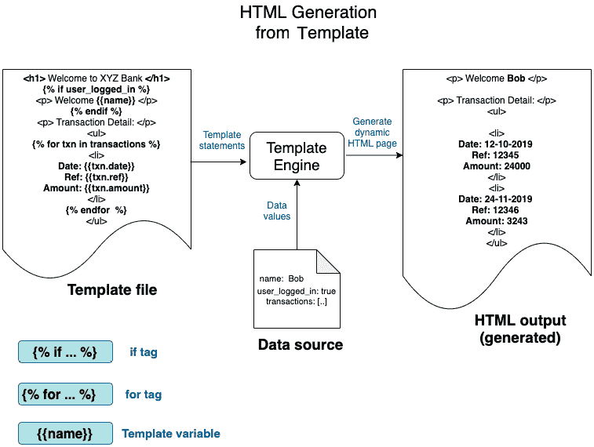

# 第五章：*第五章*：Rust 中的内存管理

在*第一部分*，*Rust 系统编程入门*中，我们介绍了 Cargo（Rust 开发工具包），Rust 语言的概述，Rust 标准库的介绍，以及用于管理进程环境、命令行和时间相关函数的标准库模块。虽然*第一部分*，*Rust 系统编程入门*的重点是提供对系统编程领域的概述和 Rust 系统编程的基础，但*第二部分*，*在 Rust 中管理和控制系统资源*，将深入探讨如何在 Rust 中管理和控制系统资源，包括内存、文件、终端、进程和线程。

我们现在进入本书的*第二部分*，*在 Rust 中管理和控制系统资源*。*图 5.1*提供了本节的背景信息：


图 5.1 – 管理系统资源

在本章中，我们将重点关注内存管理。以下是本章的关键学习成果：

+   操作系统（OS）内存管理的基础

+   理解 Rust 程序的内存布局

+   Rust 内存管理生命周期

+   向模板引擎添加动态数据结构

我们将本章以概述（或对已经熟悉该主题的人进行复习）开始，概述操作系统中的内存管理一般原则，包括内存管理生命周期和进程在内存中的布局。然后，我们将介绍正在运行的 Rust 程序的内存布局。这包括 Rust 程序在内存中的布局以及堆、栈和静态数据段的特点。在第三部分，我们将学习 Rust 内存管理生命周期，它与其他编程语言的不同之处，以及如何在 Rust 程序中分配、操作和释放内存。最后，我们将增强我们在*第三章*，*Rust 标准库和系统编程关键 crate 介绍*中开始构建的模板引擎，添加一个动态数据结构。

# 技术要求

Rustup 和 Cargo 必须在本地开发环境中安装。

本章的完整代码可以在[`github.com/PacktPublishing/Practical-System-Programming-for-Rust-Developers/tree/master/Chapter05`](https://github.com/PacktPublishing/Practical-System-Programming-for-Rust-Developers/tree/master/Chapter05)找到。

# 操作系统（OS）内存管理的基础

在本节中，我们将深入探讨现代操作系统中的内存管理基础。那些已经熟悉这个主题的人可以快速浏览本节以进行复习。

内存是运行程序（进程）可用的最基本和最重要的资源之一。内存管理涉及处理进程使用的内存的分配、使用、操作、所有权转移和最终释放。没有内存管理，无法执行程序。内存管理由内核、程序指令、内存分配器和垃圾收集器等组件的组合执行，但具体机制因编程语言和操作系统而异。

在本节中，我们将探讨内存管理生命周期，然后了解操作系统如何为进程布局内存的细节。

## 内存管理生命周期

在本节中，我们将介绍与内存管理相关的不同活动：

1.  当一个可执行二进制文件运行时，内存管理生命周期*开始*。操作系统为程序分配一个虚拟内存地址空间，并根据二进制可执行文件中的指令初始化内存的各个部分。

1.  当程序处理来自 I/O 设备（如文件、网络和标准输入（来自命令行））的各种输入时，内存管理活动*继续*。

1.  当程序终止（或由于错误异常终止程序）时，内存管理生命周期*结束*。

*图 5.2* 展示了一个典型的内存管理周期：


图 5.2 – 内存生命周期

内存管理本质上涉及四个组件——**分配**、**使用和操作**、**释放/释放**和**跟踪使用**：

+   **内存分配**：这是在低级编程语言中由程序员显式完成的，但在高级语言中是透明执行的。分配的内存可以是*固定大小*（例如，数据类型的大小在编译时确定，如整数、布尔值或固定大小的数组）或*动态大小*（在运行时动态增加、减少或重新定位内存，例如可调整大小的数组）。

+   **内存使用和操作**：以下是在程序中执行的典型活动：

    1. 定义特定类型的命名内存区域（例如，声明一个类型为整数的新的变量 *x*）

    2. 初始化一个变量

    3. 修改变量的值

    4. 将值复制或移动到另一个变量

    5. 创建和操作值引用

+   **内存释放**：在低级语言中由程序员显式执行，但在 Java、Python、JavaScript 和 Ruby 等高级语言中，通过名为**垃圾收集器**的组件自动处理。

+   **内存跟踪**：这是在内核级别进行的。程序通过*系统调用*来分配和释放内存。系统调用由*内核*执行，它跟踪每个进程的内存分配和释放。

+   **交换/分页**：这也由**内核**完成。现代操作系统虚拟化物理内存资源。进程不会直接与实际的物理内存地址交互。内核为每个进程分配虚拟地址空间。系统中所有进程分配的虚拟地址空间总和可能超过系统中可用的物理内存量，但进程并不知道（或不在乎）这一点。操作系统通过虚拟内存管理来管理这一点，确保进程彼此隔离，并且程序在其生命周期内可以访问已提交的内存。交换和分页是**虚拟内存管理**中的技术。

    分页和交换

    操作系统如何将虚拟内存地址空间映射到物理内存？为了实现这一点，分配给程序的虚拟地址空间被分成固定大小的页面（例如 4 KB 或 8 KB 块）。**页面**是虚拟内存中固定长度的连续块。因此，分配给程序的虚拟内存被分成多个固定长度的页面。物理 RAM 上的对应单位是**页面帧**，它是一个固定长度的 RAM 块。多个页面帧加起来构成了系统上的总物理内存。

    在任何时刻，程序的一些**虚拟页面**需要存在于**物理页面帧**中。其余的存储在磁盘上的**交换区**中，这是磁盘上预留的区域。内核维护一个页面表来跟踪程序分配的虚拟内存空间中每个页面的位置。当程序尝试访问页面上的内存位置，如果页面不在页面帧上，页面就在磁盘上，然后被交换到主内存中。同样，未使用的页面在 RAM 中也会被交换回磁盘（二级存储）以腾出空间供活动进程使用。这个过程称为**分页**。

    如果在进程级别（而不是页面级别）应用相同的技巧，则称为**交换**，其中将一个进程的页面从内存交换到磁盘，为另一个进程加载到内存腾出空间。

    这方面的内存管理涉及将物理 RAM 映射到虚拟地址空间，被称为**虚拟内存管理**。这确保了进程在需要时可以访问足够的内存，并且彼此以及与内核隔离。这样，程序就不能意外（或故意）写入内核或另一个进程的内存空间，从而防止内存损坏、未定义行为和安全问题。

我们已经了解了进程的内存管理生命周期。现在让我们了解操作系统如何布局程序在内存中的情况。

## 进程内存布局

我们现在将查看内核为单个进程分配的虚拟地址空间的结构。*图 5.3*显示了**Linux**上进程的内存布局，但类似的机制也存在于**Unix**和**Windows**操作系统变体中：


图 5.3 – 进程内存布局

**进程**是一个正在运行的程序。当程序启动时，操作系统将其加载到内存中，给它访问命令行参数和环境变量的权限，并开始执行程序指令。

操作系统为进程分配一定量的内存。这种分配的内存有一个与之相关的结构，称为进程的**内存布局**。进程的内存布局包含几个**内存区域**（也称为**段**），这些区域不过是*内存页*（在上一小节中已描述）的块。这些段在*图 5.3*中显示，并将在下面进行描述。

*图 5.3*中标记为**A**的部分显示，分配给进程的总虚拟内存空间被分割成**内核空间**和**用户空间**。内核空间是内存区域，其中加载了内核的一部分，帮助程序管理和与硬件资源通信。这包括内核代码、内核自己的内存区域和标记为**保留**的空间。在本章中，我们将仅关注**用户空间**，因为这是程序实际使用的区域。虚拟内存的内核空间对程序不可访问。

用户空间被分割成几个内存段，下面将进行描述：

+   **文本段**包含程序的代码和其他只读数据，如*字符串字面量*和*常量参数*。这部分直接从程序二进制（可执行文件或库）加载。

+   **数据段**存储初始化为非零值的全局和静态变量。

+   **BSS 段**包含未初始化的变量。

+   **堆**用于动态内存分配。随着在堆上分配内存，进程的地址空间继续增长。堆向上增长，这意味着新项目被添加到比前一项地址更高的地址。

+   **栈**用于*局部变量*，也用于*函数参数*（在某些平台架构中）。栈向下增长，这意味着较早放入栈中的项目占据较低的地址空间。

    小贴士

    注意，栈和堆在进程地址空间的相反端分配。随着*栈大小*的增加，它向下增长，而随着*堆大小*的增加，它向上增长。如果它们相遇，将发生栈溢出错误或堆上的内存分配调用将失败。

+   在栈和堆之间，还有一个区域，用于存放任何**共享内存**（跨进程共享的内存）、程序使用的**共享库**或**内存映射**区域（反映磁盘上文件的内存区域）。

+   在栈的上方，有一个区域用于存储传递给程序的**命令行参数**和为进程设置的**环境变量**。

内存管理是一个复杂的话题，为了使讨论集中于 Rust 中的内存管理，省略了很多细节。然而，前面描述的虚拟内存管理和虚拟内存地址的基本原理对于理解下一节中 Rust 如何执行内存管理是至关重要的。

# 理解 Rust 程序的内存布局

在上一节中，我们讨论了现代操作系统中的内存管理基础。在本节中，我们将讨论运行中的 Rust 程序是如何由操作系统在内存中布局的，以及 Rust 程序使用虚拟内存不同部分的特点。

## Rust 程序内存布局

为了理解 Rust 如何实现低内存占用、内存安全和性能的结合，有必要了解 Rust 程序在内存中的布局以及它们如何被程序控制。

低内存占用依赖于内存分配、值复制和释放的高效管理。内存安全涉及确保对存储在内存中的值的访问是安全的。性能取决于理解将值存储在栈、堆或静态数据段中的影响。Rust 的亮点在于，所有这些任务并非完全留给程序员，如 C/C++中那样。Rust 编译器和它的所有权系统做了很多繁重的工作，防止了整个类别的内存错误。现在让我们详细探讨这个话题。

Rust 程序的内存布局如图 5.4 所示：


图 5.4 – Rust 程序内存布局

让我们通过这张图来了解 Rust 程序的内存布局：

+   (`cargo build`)被内核读入系统内存并执行时，它成为一个进程。操作系统为每个进程分配其自己的私有用户空间，以确保不同的 Rust 进程不会意外地相互干扰。

+   **文本段**: Rust 程序的可执行指令放置于此。此部分位于栈和堆之下，以防止任何溢出覆盖它。此段是*只读*的，因此其内容不会意外被覆盖。然而，多个进程可以*共享*文本段。让我们以一个用 Rust 编写的文本编辑器为例，它在*进程 1*中运行。如果需要执行编辑器的第二个副本，那么系统将创建一个新的进程，并为其分配自己的私有内存空间（让我们称其为*进程 2*），但不会重新加载编辑器的程序指令。相反，它将创建对*进程 1*的文本指令的引用。但其余的内存（数据、栈等）不会在进程间共享。

+   `Rc`（单线程引用计数指针）和`Arc`（线程安全引用计数指针）。

    Rust 中具有*动态大小*的类型示例有`Vectors`、`Strings`和其他`集合`类型，这些都是在堆上分配的。

    原始类型，如整数，默认情况下是栈分配的，但程序员可以使用`Box<T>`类型（例如，`let y =3`在栈上为整数`y`分配内存并初始化为`3`，而`let x: Box<i32> = Box::new(3)`在堆上为整数`x`分配内存并初始化为`3`）在堆上分配内存。

+   **栈段**: 栈是进程内存中存储*临时（局部）变量*、*函数参数*和指令的*返回地址*（在函数调用结束后执行）的区域。默认情况下，Rust 中的所有内存分配都在栈上。每当调用一个函数时，其变量就会在栈上分配内存。内存分配在连续的内存位置中逐个发生，形成一个*栈数据结构*。

总结一下，以下是运行中的 Rust 程序分配的虚拟内存的视图：

+   Rust 程序的*代码指令*放入*文本段*区域。

+   *原始数据类型*在*栈*上分配。

+   静态变量位于*数据段*。

+   *堆分配的值*（在编译时不知道大小的值，如向量字符串）存储在数据段的*堆区域*。

+   *未初始化的变量*位于*BSS 段*。

在这些中，Rust 程序员对*文本*段和*BSS*段的控制不多，并且主要与内存的*栈*、*堆*和*静态*区域工作。在下文中，我们将深入探讨这三个内存区域的特点。

## 栈、堆和静态内存的特性

我们已经看到了在 Rust 程序中声明的不同类型的变量是如何分配到进程空间的不同区域的。在讨论的三个内存段——**文本**、**数据**和**栈**中，文本区域不受 Rust 程序员的控制，但程序员有灵活性来决定是否将一个值（即分配内存）放在栈上、堆上或作为静态变量。然而，这个决定有很强的含义，因为栈、静态变量和堆的管理方式截然不同，它们的生命周期也不同。理解这些权衡是编写任何 Rust 程序的重要部分。让我们更仔细地看看它们。

*表 5.1* 总结了栈分配、堆分配和静态段内存的特点。回想一下 *图 5.4*，栈分配的内存属于 *栈段*，而堆和静态变量属于虚拟内存地址空间的 *数据段*：


表 5.1 – 栈、堆和静态内存区域的特点

理解值的内存位置是否重要？

对于那些使用过其他高级编程语言的人来说，理解一个变量是存储在栈上、堆上还是静态数据段中，实际上并不是必需的，因为语言的编译器、运行时和垃圾回收器已经抽象了这些细节，使得程序员的工作变得简单。

但在 Rust 中，尤其是在编写面向系统的程序时，了解内存布局和内存模型对于选择适合和高效的数据结构来设计系统的各个部分是必要的。在很多情况下，这种知识甚至对于使 Rust 程序编译成功也是必要的！

在本节中，我们介绍了 Rust 程序的内存布局，并了解了栈和数据段内存区域的特点。在下一节中，我们将概述 Rust 的内存管理生命周期，并与其他编程语言进行比较。我们还将详细探讨 Rust 内存管理生命周期的三个步骤。

# Rust 内存管理生命周期

计算机程序可以被建模为有限状态机。一个运行的程序接受不同形式的输入（例如，文件输入、命令行参数、网络调用、中断等）并从一个状态转换到另一个状态。以设备驱动程序为例。它可以处于以下状态之一：*未初始化*、*活动*或*非活动*。当设备驱动程序刚刚启动（加载到内存中）时，它处于*未初始化*状态。当设备寄存器初始化并准备好接受事件时，它进入*活动*状态。它可以被置于挂起模式，此时它不接受输入，在这种情况下，它进入*非活动*状态。你可以进一步扩展这个概念。对于像串行端口这样的通信设备，设备驱动程序可以处于*发送*或*接收*状态。中断可以触发从一个状态到另一个状态的转换。同样，任何类型的程序，无论是内核组件、命令行工具、网络服务器还是电子商务应用，都可以用状态和转换来建模。

为什么围绕状态讨论对内存管理很重要？因为，程序员在程序中以一组具有值的变量的形式表示状态，这些值存储在运行程序的虚拟内存中（进程）。由于程序会经历无数的状态转换（例如，顶级社交媒体网站程序每天处理数亿个状态转换），所有这些状态和转换都表示在内存中，然后持久化到磁盘。现代分层应用程序堆栈的每个组件（包括前端应用、后端服务器、网络堆栈、其他系统程序和操作系统内核工具）都需要能够高效地分配、使用和释放内存。因此，了解程序在其生命周期内内存布局如何变化，以及程序员可以做什么来使其高效，是很重要的。

在这个背景下，让我们继续概述 Rust 内存管理生命周期。

## Rust 内存管理生命周期的概述

现在我们来比较其他编程语言与 Rust 的内存管理生命周期。让我们也看看*图 5.5*，它展示了与其他编程语言相比，Rust 中内存管理是如何工作的：


图 5.5 – 其他编程语言中的内存管理

为了欣赏 Rust 内存模型，了解其他编程语言中的内存管理方式是很重要的。*图 5.5*展示了两组编程语言——高级和低级——如何管理内存，并将其与 Rust 进行比较。

内存管理生命周期中有三个主要步骤：

1.  内存分配

1.  内存使用和操作

1.  内存释放（解除分配）

这三个步骤的执行方式在不同编程语言中各不相同。

高级语言（如 Java、JavaScript 和 Python）从程序员（控制力有限）那里隐藏了内存管理的许多细节，使用垃圾回收组件自动执行内存释放，并且不向程序员提供对内存指针的直接访问。

低级（也称为系统）编程语言如 C/C++ 提供给程序员完全的控制权，但不提供任何安全网。高效地管理内存完全取决于开发人员的技能和细致程度。

Rust 结合了两者之长。Rust 程序员对内存分配拥有完全的控制权，能够操纵和移动内存中的值和引用，但受到严格的 Rust 所有权规则的约束。内存释放由编译器生成的代码自动化完成。

高级编程语言与低级编程语言

注意，术语**高级**和**低级**是用来根据提供给程序员的抽象级别对编程语言进行分类的。提供更高层次编程抽象的语言更容易编程，并从内存管理周围的许多困难责任中解脱出来，但以程序员控制力不足为代价。

另一方面，系统语言如 C 和 C++ 提供给程序员完全的控制权和责任来管理内存和其他系统资源。

我们已经看到了 Rust 与其他编程语言在内存管理方法上的概述。现在让我们在以下小节中更详细地了解它们。

## 内存分配

内存分配是将一个值（它可以是一个整数、字符串、向量或更高层次的数据结构，如网络端口、解析器或电子商务订单）存储到内存中的过程。作为内存分配的一部分，程序员实例化一个数据类型（原始或用户定义）并为其分配一个初始值。Rust 程序通过系统调用分配内存。

在高级语言中，程序员使用指定的语法声明变量。语言编译器（与语言运行时一起）处理各种数据类型在虚拟内存中的分配和确切位置。

在 C/C++ 中，程序员通过系统调用接口控制内存分配（和重新分配），语言（编译器、运行时）不会干预程序员的决策。

在 Rust 中，默认情况下，当程序员初始化一个数据类型并为其赋值时，操作系统会在栈上分配内存。这适用于所有原始类型（整数、浮点数、字符、布尔值、固定长度数组）、函数局部变量、函数参数以及其他固定长度数据类型（例如智能指针）。但是，程序员可以选择使用 `Box<T>` 智能指针显式地将原始数据类型放置在堆上。其次，所有动态值（例如，大小在运行时变化的字符串和向量）都存储在堆上，而指向这些堆数据的智能指针则存储在栈上。总结一下，对于固定长度变量，值存储在栈上，具有动态长度的变量在堆段上分配内存，而指向堆分配内存起始位置的指针存储在栈上。

现在我们来看一些关于内存分配的附加信息。

在 Rust 程序中声明的所有数据类型在编译时都会计算其大小；它们不是动态分配或释放的。那么，动态分配是什么呢？

当存在随时间变化而变化的值（例如，编译时不知道值的 `String` 或元素数量事先不知道的集合）时，这些值在运行时在堆上分配，但此类数据的引用作为指针（具有固定大小）存储在栈上。

例如，运行以下代码：

```rs
use std::mem;
fn main() {
    println!("Size of string is {:?}", 
        mem::size_of::<String>());
}
```

当你在 64 位系统上运行此程序时，即使没有创建字符串变量或为其赋值，也会打印出 `String` 的大小？这是因为 Rust 不关心字符串有多长，为了计算其大小。听起来很奇怪？这就是它的工作方式。

在 Rust 中，`String` 是一个智能指针。这可以在 *图 5.6* 中体现出来。它有三个组成部分：一个 `String` 智能指针占用 64 位（或 8 字节），因此 `String` 类型变量的总大小为 24 字节。这不受字符串中实际值的影响，实际值存储在堆上，而智能指针（24 字节）存储在栈上。请注意，尽管 `String` 智能指针的大小是固定的，但堆上分配的实际内存大小可能会随着程序运行时字符串值的改变而变化。


图 5.6 – Rust 中 String 智能指针的结构

在本小节中，我们讨论了 Rust 程序中内存分配的各个方面。在下一小节中，我们将探讨内存管理生命周期的第二步，即 Rust 程序中的内存操作和使用。

## 内存使用和操作

内存使用和操作指的是程序指令，例如修改分配给变量的值、将值复制到另一个变量、将值的所有权从一个变量移动到另一个变量，以及创建对现有值的新的引用。在 Rust 中，`copy`、`move`和`clone`是三种基本的内存操作。`move`操作将数据的所有权从另一个变量转移到另一个变量。`copy`操作允许与变量关联的值通过位复制进行复制。在数据类型上实现`clone`特性允许复制值而不是移动语义。

所有原始数据类型（例如整数、布尔值和字符）默认实现`copy`特性。这意味着将原始数据类型的变量赋值给另一个同类型的变量时，会复制值（副本）。用户定义的数据类型，如结构体，如果它们的所有数据成员也实现了`copy`特性，则可以自己实现`copy`。

任何没有实现`copy`的东西默认都是移动的。例如，对于`Vec`数据类型，所有操作（例如，将`Vec`值作为函数参数传递、从函数返回`Vec`、赋值、模式匹配）都是*移动*操作。Rust 没有显式地有`Move`特性，因为它默认就是这样的。

对于非复制数据类型，`move`是默认行为。为了在非复制类型上实现任意的`copy`操作，可以在该类型上实现`clone`特性。

更多详细信息可以在 Rust 书籍中找到，请参阅[`doc.rust-lang.org/book/`](https://doc.rust-lang.org/book/)。在高级语言中，程序员可以初始化变量，将值赋给变量，并将值复制到其他变量。通常，高级语言没有显式的指针语义或算术，而是使用引用。区别在于指针指向值的精确内存地址，而引用是另一个变量的别名。当程序员使用引用语义时，语言内部实现指针操作。

在 C/C++中，程序员也可以初始化变量，分配和复制值。此外，还可能进行指针操作。指针允许你直接写入进程分配的任何内存。这种模型的问题在于，这会导致几种内存安全问题，例如使用后释放、双重释放和缓冲区溢出。

在 Rust 中，内存的使用和操作遵循某些规则：

+   首先，Rust 中的所有变量默认是不可变的。如果变量中的值需要更改，则必须显式地将变量声明为可变的（使用`mut`关键字）。

+   其次，有一些适用于数据访问的所有权规则，这些规则将在后面的子节中列出。

+   第三，当涉及到与一个或多个变量共享值时，有一些引用（借用）规则适用，这些规则也将在后面进行说明。

+   第四，有生命周期，它向编译器提供有关两个或多个引用如何相互关联的信息。这有助于编译器通过检查引用是否有效来防止内存安全问题。

这些概念和规则使得在 Rust 中编程与其他编程语言非常不同（有时也更为困难）。但正是这些概念赋予了 Rust 在内存和线程安全性方面的超级能力。重要的是，Rust 提供了这些好处而不产生运行时成本。

现在我们来回顾一下 Rust 的拥有性以及接下来的子节中关于借用和引用的规则。

### Rust 拥有性规则

拥有性可以说是 Rust 最独特的特性。它通过没有外部垃圾回收器或完全依赖程序员的技能集，为 Rust 程序提供了内存安全性。Rust 中有三条拥有性规则，这里列出了。更多详情可以在以下链接中找到：[`doc.rust-lang.org/book/ch04-01-what-is-ownership.html`](https://doc.rust-lang.org/book/ch04-01-what-is-ownership.html)。

管理 Rust 拥有性的规则

在 Rust 中，每个值都有一个所有者。在任何时刻，对于给定的值，只能有一个所有者。当所有者的作用域结束时，值将被丢弃（与其相关的内存将被释放）。变量的作用域的例子包括函数、`for`循环、语句或`match`表达式的分支。更多关于作用域的详情可以在这里找到：[`doc.rust-lang.org/reference/destructors.html#drop-scopes`](https://doc.rust-lang.org/reference/destructors.html#drop-scopes)。

Rust 真正有趣的一面是，这些拥有性规则并不是为了让程序员去记忆，而是 Rust 编译器强制执行这些规则。这些拥有性规则的另一个重要含义是，除了内存安全性外，相同的规则还确保了线程安全性。

### Rust 的借用和引用

在 Rust 中，引用只是借用一个值，并由`&`符号表示。它们基本上允许你引用一个值而不拥有该值。这与拥有它们所指向的值的智能指针（如`String`、`Vector`、`Box`和`Rc`）不同。

对一个值的引用称为**借用**，它是对对象的临时引用，但必须返回，不能被借用者（只有所有者才能释放内存）销毁。如果一个值有多个借用，编译器将确保在对象被销毁之前所有借用都结束。这消除了如**使用后释放**和**双重释放**等内存错误。

更多关于 Rust 借用和引用的详情可以在以下链接中找到：[`doc.rust-lang.org/book/ch04-02-references-and-borrowing.html`](https://doc.rust-lang.org/book/ch04-02-references-and-borrowing.html)。

管理 Rust 引用的规则

存储在内存中的值可以有一个可变引用或任意数量的不可变引用（但不能同时两者都有）。

引用必须始终有效。Rust 编译器的借用检查部分如果在代码中发现无效引用，将停止编译。当情况不明确时，Rust 编译器也会要求程序员显式指定引用的生存期。

在本小节中，我们讨论了管理内存中变量和值以及它们的规则的几个规则。在下一个小节中，我们将探讨内存管理生命周期的最后一个方面，即使用后释放内存。

## 内存释放

内存释放处理的是如何从 Rust 程序中将内存释放回操作系统的问题。栈分配的值会自动释放，因为这是一个受管理的内存区域。静态变量有程序结束的生存期，因此当程序结束时它们会自动释放。真正的问题在于如何释放堆分配的内存。

其中一些值可能不需要保留在内存中直到程序结束，在这种情况下，它们可以被释放。但是，这种内存释放的机制在不同编程语言组之间差异很大：

+   高级语言在不再需要时不需要程序员显式释放内存。相反，它们使用一种称为**垃圾回收**的机制。在这个模型中，一个称为**垃圾收集器**的运行时组件分析进程的**堆分配**内存，使用专门的算法确定未使用的对象，并释放它们。这有助于提高内存安全性，防止内存泄漏，并使开发者的编程更容易。

+   在 C/C++中，内存释放是程序员的职责。忘记释放内存会导致**内存泄漏**。在内存已释放后访问值会导致内存安全问题。在大型、复杂的代码库中，或者由多人维护的代码中，这会导致严重问题。

+   Rust 在内存释放方面采取了非常不同的方法。Rust 没有为类型提供`Drop`特质，它将由编译器生成的代码调用。这种方法的优点是它提供了细粒度的内存控制（类似于 C/C++），同时让 Rust 程序员免于手动释放内存（类似于高级语言），而没有垃圾收集器的缺点（延迟和不可预测的 GC 暂停）。

+   注意，在 Rust 中，只有值的拥有者才能释放与其相关的内存。引用不拥有它们指向的数据，因此不能释放内存。但是智能指针拥有它们指向的数据。当智能指针超出作用域时，编译器生成的代码会调用与智能指针关联的`Drop`特质的`drop`方法。

+   此外，这些内存释放规则仅适用于堆分配内存，因为其他两种内存段（栈和静态）是由操作系统直接管理的。

到目前为止，我们已经看到了 Rust 程序中内存分配、操作和释放的规则。所有这些共同的目标是在没有外部垃圾收集器的情况下实现内存安全的主要目标，这是 Rust 编程语言的一个真正亮点。以下的小节描述了各种类型的内存漏洞以及 Rust 如何防止它们。

### 什么是内存安全？

**内存安全**简单来说，就是在一个程序的任何可能的执行路径中，都不会访问无效的内存。以下是一些突出的内存安全漏洞类别：

+   **双重释放**：尝试多次释放相同的内存位置。这可能导致未定义的行为或内存损坏。Rust 的所有权规则允许只有值的拥有者才能释放内存，并且在任何时候，堆中分配的值只能有一个所有者。因此，Rust 防止这类内存安全漏洞。

+   **使用后释放**：在程序释放内存之后访问内存位置。被访问的内存可能已被分配给另一个指针，因此原始指针可能会意外地破坏内存位置中的值，导致未定义的行为或通过任意代码执行引发安全问题。Rust 引用和生命周期规则由编译器中的借用检查器强制执行，始终确保在使用之前引用是有效的。Rust 借用检查器防止引用比它指向的值存活时间更长的情况发生。

+   **缓冲区溢出**：程序试图在分配范围之外存储值。这可能会破坏数据，导致程序崩溃，或导致恶意代码的执行。Rust 将容量与缓冲区关联，并在访问时执行边界检查。因此，在安全的 Rust 代码中，不可能溢出缓冲区。如果你尝试越界写入，Rust 将引发恐慌。

+   **未初始化内存使用**：程序从一个已分配但未初始化为值的缓冲区读取数据。这会导致未定义的行为，因为内存位置可以持有不确定的值。Rust 阻止从未初始化的内存中读取。

+   **空指针解引用**：程序使用空指针写入内存，导致段错误。在安全的 Rust 中不可能有空指针，因为 Rust 确保引用不会比它引用的值存活时间更长，并且 Rust 的生命周期规则要求操作引用的函数声明输入和输出引用之间的链接方式，使用生命周期注解。

我们已经看到了 Rust 如何通过其独特的默认不可变变量、所有权规则、生命周期、引用规则和借用检查器系统实现内存安全。

通过这些，我们总结了这个关于 Rust 内存管理生命周期的章节。在下一节中，我们将使用 Rust 实现一个动态数据结构。

# 实现动态数据结构

在本节中，我们将增强*第三章*，*系统编程的 Rust 标准库和关键 crate 介绍*中的模板引擎，以添加对单个语句中多个模板变量的支持。我们将通过将静态数据结构转换为动态数据结构来实现这一点。

我们将用*图 5.7*中显示的模板引擎模型来刷新我们的记忆：



图 5.7 – 模板引擎的概念模型（来自*第三章*，系统编程的 Rust 标准库和关键 crate 介绍）

你会记得我们在*第三章*，*系统编程的 Rust 标准库和关键 crate 介绍*中实现了一个模板引擎，用于解析带有模板变量的输入语句并将其转换为使用上下文数据提供的动态 HTML 语句。在本节中，我们将增强模板变量功能。我们首先将讨论设计变更，然后实现代码变更。

## 模板引擎设计的变化

在*第三章*，*系统编程的 Rust 标准库和关键 crate 介绍*中，我们实现了**模板变量**内容类型，其中在命令行中输入了以下内容：

```rs
<p> Hello {{name}} </p>
```

这将生成以下 HTML 语句：

```rs
<p> Hello Bob </p>
```

我们在`main()`程序中提供了`name=Bob`的值作为上下文数据。

让我们增强本章中`template variable`内容类型的特性。到目前为止，我们的实现如果只有一个模板变量是可行的。但如果有多于一个模板变量（如以下示例所示），则尚不可行。

我们的预期是以下代码应该可以工作，假设我们在`main()`程序中提供了`city=Boston`和`name=Bob`作为上下文数据：

```rs
<p> Hello {{name}}. Are you from {{city}}? </p>
```

这将生成以下 HTML 语句：

```rs
<p> Hello Bob. Are you from Boston? </p>
```

你会注意到在输入语句中这里有两个模板变量——`name`和`city`。我们将不得不增强我们的设计以支持这一点，从`ExpressionData`结构开始，它存储模板变量语句解析的结果。

让我们看看`ExpressionData`数据结构。我们可以从位于[`github.com/PacktPublishing/Practical-System-Programming-for-Rust-Developers/tree/master/Chapter03`](https://github.com/PacktPublishing/Practical-System-programming-for-Rust-developers/tree/master/Chapter03)的`Chapter03`中的代码开始：

```rs
#[derive(PartialEq, Debug)]
pub struct ExpressionData {
    pub head: Option<String>,
    pub variable: String,
    pub tail: Option<String>,
}
```

在我们的实现中，`<p> Hello {{name}}. How are you? </p>`的输入值将被标记为`ExpressionData`结构，如下所示：

```rs
Head = Hello
Variable = name
Tail = How are you?
```

在先前的设计中，我们允许以下格式：

```rs
<String literal> <template variable> <String literal>
```

在 `template variable` 之前的字符串字面量映射到 `ExpressionData` 中的 `Head` 字段，而 `template variable` 之后的字符串字面量映射到 `ExpressionData` 的 `Tail` 字段。

如您所见，我们在数据结构中仅提供了对一个 `template variable` 的支持（`variable` 字段为 `String` 类型）。为了在语句中容纳多个 `template variable`，我们必须修改结构，以允许 `variable` 字段存储多个 `template variable` 条目。

除了允许多个模板变量外，我们还需要适应输入语句的更灵活的结构。在我们的当前实现中，我们适应了在 `template variable` 前后各有一个字符串字面量。但在现实世界中，输入语句可以有任意数量的字符串字面量，如下例所示：

```rs
<p> Hello , Hello {{name}}. Can you tell me if you are living 
    in {{city}}? For how long? </p>
```

因此，我们需要对模板引擎进行以下更改：

+   允许每个语句解析超过一个模板变量

+   允许在输入语句中解析超过两个字符串字面量

为了允许这些更改，我们必须重新设计 `ExpressionData` 结构。我们还需要修改处理 `ExpressionData` 的方法，以实现这两个更改的解析功能。

让我们回顾一下需要设计变更的总结，如图 *5.8* 所示。此图来自 *第三章*，*Rust 标准库和系统编程关键 crate 的介绍*，但图中突出显示了需要更改的组件：


图 *5.8* – 模板引擎设计变更

在本小节中，我们为书中所构建的模板引擎设计了一个动态数据结构。在下一小节中，我们将编写代码来实现这一功能。

## 编码动态数据结构

如 *图 5.7* 所示，在本章中，我们将修改以下模板引擎组件：

+   `ExpressionData` 结构

+   `get_expression_data()` 函数

+   `generate_html_template_var()` 函数

+   `main()` 函数

我们将从对 `ExpressionData` 结构的更改开始：

src/lib.rs

```rs
#[derive(PartialEq, Debug, Clone)]
pub struct ExpressionData {
    pub expression: String,
    pub var_map: Vec<String>,
    pub gen_html: String,
}
```

我们已经完全重构了 `ExpressionData` 的结构。现在它有三个字段。字段的描述如下：

+   `expression`：用户输入的表达式存储在这里。

+   `var_map`：与之前的单个 `String` 字段不同，我们现在有一个字符串向量来存储语句中的 *多个模板变量*。我们使用向量而不是数组，因为我们不知道在编译时用户输入中会有多少模板变量。对于向量，内存是在堆上动态分配的。

+   `gen_html`：将对应于输入的生成的 HTML 语句存储在这里。

    什么是动态数据结构？

    `ExpressionData`是一个动态数据结构的示例。它是动态的，因为`var_map`字段的内存分配在运行时动态变化，取决于输入中存在的模板变量的数量以及`expression`字段的总长度（基于输入语句中字符串字面量的数量和长度）。表达式数据是用户定义的数据结构的示例，它与智能指针相关联，因为其字段成员包含动态值。

由于对`ExpressionData`结构体的结构进行了更改，我们不得不修改以下两个函数：`get_expression_data()`和`generate_html_template_var()`：

src/lib.rs

```rs
pub fn get_expression_data(input_line: &str) -> ExpressionData {
    let expression_iter = input_line.split_whitespace();
    let mut template_var_map: Vec<String> = vec![];
    for word in expression_iter {
        if check_symbol_string(word, "{{") && 
            check_symbol_string(word, "}}") {
            template_var_map.push(word.to_string());
        }
    }
    ExpressionData {
        expression: input_line.into(),
        var_map: template_var_map,
        gen_html: "".into(),
    }
}
```

在前面的代码中，我们执行以下操作：

+   将输入语句分割成由空格分隔的单词（`expression_iter`）

+   遍历单词以解析仅模板变量

+   将模板变量添加到字符串向量`template_var_map.push(word.to_string());`

+   构建结构体`ExpressionData`并从函数返回

    动态内存分配

    在前面的函数中，以下语句显示了动态内存分配：

    `template_var_map.push(word.to_string());`

    此语句将输入语句中找到的每个模板变量添加到向量集合中，然后将其存储在`ExpressionData`结构体中。向量上的每个`push()`语句都被 Rust 标准库转换为内存分配——`ExpressionData`是一个动态数据结构。同样，当`ExpressionData`类型的变量超出作用域时，结构体中所有元素（包括字符串向量）的内存都会被释放。

我们现在将修改生成 HTML 输出的函数：

src/lib.rs

```rs
pub fn generate_html_template_var(
    content: &mut ExpressionData,
    context: HashMap<String, String>,
) -> &mut ExpressionData {
    content.gen_html = content.expression.clone();
    for var in &content.var_map {
        let (_h, i) = get_index_for_symbol(&var, '{');
        let (_j, k) = get_index_for_symbol(&var, '}');
        let var_without_braces = &var[i + 2..k];
        let val = context.get(var_without_braces).unwrap();
        content.gen_html = content.gen_html.replace(var, val);
    }
    content
}
```

此函数接受两个输入——`ExpressionData`类型和`context` HashMap。让我们通过一个示例来理解其逻辑。同时，假设以下输入值传递给该函数：

+   `content`的表达式字段为`<p> {{name}} {{city}} </p>`。

+   以下值包含在`content`字段的`var_map`中：`[{{name}},{{city}}]`

+   以下上下文数据作为`content` HashMap 传递给函数：`name=Bob`和`city=Boston`。

这里是我们函数中执行的处理：

1.  我们遍历`content`字段的`var_map`中包含的模板变量列表。

1.  对于每次迭代，我们首先从存储在`content`字段的`var_map`中的模板变量值中去除前导和尾随的花括号。因此`{{name}}`变为`name`，`{{city}}`变为`city`。然后我们在`context` HashMap 中查找它们并检索值（得到`Bob`和`Boston`）。

1.  最后一步是将输入字符串中的所有`{{name}}`实例替换为`Bob`，将所有`{{city}}`实例替换为`Boston`。结果字符串存储在`content`结构体的`gen_html`字段中，该字段的数据类型为`ExpressionData`。

最后，我们将修改`main()`函数如下。与*第三章*中相比，`main()`函数的主要变化是传递给`generate_hml_template_var()`函数的参数变化：

src/main.rs

```rs
use std::collections::HashMap;
use std::io;
use std::io::BufRead;
use template_engine::*;
fn main() {
    let mut context: HashMap<String, String> = HashMap::new();
    context.insert("name".to_string(), "Bob".to_string());
    context.insert("city".to_string(), "Boston".to_string());

    for line in io::stdin().lock().lines() {
        match get_content_type(&line.unwrap().clone()) {
            ContentType::TemplateVariable(mut content) => {
                let html = generate_html_template_var(&mut 
                    content, context.clone());
                println!("{}", html.gen_html);
            }
            ContentType::Literal(text) => println!("{}", 
                text),
            ContentType::Tag(TagType::ForTag) => println!("For 
                Tag not implemented"),
            ContentType::Tag(TagType::IfTag) => println!("If 
                Tag not implemented"),
            ContentType::Unrecognized => println!(
                "Unrecognized input"),
        }
    }
}
```

通过这些更改，我们可以使用`cargo run`运行程序，并在命令行中输入以下内容：

```rs
<p> Hello {{name}}. Are you from {{city}}? </p>
```

您将在终端上看到以下生成的 HTML 语句：

```rs
<p> Hello Bob. Are you from Boston? </p>
```

在本节中，我们将`ExpressionData`结构从静态数据结构转换为动态数据结构，并修改了相关函数，为模板引擎添加了以下功能：

+   允许每个语句解析多个模板变量

+   允许在输入语句中解析超过两个字符串字面量

现在，让我们以总结结束本章。

# 概述

在本章中，我们深入探讨了 Linux 环境中标准进程的内存布局，然后是 Rust 程序的内存布局。我们比较了不同编程语言中的内存管理生命周期，以及 Rust 在内存管理方面采取的不同方法。我们学习了在 Rust 程序中如何分配、操作和释放内存，并探讨了 Rust 内存管理的规则，包括所有权和引用规则。我们探讨了不同类型的内存安全问题以及 Rust 如何通过其所有权模型、生命周期、引用规则和借用检查器来防止这些问题。

然后，我们回到了`Chapter03`中的模板引擎实现示例，并为模板引擎添加了一些功能。我们通过将静态数据结构转换为动态数据结构来实现这一点，并学习了如何动态分配内存。动态数据结构在处理外部输入的程序中非常有用，例如，在接收来自网络套接字或文件描述符的传入数据的程序中，事先不知道传入数据的大小，这在您使用 Rust 编写的大多数现实世界复杂程序中很可能是这种情况。

这就结束了内存管理主题。在下一章中，我们将更深入地探讨处理文件和目录操作的 Rust 标准库模块。

# 进一步阅读

**理解 Rust 中的所有权**：[`doc.rust-lang.org/book/ch04-00-understanding-ownership.html`](https://doc.rust-lang.org/book/ch04-00-understanding-ownership.html)
