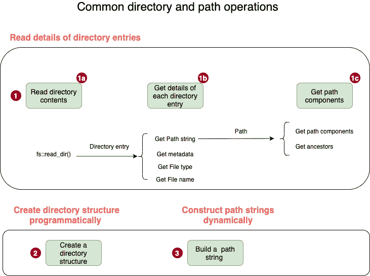

# *第六章*：在 Rust 中处理文件和目录

在上一章中，我们探讨了 Rust 使用内存的细节，内存是关键的系统资源。

在本章中，我们将探讨 Rust 如何与另一类重要的系统资源——**文件**和**目录**——交互。Rust 标准库提供了一套丰富的抽象，使得平台无关的文件和目录操作成为可能。

对于本章，我们将回顾 Unix/Linux 管理文件的基本知识，并掌握 Rust 标准库提供的用于处理**文件**、**路径**、**链接**和**目录**的关键 API。

使用 Rust 标准库，我们将实现一个 shell 命令 `rstat`，该命令计算目录（及其子目录）中 Rust 代码的总行数，并提供一些额外的源代码度量指标。

我们将按以下顺序介绍主题：

+   理解 Linux 文件操作的系统调用

+   在 Rust 中进行文件 I/O 操作

+   学习目录和路径操作

+   设置硬链接、符号链接和执行查询

+   在 Rust 中编写 shell 命令（项目）

# 技术要求

使用以下命令验证 `rustc` 和 `cargo` 是否已正确安装：

```rs
rustc --version 
cargo --version
```

本章代码的 Git 仓库可以在 [`github.com/PacktPublishing/Practical-System-Programming-for-Rust-Developers/tree/master/Chapter06`](https://github.com/PacktPublishing/Practical-System-Programming-for-Rust-Developers/tree/master/Chapter06) 找到。

# 理解 Linux 文件操作的系统调用

在本节中，我们将探讨与操作系统级别管理文件系统资源相关的术语和基本机制。我们将以 Linux/Unix 为例，但类似的概念也适用于其他操作系统。

那么，你认为文件是什么？

**文件**只是一组字节。**字节**代表信息的一个单位——它可以是一个数字、文本、视频、音频、图像或其他类似的数字内容。字节组织在一个称为**字节流**的**线性数组**中。从操作系统的角度来看，文件的结构或内容没有其他期望。对文件的解释及其内容是由**用户应用程序**来完成的。

**用户应用程序**是一个不属于操作系统内核的程序。一个用户应用程序的例子是图像查看器，它将数据字节解释为图像。由于文件是由操作系统管理的资源，因此我们编写的任何用户程序都必须知道如何通过系统调用来与操作系统交互。文件可以被读取、写入或执行。一个可以执行的文件示例是由 **Make** 或 **Cargo** 等软件构建系统生成的二进制可执行（对象）文件。

Linux/Unix 独有的另一个方面是“一切皆文件”的哲学。在这里，“一切”指的是系统资源。Linux/Unix 上可以存在许多类型的文件：

+   **常规文件**，我们用它来存储文本或二进制数据

+   **目录**，包含名称列表和其他文件的引用

+   **块设备文件**，例如硬盘、磁带驱动器、USB 摄像头

+   **字符设备文件**，例如终端、键盘、打印机、声卡

+   **命名管道**，一种内存中的进程间通信机制

+   **Unix 域套接字**，也是一种进程间通信的形式

+   **链接**，如硬链接和符号链接

在本章中，我们将重点关注文件、目录和链接。然而，Unix I/O 模型的通用性意味着用于打开、读取、写入和关闭常规文件的同一系列系统调用也可以用于任何其他类型的文件，如**设备文件**。在 Linux/Unix 中，这是通过标准化系统调用实现的，然后由各种文件系统和设备驱动程序实现。

Linux/Unix 还提供了一个统一的`/mnt/cdrom`，它成为访问文件系统根目录的位置。文件系统的根目录可以在挂载点访问。

进程的**挂载命名空间**是它看到的所有挂载文件系统的集合。执行文件操作的系统调用进程在它视为其挂载命名空间一部分的文件和目录集合上操作。

Unix/Linux 系统调用（**应用程序编程接口 - API**）模型中的文件操作依赖于四个操作：**打开**、**读取**、**写入**和**关闭**，所有这些操作都与**文件描述符**的概念相关。什么是文件描述符？

文件描述符是文件的句柄。打开一个文件会返回一个文件描述符，而读取、写入和关闭等操作则使用文件描述符。

更多关于文件描述符的信息

读写等文件操作由进程执行。进程通过在内核上调用系统调用来执行这些操作。一旦进程打开一个文件，内核就会在**文件表**中记录它，其中每个条目都包含打开文件的详细信息，包括**文件描述符**（**fd**）和**文件位置**。每个 Linux 进程对其可以打开的文件数量都有一个限制。

对于内核来说，所有打开的文件都通过文件描述符来引用。当进程打开一个现有文件或创建一个新文件时，内核会返回一个文件描述符给进程。默认情况下，当进程从 shell 启动时，会自动创建三个文件描述符：`open: 0 – 标准输入(stdin)`、`1- 标准输出(stdout)`和`2- 标准错误(stderr)`。

内核维护一个所有打开文件描述符的表。如果进程打开或创建一个文件，内核从空闲文件描述符池中分配下一个空闲的文件描述符。当文件关闭时，文件描述符被释放回池中，并可用于重新分配。

现在我们来看一下与文件操作相关的常见 *系统调用*，操作系统将这些调用暴露出来：

+   `open()`: 这个系统调用打开一个现有文件。如果文件不存在，它还可以创建一个新文件。它接受一个路径名、文件打开的模式和标志。它返回一个文件描述符，可以在后续的系统调用中使用该文件描述符来访问文件：

    ```rs
    int open() system call. An example of a flag is O_CREAT, which tells the system call to create a file if the file does not exist, and returns the file descriptor.If there is an error in opening a file, `-1` is returned in place of the file descriptor, and the error number (`errno`) returned specifies the reason for the error. File open calls can fail for a variety of reasons including a *permissions error* and the *incorrect path* being specified in an argument to a system call.
    ```

+   `read()`: 这个系统调用接受三个参数：一个 *文件描述符*、要读取的 *字节数* 以及数据读取后要放置的 *缓冲区内存地址*。它返回读取的字节数。在读取文件时发生错误时返回 `-1`。

+   `write()`: 这个系统调用与 `read()` 类似，因为它也接受三个参数——一个 *文件描述符*、一个从其中读取数据的 *缓冲区指针* 以及从缓冲区中读取的 *字节数*。请注意，`write()` 系统调用的成功完成并不保证字节立即写入磁盘，因为内核为了性能和效率原因对磁盘的 I/O 进行了缓冲。

+   `close()`: 这个系统调用接受一个 *文件描述符* 并释放它。如果对一个文件没有显式调用 `close()`，那么当进程结束时，所有打开的文件都会被关闭。但是，为了重用内核，在不再需要时释放文件描述符（文件描述符）是一个好的做法。

+   `lseek()`: 对于每个打开的文件，内核跟踪一个文件偏移量，它表示下一次读取或写入操作将在文件中的位置。`lseek()` 系统调用允许你将文件偏移量重新定位到文件中的任何位置。`lseek()` 系统调用接受三个参数——文件描述符、偏移量和参考位置。参考位置可以取三个值——*文件开头*、*当前光标位置*或*文件结尾*。偏移量指定相对于参考位置的字节数，文件偏移量应指向该位置，以便进行下一次 `read()` 或 `write()` 操作。

这完成了对操作系统如何管理文件作为系统资源术语和关键概念的概述。我们已经看到了 Linux 中用于处理文件的 主要系统调用（`syscalls`）。在这本书中，我们不会直接使用这些 `syscalls`。但我们将通过 Rust 标准库模块间接地使用这些 `syscalls`。Rust 标准库提供了更高层次的 *包装器*，以便更容易地使用这些 `syscalls`。这些 *包装器* 还允许 Rust 程序在没有必要了解不同操作系统之间 `syscalls` 的所有差异的情况下工作。然而，了解操作系统如何管理文件，可以让我们窥见当我们使用 Rust 标准库进行文件和目录操作时，底层发生了什么。

在下一节中，我们将介绍如何在 Rust 中进行文件输入/输出操作。

# 在 Rust 中进行文件 I/O 操作

在本节中，我们将探讨 Rust 方法调用，这些调用使我们能够在 Rust 程序中处理文件。Rust 标准库让程序员免于直接处理系统调用，并提供了一组包装方法，这些方法公开了常见文件操作的 API。

Rust 标准库中用于处理文件的主要模块是 `std::fs`。`std::fs` 的官方文档可以在这里找到：[`doc.rust-lang.org/std/fs/index.html`](https://doc.rust-lang.org/std/fs/index.html)。该文档提供了一组方法、结构体、枚举和特质，这些方法共同提供了处理文件的功能。研究 `std::fs` 模块的结构有助于加深理解。然而，对于刚开始探索 Rust 系统编程的人来说，从程序员希望对文件执行的操作的心理模型开始，并将其映射回 Rust 标准库，可能更有用。这就是本节我们将要做的事情。文件的常见生命周期操作在 *图 6.1* 中展示。


图 6.1 – 常见的文件生命周期操作

程序员喜欢对文件执行的一些常见操作包括创建文件、打开和关闭文件、读取和写入文件、访问文件的元数据以及设置文件权限。这些操作在 *图 6.1* 中展示。这里提供了如何使用 Rust 标准库执行每个文件操作的描述：  

+   `std::fs` 模块中的 `File::create()` 允许你创建一个新文件并向其写入。可以使用 `std::fs::OpenOptions` 结构指定要创建的文件的自定义权限。下面是一个使用 `std::fs` 模块进行 *创建* 操作的代码片段示例：

    ```rs
    use std::fs::File;
    fn main() {
        let file = File::create("./stats.txt");
    }
    ```

+   `std::fs::File::open()`。默认情况下，它以*只读*模式打开文件。可以使用`std::fs::OpenOptions`结构来设置创建文件的*自定义权限*。以下展示了两种打开文件的方法。第一个函数返回一个`Result`类型，我们只是使用`.expect()`来处理它，如果文件未找到，则抛出带有消息的异常。第二个函数使用`OpenOptions`为要打开的文件设置额外的权限。在示例中，我们正在打开一个文件进行*写*操作，并且要求如果文件尚未存在则创建该文件：

    ```rs
    use std::fs::File;
    use std::fs::OpenOptions;
    fn main() {
        // Method 1
        let _file1 = File::open("stats1.txt").expect("File 
            not found");
        // Method 2
        let _file2 = OpenOptions::new()
            .write(true)
            .create(true)
            .open("stats2.txt");
    }
    ```

+   `std::fs::copy()`函数可用于将一个文件的内容复制到另一个文件，并覆盖后者。以下是一个示例：

    ```rs
    use std::fs;
    fn main() {
        fs::copy("stats1.txt", "stats2.txt").expect("Unable 
            to copy");
    }
    ```

+   `std::fs::rename()`函数可用于此目的。如果*目标*文件已存在，则将其替换。需要注意的是，在进程的*挂载命名空间*中可以挂载多个文件系统（在各个位置），如前节所示。Rust 中的`rename`方法只有在*源*和*目标*文件路径位于同一文件系统中时才会工作。以下是一个`rename()`函数用法的示例：

    ```rs
    use std::fs;
    fn main() {
        fs::rename("stats1.txt", "stats3.txt").expect("Unable 
            to rename");
    }
    ```

+   `std::fs`模块中提供了两个函数：`fs::read()`和`fs::read_to_string()`。前者将文件内容读取到一个`bytes`向量中。它根据文件大小（如果可用）预分配一个缓冲区。后者直接将文件内容读取到字符串中。以下是一些示例：

    ```rs
    use std::fs;
    fn main() {
        let byte_arr = fs::read(), we convert the byte_arr into a string for printing purposes, as printing out a byte array is not human-readable.
    ```

+   `std::fs`模块中的`fs::write()`函数接受一个*文件名*和一个*字节切片*，并将*字节切片*作为文件的内容写入。以下是一个示例：

    ```rs
    use std::fs;
    fn main() {
        fs::write("stats3.txt", "Rust is exciting,isn't 
    it?").expect("Unable to write to file");
    }
    ```

+   `std::fs`模块。函数`is_dir()`、`is_file()`和`is_symlink()`分别检查一个文件是否是*常规文件*、*目录*或*符号链接*。`modified()`、`created()`、`accessed()`、`len()`和`metadata()`函数用于检索文件元数据信息。`permissions()`函数用于检索文件上的权限列表。

    下面展示了查询操作的几个示例：

    ```rs
    use std::fs;
    fn main() {
        let file_metadata = fs::metadata("stats.txt").
            expect("Unable to get file metadata");
        println!(
            "Len: {}, last accessed: {:?}, modified : {:?}, 
            created: {:?}",
            file_metadata.len(),
            file_metadata.accessed(),
            file_metadata.modified(),
            file_metadata.created()
        );
        println!(
            "Is file: {}, Is dir: {}, is Symlink: {}",
            file_metadata.is_file(),
            file_metadata.is_dir(),
            file_metadata.file_type().is_symlink()
        );
      println!("File metadata: {:?}",fs::metadata
          ("stats.txt"));
        println!("Permissions of file are: {:?}", 
            file_metadata.permissions());
    }
    ```

+   `set_permissions()`。以下是一个示例，其中在将文件权限设置为只读后，对文件的写操作失败：

    ```rs
    use std::fs;
    fn main() {
        let mut permissions = fs::metadata("stats.txt").
            unwrap().permissions();
        permissions.set_readonly(true);
        let _ = fs::set_permissions("stats.txt", 
            permissions).expect("Unable to set permission");

        fs::write("stats.txt", "Hello- Can you see me?").
            expect("Unable to write to file");
    }
    ```

+   Rust 标准库中的`close()`方法用于关闭文件。

在本节中，我们看到了 Rust 标准库中用于执行*文件操作*和*查询*操作的关键函数调用。在下一节中，我们将探讨如何使用 Rust 标准库进行*目录*和*路径*操作。

# 学习目录和路径操作

Linux（以及其他 Unix 变体）的内核维护一个对进程可见的单个目录树结构，它是分层的，包含该命名空间中的所有文件。这种分层组织包含单个文件、目录和链接（例如，符号链接）。

在前一个部分，我们探讨了 Rust 中的*文件*和文件操作。在本节中，我们将更详细地探讨*目录*和*路径*操作。在下一节中，我们将介绍*链接*。

*目录*是一个特殊的文件，其中包含一个文件名列表及其引用（`/`代表根目录，而`/home`和`/etc`将链接到`/`作为*父目录*。（注意，在某些操作系统，如 Microsoft Windows 变体中，每个磁盘设备都有自己的文件层次结构，并且没有单一的统一命名空间。）每个目录至少包含两个条目——一个指向自身的*点条目*和一个*点点*目录，它指向其父目录：



图 6.2 – 常见的目录和路径操作

在 Rust 标准库中，`std::fs`模块包含用于处理目录的方法，而`std::path`模块包含用于处理*路径*的方法。

正如前一个部分一样，我们将探讨涉及*目录*和*路径*操作的常见编程任务。这些在*图 6.2*中展示，并在此处详细说明：

1.  `std::fs`模块中的`std::fs::read_dir()`函数可以用来遍历和检索目录中的条目。从检索到的目录条目中，可以使用`path()`、`metadata()`、`file_name()`和`file_type()`函数获取目录条目的元数据详情。这里展示了如何操作的示例：

    ```rs
    use std::fs;
    use std::path::Path;
    fn main() {
        let dir_entries = fs::read_dir(".").expect("Unable to 
            read directory contents");
        // Read directory contents
        for entry in dir_entries {
            //Get details of each directory entry
            let entry = entry.unwrap();
            let entry_path = entry.path();
            let entry_metadata = entry.metadata().unwrap();
            let entry_file_type = entry.file_type().unwrap();
            let entry_file_name = entry.file_name();
            println!(
                "Path is {:?}.\n Metadata is {:?}\n File_type 
                is {:?}.\n Entry name is{:?}.\n",
                entry_path, entry_metadata, entry_file_type, 
                entry_file_name
            );
        }
        // Get path components
        let new_path = Path::new("/usr/d1/d2/d3/bar.txt");
        println!("Path parent is: {:?}", new_path.parent());
        for component in new_path.components() {
            println!("Path component is: {:?}", component);
        }
    }
    ```

    接下来，我们将探讨如何程序化构建目录树。

1.  `std::fs`模块。Rust 的`std::fs::DirBuilder`结构体提供了递归构建目录结构的方法。这里展示了递归创建目录结构的示例：

    ```rs
    use std::fs::DirBuilder;
    fn main() {
        let dir_structure = "/tmp/dir1/dir2/dir3";
        DirBuilder::new()
            .recursive(true)
            .create(dir_structure)
            .unwrap();
    }
    ```

    注意，还有另外两个函数也可以用来创建目录。`std::fs`中的`create_dir()`和`create_dir_all()`可以用于此目的。

    同样，`std::fs`模块中的`remove_dir()`和`remove_dir_all()`函数可以用来删除目录。

    接下来，我们将探讨如何动态构建路径字符串。

1.  `/usr/bob/a.txt`，`usr`和`bob`代表目录，而`a.txt`代表文件。Rust 标准库提供了程序化构建路径字符串（表示文件或目录的完整路径）的功能。这在`std::path::PathBuf`中可用。这里展示了如何动态构建路径的示例：

    ```rs
    use std::path::PathBuf;
    fn main() {
        let mut f_path = PathBuf::new();
        f_path.push(r"/tmp");
        f_path.push("packt");
        f_path.push("rust");
        f_path.push("book");
        f_path.set_extension("rs");
        println!("Path constructed is {:?}", f_path);
    }
    ```

在展示的代码中，创建了一个新的`PathBuf`类型变量，并将各种路径组件动态添加以创建一个完全限定的路径。

这就完成了关于 Rust 标准库中目录和路径操作的子节。

在本节中，我们探讨了如何使用 Rust 标准库读取目录条目，获取它们的元数据，程序化构建目录结构，获取路径组件，并动态构建路径字符串。

在下一节中，我们将探讨如何使用 *链接* 和 *查询*。

# 设置硬链接、符号链接和执行查询

我们之前看到，在文件系统中，目录被处理得类似于常规文件。但它有不同的文件类型，并且包含一个包含文件名及其 Inode 的列表。`ls –li` 命令显示了与文件对应的 Inode 号码，如下所示：


图 6.3 – 文件列表中可见的 Inode 号码

由于目录包含一个将 *文件名* 与 *inode 号码* 映射的列表，因此可以有多个文件名映射到同一个 Inode 号码。这样的多个名称称为 `ln` shell 命令。并非所有非 UNIX 文件系统都支持这样的硬链接。

在文件系统中，可以有指向同一文件的多个 *链接*。它们本质上都是相同的，因为它们都指向同一个文件。大多数文件都有一个 *链接计数* 为 1（意味着该文件只有一个目录条目），但文件可以有 *链接计数* > 1（例如，如果有两个链接指向同一个 *inode* 条目，那么该文件将有两个目录条目，并且 *链接计数* 将为 2）。内核维护这个 *链接计数*。

硬链接有一个限制，即它们只能引用同一文件系统内的文件，因为 Inode 号码只在文件系统内是唯一的。还有一种称为 `ln –s` 命令的另一种链接类型。由于符号链接引用的是文件名而不是 Inode 号码，因此它可以引用另一个文件系统中的文件。此外，与硬链接不同，符号链接可以在目录中创建。

在以下要点中，我们将看到 Rust 标准库中可用于创建和查询硬链接和符号链接（symlinks）的方法：

+   `std::fs` 模块有一个名为 `fs::hard_link` 的函数，可以用于在文件系统中创建一个新的硬链接。以下是一个示例：

    ```rs
    use std::fs;
    fn main() -> std::io::Result<()> {
        fs::hard_link("stats.txt", "./statsa.txt")?; // Hard 
                              // link stats.txt to statsa.txt
        Ok(())
    }
    ```

+   使用 Rust 标准库中的 `symlink` 方法在不同平台上会有所不同。在 Unix/Linux 上，可以使用 `std::os::unix::fs::symlink` 方法。在 Windows 上，有两个 API – `os::windows::fs::symlink_file` 用于创建指向文件的 *符号链接*，或者 `os::windows::fs::symlink_dir` 用于创建指向目录的 `symlink`。以下是在类 Unix 平台上创建 `symlink` 的示例：

    ```rs
    use std::fs;
    use std::os::unix::fs as fsunix;
    fn main() {
        fsunix::symlink("stats.txt", "sym_stats.txt").
            expect("Cannot create symbolic link");
        let sym_path = fs::read_link("sym_stats.txt").
            expect("Cannot read link");
        println!("Link is {:?}", sym_path);
    }
    ```

可以使用 `fs::read_link` 函数来读取符号链接，如下面的代码所示。

通过这一点，我们完成了关于在 Rust 标准库中处理链接的子节。到目前为止，我们已经看到了如何在 Rust 中处理文件、目录、路径和链接。在下一节中，我们将构建一个小型的 shell 命令，以展示 Rust 标准库在文件和目录操作中的实际应用。

# 在 Rust 中编写 shell 命令（项目）

在本节中，我们将利用我们在前几节中学到的 Rust 标准库中关于文件和目录操作的知识来实现一个 shell 命令。

这个 shell 命令会做什么？

该 shell 命令将被命名为**rstat**，即**Rust 源统计**。给定一个目录作为参数，它将生成 Rust 源文件的*文件计数*，以及目录结构内的源代码度量，如*空白数*、*注释*和*实际代码行数*。

下面是你将输入的内容：

```rs
 cargo run --release -- -m src .
```

下面是从这个 shell 命令中看到的结果示例：

```rs
Summary stats: SrcStats { number_of_files: 7, loc: 187, comments: 8, blanks: 20 }
```

本节分为四个子节。在第一个子节中，我们将概述代码结构并总结构建此 shell 命令的步骤。然后，在三个不同的子节中，我们将回顾与错误处理、源度量计算和主程序对应的三个源文件的代码。

## 代码概述

在本子节中，我们将探讨 shell 命令的代码结构。我们还将回顾构建 shell 命令的步骤摘要。让我们开始吧。

代码结构如图*6.4*所示：


图 6.4 – Shell 命令代码结构

下面是构建 shell 命令的步骤摘要。源代码片段将在本节后面展示：

1.  创建项目：使用以下命令创建一个新项目，并将目录更改为`rstat`目录：

    ```rs
    cargo new rstat && cd rstat
    ```

1.  创建源文件：在`src`文件夹下创建三个文件 – `main.rs`、`srcstats.rs`和`errors.rs`。

1.  定义自定义错误处理：在`errors.rs`中，创建一个结构体`StatsError`来表示我们的自定义错误类型。这将用于统一我们项目中的错误处理并向用户发送消息。在`struct StatsError`上实现以下四个特质：`fmt::Display`、`From<&str>`、`From<io::Error>`和`From<std::num::TryFromIntError>`。

1.  定义计算源统计的逻辑：在`srcstats.rs`中，创建一个结构体`SrcStats`来定义要计算的源度量。定义两个函数：`get_src_stats_for_file()`（接受一个文件名作为参数并计算该文件的源度量）和`get_summary_src_stats()`（接受一个目录名称作为参数并计算该目录根下所有文件的源度量）。

1.  编写`main()`函数以接受命令行参数：

    在`main.rs`中，定义一个`Opt`结构来定义 shell 命令的命令行参数和标志。编写`main()`函数，该函数从命令行接受源目录名称并调用`srcstats`模块中的`get_summary_src_stats()`方法。确保在依赖项中包含`Cargo.toml`。

1.  使用以下命令构建工具：

    ```rs
    cargo build --release
    ```

1.  使用以下命令运行 shell 命令：

    ```rs
     rstat binary to the path, and set LD_LIBRARY PATH to run the shell command like this:

    ```

    可以像下面这样设置 LD_LIBRARY_PATH（对于 Windows 可以使用等效命令）：

    ```rs
    export LD_LIBRARY_PATH=$(rustc --print sysroot)/lib:$LD_LIBRARY_PATH
    ```

    ```rs

    ```

1.  查看打印到终端的汇总源统计并确认生成的度量。

现在我们将查看之前列出的步骤的代码片段。我们将首先定义自定义错误处理。

## 错误处理

在执行我们的 shell 命令时，可能会出现几个问题。指定的源文件夹可能无效。查看目录条目的权限可能不足。还可能有其他类型的 I/O 错误，如以下所列：[`doc.rust-lang.org/std/io/enum.ErrorKind.html`](https://doc.rust-lang.org/std/io/enum.ErrorKind.html)。为了向我们用户返回有意义的消息，我们将创建一个自定义错误类型。我们还将编写转换方法，通过实现各种 `From` 特性，将不同类型的 I/O 错误自动转换为我们的自定义错误类型。所有这些代码都存储在 `errors.rs` 文件中。让我们分两部分回顾这个文件中的代码片段：

+   第一部分涵盖了自定义错误类型和 `Display` 特性的实现。

+   第二部分涵盖了自定义错误类型的各种 `From` 特性实现。

`errors.rs` 代码的第一部分如下所示：

src/errors.rs (第一部分)

```rs
use std::fmt;
use std::io;

#[derive(Debug)]
pub struct StatsError {
    pub message: String,
}

impl fmt::Display for StatsError {
    fn fmt(&self, f: &mut fmt::Formatter) -> Result<(), 
        fmt::Error> {
        write!(f, "{}", self)
    }
}
```

在这里，定义了 `StatsError` 结构体，其中包含一个 `message` 字段，用于存储错误消息，在出现错误的情况下将传递给用户。我们还实现了 `Display` 特性，以便错误消息可以打印到控制台。

现在让我们看看 `errors.rs` 文件的第二部分。在这里，我们实现了各种 `From` 特性的实现，如下所示。代码注释编号，并在代码列表之后进行描述：

src/errors.rs (第二部分)

```rs
impl From<&str> for StatsError {        <1>
    fn from(s: &str) -> Self {
        StatsError {
            message: s.to_string(),
        }
    }
}
impl From<io::Error> for StatsError {    <2>
    fn from(e: io::Error) -> Self {
        StatsError {
            message: e.to_string(),
        }
    }
}
impl From<std::num::TryFromIntError> for StatsError {   <3>
    fn from(_e: std::num::TryFromIntError) -> Self {
        StatsError {
            message: "Number conversion error".to_string(),
        }
    }
}
```

源代码注释（用数字表示）的详细说明如下：

1.  帮助从字符串构建 `StatsError`

1.  将 `IO:Error` 转换为 `StatsError`

1.  用于在将 `usize` 转换为 `u32` 时检查错误

在本节中，我们回顾了 `errors.js` 文件的代码。在下一节中，我们将看到源代码度量的计算代码。

## 源代码度量计算

在本节中，我们将查看 `srcstats.rs` 文件的代码。该文件的代码片段按以下顺序分别展示：

+   *第一部分:* 模块导入

+   *第二部分:* `SrcStats` 结构体的定义

+   *第三部分:* `get_summary_src_stats()` 函数的定义

+   *第四部分:* `get_src_stats_for_file()` 函数的定义

让我们看看 *第一部分*。模块导入如下所示。与代码注释编号对应的描述在代码列表之后：

src/srcstats.rs (第一部分)

```rs
use std::convert::TryFrom;     <1>
use std::ffi::OsStr;           <2>
use std::fs;                   <3>
use std::fs::DirEntry;         <4>
use std::path::{Path, PathBuf};<5>
use super::errors::StatsError; <6>
```

列出编号代码注释的描述如下：

+   使用 `TryFrom` 来捕获将 `usize` 转换为 `u32` 时可能出现的任何错误。

+   `OsStr` 用于检查具有 `.rs` 扩展名的文件。

+   `std::fs` 是 Rust 标准库中用于文件和目录操作的主要模块。

+   `DirEntry` 是 Rust 标准库中用于表示单个目录条目的结构体。

+   `Path` 和 `PathBuf` 用于存储路径名。`&Path` 类似于 `&str`，而 `PathBuf` 类似于 `String`。一个是引用，另一个是拥有对象。

+   读取文件或计算中出现的任何错误都被转换为自定义错误类型 `StatsError`。这一行中导入了它。

我们现在将查看 *第二部分*。存储计算出的指标的结构的定义在这里介绍。

结构体 `SrcStats` 包含以下源代码指标，这些指标将由我们的 shell 命令生成：

+   Rust 源代码文件的数量

+   代码行数（不包括注释和空白行）

+   空白行的数量

+   注释行的数量（以 `//` 开头的单行注释；请注意，在这个工具的范围内我们不考虑多行注释）

用于存储计算出的源代码指标的 Rust 数据结构如下所示：

src/srcstats.rs (第-2 部分)

```rs
// Struct to hold the stats
#[derive(Debug)]
pub struct SrcStats {
    pub number_of_files: u32,
    pub loc: u32,
    pub comments: u32,
    pub blanks: u32,
}
```

让我们看看 *第三部分*，这是计算汇总统计信息的主要函数。由于这段代码有点长，我们将分三部分来查看：

+   代码片段的第 3a 部分显示了变量初始化。

+   代码片段的第 3b 部分显示了递归检索目录内 Rust 源代码文件的主要代码。

+   在第 3c 部分，我们遍历 Rust 文件列表，并对每个文件调用 `get_src_stats_for_file()` 方法来计算源代码指标。结果被汇总。

`get_summary_src_stats()` 方法的第 3a 部分如下所示：

src/srcstats.rs (第 3a 部分)

```rs
pub fn get_summary_src_stats(in_dir: &Path) ->   
    Result<SrcStats, StatsError> {
    let mut total_loc = 0;
    let mut total_comments = 0;
    let mut total_blanks = 0;
    let mut dir_entries: Vec<PathBuf> = 
        vec![in_dir.to_path_buf()];
    let mut file_entries: Vec<DirEntry> = vec![];

    // Recursively iterate over directory entries to get flat 
    // list of .rs files
```

代码片段的第 3a 部分显示了变量的初始化。

`get_summary_src_stats()` 方法的第 3b 部分如下所示：

src/srcstats.rs (第-3b 部分)

```rs
    while let Some(entry) = dir_entries.pop() {
        for inner_entry in fs::read_dir(&entry)? {
            if let Ok(entry) = inner_entry {
                if entry.path().is_dir() {
                    dir_entries.push(entry.path());
                } else {
                    if entry.path().extension() == 
                    Some(OsStr::new("rs")) {
                        file_entries.push(entry);
                    }
                }
            }
        }
    }
```

在代码的第 3b 部分，我们正在遍历指定文件夹内的条目，并将 *目录* 类型的条目与 *文件* 类型的条目分开，分别存储在单独的 `vector` 变量中。

`get_summary_src_stats()` 方法的第 3c 部分如下所示：

src/srcstats.rs (第 3c 部分)

```rs
    let file_count = file_entries.len();
    // Compute the stats
    for entry in file_entries {
        let stat = get_src_stats_for_file(&entry.path())?;
        total_loc += stat.loc;
        total_blanks += stat.blanks;
        total_comments += stat.comments;
    }

    Ok(SrcStats {
        number_of_files: u32::try_from(file_count)?,
        loc: total_loc,
        comments: total_comments,
        blanks: total_blanks,
    })
}
```

我们现在将查看 *第四部分*，这是计算单个 Rust 源代码文件的源代码指标的代码：

src/srcstats.rs (第-4 部分)

```rs
pub fn get_src_stats_for_file(file_name: &Path) ->  
    Result<SrcStats, StatsError> {
    let file_contents = fs::read_to_string(file_name)?;
    let mut loc = 0;
    let mut blanks = 0;
    let mut comments = 0;
    for line in file_contents.lines() {
        if line.len() == 0 {
            blanks += 1;
        } else if line.trim_start().starts_with("//") {
            comments += 1;
        } else {
            loc += 1;
        }
    }
    let source_stats = SrcStats {
        number_of_files: u32::try_from(file_contents.lines()
            .count())?,
        loc: loc,
        comments: comments,
        blanks: blanks,
    };
    Ok(source_stats)
}
```

在第四部分，展示了 `get_src_stats_for_file()` 函数的代码。此函数逐行读取源文件，并确定该行是否对应于常规代码行、空白行或注释。根据这种分类，相应的计数器会增加。最终结果作为 `SrcStats` 结构体从函数返回。

这完成了 `srcstats` 模块的代码列表。在本小节中，我们回顾了计算源代码指标的代码。在下一节中，我们将回顾代码列表的最后部分，即 `main()` 函数。

## `main()` 函数

在本小节中，我们现在将查看代码的最后一部分，即代表二进制程序入口点的 `main()` 函数。它执行四个任务：

1.  从命令行接受用户输入。

1.  调用适当的方法来计算源代码指标。

1.  将结果显示给用户。

1.  在出现错误的情况下，会向用户显示一个合适的错误信息。

`main()` 函数的代码分为两部分：

+   第一部分展示了 shell 命令的命令行界面结构。

+   第二部分展示了调用计算源指标并显示结果给用户的代码。

`main.rs` 的 *第一部分* 如下所示。我们将使用 `structopt` crate 来定义从用户那里接受的命令行输入的结构。

将以下内容添加到 `Cargo.toml` 文件中：

```rs
[dependencies]
structopt = "0.3.16"
```

*第一部分* 的代码列表如下所示：

src/main.rs (第一部分)

```rs
use std::path::PathBuf;
use structopt::StructOpt;
mod srcstats;
use srcstats::get_summary_src_stats;
mod errors;
use errors::StatsError;

#[derive(Debug, StructOpt)]
#[structopt(
    name = "rstat",
    about = "This is a tool to generate statistics on Rust 
        projects"
)]
struct Opt {
    #[structopt(name = "source directory", 
        parse(from_os_str))]
    in_dir: PathBuf,
    #[structopt(name = "mode", short)]
    mode: String,
}
```

在显示的代码第一部分中，定义了一个数据结构 `Opt`，它包含两个字段 – `in_dir`，表示输入文件夹的路径（要计算源指标），以及一个字段 `mode`。在我们的示例中，`mode` 的值是 `src`，表示我们想要计算源代码指标。在未来，可以添加额外的模式（例如，`object` 模式，用于计算可执行文件和库对象文件的大小等指标）。

在此代码的 *第二部分* 中，我们从用户的命令行参数中读取源文件夹，并从 `srcstats` 模块调用 `get_summary_src_stats()` 方法，我们在前面的子节中已讨论过。然后，该方法返回的指标将在终端中显示给用户。代码列表的 *第二部分* 如下所示：

src/main.rs

`main` 函数的代码如下：

```rs
fn main() -> Result<(), StatsError> {
    let opt = Opt::from_args();
    let mode = &opt.mode[..];
    match mode {
        "src" => {
            let stats = get_summary_src_stats(&opt.in_dir)?;
            println!("Summary stats: {:?}", stats);
        }
        _ => println!("Sorry, no stats"),
    }
    Ok(())
}
```

第二部分展示了 `main()` 函数，它是我们 shell 命令的入口点。该函数接受并解析命令行参数，并调用 `get_summary_src_stats()` 函数，将用户指定的 *源文件夹* 作为函数参数传递。包含综合源代码指标的成果将打印到控制台。

使用以下命令构建和运行工具：

```rs
cargo run --release -- -m src <src-folder>
```

`<source-folder>` 是 Rust 项目或源文件的位置，`-m` 是需要指定的命令行标志。它将是 `src`，表示我们想要源代码指标。

如果你想运行当前项目的统计信息，可以使用以下命令：

```rs
cargo run --release -- -m src .
```

注意命令中的点（`.`），它表示我们想要在当前项目文件夹中运行该命令。

你将在终端上看到源代码指标。

作为练习，你可以扩展这个 shell 命令以生成 Rust 项目生成的二进制文件的指标。要调用此选项，允许用户指定 `–m` 标志为 `bin`。

这就完成了关于开发 shell 命令的章节，它展示了在 Rust 中进行的文件和目录操作。

# 摘要

在本章中，我们回顾了操作系统级别的文件管理基础知识，以及与文件操作相关的主要系统调用。然后我们学习了如何使用 Rust 标准库打开和关闭文件，向文件读写数据，查询文件元数据，以及处理链接。在文件操作之后，我们学习了如何在 Rust 中进行目录和路径操作。在第三部分，我们看到了如何使用 Rust 创建硬链接和软（符号）链接，以及如何查询 `symlinks`。

然后，我们开发了一个 shell 命令，用于计算目录树中 Rust 源文件的源代码度量。这个项目展示了如何通过实际示例在 Rust 中执行各种文件和目录操作，并加强了 Rust 标准库在文件 I/O 操作中的概念。

继续探讨 I/O 主题，在下一章中，我们将学习终端 I/O 的基础知识以及 Rust 提供的用于处理伪终端的功能。
