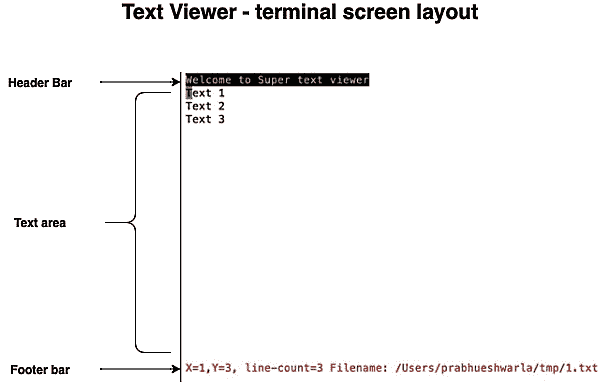

# 第七章：*第七章*: 在 Rust 中实现终端 I/O

在上一章中，我们探讨了如何处理文件和目录。我们还构建了一个 Rust 中的 shell 命令，用于生成项目目录中 Rust 源代码的汇总源代码度量。

在本章中，我们将探讨如何在 Rust 中构建**基于终端的应用程序**。终端应用程序是许多软件程序的重要组成部分，包括**游戏**、**文本编辑器**和**终端模拟器**。对于开发这些类型的程序，了解如何构建基于自定义终端界面的应用程序非常有帮助。这是本章的重点。

对于本章，我们将回顾终端的基本工作原理，然后探讨如何在终端上执行各种类型的操作，例如设置颜色和样式，执行光标操作（如清除和定位），以及处理键盘和鼠标输入。

我们将按照以下顺序介绍这些主题：

+   介绍终端 I/O 基础知识

+   与终端 UI（大小、颜色、样式）和光标一起工作

+   处理键盘输入和滚动

+   处理鼠标输入

本章的大部分内容将致力于通过一个实际示例来解释这些概念。我们将构建一个迷你文本查看器，以展示与终端一起工作的关键概念。该文本查看器将能够从磁盘加载文件并在终端界面上显示其内容。它还将允许用户使用键盘上的各种箭头键滚动内容，并在页眉和页脚栏上显示信息。

# 技术要求

本章中代码的 Git 仓库可以在[`github.com/PacktPublishing/Practical-System-Programming-for-Rust-Developers/tree/master/Chapter07/tui`](https://github.com/PacktPublishing/Practical-System-Programming-for-Rust-Developers/tree/master/Chapter07/tui)找到。

对于在 Windows 平台上工作的开发者，需要为本章安装一个虚拟机，因为用于终端管理的第三方 crate 不支持 Windows 平台（在撰写本书时）。建议安装一个如 VirtualBox 或等效的运行 Linux 的虚拟机来处理本章中的代码。安装 VirtualBox 的说明可以在[`www.virtualbox.org`](https://www.virtualbox.org)找到。

对于与终端一起工作，Rust 提供了几个功能来读取按键，并控制进程的*标准输入*和*标准输出*。当用户在命令行中键入字符时，当用户按下*Enter*键时，生成的字节对程序可用。这对于多种类型的程序都很有用。但对于某些类型的程序，如游戏或文本编辑器，它们需要更精细的控制，程序必须处理用户键入的每个字符，这也就是所谓的**原始模式**。有几个第三方库可以轻松处理原始模式。在本章中，我们将使用这样一个库，**Termion**。

# 介绍终端 I/O 基础

在本节中，我们将介绍终端的关键特性，概述 Termion 库，并定义本项目我们将要构建的范围。

让我们先看看终端的一些基础知识。

## 终端的特性

终端是用户可以与之交互的设备。使用终端，用户可以获取命令行访问权限以与计算机的操作系统交互。shell 通常充当控制程序，一方面驱动终端，另一方面与操作系统接口。

最初，UNIX 系统是通过连接到串行线的终端（也称为控制台）进行访问的。这些终端通常具有*24 x 80*行列的字符界面，或者在某些情况下具有基本的图形功能。为了在终端上执行操作，如清除屏幕或移动光标，使用了特定的转义序列。

终端可以以两种模式运行：

+   **规范模式**：在规范模式下，用户的输入按行处理，用户必须按下*Enter*键才能将字符发送到程序进行处理。

+   **非规范或原始模式**：在原始模式下，终端输入不会被收集成行，但程序可以读取用户键入的每个字符。

终端可以是物理设备或虚拟设备。如今的大多数终端都是**伪终端**，它们是一端连接到终端设备，另一端连接到驱动终端设备的程序的虚拟设备。伪终端帮助我们编写程序，使得一台主机上的用户可以通过网络通信在另一台主机上执行**面向终端的程序**。一个伪终端应用的例子是**SSH**，它允许用户通过网络登录到远程主机。

终端管理包括在终端屏幕上执行以下操作的能力：

+   **颜色管理**：在终端上设置各种前景和背景颜色，并将颜色重置为默认值。

+   **样式管理**：设置文本的样式为*粗体*、*斜体*、*下划线*等。

+   **光标管理**: 设置光标在特定位置，保存当前光标位置，显示和隐藏光标，以及其他特殊功能，如闪烁光标。

+   **事件处理**: 监听并响应键盘和鼠标事件。

+   **屏幕处理**: 从主屏幕切换到备用屏幕并清除屏幕。

+   **原始模式**: 将终端切换到原始模式。

在本章中，我们将结合使用 Rust 标准库和 Termion crate 来开发面向终端的应用程序。让我们在下一节中查看 Termion crate 的概述。

## Termion crate

Termion crate 提供了上一节中列出的功能，同时也为用户提供易于使用的命令行界面。我们将在本章中使用许多这些功能。

为什么使用外部 crate 进行终端管理？

虽然在技术上可以使用 Rust 标准库在字节级别工作，但这很麻烦。像 Termion 这样的外部 crate 帮助我们将单个字节分组为按键，并实现许多常用的终端管理功能，这使得我们可以专注于更高层次的、面向用户的功能。

让我们讨论 Termion crate 的一些终端管理功能。该 crate 的官方文档可以在[`docs.rs/termion/`](https://docs.rs/termion/)找到。

Termion crate 具有以下关键模块：

+   `cursor`: 用于移动光标

+   `event`: 用于处理键盘和鼠标事件

+   `raw`: 用于将终端切换到原始模式

+   `style`: 用于设置文本的各种样式

+   `clear`: 用于清除整个屏幕或单独的行

+   `color`: 用于设置文本的各种颜色

+   `input`: 用于处理高级用户输入

+   `scroll`: 用于在屏幕上滚动

要包含 Termion crate，开始一个新的项目并在`cargo.toml`中添加以下条目：

```rs
[dependencies]
termion = "1.5.5"
```

这里通过代码片段展示了 Termion 的一些使用示例：

+   要获取终端大小，请使用以下命令：

    ```rs
    termion::terminal_size()
    ```

+   要设置前景颜色，请使用以下命令：

    ```rs
    println!("{}", color::Fg(color::Blue));
    ```

+   要设置背景颜色然后重置背景颜色到原始状态，请使用以下命令：

    ```rs
        println!(
            "{}Background{} ",
            color::Bg(color::Cyan),
            color::Bg(color::Reset)
        );
    ```

+   要设置粗体样式，请使用以下命令：

    ```rs
      println!(
            "{}You can see me in bold?",
            style::Bold
        );
    ```

+   要将光标设置到特定位置，请使用以下命令：

    ```rs
    termion::cursor::Goto(5, 10)
    ```

+   要清除屏幕，请使用以下命令：

    ```rs
    print!("{}", termion::clear::All);
    ```

我们将在接下来的章节中通过实际示例使用这些终端管理功能。现在，让我们定义本章将要构建的内容。

## 我们将构建什么？

我们将开发一个迷你文本查看器应用程序。此应用程序提供终端文本界面，从目录位置加载文档并查看文档。用户可以使用键盘键滚动文档。我们将逐步构建这个项目，通过多次代码迭代。

*图 7.1* 展示了我们将在本章中构建的屏幕布局：



图 7.1 – 文本查看器屏幕布局

文本查看器的终端界面中有三个组件：

+   **标题栏**：包含文本编辑器的标题。

+   **文本区域**：包含要显示的文本行。

+   **页脚栏**：显示光标位置、文件中的文本行数以及正在显示的文件名。

文本查看器将允许用户执行以下操作：

+   用户可以通过命令行参数提供一个文件名来显示。这应该是一个已存在的有效文件名。如果文件不存在，程序将显示错误消息并退出。

+   文本查看器将加载文件内容并在终端上显示它们。如果文件中的行数超过终端高度，程序将允许用户滚动文档，并重新绘制下一组行。

+   用户可以使用上、下、左、右键在终端中滚动。

+   用户可以按*Ctrl* + *Q*退出文本查看器。

一个流行的文本查看器会有更多功能，但这个核心范围为我们提供了足够的机会来学习如何在 Rust 中开发面向终端的应用程序。

在本节中，我们学习了终端是什么以及它们支持哪些功能。我们还概述了如何使用 Termion crate，并定义了在本章项目中我们将构建的内容。在下一节中，我们将开发文本查看器的第一个迭代版本。

# 与终端 UI（大小、颜色、样式）和光标一起工作

在本节中，我们将构建文本查看器的第一个迭代版本。在本节结束时，我们将有一个程序，它将从命令行接受文件名，显示其内容，并显示标题栏和页脚栏。我们将使用 Termion crate 来设置颜色和样式，获取终端大小，将光标定位在特定坐标，并清除屏幕。

本节中的代码组织如下：

+   编写数据结构和`main()`函数

+   初始化文本查看器和获取终端大小

+   显示文档并设置终端颜色、样式和光标位置

+   退出文本查看器

让我们从数据结构和文本查看器的`main()`函数开始

## 编写数据结构和`main()`函数

在本节中，我们将定义在内存中表示文本查看器所需的数据结构。我们还将编写`main()`函数，该函数协调和调用各种其他函数：

1.  创建一个新项目并使用以下命令切换到目录：

    ```rs
    tui stands for text-viewer1.rs under src/bin.
    ```

1.  将以下内容添加到`cargo.toml`中：

    ```rs
    [dependencies]
    termion = "1.5.5"
    ```

1.  让我们先从标准库和 Termion crate 中导入所需的模块：

    ```rs
    use std::env::args;
    use std::fs;
    use std::io::{stdin, stdout, Write};
    use termion::event::Key;
    use termion::input::TermRead;
    use termion::raw::IntoRawMode;
    use termion::{color, style};
    ```

1.  让我们接下来定义表示文本查看器的数据结构：

    ```rs
    struct Doc {
        lines: Vec<String>,
    }
    #[derive(Debug)]
    struct Coordinates {
        pub x: usize,
        pub y: usize,
    }
    struct TextViewer {
        doc: Doc,
        doc_length: usize,
        cur_pos: Coordinates,
        terminal_size: Coordinates,
        file_name: String,
    }
    ```

    此代码显示了为文本查看器定义的三个数据结构：

    在查看器中显示的文档定义为`Doc`结构体，它是一个字符串向量。

    为了存储光标位置 *x* 和 *y* 坐标以及记录当前终端的大小（字符的总行数和列数），我们定义了一个 `Coordinates` 结构体。

    `TextViewer` 结构体是表示文本查看器的主要数据结构。正在查看的文件中的行数被捕获在 `doc_length` 字段中。要在查看器中显示的文件名记录在 `file_name` 字段中。

1.  现在我们来定义 `main()` 函数，它是文本查看器应用程序的入口点：

    ```rs
    fn main() {
        //Get arguments from command line
        let args: Vec<String> = args().collect();
        if args.len() < 2 {
            println!("Please provide file name 
                as argument");
            std::process::exit(0);
        }
        //Check if file exists. If not, print error 
        // message and exit process
        if !std::path::Path::new(&args[1]).exists() {
            println!("File does not exist");
            std::process::exit(0);
        }
        // Open file & load into struct
        println!("{}", termion::cursor::Show);
        // Initialize viewer
        let mut viewer = TextViewer::init(&args[1]);
        viewer.show_document();
        viewer.run();
    }
    ```

    `main()` 函数接受一个文件名作为命令行参数，如果文件不存在则退出程序。此外，如果没有提供文件名作为命令行参数，它将显示错误消息并退出程序。

1.  如果找到文件，`main()` 函数执行以下操作：

    它首先在 `TextViewer` 结构体上调用 `init()` 方法来初始化变量。

    然后，它调用 `show_document()` 方法来在终端屏幕上显示文件内容。

    最后，调用 `run()` 方法，该方法等待用户输入到进程。如果用户按下 *Ctrl* + *Q*，程序将退出。

1.  我们现在将编写三个方法签名 – `init()`、`show_document()` 和 `run()`。这三个方法应该添加到 `TextViewer` 结构体的 `impl` 块中，如下所示：

    ```rs
    impl TextViewer {
        fn init(file_name: &str) -> Self {
            //...
        }
        fn show_document(&mut self) {
            // ...
        }
        fn run(&mut self) {
            // ...
        }
    }
    ```

到目前为止，我们已经定义了数据结构并编写了带有其他函数占位符的 `main()` 函数。在下一节中，我们将编写初始化文本查看器的函数。

## 初始化文本查看器和获取终端大小

当用户使用文档名启动文本查看器时，我们必须用一些信息初始化文本查看器并执行启动任务。这就是 `init()` 方法的用途。

下面是 `init()` 方法的完整代码：

```rs
fn init(file_name: &str) -> Self {
    let mut doc_file = Doc { lines: vec![] };           <1>
    let file_handle = fs::read_to_string(file_name)
        .unwrap();                                      <2>

    for doc_line in file_handle.lines() {               <3>
        doc_file.lines.push(doc_line.to_string());
    }
    let mut doc_length = file_handle.lines().count();   <4>

    let size = termion::terminal_size().unwrap();       <5>
    Self {                                              <6>
        doc: doc_file,
        cur_pos: Coordinates {
            x: 1,
            y: doc_length,
        },
        doc_length: doc_length,
        terminal_size: Coordinates {
            x: size.0 as usize,
            y: size.1 as usize,
        },
        file_name: file_name.into(),
    }
}
```

`init()` 方法中的代码注释在此处描述：

1.  初始化用于存储文件内容的缓冲区。

1.  将文件内容作为字符串读取。

1.  从文件中读取每一行并将其存储在 `Doc` 缓冲区中。

1.  使用文件中的行数初始化 `doc_length` 变量。

1.  使用 `termion` 包来获取终端大小。

1.  创建一个新的 `TextViewer` 类型的结构体，并在 `init()` 方法中返回它。

我们已经编写了文本查看器的初始化代码。接下来，我们将编写在终端屏幕上显示文档内容以及显示页眉和页脚的代码。

## 显示文档并设置终端颜色、样式和光标位置

我们之前看到了我们想要构建的文本查看器布局。文本查看器屏幕布局有三个主要部分 – 页眉、文档区域和页脚。在本节中，我们将编写显示内容的主体函数和支持函数，按照定义的屏幕布局。

让我们看看 `show_document()` 方法：

src/bin/text-viewer1.rs

```rs
fn show_document(&mut self) {
    let pos = &self.cur_pos;
    let (old_x, old_y) = (pos.x, pos.y);
    print!("{}{}", termion::clear::All,         termion::cursor::Goto(1, 1));
    println!(
        "{}{}Welcome to Super text viewer\r{}",
        color::Bg(color::Black),
        color::Fg(color::White),
        style::Reset
    );
    for line in 0..self.doc_length {
        println!("{}\r", self.doc.lines[line as usize]);
    }
    println!(
        "{}",
        termion::cursor::Goto(0, (self.terminal_size.y - 2) as             u16),
    );
    println!(
        "{}{} line-count={} Filename: {}{}",
        color::Fg(color::Red),
        style::Bold,
        self.doc_length,
        self.file_name,
        style::Reset
    );
    self.set_pos(old_x, old_y);
}
```

这里描述了`show_document()`方法的代码注释：

1.  将光标当前的*x*和*y*坐标存储在临时变量中。这将在后续步骤中用于恢复光标位置。

1.  使用 Termion crate，清除整个屏幕并将光标移动到屏幕的第 1 行第 1 列。

1.  打印文本查看器的标题栏。使用黑色背景和白色前景色打印文本。

1.  将内部文档缓冲区中的每一行显示到终端屏幕上。

1.  将光标移动到屏幕底部（使用终端大小*y*坐标）以打印页脚。

1.  以红色和粗体样式打印页脚文本。在页脚中打印文档的行数和文件名。

1.  将光标重置到原始位置（在*步骤 1*中保存到临时变量中）。

让我们看看`show_document()`方法使用的`set_pos()`辅助方法：

src/bin/text-viewer1.rs

```rs
fn set_pos(&mut self, x: usize, y: usize) {
    self.cur_pos.x = x;
    self.cur_pos.y = y;
    println!(
        "{}",
        termion::cursor::Goto(self.cur_pos.x as u16, 
            (self.cur_pos.y) as u16)
    );
}
```

这个辅助方法同步内部光标跟踪字段（`TextViewer`结构体的`cur_pos`字段）和屏幕上的光标位置。

现在我们有了初始化文本查看器和在屏幕上显示文档的代码。有了这个，用户就可以在文本查看器中打开文档并查看其内容。但用户如何退出文本查看器？我们将在下一节中找到答案。

## 退出文本查看器

假设*Ctrl* + *Q*的键组合可以让用户退出文本查看器程序。我们如何实现这段代码？

要实现这一点，我们需要一种监听用户按键的方法，当按下特定的键组合时，程序应该退出。如前所述，我们需要将终端设置为原始操作模式，其中每个字符都可供程序评估，而不是等待用户按下*Enter*键。一旦我们获取了原始字符，其余的操作就相对简单。让我们在`impl TextViewer`块中的`run()`方法中编写代码来完成这个操作，如下所示：

src/bin/text-viewer1.rs

```rs
fn run(&mut self) {
    let mut stdout = stdout().into_raw_mode().unwrap();
    let stdin = stdin();
    for c in stdin.keys() {
        match c.unwrap() {
            Key::Ctrl('q') => {
                break;
            }
            _ => {}
        }
        stdout.flush().unwrap();
    }
}
```

在下面的代码示例中，我们使用`stdin.keys()`方法在循环中监听用户输入。`stdout()`用于在终端显示文本。当按下*Ctrl* + *Q*时，程序退出。

现在我们可以使用以下命令运行程序：

```rs
cargo run --bin text-viewer1 <file-name-with-full-path>
```

由于我们尚未实现滚动，请将包含 24 行或更少内容的文件名传递给程序（这在行数方面通常是标准终端的默认高度）。您将看到文本查看器*打开*，并且*标题栏*、*页脚栏*和*文件内容*被打印到终端。按*Ctrl* + *Q*退出。请注意，您必须指定完整的文件路径作为命令行参数。

在本节中，我们学习了如何使用 Termion crate 获取终端大小、设置前景和背景颜色以及应用粗体样式。我们还学习了如何在指定坐标上定位屏幕上的光标，以及如何清除屏幕。

在下一节中，我们将探讨在文本编辑器中处理用户在文档内导航的按键以及如何实现滚动。

# 处理键盘输入和滚动

在上一节中，我们构建了我们面向文本的终端应用程序的第一个迭代版本。我们能够显示少于 24 行的文件，并看到包含一些信息的页眉和页脚栏。最后，我们能够通过*Ctrl* + *Q*退出程序。

在本节中，我们将向文本查看器添加以下功能：

+   提供显示任何大小文件的能力。

+   提供用户使用箭头键滚动文档的能力。

+   将光标位置坐标添加到页脚栏。

让我们从创建代码的新版本开始。

将原始代码复制到新文件中，如下所示：

```rs
cp src/bin/text-viewer1.rs src/bin/text-viewer2.rs
```

本节分为三个部分。首先，我们将实现响应用户以下按键的逻辑：上、下、左、右和退格。接下来，我们将实现更新内部数据结构中光标位置的功能，并同时更新屏幕上的光标位置。最后，我们将允许在多页文档中滚动。

我们将从处理用户按键开始。

## 监听用户的按键

让我们修改`run()`方法以响应用户输入并滚动文档。我们还想记录并显示当前光标位置在页脚栏中。代码如下所示：

src/bin/text-viewer2.rs

```rs
fn run(&mut self) {
    let mut stdout = stdout().into_raw_mode().unwrap();
    let stdin = stdin();
    for c in stdin.keys() {
        match c.unwrap() {
            Key::Ctrl('q') => {
                break;
            }
            Key::Left => {
                self.dec_x();
                self.show_document();
            }
            Key::Right => {
                self.inc_x();
                self.show_document();
            }
            Key::Up => {
                self.dec_y();
                self.show_document();
            }
            Key::Down => {
                self.inc_y();
                self.show_document();
            }
            Key::Backspace => {
                self.dec_x();
            }
            _ => {}
        }
        stdout.flush().unwrap();
    }
}
```

粗体行显示了从早期版本中`run()`方法的更改。在这段代码中，我们正在监听上、下、左、右和退格键。对于这些按键中的任何一种，我们都会使用以下方法之一：`inc_x()`、`inc_y()`、`dec_x()`或`dec_y()`适当地增加*x*或*y*坐标。例如，如果按下右箭头，光标位置的*x*坐标将使用`inc_x()`方法增加，如果按下下箭头，则仅使用`inc_y()`方法增加*y*坐标。坐标的更改记录在内部数据结构（`TextViewer`结构体的`cur_pos`字段）中。此外，光标在屏幕上重新定位。所有这些操作都是通过`inc_x()`、`inc_y()`、`dec_x()`和`dec_y()`方法实现的。

更新光标位置后，屏幕将完全刷新并重新绘制。

让我们看看实现四个更新光标坐标并重新定位屏幕上光标的方法。

## 定位终端光标

让我们编写`inc_x()`、`inc_y()`、`dec_x()`和`dec_y()`方法的代码。这些方法应作为`impl TextViewer`代码块的一部分添加，就像其他方法一样：

src/bin/text-viewer2.rs

```rs
fn inc_x(&mut self) {
    if self.cur_pos.x < self.terminal_size.x {
        self.cur_pos.x += 1;
    }
    println!(
        "{}",
        termion::cursor::Goto(self.cur_pos.x as u16, 
            self.cur_pos.y as u16)
    );
}
fn dec_x(&mut self) {
    if self.cur_pos.x > 1 {
        self.cur_pos.x -= 1;
    }
    println!(
        "{}",
        termion::cursor::Goto(self.cur_pos.x as u16,     
            self.cur_pos.y as u16)
    );
}
fn inc_y(&mut self) {
    if self.cur_pos.y < self.doc_length {
        self.cur_pos.y += 1;
    }

    println!(
        "{}",
        termion::cursor::Goto(self.cur_pos.x as u16, 
            self.cur_pos.y as u16)
    );
}
fn dec_y(&mut self) {
    if self.cur_pos.y > 1 {
        self.cur_pos.y -= 1;
    }
    println!(
        "{}",
        termion::cursor::Goto(self.cur_pos.x as u16,     
            self.cur_pos.y as u16)
    );
}
```

所有这四种方法的结构相似，每个方法只执行两个步骤：

1.  根据按键，相应的坐标(*x*或*y*)将增加或减少，并记录在`cur_pos`内部变量中。

1.  光标被重新定位到屏幕上的新坐标。

我们现在有一个机制，当用户按下上、下、左、右或退格键时更新光标坐标。但这还不够。光标应该被重新定位到屏幕上的最新光标坐标。为此，我们将不得不更新`show_document()`方法，我们将在下一节中这样做。

## 在终端上启用滚动

到目前为止，我们已经实现了监听用户按键并重新定位光标在屏幕上的代码。现在，让我们将注意力转向代码中的另一个主要问题。如果我们加载一个行数少于终端高度的文档，代码运行良好。但考虑一种情况，即终端可以显示 24 行字符，而要显示在文本查看器上的文档有 50 行。我们的代码无法处理这种情况。我们将在本节中修复它。

要显示比屏幕尺寸允许的更多行，仅仅重新定位光标是不够的。我们必须重新绘制屏幕，以便根据光标位置在终端屏幕上显示文档的一部分。让我们看看需要修改`show_document()`方法以启用滚动的修改。在`show_document()`方法中查找以下代码行：

```rs
  for line in 0..self.doc_length {
            println!("{}\r", self.doc.lines[line as 
                usize]);
        }
```

将前面的代码替换为以下代码：

src/bin/text-viewer2.rs

```rs
        if self.doc_length < self.terminal_size.y {  <1>                                                                                                                           
            for line in 0..self.doc_length {
                println!("{}\r", self.doc.lines[line as    
                    usize]);
            }
        } else {                                                

            if pos.y <= self.terminal_size.y {       <2>  
                for line in 0..self.terminal_size.y - 3 {
                    println!("{}\r", self.doc.lines[line as 
                        usize]);
                }
            } else {
                for line in pos.y - (self.terminal_size.y – 
                    3)..pos.y {
                    println!("{}\r", self.doc.lines[line as     
                        usize]);
                }
            }
        }
```

`show_document()`方法代码片段中的代码注释在此处描述：

1.  首先，检查输入文档中的行数是否少于终端高度。如果是这样，则在终端屏幕上显示输入文档中的所有行。

1.  如果输入文档中的行数大于终端高度，我们必须分部分显示文档。最初，屏幕上显示的是与终端高度能容纳的行数相对应的文档的第一组行。例如，如果我们为文本显示区域分配 21 行，那么只要光标位于这些行内，就会显示原始的行集。如果用户继续向下滚动，则下一组行会在屏幕上显示。

让我们用以下命令运行程序：

```rs
cargo run –-bin text-viewer2 <file-name-with-full-path>
```

你可以尝试两种类型的文件输入：

+   一个行数少于终端高度的文件

+   一个行数多于终端高度的文件

你可以使用上、下、左和右箭头在文档中滚动并查看内容。你还会在页脚栏中看到当前光标位置（*x*和*y*坐标）。按*Ctrl* + *Q*退出。

这就完成了本章的文本查看器项目。你已经构建了一个功能性的文本查看器，可以显示任何大小的文件，并且可以使用箭头键滚动其内容。你还可以在页脚栏中查看光标当前位置、文件名和行数。

关于文本查看器的说明

注意，我们实现的是一个少于 200 行代码的迷你文本查看器版本。虽然它展示了关键功能，但你可以通过实现额外的功能和边缘情况来增强应用程序并提高其可用性。此外，这个查看器也可以转换成一个完整的文本编辑器。这些留给读者作为练习。

在本节中，我们已经完成了文本查看器项目的实现。文本查看器是一个经典的命令行应用程序，它没有需要鼠标输入的 GUI 界面。但是，学习如何处理鼠标事件对于开发基于 GUI 的终端界面非常重要。我们将在下一节中学习如何做到这一点。

# 处理鼠标输入

与键盘事件一样，Termion crate 也支持监听鼠标事件、跟踪鼠标光标位置并在代码中对其做出反应的能力。让我们看看如何在这里实现这一点。

在 `src/bin` 下创建一个名为 `mouse-events.rs` 的新源文件。

这里是代码逻辑：

1.  导入所需的模块。

1.  在终端中启用鼠标支持。

1.  清除屏幕。

1.  创建一个对传入事件进行迭代的迭代器。

1.  监听鼠标按下、释放和保持事件，并在终端屏幕上显示鼠标光标位置。

代码在每个这些点的片段中进行解释。

让我们首先看看模块导入：

1.  我们正在导入 `termion` crate 模块以切换到原始模式、检测光标位置和监听鼠标事件：

    ```rs
    use std::io::{self, Write};
    use termion::cursor::{self, DetectCursorPos};
    use termion::event::*;
    use termion::input::{MouseTerminal, TermRead};
    use termion::raw::IntoRawMode;
    ```

    在 `main()` 函数中，让我们按照以下方式启用鼠标支持：

    ```rs
    fn main() {
        let stdin = io::stdin();
        let mut stdout = MouseTerminal::from(io::stdout().
            into_raw_mode().unwrap());   
        // ...Other code not shown
     }
    ```

    为了确保终端屏幕上的先前文本不会干扰此程序，让我们按照以下方式清除屏幕：

    ```rs
        writeln!(
            stdout,
            "{}{} Type q to exit.",
            termion::clear::All,
            termion::cursor::Goto(1, 1)
        )
        .unwrap();                                                                                                                        
    ```

1.  接下来，让我们创建一个对传入事件进行迭代的迭代器，并监听鼠标事件。在终端上显示鼠标光标的位置：

    ```rs
        for c in stdin.events() {                                                                                                         
            let evt = c.unwrap(); 
            match evt { 
                Event::Key(Key::Char('q')) => break, 
                Event::Mouse(m) => match m { 
                    MouseEvent::Press(_, a, b) |     
                        MouseEvent::Release(a, b) |    
                        MouseEvent::Hold(a, b) => {                                                                                                                                                                
                            write!(stdout, "{}",    
                            cursor::Goto(a, b))
                            .unwrap(); 
                            let (x, y) = stdout.cursor_pos
                                ().unwrap();
                            write!( 
                                stdout, 
                                "{}{}Cursor is at:    
                                ({},{}){}", 
                                cursor::Goto(5, 5), 
                                termion::clear::
                                    UntilNewline, 
                                 x, 
                                 y, 
                                cursor::Goto(a, b) 
                            ) 
                            .unwrap(); 
                    } 
                }, 
                _ => {} 
            } 

            stdout.flush().unwrap(); 
        }
    ```

    在下面的代码中，我们正在监听键盘事件和鼠标事件。在键盘事件中，我们特别寻找 *Q* 键，用于退出程序。我们也在监听鼠标事件——按下、释放和保持。在这种情况下，我们将光标定位在指定的坐标上，并在终端屏幕上打印出坐标。

1.  使用以下命令运行程序：

    ```rs
    cargo run --bin mouse-events
    ```

1.  使用鼠标在屏幕上点击，你将看到光标位置坐标在终端屏幕上显示。按 `q` 退出。

通过这种方式，我们结束了关于在终端上处理鼠标事件的章节。这也结束了使用 Rust 进行终端 I/O 管理的章节。

# 概述

在本章中，我们通过编写一个迷你文本查看器学习了终端管理的基础知识。我们学习了如何使用 Termion 库获取终端大小、设置前景和背景颜色以及设置样式。之后，我们学习了如何在终端上处理光标，包括清除屏幕、将光标定位在特定的坐标集上以及跟踪当前光标位置。

我们学习了如何监听用户输入并跟踪键盘箭头键以进行滚动操作，包括左、右、上和下。我们编写了代码，在用户滚动文档时动态显示文档内容，同时考虑到终端大小的限制。作为练习，你可以改进文本查看器，还可以添加将文本查看器转换为完整编辑器的功能。

学习这些功能对于编写基于终端的游戏、编辑和查看应用程序以及终端图形界面，以及提供基于终端的仪表板非常重要。

在下一章中，我们将学习使用 Rust 进行进程管理的基础知识，包括启动和停止进程以及处理错误和信号。
