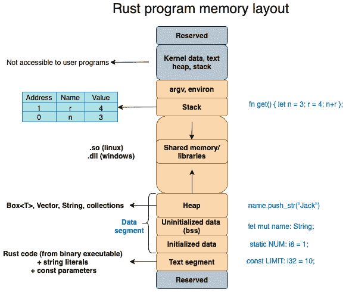
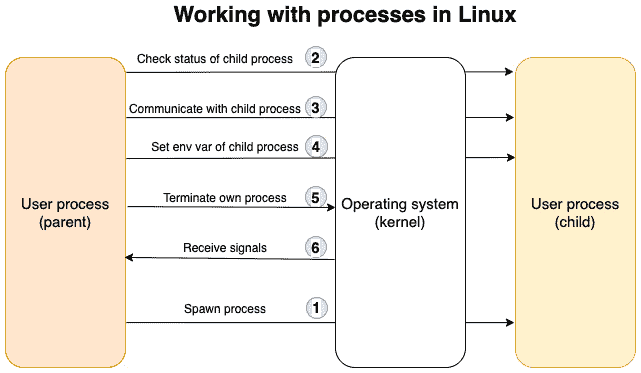

# 第八章：*第八章*：与进程和信号一起工作

你知道当你将命令输入到电脑的终端界面时，这些命令是如何被执行的吗？这些命令是直接由操作系统执行的，还是有一个中间程序来处理它们？当你从命令行在前台运行一个程序并按下*Ctrl* + *C*时，谁在监听这个按键，程序又是如何被终止的？操作系统如何同时运行多个用户程序？程序和进程之间有什么区别？如果你对此感到好奇，那么请继续阅读。

在上一章中，我们学习了如何控制并改变用于与命令行应用程序中的用户交互的终端界面。

在本章中，我们将探讨*进程*，这是在系统编程中仅次于*文件*的第二大流行抽象。我们将学习进程是什么，它们与程序有何不同，它们是如何启动和终止的，以及如何控制进程环境。如果你想要编写如 shell 之类的系统程序，并希望对进程的生命周期有程序控制，这项技能是必要的。

我们还将通过使用*Rust 标准库*构建一个基本的 shell 程序作为迷你项目。这将让你对流行的 shell，如*Bourne*、*Bash*和*zsh*在底层的工作方式有一个实际的理解，并教你如何在 Rust 中构建你自己的定制 shell 环境的基础知识。

我们将按照以下顺序介绍这些主题：

+   理解 Linux 进程概念和系统调用

+   使用 Rust 启动新进程

+   处理子进程的 I/O 和环境变量

+   处理恐慌、错误和信号

+   在 Rust 中编写基本 shell 程序（项目）

在本章结束时，你将学会如何以独立进程的方式编程启动新程序，如何设置和调整环境变量，如何处理错误，响应外部信号，以及优雅地退出进程。你将学习如何使用 Rust 标准库与操作系统进行交互以执行这些任务。这让你作为系统程序员，对这一重要系统资源拥有极大的控制权；即，*进程*。

# 技术要求

使用以下命令验证`rustc`和`cargo`是否已正确安装：

```rs
rustc –version
cargo --version
```

本章中代码的 Git 仓库可以在[`github.com/PacktPublishing/Practical-System-Programming-for-Rust-Developers/tree/master/Chapter08`](https://github.com/PacktPublishing/Practical-System-Programming-for-Rust-Developers/tree/master/Chapter08)找到。

注意

信号处理部分需要 Unix-like 的开发环境（*Unix*、*Linux*或*macOS*），因为 Microsoft Windows 没有直接的概念。如果您使用 Windows，请下载一个虚拟机，例如 Oracle VirtualBox([`www.virtualbox.org/wiki/Downloads`](https://www.virtualbox.org/wiki/Downloads))，或者使用*Docker*容器来启动一个*Unix/Linux*镜像以继续操作。

# 理解 Linux 进程概念和系统调用

在本节中，我们将介绍进程管理的 fundamentals，并了解为什么它在系统编程中很重要。我们将查看进程生命周期，包括*创建新进程*、*设置其环境参数*、*处理其标准输入和输出*以及*终止进程*。

本节首先理解*程序*和*进程*之间的区别。然后，我们将深入了解 Linux 进程的基本要素。最后，我们将概述如何使用 Rust 标准库封装的系统调用来管理进程生命周期。

## 程序如何变成进程？

**进程**是一个正在运行的**程序**。更准确地说，它是一个正在运行的程序的*实例*。您可以在同一时间运行单个程序的多个实例，例如从多个终端窗口启动文本编辑器。每个这样的运行程序实例都是一个*进程*。

即使一个进程是运行（或执行）程序的结果，这两个概念是不同的。程序以两种形式存在——**源代码**和**机器可执行指令**（目标代码或可执行文件）。通常使用编译器（和链接器）将程序的源代码转换为*机器可执行指令*。

*机器可执行指令*包含操作系统如何*将程序加载到内存中*、*初始化*它和*运行*它的信息。指令包括以下内容：

+   可执行文件格式（例如，**ELF**是 Unix 系统中流行的可执行文件格式）。

+   CPU 将要执行的程序逻辑。

+   程序入口点的内存地址。

+   初始化程序变量和常数的某些数据。

+   关于共享库、函数和变量位置的信息。

当程序从命令行、脚本或图形用户界面启动时，以下步骤会发生：

1.  操作系统（内核）为程序分配虚拟内存（这也被称为程序的**内存布局**）。我们在*第五章*，“Rust 中的内存管理”中看到了这一点，它说明了程序在*栈*、*堆*、*文本*和*数据*段方面的虚拟内存布局。

1.  内核随后将程序指令加载到虚拟内存的*文本段*中。

1.  内核在*数据段*中初始化程序变量。

1.  内核触发 CPU 开始执行程序指令。

1.  内核还向运行中的程序提供访问所需资源的权限，例如文件或额外的内存。

进程（运行中的程序）的内存布局在第 *第五章*，“内存管理”中进行了讨论。它在此处以 *图 8.1* 的形式重现，以供参考：



图 8.1 – 程序内存布局

我们已经看到了程序的*内存布局*。那么，什么是*进程*呢？

对于内核来说，一个进程是一个由以下内容组成的抽象：

+   虚拟内存，其中加载了程序指令和数据，这在 *图 8.1* 的程序内存布局中表示。

+   一组关于运行程序的元数据，例如*进程标识符*、与程序关联的*系统资源*（例如打开文件列表）、*虚拟内存表*以及关于程序的其他此类信息。特别重要的是*进程 ID*，它唯一地标识了一个运行程序的实例。

    注意

    内核本身是 `init`，被分配了一个 *进程 ID* 为 *1*。`init` 进程仅在系统关闭时终止，并且不能被杀死。所有未来的进程都是由 `init` 进程或其子进程创建的。

    因此，程序指的是程序员创建的指令（在源代码或机器可执行格式中），而进程是使用系统资源并由内核控制的程序的运行实例。作为程序员，如果我们想控制一个运行中的程序，我们将需要使用适当的*系统调用*到内核。Rust 标准库将这些系统调用封装成整洁的 API，以便在 Rust 程序中使用，正如在第 *第三章*，“Rust 标准库简介”中讨论的那样。

我们已经看到了程序与进程之间的关系。接下来，让我们在下一节中讨论一下进程的*特性*的更多细节。

## 深入探讨 Linux 进程基础

在*第三章*，“系统编程的 Rust 标准库和关键 crate 简介”中，我们看到了系统调用是如何作为用户程序（进程）和内核（操作系统）之间的接口的。使用系统调用，用户程序可以管理和控制各种系统资源，如*文件*、*内存*、*设备*等。

在本节中，我们将探讨一个运行中的程序（父进程）如何通过系统调用管理另一个程序（子进程）的生命周期。回想一下，在 Linux 中，进程也被视为系统资源，就像文件或内存一样。本节的重点是了解一个进程如何管理和与另一个进程通信。

*图 8.2* 展示了与进程管理相关的关键任务集：



图 8.2 – 在 Rust 中处理进程

让我们回顾一下前面图中显示的过程管理任务。我们将看到非 Rust 用户程序（例如，C/C++）如何在 Linux 上进行进程管理，以及它与 Rust 的不同之处。

### 创建新进程

在使用 Unix/Linux 时，任何需要创建新进程的用户程序都必须使用系统调用（*系统调用*）请求内核执行。一个程序（我们可以称之为 `fork()` 系统调用。内核复制父进程并创建一个具有唯一 ID 的 *子进程*。子进程获得父进程的内存空间（堆、栈等）的精确副本。子进程也获得了与父进程相同的程序指令副本。

创建后，子进程可以选择将其进程内存空间中的不同程序加载并执行。这是通过 `exec()` 系列的 *系统调用* 实现的。

因此，基本上，Unix/Linux 中用于 *创建新子进程* 的 *系统调用* 与用于将 *新程序* 加载到子进程中并执行它的系统调用是不同的。然而，Rust 标准库为我们简化了这一点，并提供了一个统一的接口，这两个步骤可以在创建新子进程时结合在一起。我们将在下一节中看到这方面的示例。

让我们回到章节开头的问题：*当你在一个终端的命令行中键入某些内容时，究竟发生了什么？*

当你在命令行中键入程序可执行文件名来运行程序时，会发生两件事：

1.  首先，使用 `fork()` 系统调用创建一个新的进程。

1.  然后，新程序的图像（即，*程序可执行文件*）被加载到内存中，并使用 `exec()` 系列调用执行。

    当你在终端中键入命令时会发生什么？

    终端（正如我们在上一章中看到的）为用户提供了一个与系统交互的接口。但必须有一些东西来解释这些命令并执行它们。这就是 `find * | grep debug | wc -l`

    当这个命令被输入到终端时，shell 程序会启动三个进程来执行这个命令管道。正是这个 shell 命令使系统调用内核创建新进程、加载这些命令并按顺序执行它们。然后 shell 返回执行结果并将其打印到标准输出。

### 检查子进程的状态

一旦内核创建了一个子进程，它会返回一个子 *进程 ID*。`wait()` 和 `waitpid()` 系统调用可以通过传递 *子进程 ID* 到调用中来检查子进程是否正在运行。这些调用有助于同步子进程的执行与父进程。Rust 系统库提供了等待子进程完成并检查其状态的调用。

### 使用进程间通信进行通信

进程可以通过信号、管道、套接字、消息队列、信号量和共享内存等机制相互通信，并与内核（记住内核也是一个进程）协调其活动。在 Rust 中，两个进程也可以通过管道、进程和消息队列等多种方式通信。但父进程和子进程之间基本形式的**进程间通信**（**IPC**）涉及*stdin/stdout 管道*。父进程可以向标准输入写入，并从子进程的标准输出读取。我们将在后面的章节中看到一个例子。

### 设置环境变量

每个进程都有自己的关联环境变量集。`fork()`和`exec()`系统调用允许从父进程传递和设置环境变量到子进程。这些环境变量的值存储在进程的虚拟内存区域中。Rust 标准库还允许父进程显式设置或重置子进程的环境变量。

### 终止进程

进程可以通过使用`exit()`系统调用或被信号（如用户按下*Ctrl* + *C*）或使用`kill()`系统调用杀死来终止自己。Rust 也有一个`exit()`调用用于此目的。Rust 还提供了其他终止进程的方法，我们将在后面的章节中探讨。

### 处理信号

信号用于将异步事件（如键盘中断）与进程通信。除了 SIGSTOP 和 SIGKILL 这两个信号外，进程可以选择忽略信号或决定以自己的方式响应它们。直接使用 Rust 标准库处理信号对开发者来说并不友好，因此我们可以使用外部 crate。我们将在后面的章节中使用这样一个 crate。

在本节中，我们看到了程序和进程之间的区别，深入探讨了 Linux 进程的一些特性，并概述了在 Rust 中我们可以做些什么来与进程交互。

在下一节中，我们将通过编写一些代码来亲身体验如何使用 Rust 创建、交互和终止进程。请注意，在接下来的几个章节中，只提供代码片段。为了执行代码，您需要创建一个新的 cargo 项目，并将显示在`src/main.rs`文件中的代码添加到适当的模块导入中。

# 使用 Rust 创建进程

在 Rust 标准库中，`std::process`是用于处理进程的模块。在本节中，我们将探讨如何使用 Rust 标准库来*创建新进程*、*与子进程交互*和*终止当前进程*。Rust 标准库内部使用相应的 Unix/Linux *系统调用*来调用内核操作以管理进程。

让我们从启动新的子进程开始。

## 创建新的子进程

`std::process::Command`用于在指定路径启动程序或运行标准 shell 命令。可以使用构建器模式构造新进程的配置参数。让我们看一个简单的例子：

```rs
use std::process::Command;
fn main() {
    Command::new("ls")
        .spawn()
        .expect("ls command failed to start");
}
```

显示的代码使用`Command::new()`方法创建一个用于执行的新命令，该命令以要运行的程序名称作为参数。`spawn()`方法创建一个新的子进程。

如果你运行此程序，你将看到当前目录中文件的列表。

这是使用 Rust 标准库将标准 Unix *shell 命令*或*用户程序*作为子进程的最简单方法。

如果你想要向 shell 命令传递参数怎么办？以下代码片段显示了传递参数到命令的示例：

```rs
use std::process::Command;
fn main() {
    Command::new("ls")
        .arg("-l")
        .arg("-h")
        .spawn()
        .expect("ls command failed to start");
}
```

可以使用`arg()`方法向程序传递一个参数。这里我们想要运行`ls –lh`命令以以长格式显示可读的文件大小。我们必须使用`arg()`方法两次来传递两个标志。

或者，可以使用如这里所示的方法使用`args()`。请注意，在未来的代码片段中已经删除了`std::process`导入和`main()`函数声明以避免重复，但你在运行程序之前必须添加它们：

```rs
Command::new("ls")
        .args(&["-l", "-h"]).spawn().unwrap();
```

让我们修改代码以列出相对于当前目录上一级的目录内容。

代码显示了通过`args()`方法配置的`ls`命令的两个参数。

接下来，让我们将子进程的当前目录设置为非默认值：

```rs
    Command::new("ls")
        .current_dir("..")
        .args(&["-l", "-h"])
        .spawn()
        .expect("ls command failed to start");
```

在前面的代码中，我们正在生成一个进程来在目录上一级运行`ls`命令。

使用以下命令运行程序：

```rs
 cargo run 
```

你将看到父目录的列表显示。

到目前为止，我们已经使用`spawn()`创建了一个新的子进程。此方法返回子进程的句柄。

使用`output()`也可以用另一种方式生成一个新的进程。区别在于`output()`生成子进程并等待其终止。让我们看一个例子：

```rs
    let output = Command::new("cat").arg("a.txt").output().
        unwrap();
    if !output.status.success() {
        println!("Command executed with failing error code");
    }
    println!("printing: {}", String::from_utf8(output.stdout).
        unwrap());
```

我们使用`output()`方法生成一个新的进程来打印出名为`a.txt`的文件内容。让我们使用以下命令创建此文件：

```rs
echo "Hello World" > a.txt
```

如果你运行程序，你将看到`a.txt`文件的内容打印到终端。请注意，我们正在打印子进程的标准输出句柄的内容，因为默认情况下`cat`命令的输出被定向到那里。我们将在本章后面学习如何与子进程的`stdin`和`stdout`进行更多操作。

现在我们将看看如何终止一个进程。

## 终止进程

我们已经看到了如何生成新的进程。那么，如何终止它们呢？为此，Rust 标准库提供了两种方法——`abort()`和`exit()`。

以下代码片段显示了`abort()`方法的使用：

```rs
use std::process;
fn main() {
    println!("Going to abort process");
    process::abort();
    // This statement will not get executed
    println!("Process aborted");
}
```

此代码终止了当前进程，并且最后的语句将不会打印出来。

还有一个类似于`abort()`的`exit()`方法，但它允许我们指定一个可供调用进程使用的退出代码。

进程返回错误代码有什么好处？子进程可能会因为各种错误而失败。当程序失败且子进程退出时，对于调用程序或用户来说，知道表示失败原因的错误代码将是有用的。**0**表示成功退出。其他错误代码表示各种条件，如*数据错误*、*系统文件错误*、*I/O 错误*等。错误代码是平台特定的，但大多数类 Unix 平台使用 8 位错误代码，允许错误值在 0 到 255 之间。Unix BSD 的错误代码示例可以在[`www.freebsd.org/cgi/man.cgi?query=sysexits&apropos=0&sektion=0&manpath=FreeBSD+11.2-stable&arch=default&format=html`](https://www.freebsd.org/cgi/man.cgi?query=sysexits&apropos=0&sektion=0&manpath=FreeBSD+11.2-stable&arch=default&format=html)找到。

以下是一个示例，展示了使用`exit()`方法从进程返回错误代码：

```rs
use std::process;
fn main() {
    println!("Going to exit process with error code 64"); 
    process::exit(64);
    // execution never gets here
    println!("Process exited");
}
```

在你的终端命令行上运行此程序。要在类 Unix 系统上知道最后一个执行进程的退出代码，你可以在命令行上输入`$?`。请注意，此命令可能因平台而异。

`abort()`与`exit()`的比较

注意，`abort()`和`exit()`都不会清理并调用任何析构函数，所以如果你想以干净的方式关闭进程，这些方法应该在所有析构函数运行之后才调用。然而，操作系统将确保在进程终止时，与该进程关联的所有资源，如内存和文件描述符，将自动可用于其他进程的重新分配。

在本节中，我们看到了如何创建和终止进程。接下来，让我们看看如何在子进程创建后检查其执行状态。

## 检查子进程执行状态

如前所述，当我们启动一个新的进程时，我们也会指定在进程内要执行的程序或命令。通常，我们还会关心这个程序或命令是否已成功执行，以便采取适当的行动。

Rust 标准库提供了一个`status()`方法，让我们可以找出进程是否成功完成执行。以下是一些示例用法：

```rs
use std::process::Command;
fn main() {
    let status = Command::new("cat")
        .arg("non-existent-file.txt")
        .status()
        .expect("failed to execute cat");

    if status.success() {
        println!("Successful operation");
    } else {
        println!("Unsuccessful operation");
    }
}
```

运行此程序，你将在终端看到打印出**操作失败**的消息。使用有效的文件名重新运行程序，你将看到成功消息被打印出来。

这部分内容到此结束。你学习了在单独的子进程中运行命令的不同方法，如何终止它们，以及如何获取它们执行的状态。

在下一节中，我们将探讨如何设置环境变量以及与子进程的 I/O 操作。

# 处理 I/O 和环境变量

在本节中，我们将探讨如何处理与子进程的 I/O，并学习如何为子进程设置和清除环境变量。

我们为什么需要这样做？

以一个负载均衡器为例，该负载均衡器负责根据传入的请求启动新的工作进程（Unix 进程）。假设新的工作进程从环境变量中读取配置参数以执行其任务。那么，负载均衡器进程就需要启动工作进程并设置其环境变量。同样，可能还有另一种情况，父进程想要读取子进程的标准输出或标准错误并将其路由到日志文件。让我们了解如何在 Rust 中执行此类活动。我们将从处理子进程的 I/O 开始。

## 处理子进程的 I/O

标准输入（`stdin`）、标准输出（`stdout`）和标准错误（`stderr`）是允许进程与周围环境交互的抽象。

例如，当许多用户进程同时运行时，当用户在终端上输入按键时，内核会将按键传递给正确进程的标准输入。同样，一个 Rust 程序（作为在 shell 中运行的进程）可以向其标准输出打印字符，这些字符随后被 shell 程序读取并传递到终端屏幕供用户查看。让我们学习如何使用 Rust 标准库来处理标准输入和标准输出。

`std::process::Stdio`上的`piped()`方法允许子进程通过管道（这是类 Unix 系统中的 IPC 机制）与其父进程通信。

我们首先看看如何从父进程与子进程的标准输出句柄进行通信：

```rs
use std::io::prelude::*;
use std::process::{Command, Stdio};

fn main() {
    // Spawn the `ps` command
    let process = match Command::new("ps").
    stdout(Stdio::piped()).spawn() {
        Err(err) => panic!("couldn't spawn ps: {}", err),
        Ok(process) => process,
    };
    let mut ps_output = String::new();
    match process.stdout.unwrap().read_to_string(&mut     
    ps_output) {
        Err(err) => panic!("couldn't read ps stdout: {}", 
            err),
        Ok(_) => print!("ps output from child process 
            is:\n{}", ps_output),
    }
}
```

在前面的代码片段中，我们首先创建一个新的子进程来运行`ps`命令以显示当前正在运行的所有进程。默认情况下，输出会被发送到子进程的`stdout`。

为了从父进程获取对子进程`stdout`的访问权限，我们使用`stdio::piped()`方法创建一个 Unix 管道。`process`变量是子进程的句柄，`process.stdout`是子进程标准输出的句柄。父进程可以从这个句柄读取，并将其内容打印到自己的`stdout`（即父进程的`stdout`）。这就是父进程如何读取子进程的输出。

现在我们来写一些代码，从父进程向子进程的标准输入发送一些字节：

```rs
    let process = match Command::new("rev")
        .stdin(Stdio::piped())               <1>
        .stdout(Stdio::piped())              <2>
        .spawn()
    {
        Err(err) => panic!("couldn't spawn rev: {}", err),
        Ok(process) => process,
    };
    match process.stdin.unwrap().write_all
        ("palindrome".as_bytes()) {
        Err(why) => panic!("couldn't write to stdin: {}", 
            why),
        Ok(_) => println!("sent text to rev command"),
    }                                      <3>
    let mut child_output = String::new();
    match process.stdout.unwrap().read_to_string(&mut 
        child_output) {
        Err(err) => panic!("couldn't read stdout: {}", err),
        Ok(_) => print!("Output from child process is:\n{}", 
            child_output),
    }                                             <4>
```

以下代码中编号注释的描述在此提供：

1.  在父进程和子进程的标准输入之间注册一个管道连接。

1.  在父进程和子进程的标准输出之间注册一个管道连接。

1.  向子进程的标准输入写入字节。

1.  从子进程的*标准输出*读取并打印到终端屏幕。

子进程中还有一些其他方法可用。`id()`方法提供子进程的*进程 ID*，`kill()`方法终止子进程，`stderr`方法提供对子进程的*标准错误*的句柄，而`wait()`方法使父进程等待直到子进程完全退出。

我们已经看到了如何处理子进程的 I/O。现在让我们学习如何处理环境变量。

## 设置子进程的环境

让我们看看如何为子进程设置环境变量。以下示例展示了如何为子进程设置路径环境变量：

```rs
use std::process::Command;
fn main() {
    Command::new("env")
        .env("MY_PATH", "/tmp")
        .spawn()
        .expect("Command failed to execute");
}
```

`std::process::Command`上的`env()`方法允许父进程为正在创建的子进程设置环境变量。运行程序并使用以下命令进行测试：

```rs
cargo run | grep MY_PATH
```

你将看到程序中设置的`MY_PATH`环境变量的值。

要设置多个环境变量，可以使用`envs()`命令。

可以通过使用`env_clear()`方法清除子进程的环境变量，如下所示：

```rs
    Command::new("env")
        .env_clear()
        .spawn()
        .expect("Command failed to execute");
```

使用`cargo run`运行程序，你会看到对于`env`命令没有任何输出。通过注释掉`.env_clear()`语句重新运行程序，你将发现`env`值被打印到终端。

要删除特定的环境变量，可以使用`env_remove()`方法。

通过这种方式，我们结束了本节。我们看到了如何与子进程的标准输入和标准输出交互以及如何设置/重置环境变量。在下一节中，我们将学习如何处理子进程中的错误和信号。

# 处理恐慌、错误和信号

进程可能由于各种错误条件而失败。这些必须在受控的方式下处理。也可能存在我们想要根据外部输入（如用户按下*Ctrl* + *C*）终止进程的情况。我们如何处理这种情况是本节的重点。

注意

在进程由于错误而退出的情况下，操作系统本身会执行一些清理工作，例如释放内存、关闭网络连接以及释放与进程关联的任何文件句柄。但有时，你可能希望程序驱动的控制来处理这些情况。

进程执行失败可以大致分为两种类型 – *不可恢复的错误*和*可恢复的错误*。当进程遇到不可恢复的错误时，有时别无选择，只能终止进程。让我们看看如何做到这一点。

## 终止当前进程

我们在“使用 Rust 创建进程”部分看到了如何终止和退出一个进程。`process::Command`上的`abort()`和`exit()`方法可以用于此目的。

在某些情况下，我们故意允许程序在某些条件下失败而不进行处理，主要是在不可恢复错误的情况下。`std::panic`宏允许我们使当前线程崩溃。这意味着程序会立即终止并向调用者提供反馈。但与`exit()`或`abort()`方法不同，它会回滚当前线程的堆栈并调用所有析构函数。以下是`panic!`宏使用的一个示例：

```rs
use std::process::{Command, Stdio};
fn main() {
    let _child_process = match Command::new("invalid-command")
        .stdin(Stdio::piped())
        .stdout(Stdio::piped())
        .spawn()
    {
        Err(err) => panic!("Unable to spawn child process: 
            {}", err),
        Ok(new_process_handle) => {
            println!("Successfully spawned child process");
            new_process_handle
        }
    };
} 
```

使用`cargo run`运行程序，你将看到从`panic!`宏打印出的错误消息。还有一个可以在`panic`宏执行标准清理之前注册的自定义钩子。以下是相同的示例，这次带有自定义的`panic`钩子：

```rs
use std::panic;
use std::process::{Stdio,Command};
fn main() {
panic::set_hook(Box::new(|_| {
            println!(" This is an example of custom panic 
                hook, which is invoked on thread panic, but 
                before the panic run-time is invoked")
        }));       
    let _child_process = match Command::new("invalid-command")
        .stdin(Stdio::piped())
        .stdout(Stdio::piped())
        .spawn()
    {
        Err(err) => panic!("Normal panic message {}", err),
        Ok(new_process_handle) => new_process_handle,
    };
}
```

运行此程序时，你会看到显示自定义错误钩子消息，因为我们提供了一个无效的命令来作为子进程启动。

注意，`panic!`仅应用于不可恢复的错误。例如，如果一个子进程尝试打开一个不存在的文件，这可以通过使用可恢复错误机制（如`Result`枚举）来处理。使用`Result`的优势在于程序可以返回到其原始状态，并且失败的操作可以重试。如果使用`panic!`，程序会突然终止，并且无法恢复程序的原始状态。但有些情况下，`panic!`可能是合适的，例如当系统中的进程耗尽内存时。

接下来，让我们看看进程控制的另一个方面——信号处理。

## 信号处理

在类 Unix 系统中，操作系统可以向进程发送信号。请注意，Windows 操作系统没有信号。进程可以以它认为合适的方式处理信号，甚至可以忽略信号。操作系统为处理各种信号提供了默认设置。例如，当你从 shell 向一个进程发出 kill 命令时，会生成`SIGTERM`信号。默认情况下，程序在接收到这个信号时会终止，并且不需要在 Rust 中编写特殊代码来处理这个信号。同样，当用户按下*Ctrl* + *C*时，会接收到`SIGINT`信号。但 Rust 程序可以选择以自己的方式处理这些信号。

然而，由于各种原因，正确处理 Unix 信号是困难的。例如，信号可以在任何时候发生，并且处理信号的线程无法继续，直到信号处理程序完成执行。此外，信号可以在任何线程上发生，需要同步。因此，在 Rust 中，最好使用第三方 crate 进行信号处理。请注意，即使在使用外部 crate 的情况下，也应谨慎行事，因为这些 crate 并没有解决与信号处理相关的所有问题。

现在让我们看看使用`signal-hook`crate 处理信号的示例。将其添加到`Cargo.toml`中的依赖项，如下所示：

```rs
[dependencies]
signal-hook = "0.1.16"
```

下面是一个示例代码片段：

```rs
use signal_hook::iterator::Signals;
use std::io::Error;
fn main() -> Result<(), Error> {
    let signals = Signals::new(&[signal_hook::SIGTERM, 
        signal_hook::SIGINT])?;
    'signal_loop: loop {
        // Pick up signals that arrived since last time
        for signal in signals.pending() {
            match signal {
                signal_hook::SIGINT => {
                    println!("Received signal SIGINT");
                }
                signal_hook::SIGTERM => {
                    println!("Received signal SIGTERM");
                    break 'signal_loop;
                }
                _ => unreachable!(),
            }
        }
    }
    println!("Terminating program");
    Ok(())
}
```

在前面的代码中，我们在 `match` 子句中监听两个特定的信号，`SIGTERM` 和 `SIGINT`。`SIGINT` 可以通过按下 *Ctrl* + *C* 发送到程序。`SIGTERM` 信号可以通过在 Unix shell 的命令行中使用 `kill` 命令从 *进程 ID* 生成。

现在，运行程序并模拟两个信号。然后，按下 *Ctrl* + *C* 键组合，这将生成 `SIGINT` 信号。你会看到，与默认行为（即终止程序）不同，终端会打印出一条语句。

为了模拟 `SIGTERM`，在 Unix shell 的命令行中运行 `ps` 命令并检索 *进程 ID*。然后运行带有 *进程 ID* 的 `kill` 命令。你会看到进程终止，并且终端会打印出一条语句。

注意

如果你正在使用 **tokio** 进行异步代码，你可以使用信号钩子的 **tokio-support** 功能。

重要的是要记住，信号处理是一个复杂的话题，即使在编写自定义信号处理代码时，也需要谨慎行事。

在处理信号或处理错误时，记录信号或错误也是一个好的做法，以便将来供系统管理员参考和故障排除。然而，如果你想让程序读取这些日志，你可以使用外部包如 `serde_json` 将这些消息以 JSON 格式记录，而不是纯文本。

这就结束了关于在 Rust 中处理 *panic*、*errors* 和 *signals* 的本小节。现在，让我们编写一个 shell 程序来演示所讨论的一些概念。

# 在 Rust 中编写 shell 程序（项目）

我们在 *深入 Linux 进程基础* 部分学习了什么是 shell 程序。在本节中，我们将构建一个 shell 程序，并逐步添加功能。

在第一个迭代中，我们将编写基本的代码来从命令行读取 shell 命令并启动子进程来执行该命令。接下来，我们将添加将命令参数传递给子进程的功能。最后，我们将通过添加对用户以更自然语言语法输入命令的支持来个性化 shell。我们还将在这个最后迭代中引入错误处理。让我们开始吧：

1.  让我们首先创建一个新的项目：

    ```rs
    cargo new myshell && cd myshell
    ```

1.  创建三个文件：`src/iter1.rs`、`src/iter2.rs` 和 `src/iter3.rs`。三个迭代的代码将放在这些文件中，以便可以单独构建和测试每个迭代。

1.  在 `Cargo.toml` 中添加以下内容：

    ```rs
    [[bin]]
    name = "iter1"
    path = "src/iter1.rs"
    [[bin]]
    name = "iter2"
    path = "src/iter2.rs"
    [[bin]]
    name = "iter3"
    path = "src/iter3.rs"
    ```

    在前面的代码中，我们指定给 Cargo 工具，我们想要为三个迭代构建单独的二进制文件。

现在，我们已经准备好开始 shell 程序的第一个迭代。

### 迭代 1 – 启动子进程执行命令

首先，让我们编写一个程序来从终端接收命令，然后启动一个新的子进程来执行这些用户命令。添加一个循环结构以在进程终止前循环接受用户命令。代码如下：

src/iter1.rs

```rs
use std::io::Write;
use std::io::{stdin, stdout};
use std::process::Command;
fn main() {
    loop {
        print!("$ ");                               <1>
        stdout().flush().unwrap();                  <2>
        let mut user_input = String::new();         <3>
        stdin()
            .read_line(&mut user_input)             <4>
            .expect("Unable to read user input");	
        let command_to_execute = user_input.trim(); <5>
        let mut child = Command::new(command_to_execute) <6>
            .spawn()
            .expect("Unable to execute command");
        child.wait().unwrap();                       <7>
    }
}
```

上述代码中的编号注释描述如下：

1.  显示`$`提示符以提示用户输入命令。

1.  清空`stdout`句柄，以便`$`提示符立即在终端上显示。

1.  创建一个缓冲区来保存用户输入的命令。

1.  逐行读取用户命令。

1.  从缓冲区中删除换行符（这是当用户按下*Enter*键提交命令时添加的）。

1.  创建一个新的子进程并将用户命令传递给子进程以执行。

1.  在接受更多用户输入之前，请等待子进程完成执行。

1.  使用以下命令运行程序：

```rs
cargo run –-bin iter1 
```

在`$`提示符下输入不带参数的任何命令，如`ls`或`ps`或`du`。你将在终端上看到命令执行的输出。你可以在下一个`$`提示符下继续输入更多此类命令。按*Ctrl* + *C*退出程序。

我们现在有了我们 shell 程序的第一版，但如果在命令后输入参数或标志，这个程序将会失败。例如，输入`ls`这样的命令是可行的，但输入`ls –lah`将会导致程序恐慌并退出。让我们在代码的下一个迭代中添加对命令参数的支持。

### 迭代 2 – 添加对命令参数的支持

让我们使用`args()`方法添加对命令参数的支持：

src/iter2.rs

```rs
// Module imports not shown here
fn main() {
    loop {
        print!("$ ");
        stdout().flush().unwrap();
        let mut user_input = String::new();
        stdin()
            .read_line(&mut user_input)
            .expect("Unable to read user input");
        let command_to_execute = user_input.trim();
        let command_args: Vec<&str> =      
            command_to_execute.split_whitespace().
            collect(); <1>

        let mut child = Command::new(command_args[0])            
                                                       <2>
            .args(&command_args[1..])   <3>
            .spawn()
            .expect("Unable to execute command");
        child.wait().unwrap();
    }
}
```

显示的代码基本上与上一个代码片段相同，除了添加了三条注释编号的额外行。注释描述如下：

1.  读取用户输入，按空格分割，并将结果存储在`Vec`中。

1.  `Vec`的第一个元素对应于命令。创建一个子进程来执行此命令。

1.  将`Vec`元素列表（从第二个元素开始）作为参数列表传递给子进程。

1.  使用以下行运行程序：

    ```rs
    cargo run -–bin iter2 
    ```

1.  在按*Enter*键之前输入一个命令并将其参数传递给它。例如，你可以输入以下命令之一：

    ```rs
    ls –lah
    ps -ef
    cat a.txt 
    ```

注意，在最后一个命令中，`a.txt` 是一个包含一些内容并位于项目根目录中的现有文件。

你将看到命令输出成功显示在终端上。到目前为止，shell 按预期工作。现在让我们在下一个迭代中稍微扩展一下。

### 迭代 3 – 支持自然语言命令

由于这是我们自己的 shell，让我们在这个迭代中实现一个用户友好的 shell 命令别名（为什么不呢？）。除了输入`ls`之外，如果用户可以像以下这样输入自然语言的命令会怎样：

```rs
show files
```

这是我们接下来要编写的代码。以下代码片段显示了代码。让我们首先看看模块导入：

```rs
use std::io::Write;
use std::io::{stdin, stdout};
use std::io::{Error, ErrorKind};
use std::process::Command;
```

从 `std::io` 模块导入用于向终端写入、从终端读取以及用于错误处理的模块。我们已经知道了导入 `process` 模块的目的。

现在我们来分部分查看 `main()` 程序。我们不会涵盖之前迭代中已经看到的代码。`main()` 函数的完整代码可以在 GitHub 仓库的 `src/iter3.rs` 文件中找到：

1.  在显示 `$` 提示符后，检查用户是否输入了任何命令。如果用户在提示符下只按了 *Enter* 键，则忽略并重新显示 `$` 提示符。以下代码检查用户是否至少输入了一个命令，然后处理用户输入：

    ```rs
    if command_args.len() > 0 {..}
    ```

1.  如果输入的命令是 `show files`，则在子进程中执行 `ls` 命令。如果命令是 `show process`，则执行 `ps` 命令。如果没有参数输入 `show`，或者 `show` 命令后跟无效的单词，则抛出错误：

    ```rs
                let child = match command_args[0] {
                    "show" if command_args.len() > 1 => match 
                        command_args[1] {
                        "files" => Command::new("ls").
                            args(&command_args[2..]).spawn(),

                        "process" => Command::new("ps").args
                            (&command_args[2..]).spawn(),

                        _ => Err(Error::new(
                            ErrorKind::InvalidInput,
                            "please enter valid command",
                        )),
                    },
                    "show" if command_args.len() == 1 => 
                        Err(Error::new(
                        ErrorKind::InvalidInput,
                        "please enter valid command",
                    )),
                    "quit" => std::process::exit(0),
                    _ => Command::new(command_args[0])
                        .args(&command_args[1..])
                        .spawn(),
                };
    ```

1.  等待子进程完成。如果子进程未能成功执行，或者用户输入无效，则抛出错误：

    ```rs
                match child {
                    Ok(mut child) => {
                        if child.wait().unwrap().success() {
                        } else {
                            println!("\n{}", "Child process 
                                failed")
                        }
                    }
                    Err(e) => match e.kind() {
                        ErrorKind::InvalidInput => eprintln!(                        
                            "Sorry, show command only 
                            supports following options: files 
                            , process "
                        ),
                        _ => eprintln!("Please enter a 
                            valid command"),
                    },
                }
    ```

1.  使用 `cargo run –-bin iter3` 运行程序，并在 `$` 提示符下尝试以下命令以进行测试：

    ```rs
    show files
    show process 
    du
    ```

你会看到命令成功执行，并打印出表示成功的语句。

你会注意到我们在代码中添加了一些错误处理。让我们看看我们解决了哪些错误条件：

+   如果用户在输入命令前直接按 *Enter* 键

+   如果用户输入了没有参数的 `show` 命令（无论是文件还是进程）

+   如果用户输入了无效参数的 `show` 命令

+   如果用户输入了有效的 Unix 命令，但该命令不受我们的程序支持（例如，`pipes` 或 `redirection`）

让我们尝试以下无效输入：

```rs
show memory
show
invalid-command
```

你会看到错误信息被打印到终端。

也尝试在提示符下不输入命令直接按 *Enter* 键。你会看到这不会被处理。

在错误处理代码中，注意使用 `ErrorKind` 枚举，它是在 Rust 标准库中定义的一组预定义错误类型。预定义错误类型的列表可以在 [`doc.rust-lang.org/std/io/enum.ErrorKind.html`](https://doc.rust-lang.org/std/io/enum.ErrorKind.html) 找到。

恭喜！你已经实现了一个基本的 shell 程序，它可以识别非技术用户的自然语言命令。你还实现了一些错误处理，使得程序在无效输入时具有一定的鲁棒性，不会崩溃。

作为练习，你可以做以下事情来增强这个 shell 程序：

+   添加对管道操作符分隔的命令链的支持，例如 `ps | grep sys`。

+   添加对重定向的支持，例如使用 **>** 操作符将进程执行的输出重定向到文件。

+   将命令行解析的逻辑移动到单独的标记器模块中。

在本节中，我们编写了一个具有现实世界 shell 程序（如`zsh`或`bash`）部分功能的 shell 程序。为了明确，现实世界的 shell 程序具有更多复杂的功能，但在这里我们已经涵盖了创建 shell 程序背后的基本概念。同样重要的是，我们学习了如何处理无效用户输入或子进程失败时的错误。为了内化你的学习，建议为建议的练习编写一些代码。

这就完成了 Rust 编写 shell 程序的部分。

# 摘要

在本章中，我们回顾了类 Unix 操作系统中进程的基本知识。我们学习了如何创建子进程，与其标准输入和标准输出进行交互，以及如何使用其参数执行命令。我们还看到了如何在错误条件下设置和清除环境变量。我们探讨了在错误条件下终止进程的各种方法，以及如何检测和处理外部信号。最后，我们用 Rust 编写了一个可以执行标准 Unix 命令的 shell 程序，还可以接受一些自然语言格式的命令。我们还处理了一系列错误，使程序更加健壮。

继续讨论管理系统资源的话题，在下一章中，我们将学习如何管理进程的线程，并在 Rust 中构建并发系统程序。
