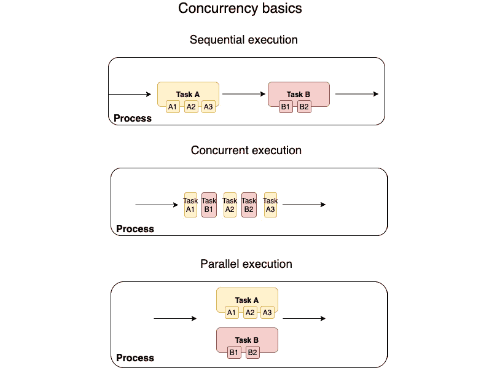

# *第九章*：管理并发

并发系统无处不在。当你下载文件、收听流媒体音乐、与朋友开始文本聊天，以及在你的电脑后台打印某些东西时，*同时进行*，你正在体验并发编程的魔力。操作系统在后台为你管理所有这些，跨可用的处理器（CPU）调度任务。

但你知道如何编写一个可以同时做很多事情的程序吗？更重要的是，你知道如何以既内存安全又线程安全的方式做到这一点，同时确保系统资源的最佳使用吗？并发编程是实现这一目标的一种方式。但并发编程在大多数编程语言中都被认为是困难的，因为存在*同步任务*和*在多个执行线程之间安全共享数据*的挑战。在本章中，你将了解 Rust 中并发的基础，以及 Rust 如何使防止常见陷阱变得更容易，并使我们能够以安全的方式编写并发程序。本章的结构如下所示：

+   复习并发基础

+   创建和配置线程

+   线程中的错误处理

+   线程间的消息传递

+   通过共享状态实现并发

+   使用定时器暂停线程执行

在本章结束时，你将学会如何通过创建新线程、处理线程错误、在线程之间安全地传输和共享数据以同步任务、理解线程安全数据类型的基础以及暂停当前线程的执行以进行同步，来用 Rust 编写并发程序。

# 技术要求

使用以下命令验证`rustup`、`rustc`和`cargo`是否已正确安装：

```rs
rustup --version
rustc --version 
cargo --version
```

本章中代码的 Git 仓库可以在以下位置找到：[`github.com/PacktPublishing/Practical-System-Programming-for-Rust-Developers/tree/master/Chapter09`](https://github.com/PacktPublishing/Practical-System-Programming-for-Rust-Developers/tree/master/Chapter09)。

让我们从并发的一些基本概念开始。

# 复习并发基础

在本节中，我们将介绍**多线程**的基础，并阐明关于**并发**和**并行**的术语。

要欣赏并发编程的价值，我们必须理解当今程序需要快速做出决策或短时间内处理大量数据的必要性。如果我们严格依赖顺序执行，那么几个用例将无法实现。让我们考虑一些必须同时执行多项任务的系统示例。

一辆自动驾驶汽车需要同时执行许多任务，例如处理来自各种传感器的输入（以构建其周围环境的内部地图），规划车辆的路径，并向车辆的执行器发送指令（以控制刹车、加速和转向）。它需要持续处理不断到达的输入事件，并在十分之一秒内做出响应。

同时还有其他一些更为常见的例子。一个网页浏览器在接收新数据的同时，会处理用户输入并逐步渲染网页。一个网站会处理来自多个同时在线用户的请求。一个网络爬虫需要同时访问成千上万的网站以收集有关网站及其内容的信息。按顺序执行所有这些事情是不切实际的。

我们已经看到了一些需要同时执行多个任务的用例。但还有一个技术原因在推动编程中的并发，那就是单核 CPU 的时钟速度已经接近实际上限。因此，有必要增加更多的 CPU 核心和单台机器上的更多处理器。这反过来又推动了需要能够高效利用额外 CPU 核心的软件的需求。为了实现这一点，程序的一部分应该在不同的 CPU 核心上并发执行，而不是被限制在单核 CPU 上的指令顺序执行。

这些因素导致了在编程中多线程概念的广泛应用。这里有两个相关的术语需要理解——*并发* 和 *并行*。让我们更深入地了解一下。

## 并发与并行

在本节中，我们将回顾多线程的基本原理，并了解程序中 *并发* 和 *并行* 执行模型之间的区别。



图 9.1 – 并发基础

*图 9.1* 展示了 Unix/Linux 进程内的三个不同的计算场景：

+   **顺序执行**：假设一个进程有两个任务 **A** 和 **B**。**任务 A** 包含三个子任务 **A1**、**A2** 和 **A3**，它们是顺序执行的。同样，**任务 B** 包含两个任务，**B1** 和 **B2**，它们是依次执行的。总体来说，进程在执行进程 *A* 的所有任务之后，才会开始执行进程 *B* 的任务。这种模型存在一个挑战。假设任务 **A2** 需要等待外部网络或用户输入，或者等待系统资源可用。在这种情况下，所有排在任务 **A2** 后面的任务都将被阻塞，直到 **A2** 完成。这不是 CPU 的高效使用，并且会导致属于该进程的所有预定任务完成延迟。

+   **并发执行**：顺序程序有限制，因为它们没有处理多个同时输入的能力。这就是为什么许多现代应用程序是**并发**的，其中存在多个并发执行的执行线程。

    在并发模型中，进程会交错执行任务，即交替执行**任务 A**和**任务 B**，直到它们都完成。在这里，即使**A2**被阻塞，它也允许其他子任务继续进行。每个子任务，**A1**、**A2**、**A3**、**B1**和**B2**，都可以在单独的执行线程上调度。这些线程可以在单个处理器上运行，也可以跨多个处理器核心调度。需要注意的是，并发是关于**顺序无关**的计算，而不是依赖于执行特定顺序以到达正确程序结果的顺序执行。编写适应**顺序无关**计算的程序比编写顺序程序更具挑战性。

+   **并行执行**：这是**并发执行**模型的一种变体。在这个模型中，进程真正地在不同的 CPU 处理器或核心上并行执行**任务 A**和**任务 B**。当然，这假设软件是以一种使得这种并行执行成为可能的方式编写的，并且**任务 A**和**任务 B**之间没有可能导致执行停滞或数据损坏的依赖关系。

    并行计算是一个广泛的概念。**并行性**可以通过在单个机器内拥有**多核**或**多处理器**来实现，或者可以有不同的计算机集群，它们可以协作执行一系列任务。

    何时使用并发与并行执行？

    当程序或函数涉及大量计算（如图形、气象或基因组处理）时，它是**计算密集型**的。这类程序的大部分时间都用于使用 CPU 周期，并且将受益于拥有更好、更快的 CPU。

    当大量处理涉及与输入/输出设备（如网络套接字、文件系统和其他设备）通信时，程序是**I/O 密集型**的。这类程序从拥有更快的 I/O 子系统（如磁盘或网络访问）中受益。

    广义上讲，**并行执行**（真正的并行性）对于在**计算密集型**用例中增加程序的吞吐量更为相关，而**并发处理**（或伪并行性）可以在**I/O 密集型**用例中增加吞吐量和降低延迟。

在本节中，我们看到了编写并发程序的两种方法——**并发**和**并行**，以及这些方法如何与顺序执行模型不同。这两个模型都使用**多线程**作为基础概念。让我们在下一节中更多地讨论这一点。

## **多线程**的概念

在本节中，我们将深入探讨在 Unix 中如何实现多线程。

Unix 支持线程作为进程执行多个任务并发的机制。一个 Unix 进程以单个线程启动，这是执行的主线程。但可以生成额外的线程，这些线程可以在单处理器系统中**并发执行**，或者在多处理器系统中**并行执行**。

每个线程都有自己的**栈**来存储自己的**局部变量**和**函数参数**。线程还维护自己的寄存器状态，包括**栈指针**和**程序计数器**。进程中的所有线程共享相同的内存地址空间，这意味着它们共享对**数据段**（*初始化数据*、*未初始化数据*和*堆*）的访问。线程还共享相同的**程序代码**（进程指令）。

在多线程进程中，多个线程并发执行相同的程序。它们可能正在执行程序的不同部分（例如不同的函数），或者它们可能在不同的线程中调用相同的函数（使用不同的数据集进行处理）。但请注意，为了使函数能够被多个线程同时调用，它需要是**线程安全的**。使函数线程安全的一些方法包括在函数中避免使用**全局**或**静态**变量，使用**互斥锁**来限制一次只有一个线程使用函数，或者使用**互斥锁**来同步对共享数据的访问。

但是，将并发程序建模为一组进程或同一进程内的线程组是一个设计选择。让我们比较这两种方法，以 Unix-like 系统为例。

由于线程位于同一进程空间中，因此跨线程共享数据要容易得多。线程还共享进程的公共资源，如**文件描述符**和**用户/组 ID**。线程创建比进程创建更快。由于它们共享相同的内存空间，因此线程之间的上下文切换对 CPU 来说也更快。但线程也带来了自己的复杂性。

如前所述，共享函数必须是线程安全的，对共享全局数据的访问应谨慎同步。此外，一个线程中的关键缺陷可能会影响其他线程，甚至可能导致整个进程崩溃。此外，没有保证不同线程中不同代码部分运行的顺序，这可能导致数据竞争、死锁或难以复现的 bug。由于 CPU 速度、线程数量和特定时间点运行的应用程序集等因素可能会改变并发程序的结果，因此与并发相关的 bug 难以调试。尽管存在这些缺点，如果决定采用基于线程的并发模型，代码结构、全局变量的使用和线程同步等方面应仔细设计。

*图 9.2*显示了进程内线程的内存布局：


图 9.2 – 进程中线程的内存布局

图表展示了在多线程模型下执行时，进程 P1 中的任务集在内存中的表示。我们在 *第五章*，*Rust 中的内存管理* 中详细看到了进程的内存布局。*图 9.2* 通过展示进程内各个线程内存分配的细节，扩展了进程内存布局。

如前所述，所有线程都在进程内存空间内分配内存。默认情况下，主线程创建时带有自己的栈。随着线程的创建，额外的线程也会分配自己的栈。我们之前在章节中讨论的共享并发模型是可能的，因为进程的全局和静态变量对所有线程都是可访问的，并且每个线程还可以将堆上创建的内存指针传递给其他线程。

然而，程序代码对线程来说是通用的。每个线程都可以从程序文本段的不同部分执行代码，并在各自的线程栈中存储局部变量和函数参数。当轮到线程执行时，其程序计数器（包含要执行指令的地址）被加载到 CPU 中，以便执行给定线程的指令集。

在图表所示的示例中，如果任务 *A2* 被阻塞等待 I/O，那么 CPU 将切换执行到另一个任务，例如 *B1* 或 *A1*。

通过这种方式，我们完成了关于并发和多线程基本知识的章节。我们现在可以开始使用 Rust 标准库编写并发程序了。

# 创建和配置线程

在上一节中，我们回顾了适用于 Unix 环境中所有用户进程的多线程基本原理。然而，线程的另一个方面取决于编程语言的实现 – 这就是 *线程模型*。

Rust 实现了一种 *1:1 模型* 的线程，其中每个操作系统线程映射到由 Rust 标准库创建的一个用户级线程。另一种模型是 *M:N*（也称为 **绿色线程**），其中存在 *M 个绿色线程*（由运行时管理的用户级线程），它们映射到 *N 个内核级线程*。

在本节中，我们将介绍使用 Rust 标准库创建 *1:1* 操作系统线程的基本知识。与线程相关的函数的 Rust 标准库模块是 `std::thread`。

使用 Rust 标准库创建新线程有两种方式。第一种方法使用 `thread::spawn` 函数，第二种方法使用 `thread::Builder` 结构体的构建模式。让我们首先看看 `thread::spawn` 函数的示例：

```rs
use std::thread;
fn main() {
    for _ in 1..5 {
        thread::spawn(|| {
            println!("Hi from thread id {:?}", 
                thread::current().id());
        });
    }
} 
```

在这个程序中使用了`std::thread`模块。`thread::spawn()`是用于创建新线程的函数。在显示的程序中，我们在主函数中（在进程的主线程中运行）创建了四个新的子线程。使用`cargo run`运行此程序。运行几次。你期望看到什么，实际上看到了什么？

你本应看到四行打印到终端，列出*线程 ID*。但你可能会注意到每次的结果都不同。有时你会看到一行打印，有时你会看到更多，有时则没有。这是为什么？

这种不一致的原因在于无法保证线程执行的顺序。此外，如果`main()`函数在子线程执行之前完成，你将不会在终端看到预期的输出。

为了解决这个问题，我们需要做的是将创建的*子线程*连接到*主线程*。然后`main()`线程等待直到所有子线程都执行完毕。为了看到这个效果，让我们按照以下方式修改程序：

```rs
use std::thread;
fn main() {
    let mut child_threads = Vec::new();
    for _ in 1..5 {
        let handle = thread::spawn(|| {
            println!("Hi from thread id {:?}", 
                thread::current().id());
        });
        child_threads.push(handle);
    }
    for i in child_threads {
        i.join().unwrap();
    }
}
```

与上一个程序相比，这些更改被突出显示。`thread::spawn()`返回一个线程句柄，我们将其存储在`Vec`集合数据类型中。在`main()`函数结束之前，我们将每个子线程连接到主线程。这确保了`main()`函数在退出之前等待所有子线程完成。

让我们再次运行程序。你会注意到打印了四行，每行对应一个线程。再次运行程序几次。每次都会打印四行。这是进步。这表明将子线程连接到主线程是有帮助的。然而，线程执行的顺序（如终端上打印输出的顺序所示）每次运行都会变化。这是因为，当我们创建多个子线程时，无法保证线程执行的顺序。这是多线程（如前所述）的一个特性，而不是一个错误。但这也是与线程一起工作的挑战之一，因为它给跨线程同步活动带来了困难。我们将在本章稍后学习如何解决这个问题。

我们已经看到了如何使用`thread::spawn()`函数创建新线程。现在让我们看看创建新线程的第二种方法。

`thread::spawn()`函数使用默认参数来设置线程名称和堆栈大小。如果你想明确设置它们，可以使用`thread:Builder`。这是一个*线程工厂*，它使用`Builder`模式来配置新线程的属性。以下示例已经使用`Builder`模式重写：

```rs
use std::thread;
fn main() {
    let mut child_threads = Vec::new();
    for i in 1..5 {
        let builder = thread::Builder::new().name(format!(
            "mythread{}", i));
        let handle = builder
            .spawn(|| {
                println!("Hi from thread id {:?}", thread::
                    current().name().unwrap());
            })
            .unwrap();
        child_threads.push(handle);
    }

    for i in child_threads {
        i.join().unwrap();
    }
}
```

代码中的更改已被突出显示。我们通过使用`new()`函数创建一个新的`builder`对象，然后使用`name()`方法配置线程的名称。然后我们在`Builder`模式的实例上使用`spawn()`方法。请注意，`spawn()`方法返回一个被`io::Result<JoinHandle<T>>`类型包裹的`JoinHandle`类型，因此我们必须解包方法的返回值以检索子进程句柄。

运行代码，你将在终端看到四个线程名称被打印出来。

我们已经看到了如何创建新的线程。现在让我们看看在处理线程时如何进行错误处理。

# 线程中的错误处理

Rust 标准库包含`std::thread::Result`类型，这是一个专门为线程设计的`Result`类型。以下代码展示了如何使用此类型的一个示例：

```rs
use std::fs;
use std::thread;
fn copy_file() -> thread::Result<()> {
    thread::spawn(|| {
        fs::copy("a.txt", "b.txt").expect("Error 
            occurred");
    })
    .join()
}
fn main() {
    match copy_file() {
        Ok(_) => println!("Ok. copied"),
        Err(_) => println!("Error in copying file"),
    }
}
```

我们有一个名为`copy_file()`的函数，该函数将源文件复制到目标文件。这个函数返回一个`thread::Result<()>`类型的值，我们在`main()`函数中使用`match`语句来解包它。如果`copy_file()`函数返回`Result::Err`变体，我们通过打印错误信息来处理它。

使用`cargo run`运行程序并传入一个无效的源文件名。你将看到错误信息：`match`子句的`Ok()`分支，成功信息将被打印出来。

这个例子展示了如何处理由线程传播到调用函数中的错误。如果我们想在错误传播到调用函数之前就识别出当前线程正在恐慌，该怎么办？Rust 标准库在`std::thread`模块中提供了一个名为`thread::panicking()`的函数，用于此目的。让我们通过修改前面的例子来学习如何使用它：

```rs
use std::fs;
use std::thread;
struct Filenames {
    source: String,
    destination: String,
}
impl Drop for Filenames {
    fn drop(&mut self) {
        if thread::panicking() {
            println!("dropped due to  panic");
        } else {
            println!("dropped without panic");
        }
    }
}
fn copy_file(file_struct: Filenames) -> thread::Result<()> {
    thread::spawn(move || {
        fs::copy(&file_struct.source, 
            &file_struct.destination).expect(
            "Error occurred");
    })
    .join()
}
fn main() {
    let foo = Filenames {
        source: "a1.txt".into(),
        destination: "b.txt".into(),
    };
    match copy_file(foo) {
        Ok(_) => println!("Ok. copied"),
        Err(_) => println!("Error in copying file"),
    }
}
```

我们创建了一个名为`Filenames`的结构体，其中包含要复制的源文件名和目标文件名。我们使用一个无效值初始化源文件名。我们还为`Filenames`结构体实现了`Drop`特质，当结构体的实例超出作用域时会被调用。在这个`Drop`特质实现中，我们使用`thread::panicking()`函数来检查当前线程是否正在恐慌，并通过打印错误信息来处理它。然后错误被传播到主函数，主函数也处理线程错误并打印出另一个错误信息。

使用`cargo run`运行程序并传入一个无效的源文件名，你将在终端看到以下信息打印出来：

```rs
dropped due to  panic
Error in copying file
```

此外，请注意在提供给`spawn()`函数的`closure`中使用`move`关键字。这对于线程将`file_struct`数据结构的所有权从主线程转移到新创建的线程是必需的。

我们已经看到了如何在调用函数中处理线程恐慌，以及如何检测当前线程是否正在恐慌。处理子线程中的错误对于确保错误被隔离并且不会使整个进程崩溃非常重要。因此，在设计多线程程序的错误处理时需要特别注意。

接下来，我们将继续讨论如何在线程之间同步计算的话题，这是编写并发程序的一个重要方面。

# 线程间的消息传递

并发是一个强大的功能，它使得编写新类型的应用程序成为可能。然而，并发程序的执行和调试是困难的，因为它们的执行是非确定性的。我们在上一节中的示例中看到了这一点，其中打印语句的顺序在每次程序运行时都不同。线程将执行的顺序在事先是未知的。并发程序的开发者必须确保程序将总体上正确执行，而不管个别线程执行的顺序如何。

在面对线程执行顺序不可预测的情况下，确保程序正确性的一个方法是通过引入跨线程同步活动的机制。这种并发编程模型之一是 *消息传递并发*。这是一种结构化并发程序组件的方法。在我们的案例中，并发组件是 *线程*（但它们也可以是进程）。Rust 标准库实现了一个名为 **channels** 的 *消息传递并发* 解决方案。*通道* 基本上就像一个管道，有两个部分 - 一个 *生产者* 和一个 *消费者*。*生产者* 将消息放入 *通道*，而 *消费者* 从 *通道* 中读取。

许多编程语言实现了线程间通信的概念。但 Rust 的 *通道* 实现有一个特殊的属性 - *多生产者单消费者* (`mpsc`)。这意味着可以有多个发送端，但只有一个消费端。将此翻译成线程的世界：我们可以有多个线程将值发送到通道，但只能有一个线程可以接收并消费这些值。让我们通过一个我们将逐步构建的示例来看看这是如何工作的。完整的代码列表也提供在 Git 仓库中该章节的 `src/message-passing.rs`：

1.  首先声明模块导入 - 从标准库中导入的 `mpsc` 和 `thread` 模块：

    ```rs
    use std::sync::mpsc;
    use std::thread;
    ```

1.  在 `main()` 函数中，创建一个新的 `mpsc` 通道：

    ```rs
    let (transmitter1, receiver) = mpsc::channel();
    ```

1.  复制通道，以便我们可以有两个传输线程：

    ```rs
    let transmitter2 = mpsc::Sender::clone(&transmitter1);
    ```

1.  注意，我们现在有两个传输句柄 - `transmitter1` 和 `transmitter2`，以及一个接收句柄 - `receiver`。

1.  创建一个新的线程，将传输句柄 `transmitter1` 移入线程闭包中。在这个线程内部，使用传输句柄向通道发送一系列值：

    ```rs
        thread::spawn(move || {
            let num_vec: Vec<String> = vec!["One".into(), 
                "two".into(), "three".into(), 
                "four".into()];
            for num in num_vec {
                transmitter1.send(num).unwrap();
            }
        });
    ```

1.  启动一个第二线程，将传输句柄`transmitter2`移动到线程闭包中。在这个线程内部，使用传输句柄将另一组值发送到通道中：

    ```rs
        thread::spawn(move || {
            let num_vec: Vec<String> =
                vec!["Five".into(), "Six".into(), 
                    "Seven".into(), "eight".into()];
            for num in num_vec {
                transmitter2.send(num).unwrap();
            }
        });
    ```

1.  在程序的主线程中，使用通道的接收句柄来消费两个子线程写入通道的值：

    ```rs
        for received_val in receiver {
            println!("Received from thread: {}", 
                received_val);
        }
    ```

    完整的代码列表如下：

    ```rs
    use std::sync::mpsc;
    use std::thread;
    fn main() {
        let (transmitter1, receiver) = mpsc::channel();
        let transmitter2 = mpsc::Sender::clone(
            &transmitter1);
        thread::spawn(move || {
            let num_vec: Vec<String> = vec!["One".into(), 
                "two".into(), "three".into(), 
                "four".into()];
            for num in num_vec {
                transmitter1.send(num).unwrap();
            }
        });
        thread::spawn(move || {
            let num_vec: Vec<String> =
                vec!["Five".into(), "Six".into(), 
                    "Seven".into(), "eight".into()];
            for num in num_vec {
                transmitter2.send(num).unwrap();
            }
        });
        for received_val in receiver {
            println!("Received from thread: {}", 
                received_val);
        }
    }
    ```

1.  使用`cargo run`运行程序。（*注意：*如果你是从 Packt Git 仓库运行代码，请使用`cargo run --bin message-passing`）。你将在主程序线程中看到打印出来的值，这些值是从两个子线程发送过来的。每次运行程序时，你可能会收到不同的值接收顺序，因为线程执行的顺序是*非确定性的*。

`mpsc`通道提供了一个轻量级的线程间同步机制，可用于跨线程的消息传递通信。这种并发编程模型在你想要为不同类型的计算启动多个线程，并希望主线程汇总结果时非常有用。

在`mpsc`中需要注意的一个方面是，一旦一个值被发送到通道中，发送线程就不再拥有它。如果你想保留所有权或继续使用一个值，但仍然需要一种方式与其他线程共享这个值，那么 Rust 支持另一种并发模型，称为**共享状态并发**。我们将在下一节中探讨这一点。

# 实现共享状态并发

在本节中，我们将讨论 Rust 标准库支持的第二种并发编程模型——*共享状态*或*共享内存*并发模型。回想一下，进程中的所有线程都共享相同的进程内存空间，那么为什么不使用它作为线程间通信的方式，而不是消息传递呢？我们将探讨如何使用 Rust 实现这一点。

`Mutex`和`Arc`的组合构成了实现*共享状态并发*的主要方式。`Mutex`（互斥锁）是一种机制，它允许一次只有一个线程访问一块数据。首先，一个数据值被包裹在一个`Mutex`类型中，它充当一个锁。你可以将`Mutex`想象成一个带有外部锁的盒子，里面保护着一些有价值的东西。要访问盒子里的东西，首先我们必须请求某人打开锁并交出盒子。一旦我们完成，我们就把盒子交回去，然后其他人请求接管它。

同样，要访问或修改由`Mutex`保护的价值，我们必须首先获取锁。在`Mutex`对象上请求锁返回一个`MutexGuard`类型，它允许我们访问内部值。在这段时间内，没有其他线程可以访问这个由`MutexGuard`保护的价值。一旦我们使用完毕，我们必须释放`MutexGuard`（Rust 会为我们自动释放，因为`MutexGuard`超出了作用域，我们不需要调用单独的`unlock()`方法）。

但还有一个问题需要解决。使用锁来保护一个值只是解决方案的一部分。我们还需要将一个值的所有权赋予多个线程。为了支持一个值的多个所有权，Rust 使用了*引用计数*的*智能指针* – `Rc` 和 `Arc`。`Rc` 通过其 `clone()` 方法允许一个值有多个所有者。但是 `Rc` 在线程间使用并不安全，而 `Arc`（代表原子引用计数）是 `Rc` 的线程安全版本。因此，我们需要用 `Arc` 引用计数的智能指针包装 `Mutex`，并在线程间传递值的所有权。一旦 Arc-保护的 Mutex 的所有权被转移到另一个线程，接收线程就可以在 Mutex 上调用 `lock()` 来获取对内部值的独占访问。Rust 的所有权模型有助于强制执行围绕此模型的规定。

`Arc<T>` 类型的工作方式是，它提供了类型为 `T` 的值的共享所有权，该值在堆上分配。通过在 `Arc` 实例上调用关联函数 `clone()`，创建了一个新的 `Arc` 引用计数指针实例，它指向与源 `Arc` 相同的堆分配，同时增加引用计数。每次调用 `clone()`，`Arc` 智能指针都会增加引用计数。当每个 `cloned()` 指针超出作用域时，引用计数器会减少。当最后一个克隆超出作用域时，`Arc` 指针及其指向的值（在堆上）都会被销毁。

总结来说，`Mutex` 确保最多只有一个线程能同时访问某些数据，而 `Arc` 使某些数据的共享所有权成为可能，并延长其生命周期，直到所有线程都完成使用它。

让我们通过一个逐步的示例来查看 `Mutex` 与 `Arc` 的用法，以演示共享状态并发。这次，我们将编写一个比仅仅在多个线程间增加共享计数器值更复杂的示例。我们将使用我们在*第六章*中写的示例，*在 Rust 中处理文件和目录*，来计算目录树中所有 Rust 文件的源文件统计信息，并将其修改为并发程序。我们将在下一节中定义程序的结构。本节的完整代码可以在 Git 仓库的 `src/shared-state.rs` 下找到。

## 定义程序结构

我们希望做的是将目录列表作为程序的输入，计算每个目录中每个文件的源文件统计信息，并打印出一系列源代码统计信息。

让我们首先在 cargo 项目的根目录中创建一个`dirnames.txt`文件，其中包含一个目录的完整路径列表，每行一个。我们将从该文件中读取每个条目，并为该目录树中的 Rust 文件启动一个单独的线程来计算源文件统计信息。因此，如果文件中有五个目录名称条目，主程序将创建五个线程，每个线程将递归地遍历条目的目录结构，并计算合并的 Rust 源文件统计信息。每个线程将增加共享数据结构中的计算值。我们将使用`Mutex`和`Arc`来保护线程间安全地访问和更新共享数据。

让我们开始编写代码：

1.  我们将从这个程序的模块导入开始：

    ```rs
    use std::ffi::OsStr;
    use std::fs;
    use std::fs::File;
    use std::io::{BufRead, BufReader};
    use std::path::PathBuf;
    use std::sync::{Arc, Mutex};
    use std::thread;
    ```

1.  定义一个结构体来存储源文件统计信息：

    ```rs
    #[derive(Debug)]
    pub struct SrcStats {
        pub number_of_files: u32,
        pub loc: u32,
        pub comments: u32,
        pub blanks: u32,
    }
    ```

1.  在`main()`函数中，创建一个新的`SrcStats`实例，使用`Mutex`锁来保护它，然后将其包装在`Arc`类型中：

    ```rs
      let src_stats = SrcStats {
            number_of_files: 0,
            loc: 0,
            comments: 0,
            blanks: 0,
       };
       let stats_counter = Arc::new(
           Mutex::new(src_stats));
    ```

1.  读取`dirnames.txt`文件，并将单个条目存储在一个向量中：

    ```rs
        let mut dir_list = File::open(
            "./dirnames.txt").unwrap();
        let reader = BufReader::new(&mut dir_list);
        let dir_lines: Vec<_> = reader.lines().collect();
    ```

1.  遍历`dir_lines`向量，并为每个条目启动一个新线程以执行以下两个步骤：

    a) 累积树中每个子目录的文件列表。

    b) 然后打开每个文件并计算统计信息。更新由`Mutex`和`Arc`保护的共享内存结构中的统计信息。

此步骤的代码整体结构看起来像这样：

```rs
    let mut child_handles = vec![];
    for dir in dir_lines {
        let dir = dir.unwrap();
        let src_stats = Arc::clone(&stats_counter);

        let handle = thread::spawn(move || {
        // Do processing: A) 
        // Do processing: B)
        });
        child_handles.push(handle);
    }
```

在本节中，我们从文件中读取目录条目列表以计算源文件统计信息。然后我们遍历列表以启动一个线程来处理每个条目。在下一节中，我们将定义每个线程中要执行的处理。

## 在共享状态中聚合源文件统计信息

在本节中，我们将编写每个线程中计算源文件统计信息的代码，并将结果聚合到共享状态中。我们将分两部分查看代码 – *子步骤 A*和*子步骤 B*：

1.  在*子步骤 A*中，让我们遍历目录条目下的每个子目录，并将所有 Rust 源文件的合并列表累积到`file_entries`向量中。*子步骤 A*的代码如下。在这里，我们首先创建两个向量来分别存储目录和文件名。然后我们遍历`dirnames.txt`文件中的每个项目目录条目，根据它是目录还是单个文件，将条目名称累积到`dir_entries`或`file_entries`向量中：

    ```rs
                let mut dir_entries = vec![PathBuf::
                    from(dir)];
                let mut file_entries = vec![];
                while let Some(entry) = dir_entries.pop() 
                {            
                    for inner_entry in fs::read_dir(
                        &entry).unwrap() {
                        if let Ok(entry) = inner_entry {
                            if entry.path().is_dir() {
                                dir_entries.push(
                                    entry.path());
                            } else {
                                if entry.path()
                                    .extension() 
                                   == Some(OsStr::
                                       new("rs")) 
                                {
                                    println!("File name 
                                        processed is 
                                        {:?}",entry);

                                    file_entries.push(
                                        entry);

                                }
                            }
                        }
                    }
                }
    ```

    在*子步骤 A*结束时，所有单个文件名都存储在`file_entries`向量中，我们将在*子步骤 B*中使用它进行进一步处理。

1.  在*子步骤 B*中，我们将从`file_entries`向量中读取每个文件，计算每个文件的源统计信息，并将值保存到共享内存结构中。以下是*子步骤 B*的代码片段：

    ```rs
                for file in file_entries {
                    let file_contents = 
                        fs::read_to_string(
                        &file.path()).unwrap();

                    let mut stats_pointer = 
                        src_stats.lock().unwrap();
                    for line in file_contents.lines() {
                        if line.len() == 0 {
                            stats_pointer.blanks += 1;
                        } else if line.starts_with("//") {
                            stats_pointer.comments += 1;
                        } else {
                            stats_pointer.loc += 1;
                        }
                    }

                    stats_pointer.number_of_files += 1;
                }
    ```

1.  让我们再次回顾接下来展示的程序框架。到目前为止，我们已经看到了线程中要执行的代码，这包括步骤 A 和 B 的处理：

    ```rs
        let mut child_handles = vec![];
        for dir in dir_lines {
            let dir = dir.unwrap();
            let src_stats = Arc::clone(&stats_counter);

            let handle = thread::spawn(move || {
            // Do processing: step A) 
            // Do processing: step B)
            });
               child_handles vector.
    ```

1.  现在我们来看代码的最后部分。正如之前讨论的，为了确保主线程在子线程完成之前不完成，我们必须将子线程句柄与主线程连接起来。此外，让我们打印出线程安全的 `stats_counter` 结构体的最终值，该结构体包含目录下所有 Rust 源文件（由各个线程更新）的聚合源代码统计信息：

    ```rs
        for handle in child_handles {
            handle.join().unwrap();
        }
        println!(
            "Source stats: {:?}",
            stats_counter.lock().unwrap()
        );
    ```

    完整的代码列表可以在 `src/shared-state.rs` 中找到的该章节的 Git 仓库中。

    在运行此程序之前，请确保在 cargo 项目的根目录中创建一个名为 `dirnames.txt` 的文件，其中包含具有完整路径的目录条目列表，每个条目占一行。

1.  使用 `cargo run` 运行项目。（*注意*：如果您正在从 Packt Git 仓库运行代码，请使用 `cargo run --bin shared-state`。）您将看到打印出的合并后的源代码统计信息。请注意，我们现在已经实现了我们在 *第六章* 中编写的项目的多线程版本，即 *在 Rust 中处理文件和目录*。作为一个练习，修改此示例以使用 *消息传递并发* 模型实现相同的项目。

在本节中，我们看到了多个线程如何安全地向存储在进程堆内存中的共享值（包装在 `Mutex` 和 `Arc` 中）写入，以线程安全的方式进行。在下一节中，我们将回顾另一种可用于控制线程执行的机制，即选择性地暂停当前线程的处理。

发送和同步特性

我们之前看到数据类型可以在线程之间共享，以及消息如何在线程之间传递。然而，Rust 中还有并发的一个方面。Rust 将数据类型定义为线程安全或不安全。

从并发角度来看，Rust 中的数据类型分为两类：那些实现了 `Send` 特性的（即，可以安全地从一条线程转移到另一条线程）。其余的都是 *线程不安全* 类型。一个相关的概念是 `Sync`，它与类型的引用相关联。如果一个类型的引用可以安全地传递到另一个线程，则认为该类型是 `Sync`。因此，`Send` 表示从一个线程安全地转移到另一个线程的所有权是安全的，而 `Sync` 表示数据类型可以通过引用（同时）安全地被多个线程共享。但请注意，在 `Send` 中，在值从发送线程转移到接收线程之后，发送线程就不再可以使用该值了。

`Send`和`Sync`也是自动推导的特性。这意味着如果一个类型由实现`Send`或`Sync`类型的成员组成，那么该类型本身会自动成为`Send`或`Sync`。Rust 的原始类型（几乎全部）都实现了`Send`和`Sync`，这意味着如果你从 Rust 原始类型创建一个自定义类型，你的自定义类型也会成为`Send`或`Sync`。我们已经在上一节中看到了一个例子，其中`SrcStats`（源统计）结构体在不需要我们显式地在结构体上实现`Send`或`Sync`的情况下，跨线程边界进行传输。

然而，如果需要手动为数据类型实现`Send`或`Sync`特性，这必须在`unsafe Rust`中进行。

总结来说，在 Rust 中，每个数据类型都被分类为*线程安全*或*线程不安全*，Rust 编译器强制执行线程安全类型的线程间安全传输或共享。

# 使用定时器暂停线程执行

有时，在处理线程的过程中，可能需要暂停执行，要么是为了等待另一个事件，要么是为了与其他线程同步执行。Rust 通过`std::thread::sleep`函数提供对此类操作的支持。此函数接受一个类型为`time::Duration`的时间持续时间，并暂停线程的执行指定的时间。在这段时间内，处理器时间可以提供给其他线程或计算机系统上运行的其他应用程序。让我们看看`thread::sleep`的使用示例：

```rs
use std::thread;
use std::time::Duration;
fn main() {
    let duration = Duration::new(1,0);
    println!("Going to sleep");
    thread::sleep(duration);
    println!("Woke up");
}
```

使用`sleep()`函数相当简单，但它会阻塞当前线程，在多线程程序中合理使用这一点非常重要。使用`sleep()`的替代方案是使用异步编程模型来实现具有非阻塞 I/O 的线程。

Rust 中的异步 I/O

在多线程模型中，如果任何线程中有阻塞 I/O 调用，它将阻塞程序的工作流程。*异步*模型依赖于非阻塞的系统调用进行 I/O，例如，访问文件系统或网络。在具有多个同时传入连接的 Web 服务器示例中，而不是为每个连接创建一个单独的线程以阻塞方式处理，*异步* I/O 依赖于一个不会阻塞当前线程但会在等待 I/O 时安排其他任务的运行时。

虽然 Rust 内置了`Async/Await`语法，这使得编写*异步*代码变得更容易，但它不提供任何异步系统调用支持。为此，我们需要依赖外部库，如`Tokio`，它提供了*异步运行时*（执行器）以及 Rust 标准库中存在的 I/O 函数的*异步*版本。

那么，何时应该使用*异步*与*多线程*的并发方法呢？一个粗略的规则是，*异步*模型适合执行大量 I/O 的程序，而对于计算密集型（CPU-bound）任务，*多线程并发*是一个更好的方法。但请注意，这并不是一个二选一的选择，因为在实践中，看到同时利用*异步*和*多线程*的混合模型并不罕见。

想了解更多关于 Rust 中异步的信息，请参阅以下链接：[`rust-lang.github.io/async-book/`](https://rust-lang.github.io/async-book/)。

# 摘要

在本章中，我们介绍了 Rust 中并发和多线程编程的基础知识。我们首先回顾了并发编程模型的需求。我们理解了程序并发执行和并行执行之间的区别。我们学习了如何使用两种不同的方法来创建新线程。我们使用线程模块中的特殊 `Result` 类型来处理错误，并学习了如何检查当前线程是否正在恐慌。我们探讨了线程在进程内存中的布局。我们讨论了两种跨线程同步处理的技术——*消息传递并发*和*共享状态并发*，并提供了实际示例。作为其中的一部分，我们学习了 Rust 中的通道、`Mutex` 和 `Arc`，以及它们在编写并发程序中的作用。然后，我们讨论了 Rust 如何将数据类型分类为*线程安全*或*不安全*，并展示了如何暂停当前线程的执行。

这就结束了 Rust 中管理并发的章节。这也结束了本书的*第二部分*，该节讨论了在 Rust 中管理和控制系统资源。

现在，我们将继续本书的最后一部分——*第三部分*，涵盖*高级主题*。在下一章中，我们将介绍如何在 Rust 中执行*设备 I/O*，并通过一个示例项目来内化学习。
