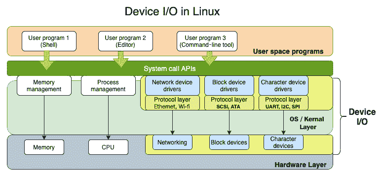
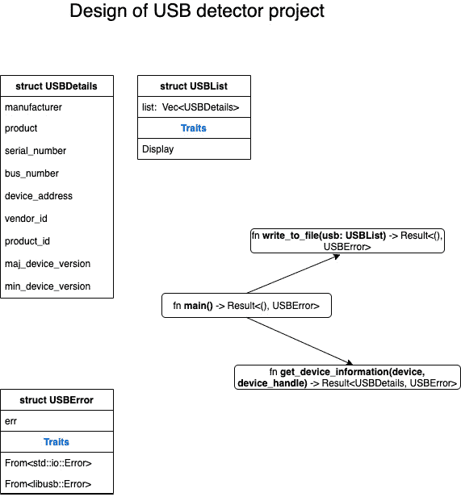

# 第十章：*第十章*：使用设备 I/O

在 *第六章* 中，我们介绍了如何使用 Rust 标准库执行文件 I/O 操作（如读取和写入文件）的详细情况。在类 Unix 操作系统中，文件是一个抽象概念，它不仅用于处理常规磁盘文件（用于存储数据），还用于与连接到机器的多种类型的设备进行交互。在本章中，我们将探讨 Rust 标准库的功能，使我们能够在 Rust 中对任何类型的设备进行读取和写入（也称为设备 I/O）。设备 I/O 是系统编程的一个基本方面，用于监控和控制连接到计算机的各种类型的设备，如键盘、USB 摄像头、打印机和外设。你可能想知道 Rust 为系统程序员提供了哪些支持来处理所有这些不同类型的设备。我们将随着章节的进行回答这个问题。

在本章中，我们将使用 Rust 标准库回顾 Unix/Linux 中 I/O 管理的基础知识，包括错误处理，然后编写一个程序来检测并打印连接的 USB 设备的详细信息。

我们将按以下顺序介绍这些主题：

+   理解 Linux 中的设备 I/O 基础知识

+   执行缓冲读取和写入

+   使用标准输入和输出

+   I/O 的链式操作和迭代器

+   处理错误和返回值

+   获取连接的 USB 设备的详细信息（项目）

到本章结束时，你将学会如何使用标准读取器和写入器，这是任何 I/O 操作的基础。你还将学会如何通过使用缓冲读取和写入来优化系统调用。我们将涵盖对进程的标准 I/O 流的读取和写入以及处理 I/O 操作的错误，以及学习遍历 I/O 的方法。这些概念将通过一个示例项目得到加强。

# 技术要求

使用以下命令验证 `rustup`、`rustc` 和 `cargo` 是否已正确安装：

```rs
rustup --version
rustc --version 
cargo --version
```

本章代码的 Git 仓库可以在 [`github.com/PacktPublishing/Practical-System-Programming-for-Rust-Developers/tree/master/Chapter10/usb`](https://github.com/PacktPublishing/Practical-System-Programming-for-Rust-Developers/tree/master/Chapter10/usb) 找到。

为了运行和测试本书中的项目，你必须安装本机 libusb 库，使其可以通过 `pkg-config` 找到。

本书中的项目已在 macOS Catalina 10.15.6 上进行测试。

有关在 Windows 上构建和测试的说明，请参阅：[`github.com/dcuddeback/libusb-rs/issues/20`](https://github.com/dcuddeback/libusb-rs/issues/20)

有关 `libusb` crate 环境设置的通用说明，请参阅：[`github.com/dcuddeback/libusb-rs`](https://github.com/dcuddeback/libusb-rs)

# 理解 Linux 中的设备 I/O 基础知识

在前面的章节中，我们看到了如何使用**进程和线程**来在 CPU 上调度工作，以及如何通过控制程序的内存布局来管理**内存**。除了 CPU 和内存，操作系统还管理系统的硬件设备。硬件设备的例子包括键盘、鼠标、硬盘、视频适配器、音频卡、网络适配器、扫描仪、摄像头以及其他 USB 设备。但是，这些物理硬件设备的特殊性被操作系统通过称为**设备驱动程序**的软件模块隐藏起来。设备驱动程序是进行设备 I/O 不可或缺的软件组件。让我们更深入地了解一下它们。

## 什么是设备驱动程序？

**设备驱动程序**是加载到内核中的共享库，其中包含执行低级硬件控制的功能。它们通过连接到设备的计算机总线或通信子系统与设备进行通信。它们针对每种设备类型（例如，鼠标或网络适配器）或设备类（例如，IDE 或 SCSI 磁盘控制器）特定。它们也针对特定的操作系统（例如，Windows 的设备驱动程序在 Linux 上即使对于相同的设备类型也无法工作）。

设备驱动程序处理它们所编写的设备（或设备类）的特殊性。例如，用于控制硬盘的设备驱动程序接收读取或写入由**块号**标识的某些文件数据的请求。设备驱动程序将块号转换为磁盘上的磁道、扇区和柱面号。它还初始化设备，检查设备是否在使用中，验证其函数调用输入参数的有效性，确定要发出的命令，并将它们发送到设备。它处理来自设备的中断，并将它们传达给调用程序。设备驱动程序还实现了设备支持的特定硬件协议，例如用于磁盘访问的**SCSI/ATA/SATA**或用于串行端口通信的**UART**。因此，设备驱动程序抽象出了控制设备的大量硬件特定细节。

操作系统（特别是内核）接受用户程序对设备访问和控制的系统调用，然后使用相应的设备驱动程序物理访问和控制设备。*图 10.1*说明了用户空间程序（例如，使用标准库与操作系统内核通信的 Rust 程序）如何使用系统调用来管理和控制各种类型的设备：



图 10.1 – Linux 中的设备 I/O

在*第六章*“在 Rust 中处理文件和目录”，我们了解到 Linux/Unix 有“一切皆文件”的哲学，这体现在 I/O 的通用性上。相同的系统调用，如`open()`、`close()`、`read()`和`write()`，可以应用于所有类型的 I/O，无论是常规文件（用于存储文本或二进制数据）、目录、设备文件还是网络连接。这意味着用户空间程序的程序员可以编写代码与设备通信和控制设备，而无需担心设备的协议和硬件细节，这得益于内核（系统调用）和设备驱动程序提供的抽象层。此外，Rust 标准库添加了另一层抽象，以提供设备无关的软件层，Rust 程序可以使用它进行设备 I/O。这是本章的主要关注点。

## 设备类型

在 Unix/Linux 中，设备被广泛分为三种类型：

+   **字符设备**以字节序列的形式发送或接收数据。例如，终端、键盘、鼠标、打印机和声卡。与常规文件不同，数据不能随机访问，只能按顺序访问。

+   **块设备**以固定大小的块存储信息，并允许随机访问这些块。文件系统、硬盘、磁带驱动器和 USB 摄像头是块设备的例子。文件系统安装在块设备上。

+   **网络设备**与字符设备类似，因为数据是按顺序读取的，但也有一些区别。数据使用网络协议以可变长度的数据包发送，操作系统和用户程序必须处理这些协议。网络适配器通常是一个硬件设备（有些例外，如环回接口，它是一个软件接口），它连接到网络（如**以太网**或**Wi-Fi**）。

硬件设备通过其*类型*（块或字符）和*设备号*来识别。设备号反过来又分为主设备号和次设备号。

当连接新的硬件时，内核需要与设备兼容的设备驱动程序，并且可以操作设备控制器硬件。正如之前讨论的，设备驱动程序本质上是一个低级、硬件处理函数的共享库，可以作为内核的一部分以特权方式运行。没有设备驱动程序，内核不知道如何操作设备。当程序尝试连接到设备时，内核在其表中查找相关信息的条目，并将控制权转交给设备驱动程序。对于**块**和**字符**设备，有单独的表。设备驱动程序在设备上执行所需的任务，并将控制权返回给操作系统内核。

例如，让我们看看一个网页服务器向网页浏览器发送页面。数据结构为一个**HTTP 响应消息**，其中作为其**数据负载**一部分发送的**网页（HTML）**。数据本身存储在内核中的缓冲区（数据结构）中，然后传递给**TCP 层**，接着是**IP 层**，然后是**以太网设备驱动程序**，然后是**以太网适配器**，最后到达**网络**。以太网设备驱动程序不了解任何连接，只处理数据包。同样，当需要将数据存储到磁盘上的文件时，数据会存储在缓冲区中，然后传递给**文件系统设备驱动程序**，然后传递给**磁盘控制器**，然后将其保存到磁盘（例如，硬盘、SSD 等）。本质上，*内核*依赖于*设备驱动程序*与设备进行接口。

设备驱动程序通常是内核的一部分（**内核设备驱动程序**），但也有一些**用户空间设备驱动程序**，它们抽象化了内核访问的细节。在本章的后面部分，我们将使用这样一个用户空间设备驱动程序来检测 USB 设备。

在本节中，我们讨论了设备 I/O 的基本知识，包括 Unix-like 系统中的设备驱动程序和设备类型。从下一节开始，我们将关注如何使用 Rust 标准库中的功能进行设备无关的 I/O。

# 执行缓冲读取和写入

读取和写入是执行在文件和流等 I/O 类型上的基本操作，对于与许多类型的系统资源一起工作非常重要。在本节中，我们将讨论在 Rust 中进行不同方式的*读取*和*写入*。我们将首先介绍核心特质——`Read`和`Write`——这些特质允许 Rust 程序在实现这些特质的对象上执行读取和写入操作（这些也被称为**读取器**和**写入器**）。然后，我们将看到如何进行*缓冲读取*和*缓冲写入*，这对于某些类型的读取和写入操作更有效。

让我们从基本的`Read`和`Write`特质开始。

根据哲学“一切皆文件”，Rust 标准库提供了两个特质——`Read`和`Write`——它们提供了读取和写入输入和输出的通用接口。这个特质为不同类型的 I/O 实现了，例如文件、`TcpStream`、标准输入和标准输出流。

以下代码展示了使用`Read`特质的示例。在这里，我们使用`std::fs::File`模块中的`open()`函数（我们之前学过）打开一个`records.txt`文件。然后，我们将`std::io`模块中的`Read`特质引入作用域，并使用这个特质的`read()`方法从文件中读取字节。相同的`read()`方法也可以用于从实现`Read`特质的任何其他实体中读取，例如**网络套接字**或**标准输入**流：

```rs
use std::fs::File;
use std::io::Read;
fn main() {
    // Open a file
    let mut f = File::open("records.txt").unwrap();
    //Create a memory buffer to read from file
    let mut buffer = [0; 1024];
    // read from file into buffer
    let _ = f.read(&mut buffer[..]).unwrap();
}
```

在项目根目录中创建一个名为 `records.txt` 的文件，并使用 `cargo run` 运行程序。你可以选择打印缓冲区的值，这将显示原始字节。

`Read` 和 `Write` 是基于字节的接口，当它们涉及对操作系统的持续系统调用时可能会变得低效。为了克服这一点，Rust 还提供了两个结构体，以实现缓冲读取和写入 – `BufReader` 和 `BufWriter`，它们具有内置的缓冲区并减少了调用操作系统的次数。

之前的示例可以重写如下，以使用 `BufReader`：

```rs
use std::fs::File;
use std::io::{BufRead, BufReader};
fn main() {
    // Open a file
    let f = File::open("records.txt").unwrap();
    // Create a BufReader, passing in the file handle
    let mut buf_reader = BufReader::new(f);
    //Create a memory buffer to read from file
    let mut buffer = String::new();
    // read a line into the buffer
    buf_reader.read_line(&mut buffer).unwrap();
    println!("Read the following: {}", buffer);
}
```

代码更改（与前一个版本相比）已被突出显示。`BufReader` 使用 `BufRead` 特性，该特性已被引入作用域。我们不是直接从文件句柄读取，而是创建一个 `BufReader` 实例并将一行读取到这个结构中。`BufReader` 方法内部优化了对操作系统的调用。运行程序并验证文件中的值是否正确打印。

`BufWriter` 类似地缓冲对磁盘的写入，从而最小化系统调用。它可以像以下代码所示那样使用：

```rs
use std::fs::File;
use std::io::{BufWriter, Write};
fn main() {
    // Create a file
    let f = File::create("file.txt").unwrap();
    // Create a BufWriter, passing in the file handle
    let mut buf_writer = BufWriter::new(f);
    //Create a memory buffer
    let buffer = String::from("Hello, testing");
    // write into the buffer
    buf_writer.write(buffer.as_bytes()).unwrap();
    println!("wrote the following: {}", buffer);
}
```

在显示的代码中，我们正在创建一个新文件以写入，同时也创建了一个新的 `BufWriter` 实例。然后我们将缓冲区中的值写入 `BufWriter` 实例。运行程序并验证指定的字符串值是否已写入项目根目录下的 `file.txt` 文件。注意，在这里，除了 `BufWriter` 之外，我们还需要将 `Write` 特性引入作用域，因为其中包含 `write()` 方法。

注意何时使用和何时不使用 `BufReader` 和 `BufWriter`：

+   `BufReader` 和 `BufWriter` 可以加速那些对磁盘进行小而频繁的读取或写入的程序。如果读取或写入仅偶尔涉及大量数据，它们不会提供任何好处。

+   `BufReader` 和 `BufWriter` 在从内存数据结构中读取或写入时并不提供帮助。

在本节中，我们看到了如何进行无缓冲和缓冲的读取和写入。在下一节中，我们将学习如何处理进程的标准输入和输出。

# 处理标准输入和输出

在 Linux/Unix 中，**流** 是进程与其环境之间的通信通道。默认情况下，为每个运行进程创建三个标准流：**标准输入**、**标准输出**和**标准错误**。流是一个具有两端点的通信通道。一端连接到进程，另一端连接到另一个系统资源。例如，标准输入可以被进程用来从键盘或另一个进程读取字符或文本。同样，标准输出流可以被进程用来将一些字符发送到终端或文件。在许多现代程序中，进程的标准错误连接到一个日志文件，这使得分析和调试错误变得更容易。

Rust 标准库提供了与标准输入和输出流交互的方法。`std::io`模块中的`Stdin`结构体表示进程输入流的句柄。此句柄实现了我们在上一节中提到的`Read`特质。

以下代码示例展示了如何与进程的标准输入和标准输出流进行交互。在显示的代码中，我们从标准输入读取一行到缓冲区。然后，我们将缓冲区的内容写回进程的标准输出。请注意，在这里，单词*process*指的是您所编写的正在运行的程序。您本质上是从*标准输入*和*标准输出*分别*读取*和*写入*的：

```rs
use std::io::{self, Write};
fn main() {
    //Create a memory buffer to read from file
    let mut buffer = String::new();
    // read a line into the buffer
    let _ = io::stdin().read_line(&mut buffer).unwrap();
    // Write the buffer to standard output
    io::stdout().write(&mut buffer.as_bytes()).unwrap();
}
```

使用`cargo run`运行程序，输入一些文本，然后按*Enter*键。您将在终端上看到文本被回显。

`Stdin`，它是进程输入流的句柄，是对全局输入数据缓冲区的共享引用。同样，`Stdout`，它是进程的输出流，是对全局数据缓冲区的共享引用。由于`Stdin`和`Stdout`是共享数据的引用，为了确保这些数据缓冲区的独占使用，句柄可以被锁定。例如，`std::io`模块中的`StdinLock`结构体代表对`Stdin`句柄的锁定引用。同样，`std::io`模块中的`StdoutLock`结构体代表对`Stdout`句柄的锁定引用。以下代码示例展示了如何使用锁定引用的示例：

```rs
use std::io::{Read, Write};
fn main() {
    //Create a memory buffer
    let mut buffer = [8; 1024];
    // Get handle to input stream
    let stdin_handle = std::io::stdin();
    // Lock the handle to input stream
    let mut locked_stdin_handle = stdin_handle.lock();
    // read a line into the buffer
    locked_stdin_handle.read(&mut buffer).unwrap();
    // Get handle to output stream
    let stdout_handle = std::io::stdout();
    // Lock the handle to output stream
    let mut locked_stdout_handle = stdout_handle.lock();
    // Write the buffer to standard output
    locked_stdout_handle.write(&mut buffer).unwrap();
}
```

在显示的代码中，在读取和写入之前，将标准输入和输出流句柄锁定。

我们可以类似地向*标准错误*流写入。以下是一个代码示例：

```rs
use std::io::Write;
fn main() {
    //Create a memory buffer
    let buffer = b"Hello, this is error message from 
        standard 
        error stream\n";
    // Get handle to output error stream
    let stderr_handle = std::io::stderr();
    // Lock the handle to output error stream
    let mut locked_stderr_handle = stderr_handle.lock();
    // write into error stream from buffer
    locked_stderr_handle.write(buffer).unwrap();
}
```

在显示的代码中，我们使用`stderr()`函数构建标准错误流的句柄。然后，我们锁定此句柄并向其写入一些文本。

在本节中，我们看到了如何使用 Rust 标准库与进程的标准输入、标准输出和标准错误流进行交互。回想一下，在前一章关于管理并发的内容中，我们看到了如何从父进程读取和写入子进程的标准输入和输出流。

在下一节中，让我们看看一些可以在 Rust 中进行 I/O 的功能编程结构。

# I/O 的链式操作和迭代器

在本节中，我们将探讨如何使用迭代器和链式操作与`std::io`模块一起使用。

`std::io`模块提供的许多数据结构都具有内置的`while`和`for`循环。以下是一个使用`BufReader`结构体和`lines()`迭代器的示例，`BufReader`是`std::io`模块的一部分。这个程序在循环中从*标准输入*流中读取行：

```rs
use std::io::{BufRead, BufReader};
fn main() {
    // Create handle to standard input
    let s = std::io::stdin();
    //Create a BufReader instance to optimize sys calls
    let file_reader = BufReader::new(s);
    // Read from standard input line-by-line
    for single_line in file_reader.lines() {
        println!("You typed:{}", single_line.unwrap());
    }
}
```

在下面的代码中，我们创建了一个指向标准输入流的句柄，并将其传递给一个`BufReader`结构体。这个结构体实现了`BufRead`特质，它有一个`lines()`方法，该方法返回一个遍历读取器行数的迭代器。这有助于我们在终端逐行输入文本，并让我们的运行程序读取它。在终端输入的文本会被回显到终端。执行`cargo run`，输入一些文本，然后按*Enter*键。根据需要重复此步骤。使用*Ctrl* + *C*退出程序。

同样，迭代器也可以用来逐行从*文件*中读取（而不是从我们在上一个示例中看到的标准输入中读取）。这里有一个代码片段的示例：

```rs
use std::fs::File;
use std::io::{BufRead, BufReader};

fn main() {
    // Open a file for reading
    let f = File::open("file.txt").unwrap();
    //Create a BufReader instance to optimize sys calls
    let file_reader = BufReader::new(f);
    // Read from standard input line-by-line
    for single_line in file_reader.lines() {
        println!("Line read from file :{}", 
            single_line.unwrap());
    }
}
```

在项目根目录下创建一个名为`file.txt`的文件。在这个文件中输入几行文本。然后，使用`cargo run`运行程序。你会看到文件内容被打印到终端。

我们已经看到了如何使用`std::io`模块中的迭代器。现在让我们看看另一个概念：**链式操作**。

`std::io`模块中的`Read`特质有一个`chain()`方法，它允许我们将多个`BufReader`链接在一起形成一个句柄。以下是一个如何创建一个将两个文件组合在一起的单一**链式句柄**的示例，以及如何从这个句柄中读取的示例：

```rs
use std::fs::File;
use std::io::Read; 
fn main() {
    // Open two file handles for reading
    let f1 = File::open("file1.txt").unwrap();
    let f2 = File::open("file2.txt").unwrap();
    //Chain the two file handles
    let mut chained_handle = f1.chain(f2);
    // Create a buffer to read into
    let mut buffer = String::new();
    // Read from chained handle into buffer
    chained_handle.read_to_string(&mut buffer).unwrap();
    // Print out the value read into the buffer
    println!("Read from chained handle:\n{}", buffer);
}
```

代码中使用`chain()`方法的语句已被突出显示。其余的代码相当直观，因为它与我们之前看到的示例类似。确保在项目根目录下创建两个文件，`file1.txt`和`file2.txt`，并在每个文件中输入几行文本。使用`cargo run`运行程序。你会看到两个文件的数据逐行打印出来。

在本节中，我们看到了如何使用迭代器以及如何将读取器链接在一起。在下一节中，让我们看看 I/O 操作的错误处理。

# 处理错误和返回值

在本节中，我们将了解`std::io`模块中内置的错误处理支持。以适当的方式处理可恢复的错误可以使 Rust 程序更加健壮。

在我们之前看到的代码示例中，我们使用了`unwrap()`函数从`std::io`模块的方法和相关函数（如`Read`、`Write`、`BufReader`和`BufWriter`）中提取返回值。然而，这并不是处理错误的方法。`std::io`模块有一个专门的`Result`类型，它由该模块中可能产生错误的任何函数或方法返回。

让我们重写之前的示例（链式读取器），使用`io::Result`类型作为函数的返回值。这允许我们使用`?`运算符直接从`main()`函数传递错误，而不是使用`unwrap()`函数：

```rs
use std::fs::File;
use std::io::Read;
fn main() -> std::io::Result<()> {
    // Open two file handles for reading
    let f1 = File::open("file1.txt")?;
    let f2 = File::open("file3.txt")?;
    //Chain the two file handles
    let mut chained_handle = f1.chain(f2);
    // Create a buffer to read into
    let mut buffer = String::new();
    // Read from chained handle into buffer
    chained_handle.read_to_string(&mut buffer)?;
    println!("Read from chained handle: {}", buffer);
    Ok(())
}
```

与错误处理相关的代码已被突出显示。使用`cargo run`运行程序，这次确保项目根目录下既不存在`file1.txt`也不存在`file3.txt`。

你将看到错误信息打印到终端。

在我们刚才看到的代码中，我们只是在调用操作系统时传播接收到的错误。现在让我们尝试以更积极的方式处理错误。下面的代码示例显示了相同代码的自定义错误处理：

```rs
use std::fs::File;
use std::io::Read;
fn read_files(handle: &mut impl Read) -> 
std::io::Result<String> {
    // Create a buffer to read into
    let mut buffer = String::new();
    // Read from chained handle into buffer
    handle.read_to_string(&mut buffer)?;
    Ok(buffer)
}
fn main() {
    let mut chained_handle;
    // Open two file handles for reading
    let file1 = "file1.txt";
    let file2 = "file3.txt";
    if let Ok(f1) = File::open(file1) {
        if let Ok(f2) = File::open(file2) {
            //Chain the two file handles
            chained_handle = f1.chain(f2);
            let content = read_files(&mut chained_handle);
            match content {
                Ok(text) => println!("Read from chained 
                    handle:\n{}", text),
                Err(e) => println!("Error occurred in 
                    reading files: {}", e),
            }
        } else {
            println!("Unable to read {}", file2);
        }
    } else {
        println!("Unable to read {}", file1);
    }
}
```

你会注意到我们创建了一个新的函数，该函数将`std::io::Result`返回给`main()`函数。我们在各种操作中处理错误，例如从文件读取和从链式读取器读取。

首先，使用`cargo run`运行程序，确保`file1.txt`和`file2.txt`都存在。你将看到两个文件的内容都打印到终端。通过移除其中一个文件来重新运行程序。你应该看到我们代码中的自定义错误消息。

通过这种方式，我们结束了关于错误处理的章节。现在让我们继续到本章的最后一节，我们将通过一个项目来检测和显示连接到计算机的 USB 设备的详细信息。

# 获取连接的 USB 设备的详细信息（项目）

在本节中，我们将演示在 Rust 中与设备一起工作的示例。所选的示例是显示计算机上所有连接的 USB 设备的详细信息。我们将使用`libusb`，这是一个 C 库，有助于与 USB 设备交互。Rust 中的`libusb`包是 C `libusb`库的安全包装。让我们首先看看设计。

## 设计项目

这将是如何工作的：

+   当 USB 设备插入到计算机中时，计算机总线上的电信号会触发计算机上的**USB 控制器**（硬件设备）。

+   USB 控制器在 CPU 上引发中断，然后执行内核中注册的该中断的处理程序。

+   当从 Rust 程序通过 Rust `libusb`包装器包发起调用时，该调用被路由到`libusb` C 库，然后该库反过来在内核上执行系统调用来读取对应 USB 设备的设备文件。我们在本章前面已经看到 Unix/Linux 如何启用标准的`read()`和`write()`来进行 I/O。

+   当系统调用从内核返回时，`libusb`库将 syscall 的值返回给我们的 Rust 程序。

我们使用`libusb`库，因为从头开始编写 USB 设备驱动程序需要实现 USB 协议规范，而编写设备驱动程序本身就是另一本书的主题。让我们看看我们程序的设计：



图 10.2 – USB 检测器项目设计

*图 10.2* 展示了程序中的结构和函数。以下是数据结构的描述：

+   `USBList`：检测到的 USB 设备列表。

+   `USBDetails`：这包含我们希望通过此程序检索的 USB 设备详细信息列表。

+   `USBError`：自定义错误处理。

这些是我们将要编写的函数：

+   `get_device_information()`: 用于根据设备引用和设备句柄检索所需设备详情的函数。

+   `write_to_file()`: 将设备详情写入输出文件的函数。

+   `main()`: 这是程序的入口点。它实例化一个新的`libusb::Context`，检索连接设备的列表，然后遍历列表以对每个设备调用`get_device_information()`。检索到的详情将被打印到终端，并使用我们之前看到的`write_to_file()`函数写入文件。

我们现在可以开始编写代码了。

## 编写数据结构和实用函数

在本节中，我们将编写用于存储 USB 设备列表和 USB 详情以及用于自定义错误处理的数据结构，我们还将编写一些实用函数：

1.  让我们从创建一个新的项目开始：

    ```rs
    cargo new usb && cd usb
    ```

1.  让我们将`libusb`包添加到`Cargo.toml`中：

    ```rs
    [dependencies]
    libusb = "0.3.0"
    ```

1.  现在，我们将分部分查看代码。将此项目的所有代码添加到`usb/src/main.rs`中。

    这里是模块导入：

    ```rs
    use libusb::{Context, Device, DeviceHandle};
    use std::fs::File;
    use std::io::Write;
    use std::time::Duration;
    use std::fmt;
    ```

    我们正在导入`libusb`模块和 Rust 标准库中的几个模块。`fs::File`和`io::Write`用于写入输出文件，`result::Result`是函数的返回值，而`time::Duration`用于与`libusb`库一起工作。

1.  让我们现在看看数据结构：

    ```rs
    #[derive(Debug)]
    struct USBError {
        err: String,
    }

    struct USBList {
        list: Vec<USBDetails>,
    }
    #[derive(Debug)]
    struct USBDetails {
        manufacturer: String,
        product: String,
        serial_number: String,
        bus_number: u8,
        device_address: u8,
        vendor_id: u16,
        product_id: u16,
        maj_device_version: u8,
        min_device_version: u8,
    }
    ```

    `USBError`用于自定义错误处理，`USBList`用于存储检测到的 USB 设备列表，而`USBDetails`用于捕获每个 USB 设备的详情列表。

1.  让我们为`USBList`结构体实现`Display`特质，以便可以对结构体的内容进行自定义格式化以打印：

    ```rs
    impl fmt::Display for USBList {
        fn fmt(&self, f: &mut fmt::Formatter<'_>) -> 
            fmt::Result {
            Ok(for usb in &self.list {
                writeln!(f, "\nUSB Device details")?;
                writeln!(f, "Manufacturer: {}", 
                    usb.manufacturer)?;
                writeln!(f, "Product: {}", usb.product)?;
                writeln!(f, "Serial number: {}", 
                    usb.serial_number)?;
                writeln!(f, "Bus number: {}", 
                    usb.bus_number)?;
                writeln!(f, "Device address: {}", 
                    usb.device_address)?;
                writeln!(f, "Vendor Id: {}", 
                    usb.vendor_id)?;
                writeln!(f, "Product Id: {}", 
                    usb.product_id)?;
                writeln!(f, "Major device version: {}", 
                    usb.maj_device_version)?;
                writeln!(f, "Minor device version: {}", 
                    usb.min_device_version)?;
            })
        }
    }
    ```

1.  接下来，我们将为`USBError`结构体实现`From`特质，以便在调用`?`操作符时，将来自`libusb`包和 Rust 标准库的错误自动转换为`USBError`类型：

    ```rs
    impl From<libusb::Error> for USBError {
        fn from(_e: libusb::Error) -> Self {
            USBError {
                err: "Error in accessing USB 
                    device".to_string(),
            }
        }
    }
    impl From<std::io::Error> for USBError {
        fn from(e: std::io::Error) -> Self {
            USBError { err: e.to_string() }
        }
    }
    ```

1.  让我们接下来看看将所有连接设备的详情写入输出文件的函数：

    ```rs
    //Function to write details to output file
    fn write_to_file(usb: USBList) -> Result<(), USBError> {
        let mut file_handle = File::create
            ("usb_details.txt")?;
        write!(file_handle, "{}\n", usb)?;
        Ok(())
    }
    ```

我们现在可以继续编写`main()`函数。

## 编写 main()函数

在本节中，我们将编写`main()`函数，该函数设置设备上下文，获取连接的 USB 设备列表，然后遍历设备列表以检索每个设备的详情。我们还将编写一个函数来打印设备详情：

1.  我们将从`main()`函数开始：

    ```rs
    fn main() -> Result<(), USBError> {
        // Get libusb context
        let context = Context::new()?;

        //Get list of devices
        let mut device_list = USBList { list: vec![] };
        for device in context.devices()?.iter() {
            let device_desc = device.device_descriptor()?;
            let device_handle = context
                .open_device_with_vid_pid(
                    device_desc.vendor_id(), 
                    device_desc.product_id())
                .unwrap();

            // For each USB device, get the information
            let usb_details = get_device_information(
                device, &device_handle)?;
            device_list.list.push(usb_details);
        }
        println!("\n{}", device_list);
        write_to_file(device_list)?;
        Ok(())
    }
    ```

    在`main()`函数中，我们首先创建一个新的`libusb Context`，它可以返回连接设备的列表。然后，我们遍历从`Context`结构体获得的设备列表，并对每个 USB 设备调用`get_device_information()`函数。最后，通过调用我们之前看到的`write_to_file()`函数，将详情打印到输出文件。

1.  为了结束代码，让我们编写一个获取设备详情的函数：

    ```rs
    // Function to print device information
    fn get_device_information(device: Device, handle: 
        &DeviceHandle) -> Result<USBDetails, USBError> {
        let device_descriptor = 
            device.device_descriptor()?;
        let timeout = Duration::from_secs(1);
        let languages = handle.read_languages(timeout)?;
        let language = languages[0];
        // Get device manufacturer name
        let manufacturer = 
            handle.read_manufacturer_string(
                language, &device_descriptor, timeout)?;
        // Get device USB product name
        let product = handle.read_product_string(
            language, &device_descriptor, timeout)?;
        //Get product serial number
        let product_serial_number =
            match handle.read_serial_number_string(
                language, &device_descriptor, timeout) {
                Ok(s) => s,
                Err(_) => "Not available".into(),
            };
        // Populate the USBDetails struct
        Ok(USBDetails {
            manufacturer,
            product,
            serial_number: product_serial_number,
            bus_number: device.bus_number(),
            device_address: device.address(),
            vendor_id: device_descriptor.vendor_id(),
            product_id: device_descriptor.product_id(),
            maj_device_version: 
                device_descriptor.device_version().0,
            min_device_version: 
                device_descriptor.device_version().1,
        })
    }
    ```

这就结束了代码部分。请确保将 USB 设备（如 U 盘）连接到计算机上。使用`cargo run`运行代码。你应该会在终端看到连接的 USB 设备列表，并且这些信息也会写入到输出文件`usb_details.txt`中。

注意，在这个例子中，我们展示了如何使用外部 crate（用于检索 USB 设备详情）和标准库（用于写入输出文件）进行文件 I/O。我们使用一个通用的错误处理结构体统一了错误处理，并自动将错误类型转换为这种自定义错误类型。

Rust 的 crate 生态系统（`crates.io`）有类似 crate 可以用来与其它类型的设备和文件系统交互。你可以尝试使用它们。

这就结束了关于编写程序获取 USB 详细信息的章节。

# 摘要

在本章中，我们回顾了 Unix/Linux 设备管理的基石概念。我们探讨了如何使用`std::io`模块进行缓冲读取和写入。然后我们学习了如何与进程的标准输入、标准输出和标准错误流进行交互。我们还看到了如何将读取器链在一起，并使用迭代器从设备中读取。接着我们研究了`std::io`模块的错误处理功能。最后，我们通过一个项目来检测连接的 USB 设备列表，并将每个 USB 设备的详细信息打印到终端和输出文件中。

Rust 标准库为在任意类型的设备上进行 I/O 操作提供了一个干净的抽象层。这鼓励 Rust 生态系统为任何类型的设备实现这些标准接口，使得 Rust 系统程序员能够以统一的方式与不同的设备进行交互。继续 I/O 主题，在下一章中，我们将学习如何使用 Rust 标准库进行网络 I/O 操作。
