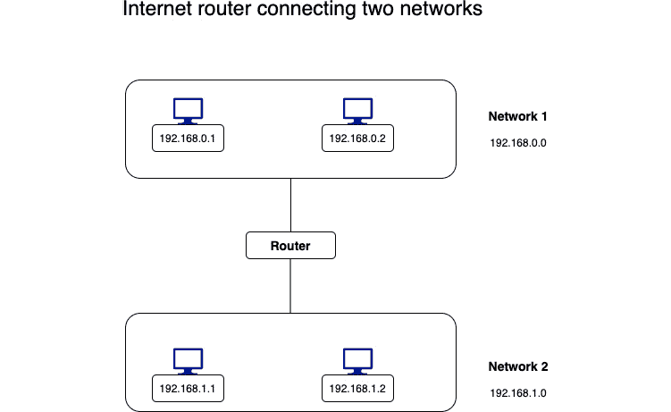
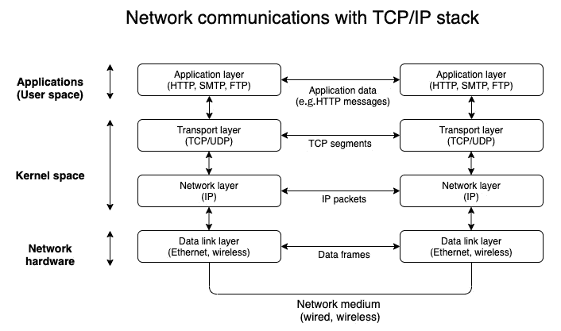
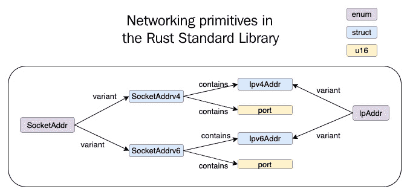
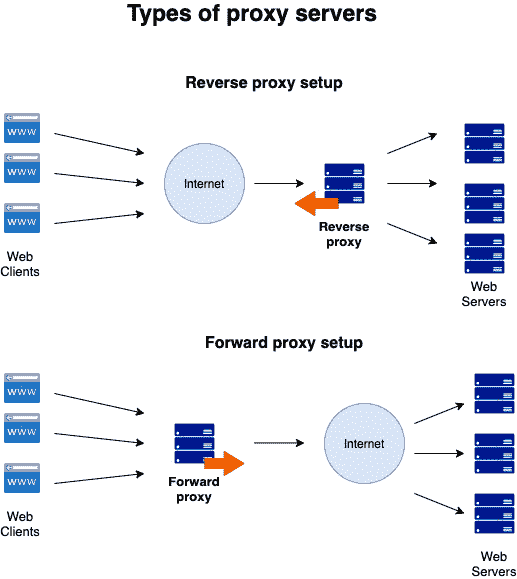

# 第十一章：*第十一章*：学习网络编程

在上一章中，我们学习了如何在 Rust 程序中与外围设备通信。在本章中，我们将关注另一个重要的系统编程主题——网络。

大多数现代操作系统，包括 Unix/Linux 和 Windows 变体，都原生支持使用 TCP/IP 进行网络。你知道如何使用 TCP/IP 将字节流或消息从一台计算机发送到另一台计算机吗？你想了解 Rust 为在不同机器上运行的两个进程之间的同步网络通信提供的语言支持吗？你对学习配置 TCP 和 UDP 套接字、在 Rust 中处理网络地址和监听器的基础感兴趣吗？那么，继续阅读。

我们将按以下顺序介绍这些主题：

+   在 Linux 中回顾网络基础知识

+   理解 Rust 标准库中的网络原语

+   在 Rust 中使用 TCP 和 UDP 进行编程

+   编写 TCP 反向代理（项目）

到本章结束时，你将学会如何处理网络地址、确定地址类型以及进行地址转换。你还将学习如何创建和配置套接字以及查询它们。你将使用 TCP 监听器、创建 TCP 套接字服务器并接收数据。最后，你将通过一个示例项目将这些概念付诸实践。

学习这些主题非常重要，因为基于套接字的编程使用 TCP 或 UDP 构成了编写分布式程序的基础。套接字帮助不同（甚至相同）机器上的两个进程相互建立通信并交换信息。它们构成了互联网上几乎所有 Web 和分布式应用的基础，包括互联网浏览器如何访问网页以及移动应用程序如何从 API 服务器检索数据。在本章中，你将了解 Rust 标准库为基于套接字的网络通信提供的支持类型。

# 技术要求

使用以下命令验证`rustup`、`rustc`和`cargo`是否已正确安装：

```rs
rustup --version
rustc --version
cargo --version
```

本章中代码的 Git 仓库可以在[`github.com/PacktPublishing/Practical-System-Programming-for-Rust-Developers/tree/master/Chapter11`](https://github.com/PacktPublishing/Practical-System-Programming-for-Rust-Developers/tree/master/Chapter11)找到。

# 在 Linux 中回顾网络基础知识

互联网连接全球的多个不同网络，使网络中的机器能够以不同的方式相互通信，包括**请求-响应**模型（同步）、**异步消息**和**发布-订阅**风格的通告。*图 11.1*展示了两个网络之间连接的一个示例：



图 11.1 – 连接两个网络的互联网路由器

互联网还提供了**网络协议和标准**的抽象形式，以简化不同网络上的主机之间的通信。

标准的例子包括一个通用的**主机寻址格式**，一个由主机地址和端口号组合来定义**网络端点**。IPv4 地址的主机地址是一个**32 位**数字，IPv6 地址的主机地址是一个**128 位**数字。

网络协议的例子包括网络浏览器从网络服务器检索文档，**域名系统**（**DNS**）将域名映射到主机地址，IP 协议将数据包打包并在互联网上路由，以及 TCP 为 IP 数据包添加可靠性和错误处理。

特别是，**网络协议**在定义不同网络上的不同主机上运行的程序如何传输和解释信息方面非常重要。**TCP/IP 协议栈**是我们日常使用的互联网的基础，它使我们能够实现信息、交易和娱乐的数字世界。

*图 11.2*显示了分层 TCP/IP 协议栈：



图 11.2 – 连接两个网络的互联网路由器

在上一章中，我们讨论了设备驱动程序。在*图 11.2*中，显示的*TCP/IP 协议栈*的最低层——**数据链路层**——包括与用于主机之间通信的网络介质（例如，同轴电缆、光纤或无线）对应的**设备驱动程序**和**网络接口卡**。数据链路层将来自更高网络（IP）层的数据包组装成**数据帧**，并通过物理链路传输它们。

TCP/IP 协议栈的下一层是**IP 层**，这是 TCP/IP 堆栈中最重要的一层。它将数据组装成数据包并发送到数据链路层。IP 层还负责在互联网上路由数据。这是通过为每个传输的数据报（数据包）添加一个头部来实现的，该头部包括应将数据包传输到的远程主机的地址。从主机 A 发送到主机 B 的两个数据包可以通过互联网采取不同的路由。IP 是一种无连接协议，这意味着在两个主机之间没有创建用于多步通信的通信通道。这一层只是将数据包从一个主机的 IP 地址发送到另一个主机的 IP 地址，而不提供任何保证。

TCP/IP 协议栈的下一层是**传输层**。在这里，互联网上使用两种流行的协议——TCP 和 UDP。**TCP**代表**传输控制协议**，而**UDP**是**用户数据报协议**。虽然网络（IP）层关注在两个主机之间发送数据包，但传输层（TCP 和 UDP）关注在同一个主机或不同主机上运行的两个进程（应用程序或程序）之间的数据流发送。

如果有两个应用程序运行在单个主机的 IP 地址上，唯一标识每个应用程序的方法是通过使用一个*端口号*。每个参与网络通信的应用程序都会监听一个特定的端口，它是一个 16 位的数字。

流行端口的例子有`80`用于*HTTP*协议，`443`用于*HTTPS*协议，以及`22`用于*SSH*协议。IP 地址和端口号的组合称为**套接字**。我们将在本章中看到如何使用 Rust 标准库来处理套接字。UDP，像 IP 一样，是无连接的，并且不包含任何可靠性机制。但它的速度比 TCP 快，开销低。它用于高级服务，如 DNS，以获取与域名对应的宿主 IP 地址。

与 UDP 相比，TCP 为两个端点（应用程序/用户空间程序）提供了一个面向连接、可靠的通信通道，可以在其中交换字节流，同时保持数据序列。它包含诸如错误情况下的**重传**、接收到的数据包的**确认**和**超时**等特性。我们将在本章详细讨论基于 TCP 的通信，并在稍后构建一个使用 TCP 套接字通信的反向代理。

TCP/IP 协议栈的最高层是**应用层**。虽然 TCP 层是面向连接的，并且与字节流一起工作，但它对传输的消息的语义一无所知。这是由应用层提供的。例如，HTTP，这是互联网上最受欢迎的应用协议，使用 HTTP 请求和响应消息在**HTTP 客户端**（例如，互联网浏览器）和**HTTP 服务器**（例如，Web 服务器）之间进行通信。应用层读取从 TCP 层接收到的字节流，并将它们解释为 HTTP 消息，然后由我们用 Rust 或其他语言编写的应用程序程序处理。Rust 生态系统中有几个库（或 crate）实现了 HTTP 协议，因此 Rust 程序可以利用它们（或编写自己的）来发送和接收 HTTP 消息。在本章的示例项目中，我们将编写一些代码来解释传入的 HTTP 请求消息，并发送 HTTP 响应消息。

Rust 标准库中用于网络通信的主要模块是 `std::net`。它专注于编写使用 TCP 和 UDP 进行通信的代码。Rust 的 `std::net` 模块不直接处理 TCP/IP 协议套件的链路层或应用层。有了这个背景，我们就可以理解 Rust 标准库为 TCP 和 UDP 通信提供的网络原语。

# 理解 Rust 标准库中的网络原语

在本节中，我们将讨论 Rust 标准库中用于网络的基础数据结构。*图 11.3* 列出了常用的数据结构：



图 11.3 – Rust 标准库中的网络原语

让我们逐个查看数据结构：

+   `Ipv4Addr`：这是一个结构体，用于存储表示 IPv4 地址的 32 位整数，并提供相关函数和方法来设置和查询地址值。

+   `Ipv6Addr`：这是一个结构体，用于存储表示 IPv6 地址的 128 位整数，并提供相关函数和方法来查询和设置地址值。

+   `SocketAddrV4`：这是一个表示互联网域套接字的结构体。它存储一个 IPv4 地址和一个 16 位端口号，并提供相关函数和方法来设置和查询套接字值。

+   `SocketAddrV6`：这是一个表示互联网域套接字的结构体。它存储一个 IPv6 地址和一个 16 位端口号，并提供相关函数和方法来设置和查询套接字值。

+   `IpAddr`：这是一个枚举，有两个变体 – `V4(Ipv4Addr)` 和 `V6(Ipv6Addr)`。这意味着它可以存储 IPv4 主机地址或 IPv6 主机地址。

+   `SocketAddr`：这是一个枚举，有两个变体 – `V4(SocketAddrV4)` 和 `V6(SocketAddrV6)`。这意味着它可以存储 IPv4 套接字地址或 IPv6 套接字地址。

    注意

    IPv6 地址的大小可能会根据目标操作系统架构而变化。

现在，让我们看看如何使用它们的几个示例。我们将从创建 IPv4 和 IPv6 地址开始。

在下面的示例中，我们使用 `std::net` 模块创建 IPv4 和 IPv6 地址，并使用内置方法查询创建的地址。`is_loopback()` 方法确认地址是否对应于 `localhost`，而 `segments()` 方法返回 IP 地址的各个段。注意，`std::net` 模块提供了一个特殊常量，`Ipv4Addr::LOCALHOST`，它可以用来使用 `localhost`（环回）地址初始化 IP 地址：

```rs
use std::net::{Ipv4Addr, Ipv6Addr};

fn main() {
    // Create a new IPv4 address with four 8-bit integers
    let ip_v4_addr1 = Ipv4Addr::new(106, 201, 34, 209);
    // Use the built-in constant to create a new loopback 
    // (localhost) address
    let ip_v4_addr2 = Ipv4Addr::LOCALHOST;
    println!(
        "Is ip_v4_addr1 a loopback address? {}",
        ip_v4_addr1.is_loopback()
    );
    println!(
        "Is ip_v4_addr2 a loopback address? {}",
        ip_v4_addr2.is_loopback()
    );
    //Create a new IPv6 address with eight 16-bit  
    // integers, represented in hex
    let ip_v6_addr = Ipv6Addr::new(2001, 0000, 3238, 
        0xDFE1, 0063, 0000, 0000, 0xFEFB);
    println!("IPV6 segments {:?}", ip_v6_addr.segments());
}
```

以下示例展示了如何使用 `IpAddr` 枚举。在这个示例中，展示了如何使用 `IpAddr` 枚举创建 IPv4 和 IPv6 地址。`IpAddr` 枚举帮助我们以更通用的方式在我们的程序数据结构中定义 IP 地址，并允许我们在程序中灵活地处理 IPv4 和 IPv6 地址：

```rs
use std::net::{IpAddr, Ipv4Addr, Ipv6Addr};

fn main() {
    // Create an ipv4 address
    let ip_v4_addr = IpAddr::V4(Ipv4Addr::new(106, 201, 34, 
        209));
    // check if an address is ipv4 or ipv6 address
    println!("Is ip_v4_addr an ipv4 address? {}", 
        ip_v4_addr.is_ipv4());
    println!("Is ip_v4_addr an ipv6 address? {}", 
        ip_v4_addr.is_ipv6());

    // Create an ipv6 address
    let ip_v6_addr = IpAddr::V6(Ipv6Addr::new(0, 0, 0, 0, 
        0, 0, 0, 1));
    println!("Is ip_v6_addr an ipv6 address? {}", 
        ip_v6_addr.is_ipv6());
}
```

现在，让我们将注意力转向套接字。如前所述，套接字由一个 IP 地址和一个端口号组成。Rust 为 IPv4 和 IPv6 套接字都有单独的数据结构。接下来，让我们看一个示例。在这里，我们创建了一个新的 IPv4 套接字，并使用 `ip()` 和 `port()` 方法分别查询构建的套接字中的 IP 地址和端口号：

```rs
use std::net::{IpAddr, Ipv4Addr, SocketAddr};
fn main() {
    // Create an ipv4 socket 
    let socket = SocketAddr::new(IpAddr::V4(
        Ipv4Addr::new(127,0,0,1)),8000);
    println!("Socket address is {}, port is {}",
        socket.ip(), socket.port());
    println!("Is this IPv6 socket?{}",socket.is_ipv6());
}
```

IP 地址和套接字是使用 Rust 标准库进行网络编程的基础数据结构。在下一节中，我们将看到如何编写可以在 TCP 和 UDP 协议上通信的 Rust 程序。

# 使用 Rust 编程 TCP 和 UDP

如前所述，TCP 和 UDP 是互联网的基本传输层网络协议。在本节中，我们首先编写一个 UDP 服务器和客户端。然后，我们将看看如何使用 TCP 做同样的事情。

创建一个名为 `tcpudp` 的新项目，我们将在此项目中编写 TCP 和 UDP 服务器和客户端：

```rs
cargo new tcpudp && cd tcpudp
```

让我们首先看看使用 UDP 的网络通信。

## 编写 UDP 服务器和客户端

在本节中，我们将学习如何配置 UDP 套接字，以及如何发送和接收数据。我们将编写一个 UDP 服务器和一个 UDP 客户端。

### 从 UDP 服务器开始

在下面的示例中，我们通过使用 `UdpSocket::bind` 将其绑定到本地套接字来创建一个 UDP 服务器。然后，我们创建一个固定大小的缓冲区，并在循环中监听传入的数据流。如果收到数据，我们将通过将数据回显给发送者来创建一个新的线程以处理数据。由于我们已经介绍了如何在 *第九章* 中创建新线程，*管理并发*，这里不再需要解释：

tcpudp/src/bin/[udp-server.rs](http://udp-server.rs)

```rs
use std::str;
use std::thread;

fn main() {
    let socket = UdpSocket::bind("127.0.0.1:3000").expect(
        "Unable to bind to port");
    let mut buffer = [0; 1024];
    loop {
        let socket_new = socket.try_clone().expect(
            "Unable to clone socket");
        match socket_new.recv_from(&mut buffer) {
            Ok((num_bytes, src_addr)) => {
                thread::spawn(move || {
                    let send_buffer = &mut 
                        buffer[..num_bytes];
                    println!(
                        "Received from client:{}",
                        str::from_utf8(
                            send_buffer).unwrap()
                    );
                    let response_string =
                        format!("Received this: {}", 
                            String::from_utf8_lossy(
                            send_buffer));
                    socket_new
                        .send_to(&response_string
                            .as_bytes(), &src_addr)
                        .expect("error in sending datagram 
                            to remote socket");
                });
            }
            Err(err) => {
                println!("Error in receiving datagrams over 
                    UDP: {}", err);
            }
        }
    }
}
```

### 编写一个 UDP 客户端以向服务器发送数据包

在下面的代码中，我们首先要求标准库绑定到本地端口（通过提供一个地址端口组合 `0.0.0.0:0`，这允许操作系统选择一个临时的 IP 地址/端口来发送数据报）。然后，我们尝试连接到运行服务器的远程套接字，并在连接失败时显示错误。在成功连接的情况下，我们使用 `peer_addr()` 方法打印出对等方的套接字地址。最后，我们使用 `send()` 方法向远程套接字（服务器）发送消息：

tcpudp/src/bin/[udp-client.rs](http://udp-client.rs)

```rs
use std::net::UdpSocket;
fn main() {
    // Create a local UDP socket
    let socket = UdpSocket::bind("0.0.0.0:0").expect(
        "Unable to bind to socket");
    // Connect the socket to a remote socket
    socket
        .connect("127.0.0.1:3000")
        .expect("Could not connect to UDP server");
    println!("socket peer addr is {:?}", 
        socket.peer_addr());
    // Send a datagram to the remote socket
    socket
        .send("Hello: sent using send() call".as_bytes())
        .expect("Unable to send bytes");
}
```

使用以下命令运行 UDP 服务器：

```rs
cargo run --bin  udp-server
```

在另一个终端中，运行以下 UDP 客户端：

```rs
cargo run --bin  udp-client
```

你将看到服务器接收到的消息，该消息是从客户端发送的。

我们已经看到了如何编写 Rust 程序来进行 UDP 通信。现在，让我们看看 TCP 通信是如何进行的。

## 编写 TCP 服务器和客户端

在本节中，我们将学习如何配置 TCP 监听器，创建 TCP 套接字服务器，并在 TCP 上发送和接收数据。我们将编写一个 TCP 服务器和一个 TCP 客户端。

我们将从 TCP 服务器开始。在下面的代码中，我们使用 `TcpListener::bind` 创建一个监听套接字的 TCP 服务器。然后，我们使用 `incoming()` 方法，该方法返回一个传入连接的迭代器。每个连接返回一个可以通过 `stream.read()` 方法读取的 TCP 流。我们正在读取数据并打印出值。此外，我们使用 `stream.write()` 方法通过连接回显接收到的数据：

tcpudp/src/bin/[tcp-server.rs](http://tcp-server.rs)

```rs
use std::io::{Read, Write};
use std::net::TcpListener;
fn main() {
    let connection_listener = TcpListener::bind(
        "127.0.0.1:3000").unwrap();
    println!("Running on port 3000");
    for stream in connection_listener.incoming() {
        let mut stream = stream.unwrap();
        println!("Connection established");
        let mut buffer = [0; 100];
        stream.read(&mut buffer).unwrap();
        println!("Received from client: {}", 
            String::from_utf8_lossy(&buffer));
        stream.write(&mut buffer).unwrap();
    }
}
```

这就完成了 TCP 服务器的代码。现在让我们编写一个 TCP 客户端，向 TCP 服务器发送一些数据。

在下面的 TCP 客户端代码中，我们使用 `TcpStream::connect` 函数连接到服务器正在监听的**远程套接字**。此函数返回一个**TCP 流**，可以*读取*和*写入*（如前例所示）。在这里，我们首先将一些数据写入 TCP 流，然后读取从服务器收到的响应：

tcpudp/src/bin/[tcp-client.rs](http://tcp-client.rs)

```rs
use std::io::{Read, Write};
use std::net::TcpStream;
use std::str;
fn main() {
    let mut stream = TcpStream::connect(
        "localhost:3000").unwrap();
    let msg_to_send = "Hello from TCP client";
    stream.write(msg_to_send.as_bytes()).unwrap();
    let mut buffer = [0; 200];
    stream.read(&mut buffer).unwrap();
    println!(
        "Got echo back from server:{:?}",
        str::from_utf8(&buffer)
            .unwrap()
            .trim_end_matches(char::from(0))
    );
}
```

使用以下命令运行 TCP 服务器：

```rs
cargo run --bin  tcp-server
```

在另一个终端中，使用以下命令运行 TCP 客户端：

```rs
cargo run --bin  tcp-client
```

你将看到客户端发送的消息在服务器上被接收并回显。

这就完成了关于使用 Rust 标准库进行 TCP 和 UDP 通信的章节。在下一节中，我们将使用到目前为止学到的概念来构建一个 TCP 反向代理。

# 编写 TCP 反向代理（项目）

在本节中，我们将仅使用 Rust 标准库演示 **TCP 反向代理**的基本功能，而不使用任何外部库或框架。

代理服务器是一种在互联网上跨越多个网络导航时使用的中间件软件服务。代理服务器有两种类型——**正向代理**和**反向代理**。正向代理作为向互联网发出请求的客户端的中介，而反向代理作为服务器的中介。*图 11.4* 展示了正向和反向代理服务器的作用：



图 11.4 – 代理服务器类型

正向代理作为一组客户端机器访问互联网的网关。它们帮助单个客户端机器在浏览互联网时隐藏其 IP 地址。它们还帮助在网络内的机器强制执行访问互联网的组织策略，例如限制访问的网站。

当正向代理代表客户端行动时，反向代理代表主机（例如，Web 服务器）行动。它们隐藏后端服务器的身份信息，让客户端无法得知。客户端只向反向代理服务器地址/域名发送请求，而反向代理服务器则知道如何将这个请求路由到后端服务器（有时也称为**原始服务器**），并将从原始服务器接收到的响应返回给请求的客户端。反向代理还可以用于执行其他功能，如负载均衡、缓存和压缩。然而，我们将只通过将客户端接收到的请求定向到后端原始服务器，并将响应路由回请求的客户端来演示反向代理的核心概念。

为了演示一个工作的**反向代理**，我们将构建两个服务器：

+   **原始服务器**：TCP 服务器（理解有限的 HTTP 语义）。

+   **反向代理服务器**：到达此服务器的客户端请求将被定向到**原始服务器**，原始服务器的响应将被路由回客户端。

创建一个新项目来编写原始和代理服务器：

```rs
cargo new tcpproxy && cd tcpproxy
```

创建两个文件：`tcpproxy/src/bin/`[origin.rs](http://origin.rs) 和 `tcpproxy/src/bin/`[proxy.rs](http://proxy.rs)。

让我们从原始服务器的代码开始。这个服务器将执行以下操作：

+   接收传入的 HTTP 请求。

+   提取请求的第一行（称为**HTTP 请求行**）。

+   在特定的路由上接受`GET HTTP`请求（例如，`/order/status/1`）。

+   返回订单的状态。我们将演示解析 HTTP 请求行以检索订单号，并仅发送一个响应，声明**订单号 1 的状态为：已发货**。

让我们看看原始服务器的代码。

## 编写原始服务器 – 结构体和方法

我们首先将看到模块导入、结构体定义和方法的代码。然后，我们将看到`main()`函数的代码。原始服务器的所有代码都可以在`tcpproxy/src/bin/`[origin.rs](http://origin.rs)中找到。

代码片段首先显示了模块导入。我们在这里从标准库中导入各种模块。`std::io`模块将用于读取和写入 TCP 流，`std::net`模块提供了 TCP 监听器、套接字和地址的原语。字符串模块（`std::str`和`std::String`）用于字符串操作和处理字符串解析错误：

tcpproxy/src/bin/[origin.rs](http://origin.rs)

```rs
use std::io::{Read, Write};
use std::net::TcpListener;
use std::net::{IpAddr, Ipv4Addr, SocketAddr};
use std::str;
use std::str::FromStr;
use std::string::ParseError;
```

接下来，让我们声明一个结构体来保存传入的 HTTP 请求行（多行 HTTP 请求消息的第一行）。我们还将为这个结构体编写一些辅助方法。

在下面的代码中，我们将声明一个包含三个字段的`RequestLine`结构体——HTTP 方法、请求的资源路径以及发送请求的互联网浏览器或其他 HTTP 客户端支持的 HTTP 协议版本。我们还将编写一些方法来返回结构体成员的值。`get_order_number()`方法将实现自定义逻辑。如果我们收到一个请求`/order/status/1`路径的资源，我们将通过`/`分割这个字符串，并返回字符串的最后一部分，即顺序号`1`：

tcpproxy/src/bin/[origin.rs](http://origin.rs)

```rs
#[derive(Debug)]
struct RequestLine {
    method: Option<String>,
    path: Option<String>,
    protocol: Option<String>,
}

impl RequestLine {
    fn method(&self) -> String {
        if let Some(method) = &self.method {
            method.to_string()
        } else {
            String::from("")
        }
    }
    fn path(&self) -> String {
        if let Some(path) = &self.path {
            path.to_string()
        } else {
            String::from("")
        }
    }
    fn get_order_number(&self) -> String {
        let path = self.path();
        let path_tokens: Vec<String> = path.split("/").map(
            |s| s.parse().unwrap()).collect();
        path_tokens[path_tokens.len() - 1].clone()
    }
}
```

让我们也为`RequestLine`结构体实现`FromStr`特质，这样我们就可以将传入的 HTTP 请求行（字符串）转换为我们的内部 Rust 数据结构——`RequestLine`。HTTP 请求行的结构如下所示：

```rs
<HTTP-method> <path> <protocol>
```

这三个值由空格分隔，并且都出现在 HTTP 请求消息的第一行中。在下面的程序中，我们将解析这三个值并将它们加载到`RequestLine`结构体中。稍后，我们将进一步解析路径成员并从中提取顺序号，以进行处理：

tcpproxy/src/bin/[origin.rs](http://origin.rs)

```rs
impl FromStr for RequestLine {
    type Err = ParseError;
    fn from_str(msg: &str) -> Result<Self, Self::Err> {
        let mut msg_tokens = msg.split_ascii_whitespace();
        let method = match msg_tokens.next() {
            Some(token) => Some(String::from(token)),
            None => None,
        };
        let path = match msg_tokens.next() {
            Some(token) => Some(String::from(token)),
            None => None,
        };
        let protocol = match msg_tokens.next() {
            Some(token) => Some(String::from(token)),
            None => None,
        };

        Ok(Self {
            method: method,
            path: path,
            protocol: protocol,
        })
    }
}
```

我们已经看到了模块导入、结构体定义和`RequestLine`结构体的方法。现在让我们编写`main()`函数。

## 编写原始服务器——`main`函数

在原始服务器的`main`函数中，我们将执行以下操作：

1.  启动 TCP 服务器。

1.  监听传入的连接。

对于每个传入的连接，我们将执行以下操作：

1.  读取传入的 HTTP 请求消息的第一行并将其转换为`RequestLine`结构体。

1.  构建 HTTP 响应消息并将其写入 TCP 流。

现在让我们分两部分看看`main`函数的代码——启动 TCP 服务器并监听连接，以及处理传入的 HTTP 请求。

### 启动 TCP 服务器并监听连接

要启动 TCP 服务器，我们将构建一个套接字地址，并使用`TcpStream::bind`将其绑定到套接字：

tcpproxy/src/bin/[origin.rs](http://origin.rs)

```rs
    // Start the origin server
    let port = 3000;
    let socket_addr = SocketAddr::new(IpAddr::V4(
        Ipv4Addr::new(127, 0, 0, 1)), port);
    let connection_listener = TcpListener::bind(
        socket_addr).unwrap();

    println!("Running on port: {}", port);
```

然后，我们将监听传入的连接，并从每个连接的流中读取：

tcpproxy/src/bin/[origin.rs](http://origin.rs)

```rs
    for stream in connection_listener.incoming() {
    //processing of incoming HTTP requests
}
```

现在让我们看看传入请求的处理过程。

### 处理传入的 HTTP 请求

对于处理传入的请求，第一步是检索请求消息的第一行并将其转换为`RequestLine`结构体。在下面的代码中，我们使用`lines()`方法返回一个行迭代器。然后，我们使用`lines().next()`获取 HTTP 请求的第一行。我们使用`RequestLine::from_str()`将其转换为`RequestLine`结构体。这之所以可能，是因为我们已经为`RequestLine`结构体实现了`FromStr`特质：

tcpproxy/src/bin/[origin.rs](http://origin.rs)

```rs
        // Read the first line of incoming HTTP request 
        // and convert it into RequestLine struct
        let mut stream = stream.unwrap();
        let mut buffer = [0; 200];
        stream.read(&mut buffer).unwrap();
        let req_line = "";
        let string_request_line =
            if let Some(line) = str::from_utf8(
                &buffer).unwrap().lines().next() {
                line
            } else {
                println!("Invalid request line received");
                req_line
            }; 
        let req_line = RequestLine::from_str(
            string_request_line).unwrap();
```

现在我们已经将所需数据解析到`RequestLine`结构体中，我们可以处理它并发送 HTTP 响应。让我们看看代码。如果接收到的消息不是`GET`请求，如果请求消息中的路径不以`/order/status`开头，或者如果未提供订单号，则使用`404 Not found` HTTP 状态码构造 HTTP 响应消息：

tcpproxy/src/bin/[origin.rs](http://origin.rs)

```rs
        // Construct the HTTP response string 
        let html_response_string;
        let order_status;
        println!("len is {}", req_line.get_order_number()
            .len());

        if req_line.method() != "GET"
            || !req_line.path().starts_with(
               "/order/status")
            || req_line.get_order_number().len() == 0
        {
            if req_line.get_order_number().len() == 0 {
                order_status = format!("Please provide 
                    valid order number");
            } else {
                order_status = format!("Sorry,this page is 
                    not found");
            }

            html_response_string = format!(
                "HTTP/1.1 404 Not Found\nContent-Type: 
                    text/html\nContent-Length:{}\n\n{}",
                order_status.len(),
                order_status
            );
}
```

如果请求格式正确，用于检索订单号的订单状态，我们应该构造一个带有`200 OK` HTTP 状态码的 HTML 响应消息，以将响应发送回客户端：

tcpproxy/src/bin/[origin.rs](http://origin.rs)

```rs
         else {
            order_status = format!(
                "Order status for order number {} is: 
                    Shipped\n",
                req_line.get_order_number()
            );
            html_response_string = format!(
                "HTTP/1.1 200 OK\nContent-Type: 
                    text/html\nContent-Length:{}\n\n{}",
                order_status.len(),
                order_status
            );
        }
```

最后，让我们将构造的 HTTP 响应消息写入 TCP 流：

tcpproxy/src/bin/[origin.rs](http://origin.rs)

```rs
stream.write(html_response_string.as_bytes()).unwrap();
```

这完成了原始服务器的代码。完整的代码可以在 Packt GitHub 仓库的`Chapter12`目录下的`tcpproxy/src/bin/`[origin.rs](http://origin.rs)中找到。

使用以下命令运行程序：

```rs
cargo run --bin origin
```

你应该看到服务器启动时显示以下消息：

**运行在端口：3000**

在浏览器窗口中，输入以下 URL：

```rs
localhost:3000/order/status/2
```

你应该在浏览器屏幕上看到以下响应：

**订单号 2 的订单状态是：已发货**

尝试输入一个无效路径的 URL，如下所示：

```rs
localhost:3000/invalid/path
```

你应该看到以下消息显示：

**抱歉，此页面未找到**

此外，你可以提供一个有效的路径，但不包含订单号，如下所示：

```rs
localhost:3000/order/status/
```

你将看到以下错误消息显示：

**请提供有效的订单号**

这样，我们就完成了原始服务器部分的编写。现在让我们编写*反向代理*的代码。

## 编写反向代理服务器

让我们深入到反向代理的代码，从模块导入开始。这个反向代理服务器的所有代码都可以在`tcpproxy/src/bin/`[proxy.rs](http://proxy.rs)中找到。

让我们先看看模块导入。

使用`std::env`模块来读取命令行参数。`std::io`用于读取和写入 TCP 流。`std::net`是我们看到的主要通信模块。`std::process`用于在无法恢复的错误情况下退出程序。`std::thread`用于为处理传入请求创建新线程：

tcpproxy/src/bin/[proxy.rs](http://proxy.rs)

```rs
use std::env;
use std::io::{Read, Write};
use std::net::{TcpListener, TcpStream};
use std::process::exit;
use std::thread;
```

让我们接下来编写`main()`函数。当我们启动反向代理服务器时，让我们接受两个命令行参数，分别对应于*反向代理*和*原始服务器*的套接字地址。如果用户没有提供两个命令行参数，则打印出错误消息并退出程序。然后，让我们解析命令行输入并使用`TcpListener::bind`启动服务器。在绑定到本地端口后，我们连接到原始服务器，并在连接失败时打印出错误消息。

将以下代码放在`main()`函数块中：

tcpproxy/src/bin/[proxy.rs](http://proxy.rs)

```rs
    // Accept command-line parameters for proxy_stream and 
    // origin_stream
    let args: Vec<_> = env::args().collect();
    if args.len() < 3 {
        eprintln!("Please provide proxy-from and proxy-to 
            addresses");
        exit(2);
    }
    let proxy_server = &args[1];
    let origin_server = &args[2];
    // Start a socket server on proxy_stream
    let proxy_listener;
    if let Ok(proxy) = TcpListener::bind(proxy_server) {
        proxy_listener = proxy;
        let addr = proxy_listener.local_addr()
            .unwrap().ip();
        let port = proxy_listener.local_addr().unwrap()
            .port();
        if let Err(_err) = TcpStream::connect(
            origin_server) {
            println!("Please re-start the origin server");
            exit(1);
        }
        println!("Running on Addr:{}, Port:{}\n", addr, 
            port);
    } else {
        eprintln!("Unable to bind to specified proxy 
            port");
        exit(1);
    }
```

在启动服务器后，我们必须监听传入的连接。对于每个连接，创建一个单独的线程来处理连接。该线程随后调用`handle_connection()`函数，我们将在稍后描述。然后，将子线程处理与主线程连接起来，以确保在子线程完成之前`main()`函数不会*退出*：

tcpproxy/src/bin/[proxy.rs](http://proxy.rs)

```rs
    // Listen for incoming connections from proxy_server 
    // and read byte stream
    let mut thread_handles = Vec::new();
    for proxy_stream in proxy_listener.incoming() {
        let mut proxy_stream = proxy_stream.expect("Error 
            in incoming TCP connection");
        // Establish a new TCP connection to origin_stream
        let mut origin_stream =
            TcpStream::connect(origin_server).expect(
                "Please re-start the origin server");
        let handle =
            thread::spawn(move || handle_connection(&mut  
                proxy_stream, &mut origin_stream));
        thread_handles.push(handle);
    }
    for handle in thread_handles {
        handle.join().expect("Unable to join child 
            thread");
    }
```

这就完成了`main()`函数。现在让我们编写`handle_function()`的代码。这包含了代理到原始服务器的核心逻辑：

tcpproxy/src/bin/[proxy.rs](http://proxy.rs)

```rs
fn handle_connection(proxy_stream: &mut TcpStream, 
    origin_stream: &mut TcpStream) {
    let mut in_buffer: Vec<u8> = vec![0; 200];
    let mut out_buffer: Vec<u8> = vec![0; 200];
    // Read incoming request to proxy_stream
    if let Err(err) = proxy_stream.read(&mut in_buffer) {
        println!("Error in reading from incoming proxy 
            stream: {}", err);
    } else {
        println!(
            "1: Incoming client request: {}",
            String::from_utf8_lossy(&in_buffer)
        );
    }
    // Write the byte stream to origin_stream
    let _ = origin_stream.write(&mut in_buffer).unwrap();
    println!("2: Forwarding request to origin server\n");
    // Read response from the backend server
    let _ = origin_stream.read(&mut out_buffer).unwrap();
    println!(
        "3: Received response from origin server: {}",
        String::from_utf8_lossy(&out_buffer)
    );
    // Write response back to the proxy client
    let _ = proxy_stream.write(&mut out_buffer).unwrap();
    println!("4: Forwarding response back to client");
}
```

为了便于调试，涉及代理功能的四个关键步骤已在代码中标记，并打印到控制台：

1.  在第一步，我们从传入的*客户端连接*读取数据。

1.  在第二步，我们与*原始服务器*打开一个新的 TCP 流，并将我们从*客户端*收到的数据发送到原始服务器。

1.  在第三步，我们正在读取我们从原始服务器收到的响应，并将数据存储在缓冲区中。

1.  在最后一步，我们使用上一步收到的数据写入对应于发送原始请求的客户端的 TCP 流。

这就完成了反向代理的代码。我们保持了功能的简单性，并只处理了基本案例。作为额外的练习，你可以添加边缘情况以使服务器更健壮，还可以添加如负载均衡和缓存等附加功能。

这就完成了原始服务器的代码。完整的代码可以在 Packt GitHub 仓库的`Chapter12`目录下的`tcpproxy/src/bin/`[proxy.rs](http://proxy.rs)中找到。

首先，使用以下命令启动原始服务器：

```rs
cargo run --bin origin
```

然后，使用以下命令运行代理服务器：

```rs
cargo run --bin proxy localhost:3001 localhost:3000
```

我们传递的第一个命令行参数被*反向代理*服务器用于绑定到指定的套接字地址。第二个命令行参数对应于*原始服务器*运行的套接字地址。这是我们必须代理传入请求的地址。

现在，让我们从浏览器运行与原始服务器相同的测试，但这次我们将请求发送到运行反向代理服务器的端口`3001`。你会注意到你会得到类似的消息响应。这表明由互联网浏览器客户端发送的请求正在由反向代理服务器代理到后端原始服务器，并且从原始服务器收到的响应正在被路由回浏览器客户端。

你应该看到服务器以以下消息启动：

**运行在地址：127.0.0.1，端口：3001**

在浏览器窗口中，输入以下 URL：

```rs
localhost:3001/order/status/2
```

你应该在浏览器屏幕上看到以下响应显示：

**订单号 2 的订单状态为：已发货**

尝试输入一个无效路径的 URL，例如以下内容：

```rs
localhost:3001/invalid/path
```

你应该会看到以下消息显示：

**抱歉，此页面未找到**

此外，你可以提供一个有效的路径，但不包括订单号，例如以下内容：

```rs
localhost:3001/order/status/
```

你将看到以下错误信息显示：

**请提供有效的订单号**

这就结束了这个示例项目，其中我们编写了两个服务器——一个 TCP 源服务器和一个简单的 TCP 反向代理服务器。

# 摘要

在本章中，我们回顾了 Linux/Unix 中的网络基础知识。我们学习了 Rust 标准库中的网络原语，包括 IPv4 和 IPv6 地址的数据结构，IPv4 和 IPv6 套接字以及相关方法。我们学习了如何创建地址，以及如何创建套接字并查询它们。

然后，我们学习了如何使用 UDP 套接字，并编写了 UDP 客户端和服务器。我们还回顾了 TCP 通信的基础知识，包括如何配置 TCP 监听器，如何创建 TCP 套接字服务器，以及如何发送和接收数据。最后，我们编写了一个由两个服务器组成的项目——一个*源服务器*和一个*反向代理服务器*，该服务器将请求路由到源服务器。

在本书的下一章和最后一章中，我们将涵盖系统编程的另一个重要主题——**不安全 Rust 和 FFI**。
