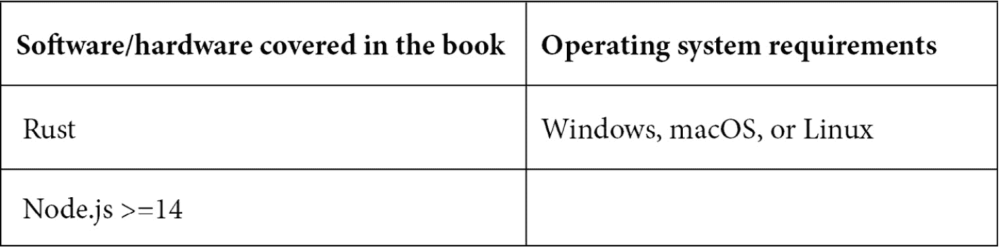

# 前言

提供高性能应用程序是一个噩梦。JavaScript 是一种动态类型语言。因此，JavaScript 引擎在执行 JavaScript 时假设类型。这些假设导致了不可预测的性能。这使得在 JavaScript 中提供一致的高性能应用程序变得更加困难。

WebAssembly 提供了一种在 JavaScript 引擎中运行类型安全和高性能应用程序的方法。

**WebAssembly 非常快**

WebAssembly 是网络发生的下一件大事。它承诺提供高且一致的性能，具有可维护的代码，在网络上运行本地代码并提供接近本地性能。

**WebAssembly 是类型安全的**

当您有多态 JavaScript 代码时，JavaScript 编译器难以提供高性能。另一方面，WebAssembly 在编译时是类型安全的（或单态的）。这不仅提高了性能，而且大大减少了运行时错误，这是一个双赢的局面。

**WebAssembly 运行您的本地代码**

之前已经尝试通过运行本地代码来使网络更快，但它们都失败了，因为它们要么是供应商特定的，要么与单一语言绑定。网络建立在开放标准之上。作为一个开放标准，WebAssembly 使得所有公司都能轻松采用和支持它。WebAssembly 不是一种语言；它是对其他语言的顶层实现计划，这些语言编译成将在 JavaScript 引擎上运行的字节码。

**WebAssembly 是字节码**

WebAssembly 不过是运行在 JavaScript 引擎中的字节码。在这本书中，我们将学习如何将本地代码转换为 WebAssembly，以及如何优化它以获得更好的性能。我们还将介绍整个 WebAssembly 如何在 JavaScript 引擎上运行，以及如何使用各种工具以及它们如何帮助我们实现目标。

最重要的是，学习在哪里以及如何使用 WebAssembly 以获得期望的结果。

让我们用 WebAssembly 让网络更加精彩和快速。

# 这本书面向的对象

这本书是为希望提供更好性能和交付类型安全代码的 JavaScript 开发者而写的。希望构建全栈应用程序而不必过多担心 JavaScript 编程的 Rust 开发者或后端工程师也会发现这本书很有用。

阅读这本书需要基本的 JavaScript 理解。Rust 知识是首选，但不是强制性的。代码示例简单，任何开发者都能轻松跟随。

# 这本书涵盖的内容

*第一章*，*理解 LLVM*，简要介绍了 LLVM，它是什么，以及如何使用它。

*第二章*，*理解 Emscripten*，向您介绍 Emscripten，您将在其中构建和运行您的第一个 WebAssembly 模块。

*第三章*, *探索 WebAssembly 模块*，探讨了 WebAssembly 模块，模块由什么组成，以及不同的部分是什么。

*第四章*, *理解 WebAssembly 二进制工具包*，探讨了如何安装和使用**WebAssembly 二进制工具包**（**WABT**）。

*第五章*, *理解 WebAssembly 模块中的部分*，探讨了 WebAssembly 二进制文件内部的各个部分及其用途。

*第六章*, *安装和使用 Binaryen*，探讨了如何安装和使用 Binaryen。

*第七章*, *将 Rust 与 WebAssembly 集成*，首先查看 Rust 以及将 Rust 转换为 WebAssembly 模块的各种方法，最后查看`wasm_bindgen`。

*第八章*, *使用 wasm_pack 打包 WebAssembly*，探讨了`wasm-pack`以及它是如何简化构建 Rust 和 WebAssembly 应用程序的。

*第九章*, *跨越 Rust 和 WebAssembly 之间的边界*，重点关注`wasm-bindgen`以及如`js-sys`和`web-sys`之类的 crate 如何帮助在 WebAssembly 和 JavaScript 之间共享实体。

*第十章*, *优化 Rust 和 WebAssembly*，介绍了使用示例优化 Rust 和 WebAssembly 的各种方法。

# 要充分利用本书

本书假设您对 JavaScript 有基本的了解。代码示例大多是用 C++/Rust 编写的。请在开始之前安装 Rust（在第七章*将 Rust 与 WebAssembly 集成*中简要介绍）和 Node.js。



**如果您使用的是本书的数字版，我们建议您亲自输入代码或从书的 GitHub 仓库（下一节中有一个链接）获取代码。这样做将有助于您避免与代码复制和粘贴相关的任何潜在错误。**

# 下载示例代码文件

您可以从 GitHub（[`github.com/PacktPublishing/Practical-WebAssembly`](https://github.com/PacktPublishing/Practical-WebAssembly)）下载本书的示例代码文件。如果代码有更新，它将在 GitHub 仓库中更新。

我们还有其他来自我们丰富的书籍和视频目录的代码包，可在[`github.com/PacktPublishing/`](https://github.com/PacktPublishing/)找到。查看它们吧！

# 使用的约定

本书使用了多种文本约定。

`文本中的代码`：表示文本中的代码单词、数据库表名、文件夹名、文件名、文件扩展名、路径名、虚拟 URL、用户输入和 Twitter 昵称。以下是一个示例：“将下载的`WebStorm-10*.dmg`磁盘映像文件作为系统中的另一个磁盘挂载。”

代码块设置如下：

```rs
html, body, #map {
 height: 100%; 
 margin: 0;
 padding: 0
}
```

当我们希望您注意代码块中的特定部分时，相关的行或项目将以粗体显示：

```rs
[default]
exten => s,1,Dial(Zap/1|30)
exten => s,2,Voicemail(u100)
exten => s,102,Voicemail(b100)
exten => i,1,Voicemail(s0)
```

任何命令行输入或输出都应如下编写：

```rs
$ mkdir css
$ cd css
```

**粗体**：表示新术语、重要单词或屏幕上看到的单词。例如，菜单或对话框中的单词以粗体显示。以下是一个示例：“从**管理**面板中选择**系统信息**。”

小贴士或重要注意事项

应像这样显示。

# 联系我们

我们始终欢迎读者的反馈。

`customercare@packtpub.com` 并在邮件主题中提及书籍标题。

**勘误表**：尽管我们已经尽最大努力确保内容的准确性，但错误仍然可能发生。如果您在这本书中发现了错误，我们将非常感激您能向我们报告。请访问 [www.packtpub.com/support/errata](http://www.packtpub.com/support/errata) 并填写表格。

`copyright@packt.com` 并附上相关材料的链接。

**如果您有兴趣成为作者**：如果您在某个领域有专业知识，并且您有兴趣撰写或为书籍做出贡献，请访问 [authors.packtpub.com](http://authors.packtpub.com)。

# 分享您的想法

一旦您阅读了《实用 WebAssembly》，我们很乐意听听您的想法！请 [点击此处直接访问此书的亚马逊评论页面](https://packt.link/r/1838828001) 并分享您的反馈。

您的评论对我们和科技社区都非常重要，并将帮助我们确保我们提供高质量的内容。
