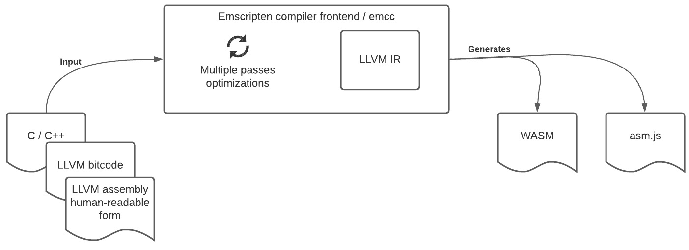
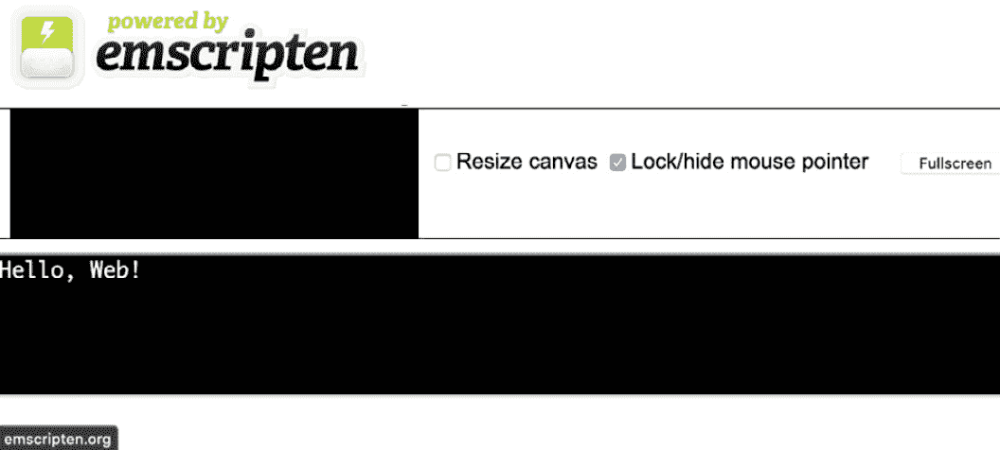

# *第二章*：理解 Emscripten

在本章中，我们将了解**Emscripten**，这是一个将 C/C++代码转换为 WebAssembly 模块的工具链。

Emscripten 由两个组件组成：

+   Emscripten 编译器前端

+   **Emscripten SDK**（**emsdk**）

**Clang**编译器前端将 C/C++代码编译成**LLVM 中间表示**（**LLVM IR**），然后使用 LLVM 后端将 LLVM IR 转换为本地代码。Clang 编译器速度快，内存使用少，与**GNU 编译器集合**（**GCC**）兼容。Emscripten 与 Clang 类似；前者生成*wasm*二进制文件，而后者生成*本地*二进制文件。**Emscripten 编译器前端**（**emcc**）是将 C/C++转换为 LLVM IR（二进制和可读形式）以及 WebAssembly 二进制文件或*asm.js*（如 JavaScript）的编译器前端。



Figure 2.1 – Emscripten 编译器前端

**emsdk**帮助管理和维护 Emscripten 工具链组件，并设置运行时/终端环境以运行 emcc。

在本章中，我们将学习如何安装 Emscripten。然后，我们将使用 Emscripten 生成 asm.js，这是一个在 Node.js 和浏览器上运行的 WebAssembly 模块。之后，我们将探索 emsdk 工具。最后，我们将探索 Emscripten 提供的各种优化。本章将涵盖以下主题：

+   使用 emsdk 安装 Emscripten

+   使用 Emscripten 生成 asm.js

+   在 Node.js 中使用 Emscripten 运行 Hello World

+   在浏览器中使用 Emscripten 运行 Hello World

+   探索 emsdk 中的其他选项

+   理解各种优化级别

    你知道吗？

    asm.js 是 JavaScript 的一个子集，经过优化，在浏览器中可以接近本地性能运行。asm.js 规范并未被所有浏览器厂商接受。asm.js 已演变成 WebAssembly。

# 技术要求

在本章中，我们将展示如何设置 Emscripten，您需要在系统上安装以下内容：

+   Python >= 3.7

+   Node.js > 12.18

    注意

    emsdk 预装了兼容的 Node.js 版本。

您可以在 GitHub 上找到本章中提供的代码文件，链接为[`github.com/PacktPublishing/Practical-WebAssembly`](https://github.com/PacktPublishing/Practical-WebAssembly)

# 使用 emsdk 安装 Emscripten

emsdk 提供了一种简单的方式来安装、管理和切换 Emscripten 工具链的版本。emsdk 负责设置环境、工具和 SDK，以便将 C/C++编译成 LLVM IR，然后以 asm.js 或 WebAssembly 二进制文件的形式转换为 JavaScript。

让我们安装 Emscripten 并开始编写代码：

1.  克隆 emsdk 仓库并进入`emsdk`文件夹：

    ```rs
    $ git clone https://github.com/emscripten-core/emsdk
    $ cd emsdk
    ```

1.  在机器上安装 emsdk，请运行以下命令：

对于*nix 用户，请使用以下命令：

```rs
$ ./emsdk install latest
```

对于 Windows 用户，请使用以下命令：

```rs
$ emsdk install latest
```

注意

前面的命令可能需要一段时间运行；它将构建和设置整个工具链。

接下来，我们将激活最新的 emsdk。激活更新了本地 shell 中的必要环境引用，并使最新的 SDK 在当前 shell 中对用户生效。它将 Emscripten 工具链的路径和其他必要信息写入用户主目录下的名为 `.emscripten` 的文件中：

1.  要激活已安装的 emsdk，请运行以下命令：

对于 *nix 用户，请使用以下命令：

```rs
 $ ./emsdk activate latest
```

对于 Windows 用户，请使用以下命令：

```rs
 $ emsdk activate latest
```

1.  现在是时候运行以下命令来确保配置和路径被激活，以确保配置和路径被激活：

对于 *nix 用户，请使用以下命令：

```rs
 $ source ./emsdk_env.sh
```

对于 Windows 用户，请使用以下命令：

```rs
 $ emsdk_env.bat
```

恭喜，Emscripten 工具链已安装！使用 emsdk 更新工具链与安装一样简单。

要更新，请运行以下命令：

对于 *nix 用户，请使用以下命令：

```rs
$ ./emsdk update
```

对于 Windows 用户，请使用以下命令：

```rs
$ emsdk update
```

emsdk 在 Emscripten 配置文件中设置以下路径。Emscripten 配置文件（`.emscripten`）位于主文件夹中。它由以下内容组成：

+   `LLVM_ROOT` – 指定 LLVM Clang 编译器的路径

+   `NODE_JS` – 指定 Node.js 的路径

+   `BINARYEN_ROOT` – 指定 Emscripten 编译器的优化器

+   `EMSCRIPTEN_ROOT` – 指定 Emscripten 编译器的路径

我们可以使用以下命令检查 emcc 的安装是否成功：

```rs
 $ emcc --version
```

现在我们已经完成了 Emscripten 编译器的安装，让我们继续使用它。

# 使用 Emscripten 生成 asm.js

我们将使用 Emscripten 将 C/C++ 程序移植到 asm.js 或 WebAssembly 二进制文件，然后在 JavaScript 引擎中运行它们。

注意

如 Lua 和 Python 等编程语言具有 C/C++ 运行时。使用 Emscripten，我们可以将运行时作为 WebAssembly 模块进行移植，并在 JavaScript 引擎中执行它们。这使得在 JavaScript 引擎上运行 Lua/Python 代码变得容易。因此，Emscripten 和 WebAssembly 允许在 JavaScript 引擎中运行原生代码。

首先，让我们创建一个 `sum.cpp` 文件：

```rs
 // sum.cpp
extern "C" {
  unsigned sum(unsigned a, unsigned b) {
      return a + b;
  }
}
```

将 `extern "C"` 视为一个类似于 *导出* 的机制。所有这些函数都作为导出函数可用，无需更改其名称。然后，我们定义一个普通的 `sum` 函数，它接受两个数字并返回一个数字。

为了从 `sum.cpp` 生成类似于 JavaScript 的 asm.js 代码，请使用以下命令：

```rs
$ emcc -O1 ./sum.cpp -o sum.html -s WASM=0 -s EXPORTED_FUNCTIONS='["_sum"]'
```

注意

如果您是第一次运行 emcc，可能需要几秒钟才能完成。后续运行将更快。

我们将 `-O1` 选项传递给 emcc 编译器，指示编译器生成较少优化的代码（我们将在本章后面看到更多优化选项）。接下来，我们传递要转换的文件，即 `sum.cpp`。然后，使用 `-o` 标志，我们提供所需的输出名称，即 `sum.html`。

最后，我们使用 `-s` 标志向 emcc 编译器发送更多信息。`-s` 标志接受键和值作为它们的参数。emcc 编译器默认生成 WebAssembly 模块。`WASM=0` 指示编译器生成类似 JavaScript 的 asm.js 而不是 WebAssembly。

然后，我们使用 `EXPORTED_FUNCTIONS` 选项指定导出的函数。`EXPORTED_FUNCTIONS` 选项接受一个参数数组。为了导出 `sum` 函数，我们指定 `_sum`。

这将生成以下代码：

```rs
function _sum($0,$1) {
    $0 = $0|0;
    $1 = $1|0;
    var $2 = 0, label = 0, sp = 0;
    sp = STACKTOP;
    $2 = (($1) + ($0))|0;
   return ($2|0);
}
```

注意

`|0` 指定类型为数字。

现在，在浏览器中打开 `sum.html` 并打开开发者控制台。为了调用导出的函数，我们将在控制台中运行以下表达式：

```rs
 ccall("sum", "number", "number, number", [10, 20])
// outputs 30
```

`ccall` 是通过 JavaScript 从 C/C++ 代码中调用导出函数的方式。该函数接受函数名称、返回值类型、参数类型以及作为数组的输入参数。这将调用 `sum` 函数以产生结果。我们将在后面的章节中看到更多关于 `ccall` 和 `cwrap` 的内容。但就现在而言，将 `ccall` 视为调用 C 函数的方式。

在 [`github.com/emscripten-core/emscripten`](https://github.com/emscripten-core/emscripten) 了解更多关于 Emscripten 源代码的信息。

到目前为止，我们已经看到了如何使用 emscripten 生成 asm.js 文件。让我们使用 emscripten 创建一个在 Node.js 上运行的 WebAssembly 模块。

# 在 Node.js 中使用 Emscripten 运行 Hello World

在本节中，我们将了解如何通过 Emscripten 将 C/C++ 代码转换为 WebAssembly 二进制文件，并与其在 Node.js 中一起运行。

注意

如果终端出现 *emcc 命令未找到* 的错误，您的终端环境可能已被重置。要设置环境，请在 `emsdk` 文件夹内运行以下命令：

**source ./emsdk_env.sh**

让我们遵循布莱恩·科尼汉的传统，用一点小小的变化来编写 "Hello, world"。让我们来做 "Hello, Web":

1.  首先，我们创建一个 `hello_web.c` 文件：

    ```rs
    $ touch hello_web.c
    ```

1.  启动您喜欢的编辑器并添加以下代码：

    ```rs
     #include <stdio.h>

    int main() {
        printf("Hello, Web!\n");
        return 0;
    }
    ```

这是一个简单的 C 程序，包含一个 `main` 函数。`main` 函数是运行时的入口点。当此代码使用 Clang (`clang sum.c && ./a.out`) 编译和执行时，将打印 "Hello, Web!"。现在，我们不再使用 Clang（或任何其他编译器），而是用 emcc 编译代码。

1.  我们输入以下命令使用 emcc 编译代码：

    ```rs
     $ emcc hello_web.c
    ```

完成后，将生成以下文件：

+   `a.out.js`

+   `a.out.wasm`

生成的 JavaScript 文件非常大。它有超过 2,000 行，大小为 109 KB。我们将在本章后面学习如何优化文件大小。

1.  让我们使用 Node 运行生成的 JavaScript 文件，这将打印出 "Hello, Web!"：

    ```rs
    $ node a.out.js
    Hello, Web!
    ```

恭喜！您刚刚运行了您的第一个 WebAssembly 二进制文件！

注意

在浏览器世界中，二进制大小很重要。即使你的算法以纳秒级运行，如果你有一大块代码，那也无济于事。浏览器会等待收到所有必要的信息后才开始解析和编译。因此，检查文件大小是强制性的。*Closure Compiler*可以帮助进一步最小化字节码的大小。Closure Compiler 不仅减少了代码大小，还试图使代码更加高效。

生成的 JavaScript 文件包含其自己的运行时和配置，这些配置是 JavaScript 引擎在 JavaScript 引擎内部执行 WebAssembly 模块所需的。生成的 JavaScript 文件创建了一个 JavaScript 模块，并为浏览器和 Node.js 初始化了代码：

+   在 Node.js 中，生成的 JavaScript 文件通过从本地文件系统读取文件来创建一个模块。它获取传递给 node 命令的参数，并在创建的模块中设置它们。

+   在浏览器中，生成的 JavaScript 文件通过发送请求并从 URL 获取字节来创建一个模块。浏览器从托管服务器或位置获取 WebAssembly 二进制文件，然后实例化该模块。

生成的 JavaScript 文件还创建了栈、内存、导入和导出部分。我们将在本书的后续章节中深入探讨这些部分。

这个生成的 JavaScript 文件被称为*绑定文件*。绑定文件的主要功能是创建或设置一个环境，使得可以在 JavaScript 引擎内部执行 WebAssembly 模块。绑定文件充当 JavaScript 和 WebAssembly 之间的翻译器。所有值都通过这个绑定文件传入和传出。

当通过 node 执行 JavaScript 文件时，它会做以下事情。

JavaScript 引擎首先加载模块，然后设置 WebAssembly 执行所需的常量和各种函数。然后，模块检查代码正在何处执行，模块是在浏览器内部还是在`Node`环境中。基于这一点，它获取文件。由于我们在这里通过 node 运行 WebAssembly 模块，它从本地文件系统获取文件。然后，模块会检查是否提供了任何调用参数。如果没有，JavaScript 引擎将检查是否有任何未处理/未捕获的异常。然后，JavaScript 引擎将`print out`/`print err`函数映射到控制台。JavaScript 引擎检查加载的模块是否具有所有必需的访问权限和全局变量以及导入，以便执行。

模块继续初始化栈和其他所需的常量，以及解码器和编码器，分别用于解码和编码缓冲区。编码器负责将 JavaScript 值转换为 WebAssembly 可理解的价值。解码器负责将 WebAssembly 值转换为 JavaScript 可理解的价值。

Node.js 运行时会检查文件的可访问性，然后初始化文件。模块会检查所有与 WebAssembly 相关的函数可用性。一旦一切初始化完成，并且模块包含所有所需的函数，我们将调用 `run` 函数。

`run` 函数实例化 WebAssembly 二进制文件。在这种情况下，由于我们在 C 中定义了 `main` 函数，绑定文件在实例化时会直接调用 `main` 函数。

绑定文件包含 `ccall` 函数。`ccall` 函数是访问 C 中定义的底层函数的接口：

```rs
function ccall(ident, returnType, argTypes, args, opts)  {
  // the code is elided
}
```

`ccall` 函数接受以下参数：

+   `ident` – 调用的函数；它是 C 语言中定义的函数标识符。

+   `returnType` – 函数的返回类型。

+   `argTypes` – 参数类型。

+   `args` – 随函数调用一起传递的参数。

+   `opts` – 所需的任何其他选项。

JavaScript 模块除了 `ccall` 外还导出 `cwrap` 函数。`cwrap` 是 `ccall` 函数的包装函数。虽然 `ccall` 是函数调用，但 `cwrap` 提供了一个调用 `ccall` 的函数：

```rs
 function cwrap(ident, returnType, argTypes, opts) {
    return function() {
        return ccall(ident, returnType, argTypes,
          arguments, opts);
    }
}
```

生成的 WebAssembly 文件包含用于指导运行时打印 "Hello, Web!" 的二进制操作码。WebAssembly 文件以 `00 61 73 6d 01 00 00 00` 开头。

在 [`webassembly.github.io/spec/`](https://webassembly.github.io/spec/) 了解更多关于 WebAssembly 规范的信息。

到目前为止，我们已经看到了如何生成在 Node.js 上运行的 WebAssembly 模块。让我们使用 emscripten 创建一个在浏览器中运行的 WebAssembly 模块。

# 使用 Emscripten 在浏览器中运行 Hello World

在本节中，我们将看到如何通过 Emscripten 将 C/C++ 代码转换为 WebAssembly 二进制文件并在浏览器中运行。

注意

如果终端显示 `emcc` 命令未找到，那么很可能你遗漏了设置环境变量。要设置环境变量，请在 `emsdk` 文件夹内运行以下命令：`source ./emsdk_env.sh`

让我们使用在 *使用 Emscripten 生成 asm.js* 部分中使用的相同代码示例。现在，我们不仅运行 emcc，还传递 `-o` 选项并指示 emcc 生成 `.html` 文件：

```rs
$ emcc hello_web.c -o helloweb.html
```

完成后，将生成以下文件：

+   `helloweb.js`

+   `helloweb.wasm`

+   `helloweb.html`

与 Node.js 示例类似，生成的 JavaScript 文件非常大。我们将在本章后面学习如何优化文件大小。

注意

`-o` 选项确保所有生成的文件都命名为 `helloweb`。

为了在浏览器中运行生成的 HTML 文件，我们需要一个网络服务器。网络服务器通过 HTTP 协议提供 HTML 文件。解释网络服务器及其工作原理超出了本书的范围；有关更多详细信息，请参阅 [`en.wikipedia.org/wiki/Web_server`](https://en.wikipedia.org/wiki/Web_server)。

Python 提供了一种简单的方式来运行网络服务器。为了使用 Python 运行网络服务器，请运行以下命令：

```rs
$ python -m http.server <port number>
```

打开 `http://localhost:<端口号>` 来在浏览器中查看 WebAssembly 的实际运行情况。



图 2.2 – 浏览器运行 WebAssembly

当 JavaScript 文件通过浏览器执行时，它会打印出 `run` 函数。`run` 函数实例化了 WebAssembly 二进制文件。在这种情况下，由于我们在 C 中定义了 `main` 函数，绑定文件在实例化时会直接调用 `main` 函数。

Emscripten 还提供了 `emrun` 来运行 HTML 文件。更多信息请查看 [`emscripten.org/docs/compiling/Running-html-files-with-emrun.html`](https://emscripten.org/docs/compiling/Running-html-files-with-emrun.html)。

了解如何在 [`emscripten.org/docs/compiling/Deploying-Pages.html`](https://emscripten.org/docs/compiling/Deploying-Pages.html) 上部署 Emscripten 编译的页面。

我们已经使用 Emscripten 生成 WebAssembly 模块。让我们继续探索 emsdk 还能做什么。

# 探索 emsdk 中的其他选项

emsdk 是一个一站式商店，用于安装、维护和管理使用 Emscripten 所需的所有工具和工具链。emsdk 使启动环境、升级到最新版本、切换到各种版本、更改或配置各种工具等变得更加容易。

`emsdk` 命令在 `emsdk` 文件夹内可用。转到 `emsdk` 文件夹并运行 `emsdk` 命令。

注意

对于本章中的所有命令，对于 *nix 系统，使用 `./emsdk`，对于 Windows，使用 `emsdk`。

要查找 `emsdk` 命令中可用的各种选项，请运行以下命令：

```rs
$ ./emsdk --help
emsdk: Available commands:
emsdk list [--old] [--uses] - To list down the tools
emsdk update - To update the emsdk to the latest version.
emsdk update-tags - To fetch the latest tags from the GitHub 
  repository.
emsdk install - To install the tools and SDK.
emsdk uninstall - To uninstall the tools and SDK installed 
  previously.
emsdk activate - To activate the currently installed version.
```

一个 `emsdk` 命令采用以下格式：

```rs
emsdk <option> <Tool / SDK > --<flags>
```

`emsdk` 命令由以下部分组成：

+   `<选项>`

这可以是以下之一：list、update、update-tags、install、uninstall 或 activate。

+   `<工具/SDK>`

这指的是库，它包括 Emscripten 和 LLVM。`SDK` 指的是 emsdk 本身。

+   `--<标志>`

这指的是各种配置选项。

让我们探索 emsdk 命令支持的每个选项和标志。

## 列出工具和 SDK

在这里，我们展示了如何列出 emsdk 可用的工具和 SDK。运行以下命令：

```rs
$ ./emsdk list

The *recommended* precompiled SDK download is 2.0.6 
  (4ba921c8c8fe2e8cae071ca9889d5c27f5debd87).

To install/activate it, use one of:
        latest                  [default (llvm) backend]
        latest-fastcomp         [legacy (fastcomp) backend]

Those are equivalent to installing/activating the following:
         2.0.6             INSTALLED
         2.0.6-fastcomp

All recent (non-legacy) installable versions are:
         2.0.6    INSTALLED
         ...

The additional following precompiled SDKs are also available 
  for download:
         sdk-fastcomp-1.38.31-64bit

The following SDKs can be compiled from source:
         sdk-upstream-master-64bit
          ...
The following precompiled tool packages are available for 
  download:
        ...
     *     node-12.18.1-64bit         INSTALLED
     *     python-3.7.4-2-64bit       INSTALLED
           emscripten-1.38.30
        ...
The following tools can be compiled from source:
           llvm
           clang
           emscripten
           binaryen

Items marked with * are activated for the current user.

To access the historical archived versions, type 'emsdk list 
  --old'

Run "git pull" followed by "./emsdk update-tags" to pull 
  in the latest list.
```

`emsdk list` 列出所有可用的工具包和 SDK。这个工具和 SDK 列表包括 LLVM、Clang、Emscripten 和 Binaryen 的最新几个版本。它们甚至有 Node 版本 8 和 12 以及 Python 3.7。emsdk 维护和管理 `emsdk`。这意味着我们需要了解我们正在使用的当前版本的信息以及如何更新它。`emsdk list` 命令还提供了关于 SDK 组件的更多详细信息，以及从源编译的列表。

## 管理工具和 SDK

emsdk 提供了安装、更新和卸载工具和 SDK 的选项。

为了安装工具、SDK 或 emsdk 本身，请使用以下命令：

```rs
$ ./emsdk install <tool / SDK to install>
```

要安装 SDK 的最新版本，可以运行以下命令：

```rs
./emsdk install latest
```

注意

`latest` 指的是 emsdk 的最新版本。

要使用`emsdk install`命令安装多个工具，请使用以下命令：

```rs
./emsdk install <tool1> <tool2> <tool3>
```

您也可以为`install`命令指定多个选项。您可以通过以下方式向`install`命令传递选项：

```rs
 ./emsdk install [options] <tools / SDK>
```

可用的各种 `options` 如下所示：

+   构建所需的核数

+   构建类型

+   工具和 SDK 的激活

+   卸载

### 构建所需的核数

初始设置将花费较长时间构建和安装所需的工具和 SDK。根据您的需求，您可以控制构建和安装所需工具和 SDK 所需的核数：

```rs
./emsdk install -j<number of cores to use for building> <tools 
  / SDK>
```

### 构建类型

您指导`emsdk`使用哪种构建类型来使 LLVM 执行：

```rs
./emsdk install --build=<type> <tools / SDK>
```

`type` 接受以下选项：

+   调试

    +   此类型用于调试。

    +   它生成符号文件。

    +   最终构建将不会生成优化、快速代码。

+   发布版

    +   此类型将生成优化、快速代码。

+   MinSizeRel

    +   此类型与发布版相同。

    +   此类型将最小化大小并最大化速度。

    +   这使用了优化选项，例如 `-O1`（最小化大小）和 `-O2`（最大化速度）。

+   RelWithDebInfo

    +   此类型与发布版相同。

    +   此类型还将生成符号文件。这将有助于调试。

### 工具和 SDK 的激活

在工具和 SDK 安装后，我们可以激活不同的版本来使用它们。`activate` 命令会生成必要的配置文件，映射路径，并带有构建的可执行文件。

要激活工具和 SDK，请运行以下命令：

```rs
./emsdk activate <tools / SDK to activate>
```

`activate` 命令接受一些选项；如下所示：

+   `--embedded` – 此选项确保所有构建的文件、配置、缓存和临时文件都位于 emsdk 命令所在的目录内。

如果未指定，此命令将配置文件移动到用户的主目录。

+   `--build=<type>` – 与 LLVM 支持的构建类型相似。例如，调试、发布、MinSizeRel、RelWithDebInfo。

### 工具和 SDK 的卸载

要卸载工具和 SDK，我们可以运行以下命令：

```rs
./emsdk uninstall < tools / SDK to uninstall> 
```

在[`emscripten.org/docs/tools_reference/index.html`](https://emscripten.org/docs/tools_reference/index.html)了解更多关于工具的信息。

我们已经探讨了 emscripten 如何帮助我们管理工具和 SDK；让我们继续探索 Emscripten 提供的各种优化。

# 理解各种优化级别

C/C++程序通过 Clang 或 GCC 编译器编译并转换为本地代码。Clang 或 GCC 编译器根据目标转换 C/C++程序。这里的“目标”是指代码执行的最后机器。emcc 内置了 Clang 编译器。emcc 编译器负责将 C 或 C++源代码转换为 LLVM 字节码。

在本节中，我们将看到如何提高生成的 WebAssembly 二进制代码的优化和代码大小。

为了提高效率和生成的代码大小，Emscripten 编译器有以下选项：

+   优化

+   Closure Compiler

首先让我们谈谈优化。

## 优化

编译器的目标是减少编译成本，即编译时间。使用 `-O` 优化标志，编译器试图在编译时间上做出牺牲，以改善代码大小和/或性能。在编译器优化方面，代码大小和性能是互斥的。编译时间越快，优化级别越低。要指定优化，我们使用 `-O<0/1/2/3/s/z>` 标志。每个选项都包括各种断言、代码大小优化和代码性能优化，以及其他优化。

以下是可以用的各种优化：

+   `-O0` – 这是默认选项，是一个完美的实验起点。这个选项意味着“没有优化”。这个优化级别编译速度最快，生成的代码最易于调试。这是一个基本的优化级别。此选项尝试内联函数。

+   `-O1` – 这个选项添加了简单的优化，并尝试生成最小的代码大小。此选项在生成的代码中移除了运行时断言，并且构建速度比 `-O0` 选项慢。此选项还尝试简化循环。

+   `-O2` – 这个选项比 `-O1` 添加了更多的优化。它比 `-O1` 慢，但生成的代码比 `-O1` 选项更优化。此选项基于 JavaScript 优化进行代码优化，并移除不属于 JavaScript 模块的代码。此选项移除了内联函数，并将 `vectorize-loop` 选项设置为开启。此选项添加了适度的优化级别。此选项还添加了死代码消除。

向量化将指示处理器以块的形式执行操作，而不是逐个执行。

+   `-O3` – 这个选项添加了更多选项，编译时间更长，生成的代码比 `-O2` 选项更优化。

这个选项生成最优的生产就绪代码。这个选项类似于 `-O2`，但开启了需要更长时间执行或可能生成更大代码的优化（试图使程序运行更快）。

+   `-Os` – 这个选项与 `-O2` 类似。它添加了额外的优化并减少了代码大小。减少代码大小反过来会降低性能。此选项生成的代码比 `-O2` 更小。

+   `-Oz` – 这个选项类似于 `-Os`，但进一步减少了代码大小。此选项生成二进制代码需要更多的编译时间。

我们现在将探索 Emscripten 提供的各种优化选项：

1.  首先，我们创建一个名为 `optimization_check` 的 C 文件：

    ```rs
    $ touch optimization_check.c
    ```

1.  然后，打开你最喜欢的编辑器并添加以下代码。以下是一个简单的 C 文件，包含一个 `main` 函数和其他几个函数：

    ```rs
    #include <stdio.h>
     int addSame(int a) {
        return a + a;
    }

    int add(int a, int b) {
        return a + b;
    }

    int main() {
        printf("Hello, Web!\n");

        int a;
        int sum = 0;
        /* for loop execution */
        for( a = 0; a < 20; a = a + 1 ){
           sum = sum + a;
        }
         addSame(sum);
         add(1, 2);
         return 0;
    }
    ```

1.  然后，我们使用 emcc 将其编译成 WebAssembly 代码：

    ```rs
    $ time emcc optimization_check.c
    emcc optimization_check.c  0.32s user 0.14s system 
      90% cpu 0.514 total
    ```

1.  然后，检查生成的文件大小：

    ```rs
     $ l
    324B optimization_check.c
    13K a.out.wasm
    109K a.out.js
    ```

我们可以看到生成的 WebAssembly 文件大约有 13 KB，总共花费了 0.514 秒来编译。这是一个快速的编译，但代码大小很大。

在编译器的世界中，编译速度越快，代码大小越大，执行速度越慢。

1.  现在，让我们使用 `-O1` 选项进一步优化它：

    ```rs
    $ time emcc -O1 optimization_check.c
    emcc -O1 optimization_check.c  0.31s user 0.13s system
      86% cpu 0.519 total
    ```

检查生成的文件大小：

```rs
$ l
324B optimization_check.c
3.4K a.out.wasm
59K a.out.js
```

生成的 WebAssembly 文件大约是 3.4 KB（比 `-O0` 版本少 3.8 倍），并且花费了几乎相同的时间，大约 0.519 秒。

1.  现在，让我们使用 `-O2` 选项进一步优化它：

    ```rs
    $ time emcc -O2 optimization_check.c
    emcc -O2 optimization_check.c  0.53s user 0.16s system
      111% cpu 0.620 total
    ```

检查生成的文件大小：

```rs
$ l
324B optimization_check.c
2K a.out.wasm
20K a.out.js
```

生成的 WebAssembly 文件大约是 2 KB（比 `-O0` 少约 6.5 倍），花费了大约 0.62 秒。

1.  现在，让我们使用 `-O3` 选项进一步优化它：

    ```rs
    $ time emcc -O3 --profiling optimization_check.c
    emcc -O3 --profiling optimization_check.c  1.03s user
      0.21s system 110% cpu 1.117 total
    ```

在 [`emscripten.org/docs/tools_reference/emcc.html#emcc-profiling`](https://emscripten.org/docs/tools_reference/emcc.html#emcc-profiling) 了解更多关于 `--profiling` 标志的信息。

检查生成的文件大小：

```rs
$ l
324B optimization_check.c
2.0K a.out.wasm
17K a.out.js
```

生成的 WebAssembly 文件与 `-02` 的大小相同，但生成的 JavaScript 文件少 3 KB，编译时间大约为 1.117 秒。

1.  现在，让我们使用 `-Os` 选项进一步优化它：

    ```rs
    $ time emcc -Os optimization_check.c
    emcc -Os optimization_check.c  1.03s user 0.22s system
      46% cpu 2.655 total
    ```

检查生成的文件大小：

```rs
$ l
324B optimization_check.c
1.7K a.out.wasm
14K a.out.js
```

生成的 WebAssembly 文件大约是 1.7 KB（比 `-O0` 少约 7.5 倍），花费了大约 2.655 秒。

1.  现在，让我们使用 `-Oz` 选项进一步优化它：

    ```rs
    $ time emcc -Oz optimization_check.c
    emcc -Oz optimization_check.c  1.03s user 0.21s system
      110% cpu 1.123 total
    ```

检查生成的文件大小：

```rs
$ l
324B optimization_check.c
1.7K a.out.wasm
14K a.out.js
```

生成的 WebAssembly 文件大约是 1.7 KB（比 `-O0` 少约 7.5 倍），花费了大约 1.123 秒。

接下来，我们将看到 Emscripten 编译器提供的另一种提高效率和减少生成代码大小的手段：Closure Compiler

## Closure Compiler

Closure Compiler 是一个将 JavaScript 编译成更优 JavaScript 的工具。它解析、分析、删除死代码、重写和最小化 JavaScript。对生成的绑定 JavaScript 文件和 WebAssembly 模块进行的进一步优化使用 Closure Compiler 完成。使用 Closure Compiler，我们可以对 Emscripten 代码进行更好的优化。为了进一步优化 WebAssembly 模块和 JavaScript，我们可以使用 `--closure <优化类型>`。

`优化` 类型有以下选项：

+   `--closure 0` – 此选项不添加任何 Closure Compiler 优化。

+   `--closure 1` – 此选项减少生成的 JavaScript 代码大小。此选项不优化 asm.js 和 WebAssembly 二进制文件。此选项添加了一个额外的编译步骤，增加了编译时间。

+   `--closure 2` – 此选项优化 JavaScript、asm.js，但不优化 WebAssembly 二进制文件，并且显著减少了文件的代码大小。

我们将使用 `–closure 1` 选项来优化 WebAssembly 二进制文件，同时使用 `–O3/s` Emscripten 优化选项：

```rs
$ time emcc -O3 --closure 1 optimization_check.c
emcc -O3 --closure 1 optimization_check.c  2.40s user 0.42s 
  system 105% cpu 2.681 total
```

生成的文件大小如下：

```rs
 $ l
324B optimization_check.c
1.8K a.out.wasm
6.5K a.out.js
```

除了 `emcc –O3`，我们还传递 `–closure 1` 以进一步优化生成的文件。与 `emcc -O3` 选项相比，Closure Compiler 将 JavaScript 文件的大小减少了 50%，编译时间为 2.681 秒：

```rs
time emcc -Os --closure 1 optimization_check.c
emcc -Os --closure 1 optimization_check.c  2.53s user 0.42s 
  system 106% cpu 2.778 total
```

让我们列出当前文件夹中的文件，以检查生成的文件及其大小：

```rs
$ l
324B optimization_check.c
1.7K a.out.wasm
6.5K a.out.js
```

除了`emcc –Os`之外，我们还会传递`–closure 1`来进一步优化生成的二进制文件。使用`emcc -Os`选项，Closure Compiler 可以进一步减少`.wasm`文件的大小，编译耗时 2.778 秒。

注意

在优化大小的时候，尝试同时使用`-O3`或`-Os`以及`--closure 1`来优化 JavaScript 和 WebAssembly 模块。

在[`emscripten.org/docs/tools_reference/emcc.html`](https://emscripten.org/docs/tools_reference/emcc.html) [`clang.llvm.org/docs/CommandGuide/clang.html`](https://clang.llvm.org/docs/CommandGuide/clang.html)查看更多选项和标志。

在[`docs.microsoft.com/en-us/cpp/build/reference/o-options-optimize-code?view=vs-2017`](https://docs.microsoft.com/en-us/cpp/build/reference/o-options-optimize-code?view=vs-2017)了解更多关于各种可用的优化选项。

在[`developers.google.com/closure/compiler`](https://developers.google.com/closure/compiler)了解更多关于 Closure Compiler 的信息。

在[`emscripten.org/docs/optimizing/Optimizing-Code.html#very-large-codebases`](https://emscripten.org/docs/optimizing/Optimizing-Code.html#very-large-codebases)了解更多关于使用 Emscripten 优化大型代码库的信息。

# 摘要

在本章中，我们学习了如何安装和使用 Emscripten 将 C/C++编译成 WebAssembly 模块。我们还探讨了 emsdk 工具以及生成 WebAssembly 模块时的各种优化级别。在下一章中，我们将探索 WebAssembly 模块。
