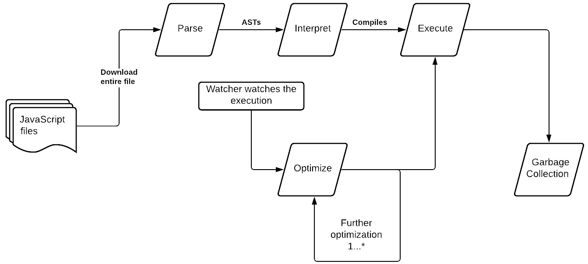

# *第三章*：探索 WebAssembly 模块

WebAssembly 是一种低级类似汇编的代码，旨在高效执行和紧凑表示。WebAssembly 在所有 JavaScript 引擎中（包括现代桌面和移动浏览器以及 Node.js）以接近原生速度运行。二进制的紧凑表示使得生成的二进制文件尽可能小。

备注

WebAssembly 的主要目标是实现高性能应用程序。

每个 WebAssembly 文件都是一个高效、最优且自给自足的模块，称为**WebAssembly 模块**（**WASM**）。WASM 是安全的，也就是说，二进制在内存安全和沙箱环境中运行。WASM 没有权限访问沙箱之外的任何内容。WASM 是语言、硬件和平台无关的。

WebAssembly 是一个虚拟的**指令集架构**（**ISA**）。WebAssembly 规范定义了以下内容：

+   指令集

+   二进制编码

+   验证

+   执行语义

WebAssembly 规范还定义了 WebAssembly 二进制的文本表示。

在本章中，我们将探索 WASM 以及 JavaScript 引擎如何执行 WASM。然后我们将探索 WebAssembly 文本格式及其用途。理解 WASM 执行和 WebAssembly 文本格式将使我们能够轻松理解模块并在 JavaScript 引擎中调试它。本章将涵盖以下主要主题：

+   理解 WebAssembly 的工作原理

+   探索 WebAssembly 文本格式

# 技术要求

你可以在 GitHub 上找到本章中包含的代码文件，网址为[`github.com/PacktPublishing/Practical-WebAssembly`](https://github.com/PacktPublishing/Practical-WebAssembly)。

# 理解 WebAssembly 的工作原理

让我们先探索 JavaScript 和 WebAssembly 如何在 JavaScript 引擎中执行。

## 理解 JavaScript 在 JavaScript 引擎中的执行

JavaScript 引擎首先获取完整的 JavaScript 文件（请注意，引擎必须等待整个文件下载/加载完成）。

备注

JavaScript 文件越大，加载所需的时间就越长。无论你的 JavaScript 引擎有多快，或者你的代码有多高效，都没有关系。如果你的 JavaScript 文件非常大（即，大于 170 KB），那么你的应用程序在加载时将会很慢。



图 3.1 – JavaScript 在 JavaScript 引擎中的执行

一旦加载，JavaScript 就会被解析成**抽象语法树**（**ASTs**）。这个阶段称为**解析**。由于 JavaScript 既是解释型语言又是编译型语言，JavaScript 引擎在解析后启动执行。解释器执行代码更快，但每次都会编译代码。这个阶段称为**解释**。

JavaScript 引擎有 **监视器**（在一些浏览器中称为 **分析器**）。监视器跟踪代码执行。如果一个特定的代码块经常执行，那么监视器将其标记为热代码。引擎使用 **即时编译**（**JIT**）编译这个代码块。引擎花费一些时间进行编译，比如说在纳秒级别。这里花费的时间是值得的，因为下次函数被调用时，执行会更快，因为编译版本总是比解释版本快。这个阶段被称为 **优化**。

JavaScript 引擎添加一个（或两个）更多的优化层。监视器继续监视代码执行。然后，监视器将调用频率更高的代码命名为 *非常热代码*。引擎进一步优化此代码。这种优化需要很长时间（考虑类似于 `-O3` 级别的优化）。这个阶段产生高度优化的代码，运行速度极快。此代码比之前优化的代码和解释版本快得多。显然，引擎在这个阶段花费更多的时间，比如说在毫秒级别。这是通过代码性能和执行频率来补偿的。

JavaScript 是一种动态类型语言，引擎能做的所有优化都是基于 *类型* 的假设。如果假设被打破，那么代码将被解释并执行，优化的代码将被移除而不是抛出运行时异常。JavaScript 引擎实现了必要的类型检查，并在假设的类型发生变化时退出优化的代码。但是，在优化阶段花费的时间是徒劳的。

我们可以通过使用诸如 **TypeScript** 这样的工具来防止这些 *类型* 相关的问题。TypeScript 是 JavaScript 的超集。使用 TypeScript，我们可以防止多态代码（接受不同类型的代码）。在 JavaScript 引擎中，单态代码（只接受一种类型的代码）总是比其多态对应物运行得更快。

如果 JavaScript 文件很大，那么拥有高度优化的单态 JavaScript 代码是没有用的。JavaScript 引擎必须等待整个文件下载完成。在糟糕的连接下，这需要很长时间才能完成。

注意

将 JavaScript 包拆分成更小的块非常重要。异步包含 JavaScript（换句话说，懒加载）可以提高应用程序的性能。我们需要找到一个正确的平衡点，并知道要加载、缓存和重新验证哪个 JavaScript 模块/文件。更大的文件大小（负载）将大大降低应用程序的性能。

最后一步是**垃圾回收**，其中移除内存中所有活动的对象。JavaScript 引擎中的垃圾回收基于引用。在垃圾回收周期中，JavaScript 引擎从根对象（类似于 Node.js 中的全局对象）开始。它找到所有从根对象引用的对象，并将它们标记为可达对象。它将剩余的对象标记为不可达对象。最后，它清除不可达对象。由于这是由 JavaScript 引擎自动完成的，因此垃圾回收过程效率不高，速度较慢。

## 理解 JavaScript 引擎中的 WebAssembly 执行

WASM 是二进制格式，并且已经编译和优化。JavaScript 引擎获取 WASM。然后，它解码 WASM 并将其转换为模块的内部表示（即 AST）。这个阶段称为**解码**。解码阶段比 JavaScript 的**解析**阶段快得多。

![Figure 3.2 – WebAssembly execution inside the JavaScript engine]

![img/Figure_3.2_B14844.jpg]

Figure 3.2 – WebAssembly execution inside the JavaScript engine

接下来，解码后的 WASM 进入**编译**阶段。在这个阶段，模块被验证，在验证过程中，代码会检查某些条件以确保模块是安全的，并且没有有害的代码。在验证过程中，函数、指令序列和堆栈的使用都会进行类型检查。验证后的代码随后被编译成机器可执行代码。由于 WASM 已经编译和优化，这个编译阶段更快。在这个阶段，WASM 被转换成机器代码。

编译后的代码随后进入**执行**阶段。在执行阶段，模块被实例化和调用。在实例化过程中，引擎实例化了状态和执行栈（存储所有与程序相关的信息的内存），然后执行模块。

WebAssembly 的另一个优点是模块从第一字节开始就可以准备编译和实例化。因此，JavaScript 引擎无需等待整个模块下载完成。这进一步提高了 WebAssembly 的性能。WebAssembly 之所以快速，是因为它的执行步骤比 JavaScript 执行步骤少，所以二进制文件已经优化和编译，并且可以流式编译。

注意

WASM 并不总是提供高性能。在某些场景中，JavaScript 的表现更好。因此，有必要理解这一点，并在使用 WebAssembly 之前进行思考。

在[`medium.com/@addyosmani/the-cost-of-javascript-in-2018-7d8950fbb5d4`](https://medium.com/@addyosmani/the-cost-of-javascript-in-2018-7d8950fbb5d4)了解更多关于 JavaScript 性能和加载时间如何涉及的信息。

在[`webpack.js.org/guides/code-splitting/`](https://webpack.js.org/guides/code-splitting/)了解更多关于 webpack 中的代码拆分和分块的信息。

我们已经看到了 WebAssembly 在浏览器中的工作方式；现在，让我们探索 WebAssembly 文本格式。

# 探索 WebAssembly 文本格式

机器理解一串 1 和 0。我们优化二进制以使其运行更快、更高效。指令越简洁、越优化，机器将越高效、性能越好。但对于人类来说，很难在上下文中分析和理解一大堆 1 和 0。这正是我们开始抽象和创建高级编程语言的原因。

在 WebAssembly 世界中，我们将可读性编程语言，如 Rust、Go 和 C/C++，转换为二进制代码。这些二进制是一系列带有操作码和操作数的指令。这些指令使机器运行得非常高效，但在上下文中也使得我们难以理解。

我们为什么要担心生成的二进制的可读性？因为它有助于我们理解代码，这在调试代码时很有帮助。

WebAssembly 提供了 WebAssembly 文本格式，WAST 或 WAT。WAST 是 WebAssembly 二进制的可读格式。JavaScript 引擎（无论是在浏览器中还是在 Node.js 中），在加载 WebAssembly 文件时，可以将二进制转换为 WebAssembly 文本格式。这有助于理解代码内容并进行调试。文本编辑器可以以 WebAssembly 文本格式显示二进制，这比其二进制对应物更易读。

二进制格式的基本 WASM 如下所示：

```rs
00 61 73 6d 01 00 00 00
```

这对应于以下内容：

```rs
 00 61 73 6d 01 00 00 00
\0  a  s  m  1  0  0  0 (ascii value of the character)
|         |  |
---------  version
    |
Magic Header
```

这个基本模块有一个魔法头（`\0asm`），后面跟着 WebAssembly 的版本（`01`）。

文本格式是用 `()` 写的。S-表达式在定义嵌套列表或结构化树时常用。许多关于基于树的数据结构的研究论文使用这种符号来展示他们的代码。s-表达式从 XML 中移除了所有不必要的仪式，提供了一个简洁的格式。

注意

这个表达式（定义括号内的所有内容）看起来熟悉吗？你曾经使用过 LISP（或受 LISP 启发的语言）吗？

模块是 WASM 的基本构建块。基本 WASM 的文本表示如下：

```rs
(module ) 
```

WASM 由一个头和零个或多个部分组成。头以一个魔法头和 WASM 的版本开始。在头之后，WASM 可能包含零个或多个以下部分：

+   类型

+   函数

+   表

+   内存

+   全局变量

+   元素

+   数据

+   开始函数

+   导出

+   导入

所有这些部分在 WASM 中都是可选的。WASM 的结构如下所示：

```rs
 module ::= {
    types vec<funcType>,
    funcs vec<func>,
    tables vec<table>,
    mems vec<mem>,
    globals vec<global>,
    elem vec<elem>,
    data vec<data>,
    start start,
    imports vec<import>,
    exports vec<export>
 } 
```

WASM 内部的每个部分都是一个包含零个或多个相应类型值的向量（数组），除了 `start`。我们将在本书的后面部分探讨 `start` 部分。目前，`start` 保存一个索引，该索引引用 `funcs` 部分中的一个函数。

WASM 中的每个部分都采用以下格式：

```rs
<section id><u32 section size><Actual content of the section> 
```

第一个字节指的是一个唯一的节 ID。每个节都有一个唯一的节 ID。紧随唯一节 ID 的是定义节大小的 **无符号 32 位**（**u32**）整数。剩余的字节是节内容。

注意

由于节大小由 u32 整数定义，因此节的最大大小限制在大约 4.2 GB 的内存（即 2³² - 1）内。

在 WebAssembly 文本格式中，我们使用节的名字来表示节中的每个段。

例如，函数节包含一个函数列表。以下是一个 WebAssembly 文本格式中的示例函数定义：

```rs
 (func <name>? <func_type> <local>* <inst>* )
```

与其他表达式一样，我们定义的所有内容都在括号 `()` 内。首先，我们使用 `func` 关键字定义函数块。在 `func` 关键字之后，我们添加函数的名称。在这里，函数名称是可选的，因为在二进制中，函数是通过函数节内函数块的索引来识别的。

名字后面跟着 `func_type`。`func_type` 在规范中被称为 `type_use`。在这里，`type_use` 指的是类型定义。`func_type` 包含所有输入参数（及其类型）和函数的返回类型。因此，对于一个 `add` 函数，它接受两个输入操作数并返回结果，`func_type` 将看起来像这样：

```rs
(param $lhs i32) (param $rhs i32) (result i32) 
```

注意

类型可以是 `i32`、`i64`、`f32` 或 `f64`（32 位和 64 位整数或浮点数）。类型信息可能会在未来改变，当 WebAssembly 增加对更多类型的支持时。

`param` 关键字表示定义的表达式包含一个参数。`$lhs` 是变量名。请注意，在 WebAssembly 文本格式中定义的所有变量都将有 `$` 作为前缀。接下来，我们有参数的类型，`i32`。同样，我们为第二个操作数定义了另一个表达式，`$rhs`。最后，返回类型被提到为 `(result i32)`。`result` 关键字表示表达式是一个返回类型，后面跟着类型，`i32`。

在 `func_type` 之后，我们定义任何将在函数内部使用的局部变量。最后，我们有一个指令/操作的列表。

让我们以前面的代码片段为参考，定义一个 `add` 函数：

```rs
 (func $add (param $lhs i32) (param $rhs i32) (result i32)
    get_local $lhs
    get_local $rhs
    i32.add) 
```

整个块被括号包围。函数块以 `func` 关键字开始。然后，我们有一个可选的函数名（`$add`）。WebAssembly 二进制模块将使用函数节内的函数索引来识别函数，而不是名称。然后，我们定义操作数和返回类型。

注意

在二进制格式中，参数和结果通过 `type` 节定义，因为这有助于优化生成的函数。但在文本格式中，为了简洁和易于理解，类型信息将显示在每个函数定义中。

然后，我们有一系列指令。第一条指令`get_local`获取（从堆中）的局部值`$lhs`。然后，我们获取`$rhs`的局部值。之后，我们使用`i32.add`指令将它们相加。最后，关闭括号结束。

没有单独的`return`语句/表达式。那么，函数是如何知道要返回什么的？

如我们之前所见，WebAssembly 是一种栈机器。当调用一个函数时，它会为它创建一个空栈。然后，函数使用这个栈来推送和弹出数据。因此，当执行`get_local`指令时，它将值推入栈中。在执行了两个`get_local`调用之后，栈中将包含`$lhs`和`$rhs`。最后，`i32.add`将从栈中弹出两个值，执行`add`操作，并将元素推入。当函数结束时，栈顶的值将被取出并提供给函数调用者。

如果我们想将此函数导出到外部世界，则可以添加一个`export`块：

```rs
 (export <export_name> (func <function_reference>))
```

`export`块定义在`()`内。`export`块以`export`关键字开始。`export`关键字后面跟着函数的名称。名称之后，我们引用该函数。函数块由以下`func`关键字组成。然后，我们有`function_reference`，它引用模块内部定义/导入的函数的名称。

为了导出`add`函数，我们定义以下内容：

```rs
 (export "add" (func $add)) 
```

`"add"`指的是函数在模块外部导出的名称，后面跟着`(func $add)`，指的是该函数。

函数和`export`部分都应该包裹在`module`部分内，以使其成为有效的 WASM：

```rs
(module
    (func $add (param $lhs i32) (param $rhs i32) 
      (result i32)
        get_local $lhs
        get_local $rhs
        i32.add)
    (export "add" (func $add))
) 
```

前面的内容是有效的 WASM。想象它是一个树结构，模块作为其根，函数和导出作为其子节点。

我们已经看到了如何在 WebAssembly 文本格式中创建一个简单的函数。现在，让我们在 WebAssembly 文本格式中定义一个复杂函数。

## 在 WebAssembly 文本格式中构建函数

为了这个目的，我们将使用递归的斐波那契数列生成器。我们将编写的斐波那契函数将具有以下格式：

```rs
 # Sample code in C for reference
int fib(n) {
    if (n <= 1)
        return 1;
    else
        return fib(n-1)+ fib(n-2);
} 
```

让我们首先使用 WebAssembly 文本格式定义给定`fib`函数的函数签名。`fib`函数类似于其 C 语言对应版本，接受一个数字参数并返回一个数字。因此，函数定义遵循 WebAssembly 文本格式中的相同签名：

```rs
 (func $fib (param $n i32) (result i32)
    ...
)
```

我们在括号`()`内定义函数。函数以`func`关键字开始。关键字之后，我们添加函数名称，`$fib`。然后，我们向函数添加参数；在我们的例子中，函数只有一个参数，`n`；我们将其定义为`(param $n i32)`。然后，函数返回一个数字，`(result i32)`。

WebAssembly 没有内存来处理临时变量。为了有局部值，我们应该将值推入栈中，然后检索它。所以，要检查`n<=1`，我们必须首先创建一个局部变量并在其中存储`1`，然后进行检查。要定义局部变量，我们使用`local`块。`local`块以`local`关键字开始。这个关键字后面跟着变量的名称。在变量名称之后，我们定义变量的类型：

```rs
 (local <name> <type>)
```

让我们创建一个名为`$tmp`的`local`变量：

```rs
 (local $tmp i32) 
```

注意

`(local $tmp i32)`不是一个指令。它是函数声明的一部分。记住，前面的函数语法包括`local`。

我们接下来必须将`$tmp`的值设置为`1`。要设置值，我们首先必须将值`1`推入栈中，然后从栈中弹出值并将其设置为`$tmp`：

```rs
i32.const 1
set_local $tmp 
```

`i32.const`创建一个`i32`常量值并将其推入栈中。所以，在这里，我们创建一个值为`1`的常量并将其推入栈中。

然后，我们使用`set_local`设置`$tmp`中的值。`set_local`从栈顶获取最高值，在我们的例子中是 1，并将`$tmp`的值设置为 1。

现在，我们必须检查给定的参数是否小于 2。WebAssembly 提供了`i32.<some_action>`来对`i32`执行一些操作。例如，要添加两个数字，我们使用了`i32.add`。同样，要检查它是否小于某个特定值，我们有`i32.lt_s`。这里的`_s`表示我们正在检查一个有符号数字。

`i32.lt_s`期望两个操作数。对于第一个操作数（即`$n`），我们使用`get_local`表达式从`$n`中获取值并将其放在栈顶。然后，我们使用`i32.const 2`创建一个常量并将其推入栈中。最后，我们使用`i32.lt_s`比较`$n`的值与`2`：

```rs
get_local $n
i32.const 2
i32.lt_s
```

但我们如何定义*条件*？WebAssembly 提供了`br_if`和`block`。

在 WebAssembly 文本格式中，一个块是通过`block`关键字定义的，后面跟着一个用于识别块的名称。我们使用`end`来结束块。块看起来如下：

```rs
block $block
... ; some code goes in here.
end
```

我们将提供这个块给`br_if`。如果条件成功，`br_if`将调用块：

```rs
get_local $n
i32.const 2
i32.lt_s
br_if $block ; calls the $block` only when the condition
  succeeds.
```

WebAssembly 文本格式目前看起来是这样的：

```rs
 (module
  (func $fib (param $n i32) (result i32) (local $tmp i32)
    i32.const 1
    set_local $tmp
    ; block
    block $block
      ; if condition
      get_local $n
      i32.const 2
      i32.lt_s
      br_if $block
    ... ; some code
    end
    ; return value
    get_local $tmp
  )
) 
```

所有的内容都被包裹在`module`中。在`$block`的末尾，值将被存储在`$tmp`中。我们使用`get_local $tmp`来获取`$tmp`的值。唯一剩下要做的就是创建循环。

### 循环时间

首先，我们将`$tmp`设置为`1`：

```rs
i32.const 1
set_local $tmp 
```

然后，我们将创建一个循环。要创建循环，WebAssembly 文本格式使用`loop`关键字：

```rs
loop $loop
end 
```

`loop`关键字后面跟着循环的名称。循环以`end`关键字结束。`loop`是一个特殊的块，它将一直运行，直到我们使用一些条件表达式（如`br_if`）退出：

```rs
get_local $n
i32.const -2
i32.add
call $fib
get_local $tmp
i32.add
set_local $tmp
get_local $n
i32.const -1
i32.add
tee_local $n
i32.const 1
i32.gt_s
br_if $loop
```

我们得到`$n`并给它加上`-2`，然后调用`fib`函数。要调用一个函数，我们使用`call`关键字后跟函数名。在这里，`call $fib`返回值并将值推入栈中。

现在，使用`get_local $tmp`获取`$tmp`。这会将`$tmp`推入栈中。然后，我们使用`i32.add`从栈中弹出两个值并将它们相加。最后，我们使用`set_local $tmp`设置`$tmp`。`set_local $tmp`从栈中取出最顶部的值并将其分配给`$tmp`。我们得到`$n`并给它加上`-1`。

我们在这里使用`tee_local`是因为`tee_local`与`set_local`类似，但不同之处在于它不是将值推入栈中，而是返回值。最后，我们运行循环直到`$n`大于 1。如果它小于 1，我们使用`br_if $loop`跳出循环。完整的 WebAssembly 文本格式将看起来像这样：

```rs
(module
  (func (export $fib (param $n i32) (result i32) 
    (local $tmp i32)
    i32.const 1
    set_local $tmp
    ; block
    block $block
      ; if condition
      get_local $n
      i32.const 2
      i32.lt_s
      br_if $block
      ; loop
      loop $loop
        get_local $n
        i32.const -2
        i32.add
        call $fib
        get_local $tmp
        i32.add
        set_local $tmp
        get_local $n
        i32.const -1
        i32.add
        tee_local $n
        i32.const 1
        i32.gt_s
        br_if $loop
      end
    end
    ; return value
    get_local $tmp
  )
)
```

在未来的章节中，我们将看到如何将这个 WebAssembly 文本格式转换为 WASM 并执行它。

如果你对学习更多关于 s 表达式感兴趣，请查看[`en.wikipedia.org/wiki/S-expression`](https://en.wikipedia.org/wiki/S-expression)。

要了解更多关于 WebAssembly 文本格式设计的信息，请查看[`github.com/WebAssembly/design/blob/master/Semantics.md`](https://github.com/WebAssembly/design/blob/master/Semantics.md)中的规范。

在[`webassembly.github.io/spec/core/text/instructions.html`](https://webassembly.github.io/spec/core/text/instructions.html)查看更多文本指令。

在[`webassembly.github.io/spec/core/binary/instructions.html`](https://webassembly.github.io/spec/core/binary/instructions.html)参考各种指令及其操作码。

在[`github.com/WebAssembly/design/blob/master/BinaryEncoding.md`](https://github.com/WebAssembly/design/blob/master/BinaryEncoding.md)了解更多关于二进制编码的信息。

# 摘要

在本章中，我们看到了 WebAssembly 如何在 JavaScript 引擎中执行，并探讨了 WebAssembly 文本格式是什么以及如何使用 WebAssembly 文本格式定义 WASM。在下一章中，我们将探索 WebAssembly 二进制工具包。
