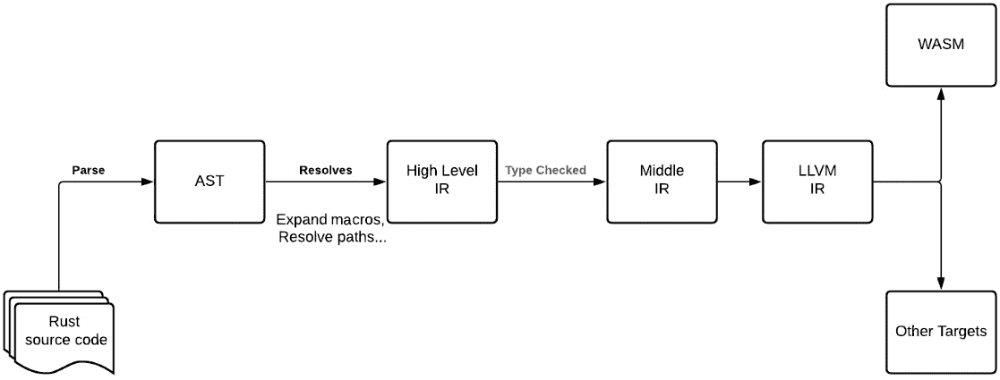

# *第七章*：将 Rust 与 WebAssembly 集成

Rust 是一种系统级编程语言。作为系统级编程语言，Rust 提供了低级内存管理和高效表示数据的能力。因此，它为程序员提供了完全的控制权，并提高了性能。

此外，Rust 还提供了以下功能：

+   **友好的编译器** – Rust 编译器是您编写 Rust 时的伴侣。编译器会纠正您，指导您，并确保您几乎总是编写内存安全的代码。

+   **所有权模型** – 所有权模型确保我们不需要垃圾回收。这保证了 Rust 中的线程和内存安全。

+   **安全性、速度和并发性** – Rust 确保安全性和并发性，并让您远离风险、崩溃和漏洞。

+   **现代语言** – Rust 提供了现代语言语法，并且语言是为了提供更好的开发者体验而构建的。

这些特性（以及成千上万的其它特性）确保 Rust 是一种通用编程语言。Rust 语言的亮点在于其编译器和社区总是乐于助人。

Rust 为 WebAssembly 提供了一级支持。Rust 丰富的工具链使得开始使用 WebAssembly 更加容易。Rust 不需要运行时，这使得它成为 WebAssembly 的理想候选者。在本章中，我们将看到如何安装 Rust 并探索将 Rust 转换为 WebAssembly 模块的各种方法。本章将涵盖以下部分：

+   安装 Rust

+   通过 `rustc` 将 Rust 转换为 WebAssembly

+   通过 Cargo 将 Rust 转换为 WebAssembly

+   安装 wasm-bindgen

+   通过 `wasm-bindgen` 将 Rust 转换为 WebAssembly

现在，让我们进入 Rust 和 WebAssembly 的世界。

# 技术要求

您可以在 GitHub 上找到本章中存在的代码文件，网址为 [`github.com/PacktPublishing/Practical-WebAssembly`](https://github.com/PacktPublishing/Practical-WebAssembly)。

# 安装 Rust

Rust 是一种编译型语言，其编译器被称为 **Rust 编译器**（**rustc**）。Rust 还有自己的包管理器，称为 **Cargo**。Cargo 与 Node.js 的 npm 类似。Cargo 下载包依赖项并构建、编译、打包并将工件上传到 crate（Rust 的包版本）。

Rust 语言提供了一个简单的方法通过 `rustup` 安装和管理 Rust。`rustup` 帮助安装、更新和删除 `rustc`、Cargo 和 `rustup` 本身。这使得安装和管理 Rust 的各种版本变得容易。

让我们使用 `rustup` 工具安装 Rust，并看看我们如何使用 `rustup` 管理 Rust 版本。

在 Linux 或 macOS 上，请使用以下命令：

```rs
$ curl https://sh.rustup.rs --sSf | sh
```

该脚本将下载并安装 Rust 语言。`rustc` 和 Cargo 都安装在 `~/.cargo/bin` 中，并委托对底层工具链的任何访问。

对于 Windows，从这里下载并安装二进制文件：[`forge.rust-lang.org/infra/other-installation-methods.html`](https://forge.rust-lang.org/infra/other-installation-methods.html)。`rustc` 和 Cargo 都安装在 `users` 文件夹中。

注意

你将需要 Visual Studio 2013 或更高版本的 C++ 构建工具。你可以从这里安装它们：[`visualstudio.microsoft.com/downloads/`](https://visualstudio.microsoft.com/downloads/)。

一旦安装成功完成，你可以通过运行以下命令来检查：

```rs
$ rustc –version
rustc 1.58.1 (db9d1b20b 2022-01-20)
```

`rustup` 是一个工具链多路复用器。它安装并管理许多 Rust 工具链，并通过位于主目录 `.cargo/bin` 中的单个工具集进行代理。一旦安装了 `rustup`，我们就可以轻松地管理 `rustc` 和 `cargo` 编译器。`rustup` 还使得在夜间、稳定和测试版本之间切换 Rust 更加容易。

Rust 在其稳定版本中提供了 WebAssembly 编译支持。我们还将切换到夜间构建，以确保我们获得所有最新的好处。

要切换到夜间版本，我们必须运行以下命令：

```rs
$ rustup default nightly
```

此命令将默认的 `rustc` 切换到夜间版本。位于 `~/.cargo/bin` 的 `rustc` 代理将运行夜间编译器而不是稳定编译器。

要更新到最新版本的夜间版本，我们可以运行以下命令：

```rs
$ rustup update
```

一旦成功更新，我们可以通过运行以下命令来检查当前安装的版本：

```rs
$ rustc --version
rustc 1.55.0 (c8dfcfe04 2021-09-06)
```

Rust 将 WebAssembly 作为一等公民支持。因此，`rustc` 能够将 Rust 代码编译成 WebAssembly 模块。让我们看看如何通过 `rustc` 将 Rust 转换为 WebAssembly。

# 通过 rustc 将 Rust 转换为 WebAssembly

Rust 使用我们即将创建的 LLVM 编译器来生成机器原生代码。`rustc` 使用 LLVM 的能力将原生代码转换为 WebAssembly 模块。我们在上一节中安装了 Rust；现在让我们使用 `rustc` 开始将 Rust 转换为 WebAssembly 模块。

我们将从 Hello World 开始：

1.  让我们创建一个名为 `hello_world.rs` 的文件：

    ```rs
    $ touch hello_world.rs
    ```

1.  启动你最喜欢的编辑器并开始编写 Rust 代码：

    ```rs
    fn main() {    
    println!("Hello World!");
    }
    ```

我们已经定义了一个 `main` 函数。类似于 C，`main` 是一个特殊函数，它在编译成可执行文件后标记程序的入口点。

`fn` 是 Rust 中的函数关键字。`main()` 是函数名。

`println!` 是一个宏。Rust 中的宏允许我们在语法级别抽象代码。宏调用是“展开”的语法形式的简写。这种展开发生在编译的早期阶段，在静态检查之前。

注意

宏是一个有趣的功能，但解释它们超出了本书的范围。你可以在以下位置找到更多信息：[`doc.rust-lang.org/book/ch19-06-macros.html`](https://doc.rust-lang.org/book/ch19-06-macros.html)。

1.  我们将 `Hello World!` 字符串传递给 `println!` 宏函数。我们可以通过运行以下命令来编译并生成二进制文件：

    ```rs
    $ rustc hello.rs
    ```

1.  这将生成一个 `hello` 二进制文件。我们可以执行该二进制文件，它将打印 `Hello World!`：

    ```rs
    $ ./hello
    Hello World!
    ```

1.  现在，使用 `rustc` 将 Rust 编译成 WebAssembly 模块：

    ```rs
    $ rustc --target wasm32-unknown-emscripten
      hello_world.rs -o hello_world.html
    ```

这将生成 WebAssembly 模块。

1.  使用以下命令在浏览器中运行生成的代码：

    ```rs
    $ python -m http.server
    ```

打开浏览器并转到 `http://localhost:8000`。打开开发者控制台以查看其中打印的 `Hello World!`。

要将 Rust 转换为 WebAssembly 模块，我们使用了 `--target` 标志。此标志指示编译器编译和构建二进制文件，使其在提供的运行时上运行。

我们将 `wasm32-unknown-emscripten` 作为值传递给 `--target` 标志。

`wasm32` 表示地址空间大小为 32 位。`unknown` 告诉编译器您不知道要编译到的系统。最后的 `emscripten` 通知编译器您的目标。

因此，使用 `wasm32-unknown-emscripten` 值，编译器将在几乎任何机器上编译，但仅在 Emscripten 运行时上运行。然后，我们指定需要编译成 WebAssembly 模块的需要编译的输入文件。最后，我们使用 `-o` 标志指定输出。

理解 `rustc` 做了什么是很重要的。



图 7.1 – Rust 编译步骤

`rustc` 首先解析输入并生成 **抽象语法树**（**AST**）。一旦生成了 AST，编译器随后递归解析路径，展开宏和其他引用。一旦 AST 完全解析，它将被转换为 **高级中间表示**（**HIR**）。这种中间表示类似于 AST 的去糖版本。

然后对 HIR 进行类型检查。类型检查后，HIR 将进行后处理并转换为 **中间表示**（**MIR**）。从 MIR 中，编译器生成 **LLVM 中间表示**（**LLVM IR**）。之后，LLVM 对它们进行所需的优化。

现在，有了 LLVM IR，将 LLVM IR 转换为 WebAssembly 模块变得更容易。这与 Emscripten 将 C 或 C++ 代码转换为 WebAssembly 模块的方式类似。

注意

由于我们在这里使用了 `wasm32-unknown-emscripten` 标志，我们需要 `emcc` 可用，以便将 Rust 代码生成的 LLVM IR 转换为 WebAssembly 模块。

我们已经看到了如何使用 `rustc` 生成 WebAssembly 模块。它在幕后使用 Emscripten 创建它们。但 Rust 提供了另一种抽象来生成 WebAssembly 模块，通过 Cargo。

在下一节中，我们将看到如何使用 Cargo 将 Rust 转换为 WebAssembly。

# 通过 Cargo 将 Rust 转换为 WebAssembly

Cargo 使创建、运行、下载、编译、测试和运行项目变得更容易。`cargo` 命令提供了一个包装器，它调用 `rustc` 编译器以启动编译。为了使用 Rust 的工具链创建 WebAssembly 模块，我们将使用不同的目标，`wasm32-unknown-unknown`。

`wasm32-unknown-unknown`目标添加了零运行时和工具链占用。`wasm32`使编译器假设只有`wasm32`指令集存在。`unknown-unknown`中的第一个`unknown`表示代码可以在任何机器上编译，第二个表示代码可以在任何机器上运行。

为了看到它的实际效果，让我们使用 Cargo 创建一个新的项目：

```rs
$ cargo new --lib fib_wasm
Created library `fib_wasm` package
```

创建了一个名为`fib_wasm`的新项目。新选项创建一个 Rust 项目。`--lib`标志通知 Cargo 创建一个新的库项目而不是默认的二进制项目。

二进制项目将生成可执行的二进制文件。库项目将创建库模块。

启动您最喜欢的文本编辑器，并将`src/lib.rs`文件的内容替换为以下内容：

```rs
#[no_mangle]
fn add(x: i32, y:i32) -> i32 {    x + y}
```

`#[no_mangle]`是一种注释。这种注释通知编译器在生成库时不要更改名称。

然后，我们定义`add`函数。`add`函数接受两个参数，`x`和`y`。我们使用`i32`在变量后跟一个冒号（`:`）来定义它们的类型。最后，我们使用`-> i32`定义它们的返回类型。

函数体只有`x + y`。注意，在 Rust 中我们不需要在最后一条语句的末尾使用`return`关键字和`;`，这可以简写为返回。

Cargo 还会生成`Cargo.toml`文件。此文件包含有关项目的所有元信息，如何编译 Rust 代码以及它们的依赖项。

`Cargo.toml`文件看起来像这样：

```rs
[package]
name = "fib_wasm"
version = "0.1.0"
authors = ["Sendil Kumar"]
edition = "2018"
```

它定义了包名、版本、作者以及我们正在使用的 Rust 版本。

在这里，我们必须指导编译器我们正在编译哪种类型的 crate。我们可以在`[lib]`部分和`crate-type`属性中指定它。

打开`Cargo.toml`文件，并在其中添加`crate-type`信息：

```rs
[package]
name = "fib_wasm"
version = "0.1.0"
authors = ["Sendil Kumar"]
edition = "2018"
[lib]
crate-type = ["cdylib"]
```

`cdylib`在这里指定将生成一个动态系统库。当库需要从其他语言加载时，将使用此动态系统库。

让我们编译 Rust 到 WebAssembly 模块：

```rs
$ cargo build --target wasm32-unknown-unknown
```

这将调用`rustc`并指定目标。这将生成`/target/wasm32-unknown-unknown/`中的 WebAssembly 模块。现在，为了在浏览器上运行 WebAssembly 模块，让我们手动创建 HTML 文件并使用 JavaScript 加载它。

让我们创建一个 HTML 文件：

```rs
$ touch index.html
```

将以下内容添加到文件中：

```rs
<script> 
(async () => {     
const bytes = await fetch("target/wasm32-unknown-
  unknown/debug/fib_wasm.wasm");     
const response = await bytes.arrayBuffer();     
const result = await WebAssembly.instantiate(response, {});
  console.log(result.instance.exports.add(10,3)); 
})();
</script>
```

我们在`<script>`标签内定义了脚本。在 HTML 中，我们在`<script>`标签内定义 JavaScript。我们添加了`async`关键字。`async`关键字指定函数是异步的。

首先，我们获取 WebAssembly 模块。WebAssembly 模块在`target/wasm32-unknown-unknown/debug/`文件夹中生成，其名称与`Cargo.toml`中定义的包名相同。

`await`关键字确保执行被挂起，直到我们获取整个 WebAssembly 模块。

然后，我们使用`bytes.arrayBuffer()`将收集的字节（来自 fetch 调用）进行转换。现在`response`对象将包含在`ArrayBuffer`中的 WebAssembly 模块。

然后，我们使用 `WebAssembly.instantiate` 函数实例化字节数组。`result` 对象包含整个 WebAssembly 模块。

WebAssembly 模块 `result` 包含 `instance` 属性。该实例具有 `exports` 属性。`exports` 属性包含 WebAssembly 模块导出的所有函数。

由于我们添加了 `#[no_mangle]`，导出的函数名称没有改变。因此，`exports` 属性中定义了 `add` 函数。

我们在这里使用了 async-await 来使语法更加优雅，并使上下文更容易理解。

如预期的那样，前面的代码将输出 `13`。您可以在浏览器控制台中检查输出。

在这里，`cargo build` 命令调用 `rustc` 并将 Rust 代码编译成 MIR，然后编译成 LLVM IR。生成的 LLVM IR 然后转换为 WebAssembly 模块。让我们使这个函数更复杂一些。我们可以使用 Rust 创建一个斐波那契数生成器并在浏览器上运行 WebAssembly 模块：

1.  打开 `src/lib.rs` 并将其替换为以下内容：

    ```rs
    #[no_mangle]
    fn fibonacci(num: i32) -> i32 {    
    match num {        
    0 => 0,        
    1 => 1,        
    _ => fibonacci(num-1) + fibonacci(num-2),    
    }
    }
    ```

使用 `cargo build --target wasm32-unknown-unknown` 构建。

1.  然后，将 `index.html` 替换为调用斐波那契而不是 `add`：

    ```rs
    <script>
     (async () => {     
    const bytes = await fetch("target/wasm32-unknown-
      unknown/debug/fib_wasm.wasm");     
    const response = await bytes.arrayBuffer();     
    const result = await WebAssembly.instantiate(response,
      {});  
         result.instance.exports.fibonacci(20); 
    })();
    </script>
    ```

1.  现在，启动 HTML 服务器并检查浏览器的控制台以获取斐波那契值。

到目前为止，我们已经看到了简单的示例。但如何将函数和类从 JavaScript 传递到 WebAssembly，反之亦然？为了进行更高级的绑定，Rust 为我们提供了 `wasm-bindgen`。

# 安装 wasm-bindgen

`wasm-bindgen` 用于将 Rust 中的实体绑定到 JavaScript，反之亦然。

`wasm-bindgen` 使得从 Rust 导出实体到 JavaScript 更加自然。JavaScript 开发者会发现 `wasm-bindgen` 对 WebAssembly 的使用与 JavaScript 类似。

这使得在将 Rust 转换为 WebAssembly 模块时可以使用更丰富和更简单的 API。`wasm-bindgen` 使用这些功能并提供了一个简单的 API 以供使用。它确保 wasm 模块和 JavaScript 之间发生高级交互。

`wasm-bindgen` 提供了 JavaScript 和 WebAssembly 之间的通道，用于传递除了数字之外的内容，例如对象、字符串和数组。

要安装 `wasm-bindgen-cli`，请使用以下 `cargo` 命令：

```rs
$ cargo install wasm-bindgen-cli
```

安装成功后，让我们运行 `wasm-bindgen` CLI：

```rs
$ wasm-bindgen  --help
Generating JS bindings for a wasm file
Usage:
    wasm-bindgen [options] <input>
    wasm-bindgen -h | --help
    wasm-bindgen -V | --version
Options:
    -h --help                 Show this screen.
    --out-dir DIR             Output directory
    --out-name VAR            Set a custom output filename 
      (Without extension. Defaults to crate name)
    --target TARGET           What type of output to generate, 
      valid
      values are [web, bundler, nodejs, no-modules],
        and the default is [bundler]
    --no-modules-global VAR   Name of the global variable to 
      initialize
    --browser                 Hint that JS should only be 
      compatible with a browser
    --typescript              Output a TypeScript definition 
      file (on by default)
    --no-typescript           Don't emit a *.d.ts file
    --debug                   Include otherwise-extraneous 
      debug checks in output
    --no-demangle             Don't demangle Rust symbol names
    --keep-debug              Keep debug sections in wasm files
    --remove-name-section     Remove the debugging `name` 
      section of the file
    --remove-producers-section   Remove the telemetry 
      `producers` section
    --encode-into MODE        Whether or not to use 
      TextEncoder#encodeInto,
      valid values are [test,z always, never]
    --nodejs                  Deprecated, use `--target nodejs`
    --web                     Deprecated, use `--target web`
    --no-modules              Deprecated, use `--target 
      no-modules`
    -V --version              Print the version number of 
     wasm-bindgen
```

让我们看看 `wasm-bindgen` 支持的各种选项。

要在特定目录和特定名称下生成文件，该工具分别有 `--out-dir` 和 `--out-name`。为了减少或优化生成的 WebAssembly 模块大小，`wasm-bindgen` 有以下标志：

+   `--debug`：`--debug` 选项在生成的 WebAssembly 模块中包含额外的调试信息。这将增加 WebAssembly 模块的大小，但在开发中很有用。

+   `--keep-debug`: 这个 WebAssembly 模块可能包含自定义部分，也可能不包含。这些自定义部分可以用来存储调试信息。这些自定义部分在调试应用程序时（例如在浏览器开发者工具中）将非常有用。这将增加 WebAssembly 模块的大小。这在开发中很有用。

+   `--no-demangle`: 这个标志告诉 `wasm-bindgen` 不要对 Rust 符号名称进行去混淆。去混淆允许最终用户使用他们在 Rust 文件中定义的相同名称。

+   `--remove-name-section`: 这将移除文件的调试名称部分。我们将在稍后了解更多关于 WebAssembly 模块中各种部分的内容。这将减小 WebAssembly 模块的大小。

+   `--remove-producers-section`: WebAssembly 模块可以有一个生产者部分。这个部分将包含有关文件是如何生成或由谁生成的信息。默认情况下，生产者部分会被添加到生成的 WebAssembly 模块中。使用这个标志，我们可以移除它。这可以节省更多字节。

`wasm-bindgen` 为 Node.js 和浏览器环境提供生成绑定文件的选项。让我们看看那些标志：

+   `--nodejs`: 这将生成仅适用于 Node.js 的输出。不使用 ES 模块。

+   `--browser`: 这将生成仅适用于浏览器的输出。使用 ES 模块。

+   `--no-modules`: 这将生成仅适用于浏览器的输出。不使用 ES 模块。适用于尚不支持 ES 模块的浏览器。

可以使用 `--no-typescript` 标志关闭类型定义文件（`*.d.ts`）。

现在我们已经安装了 `wasm-bindgen`，让我们试一试。

# 通过 wasm-bindgen 将 Rust 转换为 WebAssembly

让我们从使用 `wasm-bindgen` 的 Hello World 示例开始：

1.  使用 Cargo 创建一个新项目：

    ```rs
     $ cargo new --lib hello_world
    Created library `hello_world` package
    ```

这将创建一个新的 Rust 项目，包含所有必要的文件。

1.  在您最喜欢的编辑器中打开项目。打开 `Cargo.toml` 文件以添加 `crate-type` 并添加 `wasm-bindgen` 依赖项：

    ```rs
    [package]
    name = "hello_world"
    version = "0.1.0"
    authors = ["Sendil Kumar"]
    edition = "2018"
    [lib]
    crate-type = ["cdylib"]
    [dependencies]
    wasm-bindgen = "0.2.38"
    ```

1.  我们在 `toml` 文件中的 `[dependencies]` 表下定义依赖项。打开 `src/lib.rs` 文件，将其内容替换为以下内容：

    ```rs
    use wasm_bindgen::prelude::*;
    #[wasm_bindgen]
    pub fn hello() -> String {
    "Hello World".to_string()
    }
    ```

我们使用 `use wasm_bingen::prelude::*` 导入 `wasm_bindgen` 库，然后使用 `# [wasm_bindgen]` 注解函数。`hello` 函数返回 `String`。

要生成 WebAssembly 模块，我们首先运行以下命令：

```rs
$ cargo build --target=wasm32-unknown-unknown
```

这将生成 WebAssembly 模块。但这个模块不能单独运行。WebAssembly 只支持在本地代码和 JavaScript 之间传递数字。但我们在这里返回的是一个 `String`。

为了传递任何值（除了数字），我们需要创建一个绑定 JavaScript 文件。这个绑定文件不过是一个翻译器，它将 `String`（和其他类型）转换为 `start`、`length`、`arrayBuffer`。

为了生成绑定文件，我们需要在生成的 WebAssembly 模块上运行 `wasm-bindgen` CLI 工具：

```rs
$ wasm-bindgen target/wasm32-unknown-
  unknown/debug/hello_world.wasm --out-dir .
```

我们运行 `wasm-bindgen` 并将其传递给生成的 `target/wasm32-unknown-unknown/debug/hello_world.wasm` WebAssembly 模块。`--out-dir` 标志告诉 `wasm-bindgen` CLI 工具在哪里保存生成的文件。在这里，我们要求在当前文件夹中生成文件。

我们可以看到文件夹内生成的文件：

```rs
$ ls -lrta
-rw-r--r-- 1 sendilkumar staff 1769 hello_world.js
-rw-r--r-- 1 sendilkumar staff 88 hello_world.d.ts
-rw-r--r-- 1 sendilkumar staff 227 hello_world_bg.d.ts
-rw-r--r-- 1 sendilkumar staff 67132 hello_world_bg.wasm 
```

`cargo build` 命令生成 WebAssembly 模块。`wasm-bindgen` CLI 将此 WebAssembly 模块作为输入并生成必要的绑定。绑定 JavaScript 文件的大小约为 1.8 KB。

生成的文件如下：

+   WebAssembly 模块（`hello_world_bg.wasm`）

+   JavaScript 绑定文件（`hello_world.js`）

+   WASM 的类型定义文件（`hello_world.d.ts`）

+   JavaScript 的类型定义文件（`hello_world_bg.d.ts`）

JavaScript 绑定文件就足够我们加载和运行 WebAssembly 模块了。

注意

还生成了一个 TypeScript 文件。

现在我们来检查绑定文件包含的内容：

```rs
import * as wasm from './hello_world_bg.wasm';
```

绑定文件导入了 WebAssembly 模块：

```rs
const lTextDecoder = typeof TextDecoder === 'undefined' ?
  require('util').TextDecoder : TextDecoder;
let cachedTextDecoder = new lTextDecoder('utf-8');
```

然后，它定义了 `TextDecoder`，用于从共享的 `ArrayBuffer` 解码字符串。

注意

由于没有可用的输入参数，不需要 `TextEncoder`（即从 JavaScript 编码字符串到共享内存）。`wasm-bindgen` 将只在绑定文件中生成必要的东西。

现代浏览器内置了 `TextDecoder` 和 `TextEncoder` 支持。`wasm-bindgen` 会检查是否存在解码器，如果存在则使用它；否则，使用 polyfill 加载它。

JavaScript 和 WebAssembly 模块之间的共享内存不需要每次都初始化。我们可以初始化一次，并在执行期间一直使用它。我们有以下两种方法来加载内存一次并在执行期间使用它：

```rs
function getUint8Memory() { ... }
function getUint32Memory() { ... }
```

然后，我们从 Rust 获取一个 `String` 到 JavaScript。这个 `String` 通过共享内存传递。因此，我们可以使用偏移量的指针和 `String` 的长度来检索它。以下函数用于从 WebAssembly 模块中检索 `String`：

```rs
function getStringFromWasm(ptr, len) { ....  }
```

我们在最后定义堆。这是我们将在其中存储所有从 WebAssembly 模块可引用的 JavaScript 变量的地方。`__wbindgen_object_drop_ref` 函数用于释放由 JavaScript 引用计数器占用的槽位。

最后，我们有 `hello` 函数：

```rs
export function hello() {
    const retptr = globalArgumentPtr();
    wasm.hello_world(retptr);
    const mem = getUint32Memory();
    const rustptr = mem[retptr / 4];
    const rustlen = mem[retptr / 4 + 1];
    const realRet = getStringFromWasm(rustptr,
      rustlen).slice();
    wasm.__wbindgen_free(rustptr, rustlen * 1);
    return realRet;
}
```

`hello` 函数被导出。我们首先获取参数的指针。这个指针指向共享数组缓冲区中的一个位置。然后，我们在 WebAssembly 模块中调用 `hello` 函数。

注意，我们在这里传递了一个（指向）参数。但在 Rust 端，我们没有为该函数定义任何参数。我们将简要地看看 `rustc` 如何重写代码。

然后，我们获取共享内存。注意，这是一个 32 位数组。我们获取存储结果的指针和输出字符串的长度。注意，这些是连续存储的。

最后，我们将从`rustptr`和`rustlen`获取字符串。一旦我们收到输出，我们将使用`wasm.__wbindgen_free`清除分配的内存。

要理解 Rust 端发生的情况，让我们使用`cargo-expand`命令展开宏，看看代码是如何生成的。

注意

检查[`github.com/dtolnay/cargo-expand`](https://github.com/dtolnay/cargo-expand)了解如何安装`cargo-expand`。这不是本书课程的强制性要求。但`cargo-expand`将帮助您理解`wasm-bindgen`实际上生成了什么。

打开您的终端，进入项目的根目录，并运行以下命令：

```rs
cargo expand --target=wasm32-unknown-unknown > expanded.rs
```

上述命令将创建一个名为`expanded.rs`的文件。如果您查看生成的文件，您将看到简单的`#[wasm_bindgen]`注解是如何改变函数暴露的详细部分的。wasm-bindgen 添加了编译器将 Rust 代码转换为 WebAssembly 模块所需的所有必要元数据。为了加载和运行生成的文件，我们可以使用 webpack 或 Parcel 等打包器。我们将在后面的章节中更详细地了解这些打包器是如何帮助的。现在，让我们看看如何运行和加载生成的文件：

注意

以下设置是常见的，我们将在未来的示例中将其称为“默认”webpack 设置。创建一个`webpack-config.js`文件来告诉 webpack 如何处理文件。

```rs
const path = require('path');
const HtmlWebpackPlugin = require('html-webpack-plugin');
module.exports = {
    entry: './index.js',
    output: {
        path: path.resolve(__dirname, 'dist'),
        filename: 'bundle.js',
    },
    plugins: [
        new HtmlWebpackPlugin(),
    ],
    mode: 'development'
};
```

这是一个标准的 webpack 配置文件，包含一个`HTMLWebpackPlugin`插件。此插件帮助我们生成默认的`index.html`，而不是手动创建它。

让我们添加一个`package.json`文件来打包运行 webpack 所需的依赖项：

```rs
{
    "scripts": {
        "build": "webpack",
        "serve": "webpack-dev-server"
    },
    "devDependencies": {
        "html-webpack-plugin": "³.2.0",
        "webpack": "⁴.29.4",
        "webpack-cli": "³.1.1",
        "webpack-dev-server": "³.1.0"
    }
}
```

创建一个`index.js`文件来加载绑定 JavaScript，它反过来加载生成的 WebAssembly 模块：

```rs
import("./hello_world").then(module => {
    console.log(module.hello_world());
});
```

现在，转到终端并使用以下命令安装 npm 依赖项：

```rs
$ npm install
```

运行`webpack-dev-server`：

```rs
$ npm run serve
```

前往 URL `http://localhost:8080`，并在浏览器中打开开发者控制台以查看打印的“Hello World”。

# 摘要

在本章中，我们看到了如何使用`rustup`安装 Rust。`rustup`帮助我们安装、更新、删除和切换 Rust 的不同版本。我们看到了`rustc`是如何工作的，然后使用`rustc`将 Rust 转换为 WebAssembly。之后，我们探讨了 Rust 的包管理器 Cargo。最后，我们安装了`wasm-bindgen`，并使用`wasm-bindgen`将 Rust 代码编译成 WebAssembly 模块。

在下一章中，我们将探讨`wasm-pack`是什么以及它是如何帮助构建和打包 WebAssembly 模块的。
