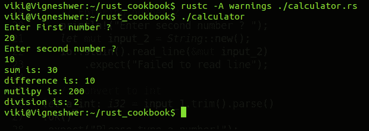

# 第一章：让我们让系统编程再次伟大

在本章中，我们将介绍以下食谱：

+   在 Linux 和 macOS 中设置 Rust

+   在 Windows 中设置 Rust

+   创建您的第一个 Rust 程序

+   定义变量赋值

+   设置布尔类型和字符类型

+   控制小数点、数字格式和命名参数

+   执行算术运算

+   定义可变变量

+   声明和执行字符串操作

+   在 Rust 中声明数组和使用切片

+   在 Rust 中声明向量

+   在 Rust 中声明元组

+   对两个数字进行计算

# 简介

本章的重点是改变您对设置 Rust 和使用它进行编程的态度。本章的目标是让您意识到为什么在存在许多其他编程语言解决不同领域问题时，还需要使用 Rust——为什么还需要另一种编程语言？

当人们学习一门新语言时，这些基本问题会浮现在他们的脑海中，Rust 是一种运行速度极快、防止段错误并保证线程安全的系统编程语言。正如定义所述，Rust 致力于消除各种系统编程错误和漏洞，最终有助于制作安全、快速且即插即用的生产级应用程序。

本章将深入探讨各种赋值操作及其功能、数据类型和数据结构在 Rust 中的使用。

# 在 Linux 和 macOS 中设置 Rust

我们将探讨在 Linux 和 macOS 操作系统中安装 Rust 组件的方法，并涵盖安装过程中遇到的不同问题。

# 准备工作

为了在您的工作站上运行 Rust 代码，我们必须安装 Rust 编译器。我们需要基于 Unix 的操作系统，如 Linux 发行版和 macOS。

# 如何做...

按照以下步骤在您的系统上设置 Rust：

1.  打开终端。

在 macOS 中，您可以通过按 *F4* 键打开终端，这会打开启动盘并搜索终端。然后，您可以在显示选项中选择终端。这只是其中一种可能的方法；还有其他方法。

在 Linux 发行版中，我们可以同时按 *Ctrl* + *Alt* + *T* 打开终端或在应用程序搜索窗口中搜索它。

1.  输入以下命令以在您的系统上安装 Rust 编译器和 Cargo：

```rs
 curl https://sh.rustup.rs -sSf | sh

```

您还可以尝试使用以下命令：

```rs
 curl -sf https://static.rust-lang.org/rustup.sh | sudo sh

```

前面的命令将启动安装，在安装过程中，脚本将需要用户输入。输入默认安装，这是标准方式。在此步骤之后，将下载不同的组件。如果安装没有错误发生，您应该能够看到以下截图：


Rust 已安装。太棒了！

# 卸载 Rust

卸载 Rust 与安装一样简单。打开终端并输入以下命令：

```rs
rustup self uninstall

```


# Rust 的编译器版本

如果您已经到达这里，您已经在系统上安装了 Rust，您可以继续并验证它。打开终端并输入以下命令，这将给出已安装的 Rust 版本：

```rs
rustc --version

```

查看以下截图：


在这里，`rustc` 代表 Rust 编译器，`--version` 显示我们下载的 Rust 版本。默认情况下，`rustup.sh` 脚本下载最新的稳定构建。在这本书中，我们使用的是 `1.14.0` 版本。

恭喜，如果您没有遇到任何错误就到达了这一步！Rust 已成功安装。

# 高级安装选项

以下是一些使用 `rustup.sh` 脚本的命令。这些命令对于常规使用不是必需的。以下命令是高级命令，通常在 Rust 开发早期阶段不会被开发者使用。

1.  安装到特定位置：

```rs
 rustup.sh prefix=my/install/dir

```

1.  保存下载以加快重新安装：

```rs
 rustup.sh save

```

1.  安装夜间构建：

```rs
 rustup.sh channel=nightly

```

1.  安装夜间构建存档：

```rs
 rustup.sh --channel=nightly date=2015-04-09

```

1.  安装显式版本：

```rs
 rustup.sh --revision=1.0.0-beta

```

这些命令有助于安装特定构建版本、不稳定发布版本和受版本控制的组件安装。

# 故障排除

如果您在卸载 Rust 后尝试重新安装，您通常会得到一个错误，说 `rustup.sh` 已经存在。请参考以下截图：


要解决错误，只需从用户空间删除 `.rustup` 可执行文件：

```rs
rm -rf /home/viki/.rustup

```

如果版本命令对您不起作用，那么您可能 PATH 环境变量设置错误，并且没有包含 Cargo 的二进制目录，在 Unix 上是 `~/.cargo/bin`，在 Windows 上是 `%USERPROFILE%\.cargo\bin`。

这是 Rust 开发工具所在的目录，大多数 Rust 开发者都会将其放在他们的 PATH 环境变量中，这使得他们能够在命令行上运行 `rustc`。

由于操作系统、命令外壳和安装中的错误之间的差异，您可能需要重新启动外壳、从系统中注销或根据您的操作环境手动配置 PATH。

Rust 不进行自己的链接，因此您需要安装一个链接器。这样做将取决于您的具体系统。对于基于 Linux 的系统，Rust 将尝试调用 `cc` 进行链接。在用 Microsoft Visual Studio 构建的 Rust 上，这取决于是否已安装 Microsoft Visual C++ Build Tools。这些工具不需要在 `%PATH%` 中，因为 `rustc` 会自动找到它们。一般来说，如果您将链接器放在非传统位置，可以调用 `rustc linker=/path/to/cc`，其中 `/path/to/cc` 应指向您的链接器路径。

如果你仍然遇到困难，有多个地方你可以获得帮助。最简单的是**#rust--beginners**的 IRC 频道，用于一般讨论，以及**#rust**的 IRC 频道，我们可以通过 Mibbit 访问。其他优秀的资源包括 Rust 用户论坛和 Stack Overflow。

# 它是如何工作的...

Shell 脚本`rustup.sh`是安装 Rust 的一个很好的方法，许多开发者已经使用它不仅安装了 Rust，还在他们的机器上安装了 Cargo。

这个脚本的运行方式相当直接，其中在 rustup 服务器上托管的 bash 脚本代码被下载到主机系统，并通过传递脚本代码到管道符号来自动运行。脚本提供了各种安装选项，你可以通过这些选项选择你想要安装的 Rust 编译器的版本和类型。我们有 Rust 的 nightly 版本，这不是稳定的版本。这个版本被开发者和贡献者用来测试和开发他们现有项目的新功能。

# 在 Windows 上设置 Rust

本指南涵盖了如何在 Windows 系统上设置 Rust。

# 准备工作

我们需要一台 Windows 机器来完成这个任务。

# 如何操作...

在 Windows 上安装它非常简单：

1.  从[`win.rustup.rs`](https://win.rustup.rs)下载并运行`.exe`文件。

1.  点击下载的可执行文件；这将启动命令提示符中的安装。

1.  在命令提示符中选择选项 1 进行常规安装，这是推荐的。

# 它是如何工作的...

它与 Linux 和 macOS 类似；我们必须下载可执行文件并运行它，这将弹出命令提示符，安装开始。在这里，我们不是使用 shell 脚本，Rust 团队为 Windows 提供了一个可执行文件。该可执行文件在主机系统上下载 Rust 编译器和 Cargo 依赖项。

# 创建你的第一个 Rust 程序

本指南旨在帮助你确保编译器正常工作，并创建一个工作区，你可以在这里尝试所有这些食谱。

# 准备工作

我们需要在主机系统上设置 Rust 编译器以进行编程；我建议你下载一个你喜欢的文本编辑器。在这本书中，我们使用 Sublime Text 编辑器进行代码开发过程。

# 如何操作...

1.  在你的用户空间中创建一个文件夹，你将在其中存储本书的所有程序：

```rs
 mkdir /home/viki/rust_cookbook

```

1.  此命令将在你的用户空间中为你创建一个目录：

```rs
 cd /home/viki/rust_cookbook

```

之前的命令将带我们到特定的目录。

1.  现在，创建一个名为`sample.rs`的文件；`.rs`扩展名表示它是一个 Rust 脚本。

1.  在你的文本编辑器中打开脚本，并输入以下代码：

```rs
        fn main() {
          println!("Welcome to Rust Cookbook");
        }

```

1.  保存文件并转到你的终端。

1.  使用 Rust 编译器编译代码，这将创建可执行文件并在没有 Rust 的系统上运行：


# 它是如何工作的...

让我们简要地通过代码来了解它是如何执行的。Rust 编译器寻找 `main` 函数，这是代码流的起始部分。我们有一个打印语句和要显示的对话框。当我们编译代码时，将创建一个可执行文件，在执行时将打印对话框。

Rust 文件总是以 `.rs` 扩展名结尾。如果你需要使用多个单词来表示你的项目名称，建议使用下划线来分隔它们，例如，我们会使用 `my_program.rs` 而不是 `myprogram.rs`，这有助于提高可读性。

关键字 `fn` 在 Rust 中定义一个函数。`main` 函数是每个 Rust 程序的开始。在这个程序中，我们有一个 `main` 函数，它不接受任何输入参数并返回任何类型。如果有任何参数，它们将放在括号 `(` 和 `)` 中。函数体被大括号 `{` 和 `}` 包围。Rust 要求所有函数体周围都要有这些符号。

将开括号放在与函数声明相同的行上，中间有一个空格，被认为是良好的风格。

`std` Rust 框架中的 `println!` 宏用于向标准输出打印，带有换行符。它位于 `main` 函数体内，并打印字符串 `Welcome to Rust Cookbook`。该行以分号 (`;`) 结尾。Rust 是一种面向表达式的语言，这意味着大多数事物都是表达式，而不是语句。分号 (`;`) 表示此表达式已结束，下一个表达式准备开始。

在运行 Rust 程序之前，我们必须先编译它，然后我们可以使用可执行文件来运行程序并在终端中打印字符串。通过输入 `rustc` 命令并将源文件名传递给它，Rust 编译器将创建可执行文件，例如，`rustc main.rs` 将在同一目录中创建一个名为 `./main` 的可执行文件。

# 定义变量赋值

在本节中，我们将深入探讨各种赋值运算符和函数。

# 准备工作

我们将需要 Rust 编译器和任何文本编辑器来进行编码，并在项目工作区中创建一个名为 `assignment.rs` 的文件。

# 如何操作...

1.  首先在 `assignment.rs` 脚本中声明我们将要使用的不同库：

```rs
        // Primitive libraries in rust
        use std::{i8,i16,i32,i64,u8,u16,u32,u64,f32,f64,isize,usize};
        use std::io::stdin;

```

`use` 语句告诉编译器程序将使用库的以下属性。`std` 是 Rust 编译器附带的一个内置库，不需要外部下载。`i8` 和 `i16` 是程序中将使用的变量的不同数据类型，而 `stdin` 帮助我们接受用户输入：

```rs
        fn main() {
          println!("Understanding assignment");
          // Compiler will automatically figure out the data type if
          not mentioned
          // Cannot change the value
          let num =10;
          println!("Num is {}", num);
        }

```

1.  前面脚本的输出如下：


1.  将 `assignment.rs` 文件中前面的 `main` 函数替换为以下代码片段：

```rs
        fn main(){
          let age: i32 =40;
          println!("Age is {}", age);
          // Prints the max and min value of 32bit integer
          println!("Max i32 {}",i32::MAX);
          println!("Max i32 {}",i32::MIN);
        }

```


1.  在先前的代码片段中，我们声明了一个名为`age`的变量，并明确告诉编译器它是一个 32 位整数类型数据，并且我们正在打印 32 位整型数据的最大值和最小值。现在，接下来的代码：

```rs
        // Another way of variable assigning
        let(f_name,l_name)=("viki","d");
        println!("First name {0} and last name {1}",f_name,l_name);

```

在这里，我们使用`brackets()`声明了两个变量`f_name`和`l_name`。这是在 Rust 中单行声明多个变量的方法。同样，在打印它们时，我们可以编号变量的位置以确定哪个变量需要首先打印。

# 它是如何工作的...

在上一节中，我们声明了`main`函数，程序将从该函数开始执行。在这里，我们声明了一个名为`num`的变量，并将其赋值为 10。`let`语句允许你声明变量并将它们赋值。我们没有明确指出`num`变量是什么类型的数据，但在编译时，它将被自动确定，并根据此分配内存。

`num`值是不可变的，这意味着它的值在程序运行期间不能改变，一旦它超出`main`函数的作用域，它就会被从内存中移除。要打印数字的值，我们必须使用大括号；我们将在下一节中详细介绍这一点。

# 设置布尔型和字符类型

布尔运算符对于程序员的州识别和检查非常有帮助。在本食谱中，你将学习关于字符类型变量的赋值。

# 准备工作

我们需要 Rust 编译器和任何文本编辑器进行编码。

# 如何操作...

1.  创建一个名为`boolean.rs`的文件，并编译以下代码：

```rs
        fn main(){

          //Setting boolean and character types
          let bool_val: bool = true;
          let x_char: char = 'a';

          // Printing the character
          println!("x char is {}", x_char);
          println!("Bool value is {}", bool_val);
        }

```

1.  在先前的代码片段中，我们在 Rust 中分配了布尔类型变量和字符值。

1.  输出如下：


# 它是如何工作的...

在先前的代码片段中，我们在`main`函数中声明了两个变量：`bool_val`和`x_char`。我们使用`let`语句将布尔值和字符值赋给它们，然后打印它们。

# 控制小数点、数字格式和命名参数

本食谱重点介绍如何操作打印宏以在数据中执行各种控制操作。

# 准备工作

我们需要 Rust 编译器和任何文本编辑器进行编码。

# 如何操作...

1.  在名为`decimal.rs`的 Rust 脚本中输入以下代码并编译它们：

```rs
        fn main(){

          // Prints the first 2 numbers after the decimal points
          println!("{:.2}",1.2345 );
          println!("================");

          // print the binary hex and octal format
          println!("B: {:b} H: {:x} O: {:o}",10,10,10 );
          println!("================");

          // Shifts
          println!("{ten:>ws$}",ten=10, ws=5 );
          println!("{ten:>0ws$}",ten=10, ws=5 );
        }

```

2. 代码的输出如下：


# 它是如何工作的...

在第一个打印语句中，我们控制了在终端中显示的小数位数。在先前的代码片段中，我们在打印语句中的冒号符号（`:`）之后设置了值为二，这告诉编译器在运行时只打印变量的前两位小数。

下一个打印语句显示了 Rust 内置的可以将要打印的值转换为不同数字格式的功能。我们打印了十进制值 10 的二进制、十六进制和八进制值。为了执行此活动，我们在打印语句中冒号符号后面的参数进行了特别说明。这是 Rust 编译器可以理解的。在运行时，Rust 会自动将十进制类型转换为所提到的数字格式，其中 `b` 代表二进制，`x` 代表十六进制，`o` 代表八进制。这必须在打印语句中的 `:` 后面给出。

接下来，我们使用名为 `print` 的语句命名了参数，并定义了我们想要的**空白空间**（**ws**）类型。这里我们有两个参数：`ten` 和 `ws`。我们控制了如何打印数据以及我们想要用哪些值填充 `ws`。在第一个打印语句中，我们用空格填充了它。在第二个打印语句中，我们明确提到了零，这是我们想要填充空隙的值。我们在打印语句的大括号内声明了命名参数，并为其分配了数据值。

# 执行算术运算

这个示例展示了 Rust 中不同类型的算术运算。

# 准备工作

我们需要 Rust 编译器和任何文本编辑器来进行编码。

# 如何操作...

1.  在工作区中创建一个名为 `arithmetic.rs` 的文件，并编译以下代码：

```rs
        fn main(){
          // Arithmetic Operations
          println!("5 + 4 = {}", 5+4 );
          println!("5 - 4 = {}", 5-4 );
          println!("5 * 4 = {}", 5*4 );
          println!("5 / 4 = {}", 5/4 );
          println!("5 % 4 = {}", 5%4 );

          // Assigning data types and mathematical Operations
          let neg_4 = -4i32;
          println!("abs(-4) = {}", neg_4.abs() );
          println!("abs(-4) = {}", neg_4.pow(2) );
          println!("round(1.2345) = {}", 1.2354f64.round() );
          println!("ceil(1.2345) = {}", 1.2345f64.ceil() );
          print!("sin 3.14 = {}", 3.14f64.sin() );
        }

```

2. 我们将得到以下输出：


# 工作原理...

在第一组打印语句中，我们在运行时对数据集执行了不同类型的算术运算。与每个操作相关联的括号中的以下符号用于执行算术运算：

+   加法（*+*）

+   减法（*-*）

+   乘法（*x*）

+   除法（*/*）

+   取模（*%*）

在下一组打印语句中，我们执行了 Rust 编译器内置的各种数学运算。我们声明了一个名为 `neg_4` 的变量，并将其赋值为 `4i32`，这是一个值为 `4` 的负 32 位整数。我们通过调用 `abs()` 函数并使用变量名 `variable.function` 来设置变量的绝对值。同样，我们执行了其他数学运算，例如 `pow(value)`，它计算并应用幂值到数据上。`round()` 函数找到最接近的较小值。`ceil()` 函数返回大于或等于数字的最小整数。而且，`sin()` 函数返回正弦值。

# 定义可变变量

Rust 具有独特的所有权和借用特性，使其能够克服段错误和数据竞争。这是通过 Rust 的可变性属性实现的。

# 准备工作

我们需要 Rust 编译器和任何文本编辑器来进行编码。

# 如何操作...

1.  创建一个名为 `mutuable.rs` 的文件并编译以下代码：

```rs
        fn main(){
          let mut sample_var = 10;
          println!(“Value of the sample variable is {}”,sample_var);
          let sample_var = 20;
          println!(“New Value of the sample variable is {}”,sample_var);
        }

```

1.  你应该得到以下输出：


# 工作原理...

由于我们已声明变量类型为可变，Rust 编译器允许开发者在函数的作用域内多次更改分配给变量的数据值。

在前面的程序中，我们创建了一个名为 `sample_var` 的变量，并在赋值时明确将其标记为可变类型。由于这个操作，Rust 编译器允许变量被赋予不同的值。

# 声明和执行字符串操作

这个菜谱深入探讨了各种内置的字符串操作和函数，这些函数允许开发者分割和修改字符串数据。

# 准备工作

我们需要 Rust 编译器和任何文本编辑器来进行编码。

# 如何操作...

1.  创建一个名为 `string.rs` 的脚本，并编译以下代码：

```rs
        fn main() {
          // declaring a random string
          let rand_string = "I love Rust cookbook <3";

          // printing the length of the string
          println!("length of the string is {}",rand_string.len() );

```

1.  在这里，你创建了一个不可变的变量 `rand_string` 并将其赋予一个字符串值。你还使用了字符串数据类型的 `len()` 函数来打印句子的长度，这也会计算空白字符：

```rs
        // Splits in string
        let (first,second) = rand_string.split_at(7);
        println!("First part : {0} Second part : {1}",first,second);

```

1.  `split_at(value)` 函数将句子分成两部分，并将它们分配为两个变量：`first` 和 `second`。然后我们打印它们：

```rs
        // Count using iterator count
        let count = rand_string.chars().count();
        print!("count {}",count );

```

1.  在这里，我们使用了两个函数，即 `chars` 和 `count`，其中 `chars` 识别所有字符，而 `count` 提供字符的总数：

```rs
        println!("__________________________");
        // printing all chars
        let mut chars = rand_string.chars();
        let mut indiv_chars = chars.next();
        loop {
          // Its like switch in c++
          match indiv_chars {
            Some(x) => println!("{}",x ),
            None => break
          }
          indiv_chars = chars.next();
        }

```

1.  在前面的代码片段中，我们创建了一个名为 `chars` 的变量，它包含了句子的所有字符。然后，在下一步中，我们创建了一个名为 `indiv_chars` 的另一个变量，它包含了 `chars` 变量的第一个字符。我们使用 `next()` 函数将值分配给 `indiv_chars`。

1.  在 `loop` 函数中，打印 `chars` 变量的所有值，直到它变为空：

```rs
        println!("__________________________");
        // iterate over whitespace
        let mut iter = rand_string.split_whitespace();
        let mut indiv_word = iter.next();
        loop {
          // Its like switch in c++
          match indiv_word {
            Some(x) => println!("{}",x ),
            None => break
          }
          indiv_word = iter.next();
        }

```

1.  在这段代码中，我们将使用内置的 `split_whitespace()` 函数进行迭代。这一部分将打印出完整的单词：

```rs
        println!("__________________________");
        // iterate over next line
        let rand_string2 = "I love \n everything about \n Rust <3";
        let mut iter_line = rand_string2.lines();
        let mut indiv_sent = iter_line.next();
        loop {
          // Its like switch in c++
          match indiv_sent {
            Some(x) => println!("{}",x ),
            None => break
          }
          indiv_sent = iter_line.next();
        }
        }

```

1.  在这段代码中，我们将使用内置的 `lines()` 函数迭代下一行。这一部分将打印出完整的句子。

1.  你应该得到以下结果：


# 它是如何工作的...

在这个菜谱中，我们给一个变量命名为 `rand_string`，并赋予它字符串值 `I love Rust cookbook`，然后我们在这个字符串上执行一系列字符串操作。

在第一个打印语句中，我们通过调用 `rand_string.len()` 使用 `str` 类型的 `len()` 方法来显示字符串的长度，相应地，在下一个打印语句中，我们使用 `split_at()` 方法，它期望一个输入参数，该参数将字符串分割到传递的参数值处，在我们的例子中，我们调用 `rand_string.split_at(7)` 来在字符串的索引 `7` 处分割，并将其分配给名为 `first` 和 `second` 的两个变量，这里空格占据了一个索引值。

在第三个打印语句中，我们使用`chars()`和`count()`方法来打印字符的数量，语法如下`rand_string.chars().count()`，其中`chars()`遍历字符，`count()`用于计数元素的数量。

`loop`是一个迭代语句，它会一直运行，直到调用`break`键。我们使用了`match`函数，它在其他语言中类似于`switch`。我们为它创建了不同的条件来检查并执行某些操作。

在`match`语句中，我们有两个条件，分别是`Some(x)`和`None`。在这两种情况下，我们执行独特的操作，如下所示：

+   在`Some(x)`的情况下，它基本上表示`x`是一个存在且具有类型`T`的值，因此我们可以使用`x`变量进行进一步的操作，在这种情况下，我们打印该值。

+   在`None`的情况下，它指的是不存在值的情况，理想情况下是字符串的末尾，在这些情况下执行的操作是中断循环。

我们遍历三种类型的条件：

+   第一组是单个案例，其中打印字符串的所有字符，由`chars()`和`next()`函数以及前面的`match`语句执行。

+   第二组是打印字符串中的所有不同单词，通过在空格处分割，由`split_whitespace()`和`next()`函数以及前面的`match`语句执行。

+   最后一个是打印字符串的所有不同行，通过在换行符处分割，由`lines()`和`next()`函数以及前面的`match`语句执行。

# 在 Rust 中声明数组和使用切片

数组是一系列相同数据类型的对象集合，存储在连续的内存中。数组总是使用方括号`[]`创建，其尺寸在编译时已知。它是它们类型的一部分：[T; size]。

切片与数组类似，但它们的尺寸在编译时是未知的。第一个标记是数据指针值；第二个标记是用户根据应用程序选择的切片长度。切片通常用于借用数组的某个部分，并且具有类型签名[T]。

# 准备工作

我们需要 Rust 编译器和任何文本编辑器进行编码。

# 如何做到这一点...

1.  创建一个名为`array.rs`的文件，并编译以下代码：

```rs
        fn main() {
          // Defining an array
          let rand_array = [1,2,3];
          println!("random array {:?}",rand_array );

          // indexing starts with 0
          println!("random array 1st element {}",rand_array[0] );
          println!("random array length {}",rand_array.len() );

          // last two elements
          println!("random array {:?}",&rand_array[1..3] );
        }

```

2. 我们将得到以下输出：


# 它是如何工作的...

这里，我们声明了一个名为`rand_array`的变量，并将其赋值给一个包含三个元素的数组：一、二、三。在第一个打印语句中，冒号（`:`）后面有一个问号（`?`），这表示打印语句将打印数组的所有元素。

我们可以通过索引（它们指的是数组数据元素的位）来访问数组的每个元素。在 Rust 中，定位从零开始。因此，当我们打印`rand_array[0]`时，它将打印第一个元素。在第三个打印语句中，我们使用了`len()`函数来获取数组的长度或元素数量；我们通过调用`rand_var.len()`来使用长度函数。

在第四次打印中，我们有一个新概念，称为切片。数组作为切片借用，我们在签名中提到了指针的起始值和长度。切片基本上是数组的元素连续序列的引用，而不是整个元素。

我们通过打印`&rand_var`来打印整个数组，这将打印整个数组。我们还使用`&rand_var[1..3]`借用了数组的一部分，其中我们在方括号中提到了切片的大小。在这里，从一开始，我们打印所有数字的部分，直到上限三，其中一和三是数组的索引值，这些索引值被解引用并在终端中打印。

# 在 Rust 中声明向量

向量是编程中的一个非常重要的概念，人们经常在数组和向量之间感到困惑。让我们揭开这个概念的秘密。向量是一个动态数组，这意味着它的数据分配可以在运行时增加或减少，我们将看到如何使用一个简单的内置函数来实现这一点。向量在 Rust 中作为标准库类型实现，即`Vec<T>`。在这里，`T`表示我们可以有任意数据类型的向量；向量始终在堆上分配其数据，我们可以使用`vec!`宏来创建它们。

# 准备就绪

我们需要 Rust 编译器和任何文本编辑器来进行编码。

# 如何做到这一点...

1.  创建一个名为`vector.rs`的文件并编译以下代码：

```rs
        fn main() {
          // declaring a vector
          let mut vec1 = vec![1,2,3,4,5];

```

1.  声明一个包含五个元素的可变向量`vec1`：

```rs
        // printing element 3 in vector
        println!("Item 3 : {}", vec1[2]);

```

在这里，为了打印向量的第三个元素，我们可以通过其位置在堆中引用向量的特定数据。

1.  位置值的起始值为零，直到有 n 个数据值时的*n-1*：

```rs
        // iterating in a vector
        for i in &vec1 {
          println!("{}",i )
        }

```

1.  在上一步中，我们通过引用向量并打印其所有元素来遍历向量：

```rs
        // push an element to vector
        vec1.push(6);
        println!("vector after push {:?}", vec1 );

        // pop an element from vector
        vec1.pop();
        println!("vector after pop {:?}", vec1 );
        }

```

1.  从向量中添加和移除值。

1.  你应该得到以下输出：


# 它是如何工作的...

如果我们已经通过获取所有权来迭代了向量，那么我们不能再使用该向量，并且为了多次迭代向量，我们必须引用向量。

使用`pop`和`push`，我们可以向/从内存分配的堆中添加/移除元素，其中存储了向量数据。这个特性使得向量是动态的。`push`向顶部添加一个新元素，这是索引的最后一个元素，而`pop`根据索引移除第一个值和最后一个元素。

# 在 Rust 中声明元组

元组是一种独特的数据结构，许多开发者在日常开发中广泛使用它来处理不同数据类型的价值。

通常，元组是通过括号`()`构建的，每个元组都有一个类型签名，例如`T1`, `T2`, ..., 其中`T1`和`T2`是其成员值的类型。

当我们想要返回多个数据类型时，元组在 Rust 中非常方便。我们可以使用 Rust 将它们打包成一个单一的数据结构。

# 准备工作

我们需要 Rust 编译器和任何文本编辑器来进行编码。

# 如何实现...

1.  创建一个名为`tuple.rs`的文件，并编译以下代码：

```rs
        use std::{i8};
        fn main() {

          // Declaring a tuple
          let rand_tuple = ("Rust", 2017);
          let rand_tuple2 : (&str, i8) = ("Viki",4);

          // tuple operations
          println!(" Name : {}", rand_tuple2.0);
          println!(" Lucky no : {}", rand_tuple2.1);
        }

```

2.你应该得到以下输出：


# 它是如何工作的...

在上一节中，我们以两种不同的方式声明了两个元组。在第一种方法中，Rust 编译器自动确定了数据类型。在第二种方法中，我们明确指出了数据类型，并且元组允许我们创建不同的数据类型。

在元组操作部分，我们使用元组索引从元组中提取值，这是通过打印`tuple_variable.index_value`来完成的。

# 对两个数字进行计算

这个配方涵盖了我们从其他配方中学到的所有方面。我们执行各种操作，例如从终端输入两个值，让用户将其作为标准输入接受，将可接受的字符串转换为整数，并执行算术运算。

# 准备工作

我们需要 Rust 编译器和任何文本编辑器来进行编码。

# 如何实现...

1.  创建一个名为`calculator.rs`的文件，并编译以下代码：

```rs
        // Libraries in rust
        use std::io;
        use std::{i32};

```

1.  `io`函数帮助我们通过终端接受用户输入：

```rs
        // Main Functions
        fn main() {
          // Request for entering number 1
          println!("Enter First number ? ");
          let mut input1 = String::new();
          io::stdin().read_line(&mut input1).expect("Failed to read
          line");

          // Request for entering number 2
          println!("Enter second number ? ");
          let mut input2 = String::new();
          io::stdin().read_line(&mut input2).expect("Failed to read
          line");

          // Converting string to integer
          let aint: i32 = input1.trim().parse().ok().expect("Program
          only
          processes numbers, Enter number");
          let bint: i32 = input2.trim().parse().ok().expect("Program
          only
          processes numbers, Enter number");

          // Output of basic operations
          println!("sum is: {}", aint + bint);
          println!("difference is: {}", aint - bint);
          println!("Multiply is: {}", aint * bint);
          println!("division is: {}", aint / bint);
        }

```

1.  你应该得到以下输出：



# 它是如何工作的...

`std::io`模块包含了许多你在编写代码时需要用到的常用功能。该模块的核心部分是读写特性。

我们从`std::io`模块中调用了`read_line()`方法。`read_line()`方法不接收一个 String 作为参数；它接收一个`&mut` String。Rust 有一个名为*引用*的功能，它允许你对同一份数据有多个引用，这可以减少复制。`read_line`的职责是将用户输入的标准输入放置到一个字符串中。因此，它需要这个字符串作为参数，并且为了添加输入，它需要是可变的。在这种情况下，`io::Result`有一个`expect()`方法，它接受一个被调用的值；如果这不成功，我们的程序将崩溃，并显示一条消息。如果我们不调用`expect()`，我们的程序将编译，但我们会得到一个警告。

为了将字符串转换为整数，我们使用了 `trim` 和 `parse` 方法。字符串上的 `trim()` 方法消除了数据开头和结尾的任何 `ws`。这意味着如果我们输入 5 并按回车键，它看起来会是这样：*5\n*。`\n` 代表一个 *换行符*，由 `trim()` 方法消除的回车键将不会保留，只留下包含数字 5 的字符串。

字符串数据上的 `parse()` 方法将字符串解析成某种数字格式，因为它可以解析多种数字，所以我们需要给 Rust 提示我们想要的精确数字格式类型，这就是为什么我们有 `let a_int: i32` 这样的声明。冒号 (`:`) 后面告诉 Rust 我们将要注解其类型，`i32` 是一个包含 32 位大小的整数。我们使用了 `expect()` 方法来捕获错误情况下的崩溃。脚本的最后一部分用于执行常规的算术运算。
