# 第二章：使用 Rust 进行高级编程

在本章中，我们将涵盖以下内容：

+   定义一个表达式

+   定义常量

+   执行变量绑定

+   在 Rust 中执行类型转换

+   使用 Rust 进行决策

+   Rust 中的循环操作

+   定义枚举类型

+   定义闭包

+   在 Rust 中执行指针操作

+   定义你的第一个用户定义数据类型

+   向用户定义的数据类型添加功能

+   不同数据类型的类似功能

# 简介

本章的重点是为你提供所有食谱来实现表示代码状态的表达式，使用 `if...else` 等决策语句构建逻辑，使用 `struct` 声明自定义复杂数据类型以表示现实世界场景，使用特质向复杂数据类型添加功能，以及使用循环语句控制代码执行。

# 定义一个表达式

简单来说，表达式是 Rust 中的一个语句，通过它我们可以在程序和应用程序中创建逻辑和工作流程。我们将深入了解 Rust 中的表达式和块。

# 准备工作

我们将需要 Rust 编译器和任何文本编辑器进行编码。

# 如何操作...

按照以下步骤进行：

1.  创建一个名为 `expression.rs` 的文件，并包含以下代码片段。

1.  声明 `main` 函数并创建变量 `x_val`、`y_val` 和 `z_val`：

```rs
        // main point of execution 
        fn main() {

          // expression
          let x_val = 5u32;

          // y block 
          let y_val = {
            let x_squared = x_val * x_val;
            let x_cube = x_squared * x_val;

            // This expression will be assigned to `y_val`
            x_cube + x_squared + x_val
          };

          // z block
          let z_val = {
            // The semicolon suppresses this expression and `()` is
            assigned to `z`
            2 * x_val;
          };

          // printing the final outcomes
          println!("x is {:?}", x_val);
          println!("y is {:?}", y_val);
          println!("z is {:?}", z_val);
        }

```

运行代码后，你应该得到以下输出。请参考以下截图：

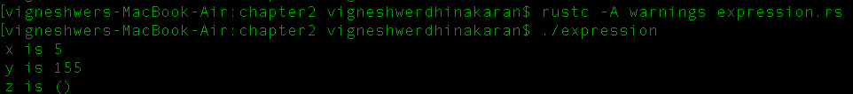

# 它是如何工作的...

所有以分号 (`;`) 结尾的语句都是表达式。一个块是一个包含一组语句和变量的语句，其最后一个语句是分配给变量的值。当我们用分号关闭最后一个语句时，它将 `()` 返回给变量。

在前面的食谱中，第一个语句是一个名为 `x_val` 的变量，其值被分配为 `5`。其次，`y_val` 是一个对变量 `x_val` 和其他一些变量执行特定操作的块，这些变量分别是 `x_squared` 和 `x_cube`，分别包含变量 `x_val` 的平方和立方值。变量 `x_squared` 和 `x_cube` 将在块的范围内很快被删除。

声明 `z_val` 变量的块在其最后一个语句中有一个分号，该语句将其赋值为 `()` 的值，抑制了表达式。我们将在最后打印出所有值。

我们将在最后打印出所有声明的变量值。

# 定义常量

Rust 提供了在 Rust 代码中分配和维护常量值的能力。这些值在我们想要维护全局计数时非常有用，例如，例如计时器阈值。Rust 提供了两个 `const` 关键字来执行此操作。你将在本食谱中学习如何全局传递常量值。

# 准备工作

我们将需要 Rust 编译器和任何文本编辑器进行编码。

# 如何操作...

按照以下步骤进行：

1.  创建一个名为 `constant.rs` 的文件，并包含以下代码片段。

1.  使用 `constant` 声明全局变量 `UPPERLIMIT`：

```rs
        // Global variables are declared outside scopes of other 
        function
        const UPPERLIMIT: i32 = 12;

```

1.  通过接受一个整数作为输入来创建 `is_big` 函数：

```rs
        // function to check if bunber 
        fn is_big(n: i32) -> bool {
          // Access constant in some function
          n > UPPERLIMIT
        }

```

1.  在 `main` 函数中，调用 `is_big` 函数并执行决策语句：

```rs
        fn main() {
          let random_number = 15;

          // Access constant in the main thread
          println!("The threshold is {}", UPPERLIMIT);
          println!("{} is {}", random_number, if
          is_big(random_number) { "big" } else { "small"
          });

          // Error! Cannot modify a `const`.
          // UPPERLIMIT = 5;

        }

```

运行前面的代码后，你应该得到以下截图作为输出：

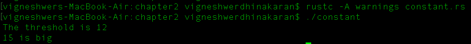

# 它是如何工作的...

本食谱的工作流程相当简单，我们有一个函数来检查一个整数是否大于一个固定的阈值。`UPPERLIMIT` 变量定义了函数的固定阈值，它是一个值在代码中不会改变的常量，并且在整个程序中都是可访问的。

我们将 `15` 赋值给 `random_number` 并通过 `is_big (integer value);` 传递它，然后我们得到一个布尔输出，即 `true` 或 `false`，因为函数的返回类型是 `bool` 类型。我们情况下的答案是 `false`，因为 `15` 不大于 `12`，这是 `UPPERLIMIT` 值设置的常量。我们使用 Rust 中的 `if...else` 语句执行此条件检查。

我们不能更改 `UPPERLIMIT` 的值；当尝试更改时，它将抛出一个错误，这在代码部分中已注释。

常量声明常量值。它们代表一个值，而不是内存地址：`type = value;`

# 执行变量绑定

变量绑定指的是 Rust 代码中的变量如何绑定到类型。在本食谱中，我们将涵盖模式、可变性、作用域和阴影概念。

# 准备工作

我们将需要 Rust 编译器和任何文本编辑器来进行编码。

# 如何做到这一点...

执行以下步骤：

1.  创建一个名为 `binding.rs` 的文件，并输入以下代码片段，包括声明 `main` 函数和不同变量：

```rs
        fn main() {
          // Simplest variable binding
          let a = 5;
          // pattern
          let (b, c) = (1, 2);
          // type annotation
          let x_val: i32 = 5;
          // shadow example
          let y_val: i32 = 8;
          {
            println!("Value assigned when entering the 
            scope : {}", y_val); // Prints "8".
            let y_val = 12;
            println!("Value modified within scope :{}", y_val);
            // Prints "12".
          }
          println!("Value which was assigned first : {}", y_val);
          // Prints "8".
          let y_val = 42;
          println!("New value assigned : {}", y_val);
          //Prints "42".
        }

```

运行前面的代码后，你应该得到以下截图作为输出：

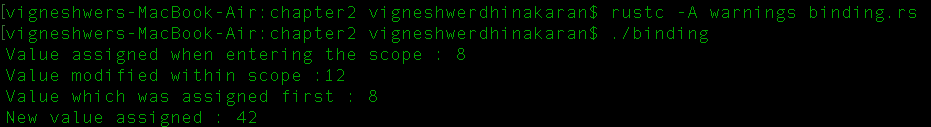

# 它是如何工作的...

`let` 语句是创建绑定最简单的方式，其中我们将变量绑定到一个值，就像变量 `a` 一样。要使用 `let` 语句创建一个模式，我们将模式值分配给相同模式中的 `b` 和 `c` 值。Rust 是一种静态类型语言。这意味着我们必须在赋值时指定我们的类型，并且在编译时检查它是否兼容。Rust 还具有类型引用功能，该功能在编译时自动识别变量类型。`variable_name : type` 是我们在 Rust 中显式提及类型的格式。我们按照以下格式读取赋值：

x_val 是一个类型为 i32 且值为 5 的绑定。

在这里，我们将 `x_val` 声明为 32 位有符号整数。然而，Rust 有许多不同的原始整数类型，以 `i` 开头表示有符号整数，以 `u` 开头表示无符号整数，可能的整数大小为 8、16、32 和 64 位。

变量绑定有一个作用域，使得变量仅在作用域内有效。一旦超出作用域，资源就会被释放。

块是一组由 `{}` 包围的语句。函数定义也是块！我们使用块来展示 Rust 中允许变量绑定被阴影化的特性。这意味着可以使用相同的名称进行后续的变量绑定，在我们的例子中是 `y_val`。它经历了一系列的值变化，因为当前作用域中的新绑定覆盖了之前的绑定。阴影化使我们能够将名称重新绑定到不同类型的值。这就是为什么我们能够在块内外对不可变的 `y_val` 变量赋新值的原因。

# 在 Rust 中进行类型转换

在这个菜谱中，你将学习在 Rust 中进行不同数据类型之间的转换。Rust 不提供自动类型转换。开发者必须手动完成。使用 `as` 我们将在 Rust 中执行安全类型转换。

# 准备工作

我们将需要 Rust 编译器和任何文本编辑器进行编码。

# 如何操作...

执行以下步骤：

1.  创建一个名为 `typecasting.rs` 的文件，并将以下代码输入到脚本中：

```rs
        use std::{i32,f32};

        // Sample function for assigning values to
        confusion matrix
        fn main() {

          // assigning random values to the confusion matrix
          let(true_positive,true_negative,false_positive,
          false_negative)=(100,50,10,5);

          // define a total closure
          let total = true_positive + true_negative +
          false_positive + false_negative;

          println!("The total predictions {}",total);

          // Calculating the accuracy of the model
          println!("Accuracy of the model
          {:.2}",percentage(accuracy(true_positive,
          true_negative,total)));

        }

```

1.  在前面的代码片段中，我们创建了四个变量：`true_positive`、`true_negative`、`false_positive` 和 `false_negative`。这些都是混淆矩阵的基本四个测量参数。

1.  调用返回最终准确百分比的 `accuracy` 和 `percentage` 函数。

1.  `total` 变量是所有测量的总和：

```rs
        // Accuracy Measures the overall performance of 
        the model
        fn accuracy(tp:i32,tn:i32,total:i32) -> f32 {
          // if semi-colon is not put then that returns 
          // No automatic type cast in rust 
          (tp as f32 + tn as f32 )/(total as f32)
        }

        // Converting to percentage 
        fn percentage(value:f32) -> f32 {
        value *100.0
        }

```

1.  `accuracy` 函数接受所有返回 `float` 数据类型的 `int` 数据类型。

1.  从 `accuracy` 函数接收的值传递给 `percentage` 函数，并打印出准确度。

运行前面的代码后，你应该得到以下截图作为输出：

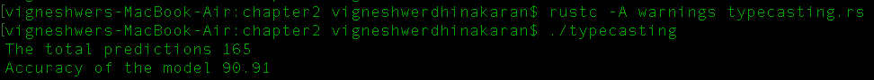

# 它是如何工作的...

在这个菜谱中，我们有两个函数，`accuracy` 和 `percentage`，它们从 `main` 函数接收参数，并将传递的类型转换为所需的类型，这是由于我们使用的 `as` 关键字在 Rust 中的算术运算特性，它有助于 Rust 中的类型转换。在 `accuracy` 函数的情况下，它接受三个类型为 `i32` 的输入参数，并返回一个单一的 `f32` 类型值。

为了保护开发者免受意外类型转换的影响，Rust 强制开发者手动转换数据类型。在下面的示例中，我们定义了一个名为 `a` 的 `int` 变量并将其赋值为 `3`；在赋值操作后，我们会看到部分代码被注释了。这表明它不会被 Rust 编译器编译。如果我们仔细查看代码，我们会发现我们正在将一个 `int` 变量与一个扁平值相乘，这将在编译期间产生类型不匹配错误：

```rs
        let a = 3;
        /*
        let b = a * 0.2; //Won't compile
        */

```

如我们所见，我们使用了 `as` 关键字将 `int` 转换为 `float`（64 位），以便将 `int` 值乘以一个 `float` 变量。这一步生成了 `b` 而没有错误：

```rs
        let b = a as f64 * 0.2;

```

注意，当我们对同一类型的数据进行算术运算时，我们不必担心类型转换，因为操作产生的结果会自动类型转换。

# 使用 Rust 进行决策

在这个菜谱中，我们将学习 Rust 中的决策语句。Rust 中的条件检查与其他动态编程语言类似，非常容易使用。我们将使用 `if...else` 语句在 Rust 中执行条件检查。

# 准备工作

我们将需要 Rust 编译器和任何文本编辑器进行编码。

# 如何操作...

执行以下步骤：

1.  创建一个名为 `condition.rs` 的文件，并将以下代码输入到脚本中：

```rs
        use std::{i32};
        fn main() {
          let age : i32= 10;
          // If else statements
          if age <= 18{
            println!("Go to School");
          } else if (age >18) && (age <= 28){
          println!("Go to college");
        } else {
          println!("Do something with your life");
        }

        // if/ else statement in one line
        let can_vote = if (age >= 18) {true} else
        {false};
        println!("Can vote {}",can_vote );
        }

```

1.  创建一个名为 `age` 的变量，并将其赋值为整数 `10`。

1.  前面的代码包含一个 `if...else` 语句，用于根据 `age` 值做出决策。它根据条件执行打印操作。

运行前面的代码后，你应该得到以下截图作为输出：

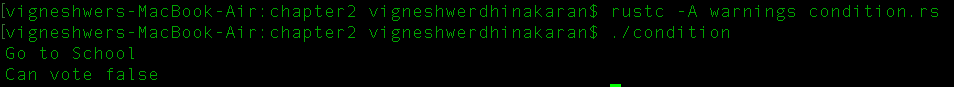

# 它是如何工作的...

在这个菜谱中，我们实现了一个 `if...else` 语句来在 Rust 中执行条件语句。条件在 `age` 变量中执行。在这个菜谱中，我们分配了一个不可变的变量，其值为 `10`；之后，我们将其与各种规则进行比较，并根据合格规则执行操作。

这些规则是开发者以数学运算的形式生成的条件，该运算产生 `true` 或 `false` 的结果。根据操作的输出，我们在决策语句的作用域内选择特定的操作集。

`if...else` 语句是开发者路由程序逻辑的强大工具。它们非常适合在应用程序的最终状态比较阈值以做出逻辑决策。

在前面的情况下，我们按照以下流程检查了三个案例：

+   `if` 语句检查 `age` 变量是否小于 `18`。如果操作返回 `true`，则继续打印 `Go to School`。

+   当第一个条件返回 `false` 时，在 `else...if` 语句中检查下一个条件；在这里，我们检查年龄是否在 `18` 到 `28` 之间，如果这个条件返回 `true`，则打印 `Go to college`。

+   最后，我们有 `else` 语句，它没有条件，仅在所有前面的条件失败时执行。

写得非常优化通常是至关重要的技能。我们应该学会发展编写更少、更优化代码的技能。

前面的语句集包含大量的代码行，但我们可以将其优化，将 `if...else` 语句与条件放在一行中。这种情况的一般语法如下：

```rs
    let variable = if (condition 1 ) {true} else {false};

```

我们有一个变量，当 `condition 1` 操作产生 `true` 时，我们将其赋值；否则，我们将其赋值为 `else` 语句中的值。

# Rust 中的循环操作

在这个菜谱中，你将了解 Rust 中的循环语句。在 Rust 中，我们所说的循环语句提供了交互式功能。使用 `loop`、`while` 和 `for` 关键字，我们可以在 Rust 中执行迭代操作。

# 准备工作

我们将需要 Rust 编译器和任何文本编辑器进行编码。

# 如何做...

执行以下步骤：

1.  创建一个名为 `looping.rs` 的文件，并在脚本中输入以下代码。

1.  在 `main` 函数中，对可变变量 `x` 执行循环操作，`x` 初始赋值为整数值 `1`。

1.  定义一个 `loop` 语句，这是一个无限迭代语句，并检查其作用域内的各种条件：

```rs
        fn main() {

          // mutuable variable whose value can be changed
          let mut x =1;
          println!(" Loop even numbers ");

          // Continously loops 
          loop {
            // Check if x is an even number or not
            if (x % 2 == 0){
              println!("{}",x);
              x += 1;
              // goes to the loop again
              continue;
            }
            // exit if the number is greater than 10
            if (x > 10) {
            break;
          }
          // increment the number when not even
          x+=1;
        }

```

1.  创建一个可变变量 `y` 并将其赋值为整数值 `1`，然后定义一个 `while` 循环，条件为 `y < 10`：

```rs
        let mut y = 1;
         // while loop
         println!("while 1 to 9 ");
         while y < 10 {
         println!("{}",y );
         y +=1;
         }

```

1.  执行与 `while` 循环类似的操作。这里，使用 `for` 循环在可变变量 `z` 上迭代 1 到 9 的范围，`z` 初始赋值为 `1`：

```rs
        let mut z = 1;
         //for loop 
         println!(" For 1 to 9");
         for z in 1 .. 10 {
         println!("{}",z );
         }
        }

```

运行前面的代码后，你应该得到以下截图作为输出：

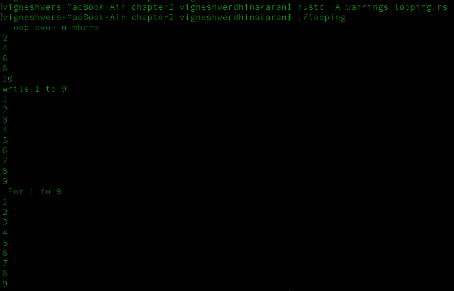

# 它是如何工作的...

`loop` 是 Rust 中的一个迭代关键字，其中其作用域内的语句会无限循环运行，也就是说，除非通过 `break` 语句显式停止，否则会无限期地运行。这在我们需要在一个应用程序中处理特定任务直到达到特定状态以便进一步处理时非常有用。考虑一个视频存储应用程序，其中我想持续保存摄像头数据流，直到用户发出停止应用程序的命令。

在这个菜谱中，我们声明了一个可变 `int` 变量 `x`，并将其初始化为值 `1`。当它进入 `loop` 语句时，我们为它设置了两个条件。第一个条件打印 `x` 的值。只有当它是偶数时，我们使用 `%` 运算符执行这个可除性操作，然后增加其值。

然后我们使用了 `continue` 关键字，它返回到 `loop`。该关键字之前的状态将不会执行。第二个条件检查 `x` 的值是否大于 `10`。这个条件只有在运行时才会达到。在这种情况下，如果 `x` 的值是奇数，我们将退出 `loop`，这是无限循环的出口点，类似于前面例子中讨论的视频应用程序中的停止按钮。接下来，我们增加下一次迭代的值。

在以两种不同的方式打印 `1` 到 `9` 时，第一种方法使用 `while`，其中我们放置了一个条件，该条件最初与没有条件的循环进行比较。在整个循环过程中，循环在每次迭代时都会检查条件。只有当它是 `true` 时，它才会继续。在前面的情况下，我们有一个不可变的变量 `y`，它被初始化为值 `1`。我们有一个在每次迭代时检查 `y` 是否小于 `10` 的条件。在每次迭代中，我们打印 `y` 的值并将其值增加 `1`。

执行上述活动的第二种方法是使用 `for` 循环语句，其中我们指定了要操作的值的范围。我们没有像其他循环语句那样进行显式条件检查。我们声明了一个不可变的变量 `z`，它被初始化为值 `1`，然后在循环中从 `1` 迭代到 `10`，在每一步中打印值。

循环语句在需要重复执行特定任务的应用程序中对于开发者来说非常有用。

# 定义枚举类型

在这个配方中，你将了解如何在 Rust 中使用 `enum` 类型。在 Rust 中，`enum` 类型允许开发者以多种格式表示数据，并且每个格式可以可选地与特定的数据相关联。使用 `enum` 关键字，我们在 Rust 中执行迭代操作。

# 准备工作

我们将需要 Rust 编译器和任何文本编辑器进行编码。

# 如何做到这一点...

执行以下步骤：

1.  创建一个名为 `enum.rs` 的文件，并在脚本中输入以下代码：

```rs
        fn main() {

         let hulk = Hero::Strong(100);
         let fasty = Hero::Fast;
         //converting from 
         let spiderman = Hero::Info
        {name:"spiderman".to_owned(),secret:"peter
        parker".to_owned()};
        get_info(spiderman);
        get_info(hulk);
        get_info(fasty);
        }

```

1.  声明一个名为 `Hero` 的 `enum` 数据类型：

```rs
        // declaring the enum 
        enum Hero {
        Fast,
        Strong(i32),
        Info {name : String, secret : String}
        }

```

1.  创建一个名为 `get_info` 的函数，该函数将 `enum` 数据类型作为参数：

```rs
        // function to perform for each types
        fn get_info(h:Hero){
        match h {
        Hero::Fast => println!("Fast"),
        Hero::Strong(i) => println!("Lifts {} tons",i ),
        Hero::Info {name,secret} => { println!(" name is: {0} secret is
        : {1}", name,secret);} ,
        }
       }

```

在运行前面的代码后，你应该得到以下截图作为输出：

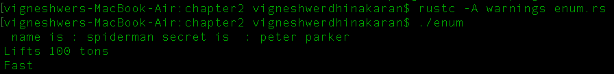

# 它是如何工作的...

`enum` 是 Rust 中一个非常重要的类型，因为它允许特定的数据类型与多个数据变体相关联。`enum` 类型的值包含有关它关联的数据变体的信息。

在转向代码解释之前，关于 Rust 中的 `enum` 的另一个重要点是，你可以使用 `::` 语法来使用每个数据变体的名称，并将值分配给变量。

在配方中，我们创建了一个名为 `Hero` 的 `enum` 类型，它具有三种数据变体：`Fast`，它没有使用显式数据要求；`Strong(i32)`，它需要一个 32 位整数输入；以及 `Info`，它支持两个字符串数据变量，`name` 和 `secret`。

接下来，让我们检查 `main` 函数中这些数据变体的初始化。在这里，我们创建了三个变量来表示三种数据变体，并用所需的数据要求初始化它们。我们还三次调用了 `get_info()` 函数，通过传递不同的 `enum` 数据变体来打印数据值。

它使用 `Hero::Strong(100)` `enum` 类型初始化，`fasty` 使用 `Hero::Fast`，而 `spiderman` 使用 `Hero::Info`，这需要两个变量：`name:"spiderman".to_owned()` 和 `secret:"peter parker".to_owned()`。

注意，在声明 `Hero` 数据变体 `Info` 的值时，我们使用字符串以及 `.to_owned()` 方法分配数据变量，这样做是为了确保在借用时字符串是所有者，因为 `&str` 是字符串的不可变引用，使用 `to_owned()` 会将其转换为我们所拥有的字符串。

`get_info(argument : enum type)` 函数接受 `enum` 作为数据类型，当我们传递不同的数据变体时，参数会被分配这些值。然后我们使用了 `match` 语句，这是一个决策语句，用于将参数与 `match` 语句中提到的不同数据变体类型进行比较。

我们传递了 `fast` 变量，其类型为 `Fast`--`Hero` 的变体--它将打印 `Fast`，这是 `match` 语句的第一个情况。同样，对于 `spiderman` 情况和 `hulk`，它们分别是 `Info` 和 `Strong` 类型，`get_info` 函数中的匹配语句将执行相应的语句。

# 定义闭包

在一个更高的层面上，闭包类似于函数，调用闭包就像调用函数一样。闭包类似于 **lambda**，它们基本上是在封闭作用域中操作变量的函数。

# 准备工作

我们将需要 Rust 编译器和任何文本编辑器进行编码。

# 如何实现...

执行以下步骤：

1.  创建一个名为 `closures.rs` 的文件，并在脚本中输入以下代码：

```rs
        use std::{i32};
        fn main() {

```

1.  定义一个闭包并命名为 `sum_num`：

```rs
        // define a closure
        let sum_num = |x:i32 , y:i32| x+y;
        println!("7 + 8 ={}", sum_num(7,8));

```

1.  创建另一个闭包，命名为 `add_ten`：

```rs
        // example 2
         let num_ten = 10;
         let add_ten = |x:i32| x+num_ten;
         println!("3 + 10 ={}", add_ten(3));
        }

```

在运行前面的代码后，我们应该得到以下截图作为输出：

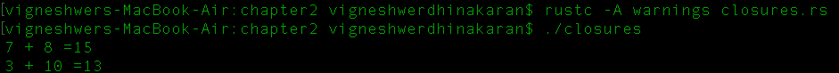

# 它是如何工作的...

闭包的一个重要特点是它是绑定或其操作在其定义的作用域内。这类似于一个使用操作环境中的自由变量的函数。

闭包是编写数学运算的绝佳方式。如果开发者正在使用 Rust 来加速应用程序的数学计算，那么开发者可以在其代码中维护不同方程的闭包以实现更好的优化、代码调试和基准测试。

在这个菜谱中，我们在 `main` 函数中创建了两个闭包。创建简单闭包的基本方法是在操作之前将变量分配给一个操作，在此之前我们可以在 `let` 语句的管道符号中声明变量类型。第一个闭包名为 `sum_num`，它基本上将两个数字相加并返回一个整数输出，这两个变量是它使用的 `x` 和 `y`，它们是 32 位整数。第二个闭包 `add_ten` 将固定的整数值 `10` 添加到传递给闭包的整数。调用闭包的方式类似于函数。惯例是调用闭包的名称后跟传递给闭包操作的参数。在这个菜谱中，我们调用了 `sum_num(7,8)`，它在运行时给出了 `15` 的输出，以及 `add_ten(3)`，它产生了 `13`。

# 在 Rust 中执行指针操作

Rust 提供了不同的智能指针。这些是在 Rust 中用于不同用例的不同类型的指针，但 `&mut T` 是一个可变（独占）引用，这是其中的一种操作。

# 准备工作

我们将需要 Rust 编译器和任何文本编辑器进行编码。

# 如何做...

执行以下步骤：

1.  创建一个名为 `pointer.rs` 的文件，并在脚本中输入以下代码：

```rs
        use std::{i32};
        fn main() {

```

1.  创建一个名为 `vect1` 的向量并将其赋值为 `vec![1,2,3]`：

```rs
        let vect1 = vec![1,2,3];

         // Error in case you are doing this in case of non primitive
         value
         // let vec2 = vec1
         // println!("vec1[0] : {:?}", vec1[0]);

         let prim_val = 1;
         let prim_val2 = prim_val;
         println!("primitive value :- {}", prim_val);

```

1.  将 `&vect1` 传递给 `sum_vects()` 函数：

```rs
         // passing the ownership to the function
         println!("Sum of vects : {}", sum_vects(&vect1));
         // Able to pass the non primitive data type
         println!("vector 1 {:?}", vect1);
        }

```

1.  对向量的每个值执行求和操作：

```rs
         // Added a reference in the argument
         fn sum_vects (v1: &Vec<i32>) -> i32 {
         // apply a closure and iterator
         let sum = v1.iter().fold(0, |mut sum, &x | {sum += x; sum});
         return sum;
        }

```

运行前面的代码后，你应该得到以下截图作为输出：

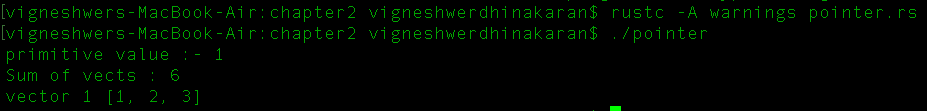

# 它是如何工作的...

所有权和借用是 Rust 构建的主要概念，Rust 提供的标准 API 也是基于这个概念。在前面的代码片段中，我们创建了一个名为 `vect1` 的向量，并使用 `vec!` 关键字将其赋值为 `1,2,3`。

注意，向量是一个非原始值。向量在之后不能被重用，如代码注释部分所示。编译器将抛出一个错误，表示 `vect1` 是一个已移动的值，不能使用。这是当我们将 `vect1` 赋值给 `vect2` 并尝试将其赋值给打印语句时的情况。

在 `sum_vects(&vect1)` 函数中，我们将 `vect1` 的所有权传递给了 `sum_vector` 函数，该函数遍历向量的每个对象并生成总和。注意，我们使用 `&` 符号传递了 `vect1`。这样，我们以引用或指针的形式共享了向量，但如果我们将它作为 `&mut vect1` 传递，那么函数将能够修改或更改向量的值。我们通过在 `sum_vects` 函数处理后打印 `vect1` 来验证这一点，它仍然产生相同的结果。

在 `sum_vects(&vect1)` 中，我们有 `v1`，它是 `vect1` 移动到的参数。向量有一个来自标准 API 的方法，允许 `iter` 函数从零位置读取一个数据对象。

`fold()` 函数接受两个参数：一个初始值和一个闭包。闭包再次接受两个参数：累加器和元素。闭包返回累加器在下一个迭代中应该具有的值。

这里累加器是 `sum`，元素是 `x`，它在每次迭代中添加到 `sum`。请注意，`x` 在闭包定义中是可变的，可以改变其操作范围内的值。这个值存储在 `sum` 变量中，并返回到 `main` 函数。

# 定义你的第一个用户定义数据类型

在这个菜谱中，你将了解结构体，这是在 Rust 中创建复杂数据类型的一种方式。使用 `struct`，我们将定义 Rust 中的用户定义数据类型。

# 准备工作

我们将需要 Rust 编译器和任何文本编辑器进行编码。

# 如何实现...

执行以下步骤：

1.  创建一个名为 `struct.rs` 的文件，并在脚本中输入以下代码：

```rs
        use std::{f64};
        fn main() {

        // create a struct variable
         let mut circle1 = Circle {
         x:10.0,radius : 10.0
         };

        // print radius and variable x
        println!("x:{},radius : {}", circle1.x,
        circle1.radius );
        println!("Radius : {}", get_radius(&circle1) );
        }

```

1.  创建一个名为 `Circle` 的结构体，具有两个参数，即 `x` 和 `radius`：

```rs
        // define your custom user data type
        struct Circle {
        x : f64,
        radius : f64,
        }

```

1.  通过接受用户定义的数据类型 `Circle` 来定义一个函数 `get_radius`：

```rs
        // get radius function 
        fn get_radius(c1 : &Circle) -> f64{ 
        c1.radius 
        }

```

运行前面的代码后，你应该得到以下截图作为输出：

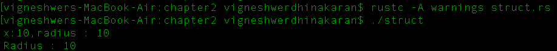

# 它是如何工作的...

在产品开发生命周期的某个阶段，开发者经常需要处理太多的变量，代码变得非常复杂。这就是结构体出现作为大救星的地方。结构体允许开发者创建复杂的数据类型，其中它们允许将多个数据类型统一在一个名称下。

在这个菜谱中，我们创建了一个名为 `Circle` 的自定义数据类型，它有两个标签 `radius` 和 `x`，类型为 `f64`，这是一个 64 位 `float` 类型。这里的两个参数都与 `Circle` 数据类型相关，并独特地表达了它们的特征。

考虑使用案例，如数据库管理、机器学习模型等，在这些案例中，开发者必须处理多个变量，这些变量传达单个任务/实体的属性。在这些情况下，结构体是用于使代码更优化和模块化的优秀工具。这使得开发者的生活变得容易；我们可以轻松地调试错误，并根据应用程序/产品的请求扩展功能。

我们使用 `struct` 关键字来创建用户定义的数据类型，其中自定义名称在关键字之后提供，但与它使用的不同标签或变量的类型一起。

在 `main` 函数中，我们初始化了一个用户定义的数据类型 `Circle` 的可变变量 `circle1`，并用其所需的值填充它，即 `radius` 为 `10.0`，`x` 为 `10.0`。我们这样做是为了在程序的范围内访问变量。我们通过调用所需的变量名称标签来获取值，也就是说，我们通过调用 `circle1.x` 和 `circle.radius` 来获取分配的值的值。

我们将 `circle1` 的引用传递给 `get_radius`，其中我们有一个 `c1` 参数，其数据类型为 `Circle`，从中我们获取 `c1.radius` 的半径。然后，我们通过调用 `get_radius(&circle1)` 来获取值。

# 向用户定义的数据类型添加功能

你将了解如何使用 Rust 中的 `impl` 关键字执行方法调用，这有助于向用户定义的数据类型添加功能。在这个配方中，`impl` 块帮助我们创建方法。

# 准备工作

我们将需要 Rust 编译器和任何文本编辑器进行编码。

# 如何实现...

执行以下步骤：

1.  创建一个名为 `implement.rs` 的文件，并在脚本中输入以下代码：

```rs
        use std::{f64};

        fn main() {
         // create a struct variable
         let mut circle1 = Circle {
         x:10.0,radius : 10.0
         };
        println!("x:{},radius : {}", circle1.x,
        circle1.radius );
        println!("x : {}", circle1.get_x());
        }

```

1.  创建一个名为 `Circle` 的 `struct`，包含两个参数，`x` 和 `radius`：

```rs
        // define your custom user data type
        struct Circle {
         x : f64,
         radius : f64,
        }

```

1.  为用户定义的 `Circle` 数据类型创建 `get_x` 方法：

```rs
        // recommended way of creating structs
         impl Circle {
         // pub makes this function public which makes it 
         accessible outsite the scope {}
         pub fn get_x(&self) -> f64 {
         self.x
         }
        }

```

运行前面的代码后，你应该得到以下截图作为输出：

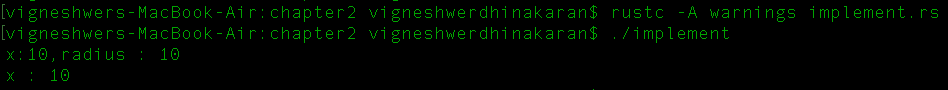

# 工作原理...

在这个配方中，我们创建了一个名为 `Circle` 的自定义数据类型，它有两个标签：`radius` 和 `x`，其类型为 `f64`，这是一个 64 位 `float` 类型。这里的两个参数都与 `Circle` 数据类型相关，并独特地表达了其特征。

在 `main` 函数中，我们初始化了一个用户定义的数据类型 `Circle` 的可变变量 `circle1`，并用其所需值填充它，这些值是 `radius` 的 `10.0` 和 `x` 的 `10.0`。为了在程序的作用域内访问变量，我们通过调用所需的变量名称标签来获取值，即通过调用 `circle1.x` 和 `circle.radius` 来获取分配的值。

但是，我们继续为每种数据类型创建了独特的功能，以便它们可以对与之关联的标签执行独特操作；这消除了传递参数值给外部创建的函数的需求。我们使用 `impl` 实现了这种方法调用，其中我们为数据类型定义了功能。

此功能允许开发者使用 `datatype_name.function1().function2()` 调用数据类型的函数，这减少了函数调用复杂性，并提供了优化的代码。

在 `main` 函数中，我们调用 `circle1.get_x()` 来获取 `x` 值。如果你仔细观察 `Circle` 的 `impl` 代码部分，你会注意到我们传递了 `&self` 给 `get_x()` 方法，这是一个指向圆标签数据类型的引用。

# 不同数据类型的类似功能

在这个配方中，你将了解 Rust 的 `trait` 功能，它与 `impl` 类似，有助于开发者对用户定义的数据类型进行方法调用。然而，`trait` 提供了许多更多功能，如继承和控制，这些功能是用户定义的数据类型提供的。

# 准备工作

我们将需要 Rust 编译器和任何文本编辑器进行编码。

# 如何实现...

执行以下步骤：

1.  创建一个名为 `trait.rs` 的文件，并在脚本中输入以下代码：

```rs
        use std::{f64};
        fn main() {
        // variable of circle data type
         let mut circle1 = Circle {
         r : 10.0
         };
         println!("Area of circle {}", circle1.area() );

         // variable of rectangle data type
         let mut rect = Rectangle {
         h:10.0,b : 10.0
         };
         println!("Area of rectangle {}", rect.area() );
         }

```

1.  创建一个具有参数`h`和`b`的`struct`，这两个参数都是 64 位`float`数据类型：

```rs
        // userdefined data type rectangle
        struct Rectangle {
         h: f64,
         b: f64,
        }

```

1.  创建一个具有参数`r`的`struct`，其中`r`是一个 64 位`float`数据类型：

```rs
        // userdefined data type circle
        struct Circle {
         r: f64,
        }

```

1.  创建一个名为`HasArea`的`trait`，具有`area`功能：

```rs
        // create a functionality for the data types 
        trait HasArea {
         fn area(&self) -> f64;
        }

```

1.  为`Circle`用户自定义数据类型定义`area`函数：

```rs
        // implement area for circle
        impl HasArea for Circle {
         fn area(&self) -> f64 {
         3.14 * (self.r *self.r)
         }
        }

```

1.  为`Rectangle`用户自定义数据类型定义`area`函数：

```rs
        // implement area for rectangle
        impl HasArea for Rectangle {
         fn area(&self) -> f64 {
         self.h *self.b
         }
        }

```

运行前面的代码后，你应该得到以下输出：

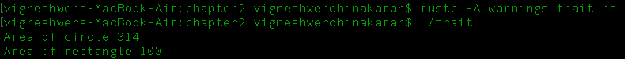

# 它是如何工作的...

在这个菜谱中，我们应用了之前学到的所有概念。我们创建了两个`struct`类型：具有`radius`的`Circle`，其类型为 f64，以及具有参数`h`和`b`的`Rectangle`，这两个参数的类型都是 f64。然后，我们为每个`struct`数据类型创建了`area`功能，这些功能操作标签的数据，因为它们是通过`self`引用的。

用户自定义数据类型的函数定义在数学运算方面是不同的。我们在`main`函数中定义了数据类型`Circle`和`Rectangle`。我们通过`Circle.area()`和`Rectangle.area()`实时调用这些函数。

在这里，我们可以观察到这两种数据类型提供了类似的功能；这就是`trait`发挥作用的地方。它基本上告诉编译器特定函数将使用哪种功能，因此我们实现了`trait`。对于这个菜谱中的数据类型，我们有一个名为`HasArea`的`trait`，它只包含作用域内函数的签名，包含返回的输出和作为参数传递的引用。在这个菜谱中，我们有一个`fn area(&self) -> f64;`的签名，这表示计算结果的输出是一个 64 位的`float`类型。该函数通过获取数据类型的标签和值的引用来操作。
