# 第三章：深入了解 Cargo

在本章中，我们将介绍以下配方：

+   使用 Cargo 创建新项目

+   从 crates.io 下载外部 crate

+   在现有的 Cargo 项目中工作

+   使用 Cargo 运行测试

+   项目的配置管理

+   在 Travis CI 上构建项目

+   上传到 crates.io

# 简介

Cargo 是 Rust 的独特卖点之一，在系统编程空间中是首创。Cargo 是 Rust 的包管理器，它使得开发者能够轻松地创建、开发、打包、维护、测试并将应用程序代码或工具部署到生产环境中，而不需要付出太多努力。在本章中，我们将介绍一些配方，使开发者能够利用 Cargo 的所有功能，并在开发的第一天就创建一个生产级别的 Rust 应用程序。

# 使用 Cargo 创建新项目

Cargo 是 Rust 的独特贡献，在系统编程领域非常新颖。它也是 Rust 的卖点之一，因为它使开发者能够打包、分发和测试他们的 Rust 应用程序。

在本章中，我们将介绍 Cargo 的许多功能。

# 准备中

我们需要 Rust 编译器、Cargo 以及任何文本编辑器进行编码。

# 如何操作...

1.  打开终端。

1.  前往你想要创建项目的目录：

```rs
 cd project_location

```

1.  输入以下命令以创建一个新的 Rust 项目：

```rs
 cargo new project_name --bin

```

创建一个名为`hello_world`的项目，如下例所示：

```rs
 cargo new hello_world --bin

```

你应该得到以下输出：

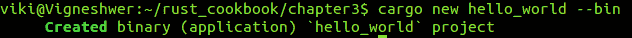

1.  你应该创建一个名为项目的新文件夹。

首先，进入项目并检查它：

```rs
 cd hello_world
 tree .

```

你应该得到以下输出：

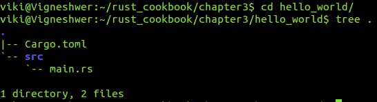

这是新创建项目的整体结构。

1.  使用 Linux 中的`cat`命令打印`Cargo.toml`文件的内容：

```rs
 cat Cargo.toml

```

你应该得到以下输出：

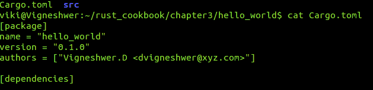

1.  前往项目中的`src`目录，在那里你可以找到默认的`main.rs`文件，并使用 Linux 中的`cat`命令打印其内容：

```rs
 cd src
 cat main.rs

```

你应该得到以下输出：

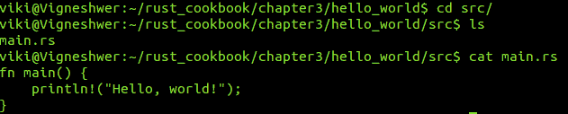

1.  构建随`cargo new`命令提供的示例项目：

```rs
 cargo build

```

你应该得到以下输出：

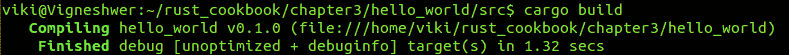

1.  Cargo 构建将创建一个名为`target`的新目录和一个名为`cargo.lock`的文件。

运行编译后的项目，这是一个位于目标目录中的可执行文件。

```rs
 . project_directory/target/debug/hello_world

```

由于这是一个可执行文件，你应该能够看到应用程序的输出。

你应该得到以下输出：

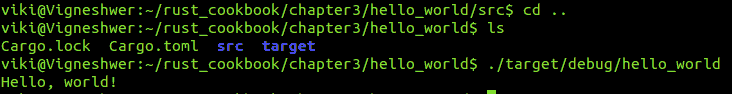

1.  我们必须遵循前面的两个步骤来构建可执行代码，然后执行 Rust 应用程序，但使用`cargo run`命令我们可以同时执行这两个操作：

```rs
 cd project_location
 cargo run

```

你应该得到以下输出：

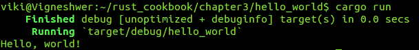

# 它是如何工作的...

Cargo 是随 Rust 安装一起提供的命令行工具。它对于以下原因至关重要：

+   它引入了包含项目所有详细信息的元数据文件

+   它调用`rustc`编译器来构建项目

+   它帮助开发者更好地组织和维护代码

`cargo new`命令为我们创建了完整的文件夹结构。对于我们的项目，`--bin`表示二进制文件。这意味着我们正在创建一个 Rust 应用程序，它预期能够直接解决现实世界的问题。然而，在这种情况下，我们创建了一个不会使用`--bin`选项作为命令行工具的库。在 Rust 中，库被称为 crate。我们将在接下来的章节中创建一个 crate。

`Cargo.toml`是一个包含 Cargo 编译项目所需所有元数据的清单文件。当你运行`cargo build`命令时，你会看到源代码被转换成可执行的字节码，这将形成最终的应用程序；这会创建`target`目录，并将可执行文件放置在其中的`debug`文件夹内。在`debug`文件夹内，我们主要有一个`deps`目录，它包含执行应用程序所需下载的不同依赖库。

你的项目可以包含名为`example`、`test`和`bench`的文件夹，Cargo 会将它们分别视为包含示例、集成测试和基准测试。

Rust 非常智能，只有当代码有变化时才会进行编译。

在调试模式下编译`cargo build --release`适合开发使用，其编译时间更短，因为编译器不会进行任何优化和检查。然而，当你以发布模式运行代码时，编译时间会更长，但代码在生产环境中运行会更快。发布模式将在`target`目录内的`release`文件夹中准备构建，而不是`debug`目录。

我们可以看到构建过程创建了一个`Cargo.lock`文件。此文件包含有关我们依赖项的所有信息。我们将在接下来的菜谱中详细介绍此文件。

为了在同一 Rust 项目中编译多个二进制文件，我们必须在`Cargo.toml`文件中进行一些设置，明确指出我们想要构建的目标。默认情况下，Cargo 会使用与项目同名的方式编译`src`文件夹中的`main.rs`文件，但为了编译多个二进制文件，例如需要构建的`daemon`和`client`，我们需在`Cargo.toml`文件中进行以下提及的更改：

```rs
[[bin]]
name = "daemon"
path = "src/daemon/bin/main.rs"

[[bin]]
name = "client"
path = "src/client/bin/main.rs"

```

这将构建两个额外的二进制文件，名为`daemon`和`client`，以及项目本身的二进制文件。

类似地，我们可以在配置文件中拥有如`[lib]`、`[[bench]]`、`[[test]]`和`[[example]]`等部分，以构建库、基准测试、测试和示例。

# 从 crates.io 下载外部 crate

为了创建解决现实世界问题的复杂应用程序，我们需要重用其他开源项目和依赖项以加快开发速度。

[`crates.io/`](https://crates.io/) 是 Rust 社区的中心仓库，作为发现和下载包的位置。命令行工具 **`cargo`** 被配置为查找请求的包并下载和使用它们。你将在本食谱中学习如何下载和维护外部 crates（依赖项）。

# 准备工作

我们需要 Rust 编译器、Cargo 和任何文本编辑器进行编码。

# 如何做到这一点...

1.  在你喜欢的文本编辑器中打开`Cargo.toml`文件；在本食谱中，我们将使用`nano`编辑器：

```rs
 nano Cargo.toml

```

你应该得到以下输出：

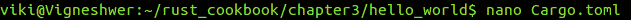

1.  在`cargo.toml`文件中添加一个`[dependencies]`部分，并在其下方输入`time = "0.1.12"`和`regex = "0.1.41"`。

你应该得到以下输出：

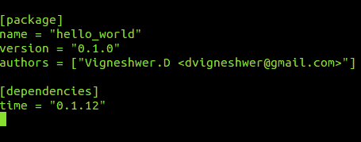

1.  使用`cat`命令查看配置列表：

```rs
 cat Cargo.toml

```

你应该得到以下输出：

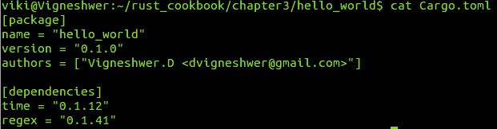

1.  构建项目以从[`crates.io/`](https://crates.io/)拉取依赖项：

```rs
 cargo build

```

你应该得到以下输出：

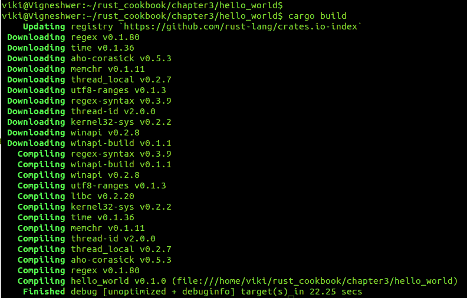

1.  使用我们项目中已有的 crates。

使用`nano`在`src`目录中打开`main.rs`文件，并输入以下代码：

```rs
 nano main.rs

```

你应该得到以下输出：

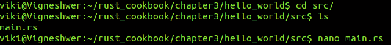

```rs
        // Declare the external crate
        extern crate regex;
        use regex::Regex;
        fn main() {
          let check_date = Regex::new(r"^\d{4}-\d{2}-\d{2}$").unwrap();
          println!("Did our date match? {}", check_date.is_match("2017
          -02-01"));
        }

```

你应该得到以下状态输出：

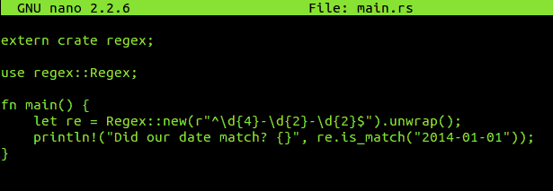

1.  编译并运行项目：

```rs
 cargo run 

```

你应该得到以下输出：

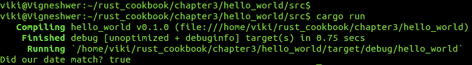

# 它是如何工作的...

我们在`Cargo.toml`文件中输入项目所需的依赖项。此文件从[`crates.io/`](https://crates.io/)中央仓库获取提到的包和版本。在前面的食谱中，我们下载了时间和正则表达式 crates，并提到了我们希望工作的所需版本。

当我们在修改`Cargo.toml`文件后构建项目时，它会下载本地开发系统 crates 中的所有模块，并在`Cargo.lock`文件中创建条目，该文件将包含有关下载的依赖项的所有详细信息。

如果你计划创建一个库或改进现有的库实现，建议你检查[`crates.io/`](https://crates.io/)中是否有任何类似的想法或项目实现，以评估你的开源项目的价值。所有在[`crates.io/`](https://crates.io/)仓库上提交的项目都是 GitHub 上的开源项目。

使用其他依赖项的有趣之处在于，你可以重用你希望在项目中使用的应用程序或函数的可用工作版本，从而减少项目开发时间。

我们在 Rust 脚本中使用`extern crate`命令来调用下载的 crate。

`extern crate regex`或 crate，并在其模块中导入所有函数。然后我们通过传递我们的数据在代码中调用它们。

在前面的代码片段中，我们明确提到了需要使用`use`命令来调用`regex`crate 中的`Regex`模块，使用`regex::Regex`检查日期是否匹配，并在终端中打印布尔值。

我们调用`unwrap`和`is_match`函数来检查两个字符串是否相同。如果它们相似，则返回`true`，如果不相似，则返回`false`。

# 在现有的 Cargo 项目中工作

Cargo 是一个工具，允许 Rust 应用程序声明它们的各种依赖项，以确保您能够通过遵循相同的依赖项和版本来重新创建构建。

在更高层次上，它为 Rust 项目提供配置管理，并帮助重现开发环境。通常，在其他语言中，维护不同的依赖项并每次在不同环境中部署应用程序时配置它们是一个非常繁琐且耗时的过程。

Cargo 提供了一些开箱即用的功能，使得开发人员和项目经理能够非常快速且没有太多麻烦地发布/部署 Rust 项目/应用程序；这与其他语言相比是一个非常大的优势。

# 准备工作

我们需要 Rust 编译器、Cargo 以及任何文本编辑器来进行编码。

# 如何操作...

1.  从本食谱的项目 repo 中克隆项目。关闭 GitHub 上托管的`rand`crate。通过在终端中输入以下命令来完成此操作：

```rs
 git clone https://github.com/rust-lang-nursery/rand.git

```

您应该得到以下输出：

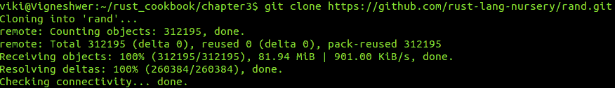

这将把 GitHub 上的 repo 克隆到本地系统。

1.  进入新创建的项目`rand`并查看复杂的生产级包详细信息：

```rs
 cd rand/
 tree .

```

您应该得到以下输出：

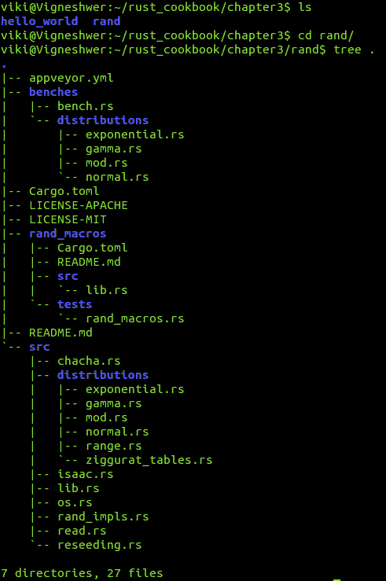

1.  使用 Cargo build 命令构建项目：

```rs
 cargo build 

```

您应该得到以下输出：

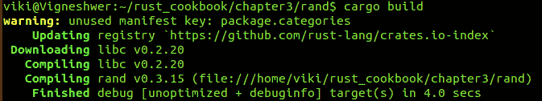

# 它是如何工作的...

前面的三个步骤将在您的本地开发环境中设置一个完整的 Rust 项目。这是 Cargo 命令行工具的力量，它使得开发者的后开发应用程序生命周期变得如此简单。

在这里，我们基本上克隆了一个现有项目并构建了它。Cargo 查看了清单文件，以获取理解项目各种依赖项所需的所有元数据，并构建了它们。

# 使用 Cargo 运行测试

对于复杂的生产级应用程序，测试非常重要，因为它们验证了项目功能单元的工作情况。Cargo 为 Rust 提供了所有测试功能，这些功能有助于单元和集成测试。

# 准备工作

我们需要 Rust 编译器、Cargo 以及任何文本编辑器来进行编码。

# 如何操作...

1.  在项目内部运行 `cargo test` 命令：

```rs
 cargo test

```

你应该得到以下输出：

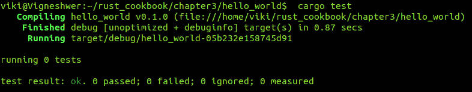

1.  指定名称来运行特定的测试-- `cargo test test_name`：

```rs
 cargo test foo

```

你应该得到以下输出：

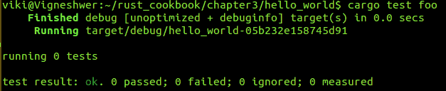

# 它是如何工作的...

Cargo 在两个地方寻找要运行的测试：它们位于 `src` 目录中，我们可以在此放置单元测试的代码，以及 `tests` 目录，我们在此放置集成测试。

在本食谱中，我们没有为项目编写任何测试，但稍后我们将有一个专门的章节介绍测试，我们将深入探讨测试的各个方面。

# 项目的配置管理

在本食谱中，我们将彻底探讨 `Cargo.lock` 和 `Cargo.toml` 的使用，并了解它们如何帮助进行配置管理。

此处的配置管理指的是拥有版本控制的能力，这包括上传和下载项目依赖项所需版本。

# 准备工作

我们需要 Rust 编译器、Cargo 以及任何文本编辑器进行编码。

# 如何操作...

1.  前往 `hello_world` 项目，并在 `Cargo.toml` 文件中输入 `rand` 库的 GitHub 仓库链接：

```rs
 cd hello_world
 nano Cargo.toml

```

在下面的 `Cargo.toml` 文件中，输入所提到的依赖项：

```rs
 rand = { git = "https://github.com/rust-lang-nursery/rand.git"
      }

```

你应该得到以下输出：

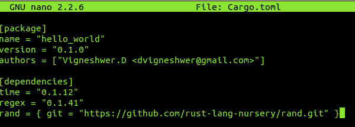

1.  在相同的 `Cargo.toml` 文件中，输入 `rev` 和 `rand` 包的 `SHA` 值。

你应该得到以下输出：

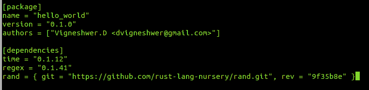

1.  输入 `cargo update` 命令以实施新更改：

```rs
 cargo update

```

你应该得到以下输出：

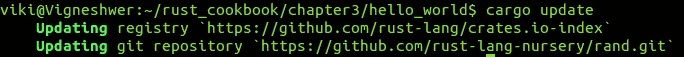

1.  进入 `Cargo.lock` 并查看 `rand` 包的详细信息。

你应该得到以下输出：

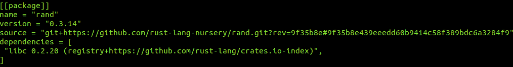

不要在 `Cargo.lock` 文件中手动进行任何更改。它不是用来手动编辑的。

# 它是如何工作的...

Cargo 解析清单文件数据，并根据输入的数据执行某些任务。

首先，我们在 `Cargo.toml` 文件中输入了项目的 GitHub 仓库链接以安装特定的包。由于我们没有提及任何其他细节--例如，版本--Cargo 将从项目的 master 分支拉取所有模块和资源。

然而，这种方法的问题在于，如果项目在明天更改其布局或代码，当更新包时，我们的当前实现可能会受到影响。

为了避免这种情况，我们将 `rev` 值分配给了我们当前构建所使用的资源的项目的提交 ID。这似乎解决了我们的问题，但我们仍然需要记住提交 ID，在输入错误 ID 时容易出错。

使用 `nano` 命令进入 `Cargo.lock`。由于 `lock` 文件已存在，我们不需要手动跟踪依赖项的版本。Cargo 将在 `Cargo.lock` 文件中为应用程序中使用的每个包创建条目，并包含其版本的详细信息。

当你第一次构建时，Cargo 将获取最新的提交并将该信息写入 `Cargo.lock`。想象一下，我们将项目发送到一个新的主机，并想要配置 Rust 应用程序。即使你未在 `Cargo.toml` 文件中提及，Cargo 也会使用 `Cargo.lock` 文件中的确切 `SHA`。我们可以看到 `lock` 文件中有关于包的大量信息，这有助于我们稍后重现相同的依赖项。

# 在 Travis CI 上构建项目

Travis CI 是一个持续集成软件，它读取项目仓库中的 `yml` 文件。它为工具提供指令或命令，说明你应该如何构建、测试和发布。

在这个配方中，你将学习如何使用托管在 GitHub 上的 `TravisCI` 工具构建 Rust 应用程序。

# 准备工作

我们需要 Rust 编译器、Cargo 和任何文本编辑器进行编码。在 GitHub 仓库中托管 Rust 应用程序，并将 `TravisCI` 工具集成到 GitHub 仓库中。

# 如何操作...

1.  在项目中使用 `touch` 命令创建一个 `.travis.yml` 文件：

```rs
 cd project_location 
      touch .travis.yml 

```

1.  通过使用任何文本编辑器打开文件来配置测试不同 Rust 构建的应用程序，我们在这个配方中使用 `nano`：

```rs
 nano .travis.yml

        language: rust
        rust:
          - stable
          - beta
          - nightly
        matrix:
          allow_failures:
          - rust: nightly

```

你应该获得以下输出：

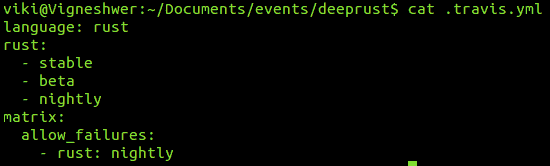

1.  在项目中做出更改并将项目推送到 GitHub 仓库。

每次我们在项目仓库中推送提交时，Travis CI 平台都会触发 `build` 过程。这个过程可以通过 Travis CI 平台提供的高级选项进行配置，你可以安排构建或选择要构建的仓库分支。

你应该在 Travis CI 平台上获得以下截图作为输出：

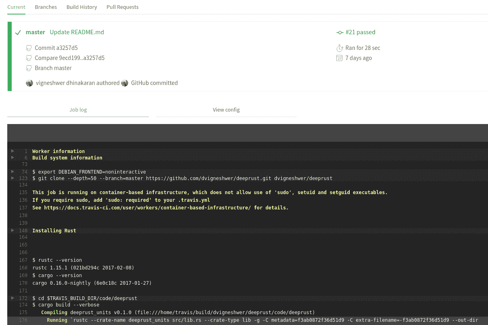

# 它是如何工作的...

Travis CI 工具读取项目仓库中的 `.travis.yml` 文件中的说明，并准备你想要构建、测试和发布项目的环境。

在下一节中，我们将分解并理解 `build` 管道中每个命令的作用：

```rs
 language: rust

```

当设置机器时，这会下载并安装 Rust 发布的最新稳定版本。如果你只想在稳定版本中测试应用程序，你只需要前面的命令，无需指定版本：

```rs
rust:
 - stable
 - beta
 - nightly

```

为了指定你想要测试应用程序的版本，你可以使用前面构建项目的命令，在 `beta` 和 `nightly` 通道中。即使你只针对稳定版本，Rust 团队也鼓励你在其他通道上测试：

```rs
matrix:
 allow_failures:
 - rust: nightly

```

这将测试所有三个渠道，如果`nightly`渠道出现任何问题，不会导致你的整体构建失败。

在先前的`build`日志中，如果你仔细观察，你会看到默认的测试脚本是由 Travis CI 运行的，它使用 Cargo 工具通过`cargo build`和`cargo test`命令运行你的构建和测试应用程序。

# 上传到 crates.io

[`crates.io/`](https://crates.io/) 是一个网站，充当由令人惊叹的 Rust 社区制作的 crate 的中心存储库。它包含各种领域的各种项目。

这有助于即时发布 crate 并安装它们。

# 准备工作

我们需要 Rust 编译器、Cargo 和任何文本编辑器来编码，并在[`crates.io/`](https://crates.io/)网站上使用 GitHub ID 创建账户。

# 如何操作...

1.  从你想要上传项目到[`crates.io/`](https://crates.io/)的位置进入项目：

```rs
 cd project_location

```

1.  当你使用现有的 GitHub ID 创建新账户或登录时，[`crates.io/`](https://crates.io/)在账户设置页面上提供了一个 API 令牌：

```rs
 cargo login API_TOKEN

```

1.  打包 Rust 应用程序：

```rs
 cargo package

```

1.  将 Rust 应用程序发布到[`crates.io/`](https://crates.io/)：

```rs
 cargo publish

```

# 它是如何工作的...

Cargo 登录命令接受提供的 API 令牌并将其存储在`~/.cargo/config`位置。

注意，API 令牌应保密，不应共享，因为它是我们管理上传的 crate 的方式。

请记住，你用来创建项目的名称将成为 crate 的名称，crate 的名称基于先到先得的原则。

当我们的项目准备好打包时，我们使用先前的步骤创建一个新的文件夹，命名为`/target/package`。

包内的内容是即将上传到[`crates.io/`](https://crates.io/)网站的内容。将有一个名为`project_name-version.crate`的文件和一个名为`project_name-version`的文件夹。这些名称基于开发者提供给`cargo.toml`的信息。我们可以在配置文件中调整值，并使用包命令，直到我们得到正确的名称和版本号。

在打包时，我们必须确保不上传不必要的文件，例如测试脚本或文本文件等，这些文件用于测试库。为此，`*.crate`文件提供了许多标签或键，它们描述了文件的各种功能、示例和资源：

```rs
[package]
# ...
exclude = [    
  "public/assets/*",  
  "videos/*",
]

# ...
include = [ 
  "**/*.rs", 
  "Cargo.toml",
]

```

在先前的章节中，我们明确指出，`assets`和`videos`文件夹中的所有资源都应该排除；另一方面，我们有一个名为`include`的标签，它将帮助确保所有重要文件都被打包。

最终命令`cargo publish`会检查`*.crate`文件，并在创建的账户中发布 crate。
