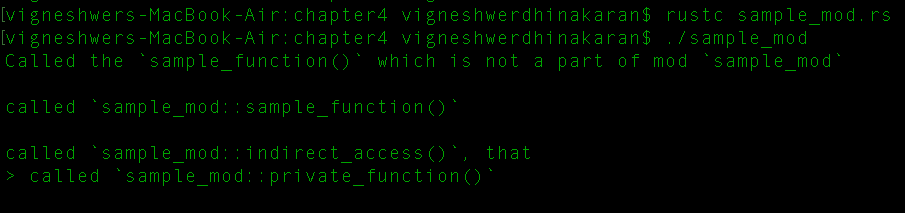
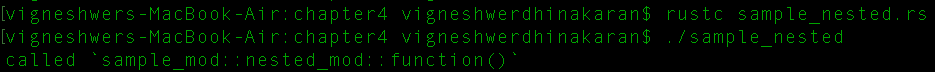
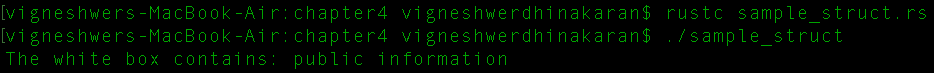
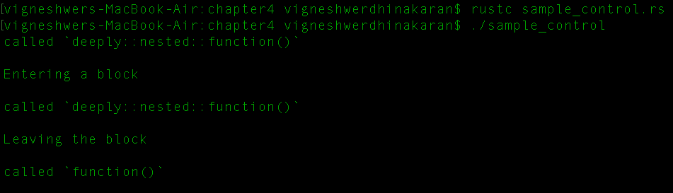
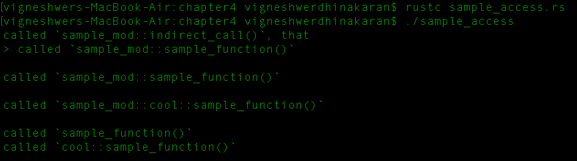
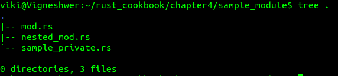
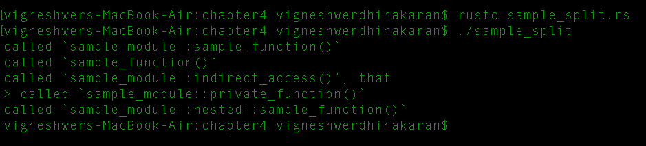
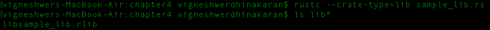
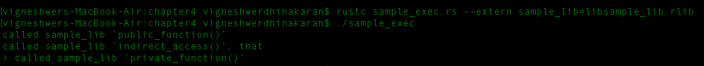

# 第四章：创建 Crates 和 Modules

本章将涵盖以下内容：

+   在 Rust 中定义模块

+   构建嵌套模块

+   使用结构体创建模块

+   控制模块

+   访问模块

+   创建文件层次结构

+   在 Rust 中构建库

+   调用外部 crate

# 简介

本章重点介绍 Rust 中的模块和 crate。这将帮助你开发高度模块化和生产级别的 Rust 应用程序。有了这个，你将有一个很好的文件层次结构，这将有助于以模块化的方式开发功能。本章中的食谱还将帮助你构建 Rust 库，并通过外部程序定义、控制和访问功能。

# 在 Rust 中定义模块

所有应用程序都必须模块化，以便它们易于维护和开发。在 Rust 中，我们可以为我们的应用程序提供一个强大的模块系统，可以将应用程序源代码分层拆分为逻辑单元，我们称之为模块，并管理它们在应用程序中的可见性（公共/私有）。

模块的字典描述是它是一组项目，例如函数、结构体、特质、impl 块，甚至是其他模块。

你将在本食谱中学习如何创建一个示例模块，并理解可见性的概念。

# 准备工作

我们将需要 Rust 编译器和任何文本编辑器进行编码。

# 如何做到这一点...

1.  创建一个名为`sample_mod.rs`的文件，并在你的文本编辑器中打开它。

1.  使用相关信息编写代码标题：

```rs
        //-- #########################
        //-- Task: To create a sample module to illustrate
        how to use a module in rust
        //-- Author: Vigneshwer.D
        //-- Version: 1.0.0
        //-- Date: 4 March 17
        //-- #########################

```

1.  使用`mod`关键字创建一个名为`sample_mod`的模块，并在其中定义一个名为`private_function`的函数：

```rs
        // Defined module named `sample_mod`
        mod sample_mod {
          // By default all the items in module have private
          visibility

        fn private_function() {
          println!("called `sample_mod::private_function()`
          \n");
        }

```

1.  通过在模块中使用`pub`关键字标记其可见性，定义一个名为`sample_function`的函数：

```rs
        // Using the `pub` keyword changes it visibility to public
        pub fn sample_function() {
          println!("called `sample_mod::sample_function()` \n");
        }

```

1.  声明一个公共函数`indirect_private_fn`，它将调用`private_function`：

```rs
        // Public items of the module can access the private visible
        items 
        pub fn indirect_private_fn() {
          print!("called `sample_mod::indirect_access()`, that \n ");
          private_function();
        }
       }

```

1.  在`sample_mod`模块的作用域之外定义`sample_function`：

```rs
        // Created a sample function to illustrate calling of 
        fn sample_function() {
          println!("Called the `sample_function()` which is not a part
          of
          mod `sample_mod` \n");
        }

```

1.  声明`main`函数，在其中我们将调用`sample_mod`模块的每个项目，以了解它们的工作原理并打印输出：

```rs
        // Execution of the program starts from here
        fn main() {
          // Calling the sample_function which is outside module
          sample_function();

          // Calling the public visible sample_mod's sample_function
          sample_mod::sample_function();

          // Accessing the private function indirectly
          sample_mod::indirect_private_fn();

          // Error! `private_function` is private
          //sample_mod::private_function(); // TODO ^ Try uncommenting
          this line 
        }

```

在正确设置前面的代码后，当你编译并运行程序时，你应该得到以下截图输出：



# 它是如何工作的...

在这个食谱中，你学习了如何创建一个 Rust 示例模块以及你被允许调用模块的项目。

从本章开始，我们将遵循标题样式，这是我们第一步。它基本上描述了代码或应用程序单元的部分功能。遵循这种非常好的代码实践，有助于当另一个人从你开发的地方开始时。

我们使用 `mod` 关键字创建了一个名为 `sample_mod` 的模块，后跟大括号 `{}`。模块的内容是其项。每个项都设计用于执行特定任务。默认情况下，模块中的所有项都具有私有可见性，这意味着它们不能直接在作用域外访问。在 `sample_mod` 模块中，我们使用 `pub` 关键字显式创建了两个具有公共可见性的函数。我们在使用 `fn` 关键字创建或声明函数之前添加了该关键字。这使得项在模块的作用域外可见。私有函数或项可以在模块的作用域内访问，其中所有项都可以相互调用，因此我们可以间接调用公共项以从它访问私有项。

在此代码中，我们创建了四个函数，其中三个在模块内部，一个可以全局访问。我们在 `sample_mod` 内部创建的第一个函数是 `private_function`，它默认具有私有可见性。然后我们创建了两个公共函数，即 `sample_function` 和 `indirect_private_fn`，其中 `indirect_private_fn` 在其主体中调用 `private_function`。

要在模块的作用域之外调用模块中的项，我们必须遵循特定的语法--`module_name::publically_visible_function name`。在 `main` 函数中，我们调用 `sample_fucntion`，这是一个普通函数，以及 `sample_mode` 模块的两个公开可见项：`function sample_mod::sample_function()` 和 `sample_mod::indirect_private_fn()`。这些项将执行它们各自作用域内的内容。

当调用模块的私有项时，它将抛出一个错误，表明特定的项是私有的。例如，在前面的菜谱中，当我们直接从 `main` 函数中调用 `sample_mod::private_function();` 时，我们得到了一个错误。

# 构建嵌套模块

嵌套模块是我们希望在模块中拥有模块的地方，执行不同的任务。您将学习如何声明和访问嵌套模块的项。

嵌套模块是将类似项或功能单元在应用程序中一起使用的好方法，这有助于维护特性和调试崩溃。

# 准备工作

我们将需要 Rust 编译器和任何文本编辑器进行编码。

# 如何操作...

1.  在项目工作区中创建一个名为 `sample_nested.rs` 的文件

1.  编写代码头部信息，这将提供代码的概述：

```rs
        //-- #########################
        //-- Task: To create a sample nested_mod module
        //-- Author: Vigneshwer.D
        //-- Version: 1.0.0
        //-- Date: 4 March 17
        //-- #########################

```

1.  使用 `mod` 关键字创建一个名为 `sample_mod` 的模块：

```rs
        // Defined module named `sample_mod`
        mod sample_mod {

```

1.  在 `sample_mod` 模块下创建另一个名为 `nested_mod` 的模块，其中包含 `function` 和公共可见性，这使得 `sample_mod` 成为嵌套模块：

```rs
        // Defined public Nested module named `nested_mod`
         pub mod nested_mod {
           pub fn function() {
             println!("called `sample_mod::nested_mod::function()`");
           }

```

1.  在 `nested_mod` 模块下创建一个名为 `private_function` 的函数：

```rs
        #[allow(dead_code)]
        fn private_function() {
          println!("called
          `sample_mod::nested_mod::private_function()`");
        }
        }

```

1.  在 `sample_mod` 内部定义另一个名为 `private_nested_mod` 的模块，其中包含一个名为 `function` 的公共函数：

```rs
        // Nested modules follow the same rules for visibility
        mod private_nested_mod {
          #[allow(dead_code)]
          pub fn function() {
            println!("called
            `sample_mod::private_nested_mod::function()`");
          }
        }
        }

```

1.  定义 `main` 函数并调用嵌套模块，其中包含不同声明的项：

```rs
        // Execution starts from main function
        fn main() {
          sample_mod::nested_mod::function();
          // Private items of a module cannot be directly accessed,even
          if nested_mod in a public module

          // Error! `private_function` is private
          //sample_mod::nested_mod::private_function(); // TODO ^ Try
          uncommenting this line

          // Error! `private_nested_mod` is a private module
          //sample_mod::private_nested_mod::function(); // TODO ^ Try
          uncommenting this line
        }

```

在正确设置前面的代码后，当你编译并运行程序时，你应该得到以下输出：



# 工作原理...

嵌套模块是一个概念，其中你有一个模块嵌套在另一个模块内部。这个特性有助于将应用单元集合放置在公共头文件中。

在本菜谱中，我们使用`mod`关键字创建了一个名为`sample_mod`的模块；在这个模块中，我们创建了另外两个模块，即`nested_mod`和`private_nested_mod`，具有不同的可见性。模块的可见性规则遵循模块项的相同规则：我们必须显式提及`pub`关键字来提及模块的可见性。如果我们不提及任何内容，Rust 编译器将认为它是私有的。

我们然后在嵌套模块内部创建项目，这些项目位于`sample_mod`模块下。在公共嵌套模块`nested_mod`中，我们创建了两个项目：一个名为`function`的公共方法和一个名为`private_function`的私有方法。在另一个私有嵌套模块`private_nested_mod`中，我们创建了一个名为`function`的公共方法。

我们可以为位于不同模块中的项/单元使用相同的名称。在先前的菜谱中，我们有一个名为`function`的项，它存在于嵌套模块中。

在`main`函数中，我们调用遵循标准访问项语法的相应项。这里唯一的区别是项位于不同的嵌套模块中。在这种情况下，我们遵循`module_name::nested_module_name:item_name`语法。在这里，我们首先调用模块名称，然后是嵌套模块名称及其项。

我们将公共嵌套模块称为公共项，即`sample_mod::nested_mod::function()`。它将正常运行并执行项的内容。在调用私有嵌套模块时，在我们的菜谱中是`sample_mod::nested_mod::private_function()`，以及公共嵌套模块的类似私有项，在我们的菜谱中是`sample_mod::private_nested_mod::function()`，我们将得到一个错误，指出这些项是私有的，因为私有可见单元不能直接在作用域外访问。

我们在`private_nested_mod`模块中的`function`项上使用了`#[allow(dead_code)]`属性。其想法是禁用编译器的`dead_code` lint，这将警告关于未使用的函数。简单来说，lint 是标记代码中错误的软件。

# 使用结构体创建模块

本菜谱涵盖了具有额外可见性级别的结构体字段。默认情况下，可见性为私有，可以使用`pub`修饰符来覆盖。这种可见性仅在从定义该结构体的模块外部访问`struct`时才有意义，其目的是隐藏信息（封装）。

# 准备工作

我们将需要 Rust 编译器和任何文本编辑器进行编码。

# 如何操作...

1.  在项目工作区中创建一个名为 `sample_struct.rs` 的文件

1.  编写代码头，包含代码的详细信息：

```rs
        //-- #########################
        //-- Task: To create a sample nested_mod module
        //-- Author: Vigneshwer.D
        //-- Version: 1.0.0
        //-- Date: 4 March 17
        //-- #########################

```

1.  创建一个名为 `sample_struct` 的示例模块，在其中你可以声明一个名为 `WhiteBox` 的公共 `struct`：

```rs
        // Sample module which has struct item
        mod sample_struct {
          // A public struct with a public field of generic type `T`
          pub struct WhiteBox<T> {
            pub information: T,
          }

```

1.  声明一个名为 `BlackBox` 的公共 `struct`，它有一个私有的泛型类型 `T`：

```rs
        // A public struct with a private field of generic type `T`
        #[allow(dead_code)]
        pub struct BlackBox<T> {
        information: T,
        }

```

1.  使用 `impl` 关键字创建一个名为 `const_new` 的公共构造函数，它接受泛型 `T` 类型作为输入：

```rs
        impl<T> BlackBox<T> {
          // A public constructor method
          pub fn const_new(information: T) -> BlackBox<T> {
            BlackBox {
              information: information,
            }
          }
        }
        }

```

1.  通过调用 `sample_struct` 模块的 `struct` 项来声明 `main` 函数，这是 `whitebox` `struct` 项：

```rs
        // Execution starts here
        fn main() {

          // Public structs with public fields can be constructed as
          usual
          let white_box = sample_struct::WhiteBox { information:
          "public
          information n" };

        // and their fields can be normally accessed.
        println!("The white box contains: {} \n",
        white_box.information);
        // Public structs with private fields cannot be constructed
        using field names.
        // Error! `BlackBox` has private fields
        //let black_box = sample_struct::BlackBox { information:
        "classified information" };
        // TODO ^ Try uncommenting this line
        // However, structs with private fields can be created using

        // public constructors
        let _black_box = sample_struct::BlackBox::const_new("classified
        information \n");

        // and the private fields of a public struct cannot be
        accessed.
        // Error! The `information` field is private
        //println!("The black box contains: {}",
        _black_box.information);
        // TODO ^ Try uncommenting this line
        }

```

在正确设置前面的代码后，当你编译并运行程序时，你应该得到以下输出：



# 它是如何工作的...

到目前为止，在前面的菜谱中，我们只关注了具有作为其项的函数的模块。在这个菜谱中，我们将创建具有额外可见性级别的 `struct` 项，其字段。

默认情况下，可见性是私有的，可以使用 `pub` 关键字进行更改。可见性允许我们在尝试访问模块外部的作用域中的模块项时隐藏信息。

我们使用 `mod` 关键字创建了一个名为 `sample_struct` 的模块。我们使用 `pub` 和 `struct` 关键字创建了两个具有公共可见性的 `struct`，分别命名为 `WhiteBox` 和 `BlackBox`。在这两个 `struct` 项中，我们都有一个泛型类型 `T`。

在 Rust 中，泛型意味着特定的单元可以接受一个或多个泛型类型参数，`<T>`。例如，考虑 `fn foo<T>(T) { ... }`。在这里，`T` 是使用 `<T>` 指定的泛型类型参数的参数，它允许它接受任何类型的任何参数。

在这两个 `struct` 中，我们都有一个名为 `information` 的字段，它与 `T` 相关联，即我们接收到的参数。唯一的区别是我们将 `WhiteBox` 中的 `information` 作为 `struct` 内部的公共提及，而将 `BlackBox` 中的 `information` 默认设置为私有。

接下来，我们为 `BlackBox` 创建了一个实现块，在其中我们明确指定了 `impl` 块中的泛型类型 `T`。在其中，我们创建了一个名为 `const_new` 的方法，我们将其公开可见，它接受泛型类型 `T` 作为参数并返回一个 `BlackBox` `struct`。`const_new` 作为 `BlackBox` 的公共构造函数，我们希望创建数据类型。

在`main`块中，我们首先创建了`WhiteBox`结构并将其通过`sample_struct::WhiteBox { information: "public information \n" }`赋值给名为`white_box`的变量。在这里，我们正在调用模块，创建一个复杂的数据结构并打印`white_box`的信息字段，这是在前面步骤中传递的。接下来，我们尝试以类似的方式创建一个具有`BlackBox`数据结构变量的变量。这导致了一个错误，说字段名是私有的。这就是我们创建一个公共方法`const_new`的原因，它是`BlackBox`数据类型的构造函数。我们通过`sample_struct::BlackBox::const_new("classified information \n")`执行此步骤，并将其赋值给`_black_box`。

这将参数从`main`传递到`impl`块并创建结构。这样，我们能够定义一个具有私有字段的公共`struct`，但我们仍然不能通过`_black_box.information`公开访问信息字段，因为它最初是一个私有字段。

模块中的私有成员可以通过间接方法访问。考虑以下代码片段：

```rs
pub mod root {
    use self::foo::create_foo;
    mod foo {
        pub struct Foo {
            i: i32,
        }
        impl Foo{
            pub fn hello_foo(&self){
                println!("Hello foo");
            }
        }
        pub fn create_foo(i: i32) -> Foo{
            Foo { i: i }
        }
    }
    pub mod bar {
        pub struct Bar {
            pub f: ::root::foo::Foo,
        }
        impl Bar {
            pub fn new(i: i32) -> Self {
                Bar { f: ::root::foo::create_foo(i) }
            }
        }
    }
}
fn main() {
    //still private
    //let f = root::foo::create_foo(42);
    let b = root::bar::Bar::new(42);
    b.f.hello_foo();
}

```

我们在`foo`模块中公开了一个构造函数`create_foo`，但`foo`模块仍然保持私有，我们只通过`use`关键字在`root`中公开`create_foo`，这意味着`bar`现在可以创建一个`Foo`结构体，但`create_foo`在`root`外部仍然是私有的。

# 控制模块

这个配方侧重于 Rust 模块中`use`关键字的用法，这将帮助将长而繁琐的模块调用路径绑定到简单的单个实体。这将提高代码的可读性，并为开发者提供更多调用模块单元的控制。我们还将讨论`use`的作用域和阴影的概念。

# 准备工作

我们将需要 Rust 编译器和任何文本编辑器进行编码。

# 如何做到这一点...

1.  在项目工作区中创建一个名为`sample_control.rs`的文件。

1.  编写代码头，包含代码的详细信息：

```rs
        //-- #########################
        //-- Task: To create a sample module to illustrating `use`
        //-- Author: Vigneshwer.D
        //-- Version: 1.0.0
        //-- Date: 4 March 17
        //-- #########################

```

1.  使用`use`关键字创建`other_function`，以便为`deeply`模块的项目创建绑定：

```rs
        // Bind the `deeply::nested::function` path to
        `other_function`.
        use deeply::nested::sample_function as other_function;

```

1.  声明嵌套模块`deeply`，其中包含名为`nested`的嵌套模块，该模块包含公共函数`sample_function`：

```rs
        // Defined a nested 
        mod deeply {
          pub mod nested {
            pub fn sample_function() {
              println!("called `deeply::nested::function()` \n")
            }
          }
        }

```

1.  创建一个名为`sample_function`的函数：

```rs
        fn sample_function() {
          println!("called `function()` \n");
        } 

```

1.  通过调用`other_function`来声明`main`函数：

```rs
        fn main() {
          // Easier access to `deeply::nested::function`
          other_function();

```

1.  创建一个块。在这个块中，使用`use`关键字并声明`deeply :: nested :: sample_function`，这相当于将其绑定到`sample_function`：

```rs
        println!("Entering a block n");
        {
          // This is equivalent to `use deeply::nested::sample_function
          as sample_function`.
          // This `sample_function()` will shadow the outer one.
          use deeply::nested::sample_function;
          sample_function();

        // `use` bindings have a local scope. In this case, the
        // shadowing of `function()` is only in this block.
        println!("Leaving the block \n");
        }

```

1.  在创建的块外部调用`sample_function`：

```rs
        sample_function();
        }

```

在正确设置前面的代码后，当你编译并运行程序时，你应该得到以下输出：



# 它是如何工作的...

在这个菜谱中，我们关注了 `use` 关键字，当你的模块更深时（这意味着有很多嵌套模块和单元），它真的非常方便。简而言之，`use` 帮助将一个长的模块调用绑定到一个单一的名字。在前面的菜谱中，我们有一个名为 `deeply` 的嵌套模块，其中 `nested` 是 `deeply` 内部的模块，它有一个名为 `sample_function` 的公共函数。传统上，我们可以通过 `deeply::nested::sample_function` 来调用这个函数；然而，使用 `use` 关键字，我们可以将其绑定到一个单一实体，并在 `main` 函数中调用它，这提供了更简单的访问。在这里，我们将这个路径绑定到 `other_function()`，我们还创建了一个名为 `sample_function` 的普通函数来理解阴影的概念。

我们在 `main` 函数内部创建了一个块，并明确提到了 `use deeply::nested::sample_function`。之后我们也调用了 `sample_function`。这调用的是 `deeply` 模块的 `sample_function` 项目，而不是全局可用的函数，并且当它超出作用域时，块中提到的 `use` 将结束。在块外部调用 `sample_function` 将导致调用全局函数，因为 `use` 已经不再活跃。

# 访问模块

在这个菜谱中，我们将使用 Rust 中的 `self` 和 `super` 关键字来提供对模块单元的更好访问，并了解 Rust 单元的范围。在这个菜谱中，我们将在代码中创建具有相似名称的各种模块单元，以创建单元名称的歧义。我们将检查 `self` 和 `super` 关键字如何帮助开发者克服这些问题。

# 准备工作

我们将需要 Rust 编译器和任何文本编辑器进行编码。此外，在项目工作区中创建一个名为 `sample_module.rs` 的文件。

# 如何做到这一点...

1.  在项目工作区中创建一个名为 `sample_access.rs` 的文件。

1.  使用代码头详细描述代码：

```rs
        //-- #########################
        //-- Task: To create a sample module to illustrating `self` and
        `super`
        //-- Author: Vigneshwer.D
        //-- Version: 1.0.0
        //-- Date: 4 March 17
        //-- #########################

```

1.  创建一个名为 `sample_function` 的函数，并在其作用域内打印 ``"called `sample_function()`"``：

```rs
        fn sample_function() {
          println!("called `sample_function()`");
        }

```

1.  使用 `mod` 关键字声明一个名为 `cool` 的模块，并创建一个名为 `sample_function` 的函数，其可见性为公共。然后，在其作用域内打印 ``"called `cool::sample_function()` n"``：

```rs
        // Ddefined a module names cool
        mod cool {
          pub fn sample_function() {
            println!("called `cool::sample_function()` \n");
          }
        }

```

1.  使用 `mod` 关键字创建另一个模块，命名为 `sample_mod`，并创建一个名为 `sample_function` 的函数项，打印 ``"called `sample_mod::sample_function()` n"``：

```rs
        mod sample_mod {
          fn sample_function() {
            println!("called `sample_mod::sample_function()` \n");
          }

```

1.  通过使用 `pub` 关键字标记其可见性为公共，创建一个名为 `cool` 的模块，并包含一个名为 `sample_function` 的函数项，然后打印 ``"called `sample_mod::cool::sample_function()` n"``：

```rs
        mod cool {
          pub fn sample_function() {
            println!("called `sample_mod::cool::sample_function()`
            \n");
          }
        }

```

1.  在 `cool` 模块内部创建另一个函数，命名为 `indirect_call`，并使用 `pub` 关键字标记其可见性为公共，然后打印 ``"called `sample_mod::indirect_call()`，thatn> "``：

```rs
        pub fn indirect_call() {
          // Let's access all the sample_functions named
          `sample_function` from
          this scope!
          print!("called `sample_mod::indirect_call()`, that \n > ");

```

使用 `self` 和 `super` 关键字调用 `sample_function`：

```rs
        // The `self` keyword refers to the current module scope - in
        this case
        `sample_mod`.
        // Calling `self::sample_function()` and calling
        `sample_function()`
        directly both give
        // the same result, because they refer to the same
        sample_function.
        self::sample_function();
        sample_function();

        // We can also use `self` to access another module inside
        `sample_mod`:
        self::cool::sample_function();

        // The `super` keyword refers to the parent scope (outside the
        `sample_mod` module).
        super::sample_function();

```

1.  创建一个块并调用 `root_sample_function`，它绑定到 `cool::sample_function`：

```rs
        // This will bind to the `cool::sample_function` in the *crate*
        scope.
        // In this case the crate scope is the outermost scope.
        {
          use cool::sample_function as root_sample_function;
          root_sample_function();
        }
        }
        }

```

1.  定义 `main` 函数并调用样本模块的 `indirect_call` 函数：

```rs
        // Execution starts here
        fn main() {
          // Calling the sample_mod module's item 
          sample_mod::indirect_call();
        }

```

在正确设置前面的代码后，当你编译并运行程序时，你应该得到以下截图作为输出：



# 它是如何工作的...

使用 `super` 和 `self` 关键字，我们可以消除跨模块访问项时的歧义。这可以帮助我们消除大量的路径硬编码。

我们首先创建了一个名为 `sample_function` 的函数。在所有函数中，我们打印出函数应该如何被调用。然后，我们创建了一个名为 `cool` 的模块，其中包含一个名为 `sample_function` 的公共函数，其名称与在 `cool` 的作用域外声明的名称相同。最后，我们创建了一个名为 `sample_mod` 的模块，它包含一个名为 `sample_function` 的私有函数和一个公共嵌套模块 `cool`，以及一个名为 `sample_function` 的公共函数和公开可见的函数 `indirect_call`。

本食谱中的所有操作都在 `indirect_call` 函数中发生，我们通过 `main` 函数调用 `sample_mod::indirect_call()` 来调用它。当我们开始执行 `indirect_call` 函数时，它首先有一个打印语句，打印出函数是如何被调用的，然后继续调用 `self::sample_function()`。`self` 关键字指的是当前模块作用域。在这种情况下，它是 `sample_mod`，调用 `sample_function()` 或 `self::sample_function()` 会得到相同的结果，因为它们都指向同一个 `sample_function`。

要访问 `sample_mod` 作用域内其他模块（在这种情况下是 `cool`）的 `sample_function`，我们必须使用 `self` 关键字来指定调用，即 `self::cool::sample_function()`。要调用 `sample_mod` 模块作用域外的项/单元，我们使用 `super`，它基本上有助于调用当前模块作用域外的项。在这里，我们使用 `super` 关键字调用了 `sample_function`，这获取了任何代码单元都可以访问的函数。我们通过调用 `super::sample_function()` 实现了这一点。接下来，我们创建了一个代码块，其中包含 `use` `cool::sample_function` 作为 `root_sample_function` 的代码片段，它使用 `use` 关键字在作用域外调用 `cool` 模块的 `sample_function` 并将路径绑定到 `root_sample_function`。

# 创建文件层次结构

本食谱讨论了如何为复杂和更大的代码库创建文件结构，以便开发者更容易管理应用程序功能开发。我们将了解 Rust 编译器强制执行的规则，以成功创建文件层次结构，这样开发者在使用模块单元时可以利用并获得相同的灵活性。

# 准备工作

我们将需要 Rust 编译器和任何文本编辑器来编写代码。此外，在项目工作区中创建一个名为 `sample_module.rs` 的文件。

# 如何操作...

1.  在项目工作区中创建一个名为 `sample_split.rs` 的文件和一个名为 `sample_module` 的文件夹：

```rs
 touch sample_split.rs && mkdir sample_module

```

1.  在 `sample_module` 文件夹内创建 `mod.rs`、`nested_mod.rs` 和 `sample_private.rs` 文件：

```rs
 cd sample_module && touch mod.rs nested_mod.rs
 sample_private.rs

```

我们应该得到以下截图所示的文件夹结构：



1.  在 `sample_split.rs` 中编写代码头，包含代码的详细信息：

```rs
        //-- #########################
        //-- Task: To create a sample file structure
        //-- Author: Vigneshwer.D
        //-- Version: 1.0.0
        //-- Date: 4 March 17
        //-- #########################

```

1.  创建一个名为 `sample_module` 的文件夹，包含 `sample_split.rs` 中 `sample_mod` 模块的内容：

```rs
        // Using the contents of sample_module
        mod sample_module;

```

1.  声明一个名为 `sample_function` 的局部函数，该函数将打印 ``"called `sample_function()`"`，这有助于理解作用域：

```rs
        // Defining a local sample_function
        fn sample_function() {
          println!("called `sample_function()`");
        }

```

1.  定义 `main` 函数，我们可以调用各种项目，这有助于理解模块中的代码工作流程：

```rs
        // Execution starts here
        fn main() {
          sample_module::sample_function();
          sample_function();
          sample_module::indirect_access();
          sample_module::nested_mod::sample_function();
        }

```

1.  在 `sample_module/mod.rs` 中编写代码头，包含代码的详细信息：

```rs
        //-- #########################
        //-- Task: To create a sample file structure
        //-- Author: Vigneshwer.D
        //-- Version: 1.0.0
        //-- Date: 4 March 17
        //-- #########################

```

1.  从 `sample_module` 文件夹内的文件中声明不同的模块，包括 `sample_private` 模块和公开可见的模块 `nested_mod`：

`mod.rs` 是模块文件夹中的一个重要 Rust 脚本文件，它帮助编译器理解模块的不同内容：

```rs
        // Similarly `mod sample_private` and `mod nested_mod` will
        locate the
        `nested_mod.rs`
        // and `sample_private.rs` files and insert them here under
        their
        respective
        // modules
        mod sample_private;
        pub mod nested_mod;

```

1.  声明一个名为 `sample_function` 的公开函数，并打印调用 `` `sample_module::sample_function()` ``：

```rs
        pub fn sample_function() {
          println!("called `sample_module::sample_function()`");
        }

```

1.  定义一个名为 `private_function` 的函数并打印 ``"called `sample_module::private_function()`"``：

```rs
        fn private_function() {
          println!("called `sample_module::private_function()`");
        }

```

1.  声明一个名为 `indirect_access` 的函数，在其作用域内调用 `private_function`：

```rs
        pub fn indirect_access() {
          print!("called `sample_module::indirect_access()`, that \n>
          ");
          private_function();
        }

```

1.  在 `sample_module/nested_mod.rs` 中编写代码头，包含代码的详细信息：

```rs
        //-- #########################
        //-- Task: Nested module
        //-- Author: Vigneshwer.D
        //-- Version: 1.0.0
        //-- Date: 4 March 17
        //-- #########################

```

1.  在此脚本中声明 `nested_mod` 模块的项。我们首先定义公开可见的 `sample_function` 并打印 ``"called `sample_module::nested::sample_function()`"``：

```rs
        // sample_mod/nested.rs
        pub fn sample_function() {
          println!("called
          `sample_module::nested::sample_function()`");
        }

```

1.  定义一个名为 `private_function` 的私有函数并打印 ``"called `sample_module::nested::private_function()`"``：

```rs
        #[allow(dead_code)]
        fn private_function() {
          println!("called
          `sample_module::nested::private_function()`");
        }

```

1.  在 `sample_module/sample_private.rs` 中编写代码头，包含代码的详细信息：

```rs
        //-- #########################
        //-- Task: Inaccessible script
        //-- Author: Vigneshwer.D
        //-- Version: 1.0.0
        //-- Date: 4 March 17
        //-- #########################

```

1.  在脚本内部定义一个名为 `public_function` 的公开函数并打印 ``"called `sample_module::sample_private::public_function()`"``：

```rs
        #[allow(dead_code)]
        pub fn public_function() {
          println!("called
          `sample_module::sample_private::public_function()`");
        }

```

在正确设置前面的代码后，当你编译并运行程序时，应该得到以下截图作为输出：



# 它是如何工作的...

对于大型应用程序，不可能将所有模块放在同一个脚本中，因此我们绝对需要遵循文件层次结构来维护不同的单元。我们还需要学习如何创建 **文件层次结构**。

在前面的菜谱中，我们创建了以下文件，它们是 `rs` 文件，以及一个名为 `sample_module` 的文件夹，其中包含 `mod.rs`、`nested_mod.rs` 和 `sample_private.rs`：

`mod.rs` 是目录中的一个强制文件，我们在其中提到其他模块，这些模块是 `sample_split.rs` 函数在文件中将要使用的。`sample_module` 使用私有模块 `sample_private` 和公共模块 `nested_mod`，这些模块在文件顶部声明。我们还创建了两个公共函数 `sample_function` 和 `indirect_access`，它们调用名为 `private_function` 的私有函数。这些项目是 `sample_module` 的部分，可以直接在 `sample_split.rs` 文件中由 `sample_module` 调用。

在 `nested_mod.rs` 文件中，我们创建了一个名为 `sample_function` 的公共函数，它可以被调用，以及一个名为 `private_function` 的私有函数，它不能被调用。因为 `sample_module` 是 `nested_mod` 的私有元素，同样地，`sample_private.rs` 文件也是，我们有一个名为 `public_function` 的公共函数，它不能被访问，因为 `sample_private` 模块是私有的。

在 `sample_split.rs` 文件中，它位于 `sample_module` 目录之外，我们使用这个脚本作为调用 `sample_module` 文件夹内模块的网关。我们首先调用 `mod` `sample_module`，这是要调用的模块名称，用于调用目录的内容。我们还创建了一个名为 `sample_function` 的函数，它是 `sample_split.rs` 的局部函数，用于理解其目的。然后，在 `main` 函数中，我们调用了所有单元。

首先，我们调用了 `sample_module::sample_function()`，这是 `sample_function` 模块本身的元素。`sample_module::indirect_access()` 的工作方式，它将调用 `sample_module` 的私有项，将是类似的。要调用 `nested_mod` 的公共元素，我们调用了 `sample_module::nested_mod::sample_function()`，其语法与嵌套模块相同。

# 在 Rust 中构建库

在这个菜谱中，你将学习如何构建包含 Rust 应用程序功能单元的库，以及我们可以如何以库格式编译应用程序，以便我们可以从其他程序外部访问它。

# 准备工作

我们将需要 Rust 编译器和任何文本编辑器来编写代码。同时，在项目工作区中创建一个名为 `sample_module.rs` 的文件。

# 如何操作...

1.  在项目工作区中创建一个名为 `sample_lib.rs` 的文件

1.  使用以下代码头编写代码的详细信息：

```rs
        //-- #########################
        //-- Task: To create a sample library in rust
        //-- Author: Vigneshwer.D
        //-- Version: 1.0.0
        //-- Date: 4 March 17
        //-- #########################

```

1.  定义一个名为 `public_function` 的公共可见函数并打印 ``"called sample_lib `public_function()`"``：

```rs
        pub fn public_function() {
          println!("called sample_lib `public_function()`");
        }

```

1.  定义一个名为 `private_function` 的私有函数并打印 ``"called sample_lib `private_function()`"``：

```rs
        fn private_function() {
          println!("called sample_lib `private_function()`");
        }

```

1.  定义另一个名为 `indirect_access` 的公共函数，它将在其作用域内调用前面步骤中声明的 `private_function`：

```rs
        pub fn indirect_access() {
          print!("called sample_lib `indirect_access()`, that \n > ");
          private_function();
        }

```

一旦设置好前面的代码，可以通过以下命令编译并运行项目：

```rs
rustc --crate-type=lib sample_lib.rs

```

我们应该得到以下截图作为输出：



# ...

在这个食谱中，我们创建了一个示例库，并使代码具有`.rlib`扩展包。这将帮助我们调用库在其他 crate 或 Rust 程序中的单位。

我们创建了两个名为`public_function`和`indirect_access`的公共函数和一个名为`private_function`的私有函数。我们从`indirect_access`中调用了`private_function`，这是我们可以从外部作用域调用它的方式。然后，我们使用 Rust 编译器创建了库，并传递了一些命令行参数给它，这些参数告诉编译器创建脚本的库格式。

在编译程序时，我们运行了`rustc --crate-type=lib sample_lib.rs`，这在同一目录中创建了一个名为`libsample_lib.rlib`的包。此文件可以在其他 crate 中外部使用。或者，我们可以在`Cargo.toml`文件中添加`[lib]`标签来使用 Cargo 打包库。

通常，库会以`lib`为前缀，并且默认情况下，它们会获得 crate 文件的名称。但是，在创建库时可以使用`crate_name`属性来覆盖此默认名称。

# 调用外部 crate

在这个食谱中，你将学习如何使用从另一个 Rust 项目创建的外部模块单位、库或 crate。在这个过程中，你将了解一些基本语法，这些语法允许外部 crate 资源作为模块在代码中使用，以及`extern crate`关键字，它提供了一种平滑地调用外部 crate 资源的方式。

# 准备工作

我们将需要 Rust 编译器和任何文本编辑器来编写代码。此外，在项目工作区中创建一个名为`sample_module.rs`的文件。

# 如何操作...

1.  在项目工作区中创建一个名为`sample_exec.rs`的文件

1.  编写代码头，包含代码的详细信息：

```rs
        //-- #########################
        //-- Task: To create a sample executor of sample_lib in rust
        //-- Author: Vigneshwer.D
        //-- Version: 1.0.0
        //-- Date: 4 March 17
        //-- #########################

```

1.  之前的脚本创建了`libsample_lib.rlib`，它使用了我们在特定脚本中调用的`extern crate`关键字：

```rs
        // Imports all items under sample_lib
        extern crate sample_lib;

```

1.  声明`main`函数，该函数调用`sample_lib`的所有公共项目，即`public_function`和`indirect_access`：

```rs
        fn main() {
          // Calling public_function
          sample_lib::public_function();
          // Calling indirect_access to private_function
          sample_lib::indirect_access();
        }

```

一旦设置好前面的代码，可以通过以下命令编译和运行项目：

```rs
rustc sample_exec.rs --extern sample_lib=libsample_lib.rlib

```

我们应该得到以下截图作为输出：



# 它是如何工作的...

本食谱的目的是在代码中重用`libsample_lib.rlib`库中创建的单位，以将一个 crate 链接到一个新的 Rust 脚本。我们必须使用`extern crate`声明来调用这些单位。这不仅会链接库，还会将库的所有项目/单位导入到与库名相同的模块名下，在我们的例子中是`sample_lib`。

适用于模块的可见性规则也适用于库。

我们的第一条语句是 `extern crate sample_lib`，这会导入所有单元。现在，我们可以像调用模块项一样调用外部库的单元。在 `main` 函数中，我们通过 `sample_lib::public_function()` 调用单元；这将调用 `sample_lib` 的 `public_function`，而 `sample_lib::indirect_access()` 将调用 `sample_lib` 的 `private_function`。
