# 第五章：深入探讨并行性

在本章中，我们将介绍以下内容：

+   在 Rust 中创建一个线程

+   创建多个线程

+   在向量中保持线程

+   使用通道在线程之间共享数据

+   实现安全的可变访问

+   创建子进程

+   等待子进程

+   将顺序代码并行化

# 简介

并发和并行对于创建高性能应用程序非常重要，该应用程序可以完全利用系统资源，尤其是考虑到硬件正变得越来越强大，提供了多个核心。

Rust 是一种非常适合在应用程序中执行并行操作的编程语言。它确保内存安全并避免数据竞争，这是各种并发错误的主要原因之一。Rust 利用标准系统 API 来执行并发操作。

# 在 Rust 中创建一个线程

Rust 的标准库提供了各种用于创建线程的功能，允许开发者并行开发和运行 Rust 代码。在本教程中，我们将学习如何使用 `std::thread` 创建多个线程。

您将学习如何从父进程创建一个新的线程，向新创建的子线程传递一个值，并检索该值。

# 准备工作

我们将需要 Rust 编译器和任何文本编辑器来开发 Rust 代码片段。

# 如何做到...

以下步骤将指导您完成此实现：

1.  创建一个名为 `sample_move.rs` 的文件，并在您的文本编辑器中打开它。

1.  编写带有相关信息的代码头：

```rs
        //-- #########################
        //-- Task: Passing values to a thread in rust
        //-- Author: Vigneshwer.D
        //-- Version: 1.0.0
        //-- Date: 19 March 17
        //-- #########################

```

1.  使用 `use` 关键字调用标准 `thread` 库：

```rs
        use std::thread;

```

1.  定义 `main` 函数并声明两个变量：`x` 和 `handle`。将 `x` 赋值为整数值 `1`，并将 `handle` 赋值给新创建的 `thread`，使用 `thread::spawn` 命令。以下是该代码的示例：

```rs
        fn main() { 
          let x = 1;  let handle = thread::spawn(move || {(x)}); 

          println!("{:?}", handle.join().unwrap()); 
        }

```

在代码成功执行后，您将获得以下截图作为输出：

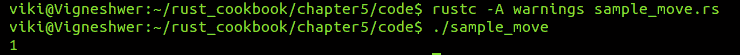

# 它是如何工作的...

在本教程中，我们使用 Rust 的标准库，即 `std::thread`，来创建一个允许 Rust 代码并行运行的 `thread`。

我们使用 `let` 关键字创建了一个名为 `x` 的变量，并将其赋值为 `1`，然后将其传递给由 `thread::spawn()` 方法创建的 `thread`。此方法接受一个闭包，它将在不同的 `thread` 中执行；它返回的结果将被收集在主或父 `thread` 的 `handle` 变量中，该变量是子 `thread` 的发起者。父或主 `thread` 等待子 `thread` 完成任务，通过将其赋值给变量，我们在 `handle` 变量中收集子 `thread` 的信息。

由于闭包具有从其环境捕获变量的能力，我们将`child` `thread`中的数据带到了父`thread`，但我们必须使用`move`闭包小心地这样做。如果你不使用`move`，你将得到编译时错误，因为默认情况下闭包通过引用捕获变量，而我们只有`x`的引用。这是一个悬垂指针的问题。`move`闭包通过将变量从其他环境移动到自身来防止这种情况。

最后，我们调用了`join()`和`unwrap()`方法来从`child` `thread`打印结果。

# 创建多个线程

这个菜谱的目的是在 Rust 中创建多个线程并执行一些简单的操作，这将帮助你理解如何在 Rust 中生成线程。我们将广泛使用标准`thread`模块和我们在上一个菜谱中学到的`move`闭包。

# 准备工作

我们将需要 Rust 编译器和任何文本编辑器来开发 Rust 代码片段。

# 如何做到这一点...

以下步骤将指导你完成此实现：

1.  创建一个名为`sample_multiple_threads.rs`的文件，并在你的文本编辑器中打开它。

1.  使用相关信息的代码头：

```rs
        //-- #########################
        //-- Task: Passing values to a thread in rust
        //-- Author: Vigneshwer.D
        //-- Version: 1.0.0
        //-- Date: 19 March 17
        //-- #########################

```

1.  使用`use`关键字调用标准`thread`库：

```rs
        use std::thread;

```

1.  定义`main`函数并声明两个变量：`x`和`handle`。将`x`赋值为整数`1`，并将`handle`赋值为新创建的`thread`，使用`thread::spawn`命令。以下是该代码示例：

```rs
        fn main() {
          thread::spawn(move || {
          println!("Hello from spawned thread");
          });

          let join_handle = thread::spawn(move || {
          println!("Hello from second spawned thread");
          17
          });

          println!("Hello from the main thread");

          match join_handle.join() {
            Ok(x) => println!("Second spawned thread returned {}", x),
            Err(_) => println!("Second spawned thread panicked")
          }
        }

```

在代码成功执行后，我们将得到以下截图作为输出：

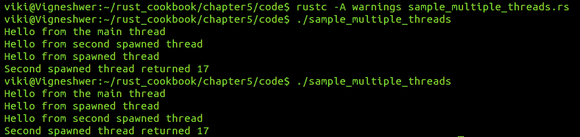

# 它是如何工作的...

在这个菜谱中，我们使用`thread` crate 的`spawn`模块创建了两个线程。第一个`thread`仅打印一条语句，但第二个`thread`除了打印外，还向主`thread`传递并返回一个值。主`thread`是用户创建的 Rust 进程，它创建了其他两个线程。

从这个菜谱中学习到最重要的点是主`thread`不会等待创建的`thread`完成，这意味着在程序退出之前，下一个`println`宏不会执行。为了确保程序等待线程完成，我们在`thread`的`join_handle`变量上调用了`join()`模块。

我们甚至通过`join_handle`将值`17`发送到不同的`thread`，就像我们在这个例子中发送到第二个`thread`一样。在代码的最后几行中，我们有`match`语句，其中我们使用`join_handle .join()`检查值`x`是否已从第二个`thread`返回。

前面的三个`println`语句可以以任何顺序观察到。

这些语句在每次执行中可能以不同的顺序出现，原因在于它们是由操作系统进行调度的。

# 在向量中保持线程

在这个菜谱中，我们将创建一个由 10 个线程组成的序列，并声明一个向量，我们将在这里存储所有的 `thread` 处理程序。稍后我们将连接主 `thread` 以确保处理程序被执行，并返回我们在创建 `thread` 时发送的值。我们将广泛使用从前两个菜谱中学到的概念。

# 准备工作

我们将需要 Rust 编译器和任何文本编辑器来开发 Rust 代码片段。

# 如何实现...

以下步骤将指导你完成此实现：

1.  创建一个名为 `sample_thread_expt.rs` 的文件，并在你的文本编辑器中打开它。

1.  编写代码头信息：

```rs
        //-- #########################
        //-- Task: Spawning 10 threads in rust
        //-- Author: Vigneshwer.D
        //-- Version: 1.0.0
        //-- Date: 19 March 17
        //-- #########################

```

1.  使用 `use` 关键字调用标准 `thread` 库，并使用 32 位整数值 `10` 创建一个名为 `NO_THREADS` 的 `static` 变量：

```rs
        // Using the standard thread crate
        use std::thread;

        // static value NO_THREADS
        static NO_THREADS: i32 = 10;

```

1.  定义 `main` 函数并声明一个空的 `thread_holder` 向量。然后创建相应的循环，将迭代值 `i` 创建的线程推送到向量中，并在稍后返回它们：

```rs
        // Main thread starts here
        fn main() {
          // Make a mutable vector named thread_holder to hold the
          threads spawned
          let mut thread_holder = vec![];

          for i in 0..NO_THREADS {
            // Spin up another thread
            thread_holder.push(thread::spawn(move || {
            println!("Thread number is {}", i);
            i
            }));
          }

        println!("***************************");

        for thread_elements in thread_holder {
          // Wait for the thread to finish. Returns a result.
          println!("Thread returned {:?}",
          thread_elements.join().unwrap()); 
        }
      }

```

在代码成功执行后，我们将得到以下截图作为输出：

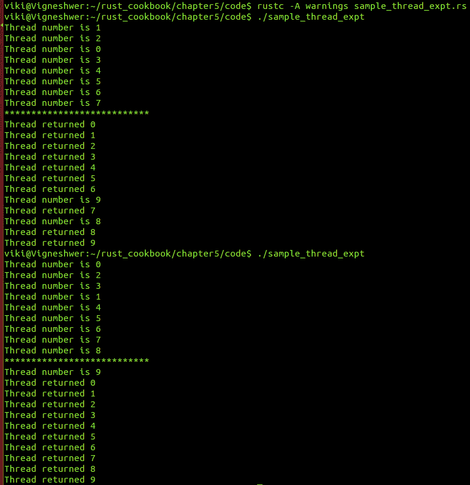

# 工作原理...

我们声明了一个名为 `NO_THREADS` 的静态变量，并将其赋值为 32 位整数值 `10`；我们还创建了一个名为 `thread_holder` 的空可变向量。

使用 `for` 循环，我们从 `0` 开始迭代，直到静态变量的上限值 `NO_THREADS`。在 `for` 循环内部，我们使用 `push` 功能将创建的线程推送到 `thread_holder` 向量中。在创建 `thread` 时，我们使用了 `move` 闭包并将迭代值 `i` 发送到新创建的 `thread`。

一旦编译器完成了所有线程创建命令，我们就开始使用 `for` 循环遍历 `thread_holder` 向量中的元素。在这种情况下，迭代变量是 `thread_elements`；我们通过这个变量调用 `join` 和 `unwrap` 函数到 `thread`。通过这种方式，我们确保所有线程都已完成，并返回到主 `thread`，在那里我们打印出之前在创建 `thread` 时发送给 `thread` 的值。

由于所有线程都是由操作系统调度的，我们无法预测线程创建的顺序以及返回的值。

# 使用通道在线程间共享数据

策略是在线程之间通过通道发送类型为`T`的信息或数据。在这里，`T`实现了`Send`特质，这表示类型`T`的变量或资源具有在线程之间安全转移所有权的功能。Rust 的这个特定功能有助于在线程之间安全地共享数据。这有助于实现更安全的并发和数据竞争自由。这里的难点在于，我们想要通过通道在线程之间发送的类型`T`必须支持并实现`Send`特质。第二个重要的特质是`Sync`。当`T`实现`Sync`时，这意味着当通过共享引用从多个线程并发使用时，这种类型的某个东西没有引入内存不安全性的可能性。这两个特质允许您使用 Rust 类型系统来编写并发代码。

# 准备工作

我们将需要 Rust 编译器和任何文本编辑器来开发 Rust 代码片段。

# 如何操作...

以下步骤将指导您完成此实现的操作：

1.  创建一个名为`sample_channel.rs`的文件，并在您的文本编辑器中打开它。

1.  编写代码头并包含相关信息：

```rs
        //-- #########################
        //-- Task: Using channels to perform safe pass of data between
        threads
        //-- Author: Vigneshwer.D
        //-- Version: 1.0.0
        //-- Date: 19 March 17
        //-- #########################

```

1.  使用`use`关键字调用标准`thread`库：

```rs
        // Using standard libraries
        use std::sync::mpsc::{Sender, Receiver};
        use std::sync::mpsc;
        use std::thread;

```

1.  创建一个名为`NO_THREADS`的静态变量，其 32 位整数值为 3：

```rs
        // Declaring number of threads
        static NO_THREADS: i32 = 3;

```

1.  定义`main`函数并声明通道的`tx`和`rx`端点：

```rs
        // Main thread starts
        fn main() {
          // Creating endpoints of the channel
          let (tx, rx): (Sender<i32>, Receiver<i32>) = mpsc::channel();

```

1.  创建一个`for`循环来创建线程并将它们发送到通道中：

```rs
        for thread_no in 0..NO_THREADS {
          // Cloing the Sender
          let thread_tx = tx.clone();

          // Sending threads via the channel
          thread::spawn(move || {
          // thread sends the message to the channel
          thread_tx.send(thread_no).unwrap();
          println!("thread {} finished", thread_id);
          });
        }

```

1.  类似地，创建另一个`for`循环来迭代并收集传递给通道的所有值：

```rs
        // Collecting all the threads
        let mut thread_holder = Vec::with_capacity(NO_THREADS as
        usize);
        for i in 0..NO_THREADS {
        // Get the message from channel
        thread_holder.push(rx.recv());
        }

        // Print the execution order
        println!("{:?}", thread_holder);
        }

```

在代码成功执行后，您将得到以下输出：

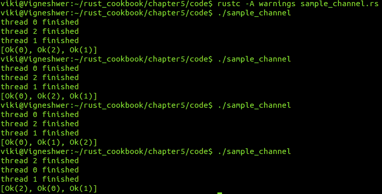

# 它是如何工作的...

在这个菜谱中，我们讨论了如何使用 Rust 的通道功能来发送类型为`T`的数据，`T`实现了安全地在线程之间发送数据所需的特质。

首先，为了开始开发通道，我们使用了`mpsc::channel()`方法来创建一个新的通道；之后，我们从端点发送了简单的数据，例如`thread_id`。在我们的情况下，端点是`tx`和`rx`，它们是通道的发送端和接收端。现在通道有两个端点，即`Sender<T>`和`Receiver<T>`，其中`T`是要传输的消息的类型。

在第一个`for`循环中，我们的重点是向通道发送数据，我们使用名为`thread_id`的变量从`0`迭代到静态变量`NO_THREADS`的值。发送端点通过`clone`方法被复制并分配给`thread_id`。每个`thread`通过在新的线程中传递`thread_id`值到`send(data).unwrap()`方法来通过通道发送其`thread_no`。`thread`接管了`thread_tx`值的所有权。每个`thread`在通道中排队一个消息，执行非阻塞操作，并在发送消息后立即继续。

在第二个 `for` 循环中，所有消息都从通道中收集。我们声明一个名为 `thread_holder` 的向量，其容量为生成的线程数，这是一个前缀静态值，称为 `NO_THREADS`。`rx` 的 `recv` 方法从通道中收集消息，并且如果没有消息可用，`recv` 会阻塞当前 `thread`。所有这些消息都使用向量的 `push` 方法推送到 `thread_holder` 向量。在最后的 `println` 语句中，我们通过打印 `thread_holder` 向量显示了消息发送的顺序。

# 实现安全可变访问

我们想要确保数据的安全和可变访问，这将允许多个线程访问资源而不会发生数据竞争。Rust 的所有权模型使得这种功能成为可能。当您有多个线程对数据进行修改时，您将学习到帮助您跟踪数据的锁。Rust 中有原子引用计数 `Arc<T>`，它在运行时将跟踪计数并允许开发者跨线程共享数据的所有权。

在这个菜谱中，我们将使用 `mutex<T>`。这允许我们在多个线程之间安全地修改共享数据值。例如，我们有数据，其中 `mutex` 将确保一次只有一个 `thread` 能够修改其内部的价值。

# 准备工作

我们将需要 Rust 编译器和任何文本编辑器来开发 Rust 代码片段。

# 如何操作...

以下步骤将引导您完成此菜谱：

1.  创建一个名为 `sample_lock.rs` 的文件，并在您的文本编辑器中打开它。

1.  编写代码头，包含相关信息：

```rs
        //-- #########################
        //-- Task: Safe Mutable access across threads for preventing
        data races
        //-- Author: Vigneshwer.D
        //-- Version: 1.0.0
        //-- Date: 19 March 17
        //-- #########################

```

1.  调用标准库：

```rs
        // Call the standard library
        use std::sync::{Arc, Mutex};
        use std::thread;
        use std::time::Duration;

```

1.  定义 `main` 函数并声明一个具有 `Arc` 类型数据和 `Mutex` 的 `data` 变量：

```rs
        // Main thread
        fn main() {
        // Declaring a Arc type data
        let data = Arc::new(Mutex::new(vec![1, 2, 3]));

```

1.  使用 `for` 循环生成多个线程，使用 `lock` 来修改数据：

```rs
        // Creating 3 threads and implementing lock
        for i in 0..3 {
          let data = data.clone();
          thread::spawn(move || {
          let mut data = data.lock().unwrap();
          data[0] += i;
          println!("Thread id :{:?}",i );
          println!("Data value :{:?}", data[0]);
          });
        }

        thread::sleep(Duration::from_millis(10));
        }

```

在代码成功执行后，您将得到以下输出：

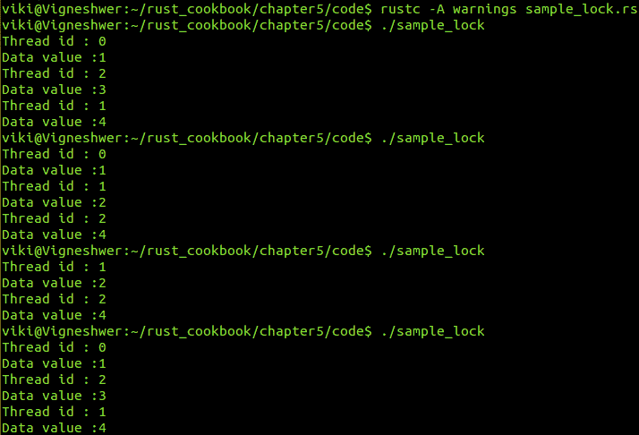

# 它是如何工作的...

我们创建了一个新的 `Mutex` 类型变量 `data`，这是我们使用标准同步库实现的。使用 `for` 循环，我们计划生成三个线程。在 `for` 循环的作用域内，我们将 `data` 克隆到相同的变量名：`data`。接下来，使用标准线程库，我们生成了三个线程，其中我们锁定了 `Mutex`。

`Mutex`（互斥的简称）允许一次只有一个 `thread` 访问一个值。如果您想访问该值，您必须使用该类型的 `lock()` 方法。这将锁定 `Mutex`，其他 `thread` 将无法解锁它；因此，没有人可以修改数据。如果一个 `thread` 尝试锁定已经锁定的 `mutex`，它将等待其他 `thread` 释放锁。

注意，`i` 的值仅复制到闭包中，而不是在线程之间共享。

锁的释放是自动的，因为当变量超出作用域时，它会自动释放，这使得它对其他线程可用。

# 创建子进程

在这个配方中，我们将从 Rust 代码调用`child`进程到外部世界，并记录其输出值。`child`进程是通过`Command`结构体创建的，该结构体配置了启动进程。通常，`child`进程是您将使用特定 shell 命令运行或启动的任何其他工具或应用程序。在 Rust 中，我们从主进程（即主要的 Rust 应用程序）启动这些`child`进程，并根据 Rust 应用程序的需求使用内置方法控制它们，这些方法允许我们读取错误、传递参数、等待进程完成、解析输出等。

# 准备工作

我们将需要 Rust 编译器和任何文本编辑器来开发 Rust 代码片段。

# 如何做到这一点...

以下步骤将指导您完成实现：

1.  创建一个名为`sample_child_process.rs`的文件，并在您的文本编辑器中打开它。

1.  编写带有相关信息的代码头：

```rs
        //-- #########################
        //-- Task: To call a child process
        //-- Author: Vigneshwer.D
        //-- Version: 1.0.0
        //-- Date: 19 March 17
        //-- #########################

```

1.  调用标准库：

```rs
        // Call the standard library
        use std::process::Command;

```

1.  定义`main`函数并声明`output`变量，该变量是执行`child`进程并获取`std:output`的`Command`实现：

```rs
        // Main execution of the code
        fn main() {
          // Command to be executed
          let output = Command::new("rustc")
          .arg("--version")
          .output().unwrap_or_else(|e| {
          panic!("failed to execute process: {}", e)
          });

```

1.  根据`output`响应打印出`s`变量的字符串值，使用`if...else`语句：

```rs
        // printing the output values
        if output.status.success() {
          let s = String::from_utf8_lossy(&output.stdout);

          print!("rustc succeeded and stdout was:n{}", s);
        } 
        else {
          let s = String::from_utf8_lossy(&output.stderr);

          print!("rustc failed and stderr was:n{}", s);
        }
        }

```

在代码成功执行后，您将得到以下输出：

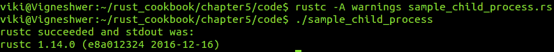

# 它是如何工作的...

通过`Command`结构体创建了一个`child`进程，该结构体负责启动进程。在这里，我们声明了一个名为`output`的变量，我们在这里调用了`new`方法。这是我们输入要运行的主要命令的地方。接下来，我们有`arg`，它包含特定系统命令的选项。`output`响应负责获取输出和其他用于错误处理的命令。

`struct` `child`基本上有三个字段：`pub stdin: Option<ChildStdin>`，`pub stdout: Option<ChildStdout>`，和`pub stderr: Option<ChildStderr>`。这些字段分别处理标准输入、输出和错误等表示功能。

在`if...else`语句中，我们基本上检查了`Command`是否正确执行，使用`status`模块的`success`方法，在成功时返回`True`，否则返回`False`。在两种情况下，我们都捕获了错误和输出，并通过`&output.stdout`和`&output.stderr`打印出来。

# 等待子进程

通常，我们希望在主线程等待`child`进程完成后再继续执行主`thread`。

在这个配方中，我们将学习如何使用`wait`方法获取`child`进程的状态。

# 准备工作

我们将需要 Rust 编译器和任何文本编辑器来开发 Rust 代码片段。

# 如何做到这一点...

以下步骤将指导您完成配方：

1.  创建一个名为`sample_wait.rs`的文件，并在你的文本编辑器中打开它。

1.  使用相关信息的代码头编写代码：

```rs
        //-- #########################
        //-- Task: Waiting for a child process
        //-- Author: Vigneshwer.D
        //-- Version: 1.0.0
        //-- Date: 19 March 17
        //-- #########################

```

1.  调用标准库：

```rs
        // Calling the standard libraries
        use std::process::Command;

```

1.  定义`main`函数并使用`Command`结构体创建一个`child`进程：

```rs
        // Main execution starts here
        fn main() {
          // Creating a child process
          let mut child =
          Command::new("sleep").arg("5").spawn().unwrap();

```

1.  创建一个名为`_result`的变量并调用`wait`方法，最后的打印语句，标记程序的结束：

```rs
        // Waiting for the child process to complete
        let _result = child.wait().unwrap();

        // printing the status of child process
        print!("Status if child process {} \n", _result);
        // Marking the end of the main function 
        println!("reached end of main");
        }

```

在代码成功执行后，你将得到以下输出：

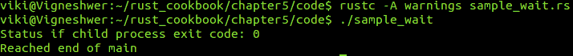

# 它是如何工作的...

在这个菜谱中，我们在一个名为`child`的变量中调用了`Command`结构体来创建`child`进程，这是一个带有`5`参数的`sleep`语句。这使得程序休眠或等待五秒钟。

调用`wait`函数将使父进程或主进程等待`child`进程实际退出后再继续执行主进程的其他语句。可变的`child`等待函数等待命令完全退出，并将退出状态返回给`_result`变量。

最后，我们打印了`child`进程的状态，并标记了主`thread`的结束。

# 将顺序代码并行化

在这里，你将了解`rayon`，这是 Rust 中的一个外部包，其主要目的是使你的顺序代码并行化。`rayon`的最好之处在于，它保证你`rayon`的 API 不会引入任何并发错误，例如数据竞争。在这个菜谱中，你将了解 rayon 的并行迭代器，它们并行执行迭代语句。

# 准备就绪

按照以下步骤在你的项目中下载和设置`rayon`包：

1.  我们将需要 Rust 编译器和任何文本编辑器来开发 Rust 代码`snippet.cargo`。

1.  使用以下命令创建一个名为`sample_rayon`的新 Cargo 项目：

```rs
 cargo new sample_rayon --bin

```

你将得到以下截图作为输出：

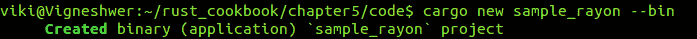

1.  进入新创建的`sample_rayon`项目并检查结构是否创建正确：

```rs
 cd sample_rayon/ && tree .

```

你将得到以下输出：

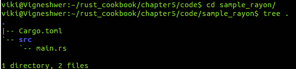

1.  打开`Cargo.toml`文件，使用以下命令下载`rayon`包：

```rs
 nano Cargo.toml

```

1.  在依赖项标签中输入以下值：

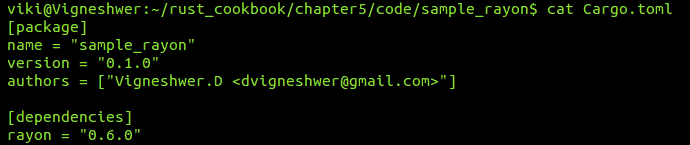

1.  再次构建项目以下载`rayon`包：

```rs
 cargo build

```

你将得到以下截图作为输出：

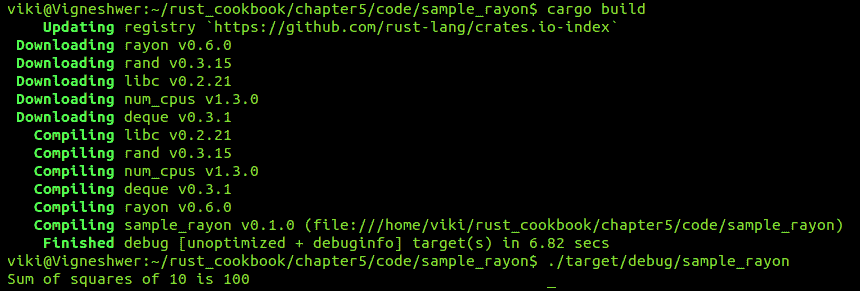

1.  检查文件结构以查看已安装的依赖项：

```rs
 ls && tree .

```

你将得到以下截图作为输出：

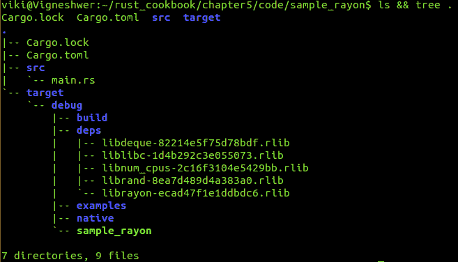

# 如何做...

以下步骤将指导你完成实现：

1.  创建一个名为`sample_rayon.rs`的文件，并在你的文本编辑器中打开它。

1.  使用相关信息的代码头编写代码：

```rs
        //-- #########################
        //-- Task: Making sequential code parallel
        //-- Author: Vigneshwer.D
        //-- Version: 1.0.0
        //-- Date: 19 March 17
        //-- #########################

```

1.  调用在*准备就绪*部分开发的名为`rayon`的外部库：

```rs
        // Calling the rayon crate
        extern crate rayon;
        use rayon::prelude::*;

```

1.  定义一个名为`sum_of_squares`的函数，并接受一个类型为`i32`的变量`input`：

```rs
        // Sum of squares function
        fn sum_of_squares(input: &[i32]) -> i32 {
          input.par_iter()
          .map(|&i| i * i)
          .sum()
        }

```

1.  定义 `main` 函数，我们将在这里创建 `rand_val` 并将其值 `10` 赋予它，然后将其传递给 `sum_of_square` 函数：

```rs
        // Main execution of code
        fn main() {
          // Declaring a random variable of 10
          let rand_val = 10;
          // Calling the method to get sum_of_squares
          let sum_sq = sum_of_squares(&[rand_val]);
          // Printing the result
          println!("Sum of squares of {0} is {1}",rand_val,sum_sq);
        }

```

在代码成功执行后，你将得到以下截图：

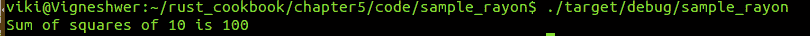

# 它是如何工作的...

由于 `rayon` 是一个外部包，我们首先使用 Cargo 工具从 [crates.io](http://crates.io) 仓库站点下载它。我们使用了 `rayon` 的最新版本，即 `0.6.0`。`rayon` 目前需要 rustc 1.12.0，并在 [crates.io](http://crates.io) 中可用。注意，`rayon` 是一个实验性包。

`rayon` 拥有一个名为并行迭代器的 API，它允许我们编写迭代器过程并在并行中执行它们。我们使用并行迭代器实现了 `sum_of_squares` 函数。要使用并行迭代器，我们首先通过调用 `use rayon::prelude::*` 到我们的 Rust 模块中来导入 traits。然后我们调用 `par_iter` 来获取一个并行迭代器，它类似于一个常规迭代器。并行迭代器通过首先构建一个计算然后执行它来工作；`input` 是 `sum_of_squares` 函数的参数，它返回一个整数值输出。我们使用 `map` 和 `sum` 方法执行了数学运算。

在 `main` 函数中，我们创建了一个名为 `rand_var` 的变量，并将其值 `10` 赋予它，我们将这个值作为参数传递给 `sum_of_squares` 函数。返回值存储在 `sum_sq` 变量中并打印出来。
