# 第六章：高效的错误处理

在本章中，我们将介绍以下食谱：

+   实现 panic

+   实现 Option

+   创建 map 组合器

+   创建 and_then 组合器

+   为 Result 类型创建 map

+   实现别名

+   处理多个错误

+   实现早期返回

+   实现 try!宏

+   定义自己的错误类型

+   实现错误装箱

# 简介

错误处理是所有编程语言的基本部分。它是开发者通过注意到并管理可能导致应用程序失败的错误来为最坏的情况做准备的方式。这些错误条件可能由于各种原因而发生，例如在运行时提供的错误输入等。在本章中，我们将介绍使用 Rust 高效处理错误的各种方法。我们还将检查标准库，它有助于避免问题情况，从而避免 Rust 应用程序的完全失败。

# 实现 panic

Panic 是 Rust 提供的最简单的错误处理机制。它打印给它的错误消息，开始回滚任务，并通常退出程序执行。在本食谱中，我们将明确调用一个`panic`语句来面对不期望的情况。

# 准备工作

我们将需要 Rust 编译器和任何文本编辑器来开发 Rust 代码片段。

# 如何做...

按照以下步骤完成此食谱：

1.  创建一个名为`sample_panic.rs`的文件，并在您的文本编辑器中打开它。

1.  编写代码头，包含相关信息：

```rs
        //-- #########################
        //-- Task: Implementing panic 
        //-- Author: Vigneshwer.D
        //-- Version: 1.0.0
        //-- Date: 26 March 17
        //-- #########################

```

1.  创建`compare_stmt`函数；它接受一个字符串输入：

```rs
        // function which checks if the strings are same or not
        fn compare_stmt(stmt: &str) {
          // Check if the statements are same or not 
          if stmt == "Another book" { 
            panic!("Rust Cookbook is not selected!!!!"); 
          }

          println!("Statements is {}!!!!!", stmt);
        }

```

1.  定义`main`函数；它使用不同的输入调用`compare_stmt`函数：

```rs
        // Execution starts here
        fn main() {
         compare_stmt("Rust Cookbook");
         compare_stmt("Another book");
        }

```

当代码成功执行时，您将得到以下输出：

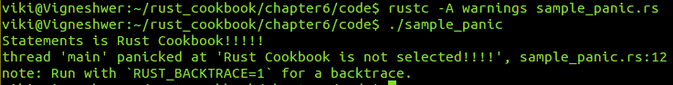

# 它是如何工作的...

我们有一个名为`compare_stmt`的函数，它接受一个`str`变量作为参数，并将其分配给它作用域中的名为`input`的变量。然后它检查字符串值是否为`Another Book`。如果是，它调用`panic!`函数；否则，它打印传递的值。我们从主函数传递了两个值：`Rust CookBook`和`Another Book`。

当我们运行前面的程序时，第一个输入将失败`if`条件，不会调用 panic，因此打印语句正常工作。然而，对于满足`if`条件的第二个输入，panic 被调用，并返回`thread 'main' panicked at 'Rust Cookbook is not selected!!!!', sample_panic.rs:12`并退出程序。

# 实现 Option

Panic 处理已识别的不期望输入的情况，但它不处理零输入。为此，我们有`Option<T>`类型，这是一个来自标准库的`enum`，您可以使用它来处理没有输入的情况。在本食谱中，您将学习如何使用 Options 以不同的方式处理零输入情况。

# 准备工作

我们将需要 Rust 编译器和任何文本编辑器来开发 Rust 代码片段。

# 如何操作...

按照以下步骤完成此菜谱：

1.  创建一个名为`sample_option.rs`的文件，并在您的文本编辑器中打开它。

1.  编写代码头，包含相关信息：

```rs
        //-- #########################
        //-- Task: Implementing Option
        //-- Author: Vigneshwer.D
        //-- Version: 1.0.0
        //-- Date: 26 March 17
        //-- #########################

```

1.  创建`compare_stmt_match`函数；它接受`Option<&str>`类型的`input`字符串：

```rs
        // All arguments are handled explicitly using `match`.
        fn compare_stmt_match(input: Option<&str>) {
          // Specify a course of action for each case.
          match input {
            Some("Rust CookBook") => println!("Rust CookBook 
            was selected"),
            Some(inner) => println!("Rust CookBook not
            selected"),
            None => println!("No input provided"),
          }
        }

```

1.  类似地，创建`compare_stmt_unwrap`函数；它也接受`Option<&str>`类型的`input`字符串：

```rs
        // All arguments are handled implicitly using `unwrap`.
        fn compare_stmt_unwrap(input: Option<&str>) {
          // `unwrap` returns a `panic` when it receives a
          `None`     value
          let inside_val = input.unwrap();
          if inside_val == "Another Book" { panic!("Rust
          CookBook is not selected"); }

          println!("I love {}s!!!!!", inside_val);
        }

```

1.  定义`main`函数；它使用不同的输入调用两个函数：

```rs
        // main execution starts here
        fn main() {
          let Desired_Book = Some("Rust CookBook");
          let Another_Book = Some("Another Book");
          let Empty_value = None;

          compare_stmt_match(Desired_Book);
          compare_stmt_match(Another_Book);
          compare_stmt_match(Empty_value);

          println!("*********************");

          let Rand_Book = Some("Random Book");
          let No_val = None;

          compare_stmt_unwrap(Rand_Book);
          compare_stmt_unwrap(No_val);
        }

```

成功执行代码后，您将得到以下输出：

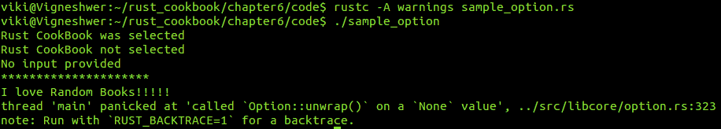

# 它是如何工作的...

在前面的菜谱中，我们知道在输入不期望的情况下，我们必须使用`panic!`退出程序，但在这个菜谱中我们试图解决的主要问题是处理`None`输入的方式。我们使用 Rust 标准库来解决这个问题。更具体地说，我们使用来自`std`库的名为`Option<T>`的`enum`，它在没有输入时使用：

```rs
        enum Option<T> {
          None,
          Some(T),
        }

```

它有两个选项，即：

+   `Some(T)`：这是发送的类型`T`的元素

+   `None`：这指的是没有输入的情况

我们以两种方式处理这些情况：使用`match`的显式处理方式和使用`unwrap`的隐式处理方式。隐式处理方式返回`enum`或`panic!`的内部元素。

在显式处理方式中，我们在`main`函数中声明了三个变量，分别是`Desired_Book`、`Another_Book`和`Empty_value`。我们分别将它们赋值为书名，即`Rust Cookbook`、`Another Book`和`None`。之后，我们以以下方式调用函数：

+   `compare_stmt_match(Desired_Book)`：这满足了`match`语句条件`Some("Rust CookBook")`以打印`Rust CookBook was selected`

+   `compare_stmt_match(Another_Book)`：这满足了`match`语句条件`Some(inner)`以打印`"Rust CookBook not selected"`

+   `compare_stmt_match(Empty_val)`：这满足了`match`语句条件`None`以打印`No input provided`

在隐式处理中，我们使用`Some("Random Book")`和`None`的值创建了`Rand_Book`和`No_val`。我们调用另一个函数来处理`Some(T)`和`None`值。`compare_stmt_unwrap(Rand_Book)`使用`unwrap`获取`inside_val`，成功调用了打印语句；在第二次函数调用`compare_stmt_unwrap(No_val)`时，我们得到了`thread 'main' panicked at 'called `Option::unwrap()` on a `None` value', ../src/libcore/option.rs:323`。这是因为`unwrap`在内部值为`None`时返回 panic。

# 创建映射组合器

在这个菜谱中，我们将学习 map 组合子，它再次是一个用于处理`Option`类型的组合子。`Option`有一个内置的 map 方法，用于简单地将`Some(T)`映射到另一个有效类型；它也可以处理 none 值的映射。`map`是一个处理`None`情况输入的好方法。它还简化了代码，因为它可以被多次使用。组合子通常是一阶函数，它们只应用之前定义的函数和组合子，从它们的参数中提供结果。它们通常用于以模块化的方式控制应用程序中的流程。

# 准备就绪

我们需要 Rust 编译器和任何文本编辑器来开发 Rust 代码片段。

# 如何做...

按照以下步骤完成这个菜谱：

1.  创建一个名为`sample_map.rs`的文件，并在您的文本编辑器中打开它。

1.  编写带有相关信息的代码头：

```rs
        //-- #########################
        //-- Task: Implementing map 
        //-- Author: Vigneshwer.D
        //-- Version: 1.0.0
        //-- Date: 26 March 17
        //-- #########################

```

1.  创建一个用户定义的数据类型来使用程序：

```rs
        #![allow(dead_code)]

        #[derive(Debug)] enum Food { Apple, Carrot, Potato }

        #[derive(Debug)] struct Peeled(Food);
        #[derive(Debug)] struct Chopped(Food);
        #[derive(Debug)] struct Cooked(Food);

```

1.  定义`peel`函数；它接受`Option<Food>`类型的输入并返回`Option<Peeled>`：

```rs
        fn peel(food: Option<Food>) -> Option<Peeled> {
          match food {
            Some(food) => Some(Peeled(food)),
            None => None,
          }
        }

```

1.  定义`chop`函数；它接受`Option<Peeled>`类型的输入并返回`Option<Chopped>`：

```rs
        fn chop(peeled: Option<Peeled>) -> Option<Chopped> {
          match peeled {
            Some(Peeled(food)) => Some(Chopped(food)),
            None => None,
          }
        }

```

1.  定义`cook`函数；它接受`Option<Chopped>`类型的输入并返回`Option<Cooked>`：

```rs
        fn cook(chopped: Option<Chopped>) -> Option<Cooked> {
          chopped.map(|Chopped(food)| Cooked(food))
        }

```

1.  定义`process`函数；它接受`Option<Food>`类型的输入并返回`Option<Cooked>`：

```rs
        fn process(food: Option<Food>) -> Option<Cooked> {
          food.map(|f| Peeled(f))
          .map(|Peeled(f)| Chopped(f))
          .map(|Chopped(f)| Cooked(f))
        }

```

1.  定义`eat`函数；它接受`Option<Cooked>`类型的输入：

```rs
        fn eat(food: Option<Cooked>) {
          match food {
            Some(food) => println!("Mmm. I love {:?}", food),
            None => println!("Oh no! It wasn't edible."),
          }
        }

```

1.  定义`main`函数，在那里我们可以创建不同类型的输入来理解 map 组合子的工作：

```rs
        fn main() {
          let apple = Some(Food::Apple);
          let carrot = Some(Food::Carrot);
          let potato = None;

          let cooked_apple = cook(chop(peel(apple)));
          let cooked_carrot = cook(chop(peel(carrot)));
          let cooked_potato = process(potato);

          eat(cooked_apple);
          eat(cooked_carrot);
          eat(cooked_potato);
        }

```

在代码成功执行后，您将得到以下输出：

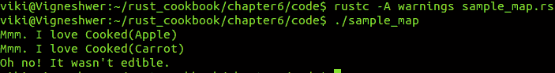

# 它是如何工作的...

我们首先创建了一个名为`Food`的`enum`类型，它有数据元素，即`Apple`、`Carrot`和`Potato`。然后我们创建了三个具有用户定义数据类型的`struct`，即`Peeled`、`Chopped`和`Cooked`，其中`Food`作为数据字段。在`main`函数中，我们创建了三个变量并将它们分配给`Option`数据的值，其中`apple`的值为`Food::Apple`，`carrot`为`Food::Carrot`，`potato`为`None`。

现在我们来看看我们的函数单元对不同输入的反应：

+   `peel`：这个函数接收一个包含字段`enum`类型`Food`以及数据的`Option`类型，并返回一个`struct`数据类型`Peeled`的`Option`。在这里，我们使用`match`函数来改变类型。

+   `chop`：这个函数接收一个包含字段`enum`类型`Peeled`以及数据的`Option`类型，并返回一个`struct`数据类型`Chopped`的`Option`。在这里，我们使用`match`函数来改变类型。

+   `cook`：这个函数接收一个包含字段`enum`类型`Chopped`以及数据的`Option`类型，并返回一个`struct`数据类型`Cooked`的`Option`。在这里，我们使用`map`函数来改变类型，我们将输入类型放在两个管道符号之间，将它们转换为所需的形式。

+   `process`：我们不是使用三个函数来改变类型，而是多次使用 `map` 来直接将 `Option<Food>` 转换为 `Option<Cooked>`，其中每个 `map` 函数依次通过这个过程将类型转换为所需的形式，通过多次使用 `map()`，我们可以按顺序剥皮、切和烹饪 `food` 类型，从而简化代码。

+   `eat`：这个函数接受 `Option<Cooked>` 类型作为输入参数，并使用 `match` 语句进行检查。如果传递给 `match` 语句的 `food` 参数存在有效类型，则第一个情况 `some(food)` 为真，然后它会打印出 `print` 语句中的 `food` 参数的值，否则在 `None` 情况下，它会打印一个默认语句。

在 `main` 函数中，我们声明了 `cooked_apple` 并将 `chop(peel(apple))` 调用的返回值赋给它。由于我们没有传递 `None` 输入，这应该返回数据源中的 `Cooked(apple)` 类型。同样，`cooked_carrot` 有 `Cooked(carrot)` 的值；然而，对于 `cooked_potato`，我们调用了 `process` 函数，它返回了 `None`。后来，当我们调用 `eat` 函数时，只有具有 `Cooked` `struct` 值的变量被打印为 `MM. I Love` 语句，而具有 `None` 的变量则打印为 `Oh No!` 语句。

# 创建 and_then 组合器

`map` 的问题在于，当我们有太多函数返回 `map` 时，它可能会变得令人困惑。这是因为结果将嵌套在 `Option<Option<T>>` 格式中，在多次调用 `map` 组合器时，这会变得复杂且令人困惑。

Rust 提供了另一个组合器，即 `and_then()`，它通过仅返回结果来解决上述问题。它是通过将链式结果展平为单个类型来实现的。在这个菜谱中，你将详细了解如何使用这个组合器。

# 准备工作

我们将需要 Rust 编译器和任何文本编辑器来开发 Rust 代码片段。

# 如何做到这一点...

按照以下步骤完成这个菜谱：

1.  创建一个名为 `sample_and_then.rs` 的文件，并在你的文本编辑器中打开它。

1.  编写带有相关信息的代码头：

```rs
        //-- #########################
        //-- Task: Implementing and_then 
        //-- Author: Vigneshwer.D
        //-- Version: 1.0.0
        //-- Date: 26 March 17
        //-- #########################

```

1.  创建名为 `Food` 和 `Day` 的 `enum` 类型：

```rs
        #![allow(dead_code)]

        #[derive(Debug)] enum Food { CordonBleu, Steak, Sushi}
        #[derive(Debug)] enum Day { Monday, Tuesday, Wednesday}

```

1.  定义一个名为 `have_ingredients` 的函数，它将接受 `Food` 类型作为输入参数并返回 `Option<Food>`：

```rs
        fn have_ingredients(food: Food) -> Option<Food> {
          match food {
            Food::Sushi => None,
            _ => Some(food),
          }
        }

```

1.  定义一个名为 `have_recipe` 的函数，它将接受 `Food` 类型作为输入参数并返回 `Option<Food>`：

```rs
        fn have_recipe(food: Food) -> Option<Food> {
          match food {
            Food::CordonBleu => None,
            _ => Some(food),
          }
        }

```

1.  定义一个名为 `cookable` 的函数，它将接受 `Food` 类型作为输入参数并返回 `Option<Food>`：

```rs
        fn cookable(food: Food) -> Option<Food> {
          have_ingredients(food).and_then(have_recipe)
        }

```

1.  定义一个名为 `eat` 的函数，它将接受 `Food` 类型作为输入参数并返回 `Day`：

```rs
        fn eat(food: Food, day: Day) {
          match cookable(food) {
            Some(food) => println!("Yay! On {:?} we get to eat
            {:?}.", day, food),
            None => println!("Oh no. We don't get to eat on 
            {:?}?", day),
          }
        }

```

1.  定义 `main` 函数；它将初始化并调用所有函数：

```rs
        fn main() {
          let (cordon_bleu, steak, sushi) = (Food::CordonBleu,
          Food::Steak, Food::Sushi);

          eat(cordon_bleu, Day::Monday);
          eat(steak, Day::Tuesday);
          eat(sushi, Day::Wednesday);
        }

```

在代码成功执行后，你将得到以下输出：

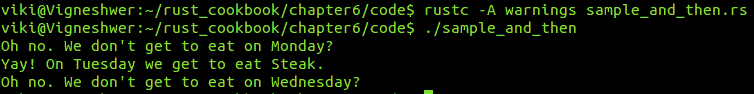

# 它是如何工作的...

我们声明了两个`enum`类型，即`Food`和`Day`，其中包含以下元素：`CordonBleu`、`Steak`和`Sushi`以及`Monday`、`Tuesday`和`Wednesday`。

现在我们来看看我们的函数单元如何对不同输入做出反应：

+   `have_ingredients`：这个函数接受`enum`输入`Food`并返回`Option<Food>`。在其`match`语句中有一个情况，表示`Food`是否有值`Sushi`，如果是，则返回`None`；对于所有其他值，它返回相同的`Food`值。

+   `have_recipe`：这个函数接受`enum`输入`Food`并返回`Option<Food>`。在其`match`语句中有一个情况，表示`Food`是否有值`CordonBleu`，如果是，则返回`None`；对于所有其他值，它返回相同的`Food`值。

+   `cookable`：这个函数接受`enum`输入`Food`并返回`Option<Food>`。在这里，我们使用`and_then`组合器来检查`have_ingredients`和`have_recipe`函数，以确认`Food`类型将通过这些情况。

+   `eat`：这个函数接受`enum`输入`Food`和`Day`，并将`Food`值发送到`cookable`函数。在这里，我们有一个`match`语句，当`cookable`函数返回`Some(Food)`时，它会打印出日期和`Food`类型。

我们观察到，为了让`cookable`返回一个值，我们需要`have_ingredients`和`have_recipe`函数都返回`Some(Food)`，这只有在`Steak`的情况下才会发生。在`main`函数中，我们用`Food`和`Day`的所有值调用了`eat`函数。

# 为`Result`类型创建映射

`Result`类型与`Option`类型相似，但它提供了更多功能，因为它还描述了可能的错误。这意味着我们将有两种结果：一种是找到所需元素的情况，另一种是可能找到元素错误的情况。在这个菜谱中，我们将使用`Result`的`map`方法来返回特定的错误。

# 准备工作

我们将需要 Rust 编译器和任何文本编辑器来开发 Rust 代码片段。

# 如何做到这一点...

按照以下步骤完成这个菜谱：

1.  创建一个名为`sample_map_result.rs`的文件，并在你的文本编辑器中打开它。

1.  使用相关信息的代码头：

```rs
        //-- #########################
        //-- Task: Implementing map for Result 
        //-- Author: Vigneshwer.D
        //-- Version: 1.0.0
        //-- Date: 26 March 17
        //-- #########################

```

1.  调用标准库：

```rs
 use std::num::ParseIntError;

```

1.  创建一个名为`double_number`的函数，它将接受`str`输入并返回`Result<T>`类型：

```rs
        fn double_number(number_str: &str) -> Result<i32,
        ParseIntError> {
          match number_str.parse::<i32>() {
            Ok(n) => Ok(2 * n),
            Err(e) => Err(e),
          }
        }

```

1.  创建一个名为`double_number_map`的函数，它将接受`str`输入并返回`Result<T>`类型：

```rs
        fn double_number_map(number_str: &str) -> Result<i32,
        ParseIntError> {
          number_str.parse::<i32>().map(|n| 2 * n)
        }

```

1.  创建一个名为`print`的函数，它将接受`Result<T>`类型作为输入：

```rs
        fn print(result: Result<i32, ParseIntError>) {
          match result {
          Ok(n) => println!("n is {}", n),
          Err(e) => println!("Error: {}", e),
          }
        }

```

1.  定义`main`函数并为不同的函数声明不同的输入：

```rs
        fn main() {
          // This still presents a reasonable answer.
          let twenty = double_number("10");
          print(twenty);

          // The following now provides a much more helpful
          error message.
          let tt = double_number_map("t");
          print(tt);
        }

```

在代码成功执行后，你会得到以下输出：

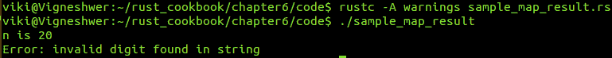

# 它是如何工作的...

潜在错误只提供了一个错误消息，这对于更具体地说明返回类型和错误没有太大帮助。我们有 `Result` 类型，它与 Options 类似，但也可以用来提及错误类型。在这个菜谱中，我们使用了 Rust 的 map 方法来获取特定的错误类型。

首先，我们调用了标准库的错误类型 `ParseIntError`，我们按照 `Result` 类型的要求使用它来返回错误类型。

让我们来看看代码中的不同功能单元：

+   `print`: 这个函数接收一个 `Result<i32, ParseIntError>` 类型的输入，并根据其值，即它是否为 `Ok` 或 `Err`，打印相应的语句。

+   `double_number_map`: 这个函数接收一个 `str` 类型的输入，并返回 `Result<i32, ParseIntError>`。它将字符串解析为值，如果是有效的整数，我们使用 `map` 函数将输入值乘以 2；否则，我们得到 `Err` 情况。

+   `double_number`: 这个函数接收一个 `str` 类型的输入，并返回 `Result<i32, ParseIntError>`，其中包含一个 `match` 语句，它将字符串解析为值。如果是有效的整数，它满足 `Ok` 情况，并且值被乘以两倍；如果发生 `Err` 情况。

+   `print`: 这个函数接收 `Result<i32, ParseIntError>` 类型的输入；使用 `match` 语句，我们检查是否有 `Ok` 或 `Err` 情况以打印相应的语句。

在 `main` 函数中，我们有两个变量，即 `twenty` 和 `tt`，分别被分配给 `double_number("10")` 和 `double_number_map("t")`。当我们为 `twenty` 调用 `double_number` 函数时，它返回一个整数值，但 `double_number_map` 为 `t` 返回了一个错误。打印语句打印了这些 `Result` 类型变量的最终值。如果将字符串传递给无法解析为整数的 `double_number` 方法，将导致 `ParseIntError`，而对于字符串类型的有效整数参数，`double_number_map` 将将其值加倍。

# 实现别名

我们使用别名是为了多次重用特定的类型。Rust 允许我们创建 `Result` 类型的别名以及更多类型，以便在整个程序中重用它们。在模块级别，这非常有用，因为我们可以从模块的单元/项中识别出类似类型的错误和错误。

# 准备工作

我们将需要 Rust 编译器和任何文本编辑器来开发 Rust 代码片段。

# 如何操作...

按照以下步骤完成这个菜谱：

1.  创建一个名为 `sample_aliases_result.rs` 的文件，并在你的文本编辑器中打开它。

1.  编写代码头部，包含相关信息：

```rs
        //-- #########################
        //-- Task: Implementing aliases 
        //-- Author: Vigneshwer.D
        //-- Version: 1.0.0
        //-- Date: 26 March 17
        //-- #########################

```

1.  调用标准库：

```rs
 use std::num::ParseIntError;

```

1.  定义一个名为 `AliasedResult<T>` 的泛型别名，用于 `Result` 类型：

```rs
        type AliasedResult<T> = Result<T, ParseIntError>;

```

1.  创建一个名为 `double_number` 的函数，它将接受 `str` 类型的输入并返回 `AliasedResult<i32>` 类型的输出：

```rs
        fn double_number(number_str: &str) -> AliasedResult<i32> {
         number_str.parse::<i32>().map(|n| 2 * n)
        }

```

1.  创建一个名为 `print` 的函数，它将接受 `AliasedResult<i32>` 类型的输入：

```rs
        fn print(result: AliasedResult<i32>) {
         match result {
         Ok(n) => println!("n is {}", n),
         Err(e) => println!("Error: {}", e),
         }
        }

```

1.  定义 `main` 函数并调用不同的函数：

```rs
        fn main() {
         print(double_number("10"));
         print(double_number("t"));
        }

```

在代码成功执行后，您将得到以下输出：

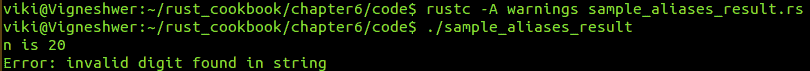

# 它是如何工作的...

别名以相当简单的方式工作。其主要作用是简化特定类型的用法，并在不同模块中维护不同类型。

在本食谱中，我们使用 `type` 关键字为 `Result<T, ParseIntError>` 创建了一个别名 `AliasedResult<T>`；我们将其用作代码所有单元的类型。

让我们逐一了解代码的不同功能单元：

+   `double_number`：此函数接受 `str` 输入并返回 `AliasedResult<T>`。它将字符串解析为值，如果它是一个有效的整数，我们使用 `map` 函数将输入值乘以 2；否则，我们有 `Err` 情况。

+   `print`：此函数接受 `AliasedResult<T>` 作为输入，并使用 `match` 语句检查我们是否有 `Ok` 或 `Err` 情况以打印相应的语句。

在 `main` 函数中，我们调用了 `print(double_number("10"))`，由于输入有效，它打印了 `Ok` 情况语句，但 `print(double_number("t"))` 由于输入无效而返回了一个错误。

# 处理多个错误

在之前的食谱中，我们看到了并开发了错误处理单元，其中 Results 与其他 Results 交互，而 Options 与其他 Options 交互。然而，我们有一些需要 `Option` 类型与 `Result` 或 `Result<T, Error_1>` 类型与 `Result<T, Error_2>` 之间交互的情况。在本食谱中，您将学习如何构建管理不同错误类型的单元，并使它们相互交互；我们将使用我们对组合子的知识来实现这一点。

# 准备工作

我们将需要 Rust 编译器和任何文本编辑器来开发 Rust 代码片段。

# 如何做到这一点...

按照以下步骤完成这个食谱：

1.  创建一个名为 `sample_multiple_err.rs` 的文件，并在您的文本编辑器中打开它。

1.  编写带有相关信息的代码头：

```rs
        //-- #########################
        //-- Task: Handling multiple errors
        //-- Author: Vigneshwer.D
        //-- Version: 1.0.0
        //-- Date: 26 March 17
        //-- #########################

```

1.  定义一个名为 `Result<T>` 的泛型别名，用于 `std::result::Result<T, String>` 类型：

```rs
        type Result<T> = std::result::Result<T, String>;

```

1.  创建一个名为 `double_first` 的函数，它将接受 `Vec` 输入并返回 `Result<i32>` 类型：

```rs
        fn double_first(vec: Vec<&str>) -> Result<i32> {
          vec.first()
          .ok_or("Please use a vector with at least one
          element.".to_owned())
          .and_then(|s| s.parse::<i32>()
          .map_err(|e| e.to_string())
          .map(|i| 2 * i))
        }

```

1.  创建一个名为 `print` 的函数，它将接受 `Result<i32>` 类型作为输入：

```rs
        fn print(result: Result<i32>) {
          match result {
            Ok(n) => println!("The first doubled is {}", n),
            Err(e) => println!("Error: {}", e),
          }
        }

```

1.  定义 `main` 函数并调用不同的函数：

```rs
        fn main() {
          let empty = vec![];
          let strings = vec!["tofu", "93", "18"];

          print(double_first(empty));
          print(double_first(strings));
        }

```

在代码成功执行后，您将得到以下输出：

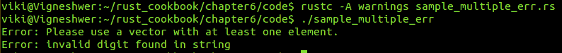

# 它是如何工作的...

在之前的食谱中，我们处理了具有相似类型的情况，例如 Results 和 Options 与其他 Results 和 Options 交互。在本食谱中，我们处理了跨类型的情况，例如 Options 与 Results 的交互。我们利用之前的组合子经验来实现这一点。

首先，我们使用 `type` 关键字为 `std::result::Result<T, String>` 创建了一个别名 `Result<T>`，我们将在代码的功能单元中使用它。

让我们检查所有功能单元的工作情况：

+   `double_first`: 这个函数接收 `vec` 输入并返回 `Result<T>`。在我们的例子中，它使用 `vec.first` 方法获取发送给它的向量的第一个值。如果没有提供值，它将进入 `ok_or`，它会打印出要求用户至少向向量中输入一个值的语句。接下来，它检查我们是否能够将字符串值解析为有效的整数值。如果这成功了，它允许我们使用 map 函数将其乘以 2 来加倍；否则，它将错误值映射到字符串等效值。

+   `print`: 这个函数接收 `Result<T>` 类型的参数，并使用 `match` 语句检查是否有 `Ok` 或 `Err` 情况以便打印相应的语句。

在 `main` 函数中，我们有向量。其中一个是 `empty`（向量为空），另一个是 `string`（向量中只有字符串值）。当我们用这些输入值调用 `double_first` 函数时，我们会得到相应的错误。

# 实现早期返回

处理不同错误的一种另一种方法是结合使用 `match` 和早期 `return` 语句。这就是我们通过返回错误来显式处理错误的地方，我们这样做而没有停止执行，就像在 panic 的情况下一样。

# 准备工作

我们将需要 Rust 编译器和任何文本编辑器来开发 Rust 代码片段。

# 如何做到这一点...

按照以下步骤完成这个菜谱：

1.  创建一个名为 `sample_early_ret.rs` 的文件，并在你的文本编辑器中打开它。

1.  编写带有相关信息的代码头：

```rs
        //-- #########################
        //-- Task: Implementing early returns
        //-- Author: Vigneshwer.D
        //-- Version: 1.0.0
        //-- Date: 26 March 17
        //-- #########################

```

1.  定义一个名为 `Result<T>` 的泛型别名，对应于 `std::result::Result<T, String>` 类型：

```rs
        type Result<T> = std::result::Result<T, String>;

```

1.  创建一个名为 `double_first` 的函数，它将接受 `Vec` 输入并返回 `Result<i32>` 类型：

```rs
        fn double_first(vec: Vec<&str>) -> Result<i32> {
          let first = match vec.first() {
            Some(first) => first,
            None => return Err("Please use a vector with at
            least
            one element.".to_owned())
          };

          match first.parse::<i32>() {
            Ok(i) => Ok(2 * i),
            Err(e) => Err(e.to_string()),
          }
        }

```

1.  创建一个名为 `print` 的函数，它将接受 `Result<i32>` 类型的输入：

```rs
        fn print(result: Result<i32>) {
          match result {
            Ok(n) => println!("The first doubled is {}", n),
            Err(e) => println!("Error: {}", e),
          }
        }

```

1.  定义 `main` 函数并调用不同的函数：

```rs
        fn main() {
          let empty = vec![];
          let strings = vec!["tofu", "93", "18"];

          print(double_first(empty));
          print(double_first(strings));
        }

```

代码成功执行后，你会得到以下输出：

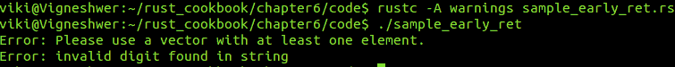

# 它是如何工作的...

在上一个菜谱中，我们使用组合子显式处理了错误。Rust 还为我们提供了另一种处理这些情况的方法，即结合使用 `match` 语句和早期返回。早期返回是一种在函数处理早期阶段捕获错误并返回给应用程序或库用户的方法。

首先，我们使用 `type` 关键字创建了一个 `std::result::Result<T, String>` 的别名 `Result<T>`，我们将在代码的功能单元中使用它。

让我们检查所有功能单元的工作原理：

+   `double_first`：这个函数接受 `vec` 输入并返回 `Result<T>`。在我们的例子中，我们使用了早期的 `return Err` 来处理错误。我们声明了一个名为 `first` 的变量，它保留传递给向量的第一个值。在这个 `first` 变量上，我们执行了 `match` 语句。如果你得到的值是 `None`，使用 `return Err` 来实现早期返回以传递错误。如果你在向量元素中有字符串值，使用别名的 `Err` 值来引发错误。

+   `print`：这个函数接受 `Result<T>`，并使用 `match` 语句检查我们是否有 `Ok` 或 `Err` 情况以打印相应的语句。

在 `main` 函数中，我们有一些向量，其中一个是 `empty`，向量中没有值。另一个是 `string`，当我们调用 `double_first` 函数时，我们只有字符串值。使用这个输入，我们得到相应的错误。

# 实现 `try!` 宏

我们已经达到了一个可以避免 panic 的状态，但显式处理所有错误仍然是一个非常困难的任务。在这个菜谱中，我们将使用 `try!` 来处理我们只需要展开而不需要 panic 的情况。

# 准备工作

我们需要 Rust 编译器和任何文本编辑器来开发 Rust 代码片段。

# 如何完成...

按照以下步骤完成这个菜谱：

1.  创建一个名为 `sample_try.rs` 的文件，并在你的文本编辑器中打开它。

1.  编写代码头，包含相关信息：

```rs
        //-- #########################
        //-- Task: Implementing try!
        //-- Author: Vigneshwer.D
        //-- Version: 1.0.0
        //-- Date: 26 March 17
        //-- #########################

```

1.  为 `std::result::Result<T, String>` 类型定义一个泛型别名 `Result<T>`：

```rs
        type Result<T> = std::result::Result<T, String>;

```

1.  创建一个名为 `double_first` 的函数，它将接受 `Vec` 输入并返回 `Result<i32>` 类型：

```rs
        fn double_first(vec: Vec<&str>) -> Result<i32> {
          let first = try!(vec.first()
          .ok_or("Please use a vector with at least one               
          element.".to_owned()));

          let value = try!(first.parse::<i32>()
          .map_err(|e| e.to_string()));

          Ok(2 * value)
        }

```

1.  创建一个名为 `print` 的函数，它将接受 `Result<i32>` 类型的输入：

```rs
        fn print(result: Result<i32>) {
         match result {
         Ok(n) => println!("The first doubled is {}", n),
         Err(e) => println!("Error: {}", e),
         }
        }

```

1.  定义 `main` 函数并调用不同的函数：

```rs
        fn main() {
         let empty = vec![];
         let strings = vec!["tofu", "93", "18"];

         print(double_first(empty));
         print(double_first(strings));
        }

```

在代码成功执行后，你将得到以下输出：

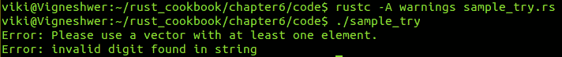

# 它是如何工作的...

`try!` 宏使我们能够简单地展开而不使用 panic。在之前的菜谱中，我们多次使用了展开和嵌套功能来获取所需值。`try!` 在出错的情况下相当于返回 panic 而不是 `unwrap` 函数。在这个菜谱中，你将学习如何使用 `try!` 与组合子一起使用。

首先，我们使用 `type` 关键字为 `std::result::Result<T, String>` 创建了一个别名 `Result<T>`，我们将在代码的功能单元中使用它。

让我们检查所有功能单元的工作原理：

+   `double_first`：这个函数接受 `vec` 类型的输入并返回一个 `Result<T>` 类型的结果。我们声明一个名为 `first` 的变量并将其分配给不同的 `try!` 宏语句。首先，我们检查向量的第一个元素是否为空，使用 `vec.first()` 获取向量的第一个值，如果为空，我们使用 `ok_or` 方法打印一条语句，在其他的 `try!` 中将 `first` 变量解析为整数类型。如果发生错误，我们使用 `map_err` 方法将错误转换为字符串。

+   `print`：这个函数接受 `Result<T>`。使用 `match` 语句，我们检查是否有 `Ok` 或 `Err` 情况以打印相应的语句。

在 `main` 函数中，我们有一些向量，其中一个是 `empty`，表示向量为空，另一个是 `string`，表示向量中只有字符串值。当我们用这些输入值调用 `double_first` 函数时，我们会得到相应的错误。

# 定义自己的错误类型

Rust 允许我们使用自定义的 Rust 数据类型，如 `enum` 和 `struct`，来定义自己的错误类型。我们将创建定制的错误处理案例，其中我们将能够定义自己的错误类型，并为处理这些错误案例提供定义。

# 准备工作

我们将需要 Rust 编译器和任何文本编辑器来开发 Rust 代码片段。

# 如何做到这一点...

按照以下步骤完成这个食谱：

1.  创建一个名为 `sample_error.rs` 的文件并在你的文本编辑器中打开它。

1.  编写代码头部，包含相关信息：

```rs
        //-- #########################
        //-- Task: Defining your own error type
        //-- Author: Vigneshwer.D
        //-- Version: 1.0.0
        //-- Date: 26 March 17
        //-- #########################

```

1.  调用标准库并创建一个泛型别名类型 `Result<T>`，用于 `std::result::Result<T, CustomError>` 类型：

```rs
        use std::num::ParseIntError;
        use std::fmt;

        type Result<T> = std::result::Result<T, CustomError>;

```

1.  创建一个名为 `CustomError` 的 `enum` 类型，这是我们自定义的错误类型：

```rs
        #[derive(Debug)]
        enum CustomError {
         EmptyVec,
         Parse(ParseIntError),
        }

```

1.  实现一种自定义的方式来显示 `CustomError` 类型的错误：

```rs
        impl fmt::Display for CustomError {
         fn fmt(&self, f: &mut fmt::Formatter) -> fmt::Result {
         match *self {
         CustomError::EmptyVec =>
         write!(f, "please use a vector with at least one
         element"),
         // This is a wrapper, so defer to the underlying
         types' implementation of `fmt`.
         CustomError::Parse(ref e) => e.fmt(f),
         }
         }
        }

```

1.  创建一个名为 `double_first` 的函数，它将接受 `Vec` 输入并返回一个 `Result<i32>` 类型的结果：

```rs
        fn double_val(vec: Vec<&str>) -> Result<i32> {
          vec.first()
          // Change the error to our new type.
         .ok_or(CustomError::EmptyVec)
         .and_then(|s| s.parse::<i32>()
         // Update to the new error type here also.
         .map_err(CustomError::Parse)
         .map(|i| 2 * i))
       }

```

1.  创建一个名为 `print` 的函数，它将接受一个 `Result<i32>` 类型的输入：

```rs
        fn print(result: Result<i32>) {
         match result {
         Ok(n) => println!("The first doubled is {}", n),
         Err(e) => println!("Error: {}", e),
         }
        }

```

1.  定义 `main` 函数并调用不同的函数：

```rs
        fn main() {
         let numbers = vec!["93", "18"];
         let empty = vec![];
         let strings = vec!["tofu", "93", "18"];

         print(double_val(numbers));
         print(double_val(empty));
         print(double_val(strings));
        }

```

在代码成功执行后，你会得到以下输出：

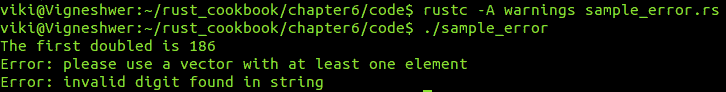

# 它是如何工作的...

通常，我们会定义一个好的错误类型，使其能够为开发者做以下事情，以便他们能够轻松理解代码在运行时究竟在何处出错：

+   使用相同类型表示代码中的不同错误

+   向用户展示适当的错误函数，以便开发者能够轻松区分不同的错误

+   正确记录错误信息

在这个菜谱中，我们创建了自己的自定义`enum`错误类型，名为`CustomError`。它有两种数据类型：`EmptyVec`和`Parse(ParseIntError)`。对于这些错误中的每一个，我们都有自定义的错误处理实现，为不同的错误生成自定义的错误显示消息，以便我们的错误类型`CustomError`能够遵循所有先前的好错误类型的属性。在`EmptyVec`的情况下，我们没有传递或需要关于错误的额外信息，但在`Parse(ParseIntError)`的情况下，我们必须提供解析错误实现所需的信息。

让我们看看如何为不同的错误实现自定义显示函数。在这种情况下，我们使用了`impl`关键字为我们的错误类型`CustomError`创建一个自定义的`fmt::Display`，其中`fmt`代表标准库。对于接收`&self, f: &mut fmt::Formatter`并返回标准`fmt::Result`的`fmt`方法，我们使用了`match`语句来识别错误类型并显示相应的错误消息。在`CustomError::EmptyVec`的情况下，我们打印了这个错误消息：“请使用至少包含一个元素的向量。”在`CustomError::Parse`的情况下，我们格式化和打印了额外的类型信息。

让我们检查所有功能单元的工作原理：

+   `double_first`: 这个函数接收`vec`输入并返回`Result<i32>`。它使用`vec.first`方法获取发送给它的向量的第一个值。如果没有提供任何值，则进入`ok_or`，其中它将错误类型更改为`CustomError::EmptyVec`。接下来，它检查我们是否能够将字符串值解析为有效的整数值。如果成功，我们使用`map`函数通过将解析的整数乘以`2`来将其加倍；否则，它将错误值映射到另一个`CustomError::Parse`类型。

+   `print`: 这个函数接收`Result<i32>`。使用`match`语句，我们检查是否有`Ok`或`Err`情况以打印相应的语句。

在`main`函数中，我们有向量。其中一个是一个数字，其中我们有了正确的输入类型来生成输出而不产生任何错误。下一个是`empty`，其中向量为空。然后是`strings`，其中第一个值是一个字符值的字符串，无法解析为整数。当我们用这些输入值调用`double_first`函数时，我们得到相应的错误。

# 实现错误装箱

Rust 允许我们将错误类型装箱，这是在标准库错误类型周围创建包装错误类型的过程。错误装箱是开发者的常见做法，他们将不同库的所有错误类型汇集在一起，并使用它们来构建项目。

# 准备工作

我们将需要 Rust 编译器和任何文本编辑器来开发 Rust 代码片段。

# 如何做到这一点...

按照以下步骤完成这个菜谱：

1.  创建一个名为`sample_box.rs`的文件，并在您的文本编辑器中打开它。

1.  编写带有相关信息的代码头：

```rs
        //-- #########################
        //-- Task: Implementing Boxing
        //-- Author: Vigneshwer.D
        //-- Version: 1.0.0
        //-- Date: 26 March 17
        //-- #########################

```

1.  调用标准 crates 并创建一个泛型别名类型，即`Result<T>`，用于`std::result::Result<T, Box<error::Error>>`类型：

```rs
        use std::error;
        use std::fmt;
        use std::num::ParseIntError;

        type Result<T> = std::result::Result<T,         Box<error::Error>>;

```

1.  创建一个名为`CustomError`的`enum`类型，这是我们用户定义的错误类型：

```rs
        #[derive(Debug)]
        enum CustomError {
         EmptyVec,
         Parse(ParseIntError),
        }

```

1.  将标准库的错误类型转换为自定义类型：

```rs
        impl From<ParseIntError> for CustomError {
         fn from(err: ParseIntError) -> CustomError {
         CustomError::Parse(err)
         }
        }

```

1.  为`CustomError`类型实现一个自定义的错误显示方式：

```rs
        impl fmt::Display for CustomError {
         fn fmt(&self, f: &mut fmt::Formatter) -> fmt::Result {
         match *self {
         CustomError::EmptyVec =>
         write!(f, "please use a vector with at least one element"),
         CustomError::Parse(ref e) => e.fmt(f),
         }
         }
        }

```

1.  为`CustomError`类型实现`error`特质：

```rs
        impl error::Error for CustomError {
         fn description(&self) -> &str {
         match *self {
         CustomError::EmptyVec => "empty vectors not allowed",
         CustomError::Parse(ref e) => e.description(),
         }
         }

         fn cause(&self) -> Option<&error::Error> {
         match *self {
         CustomError::EmptyVec => None,
         CustomError::Parse(ref e) => Some(e),
         }
         }
        }

```

1.  创建一个名为`double_first`的函数，该函数将接受`Vec`输入并返回`Result<i32>`类型：

```rs
        fn double_val(vec: Vec<&str>) -> Result<i32> {
          let first = try!(vec.first().ok_or(CustomError::EmptyVec));
          let parsed = try!(first.parse::<i32>());

          Ok(2 * parsed)
        }

```

1.  创建一个名为`print`的函数，该函数将接受`Result<i32>`类型作为输入：

```rs
        fn print(result: Result<i32>) {
         match result {
         Ok(n) => println!("The first doubled is {}", n),
         Err(e) => println!("Error: {}", e),
         }
        }

```

1.  定义`main`函数并调用不同的函数：

```rs
        fn main() {
         let numbers = vec!["93", "18"];
         let empty = vec![];
         let strings = vec!["tofu", "93", "18"];

         print(double_val(numbers));
         print(double_val(empty));
         print(double_val(strings));
        }

```

在代码成功执行后，您将得到以下输出：

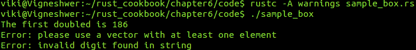

# 它是如何工作的...

`std`库自动将实现`Error`特质的任何类型通过`From`特质对象转换为特质的对象`Box<Error>`。然而，用户可能使用许多外部库，不同的库提供它们自己的错误类型。为了定义一个有效的`Result<T, E>`类型，执行以下任务：

+   在库的标准错误类型周围定义一个新的包装错误类型

+   将错误类型转换为字符串或任何其他便于处理的数据类型

+   将错误类型装箱到`Box<Error>`类型

在这个菜谱中，我们首先调用了标准库`std::error`、`std::fmt`和`std::num::ParseIntError`。然后，我们为`std::result::Result<T, Box<error::Error>>`创建了一个别名`Result<T>`。接下来，我们创建了自己的自定义`enum`错误类型`CustomError`，它有两种数据类型：`EmptyVec`和`Parse(ParseIntError)`。

编译器能够通过`#[derive]`属性提供一些特质的基实现，其中属性是应用于某些模块、crate 或项的元数据。我们使用`#[derive(Debug)]`来获取面向程序员的输出格式，它具有更多的调试上下文。

我们通过实现`From`特质将标准库的`ParseIntError`错误转换为自定义错误类型`CustomError`。我们这样做是因为`from`方法接受标准错误类型`ParseIntError`作为`err`，并通过设置`CustomError::Parse(err)`返回`CustomError`类型。

现在让我们看看我们是如何为不同的错误实现自定义显示函数的。我们使用`impl`关键字为我们的`CustomError`错误类型创建了一个定制的`fmt::Display`，其中`fmt`代表标准库。`fmt`方法接收`&self, f: &mut fmt::Formatter`并返回标准的`fmt::Result`。我们使用`match`语句来识别错误类型并显示相应的错误信息。在`CustomError::EmptyVec`的情况下，我们打印了这个错误信息：“请使用至少包含一个元素的向量。”在`CustomError::Parse`的情况下，我们格式化和打印了额外的类型信息。

要实现`Box<Error>`，我们必须实现 Error 特质，其中有两个方法：`description`和`cause`。这些方法接受特质的值并返回它们。在`description`方法中，使用`match`语句，我们分配了关于错误类型的描述；这里我们将`CustomError::EmptyVec`匹配到`empty vectors not allowed`，将`CustomError::Parse(ref e)`匹配到`e.description()`。同样，在`cause`的情况下，我们有导致错误的样本值，并将`CustomError::EmptyVec`匹配到`None`，将`CustomError::Parse(ref e)`匹配到`Some(e)`。

让我们检查所有功能单元的工作原理：

+   `double_first`: 这个函数接收`vec`输入并返回`Result<i32>`。在我们的例子中，它使用`try!`宏通过`vec.first`方法获取发送给它的向量的第一个值，并将其赋值给`first`变量。如果没有提供任何值，它将进入`ok_or`，其中将错误类型更改为`CustomError::EmptyVec`。接下来，我们通过`first.parse::<i32>()`使用`try!`宏检查我们是否能够将字符串值解析为有效的整数值，并将其赋值给`parsed`变量。如果成功，我们将其乘以`2`。在`Ok`数据类型中，它返回`enum`类型的`Result<i32>`；否则，它采用错误类型解析的错误值。

+   `print`: 这个函数接收`Result<i32>`。使用`match`语句，我们检查是否有`Ok`或`Err`情况来打印相应的语句。

在`main`函数中，我们有向量。在这些向量中，有一个是数字，我们使用了正确的输入类型来生成输出而不产生任何错误。下一个是`empty`，表示向量为空。另一个是`strings`，其中我们有一个字符值字符串的第一个值，这些值无法解析为整数。当我们用这些输入值调用`double_first`函数时，我们得到相应的错误。
