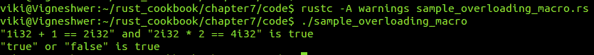

# 第七章：宏黑客技术

在本章中，我们将介绍以下配方：

+   在 Rust 中构建宏

+   在宏中实现匹配

+   玩转常见的 Rust 宏

+   实现设计者

+   宏重载

+   实现 repeat

+   实现 DRY

# 简介

到目前为止，我们已经看到了许多以感叹号 (`!`) 结尾的 Rust 语句，例如 `println!`、`try!` 等。这些命令执行了强大的操作以执行特定任务。Rust 提供了一个强大的宏系统，允许元编程。宏看起来像函数，但它们的名称以感叹号 (`!`) 结尾。宏被扩展到源代码中，该源代码被编译到程序中。在这个配方中，我们将探讨宏的各个方面，从定义自己的应用程序特定宏到测试它们。

# 在 Rust 中构建宏

在这个配方中，我们将了解 `macro_rules!`——这个语法将帮助我们定义我们的自定义应用程序特定宏，该宏可以根据应用程序术语有一个独特的名称。

# 准备工作

我们将需要 Rust 编译器和任何文本编辑器来开发 Rust 代码片段。

# 如何做...

按照给定的步骤实现此配方：

1.  创建一个名为 `sample_macro.rs` 的文件，并在您的文本编辑器中打开它。

1.  编写包含相关信息的代码头：

```rs
        //-- #########################
        //-- Task: Building your first macro in Rust
        //-- Author: Vigneshwer.D
        //-- Version: 1.0.0
        //-- Date: 26 March 17
        //-- #########################

```

1.  创建一个名为 `Welcome_RustBook` 的宏：

```rs
        // This is a simple macro named `say_hello`.
        macro_rules! Welcome_RustBook {
          () => (
          // The macro will expand into the contents of this block.
          println!("Welcome to Rust Cookbook!");
          )
        }

```

1.  定义 `main` 函数并调用 `Welcome_RustBook` 宏：

```rs
        fn main() {
          // This call will expand into`println!("Hello");`
          Welcome_RustBook!()
        }

```

在我们代码成功执行后，我们将得到以下输出：


# 它是如何工作的...

我们使用 `macro_rules!` 宏创建一个自定义命名的宏；在这里，我们创建了一个名为 `Welcome_RustBook!` 的宏。`macro_rules!` 的一般语法如下：

```rs
macro_rules! macro_name { ... }

```

在 `macro_rules!` 宏内部，我们匹配参数。在这个配方的情况下，我们不接受用户提供的任何参数，所以我们匹配 `()` `=>` （一组特定的操作项）。代码中的空括号 `()` 表示该宏不接受任何参数。该宏将在编译时展开为无参数块的内容，其中我们具有 `println!("Welcome to Rust Cookbook!");`，这基本上会打印一个默认语句。

在主函数中，我们在函数定义中调用 `Welcome_RustBook!` 宏，就像我们调用任何其他宏一样。我们将看到默认语句在终端中打印出来。

# 在宏中实现匹配

让我们继续前进，通过在我们的宏中添加更多规则来使我们的宏更加复杂，这些规则基本上是模式匹配案例。在这个配方中，关键的学习成果将是了解我们如何在宏规则中定义模式匹配案例。

# 准备工作

我们将需要 Rust 编译器和任何文本编辑器来开发 Rust 代码片段。

# 如何做...

按照以下步骤实现此配方：

1.  创建一个名为 `sample_match.rs` 的文件，并在您的文本编辑器中打开它。

1.  编写包含相关信息的代码头：

```rs
        //-- #########################
        //-- Task: Implement matching
        //-- Author: Vigneshwer.D
        //-- Version: 1.0.0
        //-- Date: 26 March 17
        //-- #########################

```

1.  创建一个名为 `Check_Val` 的宏：

```rs
        macro_rules! Check_Val {
          (x => $e:expr) => (println!("mode X: {}", $e));
          (y => $e:expr) => (println!("mode Y: {}", $e));
        }

```

1.  定义 `main` 函数并调用 `Check_Val` 宏：

```rs
        fn main() {
          Check_Val!(y => 3);
        }

```

我们将在代码成功执行后得到以下输出：


# 它是如何工作的...

在这个菜谱中，我们创建了一个名为 `Check_Val!` 的宏，它基本上扮演了 `match` 表达式分支的角色，但匹配是在编译时通过 Rust 语法树进行的。模式的常见语法如下：

```rs
( $( $x:expr ),* ) => { ... };

```

在这里，术语 *模式* 指的是 `=>` 的左侧，在 Rust 中被称为 *匹配器*。

`$x:expr` 匹配器将匹配任何 Rust 表达式，并将其绑定到语法树上的元变量 `$x`，匹配器中出现的任何 Rust 令牌都必须完全匹配。

在这里，我们有两种模式匹配情况：`x => $e:expr` 和 `y => $e:expr`。元变量是 `$e`，它在宏定义中用于在宏规则成功匹配后执行的操作。当我们调用 `main` 函数中的 `Check_Val!(y => 3);` 时，输出是 `mode Y:3`。在这里，第二个情况通过，并且 `$e` 的值与传递给 `main` 函数中 `Check_Val!` 宏的参数相同。

如果我们调用 `Check-Val!(z => 3);`，我们会得到错误：没有规则期望令牌 `z`，因为我们没有为令牌 `z` 定义规则，并且用 `$(...),*` 将匹配器包围起来将匹配零个或多个表达式，由逗号分隔。

# 玩转常见的 Rust 宏

在整本书中，我们定义并使用了常见的 Rust 宏，这将帮助我们执行基本操作，例如打印等。Rust 默认提供这些宏，因为这些宏对于用户来说非常复杂来实现。在这个菜谱中，我们将学习一些常见的 Rust 宏。

# 准备工作

我们将需要 Rust 编译器和任何文本编辑器来开发 Rust 代码片段。

# 如何做到这一点...

按照以下步骤实现这个菜谱：

1.  创建一个名为 `sample_common_macros.rs` 的文件，并在您的文本编辑器中打开它。

1.  使用相关信息的代码头：

```rs
        //-- #########################
        //-- Task: Implementing common macros in rust
        //-- Author: Vigneshwer.D
        //-- Version: 1.0.0
        //-- Date: 26 March 17
        //-- #########################

```

1.  在主函数中创建一个实现一些内置标准 Rust 宏的函数：

```rs
        fn main() {

          // Creating a vector 
          let v = vec![1, 2, 3, 4, 5];
          print!("Vector :- {:?}", v);

          // Macros used for testing
          assert!(true);
          assert_eq!(5, 3 + 2);

          // assert!(5 < 3);
          // assert_eq!(5, 3);

          // Gives a message to panic
          // panic!("oh no!");
        }

```

我们将在代码成功执行后得到以下输出：


# 它是如何工作的...

我们在主函数中声明了所有标准宏。让我们以下面的顺序深入了解每一个：

+   我们使用 `vec!` 宏在 Rust 中创建一个向量。它创建 `Vec<T>`。

+   接下来的两个宏在测试中广泛使用：第一个是 `assert!`，它接受一个布尔值以通过，第二个是 `assert_eq!`，它接受两个值并检查它们的相等性。真值通过，而假值会导致 `panic!` 宏，这会导致线程崩溃或中断。

在这个菜谱中，我们使用了 `Vec!` 宏来创建一个向量 `v`。`assert!` 和 `assert_eq!` 宏内部的条件通过。已注释掉失败情况，因为它们会在运行时导致崩溃。

# 实现设计符

Rust 提供了一系列设计符，帮助我们创建单元，如函数，并在宏中执行表达式。

# 准备工作

我们将需要 Rust 编译器和任何文本编辑器来开发 Rust 代码片段。

# 如何操作...

按照所述步骤实现此菜谱：

1.  创建一个名为 `sample_designator.rs` 的文件，并在您的文本编辑器中打开它。

1.  编写带有相关信息的代码头：

```rs
        //-- #########################
        //-- Task: Implementing designator
        //-- Author: Vigneshwer.D
        //-- Version: 1.0.0
        //-- Date: 26 March 17
        //-- #########################

```

1.  创建一个名为 `create_function` 的宏，它接受一个设计符作为参数：

```rs
        macro_rules! create_function {
          ($func_name:ident) => (
            fn $func_name() {
              // The `stringify!` macro converts an `ident`
              into a string.
              println!("You called {:?}()",
              stringify!($func_name))
            }
          )
        }

```

1.  调用 `create_function` 宏创建两个函数 `foo` 和 `bar`：

```rs
        create_function!(foo);
        create_function!(bar);

```

1.  创建一个名为 `print_result` 的宏：

```rs
        macro_rules! print_result {
          ($expression:expr) => (
          println!("{:?} = {:?}",
          stringify!($expression),
          $expression)
          )
        }

```

1.  定义 `main` 函数，在其中我们使用我们创建的宏：

```rs
        fn main() {
          foo();
          bar();

          print_result!(1u32 + 1);

          // Recall that blocks are expressions too!
          print_result!({
          let x = 1u32;

          x * x + 2 * x - 1
          });
        }

```

在我们代码成功执行后，我们将得到以下输出：


# 它是如何工作的...

通常，宏的参数以美元符号（`$`）为前缀，并使用设计符进行类型注解。在这里，在这个菜谱中，我们使用了两个常用的设计符，即 `expr`，用于表达式，以及 `ident`，用于变量/函数名。

让我们了解我们创建的两个主要宏，用于在 Rust 代码中实现设计符：

+   `create_function`：这个宏接受 `ident` 设计符的参数，并创建一个名为 `$func_name` 的函数，该函数在代码中用于创建函数。如前所述，`ident` 设计符用于变量/函数名。在 `($func_name:ident)` 模式的块中，我们定义函数 `fn $func_name`，并在其主体中包含 `stringify!` 宏，它将 `$func_name` 转换为字符串。

+   `print_result`：这个宏接受 `expr` 类型的表达式并将其作为字符串及其结果打印出来。`expr` 设计符用于表达式。在表达式模式的块中，我们使用 `stringify!` 宏，它将表达式转换为字符串并执行它。

我们通过使用 `create_function!(foo);` 和 `create_function!(bar);` 创建名为 `foo` 和 `bar` 的函数。在 `main` 函数中，我们调用了这两个函数，即 `foo` 和 `bar`，它们返回字符串。我们调用 `function_name`。接下来，我们调用 `print_result!`，它以一个表达式块作为参数，我们创建一个变量 `x` 并将其赋值为 `1u32`，这是一个 32 位无符号整数类型。然后我们运行 `x * x + 2 * x - 1`，输出为 `2`。

# 宏重载

在 Rust 中，宏的重载是指提供多个类似参数的组合，我们期望宏能够处理这些参数并根据传入的组合提供自定义的结果。

# 准备工作

我们将需要 Rust 编译器和任何文本编辑器来开发 Rust 代码片段。

# 如何操作...

按照以下步骤实现此菜谱：

1.  创建一个名为 `sample_overloading_macros.rs` 的文件，并在您的文本编辑器中打开它。

1.  编写代码头，包含相关信息：

```rs
        //-- #########################
        //-- Task: Implementing 
        //-- Author: Vigneshwer.D
        //-- Version: 1.0.0
        //-- Date: 26 March 17
        //-- #########################

```

1.  创建一个名为 `test` 的宏，我们将为其实现重载：

```rs
        macro_rules! test {

          ($left:expr; and $right:expr) => (
          println!("{:?} and {:?} is {:?}",
          stringify!($left),
          stringify!($right),
          $left && $right)
          );

          ($left:expr; or $right:expr) => (
          println!("{:?} or {:?} is {:?}",
          stringify!($left),
          stringify!($right),
          $left || $right)
          );
        }

```

1.  定义 `main` 函数，在其中我们将实现宏的功能：

```rs
        fn main() {
          test!(1i32 + 1 == 2i32; and 2i32 * 2 == 4i32);
          test!(true; or false);
        }

```

我们将在代码成功执行后得到以下输出：



# 它是如何工作的...

在本教程中，我们创建了一个名为 `test` 的宏，它接受两个 `expr` 设计符作为参数，并将它们分配给两个变量，`$left` 和 `$right`，其中 `$left` 被分配给第一个表达式，而 `$right` 被分配给第二个表达式。

在宏内部，我们有两个规则，如下所示：

+   `($left:expr; and $right:expr)`: 在此规则中，我们希望返回一个布尔值。在这里，我们评估两个表达式并将值传递给 `&&` 操作符。

+   `($left:expr; or $right:expr)`: 在此规则中，我们希望返回一个布尔值。在这里，我们评估两个表达式并将值传递给 `||` 操作符。

参数不需要用逗号分隔，并且每个分支必须以分号结束。

在 `main` 函数中，我们两次调用 `test!` 宏，使用不同的参数，其中我们有组合。`test!(1i32 + 1 == 2i32; and 2i32 * 2 == 4i32);` 组合返回表达式的字符串形式以及结果，即 `true`；`test!(true; or false);` 同样返回 `true`。

# 实现重复

重复是特定宏接受至少重复一次的参数的能力。在本教程中，你将学习如何在 Rust 中实现重复的语法。

# 准备工作

我们将需要 Rust 编译器和任何文本编辑器来开发 Rust 代码片段。

# 如何操作...

按照以下步骤实现本教程：

1.  创建一个名为 `sample_repeat.rs` 的文件，并在你的文本编辑器中打开它。

1.  编写代码头，包含相关信息：

```rs
        //-- #########################
        //-- Task: Implementing repeat
        //-- Author: Vigneshwer.D
        //-- Version: 1.0.0
        //-- Date: 26 March 17
        //-- #########################

```

1.  创建一个名为 `find_min` 的宏，在其中实现 `repeat`：

```rs
        macro_rules! find_min {
          // Base case:
          ($x:expr) => ($x);
          // `$x` followed by at least one `$y,`
          ($x:expr, $($y:expr),+) => (
          // Call `find_min!` on the tail `$y`
          std::cmp::min($x, find_min!($($y),+))
          )
        }

```

1.  在一个 `main` 函数中创建一个，我们将多个参数传递给 `find_min`：

```rs
        fn main() {
          println!("{}", find_min!(1u32));
          println!("{}", find_min!(1u32 + 2 , 2u32));
          println!("{}", find_min!(5u32, 2u32 * 3, 4u32));
        }

```

我们将在代码成功执行后得到以下输出：


# 它是如何工作的...

宏可以在参数列表中使用 `+` 来表示一个参数至少重复一次，或者使用 `*` 来表示一个参数可以重复零次或多次。

在这个配方中，我们有一个名为 `find_min` 的宏，它有两个规则，其中 `$(...),+` 匹配器将匹配一个或多个由逗号分隔的表达式。在第一种情况下，我们有 `($x:expr)`，它仅执行表达式并返回输出；如果我们只向 `find_min` 宏传递一个表达式，它将被匹配。在第二种情况下，我们有 `($x:expr, $($y:expr),+)`。在这里，`$x` 后面至少跟有一个 `$y`，在代码块内部，我们调用 `find_min!` 宏对尾部 `$y` 进行操作；这些值被传递给 `std::cmp::min`，它从参数列表中返回最小值。在第二次调用时，它将执行宏的第一种情况并返回表达式。

在 `main` 函数中，我们运行以下案例并打印结果：

+   `find_min!(1u32)`: 这将执行第一种情况并返回 `1`

+   `find_min!(1u32 + 2 , 2u32)`: 这将进入第二种情况，其中宏将再次对第二个表达式进行调用，并返回这两个表达式的 `min` 结果，即 `2`

+   `find_min!(5u32, 2u32 * 3, 4u32)`: 这与第二种情况类似，但在这里宏将调用两次，并返回所有表达式的 `min` 结果，在这种情况下是 `4`

# 实现 DRY

使用 Don't Repeat Yourself (DRY)，在这个配方中，我们将为 Rust 中的一些基本标准算术操作创建测试用例。然而，我们将通过使用宏及其功能来自动化它们，以减少冗余代码。

# 准备工作

我们将需要 Rust 编译器和任何文本编辑器来开发 Rust 代码片段。

# 如何做...

按照以下步骤实现此配方：

1.  创建一个名为 `sample_dry.rs` 的文件，并在您的文本编辑器中打开它。

1.  编写带有相关信息的代码头：

```rs
        //-- #########################
        //-- Task: Implementing 
        //-- Author: Vigneshwer.D
        //-- Version: 1.0.0
        //-- Date: 26 March 17
        //-- #########################

```

1.  调用标准操作包：

```rs
        use std::ops::{Add, Mul, Sub};

```

1.  创建一个名为 `assert_equal_len` 的宏：

```rs
        macro_rules! assert_equal_len {
          ($a:ident, $b: ident, $func:ident, $op:tt) => (
          assert!($a.len() == $b.len(),
          "{:?}: dimension mismatch: {:?} {:?} {:?}",
          stringify!($func),
          ($a.len(),),
          stringify!($op),
          ($b.len(),));
          )
        }

```

1.  创建一个名为 `op` 的宏：

```rs
        macro_rules! op {
          ($func:ident, $bound:ident, $op:tt, $method:ident) => (
          fn $func<T: $bound<T, Output=T> + Copy>(xs: &mut Vec<T>, ys:
          &Vec<T>) {
            assert_equal_len!(xs, ys, $func, $op);
            for (x, y) in xs.iter_mut().zip(ys.iter()) {
            *x = $bound::$method(*x, *y);
            // *x = x.$method(*y);
            }
          }
          )
        }

```

1.  实现以下函数：`add_assign`、`mul_assign` 和 `sub_assign`：

```rs
        op!(add_assign, Add, +=, add);
        op!(mul_assign, Mul, *=, mul);
        op!(sub_assign, Sub, -=, sub);

```

1.  创建一个名为 `test:mod test {` 的模块：

```rs
        use std::iter;
        macro_rules! test {
          ($func: ident, $x:expr, $y:expr, $z:expr) => {
            #[test]
            fn $func() {
              for size in 0usize..10 {
                let mut x: Vec<_> =
                iter::repeat($x).take(size).collect();
                let y: Vec<_> = iter::repeat($y).take(size).collect();
                let z: Vec<_> = iter::repeat($z).take(size).collect();

                super::$func(&mut x, &y);

                assert_eq!(x, z);
                }
              }
            }
          }

          // Test `add_assign`, `mul_assign` and `sub_assign`
          test!(add_assign, 1u32, 2u32, 3u32);
          test!(mul_assign, 2u32, 3u32, 6u32);
          test!(sub_assign, 3u32, 2u32, 1u32);
        }

```

在我们代码成功执行后，我们将得到以下输出：


# 它是如何工作的...

宏允许开发者通过提取函数和/或测试套件的公共部分来编写 DRY 代码。在这个配方中，我们对 `Vec<T>` 上的 `+=`、`*=` 和 `-=` 操作符进行了测试。在这个配方中，我们使用了一个新的设计符 `tt`；它代表标记树，用于操作符和标记。

让我们先了解代码中的所有功能宏单元：

+   `assert_equal_len`: 这个宏接受四个输入参数，这些参数是 `$a`、`$b` 和 `$func`，它们都是 `ident` 类型，以及 `$op`，它是 `tt` 类型。如果宏接收到这些参数，那么它将使用 `assert!` 宏内部的 `len()` 方法检查 `$a` 和 `$b` 是否具有相同的长度，这将返回一个成功时的布尔值 `true` 或否则打印一个失败语句，表示“维度不匹配”。

+   `op`: 这个宏接受四个输入参数，这些参数是 `$func`、`$bound` 和 `$method`，它们都是 `ident` 类型，以及 `$op`，它是 `tt` 类型。我们使用这个宏创建相应的操作函数，其中 `$func` 是函数的名称，并且是列表中的第一个参数，它有两个 `Vec<T>` 类型的参数：`xs` 和 `ys`。这两个变量都与宏共享，并且当它们共享时，`xs` 被提供可变权限。在函数内部，我们使用 `$bound::$method` 对向量 `xs` 和 `ys` 的所有值执行操作，并将结果存储在具有可变访问权限的 `x` 中。在这里，`$bound` 是标准模块，其 `$method` 对应于其单位。通过这个宏，我们能够对传递的数据执行许多方法，从而减少代码量。

+   `test`: 这个宏接受四个输入参数，这些参数是 `$func`，它是 `ident` 类型，以及 `$x`、`$y` 和 `$z`，它们是 `expr` 类型的 `ident`，存在于我们运行测试用例时调用的 `test` 模块中。在 `test` 宏内部，我们创建一个名为 `$func` 的函数。通过这样做，它将成为父 `test` 模块中的函数或单元。我们遍历值以创建向量，在其中执行 `super::$func(&mut x, &y)`。这里的 `super` 指的是我们使用 `op` 宏创建的函数，它根据我们想要执行的操作更新 `x` 的值。在最后一步，我们通过比较更新的 `x` 向量与期望的值 `z` 向量来验证 `test`。如果值匹配，`assert_eq!` 宏将返回 `true`；否则，它将引发恐慌。

在此代码中，我们使用一组特定的标准库，即 `ops` 和 `item`。首先，我们创建我们想要实现的不同操作，因此我们调用 `op!` 并创建 `add_assign`、`mul_assign` 和 `sub_assign`。在测试模块的后续部分，我们调用我们创建的不同函数的测试用例。在这里，我们给出所有传递的案例，并在编译时运行 `--test` 选项来运行测试用例。
