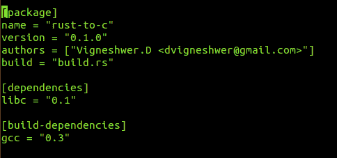
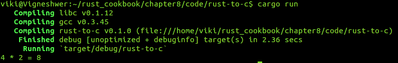
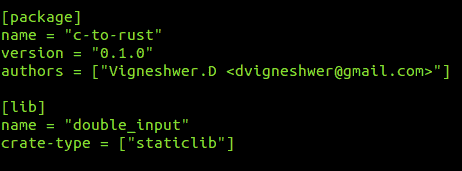
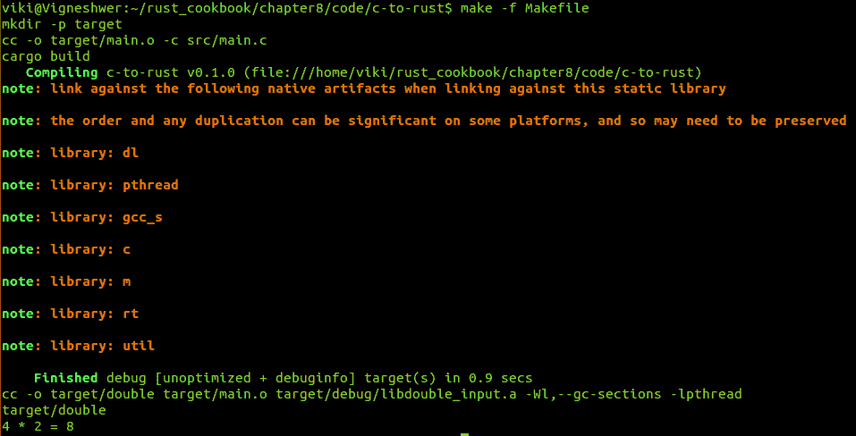
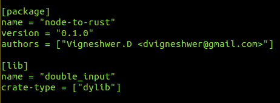
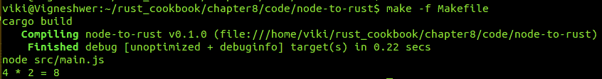
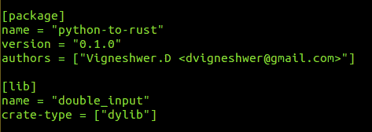
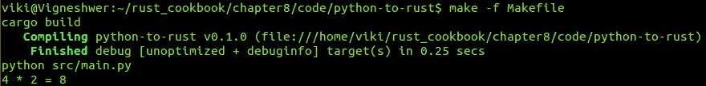
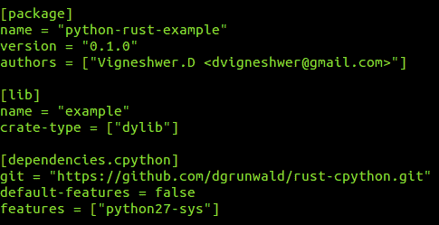
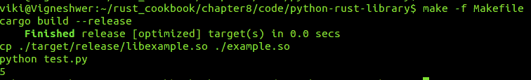

# 第八章：将 Rust 与其他语言集成

在本章中，我们将介绍以下菜谱：

+   从 Rust 调用 C 操作

+   从 C 调用 Rust 命令

+   从 Node.js 应用程序调用 Rust 操作

+   从 Python 调用 Rust 操作

+   在 Rust 中编写 Python 模块

# 简介

在这一章中，我们将介绍技术和步骤，帮助我们创建在用其他语言（如 C、Node.js 和 Python）编写的现有应用程序中的 Rust 单元。我们将深入探讨外部函数接口的概念，这有助于我们为外部代码库编写绑定。Rust 在稳定性和更安全的并行性方面优于许多编程语言。对于生产级应用程序开发者来说，尝试使用 Rust 构建代码中的小单元，并测试是否有显著的性能变化是理想的。这一章有助于促进这些想法和观点。

# 从 Rust 调用 C 操作

在这个菜谱中，我们将从一个 Rust 应用程序中调用外部 C 函数。当开发者想在 Rust 代码中使用一些特定项目的 C 库依赖项时，这项技术非常有帮助。

# 准备工作

在我们继续创建 Rust 和 C 之间的绑定之前，我们必须安装以下 crate。按照以下步骤下载和设置您的项目中的 `libc` crate、`gcc` crate 和 `gcc` 编译器：

1.  我们将需要 Rust 编译器和任何文本编辑器来开发 Rust 代码片段。

1.  使用 Cargo 工具创建 Rust 库项目

```rs
 cargo new --bin rust-to-c

```

1.  进入新创建的 Rust 库项目：

```rs
 cd rust-to-c

```

1.  在您喜欢的文本编辑器中打开 `Cargo.toml` 文件，并按照以下截图进行修改。这里，我们将使用 `libc` 版本 `0.1` 和 `gcc` 版本 `0.3`，同时还会提到 `build` 脚本，即 `build.rs`：



1.  在您的机器上安装 `gcc` 编译器，这通常默认存在：

```rs
 sudo apt-get install gcc

```

# 如何操作...

按照以下步骤实现此菜谱：

1.  在项目的根位置创建一个名为 `build.rs` 的文件，并在您的文本编辑器中打开它。

1.  编写代码头信息：

```rs
        //-- #########################
        //-- Task: Build script
        //-- Author: Vigneshwer.D
        //-- Version: 1.0.0
        //-- Date: 14 April 17
        //-- #########################

```

1.  在脚本中输入以下代码：

```rs
        extern crate gcc;

        fn main() {
          gcc::Config::new().file("src/double.c")
          .compile("libdouble.a");
        }

```

1.  将项目切换到 `src` 目录：

```rs
 cd src

```

1.  创建名为 `double.c` 的脚本，这是一个 C 应用程序：

```rs
 touch double.c

```

1.  在 `double.c` 应用程序中创建一个 `double_input` 函数，我们将在 Rust 应用程序中使用它：

```rs
        int double_input(int input) {
          return input * 2;
        }

```

1.  进入 `main.rs` 脚本并输入以下代码：

```rs
        extern crate libc;

        extern {
          fn double_input(input: libc::c_int) -> libc::c_int;
        }

        fn main() {
          let input = 4;
          let output = unsafe { double_input(input) };
          println!("{} * 2 = {}", input, output);
        }

```

在我们代码成功执行后，我们将得到以下输出：



# 它是如何工作的...

在这个菜谱中，我们创建了一个 Rust 项目，它可以作为 Rust 代码中的第三方包 C 应用程序使用。

我们使用了`libc` crate，它被用作类型和绑定到原生 C 函数的库，这些函数通常在其他通用平台库中找到。这个项目依赖项在`Cargo.toml`文件的`dependencies`字段中提到，然后在清单的`build-dependencies`部分，我们有`gcc` = `0.3`，这是`build`脚本的依赖项。

`build`脚本无法访问`Cargo.toml`清单部分依赖项中列出的依赖项。`build`依赖项将不可用于包文件；这是由 Cargo 工具完成的，以便包和构建脚本分别编译，因此它们的依赖项不需要一致。

Rust 提供了一个`build`脚本支持，其中一些包需要编译第三方非 Rust 代码；例如，在我们的案例中，我们有一个名为`double.c`的 C 脚本。需要链接到 C 脚本的包，这些包可以位于系统上，或者可能需要从源代码构建。Cargo 不会替换用于构建这些包的其他工具，但它通过`build`配置选项将它们集成，例如，在我们的案例中，在清单的`package`部分，我们有一个名为`build`的文件，其中包含`build.rs`脚本。

由`build`命令指定的 Rust 文件，在我们的案例中是`build.rs`，将首先编译，在包中的其他任何内容之前。这允许你的 Rust 代码依赖于构建或生成的工件。在`build.rs`脚本中，我们将原生 C 代码作为包的一部分进行构建；这个包将被 Rust 代码后来使用。我们使用一个名为`gcc`的外部 crate，它调用外部维护的 C 编译器。

`build`脚本从`main`函数开始，其中`gcc::Config::new().file("src/double.c").compile("libdouble.a")`首先通过调用`gcc`将我们的 C 文件编译成目标文件（对象文件），然后将对象文件（`double.o`）转换成静态库（`libdouble.a`）。对象文件存储在`target/debug/build/<package>/out`位置。

在`src`目录中，我们有 Rust 项目包文件，其中包含原生 C 脚本`double.c`。`double.c`脚本有一个名为`double_input`的函数，它接受一个名为`input`的整数参数并返回`input * 2`，这基本上是双倍传递的值。

在`main.rs`中，我们首先导入`libc` crate，然后在`extern`块中定义函数签名（因为它是一个第三方包）为`fn double_input(input: libc::c_int) -> libc::c_int`。在这里，我们使用`libc`类型，以便在 Rust 和 C 之间平滑地转换类型，我们不需要在调用外部函数`double_input`时处理它。从`main`函数中，我们将其放在`unsafe`块中。

`extern`块是外库中函数签名的一个列表，外函数被认为是不可安全的。因此，当我们调用它们时，需要用`unsafe`块包装，向编译器承诺其中包含的一切都是真正安全的。

# 从 C 调用 Rust 命令

在这个菜谱中，我们将执行上一个菜谱的相反操作。在这里，我们将从 C 脚本中调用 Rust 函数。当开发者想在 C 项目中构建特定的 Rust 单元时，这种技术非常有帮助。

# 准备中

在我们创建 C 项目的 Rust 单元之前，我们必须安装以下系统依赖项。按照以下步骤下载并安装您项目的`build-essential`包：

1.  我们将需要 Rust 编译器和任何文本编辑器来开发 Rust 代码片段。

1.  使用 Cargo 工具创建一个 Rust 库项目：

```rs
 cargo new c-to-rust

```

1.  进入新创建的 Rust 库项目：

```rs
 cd c_to_rust

```

1.  在您最喜欢的文本编辑器中打开`Cargo.toml`文件，并按照以下截图进行修改：



1.  在您的机器上安装`build-essential`工具，该工具通常默认存在：

```rs
 sudo apt-get update && apt-get install build-essential

```

# 如何做...

按照以下步骤实现这个菜谱：

1.  创建一个名为`lib.rs`的文件，并在您的文本编辑器中打开它。

1.  使用相关信息的代码头：

```rs
        //-- #########################
        //-- Task: Rust Function for 
        //-- Author: Vigneshwer.D
        //-- Version: 1.0.0
        //-- Date: 14 April 17
        //-- #########################

```

1.  在`lib.rs` Rust 脚本中创建名为`double_input`的函数，并使用给定的属性：

```rs
        #![crate_type = "staticlib"]

        #[no_mangle]
        pub extern fn double_input(input: i32) -> i32 {
        input * 2
        }

```

1.  在`c_to_rust/src`目录下创建名为`main.c`的文件，这是一个 C 脚本：

```rs
        #include <stdint.h>
        #include <stdio.h>

        extern int32_t double_input(int32_t input);

        int main() {
        int input = 4;
        int output = double_input(input);
        printf("%d * 2 = %d\n", input, output);
        return 0;
        }

```

1.  在项目目录`c_to_rust`的根位置创建`Makefile`，用于创建`build`规则：

```rs
        ifeq ($(shell uname),Darwin)
        LDFLAGS := -Wl,-dead_strip
        else
        LDFLAGS := -Wl,--gc-sections -lpthread
        endif

        all: target/double
        target/double

        target:
        mkdir -p $@

        target/double: target/main.o
        target/debug/libdouble_input.a
        $(CC) -o $@ $^ $(LDFLAGS)

        target/debug/libdouble_input.a: src/lib.rs Cargo.toml
        cargo build

        target/main.o: src/main.c | target
        $(CC) -o $@ -c $<

        clean:
        rm -rf target

```

我们将在代码成功执行后得到以下输出：



# 它是如何工作的...

在这个菜谱中，我们在 Rust 中创建了一个外部库，它可以被其他外国代码使用。`src`文件夹中的`lib.rs`文件是 Rust 中包和库的入口点。

在`Cargo.toml`中设置项目时，我们将`crate-type`字段设置为`["staticlib"]`，这样 Cargo 就会知道项目应该被编译为库。

`lib`部分在构建特定目标时很有帮助。在我们的例子中，它是用来`build`一个包。目标中的`name`字段是生成的库的名称，也是包或项目的默认名称。项目名称中的破折号将被下划线替换。

在`lib.rs`中，我们创建了一个包含`double_input`函数的`staticlib`类型 crate，该函数接受一个整数输入，通过将输入乘以`2`返回一个整数输出。我们使用`pub`关键字将`double_input`函数设置为公共，允许外部源调用该函数，而`extern`关键字使该函数遵循 C 调用约定。`no_mangle`属性关闭了 Rust 的名称修饰，这使得链接更容易。

在`main.c`文件中，我们使用`extern`关键字和`int32_t double_input(int32_t input)`的声明调用外部创建的`double_input`函数。

为了编译和运行此程序，我们使用了`make`工具并创建了一些规则，这些规则是执行项目的顺序步骤。我们在`Makefile`中首先使用命令`($(shell uname),Darwin)`确定 shell，用于检测操作系统类型以设置相应的标志。如果操作系统是`Darwin`，则`LDFLAGS`将是`-Wl,-dead_strip`；否则`LDFLAGS`设置为`-Wl,--gc-sections -lpthread`。这些是链接器（lD）的标志。`all`规则依赖于`target/double`规则，并在依赖于`target/double`的规则满足后执行相同的规则。

`target`规则使用命令`mkdir -p $@`创建目标目录，其中`$@`指的是规则中`:`左侧的部分。`target/double`依赖于规则，`target/main.o`和`target/debug/libdouble_input.a`。当`target/main.o`运行时，我们基本上运行`cc -o target/main.o -c src/main.c`，在`target`目录中创建`main.o`。`target/debug/libdouble_input.a`运行`cargo build`命令，创建`libdouble_input.a`。`target/double`使用`cc -o target/double target/main.o target/debug/libdouble_input.a -Wl,--gc-sections -lpthread`运行，其中创建了链接。最后，运行可执行文件`double`。

# 从 Node.js 应用程序中调用 Rust 操作

在此配方中，我们将创建一个可以从 JavaScript 中调用的 Rust 函数，当开发者想要提高他们 Web 应用程序中某个单元的性能时，这项技术非常有帮助。

# 准备工作

在我们继续创建 Node.js 项目的 Rust 单元之前，我们必须安装以下系统依赖项。按照以下步骤下载并安装项目所需的 node 依赖项包：

1.  我们将需要 Rust 编译器和任何文本编辑器来开发 Rust 代码片段。

1.  使用 Cargo 工具创建 Rust 库项目：

```rs
 cargo new node-to-rust

```

1.  进入新创建的 Rust 库项目：

```rs
 cd node_to_rust

```

1.  在你喜欢的文本编辑器中打开`Cargo.toml`文件，并按照以下截图进行修改：



1.  在你的机器上安装 Node.js 和`npm`：

```rs
 sudo apt-get update
 curl -sL https://deb.nodesource.com/setup_6.x | sudo -E bash -
 sudo apt-get install npm
 sudo apt-get install nodejs

```

# 如何操作...

按照以下步骤实现此配方：

1.  打开位于`node_to_rust/src`目录下的名为`lib.rs`的文件，并使用你的文本编辑器打开它。

1.  编写带有相关信息的代码头：

```rs
        //-- #########################
        //-- Task: Rust Function for Js
        //-- Author: Vigneshwer.D
        //-- Version: 1.0.0
        //-- Date: 14 April 17
        //-- #########################

```

1.  在 Rust 脚本中创建具有给定属性的`double_input`函数：

```rs
        #[no_mangle]
        pub extern fn double_input(input: i32) -> i32 {
          input * 2
        }

```

1.  在`node_to_rust/src`目录下创建`main.js`文件，这是 JavaScript 代码：

```rs
        var ffi = require('ffi');

        var lib = ffi.Library('target/debug/libdouble_input', {
        'double_input': [ 'int', [ 'int' ] ]
        });

        var input = 4;
        var output = lib.double_input(input);
        console.log(input + " * 2 = " + output);

```

1.  在`node_to_rust/`目录下创建`Makefile`以创建`build`规则：

```rs
        ifeq ($(shell uname),Darwin)
        EXT := dylib
        else
        EXT := so
        endif

        all: target/debug/libdouble_input.$(EXT)
        node_modules/ffi
        node src/main.js

        target/debug/libdouble_input.$(EXT): src/lib.rs
        Cargo.toml
        cargo build

        node_modules/ffi:
        npm install ffi

        clean:
        rm -rf target
        rm -rf node_modules

```

在成功执行我们的代码后，我们将得到以下输出：



# 它是如何工作的...

在这个菜谱中，我们使用 Rust 创建了一个外部库，该库可以被其他外国代码使用。`src` 文件夹内的 `lib.rs` 文件是 Rust 中包和库的入口点。

在 `Cargo.toml` 中，在设置项目时，我们将 `crate-type` 字段设置为 `["dylib"]`，这会让 Cargo 知道项目应该被编译为动态库。

在 `lib.rs` 中，我们创建了一个 `dylib` 类型的 crate，并有一个 `double_input` 函数，它接受一个整数输入，通过将给定输入加倍来返回一个整数输出。我们可以看到，是 `pub` 关键字允许外部源调用该函数，而 `extern` 使此函数符合 Js 调用约定。`no_mangle` 属性关闭了 Rust 的名称混淆，这使得链接更容易。

在 `main.js` 文件中，我们使用 `ffi` 节点包调用外部创建的 `double_input` 函数，我们创建一个变量 `ffi`，它使用 `require` 关键字加载 `ffi` 节点模块的单位。使用内置的 `ffi.library` 函数，我们在 `target/debug/libdouble_input` 加载 `build` 包，并将返回的对象类型分配给变量 `lib`，它包含 `double_input` 方法。稍后，我们可以使用此函数作为 `lib.double_int(input)`，其中 `input` 变量在 Js 代码的前述语句中分配了一个值为 `4`。

为了编译和运行此程序，我们使用 `make` 工具并创建某些规则，这些规则是执行项目的顺序步骤。我们创建 `Makefile`，在其中首先确定用于检测操作系统类型的 `($(shell uname),Darwin)` shell，以设置标志。如果是 `Darwin`，则 `EXT` 将为 `EXT := dylib`；否则 `EXT` 设置为 `so`。`all` 规则运行 `target/debug/libdouble_input.$(EXT)` 和 `node_modules/ffi`，然后执行 `node src/main.js`，这将运行 JavaScript 并生成日志。第一个规则是 `target/debug/libdouble_input.$(EXT)`，它通过使用 `cargo build` 命令构建 Rust 项目来创建 crate，下一个规则是 `node_modules/ffi`，它通过 `npm install ffi` 安装节点包 `ffi`。

# 从 Python 调用 Rust 操作

在这个菜谱中，我们将遵循我们在前两个菜谱中实施的步骤，其中我们创建了一个 Rust 函数，并在其他语言中将其用作基本单元。这里，我们将使用 Python 调用 Rust 单元。

# 准备工作

在我们能够继续创建 Python 项目的 Rust 单元之前，我们必须安装以下系统依赖项。按照以下步骤下载并安装项目所需的节点依赖包：

1.  我们将需要 Rust 编译器和任何文本编辑器来开发 Rust 代码片段。

1.  使用 Cargo 工具创建 Rust 库项目：

```rs
 cargo new python-to-rust

```

1.  进入新创建的 Rust 库项目：

```rs
 cd python-to-rust

```

1.  在您的首选文本编辑器中打开 `Cargo.toml` 文件，并按照以下截图进行修改：



1.  在您的机器上安装 Python，它已预装在您的机器上：

```rs
 sudo apt-get update 
 sudo apt-get -y upgrade

```

# 如何做到这一点...

按照以下步骤实现此配方：

1.  创建一个名为 `lib.rs` 的文件，并在您的文本编辑器中打开它。

1.  编写代码头部，包含相关信息：

```rs
        //-- #########################
        //-- Task: Rust Function for python
        //-- Author: Vigneshwer.D
        //-- Version: 1.0.0
        //-- Date: 14 April 17
        //-- #########################

```

1.  在 Rust 脚本中创建具有给定属性的 `double_input` 函数：

```rs
        #[no_mangle]
        pub extern fn double_input(input: i32) -> i32 {
          input * 2
        }

```

1.  创建名为 `main.py` 的文件，这是 Python 代码：

```rs
        from ctypes import cdll
        from sys import platform
        if platform == 'darwin':
            prefix = 'lib'
            ext = 'dylib'
        elif platform == 'win32':
            prefix = ''
            ext = 'dll'
        else:
            prefix = 'lib'
            ext = 'so'
        lib = cdll.LoadLibrary('target/debug/{}double_input
        .{}'.format(prefix, ext))
        double_input = lib.double_input
        input = 4
        output = double_input(input)
        print('{} * 2 = {}'.format(input, output))

```

1.  创建 `Makefile` 以创建 `build` 规则：

```rs
        ifeq ($(shell uname),Darwin)
        EXT := dylib
        else
        EXT := so
        endif

        all: target/debug/libdouble_input.$(EXT)
        python src/main.py

        target/debug/libdouble_input.$(EXT): src/lib.rs
        Cargo.toml
        cargo build

        clean:
        rm -rf target

```

在我们代码成功执行后，将得到以下输出：



# 它是如何工作的...

在这个配方中，我们使用 Rust 创建了一个外部库，该库可以被其他外国代码使用。`src` 文件夹中的 `lib.rs` 文件是 Rust 中包和库的入口点。

在 `Cargo.toml` 中，在设置项目时，我们将 `crate-type` 字段设置为 `["dylib"]`，这会让 Cargo 知道项目应该被编译为动态库。

在 `lib.rs` 中，我们创建了一个 `dylib` 类型的 crate，并有一个 `double_input` 函数，该函数接受一个整数输入，通过加倍给定输入返回一个整数输出。我们可以看到，是 `pub` 关键字允许外部源调用该函数，而 `extern` 使此函数符合 Js 调用约定。`no_mangle` 属性关闭 Rust 的名称混淆，使其更容易链接。

在 `main.py` 文件中，我们使用 `ctypes` Python 模块的 `cdll` 单元调用使用 Rust 代码构建的外部 `double_input` 函数。我们将 Rust 项目的编译后生成的 `so`（共享对象）文件的路径传递给 `LoadLibrary` Python 函数，在我们的例子中位于 `target/debug/libdouble_input.so`。在成功加载 `so` 文件后，我们将 `double_input` 赋值为 `lib.double_input` 并在脚本中稍后调用它。

为了编译和运行此程序，我们使用 `make` 工具并创建某些规则，这些规则是执行项目的顺序步骤。我们创建一个 `Makefile`，在其中首先确定用于检测操作系统类型的 `($(shell uname),Darwin)` shell。如果操作系统是 `Darwin`，则 `EXT` 将被设置为 `EXT := dylib`；否则 `EXT` 被设置为 `so`。`all` 规则会在运行 Python 的 `src/main.py` 之前运行 `target/debug/libdouble_input.$(EXT)`。其他规则基本上构建 Rust 项目以生成 `libdouble_input.so` 文件，该文件由 Python 脚本用于运行相应的 `double_input` 函数。

# 在 Rust 中编写 Python 模块

在这个菜谱中，我们将使用 Rust 创建一个 Python 模块或库，并在 Python 脚本中导入 `create` 模块。Rust 提供了一系列安全的生产级类型系统，因此可以将项目的当前 Python 单元重写为 Rust，以实现更快的处理和更安全的应用。在这里，我们使用 Rust 创建了一个名为 `example` 的库，其中包含一个名为 `fibo` 的函数，该函数接受一个索引值并生成该索引处的斐波那契数列值。

# 准备工作

在我们可以继续创建使用 Rust 的 Python 模块之前，我们必须安装以下系统依赖项。按照以下步骤下载并安装项目的依赖项包：

1.  我们将需要 Rust 编译器和任何文本编辑器来开发 Rust 代码片段。

1.  使用 Cargo 工具创建 Rust 库项目：

```rs
 cargo new python-rust-library

```

1.  进入新创建的 Rust 库项目：

```rs
 cd python-rust-library

```

1.  在你最喜欢的文本编辑器中打开 `Cargo.toml` 文件，并按照以下截图进行修改：



1.  我们需要在机器上安装 Python 以执行这个菜谱中的步骤。在大多数系统中，Python 默认已经安装在机器上，如果没有，请运行以下命令：

```rs
 sudo apt-get update 
 sudo apt-get -y upgrade
      sudo apt-get install python-pip python-dev build-essential

```

# 如何做到这一点...

按照以下步骤实现这个菜谱：

1.  创建一个名为 `lib.rs` 的文件，并在你的文本编辑器中打开它。

1.  编写带有相关信息的代码头：

```rs
        //-- #########################
        //-- Task: Rust-python module
        //-- Author: Vigneshwer.D
        //-- Version: 1.0.0
        //-- Date: 14 April 17
        //-- #########################

```

1.  导入 `cpython` 库和相应的模块：

```rs
        #[macro_use] extern crate cpython;

        use cpython::{Python, PyResult};

```

1.  在 Rust 语言中创建 `fibo` 函数，这是斐波那契数列的实现：

```rs
        fn fibo(py: Python, n : u64) -> PyResult<u64> {
          if n < 2 {
            return Ok(1)
          }
          let mut prev1 = 1;
          let mut prev2 = 1;
          for _ in 1..n {
            let new = prev1 + prev2;
            prev2 = prev1;
            prev1 = new;
          }
          Ok(prev1) 
        }

```

1.  创建 Python 模块接口，将 `fibo` 函数暴露给 Python 调用：

```rs
        // To build a Python compatible module we need an
        intialiser which expose the public interface
        py_module_initializer!(example, initexample,
        PyInit_example, |py, m| {
        // Expose the function fibo as `extern "C"`
        try!(m.add(py, "fibo", py_fn!(py, fibo(rand_int:
        u64))));

        // Initialiser's macro needs a Result<> as return value
        Ok(())
        });

```

1.  在 `src` 目录外创建一个名为 `test.py` 的文件，这是 Python 代码：

```rs
        import example

        # Running the Rust module
        print(example.fibo(4))

```

1.  创建用于创建 `build` 规则的 `Makefile`：

```rs
        all: run

        build:
        cargo build --release
        cp ./target/release/libexample.so ./example.so

        run: build
        python test.py

        clean:
        cargo clean
        rm ./example.so

```

在我们代码成功执行后，我们将得到以下输出：



# 它是如何工作的...

在这个菜谱中，我们创建了一个 Rust 的外部库，它可以被其他外部代码使用。`src` 文件夹内的 `lib.rs` 文件是 Rust 中包和库的入口点。

在 `Cargo.toml` 中设置项目时，我们将 `crate-type` 字段设置为 `["dylib"]`，这样 Cargo 就知道项目应该编译为动态库。库的名称是 `example`。

我们从 git 中安装了最新的 `rust-cpython` crate，这使得从 Rust 中执行 Python 代码并构建 Rust 中的模块成为可能。创建的 Python 模块可以用于 Python 2.7 和 3；对于 Python 2.7，在第一次构建 Rust 项目时必须启用 `features = ["python27-sys"]`。

在`lib.rs`中，我们导入`cpython`包并使用`Python`和`PyResult`模块。然后，我们创建一个名为`fibo`的 Rust 函数，它接受`py: Python`和`n : u64`类型的参数，返回类型为`PyResult<u64>`。在这里，`py`参数是`Python`类型，返回值被包装为`PyResult`类型，它是为自定义 Python 操作量身定制的 Result 类型的别名。由于我们在`rust-cpython`项目中已经有了这些类型，我们不需要显式处理从 Python 到 Rust 的类型转换。在`fibo`函数中，我们实现了序列。

如果输入的`n`值小于`2`，我们返回`OK(1)`，而对于所有大于`2`的其他值，我们初始化两个可变变量`prev1`和`prev2`为`1`。然后我们使用`for`循环迭代到`n`。在`for`循环内部，我们创建一个不可变变量`new`，它是`prev1`和`prev2`的和。在求和操作后，将`prev1`的值赋给`prev2`，将`new`的值赋给`prev1`。一旦循环结束，我们返回`OK(prev1)`。下一步是将`fibo`函数作为模块的一部分暴露出来；这可以通过使用`py_module_initializer!`和`py_fn!`宏来实现。`py_module_initializer`宏基本上创建了一个兼容 Python 的模块。我们需要一个初始化器来暴露公共接口。为了暴露`fibo`函数，我们使用`try!`宏通过调用`m.add(py, "fibo", py_fn!(py, fibo(rand_int: u64)))`来实现，其中`m.add`使用`py_fn!`宏定义 Python 模块添加`fibo`函数。初始化器的宏需要一个`Result<>`作为返回值。因此，我们在宏的末尾返回`Ok(())`。

在`test.py`文件中，我们导入`example`模块，并使用`print(example.fibo(4))`打印出输入索引`4`的斐波那契函数的结果。

为了编译和运行这个程序，我们使用`make`工具并创建某些规则，这些规则是执行项目的顺序步骤。我们创建`Makefile`，其中包含`all`规则，它依赖于`run`。`run`规则反过来又依赖于`build`。在`build`步骤中，使用`cargo build --release`构建 Rust 项目，这将在`target/release`中创建外部共享对象文件`libexample.so`。构建完成后，我们将创建的`so`文件复制为`example.so`，位于包含`test.py`代码的项目的主目录中。然后我们执行`run`规则，该规则基本上运行`test.py`代码并打印结果。
