# 第九章：使用 Rust 进行 Web 开发

在本章中，我们将介绍以下菜谱：

+   设置 Web 服务器

+   创建端点

+   处理 JSON 请求

+   构建自定义错误处理器

+   托管模板

# 简介

Rust 有许多可用的包，允许开发者使用它启动一个 Web 服务器，并且 Rust 是内存、安全和速度至关重要的 Web 项目的理想选择。

在本章中，我们将使用 Rust 中的 nickel crate 进行实验，nickel 是一个 Rust 的 Web 应用框架，它提供了构建 Rust Web 应用所需的所有基本单元。这些基本单元包括设置 Web 服务器、处理 Web 请求等。我们将关注 nickel crate 为我们提供的不同宏和类型，以在 Rust 中创建 Web 应用。

# 设置 Web 服务器

在这个菜谱中，你将学习如何将 nickel crate 安装到你的 Rust 项目中，并学习使用哪些命令可以启动一个可以托管你的 Web 应用的 Web 服务器。

# 准备工作

在我们继续启动 Web 服务器之前，必须安装以下 nickel crate。按照以下步骤下载和设置项目中的`nickel` crate：

1.  我们将需要 Rust 编译器和任何文本编辑器来开发 Rust 代码片段。

1.  使用 Cargo 工具创建 Rust 项目，并进入新创建的项目：

```rs
 cargo new --bin nickel-demo && cd nickel-demo

```

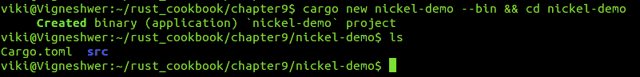

1.  在你喜欢的文本编辑器中打开`Cargo.toml`文件，并按照以下截图进行修改。在这里，我们使用 nickel crate，它在依赖项字段中输入：

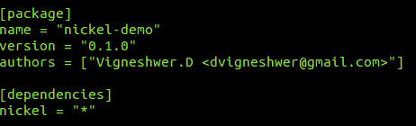

1.  使用以下命令在你的项目中安装 crate：

```rs
 cargo build

```

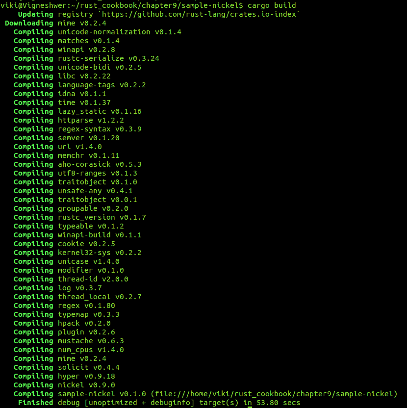

# 如何操作...

按照以下步骤实现这个菜谱：

1.  在你喜欢的文本编辑器中打开`src`目录下的`main.rs`文件。

1.  编写代码头，包含相关信息：

```rs
        //-- #########################
        //-- Task: Starting a simple hello world nickel web app
        //-- Author: Vigneshwer.D
        //-- Version: 1.0.0
        //-- Date: 20 April 17
        //-- ######################### 

```

1.  使用`extern`关键字导入已安装的`nickel` crate：

```rs
        #[macro_use] extern crate nickel;

        use nickel::Nickel;

```

1.  在`main`函数中定义，其中我们声明`server`实例：

```rs
        fn main() {
          let mut server = Nickel::new();

          server.utilize(router! {
          get "**" => |_req, _res| {
          "Hello world!"
          }
          });

        server.listen("127.0.0.1:6767");
        }

```

1.  保存文件，并从项目的根目录使用以下命令启动服务器：

```rs
 cargo run

```

在终端成功执行我们的代码后，我们将得到以下输出：

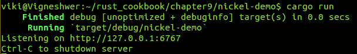

打开你喜欢的浏览器，并重定向到`http://127.0.0.1:6767/`以获取以下输出：

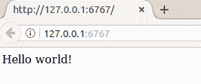

# 它是如何工作的...

在这个菜谱中，我们创建了一个名为`nickel-demo`的 Rust 项目，它帮助我们使用`nickel` Web 应用 crate 启动 Web 服务器。

从顶部开始，我们使用`extern`关键字引用了外部`nickel` crate，并使用`#[macro_use]`加载了所有宏。`nickel` crate 是应用程序对象和表面，它包含所有公共 API；它是一个结构体，实现了执行所有 web 应用程序任务的所有基本方法。在`main`函数中，我们首先将`server`实例分配给一个可变变量，并使用`Nickel::new()`创建一个新的`nickel`应用程序对象，它创建了一个具有默认错误处理的 nickel 实例。

接下来，我们设置端点路由，我们使用`router!`宏，它监听在`"**"`，当最终用户请求`get`请求时，提供一个简单的消息`"Hello world!"`。`nickel` crate 的`get`方法或服务器实例注册一个用于特定`get`请求的处理程序。处理程序被分配到路径上，路径允许包含变量和通配符；在我们的情况下，处理程序是`"**"`，这是一个通配符条目，基本上为任何端点的`get`请求返回相同的响应。通过此 API 添加的处理程序将被附加到默认路由器。双竖线字符在 Rust 中表示闭包；这是我们的`request`和`response`参数放置的地方，在我们的应用程序中分别是`_req`和`_res`。基本上，有一些结构体包含请求和响应数据。

使用`server.utilize`方法，我们将端点添加到服务器实例中，并注册处理程序，该处理程序将在其他处理程序之前被调用。`server.listen`方法监听在`127.0.0.1:6767`上的 API 请求，它绑定并监听给定主机和端口上的连接。

# 创建端点

在这个配方中，你将学习如何将`nickel` crate 安装到你的 Rust 项目中。你还将学习使用哪些命令可以在我们的 web 应用程序中创建自定义端点，当应用程序的最终用户访问时，会显示不同的消息。

# 准备工作

在我们继续并启动 web 服务器之前，我们必须安装以下`nickel` crate。按照以下步骤下载和设置你的项目中的`nickel` crate：

1.  我们将需要 Rust 编译器和任何文本编辑器来开发 Rust 代码片段。

1.  使用 Cargo 工具创建 Rust 项目并进入新创建的项目：

```rs
 cargo new --bin nickel-routing && cd nickel-routing

```

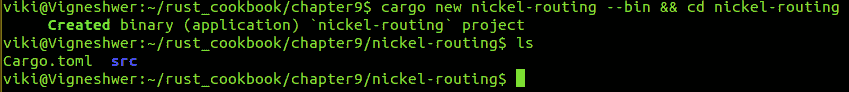

1.  在你最喜欢的文本编辑器中打开`Cargo.toml`文件，并按照以下截图进行修改。在这里，我们在依赖项字段中使用了`nickel` crate：

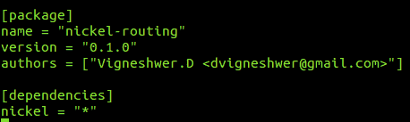

1.  使用以下命令在你的项目中安装 crate：

```rs
 cargo build

```

此命令将在你的 Rust 项目中安装`nickel` crate 的所有依赖。

# 如何操作...

按照以下步骤实现此配方：

1.  在你偏好的文本编辑器中打开`src`目录下的`main.rs`文件。

1.  使用相关信息编写代码头：

```rs
        //-- #########################
        //-- Task: Routing using nickel
        //-- Author: Vigneshwer.D
        //-- Version: 1.0.0
        //-- Date: 20 April 17
        //-- ######################### 

```

1.  使用 `extern` 关键字导入已安装的 `nickel` crate：

```rs
        #[macro_use] extern crate nickel;

        use nickel::{Nickel, HttpRouter};

```

1.  在 `main` 函数中定义 `main` 函数，其中我们声明 `server` 实例：

```rs
        fn main() {
        let mut server = Nickel::new();

        server.get("/bar", middleware!("This is the /bar
        handler"));
        server.get("/user/:userid", middleware! { |request|
        format!("This is user: {:?}", request.param("userid"))
        });
        server.get("/a/*/d", middleware!("matches /a/b/d but
        not /a/b/c/d"));
        server.get("/a/**/d", middleware!("This matches /a/b/d
        and also /a/b/c/d"));

        server.listen("127.0.0.1:6767");
        }

```

1.  保存文件，并从项目的根目录使用以下命令启动服务器：

```rs
 cargo run

```

在终端成功执行我们的代码后，我们将得到以下输出：

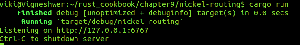

打开您喜欢的浏览器并重定向到以下端点：

+   输入 URL，`http://127.0.0.1:6767/bar`：

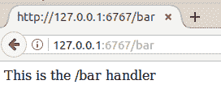

+   输入 URL，`http://127.0.0.1:6767/user/viki`：

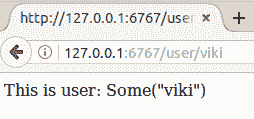

+   输入 URL，`http://127.0.0.1:6767/a/b/d/d`：

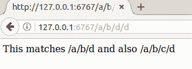

+   输入 URL，`http://127.0.0.1:6767/a/b/c/d`：

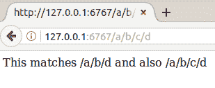

+   输入 URL，`http://127.0.0.1:6767/a/b/d`：

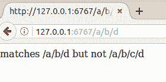

# 它是如何工作的...

在这个菜谱中，我们创建了一个名为 `nickel-routing` 的 Rust 项目，它帮助我们创建网络应用程序中的多个端点，并且每个端点显示不同的自定义消息。

从顶部开始，我们使用 `extern` 关键字引用了外部 `nickel` crate，并使用 `#[macro_use]` 加载了其所有宏。我们使用 `nickel` 作为应用程序对象和表面，它持有所有公共 API。它是一个实现了执行所有网络应用程序任务的基本方法的结构体，`HttpRouter` 是 `nickle` crate 提供的公共 trait，它具有各种 REST API 调用的签名。

在 `main` 函数中，我们首先将 `server` 实例分配给一个可变变量，并使用 `Nickel::new()` 创建一个新的 `nickel` 应用程序对象，这会创建一个具有默认错误处理的 `nickel` 实例。

`server.get` 方法注册一个用于特定 `get` 请求的处理程序。处理程序被分配到路径上，并且路径可以包含变量和通配符。通过此 API 添加的处理程序将被附加到默认路由器。`middleware!` 宏减少了每个路由所需的样板代码量。

在这个菜谱中，我们创建了以下路由：

+   `/bar`：点击此端点，我们得到消息，这是 /bar 处理程序。

+   `/user/:userid`：点击此端点，我们得到消息，这是用户：{:?}。在这里，参数被替换为通过 `request.param("userid")` 命令在 `get` 请求中传递的数据（`:userid`），其中 `param` 是 `request` 结构体的一个方法。

+   `/a/*/d`：点击此端点，我们得到消息，匹配 /a/b/d 但不匹配 /a/b/c/d。这里的星号允许只有一个中间路径。

+   `/a/**/d`：点击此端点，我们得到消息：这匹配 /a/b/d 和 /a/b/c/d。这里的星号允许有两个中间路径。

路径可以像 `/foo` 那样简单，可以使用参数、通配符，甚至双通配符。

`server.listen` 方法监听在 `127.0.0.1:6767` 上的 API 请求，它在该主机和端口上绑定并监听连接。

# 处理 JSON 请求

在本教程中，我们将学习如何将 `nickel` 包安装到您的 Rust 项目中，以及如何使用命令接受来自终端用户的端点 `POST` 请求。

# 准备工作

在我们继续并启动一个 web 服务器之前，我们必须安装以下 `nickel` 包。按照以下步骤下载并设置 `nickel` 和 `rustc_serialize` 包以供项目使用：

1.  我们将需要 Rust 编译器和任何文本编辑器来开发 Rust 代码片段。

1.  使用 Cargo 工具创建一个 Rust 项目并进入新创建的项目：

```rs
 cargo new nickel-jsonhandling --bin && cd nickel-    jsonhandling

```

查看以下截图：

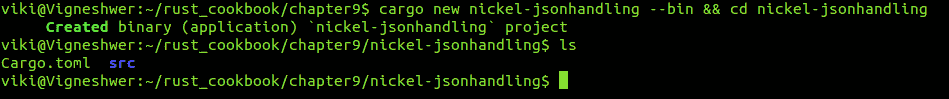

1.  在您最喜欢的文本编辑器中打开 `Cargo.toml` 文件并按照以下截图进行修改。在这里，我们使用 `nickel` 和 `rustc-serialize` 包，它们被输入到依赖项字段中：

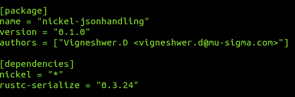

1.  使用以下命令在您的项目中安装该包：

```rs
 cargo build

```

此命令将在您的 Rust 项目中安装 `nickel` 和 `rustc-serialize` 包的所有依赖项。

# 如何做到这一点...

按照以下步骤实现本教程：

1.  在您首选的文本编辑器中打开 `src` 目录下的 `main.rs` 文件。

1.  使用相关信息的代码头：

```rs
        //-- #########################
        //-- Task: Json handling in nickel
        //-- Author: Vigneshwer.D
        //-- Version: 1.0.0
        //-- Date: 20 April 17
        //-- #########################

```

1.  使用 `extern` 关键字导入已安装的 `nickel` 和 `rustc-serialize` 包：

```rs
        extern crate rustc_serialize;
        #[macro_use] extern crate nickel;

        use nickel::{Nickel, HttpRouter, JsonBody};

```

1.  定义一个名为 `Person` 的自定义 `Struct` 类型：

```rs
        #[derive(RustcDecodable, RustcEncodable)]
        struct Person {
          firstname: String,
          lastname: String,
        }

```

1.  定义 `main` 函数，其中我们声明 `server` 实例：

```rs
        fn main() {
          let mut server = Nickel::new();

          server.post("/a/post/request", middleware! {
          |request,
          response|
          let person = request.json_as::<Person>().unwrap();
          format!("Hello {} {}", person.firstname,
          person.lastname)});

          server.listen("127.0.0.1:6767");
        }

```

1.  保存文件并从项目的根目录使用以下命令启动服务器：

```rs
 cargo run

```

在终端成功执行我们的代码后，我们将得到以下输出：

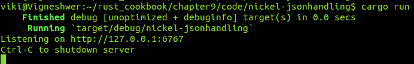

打开您的终端并输入以下命令以使用 `curl` 击中端点：

```rs
        curl -H "Content-Type: application/json" -X POST -d
        '{"firstname":"Vigneshwer","lastname":"Dhinakaran"}'
        http://127.0.0.1:6767/a/post/request

```

在使用 `curl` 命令成功击中端点后，我们将在输出中看到以下（突出显示）的响应：

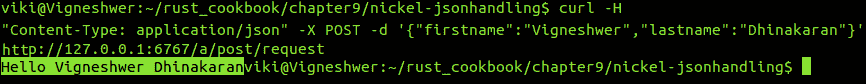

# 它是如何工作的...

在本教程中，我们创建了一个名为 `nickel-jsonhandling` 的 Rust 项目，它帮助我们从终端用户获取数据并根据输入执行一系列操作。`nickel` 包使得将 JSON 数据直接映射到您的结构体变得容易。我们在这个项目中使用 `rustc-serialize` 依赖项来处理 JSON 编码和解码。

从顶部开始，我们使用`extern`关键字引用了外部的`nickel`crate，并使用`#[macro_use]`加载了其所有宏。我们将`nickel`用作应用程序对象和表面，它包含所有公共 API；它基本上是一个实现了执行 Web 应用程序任务的所有基本方法的 struct。`HttpRouter`是`nickle`crate 提供的公共 trait，它具有各种 REST API 调用的签名。`JsonBody`是`nickle`crate 提供的公共 trait，它具有`json_as`方法的签名，该方法接受由`rustc-serialize`crate 提供的可解码类型。我们创建了一个名为`Person`的自定义 struct 类型，它有两个字符串字段：`firstname`和`lastname`。从终端用户发布的 JSON 体被转换为`Person`类型，这样我们就可以在我们的应用程序中使用它。为了能够编码数据，它必须实现`rustc_serialize::Encodable`trait。为了能够解码数据，它必须实现`rustc_serialize::Decodable`trait。Rust 编译器提供了一个注解，可以自动生成这些 trait 的代码：`#[derive(RustcDecodable, RustcEncodable)]`。

在`main`函数中，我们首先将`server`实例分配给一个可变变量，并使用`Nickel::new()`创建一个新的`nickel`应用程序对象，这会创建一个具有默认错误处理的`nickel`实例。

`server.post`方法注册一个用于特定`POST`请求的处理程序。处理程序被分配到路径上，路径允许包含变量和通配符。通过此 API 添加的处理程序将被附加到默认路由器。`middleware!`宏减少了每个路由所需的样板代码量。我们创建了一个变量`person`，它被分配给`request.json_as::<Person>().unwrap()`，其中`request`是一个包含终端用户信息的参数，`unwrap`方法是 Rust 提供的几种分配值的方法之一。我们在`format!`宏中提供了一个简单的消息`"Hello {} {}", person.firstname, person.lastname"`，当访问`/a/post/request`端点时将显示，其中`person`是`Person`类型的变量。

要访问端点，我们使用`curl`命令，其中`-H`代表头类型，是`"Content-Type: application/json"`，我们在`http://127.0.0.1:6767/a/post/request`上发送一个`POST`请求（`-X`），并附带以下数据（`-d`）:`'{"firstname":"Vigneshwer","lastname":"Dhinakaran"}'`。

`server.listen`方法监听在`127.0.0.1:6767`上的 API 请求，在那里它绑定并监听给定主机和端口上的连接。

# 构建自定义错误处理程序

在这个菜谱中，你将学习如何将`nickel`crate 安装到你的 Rust 项目中。你还将学习创建自定义错误处理程序的命令，例如，可以帮你创建自定义的`404`页面。

# 准备工作

在我们能够继续并启动 Web 服务器之前，我们必须安装以下`nickel`包。按照以下步骤下载和设置项目中的`nickel`包：

1.  我们将需要 Rust 编译器和任何文本编辑器来开发 Rust 代码片段。

1.  使用 Cargo 工具创建一个 Rust 项目，并进入新创建的项目：

```rs
 cargo new nickel-errorhandling --bin && cd nickel-errorhandling

```

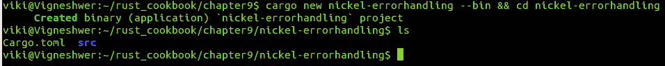

1.  在你偏好的文本编辑器中打开`Cargo.toml`文件，并按照以下截图进行修改。在这里，我们使用`nickel`包，它在依赖项字段中输入：

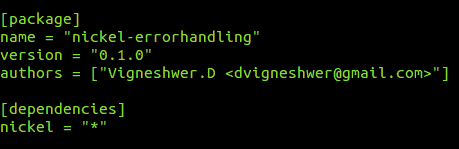

1.  使用以下命令在你的项目中安装该包：

```rs
 cargo build

```

此命令将在你的 Rust 项目中安装`nickle`包的所有依赖项。

# 如何操作...

按照以下步骤实现此配方：

1.  在你偏好的文本编辑器中打开`src`目录下的`main.rs`文件。

1.  使用相关信息的代码头进行编写：

```rs
        //-- #########################
        //-- Task: Custom error handling in nickel
        //-- Author: Vigneshwer.D
        //-- Version: 1.0.0
        //-- Date: 20 April 17
        //-- ######################### 

```

1.  使用`extern`关键字导入已安装的`nickel`包：

```rs
        #[macro_use] extern crate nickel;

        use std::io::Write;
        use nickel::status::StatusCode::NotFound;
        use nickel::{Nickel, NickelError, Action, Continue,
        Halt, Request};

```

1.  在`main`函数中定义，其中我们声明`server`实例：

```rs
        fn main() {
          let mut server = Nickel::new();

          //this is how to overwrite the default error handler
          to
          handle 404 cases with a custom view
          fn custom_404<'a>(err: &mut NickelError, _req: &mut
          Request) -> Action {
            if let Some(ref mut res) = err.stream {
              if res.status() == NotFound {
                let _ = res.write_all(b"<h1>Page Does not exist
                :
                (</h1>");
                return Halt(())
              }
            }

            Continue(())
            }

          let custom_handler: fn(&mut NickelError, &mut
          Request)
          -> Action = custom_404;

          server.handle_error(custom_handler);

          server.listen("127.0.0.1:6767");

        }

```

1.  保存文件，并从项目的根目录使用以下命令启动服务器：

```rs
 cargo run

```

在终端成功执行我们的代码后，我们将得到以下输出：

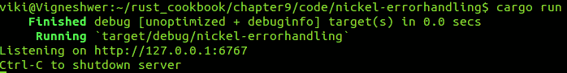

打开你喜欢的浏览器，并重定向到`127.0.0.1:6767/viki`以获取以下输出：

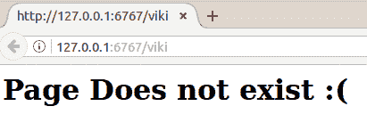

# 它是如何工作的...

在此配方中，我们创建了一个名为`nickel-errorhandling`的 Rust 项目，它帮助我们使用`nickel` Web 应用程序包启动 Web 服务器。默认情况下，`nickel`使用其默认的 ErrorHandler 捕获所有错误，并尝试采取合理的行动。

从顶部开始，我们使用`extern`关键字引用了外部的`nickel`包，并使用`#[macro_use]`加载了其所有宏。

我们使用了`nickel`包中的以下单元：

+   `nickel`包是应用程序对象和界面，它包含所有公共 API。它是一个实现了执行所有 Web 应用程序任务的基本方法的`struct`。

+   `NickelError`是`HTTP`错误以及用户定义错误的基类错误类型。

+   `Action`是`nickel`包提供的`enum`数据类型，其中`Continue`和`Halt`是`Action`类型的变体。

+   `Request`是一个用于存储所有请求数据的容器。

我们使用了`nickel::status::StatusCode::NotFound`；在这里，状态是`nickel`包的公共模块，它定义了一个包含不同 HTTP 状态码的`StatusCode` `enum`类型。`NotFound`是其中之一，`std::io::Write`是一个定义了`write_all`方法的`trait`，它将整个缓冲区中的所有数据写入。

在`main`函数中，我们首先将`server`实例分配给一个可变变量，并使用`Nickel::new()`创建一个新的`nickle`应用程序对象，它创建了一个具有默认错误处理的`nickle`实例。

我们创建了一个名为`custom_handler`的自定义错误处理器，在`NotFound`或`404`状态码的情况下被调用。我们调用函数`custom_404`，它接受两个参数，`NickelError`和`Request`，并返回一个`Action`类型。`custom_404`是一种覆盖默认错误处理器以使用自定义视图处理`404`情况的方法。

`custom_404`将`&mut NickelError`和`&mut Request`的参数分别赋值给`err`和`_req`。在函数中，我们将`err.stream`（`stream`是`NickelError`类型的一个字段）赋值给`Some(ref mut res)`，并检查它是否为真；否则返回`Continue(())`。如果为真，我们知道当最终用户尝试访问端点时发生了错误，下一步是检查状态码`res.status()`是否为`NotFound`。在这种情况下，我们使用`res.write_all`方法编写自定义的`404`页面，并返回`Halt(())`。

`server.handle_error`注册了一个错误处理器，当任何常规处理器返回错误时，它将在其他错误处理器中调用；在我们的情况下，其他错误处理器是`custom_handler`。

`server.listen`方法监听在`127.0.0.1:6767`上的 API 请求，它在该主机和端口上绑定并监听连接。

# 托管模板

在这个配方中，您将学习如何将`nickle`crate 安装到您的 Rust 项目中，并学习当最终用户点击端点时我们可以使用哪些命令来托管自定义模板。

# 准备工作

在我们继续并启动 web 服务器之前，我们必须安装以下`nickle`crate。按照以下步骤下载并设置项目中的`nickle`crate：

1.  我们将需要 Rust 编译器和任何文本编辑器来开发 Rust 代码片段。

1.  使用 Cargo 工具创建 Rust 项目并进入新创建的项目：

```rs
 cargo new nickel-template --bin && cd nickel-template

```

看看下面的截图：

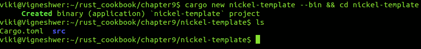

1.  在您最喜欢的文本编辑器中打开`Cargo.toml`文件，并按照以下截图所示进行修改。在这里，我们使用`nickle`crate，它在依赖项字段中输入：

    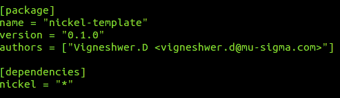

1.  使用以下命令在您的项目中安装 crate：

```rs
 cargo build

```

此命令将在您的 Rust 项目中安装`nickle`crate 的所有依赖项。

# 如何操作...

按照以下步骤实现此配方：

1.  在您首选的文本编辑器中打开`src`目录中的`main.rs`文件。

1.  使用相关信息的代码头进行编写：

```rs
        //-- #########################
        //-- Task: Templating in nickel
        //-- Author: Vigneshwer.D
        //-- Version: 1.0.0
        //-- Date: 20 April 17
        //-- ######################### 

```

1.  使用`extern`关键字导入已安装的`nickle`crate：

```rs
        #[macro_use] extern crate nickel;

        use std::collections::HashMap;
        use nickel::{Nickel, HttpRouter};

```

1.  在`main`函数中定义我们声明的`server`实例：

```rs
        fn main() {
          let mut server = Nickel::new();

          server.get("/", middleware! { |_, response|
          let mut data = HashMap::new();
          data.insert("name", "viki");
          return
          response.render("examples/assets/template.tpl",
          &data);
          });

          server.listen("127.0.0.1:6767");
        }

```

1.  使用以下命令创建 `examples/assets` 目录和 `template.tpl` 文件：

```rs
 mkdir -p examples/assets
        cd ./examples/assets
        touch template.tpl

```

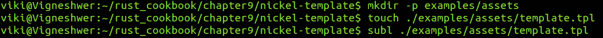

1.  在文本编辑器中打开文件 `template.tpl` 并输入以下代码：

```rs
        <html>
        <body>
        <h1>
        Hello {{ name }}!
        </h1>
        </body>
        </html>

```

1.  保存文件，并从项目的根目录使用以下命令启动服务器：

```rs
 cargo run

```

在终端成功执行我们的代码后，我们将得到以下输出：

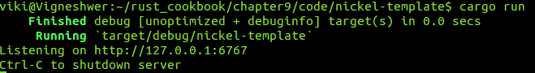

打开您喜欢的浏览器并重定向到 `127.0.0.1:6767` 以获取以下输出：

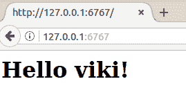

# 它是如何工作的...

在这个菜谱中，我们创建了一个名为 `nickel-template` 的 Rust 项目，当最终用户尝试访问特定端点时，它会加载一个自定义的 HTML 模板，其中包含动态数据字段。

从顶部开始，我们使用 `extern` 关键字引用了外部的 `nickel` crate，并使用 `#[macro_use]` 加载了其所有宏。我们将 `nickel` 作为应用程序对象和表面使用，它包含所有公共 API；它是一个实现了执行所有网络应用程序任务的基本方法的 struct；我们还使用了 `HttpRouter`，这是 `nickle` crate 提供的公共 trait，具有各种 REST API 调用的签名，以及来自 `std::collections` 的 `Hashmap` 类型。

HashMaps 通过键存储值。`HashMap` 的键可以是布尔值、整数、字符串和向量。HashMap 是可增长的，但当它们有额外空间时，HashMap 也可以缩小自己。

在 `main` 函数中，我们首先将 `server` 实例分配给一个可变变量，并使用 `Nickel::new()` 创建一个新的 `nickel` 应用程序对象，它创建了一个具有默认错误处理的 `nickel` 实例。

`server.get` 方法注册了一个用于特定 `get` 请求的处理程序。处理程序被分配到路径上，路径允许包含变量和通配符。通过此 API 添加的处理程序将被附加到默认路由器。`middleware!` 宏减少了每个路由所需的样板代码量。这里的路径是 `"/"`，其中响应包含需要返回给最终用户的数据。我们托管在 `examples/asset s/template.tpl` 中创建的模板，并为 `response.render` 的参数提供 `name` 字段的输入，它作为输出返回给最终用户。我们创建了一个名为 `data` 的可变变量，其类型为 `HashMap`。我们还插入了一个名为 `name` 的键，并使用 `data.insert` 分配了值 `"viki"`。

`server.listen` 方法监听 `127.0.0.1:6767` 上的 API 请求，其中它绑定并监听给定主机和端口上的连接。
