# 第十章：Rust 的高级 Web 开发

在本章中，我们将介绍以下配方：

+   设置 API

+   在 MongoDB 中保存用户数据

+   获取用户数据

+   删除用户数据

# 简介

在本章中，我们将使用 Rust 语言中的开源软件包创建 RESTful API 网络服务。Rust 中的简单 RESTful API 将连接到 MongoDB 服务，提供端到端的 API 解决方案。

我们将探讨如何从端点执行对用户数据的 `GET`、`POST` 和 `DELETE` 请求。`nickel.rs` 软件包和 MongoDB Rust 驱动程序使得在 Rust 语言中创建这些操作成为可能。

# 设置 API

在此配方中，您将学习到安装所有依赖项的步骤，例如 nickel 软件包，以设置并创建我们的 Rust 项目的 API，您还将学习到设置基本 REST API 服务的所需命令。

# 准备就绪

在我们继续创建 REST API 之前，我们必须安装以下 nickel 和 MongoDB 软件包。按照给定的步骤下载和设置 nickel 以及其他软件包到您的项目中：

1.  我们将需要 Rust 编译器和任何文本编辑器来开发 Rust 代码片段。

1.  使用 `cargo` 命令行工具创建 Rust 项目，并进入新创建的项目：

```rs
 cargo new --bin sample_rest_api && cd sample_rest_api 

```

看看以下截图：

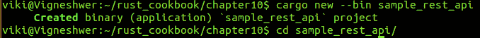

1.  在您的首选文本编辑器中打开 `Cargo.toml` 文件，并按照以下截图进行修改。在此处，我们使用 nickel 软件包，它在依赖项字段中输入：

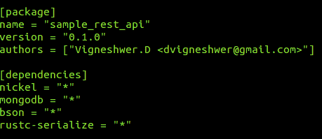

1.  使用以下命令在项目中安装该软件包：

```rs
 cargo build

```

您将得到以下截图作为输出：

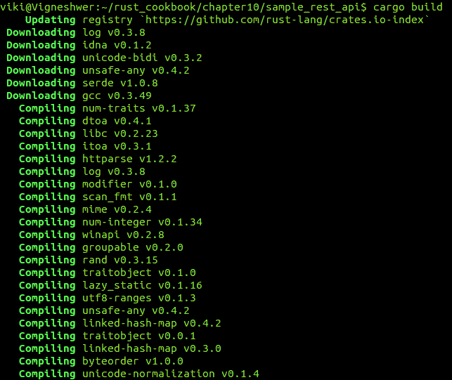

# 如何做到...

执行以下步骤以实现此配方：

1.  在您的首选文本编辑器中打开 `src` 目录下的 `main.rs` 文件。

1.  使用相关信息的代码头：

```rs
        //-- #########################
        //-- Task: Creating a simple REST API
        //-- Author: Vigneshwer.D
        //-- Version: 1.0.0
        //-- Date: 28 April 17
        //-- ######################### 

```

1.  使用 `extern` 关键字导入已安装的 nickel 软件包：

```rs
        #[macro_use]
        extern crate nickel;

        use nickel::{Nickel, JsonBody, HttpRouter, Request,
        Response, MiddlewareResult, MediaType};

```

1.  在其中声明 `server` 实例的 `main` 函数中定义：

```rs
        fn main() {

         let mut server = Nickel::new();
         let mut router = Nickel::router();

```

1.  定义 `GET` 端点：

```rs
        router.get("/users", middleware! { |request, response|

        format!("Hello from GET /users")

        });

```

1.  定义 `POST` 端点：

```rs
        router.post("/users/new", middleware! { |request,
        response|

        format!("Hello from POST /users/new")

        });

```

1.  定义 `DELETE` 端点：

```rs
        router.delete("/users/:id", middleware! { |request,
        response|

        format!("Hello from DELETE /users/:id")

        });

```

1.  声明服务启动的端口：

```rs
        server.utilize(router);

        server.listen("127.0.0.1:9000");
        }

```

1.  保存文件，并从项目的根目录使用以下命令启动服务器：

```rs
 cargo run

```

1.  在终端成功执行我们的代码后，我们将得到以下输出：

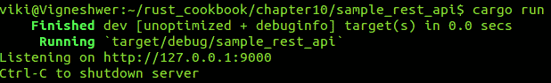

我们向 `http://127.0.0.1:9000/users` 发送 `GET` 请求，该请求从使用 nickel 网络应用程序框架创建的 Web 服务返回 `Hello from GET /users`，如下截图所示：

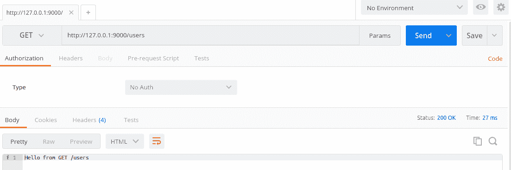

我们向 `http://127.0.0.1:9000/users/new` 发送 `POST` 请求，该请求从使用 nickel 网络应用程序框架创建的 Web 服务返回 `Hello from POST /users/new`：

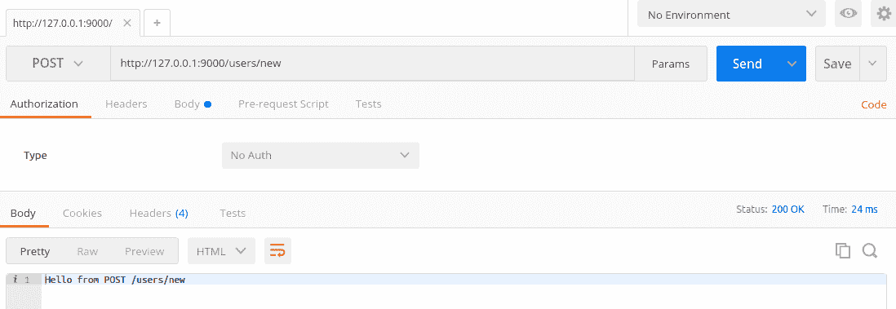

我们向`http://127.0.0.1:9000/users/:id`发送一个`DELETE`请求，它从使用镍 Web 应用程序框架创建的 Web 服务中返回`Hello from DELETE /users/:id`：

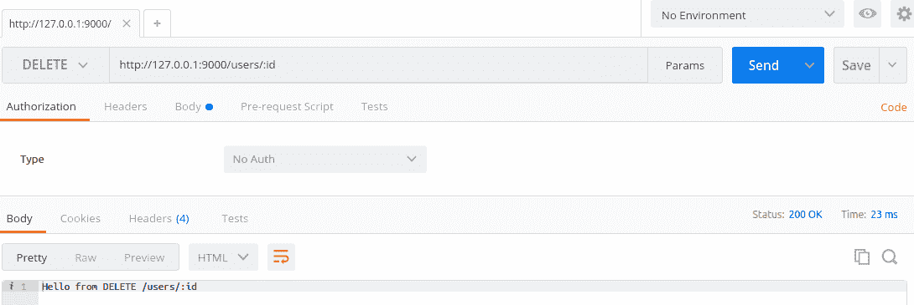

# 它是如何工作的...

在这个菜谱中，我们创建了我们的 REST API 服务的骨架，其中我们设置了所有的端点。

我们的 API 将有三个端点，如下所示：

+   `/users`：在这里，我们将执行`GET`请求，以检索所有用户的`firstname`字段

+   `/users/new`：对该端点的`POST`请求将创建并保存一个新的用户

+   `/users/:id`：`DELETE`方法将根据记录的`ObjectId`删除一个用户，这是从 MongoDB 数据库中获得的唯一 ID

我们将在接下来的菜谱中激活所有这些端点，并展示它们的确切行为，但当前，当用户使用相应的请求点击端点时，这些端点将只显示一条示例消息。

从顶部开始，我们使用`extern`关键字引用外部镍 crate，并使用`#[macro_use]`加载其所有宏。镍是应用程序对象和包含所有公共 API 的表面；它是一个结构体，实现了执行所有 Web 应用程序任务的基本方法。我们最初使用`cargo`工具下载的其他 crate，如 bson、rustc-serialize 和 MongoDB，将在以下菜谱中用于激活端点的功能。

在`main`函数中，我们首先将`server`实例分配给一个可变变量，并使用`Nickel::new()`创建一个新的镍应用程序对象，这会创建一个具有默认错误处理的镍实例。同样，我们创建一个可变路由实例并将其分配给`Nickel::router()`，它将负责处理不同的端点。

我们使用`router`实例的不同方法（如`get()`、`post()`和`delete()`）设置我们的端点路由，并在`format!`宏中提供一个简单的消息，当访问这些端点时显示。消息如下：

+   `/users`：对该端点的`GET`请求将返回`Hello from GET /users`

+   `/users/new`：对该端点的`POST`请求将返回`Hello from POST /users/new`

+   `/users/:id`：对该端点的`DELETE`请求将返回`Hello from DELETE /users/:id`

`middleware!`宏由`nickel.rs`提供，它减少了每个路由所需的样板代码量。双竖线字符代表 Rust 中的闭包，这是我们放置`request`和`response`参数的地方。

使用`server.utilize`方法，我们将端点添加到`server`实例中，并通过传递`router`实例注册将在其他处理程序之前调用的处理程序。`server.listen`方法监听在`127.0.0.1:9000`上的 API 请求，它绑定并监听给定主机和端口上的连接。

# 在 MongoDB 中保存用户数据

在这个配方中，我们将进一步重写`POST`请求的逻辑，该请求将获取用户数据并将其保存到 MongoDB 数据库中，我们将使用 MongoDB Rust 驱动程序与数据库交互。

# 准备工作

在我们继续创建 REST API 之前，必须安装以下 nickel 和 MongoDB crates。按照以下步骤在项目中下载和设置 nickel 和 MongoDB 服务：

1.  我们将需要 Rust 编译器和任何文本编辑器来开发 Rust 代码片段。

1.  使用`cargo`命令行工具创建 Rust 项目，并进入新创建的项目：

```rs
 cargo new --bin sample_post && cd sample_post

```

看看下面的截图：

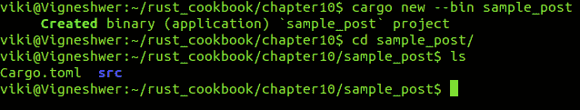

1.  在您喜欢的文本编辑器中打开`Cargo.toml`文件，并根据以下截图进行修改。在这里，我们使用的是 nickel crate，它在依赖项字段中输入：

    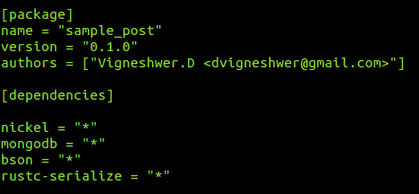

1.  使用以下命令在项目中安装 crate：

```rs
 cargo build

```

1.  按照以下步骤在您的 Linux 系统中设置 MongoDB 服务：

```rs
 sudo apt-key adv --keyserver
      hkp://keyserver.ubuntu.com:80 --recv 7F0CEB10

 echo "deb http://repo.mongodb.org/apt/ubuntu
      "$(lsb_release -sc)"/mongodb-org/3.0 multiverse" | sudo
      tee /etc/apt/sources.list.d/mongodb-org-3.0.list

 sudo apt-get update

 sudo apt-get install -y mongodb-org

 service mongod status

```

# 如何操作...

按照提到的步骤实现此配方：

1.  在您首选的文本编辑器中打开`src`目录下的`main.rs`文件。

1.  使用相关信息的代码头：

```rs
        //-- #########################
        //-- Task: Perform POST action
        //-- Author: Vigneshwer.D
        //-- Version: 1.0.0
        //-- Date: 28 April 17
        //-- ######################### 

```

1.  使用`extern`关键字导入所有必需的已安装的 nickel 和其他支持 crate：

```rs
        #[macro_use]
        extern crate nickel;
        extern crate rustc_serialize;

        #[macro_use(bson, doc)]
        extern crate bson;
        extern crate mongodb;

        // Nickel
        use nickel::{Nickel, JsonBody, HttpRouter, MediaType};
        use nickel::status::StatusCode::{self};

        // MongoDB
        use mongodb::{Client, ThreadedClient};
        use mongodb::db::ThreadedDatabase;
        use mongodb::error::Result as MongoResult;

        // bson
        use bson::{Bson, Document};
        use bson::oid::ObjectId;

        // rustc_serialize
        use rustc_serialize::json::{Json, ToJson};

```

1.  我们创建一个名为`User`的`struct`，它是可编码和可解码的，并模拟我们的用户数据：

```rs
        #[derive(RustcDecodable, RustcEncodable)]
        struct User {
         firstname: String,
         lastname: String,
         email: String
        }

```

1.  定义`main`函数，其中我们将声明`server`实例：

```rs
        fn main() {

         let mut server = Nickel::new();
         let mut router = Nickel::router();

```

1.  定义`GET`端点：

```rs
         router.get("/users", middleware! { |request, response|

         format!("Hello from GET /users")

         });

```

1.  定义`POST`端点：

```rs
        router.post("/users/new", middleware! { |request,
        response|

        // Accept a JSON string that corresponds to the User
        struct
        let user = request.json_as::<User>().unwrap();

        let firstname = user.firstname.to_string();
        let lastname = user.lastname.to_string();
        let email = user.email.to_string();

        // Connect to the database
        let client = Client::connect("localhost", 27017)
        .ok().expect("Error establishing connection.");

        // The users collection
        let coll = client.db("rust-
        cookbook").collection("users");

        // Insert one user
        match coll.insert_one(doc! {
        "firstname" => firstname,
        "lastname" => lastname,
        "email" => email
        }, None) {
        Ok(_) => (StatusCode::Ok, "Item saved!"),
        Err(e) => return response.send(format!("{}", e))
        }

        });

```

1.  定义`DELETE`端点：

```rs
        router.delete("/users/:id", middleware! { |request,
        response|

        format!("Hello from DELETE /users/:id")

        });

```

1.  声明服务启动的端口：

```rs
        server.utilize(router);

        server.listen("127.0.0.1:9000");
        }

```

1.  保存文件，并从项目的根目录使用以下命令启动服务器：

```rs
 cargo run

```

在终端成功执行我们的代码后，将得到以下截图作为输出：

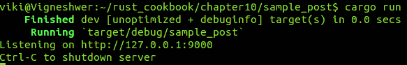

我们向`http://127.0.0.1:9000/users/new`提交一个包含用户数据的`POST`请求，如下面的截图所示：

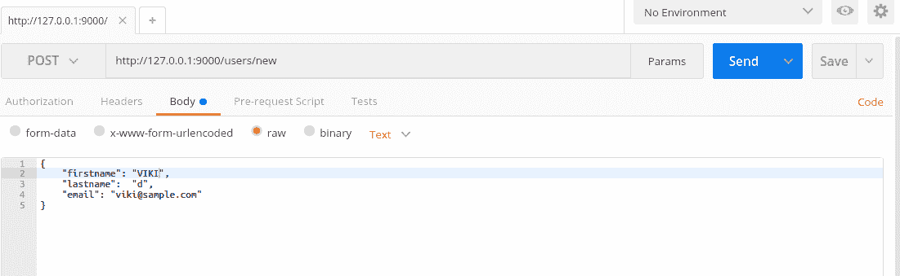

在成功的 API 调用中，使用 nickel 网络应用程序框架构建的 Web 服务返回消息`Item saved!`，这是数据已按代码中提到的 MongoDB 配置保存的指示。看看下面的截图：

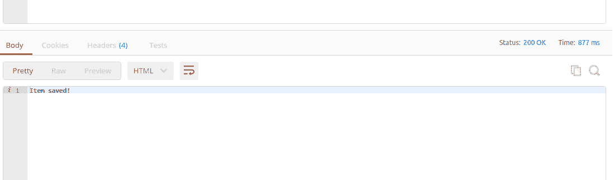

为了验证`POST`请求是否成功，我们可以从 MongoDB 数据库中验证记录，其中我们可以选择`rust-cookbook`数据库和`users`集合：

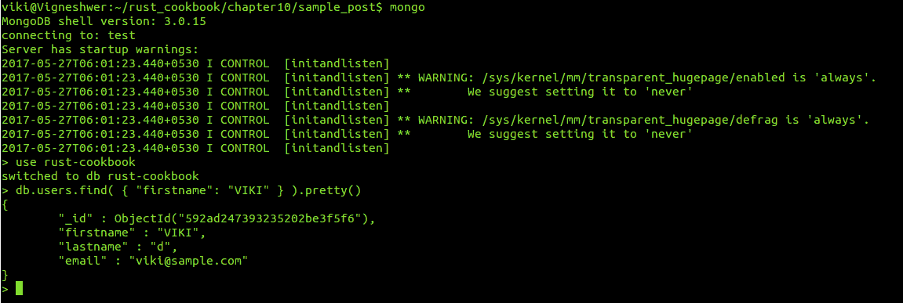

在这个配方中，我们专注于获取用户数据并将其保存到数据库中。我们激活了对`/users/new`端点的`POST`请求，以创建和保存新用户。

从顶部开始，我们使用 `extern` 关键字引用外部 nickel crate，并使用 `#[macro_use]` 加载了其所有宏。Nickel 是应用程序对象和表面，它包含所有公共 API；它是一个结构体，实现了执行所有网络应用程序任务的基本方法。

在 `main` 函数中，我们首先将 `server` 可变实例分配给一个可变变量，并使用 `Nickel::new()` 创建一个新的 nickel 应用程序对象，这会创建一个具有默认错误处理的 nickel 实例。同样，我们创建一个可变路由实例并将其分配给 `Nickel::router()`，它将负责处理不同的端点。

MongoDB Rust 驱动程序提供了一个优雅的接口，用于与数据库、集合和游标进行交互，通过它我们可以在应用程序中建立数据库连接，用于创建、读取、更新和删除用户数据。

我们将使 `POST /users/new` 路由工作，我们将使用最初下载的不同 crate，它们是 `rustc_serialize`、`bson` 和 `MongoDB` 的单元。

接下来，我们将创建一个复杂的数据结构，这是一个可编码和解码的 `User` 结构体，它代表我们的用户数据字段。

我们需要从用户端发送一个 JSON 字符串输入，并通过创建一些可以保存数据的变量将输入数据转换为 `User` 结构体。`unwrap` 方法是 Rust 提供的几种分配值的方法之一。从用户输入中解包的数据被保存到变量 `firstname`、`lastname` 和 `email` 中。下一步是建立与 MongoDB 服务的连接，以便我们可以存储从输入字符串中解析出的数据。我们通过 `Client::connect("localhost", 27017)` 实现这一点，其中 `27017` 是 MongoDB 服务运行的端口。`coll` 变量通过 `client.db("rust-cookbook").collection("users")` 将数据库中的特定集合与 `client` 连接，其中 `rust-cookbook` 是数据库，`users` 是集合。

当我们使用 `coll.insert_doc` 插入用户数据时，我们可以看到 `match` 语句在起作用。在 `Ok` 条件下，我们返回一个成功消息，即 `Item saved`，在 `Err` 条件下，我们返回一个错误。

使用 `server.utilize` 方法，我们将端点添加到服务器实例并注册处理程序，该处理程序将在传递 `router` 实例之前由其他处理程序调用，以处理每个请求。`server.listen` 方法监听 `127.0.0.1:9000` 上的 API 请求，其中它绑定并监听给定主机和端口上的连接。

# 获取用户数据

在这个菜谱中，你将学习如何安装所有依赖项的步骤，例如镍 crate，以设置和创建 API，以及 MongoDB Rust 驱动程序以在我们的 Rust 项目中与数据库交互。你还将学习使用哪些命令可以从数据库中获取所有所需的具体数据。`GET`请求将使用`POST`方法检索之前保存在数据库中的`firstname`字段的数据。

# 准备工作

在我们继续创建 REST API 之前，我们必须安装以下镍和 MongoDB crates。按照以下步骤下载和设置项目中的 nickel 和 MongoDB 服务：

1.  我们将需要 Rust 编译器和任何文本编辑器来开发 Rust 代码片段。

1.  使用`cargo`命令行工具创建 Rust 项目，并进入新创建的项目：

```rs
 cargo new --bin sample_get && cd sample_get

```

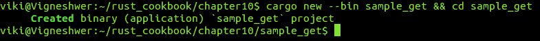

1.  在你喜欢的文本编辑器中打开`Cargo.toml`文件，并按照以下截图进行修改。在这里，我们使用 nickel crate，它在依赖项字段中输入：

    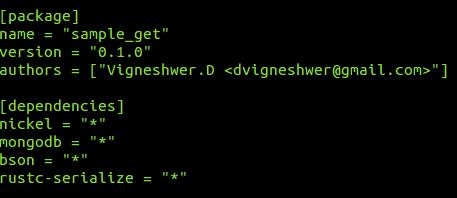

1.  使用以下命令在你的项目中安装 crate：

```rs
 cargo build

```

1.  按照以下步骤在你的系统中设置 MongoDB 服务：

```rs
        sudo apt-key adv --keyserver
        hkp://keyserver.ubuntu.com:80 --recv 7F0CEB10

        echo "deb http://repo.mongodb.org/apt/ubuntu
        "$(lsb_release -sc)"/mongodb-org/3.0 multiverse" | sudo
        tee /etc/apt/sources.list.d/mongodb-org-3.0.list

        sudo apt-get update

        sudo apt-get install -y mongodb-org

        service mongod status

```

# 如何操作...

按照以下步骤实现这个菜谱：

1.  在你喜欢的文本编辑器中打开`src`目录下的`main.rs`文件。

1.  使用相关信息的代码头：

```rs
        //-- #########################
        //-- Task: Perform GET action
        //-- Author: Vigneshwer.D
        //-- Version: 1.0.0
        //-- Date: 28 April 17
        //-- ######################### 

```

1.  使用`extern`关键字导入所有已安装的 nickel 和其他支持 crate：

```rs
        #[macro_use]
        extern crate nickel;
        extern crate rustc_serialize;

        #[macro_use(bson, doc)]
        extern crate bson;
        extern crate mongodb;

        // Nickel
        use nickel::{Nickel, JsonBody, HttpRouter, MediaType};
        use nickel::status::StatusCode::{self};

        // MongoDB
        use mongodb::{Client, ThreadedClient};
        use mongodb::db::ThreadedDatabase;
        use mongodb::error::Result as MongoResult;

        // bson
        use bson::{Bson, Document};
        use bson::oid::ObjectId;

        // rustc_serialize
        use rustc_serialize::json::{Json, ToJson};

```

1.  我们创建了一个名为`User`的`struct`，它是可编码和可解码的，并模拟我们的用户数据：

```rs
        #[derive(RustcDecodable, RustcEncodable)]
        struct User {
          firstname: String,
          lastname: String,
          email: String
        }

```

1.  在其中声明`server`实例的`main`函数中：

```rs
        fn main() {

          let mut server = Nickel::new();
          let mut router = Nickel::router();

```

1.  定义`GET`端点：

```rs
        router.get("/users", middleware! { |request, response|

        // Connect to the database
        let client = Client::connect("localhost", 27017)
        .ok().expect("Error establishing connection.");

        // The users collection
        let coll = client.db("rust-
        cookbook").collection("users");

        // Create cursor that finds all documents
        let mut cursor = coll.find(None, None).unwrap();

        // Opening for the JSON string to be returned
        let mut data_result = "{\"data\":[".to_owned();

        for (i, result) in cursor.enumerate() {

        if let Ok(item) = result {
          if let Some(&Bson::String(ref firstname)) =
          item.get("firstname") {

            let string_data = if i == 0 {
            format!("{},", firstname)
            } else {
              format!("{},", firstname)
            };
          data_result.push_str(&string_data);
        }

        }
        }

        // Close the JSON string
        data_result.push_str("]}");

        // Send back the result
        format!("{}", data_result)

        });

```

1.  定义`POST`端点：

```rs
        router.post("/users/new", middleware! { |request,
        response|

        // Accept a JSON string that corresponds to the User
        struct
        let user = request.json_as::<User>().unwrap();

        let firstname = user.firstname.to_string();
        let lastname = user.lastname.to_string();
        let email = user.email.to_string();

        // Connect to the database
        let client = Client::connect("localhost", 27017)
        .ok().expect("Error establishing connection.");

        // The users collection
        let coll = client.db("rust
        -cookbook").collection("users");

        // Insert one user
        match coll.insert_one(doc! {
        "firstname" => firstname,
        "lastname" => lastname,
        "email" => email
        }, None) {
        Ok(_) => (StatusCode::Ok, "Item saved!"),
        Err(e) => return response.send(format!("{}", e))
        }

        });

```

1.  定义`DELETE`端点：

```rs
        router.delete("/users/:id", middleware! { |request,
        response|

        format!("Hello from DELETE /users/:id")

        });

```

1.  声明服务将启动的端口：

```rs
        server.utilize(router);

        server.listen("127.0.0.1:9000");
        }

```

1.  保存文件，并从项目的根目录使用以下命令启动服务器：

```rs
 cargo run

```

1.  在我们的代码在终端成功执行后，我们将得到以下输出：

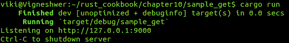

我们向`http://127.0.0.1:9000/users`提交`GET`请求，如以下截图所示，它从使用 nickel Web 应用程序框架创建的 Web 服务中检索用户数据，在成功的 API 调用中返回`{"data":[VIKI,]}`。数据是从之前菜谱中的 MongoDB 记录中检索的，我们将其存储在`rust-cookbook`数据库中，如以下截图所示：

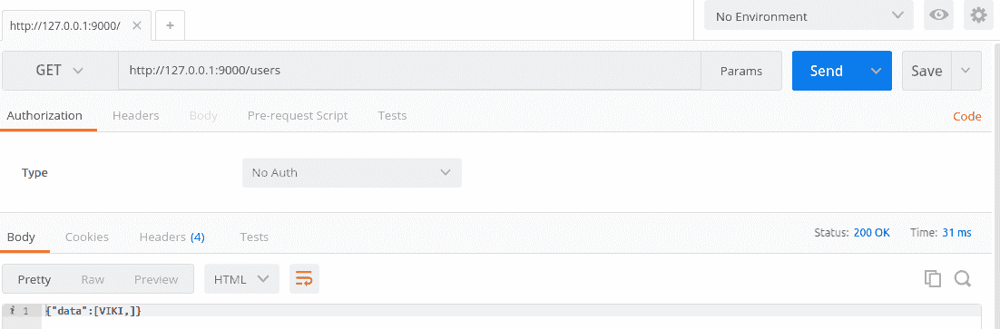

# 它是如何工作的...

在这个菜谱中，我们专注于从数据库中获取之前保存的用户数据。我们激活了对`/users`端点的`GET`请求以获取数据。

从顶部开始，我们使用`extern`关键字引用了外部镍制箱，并通过`#[macro_use]`加载了其所有宏。镍是应用程序对象和表面，它包含所有公共 API。它是一个实现了执行所有 Web 应用程序任务的基本方法的`struct`。

在`main`函数中，我们首先将可变`server`实例分配给一个可变变量，并使用`Nickel::new()`创建一个新的镍应用程序对象，这会创建一个具有默认错误处理的镍实例。同样，我们创建一个可变路由实例并将其分配给`Nickel::router()`，这将负责处理不同的端点。

我们将使`GET/users`路由工作，我们将使用最初下载的不同 crate，它们是`rustc_serialize`、`bson`和`MongoDB`的单元。

接下来，我们创建一个复杂的数据结构，这是一个可编码和可解码的`User`结构体，它代表我们的用户数据字段。

我们首先与 MongoDB 服务建立连接，以便我们可以存储从输入字符串中解析出的数据。我们通过`Client::connect("localhost", 27017)`实现这一点，其中`27017`是 MongoDB 服务运行的端口，`coll`变量通过`client.db("rust-cookbook").collection("users")`将特定的集合与数据库中的`users`集合连接起来，其中`rust-cookbook`是数据库，`users`是集合。然后，我们必须遍历集合中的所有值，为此我们创建了一个名为`cursor`的可变实例，它使用`find`方法获取`users`集合中的所有文档。我们创建了一个`data_result`实例，它是一个 JSON 字符串，在从集合中获取所有数据后将被返回给用户。然后我们使用`for`循环遍历`result`，其中我们使用 cursor 的`enumerate`方法收集`i`索引和文档的`Bson`形式。我们将`item`实例的`firstname`字段转换为字符串，使用`Bson`，并将结果推送到`data_result`字符串。最后，我们关闭帖子，将其发送回用户，在`format!`宏中完成。

使用`server.utilize`方法，我们将端点添加到服务器实例，并通过传递`router`实例来注册将在其他处理程序之前被调用的处理程序。`server.listen`方法监听`127.0.0.1:9000`上的 API 请求，在那里它绑定并监听给定主机和端口上的连接。

# 删除用户数据

在这个配方中，您将学习如何安装所有依赖项的步骤，例如镍 crate，以设置和创建 API，以及 MongoDB Rust 驱动程序以与 Rust 项目中的数据库交互。您还将学习使用哪些命令可以从数据库中获取所有所需的具体数据。`GET` 请求将检索之前通过 `POST` 方法保存到数据库中的 `firstname` 字段的数据，然后我们将删除检索到的对象，这使得这个过程成为一个端到端的 REST API 服务。

# 准备工作

在我们继续创建 REST API 之前，我们必须安装以下镍和 MongoDB crate。按照以下步骤下载和设置项目中的镍和 MongoDB 服务：

1.  我们将需要 Rust 编译器和任何文本编辑器来开发 Rust 代码片段。

1.  使用 `cargo` 命令行工具创建一个 Rust 项目，并进入新创建的项目：

```rs
 cargo new --bin sample_app && cd sample_app

```

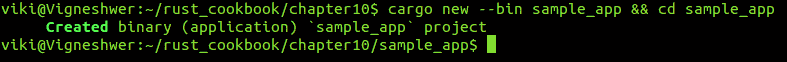

1.  在您喜欢的文本编辑器中打开 `Cargo.toml` 文件，并按照以下截图所示进行修改。在此，我们使用镍 crate，它在依赖项字段中输入：

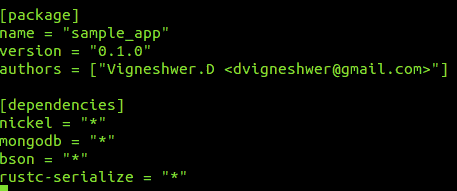

1.  使用以下命令在您的项目中安装 crate：

```rs
 cargo build

```

1.  通过以下步骤在您的系统中设置 MongoDB 服务：

```rs
        sudo apt-key adv --keyserver
        hkp://keyserver.ubuntu.com:80 --recv 7F0CEB10

        echo "deb http://repo.mongodb.org/apt/ubuntu
        "$(lsb_release -sc)"/mongodb-org/3.0 multiverse" | sudo
        tee /etc/apt/sources.list.d/mongodb-org-3.0.list

        sudo apt-get update

        sudo apt-get install -y mongodb-org

        service mongod status

```

# 如何操作...

执行以下步骤以实现此配方：

1.  在您首选的文本编辑器中打开 `src` 目录下的 `main.rs` 文件。

1.  编写带有相关信息的代码头：

```rs
    //-- #########################
    //-- Task: Perform DELETE action
    //-- Author: Vigneshwer.D
    //-- Version: 1.0.0
    //-- Date: 28 April 17
    //-- ######################### 

```

1.  使用 `extern` 关键字导入所有必需的已安装的镍和其他支持 crate：

```rs
        #[macro_use]
        extern crate nickel;
        extern crate rustc_serialize;

        #[macro_use(bson, doc)]
        extern crate bson;
        extern crate mongodb;

        // Nickel
        use nickel::{Nickel, JsonBody, HttpRouter, MediaType};
        use nickel::status::StatusCode::{self};

        // MongoDB
        use mongodb::{Client, ThreadedClient};
        use mongodb::db::ThreadedDatabase;
        use mongodb::error::Result as MongoResult;

        // bson
        use bson::{Bson, Document};
        use bson::oid::ObjectId;

        // rustc_serialize
        use rustc_serialize::json::{Json, ToJson};

```

1.  我们创建了一个名为 `User` 的 `struct`，它是可编码和可解码的，并模拟我们的用户数据：

```rs
        #[derive(RustcDecodable, RustcEncodable)]
        struct User {
         firstname: String,
         lastname: String,
         email: String
        }

```

1.  定义包含我们声明 `server` 实例的 `main` 函数：

```rs
        fn main() {

          let mut server = Nickel::new();
          let mut router = Nickel::router();

```

1.  定义 `GET` 端点：

```rs
        router.get("/users", middleware! { |request, response|

        // Connect to the database
        let client = Client::connect("localhost", 27017)
        .ok().expect("Error establishing connection.");

        // The users collection
        let coll = client.db("rust-
        cookbook").collection("users");

        // Create cursor that finds all documents
        let mut cursor = coll.find(None, None).unwrap();

        // Opening for the JSON string to be returned
        let mut data_result = "{\"data\":[".to_owned();

        for (i, result) in cursor.enumerate() {

        if let Ok(item) = result {
        if let Some(&Bson::String(ref firstname)) =
        item.get("firstname") {

        let string_data = if i == 0 {
        format!("{},", firstname)
        } else {
        format!("{},", firstname)
        };
        data_result.push_str(&string_data);
        }

        }
        }

        // Close the JSON string
        data_result.push_str("]}");

        // Send back the result
        format!("{}", data_result)

        });

```

1.  定义 `POST` 端点：

```rs
        router.post("/users/new", middleware! { |request,
        response|

        // Accept a JSON string that corresponds to the User
        struct
        let user = request.json_as::<User>().unwrap();

        let firstname = user.firstname.to_string();
        let lastname = user.lastname.to_string();
        let email = user.email.to_string();

        // Connect to the database
        let client = Client::connect("localhost", 27017)
        .ok().expect("Error establishing connection.");

        // The users collection
        let coll = client.db("rust
        -cookbook").collection("users");

        // Insert one user
        match coll.insert_one(doc! {
        "firstname" => firstname,
        "lastname" => lastname,
        "email" => email
        }, None) {
        Ok(_) => (StatusCode::Ok, "Item saved!"),
        Err(e) => return response.send(format!("{}", e))
        }

        });

```

1.  定义 `DELETE` 端点：

```rs
        router.delete("/users/:id", middleware! { |request,
        response|

        let client = Client::connect("localhost", 27017)
        .ok().expect("Failed to initialize standalone
        client.");

        // The users collection
        let coll = client.db("rust
        -cookbook").collection("users");

        // Get the objectId from the request params
        let object_id = request.param("id").unwrap();

        // Match the user id to an bson ObjectId
        let id = match ObjectId::with_string(object_id) {
        Ok(oid) => oid,
        Err(e) => return response.send(format!("{}", e))
        };

        match coll.delete_one(doc! {"_id" => id}, None) {
        Ok(_) => (StatusCode::Ok, "Item deleted!"),
        Err(e) => return response.send(format!("{}", e))
        }

        });

```

1.  声明服务将启动的端口：

```rs
        server.utilize(router);

        server.listen("127.0.0.1:9000");
        }

```

1.  保存文件，并从项目的根目录使用以下命令启动服务器：

```rs
 cargo run

```

1.  在终端成功执行我们的代码后，我们将获得以下截图作为输出：

    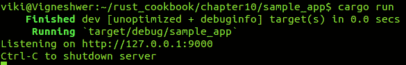

我们找到用户数据的 `ObjectID`，如下截图所示：

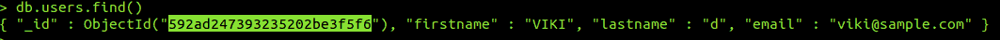

我们向 `http://127.0.0.1:9000/objectID` 提交一个 `DELETE` 请求，如以下截图所示，在成功的 API 调用中删除用户数据，该调用从使用镍 Web 应用程序框架创建的 Web 服务中返回 `Item deleted!`，该服务删除了 MongoDB 中的数据：

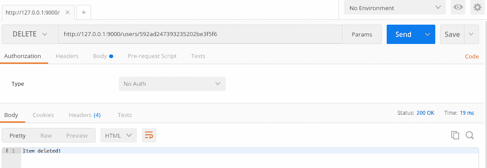

# 它是如何工作的...

在这个配方中，我们专注于删除保存在数据库中的用户数据。我们激活了对 `/users/:id` 端点的 `DELETE` 请求，通过对象 ID 删除以前的记录。

从顶部开始，我们使用`extern`关键字引用外部 nickel crate，并通过`#[macro_use]`加载了它所有的宏。nickel 是应用程序对象和表面，它持有所有公共 API。它是一个结构体，实现了执行所有 Web 应用程序任务的基本方法。

在`main`函数中，我们首先将`server`可变实例分配给一个可变变量，并使用`Nickel::new()`创建一个新的 nickel 应用程序对象，它创建了一个具有默认错误处理的 nickel 实例。同样，我们创建一个可变路由实例并将其分配给`Nickel::router()`，它将负责处理不同的端点。

我们将使`DELETE /users/:id`路由工作，我们将使用最初下载的不同 crate，这些 crate 是`rustc_serialize`、`bson`和`MongoDB`的单元。

接下来，我们创建一个复杂的数据结构，这是一个可编码和解码的`User`结构体，它代表我们的用户数据字段。

这是端到端 API 的最终步骤，我们允许通过`objectId`删除`users`集合的元素。我们可以使用 MongoDB Rust 驱动程序的`delete_one`方法来完成此操作。

我们首先与 MongoDB 服务建立连接，以便我们可以存储从输入字符串中解析出来的数据。我们通过`Client::connect("localhost", 27017)`实现这一点，其中`27017`是 MongoDB 服务运行的端口，`coll`变量通过`client.db("rust-cookbook").collection("users")`连接到数据库中的特定集合，其中`rust-cookbook`是数据库，`users`是集合。

我们从请求参数中获取`objectId`并将其分配给`object_id`，使用`request.param("id").unwrap()`。然后，我们使用`ObjectId::with_string`辅助函数解码`objectId`的字符串表示形式，之后它可以在`delete_one`方法中使用，以删除该用户的文档。在设置`DELETE /users/:id`路由后，我们应该能够在向其发出请求时从数据库中删除`users`，并将`objectId`作为参数包含在内。

使用`server.utilize`方法，我们将端点添加到服务器实例中，并通过传递`router`实例注册一个处理程序，该处理程序将在其他处理程序之前被调用。`server.listen`方法监听在`127.0.0.1:9000`上的 API 请求，它在该主机和端口上绑定并监听连接。

考虑使用`POST`网络服务发布多个数据条目，将不同`ObjectID`的数据值存储在 MongoDB 中，并使用本食谱中开发的服务删除它们，以更好地理解删除网络服务的工作原理。
