# 第十一章：高级 Rust 工具和库

在本章中，我们将介绍以下内容：

+   设置 rustup

+   设置 rustfmt

+   设置 rust-clippy

+   设置和测试 Servo

+   生成随机数

+   将行写入文件

+   解析无结构 JSON

+   从字符串中解析 URL

+   解压 tarball

+   将目录压缩成 tarball

+   递归查找文件扩展名

# 简介

在本章中，你将了解各种 Rust 工具，如 rustfmt 和 rustup，这些工具帮助我们编写更好的生产级 Rust 代码，捕获错误，并提供进行 Rust 编译器不同版本极端实验的设备。除了这些工具，我们还将设置并理解 Servo 项目，这是一个最先进的浏览器引擎，对 Rust 语言的许多设计做出了贡献。本章的最后几个菜谱将引导读者了解 Rust 中对项目开发速度有很大贡献的不同底层库，这些库为开发者提供了各种开箱即用的常见操作和功能。

# 设置 rustup

在这个菜谱中，你将了解 rustup 工具的不同选项，这些选项使我们能够在不同版本中运行 Rust 应用程序，以及更多相关功能。

rustup 工具是 rustc、Cargo 以及其他标准工具的官方 Rust 语言安装程序，用于将它们安装到 Cargo 的 `bin` 目录。在 Unix 上，它位于 `$HOME/.cargo/bin`，在 Windows 上位于 `%USERPROFILE%\.cargo\bin`。

# 准备工作

为了执行这个菜谱的不同活动，我们需要设置 rustup 工具。

按照以下步骤安装 rustup 工具：

1.  检查 Rust 编译器的版本：

```rs
 rustc --version

```

1.  如果我们能够得到类似 `rustc 1.18.0 (03fc9d622 2017-06-06)` 的输出，这意味着 rustup 工具已设置好。版本号可能会根据系统最后下载的稳定版本而改变。

1.  如果你无法获取编译器版本，请遵循 第一章 的安装菜谱，“让我们再次让系统编程变得伟大”，或在终端中运行以下命令：

```rs
 curl https://sh.rustup.rs -sSf | sh

```

# 如何做到这一点...

按照以下步骤实现这个菜谱：

1.  将 Rust 的稳定版本更新到最新版本：

```rs
 rustup update stable

```

1.  将 `rustup` 工具更新到最新版本：

```rs
 rustup self update

```

1.  安装 Rust 编译器的 `nightly` 工具包版本：

```rs
 rustup install nightly

```

1.  运行 Rust 的 `nightly` 版本而不更改 Rust 的默认版本：

```rs
 rustup run nightly rustc --version

```

1.  将 Rust 编译器的 `default` 版本更改为 `nightly` 版本：

```rs
 rustup default nightly

```

1.  更新 Rust 的 `nightly` 版本：

```rs
      rustup update

```

1.  这将更新 Rust 编译器的稳定和 `nightly` 版本。

在执行 rustup 工具时，我们应该得到以下输出：

+   在安装 `nightly` 版本时：

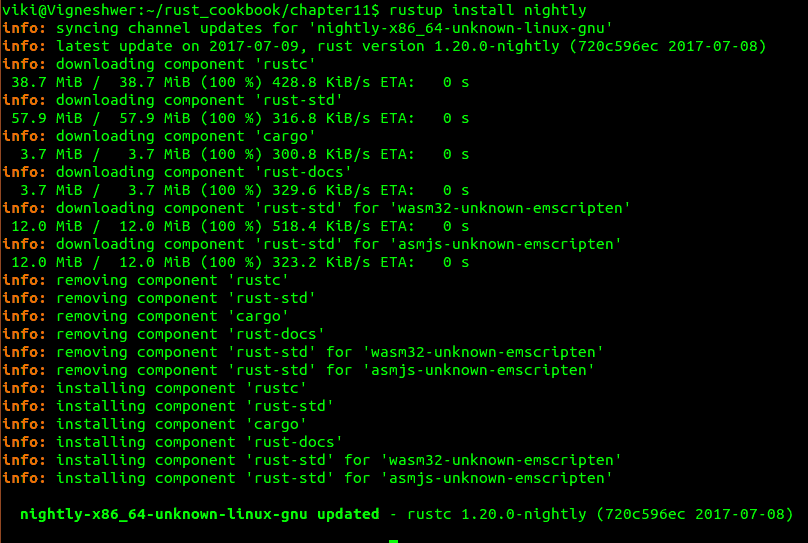

+   将 `nightly` 设置为默认版本：

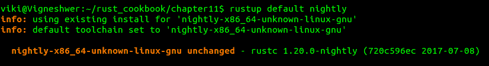

# 它是如何工作的...

`rustup`是一个工具链多路复用器，它安装并管理许多 Rust 工具链，并且所有这些工具链都位于单个工具集中，位于`~/.cargo/bin`。当我们运行示例时，`rustup`提供机制以轻松更改活动工具链，例如`rustc`和`cargo`位于`~/.cargo/bin`，通过在后台重新配置位置。

当`rustup`首次安装时，编译器`rustc`将位于`$HOME/.cargo/bin/rustc`，默认情况下是稳定版本。如果你后来使用如`rustup install nightly`和`rustup default nightly`等命令将默认工具链更改为夜间版，位置将改变，并将运行夜间编译器而不是稳定版本。

`rustup update`命令基本上帮助我们获取编译器的最新版本。Rust 分布在三个不同的发布渠道：稳定版、测试版和夜间版。`rustup`默认配置为使用稳定渠道，它代表了 Rust 的最新发布版本，每六周发布一次。

# 设置`rustfmt`

在这个食谱中，你将学习如何设置和使用`rustfmt`工具，以便在日常 Rust 项目开发中使用。`rustfmt`是一个根据 Rust 语言的标准样式指南格式化 Rust 代码的工具。它是一个开源项目，欢迎 Rust 社区成员的贡献。样式指南由 Rust**请求评论**（**RFC**）程序决定，这是一个关于 Rust 语言变化的开放讨论，例如功能请求、错误修复和文档。这对于编程语言来说是一个非常重要的特性，因为它赋予了开发者社区比语言起源公司更多的权威。

# 准备工作

我们将按照以下步骤设置工具：

1.  安装 Rust 编译器的夜间版：

```rs
 rustup install nightly

```

1.  将 Rust 编译器版本设置为夜间工具链：

```rs
 rustup default nightly

```

1.  使用 Cargo 创建一个新的 Rust 项目并安装`rustfmt`工具：

```rs
 cargo new --bin sample_rust_project

 cd sample_rust_project 

 cargo install rustfmt-nightly

```

如果一切顺利且没有错误，安装`rustfmt`工具时应得到以下输出：

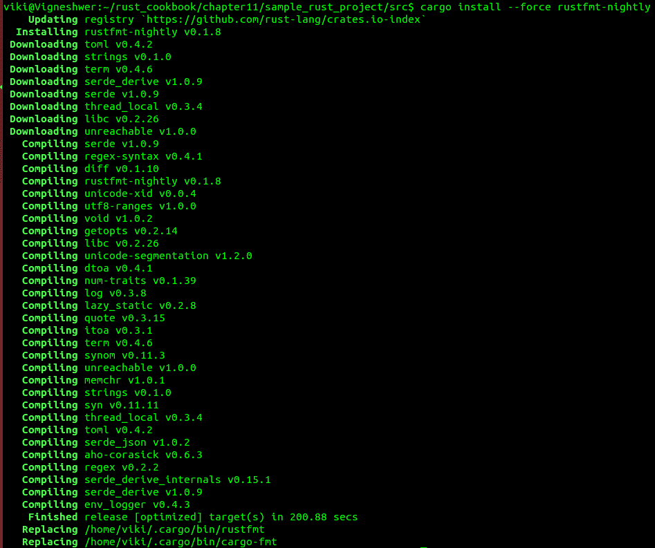

# 如何做到这一点...

按照以下步骤实施此食谱：

1.  在你首选的文本编辑器中打开`src`目录下的`main.rs`文件。

1.  编写带有相关信息的代码头，但这里的难点在于我们故意使用了错误的缩进：

```rs
        //-- #########################
            //-- Task: Testing cargo fmt features
            //-- Author: Vigneshwer.D
          //-- Version: 1.0.0
           //-- Date: 04 May 17
          //-- ######################### 

```

1.  定义带有一些随机间距和样式的`main`函数：

```rs
        fn main() {
          println!("Hello, world!");
        } 

```

1.  现在，运行`rustfmt`以修复代码的样式问题：

```rs
 cargo fmt

```

在成功执行前面的代码后，你应该得到以下输出：

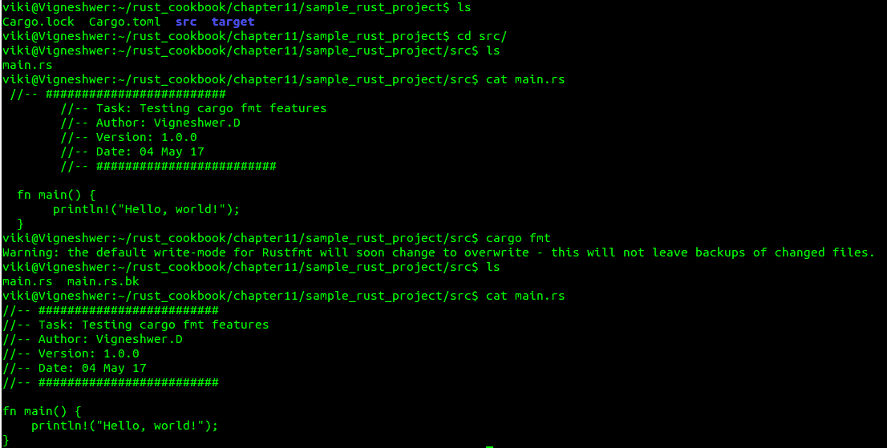

# 它是如何工作的...

在这个食谱中，我们主要介绍了`rustfmt`工具，该工具以自动化的方式帮助我们遵循 Rust 编程语言隐含的正确样式指南，其中开发者可以自由使用该工具来遵循样式标准。

从 `main.rs` 文件的输出中，我们可以看到代码中的错误缩进被自动纠正并覆盖，使用 `cargo fmt` 命令在 `main.rs` 文件中，并且之前的代码备份保存在 `main.rs.bk` 文件中。

我们可以以各种方式运行 `rustfmt` 工具，如下所示：

+   `replace`：这是默认选择，它会覆盖原始文件并在格式化后创建备份文件；`cargo fmt` 默认使用 `--write-mode=replace`。

+   `overwrite`：此选项基本上会更改原始文件，而不会创建先前代码的备份。

+   `display`：此选项基本上将格式化后的文件打印到 `stdout`，在终端屏幕上显示所做的更改。

+   `diff`：此选项将原始文件和格式化文件之间的差异打印到 `stdout`。如果存在任何差异，它还将以错误代码退出。

+   `checkstyle`：此选项将以 checkstyle XML 文件的形式输出需要纠正的行，该文件可用于 Jenkins 等工具。

为了使用这些写入模式，我们需要通过源代码安装 `rustfmt` 工具，即克隆主 GitHub 仓库并使用以下代码从源代码安装：

```rs
cargo install --path 

```

这使我们能够以各种模式运行格式化命令，例如以下示例：

```rs
rustfmt main.rs

rustfmt --write-mode=overwrite main.rs

```

在构建项目之前运行 `rustfmt` 工具是一种良好的做法，这样我们就可以在不费太多力气的情况下维护代码标准。理想的做法是在您喜欢的文本编辑器中配置 `rustfmt` 工具，并将 `rustfmt` 命令作为构建过程的一部分。

# 设置 rust-clippy

在此配方中，您将学习使用 rust-clippy 工具的步骤。该工具基本上帮助开发者捕获常见错误，并通过一组 lint 提高您的 Rust 项目代码。Clippy 工具目前与最新的 Rust 夜间版本一起使用。由于这是一个帮助库或应用程序开发者编写更好代码的工具，建议不要将 Clippy 作为硬依赖项，它通常用作可选依赖项。

# 准备工作

按照以下步骤安装 rust-clippy 工具：

1.  将默认编译器更改为夜间版本：

```rs
 rustup default nightly

```

1.  通过修改 `Cargo.toml` 文件将 rust-clippy 设置为可选依赖项：

```rs
        [dependencies]
        clippy = {version = "*", optional = true}

        [features]
        default = []

```

1.  `Cargo.toml` 文件将类似于以下截图：

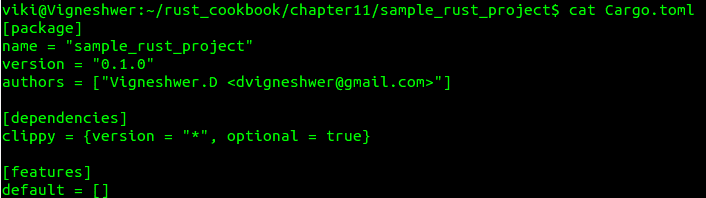

1.  从 Cargo 工具安装 Clippy：

```rs
 cargo install clippy

```

1.  通过将 Clippy 添加到 `Cargo.toml` 文件中作为依赖项来设置 Clippy 为编译器插件：

```rs
        [dependencies]
        clippy = "*"

```

1.  `Cargo.toml` 文件将类似于以下截图：

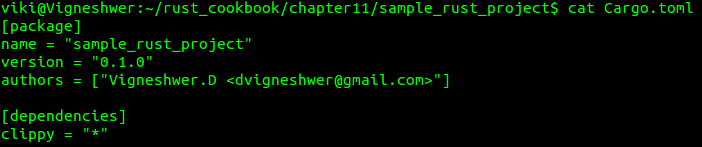

1.  为实验 rust-clippy 工具设置一个新的项目：

```rs
 cargo new --bin sample_rust_project

```

# 如何做...

按照以下步骤实现此配方：

1.  在您首选的文本编辑器中打开 `src` 目录下的 `main.rs` 文件。

1.  使用相关信息编写代码头：

```rs
        //-- #########################
        //-- Task: Testing rust-clippy tool
        //-- Author: Vigneshwer.D
        //-- Version: 1.0.0
        //-- Date: 28 April 17
        //-- #########################

```

1.  创建一个`main`函数，并将代码复制粘贴：

```rs
        fn main(){
        let x = Some(1u8);
        match x {
          Some(y) => println!("{:?}", y),
          _ => ()
        }
        }

```

1.  将上面的代码片段复制并粘贴到代码中`main`函数的开始部分，以将 rust-clippy 作为可选依赖项使用：

```rs
      #![cfg_attr(feature="clippy", feature(plugin))]

      #![cfg_attr(feature="clippy", plugin(clippy))]

```

1.  使用命令`cargo build --features "clippy"`运行 Clippy。

1.  要将 Clippy 作为子命令运行，请运行以下命令：

```rs
 cargo clippy

```

1.  将代码片段复制粘贴到代码中`main`函数的开始部分，以将 rust-clippy 作为编译器插件使用：

```rs
        #![feature(plugin)]
        #![plugin(clippy)]

```

1.  当我们运行`cargo run`命令时，Cargo 将安装 Clippy 并显示警告。

我们将得到前面三种不同方法的前三个输出：

+   将 Clippy 作为可选依赖项运行：

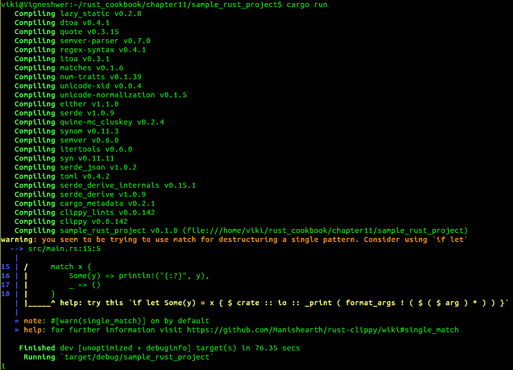

+   将 Clippy 作为 Cargo 子命令运行：

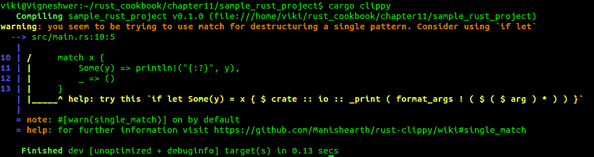

+   将 Clippy 作为编译器插件运行：

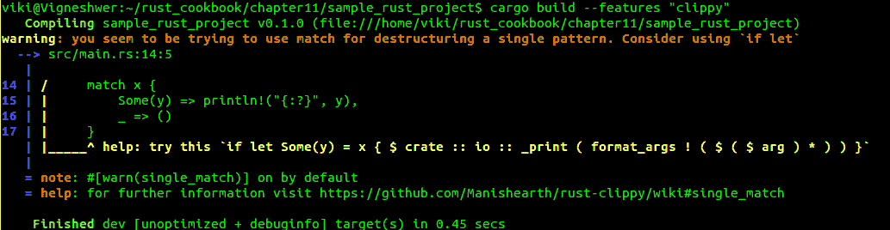

# 它是如何工作的...

在这个菜谱中，你学习了使用 Clippy 工具捕获代码中的不同 lints 并获取改进建议的方法。

当我们将 Clippy 作为可选依赖项使用时，在`Cargo.toml`文件中提及 Clippy 作为依赖项时，我们将可选标志设置为`true`。在功能部分，我们有一个默认的可选包集合。大多数时候，开发者会想要使用这些包，但它们是严格可选的。除了在配置文件中的操作外，我们还需要启用`#[cfg_attr]`属性，它通常与`#[cfg_attr(condition, attribute)]`一起使用，它允许我们在条件为真时编译 Rust 脚本`main.rs`；也就是说，如果条件为`true`，则相当于`#[attribute]`，如果条件为`false`，则不进行操作。

`cargo clippy`命令是运行 Clippy 工具的最简单方法，因为它不需要在配置或代码中进行任何操作。

在第三种方法中，我们在`Cargo.toml`文件中添加了`clippy`依赖项，但没有将其作为功能提及，而是将其作为编译器插件加载。我们通过调用`#![feature(plugin)]`和`#![plugin(clippy)]`来实现语法扩展。

rustc 可以加载编译器插件，这些插件是用户提供的库，通过新的语法扩展、lint 检查等扩展编译器的行为。大约有 200 个 lints，这是通过 rust-clippy 工具配置的，它帮助开发者编写更好的 Rust 代码。

使用此工具的好地方是在构建项目之前，在 CI 脚本的流程中包含`cargo clippy`命令，类似于`rustfmt`工具。

# 设置和测试 Servo

在这个菜谱中，我们将设置系统中的 Servo 浏览器并测试其中的网站性能。

Servo 是由 Mozilla 赞助的并行浏览器引擎项目，使用 Rust 编写。Servo 项目旨在实现更好的并行性、安全性、模块化和性能。简而言之，Servo 是一个现代、高性能的浏览器引擎，适用于应用程序和嵌入式使用。

# 准备工作

为了运行 Servo 浏览器，我们需要在我们的系统中安装以下依赖项：

1.  打开终端并安装以下包：

```rs
 sudo apt install git curl freeglut3-dev autoconf libx11-dev \
 libfreetype6-dev libgl1-mesa-dri libglib2.0-dev xorg-dev \
 gperf g++ build-essential cmake virtualenv python-pip \
 libssl1.0-dev libbz2-dev libosmesa6-dev libxmu6 libxmu-dev \
 libglu1-mesa-dev libgles2-mesa-dev libegl1-mesa-dev libdbus-1-dev

```

# 如何操作...

按照以下步骤实现 Servo 项目的构建：

1.  打开终端，从 GitHub 克隆 Servo 项目：

```rs
 git clone https://github.com/servo/servo

```

1.  进入项目，以开发模式构建浏览器：

```rs
 cd servo
 ./mach build --dev

```

1.  为了确保项目正确构建，运行一个小测试：

```rs
 ./mach run tests/html/about-mozilla.html

```

1.  对于基准测试、性能测试和其他实际场景，添加`--release`标志以创建一个优化构建：

```rs
 ./mach build --release
 ./mach run --release tests/html/about-mozilla.html

```

1.  要在 Servo 项目中运行网站，请使用以下代码：

```rs
 ./mach run [url] 
 ex: ./mach run https://www.google.com

```

# 它是如何工作的...

在这个菜谱中，你学会了如何设置 Servo 浏览器引擎并在此引擎中运行网站。Servo 是一个用 Rust 语言编写的原型网络浏览器引擎。它目前支持 64 位 macOS、64 位 Linux 和 Android。

Servo 是用 Cargo 构建的，它使用 Mozilla 的 Mach 工具来协调构建和其他任务。我们在 Servo 中使用`./mach run https://www.google.com`来运行一个 URL。

我们可以使用很多 Mach 命令来构建和修改。你可以使用`./mach --help`列出它们。

# 生成随机数

在这个菜谱中，我们将使用`rand`crate 在提供的范围内生成随机数，在这个菜谱中是 1 到 10。`rand`crate 是一个在多种科学操作中非常重要的库。

# 准备工作

按照以下步骤设置项目和安装依赖项：

1.  创建一个名为`sample_rand`的新二进制项目，并进入该目录：

```rs
 cargo new --bin sample_rand && cd sample_rand

```

1.  安装 cargo-edit 工具，该工具允许你通过修改`Cargo.toml`来添加和删除依赖项：

```rs
 cargo install cargo-edit

```

1.  安装`rand`依赖项：

```rs
 cargo add rand

```

1.  `cargo add crate_name`会自动将依赖项的最新版本添加到`Cargo.toml`文件中。

1.  运行以下命令安装依赖项：

```rs
 cargo run

```

1.  此步骤将输出`hello world`，因为我们还没有对源代码进行任何修改。

# 如何操作...

按照以下步骤实现这个菜谱：

1.  在你的首选文本编辑器中打开`src`目录下的`main.rs`文件。

1.  使用相关信息的代码头编写代码：

```rs
        //-- #########################
        //-- Task: To generate a random number between the range of 0 to 10
        //-- Author: Vigneshwer.D
        //-- Version: 1.0.0
        //-- Date: 04 May 17
        //-- ######################### 

```

1.  将以下代码片段复制粘贴到代码头后面的`main.rs`文件中：

```rs
        extern crate rand;
        use rand::Rng;
        fn main() {
          let mut rng = rand::thread_rng();
          println!("{}", rng.gen_range(0, 10));
        }

```

1.  保存文件并按照以下命令运行项目：

```rs
 cargo run

```

执行代码后，我们应该得到以下输出：

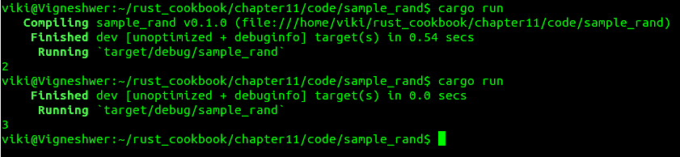

# 如何工作...

在这个菜谱中，我们打印出开发者提供的范围内的随机数，在我们的例子中是 0 到 10 之间的一个值；我们使用`rand`库来执行这个选项。

我们使用`extern crate`命令导入`rand`库，并使用提供`gen_range`方法的`rand::rng`模块。`gen_range`方法接受两个输入参数，即它应该预测随机数的范围的上下限值。如果交换位置，它将引发恐慌。

# 将行写入文件

在这个菜谱中，我们将使用 `std` crate，它是 Rust 的标准库，提供各种模块和功能。我们将使用该 crate 的文件系统功能将三行消息写入文件，然后逐行读取它。

# 准备工作

按照以下步骤设置项目和安装依赖项：

1.  创建一个名为 `sample_file` 的新二进制项目，并进入该目录：

```rs
 cargo new --bin sample_file && cd sample_file

```

1.  安装 `error_chain` crate 依赖项：

```rs
 cargo add error-chain

```

1.  `cargo add crate_name` 会自动将依赖项的最新版本添加到 `Cargo.toml` 文件中。

1.  通过运行以下命令安装依赖项：

```rs
 cargo run

```

1.  由于我们尚未对源代码进行任何修改，这一步将输出 `hello world`。

# 如何做到这一点...

按照以下步骤实现这个菜谱：

1.  在你首选的文本编辑器中打开 `src` 目录下的 `main.rs` 文件。

1.  使用相关信息的代码头编写代码：

```rs
        //-- #########################
        //-- Task: File system experiments
        //-- Author: Vigneshwer.D
        //-- Version: 1.0.0
        //-- Date: 04 May 17
        //-- ######################### 

```

1.  在代码头之后创建 `error_chain!` 宏来定义自定义的 `Error` 和 `Result` 类型，以及从标准库错误类型自动转换：

```rs
        #[macro_use]
        extern crate error_chain;
        use std::fs::File;
        use std::io::{Write, BufReader, BufRead};
        error_chain! {
          foreign_links {
            Io(std::io::Error);
          }
        }

```

1.  通过复制并粘贴以下代码片段并使用 `error_chain!` 宏来定义 `run` 方法以及 `quick_main!` 宏：

```rs
        fn run() -> Result<()> {
          let path = "lines.txt";
          let mut output = File::create(path)?;
          write!(output, "Rust\nis\nFun")?;
          let input = File::open(path)?;
          let buffered = BufReader::new(input);
          for line in buffered.lines() {
            println!("{}", line?);
          }
          Ok(())
        }
        quick_main!(run);

```

1.  保存文件并运行项目，通过运行以下命令：

```rs
 cargo run

```

执行代码后，我们应该得到以下输出：

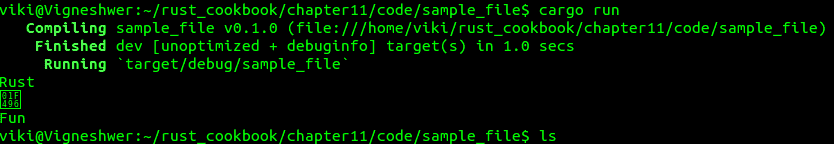

# 它是如何工作的...

在这个菜谱中，我们将三行消息写入文件 `lines.txt`。我们将字符串 `lines.txt` 分配给一个名为 path 的变量，将其作为参数传递给 `File::create(path)` 以创建文件，并将其分配给变量 `output`。使用 `write!` 宏，我们将字符串 `"Rust\n\nFun"` 写入可变的 `output` 变量。

我们读取文件，然后使用 `File::open(path)` 读取并分配给 `input` 变量。我们创建一个名为 `buffered` 的变量来存储文件内容；然后使用 `BufRead::lines` 创建的 `Lines` 迭代器通过 `for` 循环逐行读取文件并打印它。

BufRead 是一个特质，获取一个 BufRead 的最常见方式是从一个实现了 `Read` 特质的类型（这里是一个文件）构建的 BufReader。文件使用 `File::create` 打开用于写入，使用 `File::open` 打开用于读取。

`error-chain` crate 是一个用于一致和可靠的错误处理的库，它使得充分利用 Rust 强大的错误处理功能变得更容易，而不需要维护样板错误类型和转换的开销。它实现了一种定义你自己的错误类型以及从其他错误类型转换的策略。

我们在这里使用的基本模式有一个名为`run()`的函数，它产生一个`Result`类型，该类型类似于真正的`main`函数。我们使用`error-chain`crate 来使`?`在`run`中工作。这是使用来自`error-chain`crate 的`error_chain!`宏来定义自定义的`Error`和`Result`类型，以及从 crate 错误类型到自动转换。自动转换使`?`运算符工作。`quick_main!`宏生成实际的`main`函数，并在执行过程中发生错误时打印出错误。

我们将`Ok(())`返回给`quick_run!`宏以确保程序成功执行且没有错误。

# 解析非结构化 JSON

在这个菜谱中，我们将使用提供各种模块和功能以序列化和反序列化非结构化 JSON 的`serde_json`crate。我们将使用编码功能将 JSON 解析为调用者选择的类型。

# 准备工作

按照以下步骤设置项目和安装依赖项：

1.  创建一个名为`sample_json`的新二进制项目，并进入该目录：

```rs
 cargo new --bin sample_json && cd sample_json

```

1.  安装`error_chain`和`serde_json`crate 依赖项：

```rs
 cargo add error-chain serde_json

```

1.  `cargo add crate_name`自动将依赖项的最新版本添加到`Cargo.toml`文件。

1.  通过运行以下命令安装依赖项：

```rs
 cargo run

```

1.  此步骤将输出`hello world`，因为我们尚未对源代码进行任何修改。

# 如何操作...

按照以下步骤实现此菜谱：

1.  在你首选的文本编辑器中打开`src`目录下的`main.rs`文件。

1.  编写带有相关信息的代码头：

```rs
        //-- #########################
        //-- Task: Encoding experiments
        //-- Author: Vigneshwer.D
        //-- Version: 1.0.0
        //-- Date: 04 May 17
        //-- ######################### 

```

1.  在代码头之后创建`error_chain!`宏来定义自定义的`Error`和`Result`类型，以及从标准库错误类型到自动转换：

```rs
        #[macro_use]
        extern crate error_chain;
        error_chain! {
          foreign_links {
            Json(serde_json::Error);
          }
        }

```

1.  通过复制并粘贴以下代码片段并使用`error_chain!`宏来定义`run`方法和`quick_main!`宏：

```rs
        #[macro_use]
        extern crate serde_json;
        use serde_json::Value;
        fn run() -> Result<()> {
          let j = r#"{
            "userid": 103609,
            "verified": true,
            "access_privileges": [
              "user",
              "admin"
            ]
          }"#;
          let parsed: Value = serde_json::from_str(j)?;
          let expected = json!({
            "userid": 103609,
            "verified": true,
            "access_privileges": [
              "user",
              "admin"
            ]
          });
          assert_eq!(parsed, expected);
          Ok(())
        }
        quick_main!(run);

```

1.  保存文件并运行项目，通过运行以下命令：

```rs
 cargo run

```

在代码执行时，我们应该得到以下输出：

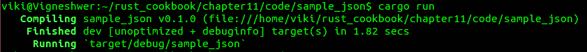

# 它是如何工作的...

在这个菜谱中，我们使用提供`from_str`函数的`serde_json`crate，该函数允许开发者将 JSON 的`&str`解析为调用者选择的类型。我们将 JSON 的字符串格式赋值给`j`变量，之后调用`serde_json::from_str(j)`并将输出赋值给名为`parsed`的变量。非结构化 JSON 被解析为表示任何有效 JSON 数据的通用`serde_json::Value`类型。

然后，我们使用`assert_eq!`宏比较解析的 JSON 的`&str`值与我们期望的解析值。期望的值使用`json!`宏声明。

`error-chain`crate 是一个用于一致和可靠错误处理的库，它使得充分利用 Rust 强大的错误处理功能变得更容易，而不需要维护样板错误类型和转换的开销。它实现了一种定义你自己的错误类型以及从其他错误类型转换的策略。

我们在这里使用的基本模式有一个名为`run()`的函数，它产生一个`Result`，类似于真正的`main`函数。我们使用`error-chain`crate 来使`?`在`run`中工作。这是使用`error-chain`的`error_chain!`宏来定义自定义的`Error`和`Result`类型，以及从 crate 错误类型到自动转换。自动转换使`?`操作符工作。`quick_main!`宏生成实际的`main`函数，并在执行过程中发生错误时打印出错误。

我们向`quick_run!`宏返回`Ok(())`以确保程序成功执行且没有错误。

# 从字符串解析 URL

在这个菜谱中，我们将使用提供各种模块和功能以实现网络功能的`url`crate。我们将使用 crate 的`parse`功能将字符串输入转换为 URL 格式，并在验证后。

# 准备工作

按照以下步骤设置项目和安装依赖项：

1.  创建一个名为`sample_url`的新二进制项目，并进入该目录：

```rs
 cargo new --bin sample_url && cd sample_url

```

1.  安装`error_chain`和`url`的 crate 依赖项：

```rs
 cargo add error-chain url

```

1.  `cargo add crate_name`自动将依赖项的最新版本添加到`Cargo.toml`文件中。

1.  通过运行以下命令安装依赖项：

```rs
 cargo run

```

1.  这一步将打印出`hello world`作为输出，因为我们还没有对源代码进行任何修改。

# 如何操作...

按照以下步骤实现这个菜谱：

1.  在你偏好的文本编辑器中打开`src`目录下的`main.rs`文件。

1.  使用相关信息的代码头编写代码：

```rs
        //-- #########################
        //-- Task: Url experiments
        //-- Author: Vigneshwer.D
        //-- Version: 1.0.0
        //-- Date: 04 May 17
        //-- ######################### 

```

1.  在代码头之后创建`error_chain!`宏来定义自定义的`Error`和`Result`类型，以及从标准库错误类型到自动转换：

```rs
        #[macro_use]
        extern crate error_chain;
        error_chain! {
          foreign_links {
            UrlParse(url::ParseError);
          }
        }

```

1.  通过复制和粘贴以下代码片段并使用`error_chain!`宏来定义`run`方法和`quick_main!`宏：

```rs
        extern crate url;
        use url::Url;
        fn run() -> Result<()> {
          let s = "https://github.com/rust-lang/rust/issues?labels=E-easy&state=open";
          let parsed = Url::parse(s)?;
          println!("The path part of the URL is: {}", parsed.path());
          Ok(())
        }
        quick_main!(run);

```

1.  保存文件并运行项目，运行以下命令：

```rs
 cargo run

```

在执行代码后，我们应该得到以下输出：

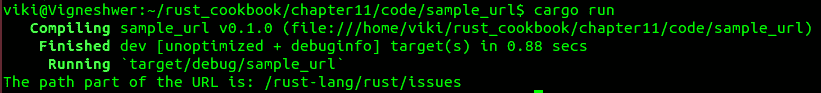

# 工作原理...

在这个菜谱中，我们使用`url`crate 的`parse`方法验证和解析从数据中提取的`&str`到`Url`结构体。输入字符串将在方法的返回值上转换为`Result<Url, ParseError>`。

我们创建一个名为 `s` 的变量，并将其赋值为我们想要解析的 URL；该值通过 `Url::parse(s)` 方法发送。一旦 URL 被解析，它就可以与 URL 类型的所有方法一起使用。最后，我们打印出存储 `parse` 方法返回值的 `parsed` 变量的路径部分。

此代码中的 URL 解析成功，但如果将其替换为格式错误的 URL，则会打印出包含错误解释的消息。

`error-chain` crate 是一个用于一致和可靠的错误处理的库，它使得充分利用 Rust 强大的错误处理功能变得更容易，而不需要维护样板错误类型和转换的开销。它实现了一种定义您自己的错误类型以及从其他错误类型转换的策略。

我们在这里使用的基本模式有一个名为 `run()` 的函数，它产生一个 `Result`，类似于真正的 `main` 函数。我们使用 `error-chain` crate 来使 `?` 在 `run` 中工作。这是使用 `error-chain` 中的 `error_chain!` 宏来定义自定义的 `Error` 和 `Result` 类型，以及从 crate 错误类型到自动转换。自动转换使 `?` 操作符工作。`quick_main!` 宏生成实际的 `main` 函数，并在执行过程中发生错误时打印出错误。

我们将 `Ok(())` 返回给 `quick_run!` 宏，以确保程序成功执行且没有错误。

# 解压 tar 包

在此配方中，我们将使用 `tar` 和 `flate2` crate，它们提供各种模块和功能以实现压缩能力。我们将从当前工作目录中提取名为 `archive.tar.gz` 的 tar 文件的文件内容。

# 准备工作

按照以下步骤设置项目和安装依赖项：

1.  创建一个名为 `sample_decom` 的新二进制项目，并进入该目录：

```rs
 cargo new --bin sample_decom && cd sample_decom

```

1.  安装 `error_chain`、`tar` 和 `flate2` 依赖项：

```rs
 cargo add error-chain tar flate2

```

1.  `cargo add crate_name` 自动将依赖项的最新版本添加到 `Cargo.toml` 文件中。

1.  通过运行以下命令安装依赖项：

```rs
 cargo run

```

1.  此步骤将打印出 `hello world` 作为输出，因为我们尚未对源代码进行任何修改。

1.  创建一个示例文件，将其打包为 TAR，然后删除它以用于配方：

```rs
        touch sample_file1.txt && tar -cvzf archieve.tar.gz
        sample_file1.txt && rm sample_file1.txt  

```

# 如何操作...

按照以下步骤实现此配方：

1.  在您首选的文本编辑器中打开 `src` 目录下的 `main.rs` 文件。

1.  使用相关信息的代码头编写代码：

```rs
        //-- #########################
        //-- Task: tar experiments
        //-- Author: Vigneshwer.D
        //-- Version: 1.0.0
        //-- Date: 04 May 17
        //-- ######################### 

```

1.  在代码头之后创建 `error_chain!` 宏来定义自定义的 `Error` 和 `Result` 类型，以及从标准库错误类型到自动转换：

```rs
        #[macro_use]
        extern crate error_chain;
        error_chain! {
          foreign_links {
            Io(std::io::Error);
          }
        }

```

1.  通过复制和粘贴以下代码片段并使用 `error_chain!` 宏来定义 `run` 方法和 `quick_main!` 宏：

```rs
        extern crate flate2;
        extern crate tar;
        use std::fs::File;
        use flate2::read::GzDecoder;
        use tar::Archive;
        fn run() -> Result<()> {
          let path = "archive.tar.gz";
          // Open a compressed tarball
          let tar_gz = File::open(path)?;
          // Decompress it
          let tar = GzDecoder::new(tar_gz)?;
          // Load the archive from the tarball
          let mut archive = Archive::new(tar);
          // Unpack the archive inside curent working directory
          archive.unpack(".")?;
          Ok(())
        }
        quick_main!(run);

```

1.  保存文件并运行项目，运行以下命令：

```rs
 cargo run

```

在执行代码时，我们应该得到以下输出：

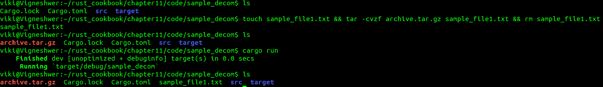

# 它是如何工作的...

在这个食谱中，我们使用 `File::open(path)` 方法打开文件，并将其分配给 `tar_gz` 变量；`path` 变量包含字符串值，它是 `archive.tar.gz` 文件的位置。然后，我们使用 `flate2` crate 的 `flate2::read::GzDecoder::new(tar_gz)` 命令解压缩 `tar_gz` 文件，并将返回值分配给 `tar` 变量。我们通过首先调用 `Archive::new(tar)` 创建变量 `archive` 来加载存档，然后通过调用 `archive.unpack(".")` 从当前工作目录中名为 `archive.tar.gz` 的压缩 tar 文件中提取所有文件。

`error-chain` crate 是一个用于一致和可靠的错误处理的库，它使得充分利用 Rust 强大的错误处理功能变得更容易，而不需要维护样板错误类型和转换的开销。它实现了一种定义自己的错误类型以及从其他错误类型转换的策略。

我们在这里使用的基本模式有一个名为 `run()` 的函数，它产生一个 `Result`，类似于真正的 `main` 函数。我们使用 `error-chain` crate 使 `?` 在 `run` 中工作。这是使用 `error-chain` 的 `error_chain!` 宏来定义自定义的 `Error` 和 `Result` 类型，以及从 crate 错误类型自动转换。自动转换使 `?` 操作符工作。`quick_main!` 宏生成实际的 `main` 函数，并在执行过程中发生错误时打印出来。

我们将 `Ok(())` 返回给 `quick_run!` 宏，以确保程序成功执行而没有错误。

# 将目录压缩成 tar 文件

在这个食谱中，我们将使用 `tar` 和 `flate2` crate，它们提供了各种模块和功能，用于压缩功能。我们将压缩目录的内容，在这个食谱中是当前目录，将其压缩成同一目录下的 `archive.tar.gz` TAR 文件。

# 准备工作

按照以下步骤设置项目和安装依赖项：

1.  创建一个名为 `sample_com` 的新二进制项目，并进入该目录：

```rs
 cargo new --bin sample_com && cd sample_com

```

1.  安装 `error_chain`、`tar` 和 `flate2` crate 的依赖项：

```rs
 cargo add error-chain tar flate2

```

1.  `cargo add crate_name` 自动将依赖项的最新版本添加到 `Cargo.toml` 文件中。

1.  通过运行以下命令安装依赖项：

```rs
 cargo run

```

1.  由于我们尚未对源代码进行任何修改，这一步将输出 `hello world`。

# 如何做到...

按照以下步骤实现这个食谱：

1.  在您首选的文本编辑器中打开 `src` 目录下的 `main.rs` 文件。

1.  编写代码头部，包含相关信息：

```rs
        //-- #########################
        //-- Task: tar experiments
        //-- Author: Vigneshwer.D
        //-- Version: 1.0.0
        //-- Date: 04 May 17
        //-- ######################### 

```

1.  创建 `error_chain!` 宏来定义一个自定义的 `Error` 和 `Result` 类型，以及代码头部之后的自动从标准库错误类型转换：

```rs
        #[macro_use]
        extern crate error_chain;
        error_chain! {
          foreign_links {
            Io(std::io::Error);
          }
        }

```

1.  通过复制粘贴以下代码片段到 `error_chain!` 宏来定义 `run` 方法和 `quick_main!` 宏：

```rs
        extern crate tar;
        extern crate flate2;
        use std::fs::File;
        use flate2::Compression;
        use flate2::write::GzEncoder;
        fn run() -> Result<()> {
          let tar_gz = File::create("archive.tar.gz")?;
          let enc = GzEncoder::new(tar_gz, Compression::Default);
          let mut tar = tar::Builder::new(enc);
          tar.append_dir_all("./backup", "../sample_com")?;
          Ok(())
        }
        quick_main!(run);

```

1.  保存文件并按照以下命令运行项目：

```rs
 cargo run

```

在执行代码后，我们应该得到以下输出：

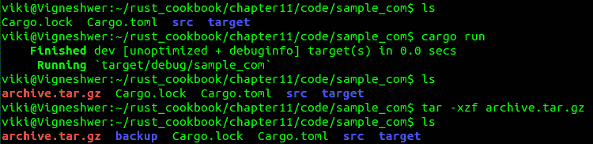

# 它是如何工作的...

在此菜谱中，我们将源代码目录压缩成 `archive.tar.gz`。我们使用 `File::create("archive.tar.gz")` 创建一个文件，并将其分配给 `tar_gz` 变量。然后我们使用 `flate2::write::GzEncoder` 和 `tar::Builder` 来包装它。最后，我们使用 `Builder::append_dir_all` 将 `../sample_com` 目录的内容递归地添加到 `./backup` 下的归档中。

`flate2::write::GzEncoder` 负责在写入 `archive.tar.gz` 之前透明地压缩数据。

`error-chain` 依赖包是一个用于一致和可靠的错误处理的库，它使得充分利用 Rust 强大的错误处理功能变得更容易，而不需要维护样板错误类型和转换的开销。它实现了一种定义自己的错误类型以及从其他错误类型转换的策略。

我们在这里使用的基本模式有一个名为 `run()` 的函数，它产生一个 `Result`，其行为类似于真正的 `main` 函数。我们使用 `error-chain` 依赖包使 `?` 在 `run` 中工作。这是使用 `error-chain` 中的 `error_chain!` 宏来定义自定义的 `Error` 和 `Result` 类型，以及从其他错误类型到这些类型的自动转换。自动转换使 `?` 操作符工作。`quick_main!` 宏生成实际的 `main` 函数，并在执行过程中发生错误时打印出来。

我们向 `quick_run!` 宏返回 `Ok(())` 以确保程序成功执行且没有错误。

# 递归查找文件扩展名

在此菜谱中，我们将使用提供各种模块和功能以实现文件系统能力的 `glob` 依赖包。我们将递归地查找当前目录下的所有 PNG 文件。

# 准备工作

按照以下步骤设置项目和安装依赖：

1.  创建一个名为 `sample_ext` 的新二进制项目，并进入该目录：

```rs
 cargo new --bin sample_ext && cd sample_ext

```

1.  安装 `error_chain` 和 `glob` 依赖包：

```rs
 cargo add error-chain glob

```

1.  `cargo add crate_name` 自动将依赖的最新版本添加到 `Cargo.toml` 文件中。

1.  通过运行以下命令安装依赖：

```rs
 cargo run

```

1.  此步骤将打印 `hello world` 作为输出，因为我们尚未对源代码进行任何修改。

# 如何操作...

按照以下步骤实现此菜谱：

1.  在您首选的文本编辑器中打开 `src` 目录下的 `main.rs` 文件。

1.  使用相关信息的代码头编写代码：

```rs
        //-- #########################
        //-- Task: glob experiments
        //-- Author: Vigneshwer.D
        //-- Version: 1.0.0
        //-- Date: 04 May 17
        //-- ######################### 

```

1.  在代码头之后创建 `error_chain!` 宏来定义自定义的 `Error` 和 `Result` 类型，以及从标准库错误类型到这些类型的自动转换：

```rs
        #[macro_use]
        extern crate error_chain;
        error_chain! {
          foreign_links {
            Glob(glob::GlobError);
            Pattern(glob::PatternError);
          }
        }

```

1.  定义`run`方法和`quick_main!`宏，通过复制粘贴以下代码片段并使用`error_chain!`宏来完成：

```rs
        extern crate glob;
        use glob::glob;
        fn run() -> Result<()> {
          for entry in glob("**/*.png")? {
            println!("{}", entry?.display());
          }
          Ok(())
        }
        quick_main!(run);

```

1.  保存文件，并通过运行以下命令来运行项目：

```rs
 cargo run

```

在执行代码后，我们应该得到以下输出：

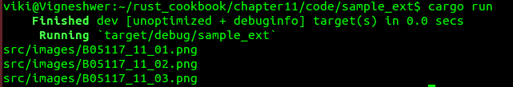

# 它是如何工作的...

在这个菜谱中，我们将递归地查找当前目录下的所有 PNG 文件。我们使用`for`循环和`glob("**/*.png")`方法的多个条目进行迭代，该方法返回当前目录下的所有`.png`文件扩展名。我们有一个`**`模式，它可以匹配当前目录及其所有子目录。

我们也可以为任何目录使用`**`模式，而不仅仅是当前目录。例如，`/media/**/*.png`将匹配媒体及其子目录中的所有 PNG 文件。对于其他文件扩展名，将`.png`更改为所需的扩展名。

`error-chain` crate 是一个用于一致和可靠的错误处理的库，它使得充分利用 Rust 强大的错误处理功能变得更容易，而不需要维护样板错误类型和转换的开销。它实现了一种定义你自己的错误类型以及从其他错误类型转换的策略。

我们在这里使用的基本模式有一个名为`run()`的函数，它产生一个`Result`，其行为类似于一个真正的`main`函数。我们使用`error-chain` crate 来使`?`在`run`中工作。这是使用`error-chain`中的`error_chain!`宏来定义自定义的`Error`和`Result`类型，以及从 crate 错误类型到自动转换。自动转换使得`?`运算符工作。`quick_main!`宏生成实际的`main`函数，并在执行过程中发生错误时打印出错误。

我们将`Ok(())`返回给`quick_run!`宏，以确保程序成功执行且没有任何错误。
