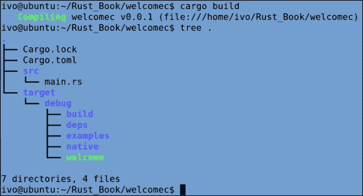

# 第一章. 从 Rust 开始

Rust 是由 Mozilla 研究室开发并由一个庞大的开源社区支持的一种编程语言。它的开发始于 2006 年，由语言设计者 Graydon Hoare 开始。Mozilla 从 2009 年开始赞助它，并于 2010 年首次正式推出。该项目经过多次迭代，最终在 2015 年 5 月 15 日推出了第一个稳定的生产版本 1.0.0，由 Rust 项目开发者制作，包括 Mozilla 的 Rust 团队和超过 900 名贡献者的开源社区。Rust 基于清晰和稳固的原则。它是一种系统编程语言，在能力上与 C 和 C++ 相当。它在速度上与惯用的 C++ 相当，但它通过禁止使用可能导致程序因内存问题而崩溃的代码，让您以更安全的方式工作。此外，Rust 具有在多核机器上执行并发操作所需的内置功能；它通过垃圾回收使并发编程内存安全——这是唯一能做到这一点的语言。Rust 还消除了通过并发访问导致的共享数据损坏，也称为数据竞争。

本章将向您展示 Rust 流行度和采用率稳步增长的主要原因。然后，我们将设置一个可工作的 Rust 开发环境。

我们将涵盖以下主题：

+   Rust 的优势

+   Rust 的三合一优势：安全性、速度和并发性

+   使用 Rust

+   安装 Rust

+   Rust 编译器 – `rustc`

+   构建我们的第一个程序

+   使用 Cargo 进行工作

+   开发者工具

# Rust 的优势

Mozilla 是一家以其使命为基础的公司，致力于开发基于开放标准的工具并推动 Web 的进化，最著名的是通过其旗舰浏览器 Firefox。如今，包括 Firefox 在内的每个浏览器都是用 C++ 编写的，Firefox 使用了约 12,900,992 行代码，Chrome 使用了约 4,490,488 行代码。这使得程序运行速度快，但本质上是不安全的，因为 C 和 C++ 允许的内存操作没有经过有效性检查。如果代码编写时开发者没有最严格的编程纪律，那么程序在执行时可能会出现崩溃、内存泄漏、段错误、缓冲区溢出和空指针等问题。其中一些可能导致严重的安全漏洞，这在现有的浏览器中是众所周知的。Rust 从一开始就被设计用来避免这些问题。

在编程语言谱系的另一端，我们有 Haskell，它广为人知是一个非常安全和可靠的语言，但几乎或完全没有对内存分配和其他硬件资源的控制。我们可以沿着这个控制-安全性轴绘制不同的语言，似乎当一种语言更安全时，它会失去底层控制；反之亦然：提供更多资源控制的语言提供的安全性更少，如下所示：


Rust ([`www.rust-lang.org/`](http://www.rust-lang.org/)) 是为了克服这一困境而设计的，它提供了以下特性：

+   通过其强大的类型系统实现高安全性

+   对底层资源进行深入但安全的控制（与 C/C++ 相当），以便其运行接近硬件

Rust 允许你精确指定你的值在内存中的布局方式以及如何管理这些内存；这就是为什么它在控制和安全性的两端都表现得很好。这是 Rust 的独特卖点：它打破了在 Rust 之前存在于编程语言中的安全-控制二分法。使用 Rust，可以在不牺牲性能的情况下同时实现控制和安全性。

与大多数现代语言（如 Java、C#、Python、Ruby、Go）不同，Rust 可以在不使用垃圾回收器的情况下实现这两个目标；实际上，Rust 甚至还没有垃圾回收器（尽管计划中有一个）。Rust 是一种编译型语言：严格的 safety 规则由编译器强制执行，因此不会造成运行时开销。因此，Rust 可以使用最少的运行时，甚至完全没有运行时；因此，它可以用于实时或嵌入式项目，并且可以轻松地与其他语言或项目集成。

Rust 旨在为那些不仅重视性能和底层优化，而且还需要一个安全且稳定的执行环境的开发者和项目而设计。此外，Rust 在语言内部添加了许多高级函数式编程技术，因此它既感觉像是一种底层语言，又像是一种高级语言。

# Rust 的三合一优势——安全性、速度和并发性

Rust 不是一个具有新尖端特性的革命性语言，但它从旧语言中吸收了许多经过验证的技术，同时在安全编程方面对 C++ 的设计进行了大量改进。

Rust 开发者设计 Rust 成为一个通用和多范式的语言。像 C++ 一样，它是一种命令式、结构化和面向对象的语言。除此之外，它还从函数式语言中继承了许多东西，并且还融合了并发编程的高级技术。

在 Rust 中，变量的类型是静态的（因为 Rust 是编译型语言）且强类型。然而，与 Java 或 C++ 不同，开发者不需要强制为所有内容指定类型，因为 Rust 编译器能够在许多情况下推断出类型。

C 和 C++ 被认为是受一系列问题的困扰，这些问题经常导致程序崩溃或内存泄漏，这些问题的调试和解决特别困难。想想悬垂指针、缓冲区溢出、空指针、段错误、数据竞争等等。Rust 编译器（称为 `rustc`）非常智能，可以在编译你的代码时检测到所有这些问题，从而在执行期间保证内存安全。这是通过编译器通过保留对内存布局的完全控制来实现的，无需运行时垃圾回收的负担（见 第六章，*指针与内存安全*）。此外，其安全性还意味着更少的潜在安全漏洞。

Rust 编译原生代码的方式类似于 Go 和 Julia。然而，与这两种语言相比，Rust 不需要带有垃圾回收的运行时。在这方面，它也不同于 Java JVM 和在 JVM 上运行的语言，如 Scala 和 Clojure。大多数其他流行的现代语言，如 .NET 中的 C# 和 F#、JavaScript、Python、Ruby、Dart 等等，都需要虚拟机和垃圾回收。

作为其并发机制之一，Rust 采用了来自 Erlang 的知名 actor 模型。轻量级进程称为线程，并行执行工作。它们不共享堆内存，而是通过通道进行数据通信，并通过类型系统消除数据竞争（见 第八章，*并发与并行*）。这些原语使得程序员能够利用当前和未来计算平台上可用的多个 CPU 核心的强大功能。

`rustc` 编译器是完全自托管的，这意味着它是用 Rust 编写的，并且可以使用之前的版本来编译自身。它使用 LLVM 编译器框架作为其后端（有关 LLVM 编译器框架的更多信息，请访问 [`en.wikipedia.org/wiki/LLVM`](http://en.wikipedia.org/wiki/LLVM)）并生成原生可执行代码，运行速度极快，因为它编译成与 C++ 相同的低级代码（要查看其速度示例，请访问 [`benchmarksgame.alioth.debian.org/u64q/rust.php`](http://benchmarksgame.alioth.debian.org/u64q/rust.php)）。

Rust 被设计成与 C++ 一样可移植，并能在广泛使用的硬件和软件平台上运行；目前，它可以在 Linux、Mac OS X、Windows、FreeBSD、Android 和 iOS 上运行。它可以像 C 一样简单高效地调用 C 的代码，反之亦然，C 也可以调用 Rust 代码（见 第九章，*边界编程*）。以下是 Rust 的标志：


在后续章节中将更详细讨论的其他 Rust 特性如下：

+   它的变量默认是不可变的（参见第二章，*使用变量和类型*）

+   枚举（参见第四章，*结构化数据和匹配模式*）

+   模式匹配（参见第四章，*结构化数据和匹配模式*）

+   泛型（参见第五章，*使用高阶函数和参数化泛化代码*）

+   高阶函数和闭包（参见第五章，*使用高阶函数和参数化泛化代码*）

+   术语 traits 的接口系统（参见第五章，*使用高阶函数和参数化泛化代码*）

+   一种卫生宏系统（参见第七章，*组织代码和宏*）

+   零成本抽象，这意味着 Rust 具有高级语言结构，但这些结构不会对性能产生影响

总之，Rust 让你能够对内存分配拥有终极控制权，同时消除了与本地语言通常相关的大量安全和稳定性问题。

## 与其他语言的比较

动态语言，如 Ruby 或 Python，可以提供初始的编码速度，但当你需要编写更多测试、运行时崩溃或甚至生产中断电时，你将付出代价。Rust 编译器迫使你在编译时正确处理很多事情，这是识别和修复错误成本最低的地方。

Rust 的面向对象特性不如 Java、C# 和 Python 等常见面向对象语言那样明确或成熟，因为它没有类。与 Go 相比，Rust 给你更多的内存和资源控制，因此让你能够在更低的级别上进行编码。Go 也使用垃圾回收器，并且它没有泛型或防止其并发使用的 goroutines 之间数据竞争的机制。Julia 专注于数值计算性能；它与 JIT 编译器一起工作，并且不提供 Rust 提供的那种低级别控制。

# 使用 Rust

从前面的章节中可以清楚地看出，Rust 可以用于通常使用 C 或 C++ 的项目中。事实上，许多人认为 Rust 是 C 和 C++ 的继任者或替代品。尽管 Rust 被设计成一种系统语言，但由于其丰富的结构，它具有广泛的应用范围，使其成为以下类别之一或所有类别的理想候选：

+   客户端应用程序，如浏览器

+   低延迟、高性能的系统，例如设备驱动程序、游戏和信号处理

+   高度分布式和并发系统，例如服务器应用程序

+   实时和关键系统，例如操作系统或内核

+   嵌入式系统（需要非常小的运行时占用）或资源受限的环境，例如 Raspberry Pi、Arduino 或机器人

+   无法支持在 **即时编译** (**JIT**) 系统中常见的长时间预热延迟的工具或服务，需要即时启动

+   网络框架

+   大规模、高性能、资源密集和复杂的软件系统

Rust 特别适合代码质量至关重要的场合，即：

+   规模适中或更大的开发者团队

+   长期运行的生产代码

+   需要定期维护和重构的具有较长生命周期的代码

+   对于你通常需要编写大量单元测试来保障其安全的代码

即使在 Rust 1.0 版本发布之前，已有两家公司已经开始在生产环境中使用它：

+   OpenDNS ([`labs.opendns.com/2013/10/04/zeromq-helping-us-block-malicious-domains/`](http://labs.opendns.com/2013/10/04/zeromq-helping-us-block-malicious-domains/)) 是一个用于阻止恶意软件和恶意域的中间件工具

+   来自 Tilde ([`www.tilde.io/`](http://www.tilde.io/)) 公司的 Skylight ([`www.skylight.io/`](https://www.skylight.io/)) 是一个用于监控 Rails 应用程序执行的工具。

## Servo

Mozilla 使用 Rust 作为其新网络浏览器引擎 Servo 的编程语言，该引擎旨在实现并行性和安全性（[`github.com/servo/servo`](https://github.com/servo/servo)）。

由于 Rust 编译器的设计，许多种类的浏览器安全漏洞被自动预防。2013 年，三星公司介入，将 Servo 移植到 Android 和 ARM 处理器上。Servo 本身是一个拥有超过 200 位贡献者的开源项目。它正在积极开发中，并且已经实现了自己的 CSS3 和 HTML5 解析器，使用 Rust 编写。它在 2014 年 3 月通过了 ACID2 网络兼容性浏览器测试（[`en.wikipedia.org/wiki/Acid2/`](http://en.wikipedia.org/wiki/Acid2/))）。

# 安装 Rust

Rust 编译器和工具可以从 [`www.rust-lang.org/install.html`](http://www.rust-lang.org/install.html) 以二进制（即可执行）形式下载。该平台适用于三大主流操作系统（Linux 2.6.18 或更高版本、OS X 10.7 或更高版本以及 Windows 7、Windows 8 和 Windows Server 2008 R2），提供 32 位和 64 位格式，并以安装程序或存档格式提供。当你使用 Rust 进行专业工作时，应使用当前官方稳定版本 1.0。如果你想要调查或使用最新发展，请安装夜间构建版本。

对于 Windows，双击`.exe`安装程序来安装 Rust 的二进制文件和依赖项。将 Rust 的目录添加到可执行文件的搜索路径是安装过程中的一个可选部分，因此请确保已选择此选项。

对于 Linux 和 Mac OS X，最简单的方法是在您的 shell 中运行以下命令：

```rs
curl -sSL https://static.rust-lang.org/rustup.sh | sh

```

通过使用`rustc –V`或`rustc - -version`来显示 Rust 的版本，以验证安装的正确性，这将产生类似`rustc 1.0.0-beta (9854143cb 2015-04-02) (built 2015-04-02)`的输出。

在 Windows 上，可以通过运行`C:\Rust\unins001.exe`来卸载 Rust，或在 Linux 上运行`/usr/local/lib/rustlib/uninstall.sh`。

Rust 也已移植到基于 ARM 处理器的 Android 操作系统和 iOS。

一个名为 zinc 的裸机栈，用于在嵌入式环境中运行 Rust，可以在[`zinc.rs/`](http://zinc.rs/)找到。然而，目前它只支持 ARM 架构。

源代码位于 GitHub 上([`github.com/rust-lang/rust/`](https://github.com/rust-lang/rust/))，如果您想从源代码构建 Rust，我们建议您参考[`github.com/rust-lang/rust#building-from-source`](https://github.com/rust-lang/rust#building-from-source)。

# Rust 编译器 – rustc

Rust 安装目录中包含`rustc`的文件夹可以在您的机器上的以下位置找到：

+   在 Windows 上，在`C:\Program Files\Rust 1.0\bin`或您选择的文件夹中

+   在 Linux 或 Mac OS X 上，可以通过导航到`/usr/local/bin`来找到。

如果将 Rust 的主文件夹添加到可执行文件的搜索路径中，则可以从任何命令行窗口运行`rustc`。Rust 库可以在 Windows 上`bin`目录的`rustlib`子目录中找到，或在 Linux 上的`/usr/local/lib/rustlib`中。其 HTML 文档可以在 Windows 上的`C:\Rust\share\doc\rust\html`或 Linux 上的`/usr/local/share/doc/html`找到。

`rustc`命令的格式如下：`rustc [选项] 输入`。

选项是编译器后面的单个字母指令，例如`-g`或`-W`，或者以双横线为前缀的单词，例如`- -test`或`- -no-analysis`。在调用`rustc -h`时，将显示所有带有解释的选项。在下一节中，我们将通过编译和运行我们的第一个 Rust 程序来验证我们的安装。

# 我们的第一款程序

让我们从向我们的游戏玩家显示欢迎信息开始：

1.  打开您喜欢的文本编辑器（如记事本或 gedit）创建一个新文件，并输入以下代码：

    ```rs
    // code in Chapter1\code\welcome.rs
    fn main() {
     println!("Welcome to the Game!");
    }
    ```

1.  将文件保存为`welcome.rs`。

    `rs`是 Rust 代码文件的标准扩展名。源文件名不得包含空格；如果包含多个单词，请使用下划线`_`作为分隔符；例如，`start_game.rs`。

1.  然后，使用以下命令在命令行上将其编译为本地代码：

    ```rs
    rustc welcome.rs

    ```

    这将在 Windows 上产生一个名为`welcome.exe`的可执行程序，或在 Linux 上产生名为`welcome`的程序。

1.  使用`welcome`或`./welcome`运行此程序，以获取以下输出：

    ```rs
    Welcome to the Game!

    ```

输出可执行文件的名字来自源文件。如果你想给可执行文件另一个名字，比如 `start`，可以用 `-o output_name` 选项编译它：

```rs
rustc welcome.rs -o start

```

`rustc –O` 命令生成针对执行速度优化的本地代码（这相当于 `rustc -C opt-level=2`；最优化代码是在 `rustc –C opt-level = 3` 时生成的）。

编译和运行是分开的、连续的步骤，这与 Ruby 或 Python 等动态语言不同，在这些语言中这些步骤是在一个步骤中完成的。

让我们来解释一下这段代码。如果你已经在 C/Java/C# 等环境中工作过，这段代码看起来会很熟悉。就像大多数语言一样，代码的执行从 `main()` 函数开始，在可执行程序中这是强制性的。

在一个包含许多源文件的大型项目中，包含 `main()` 函数的文件按照惯例会被命名为 `main.rs`。

我们可以看到 `main()` 是一个函数声明，因为它前面有关键字 `fn`，这就像大多数 Rust 关键字一样简短而优雅。`main()` 后面的 `()` 表示参数列表，这里为空。函数的代码放置在代码块中，代码块由花括号 (`{ }`) 包围，其中开括号按照惯例放在与函数声明相同的行上，但与函数声明之间有一个空格。闭括号出现在这里的代码之后，紧接在 `fn` 下方。

我们程序只有一行，缩进四个空格以提高可读性（Rust 不对空白敏感）。这一行打印字符串 "欢迎来到游戏！"。Rust 将其识别为字符串，因为它被双引号 (`" "`）包围。这个字符串被作为 `println!` 宏的参数传递（`!` 表示这是一个宏而不是函数）。代码行以分号 (`;`）结尾，就像 Rust 中的大多数代码行一样（参见第二章，*使用变量和类型*）。

执行以下练习：

+   编写、编译并执行一个名为 `name.rs` 的 Rust 程序，该程序打印出你的名字。

+   在 Rust 中，就代码大小而言，最小的可能程序是什么？

`println!` 宏有一些很好的格式化功能，同时它在编译时检查变量的类型是否适用于应用的格式化（参见第二章，*使用变量和类型*）。

# 使用 Cargo

Cargo 是 Rust 的包和依赖管理器，它类似于其他语言的 Bundler、npm、pub 或 pip。尽管你可以不使用 Cargo 编写 Rust 程序，但对于任何大型项目来说，Cargo 几乎是必不可少的；无论你在 Windows、Linux 还是 Mac OS X 系统上工作，Cargo 都能正常工作。上一节的安装过程包括了 Cargo 工具，因此 Rust 随工具一起提供。

Cargo 为你做了以下事情：

+   使用`cargo new`命令为你的项目创建一个整洁的文件夹结构和一些模板：

+   使用`cargo build`命令编译（构建）你的代码：

+   它通过使用`cargo run`运行你的项目：

+   如果你的项目包含单元测试，它可以使用`cargo test`为你执行它们：

+   如果你的项目依赖于包，它将下载它们，并使用`cargo update`根据你的代码需求构建这些包：

我们现在将介绍如何使用 Cargo，稍后我们会回到这个话题，但你可以在这里找到更多信息：[`doc.crates.io/guide.html`](http://doc.crates.io/guide.html)。

让我们通过以下步骤使用 Cargo 重新制作我们的第一个项目`welcomec`：

1.  使用以下命令启动一个新的项目`welcomec`：

    ```rs
    cargo new welcomec --bin

    ```

    `--bin`选项告诉 Cargo 我们想要制作一个可执行程序（二进制文件）。这创建了以下目录结构：

    

    创建了一个与项目同名的文件夹；在这个文件夹中，你可以放置各种通用信息，例如`License`文件、`README`文件等。此外，还创建了一个名为`src`的子文件夹，其中包含一个名为`main.rs`的模板源文件。（这包含与我们的`welcome.rs`文件相同的代码，但它会打印出字符串"Hello world!"）

    文件`Cargo.toml`（首字母大写 C）是项目的配置文件或清单；它包含 Cargo 编译项目所需的所有元数据。它遵循所谓的 TOML 格式（有关此格式的更多详细信息，请访问[`github.com/toml-lang/toml`](https://github.com/toml-lang/toml)）并包含有关我们项目的以下文本：

    ```rs
    [package]
    name = "welcomec"
    version = "0.0.1"
    authors = ["Your name <you@example.com>"]"
    ```

    此文件是可编辑的，因此可以添加其他部分。例如，你可以添加一个部分来告诉 Cargo 我们想要一个名为 welcome 的二进制文件：

    ```rs
    [[bin]]
    name = "welcome"
    ```

1.  我们可以使用以下命令构建我们的项目（无论它包含多少源文件）：

    ```rs
    cargo build

    ```

    这给我们以下输出（在 Linux 上）：

    ```rs
    Compiling welcomec v0.0.1 (file:///home/ivo/Rust_Book/welcomec)

    ```

    现在，产生了以下文件夹结构：

    

    目录`target`包含可执行文件`welcome`。

1.  要执行此程序，请运行以下命令：

    ```rs
    cargo run

    ```

    这会产生以下输出：

    ```rs
    Running `target/welcome`
    Hello, world!

    ```

第 2 步还产生了一个名为`Cargo.lock`的文件；这个文件被 Cargo 用来跟踪应用程序中的依赖关系。目前，应用程序只包含：

```rs
[root]
name = "welcomec"
version = "0.0.1"

```

使用相同的文件格式锁定你的项目所依赖的库或包的版本。如果你的项目在将来构建时可用更新版本的库，Cargo 将确保只使用记录在`Cargo.lock`中的版本，这样你的项目就不会使用与库不兼容的版本构建。这确保了可重复的构建过程。

执行以下练习：

+   使用 Cargo 制作、构建并运行一个名为`name`的项目，该项目会打印出你的名字。

[`crates.io/`](https://crates.io/)网站是 Rust 包或 crate（它们被称为）的中心仓库，截至 2015 年 3 月底，包含 1700 个 crate。你可以使用特定术语搜索 crate，或者按字母顺序或下载量浏览它们：


# 开发者工具

由于 Rust 是一种系统编程语言，你唯一需要的是一款好的文本编辑器（但不是文字处理器！）来编写源代码，其余所有事情都可以通过终端会话中的命令来完成。然而，一些开发者欣赏那些专为编程或 IDE（集成开发环境）设计的更全面的文本编辑器提供的功能。尽管一些功能需要更新到最新的 Rust 版本，但 Rust 仍然很年轻，在这一领域已经出现了很多可能性。

Rust 插件适用于众多文本编辑器，例如 Atom、Brackets、BBEdit、Emacs、Geany、GEdit、Kate、TextMate、Textadept、Vim、NEdit、Notepad++和 SublimeText。大多数 Rust 开发者使用 Vim 或 Emacs。这些编辑器自带语法高亮和代码补全工具 racer；请访问[`github.com/phildawes/racer`](https://github.com/phildawes/racer)。

## 使用 Sublime Text

对于流行的 Sublime Text 编辑器（[`www.sublimetext.com/3`](http://www.sublimetext.com/3)）的插件特别易于使用，并且不会妨碍你。安装 Sublime Text（你可能想要获取一个注册版本）后，你还必须安装 Package Control 包。（有关如何操作的说明，请访问[`packagecontrol.io/installation`](https://packagecontrol.io/installation)）。

然后，要安装 Sublime Text 的 Rust 插件，在 Sublime Text 中打开调色板（*Ctrl* + *Shift* + *P*或在 Mac OS X 上为*cmd* + *Shift* + *P*）并选择**Package Control** | **Install Package**。然后，从列表中选择**Rust**，你将看到如下截图：


Sublime Text 是一个非常全面的文本编辑器，它包括配色方案。Rust 插件提供语法高亮和自动补全。输入一个或多个字母，使用箭头键从出现的列表中选择一个选项，然后按*Tab*键插入代码片段，或者通过鼠标点击简单地选择列表选项。要编译和执行 Rust 代码，请按照以下步骤操作：

1.  在菜单中标记**工具** | **构建系统** | **Rust**。

1.  然后，你可以通过按*Ctrl* + *B*来编译源文件。警告或错误将出现在下方的面板中；如果一切正常，将出现类似于**[完成耗时 0.6 秒]**的消息。

1.  然后，你可以通过按*Ctrl* + *Shift* + *B*来运行程序；输出将再次出现在代码下方。或者，你可以使用菜单项：**工具** | **构建**和**工具** | **运行**。

存在一个 SublimeLinter 插件，它提供了一个到 rustc 的接口，称为 `SublimeLinter-contrib-rustc`。它对您的代码进行额外的检查，以发现风格或编程错误。您可以通过 Package Control 如前所述安装它，然后从菜单 **工具** | **SublimeLinter** 使用它。（有关更多详细信息，请访问 [`github.com/oschwald/SublimeLinter-contrib-rustc`](https://github.com/oschwald/SublimeLinter-contrib-rustc)。）还有一个名为 *racer* 的代码补全工具；您可以在 [`packagecontrol.io/packages/RustAutoComplete`](https://packagecontrol.io/packages/RustAutoComplete) 上找到如何安装它的信息。

## 其他工具

*RustDT* ([`rustdt.github.io/`](http://rustdt.github.io/)) 是一个基于 Eclipse 的新兴且有潜力的 Rust IDE。除了 Eclipse 提供的所有编辑功能外，它还基于 Cargo 进行项目开发。此外，它还具有代码补全和调试功能（使用 GDB 调试器）。

此外，还有以下这些插件，用于不同完成状态的 IDE：

+   *RustyCage* 插件 ([`github.com/reidarsollid/RustyCage`](https://github.com/reidarsollid/RustyCage)) 用于 Eclipse

+   *idea-rust* 插件 ([`plugins.jetbrains.com/plugin/7438`](http://plugins.jetbrains.com/plugin/7438)) 用于 IntelliJ

+   *rust-netbeans* 插件 ([`github.com/azazar/rust-netbeans`](https://github.com/azazar/rust-netbeans)) 用于 NetBeans

+   *VisualRust* 插件 (*https://github.com/PistonDevelopers/VisualRust*) 用于 Visual Studio

您甚至无需本地安装即可测试 Rust 代码，使用 Rust Play Pen：[`play.rust-lang.org/`](http://play.rust-lang.org/)。在这里，您可以编辑或粘贴代码，并对其进行评估。

*rusti* 是一个交互式外壳或 **读取-评估-打印-循环** (**REPL**)，它正在为 Rust 开发；这对于动态语言来说是常见的，但对于静态编译语言来说则非常引人注目。您可以在 [`github.com/murarth/rusti`](https://github.com/murarth/rusti) 找到它。

# 摘要

在本章中，我们为您概述了 Rust 的特性，Rust 的应用场景，并将其与其他语言进行了比较。我们编写了第一个程序，演示了如何使用 Cargo 构建项目，并为您提供了构建更完整开发环境的选择。

在下一章中，我们将探讨变量和类型，并探讨可变性的重要概念。
